# 📚 XHS Code Research MCP 使用手册

## 🎯 插件概述

XHS Code Research MCP 是一个基于模型上下文协议（MCP）的智能代码研究插件，专为小红书开发团队设计。它能够分析代码实体并生成高质量的代码建议，支持多轮对话和交互式实体选择，让代码生成更加精准和高效。

### 🌟 核心价值

- **智能实体分析**：基于语义搜索找到最相关的代码组件
- **多轮对话支持**：支持交互式的实体选择和确认流程  
- **关系深度分析**：分析实体间的导入、调用、模板和相似关系
- **精确上下文控制**：用户可以精确控制哪些实体参与代码生成
- **多种工作模式**：从完全自动到精确手动的多种使用模式

## 📦 安装与配置

### 前置条件

1. **实体数据文件**：项目根目录需要存在 `entities.enriched.json` 文件
   - 该文件由 `@xhs/modular-code-analysis-agent` 生成
   - 包含已解析和丰富的代码实体信息

2. **生成实体文件**：
   ```bash
   # 1. 提取代码实体
   pnpm run parser-agent extract --path=./src --out=entities.json
   
   # 2. 丰富实体信息  
   pnpm run enrichment-agent --input=entities.json --output=entities.enriched.json
   ```

### 安装插件

```bash
npm install -g @xhs/code-research-mcp
```

### Cursor 配置

在项目根目录创建 `.cursor/mcp.json` 配置文件：

```json
{
  "mcpServers": {
    "xhs-code-research": {
      "command": "npx",
      "args": ["-y", "@xhs/code-research-mcp"],
      "env": {
        "CURSOR_WORKSPACE_PATH": "${workspaceFolder}",
        "RAG_TOOL_DEBUG": "true"
      }
    }
  }
}
```

**配置说明**：
- `CURSOR_WORKSPACE_PATH`：自动设置为当前工作区路径
- `RAG_TOOL_DEBUG`：启用详细日志记录（可选）

## 🔧 核心工具详解

插件提供 5 个核心工具，每个工具针对不同的使用场景：

### 1. 🎯 start-analysis：智能需求分析

**功能**：分析业务需求，智能推荐最相关的 5 个核心代码组件

**参数**：
- `input` (必需)：详细的业务需求描述
- `sessionId` (可选)：会话标识符，用于多轮对话

**使用示例**：
```
start-analysis
input: "我需要实现用户登录功能，包括账号密码验证、记住登录状态、登录失败提示"
```

**输出示例**：
```markdown
# 🎯 需求分析完成

## 📝 需求描述
**您的需求**: 我需要实现用户登录功能，包括账号密码验证、记住登录状态、登录失败提示
**分析耗时**: 0.45秒
**会话ID**: 1703123456789

## 🏆 推荐的5个核心组件

### 1. Component:LoginForm 👑 *默认推荐*
- 📁 **文件**: src/components/auth/LoginForm.vue
- 🏷️ **类型**: component
- 📊 **相关度**: 9.2
- 📄 **摘要**: 用户登录表单组件，支持账号密码验证

### 2. API:AuthService
- 📁 **文件**: src/services/AuthService.ts
- 🏷️ **类型**: service
- 📊 **相关度**: 8.8
- 📄 **摘要**: 用户认证相关API服务

### 3. Hook:useAuth
- 📁 **文件**: src/hooks/useAuth.ts
- 🏷️ **类型**: composable
- 📊 **相关度**: 8.5
- 📄 **摘要**: 用户认证状态管理hook

### 4. Store:AuthStore
- 📁 **文件**: src/stores/auth.ts
- 🏷️ **类型**: store
- 📊 **相关度**: 8.1
- 📄 **摘要**: 用户认证状态存储

### 5. Util:TokenManager
- 📁 **文件**: src/utils/token.ts
- 🏷️ **类型**: utility
- 📊 **相关度**: 7.9
- 📄 **摘要**: Token管理工具类
```

### 2. 🚀 select-core-component：智能关联模式

**功能**：选择核心组件并AI智能关联相关实体

**参数**：
- `sessionId` (必需)：会话标识符
- `componentId` (可选)：要选择的核心组件ID
- `maxRelated` (可选)：最大关联实体数量，默认为1

**使用示例**：
```
select-core-component
sessionId: "1703123456789"
componentId: "Component:LoginForm"
maxRelated: 2
```

**输出特点**：
- 自动分析组件的导入、调用、模板和相似关系
- AI智能筛选最相关的实体
- 提供筛选理由和推荐建议

### 3. 🔧 modify-entity-selection：手动选择模式

**功能**：精确控制实体选择，支持添加、移除、替换等操作

**参数**：
- `sessionId` (必需)：会话标识符
- `action` (必需)：操作类型
  - `add`：添加实体
  - `remove`：移除实体  
  - `replace`：替换全部实体（初始化手动模式）
  - `clear`：清空选择保留核心组件
- `entityIds` (可选)：实体ID列表，逗号分隔
- `maxRelated` (可选)：获取相关实体的最大数量

**使用示例**：

**初始化手动选择模式**：
```
modify-entity-selection
sessionId: "1703123456789"
action: "replace"
entityIds: "Component:LoginForm"
maxRelated: 3
```

**添加相关实体**：
```
modify-entity-selection
sessionId: "1703123456789" 
action: "add"
entityIds: "API:AuthService,Hook:useAuth"
```

**移除不需要的实体**：
```
modify-entity-selection
sessionId: "1703123456789"
action: "remove"
entityIds: "Util:TokenManager"
```

**输出特点**：
- 展示当前已选择的实体列表
- 显示可添加的相关实体（按关系类型分组）
- 提供丰富的操作指南

### 4. 📝 generate-code-prompt：代码提示词生成

**功能**：基于选定的实体列表和用户需求，生成完整的代码实现提示词

**参数**：
- `sessionId` (必需)：会话标识符
- `componentId` (可选)：直接指定核心组件
- `additionalContext` (可选)：额外的上下文信息

**使用示例**：
```
generate-code-prompt
sessionId: "1703123456789"
additionalContext: "需要兼容移动端，使用TypeScript"
```

**输出特点**：
- 生成包含完整代码上下文的提示词
- 包含所有相关实体的代码片段
- 支持自定义上下文要求

### 5. ⚡ quick-analysis：一键分析

**功能**：跳过交互环节，输入需求直接获得代码提示词

**参数**：
- `input` (必需)：业务需求描述
- `componentIndex` (可选)：选择第几个推荐组件，默认为0
- `includeRelated` (可选)：是否包含相关实体，默认为true
- `maxRelated` (可选)：最大关联实体数量
- `additionalContext` (可选)：额外上下文信息

**使用示例**：
```
quick-analysis
input: "我需要实现用户登录功能"
componentIndex: 0
includeRelated: true
maxRelated: 2
additionalContext: "使用Vue3 + TypeScript"
```

**适用场景**：
- 快速开发需求
- 对分析结果有信心的情况
- 不需要精确控制实体选择

## 📊 系统架构与流程图

### 🏗️ 整体架构图


### 🔄 核心工作流程图


### ⏱️ 典型交互时序图


### 🎯 会话状态管理图


### 📈 性能监控流程图


### 🔀 数据流向图


### 🏢 组件依赖关系图


### 🔧 工具调用关系图

```mermaid
graph LR
    subgraph "用户工作流"
        U1[需求分析] --> U2[组件选择]
        U2 --> U3[实体调整]
        U3 --> U4[代码生成]
    end
    
    subgraph "工具映射"
        T1[start-analysis] 
        T2[select-core-component]
        T3[modify-entity-selection]
        T4[generate-code-prompt]
        T5[quick-analysis]
    end
    
    subgraph "数据处理"
        D1[语义搜索]
        D2[关系分析]
        D3[智能筛选]
        D4[上下文构建]
    end
    
    U1 --> T1
    U2 --> T2
    U3 --> T3
    U4 --> T4
    
    T1 --> D1
    T2 --> D2
    T3 --> D2
    T4 --> D4
    T5 --> D1
    T5 --> D2
    T5 --> D3
    T5 --> D4
    
    D1 -.->|推荐组件| T1
    D2 -.->|相关实体| T2
    D2 -.->|实体关系| T3
    D3 -.->|AI筛选| T2
    D4 -.->|完整prompt| T4
    
    classDef userFlow fill:#e3f2fd
    classDef toolFlow fill:#f3e5f5
    classDef dataFlow fill:#e8f5e8
    
    class U1,U2,U3,U4 userFlow
    class T1,T2,T3,T4,T5 toolFlow
    class D1,D2,D3,D4 dataFlow
```



## 🎨 工作模式详解

### 模式 1：完全自动化（推荐新手）

**流程**：需求输入 → 自动分析 → 智能关联 → 生成代码

```bash
# 步骤1：快速分析
quick-analysis
input: "实现用户登录功能"
includeRelated: true
maxRelated: 2
```

**特点**：
- ✅ 零学习成本
- ✅ 极速出码
- ❌ 精确度相对较低

### 模式 2：智能关联（推荐大多数场景）

**流程**：需求分析 → 选择核心组件 → AI智能关联 → 生成代码

```bash
# 步骤1：分析需求
start-analysis
input: "实现用户登录功能"

# 步骤2：选择核心组件并智能关联
select-core-component  
sessionId: "1703123456789"
maxRelated: 2

# 步骤3：生成代码
generate-code-prompt
sessionId: "1703123456789"
```

**特点**：
- ✅ 平衡效率和精确度
- ✅ AI智能筛选相关实体
- ✅ 适合大多数开发场景

### 模式 3：精确手动（推荐专家用户）

**流程**：需求分析 → 手动选择实体 → 精确调整 → 生成代码

```bash
# 步骤1：分析需求
start-analysis
input: "实现用户登录功能"

# 步骤2：初始化手动选择
modify-entity-selection
sessionId: "1703123456789"
action: "replace"
entityIds: "Component:LoginForm"
maxRelated: 5

# 步骤3：精确添加需要的实体
modify-entity-selection
sessionId: "1703123456789"
action: "add"
entityIds: "API:AuthService,Hook:useAuth"

# 步骤4：移除不需要的实体
modify-entity-selection
sessionId: "1703123456789"
action: "remove"
entityIds: "Util:DebugLogger"

# 步骤5：生成代码
generate-code-prompt
sessionId: "1703123456789"
```

**特点**：
- ✅ 最高精确度
- ✅ 完全用户控制
- ❌ 需要一定学习成本

### 模式 4：直接出码（推荐快速开发）

**流程**：需求分析 → 直接选择核心组件生成代码

```bash
# 步骤1：分析需求
start-analysis
input: "实现用户登录功能"

# 步骤2：直接基于核心组件生成代码
generate-code-prompt
sessionId: "1703123456789"
componentId: "Component:LoginForm"
additionalContext: "只需要基础登录功能"
```

**特点**：
- ✅ 速度最快
- ✅ 适合简单需求
- ❌ 上下文信息较少

## 📋 实战使用案例

### 案例 1：实现购物车功能

**需求**：实现商品添加到购物车、数量修改、删除等功能

**推荐模式**：智能关联模式

```bash
# 步骤1：分析需求
start-analysis
input: "实现购物车功能，包括添加商品、修改数量、删除商品、计算总价"

# 步骤2：选择推荐的购物车组件并智能关联
select-core-component
sessionId: "生成的会话ID"
maxRelated: 3

# 步骤3：生成代码
generate-code-prompt  
sessionId: "生成的会话ID"
additionalContext: "需要支持商品规格选择和库存检查"
```

### 案例 2：优化列表页面性能

**需求**：优化商品列表页面的加载性能和用户体验

**推荐模式**：精确手动模式

```bash
# 步骤1：分析需求
start-analysis
input: "优化商品列表页面性能，实现虚拟滚动、懒加载、缓存优化"

# 步骤2：手动选择相关组件
modify-entity-selection
sessionId: "生成的会话ID"
action: "replace"
entityIds: "Component:ProductList"
maxRelated: 5

# 步骤3：添加性能相关的工具
modify-entity-selection
sessionId: "生成的会话ID" 
action: "add"
entityIds: "Hook:useVirtualScroll,Hook:useLazyLoad,Util:CacheManager"

# 步骤4：生成优化方案
generate-code-prompt
sessionId: "生成的会话ID"
additionalContext: "重点关注首屏加载时间和滚动流畅度"
```

### 案例 3：修复 Bug

**需求**：修复订单提交时的数量计算错误

**推荐模式**：直接出码模式

```bash
# 步骤1：分析问题
start-analysis
input: "修复订单提交时商品数量计算错误的bug，数量*单价计算不正确"

# 步骤2：直接基于订单组件生成修复方案
generate-code-prompt
sessionId: "生成的会话ID"
componentId: "Component:OrderForm"
additionalContext: "重点检查数量计算逻辑，确保精度正确"
```

## 🔍 高级使用技巧

### 技巧 1：优化需求描述

**❌ 模糊描述**：
```
input: "做个登录"
```

**✅ 详细描述**：
```
input: "实现用户登录功能，包括账号密码验证、记住登录状态、登录失败提示、支持手机号和邮箱登录、集成第三方登录"
```

**提升分析精度的要点**：
- 描述具体功能点
- 提及技术要求
- 说明业务场景
- 指出特殊需求

### 技巧 2：合理使用 maxRelated 参数

**不同场景的推荐值**：
- **简单功能**：`maxRelated: 1-2`
- **中等复杂度**：`maxRelated: 3-5`  
- **复杂功能**：`maxRelated: 5-10`
- **架构分析**：`maxRelated: 10+`

### 技巧 3：有效利用 additionalContext

**技术要求**：
```
additionalContext: "使用 Vue3 Composition API + TypeScript + Pinia"
```

**性能要求**：
```
additionalContext: "重点优化首屏加载时间，支持SSR"
```

**兼容性要求**：
```
additionalContext: "需要兼容 iOS Safari 和微信小程序"
```

**代码规范**：
```
additionalContext: "遵循团队ESLint规范，使用函数式编程风格"
```

### 技巧 4：会话管理最佳实践

**长期项目开发**：
- 使用有意义的 sessionId：`"login-feature-20241201"`
- 为不同功能使用不同会话
- 定期清理过期会话

**团队协作**：
- 在 sessionId 中包含开发者信息
- 共享重要的分析结果
- 建立会话命名规范

## ⚠️ 常见问题与解决方案

### 问题 1：未找到实体文件

**错误信息**：
```
❌ 错误: 未找到实体文件 /path/to/entities.enriched.json
```

**解决方案**：
```bash
# 1. 确保在项目根目录运行
cd /path/to/your/project

# 2. 生成实体文件
pnpm run parser-agent extract --path=./src --out=entities.json
pnpm run enrichment-agent --input=entities.json --output=entities.enriched.json

# 3. 验证文件存在
ls -la entities.enriched.json
```

### 问题 2：相关度分数过低

**现象**：所有推荐组件的相关度都小于 5.0

**可能原因**：
- 需求描述过于简单
- 实体数据不完整
- 技术栈不匹配

**解决方案**：
1. **优化需求描述**：增加更多技术和业务细节
2. **重新生成实体数据**：确保代码库完整扫描
3. **使用关键词匹配**：在需求中包含项目特定的术语

### 问题 3：会话状态丢失

**现象**：无法找到指定的会话ID

**解决方案**：
- 检查 sessionId 是否正确
- 重新运行 start-analysis 初始化会话
- 使用 quick-analysis 跳过会话管理

### 问题 4：生成的代码上下文过多

**现象**：生成的 prompt 过长，影响 AI 理解

**解决方案**：
- 减少 maxRelated 参数值
- 使用手动选择模式精确控制实体
- 在 additionalContext 中明确指出重点关注的方面

## 📊 性能优化建议

### 实体数据优化

**定期更新实体数据**：
```bash
# 每周更新一次实体数据
pnpm run parser-agent extract --path=./src --out=entities.json
pnpm run enrichment-agent --input=entities.json --output=entities.enriched.json
```

**优化扫描范围**：
```bash
# 只扫描核心源代码目录，排除测试和构建文件
pnpm run parser-agent extract --path=./src --exclude="**/*.test.*,**/dist/**" --out=entities.json
```

### 查询性能优化

**使用缓存**：
- 对相同需求使用相同的 sessionId
- 复用已分析的结果

**分批处理**：
- 复杂需求分解为多个小需求
- 逐步构建完整解决方案

## 🎯 总结

XHS Code Research MCP 提供了从完全自动化到精确手动控制的多种工作模式，能够满足不同开发场景的需求：

- **新手开发者**：使用 `quick-analysis` 快速上手
- **日常开发**：使用 `start-analysis` + `select-core-component` 获得平衡的效率和精度
- **复杂项目**：使用手动选择模式进行精确控制
- **快速开发**：使用直接出码模式提升效率

通过合理选择工作模式和优化使用技巧，可以显著提升代码生成的质量和开发效率。

---

📝 **文档版本**: v1.0  
🔄 **最后更新**: 2024年12月  
🏷️ **适用版本**: @xhs/code-research-mcp v1.0.5+ 