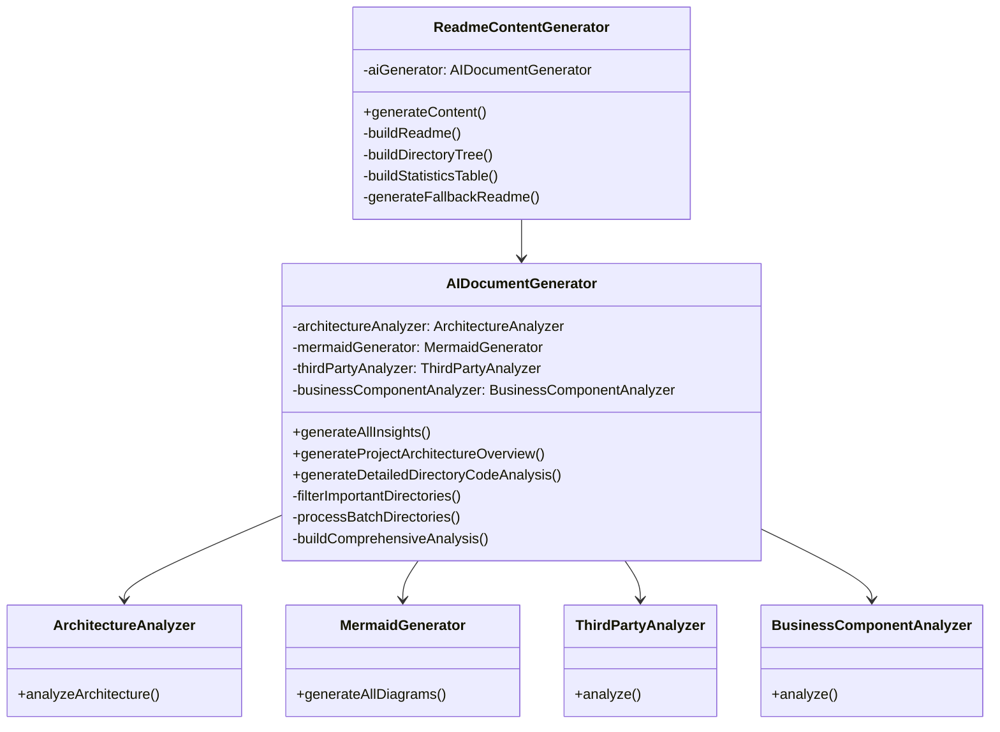
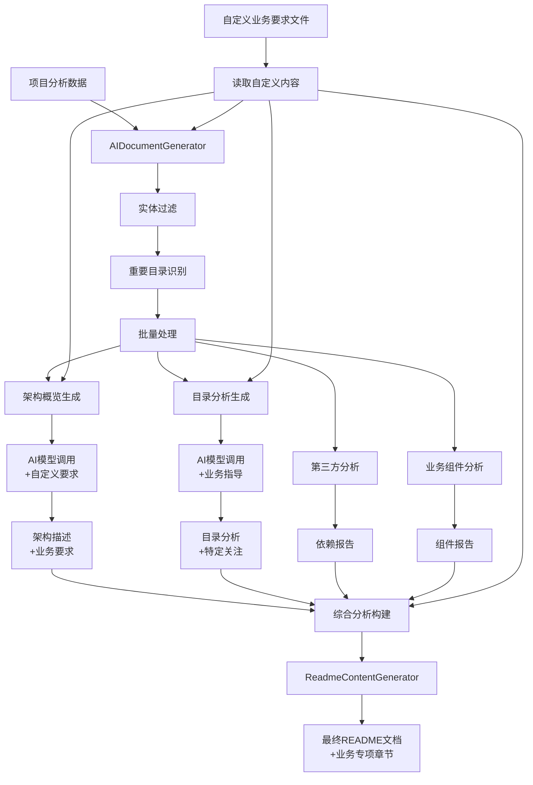
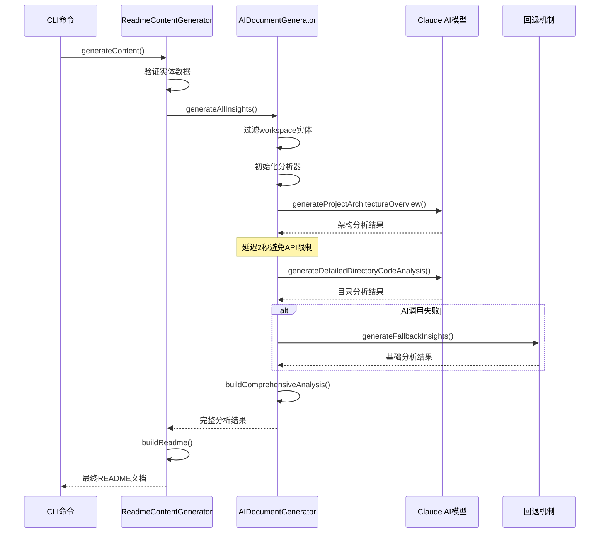
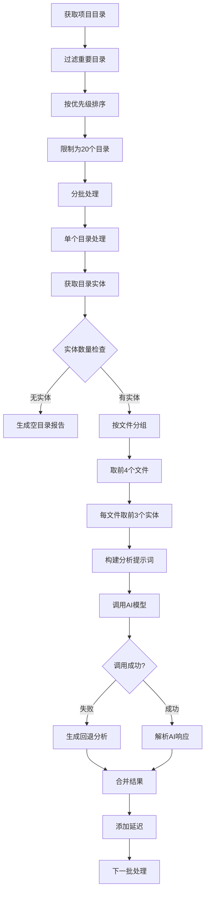
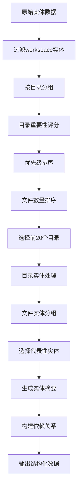

# AI README 生成器架构指南

> 基于 Claude 3.7 Sonnet 的智能代码分析和文档生成工具

## 📋 概述

AI README 生成器是一个基于 AI 大语言模型的项目文档自动化生成工具，通过深度分析项目代码结构、实体关系和业务逻辑，自动生成专业的技术文档。

### 🎯 核心特性

- **🤖 AI 驱动**：基于 Claude 3.7 Sonnet 模型的智能内容生成
- **📊 实体过滤**：智能过滤和优先级排序重要目录
- **🔄 批量处理**：支持大型项目的分批处理和API限流
- **🎨 多元化输出**：架构分析、目录解析、代码示例、Mermaid图表
- **🎯 业务定制**：支持自定义业务要求文件，重点关注特定架构和业务逻辑
- **🛡️ 错误处理**：完善的回退机制和错误恢复

## 🏗️ 核心架构

### 类架构图



### 数据流程图



## 🔧 核心组件解析

### 1. AIDocumentGenerator 类

这是核心的AI文档生成器，负责整个分析和生成流程的协调。

```typescript
export class AIDocumentGenerator {
    private architectureAnalyzer: ArchitectureAnalyzer;
    private mermaidGenerator: MermaidGenerator;
    private thirdPartyAnalyzer: ThirdPartyAnalyzer;
    private businessComponentAnalyzer: BusinessComponentAnalyzer;
    
    constructor() {
        // 延迟初始化，在 generateAllInsights 中完成
    }
}
```

#### 关键方法：

**generateAllInsights()** - 主入口方法
- 过滤workspace实体
- 处理自定义业务要求内容
- 初始化所有分析器
- 生成架构概览（融入自定义要求）
- 生成目录分析（重点关注自定义指导）
- 构建综合分析报告

**generateProjectArchitectureOverview()** - 架构概览生成
- 调用AI模型生成项目架构分析
- 包含DDD分析、架构模式识别、核心类型分析
- 支持错误回退机制

**generateDetailedDirectoryCodeAnalysis()** - 详细目录分析
- 批量处理重要目录
- 为每个目录生成详细的代码分析
- 包含文件结构、代码示例、依赖关系

### 2. 实体过滤机制

#### 重要目录优先级算法

```typescript
private filterImportantDirectories(directories: any[]): any[] {
    // 定义重要目录的优先级
    const priorityKeywords = [
        'src/constants',
        'src/providers', 
        'src/utils',
        'src/hooks',
        'src/components',
        'src/containers',
        'src/services',
        'src/api',
        'src/stores',
        'src/types',
        // ... 更多关键词
    ];
    
    // 先过滤，再按优先级排序
    const filtered = directories.filter(/* 排除node_modules等 */);
    const sortedDirectories = filtered.sort((a, b) => {
        const aScore = getScore(a.path);
        const bScore = getScore(b.path);
        
        // 先按优先级得分排序
        if (aScore !== bScore) {
            return bScore - aScore;
        }
        
        // 然后按文件数量排序
        return (b.fileCount || 0) - (a.fileCount || 0);
    });
    
    return sortedDirectories.slice(0, 20); // 限制为20个目录
}
```

#### 实体过滤逻辑

```typescript
private groupEntitiesByDirectory(entities: BaseEntity[]): Map<string, BaseEntity[]> {
    // 过滤掉workspace实体
    const filteredEntities = entities.filter(entity => entity.isWorkspace === false);
    
    // 按目录分组
    const directoryMap = new Map<string, BaseEntity[]>();
    filteredEntities.forEach(entity => {
        const dir = path.dirname(entity.file);
        if (!directoryMap.has(dir)) {
            directoryMap.set(dir, []);
        }
        directoryMap.get(dir)!.push(entity);
    });
    
    return directoryMap;
}
```

### 3. AI 模型集成

#### 模型配置

```typescript
// 环境配置
process.env.XHS_AWS_BEDROCK_API_KEY = 'aa74edef9cb44aab8a03f37f36197ec6';
const anthropic = createAnthropic({});

// 模型调用
const { text } = await generateText({
    model: anthropic("claude-3-7-sonnet-latest"),
    prompt,
    maxTokens: 4000
});
```

#### 提示词设计

**架构分析提示词结构：**

```typescript
const customSection = customContent ? `

**Special Business Requirements and Guidelines:**
${customContent}

**IMPORTANT:** Please pay special attention to the above business requirements and ensure they are addressed throughout the analysis. These are critical business-specific considerations that should be highlighted and integrated into every relevant section of the analysis.` : '';

const prompt = `You are a senior software architect. Please generate a comprehensive project architecture overview analysis.

Project Information:
- Project Name: ${analysis.projectName}
- Project Type: ${analysis.projectType}
- Technology Stack: ${analysis.technologies.join(', ')}
- Total Files: ${analysis.structure.totalFiles}
- Total Entities: ${filteredEntities.length}

Architecture Analysis:
${JSON.stringify(architectureResult, null, 2)}

Core Types Analysis:
${coreTypesAnalysis}${customSection}

Please analyze from the following perspectives:
## 🏗️ Project Architecture Overview
### 📋 Basic Information
### 🎯 Architecture Pattern Recognition
### 🏛️ DDD (Domain-Driven Design) Analysis
### 📐 Frontend Architecture Features
### 🔧 Core Type System

[详细分析要求...]`;
```

### 4. 批量处理机制

#### 分批处理策略

```typescript
private async processBatchDirectories(
    directories: any[],
    directoryMap: Map<string, BaseEntity[]>,
    analysis: ProjectAnalysis
): Promise<string> {
    const batchSize = 1; // 每批处理1个目录
    let allAnalysisResults = '';
    
    for (let i = 0; i < Math.min(importantDirectories.length, 20); i += batchSize) {
        const batch = importantDirectories.slice(i, i + batchSize);
        const batchAnalysis = await this.processBatchDirectories(batch, directoryMap, analysis);
        allAnalysisResults += batchAnalysis + '\n\n';
        
        // 添加延迟避免API限制
        if (i + batchSize < importantDirectories.length) {
            await new Promise(resolve => setTimeout(resolve, 2000));
        }
    }
    
    return allAnalysisResults;
}
```

#### 错误处理策略

```typescript
try {
    const { text } = await generateText({
        model: anthropic("claude-3-7-sonnet-latest"),
        prompt,
        maxTokens: 3000
    });
    return text;
} catch (error) {
    console.warn(`⚠️ Directory analysis failed for ${dir.path}:`, error);
    return this.generateFallbackDirectoryAnalysis(dir, representativeEntities);
}
```

### 5. 文档构建流程

#### ReadmeContentGenerator 类

```typescript
export class ReadmeContentGenerator {
    private aiGenerator: AIDocumentGenerator;
    
    async generateContent(
        analysis: ProjectAnalysis,
        template: string,
        language: string,
        projectPath?: string
    ): Promise<string> {
        // 1. 提取并验证实体
        const entities = (analysis as any).entities as BaseEntity[] || [];
        
        // 2. 获取AI生成的工程分析内容
        const insights = await this.aiGenerator.generateAllInsights(analysis, actualProjectPath, entities);
        
        // 3. 构建最终README
        return this.buildReadme(analysis, insights, entities);
    }
}
```

#### 文档结构模板

```typescript
private buildReadme(analysis: ProjectAnalysis, insights: AIInsights, entities: BaseEntity[]): string {
    // 添加自定义要求章节（如果提供）
    const customRequirementsSection = customContent ? `
## 🎯 业务特定要求与重点关注

${customContent}

---

` : '';

    return `# ${analysis.projectName} - Code Structure Analysis

## 📊 Project Overview
- **Project Name**: ${analysis.projectName}
- **Project Type**: ${analysis.projectType}
- **Technology Stack**: ${analysis.technologies.slice(0, 8).join(', ')}
- **Architecture Pattern**: ${analysis.architecture.pattern}
- **Total Files**: ${analysis.structure.totalFiles}
- **Total Code Lines**: ${analysis.codeStats.totalLines}
- **Total Entities**: ${filteredEntities.length}

${customRequirementsSection}${projectStructureSection}

## 🗂️ Project Directory Structure
${directoryStructure}

${insights.architectureInsights}

## 📂 Detailed Directory Analysis
${insights.usageGuide}

${insights.developmentGuide}

${statisticsTable}

## 🎯 Project Highlights
[项目亮点分析]

---

*This document is automatically generated by AI, focusing on in-depth analysis of project architecture and code structure. Generated at：${new Date().toLocaleString('en-US')}*
`;
}
```

## 🔄 核心流程详解

### 1. 主要生成流程



### 2. 目录分析流程



### 3. 实体处理流程



## 🎨 输出格式规范

### 1. 架构分析输出

```markdown
## 🏗️ Project Architecture Overview

### 📋 Basic Information
- **Project Name**: 项目名称
- **Project Type**: 项目类型
- **Technology Stack**: 技术栈列表
- **File Scale**: 文件规模
- **Code Entities**: 代码实体数量

### 🎯 Architecture Pattern Recognition
- **Main Architecture**: 主要架构模式
- **Organization**: 组织结构分析
- **Technical Features**: 技术特性描述

### 🏛️ DDD Analysis
- **Domain Identification**: 领域识别
- **Entity Management**: 实体管理
- **Service Layer**: 服务层分析

### 📐 Frontend Architecture Features
- **State Management**: 状态管理方案
- **Component Architecture**: 组件架构
- **Type Safety**: 类型安全保障

### 🔧 Core Type System
- **Type Definition Files**: 类型定义文件
- **Usage Patterns**: 使用模式分析
```

### 2. 目录分析输出

```markdown
## 📁 目录路径

### 🎯 Directory Purpose
- **Primary Role**: 主要作用
- **File Count**: 文件数量
- **Entity Count**: 实体数量
- **Functional Description**: 功能描述

### 📋 File Structure & Entities
#### 📄 文件名
- **Path**: 文件路径
- **Entities**: 实体列表
- **Purpose**: 文件作用

### 💻 Representative Code Examples
#### 1. 实体名称 (类型)
```typescript
// 代码示例
```
**Functionality**: 功能说明

### 📦 Dependencies & Relationships
- **Imported Modules**: 导入模块
- **Function Calls**: 函数调用
- **Component Relations**: 组件关系
```

### 3. 统计信息输出

```markdown
## 📈 Project Statistics

| Metric | Value | Description |
|---------|------|------|
| 📂 Analyzed Directories | 20 | 分析的目录数量 |
| 📄 Total Files | 500 | 总文件数 |
| 📝 Code Lines | 50000 | 代码行数 |
| 🏛️ Architecture Pattern | MVC | 架构模式 |
| 🔍 Total Entities | 1000 | 总实体数 |
```

## ⚙️ 配置与调优

### 1. 关键配置参数

```typescript
// 目录处理配置
const IMPORTANT_DIRECTORIES_LIMIT = 20;  // 重要目录数量限制
const BATCH_SIZE = 1;                   // 批处理大小
const API_DELAY = 2000;                 // API调用延迟(毫秒)

// AI模型配置
const MAX_TOKENS = 4000;                // 最大token数
const MODEL_NAME = "claude-3-7-sonnet-latest";

// 实体过滤配置
const EXCLUDE_PATTERNS = [
    'node_modules', '.git', 'dist', 'build', 
    '.next', '.nuxt', 'coverage', '.nyc_output'
];

// 优先级关键词
const PRIORITY_KEYWORDS = [
    'src/constants', 'src/providers', 'src/utils',
    'src/hooks', 'src/components', 'src/containers',
    'src/services', 'src/api', 'src/stores', 'src/types'
];

// 自定义内容处理配置
const CUSTOM_CONTENT_MAX_SIZE = 10000;      // 自定义文件最大字节数
const CUSTOM_CONTENT_PREVIEW_LENGTH = 200;  // 控制台预览长度
const CUSTOM_SECTION_PRIORITY = 'HIGH';     // 自定义内容优先级
```

### 2. 性能优化策略

#### 内存优化
```typescript
// 实体数据过滤，减少内存占用
const filteredEntities = entities.filter(entity => entity.isWorkspace === false);

// 限制处理的实体数量
const representativeEntities = fileEntries.flatMap(([, entities]) => entities.slice(0, 3));
```

#### API调用优化
```typescript
// 分批处理避免API限制
for (let i = 0; i < Math.min(importantDirectories.length, 20); i += batchSize) {
    const batch = importantDirectories.slice(i, i + batchSize);
    const batchAnalysis = await this.processBatchDirectories(batch, directoryMap, analysis);
    
    // 添加延迟避免API限制
    if (i + batchSize < importantDirectories.length) {
        await new Promise(resolve => setTimeout(resolve, 2000));
    }
}
```

### 3. 错误处理机制

#### 多层回退策略
```typescript
// 1. AI调用失败回退
catch (error) {
    console.warn('⚠️ Architecture overview generation failed:', error);
    return this.generateFallbackArchitectureOverview(analysis, filteredEntities);
}

// 2. 实体为空回退
if (entities.length === 0) {
    console.warn('⚠️ No entities found, unable to generate AI analysis content.');
    return this.generateFallbackReadme(analysis);
}

// 3. 完整失败回退
return this.generateFallbackInsights(analysis, filteredEntities);
```

## 📊 性能指标

### 处理能力矩阵

| 项目规模 | 文件数量 | 实体数量 | 目录数量 | 处理时间 | 内存使用 |
|----------|----------|----------|----------|----------|----------|
| 小型 | < 100 | < 200 | < 10 | 30-60s | < 100MB |
| 中型 | 100-500 | 200-1000 | 10-20 | 60-180s | 100-300MB |
| 大型 | 500-1000 | 1000-2000 | 20-30 | 180-600s | 300-500MB |
| 超大型 | > 1000 | > 2000 | > 30 | 600-1800s | > 500MB |

### API调用统计

```typescript
// 预期API调用次数计算
const expectedAPICalls = Math.min(importantDirectories.length, 20) + 1; // 目录分析 + 架构分析
const estimatedTime = expectedAPICalls * 3; // 每次调用约3秒
const estimatedCost = expectedAPICalls * 0.01; // 每次调用约0.01$
```

## 📚 CLI 命令详解

### 可用命令总览

| 命令 | 描述 | 用途 |
|------|------|------|
| `extract` | 提取项目代码实体 | 分析代码结构，生成实体JSON |
| `validate` | 验证实体JSON文件 | 检查已提取实体的格式和完整性 |
| `generate-readme` | 生成完整README文档 | 创建全新的AI分析文档 |
| `readme` | README生成快捷命令 | `generate-readme`的别名 |
| `patch-readme` | 增量更新README | 保留用户内容，更新自动生成部分 |
| `help-readme` | 显示README帮助 | 查看详细使用说明 |

### 命令详细说明

#### 1. `extract` - 代码实体提取

```bash
parser-agent extract [rootDir] [options]
```

**选项：**

| 选项 | 类型 | 默认值 | 说明 |
|------|------|--------|------|
| `-o, --out <file>` | string | `data/entities.json` | 输出JSON文件路径 |
| `--stats` | boolean | `false` | 显示详细统计信息 |
| `--pretty` | boolean | `true` | 美化JSON输出 |
| `--dry-run` | boolean | `false` | 预览模式，不写入文件 |

**使用示例：**
```bash
# 基本提取
parser-agent extract

# 提取到指定文件并显示统计
parser-agent extract /path/to/project --out ./output/entities.json --stats

# 预览模式（不保存文件）
parser-agent extract --dry-run --stats
```

#### 2. `validate` - 实体文件验证

```bash
parser-agent validate <file>
```

**使用示例：**
```bash
# 验证实体文件
parser-agent validate ./data/entities.json
```

#### 3. `generate-readme` / `readme` - README文档生成

```bash
parser-agent readme [rootDir] [options]
parser-agent generate-readme [rootDir] [options]
```

**选项：**

| 选项 | 类型 | 默认值 | 说明 |
|------|------|--------|------|
| `-o, --output <file>` | string | `ai-readme.md` | 输出README文件路径 |
| `-t, --template <type>` | string | `comprehensive` | 文档模板类型 |
| `-l, --language <lang>` | string | `zh-CN` | 文档语言 |
| `-c, --custom <file>` | string | - | 自定义 markdown 文件路径，用于添加特定业务要求 |
| `--preview` | boolean | `false` | 预览模式，输出到控制台 |
| `--force` | boolean | `false` | 强制覆盖已存在文件 |
| `--verbose` | boolean | `false` | 显示详细生成过程 |

**模板类型：**
- `comprehensive` - 完整详细的README（默认）
- `simple` - 简洁版本的README  
- `technical` - 技术导向的README

**语言选项：**
- `zh-CN` - 中文（默认）
- `en-US` - 英文

**使用示例：**
```bash
# 基本生成（中文，完整模板）
parser-agent readme

# 生成英文文档到指定路径
parser-agent readme -l en-US -o ./docs/ai-readme.en.md

# 预览模式（不保存文件）
parser-agent readme --preview --verbose

# 强制覆盖现有文件
parser-agent readme --force --verbose

# 分析指定项目
parser-agent readme /path/to/project -o /path/to/output.md

# 使用自定义业务要求生成文档
parser-agent readme --custom ./custom.md

# 结合自定义文件和其他选项
parser-agent readme -c ./business-requirements.md -l en-US --preview

# 为特定业务项目生成定制化文档
parser-agent readme /path/to/business/project -c ./custom-business-guide.md --verbose
```

#### 4. `patch-readme` - 增量更新README

```bash
parser-agent patch-readme [rootDir] [options]
```

**选项：**

| 选项 | 类型 | 默认值 | 说明 |
|------|------|--------|------|
| `-o, --output <file>` | string | `ai-readme.md` | 输出README文件路径 |
| `-l, --language <lang>` | string | `zh-CN` | 文档语言 |
| `-c, --custom <file>` | string | - | 自定义 markdown 文件路径，用于添加特定业务要求 |
| `--preview` | boolean | `false` | 预览模式，输出到控制台 |
| `--force` | boolean | `false` | 强制覆盖已存在文件 |
| `--verbose` | boolean | `false` | 显示详细生成过程 |
| `--diff` | boolean | `false` | 显示与现有README的差异 |

**核心特性：**
- ✅ **智能合并**：保留用户自定义章节
- ✅ **自动更新**：更新项目概览、目录结构等自动生成章节
- ✅ **差异显示**：显示详细的变更统计
- ✅ **安全操作**：不会覆盖用户编辑的内容

**使用示例：**
```bash
# 预览增量更新效果
parser-agent patch-readme --preview --diff --verbose

# 应用增量更新
parser-agent patch-readme --verbose

# 查看变更差异
parser-agent patch-readme --diff --preview

# 更新指定项目的README
parser-agent patch-readme /path/to/project --verbose

# 使用自定义业务要求进行增量更新
parser-agent patch-readme --custom ./custom.md --verbose

# 结合自定义文件预览更新效果
parser-agent patch-readme -c ./business-guide.md --preview --diff
```

#### 5. `help-readme` - 详细帮助信息

```bash
parser-agent help-readme
```

显示完整的README生成器使用指南，包括所有选项说明和常见问题解决方案。

### 工作流推荐

#### 首次使用工作流

```bash
# 1. 提取代码实体（可选，用于调试）
parser-agent extract --stats

# 2. 预览README生成效果
parser-agent readme --preview --verbose

# 3. 生成完整README文档
parser-agent readme --force --verbose
```

#### 日常维护工作流

```bash
# 1. 预览增量更新
parser-agent patch-readme --preview --diff

# 2. 应用增量更新
parser-agent patch-readme --verbose

# 3. 检查更新结果
git diff ai-readme.md
```

#### 项目部署工作流

```bash
# 1. 生成多语言文档
parser-agent readme -l zh-CN -o ai-readme.md --force
parser-agent readme -l en-US -o ai-readme.en.md --force

# 2. 验证文档质量
parser-agent readme --preview | head -50

# 3. 提交更新
git add ai-readme*.md
git commit -m "docs: update AI README documentation"
```

#### 业务定制化工作流

```bash
# 1. 创建业务要求文件
cat > business-requirements.md << EOF
# 项目特定要求
## 架构特点
- UI 与逻辑解耦架构
- shared-item 逻辑层重点展示

## 重点关注
- 业务组件的完整性
- 目录结构的清晰性
EOF

# 2. 预览定制化效果
parser-agent readme --custom ./business-requirements.md --preview

# 3. 生成定制化文档
parser-agent readme --custom ./business-requirements.md --force --verbose

# 4. 增量更新保持定制化
parser-agent patch-readme --custom ./business-requirements.md --verbose
```

## 🚀 使用示例

### 1. 基本使用

```bash
# 生成完整README
node dist/cli.js readme /path/to/project --force --verbose

# 预览模式
node dist/cli.js readme /path/to/project --preview

# 自定义输出
node dist/cli.js readme /path/to/project -o custom-readme.md

# 使用自定义业务要求
node dist/cli.js readme /path/to/project --custom ./custom.md --verbose

# 结合自定义文件和预览模式
node dist/cli.js readme /path/to/project -c ./business-guide.md --preview
```

### 2. 编程调用

```typescript
import { ReadmeContentGenerator } from './generators/ai-generator';

const generator = new ReadmeContentGenerator();

// 基本调用
const readme = await generator.generateContent(
    analysis,
    'comprehensive',
    'zh-CN',
    '/path/to/project'
);

// 使用自定义业务要求
const customReadme = await generator.generateContent(
    analysis,
    'comprehensive',
    'zh-CN',
    '/path/to/project',
    './custom-business-requirements.md'
);

console.log(customReadme);
```

### 3. 集成到CI/CD

```yaml
- name: Generate AI README
  run: |
    cd packages/parser-agent
    npm run build
    node dist/cli.js readme /path/to/project --force --verbose
    
- name: Check Changes
  run: |
    if [[ -n $(git status --porcelain) ]]; then
      git add ai-readme.md
      git commit -m "docs: update AI README"
      git push
    fi
```

## 🔮 未来规划

### 短期目标
- [x] 支持自定义业务要求文件
- [ ] 支持自定义提示词模板
- [ ] 增加更多图表类型支持
- [ ] 优化大型项目处理性能
- [ ] 添加增量更新机制
- [ ] 支持多个自定义文件合并

### 长期规划
- [ ] 支持多种AI模型选择
- [ ] 实现智能缓存机制
- [ ] 添加协作编辑功能
- [ ] 开发Web管理界面

---

**版本**: v2.0.0  
**最后更新**: 2025-01-08  
**基于**: ai-generator.ts v2.0.90