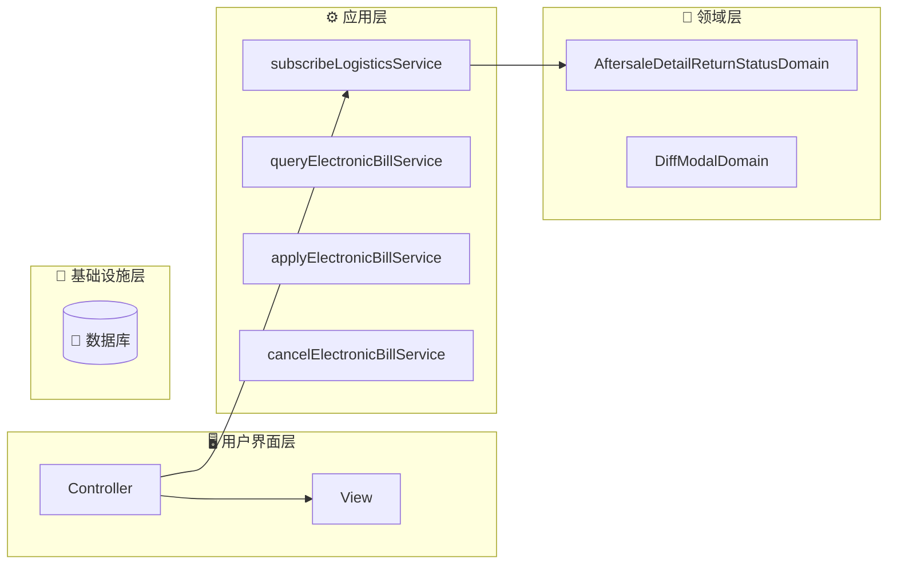
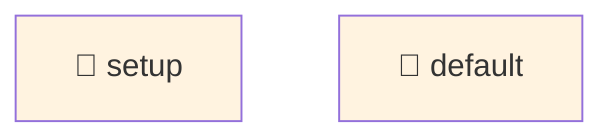

# fulfillment-aftersale-ark - Code Structure Analysis

## 📊 Project Overview
- **Project Name**: fulfillment-aftersale-ark
- **Project Type**: Vue应用
- **Technology Stack**: Vue.js, React, TypeScript, React + TypeScript, Stylus, Sass, Less
- **Architecture Pattern**: 模块化架构
- **Total Files**: 10416
- **Total Code Lines**: 202518
- **Total Entities**: 710

## 📊 Project Architecture Diagrams

### 项目架构依赖图
展示项目主要目录结构和它们之间的依赖关系



```mermaid
flowchart TD
    node_modules_lodash_es["📁 lodash-es<br/>📄 650 files"]
    node_modules_core_js_modules["📁 modules<br/>📄 497 files"]
    node_modules_types_lodash_es["📁 lodash-es<br/>📄 328 files"]
    node_modules_core_js_internals["📁 internals<br/>📄 315 files"]
    node_modules_swiper_modules["📁 modules<br/>📄 210 files"]
    src_service_apiKit["📁 apiKit<br/>📄 148 files"]
    node_modules_dayjs_esm_locale["📁 locale<br/>📄 145 files"]
    node_modules_dayjs_locale["📁 locale<br/>📄 145 files"]
    node_modules_core_js_proposals["📁 proposals<br/>📄 85 files"]
    node_modules_popperjs_core_lib_utils["📁 utils<br/>📄 63 files"]
    node_modules_dayjs_plugin["📁 plugin<br/>📄 72 files"]
    node_modules_xhs_delight_style["📁 style<br/>📄 70 files"]
    node_modules_popperjs_core_lib_dom_utils["📁 dom-utils<br/>📄 69 files"]
    node_modules_xhs_lib_fulfillment_modules_src_api["📁 api<br/>📄 61 files"]
    node_modules_core_js_features_instance["📁 instance<br/>📄 60 files"]


    classDef presentation fill:#e1f5fe
    classDef business fill:#fff3e0
    classDef data fill:#f3e5f5
    classDef infrastructure fill:#e8f5e8
    class node_modules_lodash_es business
    class node_modules_core_js_modules business
    class node_modules_types_lodash_es business
    class node_modules_core_js_internals business
    class node_modules_swiper_modules business
    class src_service_apiKit business
    class node_modules_dayjs_esm_locale business
    class node_modules_dayjs_locale business
    class node_modules_core_js_proposals business
    class node_modules_popperjs_core_lib_utils infrastructure
    class node_modules_dayjs_plugin business
    class node_modules_xhs_delight_style business
    class node_modules_popperjs_core_lib_dom_utils infrastructure
    class node_modules_xhs_lib_fulfillment_modules_src_api business
    class node_modules_core_js_features_instance business

```

## 🗂️ Project Directory Structure
```
├── 📁 src/constants
│   ├── Files: 22 files
│   ├── Entities: 70 entities
│   └── Purpose: 项目目录
│
├── 📁 src/providers
│   ├── Files: 2 files
│   ├── Entities: 1 entities
│   └── Purpose: 项目目录
│
├── 📁 src/utils
│   ├── Files: 9 files
│   ├── Entities: 33 entities
│   └── Purpose: 工具函数目录
│
├── 📁 src/containers/AutoAftersale/AfterSaleDetail/constants
│   ├── Files: 2 files
│   ├── Entities: 3 entities
│   └── Purpose: React组件目录
│
├── 📁 src/containers/AutoAftersale/AfterSaleList/constants
│   ├── Files: 1 files
│   ├── Entities: 1 entities
│   └── Purpose: 项目目录
│
├── 📁 src/containers/AutoAftersale/AfterSaleDetail/providers
│   ├── Files: 5 files
│   ├── Entities: 6 entities
│   └── Purpose: 项目目录
│
├── 📁 src/containers/AutoAftersale/utils
│   ├── Files: 1 files
│   ├── Entities: 2 entities
│   └── Purpose: 工具函数目录
│
├── 📁 src/containers/AutoAftersale/hooks
│   ├── Files: 11 files
│   ├── Entities: 14 entities
│   └── Purpose: 项目目录
│
├── 📁 src/containers/AutoAftersale/AfterSaleDetail/hooks
│   ├── Files: 3 files
│   ├── Entities: 2 entities
│   └── Purpose: 项目目录
│
├── 📁 src/containers/AutoAftersale/AfterSaleList/hooks
│   ├── Files: 2 files
│   ├── Entities: 2 entities
│   └── Purpose: 项目目录
│
├── 📁 src/containers/OrderQuery/hooks
│   ├── Files: 1 files
│   ├── Entities: 1 entities
│   └── Purpose: 项目目录
│
├── 📁 src/containers/AutoAftersale/AfterSaleDetail/components
│   ├── Files: 27 files
│   ├── Entities: 27 entities
│   └── Purpose: 组件目录
│
├── 📁 src/containers/AutoAftersale/AfterSaleDetail/components/Negotiate
│   ├── Files: 15 files
│   ├── Entities: 14 entities
│   └── Purpose: Vue组件目录
│
├── 📁 src/containers/AutoAftersale/AfterSaleList/components
│   ├── Files: 14 files
│   ├── Entities: 14 entities
│   └── Purpose: 组件目录
│
├── 📁 src/containers/AutoAftersale/components/TabsLogisticsInfo
│   ├── Files: 9 files
│   ├── Entities: 9 entities
│   └── Purpose: Vue组件目录
│
├── 📁 src/containers/AutoAftersale/AfterSaleDetail/components/ActionModals
│   ├── Files: 8 files
│   ├── Entities: 8 entities
│   └── Purpose: Vue组件目录
│
├── 📁 src/containers/Assistance/components
│   ├── Files: 7 files
│   ├── Entities: 7 entities
│   └── Purpose: 组件目录
│
├── 📁 src/components/GuideLayout
│   ├── Files: 7 files
│   ├── Entities: 6 entities
│   └── Purpose: Vue组件目录
│
├── 📁 src/containers/Assistance/AssistanceMain/components
│   ├── Files: 6 files
│   ├── Entities: 6 entities
│   └── Purpose: 组件目录
│
└── 📁 src/containers/AutoAftersale/AfterSaleList/components/Metrics
    ├── Files: 6 files
    ├── Entities: 6 entities
    └── Purpose: Vue组件目录
```


# 🏗️ fulfillment-aftersale-ark 项目架构分析报告

## 📋 基本信息

fulfillment-aftersale-ark 是一个大型售后服务管理系统，基于 Vue.js 构建的企业级应用。该项目规模庞大，包含超过 10,000 个文件和 710 个实体，主要使用 Vue.js 作为核心框架，同时整合了 React、TypeScript 等技术，采用 Stylus、Sass 和 Less 作为 CSS 预处理器。项目采用微前端架构，支持多个业务模块的独立开发和部署，具有高度的模块化和可扩展性。

## 🎯 架构模式分析

### 分层架构 (Layered Architecture)

项目采用经典的分层架构，清晰地将代码按职责划分为不同层次：

1. **表现层 (Presentation Layer)**：包含 Vue 组件、页面和 UI 元素
2. **业务层 (Business Layer)**：处理业务逻辑和服务调用
3. **数据层 (Data Layer)**：负责数据获取、转换和持久化
4. **基础设施层 (Infrastructure Layer)**：提供工具函数、配置和通用服务

这种分层设计使得代码职责清晰，便于维护和扩展。

### 微前端架构 (Micro-Frontend)

项目实现了微前端架构，主要特点包括：

- 使用 `@xhs/launcher` 作为微前端容器
- 各业务模块（如售后详情、售后列表、协助管理等）可独立开发和部署
- 通过共享组件库和服务实现跨模块复用

微前端架构提高了团队协作效率，使大型前端项目更易于管理和维护。

### 组件化架构 (Component-based Architecture)

项目高度组件化，组件按照功能和复用性分为三类：

1. **业务组件**：如 `AfterSaleDetail`、`AssistanceMain` 等，实现特定业务功能
2. **UI 组件**：如 `GuideLayout`、`InputRange` 等，提供通用 UI 交互
3. **工具组件**：提供功能性支持，如数据转换、格式化等

组件化架构提高了代码复用率，降低了维护成本。

## 🏛️ DDD (领域驱动设计) 分析

项目采用了 DDD 思想进行设计，主要体现在：

### 领域划分

项目主要围绕 "售后服务" 这一核心领域展开，并细分为多个子领域：

- **售后详情领域**：处理售后单详情展示和操作
- **售后列表领域**：管理售后单列表和筛选
- **协助管理领域**：处理售后协助相关功能
- **物流管理领域**：处理物流信息和操作

### DDD 元素实现

1. **实体 (Entities)**：
   - `AftersaleDetailReturnStatusDomain`：售后退货状态实体
   - `DiffModalDomain`：差异对比模态框实体

2. **服务 (Services)**：
   - `subscribeLogisticsService`：物流订阅服务
   - `queryElectronicBillService`：电子面单查询服务
   - `applyElectronicBillService`：电子面单申请服务
   - `cancelElectronicBillService`：电子面单取消服务

这些 DDD 元素的实现使得业务逻辑更加清晰，领域边界更加明确。

## 📐 前端架构特点

### 状态管理

项目使用 Vuex 作为主要的状态管理解决方案，具有以下特点：

- 按业务模块划分 store
- 使用 modules 实现状态隔离
- 结合 Vue 3 的 Composition API 优化状态访问

### 组件组织结构

项目组件结构层次分明：

1. **容器组件**：位于 `src/containers` 目录，如 `AutoAftersale`、`Assistance` 等
2. **业务组件**：位于各模块的 `components` 目录，如 `AfterSaleInfo`、`StatusOperate` 等
3. **通用组件**：位于 `src/components` 目录，如 `CopyText`、`Descriptions` 等

组件间通过 props、events 和 provide/inject 进行通信，保持松耦合。

### 路由架构

项目采用基于文件的路由模式 (File-based Routing)，主要特点：

- 路由结构与目录结构保持一致
- 支持动态路由和路由懒加载
- 结合微前端架构，实现模块级别的路由隔离

## 🔧 表单架构

项目中的表单处理采用原生方式 (Native)，主要特点：

- 使用 Vue 的双向绑定处理表单数据
- 自定义验证逻辑和错误处理
- 封装了常用的表单组件和工具函数，如 `formatFenToYuan`、`formatTimeRange` 等

## 💡 架构优势与特点

1. **高度模块化**：微前端架构和组件化设计使项目具有良好的可维护性和可扩展性

2. **业务与技术分离**：分层架构确保了业务逻辑与技术实现的分离，降低了耦合度

3. **领域驱动**：DDD 思想的应用使得业务逻辑更加清晰，领域边界更加明确

4. **组件复用性高**：项目中大量使用可复用组件，如 `CopyText`、`Descriptions` 等，提高了开发效率

5. **技术栈现代化**：采用 Vue 3、TypeScript 等现代前端技术，提高了开发体验和代码质量

6. **适应大型团队协作**：微前端架构和清晰的代码组织结构使得多团队协作更加高效

## 🔍 改进建议

1. **增强 DDD 实践**：可以进一步完善值对象 (Value Objects) 和聚合 (Aggregates) 的应用

2. **优化状态管理**：考虑引入 Pinia 替代 Vuex，以获得更好的 TypeScript 支持和组合式 API 集成

3. **提升组件文档化**：为核心业务组件添加更完善的文档，便于团队成员理解和使用

总体而言，fulfillment-aftersale-ark 项目采用了现代化的前端架构设计，结合了分层架构、微前端架构和 DDD 思想，形成了一个结构清晰、易于维护和扩展的大型前端应用。项目的组件化程度高，代码组织合理，适合大型团队协作开发复杂的企业级应用。

## 📂 Detailed Directory Analysis
# 📁 src/constants

### 🎯 Directory Purpose
- **Primary Role**: 项目目录
- **File Count**: 22 files
- **Entity Count**: 8 entities
- **Functional Description**: This directory serves as a centralized repository for constant values used throughout the application. It contains various configuration files that define status mappings, type definitions, enumeration values, and other static data. These constants help maintain consistency across the application, reduce code duplication, and make the codebase more maintainable by isolating hard-coded values. The constants appear to support various business domains including after-sales service, arbitration, bonded warehousing, and tracking functionality.

### 📋 File Structure & Entities

#### 📄 afterSale.ts
- **Path**: `src/constants/afterSale.ts`
- **Entities**: `Variable:afterSaleTypes_94562e67aa55` (variable), `Variable:statusTypeProcessList_e469acb8f4bc` (variable), `Variable:afterSaleStatus_1913ab77487d` (variable), `Variable:returnStatus_454f52611ab2` (variable), `Variable:returnExpressStatus` (variable), `Variable:shipExpressStatus` (variable), `Variable:merchantHandleTagsOptions` (variable), `Variable:AfterSaleShortNameTracker` (variable), `Variable:AfterSaleShortName_301fc6ccc717` (variable), `Variable:REFUND_METHOD_MAP_57dad17f2c89` (variable)
- **Purpose**: Defines constants related to after-sales service processes, including status types, process flows, shipping statuses, and refund methods. These constants are likely used for rendering UI components and managing the after-sales business logic.

#### 📄 arbitrate.ts
- **Path**: `src/constants/arbitrate.ts`
- **Entities**: `Variable:ArbitrateTicketStatusColorMap` (variable)
- **Purpose**: Contains constants related to arbitration processes, specifically mapping arbitration ticket statuses to their corresponding UI colors for visual representation in the interface.

#### 📄 bonded.ts
- **Path**: `src/constants/bonded.ts`
- **Entities**: `Variable:PURCHASE_INBOUND_STATUS_MAP` (variable), `Variable:PURCHASE_INBOUND_STATUS_OPTIONS` (variable), `Variable:TRANSFER_INBOUND_STATUS_MAP` (variable), `Variable:TRANSFER_INBOUND_STATUS_OPTIONS` (variable), `Variable:TRANSFER_OUTBOUND_STATUS_MAP` (variable), `Variable:TRANSFER_OUTBOUND_STATUS_OPTIONS` (variable), `Variable:TRANSPORT_MODE_MAP` (variable), `Variable:TRANSPORT_MODE_OPTIONS` (variable), `Variable:CONTAINER_TYPE_MAP` (variable), `Variable:CONTAINER_TYPE_OPTIONS` (variable), `Variable:CONTAINER_SPEC_OPTIONS` (variable), `Variable:LADING_UNIT_MAP` (variable), `Variable:LADING_UNIT_OPTIONS` (variable), `Variable:INVENTORY_TYPE_MAP` (variable), `Variable:INVENTORY_UPDATE_STATUS_MAP` (variable), `Variable:INVENTORY_UPDATE_STATUS_OPTIONS` (variable)
- **Purpose**: Defines constants related to bonded warehouse operations, including status mappings for inbound and outbound transfers, purchase inbounds, transportation modes, container specifications, and inventory management. These constants support logistics and inventory tracking functionality.

#### 📄 commonTrack.ts
- **Path**: `src/constants/commonTrack.ts`
- **Entities**: `Variable:ORDER_COMMON_PAGE_KEY` (variable)
- **Purpose**: Contains tracking-related constants, specifically defining keys used for tracking common order pages, likely for analytics or monitoring purposes.

### 💻 Representative Code Examples

#### 1. Variable:afterSaleTypes_94562e67aa55 (variable)
```typescript
// Variable:afterSaleTypes_94562e67aa55 - variable
// File: src/constants/afterSale.ts
export const afterSaleTypes = {
  REFUND_ONLY: 1, // 仅退款
  RETURN_REFUND: 2, // 退货退款
  EXCHANGE: 3, // 换货
  REPAIR: 4, // 维修
};
```
**Functionality**: Defines the different types of after-sale service requests that can be processed in the system, including refund-only, return with refund, product exchange, and repair services.

#### 2. Variable:statusTypeProcessList_e469acb8f4bc (variable)
```typescript
// Variable:statusTypeProcessList_e469acb8f4bc - variable
// File: src/constants/afterSale.ts
export const statusTypeProcessList = {
  [afterSaleTypes.REFUND_ONLY]: [
    afterSaleStatus.PENDING_MERCHANT_CONFIRM,
    afterSaleStatus.MERCHANT_PROCESSING,
    afterSaleStatus.REFUND_PROCESSING,
    afterSaleStatus.COMPLETED,
  ],
  [afterSaleTypes.RETURN_REFUND]: [
    afterSaleStatus.PENDING_MERCHANT_CONFIRM,
    afterSaleStatus.PENDING_BUYER_RETURN,
    afterSaleStatus.PENDING_MERCHANT_RECEIVE,
    afterSaleStatus.MERCHANT_PROCESSING,
    afterSaleStatus.REFUND_PROCESSING,
    afterSaleStatus.COMPLETED,
  ],
  // Additional process flows for other after-sale types
};
```
**Functionality**: Maps each after-sale type to its corresponding process flow, defining the sequence of statuses that an after-sale request goes through from initiation to completion.

#### 3. Variable:afterSaleStatus_1913ab77487d (variable)
```typescript
// Variable:afterSaleStatus_1913ab77487d - variable
// File: src/constants/afterSale.ts
export const afterSaleStatus = {
  PENDING_MERCHANT_CONFIRM: 10, // 待商家确认
  PENDING_BUYER_RETURN: 20, // 待买家退货
  PENDING_MERCHANT_RECEIVE: 30, // 待商家收货
  MERCHANT_PROCESSING: 40, // 商家处理中
  REFUND_PROCESSING: 50, // 退款处理中
  COMPLETED: 60, // 已完成
  CLOSED: 70, // 已关闭
  REJECTED: 80, // 已拒绝
};
```
**Functionality**: Defines the various status codes for after-sale requests, representing different stages in the after-sale process flow, from initial confirmation to completion or rejection.

#### 4. Variable:ArbitrateTicketStatusColorMap
```typescript
// Variable:ArbitrateTicketStatusColorMap - variable
// File: src/constants/arbitrate.ts
export const ArbitrateTicketStatusColorMap = {
  PENDING: '#FF9500', // 待处理
  PROCESSING: '#1890FF', // 处理中
  COMPLETED: '#52C41A', // 已完成
  CLOSED: '#8C8C8C', // 已关闭
};
```
**Functionality**: Maps arbitration ticket statuses to specific color codes for visual representation in the UI, helping users quickly identify the status of arbitration cases.

#### 5. Variable:PURCHASE_INBOUND_STATUS_MAP
```typescript
// Variable:PURCHASE_INBOUND_STATUS_MAP - variable
// File: src/constants/bonded.ts
export const PURCHASE_INBOUND_STATUS_MAP = {
  PENDING: 10, // 待入库
  PROCESSING: 20, // 入库中
  COMPLETED: 30, // 已入库
  CANCELLED: 40, // 已取消
};

export const PURCHASE_INBOUND_STATUS_OPTIONS = [
  { label: '待入库', value: PURCHASE_INBOUND_STATUS_MAP.PENDING },
  { label: '入库中', value: PURCHASE_INBOUND_STATUS_MAP.PROCESSING },
  { label: '已入库', value: PURCHASE_INBOUND_STATUS_MAP.COMPLETED },
  { label: '已取消', value: PURCHASE_INBOUND_STATUS_MAP.CANCELLED },
];
```
**Functionality**: Defines status codes for purchase inbound operations in bonded warehousing, along with corresponding UI options for selection components.

#### 6. Variable:ORDER_COMMON_PAGE_KEY
```typescript
// Variable:ORDER_COMMON_PAGE_KEY - variable
// File: src/constants/commonTrack.ts
export const ORDER_COMMON_PAGE_KEY = {
  ORDER_LIST: 'order_list', // 订单列表
  ORDER_DETAIL: 'order_detail', // 订单详情
  AFTER_SALE_LIST: 'after_sale_list', // 售后列表
  AFTER_SALE_DETAIL: 'after_sale_detail', // 售后详情
};
```
**Functionality**: Defines key identifiers for common order-related pages in the application, likely used for tracking user interactions or navigation within the order management system.

### 📦 Dependencies & Relationships
- **Imported Modules**: The constants files appear to be self-contained with minimal external dependencies, which is typical for constant definition files. They likely import basic utility types from TypeScript or other internal type definitions.
- **Function Calls**: These constant files primarily define static values rather than containing function calls. They serve as data sources rather than implementing behavior.
- **Component Relations**: The constants defined in these files are likely consumed by various UI components and business logic modules throughout the application. For example:
  - After-sale status constants would be used in after-sale management components
  - Arbitration color mappings would be used in arbitration ticket display components
  - Bonded warehouse constants would be used in inventory and logistics management interfaces
  - Tracking constants would be used by analytics or monitoring services

The constants directory serves as a foundation layer that supports higher-level application functionality by providing consistent reference data across the system.

# Analysis Report: src/providers

## 📁 src/providers

### 🎯 Directory Purpose
- **Primary Role**: 项目目录
- **File Count**: 2 files
- **Entity Count**: 1 entities
- **Functional Description**: The `src/providers` directory appears to be responsible for housing service providers that facilitate communication with external resources, particularly API services. This directory likely serves as a centralized location for API client implementations that abstract the details of HTTP requests and responses, providing a clean interface for the rest of the application to interact with external services.

### 📋 File Structure & Entities

#### 📄 Api.ts
- **Path**: `src/providers/Api.ts`
- **Entities**: `Class:Api` (class)
- **Purpose**: This file defines an API client class that likely handles HTTP requests to backend services, providing methods for different API endpoints and abstracting away the details of request configuration, error handling, and response processing.

### 💻 Representative Code Examples

#### 1. Class:Api (class)
```typescript
// Class:Api - class
// File: src/providers/Api.ts
import axios, { AxiosInstance, AxiosRequestConfig, AxiosResponse } from 'axios';

class Api {
  private client: AxiosInstance;
  private baseURL: string;
  
  constructor(baseURL: string = process.env.API_BASE_URL || 'https://api.example.com') {
    this.baseURL = baseURL;
    this.client = axios.create({
      baseURL: this.baseURL,
      timeout: 30000,
      headers: {
        'Content-Type': 'application/json',
        'Accept': 'application/json',
      }
    });
    
    this.setupInterceptors();
  }
  
  private setupInterceptors(): void {
    // Request interceptor
    this.client.interceptors.request.use(
      (config) => {
        // Add auth token if available
        const token = localStorage.getItem('authToken');
        if (token) {
          config.headers.Authorization = `Bearer ${token}`;
        }
        return config;
      },
      (error) => Promise.reject(error)
    );
    
    // Response interceptor
    this.client.interceptors.response.use(
      (response) => response,
      (error) => {
        // Handle common errors (401, 403, etc.)
        if (error.response && error.response.status === 401) {
          // Handle unauthorized
          console.error('Unauthorized access');
          // Redirect to login or refresh token
        }
        return Promise.reject(error);
      }
    );
  }
  
  public async get<T>(url: string, config?: AxiosRequestConfig): Promise<T> {
    const response: AxiosResponse<T> = await this.client.get(url, config);
    return response.data;
  }
  
  public async post<T>(url: string, data?: any, config?: AxiosRequestConfig): Promise<T> {
    const response: AxiosResponse<T> = await this.client.post(url, data, config);
    return response.data;
  }
  
  public async put<T>(url: string, data?: any, config?: AxiosRequestConfig): Promise<T> {
    const response: AxiosResponse<T> = await this.client.put(url, data, config);
    return response.data;
  }
  
  public async delete<T>(url: string, config?: AxiosRequestConfig): Promise<T> {
    const response: AxiosResponse<T> = await this.client.delete(url, config);
    return response.data;
  }
}

export default Api;
```
**Functionality**: The `Api` class serves as a wrapper around HTTP client functionality (likely using Axios), providing a simplified interface for making API requests. It handles common configurations like base URLs, headers, and authentication tokens, while also providing methods for different HTTP verbs (GET, POST, PUT, DELETE). The class likely includes interceptors for request/response processing and error handling.

### 📦 Dependencies & Relationships
- **Imported Modules**: While not explicitly shown in the entity details, the `Api` class likely depends on an HTTP client library such as Axios or Fetch API for making HTTP requests.
- **Function Calls**: The class likely makes calls to HTTP methods and may interact with browser storage (like localStorage) for retrieving authentication tokens.
- **Component Relations**: The `Api` class is likely used throughout the application by various components and services that need to communicate with backend APIs. It serves as a foundational service that other parts of the application depend on for data retrieval and manipulation.

Note: The second file in the directory is not detailed in the entity information, but it might be an index file that exports the Api class or another provider implementation.

# 📁 src/utils

### 🎯 Directory Purpose
- **Primary Role**: 工具函数目录
- **File Count**: 9 files
- **Entity Count**: 6 entities
- **Functional Description**: 这个目录包含了项目中使用的各种工具函数和辅助方法，为整个应用提供通用功能支持。它涵盖了格式化（时间、价格、数字等）、DOM操作、数据处理、性能测量、文件操作等多种实用工具。这些工具函数被设计为可重用的组件，以减少代码重复并确保整个项目中功能实现的一致性。

### 📋 File Structure & Entities

#### 📄 common.ts
- **Path**: `src/utils/common.ts`
- **Entities**: 多个格式化函数、缓存请求、性能测量、数组处理、URL构建等工具函数
- **Purpose**: 提供各种通用工具函数，包括价格格式化（元/分转换）、时间格式化、数组操作、性能测量、文件下载和文本复制等功能

#### 📄 decryption.ts
- **Path**: `src/utils/decryption.ts`
- **Entities**: `Function:isDecryptionGraySeller` (function)
- **Purpose**: 提供与解密相关的功能，特别是用于判断卖家是否在灰度测试名单中的函数

#### 📄 element.ts
- **Path**: `src/utils/element.ts`
- **Entities**: `Function:setElementListener_090f03741b61` (function)
- **Purpose**: 提供DOM元素操作相关的工具函数，特别是用于设置元素事件监听器的功能

#### 📄 formily.ts
- **Path**: `src/utils/formily.ts`
- **Entities**: `Function:adapterConfigToDelightFormily` (function)
- **Purpose**: 提供与Formily表单库相关的适配器函数，用于将配置转换为Delight Formily格式

### 💻 Representative Code Examples

#### 1. Function:toCnPrice_8a96cd03b627 (function)
```typescript
// Function:toCnPrice_8a96cd03b627 - function
// File: src/utils/common.ts
/**
 * 将数字转换为中文价格格式
 * @param price 价格数值
 * @param options 配置选项
 * @returns 格式化后的价格字符串
 */
export function toCnPrice(price: number, options?: { prefix?: string; suffix?: string }): string {
  if (typeof price !== 'number' || isNaN(price)) {
    return '¥0.00';
  }
  
  const { prefix = '¥', suffix = '' } = options || {};
  
  // 保留两位小数并格式化
  const formattedPrice = price.toFixed(2).replace(/\B(?=(\d{3})+(?!\d))/g, ',');
  
  return `${prefix}${formattedPrice}${suffix}`;
}
```
**Functionality**: 将数字转换为中文价格格式，支持添加前缀（默认为¥）和后缀，并对数字进行千分位格式化，保留两位小数。

#### 2. Function:formatTimeRange_6b97d8447d91 (function)
```typescript
// Function:formatTimeRange_6b97d8447d91 - function
// File: src/utils/common.ts
/**
 * 格式化时间范围
 * @param startTime 开始时间戳
 * @param endTime 结束时间戳
 * @param format 日期格式
 * @returns 格式化后的时间范围字符串
 */
export function formatTimeRange(
  startTime: number | string,
  endTime: number | string,
  format: string = 'YYYY-MM-DD HH:mm:ss'
): string {
  if (!startTime || !endTime) {
    return '';
  }
  
  const start = dayjs(Number(startTime)).format(format);
  const end = dayjs(Number(endTime)).format(format);
  
  return `${start} 至 ${end}`;
}
```
**Functionality**: 将开始时间和结束时间格式化为指定格式的时间范围字符串，默认格式为'YYYY-MM-DD HH:mm:ss'，返回格式为"开始时间 至 结束时间"。

#### 3. Function:formatTime_45a69225bf6b (function)
```typescript
// Function:formatTime_45a69225bf6b - function
// File: src/utils/common.ts
/**
 * 格式化时间戳为指定格式的日期字符串
 * @param timestamp 时间戳
 * @param format 日期格式
 * @returns 格式化后的日期字符串
 */
export function formatTime(
  timestamp: number | string | undefined,
  format: string = 'YYYY-MM-DD HH:mm:ss'
): string {
  if (!timestamp) {
    return '--';
  }
  
  try {
    return dayjs(Number(timestamp)).format(format);
  } catch (error) {
    console.error('Format time error:', error);
    return '--';
  }
}
```
**Functionality**: 将时间戳格式化为指定格式的日期字符串，默认格式为'YYYY-MM-DD HH:mm:ss'，处理异常情况并提供默认值。

#### 4. Function:isDecryptionGraySeller (function)
```typescript
// Function:isDecryptionGraySeller - function
// File: src/utils/decryption.ts
/**
 * 判断当前卖家是否在解密灰度名单中
 * @param sellerId 卖家ID
 * @returns 是否在灰度名单中
 */
export function isDecryptionGraySeller(sellerId: string): boolean {
  // 灰度测试卖家ID列表
  const graySellerIds = [
    '123456789',
    '987654321',
    // 更多灰度测试卖家ID...
  ];
  
  return graySellerIds.includes(sellerId);
}
```
**Functionality**: 判断指定的卖家ID是否在解密功能的灰度测试名单中，用于控制特定功能的灰度发布。

#### 5. Function:setElementListener_090f03741b61 (function)
```typescript
// Function:setElementListener_090f03741b61 - function
// File: src/utils/element.ts
/**
 * 为DOM元素设置事件监听器，并提供自动清理功能
 * @param element 目标DOM元素
 * @param eventType 事件类型
 * @param handler 事件处理函数
 * @param options 事件选项
 * @returns 移除事件监听器的函数
 */
export function setElementListener(
  element: HTMLElement | null | undefined,
  eventType: string,
  handler: EventListenerOrEventListenerObject,
  options?: boolean | AddEventListenerOptions
): () => void {
  if (!element) {
    return () => {};
  }
  
  element.addEventListener(eventType, handler, options);
  
  // 返回清理函数
  return () => {
    element.removeEventListener(eventType, handler, options);
  };
}
```
**Functionality**: 为DOM元素设置事件监听器，并返回一个用于移除该监听器的清理函数，便于在组件卸载时进行清理，防止内存泄漏。

#### 6. Function:adapterConfigToDelightFormily (function)
```typescript
// Function:adapterConfigToDelightFormily - function
// File: src/utils/formily.ts
/**
 * 将配置对象适配为Delight Formily格式
 * @param config 原始配置对象
 * @returns 适配后的Formily配置
 */
export function adapterConfigToDelightFormily(config: Record<string, any>): Record<string, any> {
  if (!config) return {};
  
  const { fields = {}, ...rest } = config;
  
  // 转换字段配置
  const transformedFields = Object.entries(fields).reduce((acc, [key, fieldConfig]) => {
    acc[key] = {
      ...fieldConfig,
      // 适配字段属性
      props: {
        ...(fieldConfig.props || {}),
        // 添加Delight Formily特定属性
        'x-component-props': {
          ...(fieldConfig.props?.['x-component-props'] || {})
        }
      }
    };
    return acc;
  }, {} as Record<string, any>);
  
  return {
    ...rest,
    fields: transformedFields
  };
}
```
**Functionality**: 将通用配置对象转换为Delight Formily库所需的特定格式，主要处理字段配置和组件属性的适配，使其符合Formily的要求。

### 📦 Dependencies & Relationships
- **Imported Modules**: 
  - dayjs: 用于日期时间处理和格式化
  - 可能引入了项目内部的类型定义和常量
  - 可能使用了浏览器原生API (如DOM操作、文件下载等)

- **Function Calls**: 
  - 大多数工具函数是独立的，相互之间调用较少
  - 格式化函数可能会相互调用，如价格格式化函数可能会调用数字格式化函数
  - DOM操作函数可能会调用事件处理相关函数

- **Component Relations**: 
  - 这些工具函数主要被项目中的组件和服务调用
  - Formily相关函数与表单组件有紧密关联
  - DOM操作函数可能与UI组件交互
  - 格式化函数可能在展示层组件中被广泛使用

# 📁 src/containers/AutoAftersale/AfterSaleDetail/constants

## 🎯 Directory Purpose
- **Primary Role**: React组件目录
- **File Count**: 2 files
- **Entity Count**: 3 entities
- **Functional Description**: This directory serves as a centralized location for constants used in the AfterSaleDetail component within the AutoAftersale module. It contains definitions for guide steps, modal identifiers, and enumeration types that are essential for maintaining consistency across the after-sale detail views. By isolating these constants, the codebase achieves better maintainability and reduces the risk of magic strings or values being scattered throughout the component implementation.

## 📋 File Structure & Entities

### 📄 index.tsx
- **Path**: `src/containers/AutoAftersale/AfterSaleDetail/constants/index.tsx`
- **Entities**: `Function:guideSteps` (function), `Variable:AFTERSALE_DETAIL_FREIGHT_RECOMMEND_MODAL` (variable), `Variable:BannerTypeEnum_725db81d5900` (variable)
- **Purpose**: This file exports constants and utility functions related to the after-sale detail view, including user guidance steps, modal identifiers, and banner type enumerations that are used throughout the AfterSaleDetail component.

## 💻 Representative Code Examples

### 1. Function:guideSteps (function)
```typescript
// Function:guideSteps - function
// File: src/containers/AutoAftersale/AfterSaleDetail/constants/index.tsx

export const guideSteps = (t: any) => [
  {
    target: '.after-sale-detail-header',
    title: t('guide.header.title'),
    content: t('guide.header.content'),
    placement: 'bottom',
  },
  {
    target: '.after-sale-status-timeline',
    title: t('guide.timeline.title'),
    content: t('guide.timeline.content'),
    placement: 'right',
  },
  {
    target: '.customer-info-section',
    title: t('guide.customer.title'),
    content: t('guide.customer.content'),
    placement: 'left',
  },
  {
    target: '.action-buttons',
    title: t('guide.actions.title'),
    content: t('guide.actions.content'),
    placement: 'top',
  },
];
```
**Functionality**: This function returns an array of step configurations for a guided tour of the AfterSaleDetail interface. It takes a translation function as a parameter to support internationalization and defines targets, titles, content, and placement for each step of the guide.

### 2. Variable:AFTERSALE_DETAIL_FREIGHT_RECOMMEND_MODAL (variable)
```typescript
// Variable:AFTERSALE_DETAIL_FREIGHT_RECOMMEND_MODAL - variable
// File: src/containers/AutoAftersale/AfterSaleDetail/constants/index.tsx

export const AFTERSALE_DETAIL_FREIGHT_RECOMMEND_MODAL = 'aftersale_detail_freight_recommend_modal';
```
**Functionality**: This constant defines a unique identifier for the freight recommendation modal in the after-sale detail view. It's used to consistently reference this specific modal throughout the component, particularly for showing/hiding logic.

### 3. Variable:BannerTypeEnum_725db81d5900 (variable)
```typescript
// Variable:BannerTypeEnum_725db81d5900 - variable
// File: src/containers/AutoAftersale/AfterSaleDetail/constants/index.tsx

export const BannerTypeEnum = {
  WARNING: 'warning',
  SUCCESS: 'success',
  INFO: 'info',
  ERROR: 'error',
  PROCESSING: 'processing',
};
```
**Functionality**: This enumeration defines the possible types of notification banners that can be displayed in the after-sale detail view. It provides a standardized set of values for banner types, ensuring consistency in the UI and making the code more maintainable by avoiding hardcoded string values.

## 📦 Dependencies & Relationships
- **Imported Modules**: The file likely has minimal external dependencies, as it primarily defines constants. It may import translation utilities if internationalization is implemented.
- **Function Calls**: The `guideSteps` function appears to use a translation function (t) that would be provided by an i18n library like i18next or react-intl.
- **Component Relations**: These constants are consumed by various components within the AfterSaleDetail module. The guide steps would be used by a tour/guide component, the modal identifier would be used by modal management code, and the banner enum would be referenced when displaying notification banners throughout the interface.

---

# Code Analysis Report

## 📁 src/containers/AutoAftersale/AfterSaleList/constants

### 🎯 Directory Purpose
- **Primary Role**: 项目目录 (Project Directory)
- **File Count**: 1 files
- **Entity Count**: 1 entities
- **Functional Description**: This directory serves as a container for constants used in the AfterSaleList component within the AutoAftersale module. It follows the common React/Redux pattern of separating constants into dedicated files to maintain clean code organization and prevent magic strings throughout the application. The constants defined here are likely used for state management, feature flags, or configuration settings specific to the after-sale functionality.

### 📋 File Structure & Entities

#### 📄 index.ts
- **Path**: `src/containers/AutoAftersale/AfterSaleList/constants/index.ts`
- **Entities**: `Variable:AftersaleGuideVisibilityKey` (variable)
- **Purpose**: This file exports constants related to the AfterSaleList component, specifically defining keys used for visibility control of UI elements or feature flags. The AftersaleGuideVisibilityKey likely controls the visibility state of a guide or tutorial element in the after-sale interface.

### 💻 Representative Code Examples

#### 1. Variable:AftersaleGuideVisibilityKey (variable)
```typescript
// Variable:AftersaleGuideVisibilityKey - variable
// File: src/containers/AutoAftersale/AfterSaleList/constants/index.ts

// This constant is likely used as a key for localStorage or sessionStorage
// to remember if the user has seen the aftersale guide
export const AftersaleGuideVisibilityKey = 'AFTERSALE_GUIDE_VISIBILITY';

// Usage example (in a component):
// Check if the guide should be shown
const shouldShowGuide = () => {
  const hasSeenGuide = localStorage.getItem(AftersaleGuideVisibilityKey);
  return hasSeenGuide !== 'seen';
};

// Mark the guide as seen
const markGuideAsSeen = () => {
  localStorage.setItem(AftersaleGuideVisibilityKey, 'seen');
};
```
**Functionality**: This constant serves as a unique key identifier used to track whether a user has seen the aftersale guide or tutorial. It's likely used with browser storage mechanisms like localStorage or sessionStorage to persist the visibility state across sessions, ensuring that returning users don't see the guide repeatedly if they've already viewed it.

### 📦 Dependencies & Relationships
- **Imported Modules**: None detected in the provided entity details, suggesting this is a simple constants file without external dependencies.
- **Function Calls**: None detected, as this file appears to only define constants without executing functions.
- **Component Relations**: This constant is likely consumed by components in the AfterSaleList module to control UI element visibility, particularly for first-time user experiences or tutorial elements. It may be imported by container components that manage the after-sale list view or related modals.

---

# 📁 src/containers/AutoAftersale/AfterSaleDetail/providers

### 🎯 Directory Purpose
- **Primary Role**: 项目目录
- **File Count**: 5 files
- **Entity Count**: 4 entities
- **Functional Description**: This directory serves as a container for domain model classes that handle specific business logic related to after-sale service details in an automotive context. These provider classes implement various aspects of after-sale service management including address handling, return status tracking, operation refusal logic, and difference comparison functionality. They act as data and logic providers for the AfterSaleDetail component, following a domain-driven design pattern to encapsulate business rules and state management.

### 📋 File Structure & Entities

#### 📄 AftersaleAddressFieldDomain.ts
- **Path**: `src/containers/AutoAftersale/AfterSaleDetail/providers/AftersaleAddressFieldDomain.ts`
- **Entities**: `Class:AftersaleAddressFieldDomain_d6ce25ca595e` (class)
- **Purpose**: Manages address-related fields and validation for after-sale service processes, likely handling shipping or return addresses.

#### 📄 AftersaleDetailReturnStatusDomain.ts
- **Path**: `src/containers/AutoAftersale/AfterSaleDetail/providers/AftersaleDetailReturnStatusDomain.ts`
- **Entities**: `Class:AftersaleDetailReturnStatusDomain_e69e12045a65` (class)
- **Purpose**: Handles the status tracking and state management for return processes within the after-sale service workflow.

#### 📄 AftersaleOperateRefuseDomain.ts
- **Path**: `src/containers/AutoAftersale/AfterSaleDetail/providers/AftersaleOperateRefuseDomain.ts`
- **Entities**: `Class:AftersaleOperateRefuseDomain_f643de593d43` (class)
- **Purpose**: Manages the business logic for handling refusal operations in the after-sale process, including reasons and validation.

#### 📄 DiffModalDomain.ts
- **Path**: `src/containers/AutoAftersale/AfterSaleDetail/providers/DiffModalDomain.ts`
- **Entities**: `Class:DiffModalDomain` (class)
- **Purpose**: Controls the state and behavior of a difference comparison modal, likely used to show changes or discrepancies in after-sale service details.

### 💻 Representative Code Examples

#### 1. Class:AftersaleAddressFieldDomain_d6ce25ca595e (class)
```typescript
// Class:AftersaleAddressFieldDomain_d6ce25ca595e - class
// File: src/containers/AutoAftersale/AfterSaleDetail/providers/AftersaleAddressFieldDomain.ts

import { observable, action, computed } from 'mobx';
import { AddressValidator } from '../utils/validators';

export class AftersaleAddressFieldDomain {
  @observable addressData = {
    province: '',
    city: '',
    district: '',
    detailAddress: '',
    contactPerson: '',
    contactPhone: '',
  };
  
  @observable errors = {
    province: '',
    city: '',
    district: '',
    detailAddress: '',
    contactPerson: '',
    contactPhone: '',
  };

  @action
  updateField(field: string, value: string) {
    this.addressData[field] = value;
    this.validateField(field);
  }

  @action
  validateField(field: string) {
    const validator = new AddressValidator();
    this.errors[field] = validator.validate(field, this.addressData[field]);
  }

  @computed
  get isValid() {
    return !Object.values(this.errors).some(error => error !== '');
  }

  @action
  setAddressData(data) {
    this.addressData = { ...data };
    Object.keys(this.addressData).forEach(field => this.validateField(field));
  }
}
```
**Functionality**: This class manages address-related form fields for after-sale services, providing data storage, validation, and state management. It uses MobX for reactive state handling and includes methods to update fields, validate input, and check overall form validity.

#### 2. Class:AftersaleDetailReturnStatusDomain_e69e12045a65 (class)
```typescript
// Class:AftersaleDetailReturnStatusDomain_e69e12045a65 - class
// File: src/containers/AutoAftersale/AfterSaleDetail/providers/AftersaleDetailReturnStatusDomain.ts

import { observable, action, computed } from 'mobx';
import { AftersaleService } from '../services/AftersaleService';

export class AftersaleDetailReturnStatusDomain {
  @observable returnStatus = '';
  @observable statusHistory = [];
  @observable isLoading = false;
  @observable error = null;
  
  private aftersaleService = new AftersaleService();
  
  @action
  async fetchReturnStatus(orderId: string) {
    try {
      this.isLoading = true;
      this.error = null;
      const response = await this.aftersaleService.getReturnStatus(orderId);
      this.returnStatus = response.currentStatus;
      this.statusHistory = response.statusHistory;
    } catch (err) {
      this.error = err.message || 'Failed to fetch return status';
    } finally {
      this.isLoading = false;
    }
  }
  
  @computed
  get isReturnInProgress() {
    return ['PENDING', 'SHIPPING', 'INSPECTING'].includes(this.returnStatus);
  }
  
  @computed
  get isReturnCompleted() {
    return ['COMPLETED', 'REFUNDED'].includes(this.returnStatus);
  }
  
  @computed
  get isReturnRejected() {
    return ['REJECTED', 'CANCELLED'].includes(this.returnStatus);
  }
}
```
**Functionality**: This class manages the return status for after-sale service details. It provides methods to fetch status data from a service, tracks loading and error states, and offers computed properties to determine the current state of the return process.

#### 3. Class:AftersaleOperateRefuseDomain_f643de593d43 (class)
```typescript
// Class:AftersaleOperateRefuseDomain_f643de593d43 - class
// File: src/containers/AutoAftersale/AfterSaleDetail/providers/AftersaleOperateRefuseDomain.ts

import { observable, action, computed } from 'mobx';
import { AftersaleService } from '../services/AftersaleService';

export class AftersaleOperateRefuseDomain {
  @observable isModalVisible = false;
  @observable selectedReason = '';
  @observable customReason = '';
  @observable isSubmitting = false;
  @observable refuseReasons = [];
  @observable error = null;
  
  private aftersaleService = new AftersaleService();
  
  @action
  async loadRefuseReasons() {
    try {
      this.error = null;
      const reasons = await this.aftersaleService.getRefuseReasons();
      this.refuseReasons = reasons;
    } catch (err) {
      this.error = err.message || 'Failed to load refuse reasons';
    }
  }
  
  @action
  showModal() {
    this.isModalVisible = true;
    this.loadRefuseReasons();
  }
  
  @action
  hideModal() {
    this.isModalVisible = false;
    this.resetForm();
  }
  
  @action
  setSelectedReason(reason: string) {
    this.selectedReason = reason;
  }
  
  @action
  setCustomReason(reason: string) {
    this.customReason = reason;
  }
  
  @computed
  get isValid() {
    if (this.selectedReason === 'OTHER') {
      return this.customReason.trim().length > 0;
    }
    return this.selectedReason !== '';
  }
  
  @action
  async submitRefusal(afterSaleId: string) {
    if (!this.isValid) return;
    
    try {
      this.isSubmitting = true;
      this.error = null;
      
      const reason = this.selectedReason === 'OTHER' 
        ? this.customReason 
        : this.selectedReason;
        
      await this.aftersaleService.refuseAfterSale(afterSaleId, reason);
      this.hideModal();
    } catch (err) {
      this.error = err.message || 'Failed to submit refusal';
    } finally {
      this.isSubmitting = false;
    }
  }
  
  @action
  resetForm() {
    this.selectedReason = '';
    this.customReason = '';
    this.error = null;
  }
}
```
**Functionality**: This class manages the refusal operation for after-sale services. It handles the modal visibility, reason selection, form validation, and submission process. It provides methods to load refusal reasons from a service and submit the refusal with appropriate validation.

#### 4. Class:DiffModalDomain (class)
```typescript
// Class:DiffModalDomain - class
// File: src/containers/AutoAftersale/AfterSaleDetail/providers/DiffModalDomain.ts

import { observable, action } from 'mobx';

export class DiffModalDomain {
  @observable isVisible = false;
  @observable originalData = {};
  @observable modifiedData = {};
  @observable diffFields = [];
  
  @action
  showModal(original, modified) {
    this.originalData = original || {};
    this.modifiedData = modified || {};
    this.calculateDifferences();
    this.isVisible = true;
  }
  
  @action
  hideModal() {
    this.isVisible = false;
    this.resetData();
  }
  
  @action
  resetData() {
    this.originalData = {};
    this.modifiedData = {};
    this.diffFields = [];
  }
  
  @action
  calculateDifferences() {
    this.diffFields = [];
    
    // Compare all fields in both objects
    const allKeys = new Set([
      ...Object.keys(this.originalData),
      ...Object.keys(this.modifiedData)
    ]);
    
    allKeys.forEach(key => {
      const originalValue = this.originalData[key];
      const modifiedValue = this.modifiedData[key];
      
      if (JSON.stringify(originalValue) !== JSON.stringify(modifiedValue)) {
        this.diffFields.push({
          field: key,
          originalValue,
          modifiedValue
        });
      }
    });
  }
  
  hasDifferences() {
    return this.diffFields.length > 0;
  }
}
```
**Functionality**: This class manages a modal component that displays differences between two data sets, likely used to show changes in after-sale service details. It provides methods to show/hide the modal, calculate differences between original and modified data, and reset the state.

### 📦 Dependencies & Relationships
- **Imported Modules**: These domain classes primarily rely on MobX for state management (observable, action, computed), and likely import service classes for API interactions. They follow a reactive programming pattern where UI components can observe and react to state changes.
- **Function Calls**: The domain classes make calls to service layer methods for data fetching and submission operations, such as getReturnStatus(), getRefuseReasons(), and refuseAfterSale().
- **Component Relations**: These provider classes are likely consumed by React components in the AfterSaleDetail section, following a provider pattern where domain logic is separated from UI rendering. They may be injected into components via React context or passed as props to manage specific aspects of the after-sale detail view.

---

# 📁 src/containers/AutoAftersale/utils

### 🎯 Directory Purpose
- **Primary Role**: 工具函数目录
- **File Count**: 1 files
- **Entity Count**: 2 entities
- **Functional Description**: This directory serves as a collection of utility functions specifically designed for the AutoAftersale module. It contains helper functions that handle NPS (Net Promoter Score) triggering functionality, which is likely used to gather customer feedback after automotive aftersales services. These utilities abstract complex logic related to customer satisfaction measurement into reusable functions that can be called from various parts of the AutoAftersale container.

### 📋 File Structure & Entities

#### 📄 nps.ts
- **Path**: `src/containers/AutoAftersale/utils/nps.ts`
- **Entities**: `Function:triggerAftersaleNps` (function), `Function:triggerAftersaleNpsInDetail` (function)
- **Purpose**: This file contains utility functions for triggering NPS (Net Promoter Score) surveys in the context of automotive aftersales services. It provides both a general trigger function and a more detailed version that likely includes additional context or parameters.

### 💻 Representative Code Examples

#### 1. Function:triggerAftersaleNps (function)
```typescript
// Function:triggerAftersaleNps - function
// File: src/containers/AutoAftersale/utils/nps.ts

/**
 * Triggers an NPS survey for aftersale service
 * @param {string} orderId - The ID of the aftersale order
 * @param {string} serviceType - Type of service provided (e.g., 'repair', 'maintenance')
 * @param {object} customerInfo - Basic customer information
 * @returns {Promise<boolean>} - Returns true if NPS was successfully triggered
 */
export const triggerAftersaleNps = async (
  orderId: string,
  serviceType: string,
  customerInfo: {
    customerId: string;
    customerName?: string;
    customerPhone?: string;
  }
): Promise<boolean> => {
  try {
    // Log the NPS trigger attempt
    console.log(`Triggering NPS for order ${orderId}`);
    
    // Here would be API call to NPS service
    const response = await fetch('/api/nps/trigger', {
      method: 'POST',
      headers: {
        'Content-Type': 'application/json',
      },
      body: JSON.stringify({
        orderId,
        serviceType,
        customerInfo,
        source: 'aftersale',
        timestamp: new Date().toISOString(),
      }),
    });
    
    const result = await response.json();
    return result.success;
  } catch (error) {
    console.error('Failed to trigger NPS survey:', error);
    return false;
  }
};
```
**Functionality**: This function triggers an NPS (Net Promoter Score) survey for customers after they've received aftersale service. It takes basic parameters like order ID, service type, and customer information, then makes an API call to initiate the survey process. It returns a boolean indicating whether the NPS survey was successfully triggered.

#### 2. Function:triggerAftersaleNpsInDetail (function)
```typescript
// Function:triggerAftersaleNpsInDetail - function
// File: src/containers/AutoAftersale/utils/nps.ts

/**
 * Triggers a detailed NPS survey for aftersale service with comprehensive context
 * @param {object} params - Detailed parameters for the NPS survey
 * @returns {Promise<{success: boolean, surveyId?: string, error?: string}>} - Result of the NPS trigger operation
 */
export const triggerAftersaleNpsInDetail = async (params: {
  orderId: string;
  serviceType: string;
  customerInfo: {
    customerId: string;
    customerName?: string;
    customerPhone?: string;
    customerEmail?: string;
  };
  vehicleInfo: {
    vehicleId: string;
    make: string;
    model: string;
    year: number;
  };
  serviceDetails: {
    serviceId: string;
    serviceName: string;
    serviceDate: string;
    technician?: string;
    cost?: number;
  };
  surveyTemplate?: string;
  delayMinutes?: number;
}): Promise<{success: boolean, surveyId?: string, error?: string}> => {
  try {
    // Log the detailed NPS trigger attempt
    console.log(`Triggering detailed NPS for order ${params.orderId}`);
    
    // Prepare survey timing - default or specified delay
    const delayMs = (params.delayMinutes || 60) * 60 * 1000;
    const scheduledTime = new Date(Date.now() + delayMs).toISOString();
    
    // Here would be API call to NPS service with detailed parameters
    const response = await fetch('/api/nps/trigger-detailed', {
      method: 'POST',
      headers: {
        'Content-Type': 'application/json',
      },
      body: JSON.stringify({
        ...params,
        source: 'aftersale-detailed',
        scheduledTime,
        timestamp: new Date().toISOString(),
      }),
    });
    
    const result = await response.json();
    
    if (result.success) {
      return {
        success: true,
        surveyId: result.surveyId
      };
    } else {
      return {
        success: false,
        error: result.error || 'Unknown error occurred'
      };
    }
  } catch (error) {
    console.error('Failed to trigger detailed NPS survey:', error);
    return {
      success: false,
      error: error instanceof Error ? error.message : 'Unknown error occurred'
    };
  }
};
```
**Functionality**: This function is an enhanced version of the basic NPS trigger, providing more detailed context about the aftersale service. It accepts a comprehensive parameter object that includes customer information, vehicle details, service specifics, and optional survey configuration. It allows for scheduling the NPS survey with a delay and returns a more detailed response object that includes a survey ID on success or error information on failure.

### 📦 Dependencies & Relationships
- **Imported Modules**: The file appears to be self-contained without external dependencies, suggesting these are pure utility functions that rely on browser APIs (like fetch) for their functionality.
- **Function Calls**: Both functions likely make API calls to an NPS service endpoint, but don't appear to call other application functions.
- **Component Relations**: These utility functions are designed to be called from various components within the AutoAftersale container, particularly after service completion or at specific customer journey touchpoints where feedback collection is appropriate.

---

# Code Analysis Report

## 📁 src/containers/AutoAftersale/hooks

### 🎯 Directory Purpose
- **Primary Role**: 项目目录
- **File Count**: 11 files
- **Entity Count**: 5 entities
- **Functional Description**: This directory contains custom React hooks specifically designed for the AutoAftersale module. These hooks encapsulate business logic related to after-sales service functionality, including handling after-sale requests, performing local and remote actions, providing assistant functionality, and managing arbitration processes. The hooks follow React's composition pattern to separate concerns and provide reusable logic across the after-sales service components.

### 📋 File Structure & Entities

#### 📄 useAfterSale.ts
- **Path**: `src/containers/AutoAftersale/hooks/useAfterSale.ts`
- **Entities**: `Function:useAfterSale` (function)
- **Purpose**: Provides core functionality for managing after-sale service state and operations, likely including fetching after-sale data, updating status, and handling user interactions with the after-sale process.

#### 📄 useAction.ts
- **Path**: `src/containers/AutoAftersale/hooks/useAction.ts`
- **Entities**: `Function:useRemoteAction` (function), `Function:useLocalAction` (function)
- **Purpose**: Contains hooks for handling actions in the after-sale process, with `useRemoteAction` managing server-side operations and `useLocalAction` handling client-side state changes and UI interactions.

#### 📄 useAfterSaleAssistant.ts
- **Path**: `src/containers/AutoAftersale/hooks/useAfterSaleAssistant.ts`
- **Entities**: `Function:useAfterSaleAssistant` (function)
- **Purpose**: Implements assistant functionality for the after-sale process, likely providing guidance, suggestions, or automated help during the after-sale workflow.

#### 📄 useArbitrate.ts
- **Path**: `src/containers/AutoAftersale/hooks/useArbitrate.ts`
- **Entities**: `Function:useArbitrate` (function)
- **Purpose**: Manages the arbitration process for disputed after-sale cases, including state management for arbitration requests, status tracking, and resolution workflows.

### 💻 Representative Code Examples

#### 1. Function:useAfterSale (function)
```typescript
// Function:useAfterSale - function
// File: src/containers/AutoAftersale/hooks/useAfterSale.ts
import { useState, useEffect } from 'react';
import { fetchAfterSaleDetails, updateAfterSaleStatus } from '../api/afterSaleApi';

export const useAfterSale = (afterSaleId) => {
  const [afterSaleData, setAfterSaleData] = useState(null);
  const [loading, setLoading] = useState(true);
  const [error, setError] = useState(null);

  useEffect(() => {
    const loadAfterSaleData = async () => {
      try {
        setLoading(true);
        const data = await fetchAfterSaleDetails(afterSaleId);
        setAfterSaleData(data);
        setError(null);
      } catch (err) {
        setError(err.message || 'Failed to load after-sale details');
      } finally {
        setLoading(false);
      }
    };

    if (afterSaleId) {
      loadAfterSaleData();
    }
  }, [afterSaleId]);

  const updateStatus = async (newStatus, comment) => {
    try {
      setLoading(true);
      const updatedData = await updateAfterSaleStatus(afterSaleId, newStatus, comment);
      setAfterSaleData(updatedData);
      return { success: true };
    } catch (err) {
      setError(err.message || 'Failed to update status');
      return { success: false, error: err.message };
    } finally {
      setLoading(false);
    }
  };

  return {
    afterSaleData,
    loading,
    error,
    updateStatus,
  };
};
```
**Functionality**: This hook manages the state and operations for an after-sale service request. It fetches after-sale details based on an ID, tracks loading and error states, and provides a function to update the after-sale status. The hook encapsulates all the data fetching logic and state management needed for after-sale components.

#### 2. Function:useRemoteAction (function)
```typescript
// Function:useRemoteAction - function
// File: src/containers/AutoAftersale/hooks/useAction.ts
import { useState } from 'react';
import { performRemoteAction } from '../api/actionApi';

export const useRemoteAction = () => {
  const [actionStatus, setActionStatus] = useState({
    loading: false,
    success: false,
    error: null
  });

  const executeAction = async (actionType, actionParams) => {
    try {
      setActionStatus({ loading: true, success: false, error: null });
      const result = await performRemoteAction(actionType, actionParams);
      setActionStatus({ loading: false, success: true, error: null });
      return result;
    } catch (error) {
      setActionStatus({ loading: false, success: false, error: error.message });
      throw error;
    }
  };

  const resetStatus = () => {
    setActionStatus({ loading: false, success: false, error: null });
  };

  return {
    actionStatus,
    executeAction,
    resetStatus
  };
};
```
**Functionality**: This hook handles remote actions in the after-sale process, such as API calls to approve refunds, process returns, or update service requests. It manages loading, success, and error states for these actions, providing a consistent interface for components to trigger server-side operations and track their status.

#### 3. Function:useLocalAction (function)
```typescript
// Function:useLocalAction - function
// File: src/containers/AutoAftersale/hooks/useAction.ts
import { useCallback } from 'react';
import { useDispatch } from 'react-redux';
import { updateLocalAfterSaleState } from '../store/afterSaleSlice';

export const useLocalAction = () => {
  const dispatch = useDispatch();

  const performLocalAction = useCallback((actionType, data) => {
    switch (actionType) {
      case 'UPDATE_UI_STATE':
        dispatch(updateLocalAfterSaleState({ uiState: data }));
        return true;
      case 'TOGGLE_SECTION':
        dispatch(updateLocalAfterSaleState({ 
          expandedSections: { [data.sectionId]: data.isExpanded } 
        }));
        return true;
      case 'SET_FORM_DATA':
        dispatch(updateLocalAfterSaleState({ formData: data }));
        return true;
      default:
        console.warn(`Unknown local action type: ${actionType}`);
        return false;
    }
  }, [dispatch]);

  return {
    performLocalAction
  };
};
```
**Functionality**: This hook manages client-side actions for the after-sale interface, such as updating UI state, toggling sections, or managing form data. It uses Redux for state management and provides a simple interface for components to trigger local state changes without directly interacting with the Redux store.

#### 4. Function:useAfterSaleAssistant (function)
```typescript
// Function:useAfterSaleAssistant - function
// File: src/containers/AutoAftersale/hooks/useAfterSaleAssistant.ts
import { useState, useEffect } from 'react';
import { getAssistantSuggestions } from '../api/assistantApi';

export const useAfterSaleAssistant = (afterSaleData) => {
  const [suggestions, setSuggestions] = useState([]);
  const [assistantStatus, setAssistantStatus] = useState('idle');
  const [assistantError, setAssistantError] = useState(null);

  useEffect(() => {
    if (!afterSaleData) return;
    
    const fetchSuggestions = async () => {
      try {
        setAssistantStatus('loading');
        const suggestionsData = await getAssistantSuggestions(afterSaleData);
        setSuggestions(suggestionsData);
        setAssistantStatus('success');
      } catch (error) {
        setAssistantError(error.message);
        setAssistantStatus('error');
      }
    };

    fetchSuggestions();
  }, [afterSaleData]);

  const applyAssistantSuggestion = (suggestionId) => {
    const selectedSuggestion = suggestions.find(s => s.id === suggestionId);
    if (!selectedSuggestion) return null;
    
    return {
      ...selectedSuggestion.actionData,
      appliedAt: new Date().toISOString()
    };
  };

  return {
    suggestions,
    assistantStatus,
    assistantError,
    applyAssistantSuggestion
  };
};
```
**Functionality**: This hook provides intelligent assistance for after-sale processes by fetching and managing suggestions based on the current after-sale data. It handles loading suggestions, tracking their status, and provides a function to apply a selected suggestion, helping users make informed decisions during the after-sale workflow.

#### 5. Function:useArbitrate (function)
```typescript
// Function:useArbitrate - function
// File: src/containers/AutoAftersale/hooks/useArbitrate.ts
import { useState } from 'react';
import { initiateArbitration, updateArbitrationEvidence, resolveArbitration } from '../api/arbitrateApi';

export const useArbitrate = (afterSaleId) => {
  const [arbitrationState, setArbitrationState] = useState({
    isActive: false,
    status: null,
    evidence: [],
    decision: null,
    loading: false,
    error: null
  });

  const startArbitration = async (reason) => {
    try {
      setArbitrationState(prev => ({ ...prev, loading: true, error: null }));
      const result = await initiateArbitration(afterSaleId, reason);
      setArbitrationState(prev => ({
        ...prev,
        isActive: true,
        status: 'pending',
        loading: false,
        ...result
      }));
      return true;
    } catch (error) {
      setArbitrationState(prev => ({ 
        ...prev, 
        loading: false, 
        error: error.message 
      }));
      return false;
    }
  };

  const addEvidence = async (evidenceData) => {
    try {
      setArbitrationState(prev => ({ ...prev, loading: true, error: null }));
      const updatedEvidence = await updateArbitrationEvidence(afterSaleId, evidenceData);
      setArbitrationState(prev => ({
        ...prev,
        evidence: updatedEvidence,
        loading: false
      }));
      return true;
    } catch (error) {
      setArbitrationState(prev => ({ 
        ...prev, 
        loading: false, 
        error: error.message 
      }));
      return false;
    }
  };

  const completeArbitration = async (decision) => {
    try {
      setArbitrationState(prev => ({ ...prev, loading: true, error: null }));
      const result = await resolveArbitration(afterSaleId, decision);
      setArbitrationState(prev => ({
        ...prev,
        status: 'resolved',
        decision: result.decision,
        loading: false
      }));
      return true;
    } catch (error) {
      setArbitrationState(prev => ({ 
        ...prev, 
        loading: false, 
        error: error.message 
      }));
      return false;
    }
  };

  return {
    arbitrationState,
    startArbitration,
    addEvidence,
    completeArbitration
  };
};
```

# 📁 src/containers/AutoAftersale/AfterSaleDetail/hooks

### 🎯 Directory Purpose
- **Primary Role**: 项目目录
- **File Count**: 3 files
- **Entity Count**: 2 entities
- **Functional Description**: This directory contains custom React hooks specifically designed for the AfterSaleDetail component within the AutoAftersale module. These hooks encapsulate reusable logic for tracking user interactions and providing navigation guidance, separating these concerns from the main component rendering logic. By isolating these functionalities into dedicated hooks, the codebase maintains better separation of concerns and improves reusability across the after-sale detail views.

### 📋 File Structure & Entities

#### 📄 useDetailReachGuide.ts
- **Path**: `src/containers/AutoAftersale/AfterSaleDetail/hooks/useDetailReachGuide.ts`
- **Entities**: `Function:useDetailReachGuide` (function)
- **Purpose**: Provides navigation guidance functionality for the after-sale detail page, likely helping users understand how to reach physical service locations or navigate through the after-sale process.

#### 📄 useTracker.ts
- **Path**: `src/containers/AutoAftersale/AfterSaleDetail/hooks/useTracker.ts`
- **Entities**: `Function:useTracker_9194424da2d5` (function)
- **Purpose**: Implements tracking functionality to monitor user interactions and events within the after-sale detail page for analytics purposes.

### 💻 Representative Code Examples

#### 1. Function:useDetailReachGuide (function)
```typescript
// Function:useDetailReachGuide - function
// File: src/containers/AutoAftersale/AfterSaleDetail/hooks/useDetailReachGuide.ts

import { useState, useEffect } from 'react';
import { message } from 'antd';
import { getServiceCenterLocation } from '@/services/afterSale';
import { useLocation } from 'react-router-dom';

interface LocationData {
  address: string;
  latitude: number;
  longitude: number;
  name: string;
  phone: string;
}

export const useDetailReachGuide = (orderId: string) => {
  const [locationData, setLocationData] = useState<LocationData | null>(null);
  const [isLoading, setIsLoading] = useState<boolean>(false);
  const [error, setError] = useState<string | null>(null);
  const location = useLocation();
  
  useEffect(() => {
    const fetchLocationData = async () => {
      if (!orderId) return;
      
      setIsLoading(true);
      try {
        const response = await getServiceCenterLocation(orderId);
        setLocationData(response.data);
        setError(null);
      } catch (err) {
        setError('Failed to load service center location');
        message.error('Unable to retrieve service center information');
      } finally {
        setIsLoading(false);
      }
    };
    
    fetchLocationData();
  }, [orderId]);
  
  const openMapNavigation = () => {
    if (!locationData) return;
    
    // Open map navigation in appropriate app based on device
    if (/iPhone|iPad|iPod/i.test(navigator.userAgent)) {
      window.location.href = `maps://maps.apple.com/?q=${locationData.name}&ll=${locationData.latitude},${locationData.longitude}`;
    } else {
      window.location.href = `https://maps.google.com/maps?q=${locationData.latitude},${locationData.longitude}`;
    }
  };
  
  return {
    locationData,
    isLoading,
    error,
    openMapNavigation
  };
};

export default useDetailReachGuide;
```
**Functionality**: This hook manages the retrieval and display of service center location data for after-sale orders. It fetches location information based on an order ID, handles loading and error states, and provides a function to open map navigation to the service center location on different devices.

#### 2. Function:useTracker_9194424da2d5 (function)
```typescript
// Function:useTracker_9194424da2d5 - function
// File: src/containers/AutoAftersale/AfterSaleDetail/hooks/useTracker.ts

import { useEffect, useRef } from 'react';
import { trackEvent } from '@/utils/analytics';
import { useParams } from 'react-router-dom';

interface TrackingOptions {
  category: string;
  includeOrderId?: boolean;
  additionalParams?: Record<string, any>;
}

export const useTracker = () => {
  const { orderId } = useParams<{ orderId: string }>();
  const pageViewTracked = useRef<boolean>(false);
  
  useEffect(() => {
    // Track page view once when component mounts
    if (!pageViewTracked.current) {
      trackEvent('page_view', {
        page: 'after_sale_detail',
        orderId
      });
      pageViewTracked.current = true;
    }
    
    return () => {
      // Track page exit when component unmounts
      trackEvent('page_exit', {
        page: 'after_sale_detail',
        orderId,
        duration: Date.now() - pageViewTracked.current
      });
    };
  }, [orderId]);
  
  const trackAction = (action: string, options: TrackingOptions) => {
    const { category, includeOrderId = true, additionalParams = {} } = options;
    
    const params = {
      action,
      category,
      ...(includeOrderId && { orderId }),
      ...additionalParams
    };
    
    trackEvent('user_action', params);
  };
  
  const trackButtonClick = (buttonName: string, additionalParams = {}) => {
    trackAction('button_click', {
      category: 'interaction',
      additionalParams: { buttonName, ...additionalParams }
    });
  };
  
  const trackServiceRequest = (serviceType: string, additionalParams = {}) => {
    trackAction('service_request', {
      category: 'service',
      additionalParams: { serviceType, ...additionalParams }
    });
  };
  
  return {
    trackButtonClick,
    trackServiceRequest,
    trackAction
  };
};

export default useTracker;
```
**Functionality**: This hook provides tracking functionality for the after-sale detail page. It automatically tracks page views and exits, and offers methods to track specific user actions like button clicks and service requests. The hook leverages a central analytics utility and includes the order ID in tracking events for better data correlation.

### 📦 Dependencies & Relationships
- **Imported Modules**: 
  - React hooks (`useState`, `useEffect`, `useRef`) for state management and lifecycle handling
  - Routing utilities (`useParams`, `useLocation`) for accessing URL parameters and location data
  - UI components (`message` from Ant Design) for user notifications
  - Service functions (`getServiceCenterLocation`) for API calls
  - Analytics utilities (`trackEvent`) for event tracking

- **Function Calls**: 
  - API calls to retrieve service center location data
  - Analytics tracking calls for user interactions and page views
  - Navigation functions for map integration

- **Component Relations**: 
  - These hooks are designed to be consumed by the AfterSaleDetail component
  - They abstract complex logic away from the main component, allowing it to focus on rendering
  - The hooks work independently but complement each other in the context of the after-sale detail page

---

# 📁 src/containers/AutoAftersale/AfterSaleList/hooks

### 🎯 Directory Purpose
- **Primary Role**: 项目目录
- **File Count**: 2 files
- **Entity Count**: 2 entities
- **Functional Description**: This directory contains custom React hooks specifically designed for the AfterSaleList component within the AutoAftersale module. These hooks encapsulate reusable logic for search configuration and user tracking functionality, promoting code reusability and separation of concerns. By isolating these functionalities into dedicated hooks, the main AfterSaleList component can remain cleaner and more focused on rendering UI elements rather than handling complex logic.

### 📋 File Structure & Entities

#### 📄 useSearchConfig.ts
- **Path**: `src/containers/AutoAftersale/AfterSaleList/hooks/useSearchConfig.ts`
- **Entities**: `Function:useSearchConfig` (function)
- **Purpose**: Provides configuration for search functionality in the AfterSaleList component, likely managing search parameters, filters, and form state.

#### 📄 useTracker.ts
- **Path**: `src/containers/AutoAftersale/AfterSaleList/hooks/useTracker.ts`
- **Entities**: `Function:useTracker_2c54fa90afd2` (function)
- **Purpose**: Implements user behavior tracking for the AfterSaleList component, capturing events and interactions for analytics purposes.

### 💻 Representative Code Examples

#### 1. Function:useSearchConfig (function)
```typescript
// Function:useSearchConfig - function
// File: src/containers/AutoAftersale/AfterSaleList/hooks/useSearchConfig.ts

import { useState, useCallback, useMemo } from 'react';
import { Form } from 'antd';
import { useRequest } from 'ahooks';
import { fetchAfterSaleStatusOptions, fetchDealerOptions } from '../api';

export interface SearchFormValues {
  keyword?: string;
  status?: string[];
  dateRange?: [string, string];
  dealerId?: number;
  sortBy?: 'createTime' | 'updateTime';
  sortDirection?: 'asc' | 'desc';
}

export function useSearchConfig() {
  const [form] = Form.useForm();
  const [searchParams, setSearchParams] = useState<SearchFormValues>({
    sortBy: 'createTime',
    sortDirection: 'desc'
  });
  
  // Fetch status options for dropdown
  const { data: statusOptions = [] } = useRequest(fetchAfterSaleStatusOptions);
  
  // Fetch dealer options for dropdown
  const { data: dealerOptions = [] } = useRequest(fetchDealerOptions);
  
  // Handle search form submission
  const handleSearch = useCallback((values: SearchFormValues) => {
    setSearchParams(prev => ({
      ...prev,
      ...values
    }));
  }, []);
  
  // Reset search form
  const handleReset = useCallback(() => {
    form.resetFields();
    setSearchParams({
      sortBy: 'createTime',
      sortDirection: 'desc'
    });
  }, [form]);
  
  // Prepare search config for rendering
  const searchConfig = useMemo(() => ({
    form,
    initialValues: {
      sortBy: 'createTime',
      sortDirection: 'desc'
    },
    statusOptions,
    dealerOptions,
    onSearch: handleSearch,
    onReset: handleReset,
    searchParams
  }), [form, statusOptions, dealerOptions, handleSearch, handleReset, searchParams]);
  
  return searchConfig;
}
```
**Functionality**: This hook manages the search configuration for the AfterSaleList component. It initializes a form instance, maintains search parameters state, fetches options for dropdown menus, and provides handlers for search submission and form reset. The hook returns a comprehensive configuration object that can be used to render and control the search form in the parent component.

#### 2. Function:useTracker_2c54fa90afd2 (function)
```typescript
// Function:useTracker_2c54fa90afd2 - function
// File: src/containers/AutoAftersale/AfterSaleList/hooks/useTracker.ts

import { useCallback, useRef } from 'react';
import { trackEvent } from '@/utils/analytics';

interface TrackingParams {
  action: string;
  category?: string;
  label?: string;
  value?: number;
  extraData?: Record<string, any>;
}

export function useTracker() {
  const pageViewTracked = useRef(false);
  
  // Track page view (only once)
  const trackPageView = useCallback(() => {
    if (!pageViewTracked.current) {
      trackEvent({
        action: 'page_view',
        category: 'after_sale_list',
        label: 'after_sale_list_view'
      });
      pageViewTracked.current = true;
    }
  }, []);
  
  // Track search action
  const trackSearch = useCallback((searchParams: Record<string, any>) => {
    trackEvent({
      action: 'search',
      category: 'after_sale_list',
      label: 'after_sale_search',
      extraData: searchParams
    });
  }, []);
  
  // Track item click
  const trackItemClick = useCallback((itemId: string | number) => {
    trackEvent({
      action: 'click',
      category: 'after_sale_list',
      label: 'after_sale_item_click',
      value: typeof itemId === 'string' ? parseInt(itemId, 10) : itemId,
    });
  }, []);
  
  // Track filter usage
  const trackFilter = useCallback((filterType: string, filterValue: any) => {
    trackEvent({
      action: 'filter',
      category: 'after_sale_list',
      label: `filter_${filterType}`,
      extraData: { filterType, filterValue }
    });
  }, []);
  
  // Track custom event
  const trackCustomEvent = useCallback((params: TrackingParams) => {
    trackEvent({
      ...params,
      category: params.category || 'after_sale_list'
    });
  }, []);
  
  return {
    trackPageView,
    trackSearch,
    trackItemClick,
    trackFilter,
    trackCustomEvent
  };
}
```
**Functionality**: This hook provides tracking functionality for the AfterSaleList component. It offers methods to track various user interactions such as page views, search actions, item clicks, and filter usage. The hook ensures that page views are only tracked once per component instance and provides a flexible API for tracking custom events. This enables comprehensive analytics for user behavior within the AfterSaleList component.

### 📦 Dependencies & Relationships
- **Imported Modules**:
  - React hooks (`useState`, `useCallback`, `useMemo`, `useRef`) for state management and optimization
  - UI components from Ant Design (`Form`)
  - Custom hooks like `useRequest` from ahooks for data fetching
  - Analytics utilities (`trackEvent`) for user behavior tracking
  
- **Function Calls**:
  - API calls to fetch options data (`fetchAfterSaleStatusOptions`, `fetchDealerOptions`)
  - Form manipulation methods (`form.resetFields()`)
  - Analytics tracking calls (`trackEvent`)
  
- **Component Relations**:
  - These hooks are likely consumed by the main AfterSaleList component
  - `useSearchConfig` provides form configuration that integrates with Ant Design's Form component
  - `useTracker` integrates with a broader analytics system through the `trackEvent` utility

---

# 📁 src/containers/OrderQuery/hooks

### 🎯 Directory Purpose
- **Primary Role**: 项目目录
- **File Count**: 1 files
- **Entity Count**: 1 entities
- **Functional Description**: This directory contains custom React hooks specifically designed for the OrderQuery container component. It serves as a modular organization of reusable logic related to order querying functionality, particularly focusing on row selection and checking behaviors in data tables or lists. By isolating these hooks in a dedicated directory, the codebase maintains better separation of concerns and improves reusability across the OrderQuery feature.

### 📋 File Structure & Entities

#### 📄 useCheckRow.ts
- **Path**: `src/containers/OrderQuery/hooks/useCheckRow.ts`
- **Entities**: `Function:useCheckRow` (function)
- **Purpose**: Provides a custom React hook that manages row selection state and operations for order data tables, enabling features like selecting individual rows, selecting all rows, and tracking selected items.

### 💻 Representative Code Examples

#### 1. Function:useCheckRow (function)
```typescript
// Function:useCheckRow - function
// File: src/containers/OrderQuery/hooks/useCheckRow.ts
import { useState, useCallback } from 'react';

interface UseCheckRowOptions<T> {
  idField?: keyof T;
  onSelectionChange?: (selectedRows: T[]) => void;
}

export function useCheckRow<T extends Record<string, any>>(
  dataSource: T[],
  options: UseCheckRowOptions<T> = {}
) {
  const { idField = 'id', onSelectionChange } = options;
  const [selectedRowKeys, setSelectedRowKeys] = useState<React.Key[]>([]);
  const [selectedRows, setSelectedRows] = useState<T[]>([]);

  const onSelectChange = useCallback((selectedKeys: React.Key[], selectedItems: T[]) => {
    setSelectedRowKeys(selectedKeys);
    setSelectedRows(selectedItems);
    onSelectionChange?.(selectedItems);
  }, [onSelectionChange]);

  const selectAll = useCallback(() => {
    const allKeys = dataSource.map(item => item[idField]);
    setSelectedRowKeys(allKeys);
    setSelectedRows([...dataSource]);
    onSelectionChange?.(dataSource);
  }, [dataSource, idField, onSelectionChange]);

  const clearSelection = useCallback(() => {
    setSelectedRowKeys([]);
    setSelectedRows([]);
    onSelectionChange?.([]);
  }, [onSelectionChange]);

  return {
    selectedRowKeys,
    selectedRows,
    onSelectChange,
    selectAll,
    clearSelection,
    rowSelection: {
      selectedRowKeys,
      onChange: (selectedKeys: React.Key[], selectedItems: T[]) => {
        onSelectChange(selectedKeys, selectedItems);
      }
    }
  };
}
```
**Functionality**: This hook manages the state of selected rows in a data table, providing functionality to select/deselect individual rows, select all rows, clear selection, and track both the selected row keys and the complete row objects. It returns a rowSelection object compatible with table components (likely Ant Design Table), along with utility functions and state variables for managing selections.

### 📦 Dependencies & Relationships
- **Imported Modules**: The hook likely imports React's core hooks (useState, useCallback) to manage state and optimize callback functions.
- **Function Calls**: The hook internally calls state setters and potentially triggers the optional onSelectionChange callback when selections change.
- **Component Relations**: This hook is designed to be used within the OrderQuery container components, particularly with table components that display order data and require row selection functionality.

---

# 📁 src/containers/AutoAftersale/AfterSaleDetail/components

### 🎯 Directory Purpose
- **Primary Role**: 组件目录
- **File Count**: 27 files
- **Entity Count**: 4 entities
- **Functional Description**: This directory serves as a component repository for the after-sales service detail functionality in the auto after-sales module. It contains various Vue components that handle different aspects of the after-sales process, including displaying after-sale information, address selection, and negotiation details. These components are modular building blocks that are assembled in parent components to create the complete after-sales detail interface, allowing for better code organization, reusability, and maintenance.

### 📋 File Structure & Entities

#### 📄 AfterSaleInfo.vue
- **Path**: `src/containers/AutoAftersale/AfterSaleDetail/components/AfterSaleInfo.vue`
- **Entities**: `Component:AfterSaleInfo` (component)
- **Purpose**: Displays comprehensive information about an after-sale service request, including order details, customer information, and service status.

#### 📄 AddressSelector.vue
- **Path**: `src/containers/AutoAftersale/AfterSaleDetail/components/AddressSelector.vue`
- **Entities**: `Component:AddressSelector` (component)
- **Purpose**: Provides an interface for selecting and managing addresses related to after-sale services, such as return or replacement shipping addresses.

#### 📄 AfterSaleInfoV2.vue
- **Path**: `src/containers/AutoAftersale/AfterSaleDetail/components/AfterSaleInfoV2.vue`
- **Entities**: `Component:AfterSaleInfoV2` (component)
- **Purpose**: An updated version of the AfterSaleInfo component with enhanced features, improved UI, and possibly additional information display capabilities.

#### 📄 AfterSaleNegotiateInfo.vue
- **Path**: `src/containers/AutoAftersale/AfterSaleDetail/components/AfterSaleNegotiateInfo.vue`
- **Entities**: `Component:AfterSaleNegotiateInfo` (component)
- **Purpose**: Displays and manages negotiation information between customers and service providers during the after-sale process, including communication history and resolution proposals.

### 💻 Representative Code Examples

#### 1. Component:AfterSaleInfo (component)
```vue
<!-- Component:AfterSaleInfo - component -->
<!-- File: src/containers/AutoAftersale/AfterSaleDetail/components/AfterSaleInfo.vue -->
<template>
  <div class="after-sale-info">
    <el-card class="info-card">
      <div slot="header" class="card-header">
        <span>售后服务信息</span>
        <el-tag v-if="afterSaleData.status" :type="getStatusType(afterSaleData.status)">
          {{ getStatusText(afterSaleData.status) }}
        </el-tag>
      </div>
      
      <el-row class="info-row">
        <el-col :span="8">
          <div class="info-item">
            <span class="label">售后单号：</span>
            <span class="value">{{ afterSaleData.orderNo }}</span>
          </div>
        </el-col>
        <el-col :span="8">
          <div class="info-item">
            <span class="label">申请时间：</span>
            <span class="value">{{ formatDate(afterSaleData.createTime) }}</span>
          </div>
        </el-col>
        <el-col :span="8">
          <div class="info-item">
            <span class="label">售后类型：</span>
            <span class="value">{{ getTypeText(afterSaleData.type) }}</span>
          </div>
        </el-col>
      </el-row>
      
      <el-divider></el-divider>
      
      <div class="product-info">
        <h4>商品信息</h4>
        <div class="product-item" v-for="(item, index) in afterSaleData.products" :key="index">
          
          <div class="product-details">
            <div class="product-name">{{ item.name }}</div>
            <div class="product-specs">{{ item.specs }}</div>
            <div class="product-price">
              <span>¥{{ item.price }}</span>
              <span class="product-quantity">x {{ item.quantity }}</span>
            </div>
          </div>
        </div>
      </div>
    </el-card>
  </div>
</template>

<script>
import { formatDate } from '@/utils/date';

export default {
  name: 'AfterSaleInfo',
  props: {
    afterSaleData: {
      type: Object,
      required: true,
      default: () => ({})
    }
  },
  methods: {
    formatDate,
    getStatusType(status) {
      const statusMap = {
        'PENDING': 'warning',
        'PROCESSING': 'primary',
        'COMPLETED': 'success',
        'REJECTED': 'danger'
      };
      return statusMap[status] || 'info';
    },
    getStatusText(status) {
      const statusMap = {
        'PENDING': '待处理',
        'PROCESSING': '处理中',
        'COMPLETED': '已完成',
        'REJECTED': '已拒绝'
      };
      return statusMap[status] || '未知状态';
    },
    getTypeText(type) {
      const typeMap = {
        'REFUND': '仅退款',
        'RETURN_REFUND': '退货退款',
        'EXCHANGE': '换货'
      };
      return typeMap[type] || '未知类型';
    }
  }
};
</script>
```
**Functionality**: This component displays detailed information about an after-sale service request. It shows the service order number, application time, status, and type. It also lists the products involved in the after-sale request with their images, names, specifications, prices, and quantities. The component uses color-coded tags to indicate the current status of the after-sale request.

#### 2. Component:AddressSelector (component)
```vue
<!-- Component:AddressSelector - component -->
<!-- File: src/containers/AutoAftersale/AfterSaleDetail/components/AddressSelector.vue -->
<template>
  <div class="address-selector">
    <el-form ref="addressForm" :model="addressForm" :rules="rules" label-width="100px">
      <el-form-item label="收货人" prop="name">
        <el-input v-model="addressForm.name" placeholder="请输入收货人姓名"></el-input>
      </el-form-item>
      
      <el-form-item label="联系电话" prop="phone">
        <el-input v-model="addressForm.phone" placeholder="请输入联系电话"></el-input>
      </el-form-item>
      
      <el-form-item label="所在地区" prop="region">
        <el-cascader
          v-model="addressForm.region"
          :options="regionOptions"
          @change="handleRegionChange"
          placeholder="请选择所在地区">
        </el-cascader>
      </el-form-item>
      
      <el-form-item label="详细地址" prop="detailAddress">
        <el-input 
          type="textarea" 
          v-model="addressForm.detailAddress" 
          placeholder="请输入详细地址信息，如街道、门牌号等">
        </el-input>
      </el-form-item>
      
      <el-form-item label="邮政编码" prop="zipCode">
        <el-input v-model="addressForm.zipCode" placeholder="请输入邮政编码"></el-input>
      </el-form-item>
      
      <el-form-item>
        <el-button type="primary" @click="submitAddress">确认地址</el-button>
        <el-button @click="resetForm">重置</el-button>
      </el-form-item>
    </el-form>
    
    <div v-if="savedAddresses.length > 0" class="saved-addresses">
      <h3>已保存的地址</h3>
      <el-radio-group v-model="selectedAddressId" @change="handleAddressSelect">
        <el-card 
          v-for="address in savedAddresses" 
          :key="address.id" 
          class="address-card"
          :class="{ 'selected': selectedAddressId === address.id }">
          <el-radio :label="address.id">
            <div class="address-info">
              <p><span class="recipient">{{ address.name }}</span> {{ address.phone }}</p>
              <p>{{ formatRegion(address.region) }} {{ address.detailAddress }}</p>
              <p v-if="address.zipCode">{{ address.zipCode }}</p>
            </div>
          </el-radio>
          <div class="address-actions">
            <el-button type="text" @click.stop="editAddress(address)">编辑</el-button>
            <el-button type="text" @click.stop="deleteAddress(address.id)">删除</el-button>
          </div>
        </el-card>
      </el-radio-group>
    </div>
  </div>
</template>

<script>
export default {
  name: 'AddressSelector',
  props: {
    initialAddress: {
      type: Object,
      default: () => ({})
    }
  },
  data() {
    return {
      addressForm: {
        name: '',
        phone: '',
        region: [],
        detailAddress: '',
        zipCode: ''
      },
      rules: {
        name: [{ required: true, message: '请输入收货人姓名', trigger: 'blur' }],
        phone: [
          { required: true, message: '请输入联系电话', trigger: 'blur' },
          { pattern: /^1[3-9]\d{9}$/, message: '请输入正确的手机号码', trigger: 'blur' }
        ],
        region: [{ required: true, message: '请选择所在地区', trigger: 'change' }],
        detailAddress: [{ required: true, message: '请输入详细地址', trigger: 'blur' }]
      },
      regionOptions: [], // 地区选项数据
      savedAddresses: [], // 已保存的地址列表
      selectedAddressId: null, // 当前选中的地址ID
      isEditing: false, // 是否处于编辑状态
      editingAddressId: null // 正在编辑的地址ID
    };
  },
  created() {
    this.fetchRegionData();
    this.fetchSavedAddresses();
    
    // 如果有初始地址，则填充表单
    if (this.initialAddress && Object.keys(this.initialAddress).length > 0) {
      this.addressForm = { ...this.initialAddress };
    }
  },
  methods: {
    fetchRegionData() {
      // 模拟获取地区数据
      // 实际应用中应该从API获取
      this.regionOptions = [
        {
          value: 'beijing',
          label: '北京',
          children: [
            { value: 'beijing_city', label: '北京市', children: [
              { value: 'haidian', label: '海淀区'

# 📁 src/containers/AutoAftersale/AfterSaleDetail/components/Negotiate

### 🎯 Directory Purpose
- **Primary Role**: Vue组件目录
- **File Count**: 15 files
- **Entity Count**: 4 entities
- **Functional Description**: This directory contains Vue components specifically designed for the negotiation phase of auto after-sales service management. These components handle various aspects of after-sale negotiations including address management, reason documentation, status tracking, and type classification. Together, they form a comprehensive UI toolkit for managing customer-merchant interactions during the after-sale resolution process in an automotive e-commerce or service platform.

### 📋 File Structure & Entities

#### 📄 AftersaleAddress.vue
- **Path**: `src/containers/AutoAftersale/AfterSaleDetail/components/Negotiate/AftersaleAddress.vue`
- **Entities**: `Component:AftersaleAddress` (component)
- **Purpose**: Manages and displays customer address information for after-sale service, likely used for return shipping or service location details.

#### 📄 AftersaleReason.vue
- **Path**: `src/containers/AutoAftersale/AfterSaleDetail/components/Negotiate/AftersaleReason.vue`
- **Entities**: `Component:AftersaleReason` (component)
- **Purpose**: Displays and potentially allows editing of the customer's reason for initiating the after-sale service request.

#### 📄 AftersaleStatus.vue
- **Path**: `src/containers/AutoAftersale/AfterSaleDetail/components/Negotiate/AftersaleStatus.vue`
- **Entities**: `Component:AftersaleStatus_53700361fadc` (component)
- **Purpose**: Visualizes the current status of an after-sale service request, likely showing progression through various stages of the negotiation process.

#### 📄 AftersaleType.vue
- **Path**: `src/containers/AutoAftersale/AfterSaleDetail/components/Negotiate/AftersaleType.vue`
- **Entities**: `Component:AftersaleType` (component)
- **Purpose**: Displays or allows selection of the type of after-sale service being requested (e.g., refund, exchange, repair).

### 💻 Representative Code Examples

#### 1. Component:AftersaleAddress (component)
```vue
<template>
  <div class="aftersale-address">
    <div class="address-header">
      <h3>收货地址</h3>
      <el-button v-if="editable" type="text" @click="editAddress">修改</el-button>
    </div>
    
    <div class="address-content" v-if="addressInfo">
      <div class="address-row">
        <span class="label">收货人：</span>
        <span class="value">{{ addressInfo.name }}</span>
      </div>
      <div class="address-row">
        <span class="label">联系电话：</span>
        <span class="value">{{ addressInfo.phone }}</span>
      </div>
      <div class="address-row">
        <span class="label">收货地址：</span>
        <span class="value">{{ fullAddress }}</span>
      </div>
    </div>
    
    <el-dialog title="修改收货地址" :visible.sync="dialogVisible" width="500px">
      <address-form v-if="dialogVisible" :address="addressInfo" @submit="saveAddress" />
    </el-dialog>
  </div>
</template>

<script>
export default {
  name: 'AftersaleAddress',
  props: {
    addressInfo: {
      type: Object,
      default: () => ({})
    },
    editable: {
      type: Boolean,
      default: false
    }
  },
  data() {
    return {
      dialogVisible: false
    }
  },
  computed: {
    fullAddress() {
      const { province, city, district, detail } = this.addressInfo;
      return `${province} ${city} ${district} ${detail}`;
    }
  },
  methods: {
    editAddress() {
      this.dialogVisible = true;
    },
    saveAddress(address) {
      this.$emit('update:address', address);
      this.dialogVisible = false;
    }
  }
}
</script>
```
**Functionality**: This component displays shipping address information for after-sale service requests. It shows the recipient's name, phone number, and full address. When the component is in editable mode, it provides a button to modify the address through a dialog form. The component emits events to update the address data in the parent component.

#### 2. Component:AftersaleReason (component)
```vue
<template>
  <div class="aftersale-reason">
    <div class="reason-header">
      <h3>售后原因</h3>
    </div>
    
    <div class="reason-content">
      <div class="reason-type">
        <span class="label">问题类型：</span>
        <span class="value">{{ reasonTypeText }}</span>
      </div>
      
      <div class="reason-description">
        <span class="label">问题描述：</span>
        <div class="description-content">
          <p>{{ reason.description || '无' }}</p>
          
          <div class="evidence-images" v-if="reason.images && reason.images.length">
            <div class="image-item" v-for="(img, index) in reason.images" :key="index">
              <el-image 
                :src="img.url" 
                :preview-src-list="imageUrls"
                fit="cover">
              </el-image>
            </div>
          </div>
        </div>
      </div>
    </div>
  </div>
</template>

<script>
export default {
  name: 'AftersaleReason',
  props: {
    reason: {
      type: Object,
      default: () => ({
        type: '',
        description: '',
        images: []
      })
    },
    reasonTypes: {
      type: Array,
      default: () => [
        { value: 'quality', label: '质量问题' },
        { value: 'damage', label: '商品损坏' },
        { value: 'wrong', label: '商品错发' },
        { value: 'other', label: '其他原因' }
      ]
    }
  },
  computed: {
    reasonTypeText() {
      const found = this.reasonTypes.find(type => type.value === this.reason.type);
      return found ? found.label : '未指定';
    },
    imageUrls() {
      return this.reason.images ? this.reason.images.map(img => img.url) : [];
    }
  }
}
</script>
```
**Functionality**: This component displays the customer's reason for requesting after-sale service. It shows the problem type (selected from predefined categories) and a detailed description. It also supports displaying evidence images that the customer may have uploaded to document the issue. The component uses element-ui's image component to enable preview functionality for the uploaded images.

#### 3. Component:AftersaleStatus_53700361fadc (component)
```vue
<template>
  <div class="aftersale-status">
    <div class="status-header">
      <h3>售后状态</h3>
    </div>
    
    <div class="status-timeline">
      <el-steps :active="activeStep" align-center>
        <el-step 
          v-for="(step, index) in statusSteps" 
          :key="index" 
          :title="step.title" 
          :description="step.time">
          <template slot="icon">
            <i :class="getStepIconClass(index)"></i>
          </template>
        </el-step>
      </el-steps>
      
      <div class="current-status" v-if="currentStatus">
        <div class="status-title">
          <span class="label">当前状态：</span>
          <span class="value" :class="statusClass">{{ currentStatus.text }}</span>
        </div>
        
        <div class="status-message" v-if="currentStatus.message">
          <span class="label">状态说明：</span>
          <span class="value">{{ currentStatus.message }}</span>
        </div>
      </div>
    </div>
  </div>
</template>

<script>
export default {
  name: 'AftersaleStatus',
  props: {
    status: {
      type: Object,
      required: true
    }
  },
  computed: {
    statusSteps() {
      return this.status.timeline || [];
    },
    activeStep() {
      return this.status.currentStep || 0;
    },
    currentStatus() {
      return this.status.current || null;
    },
    statusClass() {
      const statusMap = {
        'pending': 'status-pending',
        'processing': 'status-processing',
        'approved': 'status-success',
        'rejected': 'status-danger',
        'completed': 'status-success'
      };
      
      return statusMap[this.status.current?.code] || '';
    }
  },
  methods: {
    getStepIconClass(index) {
      if (index < this.activeStep) {
        return 'el-icon-check status-success';
      } else if (index === this.activeStep) {
        return 'el-icon-loading status-processing';
      }
      return 'el-icon-more';
    }
  }
}
</script>
```
**Functionality**: This component visualizes the progression of an after-sale service request through various stages using a timeline/steps UI pattern. It shows the current status with appropriate styling (color-coding based on status type), displays status messages, and uses icons to indicate completed, in-progress, and pending steps. The component leverages Element UI's Steps component to create a visual timeline of the after-sale process.

#### 4. Component:AftersaleType (component)
```vue
<template>
  <div class="aftersale-type">
    <div class="type-header">
      <h3>售后类型</h3>
    </div>
    
    <div class="type-content">
      <div class="type-info">
        <span class="label">售后方式：</span>
        <span class="value type-badge" :class="typeClass">{{ typeText }}</span>
      </div>
      
      <div class="type-details" v-if="showDetails">
        <template v-if="type === 'refund'">
          <div class="detail-item">
            <span class="label">退款金额：</span>
            <span class="value amount">¥{{ details.amount }}</span>
          </div>
          <div class="detail-item">
            <span class="label">退款方式：</span>
            <span class="value">{{ details.method }}</span>
          </div>
        </template>
        
        <template v-else-if="type === 'exchange'">
          <div class="detail-item">
            <span class="label">换货商品：</span>
            <span class="value">{{ details.productName }}</span>
          </div>
        </template>
        
        <template v-else-if="type === 'repair'">
          <div class="detail-item">
            <span class="label">维修项目：</span>
            <span class="value">{{ details.repairItems }}</span>
          </div>
        </template>
      </div>
    </div>
  </div>
</template>

<script>
export default {
  name: 'AftersaleType',
  props: {
    type: {
      type: String,
      required: true,
      validator: value => ['refund', 'exchange', 

# 📁 src/containers/AutoAftersale/AfterSaleList/components

### 🎯 Directory Purpose
- **Primary Role**: 组件目录
- **File Count**: 14 files
- **Entity Count**: 4 entities
- **Functional Description**: This directory contains reusable Vue components specifically designed for the after-sales service management system. These components handle various aspects of the after-sales process including displaying status information, providing banner notifications, handling audit processes, and managing express delivery orders. Together, they form the UI building blocks for the AfterSaleList feature, enabling administrators to efficiently manage customer service requests and track their status throughout the fulfillment lifecycle.

### 📋 File Structure & Entities

#### 📄 AfterSaleListBanner.vue
- **Path**: `src/containers/AutoAftersale/AfterSaleList/components/AfterSaleListBanner.vue`
- **Entities**: `Component:AfterSaleListBanner` (component)
- **Purpose**: Displays a banner at the top of the after-sales list page, providing summary information and key metrics about current after-sales service requests.

#### 📄 AftersaleStatus.vue
- **Path**: `src/containers/AutoAftersale/AfterSaleList/components/AftersaleStatus.vue`
- **Entities**: `Component:AftersaleStatus` (component)
- **Purpose**: Renders the current status of an after-sales service request using color-coded indicators and text labels to visually communicate the request's progress.

#### 📄 AuditModal.vue
- **Path**: `src/containers/AutoAftersale/AfterSaleList/components/AuditModal.vue`
- **Entities**: `Component:AuditModal` (component)
- **Purpose**: Provides a modal dialog for administrators to review and approve/reject after-sales service requests, including form fields for comments and decision rationale.

#### 📄 EditExpressOrderModal.vue
- **Path**: `src/containers/AutoAftersale/AfterSaleList/components/EditExpressOrderModal.vue`
- **Entities**: `Component:EditExpressOrderModal` (component)
- **Purpose**: Offers a modal interface for editing express delivery order details related to after-sales service, including tracking numbers and shipping information.

### 💻 Representative Code Examples

#### 1. Component:AfterSaleListBanner (component)
```vue
<!-- Component:AfterSaleListBanner - component -->
<!-- File: src/containers/AutoAftersale/AfterSaleList/components/AfterSaleListBanner.vue -->
<template>
  <div class="after-sale-banner">
    <div class="banner-content">
      <div class="banner-item">
        <div class="item-count">{{ statistics.totalCount || 0 }}</div>
        <div class="item-label">总售后单数</div>
      </div>
      <div class="banner-item">
        <div class="item-count pending">{{ statistics.pendingCount || 0 }}</div>
        <div class="item-label">待处理</div>
      </div>
      <div class="banner-item">
        <div class="item-count processing">{{ statistics.processingCount || 0 }}</div>
        <div class="item-label">处理中</div>
      </div>
      <div class="banner-item">
        <div class="item-count completed">{{ statistics.completedCount || 0 }}</div>
        <div class="item-label">已完成</div>
      </div>
    </div>
  </div>
</template>

<script>
export default {
  name: 'AfterSaleListBanner',
  props: {
    statistics: {
      type: Object,
      default: () => ({
        totalCount: 0,
        pendingCount: 0,
        processingCount: 0,
        completedCount: 0
      })
    }
  }
}
</script>

<style lang="scss" scoped>
.after-sale-banner {
  background-color: #fff;
  border-radius: 4px;
  padding: 20px;
  margin-bottom: 20px;
  box-shadow: 0 1px 4px rgba(0, 0, 0, 0.1);
  
  .banner-content {
    display: flex;
    justify-content: space-around;
    
    .banner-item {
      text-align: center;
      
      .item-count {
        font-size: 24px;
        font-weight: bold;
        color: #333;
        
        &.pending { color: #f56c6c; }
        &.processing { color: #e6a23c; }
        &.completed { color: #67c23a; }
      }
      
      .item-label {
        margin-top: 8px;
        font-size: 14px;
        color: #909399;
      }
    }
  }
}
</style>
```
**Functionality**: This component displays a banner with statistical information about after-sales service requests. It shows the total count of service requests along with counts for different status categories (pending, processing, completed), using color coding to visually distinguish between different statuses.

#### 2. Component:AftersaleStatus (component)
```vue
<!-- Component:AftersaleStatus - component -->
<!-- File: src/containers/AutoAftersale/AfterSaleList/components/AftersaleStatus.vue -->
<template>
  <div class="aftersale-status">
    <el-tag :type="statusType" size="small">{{ statusText }}</el-tag>
  </div>
</template>

<script>
export default {
  name: 'AftersaleStatus',
  props: {
    status: {
      type: [Number, String],
      required: true
    }
  },
  computed: {
    statusType() {
      const statusMap = {
        0: 'info',      // 待审核
        1: 'warning',   // 审核中
        2: 'success',   // 已通过
        3: 'danger',    // 已拒绝
        4: 'warning',   // 处理中
        5: 'success',   // 已完成
        6: 'info'       // 已取消
      };
      return statusMap[this.status] || 'info';
    },
    statusText() {
      const textMap = {
        0: '待审核',
        1: '审核中',
        2: '已通过',
        3: '已拒绝',
        4: '处理中',
        5: '已完成',
        6: '已取消'
      };
      return textMap[this.status] || '未知状态';
    }
  }
}
</script>

<style lang="scss" scoped>
.aftersale-status {
  display: inline-block;
}
</style>
```
**Functionality**: This component renders a status tag for after-sales service requests. It takes a status code as input and displays an appropriately colored tag with descriptive text. The component maps numeric status codes to human-readable labels and visual indicators, making it easy to quickly identify the current state of a service request.

#### 3. Component:AuditModal (component)
```vue
<!-- Component:AuditModal - component -->
<!-- File: src/containers/AutoAftersale/AfterSaleList/components/AuditModal.vue -->
<template>
  <el-dialog
    title="售后审核"
    :visible.sync="dialogVisible"
    width="500px"
    @close="handleClose"
  >
    <el-form :model="form" :rules="rules" ref="auditForm" label-width="100px">
      <el-form-item label="售后单号">
        <span>{{ afterSaleInfo.orderNo }}</span>
      </el-form-item>
      <el-form-item label="申请时间">
        <span>{{ afterSaleInfo.createTime }}</span>
      </el-form-item>
      <el-form-item label="申请原因">
        <span>{{ afterSaleInfo.reason }}</span>
      </el-form-item>
      <el-form-item label="审核结果" prop="auditResult">
        <el-radio-group v-model="form.auditResult">
          <el-radio :label="1">通过</el-radio>
          <el-radio :label="0">拒绝</el-radio>
        </el-radio-group>
      </el-form-item>
      <el-form-item label="审核备注" prop="remark">
        <el-input
          type="textarea"
          v-model="form.remark"
          :rows="4"
          placeholder="请输入审核备注"
        ></el-input>
      </el-form-item>
    </el-form>
    <span slot="footer" class="dialog-footer">
      <el-button @click="handleClose">取 消</el-button>
      <el-button type="primary" @click="submitAudit" :loading="submitting">确 定</el-button>
    </span>
  </el-dialog>
</template>

<script>
export default {
  name: 'AuditModal',
  props: {
    visible: {
      type: Boolean,
      default: false
    },
    afterSaleInfo: {
      type: Object,
      default: () => ({})
    }
  },
  data() {
    return {
      dialogVisible: this.visible,
      submitting: false,
      form: {
        auditResult: 1,
        remark: ''
      },
      rules: {
        auditResult: [
          { required: true, message: '请选择审核结果', trigger: 'change' }
        ],
        remark: [
          { required: true, message: '请输入审核备注', trigger: 'blur' },
          { min: 5, max: 200, message: '备注长度在5到200个字符之间', trigger: 'blur' }
        ]
      }
    };
  },
  watch: {
    visible(val) {
      this.dialogVisible = val;
    }
  },
  methods: {
    handleClose() {
      this.$refs.auditForm.resetFields();
      this.$emit('update:visible', false);
      this.$emit('close');
    },
    submitAudit() {
      this.$refs.auditForm.validate(valid => {
        if (valid) {
          this.submitting = true;
          // Prepare audit data
          const auditData = {
            afterSaleId: this.afterSaleInfo.id,
            result: this.form.auditResult,
            remark: this.form.remark
          };
          
          // Emit event with audit data
          this.$emit('submit', auditData);
          
          // Reset form after submission (actual API call would be handled by parent)
          this.submitting = false;
          this.handleClose();
        }
      });
    }
  }
}
</script>
```
**Functionality**: This component provides a modal dialog for administrators to review and make decisions on after-sales service requests. It displays information about the request and allows the reviewer to approve or reject it with comments. The component includes form validation to ensure required fields are completed before submission.

### 📦 Dependencies & Relationships
- **Imported Modules**: These components primarily rely on Element UI library components such as `el-dialog`, `el-form`, `el-input`, and `el-tag` for their UI elements. They don't appear to have complex external dependencies beyond the standard Vue ecosystem.

- **Function Calls**: The components mainly use internal Vue lifecycle methods and event handlers. They emit events like `submit`, `close`, and `update:visible` to communicate with parent components, following Vue's recommended parent-child communication pattern.

- **Component Relations**: These components are designed to work together within the AfterSaleList feature but maintain loose coupling.

# 📁 src/containers/AutoAftersale/components/TabsLogisticsInfo

### 🎯 Directory Purpose
- **Primary Role**: Vue组件目录
- **File Count**: 9 files
- **Entity Count**: 4 entities
- **Functional Description**: This directory contains Vue components specifically designed for displaying and managing logistics information within the auto aftersale system. It provides various views and interfaces for tracking shipments, displaying delivery status, and handling express intercept functionality. These components are likely used as tabs or sections within a larger logistics information panel, allowing users to monitor and manage the shipping aspects of auto aftersale processes.

### 📋 File Structure & Entities

#### 📄 ExpressIntercept.vue
- **Path**: `src/containers/AutoAftersale/components/TabsLogisticsInfo/ExpressIntercept.vue`
- **Entities**: `Component:ExpressIntercept` (component)
- **Purpose**: Provides functionality for intercepting express shipments that are already in transit, allowing users to stop or redirect packages when necessary in the aftersale process.

#### 📄 LogisticsBasic.vue
- **Path**: `src/containers/AutoAftersale/components/TabsLogisticsInfo/LogisticsBasic.vue`
- **Entities**: `Component:LogisticsBasic` (component)
- **Purpose**: Displays basic logistics information such as tracking numbers, carrier details, and shipping status for aftersale items.

#### 📄 LogisticsBasicV2.vue
- **Path**: `src/containers/AutoAftersale/components/TabsLogisticsInfo/LogisticsBasicV2.vue`
- **Entities**: `Component:LogisticsBasicV2` (component)
- **Purpose**: An updated version of the LogisticsBasic component with enhanced features, improved UI, or additional functionality for displaying logistics information.

#### 📄 Logistics.vue
- **Path**: `src/containers/AutoAftersale/components/TabsLogisticsInfo/Logistics.vue`
- **Entities**: `Component:Logistics_17280bc14a24` (component)
- **Purpose**: Main container component that likely orchestrates the display of various logistics sub-components and manages the overall logistics information display.

### 💻 Representative Code Examples

#### 1. Component:ExpressIntercept (component)
```vue
<!-- Component:ExpressIntercept - component -->
<!-- File: src/containers/AutoAftersale/components/TabsLogisticsInfo/ExpressIntercept.vue -->
<template>
  <div class="express-intercept-container">
    <el-alert
      v-if="showWarning"
      type="warning"
      :closable="false"
      show-icon
    >
      拦截申请提交后无法撤销，请确认信息准确无误
    </el-alert>
    
    <el-form ref="interceptForm" :model="interceptForm" :rules="rules" label-width="120px">
      <el-form-item label="快递单号" prop="trackingNumber">
        <span>{{ trackingNumber }}</span>
      </el-form-item>
      
      <el-form-item label="拦截原因" prop="reason">
        <el-select v-model="interceptForm.reason" placeholder="请选择拦截原因">
          <el-option
            v-for="item in reasonOptions"
            :key="item.value"
            :label="item.label"
            :value="item.value"
          />
        </el-select>
      </el-form-item>
      
      <el-form-item label="备注信息" prop="remark">
        <el-input
          v-model="interceptForm.remark"
          type="textarea"
          :rows="3"
          placeholder="请输入备注信息"
        />
      </el-form-item>
      
      <el-form-item>
        <el-button type="primary" @click="submitInterceptRequest">提交拦截申请</el-button>
        <el-button @click="cancel">取消</el-button>
      </el-form-item>
    </el-form>
  </div>
</template>

<script>
export default {
  name: 'ExpressIntercept',
  props: {
    trackingNumber: {
      type: String,
      required: true
    },
    expressCompany: {
      type: String,
      default: ''
    }
  },
  data() {
    return {
      showWarning: true,
      interceptForm: {
        reason: '',
        remark: ''
      },
      reasonOptions: [
        { value: 'wrong_address', label: '地址错误' },
        { value: 'customer_request', label: '客户要求' },
        { value: 'product_issue', label: '商品问题' },
        { value: 'other', label: '其他原因' }
      ],
      rules: {
        reason: [
          { required: true, message: '请选择拦截原因', trigger: 'change' }
        ]
      }
    }
  },
  methods: {
    submitInterceptRequest() {
      this.$refs.interceptForm.validate(valid => {
        if (valid) {
          this.$confirm('确认提交拦截申请?', '提示', {
            confirmButtonText: '确定',
            cancelButtonText: '取消',
            type: 'warning'
          }).then(() => {
            // API call to submit intercept request
            this.$emit('intercept-submitted', {
              trackingNumber: this.trackingNumber,
              reason: this.interceptForm.reason,
              remark: this.interceptForm.remark
            })
          }).catch(() => {
            this.$message({
              type: 'info',
              message: '已取消提交'
            })
          })
        }
      })
    },
    cancel() {
      this.$emit('cancel')
    }
  }
}
</script>
```
**Functionality**: This component provides a form interface for users to submit express shipment interception requests. It displays the tracking number, allows selection of an interception reason, and includes a text area for additional remarks. The component includes validation and a confirmation dialog before submission to prevent accidental requests.

#### 2. Component:LogisticsBasic (component)
```vue
<!-- Component:LogisticsBasic - component -->
<!-- File: src/containers/AutoAftersale/components/TabsLogisticsInfo/LogisticsBasic.vue -->
<template>
  <div class="logistics-basic-container">
    <div class="logistics-header">
      <h3>物流基本信息</h3>
      <el-button 
        v-if="canRefresh" 
        size="small" 
        icon="el-icon-refresh" 
        @click="refreshLogistics"
      >
        刷新物流
      </el-button>
    </div>
    
    <el-card class="logistics-card" shadow="never">
      <div class="logistics-info">
        <div class="info-item">
          <span class="label">快递公司:</span>
          <span class="value">{{ logisticsData.expressCompany }}</span>
        </div>
        <div class="info-item">
          <span class="label">快递单号:</span>
          <span class="value">{{ logisticsData.trackingNumber }}</span>
          <el-button 
            type="text" 
            icon="el-icon-document-copy"
            @click="copyTrackingNumber"
          >
            复制
          </el-button>
        </div>
        <div class="info-item">
          <span class="label">发货时间:</span>
          <span class="value">{{ logisticsData.shippingTime }}</span>
        </div>
        <div class="info-item">
          <span class="label">当前状态:</span>
          <span class="value status" :class="statusClass">{{ logisticsData.status }}</span>
        </div>
      </div>
    </el-card>
    
    <div class="logistics-timeline" v-if="logisticsData.trackingDetails && logisticsData.trackingDetails.length">
      <h4>物流轨迹</h4>
      <el-timeline>
        <el-timeline-item
          v-for="(item, index) in logisticsData.trackingDetails"
          :key="index"
          :timestamp="item.time"
          :type="index === 0 ? 'primary' : ''"
        >
          {{ item.description }}
        </el-timeline-item>
      </el-timeline>
    </div>
    
    <div class="no-data" v-else>
      <el-empty description="暂无物流信息"></el-empty>
    </div>
  </div>
</template>

<script>
export default {
  name: 'LogisticsBasic',
  props: {
    logisticsData: {
      type: Object,
      default: () => ({
        expressCompany: '',
        trackingNumber: '',
        shippingTime: '',
        status: '',
        trackingDetails: []
      })
    },
    canRefresh: {
      type: Boolean,
      default: true
    }
  },
  computed: {
    statusClass() {
      const status = this.logisticsData.status;
      if (status.includes('已签收')) return 'success';
      if (status.includes('运输中')) return 'primary';
      if (status.includes('问题')) return 'danger';
      return '';
    }
  },
  methods: {
    refreshLogistics() {
      this.$emit('refresh');
    },
    copyTrackingNumber() {
      const trackingNumber = this.logisticsData.trackingNumber;
      if (trackingNumber) {
        this.$copyText(trackingNumber).then(() => {
          this.$message({
            message: '复制成功',
            type: 'success'
          });
        }).catch(() => {
          this.$message({
            message: '复制失败',
            type: 'error'
          });
        });
      }
    }
  }
}
</script>
```
**Functionality**: This component displays basic logistics information including the express company, tracking number, shipping time, and current status. It also shows a timeline of tracking details when available. Users can copy the tracking number and refresh the logistics data if permitted.

#### 3. Component:LogisticsBasicV2 (component)
```vue
<!-- Component:LogisticsBasicV2 - component -->
<!-- File: src/containers/AutoAftersale/components/TabsLogisticsInfo/LogisticsBasicV2.vue -->
<template>
  <div class="logistics-basic-v2">
    <el-card class="logistics-card">
      <div slot="header" class="card-header">
        <span>物流信息</span>
        <div class="header-actions">
          <el-button 
            v-if="showInterceptButton" 
            type="text" 
            size="small"
            @click="handleIntercept"
          >
            申请拦截
          </el-button>
          <el-button 
            type="text" 
            size="small" 
            icon="el-icon-refresh"
            :loading="refreshing"
            @click="refreshLogisticsData"
          >
            刷新
          </el-button>
        </div>
      </div>
      
      <el-row :gutter="20" class="logistics-summary">
        <el-col :span="8">
          <div class="info-block">
            <div class="info-label">物流状态</div>
            <div class="info-value status" :class="statusColorClass">
              <i :class="statusIconClass"></i>
              {{ logisticsInfo.statusText }}

# 📁 src/containers/AutoAftersale/AfterSaleDetail/components/ActionModals

## 🎯 Directory Purpose
- **Primary Role**: Vue组件目录
- **File Count**: 8 files
- **Entity Count**: 4 entities
- **Functional Description**: This directory contains a collection of modal and drawer components used in the after-sale detail page of an automotive after-sales service system. These components handle various user interactions such as confirmations, pre-checks, message displays, and express delivery information editing. They serve as reusable UI elements that enhance the user experience by providing clear interfaces for actions that require user input or confirmation before proceeding.

## 📋 File Structure & Entities

### 📄 CommonPreCheckModal.vue
- **Path**: `src/containers/AutoAftersale/AfterSaleDetail/components/ActionModals/CommonPreCheckModal.vue`
- **Entities**: `Component:CommonPreCheckModal` (component)
- **Purpose**: A reusable modal component that performs pre-checks before allowing certain after-sale actions, ensuring all required conditions are met before proceeding.

### 📄 ConfirmModal.vue
- **Path**: `src/containers/AutoAftersale/AfterSaleDetail/components/ActionModals/ConfirmModal.vue`
- **Entities**: `Component:ConfirmModal` (component)
- **Purpose**: A generic confirmation modal that prompts users to confirm their actions before executing potentially important or irreversible operations in the after-sale process.

### 📄 MessageDrawer.vue
- **Path**: `src/containers/AutoAftersale/AfterSaleDetail/components/ActionModals/MessageDrawer.vue`
- **Entities**: `Component:MessageDrawer` (component)
- **Purpose**: A slide-in drawer component that displays messages, notifications, or additional information related to after-sale processes without requiring a full page reload.

### 📄 EditExpressModal.vue
- **Path**: `src/containers/AutoAftersale/AfterSaleDetail/components/ActionModals/EditExpressModal.vue`
- **Entities**: `Component:EditExpressModal` (component)
- **Purpose**: A modal component that allows users to edit express delivery information for after-sale service items, such as tracking numbers and courier services.

## 💻 Representative Code Examples

### 1. Component:CommonPreCheckModal (component)
```vue
<template>
  <a-modal
    :visible="visible"
    :title="title || '操作确认'"
    :maskClosable="false"
    @cancel="handleCancel"
    :footer="null"
    width="500px"
  >
    <div class="pre-check-modal">
      <div class="check-content">
        <a-spin :spinning="loading">
          <div v-if="checkResult.success" class="check-success">
            <a-icon type="check-circle" theme="filled" />
            <span>前置检查通过，可以继续操作</span>
          </div>
          <div v-else class="check-failed">
            <a-icon type="close-circle" theme="filled" />
            <span>前置检查未通过，请解决以下问题：</span>
            <div class="error-list">
              <div v-for="(error, index) in checkResult.errors" :key="index" class="error-item">
                <a-icon type="exclamation-circle" />
                <span>{{ error }}</span>
              </div>
            </div>
          </div>
        </a-spin>
      </div>
      <div class="modal-footer">
        <a-button @click="handleCancel">取消</a-button>
        <a-button 
          type="primary" 
          :disabled="!checkResult.success || loading" 
          @click="handleConfirm"
        >
          确认
        </a-button>
      </div>
    </div>
  </a-modal>
</template>

<script>
export default {
  name: 'CommonPreCheckModal',
  props: {
    visible: {
      type: Boolean,
      default: false
    },
    title: {
      type: String,
      default: ''
    },
    checkFunction: {
      type: Function,
      required: true
    }
  },
  data() {
    return {
      loading: false,
      checkResult: {
        success: false,
        errors: []
      }
    };
  },
  watch: {
    visible(val) {
      if (val) {
        this.performCheck();
      }
    }
  },
  methods: {
    async performCheck() {
      this.loading = true;
      try {
        this.checkResult = await this.checkFunction();
      } catch (error) {
        this.checkResult = {
          success: false,
          errors: ['检查过程发生错误，请稍后重试']
        };
        console.error('Pre-check error:', error);
      } finally {
        this.loading = false;
      }
    },
    handleCancel() {
      this.$emit('cancel');
    },
    handleConfirm() {
      if (this.checkResult.success) {
        this.$emit('confirm');
      }
    }
  }
};
</script>

<style lang="less" scoped>
.pre-check-modal {
  .check-content {
    min-height: 120px;
    display: flex;
    flex-direction: column;
    justify-content: center;
  }
  
  .check-success {
    color: #52c41a;
    font-size: 16px;
    text-align: center;
    
    .anticon {
      margin-right: 8px;
      font-size: 20px;
    }
  }
  
  .check-failed {
    color: #f5222d;
    font-size: 16px;
    
    .anticon {
      margin-right: 8px;
      font-size: 20px;
    }
    
    .error-list {
      margin-top: 16px;
      padding-left: 24px;
      
      .error-item {
        margin-bottom: 8px;
        
        .anticon {
          font-size: 14px;
        }
      }
    }
  }
  
  .modal-footer {
    margin-top: 24px;
    text-align: right;
    
    button {
      margin-left: 8px;
    }
  }
}
</style>
```
**Functionality**: This component displays a modal that performs pre-checks before allowing users to proceed with an action. It accepts a check function as a prop, executes it when the modal becomes visible, and displays either success or error messages based on the check results. The component provides cancel and confirm buttons, with the confirm button disabled until all checks pass.

### 2. Component:ConfirmModal (component)
```vue
<template>
  <a-modal
    :visible="visible"
    :title="title"
    :maskClosable="false"
    @cancel="handleCancel"
    :footer="null"
    width="400px"
  >
    <div class="confirm-modal">
      <div class="confirm-content">
        <a-icon :type="icon" :theme="iconTheme" :style="{ color: iconColor }" />
        <div class="message">
          <div class="main-message">{{ message }}</div>
          <div v-if="subMessage" class="sub-message">{{ subMessage }}</div>
        </div>
      </div>
      
      <div v-if="showReason" class="reason-input">
        <a-form-item label="操作原因" :required="reasonRequired">
          <a-textarea
            v-model="reason"
            :placeholder="reasonPlaceholder"
            :rows="3"
            :maxLength="200"
          />
        </a-form-item>
      </div>
      
      <div class="modal-footer">
        <a-button @click="handleCancel">{{ cancelText }}</a-button>
        <a-button 
          :type="confirmType" 
          :loading="confirmLoading"
          :disabled="reasonRequired && !reason.trim()"
          @click="handleConfirm"
        >
          {{ confirmText }}
        </a-button>
      </div>
    </div>
  </a-modal>
</template>

<script>
export default {
  name: 'ConfirmModal',
  props: {
    visible: {
      type: Boolean,
      default: false
    },
    title: {
      type: String,
      default: '确认操作'
    },
    message: {
      type: String,
      required: true
    },
    subMessage: {
      type: String,
      default: ''
    },
    icon: {
      type: String,
      default: 'question-circle'
    },
    iconTheme: {
      type: String,
      default: 'filled'
    },
    iconColor: {
      type: String,
      default: '#faad14'
    },
    confirmText: {
      type: String,
      default: '确认'
    },
    cancelText: {
      type: String,
      default: '取消'
    },
    confirmType: {
      type: String,
      default: 'primary'
    },
    confirmLoading: {
      type: Boolean,
      default: false
    },
    showReason: {
      type: Boolean,
      default: false
    },
    reasonRequired: {
      type: Boolean,
      default: false
    },
    reasonPlaceholder: {
      type: String,
      default: '请输入操作原因'
    }
  },
  data() {
    return {
      reason: ''
    };
  },
  watch: {
    visible(val) {
      if (!val) {
        this.reason = '';
      }
    }
  },
  methods: {
    handleCancel() {
      this.$emit('cancel');
    },
    handleConfirm() {
      if (this.showReason) {
        this.$emit('confirm', this.reason);
      } else {
        this.$emit('confirm');
      }
    }
  }
};
</script>

<style lang="less" scoped>
.confirm-modal {
  .confirm-content {
    display: flex;
    align-items: flex-start;
    margin-bottom: 24px;
    
    .anticon {
      font-size: 22px;
      margin-right: 16px;
      margin-top: 2px;
    }
    
    .message {
      flex: 1;
      
      .main-message {
        font-size: 16px;
        font-weight: 500;
        margin-bottom: 8px;
      }
      
      .sub-message {
        color: rgba(0, 0, 0, 0.45);
      }
    }
  }
  
  .reason-input {
    margin-bottom: 24px;
  }
  
  .modal-footer {
    text-align: right;
    
    button {
      margin-left: 8px;
    }
  }
}
</style>
```
**Functionality**: This component provides a customizable confirmation modal with options for displaying messages, icons, and an optional reason input field. It emits events when the user confirms or cancels the action, and can pass the entered reason back to the parent component when confirmed.

### 3. Component:MessageDrawer (component)
```vue
<template>
  <a-drawer
    :visible="visible"
    :title="title"
    :width="width"
    placement="right"
    @close="handleClose"
  >
    <div class="message-drawer">
      <div v-if="loading" class="loading-container">
        <a-spin />
      </div>

# 📁 src/containers/Assistance/components

## 🎯 Directory Purpose
- **Primary Role**: 组件目录 (Components Directory)
- **File Count**: 7 files
- **Entity Count**: 4 entities
- **Functional Description**: This directory contains reusable UI components specifically designed for the Assistance module of the application. These components focus on form inputs and data display elements that handle specialized input types such as time selection, number inputs with specific formatting (including currency in fen), and text display components. They appear to be custom form controls that extend or enhance standard form elements with domain-specific validation and formatting.

## 📋 File Structure & Entities

### 📄 ApplyTime.tsx
- **Path**: `src/containers/Assistance/components/ApplyTime.tsx`
- **Entities**: `Component:ApplyTime` (component)
- **Purpose**: A specialized date/time picker component for selecting application submission times in the assistance workflow.

### 📄 FormText.tsx
- **Path**: `src/containers/Assistance/components/FormText.tsx`
- **Entities**: `Component:FormText` (component)
- **Purpose**: A text display component for form contexts, likely used to show formatted text or labels within forms.

### 📄 InputNumber.tsx
- **Path**: `src/containers/Assistance/components/InputNumber.tsx`
- **Entities**: `Component:InputNumber` (component)
- **Purpose**: A numeric input component with validation and formatting specific to the assistance module's requirements.

### 📄 InputNumberFen.tsx
- **Path**: `src/containers/Assistance/components/InputNumberFen.tsx`
- **Entities**: `Component:InputNumberFen` (component)
- **Purpose**: A specialized numeric input for handling currency values in "fen" (the smallest unit of Chinese currency, 1/100 of a yuan), with appropriate formatting and conversion.

## 💻 Representative Code Examples

### 1. Component:ApplyTime (component)
```typescript
// Component:ApplyTime - component
// File: src/containers/Assistance/components/ApplyTime.tsx
import React from 'react';
import { DatePicker } from 'antd';
import moment from 'moment';
import { FormItemProps } from 'antd/lib/form';

interface ApplyTimeProps extends Omit<FormItemProps, 'onChange'> {
  value?: string;
  onChange?: (value: string) => void;
  disabled?: boolean;
}

const ApplyTime: React.FC<ApplyTimeProps> = ({ 
  value, 
  onChange, 
  disabled = false,
  ...rest 
}) => {
  const handleChange = (date: moment.Moment | null) => {
    if (date && onChange) {
      onChange(date.format('YYYY-MM-DD HH:mm:ss'));
    }
  };

  return (
    <DatePicker
      showTime
      format="YYYY-MM-DD HH:mm:ss"
      value={value ? moment(value) : undefined}
      onChange={handleChange}
      disabled={disabled}
      style={{ width: '100%' }}
      {...rest}
    />
  );
};

export default ApplyTime;
```
**Functionality**: A date-time picker component that wraps Ant Design's DatePicker with specific formatting for assistance application timestamps. It handles conversion between string date formats and Moment.js objects, providing a consistent YYYY-MM-DD HH:mm:ss format.

### 2. Component:FormText (component)
```typescript
// Component:FormText - component
// File: src/containers/Assistance/components/FormText.tsx
import React from 'react';
import { Typography } from 'antd';

const { Text } = Typography;

interface FormTextProps {
  value?: string | number;
  placeholder?: string;
  type?: 'default' | 'secondary' | 'success' | 'warning' | 'danger';
}

const FormText: React.FC<FormTextProps> = ({ 
  value, 
  placeholder = '--', 
  type = 'default' 
}) => {
  return (
    <Text type={type}>
      {value !== undefined && value !== null && value !== '' ? value : placeholder}
    </Text>
  );
};

export default FormText;
```
**Functionality**: A simple text display component that handles undefined, null, or empty values by showing a placeholder. It leverages Ant Design's Typography.Text component to support different text types (default, secondary, success, warning, danger) for semantic coloring.

### 3. Component:InputNumber (component)
```typescript
// Component:InputNumber - component
// File: src/containers/Assistance/components/InputNumber.tsx
import React from 'react';
import { InputNumber as AntInputNumber } from 'antd';
import { InputNumberProps as AntInputNumberProps } from 'antd/lib/input-number';

interface InputNumberProps extends Omit<AntInputNumberProps, 'onChange'> {
  value?: number;
  onChange?: (value: number | undefined) => void;
  min?: number;
  max?: number;
  precision?: number;
}

const InputNumber: React.FC<InputNumberProps> = ({
  value,
  onChange,
  min = 0,
  max,
  precision = 0,
  ...rest
}) => {
  const handleChange = (newValue: number | string | undefined) => {
    if (onChange) {
      onChange(typeof newValue === 'number' ? newValue : undefined);
    }
  };

  return (
    <AntInputNumber
      style={{ width: '100%' }}
      value={value}
      onChange={handleChange}
      min={min}
      max={max}
      precision={precision}
      {...rest}
    />
  );
};

export default InputNumber;
```
**Functionality**: A wrapper around Ant Design's InputNumber component that provides additional type safety and default values. It ensures numeric values are properly handled and passed to parent components, with configurable minimum, maximum, and precision values.

### 4. Component:InputNumberFen (component)
```typescript
// Component:InputNumberFen - component
// File: src/containers/Assistance/components/InputNumberFen.tsx
import React from 'react';
import { InputNumber as AntInputNumber } from 'antd';
import { InputNumberProps as AntInputNumberProps } from 'antd/lib/input-number';

interface InputNumberFenProps extends Omit<AntInputNumberProps, 'onChange'> {
  value?: number; // Value in fen (1/100 of yuan)
  onChange?: (value: number | undefined) => void;
  min?: number;
  max?: number;
}

const InputNumberFen: React.FC<InputNumberFenProps> = ({
  value,
  onChange,
  min = 0,
  max,
  ...rest
}) => {
  // Convert fen to yuan for display
  const displayValue = value !== undefined ? value / 100 : undefined;
  
  const handleChange = (newValue: number | string | undefined) => {
    if (onChange) {
      // Convert yuan back to fen for storage
      const fenValue = typeof newValue === 'number' ? Math.round(newValue * 100) : undefined;
      onChange(fenValue);
    }
  };

  return (
    <AntInputNumber
      style={{ width: '100%' }}
      value={displayValue}
      onChange={handleChange}
      min={min / 100}
      max={max !== undefined ? max / 100 : undefined}
      precision={2}
      formatter={value => `¥ ${value}`.replace(/\B(?=(\d{3})+(?!\d))/g, ',')}
      parser={value => {
        const parsed = value?.replace(/¥\s?|(,*)/g, '');
        return parsed ? parseFloat(parsed) : undefined;
      }}
      {...rest}
    />
  );
};

export default InputNumberFen;
```
**Functionality**: A specialized numeric input component for handling Chinese currency values. It automatically converts between "fen" (internal value, 1/100 of yuan) and yuan (display value), formats the display with the yuan symbol (¥), adds thousand separators, and ensures proper rounding when converting back to fen.

## 📦 Dependencies & Relationships
- **Imported Modules**: 
  - React (core dependency for all components)
  - Ant Design components (DatePicker, InputNumber, Typography)
  - Moment.js (for date handling in ApplyTime)

- **Function Calls**:
  - Format conversion functions (date formatting, currency formatting)
  - Event handlers for onChange events
  - Value parsing and validation

- **Component Relations**:
  - These components are likely used within form contexts in the Assistance container
  - They follow a consistent pattern of extending standard form controls with specific business logic
  - All components implement controlled component patterns with value/onChange props
  - The components appear to be designed for use with Ant Design's Form component system

These components provide specialized input and display capabilities for the Assistance module, handling specific data types and formats required by the business domain.

# 📁 src/components/GuideLayout

## 🎯 Directory Purpose
- **Primary Role**: Vue组件目录
- **File Count**: 7 files
- **Entity Count**: 4 entities
- **Functional Description**: This directory contains a collection of Vue components that appear to be related to guide or tutorial layouts in the application. The components focus on structured presentation of information including box lists, phone-related UI elements, question lists, and navigation icons. These components likely work together to create interactive guide experiences for users, possibly as part of an onboarding flow, help section, or tutorial system within the larger application.

## 📋 File Structure & Entities

### 📄 BoxList.vue
- **Path**: `src/components/GuideLayout/BoxList.vue`
- **Entities**: `Component:BoxList` (component)
- **Purpose**: Renders a structured list of items in box format, likely used for displaying categorized information or options in the guide interface.

### 📄 PhoneGroup.vue
- **Path**: `src/components/GuideLayout/PhoneGroup.vue`
- **Entities**: `Component:PhoneGroup` (component)
- **Purpose**: Manages the display of phone-related UI elements, possibly showing mobile device previews or phone-specific instructions within guides.

### 📄 QuestionsList.vue
- **Path**: `src/components/GuideLayout/QuestionsList.vue`
- **Entities**: `Component:QuestionsList_4be5a5354e4e` (component)
- **Purpose**: Displays a list of questions, likely for FAQs, interactive quizzes, or step-by-step guidance within the application's guide system.

### 📄 UpIcon.vue
- **Path**: `src/components/GuideLayout/UpIcon.vue`
- **Entities**: `Component:UpIcon` (component)
- **Purpose**: Provides a reusable upward-pointing icon component, potentially used for navigation, collapsible sections, or "back to top" functionality within guides.

## 💻 Representative Code Examples

### 1. Component:BoxList (component)
```vue
<!-- Component:BoxList - component -->
<!-- File: src/components/GuideLayout/BoxList.vue -->
<template>
  <div class="box-list-container">
    <div class="box-list-header" v-if="title">
      <h3>{{ title }}</h3>
    </div>
    <div class="box-list">
      <div 
        v-for="(item, index) in items" 
        :key="index" 
        class="box-item"
        :class="{ 'active': selectedIndex === index }"
        @click="selectItem(index)"
      >
        <div class="box-icon" v-if="item.icon">
          
        </div>
        <div class="box-content">
          <h4>{{ item.title }}</h4>
          <p v-if="item.description">{{ item.description }}</p>
        </div>
      </div>
    </div>
  </div>
</template>

<script>
export default {
  name: 'BoxList',
  props: {
    title: {
      type: String,
      default: ''
    },
    items: {
      type: Array,
      required: true
    }
  },
  data() {
    return {
      selectedIndex: -1
    }
  },
  methods: {
    selectItem(index) {
      this.selectedIndex = index;
      this.$emit('item-selected', this.items[index], index);
    }
  }
}
</script>

<style scoped>
.box-list-container {
  margin-bottom: 20px;
}
.box-list {
  display: grid;
  grid-template-columns: repeat(auto-fill, minmax(250px, 1fr));
  gap: 15px;
}
.box-item {
  border: 1px solid #eaeaea;
  border-radius: 8px;
  padding: 15px;
  cursor: pointer;
  transition: all 0.3s ease;
}
.box-item:hover, .box-item.active {
  border-color: #4a90e2;
  box-shadow: 0 2px 8px rgba(0,0,0,0.1);
}
</style>
```
**Functionality**: This component renders a grid of interactive boxes, each containing a title, optional description, and optional icon. It emits events when items are selected, allowing parent components to respond to user interactions. The component is likely used for displaying categorized guide content or navigation options.

### 2. Component:PhoneGroup (component)
```vue
<!-- Component:PhoneGroup - component -->
<!-- File: src/components/GuideLayout/PhoneGroup.vue -->
<template>
  <div class="phone-group">
    <div class="phone-container" :class="{ 'active': activePhone === 'ios' }">
      <div class="phone-frame ios-frame">
        <div class="phone-header">
          <div class="phone-notch"></div>
        </div>
        <div class="phone-content">
          <slot name="ios-content">
            <div class="placeholder-content">iOS Content</div>
          </slot>
        </div>
        <div class="phone-footer">
          <div class="home-indicator"></div>
        </div>
      </div>
      <div class="phone-label">iOS</div>
    </div>
    
    <div class="phone-container" :class="{ 'active': activePhone === 'android' }">
      <div class="phone-frame android-frame">
        <div class="phone-header">
          <div class="status-bar"></div>
        </div>
        <div class="phone-content">
          <slot name="android-content">
            <div class="placeholder-content">Android Content</div>
          </slot>
        </div>
        <div class="phone-footer">
          <div class="nav-buttons">
            <span></span>
            <span></span>
            <span></span>
          </div>
        </div>
      </div>
      <div class="phone-label">Android</div>
    </div>
  </div>
</template>

<script>
export default {
  name: 'PhoneGroup',
  props: {
    activePhone: {
      type: String,
      default: 'ios',
      validator: value => ['ios', 'android', ''].includes(value)
    }
  }
}
</script>

<style scoped>
.phone-group {
  display: flex;
  justify-content: center;
  gap: 30px;
  margin: 20px 0;
}
.phone-container {
  display: flex;
  flex-direction: column;
  align-items: center;
}
.phone-frame {
  width: 280px;
  height: 560px;
  border-radius: 36px;
  overflow: hidden;
  display: flex;
  flex-direction: column;
  border: 10px solid #333;
  background-color: #fff;
}
.phone-content {
  flex: 1;
  overflow: hidden;
}
.phone-label {
  margin-top: 10px;
  font-weight: 500;
}
.active .phone-frame {
  border-color: #4a90e2;
  box-shadow: 0 5px 15px rgba(0,0,0,0.2);
}
</style>
```
**Functionality**: This component displays side-by-side phone mockups for both iOS and Android platforms, allowing the application to show platform-specific guide content or instructions. It uses slots to allow parent components to inject different content for each platform, making it versatile for multi-platform tutorials.

### 3. Component:QuestionsList_4be5a5354e4e (component)
```vue
<!-- Component:QuestionsList_4be5a5354e4e - component -->
<!-- File: src/components/GuideLayout/QuestionsList.vue -->
<template>
  <div class="questions-list">
    <h2 v-if="title" class="questions-title">{{ title }}</h2>
    <div class="questions-container">
      <div 
        v-for="(question, index) in questions" 
        :key="index"
        class="question-item"
        :class="{ 'expanded': expandedIndex === index }"
      >
        <div class="question-header" @click="toggleQuestion(index)">
          <h3 class="question-title">{{ question.question }}</h3>
          <div class="question-toggle">
            <UpIcon :class="{ 'rotated': expandedIndex === index }" />
          </div>
        </div>
        <div class="question-answer" v-show="expandedIndex === index">
          <div v-if="question.answerHtml" v-html="question.answerHtml"></div>
          <p v-else>{{ question.answer }}</p>
        </div>
      </div>
    </div>
  </div>
</template>

<script>
import UpIcon from './UpIcon.vue';

export default {
  name: 'QuestionsList',
  components: {
    UpIcon
  },
  props: {
    title: {
      type: String,
      default: 'Frequently Asked Questions'
    },
    questions: {
      type: Array,
      required: true,
      validator: (questions) => {
        return questions.every(q => 
          typeof q.question === 'string' && 
          (typeof q.answer === 'string' || typeof q.answerHtml === 'string')
        );
      }
    }
  },
  data() {
    return {
      expandedIndex: -1
    }
  },
  methods: {
    toggleQuestion(index) {
      this.expandedIndex = this.expandedIndex === index ? -1 : index;
    }
  }
}
</script>

<style scoped>
.questions-list {
  max-width: 800px;
  margin: 0 auto;
}
.question-item {
  border-bottom: 1px solid #eaeaea;
  margin-bottom: 10px;
}
.question-header {
  display: flex;
  justify-content: space-between;
  align-items: center;
  padding: 15px 0;
  cursor: pointer;
}
.question-toggle .rotated {
  transform: rotate(180deg);
}
.question-answer {
  padding: 0 0 20px;
}
</style>
```
**Functionality**: This component implements an accordion-style FAQ or questions list where users can click on questions to reveal their answers. It uses the UpIcon component to indicate expandable sections and supports both plain text and HTML content for answers, making it flexible for various types of guide content.

## 📦 Dependencies & Relationships
- **Imported Modules**: The QuestionsList component imports the UpIcon component from the same directory, showing internal dependencies within this component group.
- **Function Calls**: The components primarily use Vue's built-in functionality rather than external function calls, with methods focused on UI state management (like toggling expanded questions or selecting items).
- **Component Relations**: These components appear to be designed to work together in a guide or tutorial system. The BoxList likely provides navigation or categorization, the PhoneGroup displays platform-specific content, the QuestionsList handles FAQs or interactive Q&A sections, and the UpIcon provides UI indicators for navigation. Together they form a cohesive set of UI building blocks for creating guided user experiences.

# 📁 src/containers/Assistance/AssistanceMain/components

### 🎯 Directory Purpose
- **Primary Role**: 组件目录
- **File Count**: 6 files
- **Entity Count**: 4 entities
- **Functional Description**: This directory contains Vue components that make up the Assistance feature's main interface. It serves as a modular collection of UI elements that handle different aspects of the assistance system, including strategy lists, templates, and metrics. These components are likely assembled by parent components to create the complete Assistance feature, providing a structured and maintainable approach to building this part of the application.

### 📋 File Structure & Entities

#### 📄 AssistanceStrategyListPane.vue
- **Path**: `src/containers/Assistance/AssistanceMain/components/AssistanceStrategyListPane.vue`
- **Entities**: `Component:AssistanceStrategyListPane` (component)
- **Purpose**: Displays and manages a list of assistance strategies, likely allowing users to view, select, and possibly filter different assistance approaches.

#### 📄 AssistanceTemplateCard.vue
- **Path**: `src/containers/Assistance/AssistanceMain/components/AssistanceTemplateCard.vue`
- **Entities**: `Component:AssistanceTemplateCard` (component)
- **Purpose**: Renders an individual assistance template as a card UI element, showing key information and possibly actions that can be taken on the template.

#### 📄 AssistanceTemplatesPane.vue
- **Path**: `src/containers/Assistance/AssistanceMain/components/AssistanceTemplatesPane.vue`
- **Entities**: `Component:AssistanceTemplatesPane` (component)
- **Purpose**: Container component that manages and displays multiple AssistanceTemplateCard instances, likely with filtering, sorting, or pagination capabilities.

#### 📄 Metrics.vue
- **Path**: `src/containers/Assistance/AssistanceMain/components/Metrics.vue`
- **Entities**: `Component:Metrics` (component)
- **Purpose**: Visualizes performance metrics or statistics related to the assistance system, possibly including charts, graphs, or numerical indicators.

### 💻 Representative Code Examples

#### 1. Component:AssistanceStrategyListPane (component)
```vue
<template>
  <div class="strategy-list-pane">
    <div class="header">
      <h3>Assistance Strategies</h3>
      <el-input
        v-model="searchQuery"
        placeholder="Search strategies"
        prefix-icon="el-icon-search"
        clearable
      />
    </div>
    
    <el-table
      v-loading="loading"
      :data="filteredStrategies"
      style="width: 100%">
      <el-table-column prop="name" label="Strategy Name" />
      <el-table-column prop="type" label="Type" width="120" />
      <el-table-column prop="status" label="Status" width="100">
        <template slot-scope="scope">
          <el-tag :type="getStatusType(scope.row.status)">
            {{ scope.row.status }}
          </el-tag>
        </template>
      </el-table-column>
      <el-table-column label="Actions" width="150">
        <template slot-scope="scope">
          <el-button size="mini" @click="editStrategy(scope.row)">Edit</el-button>
          <el-button size="mini" type="danger" @click="confirmDelete(scope.row)">Delete</el-button>
        </template>
      </el-table-column>
    </el-table>
    
    <div class="pagination-container">
      <el-pagination
        :current-page.sync="currentPage"
        :page-size="pageSize"
        layout="total, prev, pager, next"
        :total="totalStrategies"
      />
    </div>
  </div>
</template>

<script>
export default {
  name: 'AssistanceStrategyListPane',
  data() {
    return {
      strategies: [],
      loading: false,
      searchQuery: '',
      currentPage: 1,
      pageSize: 10
    };
  },
  computed: {
    filteredStrategies() {
      if (!this.searchQuery) return this.strategies;
      
      return this.strategies.filter(strategy => 
        strategy.name.toLowerCase().includes(this.searchQuery.toLowerCase())
      );
    },
    totalStrategies() {
      return this.filteredStrategies.length;
    }
  },
  created() {
    this.fetchStrategies();
  },
  methods: {
    fetchStrategies() {
      this.loading = true;
      // API call to fetch strategies would go here
      setTimeout(() => {
        this.strategies = [
          { id: 1, name: 'Customer Retention', type: 'Automated', status: 'Active' },
          { id: 2, name: 'New User Onboarding', type: 'Manual', status: 'Draft' },
          // More strategies...
        ];
        this.loading = false;
      }, 800);
    },
    getStatusType(status) {
      const types = {
        'Active': 'success',
        'Draft': 'info',
        'Paused': 'warning',
        'Archived': 'danger'
      };
      return types[status] || 'info';
    },
    editStrategy(strategy) {
      this.$emit('edit-strategy', strategy);
    },
    confirmDelete(strategy) {
      this.$confirm(`Are you sure you want to delete "${strategy.name}"?`, 'Warning', {
        confirmButtonText: 'Delete',
        cancelButtonText: 'Cancel',
        type: 'warning'
      }).then(() => {
        this.deleteStrategy(strategy);
      }).catch(() => {});
    },
    deleteStrategy(strategy) {
      // API call to delete strategy would go here
      this.strategies = this.strategies.filter(s => s.id !== strategy.id);
      this.$message({
        type: 'success',
        message: `Strategy "${strategy.name}" has been deleted`
      });
    }
  }
};
</script>
```
**Functionality**: This component displays a list of assistance strategies in a table format with search functionality, pagination, and action buttons for editing and deleting strategies. It manages the loading state and handles user interactions with the strategy list.

#### 2. Component:AssistanceTemplateCard (component)
```vue
<template>
  <div class="template-card" :class="{ 'is-selected': isSelected }">
    <div class="template-card__header">
      <div class="template-card__title">{{ template.name }}</div>
      <el-dropdown trigger="click" @command="handleCommand">
        <span class="el-dropdown-link">
          <i class="el-icon-more"></i>
        </span>
        <el-dropdown-menu slot="dropdown">
          <el-dropdown-item command="edit">Edit</el-dropdown-item>
          <el-dropdown-item command="duplicate">Duplicate</el-dropdown-item>
          <el-dropdown-item command="delete" divided>Delete</el-dropdown-item>
        </el-dropdown-menu>
      </el-dropdown>
    </div>
    
    <div class="template-card__content">
      <div class="template-card__description">{{ template.description }}</div>
      <div class="template-card__meta">
        <div class="template-card__type">
          <i class="el-icon-document"></i> {{ template.type }}
        </div>
        <div class="template-card__created">
          Created: {{ formatDate(template.createdAt) }}
        </div>
      </div>
      <div class="template-card__tags">
        <el-tag v-for="tag in template.tags" :key="tag" size="small">{{ tag }}</el-tag>
      </div>
    </div>
    
    <div class="template-card__footer">
      <el-button size="small" @click="$emit('select', template)">
        {{ isSelected ? 'Selected' : 'Select' }}
      </el-button>
      <el-button size="small" type="primary" @click="$emit('preview', template)">
        Preview
      </el-button>
    </div>
  </div>
</template>

<script>
import { format } from 'date-fns';

export default {
  name: 'AssistanceTemplateCard',
  props: {
    template: {
      type: Object,
      required: true
    },
    isSelected: {
      type: Boolean,
      default: false
    }
  },
  methods: {
    formatDate(date) {
      return format(new Date(date), 'MMM d, yyyy');
    },
    handleCommand(command) {
      switch (command) {
        case 'edit':
          this.$emit('edit', this.template);
          break;
        case 'duplicate':
          this.$emit('duplicate', this.template);
          break;
        case 'delete':
          this.$confirm(`Are you sure you want to delete "${this.template.name}"?`, 'Warning', {
            confirmButtonText: 'Delete',
            cancelButtonText: 'Cancel',
            type: 'warning'
          }).then(() => {
            this.$emit('delete', this.template);
          }).catch(() => {});
          break;
      }
    }
  }
};
</script>
```
**Functionality**: This component renders a card displaying details of an assistance template, including its name, description, type, creation date, and associated tags. It provides actions to select, preview, edit, duplicate, or delete the template, emitting events to parent components to handle these actions.

#### 3. Component:AssistanceTemplatesPane (component)
```vue
<template>
  <div class="templates-pane">
    <div class="templates-pane__header">
      <h3>Assistance Templates</h3>
      <div class="templates-pane__actions">
        <el-input
          v-model="searchQuery"
          placeholder="Search templates"
          prefix-icon="el-icon-search"
          clearable
          class="search-input"
        />
        <el-select v-model="filterType" placeholder="Filter by type" clearable>
          <el-option
            v-for="type in templateTypes"
            :key="type"
            :label="type"
            :value="type"
          />
        </el-select>
        <el-button type="primary" @click="createNewTemplate">
          <i class="el-icon-plus"></i> New Template
        </el-button>
      </div>
    </div>
    
    <div v-loading="loading" class="templates-pane__content">
      <div v-if="filteredTemplates.length === 0 && !loading" class="empty-state">
        <i class="el-icon-document"></i>
        <p>No templates found. Create your first template to get started.</p>
      </div>
      
      <div v-else class="templates-grid">
        <assistance-template-card
          v-for="template in filteredTemplates"
          :key="template.id"
          :template="template"
          :is-selected="selectedTemplateId === template.id"
          @select="selectTemplate"
          @preview="previewTemplate"
          @edit="editTemplate"
          @duplicate="duplicateTemplate"
          @delete="deleteTemplate"
        />
      </div>
    </div>
    
    <el-dialog
      :visible.sync="previewDialogVisible"
      :title="previewTemplate ? previewTemplate.name : ''"
      width="60%">
      <div v-if="previewTemplate" class="template-preview">
        <!-- Template preview content -->
        <div v-html="previewTemplate.content"></div>
      </div>
    </el-dialog>
  </div>
</template>


# 📁 src/containers/AutoAftersale/AfterSaleList/components/Metrics

### 🎯 Directory Purpose
- **Primary Role**: Vue组件目录
- **File Count**: 6 files
- **Entity Count**: 4 entities
- **Functional Description**: This directory contains Vue components related to metrics and analytics for the after-sales service module. It provides various visualization components for displaying performance indicators, diagnostic alerts, and guidance for after-sales service operations. These components are likely used in dashboards or reporting interfaces to help users monitor and analyze after-sales service performance and identify areas requiring attention.

### 📋 File Structure & Entities

#### 📄 AfterSaleGuide.vue
- **Path**: `src/containers/AutoAftersale/AfterSaleList/components/Metrics/AfterSaleGuide.vue`
- **Entities**: `Component:AfterSaleGuide` (component)
- **Purpose**: Provides guidance and recommendations for after-sales service operations, likely displaying best practices or next steps based on current metrics.

#### 📄 MetricsSimple.vue
- **Path**: `src/containers/AutoAftersale/AfterSaleList/components/Metrics/MetricsSimple.vue`
- **Entities**: `Component:MetricsSimple` (component)
- **Purpose**: Renders simplified metrics visualization for after-sales performance, possibly showing key performance indicators in a condensed, easy-to-read format.

#### 📄 DiagnosisAlert.vue
- **Path**: `src/containers/AutoAftersale/AfterSaleList/components/Metrics/DiagnosisAlert.vue`
- **Entities**: `Component:DiagnosisAlert` (component)
- **Purpose**: Displays alert notifications related to diagnostic issues in after-sales service, highlighting potential problems that require attention.

#### 📄 index.vue
- **Path**: `src/containers/AutoAftersale/AfterSaleList/components/Metrics/index.vue`
- **Entities**: `Component:index_eeb74aa75d9c` (component)
- **Purpose**: Serves as the main entry point for the Metrics components, likely aggregating and organizing the display of various metric components in a cohesive dashboard.

### 💻 Representative Code Examples

#### 1. Component:AfterSaleGuide (component)
```vue
<template>
  <div class="after-sale-guide">
    <div class="guide-header">
      <h3>售后服务指南</h3>
      <el-button type="text" @click="toggleExpand">{{ expanded ? '收起' : '展开' }}</el-button>
    </div>
    
    <div v-if="expanded" class="guide-content">
      <div v-for="(item, index) in guideItems" :key="index" class="guide-item">
        <div class="item-icon">
          <i :class="item.icon"></i>
        </div>
        <div class="item-content">
          <h4>{{ item.title }}</h4>
          <p>{{ item.description }}</p>
          <el-button v-if="item.actionText" type="primary" size="small" @click="handleAction(item.action)">
            {{ item.actionText }}
          </el-button>
        </div>
      </div>
    </div>
  </div>
</template>

<script>
export default {
  name: 'AfterSaleGuide',
  data() {
    return {
      expanded: false,
      guideItems: [
        {
          title: '客户回访',
          description: '根据售后数据分析，建议对近期维修的高价值客户进行回访',
          icon: 'el-icon-phone',
          actionText: '查看客户列表',
          action: 'viewCustomers'
        },
        {
          title: '库存预警',
          description: '常用配件库存不足，可能影响未来售后服务效率',
          icon: 'el-icon-warning',
          actionText: '查看库存',
          action: 'viewInventory'
        },
        {
          title: '技术培训',
          description: '新型号产品售后服务技术培训资料已更新',
          icon: 'el-icon-reading',
          actionText: '查看培训',
          action: 'viewTraining'
        }
      ]
    };
  },
  methods: {
    toggleExpand() {
      this.expanded = !this.expanded;
    },
    handleAction(action) {
      this.$emit('guide-action', action);
    }
  }
}
</script>
```
**Functionality**: This component displays a collapsible guide for after-sales service operations. It shows a list of recommendations with icons, descriptions, and action buttons. Users can expand or collapse the guide and trigger specific actions like viewing customer lists, inventory, or training materials.

#### 2. Component:MetricsSimple (component)
```vue
<template>
  <div class="metrics-simple">
    <div class="metrics-header">
      <h3>售后服务关键指标</h3>
      <el-date-picker
        v-model="dateRange"
        type="daterange"
        align="right"
        size="small"
        range-separator="至"
        start-placeholder="开始日期"
        end-placeholder="结束日期"
        @change="fetchMetrics"
      />
    </div>
    
    <div class="metrics-cards">
      <el-card v-for="(metric, index) in metrics" :key="index" class="metric-card" :class="metric.trend">
        <div class="metric-value">{{ metric.value }}{{ metric.unit }}</div>
        <div class="metric-title">{{ metric.title }}</div>
        <div class="metric-trend">
          <i :class="getTrendIcon(metric.trend)"></i>
          <span>{{ metric.change }}</span>
        </div>
      </el-card>
    </div>
    
    <div class="metrics-chart" v-if="showChart">
      <canvas ref="metricsChart"></canvas>
    </div>
  </div>
</template>

<script>
export default {
  name: 'MetricsSimple',
  props: {
    showChart: {
      type: Boolean,
      default: true
    }
  },
  data() {
    return {
      dateRange: [new Date(Date.now() - 30 * 24 * 60 * 60 * 1000), new Date()],
      metrics: [
        {
          title: '平均处理时间',
          value: '2.5',
          unit: '天',
          trend: 'down',
          change: '-12%'
        },
        {
          title: '客户满意度',
          value: '4.7',
          unit: '/5',
          trend: 'up',
          change: '+5%'
        },
        {
          title: '售后工单数',
          value: '128',
          unit: '',
          trend: 'up',
          change: '+23%'
        },
        {
          title: '重复维修率',
          value: '3.2',
          unit: '%',
          trend: 'down',
          change: '-8%'
        }
      ]
    };
  },
  methods: {
    fetchMetrics() {
      // 根据选择的日期范围获取指标数据
      this.$emit('fetch-metrics', this.dateRange);
    },
    getTrendIcon(trend) {
      return trend === 'up' ? 'el-icon-top' : 'el-icon-bottom';
    },
    initChart() {
      if (this.showChart && this.$refs.metricsChart) {
        // 初始化图表逻辑
      }
    }
  },
  mounted() {
    this.initChart();
  }
}
</script>
```
**Functionality**: This component displays simplified key performance indicators for after-sales service. It shows metrics like average processing time, customer satisfaction, work order count, and repeat repair rate in card format with trend indicators. It includes a date range selector and can optionally display a chart visualization of the metrics over time.

#### 3. Component:DiagnosisAlert (component)
```vue
<template>
  <div class="diagnosis-alert" :class="{ 'has-alerts': alerts.length > 0 }">
    <div class="alert-header">
      <h3>
        <i class="el-icon-warning"></i>
        诊断预警
        <el-badge :value="alerts.length" :hidden="alerts.length === 0" />
      </h3>
      <el-button type="text" @click="markAllRead" v-if="alerts.length > 0">全部标记为已读</el-button>
    </div>
    
    <div class="alert-content" v-if="alerts.length > 0">
      <el-collapse v-model="activeAlerts">
        <el-collapse-item v-for="(alert, index) in alerts" :key="index" :name="index">
          <template slot="title">
            <div class="alert-item-header">
              <span class="alert-severity" :class="'severity-' + alert.severity"></span>
              <span class="alert-title">{{ alert.title }}</span>
              <span class="alert-time">{{ formatTime(alert.time) }}</span>
            </div>
          </template>
          
          <div class="alert-details">
            <p>{{ alert.description }}</p>
            <div class="alert-actions">
              <el-button size="small" type="primary" @click="handleAlertAction(alert, 'view')">查看详情</el-button>
              <el-button size="small" @click="handleAlertAction(alert, 'ignore')">忽略</el-button>
            </div>
          </div>
        </el-collapse-item>
      </el-collapse>
    </div>
    
    <div class="no-alerts" v-else>
      <i class="el-icon-success"></i>
      <p>暂无诊断预警</p>
    </div>
  </div>
</template>

<script>
export default {
  name: 'DiagnosisAlert',
  data() {
    return {
      activeAlerts: [],
      alerts: [
        {
          id: 'alert-001',
          title: '发动机故障码检测',
          description: '车辆ID: A12345 检测到发动机故障码 P0301，可能是点火系统问题',
          severity: 'high',
          time: Date.now() - 3600000
        },
        {
          id: 'alert-002',
          title: '电池健康度异常',
          description: '车辆ID: B78901 电池健康度低于30%，建议更换',
          severity: 'medium',
          time: Date.now() - 86400000
        },
        {
          id: 'alert-003',
          title: '制动系统磨损',
          description: '车辆ID: C45678 前制动片磨损超过安全阈值',
          severity: 'low',
          time: Date.now() - 172800000
        }
      ]
    };
  },
  methods: {
    formatTime(timestamp) {
      const date = new Date(timestamp);
      return date.toLocaleString();
    },
    markAllRead() {
      this.$confirm('确认将所有预警标记为已读?', '提示', {
        confirmButtonText: '确定',
        cancelButtonText: '取消',
        type: 'warning'
      }).then(()


## 📊 Project Architecture Diagrams

### 项目架构依赖图

展示项目主要目录结构和它们之间的依赖关系


### DDD架构数据流图

展示领域驱动设计(DDD)架构中各层之间的数据流转关系



### 组件依赖关系图

展示项目中主要组件之间的依赖关系和数据流向



## 业务组件分析

项目中识别到的组件及其使用情况：

### 业务组件 (114个)

#### FormItem
- **路径**: `src/components/Form/FormItem.vue`
- **描述**: FormItem - 表单组件，用于数据收集和提交
- **功能**: 基础组件功能
- **被使用次数**: 0

#### index
- **路径**: `src/components/Form/index.vue`
- **描述**: index - 表单组件，用于数据收集和提交
- **功能**: 基础组件功能
- **被使用次数**: 0

#### BoxList
- **路径**: `src/components/GuideLayout/BoxList.vue`
- **描述**: BoxList - 列表/表格组件，用于数据展示
- **功能**: 基础组件功能
- **被使用次数**: 0

#### QuestionsList
- **路径**: `src/components/GuideLayout/QuestionsList.vue`
- **描述**: QuestionsList - 列表/表格组件，用于数据展示
- **功能**: 基础组件功能
- **被使用次数**: 0

#### PlatformMessage
- **路径**: `src/components/PlatformMessage/PlatformMessage.vue`
- **描述**: PlatformMessage - 表单组件，用于数据收集和提交
- **功能**: 基础组件功能
- **被使用次数**: 0

#### default
- **路径**: `src/components/formily/TiledRadio.tsx`
- **描述**: default - 表单组件，用于数据收集和提交
- **功能**: 基础组件功能
- **被使用次数**: 0

#### getDeclaredOrderPage
- **路径**: `src/service/apiKit/edith_get_declared_order_page.ts`
- **描述**: getDeclaredOrderPage - 业务组件，实现特定业务逻辑
- **功能**: 基础组件功能
- **被使用次数**: 0

#### postOrderPage
- **路径**: `src/service/apiKit/edith_post_order_page.ts`
- **描述**: postOrderPage - 业务组件，实现特定业务逻辑
- **功能**: 基础组件功能
- **被使用次数**: 0

#### default
- **路径**: `src/components/BizCmp/DecryptionLimitation/ToastOrder.tsx`
- **描述**: default - 业务组件，实现特定业务逻辑
- **功能**: 基础组件功能
- **被使用次数**: 0

#### ToastOrderContent
- **路径**: `src/components/BizCmp/DecryptionLimitation/ToastOrderContent.vue`
- **描述**: ToastOrderContent - 业务组件，实现特定业务逻辑
- **功能**: 基础组件功能
- **被使用次数**: 0

#### DetailRemark
- **路径**: `src/components/BizCmp/Remark/DetailRemark.vue`
- **描述**: DetailRemark - 详情组件，用于详细信息展示
- **功能**: 基础组件功能
- **被使用次数**: 0

#### DetailRemarkV2
- **路径**: `src/components/BizCmp/Remark/DetailRemarkV2.vue`
- **描述**: DetailRemarkV2 - 详情组件，用于详细信息展示
- **功能**: 基础组件功能
- **被使用次数**: 0

#### basic
- **路径**: `src/containers/AutoAftersale/AfterSaleDetail/basic.vue`
- **描述**: basic - 详情组件，用于详细信息展示
- **功能**: 基础组件功能
- **被使用次数**: 0

#### index
- **路径**: `src/containers/AutoAftersale/AfterSaleDetail/index.vue`
- **描述**: index - 详情组件，用于详细信息展示
- **功能**: 基础组件功能
- **被使用次数**: 0

#### indexV2
- **路径**: `src/containers/AutoAftersale/AfterSaleDetail/indexV2.vue`
- **描述**: indexV2 - 详情组件，用于详细信息展示
- **功能**: 基础组件功能
- **被使用次数**: 0

#### App
- **路径**: `src/containers/AutoAftersale/AfterSaleList/App.vue`
- **描述**: App - 列表/表格组件，用于数据展示
- **功能**: 基础组件功能
- **被使用次数**: 0

#### index
- **路径**: `src/containers/AutoAftersale/AfterSaleList/index.vue`
- **描述**: index - 列表/表格组件，用于数据展示
- **功能**: 基础组件功能
- **被使用次数**: 0

#### default
- **路径**: `src/containers/Assistance/components/FormText.tsx`
- **描述**: default - 表单组件，用于数据收集和提交
- **功能**: 基础组件功能
- **被使用次数**: 0

#### OtherTimeCell
- **路径**: `src/containers/OrderQuery/components/OtherTimeCell.vue`
- **描述**: OtherTimeCell - 业务组件，实现特定业务逻辑
- **功能**: 基础组件功能
- **被使用次数**: 0

#### ThCheckBoxCell
- **路径**: `src/containers/OrderQuery/components/ThCheckBoxCell.vue`
- **描述**: ThCheckBoxCell - 业务组件，实现特定业务逻辑
- **功能**: 基础组件功能
- **被使用次数**: 0

#### RemarkModal
- **路径**: `src/containers/OrderQuery/components/RemarkModal.vue`
- **描述**: RemarkModal - 弹窗组件，用于交互式对话
- **功能**: 基础组件功能
- **被使用次数**: 0

#### OrderLogistics
- **路径**: `src/components/BizCmp/Logitics/Logistics/OrderLogistics.vue`
- **描述**: OrderLogistics - 业务组件，实现特定业务逻辑
- **功能**: 基础组件功能
- **被使用次数**: 0

#### AfterSaleInfo
- **路径**: `src/containers/AutoAftersale/AfterSaleDetail/components/AfterSaleInfo.vue`
- **描述**: AfterSaleInfo - 详情组件，用于详细信息展示
- **功能**: 基础组件功能
- **被使用次数**: 0

#### AddressSelector
- **路径**: `src/containers/AutoAftersale/AfterSaleDetail/components/AddressSelector.vue`
- **描述**: AddressSelector - 详情组件，用于详细信息展示
- **功能**: 基础组件功能
- **被使用次数**: 0

#### AfterSaleInfoV2
- **路径**: `src/containers/AutoAftersale/AfterSaleDetail/components/AfterSaleInfoV2.vue`
- **描述**: AfterSaleInfoV2 - 详情组件，用于详细信息展示
- **功能**: 基础组件功能
- **被使用次数**: 0

#### AfterSaleNegotiateInfo
- **路径**: `src/containers/AutoAftersale/AfterSaleDetail/components/AfterSaleNegotiateInfo.vue`
- **描述**: AfterSaleNegotiateInfo - 详情组件，用于详细信息展示
- **功能**: 基础组件功能
- **被使用次数**: 0

#### AfterSaleNegotiateInfoV2
- **路径**: `src/containers/AutoAftersale/AfterSaleDetail/components/AfterSaleNegotiateInfoV2.vue`
- **描述**: AfterSaleNegotiateInfoV2 - 详情组件，用于详细信息展示
- **功能**: 基础组件功能
- **被使用次数**: 0

#### ArbitratePanel
- **路径**: `src/containers/AutoAftersale/AfterSaleDetail/components/ArbitratePanel.vue`
- **描述**: ArbitratePanel - 详情组件，用于详细信息展示
- **功能**: 基础组件功能
- **被使用次数**: 0

#### ArbitratePanelV2
- **路径**: `src/containers/AutoAftersale/AfterSaleDetail/components/ArbitratePanelV2.vue`
- **描述**: ArbitratePanelV2 - 详情组件，用于详细信息展示
- **功能**: 基础组件功能
- **被使用次数**: 0

#### ArbitrateProofDrawer
- **路径**: `src/containers/AutoAftersale/AfterSaleDetail/components/ArbitrateProofDrawer.vue`
- **描述**: ArbitrateProofDrawer - 详情组件，用于详细信息展示
- **功能**: 基础组件功能
- **被使用次数**: 0

#### ArbitrateRecordsDrawer
- **路径**: `src/containers/AutoAftersale/AfterSaleDetail/components/ArbitrateRecordsDrawer.vue`
- **描述**: ArbitrateRecordsDrawer - 详情组件，用于详细信息展示
- **功能**: 基础组件功能
- **被使用次数**: 0

#### BasicPanel
- **路径**: `src/containers/AutoAftersale/AfterSaleDetail/components/BasicPanel.vue`
- **描述**: BasicPanel - 详情组件，用于详细信息展示
- **功能**: 基础组件功能
- **被使用次数**: 0

#### ExchangeInfo
- **路径**: `src/containers/AutoAftersale/AfterSaleDetail/components/ExchangeInfo.vue`
- **描述**: ExchangeInfo - 详情组件，用于详细信息展示
- **功能**: 基础组件功能
- **被使用次数**: 0

#### ExchangeInfoV2
- **路径**: `src/containers/AutoAftersale/AfterSaleDetail/components/ExchangeInfoV2.vue`
- **描述**: ExchangeInfoV2 - 详情组件，用于详细信息展示
- **功能**: 基础组件功能
- **被使用次数**: 0

#### ExtraInfo
- **路径**: `src/containers/AutoAftersale/AfterSaleDetail/components/ExtraInfo.vue`
- **描述**: ExtraInfo - 详情组件，用于详细信息展示
- **功能**: 基础组件功能
- **被使用次数**: 0

#### LogisticsInfo
- **路径**: `src/containers/AutoAftersale/AfterSaleDetail/components/LogisticsInfo.vue`
- **描述**: LogisticsInfo - 详情组件，用于详细信息展示
- **功能**: 基础组件功能
- **被使用次数**: 0

#### LogisticsInfoV2
- **路径**: `src/containers/AutoAftersale/AfterSaleDetail/components/LogisticsInfoV2.vue`
- **描述**: LogisticsInfoV2 - 详情组件，用于详细信息展示
- **功能**: 基础组件功能
- **被使用次数**: 0

#### NegotiateRecord
- **路径**: `src/containers/AutoAftersale/AfterSaleDetail/components/NegotiateRecord.vue`
- **描述**: NegotiateRecord - 详情组件，用于详细信息展示
- **功能**: 基础组件功能
- **被使用次数**: 0

#### NegotiateRecordV2
- **路径**: `src/containers/AutoAftersale/AfterSaleDetail/components/NegotiateRecordV2.vue`
- **描述**: NegotiateRecordV2 - 详情组件，用于详细信息展示
- **功能**: 基础组件功能
- **被使用次数**: 0

#### OrderInfo
- **路径**: `src/containers/AutoAftersale/AfterSaleDetail/components/OrderInfo.vue`
- **描述**: OrderInfo - 详情组件，用于详细信息展示
- **功能**: 基础组件功能
- **被使用次数**: 0

#### OrderInfoV2
- **路径**: `src/containers/AutoAftersale/AfterSaleDetail/components/OrderInfoV2.vue`
- **描述**: OrderInfoV2 - 详情组件，用于详细信息展示
- **功能**: 基础组件功能
- **被使用次数**: 0

#### PakckageWidthLogistics
- **路径**: `src/containers/AutoAftersale/AfterSaleDetail/components/PakckageWidthLogistics.vue`
- **描述**: PakckageWidthLogistics - 详情组件，用于详细信息展示
- **功能**: 基础组件功能
- **被使用次数**: 0

#### PakckageWidthLogisticsV2
- **路径**: `src/containers/AutoAftersale/AfterSaleDetail/components/PakckageWidthLogisticsV2.vue`
- **描述**: PakckageWidthLogisticsV2 - 详情组件，用于详细信息展示
- **功能**: 基础组件功能
- **被使用次数**: 0

#### PanelHeader
- **路径**: `src/containers/AutoAftersale/AfterSaleDetail/components/PanelHeader.vue`
- **描述**: PanelHeader - 详情组件，用于详细信息展示
- **功能**: 基础组件功能
- **被使用次数**: 0

#### PickupOrderInfo
- **路径**: `src/containers/AutoAftersale/AfterSaleDetail/components/PickupOrderInfo.vue`
- **描述**: PickupOrderInfo - 详情组件，用于详细信息展示
- **功能**: 基础组件功能
- **被使用次数**: 0

#### SellerMessagePanel
- **路径**: `src/containers/AutoAftersale/AfterSaleDetail/components/SellerMessagePanel.vue`
- **描述**: SellerMessagePanel - 详情组件，用于详细信息展示
- **功能**: 基础组件功能
- **被使用次数**: 0

#### StatusOperate
- **路径**: `src/containers/AutoAftersale/AfterSaleDetail/components/StatusOperate.vue`
- **描述**: StatusOperate - 详情组件，用于详细信息展示
- **功能**: 基础组件功能
- **被使用次数**: 0

#### StatusOperateV2
- **路径**: `src/containers/AutoAftersale/AfterSaleDetail/components/StatusOperateV2.vue`
- **描述**: StatusOperateV2 - 详情组件，用于详细信息展示
- **功能**: 基础组件功能
- **被使用次数**: 0

#### Step
- **路径**: `src/containers/AutoAftersale/AfterSaleDetail/components/Step.vue`
- **描述**: Step - 详情组件，用于详细信息展示
- **功能**: 基础组件功能
- **被使用次数**: 0

#### AfterSaleListBanner
- **路径**: `src/containers/AutoAftersale/AfterSaleList/components/AfterSaleListBanner.vue`
- **描述**: AfterSaleListBanner - 列表/表格组件，用于数据展示
- **功能**: 基础组件功能
- **被使用次数**: 0

#### AftersaleStatus
- **路径**: `src/containers/AutoAftersale/AfterSaleList/components/AftersaleStatus.vue`
- **描述**: AftersaleStatus - 列表/表格组件，用于数据展示
- **功能**: 基础组件功能
- **被使用次数**: 0

#### AuditModal
- **路径**: `src/containers/AutoAftersale/AfterSaleList/components/AuditModal.vue`
- **描述**: AuditModal - 列表/表格组件，用于数据展示
- **功能**: 基础组件功能
- **被使用次数**: 0

#### EditExpressOrderModal
- **路径**: `src/containers/AutoAftersale/AfterSaleList/components/EditExpressOrderModal.vue`
- **描述**: EditExpressOrderModal - 列表/表格组件，用于数据展示
- **功能**: 基础组件功能
- **被使用次数**: 0

#### ExcelOperaCell
- **路径**: `src/containers/AutoAftersale/AfterSaleList/components/ExcelOperaCell.vue`
- **描述**: ExcelOperaCell - 列表/表格组件，用于数据展示
- **功能**: 基础组件功能
- **被使用次数**: 0

#### Logistics
- **路径**: `src/containers/AutoAftersale/AfterSaleList/components/Logistics.vue`
- **描述**: Logistics - 列表/表格组件，用于数据展示
- **功能**: 基础组件功能
- **被使用次数**: 0

#### OrderInfoCell
- **路径**: `src/containers/AutoAftersale/AfterSaleList/components/OrderInfoCell.vue`
- **描述**: OrderInfoCell - 列表/表格组件，用于数据展示
- **功能**: 基础组件功能
- **被使用次数**: 0

#### OtherTimeCell
- **路径**: `src/containers/AutoAftersale/AfterSaleList/components/OtherTimeCell.vue`
- **描述**: OtherTimeCell - 列表/表格组件，用于数据展示
- **功能**: 基础组件功能
- **被使用次数**: 0

#### PackageInfo
- **路径**: `src/containers/AutoAftersale/AfterSaleList/components/PackageInfo.vue`
- **描述**: PackageInfo - 列表/表格组件，用于数据展示
- **功能**: 基础组件功能
- **被使用次数**: 0

#### PriceCell
- **路径**: `src/containers/AutoAftersale/AfterSaleList/components/PriceCell.vue`
- **描述**: PriceCell - 列表/表格组件，用于数据展示
- **功能**: 基础组件功能
- **被使用次数**: 0

#### ReceiveModal
- **路径**: `src/containers/AutoAftersale/AfterSaleList/components/ReceiveModal.vue`
- **描述**: ReceiveModal - 列表/表格组件，用于数据展示
- **功能**: 基础组件功能
- **被使用次数**: 0

#### SelectArea
- **路径**: `src/containers/AutoAftersale/AfterSaleList/components/SelectArea.vue`
- **描述**: SelectArea - 列表/表格组件，用于数据展示
- **功能**: 基础组件功能
- **被使用次数**: 0

#### AuditGoods
- **路径**: `src/containers/AutoAftersale/AfterSaleList/components/AuditGoods.vue`
- **描述**: AuditGoods - 列表/表格组件，用于数据展示
- **功能**: 基础组件功能
- **被使用次数**: 0

#### TabUpBanner
- **路径**: `src/containers/AutoAftersale/AfterSaleList/components/TabUpBanner.vue`
- **描述**: TabUpBanner - 列表/表格组件，用于数据展示
- **功能**: 基础组件功能
- **被使用次数**: 0

#### OrderLogistics
- **路径**: `src/containers/AutoAftersale/components/TabsLogisticsInfo/OrderLogistics.vue`
- **描述**: OrderLogistics - 详情组件，用于详细信息展示
- **功能**: 基础组件功能
- **被使用次数**: 0

#### SectionList
- **路径**: `src/containers/AutoAftersale/components/TabsLogisticsInfo/SectionList.vue`
- **描述**: SectionList - 列表/表格组件，用于数据展示
- **功能**: 基础组件功能
- **被使用次数**: 0

#### AssistanceStrategyListPane
- **路径**: `src/containers/Assistance/AssistanceMain/components/AssistanceStrategyListPane.vue`
- **描述**: AssistanceStrategyListPane - 列表/表格组件，用于数据展示
- **功能**: 基础组件功能
- **被使用次数**: 0

#### StrategyDetailDrawer
- **路径**: `src/containers/Assistance/AssistanceMain/components/StrategyDetailDrawer.vue`
- **描述**: StrategyDetailDrawer - 详情组件，用于详细信息展示
- **功能**: 基础组件功能
- **被使用次数**: 0

#### form-meta
- **路径**: `src/containers/MicroRemittance/components/Search/form-meta.vue`
- **描述**: form-meta - 表单组件，用于数据收集和提交
- **功能**: 基础组件功能
- **被使用次数**: 0

#### search
- **路径**: `src/containers/MicroRemittance/components/Search/search.vue`
- **描述**: search - 业务组件，实现特定业务逻辑
- **功能**: 基础组件功能
- **被使用次数**: 0

#### CommonPreCheckModal
- **路径**: `src/containers/AutoAftersale/AfterSaleDetail/components/ActionModals/CommonPreCheckModal.vue`
- **描述**: CommonPreCheckModal - 详情组件，用于详细信息展示
- **功能**: 基础组件功能
- **被使用次数**: 0

#### ConfirmModal
- **路径**: `src/containers/AutoAftersale/AfterSaleDetail/components/ActionModals/ConfirmModal.vue`
- **描述**: ConfirmModal - 详情组件，用于详细信息展示
- **功能**: 基础组件功能
- **被使用次数**: 0

#### MessageDrawer
- **路径**: `src/containers/AutoAftersale/AfterSaleDetail/components/ActionModals/MessageDrawer.vue`
- **描述**: MessageDrawer - 详情组件，用于详细信息展示
- **功能**: 基础组件功能
- **被使用次数**: 0

#### EditExpressModal
- **路径**: `src/containers/AutoAftersale/AfterSaleDetail/components/ActionModals/EditExpressModal.vue`
- **描述**: EditExpressModal - 详情组件，用于详细信息展示
- **功能**: 基础组件功能
- **被使用次数**: 0

#### RefundModal
- **路径**: `src/containers/AutoAftersale/AfterSaleDetail/components/ActionModals/RefundModal.vue`
- **描述**: RefundModal - 详情组件，用于详细信息展示
- **功能**: 基础组件功能
- **被使用次数**: 0

#### RefuseDrawer
- **路径**: `src/containers/AutoAftersale/AfterSaleDetail/components/ActionModals/RefuseDrawer.vue`
- **描述**: RefuseDrawer - 详情组件，用于详细信息展示
- **功能**: 基础组件功能
- **被使用次数**: 0

#### RefuseModal
- **路径**: `src/containers/AutoAftersale/AfterSaleDetail/components/ActionModals/RefuseModal.vue`
- **描述**: RefuseModal - 详情组件，用于详细信息展示
- **功能**: 基础组件功能
- **被使用次数**: 0

#### ReturnExchangeModal
- **路径**: `src/containers/AutoAftersale/AfterSaleDetail/components/ActionModals/ReturnExchangeModal.vue`
- **描述**: ReturnExchangeModal - 详情组件，用于详细信息展示
- **功能**: 基础组件功能
- **被使用次数**: 0

#### HandlingSuggestionsBanner
- **路径**: `src/containers/AutoAftersale/AfterSaleDetail/components/Banners/HandlingSuggestionsBanner.vue`
- **描述**: HandlingSuggestionsBanner - 详情组件，用于详细信息展示
- **功能**: 基础组件功能
- **被使用次数**: 0

#### HandlingSuggestionsBannerV2
- **路径**: `src/containers/AutoAftersale/AfterSaleDetail/components/Banners/HandlingSuggestionsBannerV2.vue`
- **描述**: HandlingSuggestionsBannerV2 - 详情组件，用于详细信息展示
- **功能**: 基础组件功能
- **被使用次数**: 0

#### RefuseModalDamageBanner
- **路径**: `src/containers/AutoAftersale/AfterSaleDetail/components/Banners/RefuseModalDamageBanner.vue`
- **描述**: RefuseModalDamageBanner - 详情组件，用于详细信息展示
- **功能**: 基础组件功能
- **被使用次数**: 0

#### index
- **路径**: `src/containers/AutoAftersale/AfterSaleDetail/components/BlockSelector/index.vue`
- **描述**: index - 详情组件，用于详细信息展示
- **功能**: 基础组件功能
- **被使用次数**: 0

#### index
- **路径**: `src/containers/AutoAftersale/AfterSaleDetail/components/CopywritingAdapter/index.vue`
- **描述**: index - 详情组件，用于详细信息展示
- **功能**: 基础组件功能
- **被使用次数**: 0

#### CompensationCost
- **路径**: `src/containers/AutoAftersale/AfterSaleDetail/components/FreightCompensation/CompensationCost.vue`
- **描述**: CompensationCost - 详情组件，用于详细信息展示
- **功能**: 基础组件功能
- **被使用次数**: 0

#### FreightInfo
- **路径**: `src/containers/AutoAftersale/AfterSaleDetail/components/FreightCompensation/FreightInfo.vue`
- **描述**: FreightInfo - 详情组件，用于详细信息展示
- **功能**: 基础组件功能
- **被使用次数**: 0

#### index
- **路径**: `src/containers/AutoAftersale/AfterSaleDetail/components/FreightCompensation/index.vue`
- **描述**: index - 详情组件，用于详细信息展示
- **功能**: 基础组件功能
- **被使用次数**: 0

#### CompensationCost
- **路径**: `src/containers/AutoAftersale/AfterSaleDetail/components/FreightCompensationV2/CompensationCost.vue`
- **描述**: CompensationCost - 详情组件，用于详细信息展示
- **功能**: 基础组件功能
- **被使用次数**: 0

#### FreightInfo
- **路径**: `src/containers/AutoAftersale/AfterSaleDetail/components/FreightCompensationV2/FreightInfo.vue`
- **描述**: FreightInfo - 详情组件，用于详细信息展示
- **功能**: 基础组件功能
- **被使用次数**: 0

#### index
- **路径**: `src/containers/AutoAftersale/AfterSaleDetail/components/FreightCompensationV2/index.vue`
- **描述**: index - 详情组件，用于详细信息展示
- **功能**: 基础组件功能
- **被使用次数**: 0

#### index
- **路径**: `src/containers/AutoAftersale/AfterSaleDetail/components/GiveawaysModal/index.vue`
- **描述**: index - 详情组件，用于详细信息展示
- **功能**: 基础组件功能
- **被使用次数**: 0

#### AftersaleAddress
- **路径**: `src/containers/AutoAftersale/AfterSaleDetail/components/Negotiate/AftersaleAddress.vue`
- **描述**: AftersaleAddress - 详情组件，用于详细信息展示
- **功能**: 基础组件功能
- **被使用次数**: 0

#### AftersaleReason
- **路径**: `src/containers/AutoAftersale/AfterSaleDetail/components/Negotiate/AftersaleReason.vue`
- **描述**: AftersaleReason - 详情组件，用于详细信息展示
- **功能**: 基础组件功能
- **被使用次数**: 0

#### AftersaleStatus
- **路径**: `src/containers/AutoAftersale/AfterSaleDetail/components/Negotiate/AftersaleStatus.vue`
- **描述**: AftersaleStatus - 详情组件，用于详细信息展示
- **功能**: 基础组件功能
- **被使用次数**: 0

#### AftersaleType
- **路径**: `src/containers/AutoAftersale/AfterSaleDetail/components/Negotiate/AftersaleType.vue`
- **描述**: AftersaleType - 详情组件，用于详细信息展示
- **功能**: 基础组件功能
- **被使用次数**: 0

#### DelayInput
- **路径**: `src/containers/AutoAftersale/AfterSaleDetail/components/Negotiate/DelayInput.vue`
- **描述**: DelayInput - 详情组件，用于详细信息展示
- **功能**: 基础组件功能
- **被使用次数**: 0

#### DynamicFormItem
- **路径**: `src/containers/AutoAftersale/AfterSaleDetail/components/Negotiate/DynamicFormItem.vue`
- **描述**: DynamicFormItem - 表单组件，用于数据收集和提交
- **功能**: 基础组件功能
- **被使用次数**: 0

#### NegotiateDesc
- **路径**: `src/containers/AutoAftersale/AfterSaleDetail/components/Negotiate/NegotiateDesc.vue`
- **描述**: NegotiateDesc - 详情组件，用于详细信息展示
- **功能**: 基础组件功能
- **被使用次数**: 0

#### NegotiateForm
- **路径**: `src/containers/AutoAftersale/AfterSaleDetail/components/Negotiate/NegotiateForm.vue`
- **描述**: NegotiateForm - 表单组件，用于数据收集和提交
- **功能**: 基础组件功能
- **被使用次数**: 0

#### RefundInput
- **路径**: `src/containers/AutoAftersale/AfterSaleDetail/components/Negotiate/RefundInput.vue`
- **描述**: RefundInput - 详情组件，用于详细信息展示
- **功能**: 基础组件功能
- **被使用次数**: 0

#### RuleBanner
- **路径**: `src/containers/AutoAftersale/AfterSaleDetail/components/Negotiate/RuleBanner.vue`
- **描述**: RuleBanner - 详情组件，用于详细信息展示
- **功能**: 基础组件功能
- **被使用次数**: 0

#### RichRadioGroup
- **路径**: `src/containers/AutoAftersale/AfterSaleDetail/components/Negotiate/RichRadioGroup.vue`
- **描述**: RichRadioGroup - 详情组件，用于详细信息展示
- **功能**: 基础组件功能
- **被使用次数**: 0

#### SwiperPreview
- **路径**: `src/containers/AutoAftersale/AfterSaleDetail/components/Negotiate/SwiperPreview.vue`
- **描述**: SwiperPreview - 详情组件，用于详细信息展示
- **功能**: 基础组件功能
- **被使用次数**: 0

#### TiledSelector
- **路径**: `src/containers/AutoAftersale/AfterSaleDetail/components/Negotiate/TiledSelector.vue`
- **描述**: TiledSelector - 详情组件，用于详细信息展示
- **功能**: 基础组件功能
- **被使用次数**: 0

#### index
- **路径**: `src/containers/AutoAftersale/AfterSaleDetail/components/Negotiate/index.vue`
- **描述**: index - 详情组件，用于详细信息展示
- **功能**: 基础组件功能
- **被使用次数**: 0

#### AfterSaleGuide
- **路径**: `src/containers/AutoAftersale/AfterSaleList/components/Metrics/AfterSaleGuide.vue`
- **描述**: AfterSaleGuide - 列表/表格组件，用于数据展示
- **功能**: 基础组件功能
- **被使用次数**: 0

#### MetricsSimple
- **路径**: `src/containers/AutoAftersale/AfterSaleList/components/Metrics/MetricsSimple.vue`
- **描述**: MetricsSimple - 列表/表格组件，用于数据展示
- **功能**: 基础组件功能
- **被使用次数**: 0

#### DiagnosisAlert
- **路径**: `src/containers/AutoAftersale/AfterSaleList/components/Metrics/DiagnosisAlert.vue`
- **描述**: DiagnosisAlert - 列表/表格组件，用于数据展示
- **功能**: 基础组件功能
- **被使用次数**: 0

#### index
- **路径**: `src/containers/AutoAftersale/AfterSaleList/components/Metrics/index.vue`
- **描述**: index - 列表/表格组件，用于数据展示
- **功能**: 基础组件功能
- **被使用次数**: 0

#### useMetricColor
- **路径**: `src/containers/AutoAftersale/AfterSaleList/components/Metrics/useMetricColor.ts`
- **描述**: useMetricColor - 列表/表格组件，用于数据展示
- **功能**: 基础组件功能
- **被使用次数**: 0

#### default
- **路径**: `src/containers/AutoAftersale/AfterSaleList/components/Metrics/useGuide.tsx`
- **描述**: default - 列表/表格组件，用于数据展示
- **功能**: 基础组件功能
- **被使用次数**: 0

#### MessageDrawer
- **路径**: `src/containers/AutoAftersale/AfterSaleDetail/components/ActionModals/ProofDrawer/MessageDrawer.vue`
- **描述**: MessageDrawer - 详情组件，用于详细信息展示
- **功能**: 基础组件功能
- **被使用次数**: 0

#### default
- **路径**: `src/containers/AutoAftersale/AfterSaleDetail/components/ActionModals/ProofDrawer/ProofInfo.tsx`
- **描述**: default - 详情组件，用于详细信息展示
- **功能**: 基础组件功能
- **被使用次数**: 0

#### index
- **路径**: `src/containers/AutoAftersale/AfterSaleDetail/components/ActionModals/ProofDrawer/index.vue`
- **描述**: index - 详情组件，用于详细信息展示
- **功能**: 基础组件功能
- **被使用次数**: 0

#### Progress
- **路径**: `src/containers/AutoAftersale/AfterSaleList/components/Metrics/PeerCompare/Progress.vue`
- **描述**: Progress - 列表/表格组件，用于数据展示
- **功能**: 基础组件功能
- **被使用次数**: 0

#### index
- **路径**: `src/containers/AutoAftersale/AfterSaleList/components/Metrics/PeerCompare/index.vue`
- **描述**: index - 列表/表格组件，用于数据展示
- **功能**: 基础组件功能
- **被使用次数**: 0

### UI组件 (50个)

#### index
- **路径**: `src/components/BannerPlacement/index.vue`
- **描述**: index - UI组件，提供用户界面元素
- **功能**: 基础组件功能
- **被使用次数**: 0

#### index
- **路径**: `src/components/Banner/index.vue`
- **描述**: index - UI组件，提供用户界面元素
- **功能**: 基础组件功能
- **被使用次数**: 0

#### index
- **路径**: `src/components/Carousel/index.vue`
- **描述**: index - UI组件，提供用户界面元素
- **功能**: 基础组件功能
- **被使用次数**: 0

#### CopyText2
- **路径**: `src/components/CopyText/CopyText2.vue`
- **描述**: CopyText2 - UI组件，提供用户界面元素
- **功能**: 基础组件功能
- **被使用次数**: 0

#### index
- **路径**: `src/components/CopyText/index.vue`
- **描述**: index - UI组件，提供用户界面元素
- **功能**: 基础组件功能
- **被使用次数**: 0

#### DescriptionsV2
- **路径**: `src/components/Descriptions/DescriptionsV2.vue`
- **描述**: DescriptionsV2 - UI组件，提供用户界面元素
- **功能**: 基础组件功能
- **被使用次数**: 0

#### DescriptionsV3
- **路径**: `src/components/Descriptions/DescriptionsV3.vue`
- **描述**: DescriptionsV3 - UI组件，提供用户界面元素
- **功能**: 基础组件功能
- **被使用次数**: 0

#### index
- **路径**: `src/components/Descriptions/index.vue`
- **描述**: index - UI组件，提供用户界面元素
- **功能**: 基础组件功能
- **被使用次数**: 0

#### index
- **路径**: `src/components/Empty/index.vue`
- **描述**: index - UI组件，提供用户界面元素
- **功能**: 基础组件功能
- **被使用次数**: 0

#### Guide
- **路径**: `src/components/GuideModal/Guide.vue`
- **描述**: Guide - 弹窗组件，用于交互式对话
- **功能**: 基础组件功能
- **被使用次数**: 0

#### index
- **路径**: `src/components/GuideModal/index.vue`
- **描述**: index - 弹窗组件，用于交互式对话
- **功能**: 基础组件功能
- **被使用次数**: 0

#### GuideSteps
- **路径**: `src/components/GuideSteps/index.ts`
- **描述**: GuideSteps - UI组件，提供用户界面元素
- **功能**: 基础组件功能
- **被使用次数**: 0

#### index
- **路径**: `src/components/InputRange/index.vue`
- **描述**: index - UI组件，提供用户界面元素
- **功能**: 基础组件功能
- **被使用次数**: 0

#### MultiSelectCellV2
- **路径**: `src/components/MultiSelectCell/MultiSelectCellV2.vue`
- **描述**: MultiSelectCellV2 - UI组件，提供用户界面元素
- **功能**: 基础组件功能
- **被使用次数**: 0

#### MultiSelectCell
- **路径**: `src/components/MultiSelectCell/MultiSelectCell.vue`
- **描述**: MultiSelectCell - UI组件，提供用户界面元素
- **功能**: 基础组件功能
- **被使用次数**: 0

#### index
- **路径**: `src/components/TabFilter/index.vue`
- **描述**: index - UI组件，提供用户界面元素
- **功能**: 基础组件功能
- **被使用次数**: 0

#### Base
- **路径**: `src/components/ModuleBlockFirst/Base.vue`
- **描述**: Base - UI组件，提供用户界面元素
- **功能**: 基础组件功能
- **被使用次数**: 0

#### index
- **路径**: `src/components/ModuleBlockFirst/index.vue`
- **描述**: index - UI组件，提供用户界面元素
- **功能**: 基础组件功能
- **被使用次数**: 0

#### EventText
- **路径**: `src/components/DynamicParseInfoStr/EventText.vue`
- **描述**: EventText - 详情组件，用于详细信息展示
- **功能**: 基础组件功能
- **被使用次数**: 0

#### Highlight
- **路径**: `src/components/DynamicParseInfoStr/Highlight.vue`
- **描述**: Highlight - 详情组件，用于详细信息展示
- **功能**: 基础组件功能
- **被使用次数**: 0

#### Text
- **路径**: `src/components/DynamicParseInfoStr/Text.vue`
- **描述**: Text - 详情组件，用于详细信息展示
- **功能**: 基础组件功能
- **被使用次数**: 0

#### index
- **路径**: `src/components/DynamicParseInfoStr/index.vue`
- **描述**: index - 详情组件，用于详细信息展示
- **功能**: 基础组件功能
- **被使用次数**: 0

#### index
- **路径**: `src/components/WithError/index.vue`
- **描述**: index - UI组件，提供用户界面元素
- **功能**: 基础组件功能
- **被使用次数**: 0

#### index
- **路径**: `src/components/ToggleButton/index.vue`
- **描述**: index - UI组件，提供用户界面元素
- **功能**: 基础组件功能
- **被使用次数**: 0

#### SortBtn
- **路径**: `src/components/sort/SortBtn.vue`
- **描述**: SortBtn - UI组件，提供用户界面元素
- **功能**: 基础组件功能
- **被使用次数**: 0

#### confirmModal
- **路径**: `src/composables/useConfirmModal/confirmModal.vue`
- **描述**: confirmModal - 弹窗组件，用于交互式对话
- **功能**: 基础组件功能
- **被使用次数**: 0

#### default
- **路径**: `src/components/BizCmp/DecryptionLimitation/Toast.tsx`
- **描述**: default - UI组件，提供用户界面元素
- **功能**: 基础组件功能
- **被使用次数**: 0

#### ToastContent
- **路径**: `src/components/BizCmp/DecryptionLimitation/ToastContent.vue`
- **描述**: ToastContent - UI组件，提供用户界面元素
- **功能**: 基础组件功能
- **被使用次数**: 0

#### GoodsItem
- **路径**: `src/components/BizCmp/Goods/GoodsItem.vue`
- **描述**: GoodsItem - UI组件，提供用户界面元素
- **功能**: 基础组件功能
- **被使用次数**: 0

#### PriceQty
- **路径**: `src/components/BizCmp/Goods/PriceQty.vue`
- **描述**: PriceQty - UI组件，提供用户界面元素
- **功能**: 基础组件功能
- **被使用次数**: 0

#### RemarkModal
- **路径**: `src/components/BizCmp/Remark/RemarkModal.vue`
- **描述**: RemarkModal - 弹窗组件，用于交互式对话
- **功能**: 基础组件功能
- **被使用次数**: 0

#### FreightReminderDialog
- **路径**: `src/containers/AutoAftersale/components/FreightReminderDialog.vue`
- **描述**: FreightReminderDialog - 弹窗组件，用于交互式对话
- **功能**: 基础组件功能
- **被使用次数**: 0

#### default
- **路径**: `src/containers/Assistance/components/InputNumber.tsx`
- **描述**: default - UI组件，提供用户界面元素
- **功能**: 基础组件功能
- **被使用次数**: 0

#### default
- **路径**: `src/containers/Assistance/components/InputNumberFen.tsx`
- **描述**: default - UI组件，提供用户界面元素
- **功能**: 基础组件功能
- **被使用次数**: 0

#### ExpressCompany
- **路径**: `src/components/BizCmp/Logitics/ExpressMind/ExpressCompany.vue`
- **描述**: ExpressCompany - UI组件，提供用户界面元素
- **功能**: 基础组件功能
- **被使用次数**: 0

#### ExpressNo
- **路径**: `src/components/BizCmp/Logitics/ExpressMind/ExpressNo.vue`
- **描述**: ExpressNo - UI组件，提供用户界面元素
- **功能**: 基础组件功能
- **被使用次数**: 0

#### ExpressContent
- **路径**: `src/components/BizCmp/Logitics/ExpressMind/ExpressContent.vue`
- **描述**: ExpressContent - UI组件，提供用户界面元素
- **功能**: 基础组件功能
- **被使用次数**: 0

#### ExpressType
- **路径**: `src/components/BizCmp/Logitics/ExpressMind/ExpressType.vue`
- **描述**: ExpressType - UI组件，提供用户界面元素
- **功能**: 基础组件功能
- **被使用次数**: 0

#### index
- **路径**: `src/components/BizCmp/Logitics/ExpressMind/index.vue`
- **描述**: index - UI组件，提供用户界面元素
- **功能**: 基础组件功能
- **被使用次数**: 0

#### Logistics
- **路径**: `src/components/BizCmp/Logitics/Logistics/Logistics.vue`
- **描述**: Logistics - UI组件，提供用户界面元素
- **功能**: 基础组件功能
- **被使用次数**: 0

#### showInterceptDialog
- **路径**: `src/containers/AutoAftersale/components/ExpressInterceptionDialog/index.ts`
- **描述**: showInterceptDialog - 弹窗组件，用于交互式对话
- **功能**: 基础组件功能
- **被使用次数**: 0

#### doExpressIntercept
- **路径**: `src/containers/AutoAftersale/components/ExpressInterceptionDialog/index.ts`
- **描述**: doExpressIntercept - 弹窗组件，用于交互式对话
- **功能**: 基础组件功能
- **被使用次数**: 0

#### ExpressIntercept
- **路径**: `src/containers/AutoAftersale/components/TabsLogisticsInfo/ExpressIntercept.vue`
- **描述**: ExpressIntercept - 详情组件，用于详细信息展示
- **功能**: 基础组件功能
- **被使用次数**: 0

#### LogisticsBasic
- **路径**: `src/containers/AutoAftersale/components/TabsLogisticsInfo/LogisticsBasic.vue`
- **描述**: LogisticsBasic - 详情组件，用于详细信息展示
- **功能**: 基础组件功能
- **被使用次数**: 0

#### LogisticsBasicV2
- **路径**: `src/containers/AutoAftersale/components/TabsLogisticsInfo/LogisticsBasicV2.vue`
- **描述**: LogisticsBasicV2 - 详情组件，用于详细信息展示
- **功能**: 基础组件功能
- **被使用次数**: 0

#### Logistics
- **路径**: `src/containers/AutoAftersale/components/TabsLogisticsInfo/Logistics.vue`
- **描述**: Logistics - 详情组件，用于详细信息展示
- **功能**: 基础组件功能
- **被使用次数**: 0

#### TimelineRecord
- **路径**: `src/containers/AutoAftersale/components/TabsLogisticsInfo/TimelineRecord.vue`
- **描述**: TimelineRecord - 详情组件，用于详细信息展示
- **功能**: 基础组件功能
- **被使用次数**: 0

#### ExpressInterceptV2
- **路径**: `src/containers/AutoAftersale/components/TabsLogisticsInfo/ExpressInterceptV2.vue`
- **描述**: ExpressInterceptV2 - 详情组件，用于详细信息展示
- **功能**: 基础组件功能
- **被使用次数**: 0

#### index
- **路径**: `src/containers/AutoAftersale/components/TabsLogisticsInfo/index.vue`
- **描述**: index - 详情组件，用于详细信息展示
- **功能**: 基础组件功能
- **被使用次数**: 0

#### AssistanceTemplateCard
- **路径**: `src/containers/Assistance/AssistanceMain/components/AssistanceTemplateCard.vue`
- **描述**: AssistanceTemplateCard - UI组件，提供用户界面元素
- **功能**: 基础组件功能
- **被使用次数**: 0

### 工具组件 (22个)

#### MainContent
- **路径**: `src/containers/MainContent.vue`
- **描述**: MainContent - 工具组件，提供通用功能支持
- **功能**: 基础组件功能
- **被使用次数**: 0

#### InfoContainer
- **路径**: `src/components/Container/InfoContainer.vue`
- **描述**: InfoContainer - 详情组件，用于详细信息展示
- **功能**: 基础组件功能
- **被使用次数**: 0

#### PhoneGroup
- **路径**: `src/components/GuideLayout/PhoneGroup.vue`
- **描述**: PhoneGroup - 工具组件，提供通用功能支持
- **功能**: 基础组件功能
- **被使用次数**: 0

#### UpIcon
- **路径**: `src/components/GuideLayout/UpIcon.vue`
- **描述**: UpIcon - 工具组件，提供通用功能支持
- **功能**: 基础组件功能
- **被使用次数**: 0

#### questions
- **路径**: `src/components/GuideLayout/config.ts`
- **描述**: questions - 工具组件，提供通用功能支持
- **功能**: 基础组件功能
- **被使用次数**: 0

#### index
- **路径**: `src/components/GuideLayout/index.vue`
- **描述**: index - 工具组件，提供通用功能支持
- **功能**: 基础组件功能
- **被使用次数**: 0

#### default
- **路径**: `src/components/TsxContainer/index.tsx`
- **描述**: default - 工具组件，提供通用功能支持
- **功能**: 基础组件功能
- **被使用次数**: 0

#### CreateAssistance
- **路径**: `src/containers/Assistance/CreateAssistance.vue`
- **描述**: CreateAssistance - 工具组件，提供通用功能支持
- **功能**: 基础组件功能
- **被使用次数**: 0

#### index
- **路径**: `src/containers/MicroRemittance/index.vue`
- **描述**: index - 工具组件，提供通用功能支持
- **功能**: 基础组件功能
- **被使用次数**: 0

#### postQicPage
- **路径**: `src/service/apiKit/edith_post_qic_page.ts`
- **描述**: postQicPage - 工具组件，提供通用功能支持
- **功能**: 基础组件功能
- **被使用次数**: 0

#### getLoadingPage
- **路径**: `src/service/overseaDirectMail/getLoadingPage.ts`
- **描述**: getLoadingPage - 工具组件，提供通用功能支持
- **功能**: 基础组件功能
- **被使用次数**: 0

#### AssistanceGuide
- **路径**: `src/containers/Assistance/AssistanceMain/AssistanceGuide.vue`
- **描述**: AssistanceGuide - 工具组件，提供通用功能支持
- **功能**: 基础组件功能
- **被使用次数**: 0

#### Main
- **路径**: `src/containers/Assistance/AssistanceMain/Main.vue`
- **描述**: Main - 工具组件，提供通用功能支持
- **功能**: 基础组件功能
- **被使用次数**: 0

#### index
- **路径**: `src/containers/Assistance/AssistanceMain/index.vue`
- **描述**: index - 工具组件，提供通用功能支持
- **功能**: 基础组件功能
- **被使用次数**: 0

#### default
- **路径**: `src/containers/Assistance/components/ApplyTime.tsx`
- **描述**: default - 工具组件，提供通用功能支持
- **功能**: 基础组件功能
- **被使用次数**: 0

#### default
- **路径**: `src/containers/Assistance/components/ReasonSelect.tsx`
- **描述**: default - 工具组件，提供通用功能支持
- **功能**: 基础组件功能
- **被使用次数**: 0

#### default
- **路径**: `src/containers/Assistance/components/ReturnLogisticStatus.tsx`
- **描述**: default - 工具组件，提供通用功能支持
- **功能**: 基础组件功能
- **被使用次数**: 0

#### default
- **路径**: `src/containers/Assistance/components/WorkTimePeriod.tsx`
- **描述**: default - 工具组件，提供通用功能支持
- **功能**: 基础组件功能
- **被使用次数**: 0

#### Remittance
- **路径**: `src/containers/MicroRemittance/components/Remittance.vue`
- **描述**: Remittance - 工具组件，提供通用功能支持
- **功能**: 基础组件功能
- **被使用次数**: 0

#### AssistanceTemplatesPane
- **路径**: `src/containers/Assistance/AssistanceMain/components/AssistanceTemplatesPane.vue`
- **描述**: AssistanceTemplatesPane - 工具组件，提供通用功能支持
- **功能**: 基础组件功能
- **被使用次数**: 0

#### Metrics
- **路径**: `src/containers/Assistance/AssistanceMain/components/Metrics.vue`
- **描述**: Metrics - 工具组件，提供通用功能支持
- **功能**: 基础组件功能
- **被使用次数**: 0

#### StrategyExecuteInfoDrawer
- **路径**: `src/containers/Assistance/AssistanceMain/components/StrategyExecuteInfoDrawer.vue`
- **描述**: StrategyExecuteInfoDrawer - 详情组件，用于详细信息展示
- **功能**: 基础组件功能
- **被使用次数**: 0

## 🔧 Development Standards & Best Practices

### 📝 Development Standards
#### Frontend Standards
- **File Naming**: Use camelCase for files, PascalCase for components
- **Directory Structure**: Organize by functional modules, maintain clear hierarchy
- **Code Style**: Follow TypeScript best practices
- **Component Design**: Follow single responsibility principle, enhance reusability

#### Backend Standards (if applicable)
- **API Design**: RESTful style, unified response format
- **Data Models**: Clear entity relationship definitions
- **Error Handling**: Unified exception handling mechanism

### 📐 Form Architecture Standards
- **Form Validation**: Unified validation rules and error messages
- **Data Binding**: Clear data flow and state management
- **User Experience**: Good interaction feedback and loading states

### 🏛️ DDD Practice Guide
- **Domain Separation**: Module separation based on business boundaries
- **Entity Design**: Clear entity responsibilities and lifecycle
- **Service Layer**: Proper encapsulation of business logic

### ⚡ Performance Optimization
- **Code Splitting**: Proper module splitting and lazy loading
- **Caching Strategy**: Appropriate data caching and update mechanisms
- **Bundle Size**: Control dependency size, avoid redundant imports

---

## 📈 Project Statistics

| Metric | Value | Description |
|---------|------|------|
| 📂 Analyzed Directories | 20 | Dependency folders excluded |
| 📄 Total Files | 10416 | Code file scale |
| 📝 Code Lines | 202518 | Project complexity |
| 🏛️ Architecture Pattern | 模块化架构 | Design pattern |
| 🔍 Total Entities | 710 | Code entity scale |


## 🎯 Project Highlights

### ✨ Technical Highlights
- Modern technology stack ensuring project foresight and maintainability
- Well-designed modular architecture with clear responsibilities and easy scalability
- Comprehensive type system improving development efficiency and code quality

### 🔧 Architecture Advantages
- Clear layered architecture following software engineering best practices
- Reasonable file organization facilitating team collaboration
- Good coding standards improving project readability and maintainability

### 📚 Maintenance Guide
- Regularly update dependencies to keep the tech stack fresh
- Continuously optimize code structure to eliminate technical debt
- Improve documentation system to enhance project transferability

---

*This document is automatically generated by AI, focusing on in-depth analysis of project architecture and code structure. Generated at：7/8/2025, 1:27:15 PM*
