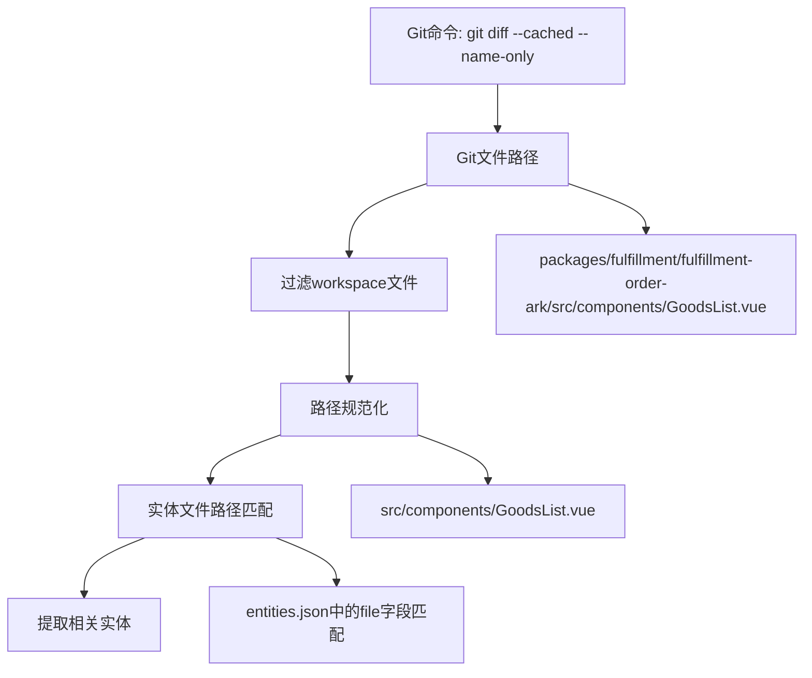
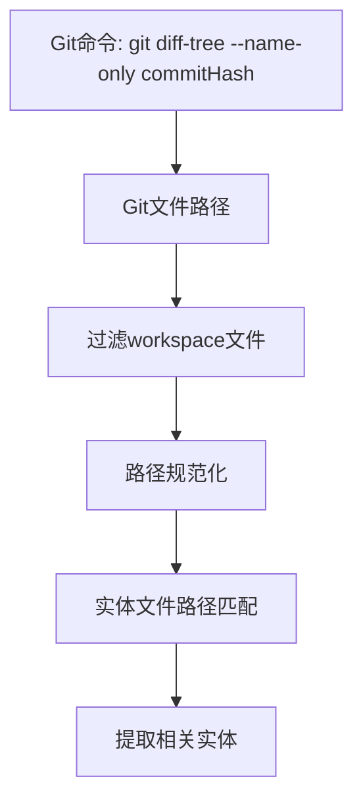

# 路径格式说明文档

在 `commit-generator` 模块中，由于涉及到monorepo多workspace环境和Git操作，存在多种不同格式的路径。本文档详细说明各种路径的含义、格式和转换关系。

## 📁 路径类型概览

| 路径类型 | 作用范围 | 格式示例 | 说明 |
|---------|---------|----------|------|
| Git文件路径 | Git命令返回 | `packages/fulfillment/fulfillment-order-ark/src/containers/OrderIncentive/components/GoodsList.vue` | 相对于Git仓库根目录 |
| Workspace根路径 | Workspace管理 | `/Users/qinxiao1/Dev/aurora/packages/fulfillment/fulfillment-order-ark` | 绝对路径 |
| Workspace相对路径 | Workspace管理 | `packages/fulfillment/fulfillment-order-ark` | 相对于monorepo根目录 |
| 实体文件路径 | 实体索引 | `src/containers/OrderIncentive/components/GoodsList.vue` | 相对于workspace根目录 |
| 规范化路径 | 匹配处理 | `src/containers/OrderIncentive/components/GoodsList.vue` | 转换后用于匹配的路径 |

## 🔍 详细说明

### 1. Git文件路径 (Git File Path)

**来源**: Git命令返回的文件路径
- `git diff --cached --name-only` (暂存区文件)
- `git diff-tree --name-only commitHash` (commit文件)

**格式特点**:
- 相对于Git仓库根目录的路径
- 使用 `/` 作为路径分隔符
- 包含完整的包路径前缀

**示例**:
```bash
packages/fulfillment/fulfillment-order-ark/src/containers/OrderIncentive/components/GoodsList.vue
packages/fulfillment/fulfillment-order-moon/src/service/apiKit/edith_post_encourage_batch_update.ts
apps/after-sale-demo/src/components/AfterSaleForm.vue
```

**生成位置**:
```typescript
// GitUtils.getFilesList()
private async getFilesList(command: string): Promise<string[]> {
  const result = await execAsync(command, { cwd: this.projectPath });
  return result.stdout.trim().split("\n").filter(file => file.length > 0);
}
```

### 2. Workspace路径 (Workspace Paths)

#### 2.1 Workspace根路径 (rootPath)

**含义**: Workspace的绝对路径
**格式**: 完整的文件系统绝对路径

**示例**:
```bash
/Users/qinxiao1/Dev/aurora/packages/fulfillment/fulfillment-order-ark
/Users/qinxiao1/Dev/modular-code-analysis-util/apps/after-sale-demo
```

**生成位置**:
```typescript
// WorkspaceManager.createWorkspaceContext()
const absolutePath = path.isAbsolute(workspacePath) 
  ? workspacePath 
  : path.resolve(workspacePath);

return {
  rootPath: absolutePath,
  // ...
};
```

#### 2.2 Workspace相对路径 (relativePath)

**含义**: 相对于monorepo根目录的路径
**格式**: 相对路径，不以 `/` 开头

**示例**:
```bash
packages/fulfillment/fulfillment-order-ark
apps/after-sale-demo
```

**生成位置**:
```typescript
// WorkspaceManager.createWorkspaceContext()
const relativePath = path.relative(this.monorepoRoot, absolutePath);
```

#### 2.3 实体文件路径 (entitiesFilePath)

**含义**: 实体文件的完整绝对路径
**格式**: 绝对路径，指向 `data/entities.enriched.json`

**示例**:
```bash
/Users/qinxiao1/Dev/aurora/packages/fulfillment/fulfillment-order-ark/data/entities.enriched.json
```

**生成位置**:
```typescript
// WorkspaceManager.createWorkspaceContext()
const entitiesFilePath = path.join(
  absolutePath,
  "data",
  "entities.enriched.json"
);
```

### 3. 实体文件中的路径 (Entity File Paths)

**来源**: `entities.enriched.json` 文件中存储的文件路径
**格式特点**:
- 相对于workspace根目录的路径
- 使用 `/` 作为路径分隔符
- 不包含workspace路径前缀

**示例**:
```json
{
  "id": "Component:GoodsList",
  "type": "component",
  "file": "src/containers/OrderIncentive/components/GoodsList.vue",
  "loc": 116,
  // ...
}
```

**路径格式**:
```bash
src/containers/OrderIncentive/components/GoodsList.vue
src/service/apiKit/edith_post_encourage_batch_update.ts
src/components/AfterSaleForm.vue
```

### 4. 规范化路径 (Normalized Paths)

**目的**: 将Git文件路径转换为与实体文件路径匹配的格式
**转换过程**: Git文件路径 → 规范化路径 → 与实体文件路径匹配

**转换示例**:
```bash
# 输入 (Git文件路径)
packages/fulfillment/fulfillment-order-ark/src/containers/OrderIncentive/components/GoodsList.vue

# 输出 (规范化路径)
src/containers/OrderIncentive/components/GoodsList.vue
```

**转换逻辑**:
```typescript
// EntityMatcher.normalizeFilePathForWorkspace()
private normalizeFilePathForWorkspace(
  filePath: string, 
  workspace: WorkspaceContext
): string {
  let normalizedPath = filePath.replace(/\\/g, "/");
  
  const workspaceRelativePath = path.relative(process.cwd(), workspace.rootPath)
    .replace(/\\/g, "/");
  
  // 如果文件路径以workspace的相对路径开头，去掉这个前缀
  if (normalizedPath.startsWith(workspaceRelativePath + "/")) {
    normalizedPath = normalizedPath.substring(workspaceRelativePath.length + 1);
  }
  
  return normalizedPath.replace(/^\.\//, "");
}
```

## 🔄 路径转换流程

### 场景1: 暂存区文件实体提取



### 场景2: Commit文件实体提取



## 🛠️ 调试日志示例

### 成功的路径转换日志:

```bash
🔧 路径规范化调试:
  原始路径: packages/fulfillment/fulfillment-order-ark/src/containers/OrderIncentive/components/GoodsList.vue
  workspace根路径: /Users/qinxiao1/Dev/aurora/packages/fulfillment/fulfillment-order-ark
  workspace相对路径: packages/fulfillment/fulfillment-order-ark
  匹配workspace相对路径前缀，规范化后: src/containers/OrderIncentive/components/GoodsList.vue
  最终规范化路径: src/containers/OrderIncentive/components/GoodsList.vue

🔍 查找文件: packages/fulfillment/fulfillment-order-ark/src/containers/OrderIncentive/components/GoodsList.vue -> src/containers/OrderIncentive/components/GoodsList.vue (workspace: fulfillmentorderark)

🔍 在文件索引中查找: src/containers/OrderIncentive/components/GoodsList.vue
✅ 精确匹配找到 1 个实体
```

### 失败案例（路径不匹配）:

```bash
🔧 路径规范化调试:
  原始路径: packages/fulfillment/fulfillment-order-ark/src/service/apiKit/edith_post_encourage_batch_update.ts
  workspace根路径: /Users/qinxiao1/Dev/aurora/packages/fulfillment/fulfillment-order-ark
  workspace相对路径: packages/fulfillment/fulfillment-order-ark
  匹配workspace相对路径前缀，规范化后: src/service/apiKit/edith_post_encourage_batch_update.ts
  最终规范化路径: src/service/apiKit/edith_post_encourage_batch_update.ts

🔍 在文件索引中查找: src/service/apiKit/edith_post_encourage_batch_update.ts
📊 总共找到 0 个实体
```

## 🚀 最佳实践

### 1. 路径处理原则
- 始终使用 `/` 作为路径分隔符
- 保持路径相对性的一致性
- 避免硬编码绝对路径

### 2. 调试方法
- 检查 workspace 根路径是否正确
- 验证路径规范化逻辑
- 对比实体文件中的路径格式

### 3. 常见问题
- **路径前缀不匹配**: 检查workspace相对路径计算
- **路径分隔符问题**: 统一使用 `/`
- **相对路径vs绝对路径**: 确保转换逻辑正确

## 📋 路径配置检查清单

- [ ] Git仓库根目录正确识别
- [ ] Workspace根路径正确设置
- [ ] 实体文件路径存在且可读
- [ ] 路径规范化逻辑正确
- [ ] 文件索引创建成功
- [ ] 路径匹配逻辑验证通过

## 🔗 相关文件

- `utils/git-utils.ts` - Git文件路径获取
- `utils/workspace-manager.ts` - Workspace路径管理
- `utils/entity-matcher.ts` - 路径规范化和匹配
- `data/entities.enriched.json` - 实体文件路径存储 