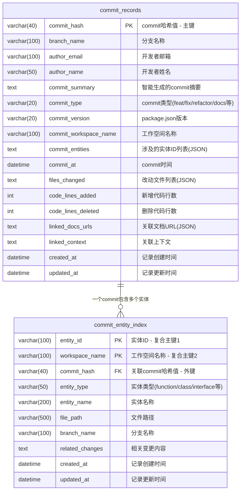

# 新的Commit数据库实现

这是一个全新的数据库实现，用于替代原来的分布式SQLite存储方案。新实现基于云端MySQL数据库，参考了refer-db的架构设计。

## 主要特性

- ✨ **统一云端存储**: 使用MySQL数据库替代分布式SQLite文件
- 🏗️ **现代架构**: 基于Sequelize TypeScript装饰器
- 🔧 **简化API**: 提供简洁的接口替代复杂的workspace管理
- 📊 **移除冗余字段**: 去掉了diff_content和diff_summary字段
- 🔄 **GroupBy支持**: 新增按commit_hash分组合并功能
- 🌍 **多环境支持**: 支持local/development/staging/production环境

## 文件结构

```
packages/parser-agent/src/commit-generator/db/
├── index.ts                # 数据库连接管理
├── config.ts              # 环境配置管理
├── commit-manager.ts      # 统一的管理器API（整合了数据服务）
└── README.md             # 说明文档

packages/parser-agent/src/commit-generator/models/
├── commit-record.ts      # commit记录模型
└── entity-index.ts      # 实体索引模型
```

## 数据库表结构

### commit_records (主表)
- `commit_hash` (PRIMARY KEY) - commit哈希值
- `branch_name` - 分支名称
- `author_email` - 开发者邮箱
- `author_name` - 开发者姓名
- `commit_summary` - 智能生成的commit摘要
- `commit_type` - commit类型
- `commit_version` - package.json版本
- `commit_workspace_name` - 工作空间名称
- `commit_entities` - 涉及的实体ID列表 (JSON)
- `commit_at` - commit时间
- `files_changed` - 改动文件列表 (JSON)
- `code_lines_added` - 新增代码行数
- `code_lines_deleted` - 删除代码行数
- `linked_docs_urls` - 关联文档URL (JSON)
- `linked_context` - 关联上下文
- `created_at` / `updated_at` - 时间戳

### commit_entity_index (实体索引表)
- `entity_id` (PRIMARY KEY 1/2) - 实体ID，复合主键之一
- `workspace_name` (PRIMARY KEY 2/2) - 工作空间名称，复合主键之一
- `commit_hash` - 关联commit (外键)
- `entity_type` - 实体类型
- `entity_name` - 实体名称
- `file_path` - 文件路径
- `branch_name` - 分支名称
- `related_changes` - 相关变更内容
- `created_at` / `updated_at` - 时间戳

## 数据库ER图



### 复合主键设计说明

`commit_entity_index` 表采用复合主键设计 (`entity_id` + `workspace_name`)，具有以下优势：

- **唯一性保证**: 确保同一工作空间中的同一实体只有一条记录
- **查询优化**: 提高基于实体ID和工作空间名称的查询效率
- **数据完整性**: 防止重复记录，保证数据一致性
- **业务逻辑对齐**: 符合"一个实体在一个工作空间中唯一"的业务规则

## 环境配置

设置环境变量：

```bash
# 数据库连接配置
export DB_HOST=your-mysql-host
export DB_PORT=3306
export DB_USERNAME=your-username
export DB_PASSWORD=your-password
export DB_DATABASE=commit_analysis

# 环境设置
export NODE_ENV=local  # local/development/staging/production

# 可选：启用调试
export DB_DEBUG=true
```

## 使用方法

### 1. 基础初始化

```typescript
import { CommitManager } from './db/commit-manager'

// 自动初始化（推荐）
await CommitManager.initialize()
```

### 2. 保存commit记录

```typescript
import { saveCommitRecord, CommitRecordData } from './db/commit-manager'

const commitData: CommitRecordData = {
  commitHash: 'abc123',
  branchName: 'main',
  authorEmail: 'dev@example.com',
  authorName: '开发者',
  commitSummary: 'feat: 添加新功能',
  commitType: 'feat',
  commitVersion: '1.0.0',
  commitWorkspaceName: 'my-workspace',
  commitEntities: ['entity1', 'entity2'],
  commitAt: new Date().toISOString(),
  filesChanged: ['src/app.ts', 'src/utils.ts'],
  codeLinesAdded: 50,
  codeLinesDeleted: 10,
  entities: [...],  // CommitEntity对象数组
}

await saveCommitRecord(commitData)
```

### 3. 查询实体变更记录

```typescript
import { getEntitiesCommitHistory } from './db/commit-manager'

// 按commit_hash分组（默认）
const result = await getEntitiesCommitHistory(
  ['entity1', 'entity2'], 
  'commit_hash'
)

// 按entity_id分组
const result2 = await getEntitiesCommitHistory(
  ['entity1', 'entity2'], 
  'entity_id'
)

// 不分组
const result3 = await getEntitiesCommitHistory(
  ['entity1', 'entity2'], 
  'none'
)

// 指定分支
const result4 = await getEntitiesCommitHistory(
  ['entity1', 'entity2'], 
  'commit_hash',
  'feature-branch'
)
```

### 4. 其他功能

```typescript
// 根据commit hash查询
const commit = await CommitManager.getCommitByHash('abc123')

// 查询分支最近提交
const recentCommits = await CommitManager.getRecentCommitsByBranch('main', 20)

// 获取统计信息
const stats = await CommitManager.getStatistics()

// 健康检查
const isHealthy = await CommitManager.healthCheck()

// 删除记录
await CommitManager.deleteCommitRecord('abc123')

// 关闭连接
await CommitManager.close()
```

## 与post-commit集成

在post-commit hook中使用新的API：

```typescript
import { saveCommitRecord } from '../db/commit-manager'

export async function postCommitHook() {
  // 获取commit信息
  const commitData = await buildCommitData()
  
  // 保存到新数据库
  await saveCommitRecord(commitData)
}
```

## 迁移指南

从原来的database-manager迁移：

1. **替换导入**:
   ```typescript
   // 旧的
   import { DatabaseManager } from './utils/database-manager'
   
   // 新的
   import { CommitManager, saveCommitRecord } from './db/commit-manager'
   ```

2. **替换API调用**:
   ```typescript
   // 旧的
   await databaseManager.saveCommitRecord(data)
   
   // 新的
   await saveCommitRecord(data)
   // 或者
   await CommitManager.saveCommitRecord(data)
   ```

3. **更新数据结构**: 
   - 移除了`diffContent`和`diffSummary`字段
   - 所有JSON字段自动序列化/反序列化

## 依赖要求

需要安装以下依赖：

```bash
npm install sequelize sequelize-typescript mysql2
npm install --save-dev @types/sequelize
```

## 注意事项

1. **数据库初始化**: 在local环境下会自动同步表结构
2. **事务支持**: 所有写操作都使用数据库事务
3. **错误处理**: 提供详细的错误信息和日志
4. **性能优化**: 使用索引和连接池优化查询性能
5. **兼容性**: API设计保持向后兼容，便于渐进式迁移 