# fulfillment-aftersale-ark - Code Structure Analysis

## 📊 Project Overview
- **Project Name**: fulfillment-aftersale-ark
- **Project Type**: Vue应用
- **Technology Stack**: Vue.js, React, TypeScript, React + TypeScript, Stylus, Sass, Less
- **Architecture Pattern**: 模块化架构
- **Total Files**: 10485
- **Total Code Lines**: 214825
- **Total Entities**: 715

# fulfillment-aftersale-ark 项目架构分析报告

## 🏗️ 项目架构概览

fulfillment-aftersale-ark 是一个基于 Vue.js 的售后服务管理系统，采用了分层架构模式，并融合了部分领域驱动设计(DDD)的概念。该项目是一个微前端应用，主要用于处理电商平台的售后服务流程，包括退款、换货、维修等售后业务场景。

### 核心技术栈

- **前端框架**: Vue.js 为主，部分组件使用 React
- **类型系统**: TypeScript
- **样式处理**: Stylus, Sass, Less
- **状态管理**: Vuex
- **组件架构**: 微前端架构
- **路由模式**: 基于文件的路由系统

## 🏛️ 领域驱动设计(DDD)分析

项目采用了部分 DDD 的概念，但不是严格意义上的完整 DDD 实现。

### 领域概念

主要领域集中在 `containers` 目录下，包括：

1. **售后服务领域**：处理退款、换货、维修等售后流程
2. **物流领域**：处理物流跟踪、快递拦截等功能
3. **客户服务领域**：处理客户服务请求和协助

### DDD 元素分析

1. **领域实体**:
   - `AftersaleDetailReturnStatusDomain`: 售后退货状态领域实体
   - `DiffModalDomain`: 差异对比模态框领域实体

2. **领域服务**:
   - `subscribeLogisticsService`: 物流订阅服务
   - `queryElectronicBillService`: 电子单据查询服务
   - `applyElectronicBillService`: 电子单据申请服务
   - `cancelElectronicBillService`: 电子单据取消服务

3. **值对象**: 未明确定义，但可能在业务逻辑中隐式使用

4. **聚合根**: 未明确定义，但售后单可能作为隐式的聚合根

## 📐 架构分层分析

项目采用了清晰的分层架构，各层职责明确：

### 表现层 (Presentation Layer)

主要包含 UI 组件和业务组件，负责用户界面渲染和交互：

1. **业务组件**:
   - 售后详情组件 (`src/containers/AutoAftersale/AfterSaleDetail/components`)
   - 售后列表组件 (`src/containers/AutoAftersale/AfterSaleList/components`)
   - 客户协助组件 (`src/containers/Assistance/components`)

2. **UI 组件**:
   - 通用表单组件 (`src/components/Form`)
   - 描述列表组件 (`src/components/Descriptions`)
   - 引导布局组件 (`src/components/GuideLayout`)
   - 复制文本组件 (`src/components/CopyText`)

### 业务层 (Business Layer)

处理业务逻辑和规则，包括：

1. **服务模块**:
   - API 服务 (`src/service/apiKit`)
   - 运单服务 (`src/service/waybill`)
   - 物流调度服务 (`src/service/waybillDispatch`)
   - 异常订单服务 (`src/service/abnormalOrder`)

2. **领域模块**:
   - 售后详情协商领域 (`node_modules/@xhs/lib-fulfillment-modules/src/modules/aftersale/domains/AftersaleDetailNegotiate`)
   - 快递拦截领域 (`node_modules/@xhs/lib-fulfillment-modules/src/modules/expressIntercept/domains`)

### 数据层 (Data Layer)

负责数据处理、转换和持久化：

1. **数据处理**:
   - 数据转换工具 (`node_modules/@xhs/data-transform`)
   - 售后数据模型 (`node_modules/@xhs/lib-fulfillment-modules/src/modules/aftersale/data`)

2. **数据可视化**:
   - 图表组件 (`node_modules/@xhs/ark-datacenter/material/basic/ChartBar`)
   - 指标卡片 (`node_modules/@xhs/ark-datacenter/material/basic/MetricCard`)

### 基础设施层 (Infrastructure Layer)

提供技术支持和通用工具：

1. **工具类**:
   - 通用工具函数 (`src/utils`)
   - 共享工具库 (`node_modules/@xhs/shared-ark/utils`)

2. **配置管理**:
   - 项目配置 (`src/config`)
   - 应用初始化配置 (`node_modules/@xhs/shared-ark/initApp/config`)

## 🧩 前端架构特点

### 微前端架构

项目采用微前端架构，允许不同团队独立开发和部署各个功能模块：

1. **模块化设计**:
   - 售后列表模块 (`src/containers/AutoAftersale/AfterSaleList`)
   - 售后详情模块 (`src/containers/AutoAftersale/AfterSaleDetail`)
   - 客户协助模块 (`src/containers/Assistance`)
   - 微支付模块 (`src/containers/MicroRemittance`)

2. **共享组件**:
   - 业务组件库 (`src/components/BizCmp`)
   - UI 组件库 (`node_modules/@xhs/delight/components`)

### 状态管理

使用 Vuex 进行状态管理，适合处理复杂的应用状态：

1. **状态模块化**:
   - 按业务领域划分状态模块
   - 支持异步状态更新

### 路由系统

采用基于文件的路由系统，使路由结构更加直观：

1. **路由组织**:
   - 按功能模块组织路由
   - 支持嵌套路由和路由参数

## 🔍 组件结构分析

### 业务组件

项目包含大量业务组件，主要分布在以下目录：

1. **售后详情组件**:
   - 售后信息组件 (`src/containers/AutoAftersale/AfterSaleDetail/components/AfterSaleInfo.vue`)
   - 协商记录组件 (`src/containers/AutoAftersale/AfterSaleDetail/components/NegotiateRecord.vue`)
   - 物流信息组件 (`src/containers/AutoAftersale/AfterSaleDetail/components/LogisticsInfo.vue`)

2. **售后列表组件**:
   - 售后状态组件 (`src/containers/AutoAftersale/AfterSaleList/components/AftersaleStatus.vue`)
   - 指标组件 (`src/containers/AutoAftersale/AfterSaleList/components/Metrics`)
   - 订单信息单元格 (`src/containers/AutoAftersale/AfterSaleList/components/OrderInfoCell.vue`)

3. **协助组件**:
   - 创建协助组件 (`src/containers/Assistance/CreateAssistance.vue`)
   - 协助策略列表 (`src/containers/Assistance/AssistanceMain/components/AssistanceStrategyListPane.vue`)

### UI 组件

项目包含多种 UI 组件，提供通用的界面元素：

1. **表单组件**:
   - 表单项组件 (`src/components/Form/FormItem.vue`)
   - 表单容器组件 (`src/components/Form/index.vue`)

2. **展示组件**:
   - 描述列表组件 (`src/components/Descriptions/index.vue`)
   - 空状态组件 (`src/components/Empty/index.vue`)
   - 轮播组件 (`src/components/Carousel/index.vue`)

3. **交互组件**:
   - 复制文本组件 (`src/components/CopyText/index.vue`)
   - 引导模态框组件 (`src/components/GuideModal/index.vue`)
   - 切换按钮组件 (`src/components/ToggleButton/index.vue`)

## 📊 代码组织评估

### 代码组织方式

1. **按功能组织**:
   - 项目主要按功能模块组织代码，如售后列表、售后详情、客户协助等
   - 模块化程度高，便于团队协作和维护

2. **按类型组织**:
   - 组件、服务、工具等按类型分类存放
   - 有利于代码复用和维护

3. **模块化评分**: 25分（中等水平）
   - 模块之间存在一定的耦合，但整体结构清晰

### 最佳实践

1. **组件复用**:
   - 抽象出通用业务组件，如物流信息组件、商品项组件等
   - 使用 UI 组件库提高开发效率

2. **代码分层**:
   - 清晰的分层架构，职责分明
   - 业务逻辑与 UI 展示分离

3. **类型系统**:
   - 使用 TypeScript 提高代码质量和可维护性
   - 定义清晰的接口和类型

## 🚀 改进建议

1. **增强 DDD 实践**:
   - 明确定义值对象和聚合根
   - 完善领域服务的边界和职责

2. **优化组件结构**:
   - 减少大型组件，拆分为更小的可复用组件
   - 建立更严格的组件命名和组织规范

3. **状态管理优化**:
   - 考虑引入 Pinia 替代 Vuex，提供更好的 TypeScript 支持
   - 优化状态更新逻辑，减少不必要的渲染

4. **性能优化**:
   - 实施组件懒加载
   - 优化大列表渲染性能

5. **测试覆盖**:
   - 增加单元测试和集成测试
   - 建立自动化测试流程

## 📝 总结

fulfillment-aftersale-ark 项目是一个结构良好的微前端应用，采用了分层架构和部分 DDD 概念。项目组织清晰，组件化程度高，适合大型团队协作开发。通过进一步优化 DDD 实践、组件结构和状态管理，可以提高代码质量和可维护性，为用户提供更好的售后服务体验。

## 📂 Detailed Directory Analysis
# 📁 src/constants

### 🎯 Directory Purpose
- **Primary Role**: 项目目录
- **File Count**: 22 files
- **Entity Count**: 8 entities
- **Functional Description**: This directory serves as a centralized repository for constant values used throughout the project. It contains various configuration files that define enumerations, mappings, status codes, and other fixed values that maintain consistency across the application. By isolating these constants in dedicated files, the codebase achieves better maintainability, reduces duplication, and enables easier updates to system-wide values. The constants appear to support various business domains including after-sales service, arbitration, bonded warehousing, and tracking functionality.

### 📋 File Structure & Entities

#### 📄 afterSale.ts
- **Path**: `src/constants/afterSale.ts`
- **Entities**: `Variable:afterSaleTypes_dad338d828fb` (variable), `Variable:statusTypeProcessList_0c4dc774e4a0` (variable), `Variable:afterSaleStatus_43f665d51c37` (variable), `Variable:returnStatus_fc18cb20b25b` (variable), `Variable:returnExpressStatus` (variable), `Variable:shipExpressStatus` (variable), `Variable:merchantHandleTagsOptions` (variable), `Variable:AfterSaleShortNameTracker` (variable), `Variable:AfterSaleShortName_4262322c11aa` (variable), `Variable:REFUND_METHOD_MAP_e0a4e41f0860` (variable)
- **Purpose**: Defines constants related to after-sales service processes, including types of after-sales services, status codes, return statuses, shipping statuses, and refund methods. These constants likely support the UI components and business logic for handling customer returns, refunds, and other post-purchase services.

#### 📄 arbitrate.ts
- **Path**: `src/constants/arbitrate.ts`
- **Entities**: `Variable:ArbitrateTicketStatusColorMap` (variable)
- **Purpose**: Contains color mapping constants for different arbitration ticket statuses, likely used for visual representation in the UI. This file supports the arbitration or dispute resolution functionality of the application by providing consistent color coding for different ticket states.

#### 📄 bonded.ts
- **Path**: `src/constants/bonded.ts`
- **Entities**: `Variable:PURCHASE_INBOUND_STATUS_MAP` (variable), `Variable:PURCHASE_INBOUND_STATUS_OPTIONS` (variable), `Variable:TRANSFER_INBOUND_STATUS_MAP` (variable), `Variable:TRANSFER_INBOUND_STATUS_OPTIONS` (variable), `Variable:TRANSFER_OUTBOUND_STATUS_MAP` (variable), `Variable:TRANSFER_OUTBOUND_STATUS_OPTIONS` (variable), `Variable:TRANSPORT_MODE_MAP` (variable), `Variable:TRANSPORT_MODE_OPTIONS` (variable), `Variable:CONTAINER_TYPE_MAP` (variable), `Variable:CONTAINER_TYPE_OPTIONS` (variable), `Variable:CONTAINER_SPEC_OPTIONS` (variable), `Variable:LADING_UNIT_MAP` (variable), `Variable:LADING_UNIT_OPTIONS` (variable), `Variable:INVENTORY_TYPE_MAP` (variable), `Variable:INVENTORY_UPDATE_STATUS_MAP` (variable), `Variable:INVENTORY_UPDATE_STATUS_OPTIONS` (variable)
- **Purpose**: Defines constants related to bonded warehouse operations, including status mappings for inbound and outbound transfers, purchase inbounds, transportation modes, container specifications, and inventory management. These constants support logistics and inventory management functionality, particularly for cross-border or duty-free operations.

#### 📄 commonTrack.ts
- **Path**: `src/constants/commonTrack.ts`
- **Entities**: `Variable:ORDER_COMMON_PAGE_KEY` (variable)
- **Purpose**: Contains tracking-related constants, specifically defining page keys for order tracking functionality. This file likely supports analytics or user journey tracking features within the order management system.

### 📦 Dependencies & Relationships
- **Imported Modules**: The provided data doesn't show explicit imports, suggesting these constants files are primarily self-contained. They likely serve as sources of data for other modules rather than consuming external dependencies.
- **Function Calls**: No function calls are evident in the provided data, which aligns with the expected behavior of constants files that primarily define static values rather than executing logic.
- **Component Relations**: The constants defined in these files are likely consumed by UI components and business logic throughout the application. For example, the color mappings in arbitrate.ts would be used by components displaying arbitration tickets, while the status mappings in bonded.ts would support components for warehouse management.

---

The constants directory appears to be well-organized by business domain, with separate files for different functional areas of the application. This organization promotes maintainability and makes it easier for developers to locate and update specific constants. The naming conventions suggest a mix of English and possibly Chinese-oriented business logic, indicating this may be an application serving the Chinese market or with Chinese business requirements.

# Analysis Report: src/providers Directory

## 📁 src/providers

### 🎯 Directory Purpose
- **Primary Role**: 项目目录 (Project Directory)
- **File Count**: 2 files
- **Entity Count**: 1 entity
- **Functional Description**: The `src/providers` directory appears to be responsible for housing service providers that facilitate communication with external resources or services. Based on the presence of an `Api.ts` file, this directory likely contains API client implementations and other service providers that abstract away the details of external service interactions, providing a clean interface for the rest of the application to consume these services.

### 📋 File Structure & Entities

#### 📄 Api.ts
- **Path**: `src/providers/Api.ts`
- **Entities**: `Class:Api` (class)
- **Purpose**: This file likely implements an API client that handles HTTP requests to backend services. The `Api` class probably encapsulates methods for making API calls, handling authentication, managing request/response transformations, and error handling. It serves as a centralized point for all API-related functionality in the application.

#### 📄 Unknown File
- There is a second file mentioned in the file count, but no details are provided about it. This could be a configuration file, another provider implementation, or documentation.

### 📦 Dependencies & Relationships
- **Imported Modules**: No imports were detected in the provided information. However, typical API client implementations would likely import HTTP client libraries (like Axios, Fetch API wrappers), configuration utilities, and possibly authentication-related modules.
- **Function Calls**: No function calls were detected in the provided information. The `Api` class would typically contain methods for different HTTP verbs (GET, POST, PUT, DELETE) and possibly utility methods for request formatting and response parsing.
- **Component Relations**: The `Api` class likely serves as a dependency for various components throughout the application that need to interact with backend services. Components would import and instantiate this class or use it as a singleton to make API requests.

---

Note: This analysis is based on limited information provided. A more detailed analysis would require examining the actual code content of the files in the directory.

# 📁 src/utils

### 🎯 Directory Purpose
- **Primary Role**: 工具函数目录
- **File Count**: 9 files
- **Entity Count**: 6 entities
- **Functional Description**: 这个目录包含了项目中使用的各种工具函数和辅助方法，为整个应用提供通用功能支持。从文件结构来看，它包含了格式化、数据处理、DOM操作、表单适配等多种实用工具，这些工具函数被项目中的其他模块引用，以减少代码重复并提高开发效率。该目录是项目基础设施的重要组成部分，提供了跨组件和模块使用的标准化功能。

### 📋 File Structure & Entities

#### 📄 common.ts
- **Path**: `src/utils/common.ts`
- **Entities**: 多个工具函数和变量，包括价格格式化、时间格式化、数组处理、URL构建等
- **Purpose**: 提供通用工具函数集合，包括数值格式化（如人民币价格转换`toCnPrice`）、时间处理（`formatTime`、`formatTimeRange`）、数据转换（元/分互转`formatFenToYuan`/`formatYuanToFen`）、性能测量、数组操作、URL处理、文件下载和文本复制等多种实用功能。这是项目中最基础的工具函数文件，提供了大量可复用的通用方法。

#### 📄 decryption.ts
- **Path**: `src/utils/decryption.ts`
- **Entities**: `Function:isDecryptionGraySeller` (function)
- **Purpose**: 处理解密相关的功能，特别是用于判断卖家是否属于灰度解密范围的函数。这可能与特定业务场景中的权限或功能控制相关，用于确定某些卖家是否可以访问或使用特定的解密功能。

#### 📄 element.ts
- **Path**: `src/utils/element.ts`
- **Entities**: `Function:setElementListener_c98195ea8d65` (function)
- **Purpose**: 提供DOM元素操作的工具函数，特别是设置元素事件监听器的功能。这个文件可能用于简化DOM事件处理，提供一种统一的方式来添加和管理事件监听器，增强代码的可维护性。

#### 📄 formily.ts
- **Path**: `src/utils/formily.ts`
- **Entities**: `Function:adapterConfigToDelightFormily` (function)
- **Purpose**: 提供与Formily表单库相关的适配工具，特别是将配置转换为Delight-Formily格式的函数。这表明项目可能使用了Formily作为表单解决方案，并且需要特定的适配器来处理配置转换，以便与项目中的"Delight"组件系统集成。

### 📦 Dependencies & Relationships
- **Imported Modules**: 由于提供的信息有限，无法确定具体的导入模块，但从函数名和文件结构可以推断可能导入了日期处理库（用于时间格式化）、DOM操作相关库、Formily相关库等。
- **Function Calls**: 实体信息显示大多数函数没有调用其他函数，这表明它们可能是相对独立的工具函数，设计为单一职责原则。
- **Component Relations**: 没有明显的组件关系，这符合工具函数目录的性质，主要提供功能性支持而非UI组件。

---

这个工具函数目录展示了一个结构良好的前端项目中常见的工具函数组织方式，按功能领域分类（通用、解密、DOM操作、表单处理等），提供了丰富的辅助功能支持项目开发。

# 📁 src/containers/AutoAftersale/AfterSaleDetail/constants

## 🎯 Directory Purpose
- **Primary Role**: React组件目录
- **File Count**: 2 files
- **Entity Count**: 3 entities
- **Functional Description**: This directory serves as a constants repository for the AfterSaleDetail component within the AutoAftersale module. It contains definitions for guide steps, modal identifiers, and enumeration types that are used throughout the AfterSaleDetail component. By centralizing these constants, the directory promotes code maintainability and reduces duplication across the component's implementation files.

## 📋 File Structure & Entities

### 📄 index.tsx
- **Path**: `src/containers/AutoAftersale/AfterSaleDetail/constants/index.tsx`
- **Entities**: 
  - `Function:guideSteps` (function): Likely defines a sequence of steps for guiding users through the after-sale process
  - `Variable:AFTERSALE_DETAIL_FREIGHT_RECOMMEND_MODAL` (variable): A constant identifier for a modal dialog related to freight recommendations in the after-sale detail view
  - `Variable:BannerTypeEnum_f228fd1d9b06` (variable): An enumeration defining different banner types that can be displayed in the after-sale detail interface
- **Purpose**: This file exports constants, enumerations, and configuration functions that are used throughout the AfterSaleDetail component to maintain consistency in UI elements, business logic, and user interactions.

### 📄 [Unnamed Second File]
- While the directory information indicates 2 files, details about the second file are not provided in the entity information. This file likely contains additional constants or may be an auxiliary file like a type definition file.

## 📦 Dependencies & Relationships
- **Imported Modules**: No explicit imports are detected in the provided entity details, suggesting these constants may be self-contained or use basic TypeScript/JavaScript functionality without external dependencies.
- **Function Calls**: No function calls are detected in the provided entity information, indicating these are likely static definitions rather than dynamic computations.
- **Component Relations**: These constants are likely referenced throughout the AfterSaleDetail component hierarchy, particularly:
  - `guideSteps` would be used in tutorial or onboarding components
  - `AFTERSALE_DETAIL_FREIGHT_RECOMMEND_MODAL` would be referenced when managing modal visibility
  - `BannerTypeEnum_f228fd1d9b06` would be used for conditional rendering of different banner types in the UI

The constants defined in this directory appear to be fundamental building blocks for the AfterSaleDetail component, providing configuration data and type definitions that ensure consistency across the component's implementation.

# 📁 src/containers/AutoAftersale/AfterSaleList/constants

## 🎯 Directory Purpose
- **Primary Role**: 项目目录 (Project Directory)
- **File Count**: 1 files
- **Entity Count**: 1 entities
- **Functional Description**: This directory serves as a constants repository for the AfterSaleList component within the AutoAftersale container. It contains constant values that are used throughout the AfterSaleList functionality, particularly related to user interface state management. Constants directories like this help centralize configuration values, making the codebase more maintainable by reducing magic strings and providing a single source of truth for important values.

## 📋 File Structure & Entities

### 📄 index.ts
- **Path**: `src/containers/AutoAftersale/AfterSaleList/constants/index.ts`
- **Entities**: `Variable:AftersaleGuideVisibilityKey` (variable)
- **Purpose**: This file exports constant values used in the AfterSaleList component. Specifically, it defines the `AftersaleGuideVisibilityKey` which appears to be a key used for storing or retrieving the visibility state of an aftersale guide component, likely in local storage or some state management system.

## 📦 Dependencies & Relationships
- **Imported Modules**: None detected. This appears to be a simple constants file that doesn't import from other modules.
- **Function Calls**: None detected. As a constants file, it likely only defines and exports values without executing functions.
- **Component Relations**: While no direct component relationships are visible in the code, the `AftersaleGuideVisibilityKey` constant is likely used by the AfterSaleList component to manage the visibility state of a guide or tutorial interface element. This suggests the file plays a supporting role in the UI state management of the AfterSaleList component.

The simplicity of this directory (containing only one file with one constant) indicates it follows a modular design pattern where even small pieces of configuration are properly isolated and organized, making the codebase more maintainable and scalable.

# 📁 src/containers/AutoAftersale/AfterSaleDetail/providers

### 🎯 Directory Purpose
- **Primary Role**: 项目目录
- **File Count**: 5 files
- **Entity Count**: 5 entities
- **Functional Description**: This directory serves as a container for domain models and providers related to after-sale service details in an automotive context. It implements the Domain-Driven Design pattern, encapsulating business logic for handling different aspects of after-sale services such as address management, return status tracking, and operation refusal handling. The directory provides a centralized location for these domain models which can be injected into components that need to interact with after-sale service data.

### 📋 File Structure & Entities

#### 📄 AftersaleAddressFieldDomain.ts
- **Path**: `src/containers/AutoAftersale/AfterSaleDetail/providers/AftersaleAddressFieldDomain.ts`
- **Entities**: `Class:AftersaleAddressFieldDomain_af0fd04df65f` (class)
- **Purpose**: Manages address-related fields and validation for after-sale service processes. Likely handles shipping addresses for returns or service locations.

#### 📄 AftersaleDetailReturnStatusDomain.ts
- **Path**: `src/containers/AutoAftersale/AfterSaleDetail/providers/AftersaleDetailReturnStatusDomain.ts`
- **Entities**: `Class:AftersaleDetailReturnStatusDomain_0dd0cf4d06e8` (class)
- **Purpose**: Handles the business logic for tracking and managing the status of returned items in the after-sale process, including state transitions and status display.

#### 📄 AftersaleOperateRefuseDomain.ts
- **Path**: `src/containers/AutoAftersale/AfterSaleDetail/providers/AftersaleOperateRefuseDomain.ts`
- **Entities**: `Class:AftersaleOperateRefuseDomain_bdd0e22d2242` (class)
- **Purpose**: Manages the business logic for handling refusal operations in the after-sale process, including validation of refusal reasons and processing of refusal requests.

#### 📄 index.ts
- **Path**: `src/containers/AutoAftersale/AfterSaleDetail/providers/index.ts`
- **Entities**: `Variable:injector` (variable), `Variable:index_74116a86eb40` (variable)
- **Purpose**: Acts as the entry point for the providers directory, likely exporting the domain classes and setting up dependency injection. The `injector` variable probably configures how these domain models are made available to the rest of the application.

### 📦 Dependencies & Relationships
- **Imported Modules**: Based on the naming conventions, these domain classes likely import core domain modeling utilities, state management libraries (possibly Redux or MobX), and validation utilities. The domain pattern suggests they may use interfaces for dependency inversion.
- **Function Calls**: The domain classes likely make API calls to backend services to fetch or update after-sale service data, and contain methods for data transformation and business rule validation.
- **Component Relations**: These domain providers are designed to be consumed by UI components in the AfterSaleDetail container. The index.ts file likely establishes the dependency injection pattern that allows components to access these domain models without tight coupling.

---

# 📁 src/containers/AutoAftersale/utils

## 🎯 Directory Purpose
- **Primary Role**: 工具函数目录
- **File Count**: 1 files
- **Entity Count**: 3 entities
- **Functional Description**: This directory serves as a repository for utility functions specifically related to the AutoAftersale module. It contains specialized functions for handling Net Promoter Score (NPS) surveys in the aftersale context. These utilities appear to be designed to trigger NPS surveys at different points in the user journey, providing a consistent interface for collecting customer feedback while maintaining separation of concerns from the main application logic.

## 📋 File Structure & Entities

### 📄 nps.ts
- **Path**: `src/containers/AutoAftersale/utils/nps.ts`
- **Entities**: 
  - `Function:triggerAftersaleNps` (function)
  - `Function:triggerAftersaleNpsInDetail` (function)
  - `Function:triggerAftersaleNpsInOldDetail` (function)
- **Purpose**: This file contains utility functions for triggering Net Promoter Score (NPS) surveys in different contexts within the auto aftersale process. The functions appear to be designed to handle NPS survey triggering in different views or scenarios of the aftersale flow.

## 📦 Dependencies & Relationships
- **Imported Modules**: No explicit imports were detected in the analysis data, suggesting these functions might be self-contained or rely on globally available utilities/services.
- **Function Calls**: No external function calls were detected in the analysis data. The three functions appear to be standalone utilities that might be called from various parts of the AutoAftersale module.
- **Component Relations**: The naming convention suggests a clear separation of concerns:
  - `triggerAftersaleNps`: Likely a general-purpose NPS trigger function for the aftersale process
  - `triggerAftersaleNpsInDetail`: Specialized for triggering NPS in a detailed view context
  - `triggerAftersaleNpsInOldDetail`: Appears to be a legacy support function for older UI implementations

## 💡 Analysis & Recommendations

1. **Code Organization**: The utility functions are appropriately isolated in a dedicated directory, following good separation of concerns.

2. **Naming Convention**: The function names clearly indicate their purpose, making the code more maintainable.

3. **Potential Improvements**:
   - Consider adding documentation to explain the differences between the three NPS triggering functions
   - The presence of "OldDetail" in one function name suggests legacy code support; this might need future refactoring
   - If these functions share common logic, consider extracting shared code into private helper functions

4. **Integration Points**: These utility functions likely serve as integration points between the AutoAftersale UI components and an NPS service or system.

# 📁 src/containers/AutoAftersale/hooks

### 🎯 Directory Purpose
- **Primary Role**: 项目目录
- **File Count**: 11 files
- **Entity Count**: 5 entities
- **Functional Description**: This directory contains custom React hooks specifically designed for the AutoAftersale module. These hooks encapsulate various business logic and state management related to after-sales service processes, including actions handling, after-sale operations, assistant functionality, and arbitration processes. By centralizing these functionalities into reusable hooks, the directory promotes code reusability and separation of concerns across the AutoAftersale container components.

### 📋 File Structure & Entities

#### 📄 useAction.ts
- **Path**: `src/containers/AutoAftersale/hooks/useAction.ts`
- **Entities**: `Function:useRemoteAction` (function), `Function:useLocalAction` (function)
- **Purpose**: Provides action-related hooks for the AutoAftersale module. `useRemoteAction` likely handles server-side interactions and API calls, while `useLocalAction` manages client-side state changes and UI interactions. These hooks abstract the action handling logic from the components.

#### 📄 useAfterSale.ts
- **Path**: `src/containers/AutoAftersale/hooks/useAfterSale.ts`
- **Entities**: `Function:useAfterSale` (function)
- **Purpose**: Manages the core after-sale service state and operations. This hook likely provides functionality for creating, retrieving, updating, and managing after-sale service requests, including status tracking and data manipulation.

#### 📄 useAfterSaleAssistant.ts
- **Path**: `src/containers/AutoAftersale/hooks/useAfterSaleAssistant.ts`
- **Entities**: `Function:useAfterSaleAssistant` (function)
- **Purpose**: Implements assistant-related functionality for after-sale services. This hook probably handles guidance, suggestions, or automated help features that assist users through the after-sale process.

#### 📄 useArbitrate.ts
- **Path**: `src/containers/AutoAftersale/hooks/useArbitrate.ts`
- **Entities**: `Function:useArbitrate` (function)
- **Purpose**: Manages arbitration processes within the after-sale flow. This hook likely handles dispute resolution, mediation between parties, and the workflow for escalating and resolving conflicts in after-sale scenarios.

### 📦 Dependencies & Relationships
- **Imported Modules**: Based on the naming conventions and typical React hook patterns, these hooks likely import React core hooks (useState, useEffect, useCallback), context APIs, and service modules for API interactions. They may also import utility functions and type definitions specific to the AutoAftersale domain.
- **Function Calls**: The hooks likely make calls to API services, state management functions, and possibly other utility hooks. There might be interdependencies between hooks, with higher-level hooks like `useAfterSale` potentially using more specific hooks like `useAction`.
- **Component Relations**: These hooks are designed to be consumed by components within the AutoAftersale container. They abstract complex logic away from the presentation layer, allowing components to focus on rendering while the hooks handle business logic, state management, and side effects.

---

Note: The directory contains 11 files but only 5 entities and 4 files are detailed in the provided information. The remaining files might contain additional hooks, utilities, or type definitions that support the main functionality but weren't identified as primary entities in the analysis.

# 📁 src/containers/AutoAftersale/AfterSaleDetail/hooks

### 🎯 Directory Purpose
- **Primary Role**: 项目目录
- **File Count**: 3 files
- **Entity Count**: 2 entities
- **Functional Description**: This directory contains custom React hooks specifically designed for the AfterSaleDetail component within the AutoAftersale container. These hooks encapsulate reusable logic for tracking user interactions and providing guidance functionality, following the React hooks pattern to promote code reusability and separation of concerns. The hooks appear to handle specialized behaviors needed in the after-sale service detail view of an automotive application.

### 📋 File Structure & Entities

#### 📄 useDetailReachGuide.ts
- **Path**: `src/containers/AutoAftersale/AfterSaleDetail/hooks/useDetailReachGuide.ts`
- **Entities**: `Function:useDetailReachGuide` (function)
- **Purpose**: This custom hook likely manages the guidance or tutorial functionality for the after-sale detail page. It probably handles the logic for showing users how to navigate or use specific features within the after-sale detail interface, possibly implementing step-by-step guides or tooltips.

#### 📄 useTracker.ts
- **Path**: `src/containers/AutoAftersale/AfterSaleDetail/hooks/useTracker.ts`
- **Entities**: `Function:useTracker_f944e9095bcf` (function)
- **Purpose**: This hook appears to implement analytics or event tracking functionality specific to the after-sale detail view. It likely captures user interactions, page views, or other metrics to monitor how users engage with the after-sale service details.

### 📦 Dependencies & Relationships
- **Imported Modules**: No specific imports are listed in the provided data, but these hooks likely import React's hook APIs (useState, useEffect, useCallback) and possibly analytics libraries or internal tracking utilities.
- **Function Calls**: No specific function calls are listed, but these hooks likely call internal tracking functions, state management functions, and possibly API endpoints for data retrieval.
- **Component Relations**: These hooks are designed to be consumed by the AfterSaleDetail component and its child components. They abstract complex logic away from the component rendering code, allowing the components to focus on presentation while these hooks handle behavioral aspects.

### 📝 Additional Notes
- There appears to be a third file in the directory that wasn't detailed in the entity list, which might contain additional hook functionality or utility code.
- The naming convention follows React's standard "use" prefix for custom hooks, making their purpose clear to developers.
- The specialized nature of these hooks suggests a well-structured application with proper separation of concerns.

## 📁 src/containers/AutoAftersale/AfterSaleList/hooks

### 🎯 Directory Purpose
- **Primary Role**: 项目目录
- **File Count**: 2 files
- **Entity Count**: 2 entities
- **Functional Description**: This directory contains custom React hooks that support the AfterSaleList functionality within the AutoAftersale container. These hooks encapsulate reusable logic for search configuration and tracking user interactions, providing clean separation of concerns and improving code maintainability in the after-sales service management interface.

### 📋 File Structure & Entities

#### 📄 useSearchConfig.ts
- **Path**: `src/containers/AutoAftersale/AfterSaleList/hooks/useSearchConfig.ts`
- **Entities**: `Function:useSearchConfig` (function)
- **Purpose**: This custom hook likely manages the search configuration for the AfterSaleList component, handling search parameters, filters, and query logic. It probably returns search-related state and functions to update search criteria, enabling the parent component to implement search functionality without managing the complex search logic directly.

#### 📄 useTracker.ts
- **Path**: `src/containers/AutoAftersale/AfterSaleList/hooks/useTracker.ts`
- **Entities**: `Function:useTracker_fe93ad271916` (function)
- **Purpose**: This hook appears to implement tracking functionality for user interactions within the AfterSaleList component. It likely integrates with an analytics service to track user behavior, page views, and specific actions taken in the after-sales interface, providing valuable usage data for business analysis.

### 📦 Dependencies & Relationships
- **Imported Modules**: Based on the naming conventions and typical React hook patterns, these hooks likely import React core libraries (useState, useEffect, useCallback), possibly Redux hooks for state management, and domain-specific utilities for search and tracking functionality.
- **Function Calls**: The hooks probably call internal utility functions for data transformation, API services for data fetching, and potentially analytics services for the tracking implementation.
- **Component Relations**: These hooks are designed to be consumed by the AfterSaleList component or its child components, providing specialized functionality while keeping the component code clean and focused on rendering. They represent a clear separation between UI rendering and business logic.

---

The hooks in this directory follow the React custom hooks pattern, which is a best practice for extracting and reusing stateful logic across components. The naming convention (prefixed with "use") properly identifies them as React hooks, making their purpose clear to other developers working on the project.

# 📁 src/containers/OrderQuery/hooks

### 🎯 Directory Purpose
- **Primary Role**: 项目目录
- **File Count**: 1 files
- **Entity Count**: 1 entities
- **Functional Description**: This directory contains custom React hooks specifically designed for the OrderQuery container component. It serves as a modular organization of reusable logic related to order querying functionality, particularly focusing on row selection and checking behaviors. By isolating these hooks in a dedicated directory, the codebase maintains better separation of concerns and improves reusability across the OrderQuery feature.

### 📋 File Structure & Entities

#### 📄 useCheckRow.ts
- **Path**: `src/containers/OrderQuery/hooks/useCheckRow.ts`
- **Entities**: `Function:useCheckRow` (function)
- **Purpose**: This custom React hook manages row selection logic for order query results, likely providing functionality for selecting, checking, and managing the state of selected rows in a data table or list view. It abstracts the selection state management away from the main component, making the code more maintainable and focused.

### 📦 Dependencies & Relationships
- **Imported Modules**: No explicit imports were detected in the analysis data, suggesting this hook might be self-contained or using only React's built-in hooks (like useState, useEffect, useCallback) which weren't captured in the analysis.
- **Function Calls**: No external function calls were detected, indicating this hook likely encapsulates its functionality without depending on external utilities or services.
- **Component Relations**: This hook appears to be designed for use within the OrderQuery container components. While no direct template component relationships were detected, it's likely consumed by components that render order data in tabular format, providing them with row selection capabilities.

---

The `useCheckRow` hook is part of a well-organized React application that follows the custom hooks pattern for logic extraction. This approach helps maintain clean component code by moving complex state management logic into dedicated hooks. The hook's presence in a dedicated hooks directory follows best practices for React application structure.

# 📁 src/containers/AutoAftersale/AfterSaleDetail/components

### 🎯 Directory Purpose
- **Primary Role**: 组件目录
- **File Count**: 28 files
- **Entity Count**: 4 entities
- **Functional Description**: This directory serves as a component library for the after-sales service detail functionality in the automotive after-sales module. It contains various Vue components that handle different aspects of the after-sales service process, including displaying service information, address selection, and negotiation details. These components are likely used as building blocks for the main AfterSaleDetail view, allowing for a modular and maintainable approach to handling complex after-sales service workflows.

### 📋 File Structure & Entities

#### 📄 AfterSaleInfo.vue
- **Path**: `src/containers/AutoAftersale/AfterSaleDetail/components/AfterSaleInfo.vue`
- **Entities**: `Component:AfterSaleInfo` (component)
- **Purpose**: Displays comprehensive information about an after-sales service request. This component likely shows details such as service type, status, creation date, and other relevant information about the service case.

#### 📄 AddressSelector.vue
- **Path**: `src/containers/AutoAftersale/AfterSaleDetail/components/AddressSelector.vue`
- **Entities**: `Component:AddressSelector` (component)
- **Purpose**: Provides an interface for selecting or inputting address information related to the after-sales service. This could be used for pickup/delivery addresses, service center locations, or customer addresses.

#### 📄 AfterSaleInfoV2.vue
- **Path**: `src/containers/AutoAftersale/AfterSaleDetail/components/AfterSaleInfoV2.vue`
- **Entities**: `Component:AfterSaleInfoV2` (component)
- **Purpose**: An updated version of the AfterSaleInfo component, likely with enhanced features or a redesigned interface. This suggests the system has undergone iterations with backward compatibility considerations.

#### 📄 AfterSaleNegotiateInfo.vue
- **Path**: `src/containers/AutoAftersale/AfterSaleDetail/components/AfterSaleNegotiateInfo.vue`
- **Entities**: `Component:AfterSaleNegotiateInfo` (component)
- **Purpose**: Displays information related to negotiations between the customer and service provider regarding the after-sales service. This might include communication history, proposed solutions, price negotiations, or other discussion points.

### 📦 Dependencies & Relationships
- **Imported Modules**: Based on the component naming and structure, these components likely import common UI libraries, state management utilities (possibly Vuex), and API service modules for fetching and updating after-sales data.
- **Function Calls**: These components likely make API calls to retrieve and update after-sales service information, address data, and negotiation details. They probably also include event handlers for user interactions like form submissions and selection changes.
- **Component Relations**: The components appear to be specialized for different aspects of the after-sales process. AfterSaleInfo/AfterSaleInfoV2 likely serve as parent components that might incorporate other smaller components. AddressSelector is probably used within forms for service requests or updates. AfterSaleNegotiateInfo might be used in a dedicated negotiation section or modal within the after-sales detail view.

---

Note: The analysis is based on limited information provided. A more detailed analysis would require access to the actual component code, including their templates, scripts, and styles.

# 📁 src/containers/AutoAftersale/AfterSaleList/components

### 🎯 Directory Purpose
- **Primary Role**: 组件目录
- **File Count**: 15 files
- **Entity Count**: 4 entities
- **Functional Description**: This directory contains Vue components specifically designed for the after-sales service list functionality in the Auto Aftersale module. It houses UI components that handle various aspects of after-sales service management, including status displays, banners, audit interfaces, and modals. These components work together to provide a comprehensive interface for managing and processing after-sales service requests in the automotive context.

### 📋 File Structure & Entities

#### 📄 AfterSaleListBanner.vue
- **Path**: `src/containers/AutoAftersale/AfterSaleList/components/AfterSaleListBanner.vue`
- **Entities**: `Component:AfterSaleListBanner` (component)
- **Purpose**: Provides a banner component for the after-sales list view, likely containing summary information, filters, or navigation options for the after-sales service list.

#### 📄 AftersaleStatus.vue
- **Path**: `src/containers/AutoAftersale/AfterSaleList/components/AftersaleStatus.vue`
- **Entities**: `Component:AftersaleStatus` (component)
- **Purpose**: Displays the current status of after-sales service requests, potentially using visual indicators like colors, icons, or labels to represent different states (e.g., pending, in progress, completed, rejected).

#### 📄 AuditGoods.vue
- **Path**: `src/containers/AutoAftersale/AfterSaleList/components/AuditGoods.vue`
- **Entities**: `Component:AuditGoods` (component)
- **Purpose**: Provides an interface for auditing goods related to after-sales service requests, likely allowing administrators or service personnel to review and verify product details, condition, or eligibility for service.

#### 📄 AuditModal.vue
- **Path**: `src/containers/AutoAftersale/AfterSaleList/components/AuditModal.vue`
- **Entities**: `Component:AuditModal` (component)
- **Purpose**: Implements a modal dialog for conducting audits of after-sales service requests, providing a focused interface for reviewing details, adding comments, and approving or rejecting requests.

### 📦 Dependencies & Relationships
- **Imported Modules**: The provided entity details don't show specific imports, suggesting these components might be relatively self-contained or using global imports. They likely depend on Vue.js core libraries and possibly UI component libraries like Element UI or Ant Design.
- **Function Calls**: No specific function calls are identified in the provided data, but these components likely interact with API services for fetching and updating after-sales service data.
- **Component Relations**: These components appear to be part of a cohesive after-sales service management system. The AfterSaleListBanner likely serves as a container or navigation component, while AftersaleStatus provides status visualization. AuditGoods and AuditModal work together to facilitate the review process, with AuditGoods possibly being used within AuditModal or alongside it in the workflow.

---

# 📁 src/containers/AutoAftersale/AfterSaleDetail/components/Negotiate

## 🎯 Directory Purpose
- **Primary Role**: Vue组件目录
- **File Count**: 15 files
- **Entity Count**: 4 entities
- **Functional Description**: This directory contains Vue components specifically designed for the negotiation phase of after-sales service processes in an automotive context. These components collectively handle different aspects of after-sales negotiations including address management, reason documentation, status tracking, and type classification. The directory serves as a modular organization of UI components that work together to provide a comprehensive interface for managing after-sales negotiations between customers and service providers.

## 📋 File Structure & Entities

### 📄 AftersaleAddress.vue
- **Path**: `src/containers/AutoAftersale/AfterSaleDetail/components/Negotiate/AftersaleAddress.vue`
- **Entities**: `Component:AftersaleAddress` (component)
- **Purpose**: Manages and displays address information related to after-sales service. Likely handles shipping addresses for returns, replacements, or service locations where repairs will take place.

### 📄 AftersaleReason.vue
- **Path**: `src/containers/AutoAftersale/AfterSaleDetail/components/Negotiate/AftersaleReason.vue`
- **Entities**: `Component:AftersaleReason` (component)
- **Purpose**: Displays and potentially allows editing of the reasons for an after-sales service request. This component likely shows customer complaints, product issues, or other justifications for the service request.

### 📄 AftersaleStatus.vue
- **Path**: `src/containers/AutoAftersale/AfterSaleDetail/components/Negotiate/AftersaleStatus.vue`
- **Entities**: `Component:AftersaleStatus_23f34ee4e00d` (component)
- **Purpose**: Tracks and displays the current status of an after-sales negotiation process. This component likely shows progress indicators, timeline information, and status updates for both customers and service providers.

### 📄 AftersaleType.vue
- **Path**: `src/containers/AutoAftersale/AfterSaleDetail/components/Negotiate/AftersaleType.vue`
- **Entities**: `Component:AftersaleType` (component)
- **Purpose**: Categorizes and displays the type of after-sales service being requested or provided. This likely includes options such as refunds, exchanges, repairs, or warranty claims.

## 📦 Dependencies & Relationships
- **Imported Modules**: Based on the provided information, specific import details are not available. However, these components likely import common UI libraries, state management tools, and possibly API service modules for data fetching.
  
- **Function Calls**: Without specific code details, function calls cannot be precisely identified. These components likely contain lifecycle hooks, event handlers, and API calls related to after-sales service data.
  
- **Component Relations**: These four components appear to be part of a larger after-sales service module. They likely work together within a parent component that orchestrates the complete after-sales negotiation workflow. The components seem to be designed with single responsibility principles, each handling a specific aspect of the after-sales process.

The directory structure suggests a well-organized, modular approach to building the after-sales negotiation interface, with clear separation of concerns between different aspects of the process (address, reason, status, and type).

# 📁 src/containers/AutoAftersale/components/TabsLogisticsInfo

### 🎯 Directory Purpose
- **Primary Role**: Vue组件目录
- **File Count**: 9 files
- **Entity Count**: 4 entities
- **Functional Description**: This directory contains Vue components specifically designed for handling logistics information display and management within the auto aftersale system. It provides various components for tracking shipments, displaying logistics details, and handling express delivery interception functionality. These components appear to be part of a tabbed interface that allows users to view and manage different aspects of logistics information in the aftersale process.

### 📋 File Structure & Entities

#### 📄 ExpressIntercept.vue
- **Path**: `src/containers/AutoAftersale/components/TabsLogisticsInfo/ExpressIntercept.vue`
- **Entities**: `Component:ExpressIntercept` (component)
- **Purpose**: Handles the functionality for intercepting express deliveries in the logistics process. This component likely provides an interface for users to request or manage delivery interception requests.

#### 📄 Logistics.vue
- **Path**: `src/containers/AutoAftersale/components/TabsLogisticsInfo/Logistics.vue`
- **Entities**: `Component:Logistics_628850e48295` (component)
- **Purpose**: Main logistics component that likely serves as a container or wrapper for displaying comprehensive logistics information. The hash in the component name suggests it might be a generated or uniquely identified instance.

#### 📄 ExpressInterceptV2.vue
- **Path**: `src/containers/AutoAftersale/components/TabsLogisticsInfo/ExpressInterceptV2.vue`
- **Entities**: `Component:ExpressInterceptV2` (component)
- **Purpose**: An updated version of the ExpressIntercept component with enhanced features or improved UI/UX. The V2 suffix indicates this is a newer iteration that likely replaces or extends the functionality of the original component.

#### 📄 LogisticsBasic.vue
- **Path**: `src/containers/AutoAftersale/components/TabsLogisticsInfo/LogisticsBasic.vue`
- **Entities**: `Component:LogisticsBasic` (component)
- **Purpose**: Provides a simplified or basic view of logistics information, likely showing essential tracking details without the more advanced features found in the main Logistics component.

### 📦 Dependencies & Relationships
- **Imported Modules**: Based on the directory structure and naming conventions, these components likely import common UI elements, API services for logistics data retrieval, and state management utilities. Without specific import information, we can infer they may use axios or similar HTTP clients for API calls, and possibly Vuex for state management.

- **Function Calls**: These components likely make API calls to retrieve logistics tracking information, update delivery status, and process interception requests. They probably include event handlers for user interactions like confirming actions, submitting forms, or navigating between different logistics views.

- **Component Relations**: The components in this directory appear to form a cohesive system for logistics management:
  - `LogisticsBasic.vue` likely provides fundamental information display
  - `Logistics.vue` may serve as the main container component that could potentially use other components
  - `ExpressIntercept.vue` and its V2 version represent an evolution of the interception functionality, with the V2 version likely being the current implementation
  - These components are probably used within a tabbed interface in the parent AutoAftersale container, allowing users to switch between different aspects of aftersale service

---

# Code Analysis Report

## 📁 src/containers/Assistance/components

### 🎯 Directory Purpose
- **Primary Role**: 组件目录 (Component Directory)
- **File Count**: 8 files
- **Entity Count**: 4 entities
- **Functional Description**: This directory serves as a repository for reusable UI components specifically designed for the Assistance container. These components appear to focus on form elements and time-related inputs, providing specialized functionality for assistance-related features such as applying for assistance, setting return times, and handling numeric inputs. The components likely support form validation, user input formatting, and specialized display requirements for the assistance workflow.

### 📋 File Structure & Entities

#### 📄 ApplyAutoReturnTime.tsx
- **Path**: `src/containers/Assistance/components/ApplyAutoReturnTime.tsx`
- **Entities**: `Component:ApplyAutoReturnTime` (component)
- **Purpose**: A specialized component for handling automatic return time selection or display in assistance applications. Likely provides a user interface for setting when an automatic return should occur, possibly with validation and formatting specific to time inputs.

#### 📄 ApplyTime.tsx
- **Path**: `src/containers/Assistance/components/ApplyTime.tsx`
- **Entities**: `Component:ApplyTime` (component)
- **Purpose**: Manages time selection or display for assistance applications. This component likely provides a user interface for selecting application times or deadlines, possibly with time validation and formatting capabilities.

#### 📄 FormText.tsx
- **Path**: `src/containers/Assistance/components/FormText.tsx`
- **Entities**: `Component:FormText` (component)
- **Purpose**: A text display or input component specifically designed for forms in the Assistance container. This likely handles text formatting, validation, and possibly localization for form labels, descriptions, or text inputs.

#### 📄 InputNumber.tsx
- **Path**: `src/containers/Assistance/components/InputNumber.tsx`
- **Entities**: `Component:InputNumber` (component)
- **Purpose**: A specialized numeric input component for the Assistance container. This component likely handles numeric validation, formatting, and possibly unit conversion for numeric fields in assistance-related forms.

### 📦 Dependencies & Relationships
- **Imported Modules**: Based on the component names and typical React patterns, these components likely import React core libraries, form handling utilities (possibly Formik or React Hook Form), UI component libraries, and validation utilities. The time-related components may import date/time libraries like moment.js or date-fns.
- **Function Calls**: These components likely make calls to form validation functions, date/time formatting utilities, and possibly API services for data validation or retrieval.
- **Component Relations**: These components appear to be specialized form elements that would be composed together in parent forms within the Assistance container. They likely share common styling, validation patterns, and possibly state management. The time-related components (ApplyTime and ApplyAutoReturnTime) may share common utilities or base components.

---

Note: Without access to the actual code content, this analysis is based on naming conventions, directory structure, and common patterns in React applications. A more detailed analysis would require examining the component implementations.

# 📁 src/containers/AutoAftersale/AfterSaleDetail/components/ActionModals

### 🎯 Directory Purpose
- **Primary Role**: Vue组件目录
- **File Count**: 8 files
- **Entity Count**: 4 entities
- **Functional Description**: This directory contains a collection of Vue modal and drawer components specifically designed for after-sale service detail operations. These components provide various action interfaces for users to interact with the after-sale service system, including confirmation dialogs, pre-check validations, express information editing, and message communication. They serve as the interactive layer for managing after-sale workflows within the automotive after-sales service module.

### 📋 File Structure & Entities

#### 📄 CommonPreCheckModal.vue
- **Path**: `src/containers/AutoAftersale/AfterSaleDetail/components/ActionModals/CommonPreCheckModal.vue`
- **Entities**: `Component:CommonPreCheckModal` (component)
- **Purpose**: A reusable modal component that performs pre-checks before executing certain after-sale actions. Likely validates conditions or requirements before allowing users to proceed with critical operations in the after-sale workflow.

#### 📄 ConfirmModal.vue
- **Path**: `src/containers/AutoAftersale/AfterSaleDetail/components/ActionModals/ConfirmModal.vue`
- **Entities**: `Component:ConfirmModal` (component)
- **Purpose**: A generic confirmation dialog component that prompts users to confirm their actions before proceeding with potentially significant operations in the after-sale process, enhancing user experience by preventing accidental actions.

#### 📄 EditExpressModal.vue
- **Path**: `src/containers/AutoAftersale/AfterSaleDetail/components/ActionModals/EditExpressModal.vue`
- **Entities**: `Component:EditExpressModal` (component)
- **Purpose**: A specialized modal for editing express delivery information related to after-sale services. Allows users to update shipping details, tracking numbers, or courier information for returns or replacements.

#### 📄 MessageDrawer.vue
- **Path**: `src/containers/AutoAftersale/AfterSaleDetail/components/ActionModals/MessageDrawer.vue`
- **Entities**: `Component:MessageDrawer` (component)
- **Purpose**: A slide-in drawer component that displays and manages communication messages related to after-sale cases. Likely provides an interface for viewing conversation history and sending new messages between service representatives and customers.

### 📦 Dependencies & Relationships
- **Imported Modules**: Based on the naming conventions and component purposes, these components likely import UI framework elements (possibly Element UI or Ant Design), form validation utilities, and API service modules for data operations. The components may also import shared utilities for handling common after-sale business logic.

- **Function Calls**: These components likely make API calls to backend services for operations such as updating express information, sending messages, and validating business rules. They probably also emit events to parent components to communicate state changes and action completions.

- **Component Relations**: These modal components are designed to be used within the AfterSaleDetail parent component, providing specialized UI elements for different user actions. They likely receive props containing after-sale data and configuration options, and communicate back to parent components through events. The components appear to be independent of each other but share a common purpose of facilitating user actions within the after-sale workflow.

---

# Code Analysis Report

## 📁 src/components/GuideLayout

### 🎯 Directory Purpose
- **Primary Role**: Vue组件目录
- **File Count**: 7 files
- **Entity Count**: 4 entities
- **Functional Description**: This directory contains Vue components that appear to form a guide or tutorial layout system. Based on the component names and structure, it likely provides a UI framework for displaying guided content, possibly with boxed sections, navigation elements, and configuration options. The components work together to create a structured guide interface that may include questions or steps, with visual elements like icons for navigation.

### 📋 File Structure & Entities

#### 📄 BoxList.vue
- **Path**: `src/components/GuideLayout/BoxList.vue`
- **Entities**: `Component:BoxList` (component)
- **Purpose**: Likely renders a list of boxed content items or sections within the guide layout. The component probably handles the display and formatting of multiple box elements, possibly with consistent styling and behavior.

#### 📄 UpIcon.vue
- **Path**: `src/components/GuideLayout/UpIcon.vue`
- **Entities**: `Component:UpIcon` (component)
- **Purpose**: A UI component that renders an upward-pointing icon. This is likely used for navigation purposes such as scrolling to the top, collapsing sections, or indicating expandable content within the guide layout.

#### 📄 config.ts
- **Path**: `src/components/GuideLayout/config.ts`
- **Entities**: `Variable:questions_7df34ef1b2ee` (variable)
- **Purpose**: Contains configuration data, specifically a variable named "questions" that likely defines the content structure for the guide. This may include predefined questions, steps, or sections that populate the guide layout components.

#### 📄 index.vue
- **Path**: `src/components/GuideLayout/index.vue`
- **Entities**: `Component:index_b4664ba49e88` (component)
- **Purpose**: The main entry point component for the GuideLayout system. This likely orchestrates the overall guide interface by composing the other components (BoxList, UpIcon) and utilizing the configuration data from config.ts.

### 📦 Dependencies & Relationships
- **Imported Modules**: No explicit imports were detected in the provided entity details. However, the index.vue component likely imports the BoxList and UpIcon components, as well as the questions configuration from config.ts.
- **Function Calls**: No specific function calls were detected in the provided entity details.
- **Component Relations**: The components appear to form a hierarchical structure where index.vue serves as the parent component that likely incorporates BoxList.vue for content display and UpIcon.vue for navigation elements. The questions variable from config.ts probably provides the data structure that drives the content displayed in these components.

---

# 📁 src/containers/Assistance/AssistanceMain/components

### 🎯 Directory Purpose
- **Primary Role**: 组件目录
- **File Count**: 6 files
- **Entity Count**: 4 entities
- **Functional Description**: This directory contains component files that make up the Assistance feature's main interface. It serves as a collection of modular UI elements that handle different aspects of the assistance functionality, including strategy lists, templates, and metrics. These components are likely assembled by parent components to create the complete Assistance feature interface, providing a structured and maintainable approach to the UI implementation.

### 📋 File Structure & Entities

#### 📄 AssistanceStrategyListPane.vue
- **Path**: `src/containers/Assistance/AssistanceMain/components/AssistanceStrategyListPane.vue`
- **Entities**: `Component:AssistanceStrategyListPane` (component)
- **Purpose**: Renders a pane that displays a list of assistance strategies. This component likely provides functionality for viewing, selecting, and possibly filtering different assistance strategies available in the system.

#### 📄 AssistanceTemplatesPane.vue
- **Path**: `src/containers/Assistance/AssistanceMain/components/AssistanceTemplatesPane.vue`
- **Entities**: `Component:AssistanceTemplatesPane` (component)
- **Purpose**: Manages the display of assistance templates in a dedicated pane. This component probably provides a container view for multiple template cards and may include functionality for template organization, filtering, or searching.

#### 📄 AssistanceTemplateCard.vue
- **Path**: `src/containers/Assistance/AssistanceMain/components/AssistanceTemplateCard.vue`
- **Entities**: `Component:AssistanceTemplateCard` (component)
- **Purpose**: Renders an individual template card within the templates pane. This component likely displays template details in a card format, possibly with options for selection, preview, or other template-specific actions.

#### 📄 Metrics.vue
- **Path**: `src/containers/Assistance/AssistanceMain/components/Metrics.vue`
- **Entities**: `Component:Metrics` (component)
- **Purpose**: Displays performance or usage metrics related to the assistance feature. This component likely visualizes data through charts, graphs, or numerical indicators to provide insights into assistance effectiveness or usage patterns.

### 📦 Dependencies & Relationships
- **Imported Modules**: The entity details don't show specific imports, but these components likely import UI framework components (possibly Element UI, Ant Design, or similar), utility functions, and possibly API services for data fetching.
- **Function Calls**: Without specific call information, these components likely include calls to API services for data retrieval, state management functions for maintaining component state, and utility functions for data formatting or processing.
- **Component Relations**: The component structure suggests a hierarchical relationship where AssistanceTemplatesPane likely contains multiple AssistanceTemplateCard instances. All components appear to be part of the larger Assistance feature module, with each handling a specific aspect of the UI. The components are likely imported and used by a parent component that assembles the complete Assistance interface.

# Code Analysis Report

## 📁 src/containers/AutoAftersale/AfterSaleList/components/Metrics

### 🎯 Directory Purpose
- **Primary Role**: Vue组件目录
- **File Count**: 6 files
- **Entity Count**: 4 entities
- **Functional Description**: This directory contains Vue components related to metrics and analytics for the after-sales service module. It appears to be a collection of UI components that display various metrics, alerts, and guidance information for the after-sales service dashboard or list view. These components likely work together to provide users with important statistics, notifications, and guidance related to automotive after-sales service operations.

### 📋 File Structure & Entities

#### 📄 AfterSaleGuide.vue
- **Path**: `src/containers/AutoAftersale/AfterSaleList/components/Metrics/AfterSaleGuide.vue`
- **Entities**: `Component:AfterSaleGuide` (component)
- **Purpose**: This component likely provides guidance or instructions related to after-sales processes. It may include tips, best practices, or step-by-step instructions for handling after-sales service requests.

#### 📄 DiagnosisAlert.vue
- **Path**: `src/containers/AutoAftersale/AfterSaleList/components/Metrics/DiagnosisAlert.vue`
- **Entities**: `Component:DiagnosisAlert` (component)
- **Purpose**: This component appears to be responsible for displaying alerts or notifications related to vehicle diagnostics. It likely shows warning messages, critical issues, or important diagnostic information that requires attention.

#### 📄 MetricsSimple.vue
- **Path**: `src/containers/AutoAftersale/AfterSaleList/components/Metrics/MetricsSimple.vue`
- **Entities**: `Component:MetricsSimple` (component)
- **Purpose**: This component likely provides a simplified view of key metrics or KPIs related to after-sales service. It may display basic statistics such as number of service requests, completion rates, or customer satisfaction scores in a condensed format.

#### 📄 index.vue
- **Path**: `src/containers/AutoAftersale/AfterSaleList/components/Metrics/index.vue`
- **Entities**: `Component:index_92b8a226c5af` (component)
- **Purpose**: This is likely the main entry point component for the Metrics module. It probably aggregates and orchestrates the other metric components, serving as a container or wrapper that composes the overall metrics dashboard or panel.

### 📦 Dependencies & Relationships
- **Imported Modules**: No explicit imports are listed in the provided data, but these components likely import Vue core libraries, UI component libraries (possibly Element UI or similar), and internal utility/service modules for data fetching and processing.
- **Function Calls**: No specific function calls are listed in the provided data, but these components likely include lifecycle hooks (created, mounted), event handlers, and data processing functions.
- **Component Relations**: Based on the directory structure and naming conventions, these components appear to be part of a metrics visualization system for the after-sales service module. The index.vue component likely imports and composes the other specialized components (AfterSaleGuide, DiagnosisAlert, MetricsSimple) to create a comprehensive metrics dashboard. These components are probably consumed by parent components in the AfterSaleList directory.

---

Note: The analysis is based on the limited information provided. A more detailed analysis would require access to the actual component code to examine props, events, data structures, and implementation details.

## 📊 Project Architecture Diagrams

### 项目架构依赖图

展示项目主要模块结构和它们之间的依赖关系

```mermaid
flowchart TD
    src_service_apiKit["⚙️ service/apiKit<br/>📄 149 files"]
    src_containers_AutoAftersale_AfterSaleDetail_components["🎨 AfterSaleDetail/components<br/>📄 28 files"]
    src_containers_AutoAftersale_AfterSaleList_components["🎨 AfterSaleList/components<br/>📄 15 files"]
    src_containers_Assistance_components["🎨 Assistance/components<br/>📄 8 files"]
    src_containers_Assistance_AssistanceMain_components["🎨 AssistanceMain/components<br/>📄 6 files"]
    src_assets_icon["📁 assets/icon<br/>📄 25 files"]
    src_assets_logistics["📁 assets/logistics<br/>📄 24 files"]
    src_containers_OrderQuery_components["🎨 OrderQuery/components<br/>📄 3 files"]
    src_constants["📁 src/constants<br/>📄 22 files"]
    src["📁 src<br/>📄 2 files"]
    src_containers_AutoAftersale_components["🎨 AutoAftersale/components<br/>📄 1 files"]
    src_containers_MicroRemittance_components["🎨 MicroRemittance/components<br/>📄 1 files"]

    src_containers_AutoAftersale_AfterSaleDetail_components --> src_service_apiKit
    src_containers_AutoAftersale_AfterSaleList_components --> src_service_apiKit
    src_containers_Assistance_components --> src_service_apiKit
    src_containers_Assistance_AssistanceMain_components --> src_service_apiKit
    src_containers_OrderQuery_components --> src_service_apiKit
    src_containers_AutoAftersale_components --> src_service_apiKit
    src_containers_MicroRemittance_components --> src_service_apiKit

    classDef presentation fill:#e3f2fd
    classDef business fill:#fff3e0
    classDef data fill:#f3e5f5
    classDef infrastructure fill:#e8f5e8
    classDef utility fill:#f1f8e9
    class src_service_apiKit business
    class src_containers_AutoAftersale_AfterSaleDetail_components presentation
    class src_containers_AutoAftersale_AfterSaleList_components presentation
    class src_containers_Assistance_components presentation
    class src_containers_Assistance_AssistanceMain_components presentation
    class src_assets_icon business
    class src_assets_logistics business
    class src_containers_OrderQuery_components presentation
    class src_constants business
    class src business
    class src_containers_AutoAftersale_components presentation
    class src_containers_MicroRemittance_components presentation

```

### DDD架构数据流图

展示领域驱动设计(DDD)架构中各层之间的数据流转关系

```mermaid
flowchart LR
    subgraph UI["🖥️ 用户界面层"]
        Controller["Controller"]
        View["View"]
    end

    subgraph APP["⚙️ 应用层"]
        subscribeLogisticsService["subscribeLogisticsService"]
        queryElectronicBillService["queryElectronicBillService"]
        applyElectronicBillService["applyElectronicBillService"]
        cancelElectronicBillService["cancelElectronicBillService"]
    end

    subgraph DOMAIN["🏢 领域层"]
        AftersaleDetailReturnStatusDomain["AftersaleDetailReturnStatusDomain"]
        DiffModalDomain["DiffModalDomain"]
    end

    subgraph INFRA["🔧 基础设施层"]
        Database[("💾 数据库")]
    end

    Controller --> View
    Controller --> subscribeLogisticsService
    subscribeLogisticsService --> AftersaleDetailReturnStatusDomain

    classDef ui fill:#e3f2fd
    classDef app fill:#fff3e0
    classDef domain fill:#e8f5e8
    classDef infra fill:#fce4ec

```

### 组件依赖关系图

展示项目中主要组件之间的依赖关系和数据流向

```mermaid
flowchart TD
    src_containers_MainContent_vue["🔧 MainContent"]
    src_components_Banner_index_vue["🔧 Banner"]
    src_components_BannerPlacement_index_vue["🔧 BannerPlacement"]
    src_components_Carousel_index_vue["🔧 Carousel"]
    src_components_Container_InfoContainer_vue["🔧 InfoContainer"]
    src_components_CopyText_index_vue["🔧 CopyText"]
    src_components_CopyText_CopyText2_vue["🔧 CopyText2"]
    src_components_Descriptions_DescriptionsV2_vue["🔧 DescriptionsV2"]
    src_components_Descriptions_DescriptionsV3_vue["🔧 DescriptionsV3"]
    src_components_Descriptions_index_vue["🔧 Descriptions"]
    src_components_DynamicParseInfoStr_EventText_vue["🔧 EventText"]
    src_components_DynamicParseInfoStr_Highlight_vue["🔧 Highlight"]


    classDef business fill:#e8f5e8
    classDef ui fill:#e3f2fd
    classDef utility fill:#fff3e0
    classDef page fill:#fce4ec
    class src_containers_MainContent_vue utility
    class src_components_Banner_index_vue utility
    class src_components_BannerPlacement_index_vue utility
    class src_components_Carousel_index_vue utility
    class src_components_Container_InfoContainer_vue utility
    class src_components_CopyText_index_vue utility
    class src_components_CopyText_CopyText2_vue utility
    class src_components_Descriptions_DescriptionsV2_vue utility
    class src_components_Descriptions_DescriptionsV3_vue utility
    class src_components_Descriptions_index_vue utility
    class src_components_DynamicParseInfoStr_EventText_vue utility
    class src_components_DynamicParseInfoStr_Highlight_vue utility

```

## 🌐 Application Route Analysis

### 🌐 Route Configuration Analysis

**Route Config Path**: `/Users/fangqiji/dev/aurora/packages/fulfillment/fulfillment-aftersale-ark/src/config/routes.config.ts`
**Total Routes**: 6

#### Page Components
1. **ArkAppOrderAutoAftersale**
   - Path: `/app-order/auto/aftersale`
   - Component: `/Users/fangqiji/dev/aurora/packages/fulfillment/fulfillment-aftersale-ark/src/containers/Assistance/AssistanceMain/index.vue`
   - Title: 售后助手

2. **ArkAppOrderAutoAftersaleAdd**
   - Path: `/app-order/auto/aftersale/add`
   - Component: `/Users/fangqiji/dev/aurora/packages/fulfillment/fulfillment-aftersale-ark/src/containers/Assistance/CreateAssistance.vue`
   - Title: 售后助手 - 新建策略

3. **ArkAppOrderAftersaleList**
   - Path: `/app-order/aftersale/list`
   - Component: `/Users/fangqiji/dev/aurora/packages/fulfillment/fulfillment-aftersale-ark/src/containers/AutoAftersale/AfterSaleList/index.vue`
   - Title: 售后管理

4. **ArkAppOrderAftersaleDetail**
   - Path: `/app-order/aftersale/detail`
   - Component: `/Users/fangqiji/dev/aurora/packages/fulfillment/fulfillment-aftersale-ark/src/containers/AutoAftersale/AfterSaleDetail/basic.vue`
   - Title: 售后详情

5. **ArkAppOrderAftersaleDetailFromEva**
   - Path: `/app-order/eva/aftersale/detail`
   - Component: `/Users/fangqiji/dev/aurora/packages/fulfillment/fulfillment-aftersale-ark/src/containers/AutoAftersale/AfterSaleDetail/index.vue`
   - Title: 售后详情

6. **ArkAppOrderMicroRemittance**
   - Path: `/app-order/microRemittance`
   - Component: `/Users/fangqiji/dev/aurora/packages/fulfillment/fulfillment-aftersale-ark/src/containers/MicroRemittance/index.vue`
   - Title: 小额打款

---

## 📊 Application Data Flow Analysis

### 📊 Data Flow Analysis

**Page Flows**: 6
**API Calls**: 0
**State Management**: 0

#### Data Flow Diagram

```mermaid
graph TD
    %% 页面组件节点
    ArkAppOrderAutoAftersale["🔧 售后助手<br/>📍 /app-order/auto/aftersale"];
    ArkAppOrderAutoAftersaleAdd["➕ 售后助手 - 新建策略<br/>📍 /app-order/auto/aftersale/add"];
    ArkAppOrderAftersaleList["📋 售后管理<br/>📍 /app-order/aftersale/list"];
    ArkAppOrderAftersaleDetail["📄 售后详情<br/>📍 /app-order/aftersale/detail"];
    ArkAppOrderAftersaleDetailFromEva["📄 售后详情<br/>📍 /app-order/eva/aftersale/detail"];
    ArkAppOrderMicroRemittance["💰 小额打款<br/>📍 /app-order/microRemittance"];

    %% 导入关系

    %% API调用关系

    %% Hook使用关系

    %% 状态管理关系

    %% 样式定义
    classDef pageNode fill:#e1f5fe,stroke:#01579b,stroke-width:2px,color:#000;
    classDef componentNode fill:#f3e5f5,stroke:#4a148c,stroke-width:2px,color:#000;
    classDef apiNode fill:#e8f5e8,stroke:#1b5e20,stroke-width:2px,color:#000;
    classDef hookNode fill:#fff8e1,stroke:#f57f17,stroke-width:2px,color:#000;
    classDef stateNode fill:#fff3e0,stroke:#e65100,stroke-width:2px,color:#000;
    class ArkAppOrderAutoAftersale pageNode;
    class ArkAppOrderAutoAftersaleAdd pageNode;
    class ArkAppOrderAftersaleList pageNode;
    class ArkAppOrderAftersaleDetail pageNode;
    class ArkAppOrderAftersaleDetailFromEva pageNode;
    class ArkAppOrderMicroRemittance pageNode;

```

#### Page Data Flows
1. **ArkAppOrderAutoAftersale**
   - File: `/Users/fangqiji/dev/aurora/packages/fulfillment/fulfillment-aftersale-ark/src/containers/Assistance/AssistanceMain/index.vue`
   - API Calls: 0
   - State Access: 0
   - Component Usage: 0

2. **ArkAppOrderAutoAftersaleAdd**
   - File: `/Users/fangqiji/dev/aurora/packages/fulfillment/fulfillment-aftersale-ark/src/containers/Assistance/CreateAssistance.vue`
   - API Calls: 0
   - State Access: 0
   - Component Usage: 0

3. **ArkAppOrderAftersaleList**
   - File: `/Users/fangqiji/dev/aurora/packages/fulfillment/fulfillment-aftersale-ark/src/containers/AutoAftersale/AfterSaleList/index.vue`
   - API Calls: 0
   - State Access: 0
   - Component Usage: 0

4. **ArkAppOrderAftersaleDetail**
   - File: `/Users/fangqiji/dev/aurora/packages/fulfillment/fulfillment-aftersale-ark/src/containers/AutoAftersale/AfterSaleDetail/basic.vue`
   - API Calls: 0
   - State Access: 0
   - Component Usage: 0

5. **ArkAppOrderAftersaleDetailFromEva**
   - File: `/Users/fangqiji/dev/aurora/packages/fulfillment/fulfillment-aftersale-ark/src/containers/AutoAftersale/AfterSaleDetail/index.vue`
   - API Calls: 0
   - State Access: 0
   - Component Usage: 0

---

## 🎯 Project Highlights

### ✨ Technical Highlights
- Modern technology stack ensuring project foresight and maintainability
- Well-designed modular architecture with clear responsibilities and easy scalability
- Comprehensive type system improving development efficiency and code quality

### 🔧 Architecture Advantages
- Clear layered architecture following software engineering best practices
- Reasonable file organization facilitating team collaboration
- Good coding standards improving project readability and maintainability

### 📚 Maintenance Guide
- Regularly update dependencies to keep the tech stack fresh
- Continuously optimize code structure to eliminate technical debt
- Improve documentation system to enhance project transferability

---

*This document is automatically generated by AI, focusing on in-depth analysis of project architecture and code structure. Generated at：7/21/2025, 3:20:03 PM*
