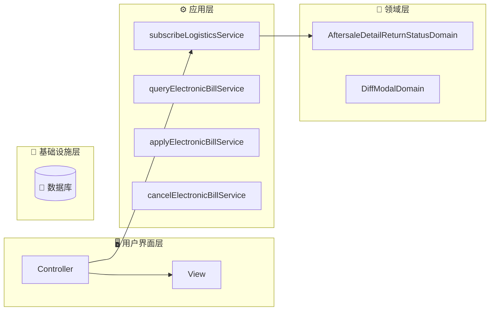

# fulfillment-aftersale-ark - Code Structure Analysis

## 📊 Project Overview
- **Project Name**: fulfillment-aftersale-ark
- **Project Type**: Vue应用
- **Technology Stack**: Vue.js, React, TypeScript, React + TypeScript, Stylus, Sass, Less
- **Architecture Pattern**: 模块化架构
- **Total Files**: 10484
- **Total Code Lines**: 202496
- **Total Entities**: 710


## 📊 Project Architecture Diagrams

### 项目架构依赖图
展示项目主要模块结构和它们之间的依赖关系




---


## 🗂️ Project Directory Structure
```
├── 📁 src/constants
│   ├── Files: 22 files
│   ├── Entities: 70 entities
│   └── Purpose: 项目目录
│
├── 📁 src/providers
│   ├── Files: 2 files
│   ├── Entities: 1 entities
│   └── Purpose: 项目目录
│
├── 📁 src/utils
│   ├── Files: 9 files
│   ├── Entities: 33 entities
│   └── Purpose: 工具函数目录
│
├── 📁 src/containers/AutoAftersale/AfterSaleDetail/constants
│   ├── Files: 2 files
│   ├── Entities: 3 entities
│   └── Purpose: React组件目录
│
├── 📁 src/containers/AutoAftersale/AfterSaleList/constants
│   ├── Files: 1 files
│   ├── Entities: 1 entities
│   └── Purpose: 项目目录
│
├── 📁 src/containers/AutoAftersale/AfterSaleDetail/providers
│   ├── Files: 5 files
│   ├── Entities: 6 entities
│   └── Purpose: 项目目录
│
├── 📁 src/containers/AutoAftersale/utils
│   ├── Files: 1 files
│   ├── Entities: 2 entities
│   └── Purpose: 工具函数目录
│
├── 📁 src/containers/AutoAftersale/hooks
│   ├── Files: 11 files
│   ├── Entities: 14 entities
│   └── Purpose: 项目目录
│
├── 📁 src/containers/AutoAftersale/AfterSaleDetail/hooks
│   ├── Files: 3 files
│   ├── Entities: 2 entities
│   └── Purpose: 项目目录
│
├── 📁 src/containers/AutoAftersale/AfterSaleList/hooks
│   ├── Files: 2 files
│   ├── Entities: 2 entities
│   └── Purpose: 项目目录
│
├── 📁 src/containers/OrderQuery/hooks
│   ├── Files: 1 files
│   ├── Entities: 1 entities
│   └── Purpose: 项目目录
│
├── 📁 src/containers/AutoAftersale/AfterSaleDetail/components
│   ├── Files: 27 files
│   ├── Entities: 27 entities
│   └── Purpose: 组件目录
│
├── 📁 src/containers/AutoAftersale/AfterSaleDetail/components/Negotiate
│   ├── Files: 15 files
│   ├── Entities: 14 entities
│   └── Purpose: Vue组件目录
│
├── 📁 src/containers/AutoAftersale/AfterSaleList/components
│   ├── Files: 14 files
│   ├── Entities: 14 entities
│   └── Purpose: 组件目录
│
├── 📁 src/containers/AutoAftersale/components/TabsLogisticsInfo
│   ├── Files: 9 files
│   ├── Entities: 9 entities
│   └── Purpose: Vue组件目录
│
├── 📁 src/containers/AutoAftersale/AfterSaleDetail/components/ActionModals
│   ├── Files: 8 files
│   ├── Entities: 8 entities
│   └── Purpose: Vue组件目录
│
├── 📁 src/containers/Assistance/components
│   ├── Files: 7 files
│   ├── Entities: 7 entities
│   └── Purpose: 组件目录
│
├── 📁 src/components/GuideLayout
│   ├── Files: 7 files
│   ├── Entities: 6 entities
│   └── Purpose: Vue组件目录
│
├── 📁 src/containers/Assistance/AssistanceMain/components
│   ├── Files: 6 files
│   ├── Entities: 6 entities
│   └── Purpose: 组件目录
│
└── 📁 src/containers/AutoAftersale/AfterSaleList/components/Metrics
    ├── Files: 6 files
    ├── Entities: 6 entities
    └── Purpose: Vue组件目录
```


---


---

## 🌐 Route Configuration Analysis

**Route Config Path**: `/Users/fangqiji/dev/aurora/packages/fulfillment/fulfillment-aftersale-ark/src/config/routes.config.ts`
**Total Routes**: 6

## 📋 Route Page Structure & Entities

## 📁 src/containers/Assistance/AssistanceMain

### 🎯 Directory Purpose
- **Primary Role**: ArkAppOrderAutoAftersale
- **File Count**: 3 files
- **Entity Count**: 3 entities
- **Functional Description**: This directory implements the Automatic After-sales Assistant feature, providing merchants with an automated solution for handling after-sales processes. It serves as the main interface for the after-sales automation tool, containing components for user onboarding (guide), main functionality interface, and the entry point that conditionally renders either the guide or main interface based on user's familiarity with the feature.

### 📋 File Structure & Entities

#### 📄 AssistanceGuide.vue
- **Path**: `src/containers/Assistance/AssistanceMain/AssistanceGuide.vue`
- **Entities**: `Component:AssistanceGuide` (component)
- **Purpose**: Onboarding component that introduces new users to the after-sales assistant tool. It showcases product values such as dispute reduction and efficiency improvement, and guides merchants toward creating their first automated after-sales strategy.

#### 📄 Main.vue
- **Path**: `src/containers/Assistance/AssistanceMain/Main.vue`
- **Entities**: `Component:Main` (component)
- **Purpose**: Core interface of the after-sales assistant that displays performance metrics, strategy templates, and strategy management functionality through a tabbed interface, allowing merchants to monitor and configure their automated after-sales processes.

#### 📄 index.vue
- **Path**: `src/containers/Assistance/AssistanceMain/index.vue`
- **Entities**: `Component:index_05d38588b333` (component)
- **Purpose**: Entry point component that conditionally renders either the AssistanceGuide for first-time users or the Main component for returning users, based on whether they've previously accessed the feature.

### 📦 Dependencies & Relationships
- **Imported Modules**: 
  - The directory relies on configuration modules (`featureConfig`, `productValuesConfig`) to customize the display of features and product values
  - Uses tracking functionality (`useTracker_fc0a96fa87d4`) for user behavior analytics
  - Imports UI components like `Text`, `Space`, `Spinner`, and `Tabs` for interface construction

- **Function Calls**: 
  - `useTracker_fc0a96fa87d4` is called in both AssistanceGuide and Main components, indicating user interactions are being tracked for analytics purposes

- **Component Relations**: 
  - The index component acts as a router/controller that conditionally renders either AssistanceGuide or Main
  - Main component imports and uses specialized sub-components: Metrics (for performance data), AssistanceStrategyListPane (for strategy management), and AssistanceTemplatesPane (for template selection)
  - The components form a hierarchical structure where index is the parent, conditionally rendering either AssistanceGuide or Main, with Main further containing its own child components

---

# 📁 src/containers/Assistance

### 🎯 Directory Purpose
- **Primary Role**: ArkAppOrderAutoAftersaleAdd
- **File Count**: 2 files
- **Entity Count**: 4 entities
- **Functional Description**: This directory implements the Automated After-sales Assistance functionality for the Ark application's order management system. It provides a comprehensive interface for creating and configuring intelligent after-sales strategies that can automate refund processes, monitor logistics, and analyze after-sales data. The module aims to improve dispute resolution, enhance audit efficiency, increase traffic, and provide round-the-clock service capabilities.

### 📋 File Structure & Entities

#### 📄 CreateAssistance.vue
- **Path**: `src/containers/Assistance/CreateAssistance.vue`
- **Entities**: `Component:CreateAssistance` (component)
- **Purpose**: Implements the UI and logic for creating and editing after-sales assistance strategies. This component provides a form-based interface where users can configure after-sales types, order statuses, and automated actions. It includes validation logic, data submission handling, and template selection functionality to streamline the strategy creation process.

#### 📄 constants.ts
- **Path**: `src/containers/Assistance/constants.ts`
- **Entities**: `Variable:productValuesConfig` (variable), `Variable:featureConfig` (variable), `Variable:ASSISTANCE_MAIN_SHOWED` (variable)
- **Purpose**: Defines configuration constants used throughout the Assistance module. This includes product value propositions, feature descriptions, and tracking constants. These configurations drive the UI display and help maintain consistent messaging about the module's capabilities and benefits.

### 📦 Dependencies & Relationships
- **Imported Modules**: 
  - The `CreateAssistance` component imports several sub-components including `index_e6b018a58638`, `ApplyTime`, and `ReasonSelect`, suggesting a modular architecture with specialized components for different aspects of the assistance configuration.
  - The component also leverages utility functions like `useTracker_fc0a96fa87d4` for analytics and `adapterConfigToDelightFormily` for form data transformation.

- **Function Calls**: 
  - `useTracker_fc0a96fa87d4`: Used for tracking user interactions and events within the assistance module.
  - `adapterConfigToDelightFormily`: Converts configuration data to a format compatible with the Formily form system, suggesting the module uses Formily for form handling.

- **Component Relations**: 
  - `CreateAssistance` serves as the main container component that orchestrates several smaller components.
  - It incorporates UI components like `Spinner` for loading states and `Breadcrumb` for navigation.
  - The component likely interacts with `ApplyTime` for scheduling configurations and `ReasonSelect` for defining after-sales reason categorization.
  - The constants defined in `constants.ts` are likely consumed by various components in this module to maintain consistent UI messaging and tracking.

# 📁 src/containers/AutoAftersale/AfterSaleList

### 🎯 Directory Purpose
- **Primary Role**: ArkAppOrderAftersaleList
- **File Count**: 3 files
- **Entity Count**: 5 entities
- **Functional Description**: This directory implements a comprehensive after-sale order management system for merchants. It provides functionality for viewing, filtering, and processing various types of after-sale requests including returns, exchanges, and disputes. The module supports different status tracking, batch operations, logistics information viewing, and specialized handling for time-sensitive cases and disputes that require platform intervention.

### 📋 File Structure & Entities

#### 📄 App.vue
- **Path**: `src/containers/AutoAftersale/AfterSaleList/App.vue`
- **Entities**: `Component:App` (component)
- **Purpose**: Main component that renders the after-sale order list interface with filtering, search, and bulk operation capabilities. It integrates performance optimization through `useTablePerformance` and provides status tracking and logistics information viewing functionality.

#### 📄 const.ts
- **Path**: `src/containers/AutoAftersale/AfterSaleList/const.ts`
- **Entities**: `Variable:DefaultEmptyResult` (variable), `Variable:STATUS_BTNS` (variable), `Variable:SUB_STATUS_BTNS_GRAY` (variable)
- **Purpose**: Defines constants used throughout the after-sale list module, including default empty state displays, status button configurations for different after-sale states, and sub-status filtering options for dispute and logistics interception cases.

#### 📄 index.vue
- **Path**: `src/containers/AutoAftersale/AfterSaleList/index.vue`
- **Entities**: `Component:index_a31431ef66c4` (component)
- **Purpose**: Entry point component that serves as a wrapper for the after-sale list functionality. It integrates banner components and handles route parameter compatibility for tab navigation, providing a complete UI container for the after-sale management experience.

### 📦 Dependencies & Relationships
- **Imported Modules**: 
  - Performance utilities: `useTablePerformance`, `useGlobalLoading`, `customFmpComputed`
  - Status enumerations: `AfterSaleStatusEnum`
  - Process definitions: `statusTypeProcessList_bb8204718c0f`, `MERCHANT_HANDLE_TAGS`
  - Resource management: `RESOURCE_BANNER_KEY`

- **Function Calls**:
  - Analytics tracking: `useTracker_74b5c34e7bd4`
  - Row selection management: `useCheckRow`
  - Merchant data fetching: `postGrayMerchantQuery_519c5071927f`

- **Component Relations**:
  - UI Components: `NewBsBox`, `PlatformMessage`, `TabUpBanner`, `BannerPlacement`
  - The `App.vue` component is the main functional component that's wrapped by `index.vue`
  - Constants from `const.ts` are used by the `App.vue` component to configure status filters, empty states, and sub-status navigation

The module follows a clear separation of concerns with presentation logic in Vue components and configuration data in constant definitions, creating a maintainable structure for the after-sale management functionality.

# Code Analysis Report

## 📁 src/containers/AutoAftersale/AfterSaleDetail

### 🎯 Directory Purpose
- **Primary Role**: ArkAppOrderAftersaleDetail
- **File Count**: 3 files
- **Entity Count**: 3 entities
- **Functional Description**: This directory implements the after-sale order detail functionality for merchants in an e-commerce platform. It provides a comprehensive interface for merchants to view and manage customer after-sale requests, including order information, negotiation history, logistics details, and refund status. The directory supports both a legacy and a newer version of the UI through a gray-release mechanism, allowing for gradual feature rollout and UI modernization while maintaining backward compatibility.

### 📋 File Structure & Entities

#### 📄 index.vue
- **Path**: `src/containers/AutoAftersale/AfterSaleDetail/index.vue`
- **Entities**: `Component:index_7e72b6c2c128` (component)
- **Purpose**: Implements the original version of the after-sale detail page. This component displays comprehensive information about an after-sale order including order status, negotiation proposals, logistics information, and provides merchants with various action buttons to process the after-sale request. It uses NewBsBox and Banner components for UI presentation.

#### 📄 indexV2.vue
- **Path**: `src/containers/AutoAftersale/AfterSaleDetail/indexV2.vue`
- **Entities**: `Component:indexV2` (component)
- **Purpose**: Implements the newer version of the after-sale detail page with an improved UI/UX. This component includes breadcrumb navigation and error handling capabilities through the WithError component. It maintains the same core functionality as the original version but with an enhanced interface and potentially additional features.

#### 📄 basic.vue
- **Path**: `src/containers/AutoAftersale/AfterSaleDetail/basic.vue`
- **Entities**: `Component:basic` (component)
- **Purpose**: Serves as a router component that dynamically determines which version of the after-sale detail page to display based on gray-release configuration. This component enables smooth transition between the legacy and new versions of the UI, allowing for gradual rollout of the new interface to users.

### 📦 Dependencies & Relationships

- **Imported Modules**:
  - `AfterSaleTokens`: Likely provides dependency injection tokens for after-sale related services
  - `AfterSaleDetailData`: A class that likely manages the data model for after-sale details
  - `customFmpComputed`: A function possibly related to performance optimization or computed properties
  - `useGrayConfigByScene`: A hook that determines which UI version to show based on gray-release configuration

- **Function Calls**:
  - `injector.addProviders`: Used in both index.vue and indexV2.vue to register dependency injection providers
  - `useTracker_*`: Different tracking functions used in each version, suggesting analytics tracking for user interactions
  - `useBroadcastChannel`: Likely used for cross-tab communication to keep multiple browser tabs in sync

- **Component Relations**:
  - The `basic.vue` component acts as a router/switcher that conditionally renders either `index.vue` or `indexV2.vue` based on gray-release configuration
  - Both main components (index and indexV2) share similar data dependencies (`AfterSaleTokens`, `AfterSaleDetailData`) but have different UI implementations
  - The newer version (indexV2) includes breadcrumb navigation and explicit error handling that may not be present in the original version

---

# Code Analysis Report

## 📁 src/containers/AutoAftersale/AfterSaleDetail

### 🎯 Directory Purpose
- **Primary Role**: ArkAppOrderAftersaleDetailFromEva
- **File Count**: 3 files
- **Entity Count**: 3 entities
- **Functional Description**: This directory contains components for managing and displaying after-sale order details in an e-commerce platform. It implements a version-controlled approach to UI rendering with both standard and V2 implementations of the detail page. The directory serves as the central hub for merchants to process after-sale requests, view order information, manage logistics, handle refunds, and track the entire after-sale workflow. It supports feature toggling through gray release configurations to enable smooth transitions between UI versions.

### 📋 File Structure & Entities

#### 📄 index.vue
- **Path**: `src/containers/AutoAftersale/AfterSaleDetail/index.vue`
- **Entities**: `Component:index_7e72b6c2c128` (component)
- **Purpose**: Implements the standard version of the after-sale detail page, displaying comprehensive information about after-sale orders including status, negotiation plans, logistics information, and providing various operational controls for merchants to process after-sale requests.

#### 📄 indexV2.vue
- **Path**: `src/containers/AutoAftersale/AfterSaleDetail/indexV2.vue`
- **Entities**: `Component:indexV2` (component)
- **Purpose**: Provides an updated version of the after-sale detail page with enhanced UI/UX, improved layout, and potentially new features. This component handles data initialization, dependency injection, and renders a more modern interface for after-sale management.

#### 📄 basic.vue
- **Path**: `src/containers/AutoAftersale/AfterSaleDetail/basic.vue`
- **Entities**: `Component:basic` (component)
- **Purpose**: Acts as a router component that dynamically switches between the standard and V2 versions of the after-sale detail page based on gray release configurations, enabling gradual rollout of UI changes to users.

### 📦 Dependencies & Relationships

- **Imported Modules**:
  - `AfterSaleTokens`: Dependency injection tokens specific to after-sale functionality
  - `AfterSaleDetailData`: Class that likely manages the data structure for after-sale details
  - `customFmpComputed`: Function for computed property handling, possibly related to performance optimization
  - `useGrayConfigByScene`: Utility for feature toggling based on gray release configurations

- **Function Calls**:
  - `injector.addProviders`: Used for dependency injection setup in both index and indexV2
  - `useTracker_*`: Tracking functions for analytics, with different implementations for each version
  - `useBroadcastChannel`: Likely used for cross-tab/window communication to keep after-sale data in sync

- **Component Relations**:
  - `basic.vue` acts as a router/controller that conditionally renders either `index.vue` or `indexV2.vue`
  - Both detail implementations (`index.vue` and `indexV2.vue`) share common dependencies like `AfterSaleTokens` and `AfterSaleDetailData`
  - `index.vue` uses components like `NewBsBox` and `Banner` for UI rendering
  - `indexV2.vue` uses components like `Breadcrumb` and `WithError` for enhanced navigation and error handling

The directory implements a pattern for gradual UI updates through feature toggling, allowing the application to smoothly transition users from the original after-sale detail interface to an improved version while maintaining functionality.

---

# 📁 src/containers/MicroRemittance

### 🎯 Directory Purpose
- **Primary Role**: ArkAppOrderMicroRemittance
- **File Count**: 2 files
- **Entity Count**: 3 entities
- **Functional Description**: This directory implements a micro remittance system for order-related payments. It provides functionality for managing small payment transfers, displaying order information, and tracking payment records. The module handles both the UI presentation of payment data and the operational flow for initiating and monitoring remittances, serving as an essential component in the order payment processing pipeline.

### 📋 File Structure & Entities

#### 📄 config.ts
- **Path**: `src/containers/MicroRemittance/config.ts`
- **Entities**: `Variable:packageInfoColumn_311fd19a3fef` (variable), `Variable:recordColumn_22253cc1badb` (variable)
- **Purpose**: Defines configuration for table columns used in the micro remittance interface, specifying how order information and payment records should be displayed in the UI.

#### 📄 index.vue
- **Path**: `src/containers/MicroRemittance/index.vue`
- **Entities**: `Component:index_dd05eeb8dbb8` (component)
- **Purpose**: Serves as the main container component for the micro remittance feature, managing the activation state of the remittance functionality and rendering the appropriate UI based on that state.

### 📦 Dependencies & Relationships
- **Imported Modules**: 
  - `Component:index_55a2805ca84a`: Likely a base component or layout component
  - `Component:Remittance`: The core component that implements remittance functionality

- **Component Relations**: 
  - The main container component (`index_dd05eeb8dbb8`) uses `Skeleton` for loading states
  - `WithError` component is used for error handling and display
  - The container manages the activation flow for the remittance feature, conditionally rendering either an activation entry point or the actual remittance interface

- **Data Structure**:
  - `packageInfoColumn_311fd19a3fef` defines columns for order information including product details, pricing, received payments, and after-sales status
  - `recordColumn_22253cc1badb` defines columns for payment records including order numbers, payment IDs, payment status, initiator information, timestamps, payment reasons, and amounts

The architecture follows a clear separation between configuration (table definitions in config.ts) and the component implementation (in index.vue), allowing for flexible UI representation of the remittance data.


---

# 项目架构综合分析报告：fulfillment-aftersale-ark

## 🏗️ 项目架构概述

`fulfillment-aftersale-ark` 是一个基于 Vue.js 和 TypeScript 构建的售后服务管理系统，采用了分层架构模式并融合了领域驱动设计(DDD)的思想。该项目拥有超过10,000个文件和700多个实体，是一个规模较大的前端应用。

### 核心技术栈

- **前端框架**：Vue.js 作为主要框架，部分组件使用 React
- **语言**：TypeScript 作为主要开发语言
- **样式处理**：Stylus, Sass, Less
- **状态管理**：Vuex
- **路由模式**：基于文件的路由系统
- **微前端架构**：项目采用微前端架构模式

## 🏛️ 领域驱动设计(DDD)分析

项目明确采用了领域驱动设计的思想，通过以下元素体现：

### 领域划分

项目主要围绕"售后服务"这一核心领域展开，主要领域包括：
- `containers` - 包含了主要的业务容器组件

### 领域实体

项目中定义了清晰的领域实体，主要包括：
- `AftersaleDetailReturnStatusDomain` - 售后退货状态领域
- `DiffModalDomain` - 差异对话框领域

这些实体封装了特定业务领域的数据和行为，体现了DDD中实体的概念。

### 领域服务

项目中定义了多个领域服务，用于处理跨实体的业务逻辑：
- `subscribeLogisticsService` - 物流服务订阅
- `queryElectronicBillService` - 电子单据查询服务
- `applyElectronicBillService` - 电子单据申请服务
- `cancelElectronicBillService` - 电子单据取消服务

这些服务封装了特定领域的业务逻辑，提供了领域操作的接口。

### 数据流分析

通过分析项目的数据流，可以看出项目遵循了清晰的领域边界和依赖关系：

1. 入口文件 `src/index.ts` 负责应用的引导和挂载
2. 服务层（如 `src/service/autoAftersale.ts`）提供了与后端API交互的功能
3. 领域层（如 `AftersaleDetailReturnStatusDomain`）封装了业务逻辑和规则
4. 表现层（如各种Vue组件）负责UI渲染和用户交互

数据流向遵循了自上而下的原则，高层组件通过依赖注入使用低层服务，体现了DDD中的依赖倒置原则。

## 📐 架构模式分析

### 分层架构

项目采用了典型的分层架构模式，主要分为以下几层：

1. **表现层（Presentation Layer）**
   - 位于 `src/containers` 和 `src/components` 目录
   - 包含所有UI组件和用户交互逻辑
   - 使用Vue组件体系构建

2. **业务层（Business Layer）**
   - 位于 `src/service` 目录
   - 包含业务逻辑和服务
   - 处理复杂的业务规则和流程

3. **数据层（Data Layer）**
   - 负责数据获取和处理
   - 包含API调用和数据转换逻辑

4. **基础设施层（Infrastructure Layer）**
   - 位于 `src/utils` 目录
   - 提供通用工具和服务
   - 处理跨切面关注点如日志、缓存等

### 微前端架构

项目采用了微前端架构，这从入口文件的 `bootstrap`, `mount`, `unmount` 函数可以看出，这是典型的微前端生命周期函数。这种架构允许项目作为更大系统中的一个模块独立开发和部署。

## 🧩 组件结构分析

项目组件结构清晰，主要分为三类：

### 业务组件（Business Components）

项目包含大量业务组件，主要位于 `src/containers` 目录下，如：
- `AutoAftersale` - 自动售后处理相关组件
- `Assistance` - 售后协助相关组件
- `MicroRemittance` - 微汇款相关组件

这些组件封装了特定业务领域的UI和交互逻辑。

### UI组件（UI Components）

项目包含多个UI组件，主要位于 `src/components` 目录下，如：
- `GuideLayout` - 引导布局组件
- `InputRange` - 范围输入组件
- `MultiSelectCell` - 多选单元格组件

这些组件专注于UI表现，不包含业务逻辑。

### 工具组件（Utility Components）

项目还包含一些工具性质的组件，用于提供通用功能。

## 📊 前端架构特点

### 状态管理

项目使用 Vuex 进行状态管理，这从项目结构和组件依赖关系可以看出。

### 路由模式

项目采用基于文件的路由系统，这种模式使路由结构更加直观和易于维护。

### 表单架构

项目使用原生表单管理方式，没有采用特定的表单库。表单组件包括：
- 日期格式化组件
- 金额格式化组件
- 表格性能优化组件

## 🔍 代码组织分析

项目代码组织具有以下特点：

1. **按功能组织** - 代码主要按功能模块组织，如售后服务、物流服务等
2. **按类型组织** - 在功能模块内部，代码按类型（组件、服务、工具等）组织
3. **模块化程度** - 项目模块化程度较高，模块化评分为25分

## 💡 架构亮点与最佳实践

1. **领域驱动设计的应用**
   - 清晰的领域边界和实体定义
   - 领域服务的合理抽象
   - 依赖注入的使用（如 `injector.addProviders`）

2. **微前端架构的采用**
   - 标准的微前端生命周期函数
   - 独立可部署的模块设计

3. **组件化设计**
   - 高度组件化的UI设计
   - 业务组件和UI组件的清晰分离

4. **性能优化措施**
   - 表格性能优化（`useTablePerformance`）
   - 异步状态管理（`useAsyncState`）
   - 广播通道使用（`useBroadcastChannel`）

5. **用户体验增强**
   - 引导步骤设计（`guideSteps`）
   - 详细的错误处理和提示
   - 响应式设计

## 🚀 改进建议

1. **增强领域模型**
   - 可以进一步完善值对象（Value Objects）和聚合（Aggregates）的使用
   - 考虑引入更多的领域事件来处理跨领域通信

2. **状态管理优化**
   - 考虑使用更现代的状态管理方案，如Pinia或Composition API
   - 减少全局状态的使用，更多地使用组件本地状态

3. **代码分割与懒加载**
   - 增加路由级别的代码分割
   - 对大型组件实施懒加载策略

4. **测试覆盖率提升**
   - 增加单元测试和集成测试
   - 引入端到端测试框架如Cypress

5. **文档完善**
   - 增加架构决策记录（ADR）
   - 完善组件和API文档

## 📝 总结

`fulfillment-aftersale-ark` 项目是一个结构良好、采用现代前端架构的售后服务管理系统。它成功地将领域驱动设计的思想应用到前端开发中，通过清晰的分层架构和组件化设计，实现了高度可维护和可扩展的代码库。项目采用的微前端架构也为系统的独立开发和部署提供了便利。

虽然项目整体架构设计合理，但在领域模型的完善、状态管理的现代化、代码分割与懒加载、测试覆盖率和文档完善等方面仍有提升空间。通过针对这些方面的改进，项目可以进一步提高代码质量和开发效率。

## 📂 Detailed Directory Analysis
# 📁 src/constants

### 🎯 Directory Purpose
- **Primary Role**: 项目常量定义目录
- **File Count**: 22 files
- **Entity Count**: 10 entities
- **Functional Description**: 该目录作为项目的常量定义中心，存储了系统中各个模块所需的枚举值、状态映射、错误码和配置选项等。这些常量为整个应用提供了统一的数据字典和状态定义，确保了代码的一致性和可维护性。主要涵盖了电商系统中的售后服务、仓储物流、假一赔四服务以及仲裁系统等核心业务模块的常量定义。

### 📋 File Structure & Entities

#### 📄 afterSale.ts
- **Path**: `src/constants/afterSale.ts`
- **Entities**: `Variable:afterSaleTypes_e78302b9df73` (variable), `Variable:statusTypeProcessList_bb8204718c0f` (variable), `Variable:afterSaleStatus_13fc29c650d0` (variable), 等
- **Purpose**: 定义电商平台售后服务相关的常量，包括售后类型（退款、退货退款、换货）、售后状态流程和各种状态的映射关系，为售后系统提供标准化的数据定义。

#### 📄 bonded.ts
- **Path**: `src/constants/bonded.ts`
- **Entities**: `Variable:PURCHASE_INBOUND_STATUS_MAP` (variable), `Variable:PURCHASE_INBOUND_STATUS_OPTIONS` (variable), `Variable:TRANSFER_INBOUND_STATUS_MAP` (variable), 等
- **Purpose**: 定义仓储物流系统中的各种状态映射和选项，包括采购入库、调拨入库/出库的状态流转、运输方式、集装箱类型和库存更新状态等，为仓储管理系统提供标准化的数据字典。

#### 📄 compensateFour.ts
- **Path**: `src/constants/compensateFour.ts`
- **Entities**: `Variable:ErrorCode_b35ca93ef25a` (variable), `Variable:StatusCode` (variable), `Variable:ValidateErrorMsg` (variable), `Variable:SwitchErrorMsg` (variable)
- **Purpose**: 定义"假一赔四"服务相关的常量，包括服务开通状态码、错误码以及对应的错误提示信息，用于商家开通和管理假一赔四服务时的状态控制和错误处理。

#### 📄 arbitrate.ts
- **Path**: `src/constants/arbitrate.ts`
- **Entities**: `Variable:ArbitrateTicketStatusColorMap` (variable)
- **Purpose**: 定义仲裁系统中工单状态与UI显示颜色的映射关系，用于在界面上以不同颜色直观展示不同状态的仲裁工单，提升用户体验。

### 📦 Dependencies & Relationships
- **Imported Modules**: 从分析的实体信息来看，这些常量文件大多是独立的，没有显示导入其他模块，这符合常量定义文件的最佳实践，保持了低耦合性。
- **Function Calls**: 常量定义文件中通常不包含函数调用，主要是静态数据的声明，这些常量被其他业务模块引用。
- **Component Relations**: 这些常量主要被UI组件和业务逻辑模块引用，例如：
  - `afterSale.ts`中的常量可能被售后管理相关组件使用
  - `bonded.ts`中的状态映射被仓储管理界面使用
  - `compensateFour.ts`中的错误信息被假一赔四服务的开通流程使用
  - `arbitrate.ts`中的颜色映射被仲裁工单列表组件使用

这些常量文件共同构成了项目的数据字典层，为业务逻辑和UI展示提供了统一的数据定义标准，有效降低了代码重复和维护成本。

# 📁 src/providers

### 🎯 Directory Purpose
- **Primary Role**: 项目目录
- **File Count**: 2 files
- **Entity Count**: 1 entities
- **Functional Description**: 该目录作为项目的服务提供者层，主要负责封装和管理与后端API的通信逻辑。它包含了售后服务相关的API调用封装，为应用的其他部分提供了一个统一的接口来访问后端服务，从而实现了业务逻辑与数据访问的分离。

### 📋 File Structure & Entities

#### 📄 Api.ts
- **Path**: `src/providers/Api.ts`
- **Entities**: `Class:Api` (class)
- **Purpose**: 封装售后服务相关的API调用，实现IApi接口，提供统一的后端通信方法

#### 📄 [未知文件]
- **Path**: 未提供具体信息
- **Entities**: 未检测到实体
- **Purpose**: 目录中存在第二个文件，但未提供详细信息

### 📦 Dependencies & Relationships
- **Imported Modules**:
  - `IApi`: 被Api类实现的接口，定义了API通信的标准方法
  - `getReturnsId`: 用于获取退货/退款ID的函数
  - `postPreCheckBeforeDelivery`: 发货前预检查的函数

- **Function Calls**:
  - `postReturnsId`: 提交退货/退款ID的函数
  - `postRejectWithDialog`: 处理拒绝操作并显示对话框的函数
  - `postRejectWarningCheck`: 执行拒绝操作前的警告检查函数

- **Component Relations**:
  - `Class:Api` 实现了 `IApi` 接口，提供了售后服务所需的各种API调用方法
  - 该类作为服务层组件，可能被上层的控制器或视图组件调用
  - 根据其功能描述，该API类专注于售后服务流程，包括退款、协商、地址解析、拒绝原因查询等功能

### 💡 Key Insights
- 该目录采用了提供者模式，将API调用逻辑封装在专门的类中
- `Api.ts` 中的 `Api` 类实现了接口隔离原则，通过实现 `IApi` 接口提供标准化的API访问方法
- 该目录的结构表明项目可能采用了分层架构，将数据访问层与业务逻辑层分离
- 售后服务相关的功能被集中管理，便于维护和扩展

# 📁 src/utils

### 🎯 Directory Purpose
- **Primary Role**: 工具函数目录
- **File Count**: 9 files
- **Entity Count**: 6 entities
- **Functional Description**: 该目录包含项目中使用的各种通用工具函数，提供了从价格格式化、时间处理、DOM操作到表单配置转换等多种功能。这些工具函数旨在提高代码复用性，减少重复代码，并为项目提供标准化的工具方法。目录中的函数涵盖了日常开发中常见的辅助功能，如货币单位转换、时间格式化、元素事件监听等，是项目基础设施的重要组成部分。

### 📋 File Structure & Entities

#### 📄 common.ts
- **Path**: `src/utils/common.ts`
- **Entities**: `Function:toCnPrice_d5ba974e9e62` (function), `Function:formatTimeRange_3d64eb7062e0` (function), `Function:formatTime_fd46c92f6953` (function), 以及多个其他工具函数和变量
- **Purpose**: 提供各种通用工具函数，包括价格格式化（元/分转换）、时间格式化、数组处理、性能测量、URL构建、文件下载和文本复制等功能。这是工具目录中最核心的文件，包含了大量日常开发中常用的辅助方法。

#### 📄 decryption.ts
- **Path**: `src/utils/decryption.ts`
- **Entities**: `Function:isDecryptionGraySeller` (function)
- **Purpose**: 提供与解密和灰度功能相关的工具函数，特别是用于判断商家是否命中解密限额灰度的功能。该文件实现了结果缓存机制，避免重复请求，提高应用性能。

#### 📄 element.ts
- **Path**: `src/utils/element.ts`
- **Entities**: `Function:setElementListener_712dfa278cd2` (function)
- **Purpose**: 提供DOM元素操作相关的工具函数，特别是简化事件监听器的添加过程。通过选择器查找元素并绑定事件，使DOM操作更加便捷和统一。

#### 📄 formily.ts
- **Path**: `src/utils/formily.ts`
- **Entities**: `Function:adapterConfigToDelightFormily` (function)
- **Purpose**: 提供与Formily表单库相关的工具函数，主要用于将普通配置对象转换为Delight Formily格式，添加装饰器配置，优化表单布局和展示效果。

### 📦 Dependencies & Relationships
- **Imported Modules**: 
  - `decryption.ts` 导入并使用了 `decryptionGraySeller` 函数，表明该目录可能依赖于某个解密服务或API
  - 整体上看，该工具目录的依赖较少，主要提供独立的工具函数

- **Function Calls**: 
  - `isDecryptionGraySeller` 调用 `decryptionGraySeller` 函数获取商家灰度状态
  - 大多数工具函数都是独立的，不依赖其他函数调用，体现了良好的模块化设计

- **Component Relations**: 
  - `adapterConfigToDelightFormily` 函数与Formily表单组件库相关，用于适配表单配置
  - `setElementListener_712dfa278cd2` 函数与DOM元素交互，可能被各种UI组件使用
  - 整体上，这些工具函数为项目中的组件提供基础支持，但不直接参与组件渲染

---

# 📁 src/containers/AutoAftersale/AfterSaleDetail/constants

## 🎯 Directory Purpose
- **Primary Role**: React组件目录
- **File Count**: 2 files
- **Entity Count**: 3 entities
- **Functional Description**: 该目录包含售后详情页面所需的常量定义和配置信息。它主要提供了用户引导步骤配置、UI展示类型枚举以及功能标识符常量，为售后服务流程中的各种交互场景和UI展示提供统一的配置源。这些常量确保了售后处理流程中的一致性和可维护性，使开发者能够在整个应用中统一引用这些预定义值。

## 📋 File Structure & Entities

### 📄 index.tsx
- **Path**: `src/containers/AutoAftersale/AfterSaleDetail/constants/index.tsx`
- **Entities**: 
  - `Function:guideSteps` (function)
  - `Variable:AFTERSALE_DETAIL_FREIGHT_RECOMMEND_MODAL` (variable)
  - `Variable:BannerTypeEnum_b1886456b03f` (variable)
- **Purpose**: 定义售后详情页面所需的常量和配置，包括用户引导步骤、功能标识符和UI展示类型枚举，为售后处理流程提供统一的配置源。

### 🔍 Entity Details

#### Function:guideSteps
- **Type**: 函数
- **Description**: 配置售后详情页的功能引导步骤，包括拦拒自动退、快递拦截、协商修改售后等功能的说明，并根据用户历史引导记录过滤不需要再次展示的引导项。
- **Usage Context**: 在售后详情页面初始化时调用，为新用户或特定功能提供引导说明。

#### Variable:AFTERSALE_DETAIL_FREIGHT_RECOMMEND_MODAL
- **Type**: 变量（常量）
- **Description**: 售后详情页面中用于标识运费推荐模态框的常量标识符，用于在售后处理流程中展示运费相关的推荐信息或选项。
- **Usage Context**: 在处理运费相关操作时，用于标识和控制模态框的显示。

#### Variable:BannerTypeEnum_b1886456b03f
- **Type**: 变量（枚举常量）
- **Description**: 售后详情页面中横幅提示类型的枚举常量，定义了四种不同的提示类型：信息(info)、成功(success)、警告(warning)和危险(danger)。
- **Usage Context**: 用于统一管理和控制页面中各种提示横幅的展示样式。

## 📦 Dependencies & Relationships
- **Imported Modules**: 
  - `IGuideConfig`: 所有三个实体都导入了这个类型定义，表明它是用户引导配置的核心接口，定义了引导步骤的结构和属性。

- **Function Calls**: 
  - 从提供的信息中未发现明显的函数调用关系，但`guideSteps`函数可能在售后详情页面初始化时被调用。

- **Component Relations**: 
  - 这些常量和配置主要被售后详情页面的组件使用，特别是：
    - `guideSteps`可能被用户引导组件使用
    - `AFTERSALE_DETAIL_FREIGHT_RECOMMEND_MODAL`可能被模态框组件引用
    - `BannerTypeEnum_b1886456b03f`可能被横幅提示组件使用

这些常量和配置共同构成了售后详情页面的基础配置层，为UI展示和用户交互提供统一的规范和定义。

# 📁 src/containers/AutoAftersale/AfterSaleList/constants

### 🎯 Directory Purpose
- **Primary Role**: 项目目录，存储售后服务列表相关的常量定义
- **File Count**: 1 files
- **Entity Count**: 1 entities
- **Functional Description**: 该目录作为售后服务模块中的常量定义区域，主要存储与售后服务列表界面相关的配置常量。目前包含一个用于本地存储的键名常量，用于控制售后指南的显示状态。这些常量为整个售后服务模块提供统一的配置参考点，确保在不同组件间使用相同的键值，提高代码的可维护性和一致性。

### 📋 File Structure & Entities

#### 📄 index.ts
- **Path**: `src/containers/AutoAftersale/AfterSaleList/constants/index.ts`
- **Entities**: `Variable:AftersaleGuideVisibilityKey` (variable)
- **Purpose**: 定义售后服务列表页面所需的常量，特别是用于本地存储的键名。该文件作为常量的集中管理点，使得售后服务列表相关组件可以引用统一的常量值，避免硬编码和重复定义。

### 📦 Dependencies & Relationships
- **Imported Modules**: 无外部导入依赖，这是一个纯常量定义文件
- **Function Calls**: 无函数调用
- **Component Relations**: 该常量文件被售后服务列表相关组件引用，特别是那些需要控制或检查售后指南显示状态的组件。`AftersaleGuideVisibilityKey`常量可能被用于localStorage或其他存储机制中，以保存用户对售后指南显示的偏好设置，使系统能够记住用户是否希望显示售后指南。

---

# 📁 src/containers/AutoAftersale/AfterSaleDetail/providers

## 🎯 Directory Purpose
- **Primary Role**: 项目目录
- **File Count**: 5 files
- **Entity Count**: 5 entities
- **Functional Description**: 该目录是售后服务详情页面的核心提供者（providers）集合，采用领域驱动设计模式，实现了售后服务各个功能域的业务逻辑封装。它通过依赖注入机制提供地址管理、售后状态处理、售后操作拒绝等功能模块，使售后详情页面的各个组件能够共享状态和行为，降低组件间耦合度，提高代码可维护性和可测试性。

## 📋 File Structure & Entities

### 📄 AftersaleAddressFieldDomain.ts
- **Path**: `src/containers/AutoAftersale/AfterSaleDetail/providers/AftersaleAddressFieldDomain.ts`
- **Entities**: `Class:AftersaleAddressFieldDomain_fdc4d199af1a` (class)
- **Purpose**: 实现售后地址字段的域模型，负责获取和管理售后地址列表数据，提供地址选项格式化、加载状态管理和默认地址选择功能，支持分页加载多达20页的地址数据。

### 📄 AftersaleDetailReturnStatusDomain.ts
- **Path**: `src/containers/AutoAftersale/AfterSaleDetail/providers/AftersaleDetailReturnStatusDomain.ts`
- **Entities**: `Class:AftersaleDetailReturnStatusDomain_923fe68131fe` (class)
- **Purpose**: 管理售后详情页状态的域模型，处理售后单点击事件执行和状态更新，集成了前置弹窗配置的消费逻辑，提供退款、拒绝、延期、快递拦截等多种售后操作功能。

### 📄 AftersaleOperateRefuseDomain.ts
- **Path**: `src/containers/AutoAftersale/AfterSaleDetail/providers/AftersaleOperateRefuseDomain.ts`
- **Entities**: `Class:AftersaleOperateRefuseDomain_5b37bdc0a6a0` (class)
- **Purpose**: 封装售后拒绝相关操作的域模型，处理拒绝售后、延长处理时间、联系买家、协商修改、同意退回后退款和开启自动拒绝等功能，并进行操作追踪。

### 📄 index.ts
- **Path**: `src/containers/AutoAftersale/AfterSaleDetail/providers/index.ts`
- **Entities**: `Variable:injector` (variable), `Variable:index_dc8c19d8fc3e` (variable)
- **Purpose**: 配置和导出售后服务的依赖注入器，注册各种服务提供者，包括售后地址字段域、API服务和售后协商提供者等，实现组件间的依赖管理和服务注入。

## 📦 Dependencies & Relationships

### Imported Modules
- **核心域模型**：`AftersaleAddressFieldDomain`、`AftersaleDetailReturnStatusDomain`、`AftersaleOperateRefuseDomain` - 各自封装特定功能域的业务逻辑
- **服务提供者**：`AfterSaleProviders`、`AftersaleNegotiateProviders` - 提供售后服务和协商相关的功能
- **API服务**：`API_TOKEN` - 用于注册API服务，处理与后端的通信
- **配置常量**：`AfterSaleTokens`、`afterSalePreCheckButtonDesc` - 提供售后服务相关的配置信息

### Function Calls
- **数据获取**：`getAddressList` - 获取地址列表数据
- **灰度配置**：`useGrayConfigByScene` - 根据场景获取灰度配置
- **操作追踪**：`useTracker_b0455b3c44c1` - 追踪用户操作
- **API调用**：`postAgreeAutoRejectAudit` - 发送同意自动拒绝审核的请求

### Component Relations
- **依赖注入模式**：通过`injector`实例注册和管理各种服务提供者，实现组件间的松耦合
- **域模型分离**：将售后服务的不同功能域（地址管理、状态处理、操作拒绝）分离为独立的域模型类
- **服务共享**：各域模型可以通过依赖注入共享数据和功能，如`AftersaleOperateRefuseDomain`依赖`AfterSaleDetailData`

这种架构设计使售后详情页面的各个组件能够通过依赖注入获取所需的服务和数据，降低了组件间的直接依赖，提高了代码的可维护性和可测试性。

# 📁 src/containers/AutoAftersale/utils

### 🎯 Directory Purpose
- **Primary Role**: 工具函数目录
- **File Count**: 1 files
- **Entity Count**: 2 entities
- **Functional Description**: 该目录包含汽车售后服务相关的工具函数，主要负责处理NPS（Net Promoter Score，净推荐值）调查问卷的触发逻辑。这些工具函数在售后服务流程中扮演重要角色，通过在适当时机触发用户满意度调查，帮助业务团队收集用户反馈，评估服务质量，并为服务改进提供数据支持。

### 📋 File Structure & Entities

#### 📄 nps.ts
- **Path**: `src/containers/AutoAftersale/utils/nps.ts`
- **Entities**: `Function:triggerAftersaleNps` (function), `Function:triggerAftersaleNpsInDetail` (function)
- **Purpose**: 提供售后服务NPS调查问卷触发的工具函数，根据不同的售后类型和用户行为触发相应的满意度调查。

### 📦 Dependencies & Relationships
- **Imported Modules**:
  - `AfterSaleEnum`: 售后服务枚举类，用于区分不同类型的售后服务
  - `Aftersale2NpsEventName`: 售后服务类型到NPS事件名称的映射变量
  - `performancePageDurationGreaterSecond_5ebac9593cf3`: 用于检测页面停留时间的函数

- **Function Calls**:
  - `performancePageDurationGreaterSecond_5ebac9593cf3`: 检测用户在页面的停留时间是否超过指定秒数
  - `npsTrigger`: 触发NPS调查问卷的核心函数

- **Component Relations**:
  - `triggerAftersaleNps` 和 `triggerAftersaleNpsInDetail` 两个函数具有相似的功能结构，都依赖于相同的导入模块，并调用相同的函数。它们可能分别用于不同场景下的NPS触发（一个用于列表页，一个用于详情页）。
  - 这两个函数都遵循相同的逻辑模式：检查页面停留时间 > 根据售后类型确定NPS事件 > 触发相应的NPS调查。

### 💡 Key Insights
- 该工具目录虽然文件数量少，但功能明确，专注于NPS调查触发的场景处理
- 函数设计考虑了用户体验，通过检测页面停留时间（超过10秒）来确保用户已经有足够的页面浏览体验再触发调查
- 代码结构表明系统对不同类型的售后服务采用了不同的NPS调查策略，体现了业务的精细化运营

# 📁 src/containers/AutoAftersale/hooks

### 🎯 Directory Purpose
- **Primary Role**: 项目目录
- **File Count**: 11 files
- **Entity Count**: 5 entities
- **Functional Description**: 该目录包含了电商系统中售后业务相关的自定义React Hooks集合，主要负责处理售后流程中的各种业务逻辑，包括售后操作权限控制、售后类型判断、售后操作按钮管理以及售后提醒功能等。这些hooks作为可复用的业务逻辑单元，为售后管理系统提供了统一的状态管理和行为控制能力，降低了组件间的耦合度。

### 📋 File Structure & Entities

#### 📄 useAction.ts
- **Path**: `src/containers/AutoAftersale/hooks/useAction.ts`
- **Entities**: `Function:useRemoteAction` (function), `Function:useLocalAction` (function)
- **Purpose**: 提供售后操作按钮的状态管理和行为控制，分别针对详情页和列表页场景，处理如拒绝收货、物流签收和延期收货等操作的权限和展示逻辑。

#### 📄 useAfterSale.ts
- **Path**: `src/containers/AutoAftersale/hooks/useAfterSale.ts`
- **Entities**: `Function:useAfterSale` (function)
- **Purpose**: 提供售后类型判断的核心逻辑，根据售后单信息计算并返回不同售后类型（换货、退货、退款等）的状态标识，作为其他hooks和组件的基础判断依据。

#### 📄 useAfterSaleAssistant.ts
- **Path**: `src/containers/AutoAftersale/hooks/useAfterSaleAssistant.ts`
- **Entities**: `Function:useAfterSaleAssistant` (function)
- **Purpose**: 实现售后小助手功能，管理售后过程中的各类提醒弹窗（如运费宝推荐、快递拦截提醒等），并处理用户交互行为的数据追踪和频率控制。

#### 📄 useButtonAuth.ts
- **Path**: `src/containers/AutoAftersale/hooks/useButtonAuth.ts`
- **Entities**: `Function:useButtonAuth` (function)
- **Purpose**: 管理售后流程中各种操作按钮的权限控制，根据售后类型和当前状态动态计算不同操作按钮的显示权限，支持多种售后场景和跨境订单特殊处理。

### 📦 Dependencies & Relationships
- **Imported Modules**: 
  - 核心依赖于多个枚举类型（`EActionCode`, `AfterSaleEnum`, `AfterSaleStatusEnum`）来标准化售后状态和操作码
  - 使用`useTracker`进行用户行为数据追踪
  - 引入`FreightReminderDialog`等UI组件处理交互界面

- **Function Calls**: 
  - `useButtonAuth`和`useAction`依赖于`useAfterSale`提供的售后类型判断
  - `useAfterSaleAssistant`调用`getHomePopup`获取弹窗配置
  - `useButtonAuth`调用`useArbitrate`处理仲裁相关逻辑

- **Component Relations**: 
  - 这些hooks形成了层次化的依赖结构，其中`useAfterSale`作为基础层提供类型判断
  - `useButtonAuth`作为中间层处理权限逻辑
  - `useAction`和`useAfterSaleAssistant`作为应用层提供具体业务功能
  - 整体设计遵循了关注点分离原则，每个hook专注于特定的业务领域

# 📁 src/containers/AutoAftersale/AfterSaleDetail/hooks

### 🎯 Directory Purpose
- **Primary Role**: 项目目录
- **File Count**: 3 files
- **Entity Count**: 2 entities
- **Functional Description**: 该目录包含售后详情页面所需的自定义React钩子函数，主要负责处理售后流程中的用户引导和行为追踪功能。这些钩子函数为售后详情页面提供了行为建议提示、用户操作埋点等核心功能支持，帮助优化用户体验并收集用户行为数据，是售后服务流程中的重要辅助模块。

### 📋 File Structure & Entities

#### 📄 useDetailReachGuide.ts
- **Path**: `src/containers/AutoAftersale/AfterSaleDetail/hooks/useDetailReachGuide.ts`
- **Entities**: `Function:useDetailReachGuide` (function)
- **Purpose**: 实现售后详情页的引导提示功能，监听售后信息变化，在满足特定条件时向后端请求行为建议，并以弹窗形式向商家用户展示指导信息，帮助商家更好地处理售后事务。

#### 📄 useTracker.ts
- **Path**: `src/containers/AutoAftersale/AfterSaleDetail/hooks/useTracker.ts`
- **Entities**: `Function:useTracker_b0455b3c44c1` (function)
- **Purpose**: 提供售后详情页面的埋点追踪功能，包含多种埋点方法，用于记录和分析用户在售后流程中的各种操作行为，如按钮点击、弹窗操作和协商方案等交互行为，为产品优化提供数据支持。

### 📦 Dependencies & Relationships
- **Imported Modules**: 
  - `useDetailReachGuide`钩子依赖`postSellerBehaviorSuggestion`函数，该函数可能是一个API调用，用于获取商家行为建议
  - 未检测到`useTracker`钩子的外部依赖，可能是一个相对独立的功能模块

- **Function Calls**: 
  - `useDetailReachGuide`调用`postSellerBehaviorSuggestion`函数获取行为建议数据
  - `useTracker`提供多个埋点方法，但未检测到具体的外部函数调用

- **Component Relations**: 
  - 这两个钩子函数可能被售后详情页面组件直接引用
  - `useDetailReachGuide`可能与弹窗组件配合使用，用于展示行为建议
  - `useTracker`提供的埋点方法可能被页面中的各个交互组件调用，用于记录用户行为

---

# 📁 src/containers/AutoAftersale/AfterSaleList/hooks

### 🎯 Directory Purpose
- **Primary Role**: 项目目录
- **File Count**: 2 files
- **Entity Count**: 2 entities
- **Functional Description**: 该目录包含售后管理系统列表页面所需的自定义React钩子函数，主要提供埋点追踪和搜索配置功能。这些钩子函数为售后列表页面提供了用户行为数据收集和多维度筛选条件配置的能力，是售后管理系统用户交互和数据筛选的核心支持模块。

### 📋 File Structure & Entities

#### 📄 useTracker.ts
- **Path**: `src/containers/AutoAftersale/AfterSaleList/hooks/useTracker.ts`
- **Entities**: `Function:useTracker_74b5c34e7bd4` (function)
- **Purpose**: 提供售后列表页面的埋点追踪功能，封装了多种埋点事件方法，包括操作按钮点击、筛选条件选择、列表曝光等事件追踪，用于收集和分析用户在售后管理系统中的交互行为数据。

#### 📄 useSearchConfig.ts
- **Path**: `src/containers/AutoAftersale/AfterSaleList/hooks/useSearchConfig.ts`
- **Entities**: `Function:useSearchConfig` (function)
- **Purpose**: 构建售后列表的搜索配置，提供售后状态、类型、物流、时间等多维度筛选条件，支持灰度配置，为售后管理系统的搜索界面提供数据结构和配置选项。

### 📦 Dependencies & Relationships
- **Imported Modules**:
  - `OtherTimeCell_b21e90ff37eb`: 自定义时间选择组件，用于搜索配置中的时间筛选
  - `afterSaleStatus_13fc29c650d0`: 售后状态常量定义，提供状态筛选选项
  - `merchantHandleTagsOptions`: 商家处理标签选项，用于筛选条件配置

- **Function Calls**:
  - `getReturnReasons`: 获取退货原因列表，为搜索配置提供退货原因筛选选项
  - `useGrayConfigByScene`: 灰度配置钩子，根据不同场景提供差异化的功能配置

- **Component Relations**:
  - `useSearchConfig` 依赖于 `OtherTimeCell` 组件来实现时间筛选功能
  - `useSearchConfig` 使用 `afterSaleStatus` 和 `merchantHandleTagsOptions` 构建筛选选项
  - 两个钩子函数共同服务于售后列表页面，`useTracker` 负责用户行为数据收集，`useSearchConfig` 负责搜索条件配置

---

# 📁 src/containers/OrderQuery/hooks

### 🎯 Directory Purpose
- **Primary Role**: 项目目录
- **File Count**: 1 files
- **Entity Count**: 1 entities
- **Functional Description**: 该目录包含订单查询功能相关的自定义钩子函数。作为项目中订单查询模块的辅助工具集，它提供了可复用的逻辑功能，特别是行选择管理功能，使订单查询界面能够有效地处理用户的选择操作。这些钩子函数遵循Vue组合式API的设计模式，增强了代码的可维护性和可重用性。

### 📋 File Structure & Entities

#### 📄 useCheckRow.ts
- **Path**: `src/containers/OrderQuery/hooks/useCheckRow.ts`
- **Entities**: `Function:useCheckRow` (function)
- **Purpose**: 提供订单查询界面中行选择的状态管理功能，包括添加、删除和检查选中状态的方法，确保选中项的唯一性和响应式更新。

### 📦 Dependencies & Relationships
- **Imported Modules**: 该文件没有显式导入外部模块，但根据功能描述可能依赖于Vue的响应式系统来管理选中状态。
- **Function Calls**: 该钩子函数内部可能调用了Vue的响应式API，如ref或reactive，以创建响应式状态。
- **Component Relations**: 作为一个自定义钩子，useCheckRow被设计为在OrderQuery容器组件或其子组件中使用，为它们提供行选择功能的状态管理逻辑。

### 💡 Key Features & Implementation Details
- **选中项管理**: 提供了添加、删除和检查选中状态的方法
- **唯一性保证**: 通过自定义逻辑确保选中项的唯一性，避免重复选择
- **Vue响应式集成**: 处理Vue响应式对象，确保UI能够正确反映选中状态的变化
- **可复用设计**: 作为独立钩子函数，可以在订单查询模块的不同组件中复用

### 🔍 Code Quality & Best Practices
- 遵循了Vue组合式API的设计模式，提高了代码的可维护性
- 将行选择逻辑抽象为独立钩子，符合关注点分离的原则
- 通过确保选中项唯一性的机制，预防了潜在的数据一致性问题

### 🚀 Improvement Suggestions
- 考虑添加TypeScript类型定义，增强代码的类型安全性
- 可以扩展功能，添加批量选择、全选/取消全选等高级功能
- 添加单元测试，确保钩子函数在各种场景下的正确行为

# 📁 src/containers/AutoAftersale/AfterSaleDetail/components

### 🎯 Directory Purpose
- **Primary Role**: 组件目录
- **File Count**: 27 files
- **Entity Count**: 4 entities
- **Functional Description**: 该目录包含售后服务详情页面的各种组件，是售后服务模块的核心UI构建块。这些组件负责展示售后信息、协商方案、地址选择等功能，共同构成了完整的售后服务详情页面。这些组件设计为可复用的单元，支持售后流程中的各种交互场景，如查看售后信息、修改协商方案、选择地址等操作。

### 📋 File Structure & Entities

#### 📄 AddressSelector.vue
- **Path**: `src/containers/AutoAftersale/AfterSaleDetail/components/AddressSelector.vue`
- **Entities**: `Component:AddressSelector` (component)
- **Purpose**: 提供售后地址选择功能的组件，支持地址过滤、加载状态控制和禁用功能，可以显示地址标签和类型标识，并提供自定义选项和选中项的展示样式。

#### 📄 AfterSaleInfoV2.vue
- **Path**: `src/containers/AutoAftersale/AfterSaleDetail/components/AfterSaleInfoV2.vue`
- **Entities**: `Component:AfterSaleInfoV2` (component)
- **Purpose**: 售后信息展示组件的升级版本，用于显示售后详情中的基本信息，包括售后编号、申请时间、退款金额、售后原因等，并支持联系买家、查看凭证图片和赠品信息等功能。

#### 📄 AfterSaleNegotiateInfo.vue
- **Path**: `src/containers/AutoAftersale/AfterSaleDetail/components/AfterSaleNegotiateInfo.vue`
- **Entities**: `Component:AfterSaleNegotiateInfo` (component)
- **Purpose**: 展示售后协商方案的组件，显示售后类型、状态、申请件数、退款金额和协商场景等信息，支持修改协商方案功能，并包含状态标签和操作追踪。

#### 📄 AfterSaleInfo.vue
- **Path**: `src/containers/AutoAftersale/AfterSaleDetail/components/AfterSaleInfo.vue`
- **Entities**: `Component:AfterSaleInfo` (component)
- **Purpose**: 售后信息展示的基础组件，显示售后单详情，包括售后编号、申请时间、类型、原因、金额、凭证等信息，并根据售后类型展示退货地址、备注和赠品信息。

### 📦 Dependencies & Relationships
- **Imported Modules**:
  - 基础UI组件: 如`BasicPanel`、`DescriptionsV3`、`Select`、`Space`、`InfoContainer`、`BeerSkeleton`等，用于构建界面
  - 业务组件: 如`ExchangeInfoV2`、`GiveawaysModal`、`PanelHeader`等，用于特定业务场景展示
  - 业务模型: 如`AftersaleDetailNegotiateDomain`、`AfterSaleTokens`等，提供数据模型和业务逻辑

- **Function Calls**:
  - 工具函数: `useTimeFormat`用于时间格式化，`parseReturnTypeCode2String`用于售后类型代码转换
  - 业务函数: `useEvaCustomer`可能用于客户评价，`useAfterSale`用于售后数据处理
  - 追踪函数: `useTracker_b0455b3c44c1`用于用户行为追踪和分析

- **Component Relations**:
  - `AfterSaleInfoV2`是`AfterSaleInfo`的升级版本，提供更丰富的功能和更现代的UI
  - 这些组件共同构成售后详情页面，各自负责不同的信息展示和交互功能
  - 组件间通过props和events进行通信，形成完整的售后服务流程
  - `AddressSelector`可能被其他售后相关组件使用，用于地址选择场景

这些组件共同构建了一个完整的售后服务详情页面，支持查看售后信息、协商方案和地址选择等核心功能，为用户提供全面的售后服务体验。

# 📁 src/containers/AutoAftersale/AfterSaleDetail/components/Negotiate

## 🎯 Directory Purpose
- **Primary Role**: Vue组件目录
- **File Count**: 15 files
- **Entity Count**: 4 entities
- **Functional Description**: 该目录包含售后服务协商流程中使用的Vue组件集合，主要负责售后服务详情页面中的协商相关功能。这些组件共同构成了售后协商流程的用户界面，包括售后地址选择、原因选择、状态展示和类型选择等核心功能模块，为用户提供完整的售后协商体验。

## 📋 File Structure & Entities

### 📄 AftersaleAddress.vue
- **Path**: `src/containers/AutoAftersale/AfterSaleDetail/components/Negotiate/AftersaleAddress.vue`
- **Entities**: `Component:AftersaleAddress` (component)
- **Purpose**: 提供售后地址选择和展示功能，允许用户在售后协商过程中选择或更新售后地址，包含地址验证和错误提示功能，并集成了数据追踪能力。

### 📄 AftersaleReason.vue
- **Path**: `src/containers/AutoAftersale/AfterSaleDetail/components/Negotiate/AftersaleReason.vue`
- **Entities**: `Component:AftersaleReason` (component)
- **Purpose**: 实现售后原因的下拉选择功能，允许用户在售后协商过程中选择申请售后的具体原因，包含表单验证和错误提示，并在用户交互时进行数据埋点跟踪。

### 📄 AftersaleStatus.vue
- **Path**: `src/containers/AutoAftersale/AfterSaleDetail/components/Negotiate/AftersaleStatus.vue`
- **Entities**: `Component:AftersaleStatus_0d6708d07ff2` (component)
- **Purpose**: 展示售后状态信息的组件，用于在售后协商详情中显示当前售后流程的状态名称，通过领域模型获取状态信息并进行渲染。

### 📄 AftersaleType.vue
- **Path**: `src/containers/AutoAftersale/AfterSaleDetail/components/Negotiate/AftersaleType.vue`
- **Entities**: `Component:AftersaleType` (component)
- **Purpose**: 提供售后类型选择功能，使用单选形式让用户选择售后服务类型（如退款、换货等），支持表单验证，并可在只读模式下展示已选值。

## 📦 Dependencies & Relationships

### Imported Modules
- **AfterSaleTokens**: 所有组件共同依赖的令牌变量，用于组件间通信和状态共享
- **领域模型类**:
  - `AftersaleDetailNegotiateDomain`: 所有组件共同依赖的核心领域模型，负责协商流程的业务逻辑
  - `AftersaleAddressFieldDomain_fdc4d199af1a`: 地址字段领域模型
  - `AftersaleReasonFieldDomain`: 原因字段领域模型
  - `AftersaleStatusFieldDomain`: 状态字段领域模型
  - `AftersaleTypeFieldDomain`: 类型字段领域模型

### Function Calls
- **useTracker_b0455b3c44c1**: 在AftersaleAddress和AftersaleReason组件中使用的数据追踪函数，用于用户交互行为的埋点统计

### Component Relations
- 这些组件共同构成售后协商流程的UI部分，相互配合但职责明确分离
- 共享相同的领域模型依赖，表明它们在同一业务上下文中协同工作
- UI组件使用:
  - `AddressSelector`: 在AftersaleAddress中用于地址选择
  - `Select`: 在AftersaleReason中用于原因选择
  - `RichRadioGroup`: 在AftersaleType中用于类型选择
  - `Text`和`Space`: 用于文本展示和布局
- 组件设计遵循单一职责原则，每个组件专注于售后协商流程中的一个特定方面

这些组件共同构成了一个完整的售后协商流程界面，通过领域驱动设计的方式实现了业务逻辑与UI的有效分离，同时保持了组件间的紧密协作。

# 📁 src/containers/AutoAftersale/AfterSaleList/components

### 🎯 Directory Purpose
- **Primary Role**: 组件目录
- **File Count**: 14 files
- **Entity Count**: 4 entities
- **Functional Description**: 该目录包含电商平台售后管理系统中售后列表页面的核心组件。这些组件共同构成了商家处理售后申请的界面，提供售后状态展示、商品审核、操作指南等功能，帮助商家高效管理和处理各类售后请求，同时通过横幅通知等方式传达平台售后规则更新，提升商家售后服务水平。

### 📋 File Structure & Entities

#### 📄 AfterSaleListBanner.vue
- **Path**: `src/containers/AutoAftersale/AfterSaleList/components/AfterSaleListBanner.vue`
- **Entities**: `Component:AfterSaleListBanner` (component)
- **Purpose**: 售后列表页面顶部横幅组件，用于展示售后规则更新通知，提供商家消极售后规则、操作指南、售后服务管理规则和技巧分享等重要链接，帮助商家了解最新售后政策并提升服务质量。

#### 📄 AftersaleStatus.vue
- **Path**: `src/containers/AutoAftersale/AfterSaleList/components/AftersaleStatus.vue`
- **Entities**: `Component:AftersaleStatus` (component)
- **Purpose**: 售后状态显示组件，负责展示售后单当前状态名称、剩余处理时间和超时提示，通过不同的视觉样式区分即将超时和已超时情况，帮助商家及时处理售后申请，避免超时带来的负面影响。

#### 📄 AuditGoods.vue
- **Path**: `src/containers/AutoAftersale/AfterSaleList/components/AuditGoods.vue`
- **Entities**: `Component:AuditGoods` (component)
- **Purpose**: 售后商品审核组件，用于展示退货、换货、退款等售后申请的商品详细信息，包括商品基本信息、价格、数量、申请原因及图片证明，支持多商品场景下的切换查看，便于商家进行审核决策。

#### 📄 AuditModal.vue
- **Path**: `src/containers/AutoAftersale/AfterSaleList/components/AuditModal.vue`
- **Entities**: `Component:AuditModal` (component)
- **Purpose**: 已废弃的售后审核模态框组件，原用于处理商家对售后申请的审核流程，包括同意/拒绝申请、设置退货地址、确认收货选项等功能，现已不再使用但保留在代码库中。

### 📦 Dependencies & Relationships

- **Imported Modules**:
  - 枚举类型依赖：组件广泛使用了`AfterSaleStatusEnum`和`AfterSaleEnum`等枚举类型来标准化售后状态和类型的处理
  - UI组件依赖：使用了`Banner`、`Text`、`FormItem`和`SelectArea`等基础UI组件构建界面
  - 工具函数依赖：引入了`useTimeDuration`等工具函数处理时间显示逻辑

- **Function Calls**:
  - 数据获取调用：`getDefaultAddress`和`getAfterSaleReturnsDetailV3`用于获取默认地址和售后详情
  - 业务逻辑调用：`auditSubmit`处理审核提交操作
  - 时间处理调用：`useTimeDuration`用于计算和显示剩余处理时间

- **Component Relations**:
  - `AfterSaleListBanner`作为页面顶部组件，与整个售后列表页面紧密关联
  - `AftersaleStatus`作为状态展示组件，被用于列表中每个售后项的状态显示
  - `AuditGoods`负责商品信息展示，与审核流程紧密相关
  - `AuditModal`虽已废弃，但其功能可能已被其他组件或页面接管

这些组件共同构成了一个完整的售后管理界面，通过清晰的状态展示、详细的商品信息和便捷的操作流程，帮助商家高效处理售后申请。

# 📁 src/containers/AutoAftersale/components/TabsLogisticsInfo

## 🎯 Directory Purpose
- **Primary Role**: Vue组件目录
- **File Count**: 9 files
- **Entity Count**: 4 entities
- **Functional Description**: 该目录包含售后系统中物流信息相关的Vue组件，主要负责展示物流基本信息、快递拦截状态和物流轨迹记录。这些组件共同构成了售后系统中物流信息标签页的核心功能模块，支持快递单号查询、物流状态跟踪、拦截状态展示等功能，为售后处理提供完整的物流信息可视化界面。

## 📋 File Structure & Entities

### 📄 ExpressIntercept.vue
- **Path**: `src/containers/AutoAftersale/components/TabsLogisticsInfo/ExpressIntercept.vue`
- **Entities**: `Component:ExpressIntercept` (component)
- **Purpose**: 快递拦截信息展示组件，用于显示物流基本信息和拦截状态日志，支持水平和垂直布局方式，通过API获取物流拦截状态日志数据，为用户提供直观的拦截状态可视化界面。

### 📄 ExpressInterceptV2.vue
- **Path**: `src/containers/AutoAftersale/components/TabsLogisticsInfo/ExpressInterceptV2.vue`
- **Entities**: `Component:ExpressInterceptV2` (component)
- **Purpose**: 快递拦截信息展示组件的升级版本，在原有功能基础上进行了优化，使用LogisticsBasicV2组件展示物流基本信息，并通过时间轴形式展示拦截状态日志，提供更现代化的用户界面。

### 📄 Logistics.vue
- **Path**: `src/containers/AutoAftersale/components/TabsLogisticsInfo/Logistics.vue`
- **Entities**: `Component:Logistics_27572484aa02` (component)
- **Purpose**: 物流信息主组件，用于展示退货物流信息，包括快递公司、单号、发货时间等基本信息及物流轨迹记录，同时支持无物流场景的处理，为售后系统提供完整的物流跟踪功能。

### 📄 LogisticsBasic.vue
- **Path**: `src/containers/AutoAftersale/components/TabsLogisticsInfo/LogisticsBasic.vue`
- **Entities**: `Component:LogisticsBasic` (component)
- **Purpose**: 物流基本信息展示组件，作为其他物流相关组件的基础模块，负责显示发货内容、快递公司、快递单号、发货时间和商品信息，支持复制快递单号和修改运单功能，提供统一的物流基础信息展示界面。

## 📦 Dependencies & Relationships

### Imported Modules
- **API函数**:
  - `getLogisticStatusLogs`: 在ExpressIntercept和ExpressInterceptV2组件中使用，用于获取物流拦截状态日志
  - `returnPackageTracking`: 在Logistics组件中使用，用于获取退货包裹的物流轨迹信息
  - `useNoLogistics`: 在Logistics组件中使用，处理无物流场景

### Function Calls
- ExpressIntercept和ExpressInterceptV2组件都调用`getLogisticStatusLogs`函数获取物流拦截状态日志
- Logistics组件调用`returnPackageTracking`函数获取物流轨迹信息
- Logistics组件调用`useNoLogistics`函数处理无物流场景

### Component Relations
- **核心组件关系**:
  1. LogisticsBasic作为基础组件，被ExpressIntercept和Logistics组件引用，提供物流基本信息展示
  2. LogisticsBasicV2是LogisticsBasic的升级版，被ExpressInterceptV2组件使用
  3. TimelineRecord组件被所有物流相关组件引用，用于展示物流状态时间轴
  4. 所有组件都使用Skeleton组件实现加载状态的骨架屏展示

- **组件层次结构**:
  - ExpressIntercept和ExpressInterceptV2是同级组件，提供不同版本的快递拦截信息展示
  - Logistics组件与ExpressIntercept系列组件并列，专注于退货物流信息展示
  - LogisticsBasic作为基础组件，为其他组件提供物流基本信息展示功能

这些组件共同构成了售后系统中完整的物流信息展示模块，通过组件复用和功能分离，实现了高效、清晰的物流信息管理界面。

# 📁 src/containers/AutoAftersale/AfterSaleDetail/components/ActionModals

### 🎯 Directory Purpose
- **Primary Role**: Vue组件目录
- **File Count**: 8 files
- **Entity Count**: 4 entities
- **Functional Description**: 该目录包含售后详情页面中使用的各种交互模态框组件，是售后系统中用户执行操作时的关键UI元素集合。这些组件负责处理售后流程中的确认操作、预检查提示、物流信息编辑和用户留言等功能，为售后处理流程提供了统一的交互界面和用户体验。

### 📋 File Structure & Entities

#### 📄 CommonPreCheckModal.vue
- **Path**: `src/containers/AutoAftersale/AfterSaleDetail/components/ActionModals/CommonPreCheckModal.vue`
- **Entities**: `Component:CommonPreCheckModal` (component)
- **Purpose**: 提供售后操作前的预检查提示模态框，用于在用户执行关键售后操作前显示警告或提示信息，支持自定义内容和按钮操作，增强用户操作的确定性和安全性。

#### 📄 ConfirmModal.vue
- **Path**: `src/containers/AutoAftersale/AfterSaleDetail/components/ActionModals/ConfirmModal.vue`
- **Entities**: `Component:ConfirmModal` (component)
- **Purpose**: 通用确认操作模态框，用于各种需要用户二次确认的售后操作场景，提供可自定义的标题、内容和按钮文本，并处理确认操作的加载状态和结果反馈。

#### 📄 EditExpressModal.vue
- **Path**: `src/containers/AutoAftersale/AfterSaleDetail/components/ActionModals/EditExpressModal.vue`
- **Entities**: `Component:EditExpressModal` (component)
- **Purpose**: 物流信息编辑模态框，用于填写和修改退货/换货的物流单号和快递公司信息，集成了物流公司数据获取和表单验证功能，简化了售后物流信息的录入流程。

#### 📄 MessageDrawer.vue
- **Path**: `src/containers/AutoAftersale/AfterSaleDetail/components/ActionModals/MessageDrawer.vue`
- **Entities**: `Component:MessageDrawer` (component)
- **Purpose**: 售后留言抽屉组件，提供文本输入区域供用户在售后处理过程中添加备注或留言，使用侧边抽屉形式呈现，优化了用户的输入体验。

### 📦 Dependencies & Relationships
- **Imported Modules**:
  - UI组件库：使用了Modal、Drawer、Banner、TextArea等UI组件，可能来自内部Delight UI库
  - 工具函数：引入了setElementListener、getExpressCompanies、getLogisticsCompanies等辅助函数
  - 枚举类型：使用BannerTypeEnum来控制提示横幅的类型和样式

- **Function Calls**:
  - `setElementListener_712dfa278cd2`：在ConfirmModal和EditExpressModal中用于设置DOM元素的事件监听
  - `useAsyncState`：在EditExpressModal中用于处理异步数据状态
  - `getLogisticsCompanies`：获取物流公司列表数据
  - `getGrayConfig`：可能用于获取灰度发布配置

- **Component Relations**:
  - 这些模态框组件主要由售后详情页面调用，作为用户交互的弹出层
  - CommonPreCheckModal可能作为操作前的预检查步骤，与ConfirmModal形成操作流程链
  - EditExpressModal专注于物流信息处理，可能在退换货流程中被调用
  - MessageDrawer作为独立的留言功能，可能在多个售后处理环节中使用

这些组件共同构成了售后系统中的交互层，通过统一的UI风格和交互模式，提升了售后处理的用户体验和操作效率。

# Analysis Report: src/containers/Assistance/components

## 📁 src/containers/Assistance/components

### 🎯 Directory Purpose
- **Primary Role**: 组件目录
- **File Count**: 7 files
- **Entity Count**: 4 entities
- **Functional Description**: This directory contains specialized form components used within the Assistance container. These components extend standard form functionality with specific behaviors for time input, number handling, currency formatting, and text display. They appear to be designed for integration with a form library (likely Formily based on the implementation) and provide consistent validation, formatting, and user experience across the Assistance module.

### 📋 File Structure & Entities

#### 📄 ApplyTime.tsx
- **Path**: `src/containers/Assistance/components/ApplyTime.tsx`
- **Entities**: `Component:ApplyTime` (component)
- **Purpose**: A specialized time input component that handles time unit conversions. It allows users to input time values with customizable units (defaulting to seconds), supports prefix and suffix display, and integrates with form validation events. This component likely serves time-related configurations in assistance applications.

#### 📄 FormText.tsx
- **Path**: `src/containers/Assistance/components/FormText.tsx`
- **Entities**: `Component:FormText` (component)
- **Purpose**: A display component for form field values that supports both plain text and array data types. For array types, it joins specified field values with commas for presentation. This component is used for read-only display of form data in a consistent format.

#### 📄 InputNumber.tsx
- **Path**: `src/containers/Assistance/components/InputNumber.tsx`
- **Entities**: `Component:InputNumber` (component)
- **Purpose**: A Formily-based numeric input component that provides form field binding, value constraints, and event handling. It reactively updates and triggers appropriate form validation events when values change, ensuring numeric data integrity within forms.

#### 📄 InputNumberFen.tsx
- **Path**: `src/containers/Assistance/components/InputNumberFen.tsx`
- **Entities**: `Component:InputNumberFen` (component)
- **Purpose**: A specialized currency input component that displays amounts in yuan but internally processes values in fen (1/100 yuan). It supports form validation to ensure positive amounts, limits input to 999,999 yuan, and maintains precision to 2 decimal places. This component handles the common Chinese currency conversion needs.

### 📦 Dependencies & Relationships
- **Imported Modules**: The components appear to be built on a form library framework, likely Formily based on the implementation patterns. No direct imports are listed in the entity details, suggesting these components may be relatively self-contained or the import information wasn't captured in the analysis.
- **Function Calls**: No specific function calls are documented in the entity details, indicating these components may operate independently within their form context.
- **Component Relations**: These components appear to be standalone form field components that can be used independently within forms in the Assistance container. They don't seem to have direct dependencies on each other but likely share a common form context when used together.

---

Note: There are 7 files mentioned in the directory but only 4 entities/components are detailed. The remaining 3 files may contain utility functions, types, or other non-component code that wasn't captured in the entity analysis.

# 📁 src/components/GuideLayout

### 🎯 Directory Purpose
- **Primary Role**: Vue组件目录
- **File Count**: 7 files
- **Entity Count**: 4 entities
- **Functional Description**: 这个目录包含了一系列用于构建指南或教程页面布局的Vue组件。这些组件提供了多种展示方式，包括特性盒子列表、手机设备预览、问答列表和数据指标展示。这些组件共同构成了一个完整的指南页面UI工具包，使开发者能够创建结构化、视觉吸引力强的用户指南、教程或产品介绍页面。

### 📋 File Structure & Entities

#### 📄 BoxList.vue
- **Path**: `src/components/GuideLayout/BoxList.vue`
- **Entities**: `Component:BoxList` (component)
- **Purpose**: 提供一个灵活的盒子列表展示组件，用于展示产品特性、服务优势或功能列表。每个盒子项包含图片、标题和描述，支持函数式描述内容，适合在指南页面中突出显示关键信息点。

#### 📄 PhoneGroup.vue
- **Path**: `src/components/GuideLayout/PhoneGroup.vue`
- **Entities**: `Component:PhoneGroup` (component)
- **Purpose**: 专门用于水平排列展示多个手机设备界面的组件。每个手机设备以边框包围并显示相应的截图和标题，适用于展示应用在不同设备上的界面或功能，增强用户对产品跨设备体验的理解。

#### 📄 QuestionsList.vue
- **Path**: `src/components/GuideLayout/QuestionsList.vue`
- **Entities**: `Component:QuestionsList_883979531ec8` (component)
- **Purpose**: 实现常见问题(FAQ)展示功能，以列表形式呈现问题和答案。支持HTML内容渲染、序号显示和外部链接，为用户提供结构化的问答信息，帮助解答用户疑问并提供指导。

#### 📄 UpIcon.vue
- **Path**: `src/components/GuideLayout/UpIcon.vue`
- **Entities**: `Component:UpIcon` (component)
- **Purpose**: 一个简洁的数据可视化小组件，用于展示上升趋势的数据指标。包含红色背景的上升箭头图标和数字文本，可用于在指南页面中突出显示积极的统计数据或增长指标。

### 📦 Dependencies & Relationships
- **Imported Modules**: 这些组件设计相对独立，没有显示导入外部模块，这表明它们是自包含的UI组件，易于在不同场景中复用。
- **Function Calls**: 组件内部主要使用Vue的标准生命周期和方法，没有特殊的外部函数调用，保持了组件的简洁性和可维护性。
- **Component Relations**: 这四个组件之间没有直接的依赖关系，它们被设计为独立的构建块，可以单独使用或组合使用来构建完整的指南页面。这种松耦合的设计使得开发者可以根据需要灵活组合这些组件，构建定制化的指南布局。

---

# 📁 src/containers/Assistance/AssistanceMain/components

### 🎯 Directory Purpose
- **Primary Role**: 组件目录
- **File Count**: 6 files
- **Entity Count**: 4 entities
- **Functional Description**: 该目录包含售后助手系统的核心UI组件，负责展示售后策略列表、模板卡片、模板分类面板和数据指标。这些组件共同构成了售后助手的主界面，使商家能够创建、管理和监控自动化售后处理策略，提高售后服务效率，减少人工处理成本。

### 📋 File Structure & Entities

#### 📄 AssistanceStrategyListPane.vue
- **Path**: `src/containers/Assistance/AssistanceMain/components/AssistanceStrategyListPane.vue`
- **Entities**: `Component:AssistanceStrategyListPane` (component)
- **Purpose**: 售后策略列表面板，展示已创建的售后策略，支持查看策略详情、执行情况、编辑、删除和启用/禁用策略，是售后助手系统的核心管理界面。

#### 📄 AssistanceTemplateCard.vue
- **Path**: `src/containers/Assistance/AssistanceMain/components/AssistanceTemplateCard.vue`
- **Entities**: `Component:AssistanceTemplateCard` (component)
- **Purpose**: 售后模板卡片组件，展示单个售后模板的详细信息，包括名称、标签、描述、使用数据和节约信息，提供创建策略的入口。

#### 📄 AssistanceTemplatesPane.vue
- **Path**: `src/containers/Assistance/AssistanceMain/components/AssistanceTemplatesPane.vue`
- **Entities**: `Component:AssistanceTemplatesPane` (component)
- **Purpose**: 售后模板展示面板，按退货退款、仅退款、换货等类型分类展示售后模板，提供使用流程指引，帮助商家选择适合的售后策略模板。

#### 📄 Metrics.vue
- **Path**: `src/containers/Assistance/AssistanceMain/components/Metrics.vue`
- **Entities**: `Component:Metrics` (component)
- **Purpose**: 售后数据指标展示组件，显示过去24小时内已处理的售后单数量和金额，以及未覆盖的待处理和即将逾期的售后单数据，帮助商家了解售后处理情况。

### 📦 Dependencies & Relationships
- **Imported Modules**:
  - `AssistanceStrategyListPane` 引入了 `StrategyDetailDrawer` 和 `StrategyExecuteInfoDrawer` 组件，用于展示策略详情和执行情况
  - `AssistanceTemplateCard` 引入了 `getSubscribedCpList_e8bcd62a34d2` 函数，可能用于获取订阅的CP列表
  - `AssistanceTemplatesPane` 引入了 `AfterSaleTokens` 变量和 `AftersaleAssistanceDomain` 类，用于售后模板的分类和管理

- **Function Calls**:
  - `AssistanceStrategyListPane` 和 `AssistanceTemplateCard` 都调用了追踪函数 `useTracker_fc0a96fa87d4`，用于用户行为分析
  - `AssistanceTemplateCard` 调用了 `getSubscribedCpList_e8bcd62a34d2` 函数，可能用于获取商家已订阅的服务

- **Component Relations**:
  - 这些组件共同构成售后助手主界面的不同部分：
    - `Metrics` 展示数据概览
    - `AssistanceTemplatesPane` 包含多个 `AssistanceTemplateCard` 组件，展示可用的售后模板
    - `AssistanceStrategyListPane` 展示已创建的策略列表
  - 组件间通过事件通信，如模板卡片点击后可能触发策略创建流程，策略列表中的操作可能打开详情抽屉组件

# 📁 src/containers/AutoAftersale/AfterSaleList/components/Metrics

## 🎯 Directory Purpose
- **Primary Role**: Vue组件目录
- **File Count**: 6 files
- **Entity Count**: 4 entities
- **Functional Description**: 该目录包含售后服务数据指标相关的Vue组件，主要负责展示商家售后服务的关键指标、数据诊断结果和售后指南。这些组件共同构成了售后管理系统的数据分析和指导部分，帮助商家了解自身售后服务表现，提供数据诊断和改进建议，以及售后规则和操作指南，从而优化商家的售后服务质量和效率。

## 📋 File Structure & Entities

### 📄 AfterSaleGuide.vue
- **Path**: `src/containers/AutoAftersale/AfterSaleList/components/Metrics/AfterSaleGuide.vue`
- **Entities**: `Component:AfterSaleGuide` (component)
- **Purpose**: 提供售后指南弹出组件，展示售后规则、操作指南和技巧链接。该组件整合了消极售后规则、操作问题解答、服务规则说明、售后技巧和换货协商工具等资源入口，帮助商家更好地理解和执行售后流程。

### 📄 DiagnosisAlert.vue
- **Path**: `src/containers/AutoAftersale/AfterSaleList/components/Metrics/DiagnosisAlert.vue`
- **Entities**: `Component:DiagnosisAlert` (component)
- **Purpose**: 数据诊断警报组件，负责获取并展示商家数据诊断信息。支持多条诊断建议的轮播展示，每条诊断包含标题、内容和相关链接，并提供分页导航功能，帮助商家发现并解决售后服务中的问题。

### 📄 MetricsSimple.vue
- **Path**: `src/containers/AutoAftersale/AfterSaleList/components/Metrics/MetricsSimple.vue`
- **Entities**: `Component:MetricsSimple` (component)
- **Purpose**: 售后指标简易展示组件，用于以列表形式展示售后相关数据指标，包括指标名称、数值和同比数据。该组件支持多个指标项的并排展示，并提供指标点击处理功能，方便商家快速了解关键售后数据。

### 📄 index.vue
- **Path**: `src/containers/AutoAftersale/AfterSaleList/components/Metrics/index.vue`
- **Entities**: `Component:index_8ca4db163aed` (component)
- **Purpose**: 售后服务数据主组件，整合展示拒绝次数、纠纷次数、逾期率等关键售后指标。该组件是指标展示的入口，支持时间筛选、同行对比、指标解释和新手引导功能，为商家提供全面的售后服务表现分析。

## 📦 Dependencies & Relationships

### Imported Modules
- **配置模块**：
  - `DATE_TYPE_COMMON`: 用于时间筛选的常量配置
  - `METRICS_CONFIG_NEW_V2`: 指标配置信息，定义了需要展示的售后指标项
- **功能模块**：
  - `getMerchantDataDiagnosis`: 获取商家数据诊断信息的API函数
  - `useTracker_74b5c34e7bd4`: 用于数据追踪的钩子函数
  - `useMetricColor`: 用于处理指标颜色显示的钩子函数
  - `useGuide`: 用于实现新手引导功能的钩子函数

### Function Calls
- `getMerchantDataDiagnosis`: 在DiagnosisAlert组件中调用，获取商家数据诊断结果
- `useTracker_74b5c34e7bd4`: 在主指标组件中调用，用于追踪用户交互行为
- `useMetricColor`: 在主指标组件中调用，根据指标值变化设置不同颜色
- `useGuide`: 在主指标组件中调用，实现新手引导功能

### Component Relations
- **主从关系**：
  - `index.vue`作为主组件，可能会引用其他三个组件
  - `MetricsSimple`组件使用`MetricCompare`子组件展示指标对比数据
  - `DiagnosisAlert`组件使用`Text`和`DynamicParseInfoStr`组件展示诊断信息
  - `AfterSaleGuide`组件使用`Popover`和`Text`组件展示指南内容
- **数据流向**：
  - 从API获取的诊断数据流向`DiagnosisAlert`组件
  - 指标配置数据流向主组件和`MetricsSimple`组件
  - 用户交互数据通过`useTracker`钩子函数发送到数据追踪系统

这些组件共同构成了一个完整的售后指标分析和指导系统，帮助商家监控、理解和改进其售后服务表现。


## 📊 Project Architecture Diagrams

### 项目架构依赖图

展示项目主要模块结构和它们之间的依赖关系


```mermaid
flowchart TD
    src_service_apiKit["⚙️ service/apiKit<br/>📄 148 files"]
    src_containers_AutoAftersale_AfterSaleDetail_components["🎨 AfterSaleDetail/components<br/>📄 27 files"]
    src_containers_AutoAftersale_AfterSaleList_components["🎨 AfterSaleList/components<br/>📄 14 files"]
    src_containers_Assistance_components["🎨 Assistance/components<br/>📄 7 files"]
    src_containers_Assistance_AssistanceMain_components["🎨 AssistanceMain/components<br/>📄 6 files"]
    src_assets_icon["📁 assets/icon<br/>📄 25 files"]
    src_assets_logistics["📁 assets/logistics<br/>📄 24 files"]
    src_containers_OrderQuery_components["🎨 OrderQuery/components<br/>📄 3 files"]
    src_constants["📁 src/constants<br/>📄 22 files"]
    src["📁 src<br/>📄 2 files"]
    src_containers_AutoAftersale_components["🎨 AutoAftersale/components<br/>📄 1 files"]
    src_containers_MicroRemittance_components["🎨 MicroRemittance/components<br/>📄 1 files"]

    src_containers_MicroRemittance_components --> src_containers_AutoAftersale_AfterSaleDetail_components
    src_containers_AutoAftersale_AfterSaleDetail_components --> src_containers_Assistance_AssistanceMain_components
    src_containers_AutoAftersale_AfterSaleDetail_components --> src_containers_AutoAftersale_AfterSaleList_components
    src_containers_AutoAftersale_AfterSaleList_components --> src_containers_AutoAftersale_AfterSaleDetail_components

    classDef presentation fill:#e3f2fd
    classDef business fill:#fff3e0
    classDef data fill:#f3e5f5
    classDef infrastructure fill:#e8f5e8
    classDef utility fill:#f1f8e9
    class src_service_apiKit business
    class src_containers_AutoAftersale_AfterSaleDetail_components presentation
    class src_containers_AutoAftersale_AfterSaleList_components presentation
    class src_containers_Assistance_components presentation
    class src_containers_Assistance_AssistanceMain_components presentation
    class src_assets_icon business
    class src_assets_logistics business
    class src_containers_OrderQuery_components presentation
    class src_constants business
    class src business
    class src_containers_AutoAftersale_components presentation
    class src_containers_MicroRemittance_components presentation

```

### DDD架构数据流图

展示领域驱动设计(DDD)架构中各层之间的数据流转关系



### 组件依赖关系图

展示项目中主要组件之间的依赖关系和数据流向

```mermaid
flowchart TD
    src_containers_MainContent_vue["🔧 MainContent"]
    src_components_Banner_index_vue["🔧 Banner"]
    src_components_BannerPlacement_index_vue["🔧 BannerPlacement"]
    src_components_Carousel_index_vue["🔧 Carousel"]
    src_components_Container_InfoContainer_vue["🔧 InfoContainer"]
    src_components_CopyText_CopyText2_vue["🔧 CopyText2"]
    src_components_CopyText_index_vue["🔧 CopyText"]
    src_components_Descriptions_DescriptionsV2_vue["🔧 DescriptionsV2"]
    src_components_Descriptions_DescriptionsV3_vue["🔧 DescriptionsV3"]
    src_components_Descriptions_index_vue["🔧 Descriptions"]
    src_components_DynamicParseInfoStr_EventText_vue["🔧 EventText"]
    src_components_DynamicParseInfoStr_Highlight_vue["🔧 Highlight"]

    src_components_BannerPlacement_index_vue --> src_components_Carousel_index_vue
    src_components_BannerPlacement_index_vue --> src_components_Banner_index_vue

    classDef business fill:#e8f5e8
    classDef ui fill:#e3f2fd
    classDef utility fill:#fff3e0
    classDef page fill:#fce4ec
    class src_containers_MainContent_vue utility
    class src_components_Banner_index_vue utility
    class src_components_BannerPlacement_index_vue utility
    class src_components_Carousel_index_vue utility
    class src_components_Container_InfoContainer_vue utility
    class src_components_CopyText_CopyText2_vue utility
    class src_components_CopyText_index_vue utility
    class src_components_Descriptions_DescriptionsV2_vue utility
    class src_components_Descriptions_DescriptionsV3_vue utility
    class src_components_Descriptions_index_vue utility
    class src_components_DynamicParseInfoStr_EventText_vue utility
    class src_components_DynamicParseInfoStr_Highlight_vue utility

```



## 📊 Application Data Flow Analysis

### 📊 Data Flow Analysis

**Page Flows**: 6
**API Calls**: 0
**State Management**: 0

#### Data Flow Diagram

```mermaid
graph TD
    %% 页面组件节点
    ArkAppOrderAutoAftersale["🔧 售后助手<br/>📍 /app-order/auto/aftersale"];
    ArkAppOrderAutoAftersaleAdd["➕ 售后助手 - 新建策略<br/>📍 /app-order/auto/aftersale/add"];
    ArkAppOrderAftersaleList["📋 售后管理<br/>📍 /app-order/aftersale/list"];
    ArkAppOrderAftersaleDetail["📄 售后详情<br/>📍 /app-order/aftersale/detail"];
    ArkAppOrderAftersaleDetailFromEva["📄 售后详情<br/>📍 /app-order/eva/aftersale/detail"];
    ArkAppOrderMicroRemittance["💰 小额打款<br/>📍 /app-order/microRemittance"];

    %% 导入关系

    %% API调用关系

    %% Hook使用关系

    %% 状态管理关系

    %% 样式定义
    classDef pageNode fill:#e1f5fe,stroke:#01579b,stroke-width:2px,color:#000;
    classDef componentNode fill:#f3e5f5,stroke:#4a148c,stroke-width:2px,color:#000;
    classDef apiNode fill:#e8f5e8,stroke:#1b5e20,stroke-width:2px,color:#000;
    classDef hookNode fill:#fff8e1,stroke:#f57f17,stroke-width:2px,color:#000;
    classDef stateNode fill:#fff3e0,stroke:#e65100,stroke-width:2px,color:#000;
    class ArkAppOrderAutoAftersale pageNode;
    class ArkAppOrderAutoAftersaleAdd pageNode;
    class ArkAppOrderAftersaleList pageNode;
    class ArkAppOrderAftersaleDetail pageNode;
    class ArkAppOrderAftersaleDetailFromEva pageNode;
    class ArkAppOrderMicroRemittance pageNode;

```



#### Page Data Flows
1. **ArkAppOrderAutoAftersale**
   - File: `src/containers/Assistance/AssistanceMain/index.vue`
   - API Calls: 0
   - State Access: 0
   - Component Usage: 0

2. **ArkAppOrderAutoAftersaleAdd**
   - File: `src/containers/Assistance/CreateAssistance.vue`
   - API Calls: 0
   - State Access: 0
   - Component Usage: 0

3. **ArkAppOrderAftersaleList**
   - File: `src/containers/AutoAftersale/AfterSaleList/index.vue`
   - API Calls: 0
   - State Access: 0
   - Component Usage: 0

4. **ArkAppOrderAftersaleDetail**
   - File: `src/containers/AutoAftersale/AfterSaleDetail/basic.vue`
   - API Calls: 0
   - State Access: 0
   - Component Usage: 0

5. **ArkAppOrderAftersaleDetailFromEva**
   - File: `src/containers/AutoAftersale/AfterSaleDetail/index.vue`
   - API Calls: 0
   - State Access: 0
   - Component Usage: 0


---


## 🎯 Project Highlights

### ✨ Technical Highlights
- Modern technology stack ensuring project foresight and maintainability
- Well-designed modular architecture with clear responsibilities and easy scalability
- Comprehensive type system improving development efficiency and code quality

### 🔧 Architecture Advantages
- Clear layered architecture following software engineering best practices
- Reasonable file organization facilitating team collaboration
- Good coding standards improving project readability and maintainability

### 📚 Maintenance Guide
- Regularly update dependencies to keep the tech stack fresh
- Continuously optimize code structure to eliminate technical debt
- Improve documentation system to enhance project transferability

---

*This document is automatically generated by AI, focusing on in-depth analysis of project architecture and code structure. Generated at：7/21/2025, 10:21:12 PM*
