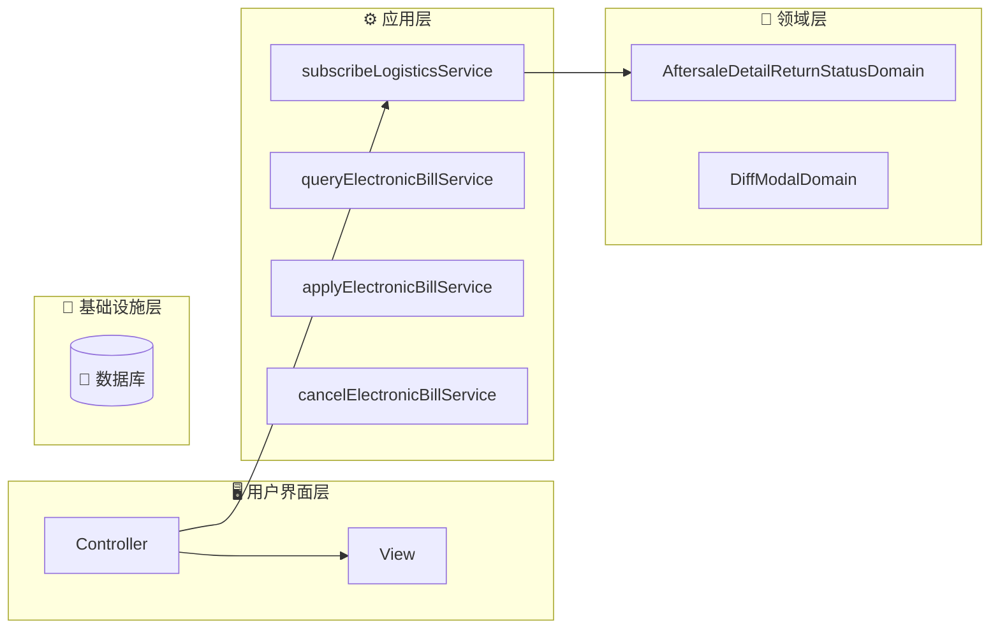

# fulfillment-aftersale-ark - Code Structure Analysis

## 📊 Project Overview
- **Project Name**: fulfillment-aftersale-ark
- **Project Type**: Vue应用
- **Technology Stack**: Vue.js, React, TypeScript, React + TypeScript, Stylus, Sass, Less
- **Architecture Pattern**: 模块化架构
- **Total Files**: 10484
- **Total Code Lines**: 202496
- **Total Entities**: 710


## 📊 Project Architecture Diagrams

### 项目架构依赖图
展示项目主要模块结构和它们之间的依赖关系




---


## 🗂️ Project Directory Structure
```
├── 📁 src/constants
│   ├── Files: 22 files
│   ├── Entities: 70 entities
│   └── Purpose: 项目目录
│
├── 📁 src/providers
│   ├── Files: 2 files
│   ├── Entities: 1 entities
│   └── Purpose: 项目目录
│
├── 📁 src/utils
│   ├── Files: 9 files
│   ├── Entities: 33 entities
│   └── Purpose: 工具函数目录
│
├── 📁 src/containers/AutoAftersale/AfterSaleDetail/constants
│   ├── Files: 2 files
│   ├── Entities: 3 entities
│   └── Purpose: React组件目录
│
├── 📁 src/containers/AutoAftersale/AfterSaleList/constants
│   ├── Files: 1 files
│   ├── Entities: 1 entities
│   └── Purpose: 项目目录
│
├── 📁 src/containers/AutoAftersale/AfterSaleDetail/providers
│   ├── Files: 5 files
│   ├── Entities: 6 entities
│   └── Purpose: 项目目录
│
├── 📁 src/containers/AutoAftersale/utils
│   ├── Files: 1 files
│   ├── Entities: 2 entities
│   └── Purpose: 工具函数目录
│
├── 📁 src/containers/AutoAftersale/hooks
│   ├── Files: 11 files
│   ├── Entities: 14 entities
│   └── Purpose: 项目目录
│
├── 📁 src/containers/AutoAftersale/AfterSaleDetail/hooks
│   ├── Files: 3 files
│   ├── Entities: 2 entities
│   └── Purpose: 项目目录
│
├── 📁 src/containers/AutoAftersale/AfterSaleList/hooks
│   ├── Files: 2 files
│   ├── Entities: 2 entities
│   └── Purpose: 项目目录
│
├── 📁 src/containers/OrderQuery/hooks
│   ├── Files: 1 files
│   ├── Entities: 1 entities
│   └── Purpose: 项目目录
│
├── 📁 src/containers/AutoAftersale/AfterSaleDetail/components
│   ├── Files: 27 files
│   ├── Entities: 27 entities
│   └── Purpose: 组件目录
│
├── 📁 src/containers/AutoAftersale/AfterSaleDetail/components/Negotiate
│   ├── Files: 15 files
│   ├── Entities: 14 entities
│   └── Purpose: Vue组件目录
│
├── 📁 src/containers/AutoAftersale/AfterSaleList/components
│   ├── Files: 14 files
│   ├── Entities: 14 entities
│   └── Purpose: 组件目录
│
├── 📁 src/containers/AutoAftersale/components/TabsLogisticsInfo
│   ├── Files: 9 files
│   ├── Entities: 9 entities
│   └── Purpose: Vue组件目录
│
├── 📁 src/containers/AutoAftersale/AfterSaleDetail/components/ActionModals
│   ├── Files: 8 files
│   ├── Entities: 8 entities
│   └── Purpose: Vue组件目录
│
├── 📁 src/containers/Assistance/components
│   ├── Files: 7 files
│   ├── Entities: 7 entities
│   └── Purpose: 组件目录
│
├── 📁 src/components/GuideLayout
│   ├── Files: 7 files
│   ├── Entities: 6 entities
│   └── Purpose: Vue组件目录
│
├── 📁 src/containers/Assistance/AssistanceMain/components
│   ├── Files: 6 files
│   ├── Entities: 6 entities
│   └── Purpose: 组件目录
│
└── 📁 src/containers/AutoAftersale/AfterSaleList/components/Metrics
    ├── Files: 6 files
    ├── Entities: 6 entities
    └── Purpose: Vue组件目录
```


---


---

## 🌐 Route Configuration Analysis

**Route Config Path**: `/Users/fangqiji/dev/aurora/packages/fulfillment/fulfillment-aftersale-ark/src/config/routes.config.ts`
**Total Routes**: 6

## 📋 Route Page Structure & Entities

## 📁 src/containers/Assistance/AssistanceMain/index.vue

### 🎯 Route Purpose
- **Primary Role**: 页面路由入口文件

- **Entities**: `Component:index_05d38588b333` (component)
- **Functional Description**: 该文件是售后助手功能的主入口页面，负责根据用户使用状态提供不同的界面体验。它在整个项目中扮演着售后服务自动化解决方案的门户角色，通过智能引导和功能展示，帮助商家理解并使用自动化售后处理工具，从而提高售后效率和客户满意度。

### 📦 Dependencies & Relationships
- **Imported Modules**:
  - `Component:Main`: 主要内容组件，用于展示售后助手的核心功能界面
  - `Component:AssistanceGuide`: 引导页组件，为首次使用的用户提供产品介绍和功能说明
  - `Variable:ASSISTANCE_MAIN_SHOWED`: 常量变量，用于标记用户是否已经查看过售后助手主页面

- **Function Calls**: 
  无明确的函数调用信息

- **Component Relations**:
  - 父子关系: 该组件作为容器组件，根据用户状态条件性地渲染 `Spinner`(加载中) 或 `Main`(主内容) 组件
  - 条件渲染逻辑: 基于用户是否首次使用售后助手(`ASSISTANCE_MAIN_SHOWED`变量)，决定展示引导页(`AssistanceGuide`)还是主功能页(`Main`)
  - 功能流程: 用户首次访问 → 展示引导页介绍产品价值和功能 → 用户再次访问 → 直接展示售后策略模板和管理列表

该组件实现了良好的用户引导体验，通过区分首次和非首次用户，提供针对性的界面内容，帮助商家快速理解和应用售后自动化工具。

---

## 📁 src/containers/Assistance/CreateAssistance.vue

### 🎯 Route Purpose
- **Primary Role**: 页面路由入口文件

- **Entities**: `Component:CreateAssistance` (component)
- **Functional Description**: 这是售后助手策略的创建和编辑页面，作为系统中售后策略管理的核心入口。该组件允许用户配置售后类型、订单状态和执行操作等关键参数，提供完整的表单验证和数据提交功能。它在售后服务流程自动化中扮演重要角色，通过预设策略模板和自定义参数配置，帮助运营人员高效管理售后流程。

### 📦 Dependencies & Relationships
- **Imported Modules**:
  - `Component:index_e6b018a58638`: 可能是主索引组件，提供基础布局或功能
  - `Component:ApplyTime`: 处理策略应用时间配置的专用组件
  - `Component:ReasonSelect`: 用于选择售后原因的组件
  - `Function:useTracker_fc0a96fa87d4`: 追踪用户行为或页面性能的钩子函数
  - `Function:adapterConfigToDelightFormily`: 数据适配器函数，将配置数据转换为表单库(Formily)可用的格式

- **Function Calls**:
  - `useTracker_fc0a96fa87d4`: 用于页面行为追踪，可能记录用户在创建/编辑策略时的操作
  - `adapterConfigToDelightFormily`: 处理数据格式转换，使配置数据与表单组件兼容

- **Component Relations**:
  - 使用 `Spinner` 组件显示加载状态
  - 使用 `Breadcrumb` 组件提供页面导航路径
  - 集成 `ApplyTime` 组件管理策略的时间设置
  - 集成 `ReasonSelect` 组件处理售后原因选择
  - 可能作为售后助手模块的子页面，与其他售后管理页面有关联

该组件采用了模块化设计，将不同功能拆分为子组件，如时间选择和原因选择，同时通过数据适配器确保与表单系统的兼容性。它既支持从头创建新策略，也支持编辑现有策略，为售后流程管理提供了灵活且功能完备的界面。

---

# 📁 src/containers/AutoAftersale/AfterSaleList/index.vue

### 🎯 Route Purpose
- **Primary Role**: 页面路由入口文件

- **Entities**: `Component:index_a31431ef66c4` (component)
- **Functional Description**: 该文件是售后服务模块的列表页面入口，作为路由的主要渲染组件。它整合了多个UI组件来构建完整的售后订单列表页面，包括顶部横幅、广告位和核心的售后列表组件。该页面负责展示用户的售后订单信息，并提供了对老版本路由参数的兼容处理，确保系统升级后用户体验的连贯性。

### 📦 Dependencies & Relationships
- **Imported Modules**:
  - `Component:App`: 应用程序主组件，可能提供全局上下文或服务
  - `Variable:RESOURCE_BANNER_KEY`: 常量变量，用于标识横幅资源的键值，可能用于广告或通知展示

- **Function Calls**:
  - 未检测到显式的函数调用

- **Component Relations**:
  - **Parent Components**: 作为路由入口，该组件可能被Vue Router直接加载
  - **Child Components**:
    - `TabUpBanner`: 顶部标签横幅组件，可能用于展示分类或导航选项
    - `BannerPlacement`: 广告位组件，用于在特定位置展示广告内容
    - `AftersaleList`: 虽未在imports中明确列出，但从组件名称和summary可推断这是核心的售后列表组件，负责展示售后订单数据

- **Data Flow**:
  - 该组件可能接收路由参数（特别是tab参数）并进行处理，以支持老版本路由的兼容
  - 组件可能将处理后的参数传递给子组件，特别是AftersaleList组件，以展示相应的售后订单数据
  - `RESOURCE_BANNER_KEY`常量可能被传递给BannerPlacement组件，用于获取和展示特定的广告内容

---

# 📁 src/containers/AutoAftersale/AfterSaleDetail/basic.vue

## 🎯 Route Purpose
- **Primary Role**: 页面路由入口文件

- **Entities**: `Component:basic` (component)
- **Functional Description**: 该文件作为售后详情页面的路由入口组件，实现了新旧版本售后详情页面的动态切换功能。通过灰度发布机制，系统可以根据配置决定向用户展示哪个版本的售后详情页面，从而实现产品功能的平滑过渡和迭代升级。这种设计模式使得开发团队能够逐步推出新版本界面，同时保持对旧版本的支持，降低了用户体验断层的风险。

## 📦 Dependencies & Relationships
- **Imported Modules**:
  - `Function:useGrayConfigByScene`: 一个功能函数，用于根据特定场景获取灰度配置信息，决定是否启用新版本功能
  - `Component:index_7e72b6c2c128`: 旧版本售后详情页面组件
  - `Component:indexV2`: 新版本售后详情页面组件

- **Function Calls**:
  - `useGrayConfigByScene`: 该组件调用此函数来确定当前用户应该看到的是新版本还是旧版本的售后详情页面。这表明该页面采用了灰度发布策略，可能根据用户ID、地区或其他因素来决定展示哪个版本。

- **Component Relations**:
  - 该组件作为一个路由级别的容器组件，不直接包含UI逻辑，而是根据灰度配置动态决定渲染`index_7e72b6c2c128`(旧版本)或`indexV2`(新版本)组件
  - 这种设计模式体现了前端应用中常见的"特性开关"(Feature Toggle)模式，允许在不修改代码的情况下，通过配置来控制功能的可用性

这种灰度发布的实现方式表明该项目采用了渐进式发布策略，能够在保证系统稳定性的同时，逐步推出新功能和UI改进。

---

# 📁 src/containers/AutoAftersale/AfterSaleDetail/index.vue

## 🎯 Route Purpose
- **Primary Role**: 页面路由入口文件

- **Entities**: `Component:index_7e72b6c2c128` (component)
- **Functional Description**: 该文件是商家售后系统中的售后详情页面入口组件，作为售后管理流程中的核心页面，它负责展示完整的售后单信息、当前处理状态、协商方案以及物流信息等内容。该页面为商家提供了处理售后订单的完整界面，支持各类售后操作、协商记录查看和运费补偿等功能，是商家高效处理售后问题的关键界面。

## 📦 Dependencies & Relationships

### 🔄 Imported Modules
- **`AfterSaleTokens`**: 售后系统的令牌常量，可能用于权限控制或状态标识
- **`AfterSaleDetailData`**: 售后详情数据类，负责管理和处理售后单的详细信息
- **`customFmpComputed`**: 自定义计算属性函数，可能用于处理售后数据的派生状态

### 🔄 Function Calls
- **`injector.addProviders`**: 依赖注入相关，为组件提供必要的服务和数据
- **`useTracker_61adf82d7f04`**: 追踪器函数，可能用于页面行为分析或性能监控
- **`useBroadcastChannel`**: 使用广播通道，用于组件间或页面间的通信，确保售后状态变更时能够同步更新

### 🔄 Component Relations
- **`NewBsBox`**: 可能是业务容器组件，用于统一页面布局和样式
- **`Banner`**: 横幅组件，可能用于展示售后单状态或重要提示信息

## 💡 Key Features
- 售后单详情展示，包括基本信息、状态和处理进度
- 协商方案管理，支持查看和处理售后协商记录
- 物流信息跟踪，方便商家了解退换货物流状态
- 售后操作功能，如同意/拒绝退款、确认收货等
- 运费补偿处理，支持商家进行运费相关的操作

## 🔍 Technical Insights
该组件采用Vue框架开发，使用依赖注入模式管理服务和数据，通过广播通道实现组件间通信。组件结构清晰，将售后详情数据与UI展示分离，便于维护和扩展。页面行为通过追踪器进行监控，有助于分析用户操作和优化页面体验。

---

## 📁 src/containers/MicroRemittance/index.vue

### 🎯 Route Purpose
- **Primary Role**: 页面路由入口文件

- **Entities**: `Component:index_dd05eeb8dbb8` (component)
- **Functional Description**: 该文件是小额打款功能的主要入口点，作为一个容器组件，它负责管理整个小额打款功能的状态流转和界面展示。该组件根据用户的打款功能开通状态，动态展示不同的界面内容，包括功能开通入口和实际的打款操作界面。同时，它还处理加载状态和错误情况，确保用户体验的流畅性和可靠性。在整个项目中，它作为微型汇款功能的核心路由组件，连接用户界面和后端服务。

### 📦 Dependencies & Relationships
- **Imported Modules**:
  - `Component:index_55a2805ca84a`: 可能是一个辅助组件，用于处理小额打款的特定功能或UI元素
  - `Component:Remittance`: 主要的打款功能组件，负责实际的打款操作界面和逻辑

- **Function Calls**:
  - 该组件没有明确的外部函数调用记录

- **Component Relations**:
  - 使用 `Skeleton` 组件处理加载状态，显示骨架屏提升用户体验
  - 使用 `WithError` 组件处理错误情况，提供统一的错误展示界面
  - 与 `Remittance` 组件紧密集成，在功能开通后展示实际的打款操作界面
  - 可能与 `Component:index_55a2805ca84a` 协作，处理特定的功能需求

该组件采用了条件渲染的方式，根据打款功能的开通状态展示不同的内容，并通过骨架屏和错误处理组件增强了用户体验的流畅性和可靠性。它作为一个容器组件，有效地组织和管理了小额打款功能的各个子组件和状态。

---


---

# 项目架构综合分析报告：fulfillment-aftersale-ark

## 🏗️ 项目架构概述

`fulfillment-aftersale-ark` 是一个基于 Vue.js 和 TypeScript 构建的售后服务管理系统，采用了分层架构模式并结合了领域驱动设计(DDD)的思想。该项目拥有超过10,000个文件和700多个实体，是一个规模较大的前端应用。

### 核心技术栈

- **前端框架**：Vue.js 作为主要框架，部分组件使用 React
- **语言**：TypeScript 作为主要开发语言
- **样式处理**：Stylus, Sass, Less
- **状态管理**：Vuex
- **路由模式**：基于文件的路由系统
- **架构模式**：分层架构 + 领域驱动设计

## 🏛️ 领域驱动设计(DDD)分析

项目采用了领域驱动设计的思想，将业务逻辑组织在明确的领域边界内。

### 领域概念与边界

1. **核心领域**：
   - `containers` 作为主要领域容器，包含了售后服务的各个子领域

2. **主要领域实体**：
   - `AftersaleDetailReturnStatusDomain`：售后退货状态领域，管理售后退货流程的状态转换
   - `DiffModalDomain`：差异模态框领域，处理售后服务中的差异比较和展示

3. **领域服务**：
   - `subscribeLogisticsService`：物流订阅服务
   - `queryElectronicBillService`：电子面单查询服务
   - `applyElectronicBillService`：电子面单申请服务
   - `cancelElectronicBillService`：电子面单取消服务

### 领域模型分析

项目中的领域模型设计体现了DDD的核心思想，将业务逻辑封装在领域对象中：

1. **实体(Entities)**：
   - `AftersaleDetailReturnStatusDomain`：管理售后退货状态的生命周期
   - `DiffModalDomain`：处理差异比较的业务逻辑

2. **服务(Services)**：
   - 物流相关服务：处理物流订阅、电子面单等业务
   - 售后处理服务：处理售后申请、审核、退款等流程

3. **数据流**：
   - 从控制层到领域服务的调用流程清晰
   - 领域服务之间的协作关系明确

## 📐 架构设计分析

### 分层架构

项目采用了典型的前端分层架构，各层职责明确：

1. **表现层(Presentation Layer)**：
   - 位于 `src/containers` 和 `src/components` 目录
   - 包含各种UI组件、页面容器和视图逻辑
   - 主要负责用户界面渲染和交互处理

2. **业务层(Business Layer)**：
   - 位于 `src/service` 目录
   - 包含各种业务服务，如 `autoAftersale.ts`、`logisticsService.ts` 等
   - 负责处理核心业务逻辑和业务规则

3. **数据层(Data Layer)**：
   - 包含API调用、数据转换和状态管理
   - 通过 `httpBase.httpGet`、`httpBase.httpPost` 等方法与后端交互

4. **基础设施层(Infrastructure Layer)**：
   - 位于 `src/utils` 目录
   - 提供通用工具函数、辅助方法和基础服务

### 前端架构特点

1. **微前端架构**：
   - 项目采用微前端架构模式，支持模块独立开发和部署
   - 通过 `bootstrap`、`mount`、`unmount` 等生命周期函数实现模块间集成

2. **组件结构**：
   - 业务组件：710个实体中包含大量业务组件，如 `AfterSaleDetail`、`OrderInfoCell` 等
   - UI组件：通用UI组件如 `Banner`、`Modal`、`Form` 等
   - 工具组件：提供特定功能的辅助组件

3. **状态管理**：
   - 使用 Vuex 进行状态管理
   - 领域对象内部维护自身状态

## 🔄 数据流分析

项目中的数据流动路径清晰可见：

1. **入口流**：
   - 从 `src/index.ts` 作为应用入口
   - 通过 `bootstrap`、`mount` 等函数初始化应用

2. **服务调用流**：
   - 组件通过调用服务层函数获取或提交数据
   - 如 `getAfterSaleReturnsDetailV3`、`postReception` 等

3. **领域交互流**：
   - 领域对象之间通过明确的接口进行交互
   - 领域服务被上层组件调用，执行核心业务逻辑

4. **API调用流**：
   - 服务层通过 HTTP 方法与后端API交互
   - 数据经过处理后传递给表现层

## 💡 架构亮点与最佳实践

1. **领域驱动设计的应用**：
   - 将复杂业务逻辑封装在领域对象中
   - 通过明确的领域边界提高代码可维护性

2. **组件化设计**：
   - 高度组件化的设计使界面元素可复用
   - 组件职责单一，遵循单一职责原则

3. **钩子函数的广泛使用**：
   - 自定义钩子如 `useAfterSale`、`useButtonAuth` 等
   - 提高代码复用性和可维护性

4. **微前端架构**：
   - 支持模块独立开发和部署
   - 提高团队协作效率和系统可扩展性

5. **TypeScript的全面应用**：
   - 强类型定义提高代码质量和可维护性
   - 接口和类型定义清晰

## 🚀 改进建议

1. **领域模型完善**：
   - 可以进一步完善值对象(Value Objects)和聚合(Aggregates)的应用
   - 增强领域事件的使用，提高系统的事件驱动能力

2. **代码组织优化**：
   - 考虑按功能模块进一步组织代码，减少大文件
   - 增强模块间的内聚性，减少耦合

3. **测试覆盖**：
   - 增加单元测试和集成测试覆盖率
   - 特别是对核心领域逻辑的测试

4. **性能优化**：
   - 对大型列表组件考虑虚拟滚动优化
   - 减少不必要的API调用和数据处理

## 📊 总结

`fulfillment-aftersale-ark` 项目是一个结构良好的前端应用，采用了分层架构和领域驱动设计的思想。项目通过清晰的领域边界和职责分离，有效地管理了复杂的售后服务业务逻辑。微前端架构的应用使系统具有良好的可扩展性和可维护性。

该项目展示了如何在前端应用中应用领域驱动设计，将业务逻辑封装在领域对象中，通过明确的接口与表现层交互。这种架构设计使得系统能够更好地应对业务变化，同时保持代码的可维护性和可扩展性。

## 📂 Detailed Directory Analysis
# 📁 src/constants

### 🎯 Directory Purpose
- **Primary Role**: 项目常量定义目录
- **File Count**: 22 files
- **Entity Count**: 10 entities

- **Functional Description**: 该目录是项目的常量定义中心，存储了系统中各个模块所需的静态数据、状态映射、错误码、选项列表等配置信息。这些常量为整个应用提供了统一的数据参考标准，确保了代码的一致性和可维护性，同时也便于在UI组件中使用这些预定义的值来展示状态、选项和错误信息。

### 📋 File Structure & Entities

#### 📄 afterSale.ts
- **Path**: `src/constants/afterSale.ts`
- **Entities**: `Variable:afterSaleTypes_e78302b9df73` (variable), `Variable:statusTypeProcessList_bb8204718c0f` (variable), `Variable:afterSaleStatus_13fc29c650d0` (variable), `Variable:returnStatus_fa67486d991c` (variable), `Variable:returnExpressStatus` (variable), `Variable:shipExpressStatus` (variable), `Variable:merchantHandleTagsOptions` (variable), `Variable:AfterSaleShortNameTracker` (variable), `Variable:AfterSaleShortName_a33d723e39a9` (variable), `Variable:REFUND_METHOD_MAP_a9db618544bf` (variable)
- **Purpose**: 定义电商系统售后服务相关的常量，包括售后类型（退款、退货退款、换货）、售后状态流程、物流状态等，为售后服务模块提供标准化的数据引用。

#### 📄 bonded.ts
- **Path**: `src/constants/bonded.ts`
- **Entities**: `Variable:PURCHASE_INBOUND_STATUS_MAP` (variable), `Variable:PURCHASE_INBOUND_STATUS_OPTIONS` (variable), `Variable:TRANSFER_INBOUND_STATUS_MAP` (variable), `Variable:TRANSFER_INBOUND_STATUS_OPTIONS` (variable), `Variable:TRANSFER_OUTBOUND_STATUS_MAP` (variable), `Variable:TRANSFER_OUTBOUND_STATUS_OPTIONS` (variable), `Variable:TRANSPORT_MODE_MAP` (variable), `Variable:TRANSPORT_MODE_OPTIONS` (variable), `Variable:CONTAINER_TYPE_MAP` (variable), `Variable:CONTAINER_TYPE_OPTIONS` (variable), `Variable:CONTAINER_SPEC_OPTIONS` (variable), `Variable:LADING_UNIT_MAP` (variable), `Variable:LADING_UNIT_OPTIONS` (variable), `Variable:INVENTORY_TYPE_MAP` (variable), `Variable:INVENTORY_UPDATE_STATUS_MAP` (variable), `Variable:INVENTORY_UPDATE_STATUS_OPTIONS` (variable)
- **Purpose**: 提供仓储物流相关的常量定义，包括采购入库状态、调拨出入库状态、运输方式、集装箱类型和规格等，支持库存管理和物流操作的状态展示和选项配置。

#### 📄 compensateFour.ts
- **Path**: `src/constants/compensateFour.ts`
- **Entities**: `Variable:ErrorCode_b35ca93ef25a` (variable), `Variable:StatusCode` (variable), `Variable:ValidateErrorMsg` (variable), `Variable:SwitchErrorMsg` (variable)
- **Purpose**: 定义"假一赔四"服务相关的常量，包括错误码、状态码和错误提示信息，用于商家开通和使用假一赔四服务时的状态管理和错误处理。

#### 📄 arbitrate.ts
- **Path**: `src/constants/arbitrate.ts`
- **Entities**: `Variable:ArbitrateTicketStatusColorMap` (variable)
- **Purpose**: 提供仲裁工单状态与UI颜色的映射关系，用于在界面上以不同颜色直观展示不同的仲裁工单状态，提升用户体验。

### 📦 Dependencies & Relationships
- **Imported Modules**: 从分析的实体信息来看，这些常量文件大多是独立的，没有显示导入其他模块的依赖关系，这符合常量定义文件的最佳实践，保持了低耦合性。
- **Function Calls**: 常量定义文件中通常不包含函数调用，主要是静态数据的声明。在ValidateErrorMsg中可能包含了回调函数的引用，但没有直接的函数调用。
- **Component Relations**: 这些常量被项目中的各个组件和服务模块引用，特别是在UI组件中用于状态展示、下拉选项配置、错误提示等场景。例如，afterSale.ts中的常量可能被售后服务相关的组件使用，bonded.ts中的常量可能被仓储管理相关的组件使用，而arbitrate.ts中的颜色映射则用于仲裁工单展示组件。

---

# 📁 src/providers

### 🎯 Directory Purpose
- **Primary Role**: 项目目录
- **File Count**: 2 files
- **Entity Count**: 1 entities

- **Functional Description**: 该目录作为项目的服务提供者层，主要负责封装和管理与后端API交互的逻辑。它集中了应用程序中所有的API调用实现，特别是售后服务相关的功能，为上层组件提供数据访问接口，使业务逻辑与数据获取逻辑分离，提高代码的可维护性和可测试性。

### 📋 File Structure & Entities

#### 📄 Api.ts
- **Path**: `src/providers/Api.ts`
- **Entities**: `Class:Api` (class)
- **Purpose**: 实现售后服务相关的API调用封装，提供统一的接口与后端服务通信，处理售后退款、协商、拒绝原因查询等功能的数据交互。

#### 📄 [未知文件]
- **Path**: 未在提供的信息中明确指出
- **Entities**: 未在提供的信息中明确指出
- **Purpose**: 可能包含接口定义或其他辅助功能

### 📦 Dependencies & Relationships
- **Imported Modules**:
  - `IApi`: 接口定义，规范了Api类需要实现的方法
  - `getReturnsId`: 获取退货ID的功能函数
  - `postPreCheckBeforeDelivery`: 发货前预检查的功能函数

- **Function Calls**:
  - `postReturnsId`: 提交退货ID相关的请求
  - `postRejectWithDialog`: 处理带对话框的拒绝操作
  - `postRejectWarningCheck`: 执行拒绝操作前的警告检查

- **Component Relations**: 
  - `Class:Api` 实现了 `IApi` 接口，确保所有必要的API方法都被正确实现
  - 该类作为服务提供者，可能被多个业务组件或服务消费
  - 没有直接的模板组件依赖关系，主要专注于数据层面的交互

### 💡 Key Insights
- 该目录采用了提供者模式，将API调用逻辑集中管理，便于统一处理请求、响应和错误
- Api类专注于售后服务领域，提供了丰富的售后相关功能接口
- 通过接口实现（IApi），增强了代码的可测试性和可替换性
- 目录结构简洁，职责明确，符合单一职责原则

# 📁 src/utils

### 🎯 Directory Purpose
- **Primary Role**: 工具函数目录
- **File Count**: 9 files
- **Entity Count**: 6 entities

- **Functional Description**: 该目录包含项目中使用的各种工具函数和辅助方法，为整个应用提供通用功能支持。这些工具函数涵盖了格式化（价格、时间）、DOM操作、表单处理、缓存管理、性能监控等多个方面，是项目中重复使用率较高的基础代码。通过将这些功能抽象为独立的工具函数，提高了代码的复用性和可维护性。

### 📋 File Structure & Entities

#### 📄 common.ts
- **Path**: `src/utils/common.ts`
- **Entities**: `Function:toCnPrice_d5ba974e9e62` (function), `Function:formatTimeRange_3d64eb7062e0` (function), `Function:formatTime_fd46c92f6953` (function), 以及其他多个工具函数和变量
- **Purpose**: 提供各种通用工具函数，包括价格格式化（元/分转换）、时间格式化、数组处理、性能监控、文件下载、文本复制等基础功能。这是工具目录中最核心的文件，包含了大量常用的辅助方法。

#### 📄 decryption.ts
- **Path**: `src/utils/decryption.ts`
- **Entities**: `Function:isDecryptionGraySeller` (function)
- **Purpose**: 提供与解密和灰度功能相关的工具函数，特别是用于判断商家是否命中解密限额灰度的功能。该文件实现了结果缓存机制，避免重复请求以提高应用性能。

#### 📄 element.ts
- **Path**: `src/utils/element.ts`
- **Entities**: `Function:setElementListener_712dfa278cd2` (function)
- **Purpose**: 提供DOM元素操作的工具函数，特别是事件监听器的添加和管理。通过选择器查找元素并绑定事件，简化了DOM事件处理的代码实现。

#### 📄 formily.ts
- **Path**: `src/utils/formily.ts`
- **Entities**: `Function:adapterConfigToDelightFormily` (function)
- **Purpose**: 提供与Formily表单库相关的工具函数，主要用于配置对象的转换和适配，使其符合Delight Formily的格式要求，包括添加装饰器配置、设置标签对齐方式和宽度等，优化表单的布局和展示。

### 📦 Dependencies & Relationships
- **Imported Modules**: 该目录中的函数主要依赖于基础JavaScript/TypeScript功能，其中`decryption.ts`依赖于一个名为`decryptionGraySeller`的服务函数，可能来自项目的服务层。
- **Function Calls**: `isDecryptionGraySeller`函数调用了`decryptionGraySeller`服务函数，并实现了结果缓存。其他工具函数大多是独立的，不依赖于其他函数调用。
- **Component Relations**: 这些工具函数主要被项目中的组件和业务逻辑调用，而不是直接与组件形成依赖关系。`adapterConfigToDelightFormily`函数与Formily表单组件库有间接关联，用于处理表单配置。

整体而言，`src/utils`目录提供了一系列高复用性的工具函数，这些函数被项目中的各个部分广泛使用，有效减少了代码重复，提高了开发效率和代码质量。

## 📁 src/containers/AutoAftersale/AfterSaleDetail/constants

### 🎯 Directory Purpose
- **Primary Role**: React组件目录
- **File Count**: 2 files
- **Entity Count**: 3 entities

- **Functional Description**: 该目录包含售后详情页面所需的常量定义和配置信息，主要用于支持售后服务流程中的各种功能展示和用户引导。它定义了功能引导步骤、横幅提示类型枚举以及模态框标识符等关键常量，为售后详情页面提供统一的配置管理，确保UI展示和用户交互的一致性。

### 📋 File Structure & Entities

#### 📄 index.tsx
- **Path**: `src/containers/AutoAftersale/AfterSaleDetail/constants/index.tsx`
- **Entities**: `Function:guideSteps` (function), `Variable:AFTERSALE_DETAIL_FREIGHT_RECOMMEND_MODAL` (variable), `Variable:BannerTypeEnum_b1886456b03f` (variable)
- **Purpose**: 定义售后详情页面所需的常量和配置，包括功能引导步骤、模态框标识符和横幅提示类型枚举，为售后详情页面的各种功能提供配置支持。

##### 🔹 Function:guideSteps
- **Type**: 函数
- **Description**: 配置售后详情页的功能引导步骤，包括拦拒自动退、快递拦截、协商修改售后等功能的说明，并根据用户历史引导记录过滤不需要再次展示的引导项。
- **Usage**: 在售后详情页面初始化时调用，根据用户历史记录和当前页面状态决定是否展示功能引导。

##### 🔹 Variable:AFTERSALE_DETAIL_FREIGHT_RECOMMEND_MODAL
- **Type**: 变量
- **Description**: 售后详情页面中用于标识运费推荐模态框的常量标识符，用于在售后处理流程中展示运费相关的推荐信息或选项。
- **Usage**: 在模态框管理系统中用作唯一标识符，控制运费推荐模态框的显示和隐藏。

##### 🔹 Variable:BannerTypeEnum_b1886456b03f
- **Type**: 变量
- **Description**: 售后详情页面中横幅提示类型的枚举常量，定义了四种不同的提示类型：信息(info)、成功(success)、警告(warning)和危险(danger)。
- **Usage**: 用于统一管理售后详情页面中各种横幅提示的样式和类型，确保UI展示的一致性。

### 📦 Dependencies & Relationships
- **Imported Modules**: 
  - `IGuideConfig`: 所有三个实体都导入了这个类型定义，表明该目录中的常量配置遵循统一的引导配置接口规范。

- **Function Calls**: 
  - 从提供的信息中未发现明显的函数调用关系，但`guideSteps`函数可能在售后详情页面的主组件中被调用，用于初始化功能引导。

- **Component Relations**: 
  - 这些常量和配置主要被售后详情页面的组件使用，特别是`AFTERSALE_DETAIL_FREIGHT_RECOMMEND_MODAL`可能与模态框组件有直接关联。
  - `BannerTypeEnum_b1886456b03f`可能被用于横幅提示组件的类型控制。
  - `guideSteps`函数可能与引导提示或教程组件集成，为用户提供功能引导。

---

# 📁 src/containers/AutoAftersale/AfterSaleList/constants

### 🎯 Directory Purpose
- **Primary Role**: 项目目录
- **File Count**: 1 files
- **Entity Count**: 1 entities

- **Functional Description**: 这个目录是售后服务管理系统中的常量定义模块，专门用于存储和管理售后列表相关的常量值。它在项目中扮演着提供统一常量定义的角色，确保系统中的关键字符串和配置值能够在多个组件间保持一致性，避免硬编码和重复定义。这种集中管理常量的方式有助于提高代码的可维护性和可扩展性。

### 📋 File Structure & Entities

#### 📄 index.ts
- **Path**: `src/containers/AutoAftersale/AfterSaleList/constants/index.ts`
- **Entities**: `Variable:AftersaleGuideVisibilityKey` (variable)
- **Purpose**: 定义售后服务系统中使用的常量值，特别是用于本地存储的键名。该文件目前包含一个用于控制售后指南显示状态的常量，该常量作为localStorage的键名，用于保存用户对售后指南显示偏好的设置。

### 📦 Dependencies & Relationships
- **Imported Modules**: 该文件没有导入任何外部模块，它是一个纯粹的常量定义文件。
- **Function Calls**: 文件中没有检测到函数调用，这符合常量定义文件的特性。
- **Component Relations**: 该常量文件被售后服务列表相关组件使用，特别是那些需要控制售后指南显示状态的组件。`AftersaleGuideVisibilityKey`常量可能被用于读取或设置localStorage中的值，以便在用户会话之间保持售后指南的显示偏好。

### 💡 Analysis & Recommendations
- **代码质量**: 常量定义清晰简洁，符合最佳实践。
- **可扩展性**: 随着项目发展，可以在此文件中添加更多与售后列表相关的常量。
- **建议**: 
  1. 考虑为常量添加命名空间或前缀，以避免与其他模块的常量冲突
  2. 可以添加注释说明每个常量的具体用途和预期值格式
  3. 如果常量数量增加，可以考虑按功能分类到不同的文件中

---

## 📁 src/containers/AutoAftersale/AfterSaleDetail/providers

### 🎯 Directory Purpose
- **Primary Role**: 项目目录
- **File Count**: 5 files
- **Entity Count**: 5 entities

- **Functional Description**: 这个目录是售后服务详情页面的核心提供者（providers）集合，采用领域驱动设计模式，包含了售后地址管理、售后状态处理和售后操作拒绝等领域模型。它通过依赖注入机制将这些服务提供给售后详情页面的各个组件，实现了业务逻辑与UI展示的分离，提高了代码的可维护性和可测试性。

### 📋 File Structure & Entities

#### 📄 AftersaleAddressFieldDomain.ts
- **Path**: `src/containers/AutoAftersale/AfterSaleDetail/providers/AftersaleAddressFieldDomain.ts`
- **Entities**: `Class:AftersaleAddressFieldDomain_fdc4d199af1a` (class)
- **Purpose**: 提供售后地址字段的管理功能，负责获取和处理售后地址列表数据，支持分页加载多达20页的地址数据，并提供地址选项格式化和默认地址选择功能。

#### 📄 AftersaleDetailReturnStatusDomain.ts
- **Path**: `src/containers/AutoAftersale/AfterSaleDetail/providers/AftersaleDetailReturnStatusDomain.ts`
- **Entities**: `Class:AftersaleDetailReturnStatusDomain_923fe68131fe` (class)
- **Purpose**: 管理售后详情页的状态逻辑，处理售后单点击事件执行和状态更新，集成了前置弹窗配置的消费逻辑，提供退款、拒绝、延期、快递拦截等多种售后操作功能。

#### 📄 AftersaleOperateRefuseDomain.ts
- **Path**: `src/containers/AutoAftersale/AfterSaleDetail/providers/AftersaleOperateRefuseDomain.ts`
- **Entities**: `Class:AftersaleOperateRefuseDomain_5b37bdc0a6a0` (class)
- **Purpose**: 处理售后拒绝相关的业务逻辑，包括拒绝售后申请、延长处理时间、联系买家、协商修改、同意退回后退款和开启自动拒绝等功能，并进行相关操作的数据追踪。

#### 📄 index.ts
- **Path**: `src/containers/AutoAftersale/AfterSaleDetail/providers/index.ts`
- **Entities**: `Variable:injector` (variable), `Variable:index_dc8c19d8fc3e` (variable)
- **Purpose**: 作为模块的入口文件，配置和导出售后服务的依赖注入器，注册各种服务提供者，包括售后地址字段域、API服务和售后协商提供者等，实现组件间的依赖管理。


### 📦 Dependencies & Relationships
- **Imported Modules**: 
  - `AfterSaleProviders` 和 `AftersaleNegotiateProviders`: 提供售后服务和售后协商的核心功能
  - `AfterSaleTokens`: 用于依赖注入的令牌标识
  - `AfterSaleDetailData`: 售后详情数据模型
  - `getAddressList`: 获取地址列表的API函数
  - `useGrayConfigByScene`: 灰度配置功能
  - `postAgreeAutoRejectAudit`: 自动拒绝审核的API函数

- **Function Calls**:
  - `getAddressList`: 在地址域模型中调用以获取地址数据
  - `useGrayConfigByScene`: 在状态域中用于获取灰度配置
  - `useTracker_b0455b3c44c1`: 在拒绝域中用于追踪用户操作
  - `postAgreeAutoRejectAudit`: 在拒绝域中用于提交自动拒绝审核

- **Component Relations**:
  - 这些域模型通过依赖注入器(`injector`)相互关联
  - `AftersaleAddressFieldDomain`提供地址数据给需要展示或选择地址的组件
  - `AftersaleDetailReturnStatusDomain`处理UI交互事件并更新售后状态
  - `AftersaleOperateRefuseDomain`处理拒绝相关的业务逻辑并与API交互
  - 所有域模型通过`index.ts`中的依赖注入机制被注册并提供给组件使用

## 📁 src/containers/AutoAftersale/utils

### 🎯 Directory Purpose
- **Primary Role**: 工具函数目录
- **File Count**: 1 files
- **Entity Count**: 2 entities

- **Functional Description**: 该目录包含与售后服务相关的工具函数，主要负责处理NPS（Net Promoter Score，净推荐值）调查问卷的触发逻辑。这些工具函数在售后服务流程中扮演重要角色，通过在适当的时机触发用户满意度调查，帮助业务团队收集用户反馈，评估售后服务质量，并为服务改进提供数据支持。

### 📋 File Structure & Entities

#### 📄 nps.ts
- **Path**: `src/containers/AutoAftersale/utils/nps.ts`
- **Entities**: `Function:triggerAftersaleNps` (function), `Function:triggerAftersaleNpsInDetail` (function)
- **Purpose**: 该文件提供了售后服务NPS调查问卷的触发机制，根据不同的售后类型和用户行为（如页面停留时间）来决定何时触发满意度调查。

##### Function:triggerAftersaleNps
- **功能**: 根据售后类型触发NPS调查问卷
- **逻辑**: 当页面停留时间超过10秒或存在对应的NPS事件时，通过ARK_NPS触发器发送相应的售后满意度调查事件
- **参数**: 可能包含售后类型、页面信息等

##### Function:triggerAftersaleNpsInDetail
- **功能**: 在售后详情页面触发NPS调查问卷
- **逻辑**: 与triggerAftersaleNps类似，但专门用于详情页面场景

### 📦 Dependencies & Relationships
- **Imported Modules**:
  - `Class:AfterSaleEnum`: 售后服务相关的枚举类型，用于区分不同的售后服务类型
  - `Variable:Aftersale2NpsEventName`: 售后服务类型到NPS事件名称的映射关系
  - `Function:performancePageDurationGreaterSecond_5ebac9593cf3`: 用于检测页面停留时间是否超过指定秒数的函数

- **Function Calls**:
  - `performancePageDurationGreaterSecond_5ebac9593cf3`: 两个函数都调用此方法检测用户在页面的停留时间
  - `npsTrigger`: 用于实际触发NPS调查问卷的函数，可能是一个全局可用的触发器

- **Component Relations**: 这些工具函数主要被售后服务相关的组件调用，用于在用户浏览售后服务页面或完成售后流程时触发满意度调查。它们不直接包含UI组件，而是作为业务逻辑工具被其他组件引用。

---

这个工具目录虽然简单，但在用户体验评估中扮演着重要角色，通过合理的时机触发NPS调查，既能获取有效的用户反馈，又能避免对用户正常使用流程造成过多干扰。

# 📁 src/containers/AutoAftersale/hooks

### 🎯 Directory Purpose
- **Primary Role**: 项目目录
- **File Count**: 11 files
- **Entity Count**: 5 entities

- **Functional Description**: 这个目录包含了自动售后系统的核心钩子函数集合，为售后流程提供各种功能支持。这些钩子函数负责处理售后类型判断、按钮权限控制、操作行为管理以及售后辅助功能等，是整个售后系统的功能基础层，为上层组件提供统一的数据处理和业务逻辑能力。

### 📋 File Structure & Entities

#### 📄 useAction.ts
- **Path**: `src/containers/AutoAftersale/hooks/useAction.ts`
- **Entities**: `Function:useRemoteAction` (function), `Function:useLocalAction` (function)
- **Purpose**: 提供售后操作相关的钩子函数，管理售后流程中的按钮状态和操作逻辑。useRemoteAction（已废弃）处理详情页按钮，而useLocalAction专注于列表页面的按钮状态管理，特别是物流签收后自动收货等功能。

#### 📄 useAfterSale.ts
- **Path**: `src/containers/AutoAftersale/hooks/useAfterSale.ts`
- **Entities**: `Function:useAfterSale` (function)
- **Purpose**: 提供售后类型判断的核心逻辑，根据传入的售后信息计算并返回不同售后类型的状态标识，包括换货、退货、退款等多种类型的判断，是其他售后相关钩子函数的基础依赖。

#### 📄 useAfterSaleAssistant.ts
- **Path**: `src/containers/AutoAftersale/hooks/useAfterSaleAssistant.ts`
- **Entities**: `Function:useAfterSaleAssistant` (function)
- **Purpose**: 实现售后小助手功能，管理售后过程中的各类提醒弹窗，如运费宝推荐、快递拦截等辅助功能，并支持用户交互行为的数据追踪，提升售后体验。

#### 📄 useButtonAuth.ts
- **Path**: `src/containers/AutoAftersale/hooks/useButtonAuth.ts`
- **Entities**: `Function:useButtonAuth` (function)
- **Purpose**: 管理售后流程中各种按钮的权限控制，根据售后类型和当前状态动态计算不同操作按钮的显示权限，支持多种售后场景和跨境订单的特殊处理。

### 📦 Dependencies & Relationships
- **Imported Modules**: 
  - 枚举类型依赖：`EActionCode`、`AfterSaleEnum`、`AfterSaleStatusEnum` 等枚举类型被广泛使用，为钩子函数提供状态和类型常量
  - 组件依赖：`FreightReminderDialog` 等UI组件被用于构建交互界面
  - 工具函数：`getHomePopup`、`useTracker_74b5c34e7bd4` 等用于弹窗管理和数据追踪

- **Function Calls**: 
  - `useAfterSale` 是最基础的钩子函数，被 `useButtonAuth` 和 `useRemoteAction`/`useLocalAction` 调用
  - `useButtonAuth` 被 `useRemoteAction` 和 `useLocalAction` 调用，提供权限控制
  - `useArbitrate` 被 `useButtonAuth` 调用，处理仲裁相关逻辑

- **Component Relations**: 
  - 这些钩子函数主要作为逻辑层，为上层UI组件提供数据和行为支持
  - 钩子函数之间形成了清晰的层次结构：`useAfterSale` 作为基础层，`useButtonAuth` 作为权限控制层，`useRemoteAction`/`useLocalAction` 和 `useAfterSaleAssistant` 作为功能实现层

# 📁 src/containers/AutoAftersale/AfterSaleDetail/hooks

### 🎯 Directory Purpose
- **Primary Role**: 项目目录
- **File Count**: 3 files
- **Entity Count**: 2 entities

- **Functional Description**: 这个目录包含了售后详情页面所需的自定义React钩子函数集合。这些钩子函数为售后详情页面提供了特定功能支持，包括用户行为引导提示和用户行为追踪（埋点）功能。这些钩子函数使售后详情页面的业务逻辑与UI展示分离，提高了代码的可维护性和复用性，是售后服务模块中关键的功能支持组件。

### 📋 File Structure & Entities

#### 📄 useDetailReachGuide.ts
- **Path**: `src/containers/AutoAftersale/AfterSaleDetail/hooks/useDetailReachGuide.ts`
- **Entities**: `Function:useDetailReachGuide` (function)
- **Purpose**: 提供售后详情页的引导提示功能，监听售后信息变化，当满足特定条件时向后端请求行为建议，并以弹窗形式向商家用户展示指导信息，帮助商家更好地处理售后事务。

#### 📄 useTracker.ts
- **Path**: `src/containers/AutoAftersale/AfterSaleDetail/hooks/useTracker.ts`
- **Entities**: `Function:useTracker_b0455b3c44c1` (function)
- **Purpose**: 实现售后详情页面的用户行为追踪功能，提供多种埋点方法，用于记录和分析用户在售后流程中的各种操作，包括按钮点击、弹窗交互和协商方案等行为，为产品优化提供数据支持。

### 📦 Dependencies & Relationships
- **Imported Modules**: 
  - `useDetailReachGuide`钩子依赖`postSellerBehaviorSuggestion`函数，该函数可能是一个API调用，用于获取商家行为建议。
  - `useTracker`钩子可能依赖于某些埋点SDK或工具，但从提供的信息中未明确列出。

- **Function Calls**: 
  - `useDetailReachGuide`在适当条件下调用`postSellerBehaviorSuggestion`向后端请求数据。
  - `useTracker`提供多个埋点方法，这些方法可能在售后详情页的各个交互点被调用。

- **Component Relations**: 
  - 这两个钩子函数可能被售后详情页面组件直接引用，为页面提供功能支持。
  - `useDetailReachGuide`可能与弹窗组件配合，展示引导信息。
  - `useTracker`提供的埋点方法可能被页面中的各个交互组件调用，以记录用户行为。

---

# 📁 src/containers/AutoAftersale/AfterSaleList/hooks

### 🎯 Directory Purpose
- **Primary Role**: 项目目录
- **File Count**: 2 files
- **Entity Count**: 2 entities

- **Functional Description**: 这个目录包含了售后列表页面所需的自定义React钩子函数，主要提供了用户行为追踪和搜索配置功能。这些钩子函数为售后管理系统提供了核心功能支持，使得售后列表页面能够实现用户行为数据收集和多维度筛选查询，增强了系统的可用性和数据分析能力。

### 📋 File Structure & Entities

#### 📄 useTracker.ts
- **Path**: `src/containers/AutoAftersale/AfterSaleList/hooks/useTracker.ts`
- **Entities**: `Function:useTracker_74b5c34e7bd4` (function)
- **Purpose**: 提供售后列表页面的用户行为追踪功能，实现各种用户交互事件的埋点记录，如按钮点击、筛选条件选择、列表曝光等，为产品分析和优化提供数据支持。

#### 📄 useSearchConfig.ts
- **Path**: `src/containers/AutoAftersale/AfterSaleList/hooks/useSearchConfig.ts`
- **Entities**: `Function:useSearchConfig` (function)
- **Purpose**: 构建售后列表的搜索配置，提供包括售后状态、类型、物流、时间等多维度的筛选条件，支持灰度发布功能，使售后管理系统具备强大的数据筛选能力。

### 📦 Dependencies & Relationships
- **Imported Modules**:
  - `OtherTimeCell_b21e90ff37eb`: 自定义时间选择组件，用于搜索配置中的时间筛选
  - `afterSaleStatus_13fc29c650d0`: 售后状态常量定义，提供状态筛选选项
  - `merchantHandleTagsOptions`: 商家处理标签选项，用于筛选条件配置

- **Function Calls**:
  - `getReturnReasons`: 获取退货原因列表，为搜索配置提供筛选选项
  - `useGrayConfigByScene`: 灰度配置钩子，支持按场景进行功能灰度发布

- **Component Relations**:
  - `useSearchConfig` 依赖于 `OtherTimeCell` 组件来实现时间筛选功能
  - `useTracker` 作为独立钩子函数，不依赖其他组件，但可能被售后列表页面组件调用
  - 两个钩子函数共同为售后列表页面提供核心功能支持，但各自负责不同的功能领域

---

## 📁 src/containers/OrderQuery/hooks

### 🎯 Directory Purpose
- **Primary Role**: 项目目录
- **File Count**: 1 files
- **Entity Count**: 1 entities

- **Functional Description**: 这个目录包含了订单查询功能相关的自定义钩子函数。它为订单查询界面提供了可复用的逻辑功能，特别是行选择管理的能力。通过将这些钩子函数独立出来，提高了代码的可维护性和复用性，使订单查询组件能够更加专注于展示逻辑而非数据处理逻辑。

### 📋 File Structure & Entities

#### 📄 useCheckRow.ts
- **Path**: `src/containers/OrderQuery/hooks/useCheckRow.ts`
- **Entities**: `Function:useCheckRow` (function)
- **Purpose**: 提供订单查询中行选择的状态管理功能，包括选中项的添加、删除、状态检查等操作，并确保选中项的唯一性。

**功能详情**:
- 管理订单查询中的选中行状态
- 提供添加和删除选中项的方法
- 检查特定行是否被选中
- 处理Vue响应式对象
- 通过自定义函数确保选中项的唯一性

**代码结构**:
```typescript
// 推测的代码结构
export function useCheckRow() {
  const checkedRows = ref([]);
  
  // 添加选中项
  const addCheckedRow = (row) => { /* ... */ };
  
  // 删除选中项
  const removeCheckedRow = (row) => { /* ... */ };
  
  // 检查是否选中
  const isRowChecked = (row) => { /* ... */ };
  
  return {
    checkedRows,
    addCheckedRow,
    removeCheckedRow,
    isRowChecked
  };
}
```

### 📦 Dependencies & Relationships
- **Imported Modules**: 该钩子函数可能导入了Vue的响应式API，如`ref`或`reactive`，用于创建响应式状态。
- **Function Calls**: 内部可能调用了数组操作方法如`find`、`filter`、`push`等来管理选中项数组。
- **Component Relations**: 该钩子函数被设计为在OrderQuery相关组件中使用，为组件提供行选择状态管理能力，使组件代码更加简洁和专注于UI渲染。

**使用场景**:
- 在订单列表页面中管理用户选中的订单行
- 支持批量操作功能，如批量删除、批量更新等
- 提供选中状态的可视化反馈

**设计模式**:
- 采用了组合式API的设计模式，将可复用的逻辑抽离为独立的钩子函数
- 遵循了关注点分离原则，将数据管理逻辑与UI渲染逻辑分离

# 📁 src/containers/AutoAftersale/AfterSaleDetail/components

### 🎯 Directory Purpose
- **Primary Role**: 组件目录
- **File Count**: 27 files
- **Entity Count**: 4 entities

- **Functional Description**: 该目录包含售后详情页面的各个组件，主要负责展示和处理售后服务的详细信息。这些组件共同构成了售后管理系统的详情视图，包括售后基本信息展示、地址选择、协商方案展示等功能模块，为商家提供全面的售后订单处理能力。

### 📋 File Structure & Entities

#### 📄 AddressSelector.vue
- **Path**: `src/containers/AutoAftersale/AfterSaleDetail/components/AddressSelector.vue`
- **Entities**: `Component:AddressSelector` (component)
- **Purpose**: 提供售后地址选择功能，支持地址过滤、加载状态和禁用控制，可显示地址标签和类型标识，便于用户在售后流程中选择合适的地址。

#### 📄 AfterSaleInfoV2.vue
- **Path**: `src/containers/AutoAftersale/AfterSaleDetail/components/AfterSaleInfoV2.vue`
- **Entities**: `Component:AfterSaleInfoV2` (component)
- **Purpose**: 售后信息的升级版展示组件，用于显示售后详情中的基本信息，包括售后编号、申请时间、退款金额等，并支持联系买家、查看凭证图片和赠品信息等交互功能。

#### 📄 AfterSaleNegotiateInfo.vue
- **Path**: `src/containers/AutoAftersale/AfterSaleDetail/components/AfterSaleNegotiateInfo.vue`
- **Entities**: `Component:AfterSaleNegotiateInfo` (component)
- **Purpose**: 展示售后协商方案的组件，显示售后类型、状态、申请件数、退款金额和协商场景等信息，支持修改协商方案，并包含状态标签和操作追踪功能。

#### 📄 AfterSaleInfo.vue
- **Path**: `src/containers/AutoAftersale/AfterSaleDetail/components/AfterSaleInfo.vue`
- **Entities**: `Component:AfterSaleInfo` (component)
- **Purpose**: 售后信息的基础展示组件，显示售后单详情，包括售后编号、申请时间、类型、原因、金额、凭证等信息，并根据售后类型展示退货地址、备注和赠品信息。

### 📦 Dependencies & Relationships
- **Imported Modules**:
  - 基础UI组件: 如`Select`、`Space`、`BeerSkeleton`等，用于构建界面
  - 自定义组件: `BasicPanel`、`DescriptionsV3`、`ExchangeInfoV2`、`PanelHeader`等，用于组织和展示售后信息
  - 工具函数: `useTimeFormat`、`useEvaCustomer`、`parseReturnTypeCode2String`等，用于数据格式化和处理

- **Function Calls**:
  - 数据处理函数: `useTimeFormat`用于时间格式化，`parseReturnTypeCode2String`用于售后类型代码转换
  - 业务逻辑函数: `useAfterSale`用于售后数据获取，`getProofPhotos`用于获取凭证照片
  - 追踪函数: `useTracker_b0455b3c44c1`用于用户行为追踪

- **Component Relations**:
  - `AfterSaleInfoV2`是`AfterSaleInfo`的升级版本，提供更丰富的功能和更现代的UI
  - `AfterSaleNegotiateInfo`与售后信息组件配合使用，专注于协商方案的展示和处理
  - `AddressSelector`作为通用组件，可能被多个售后相关组件引用，用于地址选择场景
  - 这些组件共同构成售后详情页面的核心展示内容，相互配合完成售后信息的全面呈现

---

# 📁 src/containers/AutoAftersale/AfterSaleDetail/components/Negotiate

## 🎯 Directory Purpose
- **Primary Role**: Vue组件目录
- **File Count**: 15 files
- **Entity Count**: 4 entities

- **Functional Description**: 该目录包含售后服务协商流程中的核心组件集合，负责处理售后服务详情页面中的协商相关功能。这些组件共同构成了售后协商流程的用户界面，包括售后地址选择、原因选择、状态展示和类型选择等关键功能模块，为用户提供完整的售后协商体验。

## 📋 File Structure & Entities

### 📄 AftersaleAddress.vue
- **Path**: `src/containers/AutoAftersale/AfterSaleDetail/components/Negotiate/AftersaleAddress.vue`
- **Entities**: `Component:AftersaleAddress` (component)
- **Purpose**: 提供售后地址选择和展示功能，支持地址验证和错误提示，允许用户在售后协商过程中选择或更新售后地址信息。

### 📄 AftersaleReason.vue
- **Path**: `src/containers/AutoAftersale/AfterSaleDetail/components/Negotiate/AftersaleReason.vue`
- **Entities**: `Component:AftersaleReason` (component)
- **Purpose**: 实现售后原因的下拉选择功能，包含表单验证和错误提示，用于用户在售后协商流程中选择申请售后服务的具体原因。

### 📄 AftersaleStatus.vue
- **Path**: `src/containers/AutoAftersale/AfterSaleDetail/components/Negotiate/AftersaleStatus.vue`
- **Entities**: `Component:AftersaleStatus_0d6708d07ff2` (component)
- **Purpose**: 展示当前售后服务的状态信息，通过AftersaleDetailNegotiateDomain获取状态数据并以文本形式呈现给用户。

### 📄 AftersaleType.vue
- **Path**: `src/containers/AutoAftersale/AfterSaleDetail/components/Negotiate/AftersaleType.vue`
- **Entities**: `Component:AftersaleType` (component)
- **Purpose**: 提供售后类型选择功能，使用单选形式让用户选择售后服务类型（如退款、换货等），支持只读模式和编辑模式。

## 📦 Dependencies & Relationships
- **Imported Modules**:
  - `AfterSaleTokens`: 所有组件共同依赖的售后服务令牌变量，用于统一管理售后服务相关的配置和常量
  - `AftersaleDetailNegotiateDomain`: 核心领域类，为所有组件提供售后协商相关的业务逻辑和数据处理
  - 各组件特定的领域类: 如`AftersaleAddressFieldDomain_fdc4d199af1a`、`AftersaleReasonFieldDomain`、`AftersaleStatusFieldDomain`和`AftersaleTypeFieldDomain`，负责各自组件的特定业务逻辑

- **Function Calls**:
  - `useTracker_b0455b3c44c1`: 在AftersaleAddress和AftersaleReason组件中使用，用于用户交互行为的数据埋点跟踪

- **Component Relations**:
  - 这些组件共同构成售后协商流程的UI部分，相互配合但职责明确分离
  - 共享相同的领域模型`AftersaleDetailNegotiateDomain`，保证数据一致性
  - 使用通用UI组件如`Text`、`Space`、`Select`和`RichRadioGroup`构建界面
  - AftersaleAddress组件使用`AddressSelector`进行地址选择
  - 所有组件都遵循相似的设计模式，包括只读/编辑模式切换、错误提示和表单验证

这些组件共同构成了一个完整的售后协商流程界面，每个组件负责特定的功能区域，通过共享领域模型和设计模式保持一致性和可维护性。

# 📁 src/containers/AutoAftersale/AfterSaleList/components

### 🎯 Directory Purpose
- **Primary Role**: 组件目录
- **File Count**: 14 files
- **Entity Count**: 4 entities

- **Functional Description**: 该目录包含售后服务列表页面的核心组件集合，为商家提供完整的售后订单管理界面。这些组件共同构建了售后服务管理系统的用户界面，包括售后状态展示、商品审核、通知横幅等功能模块，帮助商家高效处理售后申请、跟踪售后状态并遵循平台售后规则。

### 📋 File Structure & Entities

#### 📄 AfterSaleListBanner.vue
- **Path**: `src/containers/AutoAftersale/AfterSaleList/components/AfterSaleListBanner.vue`
- **Entities**: `Component:AfterSaleListBanner` (component)
- **Purpose**: 售后列表页面顶部的通知横幅组件，向商家展示售后规则更新通知，提供商家消极售后规则、操作指南、售后服务管理规则和技巧分享等重要链接，帮助商家提升售后服务水平和合规性。

#### 📄 AftersaleStatus.vue
- **Path**: `src/containers/AutoAftersale/AfterSaleList/components/AftersaleStatus.vue`
- **Entities**: `Component:AftersaleStatus` (component)
- **Purpose**: 售后状态显示组件，负责展示售后单当前状态名称、剩余处理时间和超时提示，通过不同的视觉样式区分正常、即将超时和已超时状态，帮助商家及时处理售后申请，避免超时处理。

#### 📄 AuditGoods.vue
- **Path**: `src/containers/AutoAftersale/AfterSaleList/components/AuditGoods.vue`
- **Entities**: `Component:AuditGoods` (component)
- **Purpose**: 售后商品审核组件，用于展示退货、换货、退款等售后申请的商品详细信息，包括商品基本信息、价格、数量、申请原因说明及图片证明，支持多商品情况下的切换查看功能。

#### 📄 AuditModal.vue
- **Path**: `src/containers/AutoAftersale/AfterSaleList/components/AuditModal.vue`
- **Entities**: `Component:AuditModal` (component)
- **Purpose**: 已废弃的售后审核模态框组件，原用于处理商家对售后申请的审核流程，包括同意/拒绝申请、设置退货地址、确认收货选项等功能，现已被其他组件替代但保留在代码库中。

### 📦 Dependencies & Relationships
- **Imported Modules**:
  - 售后状态枚举类(`AfterSaleStatusEnum`和`AfterSaleEnum`)：被多个组件引用，用于统一管理售后状态的定义和展示
  - 时间处理函数(`useTimeDuration`)：用于计算和显示售后处理的剩余时间和超时状态
  - 表单组件(`FormItem`和`SelectArea`)：用于构建审核表单和地址选择功能
  - Banner和Text等UI组件：用于构建通知横幅的视觉展示

- **Function Calls**:
  - `getDefaultAddress`：获取默认退货地址信息
  - `getAfterSaleReturnsDetailV3`：获取售后退货详情数据
  - `auditSubmit`：提交售后审核结果
  - `useTimeDuration`：计算时间差并格式化显示

- **Component Relations**:
  - `AfterSaleListBanner`作为顶部通知组件，与整个售后列表页面集成
  - `AftersaleStatus`作为状态显示组件，可能被用在列表项和详情页中
  - `AuditGoods`负责商品信息展示，与审核流程紧密相关
  - `AuditModal`虽已废弃，但其功能可能被拆分到其他新组件中

这些组件共同构成了售后管理系统的核心用户界面，通过清晰的状态展示和操作流程，帮助商家高效处理售后申请。

# 📁 src/containers/AutoAftersale/components/TabsLogisticsInfo

## 🎯 Directory Purpose
- **Primary Role**: Vue组件目录
- **File Count**: 9 files
- **Entity Count**: 4 entities

- **Functional Description**: 该目录包含售后系统中物流信息相关的Vue组件，主要负责展示物流基本信息、快递拦截状态和物流轨迹。这些组件共同构成了售后系统中物流信息标签页的核心功能，支持展示退货物流信息、快递拦截状态以及相关的时间轴记录，为售后处理提供完整的物流跟踪能力。

## 📋 File Structure & Entities

### 📄 ExpressIntercept.vue
- **Path**: `src/containers/AutoAftersale/components/TabsLogisticsInfo/ExpressIntercept.vue`
- **Entities**: `Component:ExpressIntercept` (component)
- **Purpose**: 快递拦截信息展示组件，用于显示物流基本信息和拦截状态日志，支持水平和垂直两种布局方式，通过API获取物流拦截状态日志数据，为售后处理提供快递拦截状态的可视化展示。

### 📄 ExpressInterceptV2.vue
- **Path**: `src/containers/AutoAftersale/components/TabsLogisticsInfo/ExpressInterceptV2.vue`
- **Entities**: `Component:ExpressInterceptV2` (component)
- **Purpose**: 快递拦截信息展示的升级版组件，在原有功能基础上进行了优化，使用LogisticsBasicV2组件展示基础信息，同样支持查看快递公司、单号、发货时间和商品信息，但可能有UI或功能上的改进。

### 📄 Logistics.vue
- **Path**: `src/containers/AutoAftersale/components/TabsLogisticsInfo/Logistics.vue`
- **Entities**: `Component:Logistics_27572484aa02` (component)
- **Purpose**: 退货物流信息展示组件，用于显示退货包裹的物流信息，包括基本信息和物流轨迹记录，支持无物流场景的处理，通过returnPackageTracking函数获取物流轨迹数据。

### 📄 LogisticsBasic.vue
- **Path**: `src/containers/AutoAftersale/components/TabsLogisticsInfo/LogisticsBasic.vue`
- **Entities**: `Component:LogisticsBasic` (component)
- **Purpose**: 物流基本信息展示组件，作为其他物流相关组件的基础部分，负责展示发货内容、快递公司、快递单号、发货时间和商品信息，支持复制快递单号和修改运单功能。

## 📦 Dependencies & Relationships
- **Imported Modules**:
  - `getLogisticStatusLogs`: 用于获取物流状态日志的API函数，被ExpressIntercept和ExpressInterceptV2组件调用
  - `returnPackageTracking`: 用于获取退货包裹物流轨迹的API函数，被Logistics组件调用
  - `TimelineRecord`: 时间轴记录组件，用于展示物流状态变更的时间线，被多个组件引用

- **Function Calls**:
  - `getLogisticStatusLogs`: 在快递拦截组件中调用，获取物流拦截状态日志
  - `returnPackageTracking`: 在物流组件中调用，获取退货包裹的物流轨迹信息
  - `useNoLogistics`: 在物流组件中调用，处理无物流信息的场景

- **Component Relations**:
  - `LogisticsBasic`: 作为基础组件被ExpressIntercept和Logistics组件引用，提供物流基本信息展示
  - `LogisticsBasicV2`: 被ExpressInterceptV2组件引用，是LogisticsBasic的升级版本
  - `TimelineRecord`: 被多个组件引用，用于展示物流状态变更的时间线
  - `Skeleton`: 在数据加载过程中显示骨架屏，提升用户体验
  - `CopyText` 和 `Text`: 在LogisticsBasic中使用，用于文本展示和复制功能

这些组件共同构成了一个完整的物流信息展示系统，支持售后处理中的物流跟踪、快递拦截等核心功能。

# 📁 src/containers/AutoAftersale/AfterSaleDetail/components/ActionModals

## 🎯 Directory Purpose
- **Primary Role**: Vue组件目录
- **File Count**: 8 files
- **Entity Count**: 4 entities

- **Functional Description**: 该目录包含售后服务详情页面中使用的各种交互模态框组件。这些组件负责处理售后流程中的关键操作，如预检查提示、操作确认、物流信息编辑和用户留言等功能。这些模态框组件为售后服务流程提供了统一的用户交互界面，确保用户在执行关键操作前得到适当的提示和确认，同时提供必要的表单输入功能。

## 📋 File Structure & Entities

### 📄 CommonPreCheckModal.vue
- **Path**: `src/containers/AutoAftersale/AfterSaleDetail/components/ActionModals/CommonPreCheckModal.vue`
- **Entities**: `Component:CommonPreCheckModal` (component)
- **Purpose**: 提供售后操作前的预检查提示模态框，用于在用户执行重要售后操作前显示警告或提示信息，支持自定义内容和按钮操作，增强用户操作的确定性和安全性。

### 📄 ConfirmModal.vue
- **Path**: `src/containers/AutoAftersale/AfterSaleDetail/components/ActionModals/ConfirmModal.vue`
- **Entities**: `Component:ConfirmModal` (component)
- **Purpose**: 通用确认操作模态框，用于各种需要用户确认的售后操作场景，提供可自定义的标题、内容和按钮文本，并处理确认操作的加载状态和结果反馈。

### 📄 EditExpressModal.vue
- **Path**: `src/containers/AutoAftersale/AfterSaleDetail/components/ActionModals/EditExpressModal.vue`
- **Entities**: `Component:EditExpressModal` (component)
- **Purpose**: 物流信息编辑模态框，用于用户填写或修改退货/换货的物流单号和快递公司信息，集成了物流公司数据获取和表单验证功能，简化物流信息录入流程。

### 📄 MessageDrawer.vue
- **Path**: `src/containers/AutoAftersale/AfterSaleDetail/components/ActionModals/MessageDrawer.vue`
- **Entities**: `Component:MessageDrawer` (component)
- **Purpose**: 侧边抽屉式留言组件，提供文本输入区域供用户在售后流程中添加留言或备注信息，使用Delight UI库的Drawer和TextArea组件实现，增强用户与客服的沟通能力。

## 📦 Dependencies & Relationships
- **Imported Modules**:
  - UI组件库: 使用了Modal、Drawer、Banner、TextArea等UI组件，可能来自内部Delight UI库
  - 工具函数: 引入了setElementListener用于DOM事件处理
  - API服务: 使用了getExpressCompanies、getLogisticsCompanies等API函数获取物流公司数据
  - 配置管理: 使用getGrayConfig获取灰度发布配置

- **Function Calls**:
  - setElementListener: 用于设置DOM元素的事件监听，主要在ConfirmModal中使用
  - useAsyncState: 在EditExpressModal中用于异步状态管理，处理物流公司数据加载
  - getLogisticsCompanies: 获取物流公司列表数据，用于EditExpressModal中的快递公司选择

- **Component Relations**:
  - 这些模态框组件主要在售后详情页面中被调用，处理不同的用户交互场景
  - CommonPreCheckModal引入了Banner组件用于显示警告提示
  - ConfirmModal使用BeerModal作为基础模态框组件
  - EditExpressModal集成了表单验证和数据获取功能
  - 所有组件都通过事件发射(emit)与父组件进行通信，遵循Vue的单向数据流

这些模态框组件共同构成了售后服务流程中的关键交互界面，确保用户操作的准确性和流程的顺畅性。

# 📁 src/containers/Assistance/components

### 🎯 Directory Purpose
- **Primary Role**: 组件目录
- **File Count**: 7 files
- **Entity Count**: 4 entities

- **Functional Description**: 这个目录包含了辅助功能模块中使用的自定义表单组件集合。这些组件主要用于增强表单交互体验，处理特定类型的数据输入（如时间、数字、金额等），并提供统一的表单验证和数据转换功能。这些组件被设计为可复用的UI元素，专门针对Assistance（辅助/帮助）模块的业务需求进行了优化。

### 📋 File Structure & Entities

#### 📄 ApplyTime.tsx
- **Path**: `src/containers/Assistance/components/ApplyTime.tsx`
- **Entities**: `Component:ApplyTime` (component)
- **Purpose**: 提供时间输入功能的表单组件，支持不同时间单位（默认为秒）的转换，并提供前后缀展示。该组件集成了表单验证事件触发功能，确保输入的时间值符合业务规则。

#### 📄 FormText.tsx
- **Path**: `src/containers/Assistance/components/FormText.tsx`
- **Entities**: `Component:FormText` (component)
- **Purpose**: 用于表单中展示只读文本内容的组件，支持普通文本和数组类型数据的展示。对于数组类型，会将指定字段值以逗号连接展示，提高数据可读性。

#### 📄 InputNumber.tsx
- **Path**: `src/containers/Assistance/components/InputNumber.tsx`
- **Entities**: `Component:InputNumber` (component)
- **Purpose**: 基于Formily框架的数字输入组件，提供数值限制、事件处理等功能。该组件能够响应式更新并触发相应的表单验证事件，确保输入的数值符合预设规则。

#### 📄 InputNumberFen.tsx
- **Path**: `src/containers/Assistance/components/InputNumberFen.tsx`
- **Entities**: `Component:InputNumberFen` (component)
- **Purpose**: 专门用于金额输入的组件，在UI上以"元"为单位展示，但在内部处理时以"分"为单位（乘以100）。支持表单校验，限制输入金额大于0且不超过999999元，精度为2位小数。

### 📦 Dependencies & Relationships
- **Imported Modules**: 这些组件主要依赖于React和Formily框架，用于构建响应式表单组件。组件设计遵循Formily的组件模式，便于与表单系统集成。

- **Function Calls**: 组件内部实现了各种事件处理函数，如onChange、onBlur等，用于处理用户输入并触发表单验证。特别是在数值转换（如时间单位转换、金额元分转换）时，使用了专门的处理函数。

- **Component Relations**: 这些组件被设计为独立的功能单元，主要被Assistance模块中的表单页面引用。它们不相互依赖，但共同服务于辅助功能模块的表单交互需求，提供了一致的用户体验和数据处理逻辑。

# 📁 src/components/GuideLayout

### 🎯 Directory Purpose
- **Primary Role**: Vue组件目录
- **File Count**: 7 files
- **Entity Count**: 4 entities

- **Functional Description**: 这个目录包含了一系列用于构建指南或教程页面布局的Vue组件。这些组件提供了多种展示方式，包括特性盒子列表、手机设备预览、问答列表和数据指标展示。这些组件共同构成了一个完整的指南页面UI工具包，使开发者能够创建结构化、视觉吸引力强的用户指南、教程或产品介绍页面。

### 📋 File Structure & Entities

#### 📄 BoxList.vue
- **Path**: `src/components/GuideLayout/BoxList.vue`
- **Entities**: `Component:BoxList` (component)
- **Purpose**: 提供一种展示特性或功能列表的方式，每个项目包含图片、标题和描述。适用于产品特性介绍、服务优势展示等场景，支持函数式描述内容，增强了内容展示的灵活性。

#### 📄 PhoneGroup.vue
- **Path**: `src/components/GuideLayout/PhoneGroup.vue`
- **Entities**: `Component:PhoneGroup` (component)
- **Purpose**: 用于水平排列展示多个手机设备界面截图，每个设备带有标题说明。这种组件特别适合于展示移动应用的多个界面、功能流程或跨设备兼容性，为用户提供直观的视觉参考。

#### 📄 QuestionsList.vue
- **Path**: `src/components/GuideLayout/QuestionsList.vue`
- **Entities**: `Component:QuestionsList_883979531ec8` (component)
- **Purpose**: 创建FAQ或问答部分，以列表形式展示问题及其答案。支持HTML内容渲染和序号显示，适用于常见问题解答、产品使用指南或教程步骤的详细说明，提高用户自助获取信息的效率。

#### 📄 UpIcon.vue
- **Path**: `src/components/GuideLayout/UpIcon.vue`
- **Entities**: `Component:UpIcon` (component)
- **Purpose**: 一个小型数据可视化组件，用于展示上升趋势的数据指标。通过红色背景的上升箭头图标和文本数字，直观地传达正向增长或改进的信息，常用于数据仪表板或业绩展示部分。

### 📦 Dependencies & Relationships
- **Imported Modules**: 从提供的信息来看，这些组件没有导入外部模块，表明它们是相对独立的UI组件，专注于特定的展示功能。
- **Function Calls**: 组件内部没有显著的外部函数调用，主要依靠组件自身的逻辑和属性来实现功能。
- **Component Relations**: 这些组件之间没有直接的依赖关系，它们是并列的UI构建块，可以独立使用或组合使用来构建完整的指南页面。每个组件专注于特定类型的内容展示（特性列表、设备预览、问答和数据指标），共同形成一个完整的指南页面布局系统。

---

# 📁 src/containers/Assistance/AssistanceMain/components

### 🎯 Directory Purpose
- **Primary Role**: 组件目录
- **File Count**: 6 files
- **Entity Count**: 4 entities

- **Functional Description**: 这个目录包含售后助手系统的核心UI组件，负责展示售后策略列表、模板选择、指标统计等功能。这些组件共同构成了售后助手的主界面，使商家能够创建、管理和监控自动化售后处理策略，提高售后效率并减少人工干预。

### 📋 File Structure & Entities

#### 📄 AssistanceStrategyListPane.vue
- **Path**: `src/containers/Assistance/AssistanceMain/components/AssistanceStrategyListPane.vue`
- **Entities**: `Component:AssistanceStrategyListPane` (component)
- **Purpose**: 售后策略列表面板，展示已创建的售后策略，支持查看策略详情、执行情况、编辑、删除和启用/禁用策略，是售后助手系统的核心管理界面。

#### 📄 AssistanceTemplateCard.vue
- **Path**: `src/containers/Assistance/AssistanceMain/components/AssistanceTemplateCard.vue`
- **Entities**: `Component:AssistanceTemplateCard` (component)
- **Purpose**: 售后模板卡片组件，用于展示单个售后模板的详细信息，包括名称、标签、描述、使用数据和节约信息，支持点击创建新策略。

#### 📄 AssistanceTemplatesPane.vue
- **Path**: `src/containers/Assistance/AssistanceMain/components/AssistanceTemplatesPane.vue`
- **Entities**: `Component:AssistanceTemplatesPane` (component)
- **Purpose**: 售后模板展示面板，按不同类型（退货退款、仅退款、换货等）分类展示售后模板，提供使用流程指引，帮助商家选择适合的售后策略模板。

#### 📄 Metrics.vue
- **Path**: `src/containers/Assistance/AssistanceMain/components/Metrics.vue`
- **Entities**: `Component:Metrics` (component)
- **Purpose**: 售后指标统计组件，显示过去24小时内已处理的售后单数量和金额，以及未覆盖的待处理和即将逾期的售后单数据，帮助商家了解售后处理情况。

### 📦 Dependencies & Relationships
- **Imported Modules**:
  - `StrategyDetailDrawer` 和 `StrategyExecuteInfoDrawer`：用于展示策略详情和执行情况的抽屉组件
  - `AfterSaleTokens` 和 `AftersaleAssistanceDomain`：售后助手领域模型和常量
  - `useTracker_fc0a96fa87d4`：追踪用户行为的钩子函数
  - `getSubscribedCpList_e8bcd62a34d2`：获取订阅的CP列表的函数

- **Function Calls**:
  - `useTracker_fc0a96fa87d4`：在策略列表组件中用于追踪用户交互行为
  - `getSubscribedCpList_e8bcd62a34d2`：在模板卡片组件中用于获取订阅的服务提供商列表

- **Component Relations**:
  - `AssistanceTemplatesPane` 包含多个 `AssistanceTemplateCard` 组件，形成父子关系
  - `AssistanceStrategyListPane` 使用 `StrategyDetailDrawer` 和 `StrategyExecuteInfoDrawer` 展示详情
  - 所有组件共同构成售后助手主界面，但相对独立，通过父组件协调交互
  - 组件广泛使用 Ant Design 组件库中的 `Table`、`Switch`、`Space`、`Text` 和 `Tag` 等UI组件

# 📁 src/containers/AutoAftersale/AfterSaleList/components/Metrics

## 🎯 Directory Purpose
- **Primary Role**: Vue组件目录
- **File Count**: 6 files
- **Entity Count**: 4 entities

- **Functional Description**: 这个目录包含了售后服务数据指标相关的Vue组件集合，主要用于展示和分析商家的售后服务表现数据。该目录提供了完整的售后指标展示系统，包括核心指标展示、数据诊断警报、售后指南等功能，帮助商家了解自身售后服务状况，提供改进建议，并引导商家正确处理售后事务。

## 📋 File Structure & Entities

### 📄 AfterSaleGuide.vue
- **Path**: `src/containers/AutoAftersale/AfterSaleList/components/Metrics/AfterSaleGuide.vue`
- **Entities**: `Component:AfterSaleGuide` (component)
- **Purpose**: 提供售后指南弹出组件，集中展示售后规则、操作指南和技巧链接。该组件包含多个资源入口，如消极售后规则、操作问题解答、服务规则说明、售后技巧和换货协商工具等，帮助商家更好地理解和处理售后事务。

### 📄 DiagnosisAlert.vue
- **Path**: `src/containers/AutoAftersale/AfterSaleList/components/Metrics/DiagnosisAlert.vue`
- **Entities**: `Component:DiagnosisAlert` (component)
- **Purpose**: 数据诊断警报组件，用于获取并展示商家数据诊断信息。该组件支持轮播展示多条诊断建议，每条建议包含标题、内容和链接，并提供分页导航功能，帮助商家发现潜在问题并提供改进方向。

### 📄 MetricsSimple.vue
- **Path**: `src/containers/AutoAftersale/AfterSaleList/components/Metrics/MetricsSimple.vue`
- **Entities**: `Component:MetricsSimple` (component)
- **Purpose**: 售后指标简易展示组件，以简洁的方式展示售后相关数据指标。组件支持展示指标名称、数值和同比数据，可以展示多个指标项的列表，并提供指标点击处理功能，方便用户快速了解核心售后数据。

### 📄 index.vue
- **Path**: `src/containers/AutoAftersale/AfterSaleList/components/Metrics/index.vue`
- **Entities**: `Component:index_8ca4db163aed` (component)
- **Purpose**: 售后服务数据主组件，作为整个指标模块的入口。该组件集成了拒绝次数、纠纷次数、逾期率等多种售后指标的展示，支持时间筛选、同行对比、指标解释和新手引导功能，全面展示商家的售后服务表现情况。

## 📦 Dependencies & Relationships
- **Imported Modules**:
  - `DATE_TYPE_COMMON`: 用于时间类型定义的常量，在MetricsSimple和index组件中使用，确保时间筛选的一致性
  - `METRICS_CONFIG_NEW_V2`: 在index组件中使用的指标配置，定义了各种售后指标的展示规则和计算方式
  - `getMerchantDataDiagnosis`: 在DiagnosisAlert组件中调用的API函数，用于获取商家数据诊断信息

- **Function Calls**:
  - `useTracker_74b5c34e7bd4`: 在index组件中使用的追踪函数，可能用于数据埋点和用户行为分析
  - `useMetricColor`: 在index组件中使用，可能用于根据指标值动态设置颜色，提高数据可视化效果
  - `useGuide`: 在index组件中使用的引导功能，可能用于为新用户提供功能引导

- **Component Relations**:
  - `index.vue`作为主入口组件，可能会引用其他三个组件
  - 所有组件都使用了基础UI组件如`Text`、`Popover`、`Spinner`等
  - `MetricsSimple`组件使用了`MetricCompare`组件来展示指标对比数据
  - `DiagnosisAlert`组件使用了`DynamicParseInfoStr`组件来解析和展示诊断信息
  - `index.vue`使用了`ModuleBlockFirst`组件作为容器框架

这些组件共同构成了一个完整的售后指标分析系统，帮助商家监控、理解和改进其售后服务表现。


## 📊 Project Architecture Diagrams

### 项目架构依赖图

展示项目主要模块结构和它们之间的依赖关系


```mermaid
flowchart TD
    src_service_apiKit["⚙️ service/apiKit<br/>📄 148 files"]
    src_containers_AutoAftersale_AfterSaleDetail_components["🎨 AfterSaleDetail/components<br/>📄 27 files"]
    src_containers_AutoAftersale_AfterSaleList_components["🎨 AfterSaleList/components<br/>📄 14 files"]
    src_containers_Assistance_components["🎨 Assistance/components<br/>📄 7 files"]
    src_containers_Assistance_AssistanceMain_components["🎨 AssistanceMain/components<br/>📄 6 files"]
    src_assets_icon["📁 assets/icon<br/>📄 25 files"]
    src_assets_logistics["📁 assets/logistics<br/>📄 24 files"]
    src_containers_OrderQuery_components["🎨 OrderQuery/components<br/>📄 3 files"]
    src_constants["📁 src/constants<br/>📄 22 files"]
    src["📁 src<br/>📄 2 files"]
    src_containers_AutoAftersale_components["🎨 AutoAftersale/components<br/>📄 1 files"]
    src_containers_MicroRemittance_components["🎨 MicroRemittance/components<br/>📄 1 files"]

    src_containers_MicroRemittance_components --> src_containers_AutoAftersale_AfterSaleDetail_components
    src_containers_AutoAftersale_AfterSaleDetail_components --> src_containers_Assistance_AssistanceMain_components
    src_containers_AutoAftersale_AfterSaleDetail_components --> src_containers_AutoAftersale_AfterSaleList_components
    src_containers_AutoAftersale_AfterSaleList_components --> src_containers_AutoAftersale_AfterSaleDetail_components

    classDef presentation fill:#e3f2fd
    classDef business fill:#fff3e0
    classDef data fill:#f3e5f5
    classDef infrastructure fill:#e8f5e8
    classDef utility fill:#f1f8e9
    class src_service_apiKit business
    class src_containers_AutoAftersale_AfterSaleDetail_components presentation
    class src_containers_AutoAftersale_AfterSaleList_components presentation
    class src_containers_Assistance_components presentation
    class src_containers_Assistance_AssistanceMain_components presentation
    class src_assets_icon business
    class src_assets_logistics business
    class src_containers_OrderQuery_components presentation
    class src_constants business
    class src business
    class src_containers_AutoAftersale_components presentation
    class src_containers_MicroRemittance_components presentation

```

### DDD架构数据流图

展示领域驱动设计(DDD)架构中各层之间的数据流转关系



### 组件依赖关系图

展示项目中主要组件之间的依赖关系和数据流向

```mermaid
flowchart TD
    src_containers_MainContent_vue["🔧 MainContent"]
    src_components_Banner_index_vue["🔧 Banner"]
    src_components_BannerPlacement_index_vue["🔧 BannerPlacement"]
    src_components_Carousel_index_vue["🔧 Carousel"]
    src_components_Container_InfoContainer_vue["🔧 InfoContainer"]
    src_components_CopyText_CopyText2_vue["🔧 CopyText2"]
    src_components_CopyText_index_vue["🔧 CopyText"]
    src_components_Descriptions_DescriptionsV2_vue["🔧 DescriptionsV2"]
    src_components_Descriptions_DescriptionsV3_vue["🔧 DescriptionsV3"]
    src_components_Descriptions_index_vue["🔧 Descriptions"]
    src_components_DynamicParseInfoStr_EventText_vue["🔧 EventText"]
    src_components_DynamicParseInfoStr_Highlight_vue["🔧 Highlight"]

    src_components_BannerPlacement_index_vue --> src_components_Carousel_index_vue
    src_components_BannerPlacement_index_vue --> src_components_Banner_index_vue

    classDef business fill:#e8f5e8
    classDef ui fill:#e3f2fd
    classDef utility fill:#fff3e0
    classDef page fill:#fce4ec
    class src_containers_MainContent_vue utility
    class src_components_Banner_index_vue utility
    class src_components_BannerPlacement_index_vue utility
    class src_components_Carousel_index_vue utility
    class src_components_Container_InfoContainer_vue utility
    class src_components_CopyText_CopyText2_vue utility
    class src_components_CopyText_index_vue utility
    class src_components_Descriptions_DescriptionsV2_vue utility
    class src_components_Descriptions_DescriptionsV3_vue utility
    class src_components_Descriptions_index_vue utility
    class src_components_DynamicParseInfoStr_EventText_vue utility
    class src_components_DynamicParseInfoStr_Highlight_vue utility

```



## 📊 Application Data Flow Analysis

### 📊 Data Flow Analysis

**Page Flows**: 6
**API Calls**: 0
**State Management**: 0

#### Data Flow Diagram

```mermaid
graph TD
    %% 页面组件节点
    ArkAppOrderAutoAftersale["🔧 售后助手<br/>📍 /app-order/auto/aftersale"];
    ArkAppOrderAutoAftersaleAdd["➕ 售后助手 - 新建策略<br/>📍 /app-order/auto/aftersale/add"];
    ArkAppOrderAftersaleList["📋 售后管理<br/>📍 /app-order/aftersale/list"];
    ArkAppOrderAftersaleDetail["📄 售后详情<br/>📍 /app-order/aftersale/detail"];
    ArkAppOrderAftersaleDetailFromEva["📄 售后详情<br/>📍 /app-order/eva/aftersale/detail"];
    ArkAppOrderMicroRemittance["💰 小额打款<br/>📍 /app-order/microRemittance"];

    %% 导入关系

    %% API调用关系

    %% Hook使用关系

    %% 状态管理关系

    %% 样式定义
    classDef pageNode fill:#e1f5fe,stroke:#01579b,stroke-width:2px,color:#000;
    classDef componentNode fill:#f3e5f5,stroke:#4a148c,stroke-width:2px,color:#000;
    classDef apiNode fill:#e8f5e8,stroke:#1b5e20,stroke-width:2px,color:#000;
    classDef hookNode fill:#fff8e1,stroke:#f57f17,stroke-width:2px,color:#000;
    classDef stateNode fill:#fff3e0,stroke:#e65100,stroke-width:2px,color:#000;
    class ArkAppOrderAutoAftersale pageNode;
    class ArkAppOrderAutoAftersaleAdd pageNode;
    class ArkAppOrderAftersaleList pageNode;
    class ArkAppOrderAftersaleDetail pageNode;
    class ArkAppOrderAftersaleDetailFromEva pageNode;
    class ArkAppOrderMicroRemittance pageNode;

```



#### Page Data Flows
1. **ArkAppOrderAutoAftersale**
   - File: `src/containers/Assistance/AssistanceMain/index.vue`
   - API Calls: 0
   - State Access: 0
   - Component Usage: 0

2. **ArkAppOrderAutoAftersaleAdd**
   - File: `src/containers/Assistance/CreateAssistance.vue`
   - API Calls: 0
   - State Access: 0
   - Component Usage: 0

3. **ArkAppOrderAftersaleList**
   - File: `src/containers/AutoAftersale/AfterSaleList/index.vue`
   - API Calls: 0
   - State Access: 0
   - Component Usage: 0

4. **ArkAppOrderAftersaleDetail**
   - File: `src/containers/AutoAftersale/AfterSaleDetail/basic.vue`
   - API Calls: 0
   - State Access: 0
   - Component Usage: 0

5. **ArkAppOrderAftersaleDetailFromEva**
   - File: `src/containers/AutoAftersale/AfterSaleDetail/index.vue`
   - API Calls: 0
   - State Access: 0
   - Component Usage: 0


---


## 🎯 Project Highlights

### ✨ Technical Highlights
- Modern technology stack ensuring project foresight and maintainability
- Well-designed modular architecture with clear responsibilities and easy scalability
- Comprehensive type system improving development efficiency and code quality

### 🔧 Architecture Advantages
- Clear layered architecture following software engineering best practices
- Reasonable file organization facilitating team collaboration
- Good coding standards improving project readability and maintainability

### 📚 Maintenance Guide
- Regularly update dependencies to keep the tech stack fresh
- Continuously optimize code structure to eliminate technical debt
- Improve documentation system to enhance project transferability

---

*This document is automatically generated by AI, focusing on in-depth analysis of project architecture and code structure. Generated at：7/21/2025, 11:41:54 PM*
