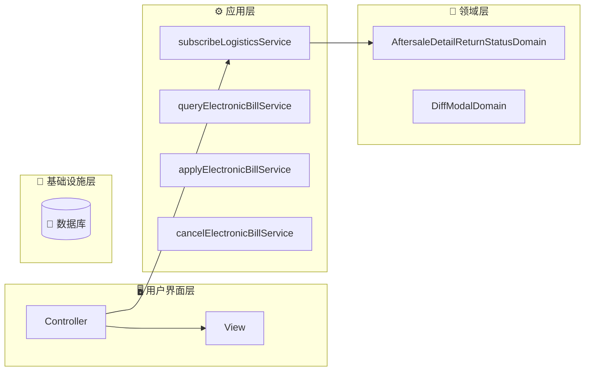

# fulfillment-aftersale-ark - Code Structure Analysis

## 📊 Project Overview
- **Project Name**: fulfillment-aftersale-ark
- **Project Type**: Vue应用
- **Technology Stack**: Vue.js, React, TypeScript, React + TypeScript, Stylus, Sass, Less
- **Architecture Pattern**: 模块化架构
- **Total Files**: 10485
- **Total Code Lines**: 202512
- **Total Entities**: 710


## 📊 Project Architecture Diagrams

### 项目架构依赖图
展示项目主要模块结构和它们之间的依赖关系




---


## 🗂️ Project Directory Structure
```
├── 📁 src/constants
│   ├── Files: 22 files
│   ├── Entities: 70 entities
│   └── Purpose: 项目目录
│
├── 📁 src/providers
│   ├── Files: 2 files
│   ├── Entities: 1 entities
│   └── Purpose: 项目目录
│
├── 📁 src/utils
│   ├── Files: 9 files
│   ├── Entities: 33 entities
│   └── Purpose: 工具函数目录
│
├── 📁 src/containers/AutoAftersale/AfterSaleDetail/constants
│   ├── Files: 2 files
│   ├── Entities: 3 entities
│   └── Purpose: React组件目录
│
├── 📁 src/containers/AutoAftersale/AfterSaleList/constants
│   ├── Files: 1 files
│   ├── Entities: 1 entities
│   └── Purpose: 项目目录
│
├── 📁 src/containers/AutoAftersale/AfterSaleDetail/providers
│   ├── Files: 5 files
│   ├── Entities: 6 entities
│   └── Purpose: 项目目录
│
├── 📁 src/containers/AutoAftersale/utils
│   ├── Files: 1 files
│   ├── Entities: 2 entities
│   └── Purpose: 工具函数目录
│
├── 📁 src/containers/AutoAftersale/hooks
│   ├── Files: 11 files
│   ├── Entities: 14 entities
│   └── Purpose: 项目目录
│
├── 📁 src/containers/AutoAftersale/AfterSaleDetail/hooks
│   ├── Files: 3 files
│   ├── Entities: 2 entities
│   └── Purpose: 项目目录
│
├── 📁 src/containers/AutoAftersale/AfterSaleList/hooks
│   ├── Files: 2 files
│   ├── Entities: 2 entities
│   └── Purpose: 项目目录
│
├── 📁 src/containers/OrderQuery/hooks
│   ├── Files: 1 files
│   ├── Entities: 1 entities
│   └── Purpose: 项目目录
│
├── 📁 src/containers/AutoAftersale/AfterSaleDetail/components
│   ├── Files: 27 files
│   ├── Entities: 27 entities
│   └── Purpose: 组件目录
│
├── 📁 src/containers/AutoAftersale/AfterSaleDetail/components/Negotiate
│   ├── Files: 15 files
│   ├── Entities: 14 entities
│   └── Purpose: Vue组件目录
│
├── 📁 src/containers/AutoAftersale/AfterSaleList/components
│   ├── Files: 14 files
│   ├── Entities: 14 entities
│   └── Purpose: 组件目录
│
├── 📁 src/containers/AutoAftersale/components/TabsLogisticsInfo
│   ├── Files: 9 files
│   ├── Entities: 9 entities
│   └── Purpose: Vue组件目录
│
├── 📁 src/containers/AutoAftersale/AfterSaleDetail/components/ActionModals
│   ├── Files: 8 files
│   ├── Entities: 8 entities
│   └── Purpose: Vue组件目录
│
├── 📁 src/containers/Assistance/components
│   ├── Files: 7 files
│   ├── Entities: 7 entities
│   └── Purpose: 组件目录
│
├── 📁 src/components/GuideLayout
│   ├── Files: 7 files
│   ├── Entities: 6 entities
│   └── Purpose: Vue组件目录
│
├── 📁 src/containers/Assistance/AssistanceMain/components
│   ├── Files: 6 files
│   ├── Entities: 6 entities
│   └── Purpose: 组件目录
│
└── 📁 src/containers/AutoAftersale/AfterSaleList/components/Metrics
    ├── Files: 6 files
    ├── Entities: 6 entities
    └── Purpose: Vue组件目录
```


---


---

## 🌐 Route Configuration Analysis

**Route Config Path**: `/Users/fangqiji/dev/aurora/packages/fulfillment/fulfillment-aftersale-ark/src/config/routes.config.ts`
**Total Routes**: 6
**Related Files**: 40
**Related Entities**: 345

## 📁 src/containers/Assistance/AssistanceMain/index.vue

### 🎯 Route Purpose
- **Primary Role**: 页面路由入口文件
- **Route Path**: `/app-order/auto/aftersale`
- **Route Name**: `ArkAppOrderAutoAftersale`
- **Page Title**: 售后助手
- **Entities**: `Component:index_05d38588b333` (component)
- **Functional Description**: 售后助手入口组件，根据用户状态展示不同内容：首次使用时显示引导页介绍产品价值和功能，已使用过则展示策略模板和管理列表，帮助商家自动化处理售后。

### 📦 关联文件夹

- **文件夹1: src/service**
  - `目录说明`: src/service 目录功能总结

该目录是一个API服务层，封装了与商家后台系统交互的各类HTTP请求接口，主要提供售后服务、物流管理、订单处理、商品信息、地址管理、平台消息、商家权益（如假一赔四、正品保障、安心购）等功能的数据服务，同时包含文件上传、数据解密等通用工具方法，为应用提供标准化的后端数据访问能力。

  - `文件依赖`: 被调用src/containers/AutoAftersale/AfterSaleList(API调用,9次); 调用src/service(API调用,4次); 调用src/service/Shipping(API调用,4次)

- **文件夹2: src/utils**
  - `目录说明`: src/utils 目录功能总结

该目录是一个通用工具集合，提供了多种辅助功能，包括价格格式化、解密灰度判断、DOM事件处理、表单配置转换、NPS调查触发、数据预加载、异步延时、性能埋点上报和URL验证等实用函数。这些工具函数相互独立，各自解决特定场景的常见问题，为应用的其他模块提供基础支持服务，提升代码复用性和开发效率。

  - `文件依赖`: 调用src/service(API调用,1次); 调用src/service/Shipping(API调用,1次); 调用src/service/abnormalOrder(API调用,1次)

- **文件夹3: src/service/Shipping**
  - `目录说明`: Shipping 目录功能总结

该目录是一个API服务模块，主要负责处理订单物流配送相关的功能，包含在线寄件拆分处理和多订单合并发货的接口封装，为应用提供与快递配送系统交互的服务层能力。

  - `文件依赖`: 被调用src/containers/AutoAftersale/AfterSaleList(API调用,9次); 被调用src/service(API调用,4次); 被调用src/containers/AutoAftersale/AfterSaleDetail/components/ActionModals(API调用,3次)

- **文件夹4: src/service/abnormalOrder**
  - `目录说明`: 目录功能总结：src/service/abnormalOrder

该目录是一个API服务模块，负责处理异常订单相关的后端交互功能，包括获取异常订单列表、导出异常订单文件、查询物流异常监控数据和发货异常监控数据，为系统提供完整的异常订单管理和监控所需的数据服务接口。

  - `文件依赖`: 被调用src/containers/AutoAftersale/AfterSaleList(API调用,9次); 被调用src/service(API调用,4次); 被调用src/containers/AutoAftersale/AfterSaleDetail/components/ActionModals(API调用,3次)

- **文件夹5: src/service/apiKit**
  - `目录说明`: 该目录是一个API服务层，主要提供与电商履约系统相关的接口封装，包含售后服务管理、物流配送、仓储管理、运费险、货品管理、区域报备等功能的API调用方法，通过HTTP请求与后端服务通信，为商家提供订单处理、售后处理、物流管理、库存管理等电商履约全流程的数据交互能力。

  - `文件依赖`: 被调用src/containers/AutoAftersale/AfterSaleList(API调用,9次); 被调用src/service(API调用,4次); 被调用src/containers/AutoAftersale/AfterSaleDetail/components/ActionModals(API调用,3次)

- **文件夹6: src/service/common**
  - `目录说明`: 该目录是一个API服务模块，主要提供文件导出相关的后端交互功能，通过fileExport.ts中的startExport函数封装了文件导出请求的发送逻辑，使应用能够便捷地发起文件导出任务并获取任务标识。

  - `文件依赖`: 被调用src/containers/AutoAftersale/AfterSaleList(API调用,9次); 被调用src/service(API调用,4次); 被调用src/containers/AutoAftersale/AfterSaleDetail/components/ActionModals(API调用,3次)

- **文件夹7: src/service/multiAddressReturn**
  - `目录说明`: 该目录提供多地址退货策略管理的API服务，包含查询退货地址策略列表、获取策略详情、查询关联商品列表以及删除策略的功能，支持商家配置和管理不同商品的退货地址策略。

  - `文件依赖`: 被调用src/containers/AutoAftersale/AfterSaleList(API调用,9次); 被调用src/service(API调用,4次); 被调用src/containers/AutoAftersale/AfterSaleDetail/components/ActionModals(API调用,3次)

- **文件夹8: src/service/overseaDirectMail**
  - `目录说明`: 该目录是一个API服务模块，提供海外直邮装载单管理的完整功能接口，包括装载单列表查询、明细获取、装载单上传、删除和发货操作，支持商家通过各种参数进行装载单的全生命周期管理，是海外直邮物流系统的核心服务接口集合。

  - `文件依赖`: 被调用src/containers/AutoAftersale/AfterSaleList(API调用,9次); 被调用src/service(API调用,4次); 被调用src/containers/AutoAftersale/AfterSaleDetail/components/ActionModals(API调用,3次)

- **文件夹9: src/service/reportManagement**
  - `目录说明`: 目录功能总结**：

该目录提供报备管理相关的API服务接口，主要负责订单列表数据获取、报表导出任务的创建和进度监控，支持报备管理模块中的数据查询和文件导出功能，是连接前端UI与后端报备管理系统的数据交互层。

  - `文件依赖`: 被调用src/containers/AutoAftersale/AfterSaleList(API调用,9次); 被调用src/service(API调用,4次); 被调用src/containers/AutoAftersale/AfterSaleDetail/components/ActionModals(API调用,3次)

- **文件夹10: src/service/waybill**
  - `目录说明`: 目录功能总结：src/service/waybill

该目录是电子面单服务的API接口集合，提供了完整的电子面单业务流程支持，包括面单模板的创建、查询、更新和删除，快递公司及网点信息查询，账户余额查询，物流合作伙伴订阅与取消，电子面单使用记录查询等功能。这些API服务支持商家管理电子面单模板、订购物流服务、验证月结卡号、查询账户信息等操作，构成了电子面单系统的核心后端交互层。

  - `文件依赖`: 被调用src/containers/AutoAftersale/AfterSaleList(API调用,9次); 被调用src/service(API调用,4次); 被调用src/containers/AutoAftersale/AfterSaleDetail/components/ActionModals(API调用,3次)

- **文件夹11: src/service/waybillDispatch**
  - `目录说明`: 目录功能总结

`src/service/waybillDispatch` 目录是一个API服务模块，主要负责电子面单和物流发货相关的后端交互功能，包括运单的查询、打印（普通打印、合并打印、分离打印、重新打印）、取消、手动添加订单、获取用户信息以及作业单发送等操作，为电商平台的物流发货管理系统提供完整的运单处理服务接口。

  - `文件依赖`: 被调用src/containers/AutoAftersale/AfterSaleList(API调用,9次); 被调用src/service(API调用,4次); 被调用src/containers/AutoAftersale/AfterSaleDetail/components/ActionModals(API调用,3次)

- **文件夹12: src/containers/AutoAftersale/utils**
  - `目录说明`: 该目录是一个工具类集合，主要提供自动售后系统中的NPS(客户满意度调查)触发功能，负责根据不同售后类型和用户行为条件自动发送满意度调查问卷，支持售后体验评估流程。

  - `文件依赖`: 暂无明确依赖关系

- **文件夹13: src/containers/Assistance/AssistanceMain/components**
  - `目录说明`: 该目录包含售后助手系统的核心UI组件，负责展示和管理售后策略，包括策略列表管理、模板展示与选择、策略详情查看、执行情况监控和数据指标展示，为商家提供完整的售后自动化策略管理界面，支持创建、编辑、查看和监控售后处理流程。

  - `文件依赖`: 调用src/service(API调用,1次); 调用src/service/Shipping(API调用,1次); 调用src/service/abnormalOrder(API调用,1次)

- **文件夹14: src/containers/Assistance**
  - `目录说明`: 售后助手策略配置模块，提供售后策略的创建和编辑功能，包含表单配置界面和产品价值展示，支持用户设置售后类型、订单状态和执行操作等参数，并通过产品价值点展示该功能的业务优势。

  - `文件依赖`: 暂无明确依赖关系

- **文件夹15: src/containers/Assistance/components**
  - `目录说明`: 这个目录包含了辅助功能(Assistance)模块的UI表单组件集合，主要提供各种专用输入控件，包括时间选择、数字输入、金额处理、原因选择、工作时间段设置和物流状态选择等，这些组件都基于Formily框架开发，支持表单验证和数据转换，专门用于辅助功能相关的表单交互场景。

  - `文件依赖`: 暂无明确依赖关系

- **文件夹16: src/containers/AutoAftersale/AfterSaleList/components**
  - `目录说明`: 该目录包含售后服务管理系统的UI组件集合，主要负责售后列表页面的各个功能区块展示，包括售后状态展示、商品审核、物流信息管理、订单信息展示、价格展示、操作按钮、地址选择等界面元素，以及相关的模态框组件，共同构成了商家处理售后申请的完整交互界面，支持售后流程中的各种操作场景和信息展示需求。

  - `文件依赖`: 调用src/service(API调用,2次); 调用src/service/Shipping(API调用,2次); 调用src/service/abnormalOrder(API调用,2次)

- **文件夹17: src/containers/AutoAftersale/AfterSaleList/components/Metrics**
  - `目录说明`: Metrics 目录功能总结

该目录提供售后服务数据指标展示相关的UI组件和辅助功能，包含售后指标数据展示、数据诊断警报、售后指南弹窗等组件，以及指标颜色计算和新手引导等辅助功能，旨在帮助商家直观了解售后服务表现、同行对比数据和改进建议，提升售后服务质量。

  - `文件依赖`: 调用src/service(API调用,1次); 调用src/service/Shipping(API调用,1次); 调用src/service/abnormalOrder(API调用,1次)

- **文件夹18: src/containers/AutoAftersale/AfterSaleList/components/Metrics/PeerCompare**
  - `目录说明`: PeerCompare 目录功能总结

该目录提供售后服务同行数据对比的UI组件，通过进度条可视化展示用户指标超越同行的百分比和行业均值，支持不同数值格式化类型和自定义样式，帮助用户直观了解自身售后服务在行业中的相对表现水平。

  - `文件依赖`: 暂无明确依赖关系

- **文件夹19: src/containers/AutoAftersale/AfterSaleDetail/components**
  - `目录说明`: 该目录包含售后详情页面的UI组件集合，主要负责展示和操作售后服务的各个方面，包括售后基本信息、协商记录、物流信息、订单信息、地址选择、纠纷处理、状态操作等功能模块。组件采用Vue框架开发，支持不同售后场景（退款、退货、换货）的信息展示和交互操作，提供了完整的售后服务管理界面，部分组件有V2版本表明系统迭代更新。

  - `文件依赖`: 调用src/service(API调用,1次); 调用src/service/Shipping(API调用,1次); 调用src/service/abnormalOrder(API调用,1次)

- **文件夹20: src/containers/AutoAftersale/AfterSaleDetail/components/ActionModals**
  - `目录说明`: ActionModals 目录功能总结

该目录包含售后管理系统中各类操作弹窗/抽屉组件，负责处理售后流程中的关键交互界面，包括预检查提示、确认操作、退款处理、物流信息编辑、拒绝理由选择、留言沟通和退换货地址确认等功能模块。这些组件共同构成了售后处理流程中的用户交互层，支持商家完成各类售后操作决策和信息录入。

  - `文件依赖`: 调用src/service(API调用,3次); 调用src/service/Shipping(API调用,3次); 调用src/service/abnormalOrder(API调用,3次)

- **文件夹21: src/containers/AutoAftersale/AfterSaleDetail/components/Banners**
  - `目录说明`: Banners 目录功能总结

该目录包含售后系统中使用的横幅提示UI组件，主要负责在售后详情页面中展示处理建议、警告和提示信息。组件支持不同样式（如警告、危险）的信息展示，并能够动态解析和渲染文本内容，为用户提供售后处理流程中的操作指导和重要提示。

  - `文件依赖`: 暂无明确依赖关系

- **文件夹22: src/containers/AutoAftersale/AfterSaleDetail/components/BlockSelector**
  - `目录说明`: BlockSelector 目录功能总结

该目录提供了一个售后详情页面中的块选择器UI组件，实现平铺式选项卡的单选功能，用于售后场景中的选项选择，通过事件机制与父组件进行数据交互。

  - `文件依赖`: 暂无明确依赖关系

- **文件夹23: src/containers/AutoAftersale/AfterSaleDetail/components/CopywritingAdapter**
  - `目录说明`: CopywritingAdapter 目录功能总结

该目录提供了一个富文本适配器UI组件，负责智能识别并渲染不同类型的内容数据，能够将纯文本或富文本对象（包含文本、链接、换行等元素）转换为适当的HTML展示形式，用于售后详情页面中的文本内容展示。

  - `文件依赖`: 暂无明确依赖关系

- **文件夹24: src/containers/AutoAftersale/AfterSaleDetail/components/FreightCompensation**
  - `目录说明`: 该目录是售后详情页中的运费补偿功能模块，包含运费宝服务信息展示、运费报销扣款管理和整合展示组件，负责展示售后单中与运费相关的补贴、报销、服务状态等信息，并提供运费宝服务的推广和开通入口，帮助商家降低运费成本。

  - `文件依赖`: 调用src/service(API调用,1次); 调用src/service/Shipping(API调用,1次); 调用src/service/abnormalOrder(API调用,1次)

- **文件夹25: src/containers/AutoAftersale/AfterSaleDetail/components/FreightCompensationV2**
  - `目录说明`: FreightCompensationV2 目录功能总结

该目录是售后详情页中的运费补偿模块UI组件集合，负责展示运费宝服务信息、运费报销扣款情况及相关数据，包括服务状态、补贴金额、报销凭证等，同时为未开通运费宝服务的商家提供开通引导和推荐，帮助商家了解和管理售后运费相关成本。

  - `文件依赖`: 调用src/service(API调用,1次); 调用src/service/Shipping(API调用,1次); 调用src/service/abnormalOrder(API调用,1次)

- **文件夹26: src/containers/AutoAftersale/AfterSaleDetail/components/GiveawaysModal**
  - `目录说明`: 这是一个售后赠品关联展示UI组件目录，负责在售后详情页中以模态框形式展示主品与赠品售后单的关联信息，包括商品信息、价格数量展示及查看详情等操作功能。

  - `文件依赖`: 暂无明确依赖关系

- **文件夹27: src/containers/AutoAftersale/AfterSaleDetail/components/Negotiate**
  - `目录说明`: Negotiate 目录功能总结

该目录包含售后协商流程的UI组件集合，主要负责售后协商方案的创建、编辑和预览功能。组件涵盖了协商场景选择、售后类型、原因、状态展示、退款金额输入、延期设置、地址选择、协商描述等表单元素，以及规则展示、方案预览等辅助功能，共同构成完整的售后协商交互界面，支持商家与消费者进行售后问题的有效沟通和处理。

  - `文件依赖`: 暂无明确依赖关系

- **文件夹28: src/containers/AutoAftersale/AfterSaleDetail/components/ActionModals/ProofDrawer**
  - `目录说明`: ProofDrawer 目录功能总结

该目录包含售后系统中的举证相关抽屉组件集合，主要负责商家和用户在售后流程中提交申诉凭证、补充举证和留言沟通的UI交互功能。组件支持文本输入、图片和文件上传，并提供表单验证和数据提交能力，是售后服务流程中用于证据提交和沟通的专用UI组件模块。

  - `文件依赖`: 调用src/service(API调用,1次); 调用src/service/Shipping(API调用,1次); 调用src/service/abnormalOrder(API调用,1次)

- **文件夹29: src/containers/MicroRemittance/components**
  - `目录说明`: 该目录包含小额打款管理相关的UI组件，主要提供打款记录的查询、展示和操作功能，支持多条件筛选、发起打款、查看订单详情及打款状态追踪，是微汇款(MicroRemittance)模块的界面展示层组件。

  - `文件依赖`: 暂无明确依赖关系

- **文件夹30: src/containers/MicroRemittance/components/Search**
  - `目录说明`: 目录功能总结

该目录提供微汇款系统的搜索功能组件，包含一个动态表单元数据渲染组件和一个自适应搜索面板组件，共同构成可配置的查询界面，支持响应式布局、展开收起功能和数据交互，属于UI组件模块，用于系统中各类数据的筛选查询操作。

  - `文件依赖`: 暂无明确依赖关系


---

## 📁 src/containers/Assistance/CreateAssistance.vue

### 🎯 Route Purpose
- **Primary Role**: 页面路由入口文件
- **Route Path**: `/app-order/auto/aftersale/add`
- **Route Name**: `ArkAppOrderAutoAftersaleAdd`
- **Page Title**: 售后助手 - 新建策略
- **Entities**: `Component:CreateAssistance` (component)
- **Functional Description**: 售后助手策略创建/编辑组件，用于配置售后类型、订单状态、执行操作等参数，支持表单验证和数据提交，提供策略模板选择和参数配置功能。

### 📦 关联文件夹

- **文件夹1: src/containers/Assistance/AssistanceMain**
  - `目录说明`: 目录功能总结

该目录实现了售后助手的路由组件，包含入口页面、引导页和主界面三个组件，负责根据用户使用状态展示相应内容：首次使用时展示产品价值引导，已使用则提供数据指标、策略模板选择和策略管理功能，整体构成一个帮助商家自动化处理售后工作、提升效率的UI组件集合。

  - `文件依赖`: 暂无明确依赖关系

- **文件夹2: src/service**
  - `目录说明`: src/service 目录功能总结

该目录是一个API服务层，封装了与商家后台系统交互的各类HTTP请求接口，主要提供售后服务、物流管理、订单处理、商品信息、地址管理、平台消息、商家权益（如假一赔四、正品保障、安心购）等功能的数据服务，同时包含文件上传、数据解密等通用工具方法，为应用提供标准化的后端数据访问能力。

  - `文件依赖`: 被调用src/containers/AutoAftersale/AfterSaleList(API调用,9次); 调用src/service(API调用,4次); 调用src/service/Shipping(API调用,4次)

- **文件夹3: src/utils**
  - `目录说明`: src/utils 目录功能总结

该目录是一个通用工具集合，提供了多种辅助功能，包括价格格式化、解密灰度判断、DOM事件处理、表单配置转换、NPS调查触发、数据预加载、异步延时、性能埋点上报和URL验证等实用函数。这些工具函数相互独立，各自解决特定场景的常见问题，为应用的其他模块提供基础支持服务，提升代码复用性和开发效率。

  - `文件依赖`: 调用src/service(API调用,1次); 调用src/service/Shipping(API调用,1次); 调用src/service/abnormalOrder(API调用,1次)

- **文件夹4: src/service/Shipping**
  - `目录说明`: Shipping 目录功能总结

该目录是一个API服务模块，主要负责处理订单物流配送相关的功能，包含在线寄件拆分处理和多订单合并发货的接口封装，为应用提供与快递配送系统交互的服务层能力。

  - `文件依赖`: 被调用src/containers/AutoAftersale/AfterSaleList(API调用,9次); 被调用src/service(API调用,4次); 被调用src/containers/AutoAftersale/AfterSaleDetail/components/ActionModals(API调用,3次)

- **文件夹5: src/service/abnormalOrder**
  - `目录说明`: 目录功能总结：src/service/abnormalOrder

该目录是一个API服务模块，负责处理异常订单相关的后端交互功能，包括获取异常订单列表、导出异常订单文件、查询物流异常监控数据和发货异常监控数据，为系统提供完整的异常订单管理和监控所需的数据服务接口。

  - `文件依赖`: 被调用src/containers/AutoAftersale/AfterSaleList(API调用,9次); 被调用src/service(API调用,4次); 被调用src/containers/AutoAftersale/AfterSaleDetail/components/ActionModals(API调用,3次)

- **文件夹6: src/service/apiKit**
  - `目录说明`: 该目录是一个API服务层，主要提供与电商履约系统相关的接口封装，包含售后服务管理、物流配送、仓储管理、运费险、货品管理、区域报备等功能的API调用方法，通过HTTP请求与后端服务通信，为商家提供订单处理、售后处理、物流管理、库存管理等电商履约全流程的数据交互能力。

  - `文件依赖`: 被调用src/containers/AutoAftersale/AfterSaleList(API调用,9次); 被调用src/service(API调用,4次); 被调用src/containers/AutoAftersale/AfterSaleDetail/components/ActionModals(API调用,3次)

- **文件夹7: src/service/common**
  - `目录说明`: 该目录是一个API服务模块，主要提供文件导出相关的后端交互功能，通过fileExport.ts中的startExport函数封装了文件导出请求的发送逻辑，使应用能够便捷地发起文件导出任务并获取任务标识。

  - `文件依赖`: 被调用src/containers/AutoAftersale/AfterSaleList(API调用,9次); 被调用src/service(API调用,4次); 被调用src/containers/AutoAftersale/AfterSaleDetail/components/ActionModals(API调用,3次)

- **文件夹8: src/service/multiAddressReturn**
  - `目录说明`: 该目录提供多地址退货策略管理的API服务，包含查询退货地址策略列表、获取策略详情、查询关联商品列表以及删除策略的功能，支持商家配置和管理不同商品的退货地址策略。

  - `文件依赖`: 被调用src/containers/AutoAftersale/AfterSaleList(API调用,9次); 被调用src/service(API调用,4次); 被调用src/containers/AutoAftersale/AfterSaleDetail/components/ActionModals(API调用,3次)

- **文件夹9: src/service/overseaDirectMail**
  - `目录说明`: 该目录是一个API服务模块，提供海外直邮装载单管理的完整功能接口，包括装载单列表查询、明细获取、装载单上传、删除和发货操作，支持商家通过各种参数进行装载单的全生命周期管理，是海外直邮物流系统的核心服务接口集合。

  - `文件依赖`: 被调用src/containers/AutoAftersale/AfterSaleList(API调用,9次); 被调用src/service(API调用,4次); 被调用src/containers/AutoAftersale/AfterSaleDetail/components/ActionModals(API调用,3次)

- **文件夹10: src/service/reportManagement**
  - `目录说明`: 目录功能总结**：

该目录提供报备管理相关的API服务接口，主要负责订单列表数据获取、报表导出任务的创建和进度监控，支持报备管理模块中的数据查询和文件导出功能，是连接前端UI与后端报备管理系统的数据交互层。

  - `文件依赖`: 被调用src/containers/AutoAftersale/AfterSaleList(API调用,9次); 被调用src/service(API调用,4次); 被调用src/containers/AutoAftersale/AfterSaleDetail/components/ActionModals(API调用,3次)

- **文件夹11: src/service/waybill**
  - `目录说明`: 目录功能总结：src/service/waybill

该目录是电子面单服务的API接口集合，提供了完整的电子面单业务流程支持，包括面单模板的创建、查询、更新和删除，快递公司及网点信息查询，账户余额查询，物流合作伙伴订阅与取消，电子面单使用记录查询等功能。这些API服务支持商家管理电子面单模板、订购物流服务、验证月结卡号、查询账户信息等操作，构成了电子面单系统的核心后端交互层。

  - `文件依赖`: 被调用src/containers/AutoAftersale/AfterSaleList(API调用,9次); 被调用src/service(API调用,4次); 被调用src/containers/AutoAftersale/AfterSaleDetail/components/ActionModals(API调用,3次)

- **文件夹12: src/service/waybillDispatch**
  - `目录说明`: 目录功能总结

`src/service/waybillDispatch` 目录是一个API服务模块，主要负责电子面单和物流发货相关的后端交互功能，包括运单的查询、打印（普通打印、合并打印、分离打印、重新打印）、取消、手动添加订单、获取用户信息以及作业单发送等操作，为电商平台的物流发货管理系统提供完整的运单处理服务接口。

  - `文件依赖`: 被调用src/containers/AutoAftersale/AfterSaleList(API调用,9次); 被调用src/service(API调用,4次); 被调用src/containers/AutoAftersale/AfterSaleDetail/components/ActionModals(API调用,3次)

- **文件夹13: src/containers/AutoAftersale/utils**
  - `目录说明`: 该目录是一个工具类集合，主要提供自动售后系统中的NPS(客户满意度调查)触发功能，负责根据不同售后类型和用户行为条件自动发送满意度调查问卷，支持售后体验评估流程。

  - `文件依赖`: 暂无明确依赖关系

- **文件夹14: src/containers/Assistance/AssistanceMain/components**
  - `目录说明`: 该目录包含售后助手系统的核心UI组件，负责展示和管理售后策略，包括策略列表管理、模板展示与选择、策略详情查看、执行情况监控和数据指标展示，为商家提供完整的售后自动化策略管理界面，支持创建、编辑、查看和监控售后处理流程。

  - `文件依赖`: 调用src/service(API调用,1次); 调用src/service/Shipping(API调用,1次); 调用src/service/abnormalOrder(API调用,1次)

- **文件夹15: src/containers/Assistance/components**
  - `目录说明`: 这个目录包含了辅助功能(Assistance)模块的UI表单组件集合，主要提供各种专用输入控件，包括时间选择、数字输入、金额处理、原因选择、工作时间段设置和物流状态选择等，这些组件都基于Formily框架开发，支持表单验证和数据转换，专门用于辅助功能相关的表单交互场景。

  - `文件依赖`: 暂无明确依赖关系

- **文件夹16: src/containers/AutoAftersale/AfterSaleList/components**
  - `目录说明`: 该目录包含售后服务管理系统的UI组件集合，主要负责售后列表页面的各个功能区块展示，包括售后状态展示、商品审核、物流信息管理、订单信息展示、价格展示、操作按钮、地址选择等界面元素，以及相关的模态框组件，共同构成了商家处理售后申请的完整交互界面，支持售后流程中的各种操作场景和信息展示需求。

  - `文件依赖`: 调用src/service(API调用,2次); 调用src/service/Shipping(API调用,2次); 调用src/service/abnormalOrder(API调用,2次)

- **文件夹17: src/containers/AutoAftersale/AfterSaleList/components/Metrics**
  - `目录说明`: Metrics 目录功能总结

该目录提供售后服务数据指标展示相关的UI组件和辅助功能，包含售后指标数据展示、数据诊断警报、售后指南弹窗等组件，以及指标颜色计算和新手引导等辅助功能，旨在帮助商家直观了解售后服务表现、同行对比数据和改进建议，提升售后服务质量。

  - `文件依赖`: 调用src/service(API调用,1次); 调用src/service/Shipping(API调用,1次); 调用src/service/abnormalOrder(API调用,1次)

- **文件夹18: src/containers/AutoAftersale/AfterSaleList/components/Metrics/PeerCompare**
  - `目录说明`: PeerCompare 目录功能总结

该目录提供售后服务同行数据对比的UI组件，通过进度条可视化展示用户指标超越同行的百分比和行业均值，支持不同数值格式化类型和自定义样式，帮助用户直观了解自身售后服务在行业中的相对表现水平。

  - `文件依赖`: 暂无明确依赖关系

- **文件夹19: src/containers/AutoAftersale/AfterSaleDetail/components**
  - `目录说明`: 该目录包含售后详情页面的UI组件集合，主要负责展示和操作售后服务的各个方面，包括售后基本信息、协商记录、物流信息、订单信息、地址选择、纠纷处理、状态操作等功能模块。组件采用Vue框架开发，支持不同售后场景（退款、退货、换货）的信息展示和交互操作，提供了完整的售后服务管理界面，部分组件有V2版本表明系统迭代更新。

  - `文件依赖`: 调用src/service(API调用,1次); 调用src/service/Shipping(API调用,1次); 调用src/service/abnormalOrder(API调用,1次)

- **文件夹20: src/containers/AutoAftersale/AfterSaleDetail/components/ActionModals**
  - `目录说明`: ActionModals 目录功能总结

该目录包含售后管理系统中各类操作弹窗/抽屉组件，负责处理售后流程中的关键交互界面，包括预检查提示、确认操作、退款处理、物流信息编辑、拒绝理由选择、留言沟通和退换货地址确认等功能模块。这些组件共同构成了售后处理流程中的用户交互层，支持商家完成各类售后操作决策和信息录入。

  - `文件依赖`: 调用src/service(API调用,3次); 调用src/service/Shipping(API调用,3次); 调用src/service/abnormalOrder(API调用,3次)

- **文件夹21: src/containers/AutoAftersale/AfterSaleDetail/components/Banners**
  - `目录说明`: Banners 目录功能总结

该目录包含售后系统中使用的横幅提示UI组件，主要负责在售后详情页面中展示处理建议、警告和提示信息。组件支持不同样式（如警告、危险）的信息展示，并能够动态解析和渲染文本内容，为用户提供售后处理流程中的操作指导和重要提示。

  - `文件依赖`: 暂无明确依赖关系

- **文件夹22: src/containers/AutoAftersale/AfterSaleDetail/components/BlockSelector**
  - `目录说明`: BlockSelector 目录功能总结

该目录提供了一个售后详情页面中的块选择器UI组件，实现平铺式选项卡的单选功能，用于售后场景中的选项选择，通过事件机制与父组件进行数据交互。

  - `文件依赖`: 暂无明确依赖关系

- **文件夹23: src/containers/AutoAftersale/AfterSaleDetail/components/CopywritingAdapter**
  - `目录说明`: CopywritingAdapter 目录功能总结

该目录提供了一个富文本适配器UI组件，负责智能识别并渲染不同类型的内容数据，能够将纯文本或富文本对象（包含文本、链接、换行等元素）转换为适当的HTML展示形式，用于售后详情页面中的文本内容展示。

  - `文件依赖`: 暂无明确依赖关系

- **文件夹24: src/containers/AutoAftersale/AfterSaleDetail/components/FreightCompensation**
  - `目录说明`: 该目录是售后详情页中的运费补偿功能模块，包含运费宝服务信息展示、运费报销扣款管理和整合展示组件，负责展示售后单中与运费相关的补贴、报销、服务状态等信息，并提供运费宝服务的推广和开通入口，帮助商家降低运费成本。

  - `文件依赖`: 调用src/service(API调用,1次); 调用src/service/Shipping(API调用,1次); 调用src/service/abnormalOrder(API调用,1次)

- **文件夹25: src/containers/AutoAftersale/AfterSaleDetail/components/FreightCompensationV2**
  - `目录说明`: FreightCompensationV2 目录功能总结

该目录是售后详情页中的运费补偿模块UI组件集合，负责展示运费宝服务信息、运费报销扣款情况及相关数据，包括服务状态、补贴金额、报销凭证等，同时为未开通运费宝服务的商家提供开通引导和推荐，帮助商家了解和管理售后运费相关成本。

  - `文件依赖`: 调用src/service(API调用,1次); 调用src/service/Shipping(API调用,1次); 调用src/service/abnormalOrder(API调用,1次)

- **文件夹26: src/containers/AutoAftersale/AfterSaleDetail/components/GiveawaysModal**
  - `目录说明`: 这是一个售后赠品关联展示UI组件目录，负责在售后详情页中以模态框形式展示主品与赠品售后单的关联信息，包括商品信息、价格数量展示及查看详情等操作功能。

  - `文件依赖`: 暂无明确依赖关系

- **文件夹27: src/containers/AutoAftersale/AfterSaleDetail/components/Negotiate**
  - `目录说明`: Negotiate 目录功能总结

该目录包含售后协商流程的UI组件集合，主要负责售后协商方案的创建、编辑和预览功能。组件涵盖了协商场景选择、售后类型、原因、状态展示、退款金额输入、延期设置、地址选择、协商描述等表单元素，以及规则展示、方案预览等辅助功能，共同构成完整的售后协商交互界面，支持商家与消费者进行售后问题的有效沟通和处理。

  - `文件依赖`: 暂无明确依赖关系

- **文件夹28: src/containers/AutoAftersale/AfterSaleDetail/components/ActionModals/ProofDrawer**
  - `目录说明`: ProofDrawer 目录功能总结

该目录包含售后系统中的举证相关抽屉组件集合，主要负责商家和用户在售后流程中提交申诉凭证、补充举证和留言沟通的UI交互功能。组件支持文本输入、图片和文件上传，并提供表单验证和数据提交能力，是售后服务流程中用于证据提交和沟通的专用UI组件模块。

  - `文件依赖`: 调用src/service(API调用,1次); 调用src/service/Shipping(API调用,1次); 调用src/service/abnormalOrder(API调用,1次)

- **文件夹29: src/containers/MicroRemittance/components**
  - `目录说明`: 该目录包含小额打款管理相关的UI组件，主要提供打款记录的查询、展示和操作功能，支持多条件筛选、发起打款、查看订单详情及打款状态追踪，是微汇款(MicroRemittance)模块的界面展示层组件。

  - `文件依赖`: 暂无明确依赖关系

- **文件夹30: src/containers/MicroRemittance/components/Search**
  - `目录说明`: 目录功能总结

该目录提供微汇款系统的搜索功能组件，包含一个动态表单元数据渲染组件和一个自适应搜索面板组件，共同构成可配置的查询界面，支持响应式布局、展开收起功能和数据交互，属于UI组件模块，用于系统中各类数据的筛选查询操作。

  - `文件依赖`: 暂无明确依赖关系


---

## 📁 src/containers/AutoAftersale/AfterSaleList/index.vue

### 🎯 Route Purpose
- **Primary Role**: 页面路由入口文件
- **Route Path**: `/app-order/aftersale/list`
- **Route Name**: `ArkAppOrderAftersaleList`
- **Page Title**: 售后管理
- **Entities**: `Component:index_a31431ef66c4` (component)
- **Functional Description**: 售后列表页面的入口组件，集成了TabUpBanner、BannerPlacement和AftersaleList组件，用于展示售后订单列表，并处理老路由tab参数兼容。

### 📦 关联文件夹

- **文件夹1: src/service**
  - `目录说明`: src/service 目录功能总结

该目录是一个API服务层，封装了与商家后台系统交互的各类HTTP请求接口，主要提供售后服务、物流管理、订单处理、商品信息、地址管理、平台消息、商家权益（如假一赔四、正品保障、安心购）等功能的数据服务，同时包含文件上传、数据解密等通用工具方法，为应用提供标准化的后端数据访问能力。

  - `文件依赖`: 被调用src/containers/AutoAftersale/AfterSaleList(API调用,9次); 调用src/service(API调用,4次); 调用src/service/Shipping(API调用,4次)

- **文件夹2: src/utils**
  - `目录说明`: src/utils 目录功能总结

该目录是一个通用工具集合，提供了多种辅助功能，包括价格格式化、解密灰度判断、DOM事件处理、表单配置转换、NPS调查触发、数据预加载、异步延时、性能埋点上报和URL验证等实用函数。这些工具函数相互独立，各自解决特定场景的常见问题，为应用的其他模块提供基础支持服务，提升代码复用性和开发效率。

  - `文件依赖`: 调用src/service(API调用,1次); 调用src/service/Shipping(API调用,1次); 调用src/service/abnormalOrder(API调用,1次)

- **文件夹3: src/service/Shipping**
  - `目录说明`: Shipping 目录功能总结

该目录是一个API服务模块，主要负责处理订单物流配送相关的功能，包含在线寄件拆分处理和多订单合并发货的接口封装，为应用提供与快递配送系统交互的服务层能力。

  - `文件依赖`: 被调用src/containers/AutoAftersale/AfterSaleList(API调用,9次); 被调用src/service(API调用,4次); 被调用src/containers/AutoAftersale/AfterSaleDetail/components/ActionModals(API调用,3次)

- **文件夹4: src/service/abnormalOrder**
  - `目录说明`: 目录功能总结：src/service/abnormalOrder

该目录是一个API服务模块，负责处理异常订单相关的后端交互功能，包括获取异常订单列表、导出异常订单文件、查询物流异常监控数据和发货异常监控数据，为系统提供完整的异常订单管理和监控所需的数据服务接口。

  - `文件依赖`: 被调用src/containers/AutoAftersale/AfterSaleList(API调用,9次); 被调用src/service(API调用,4次); 被调用src/containers/AutoAftersale/AfterSaleDetail/components/ActionModals(API调用,3次)

- **文件夹5: src/service/apiKit**
  - `目录说明`: 该目录是一个API服务层，主要提供与电商履约系统相关的接口封装，包含售后服务管理、物流配送、仓储管理、运费险、货品管理、区域报备等功能的API调用方法，通过HTTP请求与后端服务通信，为商家提供订单处理、售后处理、物流管理、库存管理等电商履约全流程的数据交互能力。

  - `文件依赖`: 被调用src/containers/AutoAftersale/AfterSaleList(API调用,9次); 被调用src/service(API调用,4次); 被调用src/containers/AutoAftersale/AfterSaleDetail/components/ActionModals(API调用,3次)

- **文件夹6: src/service/common**
  - `目录说明`: 该目录是一个API服务模块，主要提供文件导出相关的后端交互功能，通过fileExport.ts中的startExport函数封装了文件导出请求的发送逻辑，使应用能够便捷地发起文件导出任务并获取任务标识。

  - `文件依赖`: 被调用src/containers/AutoAftersale/AfterSaleList(API调用,9次); 被调用src/service(API调用,4次); 被调用src/containers/AutoAftersale/AfterSaleDetail/components/ActionModals(API调用,3次)

- **文件夹7: src/service/multiAddressReturn**
  - `目录说明`: 该目录提供多地址退货策略管理的API服务，包含查询退货地址策略列表、获取策略详情、查询关联商品列表以及删除策略的功能，支持商家配置和管理不同商品的退货地址策略。

  - `文件依赖`: 被调用src/containers/AutoAftersale/AfterSaleList(API调用,9次); 被调用src/service(API调用,4次); 被调用src/containers/AutoAftersale/AfterSaleDetail/components/ActionModals(API调用,3次)

- **文件夹8: src/service/overseaDirectMail**
  - `目录说明`: 该目录是一个API服务模块，提供海外直邮装载单管理的完整功能接口，包括装载单列表查询、明细获取、装载单上传、删除和发货操作，支持商家通过各种参数进行装载单的全生命周期管理，是海外直邮物流系统的核心服务接口集合。

  - `文件依赖`: 被调用src/containers/AutoAftersale/AfterSaleList(API调用,9次); 被调用src/service(API调用,4次); 被调用src/containers/AutoAftersale/AfterSaleDetail/components/ActionModals(API调用,3次)

- **文件夹9: src/service/reportManagement**
  - `目录说明`: 目录功能总结**：

该目录提供报备管理相关的API服务接口，主要负责订单列表数据获取、报表导出任务的创建和进度监控，支持报备管理模块中的数据查询和文件导出功能，是连接前端UI与后端报备管理系统的数据交互层。

  - `文件依赖`: 被调用src/containers/AutoAftersale/AfterSaleList(API调用,9次); 被调用src/service(API调用,4次); 被调用src/containers/AutoAftersale/AfterSaleDetail/components/ActionModals(API调用,3次)

- **文件夹10: src/service/waybill**
  - `目录说明`: 目录功能总结：src/service/waybill

该目录是电子面单服务的API接口集合，提供了完整的电子面单业务流程支持，包括面单模板的创建、查询、更新和删除，快递公司及网点信息查询，账户余额查询，物流合作伙伴订阅与取消，电子面单使用记录查询等功能。这些API服务支持商家管理电子面单模板、订购物流服务、验证月结卡号、查询账户信息等操作，构成了电子面单系统的核心后端交互层。

  - `文件依赖`: 被调用src/containers/AutoAftersale/AfterSaleList(API调用,9次); 被调用src/service(API调用,4次); 被调用src/containers/AutoAftersale/AfterSaleDetail/components/ActionModals(API调用,3次)

- **文件夹11: src/service/waybillDispatch**
  - `目录说明`: 目录功能总结

`src/service/waybillDispatch` 目录是一个API服务模块，主要负责电子面单和物流发货相关的后端交互功能，包括运单的查询、打印（普通打印、合并打印、分离打印、重新打印）、取消、手动添加订单、获取用户信息以及作业单发送等操作，为电商平台的物流发货管理系统提供完整的运单处理服务接口。

  - `文件依赖`: 被调用src/containers/AutoAftersale/AfterSaleList(API调用,9次); 被调用src/service(API调用,4次); 被调用src/containers/AutoAftersale/AfterSaleDetail/components/ActionModals(API调用,3次)

- **文件夹12: src/containers/AutoAftersale/utils**
  - `目录说明`: 该目录是一个工具类集合，主要提供自动售后系统中的NPS(客户满意度调查)触发功能，负责根据不同售后类型和用户行为条件自动发送满意度调查问卷，支持售后体验评估流程。

  - `文件依赖`: 暂无明确依赖关系

- **文件夹13: src/containers/Assistance/AssistanceMain/components**
  - `目录说明`: 该目录包含售后助手系统的核心UI组件，负责展示和管理售后策略，包括策略列表管理、模板展示与选择、策略详情查看、执行情况监控和数据指标展示，为商家提供完整的售后自动化策略管理界面，支持创建、编辑、查看和监控售后处理流程。

  - `文件依赖`: 调用src/service(API调用,1次); 调用src/service/Shipping(API调用,1次); 调用src/service/abnormalOrder(API调用,1次)

- **文件夹14: src/containers/Assistance/components**
  - `目录说明`: 这个目录包含了辅助功能(Assistance)模块的UI表单组件集合，主要提供各种专用输入控件，包括时间选择、数字输入、金额处理、原因选择、工作时间段设置和物流状态选择等，这些组件都基于Formily框架开发，支持表单验证和数据转换，专门用于辅助功能相关的表单交互场景。

  - `文件依赖`: 暂无明确依赖关系

- **文件夹15: src/containers/AutoAftersale/AfterSaleList/components**
  - `目录说明`: 该目录包含售后服务管理系统的UI组件集合，主要负责售后列表页面的各个功能区块展示，包括售后状态展示、商品审核、物流信息管理、订单信息展示、价格展示、操作按钮、地址选择等界面元素，以及相关的模态框组件，共同构成了商家处理售后申请的完整交互界面，支持售后流程中的各种操作场景和信息展示需求。

  - `文件依赖`: 调用src/service(API调用,2次); 调用src/service/Shipping(API调用,2次); 调用src/service/abnormalOrder(API调用,2次)

- **文件夹16: src/containers/AutoAftersale/AfterSaleList/config**
  - `目录说明`: 该目录主要负责售后列表页面的指标统计配置，包含售后数据过滤条件的静态参数定义，为售后系统的数据统计和展示提供配置支持。

  - `文件依赖`: 暂无明确依赖关系

- **文件夹17: src/containers/AutoAftersale/AfterSaleList/constants**
  - `目录说明`: 该目录作为售后服务列表模块的常量定义区，存储与售后服务界面相关的配置键值，主要负责管理用户界面偏好设置的持久化标识符，如售后指南显示状态的本地存储键名。

  - `文件依赖`: 暂无明确依赖关系

- **文件夹18: src/containers/AutoAftersale/AfterSaleList/hooks**
  - `目录说明`: 目录功能总结

该目录包含售后列表页面的自定义钩子函数集合，主要提供用户行为追踪埋点和搜索筛选配置功能，支持售后管理系统的数据分析和高效筛选，属于业务逻辑层组件，为售后列表页面提供核心功能支持。

  - `文件依赖`: 调用src/service(API调用,1次); 调用src/service/Shipping(API调用,1次); 调用src/service/abnormalOrder(API调用,1次)

- **文件夹19: src/containers/AutoAftersale/AfterSaleList/components/Metrics**
  - `目录说明`: Metrics 目录功能总结

该目录提供售后服务数据指标展示相关的UI组件和辅助功能，包含售后指标数据展示、数据诊断警报、售后指南弹窗等组件，以及指标颜色计算和新手引导等辅助功能，旨在帮助商家直观了解售后服务表现、同行对比数据和改进建议，提升售后服务质量。

  - `文件依赖`: 调用src/service(API调用,1次); 调用src/service/Shipping(API调用,1次); 调用src/service/abnormalOrder(API调用,1次)

- **文件夹20: src/containers/AutoAftersale/AfterSaleList/components/Metrics/PeerCompare**
  - `目录说明`: PeerCompare 目录功能总结

该目录提供售后服务同行数据对比的UI组件，通过进度条可视化展示用户指标超越同行的百分比和行业均值，支持不同数值格式化类型和自定义样式，帮助用户直观了解自身售后服务在行业中的相对表现水平。

  - `文件依赖`: 暂无明确依赖关系

- **文件夹21: src/containers/AutoAftersale/AfterSaleDetail**
  - `目录说明`: 目录功能总结

该目录实现了商家售后详情页面的路由组件，通过basic.vue作为入口根据灰度配置动态切换新旧版本界面，其中index.vue提供原版售后详情展示和操作功能，而indexV2.vue则是重构版本，负责数据加载和UI展示，整体构成了商家处理售后订单的核心界面模块。

  - `文件依赖`: 调用src/service(API调用,2次); 调用src/service/Shipping(API调用,2次); 调用src/service/abnormalOrder(API调用,2次)

- **文件夹22: src/containers/AutoAftersale/AfterSaleDetail/components**
  - `目录说明`: 该目录包含售后详情页面的UI组件集合，主要负责展示和操作售后服务的各个方面，包括售后基本信息、协商记录、物流信息、订单信息、地址选择、纠纷处理、状态操作等功能模块。组件采用Vue框架开发，支持不同售后场景（退款、退货、换货）的信息展示和交互操作，提供了完整的售后服务管理界面，部分组件有V2版本表明系统迭代更新。

  - `文件依赖`: 调用src/service(API调用,1次); 调用src/service/Shipping(API调用,1次); 调用src/service/abnormalOrder(API调用,1次)

- **文件夹23: src/containers/AutoAftersale/AfterSaleDetail/constants**
  - `目录说明`: 该目录定义了售后详情页的常量配置，主要包含用户功能引导步骤的定义，用于展示售后流程中各项功能（如拦拒自动退、快递拦截、协商修改售后等）的操作指引，并根据用户历史记录智能过滤已展示过的引导项。

  - `文件依赖`: 暂无明确依赖关系

- **文件夹24: src/containers/AutoAftersale/AfterSaleDetail/hooks**
  - `目录说明`: 该目录包含售后详情页面的自定义钩子函数，主要负责用户引导提示和行为追踪，通过useDetailReachGuide提供条件触发的引导建议弹窗，以及useTracker提供完整的埋点追踪能力，支持售后流程中各类用户交互行为的监控分析。

  - `文件依赖`: 调用src/service(API调用,1次); 调用src/service/Shipping(API调用,1次); 调用src/service/abnormalOrder(API调用,1次)

- **文件夹25: src/containers/AutoAftersale/AfterSaleDetail/providers**
  - `目录说明`: 这个目录包含售后详情页面的领域模型（Domain）提供者，负责封装售后业务逻辑，包括地址管理、状态处理、退款操作、拒绝处理和差异比较等核心功能，通过依赖注入方式提供给UI组件使用，实现了业务逻辑与界面展示的分离，使售后流程各环节的操作和状态管理更加模块化和可维护。

  - `文件依赖`: 调用src/service(API调用,1次); 调用src/service/Shipping(API调用,1次); 调用src/service/abnormalOrder(API调用,1次)

- **文件夹26: src/containers/AutoAftersale/AfterSaleDetail/components/ActionModals**
  - `目录说明`: ActionModals 目录功能总结

该目录包含售后管理系统中各类操作弹窗/抽屉组件，负责处理售后流程中的关键交互界面，包括预检查提示、确认操作、退款处理、物流信息编辑、拒绝理由选择、留言沟通和退换货地址确认等功能模块。这些组件共同构成了售后处理流程中的用户交互层，支持商家完成各类售后操作决策和信息录入。

  - `文件依赖`: 调用src/service(API调用,3次); 调用src/service/Shipping(API调用,3次); 调用src/service/abnormalOrder(API调用,3次)

- **文件夹27: src/containers/AutoAftersale/AfterSaleDetail/components/Banners**
  - `目录说明`: Banners 目录功能总结

该目录包含售后系统中使用的横幅提示UI组件，主要负责在售后详情页面中展示处理建议、警告和提示信息。组件支持不同样式（如警告、危险）的信息展示，并能够动态解析和渲染文本内容，为用户提供售后处理流程中的操作指导和重要提示。

  - `文件依赖`: 暂无明确依赖关系

- **文件夹28: src/containers/AutoAftersale/AfterSaleDetail/components/BlockSelector**
  - `目录说明`: BlockSelector 目录功能总结

该目录提供了一个售后详情页面中的块选择器UI组件，实现平铺式选项卡的单选功能，用于售后场景中的选项选择，通过事件机制与父组件进行数据交互。

  - `文件依赖`: 暂无明确依赖关系

- **文件夹29: src/containers/AutoAftersale/AfterSaleDetail/components/CopywritingAdapter**
  - `目录说明`: CopywritingAdapter 目录功能总结

该目录提供了一个富文本适配器UI组件，负责智能识别并渲染不同类型的内容数据，能够将纯文本或富文本对象（包含文本、链接、换行等元素）转换为适当的HTML展示形式，用于售后详情页面中的文本内容展示。

  - `文件依赖`: 暂无明确依赖关系

- **文件夹30: src/containers/AutoAftersale/AfterSaleDetail/components/FreightCompensation**
  - `目录说明`: 该目录是售后详情页中的运费补偿功能模块，包含运费宝服务信息展示、运费报销扣款管理和整合展示组件，负责展示售后单中与运费相关的补贴、报销、服务状态等信息，并提供运费宝服务的推广和开通入口，帮助商家降低运费成本。

  - `文件依赖`: 调用src/service(API调用,1次); 调用src/service/Shipping(API调用,1次); 调用src/service/abnormalOrder(API调用,1次)

- **文件夹31: src/containers/AutoAftersale/AfterSaleDetail/components/FreightCompensationV2**
  - `目录说明`: FreightCompensationV2 目录功能总结

该目录是售后详情页中的运费补偿模块UI组件集合，负责展示运费宝服务信息、运费报销扣款情况及相关数据，包括服务状态、补贴金额、报销凭证等，同时为未开通运费宝服务的商家提供开通引导和推荐，帮助商家了解和管理售后运费相关成本。

  - `文件依赖`: 调用src/service(API调用,1次); 调用src/service/Shipping(API调用,1次); 调用src/service/abnormalOrder(API调用,1次)

- **文件夹32: src/containers/AutoAftersale/AfterSaleDetail/components/GiveawaysModal**
  - `目录说明`: 这是一个售后赠品关联展示UI组件目录，负责在售后详情页中以模态框形式展示主品与赠品售后单的关联信息，包括商品信息、价格数量展示及查看详情等操作功能。

  - `文件依赖`: 暂无明确依赖关系

- **文件夹33: src/containers/AutoAftersale/AfterSaleDetail/components/Negotiate**
  - `目录说明`: Negotiate 目录功能总结

该目录包含售后协商流程的UI组件集合，主要负责售后协商方案的创建、编辑和预览功能。组件涵盖了协商场景选择、售后类型、原因、状态展示、退款金额输入、延期设置、地址选择、协商描述等表单元素，以及规则展示、方案预览等辅助功能，共同构成完整的售后协商交互界面，支持商家与消费者进行售后问题的有效沟通和处理。

  - `文件依赖`: 暂无明确依赖关系

- **文件夹34: src/containers/AutoAftersale/AfterSaleDetail/components/ActionModals/ProofDrawer**
  - `目录说明`: ProofDrawer 目录功能总结

该目录包含售后系统中的举证相关抽屉组件集合，主要负责商家和用户在售后流程中提交申诉凭证、补充举证和留言沟通的UI交互功能。组件支持文本输入、图片和文件上传，并提供表单验证和数据提交能力，是售后服务流程中用于证据提交和沟通的专用UI组件模块。

  - `文件依赖`: 调用src/service(API调用,1次); 调用src/service/Shipping(API调用,1次); 调用src/service/abnormalOrder(API调用,1次)

- **文件夹35: src/containers/MicroRemittance/components**
  - `目录说明`: 该目录包含小额打款管理相关的UI组件，主要提供打款记录的查询、展示和操作功能，支持多条件筛选、发起打款、查看订单详情及打款状态追踪，是微汇款(MicroRemittance)模块的界面展示层组件。

  - `文件依赖`: 暂无明确依赖关系

- **文件夹36: src/containers/MicroRemittance/components/Search**
  - `目录说明`: 目录功能总结

该目录提供微汇款系统的搜索功能组件，包含一个动态表单元数据渲染组件和一个自适应搜索面板组件，共同构成可配置的查询界面，支持响应式布局、展开收起功能和数据交互，属于UI组件模块，用于系统中各类数据的筛选查询操作。

  - `文件依赖`: 暂无明确依赖关系


---

## 📁 src/containers/AutoAftersale/AfterSaleDetail/basic.vue

### 🎯 Route Purpose
- **Primary Role**: 页面路由入口文件
- **Route Path**: `/app-order/aftersale/detail`
- **Route Name**: `ArkAppOrderAftersaleDetail`
- **Page Title**: 售后详情
- **Entities**: `Component:basic` (component)
- **Functional Description**: 售后详情页面的路由组件，根据灰度配置动态切换新旧两个版本的售后详情页面，实现了售后详情UI的平滑升级过渡。

### 📦 关联文件夹

- **文件夹1: src/service**
  - `目录说明`: src/service 目录功能总结

该目录是一个API服务层，封装了与商家后台系统交互的各类HTTP请求接口，主要提供售后服务、物流管理、订单处理、商品信息、地址管理、平台消息、商家权益（如假一赔四、正品保障、安心购）等功能的数据服务，同时包含文件上传、数据解密等通用工具方法，为应用提供标准化的后端数据访问能力。

  - `文件依赖`: 被调用src/containers/AutoAftersale/AfterSaleList(API调用,9次); 调用src/service(API调用,4次); 调用src/service/Shipping(API调用,4次)

- **文件夹2: src/utils**
  - `目录说明`: src/utils 目录功能总结

该目录是一个通用工具集合，提供了多种辅助功能，包括价格格式化、解密灰度判断、DOM事件处理、表单配置转换、NPS调查触发、数据预加载、异步延时、性能埋点上报和URL验证等实用函数。这些工具函数相互独立，各自解决特定场景的常见问题，为应用的其他模块提供基础支持服务，提升代码复用性和开发效率。

  - `文件依赖`: 调用src/service(API调用,1次); 调用src/service/Shipping(API调用,1次); 调用src/service/abnormalOrder(API调用,1次)

- **文件夹3: src/service/Shipping**
  - `目录说明`: Shipping 目录功能总结

该目录是一个API服务模块，主要负责处理订单物流配送相关的功能，包含在线寄件拆分处理和多订单合并发货的接口封装，为应用提供与快递配送系统交互的服务层能力。

  - `文件依赖`: 被调用src/containers/AutoAftersale/AfterSaleList(API调用,9次); 被调用src/service(API调用,4次); 被调用src/containers/AutoAftersale/AfterSaleDetail/components/ActionModals(API调用,3次)

- **文件夹4: src/service/abnormalOrder**
  - `目录说明`: 目录功能总结：src/service/abnormalOrder

该目录是一个API服务模块，负责处理异常订单相关的后端交互功能，包括获取异常订单列表、导出异常订单文件、查询物流异常监控数据和发货异常监控数据，为系统提供完整的异常订单管理和监控所需的数据服务接口。

  - `文件依赖`: 被调用src/containers/AutoAftersale/AfterSaleList(API调用,9次); 被调用src/service(API调用,4次); 被调用src/containers/AutoAftersale/AfterSaleDetail/components/ActionModals(API调用,3次)

- **文件夹5: src/service/apiKit**
  - `目录说明`: 该目录是一个API服务层，主要提供与电商履约系统相关的接口封装，包含售后服务管理、物流配送、仓储管理、运费险、货品管理、区域报备等功能的API调用方法，通过HTTP请求与后端服务通信，为商家提供订单处理、售后处理、物流管理、库存管理等电商履约全流程的数据交互能力。

  - `文件依赖`: 被调用src/containers/AutoAftersale/AfterSaleList(API调用,9次); 被调用src/service(API调用,4次); 被调用src/containers/AutoAftersale/AfterSaleDetail/components/ActionModals(API调用,3次)

- **文件夹6: src/service/common**
  - `目录说明`: 该目录是一个API服务模块，主要提供文件导出相关的后端交互功能，通过fileExport.ts中的startExport函数封装了文件导出请求的发送逻辑，使应用能够便捷地发起文件导出任务并获取任务标识。

  - `文件依赖`: 被调用src/containers/AutoAftersale/AfterSaleList(API调用,9次); 被调用src/service(API调用,4次); 被调用src/containers/AutoAftersale/AfterSaleDetail/components/ActionModals(API调用,3次)

- **文件夹7: src/service/multiAddressReturn**
  - `目录说明`: 该目录提供多地址退货策略管理的API服务，包含查询退货地址策略列表、获取策略详情、查询关联商品列表以及删除策略的功能，支持商家配置和管理不同商品的退货地址策略。

  - `文件依赖`: 被调用src/containers/AutoAftersale/AfterSaleList(API调用,9次); 被调用src/service(API调用,4次); 被调用src/containers/AutoAftersale/AfterSaleDetail/components/ActionModals(API调用,3次)

- **文件夹8: src/service/overseaDirectMail**
  - `目录说明`: 该目录是一个API服务模块，提供海外直邮装载单管理的完整功能接口，包括装载单列表查询、明细获取、装载单上传、删除和发货操作，支持商家通过各种参数进行装载单的全生命周期管理，是海外直邮物流系统的核心服务接口集合。

  - `文件依赖`: 被调用src/containers/AutoAftersale/AfterSaleList(API调用,9次); 被调用src/service(API调用,4次); 被调用src/containers/AutoAftersale/AfterSaleDetail/components/ActionModals(API调用,3次)

- **文件夹9: src/service/reportManagement**
  - `目录说明`: 目录功能总结**：

该目录提供报备管理相关的API服务接口，主要负责订单列表数据获取、报表导出任务的创建和进度监控，支持报备管理模块中的数据查询和文件导出功能，是连接前端UI与后端报备管理系统的数据交互层。

  - `文件依赖`: 被调用src/containers/AutoAftersale/AfterSaleList(API调用,9次); 被调用src/service(API调用,4次); 被调用src/containers/AutoAftersale/AfterSaleDetail/components/ActionModals(API调用,3次)

- **文件夹10: src/service/waybill**
  - `目录说明`: 目录功能总结：src/service/waybill

该目录是电子面单服务的API接口集合，提供了完整的电子面单业务流程支持，包括面单模板的创建、查询、更新和删除，快递公司及网点信息查询，账户余额查询，物流合作伙伴订阅与取消，电子面单使用记录查询等功能。这些API服务支持商家管理电子面单模板、订购物流服务、验证月结卡号、查询账户信息等操作，构成了电子面单系统的核心后端交互层。

  - `文件依赖`: 被调用src/containers/AutoAftersale/AfterSaleList(API调用,9次); 被调用src/service(API调用,4次); 被调用src/containers/AutoAftersale/AfterSaleDetail/components/ActionModals(API调用,3次)

- **文件夹11: src/service/waybillDispatch**
  - `目录说明`: 目录功能总结

`src/service/waybillDispatch` 目录是一个API服务模块，主要负责电子面单和物流发货相关的后端交互功能，包括运单的查询、打印（普通打印、合并打印、分离打印、重新打印）、取消、手动添加订单、获取用户信息以及作业单发送等操作，为电商平台的物流发货管理系统提供完整的运单处理服务接口。

  - `文件依赖`: 被调用src/containers/AutoAftersale/AfterSaleList(API调用,9次); 被调用src/service(API调用,4次); 被调用src/containers/AutoAftersale/AfterSaleDetail/components/ActionModals(API调用,3次)

- **文件夹12: src/containers/AutoAftersale/utils**
  - `目录说明`: 该目录是一个工具类集合，主要提供自动售后系统中的NPS(客户满意度调查)触发功能，负责根据不同售后类型和用户行为条件自动发送满意度调查问卷，支持售后体验评估流程。

  - `文件依赖`: 暂无明确依赖关系

- **文件夹13: src/containers/Assistance/AssistanceMain/components**
  - `目录说明`: 该目录包含售后助手系统的核心UI组件，负责展示和管理售后策略，包括策略列表管理、模板展示与选择、策略详情查看、执行情况监控和数据指标展示，为商家提供完整的售后自动化策略管理界面，支持创建、编辑、查看和监控售后处理流程。

  - `文件依赖`: 调用src/service(API调用,1次); 调用src/service/Shipping(API调用,1次); 调用src/service/abnormalOrder(API调用,1次)

- **文件夹14: src/containers/Assistance/components**
  - `目录说明`: 这个目录包含了辅助功能(Assistance)模块的UI表单组件集合，主要提供各种专用输入控件，包括时间选择、数字输入、金额处理、原因选择、工作时间段设置和物流状态选择等，这些组件都基于Formily框架开发，支持表单验证和数据转换，专门用于辅助功能相关的表单交互场景。

  - `文件依赖`: 暂无明确依赖关系

- **文件夹15: src/containers/AutoAftersale/AfterSaleList**
  - `目录说明`: 售后订单列表管理模块**：作为路由组件，提供完整的售后订单列表展示和管理功能，包括订单查询、筛选、批量操作、状态跟踪和物流信息查看，支持多种售后类型和状态的处理流程，通过index.vue作为入口整合TabUpBanner等UI组件，由App.vue实现核心业务逻辑，并使用const.ts定义相关常量配置。

  - `文件依赖`: 调用src/service(API调用,9次); 调用src/service/Shipping(API调用,9次); 调用src/service/abnormalOrder(API调用,9次)

- **文件夹16: src/containers/AutoAftersale/AfterSaleList/components**
  - `目录说明`: 该目录包含售后服务管理系统的UI组件集合，主要负责售后列表页面的各个功能区块展示，包括售后状态展示、商品审核、物流信息管理、订单信息展示、价格展示、操作按钮、地址选择等界面元素，以及相关的模态框组件，共同构成了商家处理售后申请的完整交互界面，支持售后流程中的各种操作场景和信息展示需求。

  - `文件依赖`: 调用src/service(API调用,2次); 调用src/service/Shipping(API调用,2次); 调用src/service/abnormalOrder(API调用,2次)

- **文件夹17: src/containers/AutoAftersale/AfterSaleList/config**
  - `目录说明`: 该目录主要负责售后列表页面的指标统计配置，包含售后数据过滤条件的静态参数定义，为售后系统的数据统计和展示提供配置支持。

  - `文件依赖`: 暂无明确依赖关系

- **文件夹18: src/containers/AutoAftersale/AfterSaleList/constants**
  - `目录说明`: 该目录作为售后服务列表模块的常量定义区，存储与售后服务界面相关的配置键值，主要负责管理用户界面偏好设置的持久化标识符，如售后指南显示状态的本地存储键名。

  - `文件依赖`: 暂无明确依赖关系

- **文件夹19: src/containers/AutoAftersale/AfterSaleList/hooks**
  - `目录说明`: 目录功能总结

该目录包含售后列表页面的自定义钩子函数集合，主要提供用户行为追踪埋点和搜索筛选配置功能，支持售后管理系统的数据分析和高效筛选，属于业务逻辑层组件，为售后列表页面提供核心功能支持。

  - `文件依赖`: 调用src/service(API调用,1次); 调用src/service/Shipping(API调用,1次); 调用src/service/abnormalOrder(API调用,1次)

- **文件夹20: src/containers/AutoAftersale/AfterSaleList/components/Metrics**
  - `目录说明`: Metrics 目录功能总结

该目录提供售后服务数据指标展示相关的UI组件和辅助功能，包含售后指标数据展示、数据诊断警报、售后指南弹窗等组件，以及指标颜色计算和新手引导等辅助功能，旨在帮助商家直观了解售后服务表现、同行对比数据和改进建议，提升售后服务质量。

  - `文件依赖`: 调用src/service(API调用,1次); 调用src/service/Shipping(API调用,1次); 调用src/service/abnormalOrder(API调用,1次)

- **文件夹21: src/containers/AutoAftersale/AfterSaleList/components/Metrics/PeerCompare**
  - `目录说明`: PeerCompare 目录功能总结

该目录提供售后服务同行数据对比的UI组件，通过进度条可视化展示用户指标超越同行的百分比和行业均值，支持不同数值格式化类型和自定义样式，帮助用户直观了解自身售后服务在行业中的相对表现水平。

  - `文件依赖`: 暂无明确依赖关系

- **文件夹22: src/containers/AutoAftersale/AfterSaleDetail/components**
  - `目录说明`: 该目录包含售后详情页面的UI组件集合，主要负责展示和操作售后服务的各个方面，包括售后基本信息、协商记录、物流信息、订单信息、地址选择、纠纷处理、状态操作等功能模块。组件采用Vue框架开发，支持不同售后场景（退款、退货、换货）的信息展示和交互操作，提供了完整的售后服务管理界面，部分组件有V2版本表明系统迭代更新。

  - `文件依赖`: 调用src/service(API调用,1次); 调用src/service/Shipping(API调用,1次); 调用src/service/abnormalOrder(API调用,1次)

- **文件夹23: src/containers/AutoAftersale/AfterSaleDetail/constants**
  - `目录说明`: 该目录定义了售后详情页的常量配置，主要包含用户功能引导步骤的定义，用于展示售后流程中各项功能（如拦拒自动退、快递拦截、协商修改售后等）的操作指引，并根据用户历史记录智能过滤已展示过的引导项。

  - `文件依赖`: 暂无明确依赖关系

- **文件夹24: src/containers/AutoAftersale/AfterSaleDetail/hooks**
  - `目录说明`: 该目录包含售后详情页面的自定义钩子函数，主要负责用户引导提示和行为追踪，通过useDetailReachGuide提供条件触发的引导建议弹窗，以及useTracker提供完整的埋点追踪能力，支持售后流程中各类用户交互行为的监控分析。

  - `文件依赖`: 调用src/service(API调用,1次); 调用src/service/Shipping(API调用,1次); 调用src/service/abnormalOrder(API调用,1次)

- **文件夹25: src/containers/AutoAftersale/AfterSaleDetail/providers**
  - `目录说明`: 这个目录包含售后详情页面的领域模型（Domain）提供者，负责封装售后业务逻辑，包括地址管理、状态处理、退款操作、拒绝处理和差异比较等核心功能，通过依赖注入方式提供给UI组件使用，实现了业务逻辑与界面展示的分离，使售后流程各环节的操作和状态管理更加模块化和可维护。

  - `文件依赖`: 调用src/service(API调用,1次); 调用src/service/Shipping(API调用,1次); 调用src/service/abnormalOrder(API调用,1次)

- **文件夹26: src/containers/AutoAftersale/AfterSaleDetail/components/ActionModals**
  - `目录说明`: ActionModals 目录功能总结

该目录包含售后管理系统中各类操作弹窗/抽屉组件，负责处理售后流程中的关键交互界面，包括预检查提示、确认操作、退款处理、物流信息编辑、拒绝理由选择、留言沟通和退换货地址确认等功能模块。这些组件共同构成了售后处理流程中的用户交互层，支持商家完成各类售后操作决策和信息录入。

  - `文件依赖`: 调用src/service(API调用,3次); 调用src/service/Shipping(API调用,3次); 调用src/service/abnormalOrder(API调用,3次)

- **文件夹27: src/containers/AutoAftersale/AfterSaleDetail/components/Banners**
  - `目录说明`: Banners 目录功能总结

该目录包含售后系统中使用的横幅提示UI组件，主要负责在售后详情页面中展示处理建议、警告和提示信息。组件支持不同样式（如警告、危险）的信息展示，并能够动态解析和渲染文本内容，为用户提供售后处理流程中的操作指导和重要提示。

  - `文件依赖`: 暂无明确依赖关系

- **文件夹28: src/containers/AutoAftersale/AfterSaleDetail/components/BlockSelector**
  - `目录说明`: BlockSelector 目录功能总结

该目录提供了一个售后详情页面中的块选择器UI组件，实现平铺式选项卡的单选功能，用于售后场景中的选项选择，通过事件机制与父组件进行数据交互。

  - `文件依赖`: 暂无明确依赖关系

- **文件夹29: src/containers/AutoAftersale/AfterSaleDetail/components/CopywritingAdapter**
  - `目录说明`: CopywritingAdapter 目录功能总结

该目录提供了一个富文本适配器UI组件，负责智能识别并渲染不同类型的内容数据，能够将纯文本或富文本对象（包含文本、链接、换行等元素）转换为适当的HTML展示形式，用于售后详情页面中的文本内容展示。

  - `文件依赖`: 暂无明确依赖关系

- **文件夹30: src/containers/AutoAftersale/AfterSaleDetail/components/FreightCompensation**
  - `目录说明`: 该目录是售后详情页中的运费补偿功能模块，包含运费宝服务信息展示、运费报销扣款管理和整合展示组件，负责展示售后单中与运费相关的补贴、报销、服务状态等信息，并提供运费宝服务的推广和开通入口，帮助商家降低运费成本。

  - `文件依赖`: 调用src/service(API调用,1次); 调用src/service/Shipping(API调用,1次); 调用src/service/abnormalOrder(API调用,1次)

- **文件夹31: src/containers/AutoAftersale/AfterSaleDetail/components/FreightCompensationV2**
  - `目录说明`: FreightCompensationV2 目录功能总结

该目录是售后详情页中的运费补偿模块UI组件集合，负责展示运费宝服务信息、运费报销扣款情况及相关数据，包括服务状态、补贴金额、报销凭证等，同时为未开通运费宝服务的商家提供开通引导和推荐，帮助商家了解和管理售后运费相关成本。

  - `文件依赖`: 调用src/service(API调用,1次); 调用src/service/Shipping(API调用,1次); 调用src/service/abnormalOrder(API调用,1次)

- **文件夹32: src/containers/AutoAftersale/AfterSaleDetail/components/GiveawaysModal**
  - `目录说明`: 这是一个售后赠品关联展示UI组件目录，负责在售后详情页中以模态框形式展示主品与赠品售后单的关联信息，包括商品信息、价格数量展示及查看详情等操作功能。

  - `文件依赖`: 暂无明确依赖关系

- **文件夹33: src/containers/AutoAftersale/AfterSaleDetail/components/Negotiate**
  - `目录说明`: Negotiate 目录功能总结

该目录包含售后协商流程的UI组件集合，主要负责售后协商方案的创建、编辑和预览功能。组件涵盖了协商场景选择、售后类型、原因、状态展示、退款金额输入、延期设置、地址选择、协商描述等表单元素，以及规则展示、方案预览等辅助功能，共同构成完整的售后协商交互界面，支持商家与消费者进行售后问题的有效沟通和处理。

  - `文件依赖`: 暂无明确依赖关系

- **文件夹34: src/containers/AutoAftersale/AfterSaleDetail/components/ActionModals/ProofDrawer**
  - `目录说明`: ProofDrawer 目录功能总结

该目录包含售后系统中的举证相关抽屉组件集合，主要负责商家和用户在售后流程中提交申诉凭证、补充举证和留言沟通的UI交互功能。组件支持文本输入、图片和文件上传，并提供表单验证和数据提交能力，是售后服务流程中用于证据提交和沟通的专用UI组件模块。

  - `文件依赖`: 调用src/service(API调用,1次); 调用src/service/Shipping(API调用,1次); 调用src/service/abnormalOrder(API调用,1次)

- **文件夹35: src/containers/MicroRemittance/components**
  - `目录说明`: 该目录包含小额打款管理相关的UI组件，主要提供打款记录的查询、展示和操作功能，支持多条件筛选、发起打款、查看订单详情及打款状态追踪，是微汇款(MicroRemittance)模块的界面展示层组件。

  - `文件依赖`: 暂无明确依赖关系

- **文件夹36: src/containers/MicroRemittance/components/Search**
  - `目录说明`: 目录功能总结

该目录提供微汇款系统的搜索功能组件，包含一个动态表单元数据渲染组件和一个自适应搜索面板组件，共同构成可配置的查询界面，支持响应式布局、展开收起功能和数据交互，属于UI组件模块，用于系统中各类数据的筛选查询操作。

  - `文件依赖`: 暂无明确依赖关系


---

## 📁 src/containers/AutoAftersale/AfterSaleDetail/index.vue

### 🎯 Route Purpose
- **Primary Role**: 页面路由入口文件
- **Route Path**: `/app-order/eva/aftersale/detail`
- **Route Name**: `ArkAppOrderAftersaleDetailFromEva`
- **Page Title**: 售后详情
- **Entities**: `Component:index_7e72b6c2c128` (component)
- **Functional Description**: 售后详情页面组件，展示售后单信息、状态、协商方案、物流信息等内容，支持售后操作、协商记录查看和运费补偿等功能，是商家处理售后订单的核心界面。

### 📦 关联文件夹

- **文件夹1: src/service**
  - `目录说明`: src/service 目录功能总结

该目录是一个API服务层，封装了与商家后台系统交互的各类HTTP请求接口，主要提供售后服务、物流管理、订单处理、商品信息、地址管理、平台消息、商家权益（如假一赔四、正品保障、安心购）等功能的数据服务，同时包含文件上传、数据解密等通用工具方法，为应用提供标准化的后端数据访问能力。

  - `文件依赖`: 被调用src/containers/AutoAftersale/AfterSaleList(API调用,9次); 调用src/service(API调用,4次); 调用src/service/Shipping(API调用,4次)

- **文件夹2: src/utils**
  - `目录说明`: src/utils 目录功能总结

该目录是一个通用工具集合，提供了多种辅助功能，包括价格格式化、解密灰度判断、DOM事件处理、表单配置转换、NPS调查触发、数据预加载、异步延时、性能埋点上报和URL验证等实用函数。这些工具函数相互独立，各自解决特定场景的常见问题，为应用的其他模块提供基础支持服务，提升代码复用性和开发效率。

  - `文件依赖`: 调用src/service(API调用,1次); 调用src/service/Shipping(API调用,1次); 调用src/service/abnormalOrder(API调用,1次)

- **文件夹3: src/service/Shipping**
  - `目录说明`: Shipping 目录功能总结

该目录是一个API服务模块，主要负责处理订单物流配送相关的功能，包含在线寄件拆分处理和多订单合并发货的接口封装，为应用提供与快递配送系统交互的服务层能力。

  - `文件依赖`: 被调用src/containers/AutoAftersale/AfterSaleList(API调用,9次); 被调用src/service(API调用,4次); 被调用src/containers/AutoAftersale/AfterSaleDetail/components/ActionModals(API调用,3次)

- **文件夹4: src/service/abnormalOrder**
  - `目录说明`: 目录功能总结：src/service/abnormalOrder

该目录是一个API服务模块，负责处理异常订单相关的后端交互功能，包括获取异常订单列表、导出异常订单文件、查询物流异常监控数据和发货异常监控数据，为系统提供完整的异常订单管理和监控所需的数据服务接口。

  - `文件依赖`: 被调用src/containers/AutoAftersale/AfterSaleList(API调用,9次); 被调用src/service(API调用,4次); 被调用src/containers/AutoAftersale/AfterSaleDetail/components/ActionModals(API调用,3次)

- **文件夹5: src/service/apiKit**
  - `目录说明`: 该目录是一个API服务层，主要提供与电商履约系统相关的接口封装，包含售后服务管理、物流配送、仓储管理、运费险、货品管理、区域报备等功能的API调用方法，通过HTTP请求与后端服务通信，为商家提供订单处理、售后处理、物流管理、库存管理等电商履约全流程的数据交互能力。

  - `文件依赖`: 被调用src/containers/AutoAftersale/AfterSaleList(API调用,9次); 被调用src/service(API调用,4次); 被调用src/containers/AutoAftersale/AfterSaleDetail/components/ActionModals(API调用,3次)

- **文件夹6: src/service/common**
  - `目录说明`: 该目录是一个API服务模块，主要提供文件导出相关的后端交互功能，通过fileExport.ts中的startExport函数封装了文件导出请求的发送逻辑，使应用能够便捷地发起文件导出任务并获取任务标识。

  - `文件依赖`: 被调用src/containers/AutoAftersale/AfterSaleList(API调用,9次); 被调用src/service(API调用,4次); 被调用src/containers/AutoAftersale/AfterSaleDetail/components/ActionModals(API调用,3次)

- **文件夹7: src/service/multiAddressReturn**
  - `目录说明`: 该目录提供多地址退货策略管理的API服务，包含查询退货地址策略列表、获取策略详情、查询关联商品列表以及删除策略的功能，支持商家配置和管理不同商品的退货地址策略。

  - `文件依赖`: 被调用src/containers/AutoAftersale/AfterSaleList(API调用,9次); 被调用src/service(API调用,4次); 被调用src/containers/AutoAftersale/AfterSaleDetail/components/ActionModals(API调用,3次)

- **文件夹8: src/service/overseaDirectMail**
  - `目录说明`: 该目录是一个API服务模块，提供海外直邮装载单管理的完整功能接口，包括装载单列表查询、明细获取、装载单上传、删除和发货操作，支持商家通过各种参数进行装载单的全生命周期管理，是海外直邮物流系统的核心服务接口集合。

  - `文件依赖`: 被调用src/containers/AutoAftersale/AfterSaleList(API调用,9次); 被调用src/service(API调用,4次); 被调用src/containers/AutoAftersale/AfterSaleDetail/components/ActionModals(API调用,3次)

- **文件夹9: src/service/reportManagement**
  - `目录说明`: 目录功能总结**：

该目录提供报备管理相关的API服务接口，主要负责订单列表数据获取、报表导出任务的创建和进度监控，支持报备管理模块中的数据查询和文件导出功能，是连接前端UI与后端报备管理系统的数据交互层。

  - `文件依赖`: 被调用src/containers/AutoAftersale/AfterSaleList(API调用,9次); 被调用src/service(API调用,4次); 被调用src/containers/AutoAftersale/AfterSaleDetail/components/ActionModals(API调用,3次)

- **文件夹10: src/service/waybill**
  - `目录说明`: 目录功能总结：src/service/waybill

该目录是电子面单服务的API接口集合，提供了完整的电子面单业务流程支持，包括面单模板的创建、查询、更新和删除，快递公司及网点信息查询，账户余额查询，物流合作伙伴订阅与取消，电子面单使用记录查询等功能。这些API服务支持商家管理电子面单模板、订购物流服务、验证月结卡号、查询账户信息等操作，构成了电子面单系统的核心后端交互层。

  - `文件依赖`: 被调用src/containers/AutoAftersale/AfterSaleList(API调用,9次); 被调用src/service(API调用,4次); 被调用src/containers/AutoAftersale/AfterSaleDetail/components/ActionModals(API调用,3次)

- **文件夹11: src/service/waybillDispatch**
  - `目录说明`: 目录功能总结

`src/service/waybillDispatch` 目录是一个API服务模块，主要负责电子面单和物流发货相关的后端交互功能，包括运单的查询、打印（普通打印、合并打印、分离打印、重新打印）、取消、手动添加订单、获取用户信息以及作业单发送等操作，为电商平台的物流发货管理系统提供完整的运单处理服务接口。

  - `文件依赖`: 被调用src/containers/AutoAftersale/AfterSaleList(API调用,9次); 被调用src/service(API调用,4次); 被调用src/containers/AutoAftersale/AfterSaleDetail/components/ActionModals(API调用,3次)

- **文件夹12: src/containers/AutoAftersale/utils**
  - `目录说明`: 该目录是一个工具类集合，主要提供自动售后系统中的NPS(客户满意度调查)触发功能，负责根据不同售后类型和用户行为条件自动发送满意度调查问卷，支持售后体验评估流程。

  - `文件依赖`: 暂无明确依赖关系

- **文件夹13: src/containers/Assistance/AssistanceMain/components**
  - `目录说明`: 该目录包含售后助手系统的核心UI组件，负责展示和管理售后策略，包括策略列表管理、模板展示与选择、策略详情查看、执行情况监控和数据指标展示，为商家提供完整的售后自动化策略管理界面，支持创建、编辑、查看和监控售后处理流程。

  - `文件依赖`: 调用src/service(API调用,1次); 调用src/service/Shipping(API调用,1次); 调用src/service/abnormalOrder(API调用,1次)

- **文件夹14: src/containers/Assistance/components**
  - `目录说明`: 这个目录包含了辅助功能(Assistance)模块的UI表单组件集合，主要提供各种专用输入控件，包括时间选择、数字输入、金额处理、原因选择、工作时间段设置和物流状态选择等，这些组件都基于Formily框架开发，支持表单验证和数据转换，专门用于辅助功能相关的表单交互场景。

  - `文件依赖`: 暂无明确依赖关系

- **文件夹15: src/containers/AutoAftersale/AfterSaleList**
  - `目录说明`: 售后订单列表管理模块**：作为路由组件，提供完整的售后订单列表展示和管理功能，包括订单查询、筛选、批量操作、状态跟踪和物流信息查看，支持多种售后类型和状态的处理流程，通过index.vue作为入口整合TabUpBanner等UI组件，由App.vue实现核心业务逻辑，并使用const.ts定义相关常量配置。

  - `文件依赖`: 调用src/service(API调用,9次); 调用src/service/Shipping(API调用,9次); 调用src/service/abnormalOrder(API调用,9次)

- **文件夹16: src/containers/AutoAftersale/AfterSaleList/components**
  - `目录说明`: 该目录包含售后服务管理系统的UI组件集合，主要负责售后列表页面的各个功能区块展示，包括售后状态展示、商品审核、物流信息管理、订单信息展示、价格展示、操作按钮、地址选择等界面元素，以及相关的模态框组件，共同构成了商家处理售后申请的完整交互界面，支持售后流程中的各种操作场景和信息展示需求。

  - `文件依赖`: 调用src/service(API调用,2次); 调用src/service/Shipping(API调用,2次); 调用src/service/abnormalOrder(API调用,2次)

- **文件夹17: src/containers/AutoAftersale/AfterSaleList/config**
  - `目录说明`: 该目录主要负责售后列表页面的指标统计配置，包含售后数据过滤条件的静态参数定义，为售后系统的数据统计和展示提供配置支持。

  - `文件依赖`: 暂无明确依赖关系

- **文件夹18: src/containers/AutoAftersale/AfterSaleList/constants**
  - `目录说明`: 该目录作为售后服务列表模块的常量定义区，存储与售后服务界面相关的配置键值，主要负责管理用户界面偏好设置的持久化标识符，如售后指南显示状态的本地存储键名。

  - `文件依赖`: 暂无明确依赖关系

- **文件夹19: src/containers/AutoAftersale/AfterSaleList/hooks**
  - `目录说明`: 目录功能总结

该目录包含售后列表页面的自定义钩子函数集合，主要提供用户行为追踪埋点和搜索筛选配置功能，支持售后管理系统的数据分析和高效筛选，属于业务逻辑层组件，为售后列表页面提供核心功能支持。

  - `文件依赖`: 调用src/service(API调用,1次); 调用src/service/Shipping(API调用,1次); 调用src/service/abnormalOrder(API调用,1次)

- **文件夹20: src/containers/AutoAftersale/AfterSaleList/components/Metrics**
  - `目录说明`: Metrics 目录功能总结

该目录提供售后服务数据指标展示相关的UI组件和辅助功能，包含售后指标数据展示、数据诊断警报、售后指南弹窗等组件，以及指标颜色计算和新手引导等辅助功能，旨在帮助商家直观了解售后服务表现、同行对比数据和改进建议，提升售后服务质量。

  - `文件依赖`: 调用src/service(API调用,1次); 调用src/service/Shipping(API调用,1次); 调用src/service/abnormalOrder(API调用,1次)

- **文件夹21: src/containers/AutoAftersale/AfterSaleList/components/Metrics/PeerCompare**
  - `目录说明`: PeerCompare 目录功能总结

该目录提供售后服务同行数据对比的UI组件，通过进度条可视化展示用户指标超越同行的百分比和行业均值，支持不同数值格式化类型和自定义样式，帮助用户直观了解自身售后服务在行业中的相对表现水平。

  - `文件依赖`: 暂无明确依赖关系

- **文件夹22: src/containers/AutoAftersale/AfterSaleDetail/components**
  - `目录说明`: 该目录包含售后详情页面的UI组件集合，主要负责展示和操作售后服务的各个方面，包括售后基本信息、协商记录、物流信息、订单信息、地址选择、纠纷处理、状态操作等功能模块。组件采用Vue框架开发，支持不同售后场景（退款、退货、换货）的信息展示和交互操作，提供了完整的售后服务管理界面，部分组件有V2版本表明系统迭代更新。

  - `文件依赖`: 调用src/service(API调用,1次); 调用src/service/Shipping(API调用,1次); 调用src/service/abnormalOrder(API调用,1次)

- **文件夹23: src/containers/AutoAftersale/AfterSaleDetail/constants**
  - `目录说明`: 该目录定义了售后详情页的常量配置，主要包含用户功能引导步骤的定义，用于展示售后流程中各项功能（如拦拒自动退、快递拦截、协商修改售后等）的操作指引，并根据用户历史记录智能过滤已展示过的引导项。

  - `文件依赖`: 暂无明确依赖关系

- **文件夹24: src/containers/AutoAftersale/AfterSaleDetail/hooks**
  - `目录说明`: 该目录包含售后详情页面的自定义钩子函数，主要负责用户引导提示和行为追踪，通过useDetailReachGuide提供条件触发的引导建议弹窗，以及useTracker提供完整的埋点追踪能力，支持售后流程中各类用户交互行为的监控分析。

  - `文件依赖`: 调用src/service(API调用,1次); 调用src/service/Shipping(API调用,1次); 调用src/service/abnormalOrder(API调用,1次)

- **文件夹25: src/containers/AutoAftersale/AfterSaleDetail/providers**
  - `目录说明`: 这个目录包含售后详情页面的领域模型（Domain）提供者，负责封装售后业务逻辑，包括地址管理、状态处理、退款操作、拒绝处理和差异比较等核心功能，通过依赖注入方式提供给UI组件使用，实现了业务逻辑与界面展示的分离，使售后流程各环节的操作和状态管理更加模块化和可维护。

  - `文件依赖`: 调用src/service(API调用,1次); 调用src/service/Shipping(API调用,1次); 调用src/service/abnormalOrder(API调用,1次)

- **文件夹26: src/containers/AutoAftersale/AfterSaleDetail/components/ActionModals**
  - `目录说明`: ActionModals 目录功能总结

该目录包含售后管理系统中各类操作弹窗/抽屉组件，负责处理售后流程中的关键交互界面，包括预检查提示、确认操作、退款处理、物流信息编辑、拒绝理由选择、留言沟通和退换货地址确认等功能模块。这些组件共同构成了售后处理流程中的用户交互层，支持商家完成各类售后操作决策和信息录入。

  - `文件依赖`: 调用src/service(API调用,3次); 调用src/service/Shipping(API调用,3次); 调用src/service/abnormalOrder(API调用,3次)

- **文件夹27: src/containers/AutoAftersale/AfterSaleDetail/components/Banners**
  - `目录说明`: Banners 目录功能总结

该目录包含售后系统中使用的横幅提示UI组件，主要负责在售后详情页面中展示处理建议、警告和提示信息。组件支持不同样式（如警告、危险）的信息展示，并能够动态解析和渲染文本内容，为用户提供售后处理流程中的操作指导和重要提示。

  - `文件依赖`: 暂无明确依赖关系

- **文件夹28: src/containers/AutoAftersale/AfterSaleDetail/components/BlockSelector**
  - `目录说明`: BlockSelector 目录功能总结

该目录提供了一个售后详情页面中的块选择器UI组件，实现平铺式选项卡的单选功能，用于售后场景中的选项选择，通过事件机制与父组件进行数据交互。

  - `文件依赖`: 暂无明确依赖关系

- **文件夹29: src/containers/AutoAftersale/AfterSaleDetail/components/CopywritingAdapter**
  - `目录说明`: CopywritingAdapter 目录功能总结

该目录提供了一个富文本适配器UI组件，负责智能识别并渲染不同类型的内容数据，能够将纯文本或富文本对象（包含文本、链接、换行等元素）转换为适当的HTML展示形式，用于售后详情页面中的文本内容展示。

  - `文件依赖`: 暂无明确依赖关系

- **文件夹30: src/containers/AutoAftersale/AfterSaleDetail/components/FreightCompensation**
  - `目录说明`: 该目录是售后详情页中的运费补偿功能模块，包含运费宝服务信息展示、运费报销扣款管理和整合展示组件，负责展示售后单中与运费相关的补贴、报销、服务状态等信息，并提供运费宝服务的推广和开通入口，帮助商家降低运费成本。

  - `文件依赖`: 调用src/service(API调用,1次); 调用src/service/Shipping(API调用,1次); 调用src/service/abnormalOrder(API调用,1次)

- **文件夹31: src/containers/AutoAftersale/AfterSaleDetail/components/FreightCompensationV2**
  - `目录说明`: FreightCompensationV2 目录功能总结

该目录是售后详情页中的运费补偿模块UI组件集合，负责展示运费宝服务信息、运费报销扣款情况及相关数据，包括服务状态、补贴金额、报销凭证等，同时为未开通运费宝服务的商家提供开通引导和推荐，帮助商家了解和管理售后运费相关成本。

  - `文件依赖`: 调用src/service(API调用,1次); 调用src/service/Shipping(API调用,1次); 调用src/service/abnormalOrder(API调用,1次)

- **文件夹32: src/containers/AutoAftersale/AfterSaleDetail/components/GiveawaysModal**
  - `目录说明`: 这是一个售后赠品关联展示UI组件目录，负责在售后详情页中以模态框形式展示主品与赠品售后单的关联信息，包括商品信息、价格数量展示及查看详情等操作功能。

  - `文件依赖`: 暂无明确依赖关系

- **文件夹33: src/containers/AutoAftersale/AfterSaleDetail/components/Negotiate**
  - `目录说明`: Negotiate 目录功能总结

该目录包含售后协商流程的UI组件集合，主要负责售后协商方案的创建、编辑和预览功能。组件涵盖了协商场景选择、售后类型、原因、状态展示、退款金额输入、延期设置、地址选择、协商描述等表单元素，以及规则展示、方案预览等辅助功能，共同构成完整的售后协商交互界面，支持商家与消费者进行售后问题的有效沟通和处理。

  - `文件依赖`: 暂无明确依赖关系

- **文件夹34: src/containers/AutoAftersale/AfterSaleDetail/components/ActionModals/ProofDrawer**
  - `目录说明`: ProofDrawer 目录功能总结

该目录包含售后系统中的举证相关抽屉组件集合，主要负责商家和用户在售后流程中提交申诉凭证、补充举证和留言沟通的UI交互功能。组件支持文本输入、图片和文件上传，并提供表单验证和数据提交能力，是售后服务流程中用于证据提交和沟通的专用UI组件模块。

  - `文件依赖`: 调用src/service(API调用,1次); 调用src/service/Shipping(API调用,1次); 调用src/service/abnormalOrder(API调用,1次)

- **文件夹35: src/containers/MicroRemittance/components**
  - `目录说明`: 该目录包含小额打款管理相关的UI组件，主要提供打款记录的查询、展示和操作功能，支持多条件筛选、发起打款、查看订单详情及打款状态追踪，是微汇款(MicroRemittance)模块的界面展示层组件。

  - `文件依赖`: 暂无明确依赖关系

- **文件夹36: src/containers/MicroRemittance/components/Search**
  - `目录说明`: 目录功能总结

该目录提供微汇款系统的搜索功能组件，包含一个动态表单元数据渲染组件和一个自适应搜索面板组件，共同构成可配置的查询界面，支持响应式布局、展开收起功能和数据交互，属于UI组件模块，用于系统中各类数据的筛选查询操作。

  - `文件依赖`: 暂无明确依赖关系


---

## 📁 src/containers/MicroRemittance/index.vue

### 🎯 Route Purpose
- **Primary Role**: 页面路由入口文件
- **Route Path**: `/app-order/microRemittance`
- **Route Name**: `ArkAppOrderMicroRemittance`
- **Page Title**: 小额打款
- **Entities**: `Component:index_dd05eeb8dbb8` (component)
- **Functional Description**: 小额打款功能的容器组件，负责管理打款功能的开通状态，提供打款功能的开通入口，并在功能开通后展示打款操作界面，包含错误处理和加载状态展示。

### 📦 关联文件夹

- **文件夹1: src/service**
  - `目录说明`: src/service 目录功能总结

该目录是一个API服务层，封装了与商家后台系统交互的各类HTTP请求接口，主要提供售后服务、物流管理、订单处理、商品信息、地址管理、平台消息、商家权益（如假一赔四、正品保障、安心购）等功能的数据服务，同时包含文件上传、数据解密等通用工具方法，为应用提供标准化的后端数据访问能力。

  - `文件依赖`: 被调用src/containers/AutoAftersale/AfterSaleList(API调用,9次); 调用src/service(API调用,4次); 调用src/service/Shipping(API调用,4次)

- **文件夹2: src/utils**
  - `目录说明`: src/utils 目录功能总结

该目录是一个通用工具集合，提供了多种辅助功能，包括价格格式化、解密灰度判断、DOM事件处理、表单配置转换、NPS调查触发、数据预加载、异步延时、性能埋点上报和URL验证等实用函数。这些工具函数相互独立，各自解决特定场景的常见问题，为应用的其他模块提供基础支持服务，提升代码复用性和开发效率。

  - `文件依赖`: 调用src/service(API调用,1次); 调用src/service/Shipping(API调用,1次); 调用src/service/abnormalOrder(API调用,1次)

- **文件夹3: src/service/Shipping**
  - `目录说明`: Shipping 目录功能总结

该目录是一个API服务模块，主要负责处理订单物流配送相关的功能，包含在线寄件拆分处理和多订单合并发货的接口封装，为应用提供与快递配送系统交互的服务层能力。

  - `文件依赖`: 被调用src/containers/AutoAftersale/AfterSaleList(API调用,9次); 被调用src/service(API调用,4次); 被调用src/containers/AutoAftersale/AfterSaleDetail/components/ActionModals(API调用,3次)

- **文件夹4: src/service/abnormalOrder**
  - `目录说明`: 目录功能总结：src/service/abnormalOrder

该目录是一个API服务模块，负责处理异常订单相关的后端交互功能，包括获取异常订单列表、导出异常订单文件、查询物流异常监控数据和发货异常监控数据，为系统提供完整的异常订单管理和监控所需的数据服务接口。

  - `文件依赖`: 被调用src/containers/AutoAftersale/AfterSaleList(API调用,9次); 被调用src/service(API调用,4次); 被调用src/containers/AutoAftersale/AfterSaleDetail/components/ActionModals(API调用,3次)

- **文件夹5: src/service/apiKit**
  - `目录说明`: 该目录是一个API服务层，主要提供与电商履约系统相关的接口封装，包含售后服务管理、物流配送、仓储管理、运费险、货品管理、区域报备等功能的API调用方法，通过HTTP请求与后端服务通信，为商家提供订单处理、售后处理、物流管理、库存管理等电商履约全流程的数据交互能力。

  - `文件依赖`: 被调用src/containers/AutoAftersale/AfterSaleList(API调用,9次); 被调用src/service(API调用,4次); 被调用src/containers/AutoAftersale/AfterSaleDetail/components/ActionModals(API调用,3次)

- **文件夹6: src/service/common**
  - `目录说明`: 该目录是一个API服务模块，主要提供文件导出相关的后端交互功能，通过fileExport.ts中的startExport函数封装了文件导出请求的发送逻辑，使应用能够便捷地发起文件导出任务并获取任务标识。

  - `文件依赖`: 被调用src/containers/AutoAftersale/AfterSaleList(API调用,9次); 被调用src/service(API调用,4次); 被调用src/containers/AutoAftersale/AfterSaleDetail/components/ActionModals(API调用,3次)

- **文件夹7: src/service/multiAddressReturn**
  - `目录说明`: 该目录提供多地址退货策略管理的API服务，包含查询退货地址策略列表、获取策略详情、查询关联商品列表以及删除策略的功能，支持商家配置和管理不同商品的退货地址策略。

  - `文件依赖`: 被调用src/containers/AutoAftersale/AfterSaleList(API调用,9次); 被调用src/service(API调用,4次); 被调用src/containers/AutoAftersale/AfterSaleDetail/components/ActionModals(API调用,3次)

- **文件夹8: src/service/overseaDirectMail**
  - `目录说明`: 该目录是一个API服务模块，提供海外直邮装载单管理的完整功能接口，包括装载单列表查询、明细获取、装载单上传、删除和发货操作，支持商家通过各种参数进行装载单的全生命周期管理，是海外直邮物流系统的核心服务接口集合。

  - `文件依赖`: 被调用src/containers/AutoAftersale/AfterSaleList(API调用,9次); 被调用src/service(API调用,4次); 被调用src/containers/AutoAftersale/AfterSaleDetail/components/ActionModals(API调用,3次)

- **文件夹9: src/service/reportManagement**
  - `目录说明`: 目录功能总结**：

该目录提供报备管理相关的API服务接口，主要负责订单列表数据获取、报表导出任务的创建和进度监控，支持报备管理模块中的数据查询和文件导出功能，是连接前端UI与后端报备管理系统的数据交互层。

  - `文件依赖`: 被调用src/containers/AutoAftersale/AfterSaleList(API调用,9次); 被调用src/service(API调用,4次); 被调用src/containers/AutoAftersale/AfterSaleDetail/components/ActionModals(API调用,3次)

- **文件夹10: src/service/waybill**
  - `目录说明`: 目录功能总结：src/service/waybill

该目录是电子面单服务的API接口集合，提供了完整的电子面单业务流程支持，包括面单模板的创建、查询、更新和删除，快递公司及网点信息查询，账户余额查询，物流合作伙伴订阅与取消，电子面单使用记录查询等功能。这些API服务支持商家管理电子面单模板、订购物流服务、验证月结卡号、查询账户信息等操作，构成了电子面单系统的核心后端交互层。

  - `文件依赖`: 被调用src/containers/AutoAftersale/AfterSaleList(API调用,9次); 被调用src/service(API调用,4次); 被调用src/containers/AutoAftersale/AfterSaleDetail/components/ActionModals(API调用,3次)

- **文件夹11: src/service/waybillDispatch**
  - `目录说明`: 目录功能总结

`src/service/waybillDispatch` 目录是一个API服务模块，主要负责电子面单和物流发货相关的后端交互功能，包括运单的查询、打印（普通打印、合并打印、分离打印、重新打印）、取消、手动添加订单、获取用户信息以及作业单发送等操作，为电商平台的物流发货管理系统提供完整的运单处理服务接口。

  - `文件依赖`: 被调用src/containers/AutoAftersale/AfterSaleList(API调用,9次); 被调用src/service(API调用,4次); 被调用src/containers/AutoAftersale/AfterSaleDetail/components/ActionModals(API调用,3次)

- **文件夹12: src/containers/AutoAftersale/utils**
  - `目录说明`: 该目录是一个工具类集合，主要提供自动售后系统中的NPS(客户满意度调查)触发功能，负责根据不同售后类型和用户行为条件自动发送满意度调查问卷，支持售后体验评估流程。

  - `文件依赖`: 暂无明确依赖关系

- **文件夹13: src/containers/Assistance/AssistanceMain/components**
  - `目录说明`: 该目录包含售后助手系统的核心UI组件，负责展示和管理售后策略，包括策略列表管理、模板展示与选择、策略详情查看、执行情况监控和数据指标展示，为商家提供完整的售后自动化策略管理界面，支持创建、编辑、查看和监控售后处理流程。

  - `文件依赖`: 调用src/service(API调用,1次); 调用src/service/Shipping(API调用,1次); 调用src/service/abnormalOrder(API调用,1次)

- **文件夹14: src/containers/Assistance/components**
  - `目录说明`: 这个目录包含了辅助功能(Assistance)模块的UI表单组件集合，主要提供各种专用输入控件，包括时间选择、数字输入、金额处理、原因选择、工作时间段设置和物流状态选择等，这些组件都基于Formily框架开发，支持表单验证和数据转换，专门用于辅助功能相关的表单交互场景。

  - `文件依赖`: 暂无明确依赖关系

- **文件夹15: src/containers/AutoAftersale/AfterSaleList/components**
  - `目录说明`: 该目录包含售后服务管理系统的UI组件集合，主要负责售后列表页面的各个功能区块展示，包括售后状态展示、商品审核、物流信息管理、订单信息展示、价格展示、操作按钮、地址选择等界面元素，以及相关的模态框组件，共同构成了商家处理售后申请的完整交互界面，支持售后流程中的各种操作场景和信息展示需求。

  - `文件依赖`: 调用src/service(API调用,2次); 调用src/service/Shipping(API调用,2次); 调用src/service/abnormalOrder(API调用,2次)

- **文件夹16: src/containers/AutoAftersale/AfterSaleList/components/Metrics**
  - `目录说明`: Metrics 目录功能总结

该目录提供售后服务数据指标展示相关的UI组件和辅助功能，包含售后指标数据展示、数据诊断警报、售后指南弹窗等组件，以及指标颜色计算和新手引导等辅助功能，旨在帮助商家直观了解售后服务表现、同行对比数据和改进建议，提升售后服务质量。

  - `文件依赖`: 调用src/service(API调用,1次); 调用src/service/Shipping(API调用,1次); 调用src/service/abnormalOrder(API调用,1次)

- **文件夹17: src/containers/AutoAftersale/AfterSaleList/components/Metrics/PeerCompare**
  - `目录说明`: PeerCompare 目录功能总结

该目录提供售后服务同行数据对比的UI组件，通过进度条可视化展示用户指标超越同行的百分比和行业均值，支持不同数值格式化类型和自定义样式，帮助用户直观了解自身售后服务在行业中的相对表现水平。

  - `文件依赖`: 暂无明确依赖关系

- **文件夹18: src/containers/AutoAftersale/AfterSaleDetail/components**
  - `目录说明`: 该目录包含售后详情页面的UI组件集合，主要负责展示和操作售后服务的各个方面，包括售后基本信息、协商记录、物流信息、订单信息、地址选择、纠纷处理、状态操作等功能模块。组件采用Vue框架开发，支持不同售后场景（退款、退货、换货）的信息展示和交互操作，提供了完整的售后服务管理界面，部分组件有V2版本表明系统迭代更新。

  - `文件依赖`: 调用src/service(API调用,1次); 调用src/service/Shipping(API调用,1次); 调用src/service/abnormalOrder(API调用,1次)

- **文件夹19: src/containers/AutoAftersale/AfterSaleDetail/components/ActionModals**
  - `目录说明`: ActionModals 目录功能总结

该目录包含售后管理系统中各类操作弹窗/抽屉组件，负责处理售后流程中的关键交互界面，包括预检查提示、确认操作、退款处理、物流信息编辑、拒绝理由选择、留言沟通和退换货地址确认等功能模块。这些组件共同构成了售后处理流程中的用户交互层，支持商家完成各类售后操作决策和信息录入。

  - `文件依赖`: 调用src/service(API调用,3次); 调用src/service/Shipping(API调用,3次); 调用src/service/abnormalOrder(API调用,3次)

- **文件夹20: src/containers/AutoAftersale/AfterSaleDetail/components/Banners**
  - `目录说明`: Banners 目录功能总结

该目录包含售后系统中使用的横幅提示UI组件，主要负责在售后详情页面中展示处理建议、警告和提示信息。组件支持不同样式（如警告、危险）的信息展示，并能够动态解析和渲染文本内容，为用户提供售后处理流程中的操作指导和重要提示。

  - `文件依赖`: 暂无明确依赖关系

- **文件夹21: src/containers/AutoAftersale/AfterSaleDetail/components/BlockSelector**
  - `目录说明`: BlockSelector 目录功能总结

该目录提供了一个售后详情页面中的块选择器UI组件，实现平铺式选项卡的单选功能，用于售后场景中的选项选择，通过事件机制与父组件进行数据交互。

  - `文件依赖`: 暂无明确依赖关系

- **文件夹22: src/containers/AutoAftersale/AfterSaleDetail/components/CopywritingAdapter**
  - `目录说明`: CopywritingAdapter 目录功能总结

该目录提供了一个富文本适配器UI组件，负责智能识别并渲染不同类型的内容数据，能够将纯文本或富文本对象（包含文本、链接、换行等元素）转换为适当的HTML展示形式，用于售后详情页面中的文本内容展示。

  - `文件依赖`: 暂无明确依赖关系

- **文件夹23: src/containers/AutoAftersale/AfterSaleDetail/components/FreightCompensation**
  - `目录说明`: 该目录是售后详情页中的运费补偿功能模块，包含运费宝服务信息展示、运费报销扣款管理和整合展示组件，负责展示售后单中与运费相关的补贴、报销、服务状态等信息，并提供运费宝服务的推广和开通入口，帮助商家降低运费成本。

  - `文件依赖`: 调用src/service(API调用,1次); 调用src/service/Shipping(API调用,1次); 调用src/service/abnormalOrder(API调用,1次)

- **文件夹24: src/containers/AutoAftersale/AfterSaleDetail/components/FreightCompensationV2**
  - `目录说明`: FreightCompensationV2 目录功能总结

该目录是售后详情页中的运费补偿模块UI组件集合，负责展示运费宝服务信息、运费报销扣款情况及相关数据，包括服务状态、补贴金额、报销凭证等，同时为未开通运费宝服务的商家提供开通引导和推荐，帮助商家了解和管理售后运费相关成本。

  - `文件依赖`: 调用src/service(API调用,1次); 调用src/service/Shipping(API调用,1次); 调用src/service/abnormalOrder(API调用,1次)

- **文件夹25: src/containers/AutoAftersale/AfterSaleDetail/components/GiveawaysModal**
  - `目录说明`: 这是一个售后赠品关联展示UI组件目录，负责在售后详情页中以模态框形式展示主品与赠品售后单的关联信息，包括商品信息、价格数量展示及查看详情等操作功能。

  - `文件依赖`: 暂无明确依赖关系

- **文件夹26: src/containers/AutoAftersale/AfterSaleDetail/components/Negotiate**
  - `目录说明`: Negotiate 目录功能总结

该目录包含售后协商流程的UI组件集合，主要负责售后协商方案的创建、编辑和预览功能。组件涵盖了协商场景选择、售后类型、原因、状态展示、退款金额输入、延期设置、地址选择、协商描述等表单元素，以及规则展示、方案预览等辅助功能，共同构成完整的售后协商交互界面，支持商家与消费者进行售后问题的有效沟通和处理。

  - `文件依赖`: 暂无明确依赖关系

- **文件夹27: src/containers/AutoAftersale/AfterSaleDetail/components/ActionModals/ProofDrawer**
  - `目录说明`: ProofDrawer 目录功能总结

该目录包含售后系统中的举证相关抽屉组件集合，主要负责商家和用户在售后流程中提交申诉凭证、补充举证和留言沟通的UI交互功能。组件支持文本输入、图片和文件上传，并提供表单验证和数据提交能力，是售后服务流程中用于证据提交和沟通的专用UI组件模块。

  - `文件依赖`: 调用src/service(API调用,1次); 调用src/service/Shipping(API调用,1次); 调用src/service/abnormalOrder(API调用,1次)

- **文件夹28: src/containers/MicroRemittance/components**
  - `目录说明`: 该目录包含小额打款管理相关的UI组件，主要提供打款记录的查询、展示和操作功能，支持多条件筛选、发起打款、查看订单详情及打款状态追踪，是微汇款(MicroRemittance)模块的界面展示层组件。

  - `文件依赖`: 暂无明确依赖关系

- **文件夹29: src/containers/MicroRemittance/components/Search**
  - `目录说明`: 目录功能总结

该目录提供微汇款系统的搜索功能组件，包含一个动态表单元数据渲染组件和一个自适应搜索面板组件，共同构成可配置的查询界面，支持响应式布局、展开收起功能和数据交互，属于UI组件模块，用于系统中各类数据的筛选查询操作。

  - `文件依赖`: 暂无明确依赖关系


---


---

# 项目架构综合分析报告：fulfillment-aftersale-ark

## 🏗️ 项目架构概览

`fulfillment-aftersale-ark` 是一个基于 Vue.js 和 TypeScript 构建的售后服务管理系统，采用了分层架构模式并融合了领域驱动设计(DDD)的思想。该项目拥有超过10,000个文件和700多个实体，是一个规模较大的前端应用。

### 核心技术栈

- **前端框架**：Vue.js 作为主要框架，部分组件使用 React
- **语言**：TypeScript 作为主要开发语言
- **样式处理**：Stylus, Sass, Less
- **状态管理**：Vuex
- **路由模式**：基于文件的路由系统
- **微前端架构**：项目采用微前端架构模式

## 🏛️ 领域驱动设计(DDD)分析

项目采用了领域驱动设计的思想，将业务逻辑组织在明确的领域边界内。

### 核心领域

项目主要围绕"售后服务"这一核心领域展开，包含以下主要领域概念：

1. **售后详情领域**：处理售后单详情相关的业务逻辑
   - 实体：`AftersaleDetailReturnStatusDomain`、`DiffModalDomain`
   - 服务：售后单状态管理、退款处理、物流跟踪等

2. **售后协商领域**：处理商家与客户之间的协商流程
   - 包含：`AftersaleDetailNegotiateDomain`、`AftersaleDescFieldDomain`等
   - 负责协商过程中的状态转换、表单处理等

3. **物流服务领域**：处理与物流相关的业务逻辑
   - 服务：`subscribeLogisticsService`、`queryElectronicBillService`等
   - 负责物流订阅、电子面单申请和取消等功能

### 领域服务

项目定义了多个领域服务来处理特定的业务场景：

```
subscribeLogisticsService      // 物流订阅服务
queryElectronicBillService     // 电子面单查询服务
applyElectronicBillService     // 电子面单申请服务
cancelElectronicBillService    // 电子面单取消服务
```

这些服务封装了特定领域的业务逻辑，提供了清晰的领域操作接口。

### 领域实体

项目中定义了多个领域实体，代表业务中的核心概念：

1. `AftersaleDetailReturnStatusDomain`：售后退货状态领域实体，管理售后单的状态流转
2. `DiffModalDomain`：差异处理模态框领域实体，处理售后过程中的差异处理逻辑

这些实体封装了业务规则和状态，确保业务逻辑的一致性。

## 📊 架构分层分析

项目采用了清晰的分层架构，各层职责明确：

### 表现层 (Presentation Layer)

表现层主要由以下部分组成：

1. **容器组件**：
   - `src/containers/AutoAftersale/AfterSaleDetail`：售后详情页面
   - `src/containers/AutoAftersale/AfterSaleList`：售后列表页面
   - `src/containers/Assistance`：售后辅助功能

2. **UI组件**：
   - `src/components/BizCmp`：业务组件
   - `src/components/GuideLayout`：引导布局组件
   - `src/components/Descriptions`：描述列表组件

### 业务层 (Business Layer)

业务层主要包含：

1. **服务模块**：
   - `src/service/autoAftersale.ts`：售后自动化服务
   - `src/service/logisticsService.ts`：物流服务
   - `src/service/waybill`：运单相关服务

2. **领域模块**：
   - `src/containers/AutoAftersale/AfterSaleDetail/providers`：售后详情领域提供者
   - `src/containers/AutoAftersale/hooks`：售后业务钩子函数

### 数据层 (Data Layer)

数据层负责数据获取和处理：

1. **API服务**：
   - `src/service/apiKit`：API工具集
   - `src/providers/Api.ts`：API提供者

2. **数据转换**：
   - `node_modules/@xhs/data-transform`：数据转换工具

### 基础设施层 (Infrastructure Layer)

基础设施层提供技术支持：

1. **工具类**：
   - `src/utils`：通用工具函数
   - `node_modules/@xhs/shared-ark/utils`：共享工具库

2. **配置**：
   - `src/config`：项目配置

## 🔄 数据流分析

项目中的数据流动遵循清晰的模式：

1. **用户交互触发**：用户在UI上的操作触发组件中的事件处理函数

2. **组件调用服务**：组件通过调用业务服务来处理业务逻辑
   ```javascript
   // 示例：组件调用售后服务
   function getAfterSaleReturnsDetailV3(...) {
     // 获取售后详情数据
   }
   ```

3. **服务调用API**：业务服务通过API层与后端交互
   ```javascript
   // 示例：服务调用API
   function postReturnsId(...) {
     // 发送请求到后端
   }
   ```

4. **数据返回到组件**：API返回的数据经过处理后更新到组件状态

5. **状态更新触发UI渲染**：状态更新导致组件重新渲染，展示最新数据

## 🧩 组件架构分析

项目采用了组件化架构，组件按照职责和功能进行分类：

### 业务组件

业务组件封装了特定业务场景的UI和交互逻辑：

1. **售后详情组件**：
   - `AfterSaleInfo`：售后信息展示
   - `LogisticsInfo`：物流信息展示
   - `StatusOperate`：状态操作组件

2. **售后列表组件**：
   - `OrderInfoCell`：订单信息单元格
   - `ExcelOperaCell`：Excel操作单元格
   - `AftersaleStatus`：售后状态组件

### UI组件

UI组件提供基础的界面元素：

1. **表单组件**：
   - `InputRange`：范围输入组件
   - `MultiSelectCell`：多选单元格

2. **布局组件**：
   - `GuideLayout`：引导布局
   - `BasicPanel`：基础面板

3. **展示组件**：
   - `Descriptions`：描述列表
   - `Empty`：空状态

### 工具组件

工具组件提供特定功能支持：

1. **CopyText**：文本复制组件
2. **DynamicParseInfoStr**：动态解析信息字符串
3. **TabFilter**：标签过滤器

## 🔍 代码组织分析

项目代码组织结构清晰，采用了按功能和类型组合的方式：

### 按功能组织

项目主要按功能模块组织代码：

1. **售后模块**：`src/containers/AutoAftersale`
2. **辅助功能模块**：`src/containers/Assistance`
3. **微汇款模块**：`src/containers/MicroRemittance`

### 按类型组织

在功能模块内部，代码按类型进一步组织：

1. **组件**：`components` 目录
2. **钩子函数**：`hooks` 目录
3. **提供者**：`providers` 目录
4. **工具函数**：`utils` 目录

项目的模块化评分为25分，表明项目具有良好的模块化结构，但仍有优化空间。

## 💡 最佳实践与改进建议

### 值得借鉴的最佳实践

1. **领域驱动设计的应用**：
   - 将业务逻辑封装在领域实体和服务中
   - 清晰的领域边界划分

2. **组件化架构**：
   - 组件职责单一，复用性高
   - 业务组件与UI组件分离

3. **钩子函数的广泛使用**：
   - 如 `useButtonAuth`、`useAfterSale` 等
   - 提高了代码复用性和可维护性

4. **微前端架构**：
   - 支持大型应用的模块化开发和部署

### 改进建议

1. **减少组件间的紧耦合**：
   - 部分组件之间存在较强的依赖关系
   - 建议通过事件总线或状态管理进一步解耦

2. **优化数据流管理**：
   - 考虑引入更现代的状态管理方案，如 Pinia
   - 减少数据流的复杂性

3. **提高测试覆盖率**：
   - 未发现明显的测试文件
   - 建议增加单元测试和集成测试

4. **简化API调用层**：
   - 当前API调用链路较长
   - 可考虑使用更简洁的API客户端模式

5. **优化组件粒度**：
   - 部分组件如 `AfterSaleDetail` 较为庞大
   - 建议进一步拆分为更小的组件

## 📝 总结

`fulfillment-aftersale-ark` 是一个结构良好的售后服务管理系统，采用了分层架构和领域驱动设计思想。项目通过组件化和模块化的方式组织代码，具有良好的可维护性和可扩展性。

该项目在前端架构设计上体现了多项最佳实践，包括领域驱动设计、组件化架构、钩子函数的使用等。通过进一步优化组件间的耦合关系、数据流管理和测试覆盖率，项目质量可以得到进一步提升。

总体而言，这是一个架构设计合理、代码组织清晰的大型前端应用，为类似的企业级应用提供了很好的参考。

## 📂 Detailed Directory Analysis
# 📁 src/constants

### 🎯 Directory Purpose
- **Primary Role**: 项目常量定义目录
- **File Count**: 22 files
- **Entity Count**: 10 entities

- **Functional Description**: 该目录是项目的常量定义中心，存储了系统中各个模块所需的静态数据、状态映射、错误码、选项列表等配置信息。这些常量为整个应用提供了统一的数据参考标准，确保了代码的一致性和可维护性，同时也便于在UI展示、业务逻辑处理和状态管理中引用这些预定义值，减少了硬编码并提高了代码的可读性。

### 📋 File Structure & Entities

#### 📄 afterSale.ts
- **Path**: `src/constants/afterSale.ts`
- **Entities**: `Variable:afterSaleTypes_e78302b9df73` (variable), `Variable:statusTypeProcessList_bb8204718c0f` (variable), `Variable:afterSaleStatus_13fc29c650d0` (variable), `Variable:returnStatus_fa67486d991c` (variable), `Variable:returnExpressStatus` (variable), `Variable:shipExpressStatus` (variable), `Variable:merchantHandleTagsOptions` (variable), `Variable:AfterSaleShortNameTracker` (variable), `Variable:AfterSaleShortName_a33d723e39a9` (variable), `Variable:REFUND_METHOD_MAP_a9db618544bf` (variable)
- **Purpose**: 定义电商系统售后服务相关的常量，包括售后类型（退款、退货退款、换货）、售后状态流程、物流状态等，为售后服务模块提供标准化的数据引用。

#### 📄 bonded.ts
- **Path**: `src/constants/bonded.ts`
- **Entities**: `Variable:PURCHASE_INBOUND_STATUS_MAP` (variable), `Variable:PURCHASE_INBOUND_STATUS_OPTIONS` (variable), `Variable:TRANSFER_INBOUND_STATUS_MAP` (variable), `Variable:TRANSFER_INBOUND_STATUS_OPTIONS` (variable), `Variable:TRANSFER_OUTBOUND_STATUS_MAP` (variable), `Variable:TRANSFER_OUTBOUND_STATUS_OPTIONS` (variable), `Variable:TRANSPORT_MODE_MAP` (variable), `Variable:TRANSPORT_MODE_OPTIONS` (variable), `Variable:CONTAINER_TYPE_MAP` (variable), `Variable:CONTAINER_TYPE_OPTIONS` (variable), `Variable:CONTAINER_SPEC_OPTIONS` (variable), `Variable:LADING_UNIT_MAP` (variable), `Variable:LADING_UNIT_OPTIONS` (variable), `Variable:INVENTORY_TYPE_MAP` (variable), `Variable:INVENTORY_UPDATE_STATUS_MAP` (variable), `Variable:INVENTORY_UPDATE_STATUS_OPTIONS` (variable)
- **Purpose**: 定义仓储物流系统中的各种状态映射和选项，包括采购入库、调拨入库/出库状态、运输方式、集装箱类型和规格等，为库存管理和物流操作提供标准化的数据参考。

#### 📄 compensateFour.ts
- **Path**: `src/constants/compensateFour.ts`
- **Entities**: `Variable:ErrorCode_b35ca93ef25a` (variable), `Variable:StatusCode` (variable), `Variable:ValidateErrorMsg` (variable), `Variable:SwitchErrorMsg` (variable)
- **Purpose**: 定义"假一赔四"服务相关的常量，包括服务开通状态码、错误码及对应的错误提示信息，用于商家开通和管理假一赔四服务时的状态判断和错误处理。

#### 📄 arbitrate.ts
- **Path**: `src/constants/arbitrate.ts`
- **Entities**: `Variable:ArbitrateTicketStatusColorMap` (variable)
- **Purpose**: 定义仲裁工单系统中状态与UI颜色的映射关系，用于在界面上通过不同颜色直观地展示不同仲裁工单的状态（如等待处理、已取消、已关闭等）。

### 📦 Dependencies & Relationships
- **Imported Modules**: 从分析的实体信息来看，这些常量文件大多是独立的，没有显示导入其他模块的依赖关系，这符合常量定义文件的最佳实践，保持了简单性和独立性。
  
- **Function Calls**: 常量定义文件通常不包含函数调用，主要是静态数据的声明。在分析的实体中也没有发现明显的函数调用模式。

- **Component Relations**: 这些常量文件为项目中的不同功能模块提供数据支持：
  - `afterSale.ts` 支持售后服务模块
  - `bonded.ts` 支持仓储和物流管理模块
  - `compensateFour.ts` 支持商家服务保障功能
  - `arbitrate.ts` 支持仲裁系统的UI展示

这些常量文件虽然相互独立，但共同构成了项目的数据字典，为整个应用提供了统一的数据标准和参考。

## 📁 src/providers

### 🎯 Directory Purpose
- **Primary Role**: 项目目录
- **File Count**: 2 files
- **Entity Count**: 1 entities

- **Functional Description**: src/providers 目录是项目中的服务提供者目录，主要负责封装和提供各种API服务接口。该目录作为项目的数据服务层，为应用的其他部分提供与后端通信的能力，特别是售后服务相关的API调用。它将复杂的API调用逻辑抽象成简单易用的接口，使应用的其他部分能够方便地获取和操作数据，而不需要关心底层的通信细节。

### 📋 File Structure & Entities

#### 📄 Api.ts
- **Path**: `src/providers/Api.ts`
- **Entities**: `Class:Api` (class)
- **Purpose**: 该文件定义了一个API服务类，封装了售后服务相关的所有API调用。它实现了IApi接口，提供了一系列与售后退款、协商、地址解析、拒绝原因查询等功能相关的方法，使应用的其他部分能够方便地与后端服务进行交互。

#### 📄 未知文件
- 目录中存在第二个文件，但未提供详细信息。根据上下文，这可能是一个接口定义文件（如IApi.ts）或其他相关的API服务文件。

### 📦 Dependencies & Relationships
- **Imported Modules**: 
  - `Class:IApi`: Api类实现的接口，定义了API服务应提供的方法签名
  - `Function:getReturnsId`: 可能是获取退货ID的函数
  - `Function:postPreCheckBeforeDelivery`: 可能是发货前预检查的函数

- **Function Calls**: 
  - `Function:postReturnsId`: 可能用于提交退货ID的函数
  - `Function:postRejectWithDialog`: 可能用于提交拒绝理由并显示对话框的函数
  - `Function:postRejectWarningCheck`: 可能用于提交拒绝警告检查的函数

- **Component Relations**: 
  - `Class:Api` 实现了 `IApi` 接口，提供了售后服务所需的各种API调用方法
  - 该类作为服务提供者，可能被项目中的多个组件或服务消费
  - 通过封装API调用，该类隔离了业务逻辑与数据获取逻辑，使代码更加模块化和可维护

根据提供的信息，这个目录主要负责提供售后服务相关的API调用功能，是项目中数据服务层的重要组成部分，为应用提供了与后端系统交互的能力。

# 📁 src/utils

### 🎯 Directory Purpose
- **Primary Role**: 工具函数目录
- **File Count**: 9 files
- **Entity Count**: 6 entities

- **Functional Description**: 该目录包含项目中使用的各种工具函数和辅助方法，为整个应用提供通用功能支持。这些工具函数涵盖了货币格式化、时间处理、DOM操作、表单配置转换以及特定业务逻辑处理等多个方面，旨在提高代码复用性、减少重复代码并确保功能实现的一致性。作为项目的基础设施层，utils目录中的函数被其他模块广泛引用，是整个项目技术架构的重要组成部分。

### 📋 File Structure & Entities

#### 📄 common.ts
- **Path**: `src/utils/common.ts`
- **Entities**: `Function:toCnPrice_d5ba974e9e62` (function), `Function:formatTimeRange_3d64eb7062e0` (function), `Function:formatTime_fd46c92f6953` (function), 以及其他多个工具函数和变量
- **Purpose**: 提供各种通用工具函数，包括货币格式化（元/分转换）、时间格式化、数组处理、性能测量、URL构建、文件下载和文本复制等功能，是项目中最基础的工具函数集合。

#### 📄 decryption.ts
- **Path**: `src/utils/decryption.ts`
- **Entities**: `Function:isDecryptionGraySeller` (function)
- **Purpose**: 处理商家解密限额灰度相关的功能，通过调用解密服务并缓存结果来提高性能，为商家权限和功能控制提供支持。

#### 📄 element.ts
- **Path**: `src/utils/element.ts`
- **Entities**: `Function:setElementListener_712dfa278cd2` (function)
- **Purpose**: 提供DOM元素操作的工具函数，特别是事件监听器的添加，简化DOM交互操作并提高代码可维护性。

#### 📄 formily.ts
- **Path**: `src/utils/formily.ts`
- **Entities**: `Function:adapterConfigToDelightFormily` (function)
- **Purpose**: 为Formily表单框架提供配置适配器，将普通配置对象转换为Delight Formily所需的格式，统一表单布局样式，简化表单开发流程。

### 📦 Dependencies & Relationships
- **Imported Modules**: 该目录中的函数主要依赖于基础JavaScript/TypeScript功能，同时`isDecryptionGraySeller`函数依赖于`decryptionGraySeller`服务函数，表明该工具目录与项目的服务层有一定的交互。

- **Function Calls**: 从分析中可以看出，`isDecryptionGraySeller`函数调用了`decryptionGraySeller`函数来获取商家灰度状态，这表明utils目录中的函数不仅提供基础工具，还封装了一些业务逻辑调用。

- **Component Relations**: 工具函数目录主要提供功能性支持，与UI组件没有直接的依赖关系，但`adapterConfigToDelightFormily`函数专门为Formily表单组件提供配置转换，表明utils目录中的部分函数是为特定UI框架或组件设计的。

---

# 📁 src/containers/AutoAftersale/AfterSaleDetail/constants

## 🎯 Directory Purpose
- **Primary Role**: React组件目录
- **File Count**: 2 files
- **Entity Count**: 3 entities

- **Functional Description**: 该目录包含售后详情页面所需的常量定义和配置信息。它主要提供了用户引导步骤配置、UI展示类型枚举以及功能模态框的标识符。这些常量为售后详情页面提供了统一的配置源，使得页面中的各个组件能够一致地引用相同的常量值，提高了代码的可维护性和一致性。

## 📋 File Structure & Entities

### 📄 index.tsx
- **Path**: `src/containers/AutoAftersale/AfterSaleDetail/constants/index.tsx`
- **Entities**: 
  - `Function:guideSteps` (function)
  - `Variable:AFTERSALE_DETAIL_FREIGHT_RECOMMEND_MODAL` (variable)
  - `Variable:BannerTypeEnum_b1886456b03f` (variable)
- **Purpose**: 定义售后详情页面所需的常量和配置，包括功能引导步骤、模态框标识符和UI展示类型枚举，为售后详情页面的各个功能模块提供统一的常量引用。

#### 主要实体详情:

1. **Function:guideSteps**
   - **类型**: 函数
   - **功能**: 配置售后详情页的功能引导步骤，包括拦拒自动退、快递拦截、协商修改售后等功能的说明
   - **特点**: 根据用户历史引导记录过滤不需要再次展示的引导项，提供个性化的用户引导体验

2. **Variable:AFTERSALE_DETAIL_FREIGHT_RECOMMEND_MODAL**
   - **类型**: 变量
   - **功能**: 标识运费推荐模态框的常量标识符
   - **用途**: 在售后处理流程中用于展示运费相关的推荐信息或选项

3. **Variable:BannerTypeEnum_b1886456b03f**
   - **类型**: 变量
   - **功能**: 定义横幅提示类型的枚举常量
   - **值**: 包含四种不同的提示类型：信息(info)、成功(success)、警告(warning)和危险(danger)

## 📦 Dependencies & Relationships
- **Imported Modules**: 
  - `IGuideConfig`: 所有三个实体都导入了这个类型定义，表明该目录中的常量配置遵循统一的引导配置接口规范

- **Function Calls**: 
  - 未检测到明显的函数调用关系，这符合常量目录的特性，主要是定义而非执行逻辑

- **Component Relations**:
  - 该常量目录为售后详情页面(`AfterSaleDetail`)提供配置支持
  - `guideSteps`函数可能与用户引导组件交互，为其提供配置数据
  - `AFTERSALE_DETAIL_FREIGHT_RECOMMEND_MODAL`常量可能被模态框组件用于标识特定的模态框类型
  - `BannerTypeEnum_b1886456b03f`枚举常量可能被横幅提示组件用于确定显示样式

这些常量和配置为售后详情页面提供了统一的数据源，使得页面中的各个组件能够保持一致的行为和外观。

# 📁 src/containers/AutoAftersale/AfterSaleList/constants

### 🎯 Directory Purpose
- **Primary Role**: 项目目录
- **File Count**: 1 files
- **Entity Count**: 1 entities

- **Functional Description**: 这个目录作为售后服务管理系统中的常量定义集合，主要存储与售后列表相关的固定值和配置项。它在整个项目中扮演着提供统一常量引用的角色，确保系统中的关键标识符保持一致性，特别是针对用户界面状态和本地存储键名等配置。通过集中管理这些常量，可以减少硬编码，提高代码的可维护性和可读性。

### 📋 File Structure & Entities

#### 📄 index.ts
- **Path**: `src/containers/AutoAftersale/AfterSaleList/constants/index.ts`
- **Entities**: `Variable:AftersaleGuideVisibilityKey` (variable)
- **Purpose**: 定义售后服务模块中使用的常量值，特别是用于本地存储的键名。该文件作为常量的集中管理点，使得系统中对这些值的引用更加统一和规范。

### 📦 Dependencies & Relationships
- **Imported Modules**: 该文件没有导入任何外部模块，表明它是一个纯常量定义文件，不依赖于其他组件或功能模块。
- **Function Calls**: 文件中没有检测到函数调用，符合常量定义文件的特性。
- **Component Relations**: 该常量文件中定义的`AftersaleGuideVisibilityKey`可能被售后列表组件使用，用于控制售后指南的显示状态。这个常量作为localStorage的键名，在用户界面交互中起到记忆用户偏好的作用，使系统能够根据用户之前的选择决定是否显示售后指南。

### 💡 Key Insights
- 该目录虽然结构简单，但在系统中扮演着重要角色，为售后服务模块提供统一的常量引用
- `AftersaleGuideVisibilityKey`常量的设计表明系统具有用户体验优化的考虑，通过记住用户对指南显示的偏好来减少重复操作
- 常量的集中管理有助于未来系统扩展时保持一致性，如果需要添加更多与售后相关的配置项，可以在此文件中继续定义

## 📁 src/containers/AutoAftersale/AfterSaleDetail/providers

### 🎯 Directory Purpose
- **Primary Role**: 项目目录
- **File Count**: 5 files
- **Entity Count**: 5 entities

- **Functional Description**: 这个目录是售后服务详情页面的核心提供者（providers）集合，采用领域驱动设计模式，实现了售后业务的各个功能域。它通过依赖注入机制管理售后服务的地址管理、状态流转、操作拒绝等核心业务逻辑，为售后详情页面提供数据和行为支持，使UI层与业务逻辑解耦，提高代码的可维护性和可测试性。

### 📋 File Structure & Entities

#### 📄 AftersaleAddressFieldDomain.ts
- **Path**: `src/containers/AutoAftersale/AfterSaleDetail/providers/AftersaleAddressFieldDomain.ts`
- **Entities**: `Class:AftersaleAddressFieldDomain_fdc4d199af1a` (class)
- **Purpose**: 实现售后地址字段的领域模型，负责获取和管理售后地址列表数据，提供地址选项格式化、加载状态管理和默认地址选择功能，支持分页加载多达20页的地址数据。

#### 📄 AftersaleDetailReturnStatusDomain.ts
- **Path**: `src/containers/AutoAftersale/AfterSaleDetail/providers/AftersaleDetailReturnStatusDomain.ts`
- **Entities**: `Class:AftersaleDetailReturnStatusDomain_923fe68131fe` (class)
- **Purpose**: 管理售后详情页的状态流转逻辑，处理售后单点击事件执行和状态更新，集成了前置弹窗配置的消费逻辑，并提供多种售后操作如退款、拒绝、延期、快递拦截等功能。

#### 📄 AftersaleOperateRefuseDomain.ts
- **Path**: `src/containers/AutoAftersale/AfterSaleDetail/providers/AftersaleOperateRefuseDomain.ts`
- **Entities**: `Class:AftersaleOperateRefuseDomain_5b37bdc0a6a0` (class)
- **Purpose**: 处理售后拒绝相关的业务逻辑，包括拒绝售后、延长处理时间、联系买家、协商修改、同意退回后退款和开启自动拒绝等功能，并进行操作追踪。

#### 📄 index.ts
- **Path**: `src/containers/AutoAftersale/AfterSaleDetail/providers/index.ts`
- **Entities**: `Variable:injector` (variable), `Variable:index_dc8c19d8fc3e` (variable)
- **Purpose**: 配置和导出售后服务的依赖注入器，整合所有售后服务提供者和售后协商提供者，并重写了售后地址字段域类，作为模块的入口点，便于其他组件引用和使用这些服务。


### 📦 Dependencies & Relationships
- **Imported Modules**: 
  - 核心依赖于`AfterSaleProviders`和`AftersaleNegotiateProviders`提供基础服务
  - 使用`AfterSaleTokens`进行服务标识和依赖注入
  - 引入`AfterSaleDetailData`获取售后详情数据
  - 调用`getAddressList`API获取地址数据
  - 使用`useGrayConfigByScene`进行灰度配置管理
  - 使用`postAgreeAutoRejectAudit`进行自动拒绝审核

- **Function Calls**: 
  - `getAddressList`: 获取地址列表数据
  - `useTracker_b0455b3c44c1`: 追踪用户操作行为
  - `postAgreeAutoRejectAudit`: 提交自动拒绝审核
  - `useGrayConfigByScene`: 根据场景获取灰度配置

- **Component Relations**: 
  - 各个Domain类通过依赖注入器(`injector`)进行注册和管理
  - `AftersaleAddressFieldDomain`负责地址数据管理
  - `AftersaleDetailReturnStatusDomain`处理状态流转和操作执行
  - `AftersaleOperateRefuseDomain`处理拒绝相关操作
  - 这些Domain类共同协作，为售后详情页面提供完整的业务逻辑支持

## 📁 src/containers/AutoAftersale/utils

### 🎯 Directory Purpose
- **Primary Role**: 工具函数目录
- **File Count**: 1 files
- **Entity Count**: 2 entities

- **Functional Description**: 该目录包含与售后服务相关的工具函数，主要负责处理NPS（Net Promoter Score，净推荐值）调查问卷的触发逻辑。这些工具函数在售后服务流程中扮演重要角色，通过在适当的时机触发用户满意度调查，帮助业务团队收集用户反馈，评估售后服务质量，并为服务改进提供数据支持。

### 📋 File Structure & Entities

#### 📄 nps.ts
- **Path**: `src/containers/AutoAftersale/utils/nps.ts`
- **Entities**: `Function:triggerAftersaleNps` (function), `Function:triggerAftersaleNpsInDetail` (function)
- **Purpose**: 提供售后服务NPS调查问卷触发的工具函数，根据不同的售后类型和用户行为触发相应的满意度调查

#### Function: triggerAftersaleNps
- **Description**: 根据售后类型触发NPS调查问卷，当页面停留时间超过10秒或存在对应的NPS事件时，通过ARK_NPS触发器发送相应的售后满意度调查事件
- **Parameters**: 可能包含售后类型参数，用于确定触发哪种类型的NPS调查
- **Logic Flow**: 
  1. 检查页面停留时间是否超过10秒
  2. 根据售后类型确定对应的NPS事件名称
  3. 通过npsTrigger函数触发相应的NPS调查

#### Function: triggerAftersaleNpsInDetail
- **Description**: 在售后详情页面触发NPS调查问卷，功能类似于triggerAftersaleNps，但可能针对详情页面有特定的触发逻辑
- **Usage Context**: 售后服务详情页面

### 📦 Dependencies & Relationships
- **Imported Modules**:
  - `AfterSaleEnum`: 售后服务类型枚举，用于区分不同类型的售后服务
  - `Aftersale2NpsEventName`: 售后类型到NPS事件名称的映射关系
  - `performancePageDurationGreaterSecond_5ebac9593cf3`: 用于检测页面停留时间的工具函数

- **Function Calls**:
  - `performancePageDurationGreaterSecond_5ebac9593cf3`: 检查用户在页面的停留时间是否超过指定秒数（10秒）
  - `npsTrigger`: 实际触发NPS调查问卷的函数，可能是来自某个NPS服务模块

- **Component Relations**: 这些工具函数主要被售后服务相关的组件调用，用于在用户浏览售后服务页面或执行特定操作时触发满意度调查。它们与售后服务流程紧密集成，是用户体验反馈收集机制的重要组成部分。

---

# 📁 src/containers/AutoAftersale/hooks

### 🎯 Directory Purpose
- **Primary Role**: 项目目录
- **File Count**: 11 files
- **Entity Count**: 5 entities

- **Functional Description**: 这个目录包含了自动售后系统的核心钩子函数集合，为售后流程提供各种功能支持。这些钩子函数负责处理售后类型判断、按钮权限控制、操作行为管理以及售后辅助功能等，是整个售后系统的逻辑核心，使组件能够以一致的方式访问和操作售后相关的业务逻辑。

### 📋 File Structure & Entities

#### 📄 useAction.ts
- **Path**: `src/containers/AutoAftersale/hooks/useAction.ts`
- **Entities**: `Function:useRemoteAction` (function), `Function:useLocalAction` (function)
- **Purpose**: 提供售后操作相关的钩子函数，分别处理详情页和列表页的按钮状态和操作逻辑，包括拒绝收货、物流签收和延期收货等功能。

#### 📄 useAfterSale.ts
- **Path**: `src/containers/AutoAftersale/hooks/useAfterSale.ts`
- **Entities**: `Function:useAfterSale` (function)
- **Purpose**: 提供售后类型判断的核心逻辑，根据售后信息计算不同售后类型（换货、退货、退款等）的状态，为其他钩子函数提供基础判断依据。

#### 📄 useAfterSaleAssistant.ts
- **Path**: `src/containers/AutoAftersale/hooks/useAfterSaleAssistant.ts`
- **Entities**: `Function:useAfterSaleAssistant` (function)
- **Purpose**: 实现售后小助手功能，管理各种售后提醒弹窗（如运费宝推荐、快递拦截），并处理用户交互行为追踪和跳转操作。

#### 📄 useButtonAuth.ts
- **Path**: `src/containers/AutoAftersale/hooks/useButtonAuth.ts`
- **Entities**: `Function:useButtonAuth` (function)
- **Purpose**: 管理售后流程中各种按钮的权限控制，根据售后类型和状态动态计算不同操作按钮的显示权限，支持多种售后场景和跨境订单。

### 📦 Dependencies & Relationships
- **Imported Modules**: 
  - 枚举类型依赖：`EActionCode`、`AfterSaleEnum`、`AfterSaleStatusEnum` 等枚举类型被广泛使用，为钩子函数提供状态和类型常量
  - 组件依赖：`FreightReminderDialog` 用于售后小助手的弹窗展示
  - 工具函数：`getHomePopup`、`useTracker_74b5c34e7bd4` 用于弹窗获取和用户行为追踪

- **Function Calls**: 
  - `useAfterSale` 是基础钩子，被 `useButtonAuth` 和 `useRemoteAction`/`useLocalAction` 调用，提供售后类型判断
  - `useButtonAuth` 被 `useRemoteAction` 和 `useLocalAction` 调用，提供按钮权限控制
  - `useArbitrate` 被 `useButtonAuth` 调用，可能提供仲裁相关功能

- **Component Relations**: 
  - 这些钩子函数主要作为逻辑层，为上层组件提供数据和行为支持
  - `useAfterSaleAssistant` 与 `FreightReminderDialog` 组件紧密集成，管理弹窗展示
  - 钩子函数之间形成层次化调用关系，`useAfterSale` 作为基础层，`useButtonAuth` 作为中间层，`useAction` 相关函数作为上层业务逻辑

# 📁 src/containers/AutoAftersale/AfterSaleDetail/hooks

### 🎯 Directory Purpose
- **Primary Role**: 项目目录
- **File Count**: 3 files
- **Entity Count**: 2 entities

- **Functional Description**: 该目录包含售后详情页面所需的自定义React钩子函数集合，主要负责处理售后流程中的用户引导和行为追踪功能。这些钩子函数为售后详情页面提供了行为建议提示、用户操作埋点等核心功能支持，使页面逻辑与UI展示分离，提高了代码的可维护性和复用性。

### 📋 File Structure & Entities

#### 📄 useDetailReachGuide.ts
- **Path**: `src/containers/AutoAftersale/AfterSaleDetail/hooks/useDetailReachGuide.ts`
- **Entities**: `Function:useDetailReachGuide` (function)
- **Purpose**: 实现售后详情页的引导提示功能，通过监听售后信息变化，在满足特定条件时向后端请求行为建议，并以弹窗形式向商家用户展示指导信息，帮助商家更高效地处理售后问题。

#### 📄 useTracker.ts
- **Path**: `src/containers/AutoAftersale/AfterSaleDetail/hooks/useTracker.ts`
- **Entities**: `Function:useTracker_b0455b3c44c1` (function)
- **Purpose**: 提供售后详情页面的埋点追踪功能，封装了多种埋点方法，用于记录和分析用户在售后流程中的各种操作行为，包括按钮点击、弹窗交互和协商方案等，为产品优化提供数据支持。

### 📦 Dependencies & Relationships
- **Imported Modules**: 
  - `useDetailReachGuide`钩子依赖`postSellerBehaviorSuggestion`API函数，用于获取后端的行为建议数据
  - 目录中的钩子函数可能依赖React的核心hooks（如useState, useEffect等），用于状态管理和副作用处理

- **Function Calls**: 
  - `useDetailReachGuide`内部调用`postSellerBehaviorSuggestion`向后端请求行为建议数据
  - `useTracker`提供多个埋点方法，这些方法可能被售后详情页面的各个组件调用

- **Component Relations**: 
  - 这些钩子函数被设计为在售后详情页面组件中使用，通过提供专门的业务逻辑处理能力，使页面组件能够专注于UI渲染
  - `useDetailReachGuide`的弹窗提示功能可能与页面中的弹窗组件有交互关系
  - `useTracker`提供的埋点方法与页面中的各种交互元素（按钮、表单等）紧密关联

---

# 📁 src/containers/AutoAftersale/AfterSaleList/hooks

### 🎯 Directory Purpose
- **Primary Role**: 项目目录
- **File Count**: 2 files
- **Entity Count**: 2 entities

- **Functional Description**: 这个目录包含了售后列表页面所需的自定义React钩子函数，主要提供了用户行为追踪和搜索配置功能。这些钩子函数为售后管理系统提供了核心功能支持，使得售后列表页面能够实现用户行为数据收集和多维度筛选查询，增强了系统的可用性和数据分析能力。

### 📋 File Structure & Entities

#### 📄 useTracker.ts
- **Path**: `src/containers/AutoAftersale/AfterSaleList/hooks/useTracker.ts`
- **Entities**: `Function:useTracker_74b5c34e7bd4` (function)
- **Purpose**: 提供售后列表页面的用户行为追踪功能，实现各种用户交互事件的埋点记录，如按钮点击、筛选条件选择、列表曝光等，为产品分析和优化提供数据支持。

#### 📄 useSearchConfig.ts
- **Path**: `src/containers/AutoAftersale/AfterSaleList/hooks/useSearchConfig.ts`
- **Entities**: `Function:useSearchConfig` (function)
- **Purpose**: 构建售后列表的搜索配置，提供包括售后状态、类型、物流、时间等多维度的筛选条件，支持灰度发布功能，使售后管理系统具备强大的数据筛选能力。

### 📦 Dependencies & Relationships
- **Imported Modules**: 
  - `useSearchConfig`依赖`OtherTimeCell`组件用于时间选择UI展示
  - 使用`afterSaleStatus`和`merchantHandleTagsOptions`变量提供状态和标签选项
  - 两个钩子函数都是独立的，没有相互依赖关系

- **Function Calls**: 
  - `useSearchConfig`调用`getReturnReasons`获取退货原因数据
  - `useSearchConfig`调用`useGrayConfigByScene`实现灰度配置功能，可能用于新功能的逐步发布

- **Component Relations**: 
  - 这两个钩子函数作为功能模块，被售后列表页面组件调用
  - `useTracker`提供的埋点功能可能被列表页面的多个交互元素使用
  - `useSearchConfig`构建的搜索配置直接影响列表页面的筛选UI和功能

---

# 📁 src/containers/OrderQuery/hooks

### 🎯 Directory Purpose
- **Primary Role**: 项目目录
- **File Count**: 1 files
- **Entity Count**: 1 entities

- **Functional Description**: 这个目录包含了订单查询模块中使用的自定义React钩子函数。它主要提供了订单查询界面中行选择的状态管理功能，使开发者能够轻松地实现表格行的选择、取消选择和状态检查等功能。这些钩子函数封装了复杂的状态逻辑，使组件代码更加简洁和可维护。

### 📋 File Structure & Entities

#### 📄 useCheckRow.ts
- **Path**: `src/containers/OrderQuery/hooks/useCheckRow.ts`
- **Entities**: `Function:useCheckRow` (function)
- **Purpose**: 提供订单查询表格中行选择的状态管理功能，包括添加、删除选中项以及检查选中状态。该钩子函数处理Vue响应式对象，并确保选中项的唯一性，避免重复选择同一行数据。

### 📦 Dependencies & Relationships
- **Imported Modules**: 该目录中的钩子函数似乎是独立实现的，没有明显的外部依赖导入。这表明它可能是一个轻量级的工具函数，专注于特定的状态管理任务。

- **Function Calls**: 从提供的信息来看，`useCheckRow`函数内部可能实现了几个核心功能：
  1. 添加选中项
  2. 删除选中项
  3. 检查项目是否被选中
  4. 处理Vue响应式对象

- **Component Relations**: 该钩子函数主要被OrderQuery容器组件使用，为表格组件提供行选择功能。它通过提供一组API使父组件能够管理选中状态，而不需要在父组件中实现复杂的状态逻辑。

### 💡 Technical Insights
- 该钩子函数采用了函数式编程的思想，将状态管理逻辑封装在一个可复用的函数中
- 通过自定义比较函数确保选中项的唯一性，这对于处理复杂对象作为标识符的场景特别有用
- 与Vue的响应式系统集成，确保状态变化能够正确触发UI更新

### 🔄 Potential Improvements
- 考虑添加批量选择/取消选择的功能
- 可以扩展为更通用的钩子函数，不仅限于订单查询场景
- 添加更多的状态管理功能，如选中项数量限制、条件选择等

# 📁 src/containers/AutoAftersale/AfterSaleDetail/components

### 🎯 Directory Purpose
- **Primary Role**: 组件目录
- **File Count**: 27 files
- **Entity Count**: 4 entities

- **Functional Description**: 该目录包含售后服务详情页面的组件集合，提供了售后信息展示、地址选择、协商方案展示等功能模块。这些组件共同构成了售后服务管理系统的详情页面，使商家能够查看和处理客户的售后请求，包括退款、换货和维修等不同类型的售后服务。目录中的组件支持售后流程中的各种交互场景，如查看凭证、联系客户、修改协商方案等。

### 📋 File Structure & Entities

#### 📄 AddressSelector.vue
- **Path**: `src/containers/AutoAftersale/AfterSaleDetail/components/AddressSelector.vue`
- **Entities**: `Component:AddressSelector` (component)
- **Purpose**: 提供售后地址选择功能的组件，支持地址过滤、加载状态和禁用功能，可显示地址标签和类型标识，便于用户在售后流程中选择合适的收货或退货地址。

#### 📄 AfterSaleInfoV2.vue
- **Path**: `src/containers/AutoAftersale/AfterSaleDetail/components/AfterSaleInfoV2.vue`
- **Entities**: `Component:AfterSaleInfoV2` (component)
- **Purpose**: 售后信息展示组件的升级版本，用于展示售后详情中的基本信息，包括售后编号、申请时间、退款金额、售后原因等，并支持联系买家、查看凭证图片和赠品信息等交互功能。

#### 📄 AfterSaleNegotiateInfo.vue
- **Path**: `src/containers/AutoAftersale/AfterSaleDetail/components/AfterSaleNegotiateInfo.vue`
- **Entities**: `Component:AfterSaleNegotiateInfo` (component)
- **Purpose**: 展示售后协商方案的组件，显示售后类型、状态、申请件数、退款金额和协商场景等信息，支持商家修改协商方案，并包含状态标签和操作追踪功能，帮助商家了解和管理售后协商进程。

#### 📄 AfterSaleInfo.vue
- **Path**: `src/containers/AutoAftersale/AfterSaleDetail/components/AfterSaleInfo.vue`
- **Entities**: `Component:AfterSaleInfo` (component)
- **Purpose**: 售后信息展示的基础组件，显示售后单详情，包括售后编号、申请时间、类型、原因、金额、凭证等信息，并根据售后类型展示退货地址、备注和赠品信息，为商家提供完整的售后单信息概览。

### 📦 Dependencies & Relationships
- **Imported Modules**:
  - 基础UI组件: 如`BasicPanel`、`DescriptionsV3`、`Select`、`Space`等，用于构建界面
  - 业务组件: 如`ExchangeInfoV2`、`GiveawaysModal`等，处理特定业务场景
  - 工具函数: 如`useTimeFormat`、`parseReturnTypeCode2String`等，处理数据格式化和转换

- **Function Calls**:
  - `useEvaCustomer`: 客户信息处理相关功能
  - `useTracker_b0455b3c44c1`: 用户行为追踪功能
  - `useTimeFormat`: 时间格式化工具
  - `useAfterSale`: 售后服务数据处理
  - `getProofPhotos`: 获取凭证照片

- **Component Relations**:
  - `AfterSaleInfoV2`是`AfterSaleInfo`的升级版本，提供更丰富的功能和更现代的UI
  - `AfterSaleNegotiateInfo`与售后信息组件配合使用，专注于协商方案的展示和管理
  - `AddressSelector`作为通用组件，可能被多个售后流程相关组件引用
  - 这些组件共同构成了售后详情页面的核心功能模块，通过组合使用提供完整的售后服务管理体验

---

# 📁 src/containers/AutoAftersale/AfterSaleDetail/components/Negotiate

### 🎯 Directory Purpose
- **Primary Role**: Vue组件目录
- **File Count**: 15 files
- **Entity Count**: 4 entities

- **Functional Description**: 该目录包含售后服务协商流程中的核心组件，负责处理售后服务详情页面中的协商相关功能。这些组件共同构成了售后协商流程的用户界面，包括售后地址选择、原因选择、状态展示和类型选择等关键功能模块，支持用户在售后流程中进行各种协商操作，并与后端售后服务域对象紧密集成。

### 📋 File Structure & Entities

#### 📄 AftersaleAddress.vue
- **Path**: `src/containers/AutoAftersale/AfterSaleDetail/components/Negotiate/AftersaleAddress.vue`
- **Entities**: `Component:AftersaleAddress` (component)
- **Purpose**: 提供售后地址选择和展示功能，允许用户在售后协商过程中选择或修改售后地址，包含地址验证和错误提示功能，并通过useTracker进行用户行为追踪。

#### 📄 AftersaleReason.vue
- **Path**: `src/containers/AutoAftersale/AfterSaleDetail/components/Negotiate/AftersaleReason.vue`
- **Entities**: `Component:AftersaleReason` (component)
- **Purpose**: 实现售后原因的下拉选择功能，用于用户在申请售后服务时选择具体的售后原因，支持表单验证和错误提示，并在用户交互时进行数据埋点跟踪。

#### 📄 AftersaleStatus.vue
- **Path**: `src/containers/AutoAftersale/AfterSaleDetail/components/Negotiate/AftersaleStatus.vue`
- **Entities**: `Component:AftersaleStatus_0d6708d07ff2` (component)
- **Purpose**: 展示当前售后服务的状态信息，通过AftersaleDetailNegotiateDomain获取状态数据并以文本形式呈现，帮助用户了解售后处理进度。

#### 📄 AftersaleType.vue
- **Path**: `src/containers/AutoAftersale/AfterSaleDetail/components/Negotiate/AftersaleType.vue`
- **Entities**: `Component:AftersaleType` (component)
- **Purpose**: 提供售后类型选择功能，使用单选形式让用户选择售后服务类型（如退款、换货等），支持只读模式和编辑模式，包含表单验证和错误提示功能。

### 📦 Dependencies & Relationships
- **Imported Modules**:
  - `AfterSaleTokens`: 所有组件共同依赖的售后服务令牌变量，用于依赖注入和服务定位
  - `AftersaleDetailNegotiateDomain`: 核心域对象，所有组件都依赖此类获取和处理售后协商数据
  - 各组件特定的字段域对象：如`AftersaleAddressFieldDomain_fdc4d199af1a`、`AftersaleReasonFieldDomain`、`AftersaleStatusFieldDomain`和`AftersaleTypeFieldDomain`，用于处理各自字段的业务逻辑

- **Function Calls**:
  - `useTracker_b0455b3c44c1`: 在AftersaleAddress和AftersaleReason组件中使用，用于跟踪用户交互行为和数据埋点

- **Component Relations**:
  - 这些组件共同构成售后协商流程的UI部分，相互配合但功能独立
  - 共享相同的域对象依赖（AftersaleDetailNegotiateDomain）
  - 使用不同的UI基础组件：
    - AddressSelector：用于地址选择
    - Select：用于原因选择
    - RichRadioGroup：用于类型选择
    - Text和Space：用于文本展示和布局
  - 所有组件都遵循相似的设计模式，通过域对象获取数据，支持表单验证，并在适当时提供错误反馈

---

# 📁 src/containers/AutoAftersale/AfterSaleList/components

### 🎯 Directory Purpose
- **Primary Role**: 组件目录
- **File Count**: 14 files
- **Entity Count**: 4 entities

- **Functional Description**: 该目录包含售后服务列表页面的核心组件集合，为商家提供完整的售后订单管理界面。这些组件协同工作，使商家能够查看售后申请状态、处理售后请求、审核退换货申请，并获取售后服务相关的指导和规则信息。该目录是售后服务模块的重要组成部分，提供了用户界面层的实现。

### 📋 File Structure & Entities

#### 📄 AfterSaleListBanner.vue
- **Path**: `src/containers/AutoAftersale/AfterSaleList/components/AfterSaleListBanner.vue`
- **Entities**: `Component:AfterSaleListBanner` (component)
- **Purpose**: 实现售后列表页面顶部的通知横幅，向商家展示售后规则更新和重要通知，提供售后服务指南、管理规则和技巧分享等资源链接，帮助商家提升售后服务质量。

#### 📄 AftersaleStatus.vue
- **Path**: `src/containers/AutoAftersale/AfterSaleList/components/AftersaleStatus.vue`
- **Entities**: `Component:AftersaleStatus` (component)
- **Purpose**: 显示售后订单的当前状态和处理时间信息，包括状态名称、剩余处理时间倒计时和超时提醒，通过不同的视觉样式区分正常、即将超时和已超时状态，帮助商家及时处理售后请求。

#### 📄 AuditGoods.vue
- **Path**: `src/containers/AutoAftersale/AfterSaleList/components/AuditGoods.vue`
- **Entities**: `Component:AuditGoods` (component)
- **Purpose**: 提供售后商品审核界面，展示退货、换货或退款申请的商品详细信息，包括商品基本信息、价格、数量、申请原因和证明图片，支持多商品情况下的切换查看功能。

#### 📄 AuditModal.vue
- **Path**: `src/containers/AutoAftersale/AfterSaleList/components/AuditModal.vue`
- **Entities**: `Component:AuditModal` (component)
- **Purpose**: 虽已标记为废弃，但该组件原本用于提供售后审核的模态框界面，允许商家同意或拒绝售后申请、设置退货地址、确认收货等操作，是售后流程中商家审核环节的交互界面。

### 📦 Dependencies & Relationships
- **Imported Modules**:
  - 枚举类型依赖：多个组件依赖`AfterSaleStatusEnum`和`AfterSaleEnum`来处理售后状态和类型
  - UI组件依赖：使用`Banner`、`Text`、`FormItem`和`SelectArea`等基础UI组件构建界面
  - 工具函数：使用`useTimeDuration`处理时间显示和倒计时功能

- **Function Calls**:
  - 售后数据获取：通过`getAfterSaleReturnsDetailV3`获取售后详情数据
  - 地址管理：使用`getDefaultAddress`获取默认退货地址
  - 表单提交：通过`auditSubmit`提交审核结果
  - 时间处理：调用`useTimeDuration`计算和显示剩余处理时间

- **Component Relations**:
  - `AfterSaleListBanner`作为顶部通知组件，与列表页面其他组件协同工作
  - `AftersaleStatus`嵌入在售后订单项中，显示每个订单的状态信息
  - `AuditGoods`和`AuditModal`在售后审核流程中配合使用，前者展示商品信息，后者提供审核操作界面
  - 所有组件共同构成完整的售后服务管理界面，覆盖从通知展示到状态显示再到审核操作的全流程

---

# 📁 src/containers/AutoAftersale/components/TabsLogisticsInfo

## 🎯 Directory Purpose
- **Primary Role**: Vue组件目录
- **File Count**: 9 files
- **Entity Count**: 4 entities

- **Functional Description**: 该目录包含售后系统中物流信息相关的Vue组件，主要负责展示和处理售后流程中的物流信息，包括快递拦截、物流跟踪和基本物流信息展示。这些组件共同构成了售后系统中物流信息标签页的核心功能，为用户提供了完整的物流状态可视化和管理能力。

## 📋 File Structure & Entities

### 📄 ExpressIntercept.vue
- **Path**: `src/containers/AutoAftersale/components/TabsLogisticsInfo/ExpressIntercept.vue`
- **Entities**: `Component:ExpressIntercept` (component)
- **Purpose**: 快递拦截组件，用于展示售后物流拦截信息，包括快递基本信息和拦截状态日志，支持水平和垂直两种布局方式，通过API获取物流拦截状态日志数据。

### 📄 ExpressInterceptV2.vue
- **Path**: `src/containers/AutoAftersale/components/TabsLogisticsInfo/ExpressInterceptV2.vue`
- **Entities**: `Component:ExpressInterceptV2` (component)
- **Purpose**: 快递拦截组件的升级版本，提供更现代化的UI和增强功能，用于售后系统中显示快递拦截状态、物流基本信息和拦截日志时间轴，支持查看快递公司、单号、发货时间和商品信息。

### 📄 Logistics.vue
- **Path**: `src/containers/AutoAftersale/components/TabsLogisticsInfo/Logistics.vue`
- **Entities**: `Component:Logistics_27572484aa02` (component)
- **Purpose**: 物流信息主组件，用于售后系统中展示退货物流信息，包括快递公司、单号、发货时间等基本信息及物流轨迹记录，同时支持无物流场景的处理逻辑。

### 📄 LogisticsBasic.vue
- **Path**: `src/containers/AutoAftersale/components/TabsLogisticsInfo/LogisticsBasic.vue`
- **Entities**: `Component:LogisticsBasic` (component)
- **Purpose**: 物流基本信息展示组件，作为其他物流组件的基础模块，用于显示发货内容、快递公司、快递单号、发货时间和商品信息，支持复制快递单号和修改运单功能。

## 📦 Dependencies & Relationships

### Imported Modules
- **API函数**:
  - `getLogisticStatusLogs`: 在ExpressIntercept和ExpressInterceptV2中使用，用于获取物流状态日志
  - `returnPackageTracking`: 在Logistics组件中使用，用于获取退货包裹的物流跟踪信息
  - `useNoLogistics`: 在Logistics组件中使用，处理无物流场景

### Function Calls
- 物流数据获取: 各组件通过调用API函数获取物流信息，如`getLogisticStatusLogs`和`returnPackageTracking`
- 数据处理: 组件内部实现了物流数据的格式化和处理逻辑

### Component Relations
- **核心组件关系**:
  1. `LogisticsBasic`: 作为基础组件，被其他物流相关组件引用
  2. `ExpressIntercept`和`ExpressInterceptV2`: 都依赖于`LogisticsBasic`/`LogisticsBasicV2`和`TimelineRecord`组件
  3. `Logistics`: 依赖于`LogisticsBasic`和`TimelineRecord`组件

- **UI组件依赖**:
  - `Skeleton`: 用于数据加载状态的骨架屏展示
  - `CopyText`: 用于实现快递单号复制功能
  - `Text`: 用于文本展示
  - `TimelineRecord`: 用于展示物流状态时间轴

这些组件共同构成了一个完整的物流信息展示系统，支持售后流程中的物流跟踪、快递拦截等核心功能，并提供了良好的用户体验。

---

# 📁 src/containers/AutoAftersale/AfterSaleDetail/components/ActionModals

## 🎯 Directory Purpose
- **Primary Role**: Vue组件目录
- **File Count**: 8 files
- **Entity Count**: 4 entities

- **Functional Description**: 该目录包含售后服务详情页面中使用的各种交互模态框组件。这些组件负责处理售后流程中的关键操作，如预检查提示、操作确认、物流信息编辑和留言功能。这些模态框组件为售后服务系统提供了统一的用户交互界面，确保用户在执行重要操作前得到适当的提示和确认，同时提供必要的表单输入功能。

## 📋 File Structure & Entities

### 📄 CommonPreCheckModal.vue
- **Path**: `src/containers/AutoAftersale/AfterSaleDetail/components/ActionModals/CommonPreCheckModal.vue`
- **Entities**: `Component:CommonPreCheckModal` (component)
- **Purpose**: 提供售后操作前的预检查提示模态框，显示警告信息和操作指引，支持自定义内容和按钮，确保用户了解操作的潜在影响和注意事项。

### 📄 ConfirmModal.vue
- **Path**: `src/containers/AutoAftersale/AfterSaleDetail/components/ActionModals/ConfirmModal.vue`
- **Entities**: `Component:ConfirmModal` (component)
- **Purpose**: 通用确认操作模态框，用于各种需要用户二次确认的售后操作，提供可自定义的标题、内容和按钮文本，并处理确认操作的加载状态和结果反馈。

### 📄 EditExpressModal.vue
- **Path**: `src/containers/AutoAftersale/AfterSaleDetail/components/ActionModals/EditExpressModal.vue`
- **Entities**: `Component:EditExpressModal` (component)
- **Purpose**: 物流信息编辑模态框，用于填写或修改退换货物流信息，包含物流单号输入和快递公司选择功能，支持表单验证和物流公司数据的异步获取。

### 📄 MessageDrawer.vue
- **Path**: `src/containers/AutoAftersale/AfterSaleDetail/components/ActionModals/MessageDrawer.vue`
- **Entities**: `Component:MessageDrawer` (component)
- **Purpose**: 售后留言抽屉组件，提供文本输入区域供用户输入售后处理相关的留言内容，使用侧边抽屉形式展示，不阻断用户对主界面的查看。

## 📦 Dependencies & Relationships
- **Imported Modules**:
  - UI组件库：使用了Modal、Drawer、Banner、TextArea等UI组件，可能来自内部Delight UI库
  - 工具函数：引入了setElementListener用于DOM事件处理
  - 数据服务：使用getExpressCompanies、getLogisticsCompanies等API函数获取物流公司数据
  - 配置服务：通过getGrayConfig获取灰度配置信息
  - 枚举类型：使用BannerTypeEnum定义不同类型的提示横幅

- **Function Calls**:
  - setElementListener：用于设置DOM元素的事件监听
  - useAsyncState：可能用于管理异步状态
  - getLogisticsCompanies：获取物流公司列表数据

- **Component Relations**:
  - 这些模态框组件主要作为售后详情页面的子组件使用
  - CommonPreCheckModal和ConfirmModal可能在售后流程的不同阶段被调用
  - EditExpressModal专门用于物流信息的编辑场景
  - MessageDrawer提供了一个独立的留言功能入口
  - 这些组件通过事件发射(emit)与父组件进行通信，处理用户的确认、取消等操作

---

# 📁 src/containers/Assistance/components

### 🎯 Directory Purpose
- **Primary Role**: 组件目录
- **File Count**: 7 files
- **Entity Count**: 4 entities

- **Functional Description**: 这个目录包含了辅助功能模块中使用的自定义表单组件集合。这些组件主要用于增强表单交互体验，处理特定类型的数据输入（如时间、数字、金额等），并提供统一的表单验证和展示功能。这些组件被设计为可复用的UI元素，专门针对Assistance（辅助/帮助）模块的业务需求进行了优化。

### 📋 File Structure & Entities

#### 📄 ApplyTime.tsx
- **Path**: `src/containers/Assistance/components/ApplyTime.tsx`
- **Entities**: `Component:ApplyTime` (component)
- **Purpose**: 提供时间输入功能的表单组件，支持不同时间单位（默认为秒）的转换，具有前后缀展示能力，并集成了表单验证事件触发机制，使用户可以方便地输入和转换时间值。

#### 📄 FormText.tsx
- **Path**: `src/containers/Assistance/components/FormText.tsx`
- **Entities**: `Component:FormText` (component)
- **Purpose**: 用于在表单中展示只读文本内容的组件，支持普通文本和数组类型数据的展示，对于数组类型会将指定字段值以逗号连接展示，适用于表单详情查看场景。

#### 📄 InputNumber.tsx
- **Path**: `src/containers/Assistance/components/InputNumber.tsx`
- **Entities**: `Component:InputNumber` (component)
- **Purpose**: 基于Formily框架的数字输入组件，提供数值限制、事件处理等功能，能够响应式更新并触发相应的表单验证事件，确保用户输入的是有效的数字值。

#### 📄 InputNumberFen.tsx
- **Path**: `src/containers/Assistance/components/InputNumberFen.tsx`
- **Entities**: `Component:InputNumberFen` (component)
- **Purpose**: 专门用于金额输入的组件，以"元"为显示单位，但内部处理时输入输出值为"分"，支持表单校验，确保输入金额大于0且不超过999999元，精度控制在2位小数。

### 📦 Dependencies & Relationships
- **Imported Modules**: 这些组件主要依赖于React和Formily框架，用于构建响应式表单组件。组件设计遵循Formily的组件模式，便于与Formily表单系统集成。

- **Function Calls**: 组件内部主要使用React hooks（如useState、useEffect）管理状态和副作用，同时使用Formily提供的API处理表单字段绑定和验证。

- **Component Relations**: 这些组件是独立的，没有直接的组件间调用关系，它们都被设计为可以独立使用的表单控件。它们共同服务于Assistance模块的表单功能，但各自处理不同类型的数据输入需求。这种设计使得组件具有高度的可复用性和可维护性。

---

# 📁 src/components/GuideLayout

### 🎯 Directory Purpose
- **Primary Role**: Vue组件目录
- **File Count**: 7 files
- **Entity Count**: 4 entities

- **Functional Description**: 这个目录包含了一系列用于构建指南或教程页面布局的Vue组件。这些组件提供了多种展示方式，包括特性盒子列表、手机设备预览、问答列表和数据趋势指标。这些组件共同构成了一个完整的指南页面UI工具包，使开发者能够创建结构化、视觉吸引力强的用户指南、教程或产品展示页面。

### 📋 File Structure & Entities

#### 📄 BoxList.vue
- **Path**: `src/components/GuideLayout/BoxList.vue`
- **Entities**: `Component:BoxList` (component)
- **Purpose**: 提供一种灵活的盒子列表展示方式，用于展示产品特性、服务优势或功能亮点。每个盒子包含图片、标题和描述，支持函数式描述内容，适合在指南页面中突出显示关键信息点。

#### 📄 PhoneGroup.vue
- **Path**: `src/components/GuideLayout/PhoneGroup.vue`
- **Entities**: `Component:PhoneGroup` (component)
- **Purpose**: 专门用于水平排列展示多个手机设备界面的组件，每个设备带有标题和边框效果。这个组件特别适合展示移动应用的多个界面、功能对比或使用流程，为用户提供直观的视觉参考。

#### 📄 QuestionsList.vue
- **Path**: `src/components/GuideLayout/QuestionsList.vue`
- **Entities**: `Component:QuestionsList_883979531ec8` (component)
- **Purpose**: 创建结构化的问答列表，用于FAQ、常见问题解答或分步骤指南。支持HTML内容渲染、序号显示和外部链接，使复杂信息能够以清晰、易于理解的方式呈现给用户。

#### 📄 UpIcon.vue
- **Path**: `src/components/GuideLayout/UpIcon.vue`
- **Entities**: `Component:UpIcon` (component)
- **Purpose**: 一个简洁的数据可视化组件，用于显示上升趋势的数据指标。包含红色背景的上升箭头图标和相应的数字文本，适合在指南或产品介绍中展示增长数据、改进指标或正面趋势。

### 📦 Dependencies & Relationships
- **Imported Modules**: 这些组件设计简洁，没有显示导入外部依赖，表明它们是自包含的UI组件，专注于展示功能。
- **Function Calls**: 组件内部没有复杂的函数调用关系，主要依靠Vue的模板系统和属性传递来实现功能。
- **Component Relations**: 这四个组件是并列关系，各自负责指南布局中的不同展示需求，可以独立使用或组合使用。它们共同构成了一个完整的指南页面组件集，但彼此之间没有直接的依赖关系，这种松耦合设计使得开发者可以根据需要灵活选用。

---

# 📁 src/containers/Assistance/AssistanceMain/components

### 🎯 Directory Purpose
- **Primary Role**: 组件目录
- **File Count**: 6 files
- **Entity Count**: 4 entities

- **Functional Description**: 这个目录包含售后助手系统的核心UI组件，负责展示售后策略列表、模板选择、指标统计等功能。这些组件共同构成了售后助手的主界面，使商家能够高效管理售后策略、查看处理情况、创建新策略，从而提升售后服务效率和客户满意度。

### 📋 File Structure & Entities

#### 📄 AssistanceStrategyListPane.vue
- **Path**: `src/containers/Assistance/AssistanceMain/components/AssistanceStrategyListPane.vue`
- **Entities**: `Component:AssistanceStrategyListPane` (component)
- **Purpose**: 售后策略列表面板，展示所有售后策略并提供管理功能，包括查看策略详情、执行情况、编辑、删除和启用/禁用策略，是售后助手系统的核心管理界面。

#### 📄 AssistanceTemplateCard.vue
- **Path**: `src/containers/Assistance/AssistanceMain/components/AssistanceTemplateCard.vue`
- **Entities**: `Component:AssistanceTemplateCard` (component)
- **Purpose**: 售后模板卡片组件，用于展示单个售后模板的详细信息，包括名称、标签、描述、使用数据和节约信息，支持点击创建策略功能。

#### 📄 AssistanceTemplatesPane.vue
- **Path**: `src/containers/Assistance/AssistanceMain/components/AssistanceTemplatesPane.vue`
- **Entities**: `Component:AssistanceTemplatesPane` (component)
- **Purpose**: 售后模板展示面板，按不同类型（退货退款、仅退款、换货等）分类展示售后模板，提供使用流程指引，帮助商家选择适合的售后策略模板。

#### 📄 Metrics.vue
- **Path**: `src/containers/Assistance/AssistanceMain/components/Metrics.vue`
- **Entities**: `Component:Metrics` (component)
- **Purpose**: 售后指标统计组件，展示过去24小时内已处理的售后单数量和金额，以及未覆盖的待处理和即将逾期的售后单数据，帮助商家了解售后处理情况。

### 📦 Dependencies & Relationships
- **Imported Modules**:
  - `AssistanceStrategyListPane` 引入了 `StrategyDetailDrawer` 和 `StrategyExecuteInfoDrawer` 组件，用于展示策略详情和执行情况
  - `AssistanceTemplateCard` 引入了 `getSubscribedCpList_e8bcd62a34d2` 函数，可能用于获取订阅的CP列表
  - `AssistanceTemplatesPane` 引入了 `AfterSaleTokens` 和 `AftersaleAssistanceDomain` 类，用于售后助手领域模型的处理

- **Function Calls**:
  - `useTracker_fc0a96fa87d4` 在 `AssistanceStrategyListPane` 中被调用，可能用于跟踪用户行为或页面事件
  - `getSubscribedCpList_e8bcd62a34d2` 在 `AssistanceTemplateCard` 中被调用，用于获取订阅的CP列表数据

- **Component Relations**:
  - `AssistanceTemplatesPane` 包含多个 `AssistanceTemplateCard` 组件，形成父子关系
  - `AssistanceStrategyListPane` 使用 `Table` 和 `Switch` 等UI组件展示策略列表和控制策略状态
  - 整体上，这些组件共同构成了售后助手的主界面，相互配合提供完整的售后管理功能

# 📁 src/containers/AutoAftersale/AfterSaleList/components/Metrics

### 🎯 Directory Purpose
- **Primary Role**: Vue组件目录
- **File Count**: 6 files
- **Entity Count**: 4 entities

- **Functional Description**: 该目录包含售后服务数据指标相关的Vue组件，主要负责展示商家售后服务的各项关键指标、数据诊断结果和售后指南。这些组件共同构成了售后管理系统的数据分析和指导部分，帮助商家了解自身售后服务表现，提供数据诊断和改进建议，以及售后规则和操作指南，从而优化售后服务质量。

### 📋 File Structure & Entities

#### 📄 AfterSaleGuide.vue
- **Path**: `src/containers/AutoAftersale/AfterSaleList/components/Metrics/AfterSaleGuide.vue`
- **Entities**: `Component:AfterSaleGuide` (component)
- **Purpose**: 提供售后指南弹出组件，集中展示售后规则、操作指南和技巧等资源入口，包括消极售后规则、操作问题解答、服务规则说明、售后技巧和换货协商工具等内容，帮助商家更好地理解和执行售后服务流程。

#### 📄 DiagnosisAlert.vue
- **Path**: `src/containers/AutoAftersale/AfterSaleList/components/Metrics/DiagnosisAlert.vue`
- **Entities**: `Component:DiagnosisAlert` (component)
- **Purpose**: 数据诊断警报组件，负责获取并展示商家数据诊断信息，支持多条诊断建议的轮播展示，每条诊断包含标题、内容和相关链接，并提供分页导航功能，帮助商家发现并解决售后服务中的问题。

#### 📄 MetricsSimple.vue
- **Path**: `src/containers/AutoAftersale/AfterSaleList/components/Metrics/MetricsSimple.vue`
- **Entities**: `Component:MetricsSimple` (component)
- **Purpose**: 售后指标简易展示组件，以列表形式展示多个售后相关数据指标，每个指标包括名称、数值和同比数据，支持指标点击交互，为商家提供简洁直观的售后数据概览。

#### 📄 index.vue
- **Path**: `src/containers/AutoAftersale/AfterSaleList/components/Metrics/index.vue`
- **Entities**: `Component:index_8ca4db163aed` (component)
- **Purpose**: 售后服务数据主组件，整合展示拒绝次数、纠纷次数、逾期率等关键售后指标，提供时间筛选、同行对比、指标解释和新手引导等功能，是售后数据分析的核心入口组件。

### 📦 Dependencies & Relationships
- **Imported Modules**:
  - `METRICS_CONFIG_NEW_V2`: 定义售后指标配置信息，用于指标展示和解释
  - `DATE_TYPE_COMMON`: 提供日期类型常量，用于时间筛选功能
  - `getMerchantDataDiagnosis`: API函数，用于获取商家数据诊断信息
  - `useTracker_74b5c34e7bd4`: 埋点追踪函数，用于用户行为分析

- **Function Calls**:
  - `getMerchantDataDiagnosis`: 在DiagnosisAlert组件中调用，获取商家数据诊断结果
  - `useTracker_74b5c34e7bd4`: 在主组件中调用，用于追踪用户交互行为
  - `useMetricColor`: 在主组件中调用，根据指标值设置不同颜色展示
  - `useGuide`: 在主组件中调用，提供新手引导功能

- **Component Relations**:
  - `index.vue` 作为主组件，可能会引用其他三个组件
  - 所有组件都使用了基础UI组件如`Text`、`Popover`、`Spinner`等
  - `MetricsSimple`组件使用了`MetricCompare`子组件来展示指标对比
  - `DiagnosisAlert`组件使用了`DynamicParseInfoStr`组件来解析和展示诊断信息
  - 整体形成了一个层次化的组件结构，共同构建售后数据分析和指导系统

---


## 📊 Project Architecture Diagrams

### 项目架构依赖图

展示项目主要模块结构和它们之间的依赖关系


```mermaid
flowchart TD
    src_service_apiKit["⚙️ service/apiKit<br/>📄 148 files"]
    src_containers_AutoAftersale_AfterSaleDetail_components["🎨 AfterSaleDetail/components<br/>📄 27 files"]
    src_containers_AutoAftersale_AfterSaleList_components["🎨 AfterSaleList/components<br/>📄 14 files"]
    src_containers_Assistance_components["🎨 Assistance/components<br/>📄 7 files"]
    src_containers_Assistance_AssistanceMain_components["🎨 AssistanceMain/components<br/>📄 6 files"]
    src_assets_icon["📁 assets/icon<br/>📄 25 files"]
    src_assets_logistics["📁 assets/logistics<br/>📄 24 files"]
    src_containers_OrderQuery_components["🎨 OrderQuery/components<br/>📄 3 files"]
    src_constants["📁 src/constants<br/>📄 22 files"]
    src["📁 src<br/>📄 2 files"]
    src_containers_AutoAftersale_components["🎨 AutoAftersale/components<br/>📄 1 files"]
    src_containers_MicroRemittance_components["🎨 MicroRemittance/components<br/>📄 1 files"]

    src_containers_MicroRemittance_components --> src_containers_AutoAftersale_AfterSaleDetail_components
    src_containers_AutoAftersale_AfterSaleDetail_components --> src_containers_Assistance_AssistanceMain_components
    src_containers_AutoAftersale_AfterSaleDetail_components --> src_containers_AutoAftersale_AfterSaleList_components
    src_containers_AutoAftersale_AfterSaleList_components --> src_containers_AutoAftersale_AfterSaleDetail_components

    classDef presentation fill:#e3f2fd
    classDef business fill:#fff3e0
    classDef data fill:#f3e5f5
    classDef infrastructure fill:#e8f5e8
    classDef utility fill:#f1f8e9
    class src_service_apiKit business
    class src_containers_AutoAftersale_AfterSaleDetail_components presentation
    class src_containers_AutoAftersale_AfterSaleList_components presentation
    class src_containers_Assistance_components presentation
    class src_containers_Assistance_AssistanceMain_components presentation
    class src_assets_icon business
    class src_assets_logistics business
    class src_containers_OrderQuery_components presentation
    class src_constants business
    class src business
    class src_containers_AutoAftersale_components presentation
    class src_containers_MicroRemittance_components presentation

```

### DDD架构数据流图

展示领域驱动设计(DDD)架构中各层之间的数据流转关系



### 组件依赖关系图

展示项目中主要组件之间的依赖关系和数据流向

```mermaid
flowchart TD
    src_containers_MainContent_vue["🔧 MainContent"]
    src_components_Banner_index_vue["🔧 Banner"]
    src_components_BannerPlacement_index_vue["🔧 BannerPlacement"]
    src_components_Carousel_index_vue["🔧 Carousel"]
    src_components_Container_InfoContainer_vue["🔧 InfoContainer"]
    src_components_CopyText_CopyText2_vue["🔧 CopyText2"]
    src_components_CopyText_index_vue["🔧 CopyText"]
    src_components_Descriptions_DescriptionsV2_vue["🔧 DescriptionsV2"]
    src_components_Descriptions_DescriptionsV3_vue["🔧 DescriptionsV3"]
    src_components_Descriptions_index_vue["🔧 Descriptions"]
    src_components_DynamicParseInfoStr_EventText_vue["🔧 EventText"]
    src_components_DynamicParseInfoStr_Highlight_vue["🔧 Highlight"]

    src_components_BannerPlacement_index_vue --> src_components_Carousel_index_vue
    src_components_BannerPlacement_index_vue --> src_components_Banner_index_vue

    classDef business fill:#e8f5e8
    classDef ui fill:#e3f2fd
    classDef utility fill:#fff3e0
    classDef page fill:#fce4ec
    class src_containers_MainContent_vue utility
    class src_components_Banner_index_vue utility
    class src_components_BannerPlacement_index_vue utility
    class src_components_Carousel_index_vue utility
    class src_components_Container_InfoContainer_vue utility
    class src_components_CopyText_CopyText2_vue utility
    class src_components_CopyText_index_vue utility
    class src_components_Descriptions_DescriptionsV2_vue utility
    class src_components_Descriptions_DescriptionsV3_vue utility
    class src_components_Descriptions_index_vue utility
    class src_components_DynamicParseInfoStr_EventText_vue utility
    class src_components_DynamicParseInfoStr_Highlight_vue utility

```




## 🎯 Project Highlights

### ✨ Technical Highlights
- Modern technology stack ensuring project foresight and maintainability
- Well-designed modular architecture with clear responsibilities and easy scalability
- Comprehensive type system improving development efficiency and code quality

### 🔧 Architecture Advantages
- Clear layered architecture following software engineering best practices
- Reasonable file organization facilitating team collaboration
- Good coding standards improving project readability and maintainability

### 📚 Maintenance Guide
- Regularly update dependencies to keep the tech stack fresh
- Continuously optimize code structure to eliminate technical debt
- Improve documentation system to enhance project transferability

---

*This document is automatically generated by AI, focusing on in-depth analysis of project architecture and code structure. Generated at：7/28/2025, 10:40:19 PM*
