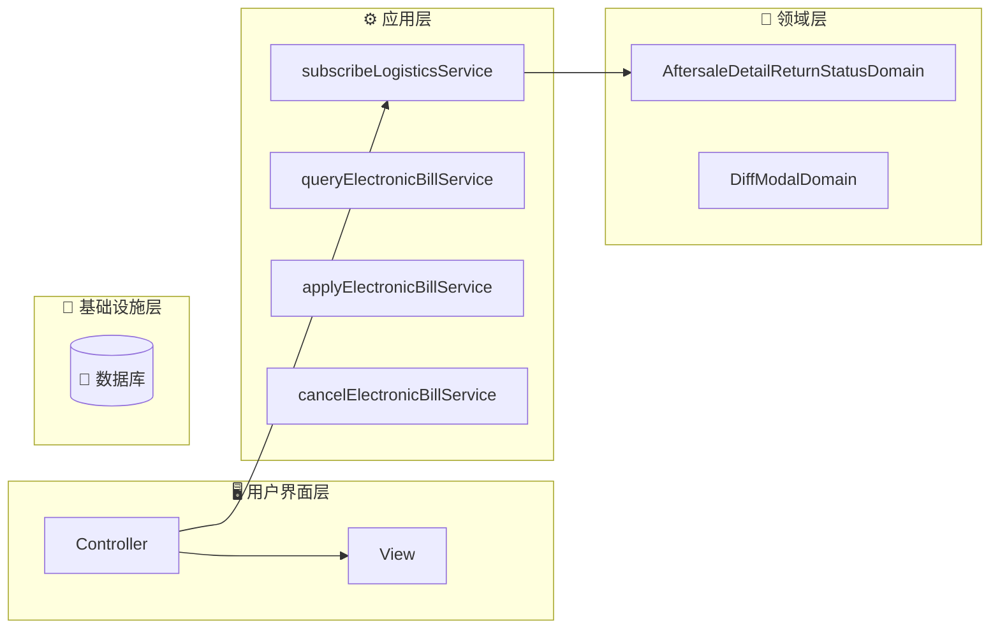
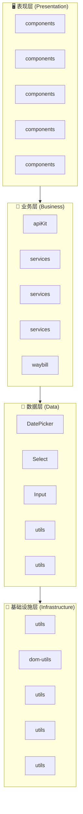
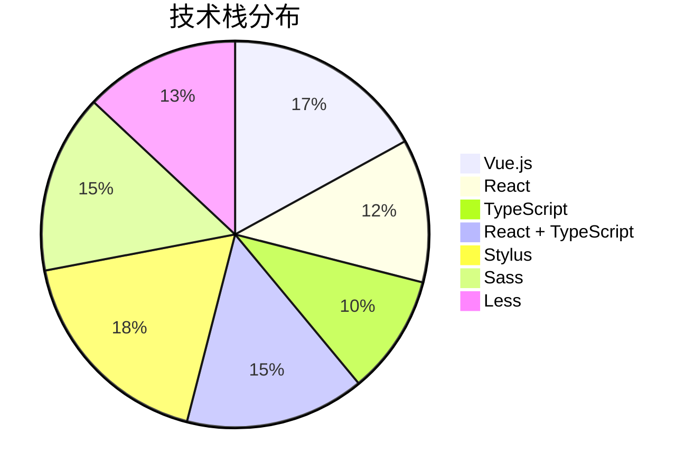

# fulfillment-aftersale-ark - Code Structure Analysis

## 📊 Project Overview
- **Project Name**: fulfillment-aftersale-ark
- **Project Type**: Vue应用
- **Technology Stack**: Vue.js, React, TypeScript, React + TypeScript, Stylus, Sass, Less
- **Architecture Pattern**: 模块化架构
- **Total Files**: 10485
- **Total Code Lines**: 202512
- **Total Entities**: 710


## 🗂️ Project Directory Structure
```
├── 📁 src/constants
│   ├── Files: 22 files
│   ├── Entities: 70 entities
│   └── Purpose: 项目目录
│
├── 📁 src/providers
│   ├── Files: 2 files
│   ├── Entities: 1 entities
│   └── Purpose: 项目目录
│
├── 📁 src/utils
│   ├── Files: 9 files
│   ├── Entities: 33 entities
│   └── Purpose: 工具函数目录
│
├── 📁 src/containers/AutoAftersale/AfterSaleDetail/constants
│   ├── Files: 2 files
│   ├── Entities: 3 entities
│   └── Purpose: React组件目录
│
├── 📁 src/containers/AutoAftersale/AfterSaleList/constants
│   ├── Files: 1 files
│   ├── Entities: 1 entities
│   └── Purpose: 项目目录
│
├── 📁 src/containers/AutoAftersale/AfterSaleDetail/providers
│   ├── Files: 5 files
│   ├── Entities: 6 entities
│   └── Purpose: 项目目录
│
├── 📁 src/containers/AutoAftersale/utils
│   ├── Files: 1 files
│   ├── Entities: 2 entities
│   └── Purpose: 工具函数目录
│
├── 📁 src/containers/AutoAftersale/hooks
│   ├── Files: 11 files
│   ├── Entities: 14 entities
│   └── Purpose: 项目目录
│
├── 📁 src/containers/AutoAftersale/AfterSaleDetail/hooks
│   ├── Files: 3 files
│   ├── Entities: 2 entities
│   └── Purpose: 项目目录
│
├── 📁 src/containers/AutoAftersale/AfterSaleList/hooks
│   ├── Files: 2 files
│   ├── Entities: 2 entities
│   └── Purpose: 项目目录
│
├── 📁 src/containers/OrderQuery/hooks
│   ├── Files: 1 files
│   ├── Entities: 1 entities
│   └── Purpose: 项目目录
│
├── 📁 src/containers/AutoAftersale/AfterSaleDetail/components
│   ├── Files: 27 files
│   ├── Entities: 27 entities
│   └── Purpose: 组件目录
│
├── 📁 src/containers/AutoAftersale/AfterSaleDetail/components/Negotiate
│   ├── Files: 15 files
│   ├── Entities: 14 entities
│   └── Purpose: Vue组件目录
│
├── 📁 src/containers/AutoAftersale/AfterSaleList/components
│   ├── Files: 14 files
│   ├── Entities: 14 entities
│   └── Purpose: 组件目录
│
├── 📁 src/containers/AutoAftersale/components/TabsLogisticsInfo
│   ├── Files: 9 files
│   ├── Entities: 9 entities
│   └── Purpose: Vue组件目录
│
├── 📁 src/containers/AutoAftersale/AfterSaleDetail/components/ActionModals
│   ├── Files: 8 files
│   ├── Entities: 8 entities
│   └── Purpose: Vue组件目录
│
├── 📁 src/containers/Assistance/components
│   ├── Files: 7 files
│   ├── Entities: 7 entities
│   └── Purpose: 组件目录
│
├── 📁 src/components/GuideLayout
│   ├── Files: 7 files
│   ├── Entities: 6 entities
│   └── Purpose: Vue组件目录
│
├── 📁 src/containers/Assistance/AssistanceMain/components
│   ├── Files: 6 files
│   ├── Entities: 6 entities
│   └── Purpose: 组件目录
│
└── 📁 src/containers/AutoAftersale/AfterSaleList/components/Metrics
    ├── Files: 6 files
    ├── Entities: 6 entities
    └── Purpose: Vue组件目录
```


---


---

## 🌐 Route Configuration Analysis

**Route Config Path**: `/Users/fangqiji/dev/aurora/packages/fulfillment/fulfillment-aftersale-ark/src/config/routes.config.ts`
**Total Routes**: 6
**Related Files**: 40
**Related Entities**: 345

## 📁 src/containers/Assistance/AssistanceMain/index.vue

### 🎯 Route Purpose
- **Primary Role**: 页面路由入口文件
- **Route Path**: `/app-order/auto/aftersale`
- **Route Name**: `ArkAppOrderAutoAftersale`
- **Page Title**: 售后助手
- **Entities**: `Component:index_05d38588b333` (component)
- **Functional Description**: 售后助手入口组件，根据用户状态展示不同内容：首次使用时显示引导页介绍产品价值和功能，已使用过则展示策略模板和管理列表，帮助商家自动化处理售后。

### 📦 关联文件夹

- **文件夹1: src/service**
  - `目录说明`: src/service 目录功能总结

该目录是一个API服务层，封装了与电商平台后端交互的HTTP请求接口，主要提供订单管理、物流服务、售后支持、商家权益、平台消息等核心业务功能的数据访问服务。目录中的文件按业务模块划分，基于httpBase基础请求工具，统一处理API调用、错误处理和数据格式化，为应用的各个功能模块提供标准化的数据服务接口。

  - `文件依赖`: 依赖 service (API接口4次)；依赖 service/Shipping (API接口4次)；依赖 service/abnormalOrder (API接口4次)；依赖 service/apiKit (API接口4次)；被 containers/AutoAftersale/AfterSaleList 引用 (API接口9次)

  - `关联实体`: Function:getAssistantList_6a14d3138f18, Function:getProvinceList, Function:validateCompensateFourStatus, Function:getDecryptFlow, Function:getAgreeMent, Variable:httpBaseV2, Function:getLogisticsQuoteList, Function:getAddressList_339169923964, Function:getPaidOrderListStock, Function:getPlatformMessage, Function:getRelievedShoppingStatus, Function:postPickupOrderList, Function:getSkuInfoList, Function:uploadFile


- **文件夹2: src/utils**
  - `目录说明`: src/utils 目录功能总结

该目录是一个工具类集合，提供了多种通用辅助函数，包括价格格式化、解密灰度判断、DOM元素操作、表单配置转换、NPS调查触发、API预加载、异步延时处理、性能埋点上报以及URL验证等功能，为应用提供基础支持服务，提升开发效率和用户体验。

  - `文件依赖`: 依赖 service (API接口1次)；依赖 service/Shipping (API接口1次)；依赖 service/abnormalOrder (API接口1次)；依赖 service/apiKit (API接口1次)；依赖 service/common (API接口1次)

  - `关联实体`: Function:toCnPrice_d5ba974e9e62, Function:isDecryptionGraySeller, Function:setElementListener_712dfa278cd2, Function:adapterConfigToDelightFormily, Function:npsTrigger, Function:preloadAfterSaleDetailApi, Function:sleep, Function:trackerCustomFmp, Function:isHttp


- **文件夹3: src/service/Shipping**
  - `目录说明`: Shipping 目录功能总结

该目录是一个API服务模块，主要负责处理订单物流配送相关的功能，包含在线寄件拆分处理和订单合并发货的接口封装，为应用提供与快递配送系统交互的服务层能力。

  - `文件依赖`: 被 containers/AutoAftersale/AfterSaleList 引用 (API接口9次)；被 service 引用 (API接口4次)；被 containers/AutoAftersale/AfterSaleDetail/components/ActionModals 引用 (API接口3次)；被 containers/AutoAftersale/AfterSaleList/components 引用 (API接口2次)；被 containers/AutoAftersale/AfterSaleDetail 引用 (API接口2次)

  - `关联实体`: Function:splitOnlineDelivery, Function:postMergeDelivery


- **文件夹4: src/service/abnormalOrder**
  - `目录说明`: 目录功能总结：src/service/abnormalOrder

该目录是一个API服务模块，专门处理异常订单相关的后端交互功能，包括获取异常订单列表、导出异常订单文件、查询物流异常监控数据和发货异常监控数据，为系统提供完整的异常订单管理和监控所需的数据服务接口。

  - `文件依赖`: 被 containers/AutoAftersale/AfterSaleList 引用 (API接口9次)；被 service 引用 (API接口4次)；被 containers/AutoAftersale/AfterSaleDetail/components/ActionModals 引用 (API接口3次)；被 containers/AutoAftersale/AfterSaleList/components 引用 (API接口2次)；被 containers/AutoAftersale/AfterSaleDetail 引用 (API接口2次)

  - `关联实体`: Function:getAbnormalList, Function:startExport, Function:getLogisticsOverview, Function:getPackageOverview


- **文件夹5: src/service/apiKit**
  - `目录说明`: 该目录是一个API服务层，提供了电商平台履约系统的完整接口集合，主要包含售后服务管理、物流配送、仓储管理、运费险、货品库存、区域报备等功能的API封装，通过HTTP请求与后端服务通信，为商家提供订单处理、退货管理、物流跟踪、仓库操作和费用管理等核心业务功能的数据交互能力。

  - `文件依赖`: 被 containers/AutoAftersale/AfterSaleList 引用 (API接口9次)；被 service 引用 (API接口4次)；被 containers/AutoAftersale/AfterSaleDetail/components/ActionModals 引用 (API接口3次)；被 containers/AutoAftersale/AfterSaleList/components 引用 (API接口2次)；被 containers/AutoAftersale/AfterSaleDetail 引用 (API接口2次)

  - `关联实体`: Function:deleteCarriageTemplate, Function:getActivityData, Function:getAfterSalesReimbursement, Function:getAfterSalesRejectReasons, Function:getAssistantRecommend, Function:getByPoNo, Function:getCargoCalculate, Function:getCarraigeInsurance, Function:getCarraigeInsuranceList_1abd4698e8e7, Function:getCarriageInsuranceForAfterSaleDetail, Function:getAssistantTemplate, Function:getCarriageInsuranceForAfterSaleList, Function:getCpList_ea0bc3c393e0, Function:getCrossBroderRepush, Function:getDeclarelistV2, Function:getDeclaredOrderPage, Function:getCargoList, Function:getDownloadCargoInventory, Function:getDownloadCargoInventorySummary, Function:getDownloadFee, Function:getExecuteRecord, Function:getExecuteSummary, Function:getFulfillmentDataPremium, Function:getPageQuery, Function:getHomePopup, Function:getListByZone, Function:getListCancelReason, Function:getListQuery, Function:getMerchantDataAbnormalStandard, Function:getMerchantDataDiagnosis, Function:getOrderCargoList, Function:getOrderDetail, Function:getLogisticStatusLogs, Function:getOrderList, Function:getCargoList_c7b78a17948e, Function:getOverDueReportReasons, Function:getProofPhotosV1, Function:getItemsQuery, Function:getQueryAssistantStrategy, Function:getQicSubscribe, Function:getQueryNegotiateSceneTemplate, Function:getQueryDecryptQuota, Function:getReturnsId, Function:getReachSellerNotify, Function:getReturnsIdList, Function:getReturnsV3, Function:getSearchCargoInventory, Function:getSearchCargoInventoryBatch, Function:getSearchCargoInventoryRecord, Function:getSearchCargoInventoryRecordSummary, Function:getSellerAddressRecords, Function:getReturnsIdV2, Function:getSellerCarriageInsuranceV2, Function:getSellerWarehouseList, Function:getStrategyId, Function:getServiceOrderSearch, Function:getSupplyProofConfig, Function:getSubscribedCpList_e8bcd62a34d2, Function:getTallyCargoList, Function:getUsedItem, Function:getWarehousePriorityList, Function:getZoneDeclarelist, Function:getZoneDeclareChangeV2, Function:postAddV2, Function:postAddV2_833089c95ccc, Function:postAgreeAutoRejectAudit, Function:postAssistantChange, Function:postAssistantCreate, Function:postArkReturnReasons, Function:postAssistantUpdate, Function:postAgreeAutoRefundAfterLogisticsBack, Function:postBatchReception, Function:postAvailableReturnsStatusList, Function:postBatchgetV2, Function:postCancelSubscribe_4e42e3af23ae, Function:postCargoCreate, Function:postCancelV2, Function:postCargoList, Function:postCargoDetail, Function:getDownloadCargoInventoryBatch, Function:postCargoUpdate, Function:postClickReception, Function:postCombineFeeList, Function:postCombineOrderList, Function:postCombineQuote, Function:postCombineRecordList, Function:postCombineSubscribe, Function:postCreateNegotiate, Function:postCreateStrategy, Function:postDelayHandle, Function:postDetailV2, Function:postDirectRefund, Function:postFreightInsuranceSwitch, Function:postGetBySceneKeys, Function:postRuleQuery, Function:postRuleUpdate, Function:postProductSubscribe, Function:postGrayMerchantQuery_519c5071927f, Function:postGiftAftersaleInfo, Function:postCargoPrecheck, Function:postLadingCreate, Function:postInboundCreate, Function:postLogisticBackRefund, Function:postLogisticInterceptCreate, Function:postLogisticInterceptValidate, Function:postSubscribeDelete, Function:postManageConfirm, Function:postMultiSubscribe_b901d1907c5d, Function:postOrderDeliveringApi, Function:postOrderDetail, Function:postOrderDetails, Function:postOrderList_a619687ad1fc, Function:postCargoPrecheck_b5950e1c3cd3, Function:postOrderPage, Function:postOutboundCreate, Function:postParseAddress, Function:postPageV2, Function:postPreCheckBeforeDelivery, Function:postQicPage, Function:postQueryVas, Function:postReceptionDelay_09ceeb3a8c44, Function:postReceptionReject, Function:postRejectWarningCheck, Function:postRejectWithDialog, Function:postReturnSellerRejectGuidanceList, Function:postReturnsId, Function:postSellerAddressRecords, Function:postSellerBehaviorSuggestion, Function:postSellerWarehouseCreate, Function:postSellerWarehouseUpdate, Function:postAddV2_7bbdaf3ad3d4, Function:postStartAsync, Function:postStartExport, Function:postSupplyProof, Function:postTallyConfirm, Function:postUpdateAddress, Function:postUpdateCombine, Function:postUpdateNegotiate, Function:postUpdateV2, Function:postUpdateStrategy, Function:postUpdateV2_06aa155cc3a5, Function:postWarehouseCoverageUpdate, Function:postWarehousePriorityCreate, Function:postWarehousePriorityDelete, Function:postWarehousePriorityUpdate, Function:postWatchAsync, Function:postWatchExport, Function:putSellerAddressRecords


- **文件夹6: src/service/common**
  - `目录说明`: src/service/common 目录功能总结

该目录作为API服务层，主要提供文件导出相关的后端交互功能，通过fileExport.ts中的startExport函数封装了文件导出请求的发送逻辑，使应用能够便捷地发起文件导出任务并获取任务标识。

  - `文件依赖`: 被 containers/AutoAftersale/AfterSaleList 引用 (API接口9次)；被 service 引用 (API接口4次)；被 containers/AutoAftersale/AfterSaleDetail/components/ActionModals 引用 (API接口3次)；被 containers/AutoAftersale/AfterSaleList/components 引用 (API接口2次)；被 containers/AutoAftersale/AfterSaleDetail 引用 (API接口2次)

  - `关联实体`: Function:startExport_7404a324e471


- **文件夹7: src/service/multiAddressReturn**
  - `目录说明`: 该目录提供多地址退货管理的API服务，包含查询退货地址策略列表、获取策略详情、查询策略关联商品以及删除策略的功能接口，支持商家配置和管理不同商品的退货地址策略。

  - `文件依赖`: 被 containers/AutoAftersale/AfterSaleList 引用 (API接口9次)；被 service 引用 (API接口4次)；被 containers/AutoAftersale/AfterSaleDetail/components/ActionModals 引用 (API接口3次)；被 containers/AutoAftersale/AfterSaleList/components 引用 (API接口2次)；被 containers/AutoAftersale/AfterSaleDetail 引用 (API接口2次)

  - `关联实体`: Function:getMultiAddressReturnList, Function:getMultiAddressReturnSkuList, Function:getStrategyItem, Function:postStrategyDelete


- **文件夹8: src/service/overseaDirectMail**
  - `目录说明`: 该目录是海外直邮装载单管理的API服务模块，提供了装载单的查询（列表和明细）、上传、删除和发货等核心功能接口，支持通过装载单号、商家编码等多种条件进行操作，用于支持海外直邮业务的发货管理流程。

  - `文件依赖`: 被 containers/AutoAftersale/AfterSaleList 引用 (API接口9次)；被 service 引用 (API接口4次)；被 containers/AutoAftersale/AfterSaleDetail/components/ActionModals 引用 (API接口3次)；被 containers/AutoAftersale/AfterSaleList/components 引用 (API接口2次)；被 containers/AutoAftersale/AfterSaleDetail 引用 (API接口2次)

  - `关联实体`: Function:getLoadingDetail, Function:getLoadingPage, Function:removeLoading, Function:shipLoading, Function:uploadLoading


- **文件夹9: src/service/reportManagement**
  - `目录说明`: 目录功能总结

该目录提供报备管理相关的API服务接口，主要负责订单列表数据获取、报表导出任务的创建和进度监控，支持系统中报表数据的查询、筛选和导出功能，是报备管理模块的后端数据交互层。

  - `文件依赖`: 被 containers/AutoAftersale/AfterSaleList 引用 (API接口9次)；被 service 引用 (API接口4次)；被 containers/AutoAftersale/AfterSaleDetail/components/ActionModals 引用 (API接口3次)；被 containers/AutoAftersale/AfterSaleList/components 引用 (API接口2次)；被 containers/AutoAftersale/AfterSaleDetail 引用 (API接口2次)

  - `关联实体`: Function:postReportAddOrderList, Function:postReportWatchExport, Function:postReportStartExport


- **文件夹10: src/service/waybill**
  - `目录说明`: 目录功能总结：src/service/waybill

该目录是一个API服务模块，专门提供电子面单系统的完整服务接口，包含电子面单的创建、查询、管理功能，支持模板的增删改查、快递公司及网点信息获取、账户余额查询、合作伙伴订阅管理等操作，为商家提供从面单申请、模板定制到物流合作伙伴管理的全流程API支持。

  - `文件依赖`: 被 containers/AutoAftersale/AfterSaleList 引用 (API接口9次)；被 service 引用 (API接口4次)；被 containers/AutoAftersale/AfterSaleDetail/components/ActionModals 引用 (API接口3次)；被 containers/AutoAftersale/AfterSaleList/components 引用 (API接口2次)；被 containers/AutoAftersale/AfterSaleDetail 引用 (API接口2次)

  - `关联实体`: Function:queryCustomerCodeValid, Function:createTemplate, Function:deleteTemplate, Function:cancelPartnerSubscribe, Function:deliveryBranch, Function:queryElectronicBillService, Function:electronicBillList, Function:postPartnerSubscribe, Function:queryAccountInfo, Function:getAccountBalanceList, Function:queryAppliedPartnerList, Function:queryTemplateConfig, Function:queryTemplateList, Function:queryDeliveryCompany, Function:queryTemplateListGroup, Function:updateTemplate


- **文件夹11: src/service/waybillDispatch**
  - `目录说明`: 目录功能总结

`src/service/waybillDispatch` 目录是一个API服务模块，主要负责电子面单和物流发货相关的后端交互功能，包括运单的查询、打印（普通打印、合并打印、分离打印、重新打印）、取消、手动添加订单、获取用户信息以及作业单发送等操作，为电商平台的物流发货管理系统提供完整的运单处理服务接口。

  - `文件依赖`: 被 containers/AutoAftersale/AfterSaleList 引用 (API接口9次)；被 service 引用 (API接口4次)；被 containers/AutoAftersale/AfterSaleDetail/components/ActionModals 引用 (API接口3次)；被 containers/AutoAftersale/AfterSaleList/components 引用 (API接口2次)；被 containers/AutoAftersale/AfterSaleDetail 引用 (API接口2次)

  - `关联实体`: Function:cancelWaybill, Function:postAddManualOrder, Function:printMerge, Function:printOrder, Function:printSeparate, Function:queryPlainUserInfo, Function:queryWaybillList, Function:queryWaybillMergeableList, Function:queryWaybillWorkIds, Function:reprintWaybill, Function:workOrderSend


- **文件夹12: src/containers/AutoAftersale/utils**
  - `目录说明`: 该目录是一个工具类集合，主要提供自动售后系统中的辅助功能，目前包含NPS(净推荐值)相关工具函数，用于在适当时机触发售后满意度调查问卷，支持售后体验评估和用户反馈收集。

  - `文件依赖`: 暂无明确依赖关系

  - `关联实体`: Function:triggerAftersaleNps


- **文件夹13: src/containers/Assistance/AssistanceMain/components**
  - `目录说明`: 该目录包含售后助手系统的核心UI组件，负责展示和管理售后策略，包括策略列表管理、模板展示与选择、策略详情查看、执行情况监控以及数据指标展示，共同构成了售后助手的主要交互界面，使商家能够高效创建、管理售后策略并监控其执行效果。

  - `文件依赖`: 依赖 service (API接口1次)；依赖 service/Shipping (API接口1次)；依赖 service/abnormalOrder (API接口1次)；依赖 service/apiKit (API接口1次)；依赖 service/common (API接口1次)

  - `关联实体`: Component:AssistanceStrategyListPane, Component:AssistanceTemplateCard, Component:AssistanceTemplatesPane, Component:Metrics, Component:StrategyDetailDrawer, Component:StrategyExecuteInfoDrawer


- **文件夹14: src/containers/Assistance**
  - `目录说明`: 售后助手策略配置模块，提供售后策略的创建和编辑功能，包含表单配置界面和产品价值展示，支持用户设置售后类型、订单状态和执行操作等参数，并通过产品价值点展示该功能的业务优势。

  - `文件依赖`: 暂无明确依赖关系

  - `关联实体`: Component:CreateAssistance, Variable:productValuesConfig


- **文件夹15: src/containers/Assistance/components**
  - `目录说明`: 该目录包含辅助服务(Assistance)相关的表单UI组件集合，主要提供各类专用输入控件，包括时间选择、数字输入、金额处理、原因选择、工作时间段设置和物流状态选择等，这些组件都基于Formily框架开发，支持表单验证、数据转换和事件触发，用于构建辅助服务模块中的各类表单界面。

  - `文件依赖`: 暂无明确依赖关系

  - `关联实体`: Component:ApplyTime, Component:FormText, Component:InputNumber, Component:InputNumberFen, Component:ReasonSelect, Component:WorkTimePeriod, Component:ReturnLogisticStatus


- **文件夹16: src/containers/AutoAftersale/AfterSaleList/components**
  - `目录说明`: 该目录包含售后服务系统的UI组件集合，主要负责售后列表页面的各个功能区块展示，包括售后状态展示、商品审核、物流信息、订单详情、价格展示、操作按钮、地址选择等界面元素，以及相关的模态框组件，共同构成了商家处理售后申请的完整交互界面，支持售后流程中的审核、物流管理、退款处理等核心业务操作。

  - `文件依赖`: 依赖 service (API接口2次)；依赖 service/Shipping (API接口2次)；依赖 service/abnormalOrder (API接口2次)；依赖 service/apiKit (API接口2次)；依赖 service/common (API接口2次)

  - `关联实体`: Component:AfterSaleListBanner, Component:AftersaleStatus, Component:AuditGoods, Component:AuditModal, Component:EditExpressOrderModal, Component:ExcelOperaCell, Component:Logistics_64e2529721b4, Component:OrderInfoCell, Component:OtherTimeCell_b21e90ff37eb, Component:PriceCell, Component:ReceiveModal, Component:SelectArea, Component:TabUpBanner, Component:PackageInfo


- **文件夹17: src/containers/AutoAftersale/AfterSaleList/components/Metrics**
  - `目录说明`: Metrics 目录功能总结

该目录提供售后服务数据指标展示相关的UI组件和辅助功能，包含售后指标数据展示、数据诊断警报、售后指南弹窗等组件，以及指标颜色计算和新手引导等辅助功能，旨在帮助商家直观了解售后服务表现、同行对比数据和改进建议，提升售后服务质量。

  - `文件依赖`: 依赖 service (API接口1次)；依赖 service/Shipping (API接口1次)；依赖 service/abnormalOrder (API接口1次)；依赖 service/apiKit (API接口1次)；依赖 service/common (API接口1次)

  - `关联实体`: Component:AfterSaleGuide, Component:DiagnosisAlert, Component:MetricsSimple, Component:index_8ca4db163aed, Component:useGuide, Function:useMetricColor


- **文件夹18: src/containers/AutoAftersale/AfterSaleList/components/Metrics/PeerCompare**
  - `目录说明`: 该目录提供售后服务同行数据对比的UI组件，通过进度条可视化展示用户指标超越同行的百分比和行业均值，支持不同数值格式化类型和自定义样式，是售后列表页面中用于业绩对标分析的可视化展示模块。

  - `文件依赖`: 暂无明确依赖关系

  - `关联实体`: Component:index_17e3ccd8e698, Component:Progress


- **文件夹19: src/containers/AutoAftersale/AfterSaleDetail/components**
  - `目录说明`: 该目录包含售后详情页面的UI组件集合，主要负责展示和操作售后服务的各个方面，包括售后基本信息、协商记录、物流信息、订单信息、纠纷处理、状态操作等功能模块，支持退款、换货、退货等多种售后场景，并提供地址选择、物流跟踪、协商记录查看等交互功能，同时包含新旧版本组件以支持系统迭代升级。

  - `文件依赖`: 依赖 service (API接口1次)；依赖 service/Shipping (API接口1次)；依赖 service/abnormalOrder (API接口1次)；依赖 service/apiKit (API接口1次)；依赖 service/common (API接口1次)

  - `关联实体`: Component:AddressSelector, Component:AfterSaleInfoV2, Component:AfterSaleNegotiateInfo, Component:AfterSaleInfo, Component:AfterSaleNegotiateInfoV2, Component:ArbitratePanel, Component:ArbitrateProofDrawer, Component:ArbitrateRecordsDrawer, Component:BasicPanel, Component:ExchangeInfo, Component:ExchangeInfoV2, Component:ExtraInfo, Component:ArbitratePanelV2, Component:LogisticsInfo, Component:LogisticsInfoV2, Component:NegotiateRecordV2, Component:NegotiateRecord, Component:OrderInfoV2, Component:OrderInfo, Component:PakckageWidthLogisticsV2, Component:PakckageWidthLogistics, Component:PanelHeader, Component:PickupOrderInfo, Component:StatusOperateV2, Component:SellerMessagePanel, Component:Step, Component:StatusOperate


- **文件夹20: src/containers/AutoAftersale/AfterSaleDetail/components/ActionModals**
  - `目录说明`: ActionModals 目录功能总结

该目录包含售后管理系统中各类操作弹窗和抽屉组件，负责处理售后流程中的关键交互界面，包括预检查提示、操作确认、退款处理、物流信息编辑、拒绝理由选择、留言沟通和退换货地址确认等功能。这些UI组件支持不同售后场景下的商家决策和信息输入，确保售后流程规范化和用户体验一致性。

  - `文件依赖`: 依赖 service (API接口3次)；依赖 service/Shipping (API接口3次)；依赖 service/abnormalOrder (API接口3次)；依赖 service/apiKit (API接口3次)；依赖 service/common (API接口3次)

  - `关联实体`: Component:CommonPreCheckModal, Component:ConfirmModal, Component:EditExpressModal, Component:MessageDrawer, Component:RefundModal, Component:RefuseDrawer, Component:RefuseModal, Component:ReturnExchangeModal


- **文件夹21: src/containers/AutoAftersale/AfterSaleDetail/components/Banners**
  - `目录说明`: Banners 目录功能总结

该目录包含售后系统中使用的横幅提示UI组件，主要负责在售后详情页面中展示处理建议、警告和提示信息。组件支持动态解析文本内容，提供不同样式的视觉反馈（如警告、危险样式），用于指导用户进行售后处理操作或展示重要提示信息，是售后流程中信息展示和用户引导的辅助UI组件集合。

  - `文件依赖`: 暂无明确依赖关系

  - `关联实体`: Component:HandlingSuggestionsBanner, Component:HandlingSuggestionsBannerV2, Component:RefuseModalDamageBanner


- **文件夹22: src/containers/AutoAftersale/AfterSaleDetail/components/BlockSelector**
  - `目录说明`: BlockSelector 目录功能总结

该目录提供了一个平铺式选项卡UI组件，用于售后详情页面中的选项单选功能，通过自定义事件与父组件进行数据交互，属于售后系统中的可复用UI组件。

  - `文件依赖`: 暂无明确依赖关系

  - `关联实体`: Component:index_0f42e96162f3


- **文件夹23: src/containers/AutoAftersale/AfterSaleDetail/components/CopywritingAdapter**
  - `目录说明`: CopywritingAdapter 目录功能总结

该目录提供了一个富文本适配器UI组件，负责智能识别并渲染不同类型的内容数据，支持纯文本直接显示和富文本对象（如文本、链接、换行等元素）的结构化渲染，为售后详情页面提供灵活的文本展示能力。

  - `文件依赖`: 暂无明确依赖关系

  - `关联实体`: Component:index_4a6f4b9a4dc7


- **文件夹24: src/containers/AutoAftersale/AfterSaleDetail/components/FreightCompensation**
  - `目录说明`: FreightCompensation 目录功能总结

该目录提供售后单运费补偿相关的UI组件集合，负责展示和管理运费宝服务信息及运费报销扣款数据，包括服务状态、补贴金额、报销凭证等内容，并集成了运费宝服务推广功能，引导商家开通服务以降低经营成本，支持数据埋点跟踪用户行为。

  - `文件依赖`: 依赖 service (API接口1次)；依赖 service/Shipping (API接口1次)；依赖 service/abnormalOrder (API接口1次)；依赖 service/apiKit (API接口1次)；依赖 service/common (API接口1次)

  - `关联实体`: Component:CompensationCost, Component:FreightInfo, Component:index_1133c9aa5f3c


- **文件夹25: src/containers/AutoAftersale/AfterSaleDetail/components/FreightCompensationV2**
  - `目录说明`: 目录功能总结**：

该目录包含售后详情中运费补偿相关的UI组件集合，主要负责展示运费宝服务信息、运费报销扣款情况及相关统计数据，同时提供运费宝服务开通推荐功能，帮助商家了解运费补偿状态并优化经营成本。

  - `文件依赖`: 依赖 service (API接口1次)；依赖 service/Shipping (API接口1次)；依赖 service/abnormalOrder (API接口1次)；依赖 service/apiKit (API接口1次)；依赖 service/common (API接口1次)

  - `关联实体`: Component:index_8e65b8619cf5, Component:CompensationCost_bd916664f41e, Component:FreightInfo_60a2f188bb0a


- **文件夹26: src/containers/AutoAftersale/AfterSaleDetail/components/GiveawaysModal**
  - `目录说明`: 目录功能总结**：

GiveawaysModal 目录提供了一个 UI 组件，专门用于在售后详情页面中展示主品与赠品售后单的关联信息，包括商品信息、价格数量展示及查看详情等操作功能，使用户能够清晰了解售后单中主品与赠品之间的关系。

  - `文件依赖`: 暂无明确依赖关系

  - `关联实体`: Component:index_fbe52b1cb6bc


- **文件夹27: src/containers/AutoAftersale/AfterSaleDetail/components/Negotiate**
  - `目录说明`: Negotiate 目录功能总结

该目录包含售后协商流程的UI组件集合，主要负责售后协商方案的创建、编辑和预览功能。组件涵盖了协商场景选择、售后类型、原因、状态展示、退款金额输入、延期设置、地址选择、协商描述等表单元素，以及规则展示、效果预览等辅助功能。整体构成了一个完整的售后协商方案配置界面，支持表单验证、数据埋点和用户交互，为商家提供灵活的售后协商工具。

  - `文件依赖`: 暂无明确依赖关系

  - `关联实体`: Component:AftersaleAddress, Component:AftersaleReason, Component:AftersaleStatus_0d6708d07ff2, Component:AftersaleType, Component:DynamicFormItem, Component:DelayInput, Component:NegotiateForm, Component:NegotiateDesc, Component:RichRadioGroup, Component:RefundInput, Component:index_4b3d81e93a50, Component:RuleBanner, Component:TiledSelector, Component:SwiperPreview


- **文件夹28: src/containers/AutoAftersale/AfterSaleDetail/components/ActionModals/ProofDrawer**
  - `目录说明`: ProofDrawer 目录功能总结

该目录包含售后系统中的举证相关抽屉组件集合，主要负责商家和用户在售后流程中提交申诉凭证、补充举证和留言沟通的UI交互功能。组件支持文本输入、图片和文件上传，并提供表单验证和数据提交能力，是售后服务流程中用于证据收集和沟通的关键界面组件。

  - `文件依赖`: 依赖 service (API接口1次)；依赖 service/Shipping (API接口1次)；依赖 service/abnormalOrder (API接口1次)；依赖 service/apiKit (API接口1次)；依赖 service/common (API接口1次)

  - `关联实体`: Component:MessageDrawer_1fb2aa375755, Component:ProofInfo, Component:index_725f8711dd42


- **文件夹29: src/containers/MicroRemittance/components**
  - `目录说明`: 该目录包含小额打款管理相关的UI组件，主要提供打款记录的查询、展示和操作功能，支持多条件筛选、发起打款、查看订单详情和打款状态追踪等功能，是微汇款(MicroRemittance)模块的组件层实现。

  - `文件依赖`: 暂无明确依赖关系

  - `关联实体`: Component:Remittance


- **文件夹30: src/containers/MicroRemittance/components/Search**
  - `目录说明`: 该目录提供微汇款系统的搜索功能组件，包含动态表单元数据渲染组件和自适应搜索表单组件，支持可配置的表单字段、响应式布局、展开/收起功能以及查询重置操作，是系统中负责数据筛选和查询的UI组件集合。

  - `文件依赖`: 暂无明确依赖关系

  - `关联实体`: Component:form-meta, Component:search


---

## 📁 src/containers/Assistance/CreateAssistance.vue

### 🎯 Route Purpose
- **Primary Role**: 页面路由入口文件
- **Route Path**: `/app-order/auto/aftersale/add`
- **Route Name**: `ArkAppOrderAutoAftersaleAdd`
- **Page Title**: 售后助手 - 新建策略
- **Entities**: `Component:CreateAssistance` (component)
- **Functional Description**: 售后助手策略创建/编辑组件，用于配置售后类型、订单状态、执行操作等参数，支持表单验证和数据提交，提供策略模板选择和参数配置功能。

### 📦 关联文件夹

- **文件夹1: src/containers/Assistance/AssistanceMain**
  - `目录说明`: 目录功能总结

该目录实现了售后助手的路由组件，包含入口组件(index.vue)、引导页组件(AssistanceGuide.vue)和主界面组件(Main.vue)，负责根据用户使用状态展示不同内容：首次使用时展示产品价值和功能介绍，已使用过则提供数据指标、策略模板选择和策略管理功能，整体目的是帮助商家实现售后工作的自动化处理，提升效率并降低纠纷。

  - `文件依赖`: 暂无明确依赖关系

  - `关联实体`: Component:index_05d38588b333, Component:AssistanceGuide, Component:Main


- **文件夹2: src/service**
  - `目录说明`: src/service 目录功能总结

该目录是一个API服务层，封装了与电商平台后端交互的HTTP请求接口，主要提供订单管理、物流服务、售后支持、商家权益、平台消息等核心业务功能的数据访问服务。目录中的文件按业务模块划分，基于httpBase基础请求工具，统一处理API调用、错误处理和数据格式化，为应用的各个功能模块提供标准化的数据服务接口。

  - `文件依赖`: 依赖 service (API接口4次)；依赖 service/Shipping (API接口4次)；依赖 service/abnormalOrder (API接口4次)；依赖 service/apiKit (API接口4次)；被 containers/AutoAftersale/AfterSaleList 引用 (API接口9次)

  - `关联实体`: Function:getAssistantList_6a14d3138f18, Function:getProvinceList, Function:validateCompensateFourStatus, Function:getDecryptFlow, Function:getAgreeMent, Variable:httpBaseV2, Function:getLogisticsQuoteList, Function:getAddressList_339169923964, Function:getPaidOrderListStock, Function:getPlatformMessage, Function:getRelievedShoppingStatus, Function:postPickupOrderList, Function:getSkuInfoList, Function:uploadFile


- **文件夹3: src/utils**
  - `目录说明`: src/utils 目录功能总结

该目录是一个工具类集合，提供了多种通用辅助函数，包括价格格式化、解密灰度判断、DOM元素操作、表单配置转换、NPS调查触发、API预加载、异步延时处理、性能埋点上报以及URL验证等功能，为应用提供基础支持服务，提升开发效率和用户体验。

  - `文件依赖`: 依赖 service (API接口1次)；依赖 service/Shipping (API接口1次)；依赖 service/abnormalOrder (API接口1次)；依赖 service/apiKit (API接口1次)；依赖 service/common (API接口1次)

  - `关联实体`: Function:toCnPrice_d5ba974e9e62, Function:isDecryptionGraySeller, Function:setElementListener_712dfa278cd2, Function:adapterConfigToDelightFormily, Function:npsTrigger, Function:preloadAfterSaleDetailApi, Function:sleep, Function:trackerCustomFmp, Function:isHttp


- **文件夹4: src/service/Shipping**
  - `目录说明`: Shipping 目录功能总结

该目录是一个API服务模块，主要负责处理订单物流配送相关的功能，包含在线寄件拆分处理和订单合并发货的接口封装，为应用提供与快递配送系统交互的服务层能力。

  - `文件依赖`: 被 containers/AutoAftersale/AfterSaleList 引用 (API接口9次)；被 service 引用 (API接口4次)；被 containers/AutoAftersale/AfterSaleDetail/components/ActionModals 引用 (API接口3次)；被 containers/AutoAftersale/AfterSaleList/components 引用 (API接口2次)；被 containers/AutoAftersale/AfterSaleDetail 引用 (API接口2次)

  - `关联实体`: Function:splitOnlineDelivery, Function:postMergeDelivery


- **文件夹5: src/service/abnormalOrder**
  - `目录说明`: 目录功能总结：src/service/abnormalOrder

该目录是一个API服务模块，专门处理异常订单相关的后端交互功能，包括获取异常订单列表、导出异常订单文件、查询物流异常监控数据和发货异常监控数据，为系统提供完整的异常订单管理和监控所需的数据服务接口。

  - `文件依赖`: 被 containers/AutoAftersale/AfterSaleList 引用 (API接口9次)；被 service 引用 (API接口4次)；被 containers/AutoAftersale/AfterSaleDetail/components/ActionModals 引用 (API接口3次)；被 containers/AutoAftersale/AfterSaleList/components 引用 (API接口2次)；被 containers/AutoAftersale/AfterSaleDetail 引用 (API接口2次)

  - `关联实体`: Function:getAbnormalList, Function:startExport, Function:getLogisticsOverview, Function:getPackageOverview


- **文件夹6: src/service/apiKit**
  - `目录说明`: 该目录是一个API服务层，提供了电商平台履约系统的完整接口集合，主要包含售后服务管理、物流配送、仓储管理、运费险、货品库存、区域报备等功能的API封装，通过HTTP请求与后端服务通信，为商家提供订单处理、退货管理、物流跟踪、仓库操作和费用管理等核心业务功能的数据交互能力。

  - `文件依赖`: 被 containers/AutoAftersale/AfterSaleList 引用 (API接口9次)；被 service 引用 (API接口4次)；被 containers/AutoAftersale/AfterSaleDetail/components/ActionModals 引用 (API接口3次)；被 containers/AutoAftersale/AfterSaleList/components 引用 (API接口2次)；被 containers/AutoAftersale/AfterSaleDetail 引用 (API接口2次)

  - `关联实体`: Function:deleteCarriageTemplate, Function:getActivityData, Function:getAfterSalesReimbursement, Function:getAfterSalesRejectReasons, Function:getAssistantRecommend, Function:getByPoNo, Function:getCargoCalculate, Function:getCarraigeInsurance, Function:getCarraigeInsuranceList_1abd4698e8e7, Function:getCarriageInsuranceForAfterSaleDetail, Function:getAssistantTemplate, Function:getCarriageInsuranceForAfterSaleList, Function:getCpList_ea0bc3c393e0, Function:getCrossBroderRepush, Function:getDeclarelistV2, Function:getDeclaredOrderPage, Function:getCargoList, Function:getDownloadCargoInventory, Function:getDownloadCargoInventorySummary, Function:getDownloadFee, Function:getExecuteRecord, Function:getExecuteSummary, Function:getFulfillmentDataPremium, Function:getPageQuery, Function:getHomePopup, Function:getListByZone, Function:getListCancelReason, Function:getListQuery, Function:getMerchantDataAbnormalStandard, Function:getMerchantDataDiagnosis, Function:getOrderCargoList, Function:getOrderDetail, Function:getLogisticStatusLogs, Function:getOrderList, Function:getCargoList_c7b78a17948e, Function:getOverDueReportReasons, Function:getProofPhotosV1, Function:getItemsQuery, Function:getQueryAssistantStrategy, Function:getQicSubscribe, Function:getQueryNegotiateSceneTemplate, Function:getQueryDecryptQuota, Function:getReturnsId, Function:getReachSellerNotify, Function:getReturnsIdList, Function:getReturnsV3, Function:getSearchCargoInventory, Function:getSearchCargoInventoryBatch, Function:getSearchCargoInventoryRecord, Function:getSearchCargoInventoryRecordSummary, Function:getSellerAddressRecords, Function:getReturnsIdV2, Function:getSellerCarriageInsuranceV2, Function:getSellerWarehouseList, Function:getStrategyId, Function:getServiceOrderSearch, Function:getSupplyProofConfig, Function:getSubscribedCpList_e8bcd62a34d2, Function:getTallyCargoList, Function:getUsedItem, Function:getWarehousePriorityList, Function:getZoneDeclarelist, Function:getZoneDeclareChangeV2, Function:postAddV2, Function:postAddV2_833089c95ccc, Function:postAgreeAutoRejectAudit, Function:postAssistantChange, Function:postAssistantCreate, Function:postArkReturnReasons, Function:postAssistantUpdate, Function:postAgreeAutoRefundAfterLogisticsBack, Function:postBatchReception, Function:postAvailableReturnsStatusList, Function:postBatchgetV2, Function:postCancelSubscribe_4e42e3af23ae, Function:postCargoCreate, Function:postCancelV2, Function:postCargoList, Function:postCargoDetail, Function:getDownloadCargoInventoryBatch, Function:postCargoUpdate, Function:postClickReception, Function:postCombineFeeList, Function:postCombineOrderList, Function:postCombineQuote, Function:postCombineRecordList, Function:postCombineSubscribe, Function:postCreateNegotiate, Function:postCreateStrategy, Function:postDelayHandle, Function:postDetailV2, Function:postDirectRefund, Function:postFreightInsuranceSwitch, Function:postGetBySceneKeys, Function:postRuleQuery, Function:postRuleUpdate, Function:postProductSubscribe, Function:postGrayMerchantQuery_519c5071927f, Function:postGiftAftersaleInfo, Function:postCargoPrecheck, Function:postLadingCreate, Function:postInboundCreate, Function:postLogisticBackRefund, Function:postLogisticInterceptCreate, Function:postLogisticInterceptValidate, Function:postSubscribeDelete, Function:postManageConfirm, Function:postMultiSubscribe_b901d1907c5d, Function:postOrderDeliveringApi, Function:postOrderDetail, Function:postOrderDetails, Function:postOrderList_a619687ad1fc, Function:postCargoPrecheck_b5950e1c3cd3, Function:postOrderPage, Function:postOutboundCreate, Function:postParseAddress, Function:postPageV2, Function:postPreCheckBeforeDelivery, Function:postQicPage, Function:postQueryVas, Function:postReceptionDelay_09ceeb3a8c44, Function:postReceptionReject, Function:postRejectWarningCheck, Function:postRejectWithDialog, Function:postReturnSellerRejectGuidanceList, Function:postReturnsId, Function:postSellerAddressRecords, Function:postSellerBehaviorSuggestion, Function:postSellerWarehouseCreate, Function:postSellerWarehouseUpdate, Function:postAddV2_7bbdaf3ad3d4, Function:postStartAsync, Function:postStartExport, Function:postSupplyProof, Function:postTallyConfirm, Function:postUpdateAddress, Function:postUpdateCombine, Function:postUpdateNegotiate, Function:postUpdateV2, Function:postUpdateStrategy, Function:postUpdateV2_06aa155cc3a5, Function:postWarehouseCoverageUpdate, Function:postWarehousePriorityCreate, Function:postWarehousePriorityDelete, Function:postWarehousePriorityUpdate, Function:postWatchAsync, Function:postWatchExport, Function:putSellerAddressRecords


- **文件夹7: src/service/common**
  - `目录说明`: src/service/common 目录功能总结

该目录作为API服务层，主要提供文件导出相关的后端交互功能，通过fileExport.ts中的startExport函数封装了文件导出请求的发送逻辑，使应用能够便捷地发起文件导出任务并获取任务标识。

  - `文件依赖`: 被 containers/AutoAftersale/AfterSaleList 引用 (API接口9次)；被 service 引用 (API接口4次)；被 containers/AutoAftersale/AfterSaleDetail/components/ActionModals 引用 (API接口3次)；被 containers/AutoAftersale/AfterSaleList/components 引用 (API接口2次)；被 containers/AutoAftersale/AfterSaleDetail 引用 (API接口2次)

  - `关联实体`: Function:startExport_7404a324e471


- **文件夹8: src/service/multiAddressReturn**
  - `目录说明`: 该目录提供多地址退货管理的API服务，包含查询退货地址策略列表、获取策略详情、查询策略关联商品以及删除策略的功能接口，支持商家配置和管理不同商品的退货地址策略。

  - `文件依赖`: 被 containers/AutoAftersale/AfterSaleList 引用 (API接口9次)；被 service 引用 (API接口4次)；被 containers/AutoAftersale/AfterSaleDetail/components/ActionModals 引用 (API接口3次)；被 containers/AutoAftersale/AfterSaleList/components 引用 (API接口2次)；被 containers/AutoAftersale/AfterSaleDetail 引用 (API接口2次)

  - `关联实体`: Function:getMultiAddressReturnList, Function:getMultiAddressReturnSkuList, Function:getStrategyItem, Function:postStrategyDelete


- **文件夹9: src/service/overseaDirectMail**
  - `目录说明`: 该目录是海外直邮装载单管理的API服务模块，提供了装载单的查询（列表和明细）、上传、删除和发货等核心功能接口，支持通过装载单号、商家编码等多种条件进行操作，用于支持海外直邮业务的发货管理流程。

  - `文件依赖`: 被 containers/AutoAftersale/AfterSaleList 引用 (API接口9次)；被 service 引用 (API接口4次)；被 containers/AutoAftersale/AfterSaleDetail/components/ActionModals 引用 (API接口3次)；被 containers/AutoAftersale/AfterSaleList/components 引用 (API接口2次)；被 containers/AutoAftersale/AfterSaleDetail 引用 (API接口2次)

  - `关联实体`: Function:getLoadingDetail, Function:getLoadingPage, Function:removeLoading, Function:shipLoading, Function:uploadLoading


- **文件夹10: src/service/reportManagement**
  - `目录说明`: 目录功能总结

该目录提供报备管理相关的API服务接口，主要负责订单列表数据获取、报表导出任务的创建和进度监控，支持系统中报表数据的查询、筛选和导出功能，是报备管理模块的后端数据交互层。

  - `文件依赖`: 被 containers/AutoAftersale/AfterSaleList 引用 (API接口9次)；被 service 引用 (API接口4次)；被 containers/AutoAftersale/AfterSaleDetail/components/ActionModals 引用 (API接口3次)；被 containers/AutoAftersale/AfterSaleList/components 引用 (API接口2次)；被 containers/AutoAftersale/AfterSaleDetail 引用 (API接口2次)

  - `关联实体`: Function:postReportAddOrderList, Function:postReportWatchExport, Function:postReportStartExport


- **文件夹11: src/service/waybill**
  - `目录说明`: 目录功能总结：src/service/waybill

该目录是一个API服务模块，专门提供电子面单系统的完整服务接口，包含电子面单的创建、查询、管理功能，支持模板的增删改查、快递公司及网点信息获取、账户余额查询、合作伙伴订阅管理等操作，为商家提供从面单申请、模板定制到物流合作伙伴管理的全流程API支持。

  - `文件依赖`: 被 containers/AutoAftersale/AfterSaleList 引用 (API接口9次)；被 service 引用 (API接口4次)；被 containers/AutoAftersale/AfterSaleDetail/components/ActionModals 引用 (API接口3次)；被 containers/AutoAftersale/AfterSaleList/components 引用 (API接口2次)；被 containers/AutoAftersale/AfterSaleDetail 引用 (API接口2次)

  - `关联实体`: Function:queryCustomerCodeValid, Function:createTemplate, Function:deleteTemplate, Function:cancelPartnerSubscribe, Function:deliveryBranch, Function:queryElectronicBillService, Function:electronicBillList, Function:postPartnerSubscribe, Function:queryAccountInfo, Function:getAccountBalanceList, Function:queryAppliedPartnerList, Function:queryTemplateConfig, Function:queryTemplateList, Function:queryDeliveryCompany, Function:queryTemplateListGroup, Function:updateTemplate


- **文件夹12: src/service/waybillDispatch**
  - `目录说明`: 目录功能总结

`src/service/waybillDispatch` 目录是一个API服务模块，主要负责电子面单和物流发货相关的后端交互功能，包括运单的查询、打印（普通打印、合并打印、分离打印、重新打印）、取消、手动添加订单、获取用户信息以及作业单发送等操作，为电商平台的物流发货管理系统提供完整的运单处理服务接口。

  - `文件依赖`: 被 containers/AutoAftersale/AfterSaleList 引用 (API接口9次)；被 service 引用 (API接口4次)；被 containers/AutoAftersale/AfterSaleDetail/components/ActionModals 引用 (API接口3次)；被 containers/AutoAftersale/AfterSaleList/components 引用 (API接口2次)；被 containers/AutoAftersale/AfterSaleDetail 引用 (API接口2次)

  - `关联实体`: Function:cancelWaybill, Function:postAddManualOrder, Function:printMerge, Function:printOrder, Function:printSeparate, Function:queryPlainUserInfo, Function:queryWaybillList, Function:queryWaybillMergeableList, Function:queryWaybillWorkIds, Function:reprintWaybill, Function:workOrderSend


- **文件夹13: src/containers/AutoAftersale/utils**
  - `目录说明`: 该目录是一个工具类集合，主要提供自动售后系统中的辅助功能，目前包含NPS(净推荐值)相关工具函数，用于在适当时机触发售后满意度调查问卷，支持售后体验评估和用户反馈收集。

  - `文件依赖`: 暂无明确依赖关系

  - `关联实体`: Function:triggerAftersaleNps


- **文件夹14: src/containers/Assistance/AssistanceMain/components**
  - `目录说明`: 该目录包含售后助手系统的核心UI组件，负责展示和管理售后策略，包括策略列表管理、模板展示与选择、策略详情查看、执行情况监控以及数据指标展示，共同构成了售后助手的主要交互界面，使商家能够高效创建、管理售后策略并监控其执行效果。

  - `文件依赖`: 依赖 service (API接口1次)；依赖 service/Shipping (API接口1次)；依赖 service/abnormalOrder (API接口1次)；依赖 service/apiKit (API接口1次)；依赖 service/common (API接口1次)

  - `关联实体`: Component:AssistanceStrategyListPane, Component:AssistanceTemplateCard, Component:AssistanceTemplatesPane, Component:Metrics, Component:StrategyDetailDrawer, Component:StrategyExecuteInfoDrawer


- **文件夹15: src/containers/Assistance/components**
  - `目录说明`: 该目录包含辅助服务(Assistance)相关的表单UI组件集合，主要提供各类专用输入控件，包括时间选择、数字输入、金额处理、原因选择、工作时间段设置和物流状态选择等，这些组件都基于Formily框架开发，支持表单验证、数据转换和事件触发，用于构建辅助服务模块中的各类表单界面。

  - `文件依赖`: 暂无明确依赖关系

  - `关联实体`: Component:ApplyTime, Component:FormText, Component:InputNumber, Component:InputNumberFen, Component:ReasonSelect, Component:WorkTimePeriod, Component:ReturnLogisticStatus


- **文件夹16: src/containers/AutoAftersale/AfterSaleList/components**
  - `目录说明`: 该目录包含售后服务系统的UI组件集合，主要负责售后列表页面的各个功能区块展示，包括售后状态展示、商品审核、物流信息、订单详情、价格展示、操作按钮、地址选择等界面元素，以及相关的模态框组件，共同构成了商家处理售后申请的完整交互界面，支持售后流程中的审核、物流管理、退款处理等核心业务操作。

  - `文件依赖`: 依赖 service (API接口2次)；依赖 service/Shipping (API接口2次)；依赖 service/abnormalOrder (API接口2次)；依赖 service/apiKit (API接口2次)；依赖 service/common (API接口2次)

  - `关联实体`: Component:AfterSaleListBanner, Component:AftersaleStatus, Component:AuditGoods, Component:AuditModal, Component:EditExpressOrderModal, Component:ExcelOperaCell, Component:Logistics_64e2529721b4, Component:OrderInfoCell, Component:OtherTimeCell_b21e90ff37eb, Component:PriceCell, Component:ReceiveModal, Component:SelectArea, Component:TabUpBanner, Component:PackageInfo


- **文件夹17: src/containers/AutoAftersale/AfterSaleList/components/Metrics**
  - `目录说明`: Metrics 目录功能总结

该目录提供售后服务数据指标展示相关的UI组件和辅助功能，包含售后指标数据展示、数据诊断警报、售后指南弹窗等组件，以及指标颜色计算和新手引导等辅助功能，旨在帮助商家直观了解售后服务表现、同行对比数据和改进建议，提升售后服务质量。

  - `文件依赖`: 依赖 service (API接口1次)；依赖 service/Shipping (API接口1次)；依赖 service/abnormalOrder (API接口1次)；依赖 service/apiKit (API接口1次)；依赖 service/common (API接口1次)

  - `关联实体`: Component:AfterSaleGuide, Component:DiagnosisAlert, Component:MetricsSimple, Component:index_8ca4db163aed, Component:useGuide, Function:useMetricColor


- **文件夹18: src/containers/AutoAftersale/AfterSaleList/components/Metrics/PeerCompare**
  - `目录说明`: 该目录提供售后服务同行数据对比的UI组件，通过进度条可视化展示用户指标超越同行的百分比和行业均值，支持不同数值格式化类型和自定义样式，是售后列表页面中用于业绩对标分析的可视化展示模块。

  - `文件依赖`: 暂无明确依赖关系

  - `关联实体`: Component:index_17e3ccd8e698, Component:Progress


- **文件夹19: src/containers/AutoAftersale/AfterSaleDetail/components**
  - `目录说明`: 该目录包含售后详情页面的UI组件集合，主要负责展示和操作售后服务的各个方面，包括售后基本信息、协商记录、物流信息、订单信息、纠纷处理、状态操作等功能模块，支持退款、换货、退货等多种售后场景，并提供地址选择、物流跟踪、协商记录查看等交互功能，同时包含新旧版本组件以支持系统迭代升级。

  - `文件依赖`: 依赖 service (API接口1次)；依赖 service/Shipping (API接口1次)；依赖 service/abnormalOrder (API接口1次)；依赖 service/apiKit (API接口1次)；依赖 service/common (API接口1次)

  - `关联实体`: Component:AddressSelector, Component:AfterSaleInfoV2, Component:AfterSaleNegotiateInfo, Component:AfterSaleInfo, Component:AfterSaleNegotiateInfoV2, Component:ArbitratePanel, Component:ArbitrateProofDrawer, Component:ArbitrateRecordsDrawer, Component:BasicPanel, Component:ExchangeInfo, Component:ExchangeInfoV2, Component:ExtraInfo, Component:ArbitratePanelV2, Component:LogisticsInfo, Component:LogisticsInfoV2, Component:NegotiateRecordV2, Component:NegotiateRecord, Component:OrderInfoV2, Component:OrderInfo, Component:PakckageWidthLogisticsV2, Component:PakckageWidthLogistics, Component:PanelHeader, Component:PickupOrderInfo, Component:StatusOperateV2, Component:SellerMessagePanel, Component:Step, Component:StatusOperate


- **文件夹20: src/containers/AutoAftersale/AfterSaleDetail/components/ActionModals**
  - `目录说明`: ActionModals 目录功能总结

该目录包含售后管理系统中各类操作弹窗和抽屉组件，负责处理售后流程中的关键交互界面，包括预检查提示、操作确认、退款处理、物流信息编辑、拒绝理由选择、留言沟通和退换货地址确认等功能。这些UI组件支持不同售后场景下的商家决策和信息输入，确保售后流程规范化和用户体验一致性。

  - `文件依赖`: 依赖 service (API接口3次)；依赖 service/Shipping (API接口3次)；依赖 service/abnormalOrder (API接口3次)；依赖 service/apiKit (API接口3次)；依赖 service/common (API接口3次)

  - `关联实体`: Component:CommonPreCheckModal, Component:ConfirmModal, Component:EditExpressModal, Component:MessageDrawer, Component:RefundModal, Component:RefuseDrawer, Component:RefuseModal, Component:ReturnExchangeModal


- **文件夹21: src/containers/AutoAftersale/AfterSaleDetail/components/Banners**
  - `目录说明`: Banners 目录功能总结

该目录包含售后系统中使用的横幅提示UI组件，主要负责在售后详情页面中展示处理建议、警告和提示信息。组件支持动态解析文本内容，提供不同样式的视觉反馈（如警告、危险样式），用于指导用户进行售后处理操作或展示重要提示信息，是售后流程中信息展示和用户引导的辅助UI组件集合。

  - `文件依赖`: 暂无明确依赖关系

  - `关联实体`: Component:HandlingSuggestionsBanner, Component:HandlingSuggestionsBannerV2, Component:RefuseModalDamageBanner


- **文件夹22: src/containers/AutoAftersale/AfterSaleDetail/components/BlockSelector**
  - `目录说明`: BlockSelector 目录功能总结

该目录提供了一个平铺式选项卡UI组件，用于售后详情页面中的选项单选功能，通过自定义事件与父组件进行数据交互，属于售后系统中的可复用UI组件。

  - `文件依赖`: 暂无明确依赖关系

  - `关联实体`: Component:index_0f42e96162f3


- **文件夹23: src/containers/AutoAftersale/AfterSaleDetail/components/CopywritingAdapter**
  - `目录说明`: CopywritingAdapter 目录功能总结

该目录提供了一个富文本适配器UI组件，负责智能识别并渲染不同类型的内容数据，支持纯文本直接显示和富文本对象（如文本、链接、换行等元素）的结构化渲染，为售后详情页面提供灵活的文本展示能力。

  - `文件依赖`: 暂无明确依赖关系

  - `关联实体`: Component:index_4a6f4b9a4dc7


- **文件夹24: src/containers/AutoAftersale/AfterSaleDetail/components/FreightCompensation**
  - `目录说明`: FreightCompensation 目录功能总结

该目录提供售后单运费补偿相关的UI组件集合，负责展示和管理运费宝服务信息及运费报销扣款数据，包括服务状态、补贴金额、报销凭证等内容，并集成了运费宝服务推广功能，引导商家开通服务以降低经营成本，支持数据埋点跟踪用户行为。

  - `文件依赖`: 依赖 service (API接口1次)；依赖 service/Shipping (API接口1次)；依赖 service/abnormalOrder (API接口1次)；依赖 service/apiKit (API接口1次)；依赖 service/common (API接口1次)

  - `关联实体`: Component:CompensationCost, Component:FreightInfo, Component:index_1133c9aa5f3c


- **文件夹25: src/containers/AutoAftersale/AfterSaleDetail/components/FreightCompensationV2**
  - `目录说明`: 目录功能总结**：

该目录包含售后详情中运费补偿相关的UI组件集合，主要负责展示运费宝服务信息、运费报销扣款情况及相关统计数据，同时提供运费宝服务开通推荐功能，帮助商家了解运费补偿状态并优化经营成本。

  - `文件依赖`: 依赖 service (API接口1次)；依赖 service/Shipping (API接口1次)；依赖 service/abnormalOrder (API接口1次)；依赖 service/apiKit (API接口1次)；依赖 service/common (API接口1次)

  - `关联实体`: Component:index_8e65b8619cf5, Component:CompensationCost_bd916664f41e, Component:FreightInfo_60a2f188bb0a


- **文件夹26: src/containers/AutoAftersale/AfterSaleDetail/components/GiveawaysModal**
  - `目录说明`: 目录功能总结**：

GiveawaysModal 目录提供了一个 UI 组件，专门用于在售后详情页面中展示主品与赠品售后单的关联信息，包括商品信息、价格数量展示及查看详情等操作功能，使用户能够清晰了解售后单中主品与赠品之间的关系。

  - `文件依赖`: 暂无明确依赖关系

  - `关联实体`: Component:index_fbe52b1cb6bc


- **文件夹27: src/containers/AutoAftersale/AfterSaleDetail/components/Negotiate**
  - `目录说明`: Negotiate 目录功能总结

该目录包含售后协商流程的UI组件集合，主要负责售后协商方案的创建、编辑和预览功能。组件涵盖了协商场景选择、售后类型、原因、状态展示、退款金额输入、延期设置、地址选择、协商描述等表单元素，以及规则展示、效果预览等辅助功能。整体构成了一个完整的售后协商方案配置界面，支持表单验证、数据埋点和用户交互，为商家提供灵活的售后协商工具。

  - `文件依赖`: 暂无明确依赖关系

  - `关联实体`: Component:AftersaleAddress, Component:AftersaleReason, Component:AftersaleStatus_0d6708d07ff2, Component:AftersaleType, Component:DynamicFormItem, Component:DelayInput, Component:NegotiateForm, Component:NegotiateDesc, Component:RichRadioGroup, Component:RefundInput, Component:index_4b3d81e93a50, Component:RuleBanner, Component:TiledSelector, Component:SwiperPreview


- **文件夹28: src/containers/AutoAftersale/AfterSaleDetail/components/ActionModals/ProofDrawer**
  - `目录说明`: ProofDrawer 目录功能总结

该目录包含售后系统中的举证相关抽屉组件集合，主要负责商家和用户在售后流程中提交申诉凭证、补充举证和留言沟通的UI交互功能。组件支持文本输入、图片和文件上传，并提供表单验证和数据提交能力，是售后服务流程中用于证据收集和沟通的关键界面组件。

  - `文件依赖`: 依赖 service (API接口1次)；依赖 service/Shipping (API接口1次)；依赖 service/abnormalOrder (API接口1次)；依赖 service/apiKit (API接口1次)；依赖 service/common (API接口1次)

  - `关联实体`: Component:MessageDrawer_1fb2aa375755, Component:ProofInfo, Component:index_725f8711dd42


- **文件夹29: src/containers/MicroRemittance/components**
  - `目录说明`: 该目录包含小额打款管理相关的UI组件，主要提供打款记录的查询、展示和操作功能，支持多条件筛选、发起打款、查看订单详情和打款状态追踪等功能，是微汇款(MicroRemittance)模块的组件层实现。

  - `文件依赖`: 暂无明确依赖关系

  - `关联实体`: Component:Remittance


- **文件夹30: src/containers/MicroRemittance/components/Search**
  - `目录说明`: 该目录提供微汇款系统的搜索功能组件，包含动态表单元数据渲染组件和自适应搜索表单组件，支持可配置的表单字段、响应式布局、展开/收起功能以及查询重置操作，是系统中负责数据筛选和查询的UI组件集合。

  - `文件依赖`: 暂无明确依赖关系

  - `关联实体`: Component:form-meta, Component:search


---

## 📁 src/containers/AutoAftersale/AfterSaleList/index.vue

### 🎯 Route Purpose
- **Primary Role**: 页面路由入口文件
- **Route Path**: `/app-order/aftersale/list`
- **Route Name**: `ArkAppOrderAftersaleList`
- **Page Title**: 售后管理
- **Entities**: `Component:index_a31431ef66c4` (component)
- **Functional Description**: 售后列表页面的入口组件，集成了TabUpBanner、BannerPlacement和AftersaleList组件，用于展示售后订单列表，并处理老路由tab参数兼容。

### 📦 关联文件夹

- **文件夹1: src/service**
  - `目录说明`: src/service 目录功能总结

该目录是一个API服务层，封装了与电商平台后端交互的HTTP请求接口，主要提供订单管理、物流服务、售后支持、商家权益、平台消息等核心业务功能的数据访问服务。目录中的文件按业务模块划分，基于httpBase基础请求工具，统一处理API调用、错误处理和数据格式化，为应用的各个功能模块提供标准化的数据服务接口。

  - `文件依赖`: 依赖 service (API接口4次)；依赖 service/Shipping (API接口4次)；依赖 service/abnormalOrder (API接口4次)；依赖 service/apiKit (API接口4次)；被 containers/AutoAftersale/AfterSaleList 引用 (API接口9次)

  - `关联实体`: Function:getAssistantList_6a14d3138f18, Function:getProvinceList, Function:validateCompensateFourStatus, Function:getDecryptFlow, Function:getAgreeMent, Variable:httpBaseV2, Function:getLogisticsQuoteList, Function:getAddressList_339169923964, Function:getPaidOrderListStock, Function:getPlatformMessage, Function:getRelievedShoppingStatus, Function:postPickupOrderList, Function:getSkuInfoList, Function:uploadFile


- **文件夹2: src/utils**
  - `目录说明`: src/utils 目录功能总结

该目录是一个工具类集合，提供了多种通用辅助函数，包括价格格式化、解密灰度判断、DOM元素操作、表单配置转换、NPS调查触发、API预加载、异步延时处理、性能埋点上报以及URL验证等功能，为应用提供基础支持服务，提升开发效率和用户体验。

  - `文件依赖`: 依赖 service (API接口1次)；依赖 service/Shipping (API接口1次)；依赖 service/abnormalOrder (API接口1次)；依赖 service/apiKit (API接口1次)；依赖 service/common (API接口1次)

  - `关联实体`: Function:toCnPrice_d5ba974e9e62, Function:isDecryptionGraySeller, Function:setElementListener_712dfa278cd2, Function:adapterConfigToDelightFormily, Function:npsTrigger, Function:preloadAfterSaleDetailApi, Function:sleep, Function:trackerCustomFmp, Function:isHttp


- **文件夹3: src/service/Shipping**
  - `目录说明`: Shipping 目录功能总结

该目录是一个API服务模块，主要负责处理订单物流配送相关的功能，包含在线寄件拆分处理和订单合并发货的接口封装，为应用提供与快递配送系统交互的服务层能力。

  - `文件依赖`: 被 containers/AutoAftersale/AfterSaleList 引用 (API接口9次)；被 service 引用 (API接口4次)；被 containers/AutoAftersale/AfterSaleDetail/components/ActionModals 引用 (API接口3次)；被 containers/AutoAftersale/AfterSaleList/components 引用 (API接口2次)；被 containers/AutoAftersale/AfterSaleDetail 引用 (API接口2次)

  - `关联实体`: Function:splitOnlineDelivery, Function:postMergeDelivery


- **文件夹4: src/service/abnormalOrder**
  - `目录说明`: 目录功能总结：src/service/abnormalOrder

该目录是一个API服务模块，专门处理异常订单相关的后端交互功能，包括获取异常订单列表、导出异常订单文件、查询物流异常监控数据和发货异常监控数据，为系统提供完整的异常订单管理和监控所需的数据服务接口。

  - `文件依赖`: 被 containers/AutoAftersale/AfterSaleList 引用 (API接口9次)；被 service 引用 (API接口4次)；被 containers/AutoAftersale/AfterSaleDetail/components/ActionModals 引用 (API接口3次)；被 containers/AutoAftersale/AfterSaleList/components 引用 (API接口2次)；被 containers/AutoAftersale/AfterSaleDetail 引用 (API接口2次)

  - `关联实体`: Function:getAbnormalList, Function:startExport, Function:getLogisticsOverview, Function:getPackageOverview


- **文件夹5: src/service/apiKit**
  - `目录说明`: 该目录是一个API服务层，提供了电商平台履约系统的完整接口集合，主要包含售后服务管理、物流配送、仓储管理、运费险、货品库存、区域报备等功能的API封装，通过HTTP请求与后端服务通信，为商家提供订单处理、退货管理、物流跟踪、仓库操作和费用管理等核心业务功能的数据交互能力。

  - `文件依赖`: 被 containers/AutoAftersale/AfterSaleList 引用 (API接口9次)；被 service 引用 (API接口4次)；被 containers/AutoAftersale/AfterSaleDetail/components/ActionModals 引用 (API接口3次)；被 containers/AutoAftersale/AfterSaleList/components 引用 (API接口2次)；被 containers/AutoAftersale/AfterSaleDetail 引用 (API接口2次)

  - `关联实体`: Function:deleteCarriageTemplate, Function:getActivityData, Function:getAfterSalesReimbursement, Function:getAfterSalesRejectReasons, Function:getAssistantRecommend, Function:getByPoNo, Function:getCargoCalculate, Function:getCarraigeInsurance, Function:getCarraigeInsuranceList_1abd4698e8e7, Function:getCarriageInsuranceForAfterSaleDetail, Function:getAssistantTemplate, Function:getCarriageInsuranceForAfterSaleList, Function:getCpList_ea0bc3c393e0, Function:getCrossBroderRepush, Function:getDeclarelistV2, Function:getDeclaredOrderPage, Function:getCargoList, Function:getDownloadCargoInventory, Function:getDownloadCargoInventorySummary, Function:getDownloadFee, Function:getExecuteRecord, Function:getExecuteSummary, Function:getFulfillmentDataPremium, Function:getPageQuery, Function:getHomePopup, Function:getListByZone, Function:getListCancelReason, Function:getListQuery, Function:getMerchantDataAbnormalStandard, Function:getMerchantDataDiagnosis, Function:getOrderCargoList, Function:getOrderDetail, Function:getLogisticStatusLogs, Function:getOrderList, Function:getCargoList_c7b78a17948e, Function:getOverDueReportReasons, Function:getProofPhotosV1, Function:getItemsQuery, Function:getQueryAssistantStrategy, Function:getQicSubscribe, Function:getQueryNegotiateSceneTemplate, Function:getQueryDecryptQuota, Function:getReturnsId, Function:getReachSellerNotify, Function:getReturnsIdList, Function:getReturnsV3, Function:getSearchCargoInventory, Function:getSearchCargoInventoryBatch, Function:getSearchCargoInventoryRecord, Function:getSearchCargoInventoryRecordSummary, Function:getSellerAddressRecords, Function:getReturnsIdV2, Function:getSellerCarriageInsuranceV2, Function:getSellerWarehouseList, Function:getStrategyId, Function:getServiceOrderSearch, Function:getSupplyProofConfig, Function:getSubscribedCpList_e8bcd62a34d2, Function:getTallyCargoList, Function:getUsedItem, Function:getWarehousePriorityList, Function:getZoneDeclarelist, Function:getZoneDeclareChangeV2, Function:postAddV2, Function:postAddV2_833089c95ccc, Function:postAgreeAutoRejectAudit, Function:postAssistantChange, Function:postAssistantCreate, Function:postArkReturnReasons, Function:postAssistantUpdate, Function:postAgreeAutoRefundAfterLogisticsBack, Function:postBatchReception, Function:postAvailableReturnsStatusList, Function:postBatchgetV2, Function:postCancelSubscribe_4e42e3af23ae, Function:postCargoCreate, Function:postCancelV2, Function:postCargoList, Function:postCargoDetail, Function:getDownloadCargoInventoryBatch, Function:postCargoUpdate, Function:postClickReception, Function:postCombineFeeList, Function:postCombineOrderList, Function:postCombineQuote, Function:postCombineRecordList, Function:postCombineSubscribe, Function:postCreateNegotiate, Function:postCreateStrategy, Function:postDelayHandle, Function:postDetailV2, Function:postDirectRefund, Function:postFreightInsuranceSwitch, Function:postGetBySceneKeys, Function:postRuleQuery, Function:postRuleUpdate, Function:postProductSubscribe, Function:postGrayMerchantQuery_519c5071927f, Function:postGiftAftersaleInfo, Function:postCargoPrecheck, Function:postLadingCreate, Function:postInboundCreate, Function:postLogisticBackRefund, Function:postLogisticInterceptCreate, Function:postLogisticInterceptValidate, Function:postSubscribeDelete, Function:postManageConfirm, Function:postMultiSubscribe_b901d1907c5d, Function:postOrderDeliveringApi, Function:postOrderDetail, Function:postOrderDetails, Function:postOrderList_a619687ad1fc, Function:postCargoPrecheck_b5950e1c3cd3, Function:postOrderPage, Function:postOutboundCreate, Function:postParseAddress, Function:postPageV2, Function:postPreCheckBeforeDelivery, Function:postQicPage, Function:postQueryVas, Function:postReceptionDelay_09ceeb3a8c44, Function:postReceptionReject, Function:postRejectWarningCheck, Function:postRejectWithDialog, Function:postReturnSellerRejectGuidanceList, Function:postReturnsId, Function:postSellerAddressRecords, Function:postSellerBehaviorSuggestion, Function:postSellerWarehouseCreate, Function:postSellerWarehouseUpdate, Function:postAddV2_7bbdaf3ad3d4, Function:postStartAsync, Function:postStartExport, Function:postSupplyProof, Function:postTallyConfirm, Function:postUpdateAddress, Function:postUpdateCombine, Function:postUpdateNegotiate, Function:postUpdateV2, Function:postUpdateStrategy, Function:postUpdateV2_06aa155cc3a5, Function:postWarehouseCoverageUpdate, Function:postWarehousePriorityCreate, Function:postWarehousePriorityDelete, Function:postWarehousePriorityUpdate, Function:postWatchAsync, Function:postWatchExport, Function:putSellerAddressRecords


- **文件夹6: src/service/common**
  - `目录说明`: src/service/common 目录功能总结

该目录作为API服务层，主要提供文件导出相关的后端交互功能，通过fileExport.ts中的startExport函数封装了文件导出请求的发送逻辑，使应用能够便捷地发起文件导出任务并获取任务标识。

  - `文件依赖`: 被 containers/AutoAftersale/AfterSaleList 引用 (API接口9次)；被 service 引用 (API接口4次)；被 containers/AutoAftersale/AfterSaleDetail/components/ActionModals 引用 (API接口3次)；被 containers/AutoAftersale/AfterSaleList/components 引用 (API接口2次)；被 containers/AutoAftersale/AfterSaleDetail 引用 (API接口2次)

  - `关联实体`: Function:startExport_7404a324e471


- **文件夹7: src/service/multiAddressReturn**
  - `目录说明`: 该目录提供多地址退货管理的API服务，包含查询退货地址策略列表、获取策略详情、查询策略关联商品以及删除策略的功能接口，支持商家配置和管理不同商品的退货地址策略。

  - `文件依赖`: 被 containers/AutoAftersale/AfterSaleList 引用 (API接口9次)；被 service 引用 (API接口4次)；被 containers/AutoAftersale/AfterSaleDetail/components/ActionModals 引用 (API接口3次)；被 containers/AutoAftersale/AfterSaleList/components 引用 (API接口2次)；被 containers/AutoAftersale/AfterSaleDetail 引用 (API接口2次)

  - `关联实体`: Function:getMultiAddressReturnList, Function:getMultiAddressReturnSkuList, Function:getStrategyItem, Function:postStrategyDelete


- **文件夹8: src/service/overseaDirectMail**
  - `目录说明`: 该目录是海外直邮装载单管理的API服务模块，提供了装载单的查询（列表和明细）、上传、删除和发货等核心功能接口，支持通过装载单号、商家编码等多种条件进行操作，用于支持海外直邮业务的发货管理流程。

  - `文件依赖`: 被 containers/AutoAftersale/AfterSaleList 引用 (API接口9次)；被 service 引用 (API接口4次)；被 containers/AutoAftersale/AfterSaleDetail/components/ActionModals 引用 (API接口3次)；被 containers/AutoAftersale/AfterSaleList/components 引用 (API接口2次)；被 containers/AutoAftersale/AfterSaleDetail 引用 (API接口2次)

  - `关联实体`: Function:getLoadingDetail, Function:getLoadingPage, Function:removeLoading, Function:shipLoading, Function:uploadLoading


- **文件夹9: src/service/reportManagement**
  - `目录说明`: 目录功能总结

该目录提供报备管理相关的API服务接口，主要负责订单列表数据获取、报表导出任务的创建和进度监控，支持系统中报表数据的查询、筛选和导出功能，是报备管理模块的后端数据交互层。

  - `文件依赖`: 被 containers/AutoAftersale/AfterSaleList 引用 (API接口9次)；被 service 引用 (API接口4次)；被 containers/AutoAftersale/AfterSaleDetail/components/ActionModals 引用 (API接口3次)；被 containers/AutoAftersale/AfterSaleList/components 引用 (API接口2次)；被 containers/AutoAftersale/AfterSaleDetail 引用 (API接口2次)

  - `关联实体`: Function:postReportAddOrderList, Function:postReportWatchExport, Function:postReportStartExport


- **文件夹10: src/service/waybill**
  - `目录说明`: 目录功能总结：src/service/waybill

该目录是一个API服务模块，专门提供电子面单系统的完整服务接口，包含电子面单的创建、查询、管理功能，支持模板的增删改查、快递公司及网点信息获取、账户余额查询、合作伙伴订阅管理等操作，为商家提供从面单申请、模板定制到物流合作伙伴管理的全流程API支持。

  - `文件依赖`: 被 containers/AutoAftersale/AfterSaleList 引用 (API接口9次)；被 service 引用 (API接口4次)；被 containers/AutoAftersale/AfterSaleDetail/components/ActionModals 引用 (API接口3次)；被 containers/AutoAftersale/AfterSaleList/components 引用 (API接口2次)；被 containers/AutoAftersale/AfterSaleDetail 引用 (API接口2次)

  - `关联实体`: Function:queryCustomerCodeValid, Function:createTemplate, Function:deleteTemplate, Function:cancelPartnerSubscribe, Function:deliveryBranch, Function:queryElectronicBillService, Function:electronicBillList, Function:postPartnerSubscribe, Function:queryAccountInfo, Function:getAccountBalanceList, Function:queryAppliedPartnerList, Function:queryTemplateConfig, Function:queryTemplateList, Function:queryDeliveryCompany, Function:queryTemplateListGroup, Function:updateTemplate


- **文件夹11: src/service/waybillDispatch**
  - `目录说明`: 目录功能总结

`src/service/waybillDispatch` 目录是一个API服务模块，主要负责电子面单和物流发货相关的后端交互功能，包括运单的查询、打印（普通打印、合并打印、分离打印、重新打印）、取消、手动添加订单、获取用户信息以及作业单发送等操作，为电商平台的物流发货管理系统提供完整的运单处理服务接口。

  - `文件依赖`: 被 containers/AutoAftersale/AfterSaleList 引用 (API接口9次)；被 service 引用 (API接口4次)；被 containers/AutoAftersale/AfterSaleDetail/components/ActionModals 引用 (API接口3次)；被 containers/AutoAftersale/AfterSaleList/components 引用 (API接口2次)；被 containers/AutoAftersale/AfterSaleDetail 引用 (API接口2次)

  - `关联实体`: Function:cancelWaybill, Function:postAddManualOrder, Function:printMerge, Function:printOrder, Function:printSeparate, Function:queryPlainUserInfo, Function:queryWaybillList, Function:queryWaybillMergeableList, Function:queryWaybillWorkIds, Function:reprintWaybill, Function:workOrderSend


- **文件夹12: src/containers/AutoAftersale/utils**
  - `目录说明`: 该目录是一个工具类集合，主要提供自动售后系统中的辅助功能，目前包含NPS(净推荐值)相关工具函数，用于在适当时机触发售后满意度调查问卷，支持售后体验评估和用户反馈收集。

  - `文件依赖`: 暂无明确依赖关系

  - `关联实体`: Function:triggerAftersaleNps


- **文件夹13: src/containers/Assistance/AssistanceMain/components**
  - `目录说明`: 该目录包含售后助手系统的核心UI组件，负责展示和管理售后策略，包括策略列表管理、模板展示与选择、策略详情查看、执行情况监控以及数据指标展示，共同构成了售后助手的主要交互界面，使商家能够高效创建、管理售后策略并监控其执行效果。

  - `文件依赖`: 依赖 service (API接口1次)；依赖 service/Shipping (API接口1次)；依赖 service/abnormalOrder (API接口1次)；依赖 service/apiKit (API接口1次)；依赖 service/common (API接口1次)

  - `关联实体`: Component:AssistanceStrategyListPane, Component:AssistanceTemplateCard, Component:AssistanceTemplatesPane, Component:Metrics, Component:StrategyDetailDrawer, Component:StrategyExecuteInfoDrawer


- **文件夹14: src/containers/Assistance/components**
  - `目录说明`: 该目录包含辅助服务(Assistance)相关的表单UI组件集合，主要提供各类专用输入控件，包括时间选择、数字输入、金额处理、原因选择、工作时间段设置和物流状态选择等，这些组件都基于Formily框架开发，支持表单验证、数据转换和事件触发，用于构建辅助服务模块中的各类表单界面。

  - `文件依赖`: 暂无明确依赖关系

  - `关联实体`: Component:ApplyTime, Component:FormText, Component:InputNumber, Component:InputNumberFen, Component:ReasonSelect, Component:WorkTimePeriod, Component:ReturnLogisticStatus


- **文件夹15: src/containers/AutoAftersale/AfterSaleList/components**
  - `目录说明`: 该目录包含售后服务系统的UI组件集合，主要负责售后列表页面的各个功能区块展示，包括售后状态展示、商品审核、物流信息、订单详情、价格展示、操作按钮、地址选择等界面元素，以及相关的模态框组件，共同构成了商家处理售后申请的完整交互界面，支持售后流程中的审核、物流管理、退款处理等核心业务操作。

  - `文件依赖`: 依赖 service (API接口2次)；依赖 service/Shipping (API接口2次)；依赖 service/abnormalOrder (API接口2次)；依赖 service/apiKit (API接口2次)；依赖 service/common (API接口2次)

  - `关联实体`: Component:AfterSaleListBanner, Component:AftersaleStatus, Component:AuditGoods, Component:AuditModal, Component:EditExpressOrderModal, Component:ExcelOperaCell, Component:Logistics_64e2529721b4, Component:OrderInfoCell, Component:OtherTimeCell_b21e90ff37eb, Component:PriceCell, Component:ReceiveModal, Component:SelectArea, Component:TabUpBanner, Component:PackageInfo


- **文件夹16: src/containers/AutoAftersale/AfterSaleList/config**
  - `目录说明`: 该目录主要负责售后列表页面的指标统计配置，包含售后数据过滤条件的静态参数定义，为售后系统的数据统计和展示提供配置支持。

  - `文件依赖`: 暂无明确依赖关系

  - `关联实体`: Variable:METRICS_STATIC_PARAMS


- **文件夹17: src/containers/AutoAftersale/AfterSaleList/constants**
  - `目录说明`: 该目录作为售后列表模块的常量定义区，存储与售后服务界面显示相关的配置常量，特别是用于控制售后指南显示状态的本地存储键名，支持电商售后管理系统中用户界面偏好的持久化。

  - `文件依赖`: 暂无明确依赖关系

  - `关联实体`: Variable:AftersaleGuideVisibilityKey


- **文件夹18: src/containers/AutoAftersale/AfterSaleList/hooks**
  - `目录说明`: 该目录包含售后列表页面的自定义钩子函数，主要提供用户行为追踪埋点(useTracker.ts)和搜索筛选配置(useSearchConfig.ts)功能，属于业务逻辑组件，用于支持售后管理系统的数据分析和高效筛选操作。

  - `文件依赖`: 依赖 service (API接口1次)；依赖 service/Shipping (API接口1次)；依赖 service/abnormalOrder (API接口1次)；依赖 service/apiKit (API接口1次)；依赖 service/common (API接口1次)

  - `关联实体`: Function:useTracker_74b5c34e7bd4, Function:useSearchConfig


- **文件夹19: src/containers/AutoAftersale/AfterSaleList/components/Metrics**
  - `目录说明`: Metrics 目录功能总结

该目录提供售后服务数据指标展示相关的UI组件和辅助功能，包含售后指标数据展示、数据诊断警报、售后指南弹窗等组件，以及指标颜色计算和新手引导等辅助功能，旨在帮助商家直观了解售后服务表现、同行对比数据和改进建议，提升售后服务质量。

  - `文件依赖`: 依赖 service (API接口1次)；依赖 service/Shipping (API接口1次)；依赖 service/abnormalOrder (API接口1次)；依赖 service/apiKit (API接口1次)；依赖 service/common (API接口1次)

  - `关联实体`: Component:AfterSaleGuide, Component:DiagnosisAlert, Component:MetricsSimple, Component:index_8ca4db163aed, Component:useGuide, Function:useMetricColor


- **文件夹20: src/containers/AutoAftersale/AfterSaleList/components/Metrics/PeerCompare**
  - `目录说明`: 该目录提供售后服务同行数据对比的UI组件，通过进度条可视化展示用户指标超越同行的百分比和行业均值，支持不同数值格式化类型和自定义样式，是售后列表页面中用于业绩对标分析的可视化展示模块。

  - `文件依赖`: 暂无明确依赖关系

  - `关联实体`: Component:index_17e3ccd8e698, Component:Progress


- **文件夹21: src/containers/AutoAftersale/AfterSaleDetail**
  - `目录说明`: AfterSaleDetail 目录功能总结

该目录实现了商家售后订单详情页面，包含新旧两个版本的UI实现，通过basic.vue进行灰度切换，提供售后单信息展示、状态跟踪、协商方案查看、物流信息管理和售后操作等核心功能，是商家处理售后订单的完整界面解决方案。

  - `文件依赖`: 依赖 service (API接口2次)；依赖 service/Shipping (API接口2次)；依赖 service/abnormalOrder (API接口2次)；依赖 service/apiKit (API接口2次)；依赖 service/common (API接口2次)

  - `关联实体`: Component:basic, Component:index_7e72b6c2c128, Component:indexV2


- **文件夹22: src/containers/AutoAftersale/AfterSaleDetail/components**
  - `目录说明`: 该目录包含售后详情页面的UI组件集合，主要负责展示和操作售后服务的各个方面，包括售后基本信息、协商记录、物流信息、订单信息、纠纷处理、状态操作等功能模块，支持退款、换货、退货等多种售后场景，并提供地址选择、物流跟踪、协商记录查看等交互功能，同时包含新旧版本组件以支持系统迭代升级。

  - `文件依赖`: 依赖 service (API接口1次)；依赖 service/Shipping (API接口1次)；依赖 service/abnormalOrder (API接口1次)；依赖 service/apiKit (API接口1次)；依赖 service/common (API接口1次)

  - `关联实体`: Component:AddressSelector, Component:AfterSaleInfoV2, Component:AfterSaleNegotiateInfo, Component:AfterSaleInfo, Component:AfterSaleNegotiateInfoV2, Component:ArbitratePanel, Component:ArbitrateProofDrawer, Component:ArbitrateRecordsDrawer, Component:BasicPanel, Component:ExchangeInfo, Component:ExchangeInfoV2, Component:ExtraInfo, Component:ArbitratePanelV2, Component:LogisticsInfo, Component:LogisticsInfoV2, Component:NegotiateRecordV2, Component:NegotiateRecord, Component:OrderInfoV2, Component:OrderInfo, Component:PakckageWidthLogisticsV2, Component:PakckageWidthLogistics, Component:PanelHeader, Component:PickupOrderInfo, Component:StatusOperateV2, Component:SellerMessagePanel, Component:Step, Component:StatusOperate


- **文件夹23: src/containers/AutoAftersale/AfterSaleDetail/constants**
  - `目录说明`: 该目录主要定义了售后详情页的功能引导常量，包含用户操作指南步骤配置，用于展示拦拒自动退、快递拦截等售后功能的使用说明，并支持根据用户历史记录智能过滤已展示过的引导项。

  - `文件依赖`: 暂无明确依赖关系

  - `关联实体`: Function:guideSteps


- **文件夹24: src/containers/AutoAftersale/AfterSaleDetail/hooks**
  - `目录说明`: 该目录包含售后详情页面的自定义钩子函数，主要负责用户引导和行为追踪，通过useDetailReachGuide提供基于售后状态的智能引导建议，以及通过useTracker实现详细的用户行为埋点分析，共同支持售后流程中的用户体验优化和数据分析需求。

  - `文件依赖`: 依赖 service (API接口1次)；依赖 service/Shipping (API接口1次)；依赖 service/abnormalOrder (API接口1次)；依赖 service/apiKit (API接口1次)；依赖 service/common (API接口1次)

  - `关联实体`: Function:useDetailReachGuide, Function:useTracker_b0455b3c44c1


- **文件夹25: src/containers/AutoAftersale/AfterSaleDetail/providers**
  - `目录说明`: 该目录是售后详情页的领域模型提供者集合，包含售后地址管理、状态处理、操作拒绝处理、差异对比弹窗等领域对象，通过依赖注入方式提供售后服务各环节的业务逻辑处理能力，实现了售后流程中地址选择、状态更新、退款处理、拒绝操作等核心功能的领域逻辑封装。

  - `文件依赖`: 依赖 service (API接口1次)；依赖 service/Shipping (API接口1次)；依赖 service/abnormalOrder (API接口1次)；依赖 service/apiKit (API接口1次)；依赖 service/common (API接口1次)

  - `关联实体`: Class:AftersaleAddressFieldDomain_fdc4d199af1a, Class:AftersaleDetailReturnStatusDomain_923fe68131fe, Class:AftersaleOperateRefuseDomain_5b37bdc0a6a0, Variable:injector, Class:DiffModalDomain


- **文件夹26: src/containers/AutoAftersale/AfterSaleDetail/components/ActionModals**
  - `目录说明`: ActionModals 目录功能总结

该目录包含售后管理系统中各类操作弹窗和抽屉组件，负责处理售后流程中的关键交互界面，包括预检查提示、操作确认、退款处理、物流信息编辑、拒绝理由选择、留言沟通和退换货地址确认等功能。这些UI组件支持不同售后场景下的商家决策和信息输入，确保售后流程规范化和用户体验一致性。

  - `文件依赖`: 依赖 service (API接口3次)；依赖 service/Shipping (API接口3次)；依赖 service/abnormalOrder (API接口3次)；依赖 service/apiKit (API接口3次)；依赖 service/common (API接口3次)

  - `关联实体`: Component:CommonPreCheckModal, Component:ConfirmModal, Component:EditExpressModal, Component:MessageDrawer, Component:RefundModal, Component:RefuseDrawer, Component:RefuseModal, Component:ReturnExchangeModal


- **文件夹27: src/containers/AutoAftersale/AfterSaleDetail/components/Banners**
  - `目录说明`: Banners 目录功能总结

该目录包含售后系统中使用的横幅提示UI组件，主要负责在售后详情页面中展示处理建议、警告和提示信息。组件支持动态解析文本内容，提供不同样式的视觉反馈（如警告、危险样式），用于指导用户进行售后处理操作或展示重要提示信息，是售后流程中信息展示和用户引导的辅助UI组件集合。

  - `文件依赖`: 暂无明确依赖关系

  - `关联实体`: Component:HandlingSuggestionsBanner, Component:HandlingSuggestionsBannerV2, Component:RefuseModalDamageBanner


- **文件夹28: src/containers/AutoAftersale/AfterSaleDetail/components/BlockSelector**
  - `目录说明`: BlockSelector 目录功能总结

该目录提供了一个平铺式选项卡UI组件，用于售后详情页面中的选项单选功能，通过自定义事件与父组件进行数据交互，属于售后系统中的可复用UI组件。

  - `文件依赖`: 暂无明确依赖关系

  - `关联实体`: Component:index_0f42e96162f3


- **文件夹29: src/containers/AutoAftersale/AfterSaleDetail/components/CopywritingAdapter**
  - `目录说明`: CopywritingAdapter 目录功能总结

该目录提供了一个富文本适配器UI组件，负责智能识别并渲染不同类型的内容数据，支持纯文本直接显示和富文本对象（如文本、链接、换行等元素）的结构化渲染，为售后详情页面提供灵活的文本展示能力。

  - `文件依赖`: 暂无明确依赖关系

  - `关联实体`: Component:index_4a6f4b9a4dc7


- **文件夹30: src/containers/AutoAftersale/AfterSaleDetail/components/FreightCompensation**
  - `目录说明`: FreightCompensation 目录功能总结

该目录提供售后单运费补偿相关的UI组件集合，负责展示和管理运费宝服务信息及运费报销扣款数据，包括服务状态、补贴金额、报销凭证等内容，并集成了运费宝服务推广功能，引导商家开通服务以降低经营成本，支持数据埋点跟踪用户行为。

  - `文件依赖`: 依赖 service (API接口1次)；依赖 service/Shipping (API接口1次)；依赖 service/abnormalOrder (API接口1次)；依赖 service/apiKit (API接口1次)；依赖 service/common (API接口1次)

  - `关联实体`: Component:CompensationCost, Component:FreightInfo, Component:index_1133c9aa5f3c


- **文件夹31: src/containers/AutoAftersale/AfterSaleDetail/components/FreightCompensationV2**
  - `目录说明`: 目录功能总结**：

该目录包含售后详情中运费补偿相关的UI组件集合，主要负责展示运费宝服务信息、运费报销扣款情况及相关统计数据，同时提供运费宝服务开通推荐功能，帮助商家了解运费补偿状态并优化经营成本。

  - `文件依赖`: 依赖 service (API接口1次)；依赖 service/Shipping (API接口1次)；依赖 service/abnormalOrder (API接口1次)；依赖 service/apiKit (API接口1次)；依赖 service/common (API接口1次)

  - `关联实体`: Component:index_8e65b8619cf5, Component:CompensationCost_bd916664f41e, Component:FreightInfo_60a2f188bb0a


- **文件夹32: src/containers/AutoAftersale/AfterSaleDetail/components/GiveawaysModal**
  - `目录说明`: 目录功能总结**：

GiveawaysModal 目录提供了一个 UI 组件，专门用于在售后详情页面中展示主品与赠品售后单的关联信息，包括商品信息、价格数量展示及查看详情等操作功能，使用户能够清晰了解售后单中主品与赠品之间的关系。

  - `文件依赖`: 暂无明确依赖关系

  - `关联实体`: Component:index_fbe52b1cb6bc


- **文件夹33: src/containers/AutoAftersale/AfterSaleDetail/components/Negotiate**
  - `目录说明`: Negotiate 目录功能总结

该目录包含售后协商流程的UI组件集合，主要负责售后协商方案的创建、编辑和预览功能。组件涵盖了协商场景选择、售后类型、原因、状态展示、退款金额输入、延期设置、地址选择、协商描述等表单元素，以及规则展示、效果预览等辅助功能。整体构成了一个完整的售后协商方案配置界面，支持表单验证、数据埋点和用户交互，为商家提供灵活的售后协商工具。

  - `文件依赖`: 暂无明确依赖关系

  - `关联实体`: Component:AftersaleAddress, Component:AftersaleReason, Component:AftersaleStatus_0d6708d07ff2, Component:AftersaleType, Component:DynamicFormItem, Component:DelayInput, Component:NegotiateForm, Component:NegotiateDesc, Component:RichRadioGroup, Component:RefundInput, Component:index_4b3d81e93a50, Component:RuleBanner, Component:TiledSelector, Component:SwiperPreview


- **文件夹34: src/containers/AutoAftersale/AfterSaleDetail/components/ActionModals/ProofDrawer**
  - `目录说明`: ProofDrawer 目录功能总结

该目录包含售后系统中的举证相关抽屉组件集合，主要负责商家和用户在售后流程中提交申诉凭证、补充举证和留言沟通的UI交互功能。组件支持文本输入、图片和文件上传，并提供表单验证和数据提交能力，是售后服务流程中用于证据收集和沟通的关键界面组件。

  - `文件依赖`: 依赖 service (API接口1次)；依赖 service/Shipping (API接口1次)；依赖 service/abnormalOrder (API接口1次)；依赖 service/apiKit (API接口1次)；依赖 service/common (API接口1次)

  - `关联实体`: Component:MessageDrawer_1fb2aa375755, Component:ProofInfo, Component:index_725f8711dd42


- **文件夹35: src/containers/MicroRemittance/components**
  - `目录说明`: 该目录包含小额打款管理相关的UI组件，主要提供打款记录的查询、展示和操作功能，支持多条件筛选、发起打款、查看订单详情和打款状态追踪等功能，是微汇款(MicroRemittance)模块的组件层实现。

  - `文件依赖`: 暂无明确依赖关系

  - `关联实体`: Component:Remittance


- **文件夹36: src/containers/MicroRemittance/components/Search**
  - `目录说明`: 该目录提供微汇款系统的搜索功能组件，包含动态表单元数据渲染组件和自适应搜索表单组件，支持可配置的表单字段、响应式布局、展开/收起功能以及查询重置操作，是系统中负责数据筛选和查询的UI组件集合。

  - `文件依赖`: 暂无明确依赖关系

  - `关联实体`: Component:form-meta, Component:search


---

## 📁 src/containers/AutoAftersale/AfterSaleDetail/basic.vue

### 🎯 Route Purpose
- **Primary Role**: 页面路由入口文件
- **Route Path**: `/app-order/aftersale/detail`
- **Route Name**: `ArkAppOrderAftersaleDetail`
- **Page Title**: 售后详情
- **Entities**: `Component:basic` (component)
- **Functional Description**: 售后详情页面的路由组件，根据灰度配置动态切换新旧两个版本的售后详情页面，实现了售后详情UI的平滑升级过渡。

### 📦 关联文件夹

- **文件夹1: src/service**
  - `目录说明`: src/service 目录功能总结

该目录是一个API服务层，封装了与电商平台后端交互的HTTP请求接口，主要提供订单管理、物流服务、售后支持、商家权益、平台消息等核心业务功能的数据访问服务。目录中的文件按业务模块划分，基于httpBase基础请求工具，统一处理API调用、错误处理和数据格式化，为应用的各个功能模块提供标准化的数据服务接口。

  - `文件依赖`: 依赖 service (API接口4次)；依赖 service/Shipping (API接口4次)；依赖 service/abnormalOrder (API接口4次)；依赖 service/apiKit (API接口4次)；被 containers/AutoAftersale/AfterSaleList 引用 (API接口9次)

  - `关联实体`: Function:getAssistantList_6a14d3138f18, Function:getProvinceList, Function:validateCompensateFourStatus, Function:getDecryptFlow, Function:getAgreeMent, Variable:httpBaseV2, Function:getLogisticsQuoteList, Function:getAddressList_339169923964, Function:getPaidOrderListStock, Function:getPlatformMessage, Function:getRelievedShoppingStatus, Function:postPickupOrderList, Function:getSkuInfoList, Function:uploadFile


- **文件夹2: src/utils**
  - `目录说明`: src/utils 目录功能总结

该目录是一个工具类集合，提供了多种通用辅助函数，包括价格格式化、解密灰度判断、DOM元素操作、表单配置转换、NPS调查触发、API预加载、异步延时处理、性能埋点上报以及URL验证等功能，为应用提供基础支持服务，提升开发效率和用户体验。

  - `文件依赖`: 依赖 service (API接口1次)；依赖 service/Shipping (API接口1次)；依赖 service/abnormalOrder (API接口1次)；依赖 service/apiKit (API接口1次)；依赖 service/common (API接口1次)

  - `关联实体`: Function:toCnPrice_d5ba974e9e62, Function:isDecryptionGraySeller, Function:setElementListener_712dfa278cd2, Function:adapterConfigToDelightFormily, Function:npsTrigger, Function:preloadAfterSaleDetailApi, Function:sleep, Function:trackerCustomFmp, Function:isHttp


- **文件夹3: src/service/Shipping**
  - `目录说明`: Shipping 目录功能总结

该目录是一个API服务模块，主要负责处理订单物流配送相关的功能，包含在线寄件拆分处理和订单合并发货的接口封装，为应用提供与快递配送系统交互的服务层能力。

  - `文件依赖`: 被 containers/AutoAftersale/AfterSaleList 引用 (API接口9次)；被 service 引用 (API接口4次)；被 containers/AutoAftersale/AfterSaleDetail/components/ActionModals 引用 (API接口3次)；被 containers/AutoAftersale/AfterSaleList/components 引用 (API接口2次)；被 containers/AutoAftersale/AfterSaleDetail 引用 (API接口2次)

  - `关联实体`: Function:splitOnlineDelivery, Function:postMergeDelivery


- **文件夹4: src/service/abnormalOrder**
  - `目录说明`: 目录功能总结：src/service/abnormalOrder

该目录是一个API服务模块，专门处理异常订单相关的后端交互功能，包括获取异常订单列表、导出异常订单文件、查询物流异常监控数据和发货异常监控数据，为系统提供完整的异常订单管理和监控所需的数据服务接口。

  - `文件依赖`: 被 containers/AutoAftersale/AfterSaleList 引用 (API接口9次)；被 service 引用 (API接口4次)；被 containers/AutoAftersale/AfterSaleDetail/components/ActionModals 引用 (API接口3次)；被 containers/AutoAftersale/AfterSaleList/components 引用 (API接口2次)；被 containers/AutoAftersale/AfterSaleDetail 引用 (API接口2次)

  - `关联实体`: Function:getAbnormalList, Function:startExport, Function:getLogisticsOverview, Function:getPackageOverview


- **文件夹5: src/service/apiKit**
  - `目录说明`: 该目录是一个API服务层，提供了电商平台履约系统的完整接口集合，主要包含售后服务管理、物流配送、仓储管理、运费险、货品库存、区域报备等功能的API封装，通过HTTP请求与后端服务通信，为商家提供订单处理、退货管理、物流跟踪、仓库操作和费用管理等核心业务功能的数据交互能力。

  - `文件依赖`: 被 containers/AutoAftersale/AfterSaleList 引用 (API接口9次)；被 service 引用 (API接口4次)；被 containers/AutoAftersale/AfterSaleDetail/components/ActionModals 引用 (API接口3次)；被 containers/AutoAftersale/AfterSaleList/components 引用 (API接口2次)；被 containers/AutoAftersale/AfterSaleDetail 引用 (API接口2次)

  - `关联实体`: Function:deleteCarriageTemplate, Function:getActivityData, Function:getAfterSalesReimbursement, Function:getAfterSalesRejectReasons, Function:getAssistantRecommend, Function:getByPoNo, Function:getCargoCalculate, Function:getCarraigeInsurance, Function:getCarraigeInsuranceList_1abd4698e8e7, Function:getCarriageInsuranceForAfterSaleDetail, Function:getAssistantTemplate, Function:getCarriageInsuranceForAfterSaleList, Function:getCpList_ea0bc3c393e0, Function:getCrossBroderRepush, Function:getDeclarelistV2, Function:getDeclaredOrderPage, Function:getCargoList, Function:getDownloadCargoInventory, Function:getDownloadCargoInventorySummary, Function:getDownloadFee, Function:getExecuteRecord, Function:getExecuteSummary, Function:getFulfillmentDataPremium, Function:getPageQuery, Function:getHomePopup, Function:getListByZone, Function:getListCancelReason, Function:getListQuery, Function:getMerchantDataAbnormalStandard, Function:getMerchantDataDiagnosis, Function:getOrderCargoList, Function:getOrderDetail, Function:getLogisticStatusLogs, Function:getOrderList, Function:getCargoList_c7b78a17948e, Function:getOverDueReportReasons, Function:getProofPhotosV1, Function:getItemsQuery, Function:getQueryAssistantStrategy, Function:getQicSubscribe, Function:getQueryNegotiateSceneTemplate, Function:getQueryDecryptQuota, Function:getReturnsId, Function:getReachSellerNotify, Function:getReturnsIdList, Function:getReturnsV3, Function:getSearchCargoInventory, Function:getSearchCargoInventoryBatch, Function:getSearchCargoInventoryRecord, Function:getSearchCargoInventoryRecordSummary, Function:getSellerAddressRecords, Function:getReturnsIdV2, Function:getSellerCarriageInsuranceV2, Function:getSellerWarehouseList, Function:getStrategyId, Function:getServiceOrderSearch, Function:getSupplyProofConfig, Function:getSubscribedCpList_e8bcd62a34d2, Function:getTallyCargoList, Function:getUsedItem, Function:getWarehousePriorityList, Function:getZoneDeclarelist, Function:getZoneDeclareChangeV2, Function:postAddV2, Function:postAddV2_833089c95ccc, Function:postAgreeAutoRejectAudit, Function:postAssistantChange, Function:postAssistantCreate, Function:postArkReturnReasons, Function:postAssistantUpdate, Function:postAgreeAutoRefundAfterLogisticsBack, Function:postBatchReception, Function:postAvailableReturnsStatusList, Function:postBatchgetV2, Function:postCancelSubscribe_4e42e3af23ae, Function:postCargoCreate, Function:postCancelV2, Function:postCargoList, Function:postCargoDetail, Function:getDownloadCargoInventoryBatch, Function:postCargoUpdate, Function:postClickReception, Function:postCombineFeeList, Function:postCombineOrderList, Function:postCombineQuote, Function:postCombineRecordList, Function:postCombineSubscribe, Function:postCreateNegotiate, Function:postCreateStrategy, Function:postDelayHandle, Function:postDetailV2, Function:postDirectRefund, Function:postFreightInsuranceSwitch, Function:postGetBySceneKeys, Function:postRuleQuery, Function:postRuleUpdate, Function:postProductSubscribe, Function:postGrayMerchantQuery_519c5071927f, Function:postGiftAftersaleInfo, Function:postCargoPrecheck, Function:postLadingCreate, Function:postInboundCreate, Function:postLogisticBackRefund, Function:postLogisticInterceptCreate, Function:postLogisticInterceptValidate, Function:postSubscribeDelete, Function:postManageConfirm, Function:postMultiSubscribe_b901d1907c5d, Function:postOrderDeliveringApi, Function:postOrderDetail, Function:postOrderDetails, Function:postOrderList_a619687ad1fc, Function:postCargoPrecheck_b5950e1c3cd3, Function:postOrderPage, Function:postOutboundCreate, Function:postParseAddress, Function:postPageV2, Function:postPreCheckBeforeDelivery, Function:postQicPage, Function:postQueryVas, Function:postReceptionDelay_09ceeb3a8c44, Function:postReceptionReject, Function:postRejectWarningCheck, Function:postRejectWithDialog, Function:postReturnSellerRejectGuidanceList, Function:postReturnsId, Function:postSellerAddressRecords, Function:postSellerBehaviorSuggestion, Function:postSellerWarehouseCreate, Function:postSellerWarehouseUpdate, Function:postAddV2_7bbdaf3ad3d4, Function:postStartAsync, Function:postStartExport, Function:postSupplyProof, Function:postTallyConfirm, Function:postUpdateAddress, Function:postUpdateCombine, Function:postUpdateNegotiate, Function:postUpdateV2, Function:postUpdateStrategy, Function:postUpdateV2_06aa155cc3a5, Function:postWarehouseCoverageUpdate, Function:postWarehousePriorityCreate, Function:postWarehousePriorityDelete, Function:postWarehousePriorityUpdate, Function:postWatchAsync, Function:postWatchExport, Function:putSellerAddressRecords


- **文件夹6: src/service/common**
  - `目录说明`: src/service/common 目录功能总结

该目录作为API服务层，主要提供文件导出相关的后端交互功能，通过fileExport.ts中的startExport函数封装了文件导出请求的发送逻辑，使应用能够便捷地发起文件导出任务并获取任务标识。

  - `文件依赖`: 被 containers/AutoAftersale/AfterSaleList 引用 (API接口9次)；被 service 引用 (API接口4次)；被 containers/AutoAftersale/AfterSaleDetail/components/ActionModals 引用 (API接口3次)；被 containers/AutoAftersale/AfterSaleList/components 引用 (API接口2次)；被 containers/AutoAftersale/AfterSaleDetail 引用 (API接口2次)

  - `关联实体`: Function:startExport_7404a324e471


- **文件夹7: src/service/multiAddressReturn**
  - `目录说明`: 该目录提供多地址退货管理的API服务，包含查询退货地址策略列表、获取策略详情、查询策略关联商品以及删除策略的功能接口，支持商家配置和管理不同商品的退货地址策略。

  - `文件依赖`: 被 containers/AutoAftersale/AfterSaleList 引用 (API接口9次)；被 service 引用 (API接口4次)；被 containers/AutoAftersale/AfterSaleDetail/components/ActionModals 引用 (API接口3次)；被 containers/AutoAftersale/AfterSaleList/components 引用 (API接口2次)；被 containers/AutoAftersale/AfterSaleDetail 引用 (API接口2次)

  - `关联实体`: Function:getMultiAddressReturnList, Function:getMultiAddressReturnSkuList, Function:getStrategyItem, Function:postStrategyDelete


- **文件夹8: src/service/overseaDirectMail**
  - `目录说明`: 该目录是海外直邮装载单管理的API服务模块，提供了装载单的查询（列表和明细）、上传、删除和发货等核心功能接口，支持通过装载单号、商家编码等多种条件进行操作，用于支持海外直邮业务的发货管理流程。

  - `文件依赖`: 被 containers/AutoAftersale/AfterSaleList 引用 (API接口9次)；被 service 引用 (API接口4次)；被 containers/AutoAftersale/AfterSaleDetail/components/ActionModals 引用 (API接口3次)；被 containers/AutoAftersale/AfterSaleList/components 引用 (API接口2次)；被 containers/AutoAftersale/AfterSaleDetail 引用 (API接口2次)

  - `关联实体`: Function:getLoadingDetail, Function:getLoadingPage, Function:removeLoading, Function:shipLoading, Function:uploadLoading


- **文件夹9: src/service/reportManagement**
  - `目录说明`: 目录功能总结

该目录提供报备管理相关的API服务接口，主要负责订单列表数据获取、报表导出任务的创建和进度监控，支持系统中报表数据的查询、筛选和导出功能，是报备管理模块的后端数据交互层。

  - `文件依赖`: 被 containers/AutoAftersale/AfterSaleList 引用 (API接口9次)；被 service 引用 (API接口4次)；被 containers/AutoAftersale/AfterSaleDetail/components/ActionModals 引用 (API接口3次)；被 containers/AutoAftersale/AfterSaleList/components 引用 (API接口2次)；被 containers/AutoAftersale/AfterSaleDetail 引用 (API接口2次)

  - `关联实体`: Function:postReportAddOrderList, Function:postReportWatchExport, Function:postReportStartExport


- **文件夹10: src/service/waybill**
  - `目录说明`: 目录功能总结：src/service/waybill

该目录是一个API服务模块，专门提供电子面单系统的完整服务接口，包含电子面单的创建、查询、管理功能，支持模板的增删改查、快递公司及网点信息获取、账户余额查询、合作伙伴订阅管理等操作，为商家提供从面单申请、模板定制到物流合作伙伴管理的全流程API支持。

  - `文件依赖`: 被 containers/AutoAftersale/AfterSaleList 引用 (API接口9次)；被 service 引用 (API接口4次)；被 containers/AutoAftersale/AfterSaleDetail/components/ActionModals 引用 (API接口3次)；被 containers/AutoAftersale/AfterSaleList/components 引用 (API接口2次)；被 containers/AutoAftersale/AfterSaleDetail 引用 (API接口2次)

  - `关联实体`: Function:queryCustomerCodeValid, Function:createTemplate, Function:deleteTemplate, Function:cancelPartnerSubscribe, Function:deliveryBranch, Function:queryElectronicBillService, Function:electronicBillList, Function:postPartnerSubscribe, Function:queryAccountInfo, Function:getAccountBalanceList, Function:queryAppliedPartnerList, Function:queryTemplateConfig, Function:queryTemplateList, Function:queryDeliveryCompany, Function:queryTemplateListGroup, Function:updateTemplate


- **文件夹11: src/service/waybillDispatch**
  - `目录说明`: 目录功能总结

`src/service/waybillDispatch` 目录是一个API服务模块，主要负责电子面单和物流发货相关的后端交互功能，包括运单的查询、打印（普通打印、合并打印、分离打印、重新打印）、取消、手动添加订单、获取用户信息以及作业单发送等操作，为电商平台的物流发货管理系统提供完整的运单处理服务接口。

  - `文件依赖`: 被 containers/AutoAftersale/AfterSaleList 引用 (API接口9次)；被 service 引用 (API接口4次)；被 containers/AutoAftersale/AfterSaleDetail/components/ActionModals 引用 (API接口3次)；被 containers/AutoAftersale/AfterSaleList/components 引用 (API接口2次)；被 containers/AutoAftersale/AfterSaleDetail 引用 (API接口2次)

  - `关联实体`: Function:cancelWaybill, Function:postAddManualOrder, Function:printMerge, Function:printOrder, Function:printSeparate, Function:queryPlainUserInfo, Function:queryWaybillList, Function:queryWaybillMergeableList, Function:queryWaybillWorkIds, Function:reprintWaybill, Function:workOrderSend


- **文件夹12: src/containers/AutoAftersale/utils**
  - `目录说明`: 该目录是一个工具类集合，主要提供自动售后系统中的辅助功能，目前包含NPS(净推荐值)相关工具函数，用于在适当时机触发售后满意度调查问卷，支持售后体验评估和用户反馈收集。

  - `文件依赖`: 暂无明确依赖关系

  - `关联实体`: Function:triggerAftersaleNps


- **文件夹13: src/containers/Assistance/AssistanceMain/components**
  - `目录说明`: 该目录包含售后助手系统的核心UI组件，负责展示和管理售后策略，包括策略列表管理、模板展示与选择、策略详情查看、执行情况监控以及数据指标展示，共同构成了售后助手的主要交互界面，使商家能够高效创建、管理售后策略并监控其执行效果。

  - `文件依赖`: 依赖 service (API接口1次)；依赖 service/Shipping (API接口1次)；依赖 service/abnormalOrder (API接口1次)；依赖 service/apiKit (API接口1次)；依赖 service/common (API接口1次)

  - `关联实体`: Component:AssistanceStrategyListPane, Component:AssistanceTemplateCard, Component:AssistanceTemplatesPane, Component:Metrics, Component:StrategyDetailDrawer, Component:StrategyExecuteInfoDrawer


- **文件夹14: src/containers/Assistance/components**
  - `目录说明`: 该目录包含辅助服务(Assistance)相关的表单UI组件集合，主要提供各类专用输入控件，包括时间选择、数字输入、金额处理、原因选择、工作时间段设置和物流状态选择等，这些组件都基于Formily框架开发，支持表单验证、数据转换和事件触发，用于构建辅助服务模块中的各类表单界面。

  - `文件依赖`: 暂无明确依赖关系

  - `关联实体`: Component:ApplyTime, Component:FormText, Component:InputNumber, Component:InputNumberFen, Component:ReasonSelect, Component:WorkTimePeriod, Component:ReturnLogisticStatus


- **文件夹15: src/containers/AutoAftersale/AfterSaleList**
  - `目录说明`: 售后订单列表管理模块

该目录实现了电商系统中的售后订单列表管理功能，作为路由组件提供完整的售后单查询、筛选、批量操作和状态跟踪界面。通过index.vue作为入口组件集成各功能模块，App.vue提供核心售后单管理逻辑和UI交互，const.ts定义相关常量配置，共同构成了支持多种售后类型和处理流程的售后订单管理系统。

  - `文件依赖`: 依赖 service (API接口9次)；依赖 service/Shipping (API接口9次)；依赖 service/abnormalOrder (API接口9次)；依赖 service/apiKit (API接口9次)；依赖 service/common (API接口9次)

  - `关联实体`: Component:index_a31431ef66c4, Component:App, Variable:DefaultEmptyResult


- **文件夹16: src/containers/AutoAftersale/AfterSaleList/components**
  - `目录说明`: 该目录包含售后服务系统的UI组件集合，主要负责售后列表页面的各个功能区块展示，包括售后状态展示、商品审核、物流信息、订单详情、价格展示、操作按钮、地址选择等界面元素，以及相关的模态框组件，共同构成了商家处理售后申请的完整交互界面，支持售后流程中的审核、物流管理、退款处理等核心业务操作。

  - `文件依赖`: 依赖 service (API接口2次)；依赖 service/Shipping (API接口2次)；依赖 service/abnormalOrder (API接口2次)；依赖 service/apiKit (API接口2次)；依赖 service/common (API接口2次)

  - `关联实体`: Component:AfterSaleListBanner, Component:AftersaleStatus, Component:AuditGoods, Component:AuditModal, Component:EditExpressOrderModal, Component:ExcelOperaCell, Component:Logistics_64e2529721b4, Component:OrderInfoCell, Component:OtherTimeCell_b21e90ff37eb, Component:PriceCell, Component:ReceiveModal, Component:SelectArea, Component:TabUpBanner, Component:PackageInfo


- **文件夹17: src/containers/AutoAftersale/AfterSaleList/config**
  - `目录说明`: 该目录主要负责售后列表页面的指标统计配置，包含售后数据过滤条件的静态参数定义，为售后系统的数据统计和展示提供配置支持。

  - `文件依赖`: 暂无明确依赖关系

  - `关联实体`: Variable:METRICS_STATIC_PARAMS


- **文件夹18: src/containers/AutoAftersale/AfterSaleList/constants**
  - `目录说明`: 该目录作为售后列表模块的常量定义区，存储与售后服务界面显示相关的配置常量，特别是用于控制售后指南显示状态的本地存储键名，支持电商售后管理系统中用户界面偏好的持久化。

  - `文件依赖`: 暂无明确依赖关系

  - `关联实体`: Variable:AftersaleGuideVisibilityKey


- **文件夹19: src/containers/AutoAftersale/AfterSaleList/hooks**
  - `目录说明`: 该目录包含售后列表页面的自定义钩子函数，主要提供用户行为追踪埋点(useTracker.ts)和搜索筛选配置(useSearchConfig.ts)功能，属于业务逻辑组件，用于支持售后管理系统的数据分析和高效筛选操作。

  - `文件依赖`: 依赖 service (API接口1次)；依赖 service/Shipping (API接口1次)；依赖 service/abnormalOrder (API接口1次)；依赖 service/apiKit (API接口1次)；依赖 service/common (API接口1次)

  - `关联实体`: Function:useTracker_74b5c34e7bd4, Function:useSearchConfig


- **文件夹20: src/containers/AutoAftersale/AfterSaleList/components/Metrics**
  - `目录说明`: Metrics 目录功能总结

该目录提供售后服务数据指标展示相关的UI组件和辅助功能，包含售后指标数据展示、数据诊断警报、售后指南弹窗等组件，以及指标颜色计算和新手引导等辅助功能，旨在帮助商家直观了解售后服务表现、同行对比数据和改进建议，提升售后服务质量。

  - `文件依赖`: 依赖 service (API接口1次)；依赖 service/Shipping (API接口1次)；依赖 service/abnormalOrder (API接口1次)；依赖 service/apiKit (API接口1次)；依赖 service/common (API接口1次)

  - `关联实体`: Component:AfterSaleGuide, Component:DiagnosisAlert, Component:MetricsSimple, Component:index_8ca4db163aed, Component:useGuide, Function:useMetricColor


- **文件夹21: src/containers/AutoAftersale/AfterSaleList/components/Metrics/PeerCompare**
  - `目录说明`: 该目录提供售后服务同行数据对比的UI组件，通过进度条可视化展示用户指标超越同行的百分比和行业均值，支持不同数值格式化类型和自定义样式，是售后列表页面中用于业绩对标分析的可视化展示模块。

  - `文件依赖`: 暂无明确依赖关系

  - `关联实体`: Component:index_17e3ccd8e698, Component:Progress


- **文件夹22: src/containers/AutoAftersale/AfterSaleDetail/components**
  - `目录说明`: 该目录包含售后详情页面的UI组件集合，主要负责展示和操作售后服务的各个方面，包括售后基本信息、协商记录、物流信息、订单信息、纠纷处理、状态操作等功能模块，支持退款、换货、退货等多种售后场景，并提供地址选择、物流跟踪、协商记录查看等交互功能，同时包含新旧版本组件以支持系统迭代升级。

  - `文件依赖`: 依赖 service (API接口1次)；依赖 service/Shipping (API接口1次)；依赖 service/abnormalOrder (API接口1次)；依赖 service/apiKit (API接口1次)；依赖 service/common (API接口1次)

  - `关联实体`: Component:AddressSelector, Component:AfterSaleInfoV2, Component:AfterSaleNegotiateInfo, Component:AfterSaleInfo, Component:AfterSaleNegotiateInfoV2, Component:ArbitratePanel, Component:ArbitrateProofDrawer, Component:ArbitrateRecordsDrawer, Component:BasicPanel, Component:ExchangeInfo, Component:ExchangeInfoV2, Component:ExtraInfo, Component:ArbitratePanelV2, Component:LogisticsInfo, Component:LogisticsInfoV2, Component:NegotiateRecordV2, Component:NegotiateRecord, Component:OrderInfoV2, Component:OrderInfo, Component:PakckageWidthLogisticsV2, Component:PakckageWidthLogistics, Component:PanelHeader, Component:PickupOrderInfo, Component:StatusOperateV2, Component:SellerMessagePanel, Component:Step, Component:StatusOperate


- **文件夹23: src/containers/AutoAftersale/AfterSaleDetail/constants**
  - `目录说明`: 该目录主要定义了售后详情页的功能引导常量，包含用户操作指南步骤配置，用于展示拦拒自动退、快递拦截等售后功能的使用说明，并支持根据用户历史记录智能过滤已展示过的引导项。

  - `文件依赖`: 暂无明确依赖关系

  - `关联实体`: Function:guideSteps


- **文件夹24: src/containers/AutoAftersale/AfterSaleDetail/hooks**
  - `目录说明`: 该目录包含售后详情页面的自定义钩子函数，主要负责用户引导和行为追踪，通过useDetailReachGuide提供基于售后状态的智能引导建议，以及通过useTracker实现详细的用户行为埋点分析，共同支持售后流程中的用户体验优化和数据分析需求。

  - `文件依赖`: 依赖 service (API接口1次)；依赖 service/Shipping (API接口1次)；依赖 service/abnormalOrder (API接口1次)；依赖 service/apiKit (API接口1次)；依赖 service/common (API接口1次)

  - `关联实体`: Function:useDetailReachGuide, Function:useTracker_b0455b3c44c1


- **文件夹25: src/containers/AutoAftersale/AfterSaleDetail/providers**
  - `目录说明`: 该目录是售后详情页的领域模型提供者集合，包含售后地址管理、状态处理、操作拒绝处理、差异对比弹窗等领域对象，通过依赖注入方式提供售后服务各环节的业务逻辑处理能力，实现了售后流程中地址选择、状态更新、退款处理、拒绝操作等核心功能的领域逻辑封装。

  - `文件依赖`: 依赖 service (API接口1次)；依赖 service/Shipping (API接口1次)；依赖 service/abnormalOrder (API接口1次)；依赖 service/apiKit (API接口1次)；依赖 service/common (API接口1次)

  - `关联实体`: Class:AftersaleAddressFieldDomain_fdc4d199af1a, Class:AftersaleDetailReturnStatusDomain_923fe68131fe, Class:AftersaleOperateRefuseDomain_5b37bdc0a6a0, Variable:injector, Class:DiffModalDomain


- **文件夹26: src/containers/AutoAftersale/AfterSaleDetail/components/ActionModals**
  - `目录说明`: ActionModals 目录功能总结

该目录包含售后管理系统中各类操作弹窗和抽屉组件，负责处理售后流程中的关键交互界面，包括预检查提示、操作确认、退款处理、物流信息编辑、拒绝理由选择、留言沟通和退换货地址确认等功能。这些UI组件支持不同售后场景下的商家决策和信息输入，确保售后流程规范化和用户体验一致性。

  - `文件依赖`: 依赖 service (API接口3次)；依赖 service/Shipping (API接口3次)；依赖 service/abnormalOrder (API接口3次)；依赖 service/apiKit (API接口3次)；依赖 service/common (API接口3次)

  - `关联实体`: Component:CommonPreCheckModal, Component:ConfirmModal, Component:EditExpressModal, Component:MessageDrawer, Component:RefundModal, Component:RefuseDrawer, Component:RefuseModal, Component:ReturnExchangeModal


- **文件夹27: src/containers/AutoAftersale/AfterSaleDetail/components/Banners**
  - `目录说明`: Banners 目录功能总结

该目录包含售后系统中使用的横幅提示UI组件，主要负责在售后详情页面中展示处理建议、警告和提示信息。组件支持动态解析文本内容，提供不同样式的视觉反馈（如警告、危险样式），用于指导用户进行售后处理操作或展示重要提示信息，是售后流程中信息展示和用户引导的辅助UI组件集合。

  - `文件依赖`: 暂无明确依赖关系

  - `关联实体`: Component:HandlingSuggestionsBanner, Component:HandlingSuggestionsBannerV2, Component:RefuseModalDamageBanner


- **文件夹28: src/containers/AutoAftersale/AfterSaleDetail/components/BlockSelector**
  - `目录说明`: BlockSelector 目录功能总结

该目录提供了一个平铺式选项卡UI组件，用于售后详情页面中的选项单选功能，通过自定义事件与父组件进行数据交互，属于售后系统中的可复用UI组件。

  - `文件依赖`: 暂无明确依赖关系

  - `关联实体`: Component:index_0f42e96162f3


- **文件夹29: src/containers/AutoAftersale/AfterSaleDetail/components/CopywritingAdapter**
  - `目录说明`: CopywritingAdapter 目录功能总结

该目录提供了一个富文本适配器UI组件，负责智能识别并渲染不同类型的内容数据，支持纯文本直接显示和富文本对象（如文本、链接、换行等元素）的结构化渲染，为售后详情页面提供灵活的文本展示能力。

  - `文件依赖`: 暂无明确依赖关系

  - `关联实体`: Component:index_4a6f4b9a4dc7


- **文件夹30: src/containers/AutoAftersale/AfterSaleDetail/components/FreightCompensation**
  - `目录说明`: FreightCompensation 目录功能总结

该目录提供售后单运费补偿相关的UI组件集合，负责展示和管理运费宝服务信息及运费报销扣款数据，包括服务状态、补贴金额、报销凭证等内容，并集成了运费宝服务推广功能，引导商家开通服务以降低经营成本，支持数据埋点跟踪用户行为。

  - `文件依赖`: 依赖 service (API接口1次)；依赖 service/Shipping (API接口1次)；依赖 service/abnormalOrder (API接口1次)；依赖 service/apiKit (API接口1次)；依赖 service/common (API接口1次)

  - `关联实体`: Component:CompensationCost, Component:FreightInfo, Component:index_1133c9aa5f3c


- **文件夹31: src/containers/AutoAftersale/AfterSaleDetail/components/FreightCompensationV2**
  - `目录说明`: 目录功能总结**：

该目录包含售后详情中运费补偿相关的UI组件集合，主要负责展示运费宝服务信息、运费报销扣款情况及相关统计数据，同时提供运费宝服务开通推荐功能，帮助商家了解运费补偿状态并优化经营成本。

  - `文件依赖`: 依赖 service (API接口1次)；依赖 service/Shipping (API接口1次)；依赖 service/abnormalOrder (API接口1次)；依赖 service/apiKit (API接口1次)；依赖 service/common (API接口1次)

  - `关联实体`: Component:index_8e65b8619cf5, Component:CompensationCost_bd916664f41e, Component:FreightInfo_60a2f188bb0a


- **文件夹32: src/containers/AutoAftersale/AfterSaleDetail/components/GiveawaysModal**
  - `目录说明`: 目录功能总结**：

GiveawaysModal 目录提供了一个 UI 组件，专门用于在售后详情页面中展示主品与赠品售后单的关联信息，包括商品信息、价格数量展示及查看详情等操作功能，使用户能够清晰了解售后单中主品与赠品之间的关系。

  - `文件依赖`: 暂无明确依赖关系

  - `关联实体`: Component:index_fbe52b1cb6bc


- **文件夹33: src/containers/AutoAftersale/AfterSaleDetail/components/Negotiate**
  - `目录说明`: Negotiate 目录功能总结

该目录包含售后协商流程的UI组件集合，主要负责售后协商方案的创建、编辑和预览功能。组件涵盖了协商场景选择、售后类型、原因、状态展示、退款金额输入、延期设置、地址选择、协商描述等表单元素，以及规则展示、效果预览等辅助功能。整体构成了一个完整的售后协商方案配置界面，支持表单验证、数据埋点和用户交互，为商家提供灵活的售后协商工具。

  - `文件依赖`: 暂无明确依赖关系

  - `关联实体`: Component:AftersaleAddress, Component:AftersaleReason, Component:AftersaleStatus_0d6708d07ff2, Component:AftersaleType, Component:DynamicFormItem, Component:DelayInput, Component:NegotiateForm, Component:NegotiateDesc, Component:RichRadioGroup, Component:RefundInput, Component:index_4b3d81e93a50, Component:RuleBanner, Component:TiledSelector, Component:SwiperPreview


- **文件夹34: src/containers/AutoAftersale/AfterSaleDetail/components/ActionModals/ProofDrawer**
  - `目录说明`: ProofDrawer 目录功能总结

该目录包含售后系统中的举证相关抽屉组件集合，主要负责商家和用户在售后流程中提交申诉凭证、补充举证和留言沟通的UI交互功能。组件支持文本输入、图片和文件上传，并提供表单验证和数据提交能力，是售后服务流程中用于证据收集和沟通的关键界面组件。

  - `文件依赖`: 依赖 service (API接口1次)；依赖 service/Shipping (API接口1次)；依赖 service/abnormalOrder (API接口1次)；依赖 service/apiKit (API接口1次)；依赖 service/common (API接口1次)

  - `关联实体`: Component:MessageDrawer_1fb2aa375755, Component:ProofInfo, Component:index_725f8711dd42


- **文件夹35: src/containers/MicroRemittance/components**
  - `目录说明`: 该目录包含小额打款管理相关的UI组件，主要提供打款记录的查询、展示和操作功能，支持多条件筛选、发起打款、查看订单详情和打款状态追踪等功能，是微汇款(MicroRemittance)模块的组件层实现。

  - `文件依赖`: 暂无明确依赖关系

  - `关联实体`: Component:Remittance


- **文件夹36: src/containers/MicroRemittance/components/Search**
  - `目录说明`: 该目录提供微汇款系统的搜索功能组件，包含动态表单元数据渲染组件和自适应搜索表单组件，支持可配置的表单字段、响应式布局、展开/收起功能以及查询重置操作，是系统中负责数据筛选和查询的UI组件集合。

  - `文件依赖`: 暂无明确依赖关系

  - `关联实体`: Component:form-meta, Component:search


---

## 📁 src/containers/AutoAftersale/AfterSaleDetail/index.vue

### 🎯 Route Purpose
- **Primary Role**: 页面路由入口文件
- **Route Path**: `/app-order/eva/aftersale/detail`
- **Route Name**: `ArkAppOrderAftersaleDetailFromEva`
- **Page Title**: 售后详情
- **Entities**: `Component:index_7e72b6c2c128` (component)
- **Functional Description**: 售后详情页面组件，展示售后单信息、状态、协商方案、物流信息等内容，支持售后操作、协商记录查看和运费补偿等功能，是商家处理售后订单的核心界面。

### 📦 关联文件夹

- **文件夹1: src/service**
  - `目录说明`: src/service 目录功能总结

该目录是一个API服务层，封装了与电商平台后端交互的HTTP请求接口，主要提供订单管理、物流服务、售后支持、商家权益、平台消息等核心业务功能的数据访问服务。目录中的文件按业务模块划分，基于httpBase基础请求工具，统一处理API调用、错误处理和数据格式化，为应用的各个功能模块提供标准化的数据服务接口。

  - `文件依赖`: 依赖 service (API接口4次)；依赖 service/Shipping (API接口4次)；依赖 service/abnormalOrder (API接口4次)；依赖 service/apiKit (API接口4次)；被 containers/AutoAftersale/AfterSaleList 引用 (API接口9次)

  - `关联实体`: Function:getAssistantList_6a14d3138f18, Function:getProvinceList, Function:validateCompensateFourStatus, Function:getDecryptFlow, Function:getAgreeMent, Variable:httpBaseV2, Function:getLogisticsQuoteList, Function:getAddressList_339169923964, Function:getPaidOrderListStock, Function:getPlatformMessage, Function:getRelievedShoppingStatus, Function:postPickupOrderList, Function:getSkuInfoList, Function:uploadFile


- **文件夹2: src/utils**
  - `目录说明`: src/utils 目录功能总结

该目录是一个工具类集合，提供了多种通用辅助函数，包括价格格式化、解密灰度判断、DOM元素操作、表单配置转换、NPS调查触发、API预加载、异步延时处理、性能埋点上报以及URL验证等功能，为应用提供基础支持服务，提升开发效率和用户体验。

  - `文件依赖`: 依赖 service (API接口1次)；依赖 service/Shipping (API接口1次)；依赖 service/abnormalOrder (API接口1次)；依赖 service/apiKit (API接口1次)；依赖 service/common (API接口1次)

  - `关联实体`: Function:toCnPrice_d5ba974e9e62, Function:isDecryptionGraySeller, Function:setElementListener_712dfa278cd2, Function:adapterConfigToDelightFormily, Function:npsTrigger, Function:preloadAfterSaleDetailApi, Function:sleep, Function:trackerCustomFmp, Function:isHttp


- **文件夹3: src/service/Shipping**
  - `目录说明`: Shipping 目录功能总结

该目录是一个API服务模块，主要负责处理订单物流配送相关的功能，包含在线寄件拆分处理和订单合并发货的接口封装，为应用提供与快递配送系统交互的服务层能力。

  - `文件依赖`: 被 containers/AutoAftersale/AfterSaleList 引用 (API接口9次)；被 service 引用 (API接口4次)；被 containers/AutoAftersale/AfterSaleDetail/components/ActionModals 引用 (API接口3次)；被 containers/AutoAftersale/AfterSaleList/components 引用 (API接口2次)；被 containers/AutoAftersale/AfterSaleDetail 引用 (API接口2次)

  - `关联实体`: Function:splitOnlineDelivery, Function:postMergeDelivery


- **文件夹4: src/service/abnormalOrder**
  - `目录说明`: 目录功能总结：src/service/abnormalOrder

该目录是一个API服务模块，专门处理异常订单相关的后端交互功能，包括获取异常订单列表、导出异常订单文件、查询物流异常监控数据和发货异常监控数据，为系统提供完整的异常订单管理和监控所需的数据服务接口。

  - `文件依赖`: 被 containers/AutoAftersale/AfterSaleList 引用 (API接口9次)；被 service 引用 (API接口4次)；被 containers/AutoAftersale/AfterSaleDetail/components/ActionModals 引用 (API接口3次)；被 containers/AutoAftersale/AfterSaleList/components 引用 (API接口2次)；被 containers/AutoAftersale/AfterSaleDetail 引用 (API接口2次)

  - `关联实体`: Function:getAbnormalList, Function:startExport, Function:getLogisticsOverview, Function:getPackageOverview


- **文件夹5: src/service/apiKit**
  - `目录说明`: 该目录是一个API服务层，提供了电商平台履约系统的完整接口集合，主要包含售后服务管理、物流配送、仓储管理、运费险、货品库存、区域报备等功能的API封装，通过HTTP请求与后端服务通信，为商家提供订单处理、退货管理、物流跟踪、仓库操作和费用管理等核心业务功能的数据交互能力。

  - `文件依赖`: 被 containers/AutoAftersale/AfterSaleList 引用 (API接口9次)；被 service 引用 (API接口4次)；被 containers/AutoAftersale/AfterSaleDetail/components/ActionModals 引用 (API接口3次)；被 containers/AutoAftersale/AfterSaleList/components 引用 (API接口2次)；被 containers/AutoAftersale/AfterSaleDetail 引用 (API接口2次)

  - `关联实体`: Function:deleteCarriageTemplate, Function:getActivityData, Function:getAfterSalesReimbursement, Function:getAfterSalesRejectReasons, Function:getAssistantRecommend, Function:getByPoNo, Function:getCargoCalculate, Function:getCarraigeInsurance, Function:getCarraigeInsuranceList_1abd4698e8e7, Function:getCarriageInsuranceForAfterSaleDetail, Function:getAssistantTemplate, Function:getCarriageInsuranceForAfterSaleList, Function:getCpList_ea0bc3c393e0, Function:getCrossBroderRepush, Function:getDeclarelistV2, Function:getDeclaredOrderPage, Function:getCargoList, Function:getDownloadCargoInventory, Function:getDownloadCargoInventorySummary, Function:getDownloadFee, Function:getExecuteRecord, Function:getExecuteSummary, Function:getFulfillmentDataPremium, Function:getPageQuery, Function:getHomePopup, Function:getListByZone, Function:getListCancelReason, Function:getListQuery, Function:getMerchantDataAbnormalStandard, Function:getMerchantDataDiagnosis, Function:getOrderCargoList, Function:getOrderDetail, Function:getLogisticStatusLogs, Function:getOrderList, Function:getCargoList_c7b78a17948e, Function:getOverDueReportReasons, Function:getProofPhotosV1, Function:getItemsQuery, Function:getQueryAssistantStrategy, Function:getQicSubscribe, Function:getQueryNegotiateSceneTemplate, Function:getQueryDecryptQuota, Function:getReturnsId, Function:getReachSellerNotify, Function:getReturnsIdList, Function:getReturnsV3, Function:getSearchCargoInventory, Function:getSearchCargoInventoryBatch, Function:getSearchCargoInventoryRecord, Function:getSearchCargoInventoryRecordSummary, Function:getSellerAddressRecords, Function:getReturnsIdV2, Function:getSellerCarriageInsuranceV2, Function:getSellerWarehouseList, Function:getStrategyId, Function:getServiceOrderSearch, Function:getSupplyProofConfig, Function:getSubscribedCpList_e8bcd62a34d2, Function:getTallyCargoList, Function:getUsedItem, Function:getWarehousePriorityList, Function:getZoneDeclarelist, Function:getZoneDeclareChangeV2, Function:postAddV2, Function:postAddV2_833089c95ccc, Function:postAgreeAutoRejectAudit, Function:postAssistantChange, Function:postAssistantCreate, Function:postArkReturnReasons, Function:postAssistantUpdate, Function:postAgreeAutoRefundAfterLogisticsBack, Function:postBatchReception, Function:postAvailableReturnsStatusList, Function:postBatchgetV2, Function:postCancelSubscribe_4e42e3af23ae, Function:postCargoCreate, Function:postCancelV2, Function:postCargoList, Function:postCargoDetail, Function:getDownloadCargoInventoryBatch, Function:postCargoUpdate, Function:postClickReception, Function:postCombineFeeList, Function:postCombineOrderList, Function:postCombineQuote, Function:postCombineRecordList, Function:postCombineSubscribe, Function:postCreateNegotiate, Function:postCreateStrategy, Function:postDelayHandle, Function:postDetailV2, Function:postDirectRefund, Function:postFreightInsuranceSwitch, Function:postGetBySceneKeys, Function:postRuleQuery, Function:postRuleUpdate, Function:postProductSubscribe, Function:postGrayMerchantQuery_519c5071927f, Function:postGiftAftersaleInfo, Function:postCargoPrecheck, Function:postLadingCreate, Function:postInboundCreate, Function:postLogisticBackRefund, Function:postLogisticInterceptCreate, Function:postLogisticInterceptValidate, Function:postSubscribeDelete, Function:postManageConfirm, Function:postMultiSubscribe_b901d1907c5d, Function:postOrderDeliveringApi, Function:postOrderDetail, Function:postOrderDetails, Function:postOrderList_a619687ad1fc, Function:postCargoPrecheck_b5950e1c3cd3, Function:postOrderPage, Function:postOutboundCreate, Function:postParseAddress, Function:postPageV2, Function:postPreCheckBeforeDelivery, Function:postQicPage, Function:postQueryVas, Function:postReceptionDelay_09ceeb3a8c44, Function:postReceptionReject, Function:postRejectWarningCheck, Function:postRejectWithDialog, Function:postReturnSellerRejectGuidanceList, Function:postReturnsId, Function:postSellerAddressRecords, Function:postSellerBehaviorSuggestion, Function:postSellerWarehouseCreate, Function:postSellerWarehouseUpdate, Function:postAddV2_7bbdaf3ad3d4, Function:postStartAsync, Function:postStartExport, Function:postSupplyProof, Function:postTallyConfirm, Function:postUpdateAddress, Function:postUpdateCombine, Function:postUpdateNegotiate, Function:postUpdateV2, Function:postUpdateStrategy, Function:postUpdateV2_06aa155cc3a5, Function:postWarehouseCoverageUpdate, Function:postWarehousePriorityCreate, Function:postWarehousePriorityDelete, Function:postWarehousePriorityUpdate, Function:postWatchAsync, Function:postWatchExport, Function:putSellerAddressRecords


- **文件夹6: src/service/common**
  - `目录说明`: src/service/common 目录功能总结

该目录作为API服务层，主要提供文件导出相关的后端交互功能，通过fileExport.ts中的startExport函数封装了文件导出请求的发送逻辑，使应用能够便捷地发起文件导出任务并获取任务标识。

  - `文件依赖`: 被 containers/AutoAftersale/AfterSaleList 引用 (API接口9次)；被 service 引用 (API接口4次)；被 containers/AutoAftersale/AfterSaleDetail/components/ActionModals 引用 (API接口3次)；被 containers/AutoAftersale/AfterSaleList/components 引用 (API接口2次)；被 containers/AutoAftersale/AfterSaleDetail 引用 (API接口2次)

  - `关联实体`: Function:startExport_7404a324e471


- **文件夹7: src/service/multiAddressReturn**
  - `目录说明`: 该目录提供多地址退货管理的API服务，包含查询退货地址策略列表、获取策略详情、查询策略关联商品以及删除策略的功能接口，支持商家配置和管理不同商品的退货地址策略。

  - `文件依赖`: 被 containers/AutoAftersale/AfterSaleList 引用 (API接口9次)；被 service 引用 (API接口4次)；被 containers/AutoAftersale/AfterSaleDetail/components/ActionModals 引用 (API接口3次)；被 containers/AutoAftersale/AfterSaleList/components 引用 (API接口2次)；被 containers/AutoAftersale/AfterSaleDetail 引用 (API接口2次)

  - `关联实体`: Function:getMultiAddressReturnList, Function:getMultiAddressReturnSkuList, Function:getStrategyItem, Function:postStrategyDelete


- **文件夹8: src/service/overseaDirectMail**
  - `目录说明`: 该目录是海外直邮装载单管理的API服务模块，提供了装载单的查询（列表和明细）、上传、删除和发货等核心功能接口，支持通过装载单号、商家编码等多种条件进行操作，用于支持海外直邮业务的发货管理流程。

  - `文件依赖`: 被 containers/AutoAftersale/AfterSaleList 引用 (API接口9次)；被 service 引用 (API接口4次)；被 containers/AutoAftersale/AfterSaleDetail/components/ActionModals 引用 (API接口3次)；被 containers/AutoAftersale/AfterSaleList/components 引用 (API接口2次)；被 containers/AutoAftersale/AfterSaleDetail 引用 (API接口2次)

  - `关联实体`: Function:getLoadingDetail, Function:getLoadingPage, Function:removeLoading, Function:shipLoading, Function:uploadLoading


- **文件夹9: src/service/reportManagement**
  - `目录说明`: 目录功能总结

该目录提供报备管理相关的API服务接口，主要负责订单列表数据获取、报表导出任务的创建和进度监控，支持系统中报表数据的查询、筛选和导出功能，是报备管理模块的后端数据交互层。

  - `文件依赖`: 被 containers/AutoAftersale/AfterSaleList 引用 (API接口9次)；被 service 引用 (API接口4次)；被 containers/AutoAftersale/AfterSaleDetail/components/ActionModals 引用 (API接口3次)；被 containers/AutoAftersale/AfterSaleList/components 引用 (API接口2次)；被 containers/AutoAftersale/AfterSaleDetail 引用 (API接口2次)

  - `关联实体`: Function:postReportAddOrderList, Function:postReportWatchExport, Function:postReportStartExport


- **文件夹10: src/service/waybill**
  - `目录说明`: 目录功能总结：src/service/waybill

该目录是一个API服务模块，专门提供电子面单系统的完整服务接口，包含电子面单的创建、查询、管理功能，支持模板的增删改查、快递公司及网点信息获取、账户余额查询、合作伙伴订阅管理等操作，为商家提供从面单申请、模板定制到物流合作伙伴管理的全流程API支持。

  - `文件依赖`: 被 containers/AutoAftersale/AfterSaleList 引用 (API接口9次)；被 service 引用 (API接口4次)；被 containers/AutoAftersale/AfterSaleDetail/components/ActionModals 引用 (API接口3次)；被 containers/AutoAftersale/AfterSaleList/components 引用 (API接口2次)；被 containers/AutoAftersale/AfterSaleDetail 引用 (API接口2次)

  - `关联实体`: Function:queryCustomerCodeValid, Function:createTemplate, Function:deleteTemplate, Function:cancelPartnerSubscribe, Function:deliveryBranch, Function:queryElectronicBillService, Function:electronicBillList, Function:postPartnerSubscribe, Function:queryAccountInfo, Function:getAccountBalanceList, Function:queryAppliedPartnerList, Function:queryTemplateConfig, Function:queryTemplateList, Function:queryDeliveryCompany, Function:queryTemplateListGroup, Function:updateTemplate


- **文件夹11: src/service/waybillDispatch**
  - `目录说明`: 目录功能总结

`src/service/waybillDispatch` 目录是一个API服务模块，主要负责电子面单和物流发货相关的后端交互功能，包括运单的查询、打印（普通打印、合并打印、分离打印、重新打印）、取消、手动添加订单、获取用户信息以及作业单发送等操作，为电商平台的物流发货管理系统提供完整的运单处理服务接口。

  - `文件依赖`: 被 containers/AutoAftersale/AfterSaleList 引用 (API接口9次)；被 service 引用 (API接口4次)；被 containers/AutoAftersale/AfterSaleDetail/components/ActionModals 引用 (API接口3次)；被 containers/AutoAftersale/AfterSaleList/components 引用 (API接口2次)；被 containers/AutoAftersale/AfterSaleDetail 引用 (API接口2次)

  - `关联实体`: Function:cancelWaybill, Function:postAddManualOrder, Function:printMerge, Function:printOrder, Function:printSeparate, Function:queryPlainUserInfo, Function:queryWaybillList, Function:queryWaybillMergeableList, Function:queryWaybillWorkIds, Function:reprintWaybill, Function:workOrderSend


- **文件夹12: src/containers/AutoAftersale/utils**
  - `目录说明`: 该目录是一个工具类集合，主要提供自动售后系统中的辅助功能，目前包含NPS(净推荐值)相关工具函数，用于在适当时机触发售后满意度调查问卷，支持售后体验评估和用户反馈收集。

  - `文件依赖`: 暂无明确依赖关系

  - `关联实体`: Function:triggerAftersaleNps


- **文件夹13: src/containers/Assistance/AssistanceMain/components**
  - `目录说明`: 该目录包含售后助手系统的核心UI组件，负责展示和管理售后策略，包括策略列表管理、模板展示与选择、策略详情查看、执行情况监控以及数据指标展示，共同构成了售后助手的主要交互界面，使商家能够高效创建、管理售后策略并监控其执行效果。

  - `文件依赖`: 依赖 service (API接口1次)；依赖 service/Shipping (API接口1次)；依赖 service/abnormalOrder (API接口1次)；依赖 service/apiKit (API接口1次)；依赖 service/common (API接口1次)

  - `关联实体`: Component:AssistanceStrategyListPane, Component:AssistanceTemplateCard, Component:AssistanceTemplatesPane, Component:Metrics, Component:StrategyDetailDrawer, Component:StrategyExecuteInfoDrawer


- **文件夹14: src/containers/Assistance/components**
  - `目录说明`: 该目录包含辅助服务(Assistance)相关的表单UI组件集合，主要提供各类专用输入控件，包括时间选择、数字输入、金额处理、原因选择、工作时间段设置和物流状态选择等，这些组件都基于Formily框架开发，支持表单验证、数据转换和事件触发，用于构建辅助服务模块中的各类表单界面。

  - `文件依赖`: 暂无明确依赖关系

  - `关联实体`: Component:ApplyTime, Component:FormText, Component:InputNumber, Component:InputNumberFen, Component:ReasonSelect, Component:WorkTimePeriod, Component:ReturnLogisticStatus


- **文件夹15: src/containers/AutoAftersale/AfterSaleList**
  - `目录说明`: 售后订单列表管理模块

该目录实现了电商系统中的售后订单列表管理功能，作为路由组件提供完整的售后单查询、筛选、批量操作和状态跟踪界面。通过index.vue作为入口组件集成各功能模块，App.vue提供核心售后单管理逻辑和UI交互，const.ts定义相关常量配置，共同构成了支持多种售后类型和处理流程的售后订单管理系统。

  - `文件依赖`: 依赖 service (API接口9次)；依赖 service/Shipping (API接口9次)；依赖 service/abnormalOrder (API接口9次)；依赖 service/apiKit (API接口9次)；依赖 service/common (API接口9次)

  - `关联实体`: Component:index_a31431ef66c4, Component:App, Variable:DefaultEmptyResult


- **文件夹16: src/containers/AutoAftersale/AfterSaleList/components**
  - `目录说明`: 该目录包含售后服务系统的UI组件集合，主要负责售后列表页面的各个功能区块展示，包括售后状态展示、商品审核、物流信息、订单详情、价格展示、操作按钮、地址选择等界面元素，以及相关的模态框组件，共同构成了商家处理售后申请的完整交互界面，支持售后流程中的审核、物流管理、退款处理等核心业务操作。

  - `文件依赖`: 依赖 service (API接口2次)；依赖 service/Shipping (API接口2次)；依赖 service/abnormalOrder (API接口2次)；依赖 service/apiKit (API接口2次)；依赖 service/common (API接口2次)

  - `关联实体`: Component:AfterSaleListBanner, Component:AftersaleStatus, Component:AuditGoods, Component:AuditModal, Component:EditExpressOrderModal, Component:ExcelOperaCell, Component:Logistics_64e2529721b4, Component:OrderInfoCell, Component:OtherTimeCell_b21e90ff37eb, Component:PriceCell, Component:ReceiveModal, Component:SelectArea, Component:TabUpBanner, Component:PackageInfo


- **文件夹17: src/containers/AutoAftersale/AfterSaleList/config**
  - `目录说明`: 该目录主要负责售后列表页面的指标统计配置，包含售后数据过滤条件的静态参数定义，为售后系统的数据统计和展示提供配置支持。

  - `文件依赖`: 暂无明确依赖关系

  - `关联实体`: Variable:METRICS_STATIC_PARAMS


- **文件夹18: src/containers/AutoAftersale/AfterSaleList/constants**
  - `目录说明`: 该目录作为售后列表模块的常量定义区，存储与售后服务界面显示相关的配置常量，特别是用于控制售后指南显示状态的本地存储键名，支持电商售后管理系统中用户界面偏好的持久化。

  - `文件依赖`: 暂无明确依赖关系

  - `关联实体`: Variable:AftersaleGuideVisibilityKey


- **文件夹19: src/containers/AutoAftersale/AfterSaleList/hooks**
  - `目录说明`: 该目录包含售后列表页面的自定义钩子函数，主要提供用户行为追踪埋点(useTracker.ts)和搜索筛选配置(useSearchConfig.ts)功能，属于业务逻辑组件，用于支持售后管理系统的数据分析和高效筛选操作。

  - `文件依赖`: 依赖 service (API接口1次)；依赖 service/Shipping (API接口1次)；依赖 service/abnormalOrder (API接口1次)；依赖 service/apiKit (API接口1次)；依赖 service/common (API接口1次)

  - `关联实体`: Function:useTracker_74b5c34e7bd4, Function:useSearchConfig


- **文件夹20: src/containers/AutoAftersale/AfterSaleList/components/Metrics**
  - `目录说明`: Metrics 目录功能总结

该目录提供售后服务数据指标展示相关的UI组件和辅助功能，包含售后指标数据展示、数据诊断警报、售后指南弹窗等组件，以及指标颜色计算和新手引导等辅助功能，旨在帮助商家直观了解售后服务表现、同行对比数据和改进建议，提升售后服务质量。

  - `文件依赖`: 依赖 service (API接口1次)；依赖 service/Shipping (API接口1次)；依赖 service/abnormalOrder (API接口1次)；依赖 service/apiKit (API接口1次)；依赖 service/common (API接口1次)

  - `关联实体`: Component:AfterSaleGuide, Component:DiagnosisAlert, Component:MetricsSimple, Component:index_8ca4db163aed, Component:useGuide, Function:useMetricColor


- **文件夹21: src/containers/AutoAftersale/AfterSaleList/components/Metrics/PeerCompare**
  - `目录说明`: 该目录提供售后服务同行数据对比的UI组件，通过进度条可视化展示用户指标超越同行的百分比和行业均值，支持不同数值格式化类型和自定义样式，是售后列表页面中用于业绩对标分析的可视化展示模块。

  - `文件依赖`: 暂无明确依赖关系

  - `关联实体`: Component:index_17e3ccd8e698, Component:Progress


- **文件夹22: src/containers/AutoAftersale/AfterSaleDetail/components**
  - `目录说明`: 该目录包含售后详情页面的UI组件集合，主要负责展示和操作售后服务的各个方面，包括售后基本信息、协商记录、物流信息、订单信息、纠纷处理、状态操作等功能模块，支持退款、换货、退货等多种售后场景，并提供地址选择、物流跟踪、协商记录查看等交互功能，同时包含新旧版本组件以支持系统迭代升级。

  - `文件依赖`: 依赖 service (API接口1次)；依赖 service/Shipping (API接口1次)；依赖 service/abnormalOrder (API接口1次)；依赖 service/apiKit (API接口1次)；依赖 service/common (API接口1次)

  - `关联实体`: Component:AddressSelector, Component:AfterSaleInfoV2, Component:AfterSaleNegotiateInfo, Component:AfterSaleInfo, Component:AfterSaleNegotiateInfoV2, Component:ArbitratePanel, Component:ArbitrateProofDrawer, Component:ArbitrateRecordsDrawer, Component:BasicPanel, Component:ExchangeInfo, Component:ExchangeInfoV2, Component:ExtraInfo, Component:ArbitratePanelV2, Component:LogisticsInfo, Component:LogisticsInfoV2, Component:NegotiateRecordV2, Component:NegotiateRecord, Component:OrderInfoV2, Component:OrderInfo, Component:PakckageWidthLogisticsV2, Component:PakckageWidthLogistics, Component:PanelHeader, Component:PickupOrderInfo, Component:StatusOperateV2, Component:SellerMessagePanel, Component:Step, Component:StatusOperate


- **文件夹23: src/containers/AutoAftersale/AfterSaleDetail/constants**
  - `目录说明`: 该目录主要定义了售后详情页的功能引导常量，包含用户操作指南步骤配置，用于展示拦拒自动退、快递拦截等售后功能的使用说明，并支持根据用户历史记录智能过滤已展示过的引导项。

  - `文件依赖`: 暂无明确依赖关系

  - `关联实体`: Function:guideSteps


- **文件夹24: src/containers/AutoAftersale/AfterSaleDetail/hooks**
  - `目录说明`: 该目录包含售后详情页面的自定义钩子函数，主要负责用户引导和行为追踪，通过useDetailReachGuide提供基于售后状态的智能引导建议，以及通过useTracker实现详细的用户行为埋点分析，共同支持售后流程中的用户体验优化和数据分析需求。

  - `文件依赖`: 依赖 service (API接口1次)；依赖 service/Shipping (API接口1次)；依赖 service/abnormalOrder (API接口1次)；依赖 service/apiKit (API接口1次)；依赖 service/common (API接口1次)

  - `关联实体`: Function:useDetailReachGuide, Function:useTracker_b0455b3c44c1


- **文件夹25: src/containers/AutoAftersale/AfterSaleDetail/providers**
  - `目录说明`: 该目录是售后详情页的领域模型提供者集合，包含售后地址管理、状态处理、操作拒绝处理、差异对比弹窗等领域对象，通过依赖注入方式提供售后服务各环节的业务逻辑处理能力，实现了售后流程中地址选择、状态更新、退款处理、拒绝操作等核心功能的领域逻辑封装。

  - `文件依赖`: 依赖 service (API接口1次)；依赖 service/Shipping (API接口1次)；依赖 service/abnormalOrder (API接口1次)；依赖 service/apiKit (API接口1次)；依赖 service/common (API接口1次)

  - `关联实体`: Class:AftersaleAddressFieldDomain_fdc4d199af1a, Class:AftersaleDetailReturnStatusDomain_923fe68131fe, Class:AftersaleOperateRefuseDomain_5b37bdc0a6a0, Variable:injector, Class:DiffModalDomain


- **文件夹26: src/containers/AutoAftersale/AfterSaleDetail/components/ActionModals**
  - `目录说明`: ActionModals 目录功能总结

该目录包含售后管理系统中各类操作弹窗和抽屉组件，负责处理售后流程中的关键交互界面，包括预检查提示、操作确认、退款处理、物流信息编辑、拒绝理由选择、留言沟通和退换货地址确认等功能。这些UI组件支持不同售后场景下的商家决策和信息输入，确保售后流程规范化和用户体验一致性。

  - `文件依赖`: 依赖 service (API接口3次)；依赖 service/Shipping (API接口3次)；依赖 service/abnormalOrder (API接口3次)；依赖 service/apiKit (API接口3次)；依赖 service/common (API接口3次)

  - `关联实体`: Component:CommonPreCheckModal, Component:ConfirmModal, Component:EditExpressModal, Component:MessageDrawer, Component:RefundModal, Component:RefuseDrawer, Component:RefuseModal, Component:ReturnExchangeModal


- **文件夹27: src/containers/AutoAftersale/AfterSaleDetail/components/Banners**
  - `目录说明`: Banners 目录功能总结

该目录包含售后系统中使用的横幅提示UI组件，主要负责在售后详情页面中展示处理建议、警告和提示信息。组件支持动态解析文本内容，提供不同样式的视觉反馈（如警告、危险样式），用于指导用户进行售后处理操作或展示重要提示信息，是售后流程中信息展示和用户引导的辅助UI组件集合。

  - `文件依赖`: 暂无明确依赖关系

  - `关联实体`: Component:HandlingSuggestionsBanner, Component:HandlingSuggestionsBannerV2, Component:RefuseModalDamageBanner


- **文件夹28: src/containers/AutoAftersale/AfterSaleDetail/components/BlockSelector**
  - `目录说明`: BlockSelector 目录功能总结

该目录提供了一个平铺式选项卡UI组件，用于售后详情页面中的选项单选功能，通过自定义事件与父组件进行数据交互，属于售后系统中的可复用UI组件。

  - `文件依赖`: 暂无明确依赖关系

  - `关联实体`: Component:index_0f42e96162f3


- **文件夹29: src/containers/AutoAftersale/AfterSaleDetail/components/CopywritingAdapter**
  - `目录说明`: CopywritingAdapter 目录功能总结

该目录提供了一个富文本适配器UI组件，负责智能识别并渲染不同类型的内容数据，支持纯文本直接显示和富文本对象（如文本、链接、换行等元素）的结构化渲染，为售后详情页面提供灵活的文本展示能力。

  - `文件依赖`: 暂无明确依赖关系

  - `关联实体`: Component:index_4a6f4b9a4dc7


- **文件夹30: src/containers/AutoAftersale/AfterSaleDetail/components/FreightCompensation**
  - `目录说明`: FreightCompensation 目录功能总结

该目录提供售后单运费补偿相关的UI组件集合，负责展示和管理运费宝服务信息及运费报销扣款数据，包括服务状态、补贴金额、报销凭证等内容，并集成了运费宝服务推广功能，引导商家开通服务以降低经营成本，支持数据埋点跟踪用户行为。

  - `文件依赖`: 依赖 service (API接口1次)；依赖 service/Shipping (API接口1次)；依赖 service/abnormalOrder (API接口1次)；依赖 service/apiKit (API接口1次)；依赖 service/common (API接口1次)

  - `关联实体`: Component:CompensationCost, Component:FreightInfo, Component:index_1133c9aa5f3c


- **文件夹31: src/containers/AutoAftersale/AfterSaleDetail/components/FreightCompensationV2**
  - `目录说明`: 目录功能总结**：

该目录包含售后详情中运费补偿相关的UI组件集合，主要负责展示运费宝服务信息、运费报销扣款情况及相关统计数据，同时提供运费宝服务开通推荐功能，帮助商家了解运费补偿状态并优化经营成本。

  - `文件依赖`: 依赖 service (API接口1次)；依赖 service/Shipping (API接口1次)；依赖 service/abnormalOrder (API接口1次)；依赖 service/apiKit (API接口1次)；依赖 service/common (API接口1次)

  - `关联实体`: Component:index_8e65b8619cf5, Component:CompensationCost_bd916664f41e, Component:FreightInfo_60a2f188bb0a


- **文件夹32: src/containers/AutoAftersale/AfterSaleDetail/components/GiveawaysModal**
  - `目录说明`: 目录功能总结**：

GiveawaysModal 目录提供了一个 UI 组件，专门用于在售后详情页面中展示主品与赠品售后单的关联信息，包括商品信息、价格数量展示及查看详情等操作功能，使用户能够清晰了解售后单中主品与赠品之间的关系。

  - `文件依赖`: 暂无明确依赖关系

  - `关联实体`: Component:index_fbe52b1cb6bc


- **文件夹33: src/containers/AutoAftersale/AfterSaleDetail/components/Negotiate**
  - `目录说明`: Negotiate 目录功能总结

该目录包含售后协商流程的UI组件集合，主要负责售后协商方案的创建、编辑和预览功能。组件涵盖了协商场景选择、售后类型、原因、状态展示、退款金额输入、延期设置、地址选择、协商描述等表单元素，以及规则展示、效果预览等辅助功能。整体构成了一个完整的售后协商方案配置界面，支持表单验证、数据埋点和用户交互，为商家提供灵活的售后协商工具。

  - `文件依赖`: 暂无明确依赖关系

  - `关联实体`: Component:AftersaleAddress, Component:AftersaleReason, Component:AftersaleStatus_0d6708d07ff2, Component:AftersaleType, Component:DynamicFormItem, Component:DelayInput, Component:NegotiateForm, Component:NegotiateDesc, Component:RichRadioGroup, Component:RefundInput, Component:index_4b3d81e93a50, Component:RuleBanner, Component:TiledSelector, Component:SwiperPreview


- **文件夹34: src/containers/AutoAftersale/AfterSaleDetail/components/ActionModals/ProofDrawer**
  - `目录说明`: ProofDrawer 目录功能总结

该目录包含售后系统中的举证相关抽屉组件集合，主要负责商家和用户在售后流程中提交申诉凭证、补充举证和留言沟通的UI交互功能。组件支持文本输入、图片和文件上传，并提供表单验证和数据提交能力，是售后服务流程中用于证据收集和沟通的关键界面组件。

  - `文件依赖`: 依赖 service (API接口1次)；依赖 service/Shipping (API接口1次)；依赖 service/abnormalOrder (API接口1次)；依赖 service/apiKit (API接口1次)；依赖 service/common (API接口1次)

  - `关联实体`: Component:MessageDrawer_1fb2aa375755, Component:ProofInfo, Component:index_725f8711dd42


- **文件夹35: src/containers/MicroRemittance/components**
  - `目录说明`: 该目录包含小额打款管理相关的UI组件，主要提供打款记录的查询、展示和操作功能，支持多条件筛选、发起打款、查看订单详情和打款状态追踪等功能，是微汇款(MicroRemittance)模块的组件层实现。

  - `文件依赖`: 暂无明确依赖关系

  - `关联实体`: Component:Remittance


- **文件夹36: src/containers/MicroRemittance/components/Search**
  - `目录说明`: 该目录提供微汇款系统的搜索功能组件，包含动态表单元数据渲染组件和自适应搜索表单组件，支持可配置的表单字段、响应式布局、展开/收起功能以及查询重置操作，是系统中负责数据筛选和查询的UI组件集合。

  - `文件依赖`: 暂无明确依赖关系

  - `关联实体`: Component:form-meta, Component:search


---

## 📁 src/containers/MicroRemittance/index.vue

### 🎯 Route Purpose
- **Primary Role**: 页面路由入口文件
- **Route Path**: `/app-order/microRemittance`
- **Route Name**: `ArkAppOrderMicroRemittance`
- **Page Title**: 小额打款
- **Entities**: `Component:index_dd05eeb8dbb8` (component)
- **Functional Description**: 小额打款功能的容器组件，负责管理打款功能的开通状态，提供打款功能的开通入口，并在功能开通后展示打款操作界面，包含错误处理和加载状态展示。

### 📦 关联文件夹

- **文件夹1: src/service**
  - `目录说明`: src/service 目录功能总结

该目录是一个API服务层，封装了与电商平台后端交互的HTTP请求接口，主要提供订单管理、物流服务、售后支持、商家权益、平台消息等核心业务功能的数据访问服务。目录中的文件按业务模块划分，基于httpBase基础请求工具，统一处理API调用、错误处理和数据格式化，为应用的各个功能模块提供标准化的数据服务接口。

  - `文件依赖`: 依赖 service (API接口4次)；依赖 service/Shipping (API接口4次)；依赖 service/abnormalOrder (API接口4次)；依赖 service/apiKit (API接口4次)；被 containers/AutoAftersale/AfterSaleList 引用 (API接口9次)

  - `关联实体`: Function:getAssistantList_6a14d3138f18, Function:getProvinceList, Function:validateCompensateFourStatus, Function:getDecryptFlow, Function:getAgreeMent, Variable:httpBaseV2, Function:getLogisticsQuoteList, Function:getAddressList_339169923964, Function:getPaidOrderListStock, Function:getPlatformMessage, Function:getRelievedShoppingStatus, Function:postPickupOrderList, Function:getSkuInfoList, Function:uploadFile


- **文件夹2: src/utils**
  - `目录说明`: src/utils 目录功能总结

该目录是一个工具类集合，提供了多种通用辅助函数，包括价格格式化、解密灰度判断、DOM元素操作、表单配置转换、NPS调查触发、API预加载、异步延时处理、性能埋点上报以及URL验证等功能，为应用提供基础支持服务，提升开发效率和用户体验。

  - `文件依赖`: 依赖 service (API接口1次)；依赖 service/Shipping (API接口1次)；依赖 service/abnormalOrder (API接口1次)；依赖 service/apiKit (API接口1次)；依赖 service/common (API接口1次)

  - `关联实体`: Function:toCnPrice_d5ba974e9e62, Function:isDecryptionGraySeller, Function:setElementListener_712dfa278cd2, Function:adapterConfigToDelightFormily, Function:npsTrigger, Function:preloadAfterSaleDetailApi, Function:sleep, Function:trackerCustomFmp, Function:isHttp


- **文件夹3: src/service/Shipping**
  - `目录说明`: Shipping 目录功能总结

该目录是一个API服务模块，主要负责处理订单物流配送相关的功能，包含在线寄件拆分处理和订单合并发货的接口封装，为应用提供与快递配送系统交互的服务层能力。

  - `文件依赖`: 被 containers/AutoAftersale/AfterSaleList 引用 (API接口9次)；被 service 引用 (API接口4次)；被 containers/AutoAftersale/AfterSaleDetail/components/ActionModals 引用 (API接口3次)；被 containers/AutoAftersale/AfterSaleList/components 引用 (API接口2次)；被 containers/AutoAftersale/AfterSaleDetail 引用 (API接口2次)

  - `关联实体`: Function:splitOnlineDelivery, Function:postMergeDelivery


- **文件夹4: src/service/abnormalOrder**
  - `目录说明`: 目录功能总结：src/service/abnormalOrder

该目录是一个API服务模块，专门处理异常订单相关的后端交互功能，包括获取异常订单列表、导出异常订单文件、查询物流异常监控数据和发货异常监控数据，为系统提供完整的异常订单管理和监控所需的数据服务接口。

  - `文件依赖`: 被 containers/AutoAftersale/AfterSaleList 引用 (API接口9次)；被 service 引用 (API接口4次)；被 containers/AutoAftersale/AfterSaleDetail/components/ActionModals 引用 (API接口3次)；被 containers/AutoAftersale/AfterSaleList/components 引用 (API接口2次)；被 containers/AutoAftersale/AfterSaleDetail 引用 (API接口2次)

  - `关联实体`: Function:getAbnormalList, Function:startExport, Function:getLogisticsOverview, Function:getPackageOverview


- **文件夹5: src/service/apiKit**
  - `目录说明`: 该目录是一个API服务层，提供了电商平台履约系统的完整接口集合，主要包含售后服务管理、物流配送、仓储管理、运费险、货品库存、区域报备等功能的API封装，通过HTTP请求与后端服务通信，为商家提供订单处理、退货管理、物流跟踪、仓库操作和费用管理等核心业务功能的数据交互能力。

  - `文件依赖`: 被 containers/AutoAftersale/AfterSaleList 引用 (API接口9次)；被 service 引用 (API接口4次)；被 containers/AutoAftersale/AfterSaleDetail/components/ActionModals 引用 (API接口3次)；被 containers/AutoAftersale/AfterSaleList/components 引用 (API接口2次)；被 containers/AutoAftersale/AfterSaleDetail 引用 (API接口2次)

  - `关联实体`: Function:deleteCarriageTemplate, Function:getActivityData, Function:getAfterSalesReimbursement, Function:getAfterSalesRejectReasons, Function:getAssistantRecommend, Function:getByPoNo, Function:getCargoCalculate, Function:getCarraigeInsurance, Function:getCarraigeInsuranceList_1abd4698e8e7, Function:getCarriageInsuranceForAfterSaleDetail, Function:getAssistantTemplate, Function:getCarriageInsuranceForAfterSaleList, Function:getCpList_ea0bc3c393e0, Function:getCrossBroderRepush, Function:getDeclarelistV2, Function:getDeclaredOrderPage, Function:getCargoList, Function:getDownloadCargoInventory, Function:getDownloadCargoInventorySummary, Function:getDownloadFee, Function:getExecuteRecord, Function:getExecuteSummary, Function:getFulfillmentDataPremium, Function:getPageQuery, Function:getHomePopup, Function:getListByZone, Function:getListCancelReason, Function:getListQuery, Function:getMerchantDataAbnormalStandard, Function:getMerchantDataDiagnosis, Function:getOrderCargoList, Function:getOrderDetail, Function:getLogisticStatusLogs, Function:getOrderList, Function:getCargoList_c7b78a17948e, Function:getOverDueReportReasons, Function:getProofPhotosV1, Function:getItemsQuery, Function:getQueryAssistantStrategy, Function:getQicSubscribe, Function:getQueryNegotiateSceneTemplate, Function:getQueryDecryptQuota, Function:getReturnsId, Function:getReachSellerNotify, Function:getReturnsIdList, Function:getReturnsV3, Function:getSearchCargoInventory, Function:getSearchCargoInventoryBatch, Function:getSearchCargoInventoryRecord, Function:getSearchCargoInventoryRecordSummary, Function:getSellerAddressRecords, Function:getReturnsIdV2, Function:getSellerCarriageInsuranceV2, Function:getSellerWarehouseList, Function:getStrategyId, Function:getServiceOrderSearch, Function:getSupplyProofConfig, Function:getSubscribedCpList_e8bcd62a34d2, Function:getTallyCargoList, Function:getUsedItem, Function:getWarehousePriorityList, Function:getZoneDeclarelist, Function:getZoneDeclareChangeV2, Function:postAddV2, Function:postAddV2_833089c95ccc, Function:postAgreeAutoRejectAudit, Function:postAssistantChange, Function:postAssistantCreate, Function:postArkReturnReasons, Function:postAssistantUpdate, Function:postAgreeAutoRefundAfterLogisticsBack, Function:postBatchReception, Function:postAvailableReturnsStatusList, Function:postBatchgetV2, Function:postCancelSubscribe_4e42e3af23ae, Function:postCargoCreate, Function:postCancelV2, Function:postCargoList, Function:postCargoDetail, Function:getDownloadCargoInventoryBatch, Function:postCargoUpdate, Function:postClickReception, Function:postCombineFeeList, Function:postCombineOrderList, Function:postCombineQuote, Function:postCombineRecordList, Function:postCombineSubscribe, Function:postCreateNegotiate, Function:postCreateStrategy, Function:postDelayHandle, Function:postDetailV2, Function:postDirectRefund, Function:postFreightInsuranceSwitch, Function:postGetBySceneKeys, Function:postRuleQuery, Function:postRuleUpdate, Function:postProductSubscribe, Function:postGrayMerchantQuery_519c5071927f, Function:postGiftAftersaleInfo, Function:postCargoPrecheck, Function:postLadingCreate, Function:postInboundCreate, Function:postLogisticBackRefund, Function:postLogisticInterceptCreate, Function:postLogisticInterceptValidate, Function:postSubscribeDelete, Function:postManageConfirm, Function:postMultiSubscribe_b901d1907c5d, Function:postOrderDeliveringApi, Function:postOrderDetail, Function:postOrderDetails, Function:postOrderList_a619687ad1fc, Function:postCargoPrecheck_b5950e1c3cd3, Function:postOrderPage, Function:postOutboundCreate, Function:postParseAddress, Function:postPageV2, Function:postPreCheckBeforeDelivery, Function:postQicPage, Function:postQueryVas, Function:postReceptionDelay_09ceeb3a8c44, Function:postReceptionReject, Function:postRejectWarningCheck, Function:postRejectWithDialog, Function:postReturnSellerRejectGuidanceList, Function:postReturnsId, Function:postSellerAddressRecords, Function:postSellerBehaviorSuggestion, Function:postSellerWarehouseCreate, Function:postSellerWarehouseUpdate, Function:postAddV2_7bbdaf3ad3d4, Function:postStartAsync, Function:postStartExport, Function:postSupplyProof, Function:postTallyConfirm, Function:postUpdateAddress, Function:postUpdateCombine, Function:postUpdateNegotiate, Function:postUpdateV2, Function:postUpdateStrategy, Function:postUpdateV2_06aa155cc3a5, Function:postWarehouseCoverageUpdate, Function:postWarehousePriorityCreate, Function:postWarehousePriorityDelete, Function:postWarehousePriorityUpdate, Function:postWatchAsync, Function:postWatchExport, Function:putSellerAddressRecords


- **文件夹6: src/service/common**
  - `目录说明`: src/service/common 目录功能总结

该目录作为API服务层，主要提供文件导出相关的后端交互功能，通过fileExport.ts中的startExport函数封装了文件导出请求的发送逻辑，使应用能够便捷地发起文件导出任务并获取任务标识。

  - `文件依赖`: 被 containers/AutoAftersale/AfterSaleList 引用 (API接口9次)；被 service 引用 (API接口4次)；被 containers/AutoAftersale/AfterSaleDetail/components/ActionModals 引用 (API接口3次)；被 containers/AutoAftersale/AfterSaleList/components 引用 (API接口2次)；被 containers/AutoAftersale/AfterSaleDetail 引用 (API接口2次)

  - `关联实体`: Function:startExport_7404a324e471


- **文件夹7: src/service/multiAddressReturn**
  - `目录说明`: 该目录提供多地址退货管理的API服务，包含查询退货地址策略列表、获取策略详情、查询策略关联商品以及删除策略的功能接口，支持商家配置和管理不同商品的退货地址策略。

  - `文件依赖`: 被 containers/AutoAftersale/AfterSaleList 引用 (API接口9次)；被 service 引用 (API接口4次)；被 containers/AutoAftersale/AfterSaleDetail/components/ActionModals 引用 (API接口3次)；被 containers/AutoAftersale/AfterSaleList/components 引用 (API接口2次)；被 containers/AutoAftersale/AfterSaleDetail 引用 (API接口2次)

  - `关联实体`: Function:getMultiAddressReturnList, Function:getMultiAddressReturnSkuList, Function:getStrategyItem, Function:postStrategyDelete


- **文件夹8: src/service/overseaDirectMail**
  - `目录说明`: 该目录是海外直邮装载单管理的API服务模块，提供了装载单的查询（列表和明细）、上传、删除和发货等核心功能接口，支持通过装载单号、商家编码等多种条件进行操作，用于支持海外直邮业务的发货管理流程。

  - `文件依赖`: 被 containers/AutoAftersale/AfterSaleList 引用 (API接口9次)；被 service 引用 (API接口4次)；被 containers/AutoAftersale/AfterSaleDetail/components/ActionModals 引用 (API接口3次)；被 containers/AutoAftersale/AfterSaleList/components 引用 (API接口2次)；被 containers/AutoAftersale/AfterSaleDetail 引用 (API接口2次)

  - `关联实体`: Function:getLoadingDetail, Function:getLoadingPage, Function:removeLoading, Function:shipLoading, Function:uploadLoading


- **文件夹9: src/service/reportManagement**
  - `目录说明`: 目录功能总结

该目录提供报备管理相关的API服务接口，主要负责订单列表数据获取、报表导出任务的创建和进度监控，支持系统中报表数据的查询、筛选和导出功能，是报备管理模块的后端数据交互层。

  - `文件依赖`: 被 containers/AutoAftersale/AfterSaleList 引用 (API接口9次)；被 service 引用 (API接口4次)；被 containers/AutoAftersale/AfterSaleDetail/components/ActionModals 引用 (API接口3次)；被 containers/AutoAftersale/AfterSaleList/components 引用 (API接口2次)；被 containers/AutoAftersale/AfterSaleDetail 引用 (API接口2次)

  - `关联实体`: Function:postReportAddOrderList, Function:postReportWatchExport, Function:postReportStartExport


- **文件夹10: src/service/waybill**
  - `目录说明`: 目录功能总结：src/service/waybill

该目录是一个API服务模块，专门提供电子面单系统的完整服务接口，包含电子面单的创建、查询、管理功能，支持模板的增删改查、快递公司及网点信息获取、账户余额查询、合作伙伴订阅管理等操作，为商家提供从面单申请、模板定制到物流合作伙伴管理的全流程API支持。

  - `文件依赖`: 被 containers/AutoAftersale/AfterSaleList 引用 (API接口9次)；被 service 引用 (API接口4次)；被 containers/AutoAftersale/AfterSaleDetail/components/ActionModals 引用 (API接口3次)；被 containers/AutoAftersale/AfterSaleList/components 引用 (API接口2次)；被 containers/AutoAftersale/AfterSaleDetail 引用 (API接口2次)

  - `关联实体`: Function:queryCustomerCodeValid, Function:createTemplate, Function:deleteTemplate, Function:cancelPartnerSubscribe, Function:deliveryBranch, Function:queryElectronicBillService, Function:electronicBillList, Function:postPartnerSubscribe, Function:queryAccountInfo, Function:getAccountBalanceList, Function:queryAppliedPartnerList, Function:queryTemplateConfig, Function:queryTemplateList, Function:queryDeliveryCompany, Function:queryTemplateListGroup, Function:updateTemplate


- **文件夹11: src/service/waybillDispatch**
  - `目录说明`: 目录功能总结

`src/service/waybillDispatch` 目录是一个API服务模块，主要负责电子面单和物流发货相关的后端交互功能，包括运单的查询、打印（普通打印、合并打印、分离打印、重新打印）、取消、手动添加订单、获取用户信息以及作业单发送等操作，为电商平台的物流发货管理系统提供完整的运单处理服务接口。

  - `文件依赖`: 被 containers/AutoAftersale/AfterSaleList 引用 (API接口9次)；被 service 引用 (API接口4次)；被 containers/AutoAftersale/AfterSaleDetail/components/ActionModals 引用 (API接口3次)；被 containers/AutoAftersale/AfterSaleList/components 引用 (API接口2次)；被 containers/AutoAftersale/AfterSaleDetail 引用 (API接口2次)

  - `关联实体`: Function:cancelWaybill, Function:postAddManualOrder, Function:printMerge, Function:printOrder, Function:printSeparate, Function:queryPlainUserInfo, Function:queryWaybillList, Function:queryWaybillMergeableList, Function:queryWaybillWorkIds, Function:reprintWaybill, Function:workOrderSend


- **文件夹12: src/containers/AutoAftersale/utils**
  - `目录说明`: 该目录是一个工具类集合，主要提供自动售后系统中的辅助功能，目前包含NPS(净推荐值)相关工具函数，用于在适当时机触发售后满意度调查问卷，支持售后体验评估和用户反馈收集。

  - `文件依赖`: 暂无明确依赖关系

  - `关联实体`: Function:triggerAftersaleNps


- **文件夹13: src/containers/Assistance/AssistanceMain/components**
  - `目录说明`: 该目录包含售后助手系统的核心UI组件，负责展示和管理售后策略，包括策略列表管理、模板展示与选择、策略详情查看、执行情况监控以及数据指标展示，共同构成了售后助手的主要交互界面，使商家能够高效创建、管理售后策略并监控其执行效果。

  - `文件依赖`: 依赖 service (API接口1次)；依赖 service/Shipping (API接口1次)；依赖 service/abnormalOrder (API接口1次)；依赖 service/apiKit (API接口1次)；依赖 service/common (API接口1次)

  - `关联实体`: Component:AssistanceStrategyListPane, Component:AssistanceTemplateCard, Component:AssistanceTemplatesPane, Component:Metrics, Component:StrategyDetailDrawer, Component:StrategyExecuteInfoDrawer


- **文件夹14: src/containers/Assistance/components**
  - `目录说明`: 该目录包含辅助服务(Assistance)相关的表单UI组件集合，主要提供各类专用输入控件，包括时间选择、数字输入、金额处理、原因选择、工作时间段设置和物流状态选择等，这些组件都基于Formily框架开发，支持表单验证、数据转换和事件触发，用于构建辅助服务模块中的各类表单界面。

  - `文件依赖`: 暂无明确依赖关系

  - `关联实体`: Component:ApplyTime, Component:FormText, Component:InputNumber, Component:InputNumberFen, Component:ReasonSelect, Component:WorkTimePeriod, Component:ReturnLogisticStatus


- **文件夹15: src/containers/AutoAftersale/AfterSaleList/components**
  - `目录说明`: 该目录包含售后服务系统的UI组件集合，主要负责售后列表页面的各个功能区块展示，包括售后状态展示、商品审核、物流信息、订单详情、价格展示、操作按钮、地址选择等界面元素，以及相关的模态框组件，共同构成了商家处理售后申请的完整交互界面，支持售后流程中的审核、物流管理、退款处理等核心业务操作。

  - `文件依赖`: 依赖 service (API接口2次)；依赖 service/Shipping (API接口2次)；依赖 service/abnormalOrder (API接口2次)；依赖 service/apiKit (API接口2次)；依赖 service/common (API接口2次)

  - `关联实体`: Component:AfterSaleListBanner, Component:AftersaleStatus, Component:AuditGoods, Component:AuditModal, Component:EditExpressOrderModal, Component:ExcelOperaCell, Component:Logistics_64e2529721b4, Component:OrderInfoCell, Component:OtherTimeCell_b21e90ff37eb, Component:PriceCell, Component:ReceiveModal, Component:SelectArea, Component:TabUpBanner, Component:PackageInfo


- **文件夹16: src/containers/AutoAftersale/AfterSaleList/components/Metrics**
  - `目录说明`: Metrics 目录功能总结

该目录提供售后服务数据指标展示相关的UI组件和辅助功能，包含售后指标数据展示、数据诊断警报、售后指南弹窗等组件，以及指标颜色计算和新手引导等辅助功能，旨在帮助商家直观了解售后服务表现、同行对比数据和改进建议，提升售后服务质量。

  - `文件依赖`: 依赖 service (API接口1次)；依赖 service/Shipping (API接口1次)；依赖 service/abnormalOrder (API接口1次)；依赖 service/apiKit (API接口1次)；依赖 service/common (API接口1次)

  - `关联实体`: Component:AfterSaleGuide, Component:DiagnosisAlert, Component:MetricsSimple, Component:index_8ca4db163aed, Component:useGuide, Function:useMetricColor


- **文件夹17: src/containers/AutoAftersale/AfterSaleList/components/Metrics/PeerCompare**
  - `目录说明`: 该目录提供售后服务同行数据对比的UI组件，通过进度条可视化展示用户指标超越同行的百分比和行业均值，支持不同数值格式化类型和自定义样式，是售后列表页面中用于业绩对标分析的可视化展示模块。

  - `文件依赖`: 暂无明确依赖关系

  - `关联实体`: Component:index_17e3ccd8e698, Component:Progress


- **文件夹18: src/containers/AutoAftersale/AfterSaleDetail/components**
  - `目录说明`: 该目录包含售后详情页面的UI组件集合，主要负责展示和操作售后服务的各个方面，包括售后基本信息、协商记录、物流信息、订单信息、纠纷处理、状态操作等功能模块，支持退款、换货、退货等多种售后场景，并提供地址选择、物流跟踪、协商记录查看等交互功能，同时包含新旧版本组件以支持系统迭代升级。

  - `文件依赖`: 依赖 service (API接口1次)；依赖 service/Shipping (API接口1次)；依赖 service/abnormalOrder (API接口1次)；依赖 service/apiKit (API接口1次)；依赖 service/common (API接口1次)

  - `关联实体`: Component:AddressSelector, Component:AfterSaleInfoV2, Component:AfterSaleNegotiateInfo, Component:AfterSaleInfo, Component:AfterSaleNegotiateInfoV2, Component:ArbitratePanel, Component:ArbitrateProofDrawer, Component:ArbitrateRecordsDrawer, Component:BasicPanel, Component:ExchangeInfo, Component:ExchangeInfoV2, Component:ExtraInfo, Component:ArbitratePanelV2, Component:LogisticsInfo, Component:LogisticsInfoV2, Component:NegotiateRecordV2, Component:NegotiateRecord, Component:OrderInfoV2, Component:OrderInfo, Component:PakckageWidthLogisticsV2, Component:PakckageWidthLogistics, Component:PanelHeader, Component:PickupOrderInfo, Component:StatusOperateV2, Component:SellerMessagePanel, Component:Step, Component:StatusOperate


- **文件夹19: src/containers/AutoAftersale/AfterSaleDetail/components/ActionModals**
  - `目录说明`: ActionModals 目录功能总结

该目录包含售后管理系统中各类操作弹窗和抽屉组件，负责处理售后流程中的关键交互界面，包括预检查提示、操作确认、退款处理、物流信息编辑、拒绝理由选择、留言沟通和退换货地址确认等功能。这些UI组件支持不同售后场景下的商家决策和信息输入，确保售后流程规范化和用户体验一致性。

  - `文件依赖`: 依赖 service (API接口3次)；依赖 service/Shipping (API接口3次)；依赖 service/abnormalOrder (API接口3次)；依赖 service/apiKit (API接口3次)；依赖 service/common (API接口3次)

  - `关联实体`: Component:CommonPreCheckModal, Component:ConfirmModal, Component:EditExpressModal, Component:MessageDrawer, Component:RefundModal, Component:RefuseDrawer, Component:RefuseModal, Component:ReturnExchangeModal


- **文件夹20: src/containers/AutoAftersale/AfterSaleDetail/components/Banners**
  - `目录说明`: Banners 目录功能总结

该目录包含售后系统中使用的横幅提示UI组件，主要负责在售后详情页面中展示处理建议、警告和提示信息。组件支持动态解析文本内容，提供不同样式的视觉反馈（如警告、危险样式），用于指导用户进行售后处理操作或展示重要提示信息，是售后流程中信息展示和用户引导的辅助UI组件集合。

  - `文件依赖`: 暂无明确依赖关系

  - `关联实体`: Component:HandlingSuggestionsBanner, Component:HandlingSuggestionsBannerV2, Component:RefuseModalDamageBanner


- **文件夹21: src/containers/AutoAftersale/AfterSaleDetail/components/BlockSelector**
  - `目录说明`: BlockSelector 目录功能总结

该目录提供了一个平铺式选项卡UI组件，用于售后详情页面中的选项单选功能，通过自定义事件与父组件进行数据交互，属于售后系统中的可复用UI组件。

  - `文件依赖`: 暂无明确依赖关系

  - `关联实体`: Component:index_0f42e96162f3


- **文件夹22: src/containers/AutoAftersale/AfterSaleDetail/components/CopywritingAdapter**
  - `目录说明`: CopywritingAdapter 目录功能总结

该目录提供了一个富文本适配器UI组件，负责智能识别并渲染不同类型的内容数据，支持纯文本直接显示和富文本对象（如文本、链接、换行等元素）的结构化渲染，为售后详情页面提供灵活的文本展示能力。

  - `文件依赖`: 暂无明确依赖关系

  - `关联实体`: Component:index_4a6f4b9a4dc7


- **文件夹23: src/containers/AutoAftersale/AfterSaleDetail/components/FreightCompensation**
  - `目录说明`: FreightCompensation 目录功能总结

该目录提供售后单运费补偿相关的UI组件集合，负责展示和管理运费宝服务信息及运费报销扣款数据，包括服务状态、补贴金额、报销凭证等内容，并集成了运费宝服务推广功能，引导商家开通服务以降低经营成本，支持数据埋点跟踪用户行为。

  - `文件依赖`: 依赖 service (API接口1次)；依赖 service/Shipping (API接口1次)；依赖 service/abnormalOrder (API接口1次)；依赖 service/apiKit (API接口1次)；依赖 service/common (API接口1次)

  - `关联实体`: Component:CompensationCost, Component:FreightInfo, Component:index_1133c9aa5f3c


- **文件夹24: src/containers/AutoAftersale/AfterSaleDetail/components/FreightCompensationV2**
  - `目录说明`: 目录功能总结**：

该目录包含售后详情中运费补偿相关的UI组件集合，主要负责展示运费宝服务信息、运费报销扣款情况及相关统计数据，同时提供运费宝服务开通推荐功能，帮助商家了解运费补偿状态并优化经营成本。

  - `文件依赖`: 依赖 service (API接口1次)；依赖 service/Shipping (API接口1次)；依赖 service/abnormalOrder (API接口1次)；依赖 service/apiKit (API接口1次)；依赖 service/common (API接口1次)

  - `关联实体`: Component:index_8e65b8619cf5, Component:CompensationCost_bd916664f41e, Component:FreightInfo_60a2f188bb0a


- **文件夹25: src/containers/AutoAftersale/AfterSaleDetail/components/GiveawaysModal**
  - `目录说明`: 目录功能总结**：

GiveawaysModal 目录提供了一个 UI 组件，专门用于在售后详情页面中展示主品与赠品售后单的关联信息，包括商品信息、价格数量展示及查看详情等操作功能，使用户能够清晰了解售后单中主品与赠品之间的关系。

  - `文件依赖`: 暂无明确依赖关系

  - `关联实体`: Component:index_fbe52b1cb6bc


- **文件夹26: src/containers/AutoAftersale/AfterSaleDetail/components/Negotiate**
  - `目录说明`: Negotiate 目录功能总结

该目录包含售后协商流程的UI组件集合，主要负责售后协商方案的创建、编辑和预览功能。组件涵盖了协商场景选择、售后类型、原因、状态展示、退款金额输入、延期设置、地址选择、协商描述等表单元素，以及规则展示、效果预览等辅助功能。整体构成了一个完整的售后协商方案配置界面，支持表单验证、数据埋点和用户交互，为商家提供灵活的售后协商工具。

  - `文件依赖`: 暂无明确依赖关系

  - `关联实体`: Component:AftersaleAddress, Component:AftersaleReason, Component:AftersaleStatus_0d6708d07ff2, Component:AftersaleType, Component:DynamicFormItem, Component:DelayInput, Component:NegotiateForm, Component:NegotiateDesc, Component:RichRadioGroup, Component:RefundInput, Component:index_4b3d81e93a50, Component:RuleBanner, Component:TiledSelector, Component:SwiperPreview


- **文件夹27: src/containers/AutoAftersale/AfterSaleDetail/components/ActionModals/ProofDrawer**
  - `目录说明`: ProofDrawer 目录功能总结

该目录包含售后系统中的举证相关抽屉组件集合，主要负责商家和用户在售后流程中提交申诉凭证、补充举证和留言沟通的UI交互功能。组件支持文本输入、图片和文件上传，并提供表单验证和数据提交能力，是售后服务流程中用于证据收集和沟通的关键界面组件。

  - `文件依赖`: 依赖 service (API接口1次)；依赖 service/Shipping (API接口1次)；依赖 service/abnormalOrder (API接口1次)；依赖 service/apiKit (API接口1次)；依赖 service/common (API接口1次)

  - `关联实体`: Component:MessageDrawer_1fb2aa375755, Component:ProofInfo, Component:index_725f8711dd42


- **文件夹28: src/containers/MicroRemittance/components**
  - `目录说明`: 该目录包含小额打款管理相关的UI组件，主要提供打款记录的查询、展示和操作功能，支持多条件筛选、发起打款、查看订单详情和打款状态追踪等功能，是微汇款(MicroRemittance)模块的组件层实现。

  - `文件依赖`: 暂无明确依赖关系

  - `关联实体`: Component:Remittance


- **文件夹29: src/containers/MicroRemittance/components/Search**
  - `目录说明`: 该目录提供微汇款系统的搜索功能组件，包含动态表单元数据渲染组件和自适应搜索表单组件，支持可配置的表单字段、响应式布局、展开/收起功能以及查询重置操作，是系统中负责数据筛选和查询的UI组件集合。

  - `文件依赖`: 暂无明确依赖关系

  - `关联实体`: Component:form-meta, Component:search


---


---

# 项目架构分析报告：fulfillment-aftersale-ark

## 🏗️ 项目架构概述

`fulfillment-aftersale-ark` 是一个基于 Vue.js 和 TypeScript 构建的售后服务管理系统，采用了分层架构模式并融合了领域驱动设计(DDD)的思想。该项目拥有超过10,000个文件和700多个实体，是一个规模较大的前端应用。

### 架构特点

1. **混合架构模式**：主要采用分层架构(Layered Architecture)，同时融合了DDD的概念
2. **技术栈**：Vue.js + TypeScript，同时包含少量React组件
3. **微前端结构**：项目采用微前端架构，便于大型前端应用的模块化管理
4. **状态管理**：使用Vuex进行状态管理
5. **路由模式**：采用基于文件的路由模式(File-based Routing)

## 🏛️ 领域驱动设计(DDD)分析

项目采用了DDD的部分概念，但并非严格遵循完整的DDD架构。

### 领域概念

1. **核心领域**：
   - `containers` - 作为主要领域边界，包含了售后服务的各个子领域

2. **领域实体**：
   - `AftersaleDetailReturnStatusDomain` - 售后退货状态领域实体
   - `DiffModalDomain` - 差异对比模态框领域实体

3. **领域服务**：
   - `subscribeLogisticsService` - 物流服务订阅
   - `queryElectronicBillService` - 电子面单查询服务
   - `applyElectronicBillService` - 电子面单申请服务
   - `cancelElectronicBillService` - 电子面单取消服务

4. **领域模块划分**：
   - 售后服务(`AutoAftersale`)
   - 订单查询(`OrderQuery`)
   - 物流服务(`logisticsService`)
   - 运单管理(`waybill`)
   - 辅助功能(`Assistance`)

### 领域数据流

数据流分析显示，项目中存在大量的服务调用和数据传递，主要集中在以下几个方面：

1. **应用初始化流**：
   - `src/index.ts` 作为入口点，调用初始化函数
   - 用户信息获取和灰度配置加载

2. **API服务调用流**：
   - 从前端组件到API服务的调用链路
   - 服务间的相互调用关系

3. **售后服务核心流程**：
   - 售后详情获取 → 状态处理 → 物流跟踪 → 退款/换货处理

## 📊 前端架构分析

### 组件结构

项目组件结构清晰，按照功能和业务领域进行了良好的划分：

1. **业务组件(Business Components)**：
   - 售后详情组件(`AfterSaleDetail`)
   - 售后列表组件(`AfterSaleList`)
   - 物流信息组件(`LogisticsInfo`)
   - 订单信息组件(`OrderInfo`)
   - 协商记录组件(`NegotiateRecord`)

2. **UI组件(UI Components)**：
   - 引导布局组件(`GuideLayout`)
   - 输入范围组件(`InputRange`)
   - 多选单元格组件(`MultiSelectCell`)
   - 切换按钮组件(`ToggleButton`)

3. **组件通信模式**：
   - 基于Props和Events的父子组件通信
   - 使用Vuex进行全局状态管理
   - 使用依赖注入(`injector`)进行跨组件通信

### 代码组织

项目代码组织采用了混合策略：

1. **按功能组织**：主要按照业务功能进行模块划分，如售后服务、物流管理等
2. **按类型组织**：在各功能模块内部，进一步按照组件、服务、工具等类型进行组织
3. **模块化评分**：25分(中等水平)，表明项目有一定的模块化程度，但仍有优化空间

### 分层结构

项目清晰地分为四个主要层次：

1. **表现层(Presentation)**：
   - 包含所有UI组件和视图
   - 主要位于`src/containers`和`src/components`目录

2. **业务层(Business)**：
   - 包含业务逻辑和服务
   - 主要位于`src/service`目录

3. **数据层(Data)**：
   - 负责数据获取、转换和存储
   - 包括API调用和数据模型

4. **基础设施层(Infrastructure)**：
   - 提供通用工具和服务
   - 主要位于`src/utils`目录

## 💡 架构亮点与最佳实践

1. **领域模型的应用**：
   - 使用领域实体封装业务逻辑，如`AftersaleDetailReturnStatusDomain`
   - 领域服务处理跨实体的业务流程

2. **微前端架构**：
   - 将大型应用拆分为可独立开发、测试和部署的子应用
   - 有助于团队协作和系统扩展

3. **组件化设计**：
   - 高度组件化的UI设计，提高了代码复用性
   - 组件按业务功能和UI职责清晰划分

4. **服务抽象**：
   - 将API调用封装为服务，提高了代码的可维护性
   - 服务间的依赖关系清晰可见

5. **TypeScript的广泛应用**：
   - 使用TypeScript增强了代码的类型安全
   - 定义了清晰的接口和类型，提高了代码质量

## 🔍 架构改进建议

1. **增强DDD实践**：
   - 完善领域模型，增加值对象(Value Objects)和聚合(Aggregates)的应用
   - 更清晰地定义领域边界和上下文

2. **优化组件依赖**：
   - 减少组件间的紧耦合，特别是在数据流方面
   - 考虑使用更现代的状态管理方案，如Pinia替代Vuex

3. **提高模块化程度**：
   - 进一步提高代码的模块化评分
   - 减少模块间的交叉依赖

4. **统一API调用模式**：
   - 标准化API调用方式，减少重复代码
   - 考虑使用API中间件统一处理请求和响应

5. **增强测试覆盖**：
   - 增加单元测试和集成测试
   - 实现关键业务流程的端到端测试

## 总结

`fulfillment-aftersale-ark`项目展示了一个结构良好的大型前端应用架构，融合了分层架构和领域驱动设计的思想。项目通过微前端架构和组件化设计实现了良好的可维护性和可扩展性。虽然在DDD实践和模块化方面还有提升空间，但整体架构设计符合现代前端开发的最佳实践。

通过进一步优化领域模型、组件依赖和API调用模式，项目可以实现更高的代码质量和开发效率。

## 📂 Detailed Directory Analysis
# 📁 src/constants

### 🎯 Directory Purpose
- **Primary Role**: 项目常量定义目录
- **File Count**: 22 files
- **Entity Count**: 10 entities

- **Functional Description**: 该目录作为项目的常量定义中心，存储了各个业务模块所需的枚举值、状态映射、错误码和配置选项等。这些常量为整个应用提供了统一的数据字典和状态定义，确保了代码的一致性和可维护性，同时也便于在UI组件中使用这些预定义的值进行状态展示和数据转换。

### 📋 File Structure & Entities

#### 📄 afterSale.ts
- **Path**: `src/constants/afterSale.ts`
- **Entities**: `Variable:afterSaleTypes_e78302b9df73` (variable), `Variable:statusTypeProcessList_bb8204718c0f` (variable), `Variable:afterSaleStatus_13fc29c650d0` (variable), `Variable:returnStatus_fa67486d991c` (variable), `Variable:returnExpressStatus` (variable), `Variable:shipExpressStatus` (variable), `Variable:merchantHandleTagsOptions` (variable), `Variable:AfterSaleShortNameTracker` (variable), `Variable:AfterSaleShortName_a33d723e39a9` (variable), `Variable:REFUND_METHOD_MAP_a9db618544bf` (variable)
- **Purpose**: 定义电商系统售后服务相关的常量，包括售后类型（退款、退货退款、换货）、售后状态流程、物流状态等，为售后管理模块提供统一的状态定义和展示规则。

#### 📄 bonded.ts
- **Path**: `src/constants/bonded.ts`
- **Entities**: `Variable:PURCHASE_INBOUND_STATUS_MAP` (variable), `Variable:PURCHASE_INBOUND_STATUS_OPTIONS` (variable), `Variable:TRANSFER_INBOUND_STATUS_MAP` (variable), `Variable:TRANSFER_INBOUND_STATUS_OPTIONS` (variable), `Variable:TRANSFER_OUTBOUND_STATUS_MAP` (variable), `Variable:TRANSFER_OUTBOUND_STATUS_OPTIONS` (variable), `Variable:TRANSPORT_MODE_MAP` (variable), `Variable:TRANSPORT_MODE_OPTIONS` (variable), `Variable:CONTAINER_TYPE_MAP` (variable), `Variable:CONTAINER_TYPE_OPTIONS` (variable), `Variable:CONTAINER_SPEC_OPTIONS` (variable), `Variable:LADING_UNIT_MAP` (variable), `Variable:LADING_UNIT_OPTIONS` (variable), `Variable:INVENTORY_TYPE_MAP` (variable), `Variable:INVENTORY_UPDATE_STATUS_MAP` (variable), `Variable:INVENTORY_UPDATE_STATUS_OPTIONS` (variable)
- **Purpose**: 提供保税仓库管理相关的常量定义，包括采购入库状态、调拨入库/出库状态、运输方式、集装箱类型和规格等，支持仓储物流管理系统的状态展示和数据处理。

#### 📄 compensateFour.ts
- **Path**: `src/constants/compensateFour.ts`
- **Entities**: `Variable:ErrorCode_b35ca93ef25a` (variable), `Variable:StatusCode` (variable), `Variable:ValidateErrorMsg` (variable), `Variable:SwitchErrorMsg` (variable)
- **Purpose**: 定义"假一赔四"服务相关的常量，包括服务开通状态码、错误码及对应的错误提示信息，用于商家开通和管理假一赔四服务时的状态验证和错误处理。

#### 📄 arbitrate.ts
- **Path**: `src/constants/arbitrate.ts`
- **Entities**: `Variable:ArbitrateTicketStatusColorMap` (variable)
- **Purpose**: 提供仲裁工单系统的状态颜色映射，根据不同的仲裁工单状态（如等待处理、已取消、已关闭等）定义对应的UI展示颜色，用于可视化仲裁工单的处理状态。

### 📦 Dependencies & Relationships
- **Imported Modules**: 从分析的实体信息来看，这些常量文件主要是独立定义的，没有显示导入其他模块的依赖关系，这符合常量定义文件的最佳实践，保持了低耦合性。
- **Function Calls**: 常量定义文件中通常不包含函数调用，主要是静态数据的声明。在ValidateErrorMsg中可能包含了回调函数的定义，但这些函数的具体实现可能在其他业务模块中。
- **Component Relations**: 这些常量被项目中的各个组件和服务模块引用，特别是在UI组件中用于状态展示、下拉选项渲染、错误提示等场景。例如，afterSale.ts中的常量可能被售后管理页面组件使用，bonded.ts中的常量可能被仓储管理相关组件使用，compensateFour.ts中的常量可能被商家服务开通流程组件使用。

# 📁 src/providers

### 🎯 Directory Purpose
- **Primary Role**: 项目目录
- **File Count**: 2 files
- **Entity Count**: 1 entities

- **Functional Description**: 该目录作为项目的服务提供者层，主要负责封装和管理与后端API的通信逻辑。它集中了应用程序中所有的API调用，为上层组件提供统一的数据访问接口，使业务逻辑层能够以一致的方式获取和操作数据，而不需要关心底层的HTTP请求细节。

### 📋 File Structure & Entities

#### 📄 Api.ts
- **Path**: `src/providers/Api.ts`
- **Entities**: `Class:Api` (class)
- **Purpose**: 实现售后服务相关的API调用封装，提供统一的接口与后端服务通信。该文件定义了一个实现`IApi`接口的`Api`类，封装了售后退款、协商、地址解析、拒绝原因查询等功能的API调用方法。

#### 📄 [未指明的第二个文件]
- **Path**: `src/providers/[未知文件名]`
- **Purpose**: 根据目录信息显示有2个文件，但只提供了1个文件的详细信息。这个未指明的文件可能包含接口定义、配置或其他辅助功能。

### 📦 Dependencies & Relationships
- **Imported Modules**:
  - `IApi`: 接口定义，规范了`Api`类需要实现的方法
  - `getReturnsId`: 用于获取退货/退款ID的函数
  - `postPreCheckBeforeDelivery`: 发货前预检查的函数

- **Function Calls**:
  - `postReturnsId`: 提交退货/退款ID相关的请求
  - `postRejectWithDialog`: 处理拒绝操作并显示对话框
  - `postRejectWarningCheck`: 执行拒绝操作前的警告检查

- **Component Relations**: 
  - `Api`类作为服务提供者，实现了`IApi`接口，为应用程序的其他部分提供了与后端通信的能力
  - 该类可能被注入到需要进行API调用的组件或服务中
  - 从命名和方法调用来看，该API主要处理售后服务流程，包括退款、拒绝处理、协商等功能

### 💡 Key Insights
- 该目录采用了提供者模式，将API调用逻辑与业务逻辑分离
- `Api`类专注于售后服务领域，提供了完整的售后流程API支持
- 通过接口实现（`IApi`），提高了代码的可测试性和可维护性
- 目录结构简洁，职责明确，专注于API通信层的封装

# 📁 src/utils

### 🎯 Directory Purpose
- **Primary Role**: 工具函数目录
- **File Count**: 9 files
- **Entity Count**: 6 entities

- **Functional Description**: 该目录包含项目中使用的各种通用工具函数，提供了从价格格式化、时间处理、DOM操作到表单配置转换等多种功能。这些工具函数旨在提高代码复用性，减少重复代码，并为项目提供标准化的常用操作实现。utils目录作为项目的基础支撑层，被其他多个模块依赖和调用，是保证项目功能一致性和开发效率的重要组成部分。

### 📋 File Structure & Entities

#### 📄 common.ts
- **Path**: `src/utils/common.ts`
- **Entities**: `Function:toCnPrice_d5ba974e9e62` (function), `Function:formatTimeRange_3d64eb7062e0` (function), `Function:formatTime_fd46c92f6953` (function), 以及多个其他工具函数和变量
- **Purpose**: 提供各种通用工具函数，包括价格格式化（元/分转换）、时间格式化、数组处理、性能测量、URL构建、文件下载和文本复制等基础功能，是项目中最常用的工具函数集合。

#### 📄 decryption.ts
- **Path**: `src/utils/decryption.ts`
- **Entities**: `Function:isDecryptionGraySeller` (function)
- **Purpose**: 提供与解密和灰度功能相关的工具函数，特别是用于判断商家是否命中解密限额灰度的功能，包含结果缓存机制以提高性能。

#### 📄 element.ts
- **Path**: `src/utils/element.ts`
- **Entities**: `Function:setElementListener_712dfa278cd2` (function)
- **Purpose**: 提供DOM元素操作相关的工具函数，特别是简化事件监听器的添加过程，通过选择器查找元素并绑定事件处理函数。

#### 📄 formily.ts
- **Path**: `src/utils/formily.ts`
- **Entities**: `Function:adapterConfigToDelightFormily` (function)
- **Purpose**: 提供与Formily表单库相关的工具函数，主要用于将普通配置对象转换为Delight Formily格式，优化表单布局和展示效果。

### 📦 Dependencies & Relationships
- **Imported Modules**: 该目录主要依赖基础的JavaScript/TypeScript功能，其中decryption.ts依赖了一个名为decryptionGraySeller的服务函数，可能来自项目的服务层。

- **Function Calls**: isDecryptionGraySeller函数调用了decryptionGraySeller服务函数，这表明utils目录中的某些功能依赖于项目的服务层。大多数工具函数是独立的，不依赖其他函数。

- **Component Relations**: 这些工具函数主要被项目中的其他组件和模块调用，特别是adapterConfigToDelightFormily函数与项目中使用的Formily表单组件有紧密关系，为表单组件提供配置转换支持。utils目录作为基础设施，被项目中的多个模块依赖，但自身较少依赖其他模块。

---

## 📁 src/containers/AutoAftersale/AfterSaleDetail/constants

### 🎯 Directory Purpose
- **Primary Role**: React组件目录
- **File Count**: 2 files
- **Entity Count**: 3 entities

- **Functional Description**: 该目录包含售后详情页面所需的常量定义和配置信息。它主要提供了用户引导步骤配置、UI展示类型枚举以及功能模态框标识符等常量，为售后详情页面的交互逻辑和UI展示提供基础支持。这些常量被售后详情页面的各个组件引用，确保了组件间的数据一致性和代码可维护性。

### 📋 File Structure & Entities

#### 📄 index.tsx
- **Path**: `src/containers/AutoAftersale/AfterSaleDetail/constants/index.tsx`
- **Entities**: `Function:guideSteps` (function), `Variable:AFTERSALE_DETAIL_FREIGHT_RECOMMEND_MODAL` (variable), `Variable:BannerTypeEnum_b1886456b03f` (variable)
- **Purpose**: 定义售后详情页面所需的常量和配置信息，包括功能引导步骤、模态框标识符和UI展示类型枚举等

**Entity Details:**

1. **Function:guideSteps**
   - **Type**: 函数
   - **Purpose**: 配置售后详情页的功能引导步骤
   - **Functionality**: 定义了拦拒自动退、快递拦截、协商修改售后等功能的引导说明，并根据用户历史引导记录过滤不需要再次展示的引导项

2. **Variable:AFTERSALE_DETAIL_FREIGHT_RECOMMEND_MODAL**
   - **Type**: 变量
   - **Purpose**: 标识运费推荐模态框的常量
   - **Usage**: 在售后处理流程中用于展示运费相关的推荐信息或选项

3. **Variable:BannerTypeEnum_b1886456b03f**
   - **Type**: 变量
   - **Purpose**: 定义横幅提示类型的枚举常量
   - **Values**: 包含四种不同的提示类型：信息(info)、成功(success)、警告(warning)和危险(danger)

### 📦 Dependencies & Relationships
- **Imported Modules**: 
  - `IGuideConfig` 类：被所有三个实体引用，用于定义引导配置的接口规范
  
- **Function Calls**: 
  - 未检测到明显的函数调用关系，`guideSteps`函数可能被售后详情页面的组件调用以获取引导步骤配置

- **Component Relations**: 
  - 这些常量和配置被售后详情页面的组件使用，特别是：
    - `guideSteps`函数可能被用于初始化用户引导功能
    - `AFTERSALE_DETAIL_FREIGHT_RECOMMEND_MODAL`常量可能被用于控制运费推荐模态框的显示和隐藏
    - `BannerTypeEnum_b1886456b03f`枚举可能被用于决定不同场景下横幅提示的样式类型

---

这个目录虽然文件数量少，但在售后详情页面的功能实现中扮演着重要角色，提供了统一的常量定义和配置，有助于保持代码的一致性和可维护性。

# 📁 src/containers/AutoAftersale/AfterSaleList/constants

## 🎯 Directory Purpose
- **Primary Role**: 项目目录
- **File Count**: 1 files
- **Entity Count**: 1 entities

- **Functional Description**: 这个目录是售后服务管理系统中的常量定义模块，专门用于存储和管理售后列表相关的常量值。它在项目中扮演着集中管理配置项和固定值的角色，使得这些值可以在整个售后服务模块中被统一引用，提高代码的可维护性和一致性。通过将常量集中在此目录下，可以避免硬编码，便于后期维护和修改。

## 📋 File Structure & Entities

### 📄 index.ts
- **Path**: `src/containers/AutoAftersale/AfterSaleList/constants/index.ts`
- **Entities**: `Variable:AftersaleGuideVisibilityKey` (variable)
- **Purpose**: 定义售后服务模块中使用的常量值，特别是与用户界面显示偏好相关的键名。该文件作为常量的集中导出点，方便其他模块统一引入这些常量。

#### 主要常量:
- **AftersaleGuideVisibilityKey**: 用于在本地存储中保存用户对售后指南显示偏好的键名。这个常量用于记住用户是否希望显示售后服务指南，从而提升用户体验，避免重复显示用户已经不想看到的指南信息。

## 📦 Dependencies & Relationships
- **Imported Modules**: 该文件没有导入任何外部模块，它是一个纯粹的常量定义文件。
- **Function Calls**: 文件中没有函数调用，仅包含常量定义。
- **Component Relations**: 该常量文件被售后服务列表组件使用，特别是在处理售后指南显示逻辑时。它与本地存储(localStorage)机制紧密相关，用于持久化存储用户的显示偏好设置。

### 使用场景:
- 当用户首次访问售后服务页面时，系统会检查本地存储中是否有使用`AftersaleGuideVisibilityKey`存储的值
- 基于存储的值决定是否向用户展示售后指南
- 当用户选择隐藏售后指南时，系统会使用此键将该偏好保存到本地存储中

这种设计模式使得用户界面行为可以根据用户的历史选择进行个性化调整，提高了用户体验。

## 📁 src/containers/AutoAftersale/AfterSaleDetail/providers

### 🎯 Directory Purpose
- **Primary Role**: 项目目录
- **File Count**: 5 files
- **Entity Count**: 5 entities

- **Functional Description**: 这个目录是售后服务详情页面的核心提供者（providers）集合，采用领域驱动设计模式，实现了售后服务各个功能域的业务逻辑封装。通过依赖注入机制，为售后详情页面提供地址管理、状态控制、操作拒绝等核心功能服务，使业务逻辑与UI展示解耦，提高代码可维护性和可测试性。

### 📋 File Structure & Entities

#### 📄 AftersaleAddressFieldDomain.ts
- **Path**: `src/containers/AutoAftersale/AfterSaleDetail/providers/AftersaleAddressFieldDomain.ts`
- **Entities**: `Class:AftersaleAddressFieldDomain_fdc4d199af1a` (class)
- **Purpose**: 实现售后地址字段的领域模型，负责获取和管理售后地址列表数据，提供地址选项格式化、加载状态管理和默认地址选择功能，支持分页加载多达20页的地址数据。

#### 📄 AftersaleDetailReturnStatusDomain.ts
- **Path**: `src/containers/AutoAftersale/AfterSaleDetail/providers/AftersaleDetailReturnStatusDomain.ts`
- **Entities**: `Class:AftersaleDetailReturnStatusDomain_923fe68131fe` (class)
- **Purpose**: 管理售后详情页状态的领域模型，处理售后单点击事件执行和状态更新，集成了前置弹窗配置的消费逻辑，提供退款、拒绝、延期、快递拦截等多种售后操作功能。

#### 📄 AftersaleOperateRefuseDomain.ts
- **Path**: `src/containers/AutoAftersale/AfterSaleDetail/providers/AftersaleOperateRefuseDomain.ts`
- **Entities**: `Class:AftersaleOperateRefuseDomain_5b37bdc0a6a0` (class)
- **Purpose**: 封装售后拒绝相关操作的领域模型，处理拒绝售后、延长处理时间、联系买家、协商修改、同意退回后退款和开启自动拒绝等功能，并集成操作追踪能力。

#### 📄 index.ts
- **Path**: `src/containers/AutoAftersale/AfterSaleDetail/providers/index.ts`
- **Entities**: `Variable:injector` (variable), `Variable:index_dc8c19d8fc3e` (variable)
- **Purpose**: 作为模块入口，配置和导出售后服务依赖注入器，注册各种服务提供者，包括售后服务提供者、售后协商提供者，并重写了售后地址字段域类，实现组件间的依赖管理和服务注入。


### 📦 Dependencies & Relationships
- **Imported Modules**: 
  - 核心依赖于`AfterSaleTokens`和`AfterSaleProviders`进行依赖注入
  - 使用`AftersaleNegotiateProviders`提供协商相关功能
  - 引入`AfterSaleDetailData`获取售后详情数据
  - 调用`getAddressList`API获取地址列表数据
  - 使用`useGrayConfigByScene`进行灰度配置管理
  - 通过`postAgreeAutoRejectAudit`实现自动拒绝审核功能

- **Function Calls**: 
  - `getAddressList`: 获取地址列表数据，支持分页加载
  - `useTracker_b0455b3c44c1`: 用于操作追踪和数据分析
  - `postAgreeAutoRejectAudit`: 提交自动拒绝审核
  - `useGrayConfigByScene`: 根据场景获取灰度配置

- **Component Relations**: 
  - 各个Domain类通过依赖注入器(`injector`)进行注册和管理
  - `AftersaleAddressFieldDomain`负责地址数据管理，被其他组件消费
  - `AftersaleDetailReturnStatusDomain`处理状态更新，与UI交互紧密
  - `AftersaleOperateRefuseDomain`提供拒绝相关操作，依赖于`AfterSaleDetailData`获取数据
  - 所有Domain类共同构成了售后详情页的业务逻辑层，通过依赖注入与UI层解耦

---

## 📁 src/containers/AutoAftersale/utils

### 🎯 Directory Purpose
- **Primary Role**: 工具函数目录
- **File Count**: 1 files
- **Entity Count**: 2 entities

- **Functional Description**: 该目录作为汽车售后服务模块的工具函数集合，主要提供与NPS(Net Promoter Score)客户满意度调查相关的功能。它包含触发售后服务满意度调查问卷的工具函数，根据不同的售后类型和用户行为条件来决定何时触发NPS调查，是售后服务质量评估和用户体验反馈收集的重要支持模块。

### 📋 File Structure & Entities

#### 📄 nps.ts
- **Path**: `src/containers/AutoAftersale/utils/nps.ts`
- **Entities**: `Function:triggerAftersaleNps` (function), `Function:triggerAftersaleNpsInDetail` (function)
- **Purpose**: 提供售后服务NPS满意度调查触发相关的工具函数，根据售后类型和用户页面停留时间等条件触发相应的NPS调查问卷

#### Function: triggerAftersaleNps
- **Description**: 根据售后类型触发NPS调查问卷，当页面停留时间超过10秒或存在对应的NPS事件时，通过ARK_NPS触发器发送相应的售后满意度调查事件
- **Parameters**: 可能包含售后类型参数
- **Usage Context**: 在售后服务主页面中使用，用于触发一般性的售后满意度调查

#### Function: triggerAftersaleNpsInDetail
- **Description**: 在售后详情页面触发NPS调查问卷，功能类似于triggerAftersaleNps，但专用于详情页面场景
- **Parameters**: 可能包含售后类型和详情页面特定参数
- **Usage Context**: 在售后服务详情页面中使用，针对用户查看详情的行为触发更具体的满意度调查

### 📦 Dependencies & Relationships
- **Imported Modules**:
  - `AfterSaleEnum`: 售后服务类型枚举，用于区分不同类型的售后服务
  - `Aftersale2NpsEventName`: 售后服务类型到NPS事件名称的映射变量
  - `performancePageDurationGreaterSecond_5ebac9593cf3`: 用于检测页面停留时间是否超过指定秒数的函数

- **Function Calls**:
  - `performancePageDurationGreaterSecond_5ebac9593cf3`: 检测用户在页面的停留时间是否超过阈值（10秒）
  - `npsTrigger`: 触发NPS调查问卷的核心函数，可能是来自某个NPS服务模块

- **Component Relations**: 
  - 这些工具函数主要被售后服务相关的页面组件调用
  - 与NPS系统集成，通过事件触发机制发送满意度调查
  - 依赖售后服务类型枚举来区分不同场景下的NPS触发逻辑

---

这些工具函数在汽车售后服务模块中扮演着重要角色，通过合理的时机触发NPS调查，帮助业务团队收集用户对售后服务的满意度反馈，为服务质量改进提供数据支持。

# 📁 src/containers/AutoAftersale/hooks

### 🎯 Directory Purpose
- **Primary Role**: 项目目录
- **File Count**: 11 files
- **Entity Count**: 5 entities

- **Functional Description**: 这个目录包含了自动售后系统的核心钩子函数集合，为售后流程提供各种功能支持。这些钩子函数负责处理售后类型判断、按钮权限控制、操作行为管理以及售后辅助功能等，是整个售后系统的逻辑核心，使组件能够以一致的方式访问和操作售后相关的业务逻辑。

### 📋 File Structure & Entities

#### 📄 useAction.ts
- **Path**: `src/containers/AutoAftersale/hooks/useAction.ts`
- **Entities**: `Function:useRemoteAction` (function), `Function:useLocalAction` (function)
- **Purpose**: 提供售后操作相关的钩子函数，管理售后详情页和列表页的按钮状态和操作逻辑，包括拒绝收货、物流签收和延期收货等功能。

#### 📄 useAfterSale.ts
- **Path**: `src/containers/AutoAftersale/hooks/useAfterSale.ts`
- **Entities**: `Function:useAfterSale` (function)
- **Purpose**: 提供售后类型判断的核心逻辑，根据售后信息计算不同售后类型（换货、退货、退款等）的状态，为其他钩子函数提供基础判断依据。

#### 📄 useAfterSaleAssistant.ts
- **Path**: `src/containers/AutoAftersale/hooks/useAfterSaleAssistant.ts`
- **Entities**: `Function:useAfterSaleAssistant` (function)
- **Purpose**: 实现售后小助手功能，管理各类售后提醒弹窗（如运费宝推荐、快递拦截等），并处理用户交互行为追踪和跳转逻辑。

#### 📄 useButtonAuth.ts
- **Path**: `src/containers/AutoAftersale/hooks/useButtonAuth.ts`
- **Entities**: `Function:useButtonAuth` (function)
- **Purpose**: 管理售后流程中各种按钮的权限控制，根据售后类型和状态动态计算不同操作按钮的显示权限，支持多种售后场景和跨境订单。

### 📦 Dependencies & Relationships
- **Imported Modules**: 
  - 枚举类型依赖：`EActionCode`、`AfterSaleEnum`、`AfterSaleStatusEnum` 等枚举类被广泛使用，为钩子函数提供状态和类型常量
  - 组件依赖：`FreightReminderDialog` 等UI组件被用于展示提醒和交互界面
  - 工具函数：`getHomePopup`、`useTracker_74b5c34e7bd4` 等用于弹窗管理和数据追踪

- **Function Calls**: 
  - `useAfterSale` 是最基础的钩子函数，被 `useButtonAuth` 和 `useRemoteAction`/`useLocalAction` 调用，提供售后类型判断
  - `useButtonAuth` 被 `useRemoteAction` 和 `useLocalAction` 调用，提供按钮权限控制
  - `useArbitrate` 被 `useButtonAuth` 调用，可能提供仲裁相关功能

- **Component Relations**: 
  - 这些钩子函数主要作为逻辑层，为上层UI组件提供数据和行为支持
  - `useAfterSaleAssistant` 与 `FreightReminderDialog` 组件紧密集成，管理弹窗展示
  - 整体形成了清晰的分层架构：基础判断层(`useAfterSale`) → 权限控制层(`useButtonAuth`) → 操作行为层(`useAction`)

# 📁 src/containers/AutoAftersale/AfterSaleDetail/hooks

### 🎯 Directory Purpose
- **Primary Role**: 项目目录
- **File Count**: 3 files
- **Entity Count**: 2 entities

- **Functional Description**: 这个目录包含了售后详情页面所需的自定义React钩子函数集合。这些钩子函数主要负责处理售后详情页面的用户行为引导和数据埋点追踪功能，为售后流程提供辅助支持，增强用户体验并收集用户行为数据，帮助商家更有效地处理售后问题。

### 📋 File Structure & Entities

#### 📄 useDetailReachGuide.ts
- **Path**: `src/containers/AutoAftersale/AfterSaleDetail/hooks/useDetailReachGuide.ts`
- **Entities**: `Function:useDetailReachGuide` (function)
- **Purpose**: 实现售后详情页的引导提示功能，通过监听售后信息变化，在满足特定条件时向后端请求行为建议，并以弹窗形式向商家展示指导信息，帮助商家更高效地处理售后问题。

#### 📄 useTracker.ts
- **Path**: `src/containers/AutoAftersale/AfterSaleDetail/hooks/useTracker.ts`
- **Entities**: `Function:useTracker_b0455b3c44c1` (function)
- **Purpose**: 提供售后详情页面的埋点追踪功能，包含多种埋点方法，用于记录和分析用户在售后流程中的各种操作行为，如按钮点击、弹窗操作和协商方案等交互行为，为产品优化提供数据支持。

### 📦 Dependencies & Relationships
- **Imported Modules**: 
  - `useDetailReachGuide`钩子依赖`postSellerBehaviorSuggestion`函数，该函数可能是一个API调用，用于获取商家行为建议
  - 两个钩子函数都可能依赖React的核心钩子如useState、useEffect等来管理状态和副作用

- **Function Calls**: 
  - `useDetailReachGuide`调用`postSellerBehaviorSuggestion`向后端请求数据
  - `useTracker`提供多个埋点方法，这些方法可能被售后详情页面的各个组件调用

- **Component Relations**: 
  - 这些钩子函数设计为在售后详情页面组件中使用
  - `useDetailReachGuide`可能与弹窗组件交互，用于展示引导信息
  - `useTracker`与页面中的各种交互元素相关联，用于捕获用户行为

这个目录中的钩子函数体现了关注点分离的设计原则，将售后详情页面的引导提示和数据埋点功能从主要业务逻辑中抽离出来，使代码结构更加清晰，便于维护和扩展。

# 📁 src/containers/AutoAftersale/AfterSaleList/hooks

### 🎯 Directory Purpose
- **Primary Role**: 项目目录
- **File Count**: 2 files
- **Entity Count**: 2 entities

- **Functional Description**: 这个目录包含了售后列表页面所需的自定义React钩子函数，主要提供了用户行为追踪和搜索配置功能。这些钩子函数为售后管理系统提供了核心的数据收集和筛选功能，使开发者能够轻松实现用户行为分析和高效的数据筛选，从而提升售后服务的管理效率和用户体验。

### 📋 File Structure & Entities

#### 📄 useTracker.ts
- **Path**: `src/containers/AutoAftersale/AfterSaleList/hooks/useTracker.ts`
- **Entities**: `Function:useTracker_74b5c34e7bd4` (function)
- **Purpose**: 提供售后列表页面的用户行为追踪功能，实现各种用户交互事件的埋点记录，如按钮点击、筛选条件选择和列表曝光等，为产品分析和优化提供数据支持。

#### 📄 useSearchConfig.ts
- **Path**: `src/containers/AutoAftersale/AfterSaleList/hooks/useSearchConfig.ts`
- **Entities**: `Function:useSearchConfig` (function)
- **Purpose**: 构建售后列表的搜索配置，提供多维度的筛选条件定义，包括售后状态、类型、物流和时间等，并支持灰度发布功能，使系统能够根据不同场景动态调整搜索界面。

### 📦 Dependencies & Relationships
- **Imported Modules**:
  - `OtherTimeCell_b21e90ff37eb`: 自定义时间选择组件，用于搜索配置中的时间筛选
  - `afterSaleStatus_13fc29c650d0`: 售后状态常量定义，提供状态筛选选项
  - `merchantHandleTagsOptions`: 商家处理标签选项，用于筛选不同处理状态的售后单

- **Function Calls**:
  - `getReturnReasons`: 获取退货原因列表，为搜索配置提供退货原因筛选选项
  - `useGrayConfigByScene`: 灰度配置钩子，根据不同场景动态调整搜索配置，支持功能的灰度发布

- **Component Relations**:
  - `useSearchConfig` 依赖于多个常量和组件来构建完整的搜索配置
  - `useTracker` 作为独立的埋点工具，不依赖其他组件，但可能被售后列表页面的多个组件调用
  - 这两个钩子函数共同为售后列表页面提供了数据筛选和用户行为分析的核心功能

---

## 📁 src/containers/OrderQuery/hooks

### 🎯 Directory Purpose
- **Primary Role**: 项目目录
- **File Count**: 1 files
- **Entity Count**: 1 entities

- **Functional Description**: 这个目录包含了订单查询功能相关的自定义钩子函数。它为订单查询界面提供了可复用的逻辑功能，特别是行选择管理的能力。通过将这些钩子函数独立出来，提高了代码的可维护性和复用性，使订单查询组件能够更加专注于展示逻辑而非数据处理逻辑。

### 📋 File Structure & Entities

#### 📄 useCheckRow.ts
- **Path**: `src/containers/OrderQuery/hooks/useCheckRow.ts`
- **Entities**: `Function:useCheckRow` (function)
- **Purpose**: 提供订单查询中行选择的状态管理功能，包括选中项的添加、删除、状态检查等操作，并确保选中项的唯一性。

**功能详情**:
- 管理订单查询表格中的行选择状态
- 提供添加和删除选中项的方法
- 检查特定行是否被选中
- 处理Vue响应式对象，确保状态更新能触发UI更新
- 通过自定义比较函数确保选中项的唯一性，避免重复选择

### 📦 Dependencies & Relationships
- **Imported Modules**: 
  - 该钩子函数没有显式导入外部模块，可能依赖于Vue的响应式系统（如ref、reactive等）来管理状态
  
- **Function Calls**: 
  - 该钩子函数内部可能调用了Vue的响应式API
  - 可能包含自定义的比较函数来确保选中项的唯一性
  
- **Component Relations**: 
  - 作为钩子函数，被OrderQuery相关组件调用以管理表格行选择状态
  - 提供的状态和方法可能被用于控制表格行的样式展示（如选中高亮）
  - 可能与分页、筛选等其他功能协同工作，在数据变化时维护选中状态

**设计模式**:
- 采用了组合式API的设计模式，将可复用的逻辑抽离为独立的钩子函数
- 遵循了关注点分离原则，将行选择逻辑与UI渲染分离

**注意事项**:
- 该钩子函数需要确保在表格数据变化时（如分页、排序、筛选）正确维护选中状态
- 可能需要考虑性能优化，特别是在处理大量数据时的选中状态计算

# 📁 src/containers/AutoAftersale/AfterSaleDetail/components

### 🎯 Directory Purpose
- **Primary Role**: 组件目录
- **File Count**: 27 files
- **Entity Count**: 4 entities

- **Functional Description**: 该目录包含售后服务详情页面的各种组件，主要用于展示和管理售后服务的详细信息。这些组件共同构成了售后服务系统的用户界面，支持售后地址选择、售后信息展示、协商方案管理等功能，为商家提供全面的售后服务管理能力。目录中的组件设计遵循模块化原则，便于维护和扩展。

### 📋 File Structure & Entities

#### 📄 AddressSelector.vue
- **Path**: `src/containers/AutoAftersale/AfterSaleDetail/components/AddressSelector.vue`
- **Entities**: `Component:AddressSelector` (component)
- **Purpose**: 提供售后地址选择功能的组件，支持地址过滤、加载状态显示和禁用功能，可以展示地址标签和类型标识，并允许自定义选项和选中项的展示样式。

#### 📄 AfterSaleInfoV2.vue
- **Path**: `src/containers/AutoAftersale/AfterSaleDetail/components/AfterSaleInfoV2.vue`
- **Entities**: `Component:AfterSaleInfoV2` (component)
- **Purpose**: 售后信息展示组件的升级版，用于显示售后详情中的基本信息，包括售后编号、申请时间、退款金额、售后原因等关键信息，并支持联系买家、查看凭证图片和赠品信息等交互功能。

#### 📄 AfterSaleNegotiateInfo.vue
- **Path**: `src/containers/AutoAftersale/AfterSaleDetail/components/AfterSaleNegotiateInfo.vue`
- **Entities**: `Component:AfterSaleNegotiateInfo` (component)
- **Purpose**: 展示售后协商方案的组件，显示售后类型、状态、申请件数、退款金额和协商场景等信息，支持修改协商方案功能，并包含状态标签和操作追踪，帮助商家了解和管理售后协商过程。

#### 📄 AfterSaleInfo.vue
- **Path**: `src/containers/AutoAftersale/AfterSaleDetail/components/AfterSaleInfo.vue`
- **Entities**: `Component:AfterSaleInfo` (component)
- **Purpose**: 售后信息展示的基础组件，用于显示售后单详情，包括售后编号、申请时间、类型、原因、金额、凭证等信息，并根据售后类型展示退货地址、备注和赠品信息，为商家提供完整的售后单信息视图。


### 📦 Dependencies & Relationships
- **Imported Modules**:
  - 组件依赖了多个基础UI组件，如`BasicPanel`、`DescriptionsV3`、`Select`、`Space`等，用于构建界面
  - 引入了售后服务相关的领域模型和工具函数，如`AftersaleDetailNegotiateDomain`、`parseReturnTypeCode2String`等
  - 使用了多个自定义Hook，如`useEvaCustomer`、`useTimeFormat`、`useTracker_b0455b3c44c1`等，用于处理时间格式化、用户追踪等功能

- **Function Calls**:
  - 多个组件调用了`useTimeFormat`函数处理时间显示
  - `useTracker_b0455b3c44c1`被用于用户行为追踪
  - `parseReturnTypeCode2String`用于将售后类型代码转换为可读字符串
  - `getProofPhotos`用于获取凭证照片
  - `useAfterSale`用于获取售后服务数据

- **Component Relations**:
  - `AfterSaleInfoV2`组件依赖`BasicPanel`、`ExchangeInfoV2`和`DescriptionsV3`组件
  - 多个组件使用了`BeerSkeleton`组件来处理加载状态
  - `AfterSaleInfo`组件引用了`PanelHeader`组件来显示面板标题
  - 组件间形成了清晰的层次结构，共同构建完整的售后服务管理界面

---

# 📁 src/containers/AutoAftersale/AfterSaleDetail/components/Negotiate

## 🎯 Directory Purpose
- **Primary Role**: Vue组件目录
- **File Count**: 15 files
- **Entity Count**: 4 entities

- **Functional Description**: 该目录包含售后服务协商流程中的核心组件，负责处理售后服务详情页面中的协商相关功能。这些组件共同构成了售后协商流程的用户界面，包括售后地址选择、原因选择、状态展示和类型选择等关键功能模块，支持用户在售后流程中进行各种协商操作，并与售后服务域模型紧密集成。

## 📋 File Structure & Entities

### 📄 AftersaleAddress.vue
- **Path**: `src/containers/AutoAftersale/AfterSaleDetail/components/Negotiate/AftersaleAddress.vue`
- **Entities**: `Component:AftersaleAddress` (component)
- **Purpose**: 提供售后地址选择和展示功能，允许用户在售后协商过程中选择或修改售后地址，包含地址验证和错误提示功能，并集成了数据追踪能力。

### 📄 AftersaleReason.vue
- **Path**: `src/containers/AutoAftersale/AfterSaleDetail/components/Negotiate/AftersaleReason.vue`
- **Entities**: `Component:AftersaleReason` (component)
- **Purpose**: 实现售后原因的下拉选择功能，用于用户在申请售后服务时选择具体的售后原因，支持表单验证和错误提示，并在用户交互时进行数据埋点跟踪。

### 📄 AftersaleStatus.vue
- **Path**: `src/containers/AutoAftersale/AfterSaleDetail/components/Negotiate/AftersaleStatus.vue`
- **Entities**: `Component:AftersaleStatus_0d6708d07ff2` (component)
- **Purpose**: 展示当前售后服务的状态信息，通过与售后域模型的集成获取并显示最新的售后状态名称，为用户提供售后进度的可视化展示。

### 📄 AftersaleType.vue
- **Path**: `src/containers/AutoAftersale/AfterSaleDetail/components/Negotiate/AftersaleType.vue`
- **Entities**: `Component:AftersaleType` (component)
- **Purpose**: 提供售后类型选择功能，允许用户在售后协商过程中选择售后服务类型（如退款、换货等），支持单选形式展示，并根据只读/编辑模式提供不同的交互体验。

## 📦 Dependencies & Relationships
- **Imported Modules**:
  - `AfterSaleTokens`: 所有组件共同依赖的售后服务令牌变量，用于组件间通信和状态共享
  - `AftersaleDetailNegotiateDomain`: 核心域模型类，所有组件都依赖此类获取售后协商相关数据和业务逻辑
  - 各组件特定的域模型类：如`AftersaleAddressFieldDomain_fdc4d199af1a`、`AftersaleReasonFieldDomain`、`AftersaleStatusFieldDomain`和`AftersaleTypeFieldDomain`，用于处理各自领域的特定业务逻辑

- **Function Calls**:
  - `useTracker_b0455b3c44c1`: 在地址和原因选择组件中使用的数据追踪函数，用于记录用户交互行为和页面事件

- **Component Relations**:
  - 这些组件共同构成售后协商流程的UI部分，相互配合但职责明确分离
  - 所有组件都与`AftersaleDetailNegotiateDomain`域模型紧密集成，遵循领域驱动设计模式
  - 组件内部使用了多个基础UI组件，如`AddressSelector`、`Select`、`Space`、`Text`和`RichRadioGroup`等，构建用户友好的交互界面
  - 组件设计遵循可复用性原则，每个组件专注于特定功能，便于在售后流程的不同阶段重复使用

# 📁 src/containers/AutoAftersale/AfterSaleList/components

### 🎯 Directory Purpose
- **Primary Role**: 组件目录
- **File Count**: 14 files
- **Entity Count**: 4 entities

- **Functional Description**: 该目录包含售后服务列表页面的核心组件集合，为商家提供完整的售后订单管理界面。这些组件协同工作，使商家能够查看售后申请状态、处理售后请求、审核商品退换货申请，并获取售后规则指导。该目录是售后服务管理系统的重要组成部分，提供了用户界面层的关键功能实现。

### 📋 File Structure & Entities

#### 📄 AfterSaleListBanner.vue
- **Path**: `src/containers/AutoAftersale/AfterSaleList/components/AfterSaleListBanner.vue`
- **Entities**: `Component:AfterSaleListBanner` (component)
- **Purpose**: 售后列表页面顶部的横幅通知组件，向商家展示售后规则更新和重要通知，提供售后管理规则、操作指南和技巧分享等资源链接，帮助商家提升售后服务质量。

#### 📄 AftersaleStatus.vue
- **Path**: `src/containers/AutoAftersale/AfterSaleList/components/AftersaleStatus.vue`
- **Entities**: `Component:AftersaleStatus` (component)
- **Purpose**: 售后状态显示组件，负责展示售后单当前状态、剩余处理时间和超时提醒，通过不同的视觉样式区分正常、即将超时和已超时状态，帮助商家及时处理售后请求。

#### 📄 AuditGoods.vue
- **Path**: `src/containers/AutoAftersale/AfterSaleList/components/AuditGoods.vue`
- **Entities**: `Component:AuditGoods` (component)
- **Purpose**: 售后商品审核展示组件，用于展示退货、换货、退款等售后申请的商品详细信息，包括商品基本信息、价格、数量、申请原因及图片证明，支持多商品场景下的信息切换查看。

#### 📄 AuditModal.vue
- **Path**: `src/containers/AutoAftersale/AfterSaleList/components/AuditModal.vue`
- **Entities**: `Component:AuditModal` (component)
- **Purpose**: 已废弃的售后审核模态框组件，原用于商家处理售后申请的审核流程，包括同意/拒绝申请、设置退货地址、确认收货等功能，现已被其他组件替代。

### 📦 Dependencies & Relationships
- **Imported Modules**:
  - 售后状态枚举类(`AfterSaleStatusEnum`和`AfterSaleEnum`)被多个组件引用，用于统一管理售后流程状态
  - 时间处理函数(`useTimeDuration`)用于计算和显示售后处理的剩余时间
  - 表单组件(`FormItem`和`SelectArea`)用于构建审核表单界面
  - 通用UI组件如`Banner`和`Text`用于构建用户界面

- **Function Calls**:
  - `getDefaultAddress`和`getAfterSaleReturnsDetailV3`用于获取退货地址和售后详情数据
  - `auditSubmit`处理审核表单的提交逻辑
  - `useTimeDuration`用于计算和格式化时间显示

- **Component Relations**:
  - `AfterSaleListBanner`作为页面顶部组件，与整体列表页面结构关联
  - `AftersaleStatus`作为状态显示组件，可能被列表中的每个售后项引用
  - `AuditGoods`负责展示商品信息，与售后详情页面或审核流程紧密关联
  - `AuditModal`虽已废弃，但其功能可能已被拆分或重构到其他组件中

这些组件共同构成了售后服务管理系统的用户界面层，提供了完整的售后订单查看、状态跟踪和处理功能，帮助商家高效管理售后服务流程。

# 📁 src/containers/AutoAftersale/components/TabsLogisticsInfo

## 🎯 Directory Purpose
- **Primary Role**: Vue组件目录
- **File Count**: 9 files
- **Entity Count**: 4 entities

- **Functional Description**: 该目录包含售后系统中物流信息相关的Vue组件，主要负责展示物流基本信息、快递拦截状态和物流轨迹记录。这些组件共同构成了售后系统中物流信息标签页的核心功能，支持快递单号查询、物流状态跟踪、拦截状态展示等功能，为售后处理提供完整的物流信息可视化界面。

## 📋 File Structure & Entities

### 📄 ExpressIntercept.vue
- **Path**: `src/containers/AutoAftersale/components/TabsLogisticsInfo/ExpressIntercept.vue`
- **Entities**: `Component:ExpressIntercept` (component)
- **Purpose**: 快递拦截信息展示组件，用于显示物流基本信息和拦截状态日志，支持水平和垂直布局模式，通过API获取物流拦截状态日志数据，为用户提供直观的拦截状态可视化界面。

### 📄 ExpressInterceptV2.vue
- **Path**: `src/containers/AutoAftersale/components/TabsLogisticsInfo/ExpressInterceptV2.vue`
- **Entities**: `Component:ExpressInterceptV2` (component)
- **Purpose**: 快递拦截信息展示组件的升级版本，在原有功能基础上进行了优化，使用LogisticsBasicV2组件展示物流基本信息，并通过时间轴形式展示拦截状态日志，提供更现代化的用户界面。

### 📄 Logistics.vue
- **Path**: `src/containers/AutoAftersale/components/TabsLogisticsInfo/Logistics.vue`
- **Entities**: `Component:Logistics_27572484aa02` (component)
- **Purpose**: 退货物流信息展示组件，用于显示退货包裹的物流信息，包括快递公司、单号、发货时间等基本信息及完整的物流轨迹记录，同时支持无物流场景的处理，确保各种退货情况下都能提供适当的信息展示。

### 📄 LogisticsBasic.vue
- **Path**: `src/containers/AutoAftersale/components/TabsLogisticsInfo/LogisticsBasic.vue`
- **Entities**: `Component:LogisticsBasic` (component)
- **Purpose**: 物流基本信息展示组件，作为其他物流相关组件的基础模块，负责展示发货内容、快递公司、快递单号、发货时间和商品信息，支持复制快递单号和修改运单功能，为用户提供便捷的物流信息查看体验。

## 📦 Dependencies & Relationships
- **Imported Modules**:
  - `getLogisticStatusLogs`: 在ExpressIntercept和ExpressInterceptV2组件中使用，用于获取物流拦截状态日志数据
  - `returnPackageTracking`: 在Logistics组件中使用，用于获取退货包裹的物流轨迹信息
  - `TimelineRecord`: 在多个组件中使用的时间轴记录组件，用于展示物流状态变化历史

- **Function Calls**:
  - `getLogisticStatusLogs()`: 在拦截组件中调用，获取物流拦截状态日志
  - `returnPackageTracking()`: 在Logistics组件中调用，获取退货包裹的物流轨迹
  - `useNoLogistics()`: 在Logistics组件中调用，处理无物流信息的场景

- **Component Relations**:
  - `LogisticsBasic`: 作为基础组件被ExpressIntercept和Logistics组件引用，提供物流基本信息展示
  - `LogisticsBasicV2`: 被ExpressInterceptV2组件引用，是LogisticsBasic的升级版本
  - `TimelineRecord`: 被多个组件引用，用于展示物流状态变化的时间轴
  - `Skeleton`: 在数据加载过程中显示的骨架屏组件，提升用户体验
  - `CopyText` 和 `Text`: 在LogisticsBasic中使用的基础UI组件，用于文本展示和复制功能

这些组件共同构成了一个完整的物流信息展示系统，支持售后处理过程中的物流信息查询、状态跟踪和拦截管理功能。

# 📁 src/containers/AutoAftersale/AfterSaleDetail/components/ActionModals

### 🎯 Directory Purpose
- **Primary Role**: Vue组件目录
- **File Count**: 8 files
- **Entity Count**: 4 entities

- **Functional Description**: 该目录包含售后服务详情页面中使用的各种交互模态框组件，负责处理售后流程中的关键操作，如预检查提示、操作确认、物流信息编辑和留言功能。这些组件共同构成了售后服务系统的用户交互层，使操作人员能够高效地处理售后请求并与客户进行必要的沟通。

### 📋 File Structure & Entities

#### 📄 CommonPreCheckModal.vue
- **Path**: `src/containers/AutoAftersale/AfterSaleDetail/components/ActionModals/CommonPreCheckModal.vue`
- **Entities**: `Component:CommonPreCheckModal` (component)
- **Purpose**: 提供售后操作前的预检查功能，显示警告提示和操作指引，帮助用户避免错误操作。支持自定义内容和按钮，并能处理确认按钮的加载状态。

#### 📄 ConfirmModal.vue
- **Path**: `src/containers/AutoAftersale/AfterSaleDetail/components/ActionModals/ConfirmModal.vue`
- **Entities**: `Component:ConfirmModal` (component)
- **Purpose**: 通用确认操作模态框，用于各种需要用户二次确认的售后操作场景，支持自定义标题、内容和按钮文本，并处理确认操作的结果反馈。

#### 📄 EditExpressModal.vue
- **Path**: `src/containers/AutoAftersale/AfterSaleDetail/components/ActionModals/EditExpressModal.vue`
- **Entities**: `Component:EditExpressModal` (component)
- **Purpose**: 物流信息编辑模态框，用于填写和修改退货/换货的物流单号和快递公司信息，集成了物流公司数据获取和表单验证功能。

#### 📄 MessageDrawer.vue
- **Path**: `src/containers/AutoAftersale/AfterSaleDetail/components/ActionModals/MessageDrawer.vue`
- **Entities**: `Component:MessageDrawer` (component)
- **Purpose**: 侧边抽屉式留言组件，提供文本输入区域供客服或管理人员添加售后处理相关的备注和留言，增强售后流程的沟通效率。

### 📦 Dependencies & Relationships
- **Imported Modules**:
  - UI组件库: 使用了Modal、Drawer、Banner、TextArea等UI组件，可能来自内部Delight UI库
  - 工具函数: 引入了getExpressCompanies、getLogisticsCompanies等API函数用于获取物流数据
  - 辅助函数: 使用setElementListener处理DOM事件，useAsyncState管理异步状态
  - 枚举类型: 引入BannerTypeEnum用于控制提示横幅的类型和样式

- **Function Calls**:
  - API调用: getLogisticsCompanies用于获取物流公司列表
  - 状态管理: useAsyncState用于处理异步数据加载状态
  - DOM操作: setElementListener用于绑定元素事件监听器

- **Component Relations**:
  - 这些模态框组件被设计为独立的功能单元，由售后详情页面按需调用
  - CommonPreCheckModal作为预检查组件，可能在多种操作前被调用
  - ConfirmModal作为通用确认组件，可能被多个业务流程共享使用
  - EditExpressModal专注于物流信息处理，与售后物流流程紧密相关
  - MessageDrawer提供留言功能，增强了售后处理过程中的沟通能力

---

# 📁 src/containers/Assistance/components

### 🎯 Directory Purpose
- **Primary Role**: 组件目录
- **File Count**: 7 files
- **Entity Count**: 4 entities

- **Functional Description**: 这个目录包含了辅助功能模块中使用的自定义表单组件集合。这些组件主要用于增强表单交互体验，处理特定类型的数据输入（如时间、数字、金额等），并提供统一的表单验证和数据转换功能。这些组件被设计为可复用的UI元素，专门针对Assistance（辅助/帮助）模块的业务需求进行了优化。

### 📋 File Structure & Entities

#### 📄 ApplyTime.tsx
- **Path**: `src/containers/Assistance/components/ApplyTime.tsx`
- **Entities**: `Component:ApplyTime` (component)
- **Purpose**: 提供时间输入功能的表单组件，支持不同时间单位（默认为秒）的转换，具有前后缀展示能力，并集成了表单验证事件触发机制，使用户可以方便地输入并转换时间值。

#### 📄 FormText.tsx
- **Path**: `src/containers/Assistance/components/FormText.tsx`
- **Entities**: `Component:FormText` (component)
- **Purpose**: 用于在表单中展示只读文本内容的组件，支持普通文本和数组类型数据的展示，对于数组类型会将指定字段值以逗号连接展示，适用于表单详情查看场景。

#### 📄 InputNumber.tsx
- **Path**: `src/containers/Assistance/components/InputNumber.tsx`
- **Entities**: `Component:InputNumber` (component)
- **Purpose**: 基于Formily框架的数字输入组件，提供数值限制、事件处理等功能，能够响应式更新并触发相应的表单验证事件，为用户提供友好的数字输入体验。

#### 📄 InputNumberFen.tsx
- **Path**: `src/containers/Assistance/components/InputNumberFen.tsx`
- **Entities**: `Component:InputNumberFen` (component)
- **Purpose**: 专门用于金额输入的组件，以"元"为显示单位但内部处理为"分"（1元=100分），支持表单校验，限制输入金额大于0且最大支持999999元，精度为2位小数，解决了金额单位转换的问题。

### 📦 Dependencies & Relationships
- **Imported Modules**: 这些组件主要依赖于React和Formily表单库，用于构建响应式表单组件。没有显示导入其他自定义模块，表明这些组件是相对独立的基础UI组件。

- **Function Calls**: 组件内部主要处理表单事件（如onChange、onBlur等）和数据转换逻辑（如时间单位转换、金额分转元等），没有调用外部复杂函数。

- **Component Relations**: 这些组件设计为独立的表单控件，可以被Assistance模块中的各个表单页面复用。它们之间没有直接的依赖关系，而是作为独立的UI构建块存在，通过Formily表单上下文与其他表单元素交互。

---

# 📁 src/components/GuideLayout

### 🎯 Directory Purpose
- **Primary Role**: Vue组件目录
- **File Count**: 7 files
- **Entity Count**: 4 entities

- **Functional Description**: 这个目录包含了一系列用于构建指南或教程页面布局的Vue组件。这些组件提供了多种展示方式，包括特性盒子列表、手机设备预览、问答列表和数据指标展示。这些组件共同构成了一个完整的指南页面UI工具包，使开发者能够创建结构化、视觉吸引力强的用户指南、教程或产品介绍页面。

### 📋 File Structure & Entities

#### 📄 BoxList.vue
- **Path**: `src/components/GuideLayout/BoxList.vue`
- **Entities**: `Component:BoxList` (component)
- **Purpose**: 提供一个灵活的盒子列表展示组件，用于在指南页面中以网格形式展示多个特性或功能项。每个盒子可包含图片、标题和描述，支持函数式描述内容，适合产品特性或服务优势的展示。

#### 📄 PhoneGroup.vue
- **Path**: `src/components/GuideLayout/PhoneGroup.vue`
- **Entities**: `Component:PhoneGroup` (component)
- **Purpose**: 专门用于展示多个手机设备界面的组件，以水平排列方式呈现，每个手机设备带有边框和标题。这个组件特别适用于展示应用在不同设备上的界面预览或功能演示。

#### 📄 QuestionsList.vue
- **Path**: `src/components/GuideLayout/QuestionsList.vue`
- **Entities**: `Component:QuestionsList_883979531ec8` (component)
- **Purpose**: 创建结构化的问答列表，用于FAQ或指南页面中的常见问题展示。支持HTML内容渲染、序号显示和外部链接，使问答内容更加丰富和交互性强。

#### 📄 UpIcon.vue
- **Path**: `src/components/GuideLayout/UpIcon.vue`
- **Entities**: `Component:UpIcon` (component)
- **Purpose**: 一个简洁的数据指标组件，用于显示上升趋势的数据，包含红色背景的上升箭头图标和相应的数字文本。适用于在指南或产品介绍中突出显示积极的数据变化或增长指标。

### 📦 Dependencies & Relationships
- **Imported Modules**: 这些组件设计相对独立，没有显示导入外部模块，这表明它们是自包含的UI组件，易于在不同场景中复用。
- **Function Calls**: 组件内部没有复杂的函数调用关系，主要依赖Vue的标准生命周期和属性处理。
- **Component Relations**: 这四个组件之间没有直接的依赖关系，它们被设计为可以独立使用，也可以组合使用来构建完整的指南页面布局。它们共同形成了一个指南布局组件集，但每个组件都专注于特定的展示需求。

---

# 📁 src/containers/Assistance/AssistanceMain/components

### 🎯 Directory Purpose
- **Primary Role**: 组件目录
- **File Count**: 6 files
- **Entity Count**: 4 entities

- **Functional Description**: 这个目录包含售后助手系统的核心UI组件，负责展示售后策略列表、模板选择、指标统计等功能。这些组件共同构成了售后助手的主界面，使商家能够创建、管理和监控自动化售后处理策略，提高售后效率并减少人工干预。

### 📋 File Structure & Entities

#### 📄 AssistanceStrategyListPane.vue
- **Path**: `src/containers/Assistance/AssistanceMain/components/AssistanceStrategyListPane.vue`
- **Entities**: `Component:AssistanceStrategyListPane` (component)
- **Purpose**: 售后策略列表面板，展示所有已创建的售后策略，支持查看策略详情、执行情况、编辑、删除和启用/禁用策略，并提供分页功能，是售后助手系统的核心管理界面。

#### 📄 AssistanceTemplateCard.vue
- **Path**: `src/containers/Assistance/AssistanceMain/components/AssistanceTemplateCard.vue`
- **Entities**: `Component:AssistanceTemplateCard` (component)
- **Purpose**: 售后模板卡片组件，用于展示单个售后模板的详细信息，包括名称、标签、描述、使用数据和节约信息，支持点击创建策略，并包含快递拦截服务检查功能。

#### 📄 AssistanceTemplatesPane.vue
- **Path**: `src/containers/Assistance/AssistanceMain/components/AssistanceTemplatesPane.vue`
- **Entities**: `Component:AssistanceTemplatesPane` (component)
- **Purpose**: 售后模板展示面板，按退货退款、仅退款、换货等类型分类展示所有可用的售后模板，提供使用流程指引，帮助商家选择适合的售后策略模板并创建新策略。

#### 📄 Metrics.vue
- **Path**: `src/containers/Assistance/AssistanceMain/components/Metrics.vue`
- **Entities**: `Component:Metrics` (component)
- **Purpose**: 售后指标统计组件，显示过去24小时内已处理的售后单数量和金额，以及未覆盖的待处理和即将逾期的售后单数据，帮助商家了解售后处理情况和效率。


### 📦 Dependencies & Relationships
- **Imported Modules**:
  - `StrategyDetailDrawer` 和 `StrategyExecuteInfoDrawer` 被 `AssistanceStrategyListPane` 引入，用于展示策略详情和执行情况
  - `AfterSaleTokens` 和 `AftersaleAssistanceDomain` 被 `AssistanceTemplatesPane` 引入，用于处理售后相关的业务逻辑和数据
  - `useTracker_fc0a96fa87d4` 函数被多个组件引入，用于跟踪用户行为和事件

- **Function Calls**:
  - `useTracker_fc0a96fa87d4` 被 `AssistanceStrategyListPane` 调用，用于跟踪用户在策略列表上的操作
  - `getSubscribedCpList_e8bcd62a34d2` 被 `AssistanceTemplateCard` 调用，可能用于获取订阅的服务提供商列表

- **Component Relations**:
  - `AssistanceTemplatesPane` 包含并渲染多个 `AssistanceTemplateCard` 组件，形成模板选择界面
  - `AssistanceStrategyListPane` 使用 Table 和 Switch 组件来展示和管理策略列表
  - 所有组件共同构成售后助手主界面，但各自负责不同的功能区域，协同工作提供完整的售后管理体验

---

# 📁 src/containers/AutoAftersale/AfterSaleList/components/Metrics

## 🎯 Directory Purpose
- **Primary Role**: Vue组件目录
- **File Count**: 6 files
- **Entity Count**: 4 entities

- **Functional Description**: 这个目录包含了售后服务数据指标相关的Vue组件集合，主要用于展示和分析商家的售后服务表现数据。该目录提供了完整的售后指标展示系统，包括核心指标展示、数据诊断警报、售后指南以及简易指标展示等功能模块，帮助商家全面了解和优化其售后服务质量，提高客户满意度和业务表现。

## 📋 File Structure & Entities

### 📄 AfterSaleGuide.vue
- **Path**: `src/containers/AutoAftersale/AfterSaleList/components/Metrics/AfterSaleGuide.vue`
- **Entities**: `Component:AfterSaleGuide` (component)
- **Purpose**: 提供售后指南弹出组件，集中展示售后规则、操作指南和技巧链接等资源。该组件通过Popover形式呈现，包含消极售后规则、操作问题解答、服务规则说明、售后技巧和换货协商工具等多种资源入口，帮助商家更好地理解和执行售后服务流程。

### 📄 DiagnosisAlert.vue
- **Path**: `src/containers/AutoAftersale/AfterSaleList/components/Metrics/DiagnosisAlert.vue`
- **Entities**: `Component:DiagnosisAlert` (component)
- **Purpose**: 数据诊断警报组件，负责获取并展示商家数据诊断信息。该组件支持轮播展示多条诊断建议，每条包含标题、内容和相关链接，并提供分页导航功能，帮助商家及时发现并解决售后服务中的潜在问题。

### 📄 MetricsSimple.vue
- **Path**: `src/containers/AutoAftersale/AfterSaleList/components/Metrics/MetricsSimple.vue`
- **Entities**: `Component:MetricsSimple` (component)
- **Purpose**: 售后指标简易展示组件，用于以简洁方式展示售后相关数据指标。组件支持展示指标名称、数值和同比数据，可以呈现多个指标项的列表，并提供指标点击处理功能，适用于需要快速概览售后数据的场景。

### 📄 index.vue
- **Path**: `src/containers/AutoAftersale/AfterSaleList/components/Metrics/index.vue`
- **Entities**: `Component:index_8ca4db163aed` (component)
- **Purpose**: 售后服务数据主展示组件，作为整个指标模块的入口。该组件整合了拒绝次数、纠纷次数、逾期率等关键售后指标，支持时间筛选、同行对比、指标解释和新手引导功能，为商家提供全面的售后服务表现分析工具。

## 📦 Dependencies & Relationships
- **Imported Modules**:
  - `DATE_TYPE_COMMON`: 用于时间类型定义的常量，在MetricsSimple和index组件中使用，确保时间筛选的一致性
  - `METRICS_CONFIG_NEW_V2`: 在index组件中使用的指标配置，定义了要展示的售后指标项
  - `getMerchantDataDiagnosis`: 在DiagnosisAlert组件中调用的API函数，用于获取商家数据诊断信息

- **Function Calls**:
  - `useTracker_74b5c34e7bd4`: 在index组件中使用的追踪函数，可能用于用户行为分析
  - `useMetricColor`: 在index组件中调用，用于根据指标值动态设置颜色，提高数据可视化效果
  - `useGuide`: 在index组件中使用的引导功能，为新用户提供操作指导

- **Component Relations**:
  - `index.vue`作为主组件，可能会引用其他三个组件
  - `MetricsSimple`组件使用`MetricCompare`子组件来展示指标对比数据
  - `DiagnosisAlert`组件使用`DynamicParseInfoStr`组件来解析和展示诊断信息
  - `AfterSaleGuide`组件使用`Popover`和`Text`组件构建用户界面
  - 所有组件共同构成了一个完整的售后指标分析系统，从不同角度帮助商家理解和优化售后服务


## 📊 Project Architecture Diagrams

### DDD架构数据流图

展示领域驱动设计(DDD)架构中各层之间的数据流转关系



### 分层架构图

展示项目的分层架构结构和各层之间的依赖关系



### 技术栈分布图

展示项目中各种技术栈的使用比例分布




## 🎯 Project Highlights

### ✨ Technical Highlights
- Modern technology stack ensuring project foresight and maintainability
- Well-designed modular architecture with clear responsibilities and easy scalability
- Comprehensive type system improving development efficiency and code quality

### 🔧 Architecture Advantages
- Clear layered architecture following software engineering best practices
- Reasonable file organization facilitating team collaboration
- Good coding standards improving project readability and maintainability

### 📚 Maintenance Guide
- Regularly update dependencies to keep the tech stack fresh
- Continuously optimize code structure to eliminate technical debt
- Improve documentation system to enhance project transferability

---

*This document is automatically generated by AI, focusing on in-depth analysis of project architecture and code structure. Generated at：7/29/2025, 4:08:24 PM*
