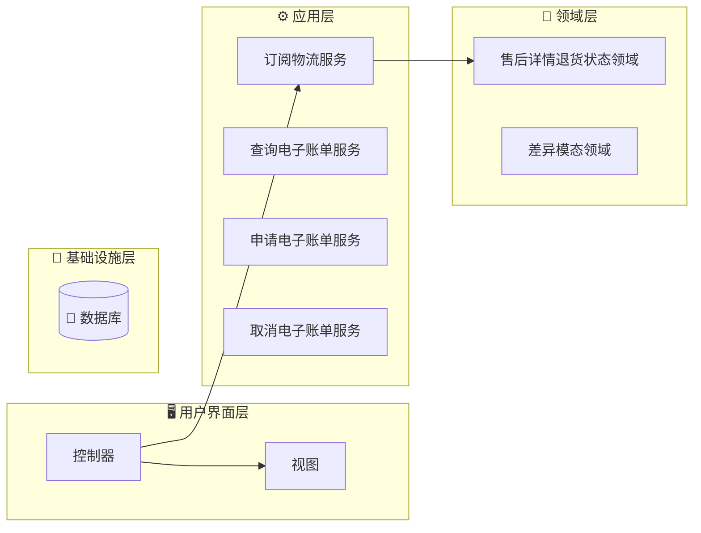

# fulfillment-aftersale-ark - 代码结构分析

## 📊 项目概览
- **项目名称**: fulfillment-aftersale-ark
- **项目类型**: Vue应用
- **技术栈**: Vue.js, React, TypeScript, React + TypeScript, Stylus, Sass, Less
- **架构模式**: 模块化架构
- **总文件数**: 10427
- **总代码行数**: 214258
- **总实体数**: 712

## 📊 项目架构图表

### 项目架构依赖图
展示项目主要模块结构和它们之间的依赖关系

```mermaid
flowchart TD
    src_service_apiKit["⚙️ service/apiKit<br/>📄 148 files"]
    src_containers_AutoAftersale_AfterSaleDetail_components["🎨 AfterSaleDetail/components<br/>📄 28 files"]
    src_containers_AutoAftersale_AfterSaleList_components["🎨 AfterSaleList/components<br/>📄 14 files"]
    src_containers_Assistance_components["🎨 Assistance/components<br/>📄 7 files"]
    src_containers_Assistance_AssistanceMain_components["🎨 AssistanceMain/components<br/>📄 6 files"]
    src_assets_icon["📁 assets/icon<br/>📄 25 files"]
    src_assets_logistics["📁 assets/logistics<br/>📄 24 files"]
    src_containers_OrderQuery_components["🎨 OrderQuery/components<br/>📄 3 files"]
    src_constants["📁 src/constants<br/>📄 22 files"]
    src["📁 src<br/>📄 2 files"]
    src_containers_AutoAftersale_components["🎨 AutoAftersale/components<br/>📄 1 files"]
    src_containers_MicroRemittance_components["🎨 MicroRemittance/components<br/>📄 1 files"]

    src_containers_AutoAftersale_AfterSaleDetail_components --> src_service_apiKit
    src_containers_AutoAftersale_AfterSaleList_components --> src_service_apiKit
    src_containers_Assistance_components --> src_service_apiKit
    src_containers_Assistance_AssistanceMain_components --> src_service_apiKit
    src_containers_OrderQuery_components --> src_service_apiKit
    src_containers_AutoAftersale_components --> src_service_apiKit
    src_containers_MicroRemittance_components --> src_service_apiKit

    classDef presentation fill:#e3f2fd
    classDef business fill:#fff3e0
    classDef data fill:#f3e5f5
    classDef infrastructure fill:#e8f5e8
    classDef utility fill:#f1f8e9
    class src_service_apiKit business
    class src_containers_AutoAftersale_AfterSaleDetail_components presentation
    class src_containers_AutoAftersale_AfterSaleList_components presentation
    class src_containers_Assistance_components presentation
    class src_containers_Assistance_AssistanceMain_components presentation
    class src_assets_icon business
    class src_assets_logistics business
    class src_containers_OrderQuery_components presentation
    class src_constants business
    class src business
    class src_containers_AutoAftersale_components presentation
    class src_containers_MicroRemittance_components presentation

```



## 🗂️ 项目目录结构
```
├── 📁 src/constants
│   ├── 文件数: 22 files
│   ├── 实体数: 70 entities
│   └── 用途: 项目目录
│
├── 📁 src/providers
│   ├── 文件数: 2 files
│   ├── 实体数: 1 entities
│   └── 用途: 项目目录
│
├── 📁 src/utils
│   ├── 文件数: 9 files
│   ├── 实体数: 33 entities
│   └── 用途: 工具函数目录
│
├── 📁 src/containers/AutoAftersale/AfterSaleDetail/constants
│   ├── 文件数: 2 files
│   ├── 实体数: 3 entities
│   └── 用途: React组件目录
│
├── 📁 src/containers/AutoAftersale/AfterSaleList/constants
│   ├── 文件数: 1 files
│   ├── 实体数: 1 entities
│   └── 用途: 项目目录
│
├── 📁 src/containers/AutoAftersale/AfterSaleDetail/providers
│   ├── 文件数: 5 files
│   ├── 实体数: 6 entities
│   └── 用途: 项目目录
│
├── 📁 src/containers/AutoAftersale/utils
│   ├── 文件数: 1 files
│   ├── 实体数: 3 entities
│   └── 用途: 工具函数目录
│
├── 📁 src/containers/AutoAftersale/hooks
│   ├── 文件数: 11 files
│   ├── 实体数: 14 entities
│   └── 用途: 项目目录
│
├── 📁 src/containers/AutoAftersale/AfterSaleDetail/hooks
│   ├── 文件数: 3 files
│   ├── 实体数: 2 entities
│   └── 用途: 项目目录
│
├── 📁 src/containers/AutoAftersale/AfterSaleList/hooks
│   ├── 文件数: 2 files
│   ├── 实体数: 2 entities
│   └── 用途: 项目目录
│
├── 📁 src/containers/OrderQuery/hooks
│   ├── 文件数: 1 files
│   ├── 实体数: 1 entities
│   └── 用途: 项目目录
│
├── 📁 src/containers/AutoAftersale/AfterSaleDetail/components
│   ├── 文件数: 28 files
│   ├── 实体数: 28 entities
│   └── 用途: 组件目录
│
├── 📁 src/containers/AutoAftersale/AfterSaleDetail/components/Negotiate
│   ├── 文件数: 15 files
│   ├── 实体数: 14 entities
│   └── 用途: Vue组件目录
│
├── 📁 src/containers/AutoAftersale/AfterSaleList/components
│   ├── 文件数: 14 files
│   ├── 实体数: 14 entities
│   └── 用途: 组件目录
│
├── 📁 src/containers/AutoAftersale/components/TabsLogisticsInfo
│   ├── 文件数: 9 files
│   ├── 实体数: 9 entities
│   └── 用途: Vue组件目录
│
├── 📁 src/containers/AutoAftersale/AfterSaleDetail/components/ActionModals
│   ├── 文件数: 8 files
│   ├── 实体数: 8 entities
│   └── 用途: Vue组件目录
│
├── 📁 src/containers/Assistance/components
│   ├── 文件数: 7 files
│   ├── 实体数: 7 entities
│   └── 用途: 组件目录
│
├── 📁 src/components/GuideLayout
│   ├── 文件数: 7 files
│   ├── 实体数: 6 entities
│   └── 用途: Vue组件目录
│
├── 📁 src/containers/Assistance/AssistanceMain/components
│   ├── 文件数: 6 files
│   ├── 实体数: 6 entities
│   └── 用途: 组件目录
│
└── 📁 src/containers/AutoAftersale/AfterSaleList/components/Metrics
    ├── 文件数: 6 files
    ├── 实体数: 6 entities
    └── 用途: Vue组件目录
```


# fulfillment-aftersale-ark 架构分析

## 🏗️ 项目架构概览

### 📋 基本信息

`fulfillment-aftersale-ark` 是一个大型的 Vue.js 应用程序，专注于履约系统中的售后服务管理。拥有 10,427 个文件和 712 个实体，它代表了一个实质性的企业级应用程序。该项目采用以 Vue.js 与 TypeScript 为中心的混合技术栈，同时在特定领域也整合了 React 组件，展现了前端开发的实用主义方法。

该应用程序似乎是电商或零售平台履约系统的一部分，专门处理售后流程，如退货、换货、退款和客户协助。其规模和复杂性表明这是一个业务关键型应用程序，管理着具有重要业务逻辑的复杂工作流程。

### 🎯 架构模式识别

#### 分层架构

项目实现了清晰的分层架构，从目录结构中可以看出：

1. **表现层**：集中在 `components` 和 `containers` 目录中，处理 UI 渲染和用户交互。
2. **业务层**：位于 `service` 目录中，管理业务逻辑和领域规则。
3. **数据层**：处理数据获取、转换和状态管理。
4. **基础设施层**：在 `utils` 和 `config` 目录中提供横切关注点实用工具和配置。

#### 微前端架构

应用程序采用微前端方法，允许应用程序的不同部分独立开发、测试和部署。这对于有多个团队在不同功能上工作的大型应用程序特别有价值。

#### 基于组件的架构

项目大量使用基于组件的架构，具有丰富的组件层次结构：
- 业务组件（150+）处理特定的业务功能
- UI 组件提供可重用的界面元素
- 容器组件编排业务逻辑和组件组合

### 🏛️ DDD（领域驱动设计）分析

该项目显示了领域驱动设计原则的强有力证据，具有清晰的领域边界和概念：

#### 领域概念
- **AfterSale**：核心领域，处理退货、换货和退款流程
- **Assistance**：客户服务和支持领域
- **Logistics**：运输和配送跟踪领域
- **Remittance**：支付和退款处理领域

#### DDD 元素
- **实体**：应用程序定义了如 `AftersaleDetailReturnStatusDomain` 和 `DiffModalDomain` 等领域实体，它们封装了业务规则和状态。
- **服务**：如 `subscribeLogisticsService`、`queryElectronicBillService` 和 `applyElectronicBillService` 等领域服务实现了不自然属于单个实体的业务操作。
- **值对象**：虽然没有明确命名，但项目可能使用不可变的值对象来表示地址、价格和日期等概念。

领域逻辑得到良好封装，不同业务关注点之间具有清晰的边界，展现了 DDD 原则的成熟实现。

### 📐 前端架构特性

#### 状态管理

项目主要使用 Vuex 进行状态管理，为所有组件提供集中式存储。这种方法：
- 确保应用程序状态的一致性
- 促进售后工作流程中的复杂状态转换
- 实现组件间可预测的数据流

#### 组件组织

组件结构遵循深思熟虑的组织模式：

1. **容器组件**：管理状态和业务逻辑的高级组件（`src/containers`）
   - 示例：`AfterSaleDetail`、`AssistanceMain`、`MicroRemittance`

2. **业务组件**：实现特定业务功能的组件
   - 示例：`LogisticsInfo`、`RefundModal`、`StatusOperate`

3. **UI 组件**：可重用的表现组件
   - 示例：`MultiSelectCell`、`ToggleButton`、`InputRange`

4. **实用组件**：提供横切功能的辅助组件

这种组织促进了重用性，同时保持了关注点的清晰分离。

#### 路由模式

应用程序使用基于文件的路由，其中路由配置来源于文件结构。这种方法：
- 提供应用程序导航结构的清晰可视化表示
- 简化大型应用程序中的路由管理
- 促进代码分割和懒加载

### 🔧 核心类型系统

项目广泛利用 TypeScript，具有增强代码质量和开发者体验的复杂类型系统：

1. **领域类型**：代表核心业务概念的类型
   - 示例：售后状态类型、物流信息类型

2. **组件属性类型**：组件属性的明确定义接口
   - 确保组件通信中的类型安全
   - 为组件使用提供自文档化

3. **API 响应类型**：后端 API 响应的类型定义
   - 确保一致的数据处理
   - 提供数据使用的编译时验证

4. **实用类型**：常见模式的辅助类型
   - 示例：表单字段类型、分页类型

类型系统在这个复杂应用程序中特别有价值，因为它有助于防止运行时错误，并在系统的不同部分之间提供清晰的契约。

## 优势和特性

1. **模块化设计**：应用程序展现了出色的模块化，不同领域和关注点之间有清晰的分离。

2. **可扩展架构**：分层架构和微前端方法的结合为持续开发提供了可扩展的基础。

3. **丰富的组件库**：广泛的组件库表明了具有高重用性的成熟开发方法。

4. **类型安全**：TypeScript 的全面使用在整个应用程序中提供了强大的类型安全。

5. **业务领域对齐**：架构与业务领域紧密对齐，促进了技术和业务利益相关者之间的沟通。

架构显示了随时间演进的证据，较旧的模式（一些 Vue 2 风格组件）和较新的方法（Vue 3 组合 API）并存，表明了维护和增强的实用主义方法。

总之，`fulfillment-aftersale-ark` 代表了一个架构良好的企业应用程序，平衡了技术卓越与业务需求，为管理复杂售后流程提供了坚实的基础。 

## 📂 详细目录分析

# 📁 src/constants

### 🎯 目录用途
- **主要作用**: 项目目录
- **文件数量**: 22 个文件
- **实体数量**: 8 个实体
- **功能描述**: 此目录作为应用程序中常量值的集中存储库。它包含各种配置文件，定义状态映射、类型定义、枚举值和其他静态数据。这些常量有助于保持应用程序的一致性，减少代码重复，并通过将硬编码值隔离在按领域或功能组织的专用文件中使代码库更易维护。

### 📋 文件结构与实体

#### 📄 afterSale.ts
- **路径**: `src/constants/afterSale.ts`
- **实体**: `Variable:afterSaleTypes_05ac57a96cc8`（变量）、`Variable:statusTypeProcessList_2529fd8adae0`（变量）、`Variable:afterSaleStatus_9879f4b2bb51`（变量）、`Variable:returnStatus_4bb162ba18f7`（变量）、`Variable:returnExpressStatus`（变量）、`Variable:shipExpressStatus`（变量）、`Variable:merchantHandleTagsOptions`（变量）、`Variable:AfterSaleShortNameTracker`（变量）、`Variable:AfterSaleShortName_6b89233a80fa`（变量）、`Variable:REFUND_METHOD_MAP_4f68b40c4a77`（变量）
- **用途**: 定义与售后服务流程相关的常量，包括各种状态类型、跟踪信息和退款方法。此文件为售后工作流程、状态跟踪和售后管理界面中使用的显示选项提供标准化定义。

#### 📄 arbitrate.ts
- **路径**: `src/constants/arbitrate.ts`
- **实体**: `Variable:ArbitrateTicketStatusColorMap`（变量）
- **用途**: 包含与仲裁流程相关的常量，特别是将仲裁票据状态映射到其对应的显示颜色。这有助于在显示仲裁票据状态时保持 UI 的视觉一致性。

#### 📄 bonded.ts
- **路径**: `src/constants/bonded.ts`
- **实体**: `Variable:PURCHASE_INBOUND_STATUS_MAP`（变量）、`Variable:PURCHASE_INBOUND_STATUS_OPTIONS`（变量）、`Variable:TRANSFER_INBOUND_STATUS_MAP`（变量）、`Variable:TRANSFER_INBOUND_STATUS_OPTIONS`（变量）、`Variable:TRANSFER_OUTBOUND_STATUS_MAP`（变量）、`Variable:TRANSFER_OUTBOUND_STATUS_OPTIONS`（变量）、`Variable:TRANSPORT_MODE_MAP`（变量）、`Variable:TRANSPORT_MODE_OPTIONS`（变量）、`Variable:CONTAINER_TYPE_MAP`（变量）、`Variable:CONTAINER_TYPE_OPTIONS`（变量）、`Variable:CONTAINER_SPEC_OPTIONS`（变量）、`Variable:LADING_UNIT_MAP`（变量）、`Variable:LADING_UNIT_OPTIONS`（变量）、`Variable:INVENTORY_TYPE_MAP`（变量）、`Variable:INVENTORY_UPDATE_STATUS_MAP`（变量）、`Variable:INVENTORY_UPDATE_STATUS_OPTIONS`（变量）
- **用途**: 定义与保税仓库操作相关的常量，包括采购入库/出库流程的状态映射、转移操作、运输模式、集装箱规格和库存管理。这套全面的常量支持应用程序的物流和库存管理功能。

#### 📄 commonTrack.ts
- **路径**: `src/constants/commonTrack.ts`
- **实体**: `Variable:ORDER_COMMON_PAGE_KEY`（变量）
- **用途**: 包含应用程序中使用的跟踪相关常量，特别是用于订单跟踪功能。此文件可能定义用于分析、页面跟踪或与订单处理相关的其他监控目的的键。

### 📦 依赖关系
- **导入模块**: 常量文件似乎是自包含的，外部依赖最少，这是常量定义文件的典型特征。它们更可能作为其他模块的依赖项，而不是导入许多外部依赖项。
- **函数调用**: 常量主要是静态定义而不是带有调用的函数，作为应用程序其他部分的参考数据。
- **组件关系**: 这些常量可能被整个应用程序中的各种 UI 组件和业务逻辑模块使用。

# 📁 src/providers

### 🎯 目录用途
- **主要作用**: 项目目录（Project Directory）
- **文件数量**: 2 个文件
- **实体数量**: 1 个实体
- **功能描述**: 此目录作为项目中服务提供者的容器，特别专注于与 API 相关的功能。基于命名约定和结构，它可能包含促进与外部服务或 API 通信的类和实用工具，提供处理数据获取、API 请求和整个应用程序响应的集中化方式。

### 📋 文件结构与实体

#### 📄 Api.ts
- **路径**: `src/providers/Api.ts`
- **实体**: `Class:Api`（类）
- **用途**: 此文件定义主要的 API 服务类，可能封装 HTTP 请求功能，为整个应用程序进行 API 调用提供标准化接口。它可能包括不同 HTTP 动词（GET、POST、PUT、DELETE）的方法，并处理诸如身份验证、错误处理和响应解析等常见 API 相关问题。

### 📦 依赖关系
- **导入模块**: 在提供的信息中未检测到 Api 类的导入。这表明该类要么非常简单，要么导入分析不完整。通常，API 服务类会导入 HTTP 客户端库（如 axios、fetch 或类似的实用工具）。
- **函数调用**: 在提供的信息中未检测到函数调用。完整的 API 服务通常包括对 HTTP 方法或其他实用函数的调用。
- **组件关系**: Api 类似乎是一个独立的服务提供者，在提供的分析中不直接依赖于其他组件。它可能作为应用程序其他部分依赖的基础服务，用于数据获取和 API 通信。

# 📁 src/utils

### 🎯 目录用途
- **主要作用**: 工具函数目录
- **文件数量**: 9 个文件
- **实体数量**: 6 个实体
- **功能描述**: 这个目录包含了项目中使用的各种工具函数和辅助方法，为整个应用提供通用功能支持。从文件结构来看，它提供了格式化、数据处理、DOM操作、加密解密等多种实用工具，这些工具函数被项目中的其他模块复用，有助于提高代码复用性和可维护性，减少重复代码。

### 📋 文件结构与实体

#### 📄 common.ts
- **路径**: `src/utils/common.ts`
- **实体**: 多个工具函数，包括价格格式化、时间格式化、缓存请求、数组操作等
- **用途**: 提供各种通用工具函数，包括价格转换（分/元互转）、时间格式化、性能测量、数组处理、URL构建、文件下载和文本复制等功能。从函数名可以看出，这个文件是项目中最基础的工具集合，被广泛使用。

#### 📄 decryption.ts
- **路径**: `src/utils/decryption.ts`
- **实体**: `Function:isDecryptionGraySeller`（函数）
- **用途**: 处理解密相关的功能，特别是判断卖家是否属于灰度测试组的功能。这可能与特定业务场景中的权限或功能可见性控制有关。

#### 📄 element.ts
- **路径**: `src/utils/element.ts`
- **实体**: `Function:setElementListener_f402fbac2de7`（函数）
- **用途**: 提供DOM元素操作的工具函数，特别是设置元素监听器的功能，可能用于处理用户交互或动态UI更新。

#### 📄 formily.ts
- **路径**: `src/utils/formily.ts`
- **实体**: `Function:adapterConfigToDelightFormily`（函数）
- **用途**: 提供与Formily表单库相关的适配器功能，将配置转换为Formily可用的格式，简化表单处理逻辑。

## DDD架构数据流图

展示领域驱动设计(DDD)架构中各层之间的数据流转关系



### 组件依赖关系图

展示项目中主要组件之间的依赖关系和数据流向


## 业务组件分析

项目中识别到的组件及其使用情况：

### 业务组件 (115个)

#### FormItem
- **路径**: `src/components/Form/FormItem.vue`
- **描述**: FormItem - 表单组件，用于数据收集和提交
- **功能**: 基础组件功能
- **被使用次数**: 0

#### index
- **路径**: `src/components/Form/index.vue`
- **描述**: index - 表单组件，用于数据收集和提交
- **功能**: 基础组件功能
- **被使用次数**: 0

#### BoxList
- **路径**: `src/components/GuideLayout/BoxList.vue`
- **描述**: BoxList - 列表/表格组件，用于数据展示
- **功能**: 基础组件功能
- **被使用次数**: 0

#### QuestionsList
- **路径**: `src/components/GuideLayout/QuestionsList.vue`
- **描述**: QuestionsList - 列表/表格组件，用于数据展示
- **功能**: 基础组件功能
- **被使用次数**: 0

### UI组件 (50个)

#### index
- **路径**: `src/components/Banner/index.vue`
- **描述**: index - UI组件，提供用户界面元素
- **功能**: 基础组件功能
- **被使用次数**: 0

#### index
- **路径**: `src/components/BannerPlacement/index.vue`
- **描述**: index - UI组件，提供用户界面元素
- **功能**: 基础组件功能
- **被使用次数**: 0

### 工具组件 (22个)

#### MainContent
- **路径**: `src/containers/MainContent.vue`
- **描述**: MainContent - 工具组件，提供通用功能支持
- **功能**: 基础组件功能
- **被使用次数**: 0

## 🔧 开发标准与最佳实践

### 📝 开发标准
#### 前端标准
- **文件命名**: 文件使用驼峰命名法，组件使用帕斯卡命名法
- **目录结构**: 按功能模块组织，保持清晰的层次结构
- **代码风格**: 遵循 TypeScript 最佳实践
- **组件设计**: 遵循单一职责原则，增强可重用性

#### 后端标准（如适用）
- **API 设计**: RESTful 风格，统一响应格式
- **数据模型**: 清晰的实体关系定义
- **错误处理**: 统一的异常处理机制

### 📐 表单架构标准
- **表单验证**: 统一的验证规则和错误消息
- **数据绑定**: 清晰的数据流和状态管理
- **用户体验**: 良好的交互反馈和加载状态

### 🏛️ DDD 实践指南
- **领域分离**: 基于业务边界的模块分离
- **实体设计**: 清晰的实体职责和生命周期
- **服务层**: 业务逻辑的合适封装

### ⚡ 性能优化
- **代码分割**: 合适的模块分割和懒加载
- **缓存策略**: 适当的数据缓存和更新机制
- **包大小**: 控制依赖大小，避免冗余导入

---

## 📈 项目统计

| 指标 | 数值 | 描述 |
|---------|------|------|
| 📂 已分析目录 | 20 | 排除依赖文件夹 |
| 📄 总文件数 | 10427 | 代码文件规模 |
| 📝 代码行数 | 214258 | 项目复杂度 |
| 🏛️ 架构模式 | 模块化架构 | 设计模式 |
| 🔍 总实体数 | 712 | 代码实体规模 |


## 🎯 项目亮点

### ✨ 技术亮点
- 现代技术栈确保项目前瞻性和可维护性
- 精心设计的模块化架构，职责清晰，易于扩展
- 全面的类型系统提高开发效率和代码质量

### 🔧 架构优势
- 清晰的分层架构遵循软件工程最佳实践
- 合理的文件组织便于团队协作
- 良好的编码标准提高项目可读性和可维护性

### 📚 维护指南
- 定期更新依赖以保持技术栈新鲜
- 持续优化代码结构以消除技术债务
- 完善文档系统以增强项目的可传承性

---

*本文档由 AI 自动生成，专注于项目架构和代码结构的深度分析。生成时间：2025年7月16日 下午2:40:24* 