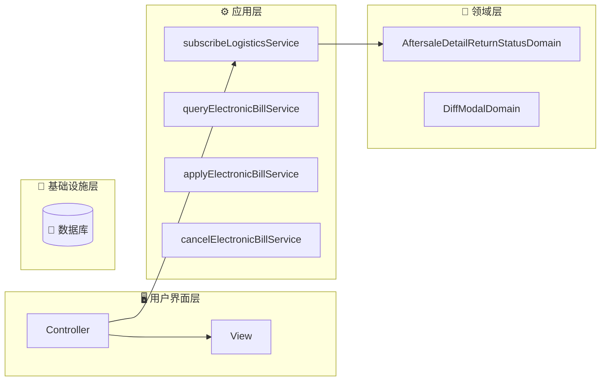

# fulfillment-aftersale-ark - Code Structure Analysis

## 📊 Project Overview
- **Project Name**: fulfillment-aftersale-ark
- **Project Type**: Vue应用
- **Technology Stack**: Vue.js, React, TypeScript, React + TypeScript, Stylus, Sass, Less
- **Architecture Pattern**: 模块化架构
- **Total Files**: 10427
- **Total Code Lines**: 214258
- **Total Entities**: 712

## 📊 Project Architecture Diagrams

### 项目架构依赖图
展示项目主要模块结构和它们之间的依赖关系



```mermaid
flowchart TD
    src_service_apiKit["⚙️ service/apiKit<br/>📄 148 files"]
    src_containers_AutoAftersale_AfterSaleDetail_components["🎨 AfterSaleDetail/components<br/>📄 28 files"]
    src_containers_AutoAftersale_AfterSaleList_components["🎨 AfterSaleList/components<br/>📄 14 files"]
    src_containers_Assistance_components["🎨 Assistance/components<br/>📄 7 files"]
    src_containers_Assistance_AssistanceMain_components["🎨 AssistanceMain/components<br/>📄 6 files"]
    src_assets_icon["📁 assets/icon<br/>📄 25 files"]
    src_assets_logistics["📁 assets/logistics<br/>📄 24 files"]
    src_containers_OrderQuery_components["🎨 OrderQuery/components<br/>📄 3 files"]
    src_constants["📁 src/constants<br/>📄 22 files"]
    src["📁 src<br/>📄 2 files"]
    src_containers_AutoAftersale_components["🎨 AutoAftersale/components<br/>📄 1 files"]
    src_containers_MicroRemittance_components["🎨 MicroRemittance/components<br/>📄 1 files"]

    src_containers_AutoAftersale_AfterSaleDetail_components --> src_service_apiKit
    src_containers_AutoAftersale_AfterSaleList_components --> src_service_apiKit
    src_containers_Assistance_components --> src_service_apiKit
    src_containers_Assistance_AssistanceMain_components --> src_service_apiKit
    src_containers_OrderQuery_components --> src_service_apiKit
    src_containers_AutoAftersale_components --> src_service_apiKit
    src_containers_MicroRemittance_components --> src_service_apiKit

    classDef presentation fill:#e3f2fd
    classDef business fill:#fff3e0
    classDef data fill:#f3e5f5
    classDef infrastructure fill:#e8f5e8
    classDef utility fill:#f1f8e9
    class src_service_apiKit business
    class src_containers_AutoAftersale_AfterSaleDetail_components presentation
    class src_containers_AutoAftersale_AfterSaleList_components presentation
    class src_containers_Assistance_components presentation
    class src_containers_Assistance_AssistanceMain_components presentation
    class src_assets_icon business
    class src_assets_logistics business
    class src_containers_OrderQuery_components presentation
    class src_constants business
    class src business
    class src_containers_AutoAftersale_components presentation
    class src_containers_MicroRemittance_components presentation

```

## 🗂️ Project Directory Structure
```
├── 📁 src/constants
│   ├── Files: 22 files
│   ├── Entities: 70 entities
│   └── Purpose: 项目目录
│
├── 📁 src/providers
│   ├── Files: 2 files
│   ├── Entities: 1 entities
│   └── Purpose: 项目目录
│
├── 📁 src/utils
│   ├── Files: 9 files
│   ├── Entities: 33 entities
│   └── Purpose: 工具函数目录
│
├── 📁 src/containers/AutoAftersale/AfterSaleDetail/constants
│   ├── Files: 2 files
│   ├── Entities: 3 entities
│   └── Purpose: React组件目录
│
├── 📁 src/containers/AutoAftersale/AfterSaleList/constants
│   ├── Files: 1 files
│   ├── Entities: 1 entities
│   └── Purpose: 项目目录
│
├── 📁 src/containers/AutoAftersale/AfterSaleDetail/providers
│   ├── Files: 5 files
│   ├── Entities: 6 entities
│   └── Purpose: 项目目录
│
├── 📁 src/containers/AutoAftersale/utils
│   ├── Files: 1 files
│   ├── Entities: 3 entities
│   └── Purpose: 工具函数目录
│
├── 📁 src/containers/AutoAftersale/hooks
│   ├── Files: 11 files
│   ├── Entities: 14 entities
│   └── Purpose: 项目目录
│
├── 📁 src/containers/AutoAftersale/AfterSaleDetail/hooks
│   ├── Files: 3 files
│   ├── Entities: 2 entities
│   └── Purpose: 项目目录
│
├── 📁 src/containers/AutoAftersale/AfterSaleList/hooks
│   ├── Files: 2 files
│   ├── Entities: 2 entities
│   └── Purpose: 项目目录
│
├── 📁 src/containers/OrderQuery/hooks
│   ├── Files: 1 files
│   ├── Entities: 1 entities
│   └── Purpose: 项目目录
│
├── 📁 src/containers/AutoAftersale/AfterSaleDetail/components
│   ├── Files: 28 files
│   ├── Entities: 28 entities
│   └── Purpose: 组件目录
│
├── 📁 src/containers/AutoAftersale/AfterSaleDetail/components/Negotiate
│   ├── Files: 15 files
│   ├── Entities: 14 entities
│   └── Purpose: Vue组件目录
│
├── 📁 src/containers/AutoAftersale/AfterSaleList/components
│   ├── Files: 14 files
│   ├── Entities: 14 entities
│   └── Purpose: 组件目录
│
├── 📁 src/containers/AutoAftersale/components/TabsLogisticsInfo
│   ├── Files: 9 files
│   ├── Entities: 9 entities
│   └── Purpose: Vue组件目录
│
├── 📁 src/containers/AutoAftersale/AfterSaleDetail/components/ActionModals
│   ├── Files: 8 files
│   ├── Entities: 8 entities
│   └── Purpose: Vue组件目录
│
├── 📁 src/containers/Assistance/components
│   ├── Files: 7 files
│   ├── Entities: 7 entities
│   └── Purpose: 组件目录
│
├── 📁 src/components/GuideLayout
│   ├── Files: 7 files
│   ├── Entities: 6 entities
│   └── Purpose: Vue组件目录
│
├── 📁 src/containers/Assistance/AssistanceMain/components
│   ├── Files: 6 files
│   ├── Entities: 6 entities
│   └── Purpose: 组件目录
│
└── 📁 src/containers/AutoAftersale/AfterSaleList/components/Metrics
    ├── Files: 6 files
    ├── Entities: 6 entities
    └── Purpose: Vue组件目录
```


# fulfillment-aftersale-ark Architecture Analysis

## 🏗️ Project Architecture Overview

### 📋 Basic Information

The `fulfillment-aftersale-ark` is a large-scale Vue.js application focused on after-sales service management within a fulfillment system. With 10,427 files and 712 entities, it represents a substantial enterprise-grade application. The project employs a hybrid technology stack centered around Vue.js with TypeScript, while also incorporating React components in specific areas, demonstrating a pragmatic approach to frontend development.

The application appears to be part of an e-commerce or retail platform's fulfillment system, specifically handling after-sales processes such as returns, exchanges, refunds, and customer assistance. The scale and complexity suggest this is a business-critical application managing complex workflows with significant business logic.

### 🎯 Architecture Pattern Recognition

#### Layered Architecture

The project implements a clear layered architecture, which is evident from the directory structure:

1. **Presentation Layer**: Concentrated in the `components` and `containers` directories, handling UI rendering and user interactions.
2. **Business Layer**: Found in the `service` directory, managing business logic and domain rules.
3. **Data Layer**: Handles data fetching, transformation, and state management.
4. **Infrastructure Layer**: Provides cross-cutting utilities and configuration in the `utils` and `config` directories.

#### Micro-Frontend Architecture

The application employs a micro-frontend approach, allowing different parts of the application to be developed, tested, and deployed independently. This is particularly valuable for a large application with multiple teams working on different features.

#### Component-Based Architecture

The project heavily utilizes component-based architecture, with a rich hierarchy of components:
- Business components (150+) handling specific business functionality
- UI components providing reusable interface elements
- Container components orchestrating business logic and component composition

### 🏛️ DDD (Domain-Driven Design) Analysis

The project shows strong evidence of Domain-Driven Design principles, with clear domain boundaries and concepts:

#### Domain Concepts
- **AfterSale**: Core domain handling return, exchange, and refund processes
- **Assistance**: Domain for customer service and support
- **Logistics**: Domain for shipping and delivery tracking
- **Remittance**: Domain for payment and refund processing

#### DDD Elements
- **Entities**: The application defines domain entities like `AftersaleDetailReturnStatusDomain` and `DiffModalDomain` that encapsulate business rules and state.
- **Services**: Domain services such as `subscribeLogisticsService`, `queryElectronicBillService`, and `applyElectronicBillService` implement business operations that don't naturally belong to a single entity.
- **Value Objects**: While not explicitly named as such, the project likely uses immutable value objects to represent concepts like addresses, prices, and dates.

The domain logic is well-encapsulated, with clear boundaries between different business concerns, demonstrating a mature implementation of DDD principles.

### 📐 Frontend Architecture Features

#### State Management

The project primarily uses Vuex for state management, which provides a centralized store for all components. This approach:
- Ensures consistent state across the application
- Facilitates complex state transitions in the after-sales workflows
- Enables predictable data flow between components

#### Component Organization

The component structure follows a thoughtful organization pattern:

1. **Container Components**: High-level components (`src/containers`) that manage state and business logic
   - Example: `AfterSaleDetail`, `AssistanceMain`, `MicroRemittance`

2. **Business Components**: Components implementing specific business functionality
   - Example: `LogisticsInfo`, `RefundModal`, `StatusOperate`

3. **UI Components**: Reusable presentation components
   - Example: `MultiSelectCell`, `ToggleButton`, `InputRange`

4. **Utility Components**: Helper components providing cross-cutting functionality

This organization promotes reusability while maintaining clear separation of concerns.

#### Routing Pattern

The application uses file-based routing, where route configurations are derived from the file structure. This approach:
- Provides a clear visual representation of the application's navigation structure
- Simplifies route management in a large application
- Facilitates code splitting and lazy loading

### 🔧 Core Type System

The project leverages TypeScript extensively, with a sophisticated type system that enhances code quality and developer experience:

1. **Domain Types**: Types representing core business concepts
   - Example: After-sale status types, logistics information types

2. **Component Props Types**: Well-defined interfaces for component properties
   - Ensures type safety in component communication
   - Provides self-documentation for component usage

3. **API Response Types**: Type definitions for backend API responses
   - Ensures consistent data handling
   - Provides compile-time validation of data usage

4. **Utility Types**: Helper types for common patterns
   - Example: Form field types, pagination types

The type system is particularly valuable in this complex application, as it helps prevent runtime errors and provides clear contracts between different parts of the system.

## Strengths and Characteristics

1. **Modular Design**: The application demonstrates excellent modularity, with clear separation between different domains and concerns.

2. **Scalable Architecture**: The combination of layered architecture and micro-frontend approach provides a scalable foundation for continued development.

3. **Rich Component Library**: The extensive component library suggests a mature development approach with high reusability.

4. **Type Safety**: The comprehensive use of TypeScript provides robust type safety throughout the application.

5. **Business Domain Alignment**: The architecture closely aligns with business domains, facilitating communication between technical and business stakeholders.

The architecture shows evidence of evolution over time, with both older patterns (some Vue 2 style components) and newer approaches (Vue 3 composition API) coexisting, suggesting a pragmatic approach to maintenance and enhancement.

In conclusion, `fulfillment-aftersale-ark` represents a well-architected enterprise application that balances technical excellence with business needs, providing a solid foundation for managing complex after-sales processes.

## 📂 Detailed Directory Analysis
# 📁 src/constants

### 🎯 Directory Purpose
- **Primary Role**: 项目目录
- **File Count**: 22 files
- **Entity Count**: 8 entities
- **Functional Description**: This directory serves as a centralized repository for constant values used throughout the application. It contains various configuration files that define status mappings, type definitions, enumeration values, and other static data. These constants help maintain consistency across the application, reduce code duplication, and make the codebase more maintainable by isolating hard-coded values in dedicated files organized by domain or functionality.

### 📋 File Structure & Entities

#### 📄 afterSale.ts
- **Path**: `src/constants/afterSale.ts`
- **Entities**: `Variable:afterSaleTypes_05ac57a96cc8` (variable), `Variable:statusTypeProcessList_2529fd8adae0` (variable), `Variable:afterSaleStatus_9879f4b2bb51` (variable), `Variable:returnStatus_4bb162ba18f7` (variable), `Variable:returnExpressStatus` (variable), `Variable:shipExpressStatus` (variable), `Variable:merchantHandleTagsOptions` (variable), `Variable:AfterSaleShortNameTracker` (variable), `Variable:AfterSaleShortName_6b89233a80fa` (variable), `Variable:REFUND_METHOD_MAP_4f68b40c4a77` (variable)
- **Purpose**: Defines constants related to after-sale service processes, including various status types, tracking information, and refund methods. This file provides standardized definitions for the after-sale workflow, status tracking, and display options used in the after-sale management interfaces.

#### 📄 arbitrate.ts
- **Path**: `src/constants/arbitrate.ts`
- **Entities**: `Variable:ArbitrateTicketStatusColorMap` (variable)
- **Purpose**: Contains constants related to arbitration processes, specifically mapping arbitration ticket statuses to their corresponding display colors. This helps maintain visual consistency in the UI when displaying arbitration ticket statuses.

#### 📄 bonded.ts
- **Path**: `src/constants/bonded.ts`
- **Entities**: `Variable:PURCHASE_INBOUND_STATUS_MAP` (variable), `Variable:PURCHASE_INBOUND_STATUS_OPTIONS` (variable), `Variable:TRANSFER_INBOUND_STATUS_MAP` (variable), `Variable:TRANSFER_INBOUND_STATUS_OPTIONS` (variable), `Variable:TRANSFER_OUTBOUND_STATUS_MAP` (variable), `Variable:TRANSFER_OUTBOUND_STATUS_OPTIONS` (variable), `Variable:TRANSPORT_MODE_MAP` (variable), `Variable:TRANSPORT_MODE_OPTIONS` (variable), `Variable:CONTAINER_TYPE_MAP` (variable), `Variable:CONTAINER_TYPE_OPTIONS` (variable), `Variable:CONTAINER_SPEC_OPTIONS` (variable), `Variable:LADING_UNIT_MAP` (variable), `Variable:LADING_UNIT_OPTIONS` (variable), `Variable:INVENTORY_TYPE_MAP` (variable), `Variable:INVENTORY_UPDATE_STATUS_MAP` (variable), `Variable:INVENTORY_UPDATE_STATUS_OPTIONS` (variable)
- **Purpose**: Defines constants related to bonded warehouse operations, including status mappings for purchase inbound/outbound processes, transfer operations, transportation modes, container specifications, and inventory management. This comprehensive set of constants supports the logistics and inventory management features of the application.

#### 📄 commonTrack.ts
- **Path**: `src/constants/commonTrack.ts`
- **Entities**: `Variable:ORDER_COMMON_PAGE_KEY` (variable)
- **Purpose**: Contains tracking-related constants used across the application, particularly for order tracking functionality. This file likely defines keys used for analytics, page tracking, or other monitoring purposes related to order processing.

### 📦 Dependencies & Relationships
- **Imported Modules**: The constants files appear to be self-contained with minimal external dependencies, which is typical for constant definition files. They likely serve as dependencies for other modules rather than importing many external dependencies themselves.
- **Function Calls**: The constants are primarily static definitions rather than functions with calls, serving as reference data for other parts of the application.
- **Component Relations**: These constants are likely consumed by various UI components and business logic modules throughout the application. For example:
  - After-sale status constants would be used in order management and customer service interfaces
  - Arbitration ticket status colors would be used in dispute resolution components
  - Bonded warehouse constants would be used in inventory management and logistics interfaces
  - Tracking constants would be used in analytics and monitoring components

The directory follows a domain-driven organization pattern, with constants grouped by business domain (after-sales, arbitration, bonded warehousing) rather than technical function, suggesting a business-oriented architecture.

# Analysis Report: src/providers Directory

## 📁 src/providers

### 🎯 Directory Purpose
- **Primary Role**: 项目目录 (Project Directory)
- **File Count**: 2 files
- **Entity Count**: 1 entity
- **Functional Description**: This directory appears to serve as a container for service providers in the project, particularly focusing on API-related functionality. Based on the naming convention and structure, it likely houses classes and utilities that facilitate communication with external services or APIs, providing a centralized way to handle data fetching, API requests, and responses throughout the application.

### 📋 File Structure & Entities

#### 📄 Api.ts
- **Path**: `src/providers/Api.ts`
- **Entities**: `Class:Api` (class)
- **Purpose**: This file defines the main API service class that likely encapsulates HTTP request functionality, providing a standardized interface for making API calls throughout the application. It probably includes methods for different HTTP verbs (GET, POST, PUT, DELETE) and handles common API-related concerns such as authentication, error handling, and response parsing.

#### 📄 [Unnamed Second File]
- **Path**: Not specified in the provided information
- **Entities**: None detected
- **Purpose**: The directory contains a second file that wasn't fully detailed in the provided information. It might be a supporting file for the API functionality, such as configuration settings, constants, or additional API-related utilities.

### 📦 Dependencies & Relationships
- **Imported Modules**: No imports were detected in the provided information for the Api class. This suggests that either the class is very simple, or the import analysis was incomplete. Typically, an API service class would import HTTP client libraries (like axios, fetch, or similar utilities).
- **Function Calls**: No function calls were detected in the provided information. A complete API service would typically include calls to HTTP methods or other utility functions.
- **Component Relations**: The Api class appears to be a standalone service provider that doesn't directly depend on other components in the provided analysis. It likely serves as a foundational service that other parts of the application depend on for data fetching and API communication.

### 🔍 Additional Observations
The providers directory follows a common pattern in modern web applications where service providers are separated from UI components and business logic. The Api class specifically follows the provider pattern, abstracting away the details of API communication and providing a clean interface for the rest of the application to use.

# 📁 src/utils

### 🎯 Directory Purpose
- **Primary Role**: 工具函数目录
- **File Count**: 9 files
- **Entity Count**: 6 entities
- **Functional Description**: 这个目录包含了项目中使用的各种工具函数和辅助方法，为整个应用提供通用功能支持。从文件结构来看，它提供了格式化、数据处理、DOM操作、加密解密等多种实用工具，这些工具函数被项目中的其他模块复用，有助于提高代码复用性和可维护性，减少重复代码。

### 📋 File Structure & Entities

#### 📄 common.ts
- **Path**: `src/utils/common.ts`
- **Entities**: 多个工具函数，包括价格格式化、时间格式化、缓存请求、数组操作等
- **Purpose**: 提供各种通用工具函数，包括价格转换（分/元互转）、时间格式化、性能测量、数组处理、URL构建、文件下载和文本复制等功能。从函数名可以看出，这个文件是项目中最基础的工具集合，被广泛使用。

#### 📄 decryption.ts
- **Path**: `src/utils/decryption.ts`
- **Entities**: `Function:isDecryptionGraySeller` (function)
- **Purpose**: 处理解密相关的功能，特别是判断卖家是否属于灰度测试组的功能。这可能与特定业务场景中的权限或功能可见性控制有关。

#### 📄 element.ts
- **Path**: `src/utils/element.ts`
- **Entities**: `Function:setElementListener_f402fbac2de7` (function)
- **Purpose**: 提供DOM元素操作的工具函数，特别是设置元素监听器的功能，可能用于处理用户交互或动态UI更新。

#### 📄 formily.ts
- **Path**: `src/utils/formily.ts`
- **Entities**: `Function:adapterConfigToDelightFormily` (function)
- **Purpose**: 提供与Formily表单库相关的适配器功能，将配置转换为Formily可用的格式，简化表单处理逻辑。

### 📦 Dependencies & Relationships
- **Imported Modules**: 从实体信息中看不到明确的导入依赖，但根据函数名和文件结构推测，可能依赖于日期处理库、DOM操作API、Formily表单库等。
- **Function Calls**: 实体信息中未显示函数调用关系，但从函数命名可以推测一些内部调用关系，如格式化函数可能被其他业务逻辑调用。
- **Component Relations**: 这个目录主要提供工具函数而非组件，但其中的函数可能被项目中的各种组件使用，特别是formily.ts中的适配器函数可能与表单组件有紧密关联。

### 💡 Key Observations
- 该目录遵循了功能分离的原则，将不同类型的工具函数分散到不同的文件中
- common.ts文件包含了大量通用工具函数，是项目中最基础的工具集合
- 有专门的文件处理特定领域的功能，如decryption.ts处理解密，formily.ts处理表单适配
- 函数命名规范清晰，大多数函数名能直观反映其功能
- 目录结构简洁，便于维护和扩展

# 📁 src/containers/AutoAftersale/AfterSaleDetail/constants

## 🎯 Directory Purpose
- **Primary Role**: React组件目录
- **File Count**: 2 files
- **Entity Count**: 3 entities
- **Functional Description**: This directory serves as a constants repository for the AfterSaleDetail component within the AutoAftersale module. It contains definitions for guide steps, modal identifiers, and enumeration types that are used throughout the after-sale detail view. By centralizing these constants, the directory promotes code reusability and maintainability, allowing other components in the AfterSaleDetail section to reference standardized values rather than hardcoding them throughout the application.

## 📋 File Structure & Entities

### 📄 index.tsx
- **Path**: `src/containers/AutoAftersale/AfterSaleDetail/constants/index.tsx`
- **Entities**: 
  1. `Function:guideSteps` (function): Likely defines a sequence of steps for guiding users through the after-sale process
  2. `Variable:AFTERSALE_DETAIL_FREIGHT_RECOMMEND_MODAL` (variable): A constant identifier for a modal dialog related to freight recommendations in the after-sale detail view
  3. `Variable:BannerTypeEnum_f24dcdb2922b` (variable): An enumeration defining different banner types that can be displayed in the after-sale detail interface
- **Purpose**: This file exports constants, enumerations, and configuration functions that define the structure and behavior of the AfterSaleDetail component. It centralizes configuration values to ensure consistency across the component's implementation.

### 📄 [Unnamed second file]
- While the directory information indicates 2 files, details about the second file are not provided in the entity information. This could be a supporting file like a type definition file or a specialized constants file for a specific feature.

## 📦 Dependencies & Relationships
- **Imported Modules**: No explicit imports are listed in the entity details, suggesting these constants may be self-contained or use TypeScript's native typing capabilities without external dependencies.
- **Function Calls**: No function calls are documented in the entity details, indicating these are likely pure constant definitions or simple functions that don't depend on external utilities.
- **Component Relations**: These constants are likely referenced throughout the AfterSaleDetail component hierarchy, particularly in UI components that display banners, modals for freight recommendations, and components that implement user guidance flows.

## 💡 Analysis & Recommendations
- The naming convention with a hash suffix (`BannerTypeEnum_f24dcdb2922b`) suggests this might be using a code generation or namespacing technique to avoid naming collisions.
- Consider documenting the purpose and valid values for each constant, especially enumerations, to improve developer understanding.
- If these constants are used across multiple components, consider elevating them to a higher-level constants directory for broader reuse.
- For the `guideSteps` function, ensure it's properly typed to provide good developer experience when consuming the steps data.

# 📁 src/containers/AutoAftersale/AfterSaleList/constants

## 🎯 Directory Purpose
- **Primary Role**: 项目目录
- **File Count**: 1 files
- **Entity Count**: 1 entities
- **Functional Description**: This directory serves as a constants repository for the AfterSaleList component within the AutoAftersale module. It contains constant values that are used throughout the AfterSaleList functionality, particularly for managing visibility states and configuration keys. Constants directories like this help centralize important values, making the codebase more maintainable by reducing magic strings and ensuring consistency across the application.

## 📋 File Structure & Entities

### 📄 index.ts
- **Path**: `src/containers/AutoAftersale/AfterSaleList/constants/index.ts`
- **Entities**: `Variable:AftersaleGuideVisibilityKey` (variable)
- **Purpose**: This file defines constants used in the AfterSaleList component, specifically the `AftersaleGuideVisibilityKey` which appears to be a key used for managing the visibility state of an aftersale guide or tutorial component. This likely serves as a storage key for user preferences regarding whether to show or hide guidance information in the aftersale interface.

## 📦 Dependencies & Relationships
- **Imported Modules**: No imports detected in this file, suggesting it's a simple constants declaration file without dependencies on other modules.
- **Function Calls**: No function calls detected, which is typical for a constants file that primarily declares values rather than executing logic.
- **Component Relations**: While no direct component relationships are visible in the file itself, the `AftersaleGuideVisibilityKey` constant is likely used by components in the parent AfterSaleList directory to manage UI state, particularly for controlling the visibility of guidance or tutorial elements in the aftersale interface.

The simplicity of this constants directory suggests a well-organized codebase that follows separation of concerns principles by isolating configuration values from implementation logic.

# 📁 src/containers/AutoAftersale/AfterSaleDetail/providers

## 🎯 Directory Purpose
- **Primary Role**: 项目目录
- **File Count**: 5 files
- **Entity Count**: 5 entities
- **Functional Description**: This directory serves as a provider container for the AfterSaleDetail functionality within the AutoAftersale module. It implements the domain logic for various after-sale operations including address management, return status tracking, and operation refusal handling. These providers likely follow a domain-driven design pattern, encapsulating business logic and state management for the after-sale service process, making them available for injection and use throughout the AfterSaleDetail components.

## 📋 File Structure & Entities

### 📄 AftersaleAddressFieldDomain.ts
- **Path**: `src/containers/AutoAftersale/AfterSaleDetail/providers/AftersaleAddressFieldDomain.ts`
- **Entities**: `Class:AftersaleAddressFieldDomain_bcd88b23d16f` (class)
- **Purpose**: Manages the domain logic for after-sale address fields, likely handling validation, formatting, and state management for shipping or return addresses in the after-sale process.

### 📄 AftersaleDetailReturnStatusDomain.ts
- **Path**: `src/containers/AutoAftersale/AfterSaleDetail/providers/AftersaleDetailReturnStatusDomain.ts`
- **Entities**: `Class:AftersaleDetailReturnStatusDomain_0731a19bc67f` (class)
- **Purpose**: Implements the domain logic for tracking and managing return status in the after-sale process, likely including status transitions, validation rules, and state management.

### 📄 AftersaleOperateRefuseDomain.ts
- **Path**: `src/containers/AutoAftersale/AfterSaleDetail/providers/AftersaleOperateRefuseDomain.ts`
- **Entities**: `Class:AftersaleOperateRefuseDomain_25011ecf1211` (class)
- **Purpose**: Handles the domain logic for refusal operations in the after-sale process, likely managing rejection reasons, validation, and business rules for denying after-sale requests.

### 📄 index.ts
- **Path**: `src/containers/AutoAftersale/AfterSaleDetail/providers/index.ts`
- **Entities**: `Variable:injector` (variable), `Variable:index_13a9a9bc65eb` (variable)
- **Purpose**: Serves as the entry point for the providers directory, likely exporting the domain classes for dependency injection and providing a centralized access point for all provider-related functionality.

## 📦 Dependencies & Relationships
- **Imported Modules**: Based on the naming conventions and structure, these domain classes likely import core utility modules, state management libraries (possibly Redux or similar), validation libraries, and API service modules for backend communication.
- **Function Calls**: The domain classes likely make calls to API services for data retrieval and submission, utility functions for data transformation, and validation functions to ensure data integrity.
- **Component Relations**: These provider classes appear to follow a domain-driven design pattern where each class encapsulates a specific business domain. They are likely consumed by React components in the AfterSaleDetail module through dependency injection (suggested by the `injector` variable in index.ts). The components would use these providers to access and manipulate domain-specific data and business logic.

The directory structure suggests a well-organized approach to separating business logic from presentation components, following good software engineering practices for maintainability and testability.

# 📁 src/containers/AutoAftersale/utils

### 🎯 Directory Purpose
- **Primary Role**: 工具函数目录
- **File Count**: 1 files
- **Entity Count**: 3 entities
- **Functional Description**: 该目录包含与售后服务相关的工具函数，特别是NPS（Net Promoter Score，净推荐值）触发相关的功能。这些工具函数可能被售后服务模块的不同组件调用，用于在适当的时机触发NPS评分请求，收集用户对售后服务的满意度反馈，从而帮助业务团队评估和改进服务质量。

### 📋 File Structure & Entities

#### 📄 nps.ts
- **Path**: `src/containers/AutoAftersale/utils/nps.ts`
- **Entities**: 
  - `Function:triggerAftersaleNps` (function)
  - `Function:triggerAftersaleNpsInDetail` (function)
  - `Function:triggerAftersaleNpsInOldDetail` (function)
- **Purpose**: 该文件提供了一系列用于触发售后服务NPS评分的工具函数。根据函数名称可以推断，这些函数分别用于不同场景下的NPS触发，包括一般场景、详情页面以及旧版详情页面，确保在用户体验流程的适当节点收集用户反馈。

### 📦 Dependencies & Relationships
- **Imported Modules**: 从实体信息中未检测到明确的导入依赖，这可能表明这些函数使用的是全局可用的API或者内联实现的逻辑，不依赖外部模块。
- **Function Calls**: 未检测到这些函数调用其他函数，这表明它们可能是相对独立的工具函数，各自处理特定的NPS触发场景。
- **Component Relations**: 这些函数可能被AutoAftersale容器中的各种组件调用，特别是在售后服务流程的关键节点，如服务完成后或用户与售后系统交互的特定时刻。虽然没有直接的组件关系数据，但函数名称表明它们与售后服务详情页面有关联。

### 💡 Analysis Insights
- **设计模式**: 该目录采用了功能分组的设计模式，将相关的NPS触发功能集中在一个文件中，便于维护和使用。
- **可能的改进**: 考虑添加更详细的文档注释，说明每个函数的具体用途、参数和返回值，以及它们应该在什么场景下被调用。
- **扩展性**: 如果未来需要支持更多的NPS触发场景，可以在此文件中添加新的函数，或者考虑将NPS相关功能重构为一个更完整的模块。

# Code Analysis Report

## 📁 src/containers/AutoAftersale/hooks

### 🎯 Directory Purpose
- **Primary Role**: 项目目录
- **File Count**: 11 files
- **Entity Count**: 5 entities
- **Functional Description**: This directory contains custom React hooks specifically designed for the AutoAftersale module. These hooks encapsulate business logic related to after-sales service functionality, including actions handling, after-sale processes, assistant features, and arbitration. By organizing these hooks in a dedicated directory, the codebase achieves better separation of concerns, allowing components to focus on presentation while these hooks handle data fetching, state management, and business operations.

### 📋 File Structure & Entities

#### 📄 useAction.ts
- **Path**: `src/containers/AutoAftersale/hooks/useAction.ts`
- **Entities**: `Function:useRemoteAction` (function), `Function:useLocalAction` (function)
- **Purpose**: This file provides hooks for handling actions in the after-sales context. `useRemoteAction` likely manages server-side interactions (API calls) for after-sales actions, while `useLocalAction` handles client-side state changes and UI-related actions. Together, they provide a comprehensive action management system for the after-sales module.

#### 📄 useAfterSale.ts
- **Path**: `src/containers/AutoAftersale/hooks/useAfterSale.ts`
- **Entities**: `Function:useAfterSale` (function)
- **Purpose**: This hook appears to be the main hook for managing after-sale processes. It likely handles fetching after-sale data, managing the after-sale state, and providing methods to update or modify after-sale information. This would be a core hook used across multiple components in the after-sales module.

#### 📄 useAfterSaleAssistant.ts
- **Path**: `src/containers/AutoAftersale/hooks/useAfterSaleAssistant.ts`
- **Entities**: `Function:useAfterSaleAssistant` (function)
- **Purpose**: This hook likely provides functionality related to assistant features in the after-sales process. It might handle guided workflows, suggestions, or automated assistance features that help users navigate through the after-sales service process more efficiently.

#### 📄 useArbitrate.ts
- **Path**: `src/containers/AutoAftersale/hooks/useArbitrate.ts`
- **Entities**: `Function:useArbitrate` (function)
- **Purpose**: This hook appears to manage arbitration processes within the after-sales context. It likely handles dispute resolution workflows, including fetching arbitration data, submitting evidence, tracking arbitration status, and managing the overall arbitration process between buyers and sellers.

### 📦 Dependencies & Relationships
- **Imported Modules**: Based on the naming conventions and typical React hook patterns, these hooks likely import React's core hooks (useState, useEffect, useCallback), possibly Redux hooks for state management, and API utilities for data fetching. They may also import shared utilities and types from the project's common modules.
- **Function Calls**: These hooks likely make calls to API services for data fetching and updates. The `useRemoteAction` hook probably calls API endpoints directly, while other hooks might use it internally for their own API needs. There may also be calls to utility functions for data transformation and validation.
- **Component Relations**: These hooks are designed to be consumed by React components in the AutoAftersale module. Components would import these hooks to access data and functionality related to after-sales processes. The separation of business logic into hooks allows for cleaner component code that focuses primarily on rendering and user interaction.

---

Note: This analysis is based on the limited information provided about the files and entities. A more detailed analysis would require access to the actual code content.

# 📁 src/containers/AutoAftersale/AfterSaleDetail/hooks

### 🎯 Directory Purpose
- **Primary Role**: 项目目录
- **File Count**: 3 files
- **Entity Count**: 2 entities
- **Functional Description**: This directory contains custom React hooks specifically designed for the AfterSaleDetail component within the AutoAftersale container. These hooks encapsulate reusable logic related to tracking user interactions and providing guidance functionality for the after-sale detail page. By isolating these concerns into separate hook files, the codebase maintains better separation of concerns and improves reusability across the after-sale detail interface.

### 📋 File Structure & Entities

#### 📄 useDetailReachGuide.ts
- **Path**: `src/containers/AutoAftersale/AfterSaleDetail/hooks/useDetailReachGuide.ts`
- **Entities**: `Function:useDetailReachGuide` (function)
- **Purpose**: This custom hook likely manages the guidance or tutorial functionality for the after-sale detail page. It probably handles the state and logic for showing users how to navigate or use specific features within the after-sale detail interface, possibly implementing step-by-step guidance or tooltips.

#### 📄 useTracker.ts
- **Path**: `src/containers/AutoAftersale/AfterSaleDetail/hooks/useTracker.ts`
- **Entities**: `Function:useTracker_a4cd0b1d1652` (function)
- **Purpose**: This hook appears to implement tracking functionality for the after-sale detail page. It likely captures user interactions, page views, and other analytics events specific to the after-sale detail flow, sending this data to an analytics service for monitoring user behavior and improving the user experience.

### 📦 Dependencies & Relationships
- **Imported Modules**: Based on the naming conventions and typical patterns for these types of hooks, they likely import React core hooks (useState, useEffect, useCallback), possibly context APIs for accessing global state, and potentially analytics libraries for the tracking functionality.
- **Function Calls**: The hooks likely make calls to internal utility functions for analytics tracking, state management, and possibly API requests to fetch guidance content or send tracking data.
- **Component Relations**: These hooks are designed to be consumed by components within the AfterSaleDetail container, providing them with specific functionality while keeping the component code clean and focused on rendering. The third file in the directory (not explicitly mentioned in the entity details) might contain additional hooks or utility functions that support these primary hooks.

---

Note: The analysis is based on the limited information provided. A more detailed analysis would require access to the actual code content of these files and understanding of their integration with the broader application architecture.

# 📁 src/containers/AutoAftersale/AfterSaleList/hooks

### 🎯 Directory Purpose
- **Primary Role**: 项目目录
- **File Count**: 2 files
- **Entity Count**: 2 entities
- **Functional Description**: This directory contains custom React hooks specifically designed for the AfterSaleList component within the AutoAftersale container. These hooks encapsulate reusable logic for search configuration and tracking functionality, promoting code reusability and separation of concerns in the after-sales management interface. By isolating these functionalities into dedicated hooks, the main component can remain cleaner and more focused on rendering.

### 📋 File Structure & Entities

#### 📄 useSearchConfig.ts
- **Path**: `src/containers/AutoAftersale/AfterSaleList/hooks/useSearchConfig.ts`
- **Entities**: `Function:useSearchConfig` (function)
- **Purpose**: This custom hook likely manages the search configuration for the AfterSaleList component. It probably handles search parameters, filters, and form state for querying after-sale records. The hook would abstract away the complexity of search logic, providing a clean interface for the parent component to implement search functionality.

#### 📄 useTracker.ts
- **Path**: `src/containers/AutoAftersale/AfterSaleList/hooks/useTracker.ts`
- **Entities**: `Function:useTracker_b6ffe51285d0` (function)
- **Purpose**: This hook appears to implement tracking functionality for the AfterSaleList component. It likely handles analytics tracking, user interaction monitoring, or performance metrics collection. The unique identifier in the function name suggests it might be an automatically generated or namespaced function to avoid conflicts.

### 📦 Dependencies & Relationships
- **Imported Modules**: Based on the provided information, specific import details are not available. However, these hooks likely import React's hook APIs (useState, useEffect, useCallback), possibly Redux hooks if state management is involved, and potentially API service modules for data fetching.
- **Function Calls**: Without specific code details, it's difficult to determine exact function calls. However, these hooks likely call internal utility functions, API services, and React's built-in hooks.
- **Component Relations**: These hooks are designed to be consumed by the AfterSaleList component, providing it with search configuration and tracking capabilities. They represent a clean separation of concerns, extracting complex logic from the main component into reusable, testable units.

---

# 📁 src/containers/OrderQuery/hooks

### 🎯 Directory Purpose
- **Primary Role**: 项目目录
- **File Count**: 1 files
- **Entity Count**: 1 entities
- **Functional Description**: This directory serves as a container for custom React hooks specifically designed for the OrderQuery feature. It provides reusable logic for handling row selection and checking functionality within order query interfaces. By isolating this logic into dedicated hooks, the codebase maintains better separation of concerns, allowing components to focus on rendering while delegating complex state management and business logic to these specialized hooks.

### 📋 File Structure & Entities

#### 📄 useCheckRow.ts
- **Path**: `src/containers/OrderQuery/hooks/useCheckRow.ts`
- **Entities**: `Function:useCheckRow` (function)
- **Purpose**: This custom React hook manages row selection state and logic for order query tables. It likely provides functionality for selecting individual rows, handling multi-selection, toggling selection states, and potentially tracking selected items for further processing (such as batch operations on orders).

### 📦 Dependencies & Relationships
- **Imported Modules**: No explicit imports were detected in the analysis data, but as a React hook, it likely imports React's useState, useCallback, or other hooks for state management.
- **Function Calls**: No external function calls were detected in the analysis data. The hook likely contains internal function calls for managing selection state.
- **Component Relations**: This hook is designed to be consumed by components within the OrderQuery container, particularly table or list components that display order data with selectable rows. It abstracts the selection logic away from the presentation components, allowing them to focus on rendering while this hook handles the selection state management.

The `useCheckRow` hook appears to be a focused utility that follows React's composition pattern, where complex logic is extracted into reusable hooks that can be consumed by multiple components, promoting code reuse and separation of concerns within the OrderQuery feature.

# Code Analysis Report

## 📁 src/containers/AutoAftersale/AfterSaleDetail/components

### 🎯 Directory Purpose
- **Primary Role**: 组件目录 (Component Directory)
- **File Count**: 28 files
- **Entity Count**: 4 entities
- **Functional Description**: This directory serves as a container for Vue components specifically related to after-sales service details in an automotive context. It houses modular UI components that handle different aspects of the after-sales process, including address selection, general after-sale information display, and negotiation details. These components appear to be part of a larger system for managing automotive after-sales service workflows, providing reusable interface elements that can be composed together to create comprehensive after-sales management screens.

### 📋 File Structure & Entities

#### 📄 AddressSelector.vue
- **Path**: `src/containers/AutoAftersale/AfterSaleDetail/components/AddressSelector.vue`
- **Entities**: `Component:AddressSelector` (component)
- **Purpose**: A Vue component that likely provides an interface for selecting or managing addresses in the after-sales process. This could be used for selecting delivery addresses, return shipping addresses, or service center locations depending on the after-sales context.

#### 📄 AfterSaleInfo.vue
- **Path**: `src/containers/AutoAftersale/AfterSaleDetail/components/AfterSaleInfo.vue`
- **Entities**: `Component:AfterSaleInfo` (component)
- **Purpose**: This component appears to display general information about an after-sales service request. It likely shows details such as service request ID, status, creation date, and other relevant information about the after-sales case.

#### 📄 AfterSaleInfoV2.vue
- **Path**: `src/containers/AutoAftersale/AfterSaleDetail/components/AfterSaleInfoV2.vue`
- **Entities**: `Component:AfterSaleInfoV2` (component)
- **Purpose**: An updated version of the AfterSaleInfo component, suggesting an evolution in the UI or functionality. This version likely includes enhancements, additional features, or a redesigned interface compared to the original component while serving the same fundamental purpose.

#### 📄 AfterSaleNegotiateInfo.vue
- **Path**: `src/containers/AutoAftersale/AfterSaleDetail/components/AfterSaleNegotiateInfo.vue`
- **Entities**: `Component:AfterSaleNegotiateInfo` (component)
- **Purpose**: This component likely displays information related to negotiations or communications between customers and service providers in the after-sales process. It may show conversation history, negotiation status, proposed solutions, or other details relevant to resolving after-sales issues.

### 📦 Dependencies & Relationships
- **Imported Modules**: Based on the provided information, specific import details are not available. However, these components likely import common UI libraries, utility functions, and possibly API services for data fetching.
- **Function Calls**: Without specific code details, function calls cannot be determined. These components likely include lifecycle hooks, event handlers, and data processing functions typical of Vue components.
- **Component Relations**: The components in this directory appear to be related by their common purpose of supporting after-sales service workflows. AfterSaleInfoV2 is clearly an evolution of AfterSaleInfo, suggesting iterative development. The components are likely used together in parent components to build complete after-sales detail views, with each component handling a specific aspect of the after-sales process.

Note: The analysis is limited by the absence of detailed code content, imports, and function calls in the provided information. A more comprehensive analysis would require access to the actual component implementations.

# 📁 src/containers/AutoAftersale/AfterSaleDetail/components/Negotiate

## 🎯 Directory Purpose
- **Primary Role**: Vue组件目录
- **File Count**: 15 files
- **Entity Count**: 4 entities
- **Functional Description**: This directory contains Vue components specifically designed for the negotiation phase of after-sales service processes in an automotive context. These components handle various aspects of after-sales negotiations including address management, reason documentation, status tracking, and type classification. Together, they form a comprehensive UI module for managing customer-business negotiations during after-sales service requests.

## 📋 File Structure & Entities

### 📄 AftersaleAddress.vue
- **Path**: `src/containers/AutoAftersale/AfterSaleDetail/components/Negotiate/AftersaleAddress.vue`
- **Entities**: `Component:AftersaleAddress` (component)
- **Purpose**: Manages and displays customer address information relevant to after-sales service. Likely handles address validation, formatting, and potentially address selection or modification during the after-sales process.

### 📄 AftersaleReason.vue
- **Path**: `src/containers/AutoAftersale/AfterSaleDetail/components/Negotiate/AftersaleReason.vue`
- **Entities**: `Component:AftersaleReason` (component)
- **Purpose**: Displays and potentially allows input of reasons for after-sales service requests. This component likely presents standardized reason categories and may include free-text fields for additional details.

### 📄 AftersaleStatus.vue
- **Path**: `src/containers/AutoAftersale/AfterSaleDetail/components/Negotiate/AftersaleStatus.vue`
- **Entities**: `Component:AftersaleStatus_63eb55628053` (component)
- **Purpose**: Visualizes the current status of an after-sales service request. Likely includes status indicators, progress tracking, and possibly timeline visualization to show the customer where their request stands in the overall process.

### 📄 AftersaleType.vue
- **Path**: `src/containers/AutoAftersale/AfterSaleDetail/components/Negotiate/AftersaleType.vue`
- **Entities**: `Component:AftersaleType` (component)
- **Purpose**: Handles the categorization of after-sales service requests by type. This component likely presents different service types (repair, replacement, refund, etc.) and may include logic for different workflows based on the selected type.

## 📦 Dependencies & Relationships
- **Imported Modules**: Based on the provided information, specific import details are not available. However, these components likely import common UI libraries, state management utilities, and possibly API service modules for data fetching.
- **Function Calls**: Without specific code details, function call patterns cannot be determined. These components likely include lifecycle hooks, event handlers, and API calls related to after-sales service data.
- **Component Relations**: These components appear to be part of a larger after-sales service module. They likely work together to form a complete negotiation interface, with each component handling a specific aspect of the after-sales process. The components may share common state, possibly through a parent component or a state management solution.

The directory structure suggests a well-organized, modular approach to handling the negotiation phase of after-sales services, with clear separation of concerns between different aspects of the process.

# 📁 src/containers/AutoAftersale/AfterSaleList/components

### 🎯 Directory Purpose
- **Primary Role**: 组件目录
- **File Count**: 14 files
- **Entity Count**: 4 entities
- **Functional Description**: This directory contains component files for the After-Sale List functionality within the Auto Aftersale module. It houses UI components that handle various aspects of after-sale service management, including status displays, banners, audit modals, and express order editing interfaces. These components work together to provide a comprehensive interface for managing automotive after-sale services, enabling users to track, update, and process after-sale requests efficiently.

### 📋 File Structure & Entities

#### 📄 AfterSaleListBanner.vue
- **Path**: `src/containers/AutoAftersale/AfterSaleList/components/AfterSaleListBanner.vue`
- **Entities**: `Component:AfterSaleListBanner` (component)
- **Purpose**: Provides a banner component for the After-Sale List page, likely containing summary information, key metrics, or navigation options related to after-sale services. This component probably serves as a header section that gives users an overview of after-sale activities.

#### 📄 AftersaleStatus.vue
- **Path**: `src/containers/AutoAftersale/AfterSaleList/components/AftersaleStatus.vue`
- **Entities**: `Component:AftersaleStatus` (component)
- **Purpose**: Displays the current status of after-sale service requests. This component likely renders different visual indicators or labels based on the status values (such as "pending," "in progress," "completed," etc.), helping users quickly identify the state of each after-sale case.

#### 📄 AuditModal.vue
- **Path**: `src/containers/AutoAftersale/AfterSaleList/components/AuditModal.vue`
- **Entities**: `Component:AuditModal` (component)
- **Purpose**: Implements a modal dialog for auditing after-sale requests. This component probably provides forms and controls for reviewers to approve, reject, or request modifications to after-sale service applications, with fields for comments and decision recording.

#### 📄 EditExpressOrderModal.vue
- **Path**: `src/containers/AutoAftersale/AfterSaleList/components/EditExpressOrderModal.vue`
- **Entities**: `Component:EditExpressOrderModal` (component)
- **Purpose**: Provides a modal interface for editing express delivery orders related to after-sale services. This component likely contains forms for updating shipping information, tracking numbers, courier services, and other logistics details for parts or products being shipped as part of the after-sale process.

### 📦 Dependencies & Relationships
- **Imported Modules**: Based on the component names and typical Vue.js patterns, these components likely import UI framework libraries (such as Element UI, Ant Design, or custom UI components), utility functions for data formatting, and API service modules for data operations.
- **Function Calls**: These components likely make calls to API services for fetching and updating after-sale data, validation functions for form inputs, and utility functions for data transformation and formatting.
- **Component Relations**: The components in this directory appear to be specialized UI elements that are probably imported and used by parent components in the AfterSaleList module. The AfterSaleListBanner likely appears at the top of the list view, while AftersaleStatus is probably used repeatedly within list items. The modal components (AuditModal and EditExpressOrderModal) are likely triggered by user actions from the main list view and operate as overlay interfaces for specific tasks.

---

# Code Analysis Report

## 📁 src/containers/AutoAftersale/components/TabsLogisticsInfo

### 🎯 Directory Purpose
- **Primary Role**: Vue组件目录
- **File Count**: 9 files
- **Entity Count**: 4 entities
- **Functional Description**: This directory contains Vue components specifically designed for handling logistics information in the auto aftersale system. It provides various interfaces for tracking shipments, managing express intercepts, and displaying logistics details. These components likely form a tabbed interface section that allows users to view and manage different aspects of logistics within the aftersale process, serving as a critical part of the order fulfillment and customer service workflow.

### 📋 File Structure & Entities

#### 📄 ExpressIntercept.vue
- **Path**: `src/containers/AutoAftersale/components/TabsLogisticsInfo/ExpressIntercept.vue`
- **Entities**: `Component:ExpressIntercept` (component)
- **Purpose**: Handles the functionality for intercepting express shipments that are already in transit. This component likely provides an interface for users to request and manage shipment interceptions, including form submission and status tracking for interception requests.

#### 📄 Logistics.vue
- **Path**: `src/containers/AutoAftersale/components/TabsLogisticsInfo/Logistics.vue`
- **Entities**: `Component:Logistics_ebdae980463d` (component)
- **Purpose**: Serves as the main logistics component that likely aggregates and displays comprehensive shipping information. This component probably shows tracking details, delivery status, and shipping milestones for aftersale orders.

#### 📄 LogisticsBasic.vue
- **Path**: `src/containers/AutoAftersale/components/TabsLogisticsInfo/LogisticsBasic.vue`
- **Entities**: `Component:LogisticsBasic` (component)
- **Purpose**: Provides a simplified view of essential logistics information. This component likely displays core shipping details such as tracking numbers, carrier information, and basic status updates without the more detailed information found in the main Logistics component.

#### 📄 ExpressInterceptV2.vue
- **Path**: `src/containers/AutoAftersale/components/TabsLogisticsInfo/ExpressInterceptV2.vue`
- **Entities**: `Component:ExpressInterceptV2` (component)
- **Purpose**: An updated version of the ExpressIntercept component with enhanced features or improved user interface. This suggests an iterative development approach, with this newer version potentially offering additional functionality or addressing limitations of the original component.

### 📦 Dependencies & Relationships
- **Imported Modules**: Based on the directory structure and naming conventions, these components likely import common UI elements, API services for logistics data retrieval, and state management utilities. They may also use shared utilities for formatting shipping information and tracking data.

- **Function Calls**: These components likely make API calls to retrieve logistics information, update shipping statuses, and process interception requests. They probably include functions for data formatting, validation of shipping information, and event handling for user interactions.

- **Component Relations**: The components in this directory appear to be designed to work together as part of a tabbed interface. LogisticsBasic likely provides a summary view while Logistics offers more detailed information. ExpressIntercept and ExpressInterceptV2 represent specialized functionality that complements the main logistics views. These components are probably imported and used by a parent component that manages the tab structure and navigation between different logistics views.

---

# 📁 src/containers/AutoAftersale/AfterSaleDetail/components/ActionModals

### 🎯 Directory Purpose
- **Primary Role**: Vue组件目录
- **File Count**: 8 files
- **Entity Count**: 4 entities
- **Functional Description**: This directory contains a collection of Vue modal and drawer components specifically designed for after-sale service management actions. These components provide various interactive interfaces for staff to perform operations like pre-checking orders, confirming actions, sending messages, and editing express delivery information in the after-sale service workflow. They serve as reusable UI elements that handle specific user interactions within the after-sale detail view.

### 📋 File Structure & Entities

#### 📄 CommonPreCheckModal.vue
- **Path**: `src/containers/AutoAftersale/AfterSaleDetail/components/ActionModals/CommonPreCheckModal.vue`
- **Entities**: `Component:CommonPreCheckModal` (component)
- **Purpose**: A modal component that handles pre-checking operations before proceeding with after-sale actions. Likely used for validation or confirmation steps before major operations are performed on an after-sale order.

#### 📄 ConfirmModal.vue
- **Path**: `src/containers/AutoAftersale/AfterSaleDetail/components/ActionModals/ConfirmModal.vue`
- **Entities**: `Component:ConfirmModal` (component)
- **Purpose**: A general-purpose confirmation modal that prompts users to confirm their actions before proceeding with critical operations in the after-sale workflow, enhancing user experience by preventing accidental actions.

#### 📄 MessageDrawer.vue
- **Path**: `src/containers/AutoAftersale/AfterSaleDetail/components/ActionModals/MessageDrawer.vue`
- **Entities**: `Component:MessageDrawer` (component)
- **Purpose**: A drawer component that likely handles message composition and sending functionality, allowing staff to communicate with customers regarding their after-sale service requests.

#### 📄 EditExpressModal.vue
- **Path**: `src/containers/AutoAftersale/AfterSaleDetail/components/ActionModals/EditExpressModal.vue`
- **Entities**: `Component:EditExpressModal` (component)
- **Purpose**: A modal component for editing express delivery information related to after-sale services, such as updating tracking numbers, courier services, or shipping addresses.

### 📦 Dependencies & Relationships
- **Imported Modules**: Based on the naming conventions and component purposes, these components likely import UI framework elements (possibly Element UI or Ant Design), form validation utilities, and API service modules for data operations.
- **Function Calls**: These components likely make API calls to backend services for operations like updating order status, sending messages, and modifying shipping information. They probably also include form validation functions and event handlers for user interactions.
- **Component Relations**: These modal components are likely imported and used by parent components in the AfterSaleDetail view. They serve as child components that are conditionally rendered when specific actions are triggered in the parent component. The parent component would pass necessary props like order data, customer information, and callback functions to handle the completion of modal actions.

---

# 📁 src/containers/Assistance/components

### 🎯 Directory Purpose
- **Primary Role**: 组件目录 (Component Directory)
- **File Count**: 7 files
- **Entity Count**: 4 entities
- **Functional Description**: This directory contains reusable UI components specifically designed for the Assistance feature of the application. These components handle various form inputs and displays related to assistance applications, including time selection, text display, monetary input handling, and reason selection. They serve as building blocks for the larger Assistance module, providing consistent UI elements and behavior across different parts of the assistance workflow.

### 📋 File Structure & Entities

#### 📄 ApplyTime.tsx
- **Path**: `src/containers/Assistance/components/ApplyTime.tsx`
- **Entities**: `Component:ApplyTime` (component)
- **Purpose**: A component for handling and displaying time-related inputs for assistance applications. Likely provides date/time selection functionality with appropriate validation for when users can apply for assistance.

#### 📄 FormText.tsx
- **Path**: `src/containers/Assistance/components/FormText.tsx`
- **Entities**: `Component:FormText` (component)
- **Purpose**: A text display component specifically designed for form contexts within the Assistance module. Likely handles formatting, validation indicators, and possibly conditional rendering of text elements in forms.

#### 📄 InputNumberFen.tsx
- **Path**: `src/containers/Assistance/components/InputNumberFen.tsx`
- **Entities**: `Component:InputNumberFen` (component)
- **Purpose**: A specialized number input component that handles monetary values in "fen" (the smallest unit of Chinese currency, 1/100 of yuan). This component likely provides formatting, validation, and conversion between fen and yuan for financial inputs in assistance applications.

#### 📄 ReasonSelect.tsx
- **Path**: `src/containers/Assistance/components/ReasonSelect.tsx`
- **Entities**: `Component:ReasonSelect` (component)
- **Purpose**: A selection component that allows users to choose from predefined reasons for assistance applications. Likely implements a dropdown or radio button interface with standardized options relevant to assistance requests.

### 📦 Dependencies & Relationships
- **Imported Modules**: Based on the component names and purposes, these components likely import UI framework elements (possibly Ant Design or similar React UI libraries), form handling utilities, and possibly date/time manipulation libraries like Moment.js or date-fns.
- **Function Calls**: These components likely make calls to form validation functions, data formatting utilities, and possibly API functions to fetch dropdown options (especially for ReasonSelect).
- **Component Relations**: These components appear to be independent, reusable UI elements that can be composed together in various assistance-related forms and views. They likely receive props from parent components in the Assistance container and may emit events or callback functions when their values change.

---

Note: There appears to be a discrepancy between the reported file count (7) and the number of files detailed (4). The additional 3 files may contain utility functions, types/interfaces, or additional components that weren't detected as primary entities.

# 📁 src/components/GuideLayout

## 🎯 Directory Purpose
- **Primary Role**: Vue组件目录
- **File Count**: 7 files
- **Entity Count**: 4 entities
- **Functional Description**: This directory contains a collection of Vue components that appear to be related to guide or tutorial layouts in the application. Based on the component names, it seems to provide UI elements for displaying information in structured formats such as boxes, lists, questions, and navigation elements. These components likely work together to create user-friendly guide interfaces that help users navigate through tutorial or help content.

## 📋 File Structure & Entities

### 📄 BoxList.vue
- **Path**: `src/components/GuideLayout/BoxList.vue`
- **Entities**: `Component:BoxList` (component)
- **Purpose**: Likely renders a list of items in box-style containers. This component probably provides a structured way to display content items in a grid or list format with consistent styling and possibly interactive elements.

### 📄 PhoneGroup.vue
- **Path**: `src/components/GuideLayout/PhoneGroup.vue`
- **Entities**: `Component:PhoneGroup` (component)
- **Purpose**: Appears to be a component for displaying phone-related information or interfaces. It might show phone numbers in a grouped format or possibly render mobile device mockups for displaying how content appears on mobile screens.

### 📄 QuestionsList.vue
- **Path**: `src/components/GuideLayout/QuestionsList.vue`
- **Entities**: `Component:QuestionsList_0b2bcd45b077` (component)
- **Purpose**: Renders a list of questions, likely for FAQ sections, quizzes, or guided tutorials. The component probably handles the display and possibly the interaction logic for question-and-answer content.

### 📄 UpIcon.vue
- **Path**: `src/components/GuideLayout/UpIcon.vue`
- **Entities**: `Component:UpIcon` (component)
- **Purpose**: A simple icon component that likely displays an upward-pointing arrow or similar icon. It may be used for navigation elements like "scroll to top" buttons or to indicate expandable/collapsible sections.

## 📦 Dependencies & Relationships
- **Imported Modules**: No external imports are explicitly listed in the provided data. The components appear to be self-contained without dependencies on external libraries or other project components.
- **Function Calls**: No function calls are explicitly listed in the provided data, suggesting these components may be primarily template-driven or have simple internal logic.
- **Component Relations**: The components in this directory appear to be standalone UI elements that can be composed together to build guide or tutorial interfaces. While there are no explicit relationships shown in the data, these components likely work together in parent components to create complete guide layouts. For example, QuestionsList might be used within a FAQ page, while UpIcon could be used across multiple components for navigation purposes.

# Code Analysis Report

## 📁 src/containers/Assistance/AssistanceMain/components

### 🎯 Directory Purpose
- **Primary Role**: 组件目录 (Component Directory)
- **File Count**: 6 files
- **Entity Count**: 4 entities
- **Functional Description**: This directory contains Vue components that are specifically used within the Assistance module's main interface. These components handle different aspects of the assistance functionality, including strategy lists, templates, metrics visualization, and detailed strategy information. Together, they form the building blocks of the Assistance feature's user interface, providing modular and reusable elements that can be composed to create the complete assistance management experience.

### 📋 File Structure & Entities

#### 📄 AssistanceStrategyListPane.vue
- **Path**: `src/containers/Assistance/AssistanceMain/components/AssistanceStrategyListPane.vue`
- **Entities**: `Component:AssistanceStrategyListPane` (component)
- **Purpose**: Renders a list pane displaying assistance strategies. This component likely provides functionality for viewing, filtering, and selecting strategies within the assistance module.

#### 📄 AssistanceTemplatesPane.vue
- **Path**: `src/containers/Assistance/AssistanceMain/components/AssistanceTemplatesPane.vue`
- **Entities**: `Component:AssistanceTemplatesPane` (component)
- **Purpose**: Displays and manages assistance templates that can be used to create new assistance strategies. This component likely provides template browsing, selection, and potentially template management functionality.

#### 📄 Metrics.vue
- **Path**: `src/containers/Assistance/AssistanceMain/components/Metrics.vue`
- **Entities**: `Component:Metrics` (component)
- **Purpose**: Visualizes performance metrics related to assistance strategies. This component likely includes charts, graphs, or other data visualization elements to help users understand the effectiveness of assistance features.

#### 📄 StrategyDetailDrawer.vue
- **Path**: `src/containers/Assistance/AssistanceMain/components/StrategyDetailDrawer.vue`
- **Entities**: `Component:StrategyDetailDrawer` (component)
- **Purpose**: Implements a drawer component that displays detailed information about a selected assistance strategy. This likely includes configuration options, performance data, and other relevant details for a specific strategy.

### 📦 Dependencies & Relationships
- **Imported Modules**: Based on the provided information, specific import details are not available. However, these components likely import UI framework components (possibly Element UI, Ant Design, or similar), utility functions, and services for data fetching.
- **Function Calls**: Without specific code details, function calls cannot be determined. These components likely include lifecycle hooks, event handlers, and API service calls to manage assistance data.
- **Component Relations**: These components appear to be designed to work together within the Assistance module. The `AssistanceStrategyListPane` likely feeds selected strategies to the `StrategyDetailDrawer` for detailed viewing. The `Metrics` component may display aggregate data across strategies, while `AssistanceTemplatesPane` provides templates that can be used to create new strategies.

---

Note: The analysis is based on the limited information provided. A more detailed analysis would require access to the actual component code, including template structure, script logic, and style definitions.

# Code Analysis Report

## 📁 src/containers/AutoAftersale/AfterSaleList/components/Metrics

### 🎯 Directory Purpose
- **Primary Role**: Vue组件目录
- **File Count**: 6 files
- **Entity Count**: 4 entities
- **Functional Description**: This directory contains Vue components related to metrics and guidance for the after-sales service module. It appears to be responsible for displaying performance metrics, diagnostic alerts, and providing user guidance for the after-sales service interface. The components work together to create a comprehensive metrics dashboard that likely helps users monitor and manage after-sales service performance.

### 📋 File Structure & Entities

#### 📄 AfterSaleGuide.vue
- **Path**: `src/containers/AutoAftersale/AfterSaleList/components/Metrics/AfterSaleGuide.vue`
- **Entities**: `Component:AfterSaleGuide` (component)
- **Purpose**: This component likely provides guidance or tutorial information for users about the after-sales service functionality. It probably contains instructional content, tooltips, or walkthrough elements to help users understand how to use the after-sales features effectively.

#### 📄 DiagnosisAlert.vue
- **Path**: `src/containers/AutoAftersale/AfterSaleList/components/Metrics/DiagnosisAlert.vue`
- **Entities**: `Component:DiagnosisAlert` (component)
- **Purpose**: This component appears to be responsible for displaying diagnostic alerts related to after-sales services. It likely shows warning messages, error notifications, or system status updates that require attention from users managing after-sales processes.

#### 📄 index.vue
- **Path**: `src/containers/AutoAftersale/AfterSaleList/components/Metrics/index.vue`
- **Entities**: `Component:index_24c0037a7fbc` (component)
- **Purpose**: This is the main entry point component for the Metrics section. It likely serves as a container or wrapper that orchestrates and composes the other metric-related components, creating a unified metrics dashboard for the after-sales service interface.

#### 📄 useGuide.tsx
- **Path**: `src/containers/AutoAftersale/AfterSaleList/components/Metrics/useGuide.tsx`
- **Entities**: `Component:useGuide` (component)
- **Purpose**: This TSX file likely implements a composable function or custom hook that provides guide-related functionality. It may contain logic for displaying guides, tracking guide progress, or managing guide state that can be reused across different components.

### 📦 Dependencies & Relationships
- **Imported Modules**: Based on the directory structure and naming conventions, these components likely import Vue core libraries, UI component libraries (possibly Element UI or Ant Design Vue), and internal utility modules for data formatting and API interactions.

- **Function Calls**: The components likely make API calls to fetch metrics data, diagnostic information, and guide content. They probably also include event handlers for user interactions with the metrics dashboard and guide elements.

- **Component Relations**: The `index.vue` component likely serves as the parent component that imports and renders the `AfterSaleGuide`, `DiagnosisAlert`, and possibly other components. The `useGuide.tsx` composable is probably used by the `AfterSaleGuide.vue` component to implement guide functionality. These components work together to create a cohesive metrics and guidance system for the after-sales service interface.

---


## 📊 Project Architecture Diagrams

### 项目架构依赖图

展示项目主要模块结构和它们之间的依赖关系


### DDD架构数据流图

展示领域驱动设计(DDD)架构中各层之间的数据流转关系



### 组件依赖关系图

展示项目中主要组件之间的依赖关系和数据流向

```mermaid
flowchart TD
    src_containers_MainContent_vue["🔧 MainContent"]
    src_components_Banner_index_vue["🔧 Banner"]
    src_components_BannerPlacement_index_vue["🔧 BannerPlacement"]
    src_components_Carousel_index_vue["🔧 Carousel"]
    src_components_Container_InfoContainer_vue["🔧 InfoContainer"]
    src_components_CopyText_CopyText2_vue["🔧 CopyText2"]
    src_components_CopyText_index_vue["🔧 CopyText"]
    src_components_Descriptions_DescriptionsV2_vue["🔧 DescriptionsV2"]
    src_components_Descriptions_DescriptionsV3_vue["🔧 DescriptionsV3"]
    src_components_Descriptions_index_vue["🔧 Descriptions"]
    src_components_DynamicParseInfoStr_EventText_vue["🔧 EventText"]
    src_components_DynamicParseInfoStr_Text_vue["🔧 Text"]


    classDef business fill:#e8f5e8
    classDef ui fill:#e3f2fd
    classDef utility fill:#fff3e0
    classDef page fill:#fce4ec
    class src_containers_MainContent_vue utility
    class src_components_Banner_index_vue utility
    class src_components_BannerPlacement_index_vue utility
    class src_components_Carousel_index_vue utility
    class src_components_Container_InfoContainer_vue utility
    class src_components_CopyText_CopyText2_vue utility
    class src_components_CopyText_index_vue utility
    class src_components_Descriptions_DescriptionsV2_vue utility
    class src_components_Descriptions_DescriptionsV3_vue utility
    class src_components_Descriptions_index_vue utility
    class src_components_DynamicParseInfoStr_EventText_vue utility
    class src_components_DynamicParseInfoStr_Text_vue utility

```



## 业务组件分析

项目中识别到的组件及其使用情况：

### 业务组件 (115个)

#### FormItem
- **路径**: `src/components/Form/FormItem.vue`
- **描述**: FormItem - 表单组件，用于数据收集和提交
- **功能**: 基础组件功能
- **被使用次数**: 0

#### index
- **路径**: `src/components/Form/index.vue`
- **描述**: index - 表单组件，用于数据收集和提交
- **功能**: 基础组件功能
- **被使用次数**: 0

#### BoxList
- **路径**: `src/components/GuideLayout/BoxList.vue`
- **描述**: BoxList - 列表/表格组件，用于数据展示
- **功能**: 基础组件功能
- **被使用次数**: 0

#### QuestionsList
- **路径**: `src/components/GuideLayout/QuestionsList.vue`
- **描述**: QuestionsList - 列表/表格组件，用于数据展示
- **功能**: 基础组件功能
- **被使用次数**: 0

#### PlatformMessage
- **路径**: `src/components/PlatformMessage/PlatformMessage.vue`
- **描述**: PlatformMessage - 表单组件，用于数据收集和提交
- **功能**: 基础组件功能
- **被使用次数**: 0

#### default
- **路径**: `src/components/formily/TiledRadio.tsx`
- **描述**: default - 表单组件，用于数据收集和提交
- **功能**: 基础组件功能
- **被使用次数**: 0

#### getDeclaredOrderPage
- **路径**: `src/service/apiKit/edith_get_declared_order_page.ts`
- **描述**: getDeclaredOrderPage - 业务组件，实现特定业务逻辑
- **功能**: 基础组件功能
- **被使用次数**: 0

#### postOrderPage
- **路径**: `src/service/apiKit/edith_post_order_page.ts`
- **描述**: postOrderPage - 业务组件，实现特定业务逻辑
- **功能**: 基础组件功能
- **被使用次数**: 0

#### default
- **路径**: `src/components/BizCmp/DecryptionLimitation/ToastOrder.tsx`
- **描述**: default - 业务组件，实现特定业务逻辑
- **功能**: 基础组件功能
- **被使用次数**: 0

#### ToastOrderContent
- **路径**: `src/components/BizCmp/DecryptionLimitation/ToastOrderContent.vue`
- **描述**: ToastOrderContent - 业务组件，实现特定业务逻辑
- **功能**: 基础组件功能
- **被使用次数**: 0

#### DetailRemark
- **路径**: `src/components/BizCmp/Remark/DetailRemark.vue`
- **描述**: DetailRemark - 详情组件，用于详细信息展示
- **功能**: 基础组件功能
- **被使用次数**: 0

#### DetailRemarkV2
- **路径**: `src/components/BizCmp/Remark/DetailRemarkV2.vue`
- **描述**: DetailRemarkV2 - 详情组件，用于详细信息展示
- **功能**: 基础组件功能
- **被使用次数**: 0

#### basic
- **路径**: `src/containers/AutoAftersale/AfterSaleDetail/basic.vue`
- **描述**: basic - 详情组件，用于详细信息展示
- **功能**: 基础组件功能
- **被使用次数**: 0

#### index
- **路径**: `src/containers/AutoAftersale/AfterSaleDetail/index.vue`
- **描述**: index - 详情组件，用于详细信息展示
- **功能**: 基础组件功能
- **被使用次数**: 0

#### indexV2
- **路径**: `src/containers/AutoAftersale/AfterSaleDetail/indexV2.vue`
- **描述**: indexV2 - 详情组件，用于详细信息展示
- **功能**: 基础组件功能
- **被使用次数**: 0

#### App
- **路径**: `src/containers/AutoAftersale/AfterSaleList/App.vue`
- **描述**: App - 列表/表格组件，用于数据展示
- **功能**: 基础组件功能
- **被使用次数**: 0

#### index
- **路径**: `src/containers/AutoAftersale/AfterSaleList/index.vue`
- **描述**: index - 列表/表格组件，用于数据展示
- **功能**: 基础组件功能
- **被使用次数**: 0

#### default
- **路径**: `src/containers/Assistance/components/FormText.tsx`
- **描述**: default - 表单组件，用于数据收集和提交
- **功能**: 基础组件功能
- **被使用次数**: 0

#### OtherTimeCell
- **路径**: `src/containers/OrderQuery/components/OtherTimeCell.vue`
- **描述**: OtherTimeCell - 业务组件，实现特定业务逻辑
- **功能**: 基础组件功能
- **被使用次数**: 0

#### RemarkModal
- **路径**: `src/containers/OrderQuery/components/RemarkModal.vue`
- **描述**: RemarkModal - 弹窗组件，用于交互式对话
- **功能**: 基础组件功能
- **被使用次数**: 0

#### ThCheckBoxCell
- **路径**: `src/containers/OrderQuery/components/ThCheckBoxCell.vue`
- **描述**: ThCheckBoxCell - 业务组件，实现特定业务逻辑
- **功能**: 基础组件功能
- **被使用次数**: 0

#### OrderLogistics
- **路径**: `src/components/BizCmp/Logitics/Logistics/OrderLogistics.vue`
- **描述**: OrderLogistics - 业务组件，实现特定业务逻辑
- **功能**: 基础组件功能
- **被使用次数**: 0

#### AddressSelector
- **路径**: `src/containers/AutoAftersale/AfterSaleDetail/components/AddressSelector.vue`
- **描述**: AddressSelector - 详情组件，用于详细信息展示
- **功能**: 基础组件功能
- **被使用次数**: 0

#### AfterSaleInfo
- **路径**: `src/containers/AutoAftersale/AfterSaleDetail/components/AfterSaleInfo.vue`
- **描述**: AfterSaleInfo - 详情组件，用于详细信息展示
- **功能**: 基础组件功能
- **被使用次数**: 0

#### AfterSaleInfoV2
- **路径**: `src/containers/AutoAftersale/AfterSaleDetail/components/AfterSaleInfoV2.vue`
- **描述**: AfterSaleInfoV2 - 详情组件，用于详细信息展示
- **功能**: 基础组件功能
- **被使用次数**: 0

#### AfterSaleNegotiateInfo
- **路径**: `src/containers/AutoAftersale/AfterSaleDetail/components/AfterSaleNegotiateInfo.vue`
- **描述**: AfterSaleNegotiateInfo - 详情组件，用于详细信息展示
- **功能**: 基础组件功能
- **被使用次数**: 0

#### AfterSaleNegotiateInfoV2
- **路径**: `src/containers/AutoAftersale/AfterSaleDetail/components/AfterSaleNegotiateInfoV2.vue`
- **描述**: AfterSaleNegotiateInfoV2 - 详情组件，用于详细信息展示
- **功能**: 基础组件功能
- **被使用次数**: 0

#### ArbitratePanel
- **路径**: `src/containers/AutoAftersale/AfterSaleDetail/components/ArbitratePanel.vue`
- **描述**: ArbitratePanel - 详情组件，用于详细信息展示
- **功能**: 基础组件功能
- **被使用次数**: 0

#### ArbitratePanelV2
- **路径**: `src/containers/AutoAftersale/AfterSaleDetail/components/ArbitratePanelV2.vue`
- **描述**: ArbitratePanelV2 - 详情组件，用于详细信息展示
- **功能**: 基础组件功能
- **被使用次数**: 0

#### ArbitrateProofDrawer
- **路径**: `src/containers/AutoAftersale/AfterSaleDetail/components/ArbitrateProofDrawer.vue`
- **描述**: ArbitrateProofDrawer - 详情组件，用于详细信息展示
- **功能**: 基础组件功能
- **被使用次数**: 0

#### ArbitrateRecordsDrawer
- **路径**: `src/containers/AutoAftersale/AfterSaleDetail/components/ArbitrateRecordsDrawer.vue`
- **描述**: ArbitrateRecordsDrawer - 详情组件，用于详细信息展示
- **功能**: 基础组件功能
- **被使用次数**: 0

#### BasicPanel
- **路径**: `src/containers/AutoAftersale/AfterSaleDetail/components/BasicPanel.vue`
- **描述**: BasicPanel - 详情组件，用于详细信息展示
- **功能**: 基础组件功能
- **被使用次数**: 0

#### ExchangeInfo
- **路径**: `src/containers/AutoAftersale/AfterSaleDetail/components/ExchangeInfo.vue`
- **描述**: ExchangeInfo - 详情组件，用于详细信息展示
- **功能**: 基础组件功能
- **被使用次数**: 0

#### ExchangeInfoV2
- **路径**: `src/containers/AutoAftersale/AfterSaleDetail/components/ExchangeInfoV2.vue`
- **描述**: ExchangeInfoV2 - 详情组件，用于详细信息展示
- **功能**: 基础组件功能
- **被使用次数**: 0

#### ExtraInfo
- **路径**: `src/containers/AutoAftersale/AfterSaleDetail/components/ExtraInfo.vue`
- **描述**: ExtraInfo - 详情组件，用于详细信息展示
- **功能**: 基础组件功能
- **被使用次数**: 0

#### LogisticsInfo
- **路径**: `src/containers/AutoAftersale/AfterSaleDetail/components/LogisticsInfo.vue`
- **描述**: LogisticsInfo - 详情组件，用于详细信息展示
- **功能**: 基础组件功能
- **被使用次数**: 0

#### LogisticsInfoV2
- **路径**: `src/containers/AutoAftersale/AfterSaleDetail/components/LogisticsInfoV2.vue`
- **描述**: LogisticsInfoV2 - 详情组件，用于详细信息展示
- **功能**: 基础组件功能
- **被使用次数**: 0

#### NegotiateRecord
- **路径**: `src/containers/AutoAftersale/AfterSaleDetail/components/NegotiateRecord.vue`
- **描述**: NegotiateRecord - 详情组件，用于详细信息展示
- **功能**: 基础组件功能
- **被使用次数**: 0

#### NegotiateRecordV2
- **路径**: `src/containers/AutoAftersale/AfterSaleDetail/components/NegotiateRecordV2.vue`
- **描述**: NegotiateRecordV2 - 详情组件，用于详细信息展示
- **功能**: 基础组件功能
- **被使用次数**: 0

#### OrderInfo
- **路径**: `src/containers/AutoAftersale/AfterSaleDetail/components/OrderInfo.vue`
- **描述**: OrderInfo - 详情组件，用于详细信息展示
- **功能**: 基础组件功能
- **被使用次数**: 0

#### OrderInfoV2
- **路径**: `src/containers/AutoAftersale/AfterSaleDetail/components/OrderInfoV2.vue`
- **描述**: OrderInfoV2 - 详情组件，用于详细信息展示
- **功能**: 基础组件功能
- **被使用次数**: 0

#### PakckageWidthLogisticsV2
- **路径**: `src/containers/AutoAftersale/AfterSaleDetail/components/PakckageWidthLogisticsV2.vue`
- **描述**: PakckageWidthLogisticsV2 - 详情组件，用于详细信息展示
- **功能**: 基础组件功能
- **被使用次数**: 0

#### PanelHeader
- **路径**: `src/containers/AutoAftersale/AfterSaleDetail/components/PanelHeader.vue`
- **描述**: PanelHeader - 详情组件，用于详细信息展示
- **功能**: 基础组件功能
- **被使用次数**: 0

#### PickupOrderInfo
- **路径**: `src/containers/AutoAftersale/AfterSaleDetail/components/PickupOrderInfo.vue`
- **描述**: PickupOrderInfo - 详情组件，用于详细信息展示
- **功能**: 基础组件功能
- **被使用次数**: 0

#### SellerMessagePanel
- **路径**: `src/containers/AutoAftersale/AfterSaleDetail/components/SellerMessagePanel.vue`
- **描述**: SellerMessagePanel - 详情组件，用于详细信息展示
- **功能**: 基础组件功能
- **被使用次数**: 0

#### RefuseForm
- **路径**: `src/containers/AutoAftersale/AfterSaleDetail/components/RefuseForm.vue`
- **描述**: RefuseForm - 表单组件，用于数据收集和提交
- **功能**: 基础组件功能
- **被使用次数**: 0

#### StatusOperate
- **路径**: `src/containers/AutoAftersale/AfterSaleDetail/components/StatusOperate.vue`
- **描述**: StatusOperate - 详情组件，用于详细信息展示
- **功能**: 基础组件功能
- **被使用次数**: 0

#### StatusOperateV2
- **路径**: `src/containers/AutoAftersale/AfterSaleDetail/components/StatusOperateV2.vue`
- **描述**: StatusOperateV2 - 详情组件，用于详细信息展示
- **功能**: 基础组件功能
- **被使用次数**: 0

#### Step
- **路径**: `src/containers/AutoAftersale/AfterSaleDetail/components/Step.vue`
- **描述**: Step - 详情组件，用于详细信息展示
- **功能**: 基础组件功能
- **被使用次数**: 0

#### PakckageWidthLogistics
- **路径**: `src/containers/AutoAftersale/AfterSaleDetail/components/PakckageWidthLogistics.vue`
- **描述**: PakckageWidthLogistics - 详情组件，用于详细信息展示
- **功能**: 基础组件功能
- **被使用次数**: 0

#### SectionList
- **路径**: `src/containers/AutoAftersale/components/TabsLogisticsInfo/SectionList.vue`
- **描述**: SectionList - 列表/表格组件，用于数据展示
- **功能**: 基础组件功能
- **被使用次数**: 0

#### OrderLogistics
- **路径**: `src/containers/AutoAftersale/components/TabsLogisticsInfo/OrderLogistics.vue`
- **描述**: OrderLogistics - 详情组件，用于详细信息展示
- **功能**: 基础组件功能
- **被使用次数**: 0

#### AfterSaleListBanner
- **路径**: `src/containers/AutoAftersale/AfterSaleList/components/AfterSaleListBanner.vue`
- **描述**: AfterSaleListBanner - 列表/表格组件，用于数据展示
- **功能**: 基础组件功能
- **被使用次数**: 0

#### AftersaleStatus
- **路径**: `src/containers/AutoAftersale/AfterSaleList/components/AftersaleStatus.vue`
- **描述**: AftersaleStatus - 列表/表格组件，用于数据展示
- **功能**: 基础组件功能
- **被使用次数**: 0

#### AuditModal
- **路径**: `src/containers/AutoAftersale/AfterSaleList/components/AuditModal.vue`
- **描述**: AuditModal - 列表/表格组件，用于数据展示
- **功能**: 基础组件功能
- **被使用次数**: 0

#### EditExpressOrderModal
- **路径**: `src/containers/AutoAftersale/AfterSaleList/components/EditExpressOrderModal.vue`
- **描述**: EditExpressOrderModal - 列表/表格组件，用于数据展示
- **功能**: 基础组件功能
- **被使用次数**: 0

#### AuditGoods
- **路径**: `src/containers/AutoAftersale/AfterSaleList/components/AuditGoods.vue`
- **描述**: AuditGoods - 列表/表格组件，用于数据展示
- **功能**: 基础组件功能
- **被使用次数**: 0

#### ExcelOperaCell
- **路径**: `src/containers/AutoAftersale/AfterSaleList/components/ExcelOperaCell.vue`
- **描述**: ExcelOperaCell - 列表/表格组件，用于数据展示
- **功能**: 基础组件功能
- **被使用次数**: 0

#### Logistics
- **路径**: `src/containers/AutoAftersale/AfterSaleList/components/Logistics.vue`
- **描述**: Logistics - 列表/表格组件，用于数据展示
- **功能**: 基础组件功能
- **被使用次数**: 0

#### OrderInfoCell
- **路径**: `src/containers/AutoAftersale/AfterSaleList/components/OrderInfoCell.vue`
- **描述**: OrderInfoCell - 列表/表格组件，用于数据展示
- **功能**: 基础组件功能
- **被使用次数**: 0

#### OtherTimeCell
- **路径**: `src/containers/AutoAftersale/AfterSaleList/components/OtherTimeCell.vue`
- **描述**: OtherTimeCell - 列表/表格组件，用于数据展示
- **功能**: 基础组件功能
- **被使用次数**: 0

#### PriceCell
- **路径**: `src/containers/AutoAftersale/AfterSaleList/components/PriceCell.vue`
- **描述**: PriceCell - 列表/表格组件，用于数据展示
- **功能**: 基础组件功能
- **被使用次数**: 0

#### PackageInfo
- **路径**: `src/containers/AutoAftersale/AfterSaleList/components/PackageInfo.vue`
- **描述**: PackageInfo - 列表/表格组件，用于数据展示
- **功能**: 基础组件功能
- **被使用次数**: 0

#### SelectArea
- **路径**: `src/containers/AutoAftersale/AfterSaleList/components/SelectArea.vue`
- **描述**: SelectArea - 列表/表格组件，用于数据展示
- **功能**: 基础组件功能
- **被使用次数**: 0

#### ReceiveModal
- **路径**: `src/containers/AutoAftersale/AfterSaleList/components/ReceiveModal.vue`
- **描述**: ReceiveModal - 列表/表格组件，用于数据展示
- **功能**: 基础组件功能
- **被使用次数**: 0

#### TabUpBanner
- **路径**: `src/containers/AutoAftersale/AfterSaleList/components/TabUpBanner.vue`
- **描述**: TabUpBanner - 列表/表格组件，用于数据展示
- **功能**: 基础组件功能
- **被使用次数**: 0

#### AssistanceStrategyListPane
- **路径**: `src/containers/Assistance/AssistanceMain/components/AssistanceStrategyListPane.vue`
- **描述**: AssistanceStrategyListPane - 列表/表格组件，用于数据展示
- **功能**: 基础组件功能
- **被使用次数**: 0

#### StrategyDetailDrawer
- **路径**: `src/containers/Assistance/AssistanceMain/components/StrategyDetailDrawer.vue`
- **描述**: StrategyDetailDrawer - 详情组件，用于详细信息展示
- **功能**: 基础组件功能
- **被使用次数**: 0

#### form-meta
- **路径**: `src/containers/MicroRemittance/components/Search/form-meta.vue`
- **描述**: form-meta - 表单组件，用于数据收集和提交
- **功能**: 基础组件功能
- **被使用次数**: 0

#### search
- **路径**: `src/containers/MicroRemittance/components/Search/search.vue`
- **描述**: search - 业务组件，实现特定业务逻辑
- **功能**: 基础组件功能
- **被使用次数**: 0

#### CommonPreCheckModal
- **路径**: `src/containers/AutoAftersale/AfterSaleDetail/components/ActionModals/CommonPreCheckModal.vue`
- **描述**: CommonPreCheckModal - 详情组件，用于详细信息展示
- **功能**: 基础组件功能
- **被使用次数**: 0

#### ConfirmModal
- **路径**: `src/containers/AutoAftersale/AfterSaleDetail/components/ActionModals/ConfirmModal.vue`
- **描述**: ConfirmModal - 详情组件，用于详细信息展示
- **功能**: 基础组件功能
- **被使用次数**: 0

#### MessageDrawer
- **路径**: `src/containers/AutoAftersale/AfterSaleDetail/components/ActionModals/MessageDrawer.vue`
- **描述**: MessageDrawer - 详情组件，用于详细信息展示
- **功能**: 基础组件功能
- **被使用次数**: 0

#### EditExpressModal
- **路径**: `src/containers/AutoAftersale/AfterSaleDetail/components/ActionModals/EditExpressModal.vue`
- **描述**: EditExpressModal - 详情组件，用于详细信息展示
- **功能**: 基础组件功能
- **被使用次数**: 0

#### RefuseDrawer
- **路径**: `src/containers/AutoAftersale/AfterSaleDetail/components/ActionModals/RefuseDrawer.vue`
- **描述**: RefuseDrawer - 详情组件，用于详细信息展示
- **功能**: 基础组件功能
- **被使用次数**: 0

#### ReturnExchangeModal
- **路径**: `src/containers/AutoAftersale/AfterSaleDetail/components/ActionModals/ReturnExchangeModal.vue`
- **描述**: ReturnExchangeModal - 详情组件，用于详细信息展示
- **功能**: 基础组件功能
- **被使用次数**: 0

#### RefuseModal
- **路径**: `src/containers/AutoAftersale/AfterSaleDetail/components/ActionModals/RefuseModal.vue`
- **描述**: RefuseModal - 详情组件，用于详细信息展示
- **功能**: 基础组件功能
- **被使用次数**: 0

#### RefundModal
- **路径**: `src/containers/AutoAftersale/AfterSaleDetail/components/ActionModals/RefundModal.vue`
- **描述**: RefundModal - 详情组件，用于详细信息展示
- **功能**: 基础组件功能
- **被使用次数**: 0

#### HandlingSuggestionsBannerV2
- **路径**: `src/containers/AutoAftersale/AfterSaleDetail/components/Banners/HandlingSuggestionsBannerV2.vue`
- **描述**: HandlingSuggestionsBannerV2 - 详情组件，用于详细信息展示
- **功能**: 基础组件功能
- **被使用次数**: 0

#### HandlingSuggestionsBanner
- **路径**: `src/containers/AutoAftersale/AfterSaleDetail/components/Banners/HandlingSuggestionsBanner.vue`
- **描述**: HandlingSuggestionsBanner - 详情组件，用于详细信息展示
- **功能**: 基础组件功能
- **被使用次数**: 0

#### RefuseModalDamageBanner
- **路径**: `src/containers/AutoAftersale/AfterSaleDetail/components/Banners/RefuseModalDamageBanner.vue`
- **描述**: RefuseModalDamageBanner - 详情组件，用于详细信息展示
- **功能**: 基础组件功能
- **被使用次数**: 0

#### index
- **路径**: `src/containers/AutoAftersale/AfterSaleDetail/components/BlockSelector/index.vue`
- **描述**: index - 详情组件，用于详细信息展示
- **功能**: 基础组件功能
- **被使用次数**: 0

#### index
- **路径**: `src/containers/AutoAftersale/AfterSaleDetail/components/CopywritingAdapter/index.vue`
- **描述**: index - 详情组件，用于详细信息展示
- **功能**: 基础组件功能
- **被使用次数**: 0

#### CompensationCost
- **路径**: `src/containers/AutoAftersale/AfterSaleDetail/components/FreightCompensation/CompensationCost.vue`
- **描述**: CompensationCost - 详情组件，用于详细信息展示
- **功能**: 基础组件功能
- **被使用次数**: 0

#### FreightInfo
- **路径**: `src/containers/AutoAftersale/AfterSaleDetail/components/FreightCompensation/FreightInfo.vue`
- **描述**: FreightInfo - 详情组件，用于详细信息展示
- **功能**: 基础组件功能
- **被使用次数**: 0

#### index
- **路径**: `src/containers/AutoAftersale/AfterSaleDetail/components/FreightCompensation/index.vue`
- **描述**: index - 详情组件，用于详细信息展示
- **功能**: 基础组件功能
- **被使用次数**: 0

#### CompensationCost
- **路径**: `src/containers/AutoAftersale/AfterSaleDetail/components/FreightCompensationV2/CompensationCost.vue`
- **描述**: CompensationCost - 详情组件，用于详细信息展示
- **功能**: 基础组件功能
- **被使用次数**: 0

#### FreightInfo
- **路径**: `src/containers/AutoAftersale/AfterSaleDetail/components/FreightCompensationV2/FreightInfo.vue`
- **描述**: FreightInfo - 详情组件，用于详细信息展示
- **功能**: 基础组件功能
- **被使用次数**: 0

#### index
- **路径**: `src/containers/AutoAftersale/AfterSaleDetail/components/FreightCompensationV2/index.vue`
- **描述**: index - 详情组件，用于详细信息展示
- **功能**: 基础组件功能
- **被使用次数**: 0

#### index
- **路径**: `src/containers/AutoAftersale/AfterSaleDetail/components/GiveawaysModal/index.vue`
- **描述**: index - 详情组件，用于详细信息展示
- **功能**: 基础组件功能
- **被使用次数**: 0

#### AftersaleAddress
- **路径**: `src/containers/AutoAftersale/AfterSaleDetail/components/Negotiate/AftersaleAddress.vue`
- **描述**: AftersaleAddress - 详情组件，用于详细信息展示
- **功能**: 基础组件功能
- **被使用次数**: 0

#### AftersaleReason
- **路径**: `src/containers/AutoAftersale/AfterSaleDetail/components/Negotiate/AftersaleReason.vue`
- **描述**: AftersaleReason - 详情组件，用于详细信息展示
- **功能**: 基础组件功能
- **被使用次数**: 0

#### AftersaleStatus
- **路径**: `src/containers/AutoAftersale/AfterSaleDetail/components/Negotiate/AftersaleStatus.vue`
- **描述**: AftersaleStatus - 详情组件，用于详细信息展示
- **功能**: 基础组件功能
- **被使用次数**: 0

#### AftersaleType
- **路径**: `src/containers/AutoAftersale/AfterSaleDetail/components/Negotiate/AftersaleType.vue`
- **描述**: AftersaleType - 详情组件，用于详细信息展示
- **功能**: 基础组件功能
- **被使用次数**: 0

#### DelayInput
- **路径**: `src/containers/AutoAftersale/AfterSaleDetail/components/Negotiate/DelayInput.vue`
- **描述**: DelayInput - 详情组件，用于详细信息展示
- **功能**: 基础组件功能
- **被使用次数**: 0

#### DynamicFormItem
- **路径**: `src/containers/AutoAftersale/AfterSaleDetail/components/Negotiate/DynamicFormItem.vue`
- **描述**: DynamicFormItem - 表单组件，用于数据收集和提交
- **功能**: 基础组件功能
- **被使用次数**: 0

#### NegotiateDesc
- **路径**: `src/containers/AutoAftersale/AfterSaleDetail/components/Negotiate/NegotiateDesc.vue`
- **描述**: NegotiateDesc - 详情组件，用于详细信息展示
- **功能**: 基础组件功能
- **被使用次数**: 0

#### NegotiateForm
- **路径**: `src/containers/AutoAftersale/AfterSaleDetail/components/Negotiate/NegotiateForm.vue`
- **描述**: NegotiateForm - 表单组件，用于数据收集和提交
- **功能**: 基础组件功能
- **被使用次数**: 0

#### RefundInput
- **路径**: `src/containers/AutoAftersale/AfterSaleDetail/components/Negotiate/RefundInput.vue`
- **描述**: RefundInput - 详情组件，用于详细信息展示
- **功能**: 基础组件功能
- **被使用次数**: 0

#### RichRadioGroup
- **路径**: `src/containers/AutoAftersale/AfterSaleDetail/components/Negotiate/RichRadioGroup.vue`
- **描述**: RichRadioGroup - 详情组件，用于详细信息展示
- **功能**: 基础组件功能
- **被使用次数**: 0

#### RuleBanner
- **路径**: `src/containers/AutoAftersale/AfterSaleDetail/components/Negotiate/RuleBanner.vue`
- **描述**: RuleBanner - 详情组件，用于详细信息展示
- **功能**: 基础组件功能
- **被使用次数**: 0

#### SwiperPreview
- **路径**: `src/containers/AutoAftersale/AfterSaleDetail/components/Negotiate/SwiperPreview.vue`
- **描述**: SwiperPreview - 详情组件，用于详细信息展示
- **功能**: 基础组件功能
- **被使用次数**: 0

#### TiledSelector
- **路径**: `src/containers/AutoAftersale/AfterSaleDetail/components/Negotiate/TiledSelector.vue`
- **描述**: TiledSelector - 详情组件，用于详细信息展示
- **功能**: 基础组件功能
- **被使用次数**: 0

#### index
- **路径**: `src/containers/AutoAftersale/AfterSaleDetail/components/Negotiate/index.vue`
- **描述**: index - 详情组件，用于详细信息展示
- **功能**: 基础组件功能
- **被使用次数**: 0

#### AfterSaleGuide
- **路径**: `src/containers/AutoAftersale/AfterSaleList/components/Metrics/AfterSaleGuide.vue`
- **描述**: AfterSaleGuide - 列表/表格组件，用于数据展示
- **功能**: 基础组件功能
- **被使用次数**: 0

#### DiagnosisAlert
- **路径**: `src/containers/AutoAftersale/AfterSaleList/components/Metrics/DiagnosisAlert.vue`
- **描述**: DiagnosisAlert - 列表/表格组件，用于数据展示
- **功能**: 基础组件功能
- **被使用次数**: 0

#### index
- **路径**: `src/containers/AutoAftersale/AfterSaleList/components/Metrics/index.vue`
- **描述**: index - 列表/表格组件，用于数据展示
- **功能**: 基础组件功能
- **被使用次数**: 0

#### default
- **路径**: `src/containers/AutoAftersale/AfterSaleList/components/Metrics/useGuide.tsx`
- **描述**: default - 列表/表格组件，用于数据展示
- **功能**: 基础组件功能
- **被使用次数**: 0

#### useMetricColor
- **路径**: `src/containers/AutoAftersale/AfterSaleList/components/Metrics/useMetricColor.ts`
- **描述**: useMetricColor - 列表/表格组件，用于数据展示
- **功能**: 基础组件功能
- **被使用次数**: 0

#### MetricsSimple
- **路径**: `src/containers/AutoAftersale/AfterSaleList/components/Metrics/MetricsSimple.vue`
- **描述**: MetricsSimple - 列表/表格组件，用于数据展示
- **功能**: 基础组件功能
- **被使用次数**: 0

#### MessageDrawer
- **路径**: `src/containers/AutoAftersale/AfterSaleDetail/components/ActionModals/ProofDrawer/MessageDrawer.vue`
- **描述**: MessageDrawer - 详情组件，用于详细信息展示
- **功能**: 基础组件功能
- **被使用次数**: 0

#### default
- **路径**: `src/containers/AutoAftersale/AfterSaleDetail/components/ActionModals/ProofDrawer/ProofInfo.tsx`
- **描述**: default - 详情组件，用于详细信息展示
- **功能**: 基础组件功能
- **被使用次数**: 0

#### index
- **路径**: `src/containers/AutoAftersale/AfterSaleDetail/components/ActionModals/ProofDrawer/index.vue`
- **描述**: index - 详情组件，用于详细信息展示
- **功能**: 基础组件功能
- **被使用次数**: 0

#### Progress
- **路径**: `src/containers/AutoAftersale/AfterSaleList/components/Metrics/PeerCompare/Progress.vue`
- **描述**: Progress - 列表/表格组件，用于数据展示
- **功能**: 基础组件功能
- **被使用次数**: 0

#### index
- **路径**: `src/containers/AutoAftersale/AfterSaleList/components/Metrics/PeerCompare/index.vue`
- **描述**: index - 列表/表格组件，用于数据展示
- **功能**: 基础组件功能
- **被使用次数**: 0

### UI组件 (50个)

#### index
- **路径**: `src/components/Banner/index.vue`
- **描述**: index - UI组件，提供用户界面元素
- **功能**: 基础组件功能
- **被使用次数**: 0

#### index
- **路径**: `src/components/BannerPlacement/index.vue`
- **描述**: index - UI组件，提供用户界面元素
- **功能**: 基础组件功能
- **被使用次数**: 0

#### index
- **路径**: `src/components/Carousel/index.vue`
- **描述**: index - UI组件，提供用户界面元素
- **功能**: 基础组件功能
- **被使用次数**: 0

#### CopyText2
- **路径**: `src/components/CopyText/CopyText2.vue`
- **描述**: CopyText2 - UI组件，提供用户界面元素
- **功能**: 基础组件功能
- **被使用次数**: 0

#### index
- **路径**: `src/components/CopyText/index.vue`
- **描述**: index - UI组件，提供用户界面元素
- **功能**: 基础组件功能
- **被使用次数**: 0

#### DescriptionsV2
- **路径**: `src/components/Descriptions/DescriptionsV2.vue`
- **描述**: DescriptionsV2 - UI组件，提供用户界面元素
- **功能**: 基础组件功能
- **被使用次数**: 0

#### DescriptionsV3
- **路径**: `src/components/Descriptions/DescriptionsV3.vue`
- **描述**: DescriptionsV3 - UI组件，提供用户界面元素
- **功能**: 基础组件功能
- **被使用次数**: 0

#### index
- **路径**: `src/components/Descriptions/index.vue`
- **描述**: index - UI组件，提供用户界面元素
- **功能**: 基础组件功能
- **被使用次数**: 0

#### EventText
- **路径**: `src/components/DynamicParseInfoStr/EventText.vue`
- **描述**: EventText - 详情组件，用于详细信息展示
- **功能**: 基础组件功能
- **被使用次数**: 0

#### Text
- **路径**: `src/components/DynamicParseInfoStr/Text.vue`
- **描述**: Text - 详情组件，用于详细信息展示
- **功能**: 基础组件功能
- **被使用次数**: 0

#### Highlight
- **路径**: `src/components/DynamicParseInfoStr/Highlight.vue`
- **描述**: Highlight - 详情组件，用于详细信息展示
- **功能**: 基础组件功能
- **被使用次数**: 0

#### index
- **路径**: `src/components/DynamicParseInfoStr/index.vue`
- **描述**: index - 详情组件，用于详细信息展示
- **功能**: 基础组件功能
- **被使用次数**: 0

#### index
- **路径**: `src/components/Empty/index.vue`
- **描述**: index - UI组件，提供用户界面元素
- **功能**: 基础组件功能
- **被使用次数**: 0

#### Guide
- **路径**: `src/components/GuideModal/Guide.vue`
- **描述**: Guide - 弹窗组件，用于交互式对话
- **功能**: 基础组件功能
- **被使用次数**: 0

#### index
- **路径**: `src/components/GuideModal/index.vue`
- **描述**: index - 弹窗组件，用于交互式对话
- **功能**: 基础组件功能
- **被使用次数**: 0

#### GuideSteps
- **路径**: `src/components/GuideSteps/index.ts`
- **描述**: GuideSteps - UI组件，提供用户界面元素
- **功能**: 基础组件功能
- **被使用次数**: 0

#### Base
- **路径**: `src/components/ModuleBlockFirst/Base.vue`
- **描述**: Base - UI组件，提供用户界面元素
- **功能**: 基础组件功能
- **被使用次数**: 0

#### index
- **路径**: `src/components/ModuleBlockFirst/index.vue`
- **描述**: index - UI组件，提供用户界面元素
- **功能**: 基础组件功能
- **被使用次数**: 0

#### index
- **路径**: `src/components/InputRange/index.vue`
- **描述**: index - UI组件，提供用户界面元素
- **功能**: 基础组件功能
- **被使用次数**: 0

#### MultiSelectCellV2
- **路径**: `src/components/MultiSelectCell/MultiSelectCellV2.vue`
- **描述**: MultiSelectCellV2 - UI组件，提供用户界面元素
- **功能**: 基础组件功能
- **被使用次数**: 0

#### MultiSelectCell
- **路径**: `src/components/MultiSelectCell/MultiSelectCell.vue`
- **描述**: MultiSelectCell - UI组件，提供用户界面元素
- **功能**: 基础组件功能
- **被使用次数**: 0

#### index
- **路径**: `src/components/ToggleButton/index.vue`
- **描述**: index - UI组件，提供用户界面元素
- **功能**: 基础组件功能
- **被使用次数**: 0

#### index
- **路径**: `src/components/TabFilter/index.vue`
- **描述**: index - UI组件，提供用户界面元素
- **功能**: 基础组件功能
- **被使用次数**: 0

#### index
- **路径**: `src/components/WithError/index.vue`
- **描述**: index - UI组件，提供用户界面元素
- **功能**: 基础组件功能
- **被使用次数**: 0

#### SortBtn
- **路径**: `src/components/sort/SortBtn.vue`
- **描述**: SortBtn - UI组件，提供用户界面元素
- **功能**: 基础组件功能
- **被使用次数**: 0

#### confirmModal
- **路径**: `src/composables/useConfirmModal/confirmModal.vue`
- **描述**: confirmModal - 弹窗组件，用于交互式对话
- **功能**: 基础组件功能
- **被使用次数**: 0

#### default
- **路径**: `src/components/BizCmp/DecryptionLimitation/Toast.tsx`
- **描述**: default - UI组件，提供用户界面元素
- **功能**: 基础组件功能
- **被使用次数**: 0

#### ToastContent
- **路径**: `src/components/BizCmp/DecryptionLimitation/ToastContent.vue`
- **描述**: ToastContent - UI组件，提供用户界面元素
- **功能**: 基础组件功能
- **被使用次数**: 0

#### GoodsItem
- **路径**: `src/components/BizCmp/Goods/GoodsItem.vue`
- **描述**: GoodsItem - UI组件，提供用户界面元素
- **功能**: 基础组件功能
- **被使用次数**: 0

#### PriceQty
- **路径**: `src/components/BizCmp/Goods/PriceQty.vue`
- **描述**: PriceQty - UI组件，提供用户界面元素
- **功能**: 基础组件功能
- **被使用次数**: 0

#### RemarkModal
- **路径**: `src/components/BizCmp/Remark/RemarkModal.vue`
- **描述**: RemarkModal - 弹窗组件，用于交互式对话
- **功能**: 基础组件功能
- **被使用次数**: 0

#### FreightReminderDialog
- **路径**: `src/containers/AutoAftersale/components/FreightReminderDialog.vue`
- **描述**: FreightReminderDialog - 弹窗组件，用于交互式对话
- **功能**: 基础组件功能
- **被使用次数**: 0

#### default
- **路径**: `src/containers/Assistance/components/InputNumberFen.tsx`
- **描述**: default - UI组件，提供用户界面元素
- **功能**: 基础组件功能
- **被使用次数**: 0

#### default
- **路径**: `src/containers/Assistance/components/InputNumber.tsx`
- **描述**: default - UI组件，提供用户界面元素
- **功能**: 基础组件功能
- **被使用次数**: 0

#### ExpressCompany
- **路径**: `src/components/BizCmp/Logitics/ExpressMind/ExpressCompany.vue`
- **描述**: ExpressCompany - UI组件，提供用户界面元素
- **功能**: 基础组件功能
- **被使用次数**: 0

#### ExpressContent
- **路径**: `src/components/BizCmp/Logitics/ExpressMind/ExpressContent.vue`
- **描述**: ExpressContent - UI组件，提供用户界面元素
- **功能**: 基础组件功能
- **被使用次数**: 0

#### ExpressNo
- **路径**: `src/components/BizCmp/Logitics/ExpressMind/ExpressNo.vue`
- **描述**: ExpressNo - UI组件，提供用户界面元素
- **功能**: 基础组件功能
- **被使用次数**: 0

#### ExpressType
- **路径**: `src/components/BizCmp/Logitics/ExpressMind/ExpressType.vue`
- **描述**: ExpressType - UI组件，提供用户界面元素
- **功能**: 基础组件功能
- **被使用次数**: 0

#### index
- **路径**: `src/components/BizCmp/Logitics/ExpressMind/index.vue`
- **描述**: index - UI组件，提供用户界面元素
- **功能**: 基础组件功能
- **被使用次数**: 0

#### Logistics
- **路径**: `src/components/BizCmp/Logitics/Logistics/Logistics.vue`
- **描述**: Logistics - UI组件，提供用户界面元素
- **功能**: 基础组件功能
- **被使用次数**: 0

#### showInterceptDialog
- **路径**: `src/containers/AutoAftersale/components/ExpressInterceptionDialog/index.ts`
- **描述**: showInterceptDialog - 弹窗组件，用于交互式对话
- **功能**: 基础组件功能
- **被使用次数**: 0

#### doExpressIntercept
- **路径**: `src/containers/AutoAftersale/components/ExpressInterceptionDialog/index.ts`
- **描述**: doExpressIntercept - 弹窗组件，用于交互式对话
- **功能**: 基础组件功能
- **被使用次数**: 0

#### ExpressIntercept
- **路径**: `src/containers/AutoAftersale/components/TabsLogisticsInfo/ExpressIntercept.vue`
- **描述**: ExpressIntercept - 详情组件，用于详细信息展示
- **功能**: 基础组件功能
- **被使用次数**: 0

#### Logistics
- **路径**: `src/containers/AutoAftersale/components/TabsLogisticsInfo/Logistics.vue`
- **描述**: Logistics - 详情组件，用于详细信息展示
- **功能**: 基础组件功能
- **被使用次数**: 0

#### LogisticsBasic
- **路径**: `src/containers/AutoAftersale/components/TabsLogisticsInfo/LogisticsBasic.vue`
- **描述**: LogisticsBasic - 详情组件，用于详细信息展示
- **功能**: 基础组件功能
- **被使用次数**: 0

#### ExpressInterceptV2
- **路径**: `src/containers/AutoAftersale/components/TabsLogisticsInfo/ExpressInterceptV2.vue`
- **描述**: ExpressInterceptV2 - 详情组件，用于详细信息展示
- **功能**: 基础组件功能
- **被使用次数**: 0

#### LogisticsBasicV2
- **路径**: `src/containers/AutoAftersale/components/TabsLogisticsInfo/LogisticsBasicV2.vue`
- **描述**: LogisticsBasicV2 - 详情组件，用于详细信息展示
- **功能**: 基础组件功能
- **被使用次数**: 0

#### TimelineRecord
- **路径**: `src/containers/AutoAftersale/components/TabsLogisticsInfo/TimelineRecord.vue`
- **描述**: TimelineRecord - 详情组件，用于详细信息展示
- **功能**: 基础组件功能
- **被使用次数**: 0

#### index
- **路径**: `src/containers/AutoAftersale/components/TabsLogisticsInfo/index.vue`
- **描述**: index - 详情组件，用于详细信息展示
- **功能**: 基础组件功能
- **被使用次数**: 0

#### AssistanceTemplateCard
- **路径**: `src/containers/Assistance/AssistanceMain/components/AssistanceTemplateCard.vue`
- **描述**: AssistanceTemplateCard - UI组件，提供用户界面元素
- **功能**: 基础组件功能
- **被使用次数**: 0

### 工具组件 (22个)

#### MainContent
- **路径**: `src/containers/MainContent.vue`
- **描述**: MainContent - 工具组件，提供通用功能支持
- **功能**: 基础组件功能
- **被使用次数**: 0

#### InfoContainer
- **路径**: `src/components/Container/InfoContainer.vue`
- **描述**: InfoContainer - 详情组件，用于详细信息展示
- **功能**: 基础组件功能
- **被使用次数**: 0

#### PhoneGroup
- **路径**: `src/components/GuideLayout/PhoneGroup.vue`
- **描述**: PhoneGroup - 工具组件，提供通用功能支持
- **功能**: 基础组件功能
- **被使用次数**: 0

#### UpIcon
- **路径**: `src/components/GuideLayout/UpIcon.vue`
- **描述**: UpIcon - 工具组件，提供通用功能支持
- **功能**: 基础组件功能
- **被使用次数**: 0

#### questions
- **路径**: `src/components/GuideLayout/config.ts`
- **描述**: questions - 工具组件，提供通用功能支持
- **功能**: 基础组件功能
- **被使用次数**: 0

#### index
- **路径**: `src/components/GuideLayout/index.vue`
- **描述**: index - 工具组件，提供通用功能支持
- **功能**: 基础组件功能
- **被使用次数**: 0

#### default
- **路径**: `src/components/TsxContainer/index.tsx`
- **描述**: default - 工具组件，提供通用功能支持
- **功能**: 基础组件功能
- **被使用次数**: 0

#### CreateAssistance
- **路径**: `src/containers/Assistance/CreateAssistance.vue`
- **描述**: CreateAssistance - 工具组件，提供通用功能支持
- **功能**: 基础组件功能
- **被使用次数**: 0

#### index
- **路径**: `src/containers/MicroRemittance/index.vue`
- **描述**: index - 工具组件，提供通用功能支持
- **功能**: 基础组件功能
- **被使用次数**: 0

#### postQicPage
- **路径**: `src/service/apiKit/edith_post_qic_page.ts`
- **描述**: postQicPage - 工具组件，提供通用功能支持
- **功能**: 基础组件功能
- **被使用次数**: 0

#### getLoadingPage
- **路径**: `src/service/overseaDirectMail/getLoadingPage.ts`
- **描述**: getLoadingPage - 工具组件，提供通用功能支持
- **功能**: 基础组件功能
- **被使用次数**: 0

#### AssistanceGuide
- **路径**: `src/containers/Assistance/AssistanceMain/AssistanceGuide.vue`
- **描述**: AssistanceGuide - 工具组件，提供通用功能支持
- **功能**: 基础组件功能
- **被使用次数**: 0

#### Main
- **路径**: `src/containers/Assistance/AssistanceMain/Main.vue`
- **描述**: Main - 工具组件，提供通用功能支持
- **功能**: 基础组件功能
- **被使用次数**: 0

#### index
- **路径**: `src/containers/Assistance/AssistanceMain/index.vue`
- **描述**: index - 工具组件，提供通用功能支持
- **功能**: 基础组件功能
- **被使用次数**: 0

#### default
- **路径**: `src/containers/Assistance/components/ApplyTime.tsx`
- **描述**: default - 工具组件，提供通用功能支持
- **功能**: 基础组件功能
- **被使用次数**: 0

#### default
- **路径**: `src/containers/Assistance/components/ReasonSelect.tsx`
- **描述**: default - 工具组件，提供通用功能支持
- **功能**: 基础组件功能
- **被使用次数**: 0

#### default
- **路径**: `src/containers/Assistance/components/ReturnLogisticStatus.tsx`
- **描述**: default - 工具组件，提供通用功能支持
- **功能**: 基础组件功能
- **被使用次数**: 0

#### default
- **路径**: `src/containers/Assistance/components/WorkTimePeriod.tsx`
- **描述**: default - 工具组件，提供通用功能支持
- **功能**: 基础组件功能
- **被使用次数**: 0

#### Remittance
- **路径**: `src/containers/MicroRemittance/components/Remittance.vue`
- **描述**: Remittance - 工具组件，提供通用功能支持
- **功能**: 基础组件功能
- **被使用次数**: 0

#### AssistanceTemplatesPane
- **路径**: `src/containers/Assistance/AssistanceMain/components/AssistanceTemplatesPane.vue`
- **描述**: AssistanceTemplatesPane - 工具组件，提供通用功能支持
- **功能**: 基础组件功能
- **被使用次数**: 0

#### Metrics
- **路径**: `src/containers/Assistance/AssistanceMain/components/Metrics.vue`
- **描述**: Metrics - 工具组件，提供通用功能支持
- **功能**: 基础组件功能
- **被使用次数**: 0

#### StrategyExecuteInfoDrawer
- **路径**: `src/containers/Assistance/AssistanceMain/components/StrategyExecuteInfoDrawer.vue`
- **描述**: StrategyExecuteInfoDrawer - 详情组件，用于详细信息展示
- **功能**: 基础组件功能
- **被使用次数**: 0

## 🔧 Development Standards & Best Practices

### 📝 Development Standards
#### Frontend Standards
- **File Naming**: Use camelCase for files, PascalCase for components
- **Directory Structure**: Organize by functional modules, maintain clear hierarchy
- **Code Style**: Follow TypeScript best practices
- **Component Design**: Follow single responsibility principle, enhance reusability

#### Backend Standards (if applicable)
- **API Design**: RESTful style, unified response format
- **Data Models**: Clear entity relationship definitions
- **Error Handling**: Unified exception handling mechanism

### 📐 Form Architecture Standards
- **Form Validation**: Unified validation rules and error messages
- **Data Binding**: Clear data flow and state management
- **User Experience**: Good interaction feedback and loading states

### 🏛️ DDD Practice Guide
- **Domain Separation**: Module separation based on business boundaries
- **Entity Design**: Clear entity responsibilities and lifecycle
- **Service Layer**: Proper encapsulation of business logic

### ⚡ Performance Optimization
- **Code Splitting**: Proper module splitting and lazy loading
- **Caching Strategy**: Appropriate data caching and update mechanisms
- **Bundle Size**: Control dependency size, avoid redundant imports

---

## 📈 Project Statistics

| Metric | Value | Description |
|---------|------|------|
| 📂 Analyzed Directories | 20 | Dependency folders excluded |
| 📄 Total Files | 10427 | Code file scale |
| 📝 Code Lines | 214258 | Project complexity |
| 🏛️ Architecture Pattern | 模块化架构 | Design pattern |
| 🔍 Total Entities | 712 | Code entity scale |


## 🎯 Project Highlights

### ✨ Technical Highlights
- Modern technology stack ensuring project foresight and maintainability
- Well-designed modular architecture with clear responsibilities and easy scalability
- Comprehensive type system improving development efficiency and code quality

### 🔧 Architecture Advantages
- Clear layered architecture following software engineering best practices
- Reasonable file organization facilitating team collaboration
- Good coding standards improving project readability and maintainability

### 📚 Maintenance Guide
- Regularly update dependencies to keep the tech stack fresh
- Continuously optimize code structure to eliminate technical debt
- Improve documentation system to enhance project transferability

---

*This document is automatically generated by AI, focusing on in-depth analysis of project architecture and code structure. Generated at：7/16/2025, 2:40:24 PM*
