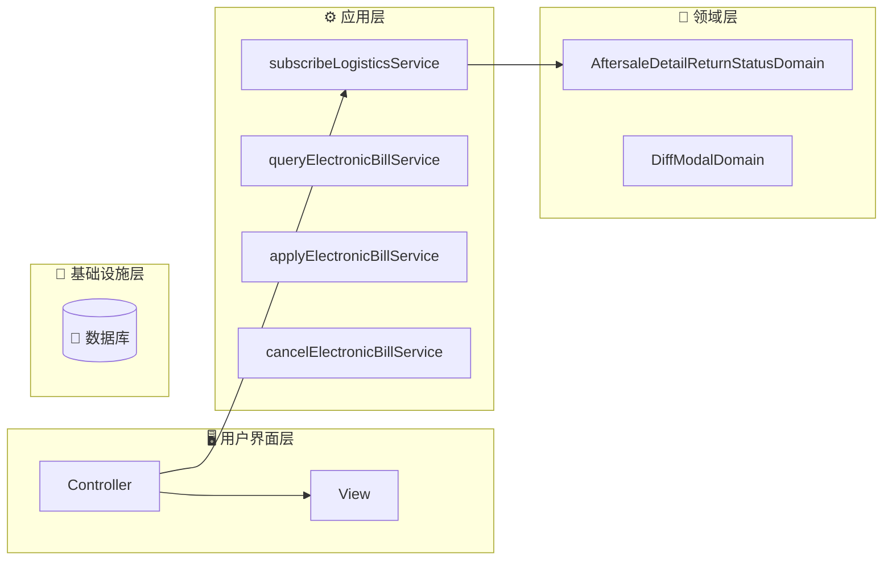
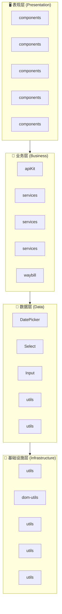
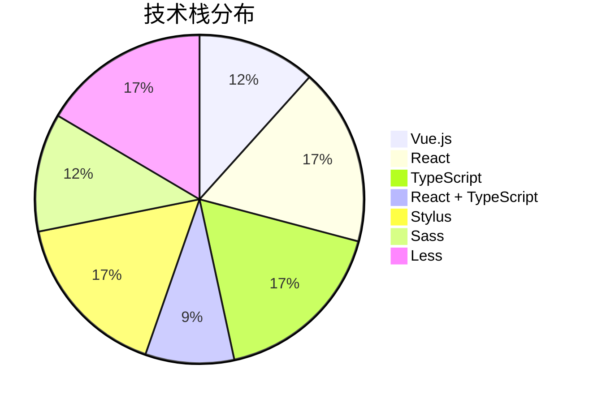

# fulfillment-aftersale-ark - Code Structure Analysis

## 📊 Project Overview
- **Project Name**: fulfillment-aftersale-ark
- **Project Type**: Vue应用
- **Technology Stack**: Vue.js, React, TypeScript, React + TypeScript, Stylus, Sass, Less
- **Architecture Pattern**: 模块化架构
- **Total Files**: 10487
- **Total Code Lines**: 202496
- **Total Entities**: 710


## 🗂️ Project Directory Structure
```
├── 📁 src/constants
│   ├── Files: 22 files
│   ├── Entities: 70 entities
│   └── Purpose: 项目目录
│
├── 📁 src/providers
│   ├── Files: 2 files
│   ├── Entities: 1 entities
│   └── Purpose: 项目目录
│
├── 📁 src/utils
│   ├── Files: 9 files
│   ├── Entities: 33 entities
│   └── Purpose: 工具函数目录
│
├── 📁 src/containers/AutoAftersale/AfterSaleDetail/constants
│   ├── Files: 2 files
│   ├── Entities: 3 entities
│   └── Purpose: React组件目录
│
├── 📁 src/containers/AutoAftersale/AfterSaleList/constants
│   ├── Files: 1 files
│   ├── Entities: 1 entities
│   └── Purpose: 项目目录
│
├── 📁 src/containers/AutoAftersale/AfterSaleDetail/providers
│   ├── Files: 5 files
│   ├── Entities: 6 entities
│   └── Purpose: 项目目录
│
├── 📁 src/containers/AutoAftersale/utils
│   ├── Files: 1 files
│   ├── Entities: 2 entities
│   └── Purpose: 工具函数目录
│
├── 📁 src/containers/AutoAftersale/hooks
│   ├── Files: 11 files
│   ├── Entities: 14 entities
│   └── Purpose: 项目目录
│
├── 📁 src/containers/AutoAftersale/AfterSaleDetail/hooks
│   ├── Files: 3 files
│   ├── Entities: 2 entities
│   └── Purpose: 项目目录
│
├── 📁 src/containers/AutoAftersale/AfterSaleList/hooks
│   ├── Files: 2 files
│   ├── Entities: 2 entities
│   └── Purpose: 项目目录
│
├── 📁 src/containers/OrderQuery/hooks
│   ├── Files: 1 files
│   ├── Entities: 1 entities
│   └── Purpose: 项目目录
│
├── 📁 src/containers/AutoAftersale/AfterSaleDetail/components
│   ├── Files: 27 files
│   ├── Entities: 27 entities
│   └── Purpose: 组件目录
│
├── 📁 src/containers/AutoAftersale/AfterSaleDetail/components/Negotiate
│   ├── Files: 15 files
│   ├── Entities: 14 entities
│   └── Purpose: Vue组件目录
│
├── 📁 src/containers/AutoAftersale/AfterSaleList/components
│   ├── Files: 14 files
│   ├── Entities: 14 entities
│   └── Purpose: 组件目录
│
├── 📁 src/containers/AutoAftersale/components/TabsLogisticsInfo
│   ├── Files: 9 files
│   ├── Entities: 9 entities
│   └── Purpose: Vue组件目录
│
├── 📁 src/containers/AutoAftersale/AfterSaleDetail/components/ActionModals
│   ├── Files: 8 files
│   ├── Entities: 8 entities
│   └── Purpose: Vue组件目录
│
├── 📁 src/containers/Assistance/components
│   ├── Files: 7 files
│   ├── Entities: 7 entities
│   └── Purpose: 组件目录
│
├── 📁 src/components/GuideLayout
│   ├── Files: 7 files
│   ├── Entities: 6 entities
│   └── Purpose: Vue组件目录
│
├── 📁 src/containers/Assistance/AssistanceMain/components
│   ├── Files: 6 files
│   ├── Entities: 6 entities
│   └── Purpose: 组件目录
│
└── 📁 src/containers/AutoAftersale/AfterSaleList/components/Metrics
    ├── Files: 6 files
    ├── Entities: 6 entities
    └── Purpose: Vue组件目录
```


---


---

## 🌐 Route Configuration Analysis

**Route Config Path**: `/Users/fangqiji/dev/aurora/packages/fulfillment/fulfillment-aftersale-ark/src/config/routes.config.ts`
**Total Routes**: 6
**Related Files**: 40
**Related Entities**: 345

### 📁 src/containers/Assistance/AssistanceMain/index.vue

#### 🎯 Route Purpose
- **Primary Role**: 页面路由入口文件
- **Route Path**: `/app-order/auto/aftersale`
- **Route Name**: `ArkAppOrderAutoAftersale`
- **Page Title**: 售后助手
- **Entities**: `Component:index_05d38588b333` (component)
- **Functional Description**: 售后助手入口组件，根据用户状态展示不同内容：首次使用时显示引导页介绍产品价值和功能，已使用过则展示策略模板和管理列表，帮助商家自动化处理售后。

#### 📦 关联文件夹

- **文件夹1: src/service**
  - `目录说明`: src/service 目录功能总结

该目录是一个API服务层，封装了与电商平台后端交互的HTTP请求接口，主要提供订单管理、物流服务、售后支持、商家权益、平台消息等核心业务功能的数据访问服务。目录中的文件按业务模块划分，基于httpBase基础请求工具构建，为上层组件提供标准化的数据获取和提交能力，是前端应用与后端系统之间的通信桥梁。

  - `文件依赖`: 依赖 service (API接口4次)；依赖 service/Shipping (API接口4次)；依赖 service/abnormalOrder (API接口4次)；依赖 service/apiKit (API接口4次)；被 containers/AutoAftersale/AfterSaleList 引用 (API接口9次)

  - `关联实体`: Function:getAssistantList_6a14d3138f18, Function:getProvinceList, Function:validateCompensateFourStatus, Function:getDecryptFlow, Function:getAgreeMent, Variable:httpBaseV2, Function:getLogisticsQuoteList, Function:getAddressList_339169923964, Function:getPaidOrderListStock, Function:getPlatformMessage, Function:getRelievedShoppingStatus, Function:postPickupOrderList, Function:getSkuInfoList, Function:uploadFile


- **文件夹2: src/utils**
  - `目录说明`: src/utils 目录功能总结

该目录是一个通用工具集合，提供了多种辅助功能，包括价格格式化、解密灰度判断、DOM事件处理、表单配置转换、NPS调查触发、API预加载、异步延时、性能埋点上报和URL验证等实用函数，这些工具函数被应用程序的其他模块复用，以简化常见操作并提高代码复用性。

  - `文件依赖`: 依赖 service (API接口1次)；依赖 service/Shipping (API接口1次)；依赖 service/abnormalOrder (API接口1次)；依赖 service/apiKit (API接口1次)；依赖 service/common (API接口1次)

  - `关联实体`: Function:toCnPrice_d5ba974e9e62, Function:isDecryptionGraySeller, Function:setElementListener_712dfa278cd2, Function:adapterConfigToDelightFormily, Function:npsTrigger, Function:preloadAfterSaleDetailApi, Function:sleep, Function:trackerCustomFmp, Function:isHttp


- **文件夹3: src/service/Shipping**
  - `目录说明`: Shipping 目录功能总结

该目录是一个API服务模块，主要负责处理订单物流配送相关的功能，包含在线寄件拆分处理和订单合并发货的接口封装，为应用提供与快递配送系统交互的服务层能力。

  - `文件依赖`: 被 containers/AutoAftersale/AfterSaleList 引用 (API接口9次)；被 service 引用 (API接口4次)；被 containers/AutoAftersale/AfterSaleDetail/components/ActionModals 引用 (API接口3次)；被 containers/AutoAftersale/AfterSaleList/components 引用 (API接口2次)；被 containers/AutoAftersale/AfterSaleDetail 引用 (API接口2次)

  - `关联实体`: Function:splitOnlineDelivery, Function:postMergeDelivery


- **文件夹4: src/service/abnormalOrder**
  - `目录说明`: abnormalOrder 目录功能总结

该目录是一个API服务模块，专门处理异常订单相关的后端交互，包括获取异常订单列表、导出异常订单文件、查询物流异常监控数据和发货异常监控数据，为系统提供全面的异常订单管理和监控功能的数据支持。

  - `文件依赖`: 被 containers/AutoAftersale/AfterSaleList 引用 (API接口9次)；被 service 引用 (API接口4次)；被 containers/AutoAftersale/AfterSaleDetail/components/ActionModals 引用 (API接口3次)；被 containers/AutoAftersale/AfterSaleList/components 引用 (API接口2次)；被 containers/AutoAftersale/AfterSaleDetail 引用 (API接口2次)

  - `关联实体`: Function:getAbnormalList, Function:startExport, Function:getLogisticsOverview, Function:getPackageOverview


- **文件夹5: src/service/apiKit**
  - `目录说明`: 该目录是一个API服务层，包含与Edith系统交互的API接口封装，主要提供售后服务管理、物流履约、仓储管理、运费险、区域报备、货品库存、物流拦截等功能的HTTP请求方法，通过GET/POST/PUT/DELETE等方式与后端服务通信，为商家提供完整的订单履约、售后处理、物流配送和仓储管理等电商核心业务功能支持。

  - `文件依赖`: 被 containers/AutoAftersale/AfterSaleList 引用 (API接口9次)；被 service 引用 (API接口4次)；被 containers/AutoAftersale/AfterSaleDetail/components/ActionModals 引用 (API接口3次)；被 containers/AutoAftersale/AfterSaleList/components 引用 (API接口2次)；被 containers/AutoAftersale/AfterSaleDetail 引用 (API接口2次)

  - `关联实体`: Function:deleteCarriageTemplate, Function:getActivityData, Function:getAfterSalesReimbursement, Function:getAfterSalesRejectReasons, Function:getAssistantRecommend, Function:getByPoNo, Function:getCargoCalculate, Function:getCarraigeInsurance, Function:getCarraigeInsuranceList_1abd4698e8e7, Function:getCarriageInsuranceForAfterSaleDetail, Function:getAssistantTemplate, Function:getCarriageInsuranceForAfterSaleList, Function:getCpList_ea0bc3c393e0, Function:getCrossBroderRepush, Function:getDeclarelistV2, Function:getDeclaredOrderPage, Function:getCargoList, Function:getDownloadCargoInventory, Function:getDownloadCargoInventorySummary, Function:getDownloadFee, Function:getExecuteRecord, Function:getExecuteSummary, Function:getFulfillmentDataPremium, Function:getPageQuery, Function:getHomePopup, Function:getListByZone, Function:getListCancelReason, Function:getListQuery, Function:getMerchantDataAbnormalStandard, Function:getMerchantDataDiagnosis, Function:getOrderCargoList, Function:getOrderDetail, Function:getLogisticStatusLogs, Function:getOrderList, Function:getCargoList_c7b78a17948e, Function:getOverDueReportReasons, Function:getProofPhotosV1, Function:getItemsQuery, Function:getQueryAssistantStrategy, Function:getQicSubscribe, Function:getQueryNegotiateSceneTemplate, Function:getQueryDecryptQuota, Function:getReturnsId, Function:getReachSellerNotify, Function:getReturnsIdList, Function:getReturnsV3, Function:getSearchCargoInventory, Function:getSearchCargoInventoryBatch, Function:getSearchCargoInventoryRecord, Function:getSearchCargoInventoryRecordSummary, Function:getSellerAddressRecords, Function:getReturnsIdV2, Function:getSellerCarriageInsuranceV2, Function:getSellerWarehouseList, Function:getStrategyId, Function:getServiceOrderSearch, Function:getSupplyProofConfig, Function:getSubscribedCpList_e8bcd62a34d2, Function:getTallyCargoList, Function:getUsedItem, Function:getWarehousePriorityList, Function:getZoneDeclarelist, Function:getZoneDeclareChangeV2, Function:postAddV2, Function:postAddV2_833089c95ccc, Function:postAgreeAutoRejectAudit, Function:postAssistantChange, Function:postAssistantCreate, Function:postArkReturnReasons, Function:postAssistantUpdate, Function:postAgreeAutoRefundAfterLogisticsBack, Function:postBatchReception, Function:postAvailableReturnsStatusList, Function:postBatchgetV2, Function:postCancelSubscribe_4e42e3af23ae, Function:postCargoCreate, Function:postCancelV2, Function:postCargoList, Function:postCargoDetail, Function:getDownloadCargoInventoryBatch, Function:postCargoUpdate, Function:postClickReception, Function:postCombineFeeList, Function:postCombineOrderList, Function:postCombineQuote, Function:postCombineRecordList, Function:postCombineSubscribe, Function:postCreateNegotiate, Function:postCreateStrategy, Function:postDelayHandle, Function:postDetailV2, Function:postDirectRefund, Function:postFreightInsuranceSwitch, Function:postGetBySceneKeys, Function:postRuleQuery, Function:postRuleUpdate, Function:postProductSubscribe, Function:postGrayMerchantQuery_519c5071927f, Function:postGiftAftersaleInfo, Function:postCargoPrecheck, Function:postLadingCreate, Function:postInboundCreate, Function:postLogisticBackRefund, Function:postLogisticInterceptCreate, Function:postLogisticInterceptValidate, Function:postSubscribeDelete, Function:postManageConfirm, Function:postMultiSubscribe_b901d1907c5d, Function:postOrderDeliveringApi, Function:postOrderDetail, Function:postOrderDetails, Function:postOrderList_a619687ad1fc, Function:postCargoPrecheck_b5950e1c3cd3, Function:postOrderPage, Function:postOutboundCreate, Function:postParseAddress, Function:postPageV2, Function:postPreCheckBeforeDelivery, Function:postQicPage, Function:postQueryVas, Function:postReceptionDelay_09ceeb3a8c44, Function:postReceptionReject, Function:postRejectWarningCheck, Function:postRejectWithDialog, Function:postReturnSellerRejectGuidanceList, Function:postReturnsId, Function:postSellerAddressRecords, Function:postSellerBehaviorSuggestion, Function:postSellerWarehouseCreate, Function:postSellerWarehouseUpdate, Function:postAddV2_7bbdaf3ad3d4, Function:postStartAsync, Function:postStartExport, Function:postSupplyProof, Function:postTallyConfirm, Function:postUpdateAddress, Function:postUpdateCombine, Function:postUpdateNegotiate, Function:postUpdateV2, Function:postUpdateStrategy, Function:postUpdateV2_06aa155cc3a5, Function:postWarehouseCoverageUpdate, Function:postWarehousePriorityCreate, Function:postWarehousePriorityDelete, Function:postWarehousePriorityUpdate, Function:postWatchAsync, Function:postWatchExport, Function:putSellerAddressRecords


- **文件夹6: src/service/common**
  - `目录说明`: src/service/common 目录功能总结

该目录作为API服务层，主要提供文件导出相关的后端交互功能，通过fileExport.ts中的startExport函数封装了文件导出请求的发送逻辑，使应用能够基于指定数据源和条件参数发起异步导出任务并获取任务标识。

  - `文件依赖`: 被 containers/AutoAftersale/AfterSaleList 引用 (API接口9次)；被 service 引用 (API接口4次)；被 containers/AutoAftersale/AfterSaleDetail/components/ActionModals 引用 (API接口3次)；被 containers/AutoAftersale/AfterSaleList/components 引用 (API接口2次)；被 containers/AutoAftersale/AfterSaleDetail 引用 (API接口2次)

  - `关联实体`: Function:startExport_7404a324e471


- **文件夹7: src/service/multiAddressReturn**
  - `目录说明`: 目录功能总结**：该目录提供多地址退货管理的API服务，包含查询退货地址策略列表、获取策略详情、查询绑定商品列表以及删除策略等功能，支持商家配置和管理不同商品的退货地址策略。

  - `文件依赖`: 被 containers/AutoAftersale/AfterSaleList 引用 (API接口9次)；被 service 引用 (API接口4次)；被 containers/AutoAftersale/AfterSaleDetail/components/ActionModals 引用 (API接口3次)；被 containers/AutoAftersale/AfterSaleList/components 引用 (API接口2次)；被 containers/AutoAftersale/AfterSaleDetail 引用 (API接口2次)

  - `关联实体`: Function:getMultiAddressReturnList, Function:getMultiAddressReturnSkuList, Function:getStrategyItem, Function:postStrategyDelete


- **文件夹8: src/service/overseaDirectMail**
  - `目录说明`: 该目录提供海外直邮装载单管理的API服务，包含查询装载单列表及明细、上传装载单文件、发货处理和删除装载单等功能，支持商家通过各种参数进行装载单的全生命周期管理操作。

  - `文件依赖`: 被 containers/AutoAftersale/AfterSaleList 引用 (API接口9次)；被 service 引用 (API接口4次)；被 containers/AutoAftersale/AfterSaleDetail/components/ActionModals 引用 (API接口3次)；被 containers/AutoAftersale/AfterSaleList/components 引用 (API接口2次)；被 containers/AutoAftersale/AfterSaleDetail 引用 (API接口2次)

  - `关联实体`: Function:getLoadingDetail, Function:getLoadingPage, Function:removeLoading, Function:shipLoading, Function:uploadLoading


- **文件夹9: src/service/reportManagement**
  - `目录说明`: 目录功能总结

该目录提供报备管理相关的API服务接口，主要负责订单列表数据获取、报表导出任务的创建和进度监控，支持系统中报表数据的查询、筛选和导出功能，是报备管理模块的后端数据交互层。

  - `文件依赖`: 被 containers/AutoAftersale/AfterSaleList 引用 (API接口9次)；被 service 引用 (API接口4次)；被 containers/AutoAftersale/AfterSaleDetail/components/ActionModals 引用 (API接口3次)；被 containers/AutoAftersale/AfterSaleList/components 引用 (API接口2次)；被 containers/AutoAftersale/AfterSaleDetail 引用 (API接口2次)

  - `关联实体`: Function:postReportAddOrderList, Function:postReportWatchExport, Function:postReportStartExport


- **文件夹10: src/service/waybill**
  - `目录说明`: 目录功能总结：src/service/waybill

该目录是一个API服务模块，专门提供电子面单相关的后端交互功能，包括面单模板的创建、查询、更新和删除，快递公司及网点信息查询，物流合作伙伴订阅与取消，账户余额查询，以及电子面单使用记录获取等功能。这些服务支持商家在电商平台上管理和使用电子面单，实现物流订单处理的自动化和标准化。

  - `文件依赖`: 被 containers/AutoAftersale/AfterSaleList 引用 (API接口9次)；被 service 引用 (API接口4次)；被 containers/AutoAftersale/AfterSaleDetail/components/ActionModals 引用 (API接口3次)；被 containers/AutoAftersale/AfterSaleList/components 引用 (API接口2次)；被 containers/AutoAftersale/AfterSaleDetail 引用 (API接口2次)

  - `关联实体`: Function:queryCustomerCodeValid, Function:createTemplate, Function:deleteTemplate, Function:cancelPartnerSubscribe, Function:deliveryBranch, Function:queryElectronicBillService, Function:electronicBillList, Function:postPartnerSubscribe, Function:queryAccountInfo, Function:getAccountBalanceList, Function:queryAppliedPartnerList, Function:queryTemplateConfig, Function:queryTemplateList, Function:queryDeliveryCompany, Function:queryTemplateListGroup, Function:updateTemplate


- **文件夹11: src/service/waybillDispatch**
  - `目录说明`: 目录功能总结：src/service/waybillDispatch

该目录是一个API服务模块，专门处理电子面单和物流发货相关的网络请求，提供运单的创建、打印、查询、取消和管理功能，包括普通打印、合并打印、分离打印、重新打印、运单查询、可合并运单查询、手动添加运单等操作，支持不同账户类型和多种筛选条件，是系统中负责物流运单全生命周期管理的核心服务层。

  - `文件依赖`: 被 containers/AutoAftersale/AfterSaleList 引用 (API接口9次)；被 service 引用 (API接口4次)；被 containers/AutoAftersale/AfterSaleDetail/components/ActionModals 引用 (API接口3次)；被 containers/AutoAftersale/AfterSaleList/components 引用 (API接口2次)；被 containers/AutoAftersale/AfterSaleDetail 引用 (API接口2次)

  - `关联实体`: Function:cancelWaybill, Function:postAddManualOrder, Function:printMerge, Function:printOrder, Function:printSeparate, Function:queryPlainUserInfo, Function:queryWaybillList, Function:queryWaybillMergeableList, Function:queryWaybillWorkIds, Function:reprintWaybill, Function:workOrderSend


- **文件夹12: src/containers/AutoAftersale/utils**
  - `目录说明`: 目录功能总结**：

该目录是一个工具类集合，主要提供自动售后系统中的用户体验评估功能，包含触发NPS(净推荐值)满意度调查问卷的工具函数，用于在适当时机收集用户对售后服务的反馈。

  - `文件依赖`: 暂无明确依赖关系

  - `关联实体`: Function:triggerAftersaleNps


- **文件夹13: src/containers/Assistance/AssistanceMain/components**
  - `目录说明`: 该目录包含售后助手系统的UI组件集合，主要负责售后策略管理界面的展示，包括策略列表管理、模板展示与选择、数据指标统计、策略详情查看及执行情况追踪等功能，这些组件共同构成了售后助手的主要交互界面，使商家能够高效创建、管理和监控自动化售后处理策略。

  - `文件依赖`: 依赖 service (API接口1次)；依赖 service/Shipping (API接口1次)；依赖 service/abnormalOrder (API接口1次)；依赖 service/apiKit (API接口1次)；依赖 service/common (API接口1次)

  - `关联实体`: Component:AssistanceStrategyListPane, Component:AssistanceTemplateCard, Component:AssistanceTemplatesPane, Component:Metrics, Component:StrategyDetailDrawer, Component:StrategyExecuteInfoDrawer


- **文件夹14: src/containers/Assistance**
  - `目录说明`: 售后助手策略配置模块，提供创建和编辑售后自动化策略的界面组件，包含表单配置、参数验证和模板选择功能，同时展示售后助手的核心产品价值点（降低纠纷、高效审核、提升流量和全天服务），帮助商家配置自动化售后处理流程。

  - `文件依赖`: 暂无明确依赖关系

  - `关联实体`: Component:CreateAssistance, Variable:productValuesConfig


- **文件夹15: src/containers/Assistance/components**
  - `目录说明`: 该目录包含辅助服务(Assistance)相关的表单UI组件集合，主要提供各类专用输入控件，包括时间选择、数字输入、金额处理、原因选择、工作时间段设置和物流状态选择等，这些组件都基于Formily框架开发，支持表单验证和数据转换，专门用于辅助服务模块中各种表单场景的数据录入和展示需求。

  - `文件依赖`: 暂无明确依赖关系

  - `关联实体`: Component:ApplyTime, Component:FormText, Component:InputNumber, Component:InputNumberFen, Component:ReasonSelect, Component:WorkTimePeriod, Component:ReturnLogisticStatus


- **文件夹16: src/containers/AutoAftersale/AfterSaleList/components**
  - `目录说明`: 该目录包含售后服务管理系统的UI组件集合，主要负责售后列表页面的各个功能区块展示，包括售后状态展示、商品审核、物流信息管理、订单信息展示、价格展示、操作按钮、地址选择等界面元素，以及相关的模态框组件，共同构成了商家处理售后申请的完整交互界面，支持售后流程中的审核、退款、物流跟踪等核心业务操作。

  - `文件依赖`: 依赖 service (API接口2次)；依赖 service/Shipping (API接口2次)；依赖 service/abnormalOrder (API接口2次)；依赖 service/apiKit (API接口2次)；依赖 service/common (API接口2次)

  - `关联实体`: Component:AfterSaleListBanner, Component:AftersaleStatus, Component:AuditGoods, Component:AuditModal, Component:EditExpressOrderModal, Component:ExcelOperaCell, Component:Logistics_64e2529721b4, Component:OrderInfoCell, Component:OtherTimeCell_b21e90ff37eb, Component:PriceCell, Component:ReceiveModal, Component:SelectArea, Component:TabUpBanner, Component:PackageInfo


- **文件夹17: src/containers/AutoAftersale/AfterSaleList/components/Metrics**
  - `目录说明`: Metrics 目录功能总结

该目录提供售后服务数据指标展示相关的UI组件和辅助功能，包含售后指标数据展示、数据诊断警报、售后指南弹窗等组件，以及指标颜色计算和新手引导等辅助功能，旨在帮助商家直观了解售后服务表现、同行对比数据和改进建议，提升售后服务质量。

  - `文件依赖`: 依赖 service (API接口1次)；依赖 service/Shipping (API接口1次)；依赖 service/abnormalOrder (API接口1次)；依赖 service/apiKit (API接口1次)；依赖 service/common (API接口1次)

  - `关联实体`: Component:AfterSaleGuide, Component:DiagnosisAlert, Component:MetricsSimple, Component:index_8ca4db163aed, Component:useGuide, Function:useMetricColor


- **文件夹18: src/containers/AutoAftersale/AfterSaleList/components/Metrics/PeerCompare**
  - `目录说明`: PeerCompare 目录功能总结

该目录提供售后服务同行数据对比的UI组件，通过进度条可视化展示用户指标超越同行的百分比和行业均值，支持不同数值格式化类型和自定义样式，帮助用户直观了解自身售后服务在行业中的相对表现水平。

  - `文件依赖`: 暂无明确依赖关系

  - `关联实体`: Component:index_17e3ccd8e698, Component:Progress


- **文件夹19: src/containers/AutoAftersale/AfterSaleDetail/components**
  - `目录说明`: 该目录包含售后详情页面的UI组件集合，主要负责展示和操作售后服务的各个方面，包括售后基本信息、协商记录、物流信息、订单信息、换货详情、纠纷处理、地址选择等功能模块，同时提供状态操作、步骤展示和面板布局等通用组件，支持售后流程中的各种交互场景，如退款、退货、换货、协商和纠纷处理等，部分组件有V2版本表示迭代更新。

  - `文件依赖`: 依赖 service (API接口1次)；依赖 service/Shipping (API接口1次)；依赖 service/abnormalOrder (API接口1次)；依赖 service/apiKit (API接口1次)；依赖 service/common (API接口1次)

  - `关联实体`: Component:AddressSelector, Component:AfterSaleInfoV2, Component:AfterSaleNegotiateInfo, Component:AfterSaleInfo, Component:AfterSaleNegotiateInfoV2, Component:ArbitratePanel, Component:ArbitrateProofDrawer, Component:ArbitrateRecordsDrawer, Component:BasicPanel, Component:ExchangeInfo, Component:ExchangeInfoV2, Component:ExtraInfo, Component:ArbitratePanelV2, Component:LogisticsInfo, Component:LogisticsInfoV2, Component:NegotiateRecordV2, Component:NegotiateRecord, Component:OrderInfoV2, Component:OrderInfo, Component:PakckageWidthLogisticsV2, Component:PakckageWidthLogistics, Component:PanelHeader, Component:PickupOrderInfo, Component:StatusOperateV2, Component:SellerMessagePanel, Component:Step, Component:StatusOperate


- **文件夹20: src/containers/AutoAftersale/AfterSaleDetail/components/ActionModals**
  - `目录说明`: ActionModals 目录功能总结

该目录包含售后管理系统中的各类交互模态框和抽屉组件，负责处理售后流程中的关键操作界面，包括预检查提示、操作确认、退款处理、物流信息编辑、拒绝理由选择、留言沟通等功能。这些UI组件支持不同售后场景下的商家决策流程，提供表单验证、数据提交和状态反馈，构成了售后处理流程中的核心交互界面层。

  - `文件依赖`: 依赖 service (API接口3次)；依赖 service/Shipping (API接口3次)；依赖 service/abnormalOrder (API接口3次)；依赖 service/apiKit (API接口3次)；依赖 service/common (API接口3次)

  - `关联实体`: Component:CommonPreCheckModal, Component:ConfirmModal, Component:EditExpressModal, Component:MessageDrawer, Component:RefundModal, Component:RefuseDrawer, Component:RefuseModal, Component:ReturnExchangeModal


- **文件夹21: src/containers/AutoAftersale/AfterSaleDetail/components/Banners**
  - `目录说明`: Banners 目录功能总结

该目录包含售后详情页面中使用的横幅提示UI组件，主要负责在售后处理流程中展示各类操作建议、警告和提示信息。组件支持动态解析文本内容，并根据不同场景提供差异化的视觉样式，为用户提供售后处理过程中的指导和重要信息展示。

  - `文件依赖`: 暂无明确依赖关系

  - `关联实体`: Component:HandlingSuggestionsBanner, Component:HandlingSuggestionsBannerV2, Component:RefuseModalDamageBanner


- **文件夹22: src/containers/AutoAftersale/AfterSaleDetail/components/BlockSelector**
  - `目录说明`: BlockSelector 目录功能总结

该目录提供了一个售后详情页面中的块选择器UI组件，实现平铺式选项卡的单选功能，用于售后场景中的选项选择，通过事件机制与父组件进行数据交互。

  - `文件依赖`: 暂无明确依赖关系

  - `关联实体`: Component:index_0f42e96162f3


- **文件夹23: src/containers/AutoAftersale/AfterSaleDetail/components/CopywritingAdapter**
  - `目录说明`: CopywritingAdapter 目录功能总结

该目录提供了一个富文本适配器UI组件，负责智能识别并渲染不同类型的内容数据，支持纯文本直接显示和富文本对象的结构化渲染（如文本、链接、换行等元素），为售后详情页面提供灵活的文本展示能力。

  - `文件依赖`: 暂无明确依赖关系

  - `关联实体`: Component:index_4a6f4b9a4dc7


- **文件夹24: src/containers/AutoAftersale/AfterSaleDetail/components/FreightCompensation**
  - `目录说明`: 目录功能总结

该目录包含售后系统中运费补偿相关的UI组件，主要负责展示和管理售后单的运费宝服务信息和运费报销扣款数据，包括服务状态、补贴金额、报销凭证等内容，并提供运费宝服务的推广和开通入口，帮助商家降低运费成本，是售后详情页面中处理运费补偿业务的功能模块。

  - `文件依赖`: 依赖 service (API接口1次)；依赖 service/Shipping (API接口1次)；依赖 service/abnormalOrder (API接口1次)；依赖 service/apiKit (API接口1次)；依赖 service/common (API接口1次)

  - `关联实体`: Component:CompensationCost, Component:FreightInfo, Component:index_1133c9aa5f3c


- **文件夹25: src/containers/AutoAftersale/AfterSaleDetail/components/FreightCompensationV2**
  - `目录说明`: 目录功能总结**：

该目录包含售后详情中运费补偿相关的UI组件集合，主要负责展示运费宝服务信息、运费报销扣款情况及相关数据，同时提供运费宝服务开通推荐功能，帮助商家了解运费补偿状态并优化经营成本。

  - `文件依赖`: 依赖 service (API接口1次)；依赖 service/Shipping (API接口1次)；依赖 service/abnormalOrder (API接口1次)；依赖 service/apiKit (API接口1次)；依赖 service/common (API接口1次)

  - `关联实体`: Component:index_8e65b8619cf5, Component:CompensationCost_bd916664f41e, Component:FreightInfo_60a2f188bb0a


- **文件夹26: src/containers/AutoAftersale/AfterSaleDetail/components/GiveawaysModal**
  - `目录说明`: 这是一个售后赠品关联展示UI组件目录，负责在售后详情页中以模态框形式展示主品与赠品售后单的关联信息，包括商品信息、价格数量展示以及查看详情等操作功能，帮助用户了解主赠品售后单之间的关系。

  - `文件依赖`: 暂无明确依赖关系

  - `关联实体`: Component:index_fbe52b1cb6bc


- **文件夹27: src/containers/AutoAftersale/AfterSaleDetail/components/Negotiate**
  - `目录说明`: Negotiate 目录功能总结

该目录包含售后协商流程的UI组件集合，主要负责售后协商方案的创建、编辑和预览功能。组件涵盖了协商过程中的各类表单元素（地址选择、原因选择、类型选择、退款金额输入、延期设置等）、协商规则展示、方案预览，以及整体协商抽屉界面。这些组件共同构成了完整的售后协商交互界面，支持商家与消费者进行售后问题的沟通和解决方案制定，并集成了数据埋点追踪功能。

  - `文件依赖`: 暂无明确依赖关系

  - `关联实体`: Component:AftersaleAddress, Component:AftersaleReason, Component:AftersaleStatus_0d6708d07ff2, Component:AftersaleType, Component:DynamicFormItem, Component:DelayInput, Component:NegotiateForm, Component:NegotiateDesc, Component:RichRadioGroup, Component:RefundInput, Component:index_4b3d81e93a50, Component:RuleBanner, Component:TiledSelector, Component:SwiperPreview


- **文件夹28: src/containers/AutoAftersale/AfterSaleDetail/components/ActionModals/ProofDrawer**
  - `目录说明`: 目录功能总结

该目录包含售后系统中的举证相关抽屉组件集合，主要负责商家与买家之间的沟通凭证提交功能，包括留言发送、申诉理由说明、图片和文件上传等功能，支持表单验证和数据提交，是售后流程中用于证明、沟通和申诉的UI交互组件模块。

  - `文件依赖`: 依赖 service (API接口1次)；依赖 service/Shipping (API接口1次)；依赖 service/abnormalOrder (API接口1次)；依赖 service/apiKit (API接口1次)；依赖 service/common (API接口1次)

  - `关联实体`: Component:MessageDrawer_1fb2aa375755, Component:ProofInfo, Component:index_725f8711dd42


- **文件夹29: src/containers/MicroRemittance/components**
  - `目录说明`: 该目录包含小额打款管理相关的UI组件，主要提供打款记录的查询、展示、筛选和操作功能，是微型汇款(MicroRemittance)模块的界面呈现层，负责打款流程的用户交互和状态展示。

  - `文件依赖`: 暂无明确依赖关系

  - `关联实体`: Component:Remittance


- **文件夹30: src/containers/MicroRemittance/components/Search**
  - `目录说明`: 目录功能总结

该目录提供微汇款系统的搜索功能组件集合，包含一个动态表单元数据渲染组件和一个自适应搜索表单组件，共同构成可配置、响应式的查询界面，支持多种表单控件类型、布局自适应和展开收起功能，为系统提供统一的数据筛选和查询入口。

  - `文件依赖`: 暂无明确依赖关系

  - `关联实体`: Component:form-meta, Component:search


---

### 📁 src/containers/Assistance/CreateAssistance.vue

#### 🎯 Route Purpose
- **Primary Role**: 页面路由入口文件
- **Route Path**: `/app-order/auto/aftersale/add`
- **Route Name**: `ArkAppOrderAutoAftersaleAdd`
- **Page Title**: 售后助手 - 新建策略
- **Entities**: `Component:CreateAssistance` (component)
- **Functional Description**: 售后助手策略创建/编辑组件，用于配置售后类型、订单状态、执行操作等参数，支持表单验证和数据提交，提供策略模板选择和参数配置功能。

#### 📦 关联文件夹

- **文件夹1: src/containers/Assistance/AssistanceMain**
  - `目录说明`: 目录功能总结

该目录实现了售后助手的路由组件，包含入口组件(index.vue)、引导页组件(AssistanceGuide.vue)和主界面组件(Main.vue)，负责根据用户使用状态展示不同内容：首次使用时显示产品价值和功能介绍，已使用过则展示数据指标、策略模板和策略管理功能，整体目的是帮助商家通过自动化策略提升售后处理效率。

  - `文件依赖`: 暂无明确依赖关系

  - `关联实体`: Component:index_05d38588b333, Component:AssistanceGuide, Component:Main


- **文件夹2: src/service**
  - `目录说明`: src/service 目录功能总结

该目录是一个API服务层，封装了与电商平台后端交互的HTTP请求接口，主要提供订单管理、物流服务、售后支持、商家权益、平台消息等核心业务功能的数据访问服务。目录中的文件按业务模块划分，基于httpBase基础请求工具构建，为上层组件提供标准化的数据获取和提交能力，是前端应用与后端系统之间的通信桥梁。

  - `文件依赖`: 依赖 service (API接口4次)；依赖 service/Shipping (API接口4次)；依赖 service/abnormalOrder (API接口4次)；依赖 service/apiKit (API接口4次)；被 containers/AutoAftersale/AfterSaleList 引用 (API接口9次)

  - `关联实体`: Function:getAssistantList_6a14d3138f18, Function:getProvinceList, Function:validateCompensateFourStatus, Function:getDecryptFlow, Function:getAgreeMent, Variable:httpBaseV2, Function:getLogisticsQuoteList, Function:getAddressList_339169923964, Function:getPaidOrderListStock, Function:getPlatformMessage, Function:getRelievedShoppingStatus, Function:postPickupOrderList, Function:getSkuInfoList, Function:uploadFile


- **文件夹3: src/utils**
  - `目录说明`: src/utils 目录功能总结

该目录是一个通用工具集合，提供了多种辅助功能，包括价格格式化、解密灰度判断、DOM事件处理、表单配置转换、NPS调查触发、API预加载、异步延时、性能埋点上报和URL验证等实用函数，这些工具函数被应用程序的其他模块复用，以简化常见操作并提高代码复用性。

  - `文件依赖`: 依赖 service (API接口1次)；依赖 service/Shipping (API接口1次)；依赖 service/abnormalOrder (API接口1次)；依赖 service/apiKit (API接口1次)；依赖 service/common (API接口1次)

  - `关联实体`: Function:toCnPrice_d5ba974e9e62, Function:isDecryptionGraySeller, Function:setElementListener_712dfa278cd2, Function:adapterConfigToDelightFormily, Function:npsTrigger, Function:preloadAfterSaleDetailApi, Function:sleep, Function:trackerCustomFmp, Function:isHttp


- **文件夹4: src/service/Shipping**
  - `目录说明`: Shipping 目录功能总结

该目录是一个API服务模块，主要负责处理订单物流配送相关的功能，包含在线寄件拆分处理和订单合并发货的接口封装，为应用提供与快递配送系统交互的服务层能力。

  - `文件依赖`: 被 containers/AutoAftersale/AfterSaleList 引用 (API接口9次)；被 service 引用 (API接口4次)；被 containers/AutoAftersale/AfterSaleDetail/components/ActionModals 引用 (API接口3次)；被 containers/AutoAftersale/AfterSaleList/components 引用 (API接口2次)；被 containers/AutoAftersale/AfterSaleDetail 引用 (API接口2次)

  - `关联实体`: Function:splitOnlineDelivery, Function:postMergeDelivery


- **文件夹5: src/service/abnormalOrder**
  - `目录说明`: abnormalOrder 目录功能总结

该目录是一个API服务模块，专门处理异常订单相关的后端交互，包括获取异常订单列表、导出异常订单文件、查询物流异常监控数据和发货异常监控数据，为系统提供全面的异常订单管理和监控功能的数据支持。

  - `文件依赖`: 被 containers/AutoAftersale/AfterSaleList 引用 (API接口9次)；被 service 引用 (API接口4次)；被 containers/AutoAftersale/AfterSaleDetail/components/ActionModals 引用 (API接口3次)；被 containers/AutoAftersale/AfterSaleList/components 引用 (API接口2次)；被 containers/AutoAftersale/AfterSaleDetail 引用 (API接口2次)

  - `关联实体`: Function:getAbnormalList, Function:startExport, Function:getLogisticsOverview, Function:getPackageOverview


- **文件夹6: src/service/apiKit**
  - `目录说明`: 该目录是一个API服务层，包含与Edith系统交互的API接口封装，主要提供售后服务管理、物流履约、仓储管理、运费险、区域报备、货品库存、物流拦截等功能的HTTP请求方法，通过GET/POST/PUT/DELETE等方式与后端服务通信，为商家提供完整的订单履约、售后处理、物流配送和仓储管理等电商核心业务功能支持。

  - `文件依赖`: 被 containers/AutoAftersale/AfterSaleList 引用 (API接口9次)；被 service 引用 (API接口4次)；被 containers/AutoAftersale/AfterSaleDetail/components/ActionModals 引用 (API接口3次)；被 containers/AutoAftersale/AfterSaleList/components 引用 (API接口2次)；被 containers/AutoAftersale/AfterSaleDetail 引用 (API接口2次)

  - `关联实体`: Function:deleteCarriageTemplate, Function:getActivityData, Function:getAfterSalesReimbursement, Function:getAfterSalesRejectReasons, Function:getAssistantRecommend, Function:getByPoNo, Function:getCargoCalculate, Function:getCarraigeInsurance, Function:getCarraigeInsuranceList_1abd4698e8e7, Function:getCarriageInsuranceForAfterSaleDetail, Function:getAssistantTemplate, Function:getCarriageInsuranceForAfterSaleList, Function:getCpList_ea0bc3c393e0, Function:getCrossBroderRepush, Function:getDeclarelistV2, Function:getDeclaredOrderPage, Function:getCargoList, Function:getDownloadCargoInventory, Function:getDownloadCargoInventorySummary, Function:getDownloadFee, Function:getExecuteRecord, Function:getExecuteSummary, Function:getFulfillmentDataPremium, Function:getPageQuery, Function:getHomePopup, Function:getListByZone, Function:getListCancelReason, Function:getListQuery, Function:getMerchantDataAbnormalStandard, Function:getMerchantDataDiagnosis, Function:getOrderCargoList, Function:getOrderDetail, Function:getLogisticStatusLogs, Function:getOrderList, Function:getCargoList_c7b78a17948e, Function:getOverDueReportReasons, Function:getProofPhotosV1, Function:getItemsQuery, Function:getQueryAssistantStrategy, Function:getQicSubscribe, Function:getQueryNegotiateSceneTemplate, Function:getQueryDecryptQuota, Function:getReturnsId, Function:getReachSellerNotify, Function:getReturnsIdList, Function:getReturnsV3, Function:getSearchCargoInventory, Function:getSearchCargoInventoryBatch, Function:getSearchCargoInventoryRecord, Function:getSearchCargoInventoryRecordSummary, Function:getSellerAddressRecords, Function:getReturnsIdV2, Function:getSellerCarriageInsuranceV2, Function:getSellerWarehouseList, Function:getStrategyId, Function:getServiceOrderSearch, Function:getSupplyProofConfig, Function:getSubscribedCpList_e8bcd62a34d2, Function:getTallyCargoList, Function:getUsedItem, Function:getWarehousePriorityList, Function:getZoneDeclarelist, Function:getZoneDeclareChangeV2, Function:postAddV2, Function:postAddV2_833089c95ccc, Function:postAgreeAutoRejectAudit, Function:postAssistantChange, Function:postAssistantCreate, Function:postArkReturnReasons, Function:postAssistantUpdate, Function:postAgreeAutoRefundAfterLogisticsBack, Function:postBatchReception, Function:postAvailableReturnsStatusList, Function:postBatchgetV2, Function:postCancelSubscribe_4e42e3af23ae, Function:postCargoCreate, Function:postCancelV2, Function:postCargoList, Function:postCargoDetail, Function:getDownloadCargoInventoryBatch, Function:postCargoUpdate, Function:postClickReception, Function:postCombineFeeList, Function:postCombineOrderList, Function:postCombineQuote, Function:postCombineRecordList, Function:postCombineSubscribe, Function:postCreateNegotiate, Function:postCreateStrategy, Function:postDelayHandle, Function:postDetailV2, Function:postDirectRefund, Function:postFreightInsuranceSwitch, Function:postGetBySceneKeys, Function:postRuleQuery, Function:postRuleUpdate, Function:postProductSubscribe, Function:postGrayMerchantQuery_519c5071927f, Function:postGiftAftersaleInfo, Function:postCargoPrecheck, Function:postLadingCreate, Function:postInboundCreate, Function:postLogisticBackRefund, Function:postLogisticInterceptCreate, Function:postLogisticInterceptValidate, Function:postSubscribeDelete, Function:postManageConfirm, Function:postMultiSubscribe_b901d1907c5d, Function:postOrderDeliveringApi, Function:postOrderDetail, Function:postOrderDetails, Function:postOrderList_a619687ad1fc, Function:postCargoPrecheck_b5950e1c3cd3, Function:postOrderPage, Function:postOutboundCreate, Function:postParseAddress, Function:postPageV2, Function:postPreCheckBeforeDelivery, Function:postQicPage, Function:postQueryVas, Function:postReceptionDelay_09ceeb3a8c44, Function:postReceptionReject, Function:postRejectWarningCheck, Function:postRejectWithDialog, Function:postReturnSellerRejectGuidanceList, Function:postReturnsId, Function:postSellerAddressRecords, Function:postSellerBehaviorSuggestion, Function:postSellerWarehouseCreate, Function:postSellerWarehouseUpdate, Function:postAddV2_7bbdaf3ad3d4, Function:postStartAsync, Function:postStartExport, Function:postSupplyProof, Function:postTallyConfirm, Function:postUpdateAddress, Function:postUpdateCombine, Function:postUpdateNegotiate, Function:postUpdateV2, Function:postUpdateStrategy, Function:postUpdateV2_06aa155cc3a5, Function:postWarehouseCoverageUpdate, Function:postWarehousePriorityCreate, Function:postWarehousePriorityDelete, Function:postWarehousePriorityUpdate, Function:postWatchAsync, Function:postWatchExport, Function:putSellerAddressRecords


- **文件夹7: src/service/common**
  - `目录说明`: src/service/common 目录功能总结

该目录作为API服务层，主要提供文件导出相关的后端交互功能，通过fileExport.ts中的startExport函数封装了文件导出请求的发送逻辑，使应用能够基于指定数据源和条件参数发起异步导出任务并获取任务标识。

  - `文件依赖`: 被 containers/AutoAftersale/AfterSaleList 引用 (API接口9次)；被 service 引用 (API接口4次)；被 containers/AutoAftersale/AfterSaleDetail/components/ActionModals 引用 (API接口3次)；被 containers/AutoAftersale/AfterSaleList/components 引用 (API接口2次)；被 containers/AutoAftersale/AfterSaleDetail 引用 (API接口2次)

  - `关联实体`: Function:startExport_7404a324e471


- **文件夹8: src/service/multiAddressReturn**
  - `目录说明`: 目录功能总结**：该目录提供多地址退货管理的API服务，包含查询退货地址策略列表、获取策略详情、查询绑定商品列表以及删除策略等功能，支持商家配置和管理不同商品的退货地址策略。

  - `文件依赖`: 被 containers/AutoAftersale/AfterSaleList 引用 (API接口9次)；被 service 引用 (API接口4次)；被 containers/AutoAftersale/AfterSaleDetail/components/ActionModals 引用 (API接口3次)；被 containers/AutoAftersale/AfterSaleList/components 引用 (API接口2次)；被 containers/AutoAftersale/AfterSaleDetail 引用 (API接口2次)

  - `关联实体`: Function:getMultiAddressReturnList, Function:getMultiAddressReturnSkuList, Function:getStrategyItem, Function:postStrategyDelete


- **文件夹9: src/service/overseaDirectMail**
  - `目录说明`: 该目录提供海外直邮装载单管理的API服务，包含查询装载单列表及明细、上传装载单文件、发货处理和删除装载单等功能，支持商家通过各种参数进行装载单的全生命周期管理操作。

  - `文件依赖`: 被 containers/AutoAftersale/AfterSaleList 引用 (API接口9次)；被 service 引用 (API接口4次)；被 containers/AutoAftersale/AfterSaleDetail/components/ActionModals 引用 (API接口3次)；被 containers/AutoAftersale/AfterSaleList/components 引用 (API接口2次)；被 containers/AutoAftersale/AfterSaleDetail 引用 (API接口2次)

  - `关联实体`: Function:getLoadingDetail, Function:getLoadingPage, Function:removeLoading, Function:shipLoading, Function:uploadLoading


- **文件夹10: src/service/reportManagement**
  - `目录说明`: 目录功能总结

该目录提供报备管理相关的API服务接口，主要负责订单列表数据获取、报表导出任务的创建和进度监控，支持系统中报表数据的查询、筛选和导出功能，是报备管理模块的后端数据交互层。

  - `文件依赖`: 被 containers/AutoAftersale/AfterSaleList 引用 (API接口9次)；被 service 引用 (API接口4次)；被 containers/AutoAftersale/AfterSaleDetail/components/ActionModals 引用 (API接口3次)；被 containers/AutoAftersale/AfterSaleList/components 引用 (API接口2次)；被 containers/AutoAftersale/AfterSaleDetail 引用 (API接口2次)

  - `关联实体`: Function:postReportAddOrderList, Function:postReportWatchExport, Function:postReportStartExport


- **文件夹11: src/service/waybill**
  - `目录说明`: 目录功能总结：src/service/waybill

该目录是一个API服务模块，专门提供电子面单相关的后端交互功能，包括面单模板的创建、查询、更新和删除，快递公司及网点信息查询，物流合作伙伴订阅与取消，账户余额查询，以及电子面单使用记录获取等功能。这些服务支持商家在电商平台上管理和使用电子面单，实现物流订单处理的自动化和标准化。

  - `文件依赖`: 被 containers/AutoAftersale/AfterSaleList 引用 (API接口9次)；被 service 引用 (API接口4次)；被 containers/AutoAftersale/AfterSaleDetail/components/ActionModals 引用 (API接口3次)；被 containers/AutoAftersale/AfterSaleList/components 引用 (API接口2次)；被 containers/AutoAftersale/AfterSaleDetail 引用 (API接口2次)

  - `关联实体`: Function:queryCustomerCodeValid, Function:createTemplate, Function:deleteTemplate, Function:cancelPartnerSubscribe, Function:deliveryBranch, Function:queryElectronicBillService, Function:electronicBillList, Function:postPartnerSubscribe, Function:queryAccountInfo, Function:getAccountBalanceList, Function:queryAppliedPartnerList, Function:queryTemplateConfig, Function:queryTemplateList, Function:queryDeliveryCompany, Function:queryTemplateListGroup, Function:updateTemplate


- **文件夹12: src/service/waybillDispatch**
  - `目录说明`: 目录功能总结：src/service/waybillDispatch

该目录是一个API服务模块，专门处理电子面单和物流发货相关的网络请求，提供运单的创建、打印、查询、取消和管理功能，包括普通打印、合并打印、分离打印、重新打印、运单查询、可合并运单查询、手动添加运单等操作，支持不同账户类型和多种筛选条件，是系统中负责物流运单全生命周期管理的核心服务层。

  - `文件依赖`: 被 containers/AutoAftersale/AfterSaleList 引用 (API接口9次)；被 service 引用 (API接口4次)；被 containers/AutoAftersale/AfterSaleDetail/components/ActionModals 引用 (API接口3次)；被 containers/AutoAftersale/AfterSaleList/components 引用 (API接口2次)；被 containers/AutoAftersale/AfterSaleDetail 引用 (API接口2次)

  - `关联实体`: Function:cancelWaybill, Function:postAddManualOrder, Function:printMerge, Function:printOrder, Function:printSeparate, Function:queryPlainUserInfo, Function:queryWaybillList, Function:queryWaybillMergeableList, Function:queryWaybillWorkIds, Function:reprintWaybill, Function:workOrderSend


- **文件夹13: src/containers/AutoAftersale/utils**
  - `目录说明`: 目录功能总结**：

该目录是一个工具类集合，主要提供自动售后系统中的用户体验评估功能，包含触发NPS(净推荐值)满意度调查问卷的工具函数，用于在适当时机收集用户对售后服务的反馈。

  - `文件依赖`: 暂无明确依赖关系

  - `关联实体`: Function:triggerAftersaleNps


- **文件夹14: src/containers/Assistance/AssistanceMain/components**
  - `目录说明`: 该目录包含售后助手系统的UI组件集合，主要负责售后策略管理界面的展示，包括策略列表管理、模板展示与选择、数据指标统计、策略详情查看及执行情况追踪等功能，这些组件共同构成了售后助手的主要交互界面，使商家能够高效创建、管理和监控自动化售后处理策略。

  - `文件依赖`: 依赖 service (API接口1次)；依赖 service/Shipping (API接口1次)；依赖 service/abnormalOrder (API接口1次)；依赖 service/apiKit (API接口1次)；依赖 service/common (API接口1次)

  - `关联实体`: Component:AssistanceStrategyListPane, Component:AssistanceTemplateCard, Component:AssistanceTemplatesPane, Component:Metrics, Component:StrategyDetailDrawer, Component:StrategyExecuteInfoDrawer


- **文件夹15: src/containers/Assistance/components**
  - `目录说明`: 该目录包含辅助服务(Assistance)相关的表单UI组件集合，主要提供各类专用输入控件，包括时间选择、数字输入、金额处理、原因选择、工作时间段设置和物流状态选择等，这些组件都基于Formily框架开发，支持表单验证和数据转换，专门用于辅助服务模块中各种表单场景的数据录入和展示需求。

  - `文件依赖`: 暂无明确依赖关系

  - `关联实体`: Component:ApplyTime, Component:FormText, Component:InputNumber, Component:InputNumberFen, Component:ReasonSelect, Component:WorkTimePeriod, Component:ReturnLogisticStatus


- **文件夹16: src/containers/AutoAftersale/AfterSaleList/components**
  - `目录说明`: 该目录包含售后服务管理系统的UI组件集合，主要负责售后列表页面的各个功能区块展示，包括售后状态展示、商品审核、物流信息管理、订单信息展示、价格展示、操作按钮、地址选择等界面元素，以及相关的模态框组件，共同构成了商家处理售后申请的完整交互界面，支持售后流程中的审核、退款、物流跟踪等核心业务操作。

  - `文件依赖`: 依赖 service (API接口2次)；依赖 service/Shipping (API接口2次)；依赖 service/abnormalOrder (API接口2次)；依赖 service/apiKit (API接口2次)；依赖 service/common (API接口2次)

  - `关联实体`: Component:AfterSaleListBanner, Component:AftersaleStatus, Component:AuditGoods, Component:AuditModal, Component:EditExpressOrderModal, Component:ExcelOperaCell, Component:Logistics_64e2529721b4, Component:OrderInfoCell, Component:OtherTimeCell_b21e90ff37eb, Component:PriceCell, Component:ReceiveModal, Component:SelectArea, Component:TabUpBanner, Component:PackageInfo


- **文件夹17: src/containers/AutoAftersale/AfterSaleList/components/Metrics**
  - `目录说明`: Metrics 目录功能总结

该目录提供售后服务数据指标展示相关的UI组件和辅助功能，包含售后指标数据展示、数据诊断警报、售后指南弹窗等组件，以及指标颜色计算和新手引导等辅助功能，旨在帮助商家直观了解售后服务表现、同行对比数据和改进建议，提升售后服务质量。

  - `文件依赖`: 依赖 service (API接口1次)；依赖 service/Shipping (API接口1次)；依赖 service/abnormalOrder (API接口1次)；依赖 service/apiKit (API接口1次)；依赖 service/common (API接口1次)

  - `关联实体`: Component:AfterSaleGuide, Component:DiagnosisAlert, Component:MetricsSimple, Component:index_8ca4db163aed, Component:useGuide, Function:useMetricColor


- **文件夹18: src/containers/AutoAftersale/AfterSaleList/components/Metrics/PeerCompare**
  - `目录说明`: PeerCompare 目录功能总结

该目录提供售后服务同行数据对比的UI组件，通过进度条可视化展示用户指标超越同行的百分比和行业均值，支持不同数值格式化类型和自定义样式，帮助用户直观了解自身售后服务在行业中的相对表现水平。

  - `文件依赖`: 暂无明确依赖关系

  - `关联实体`: Component:index_17e3ccd8e698, Component:Progress


- **文件夹19: src/containers/AutoAftersale/AfterSaleDetail/components**
  - `目录说明`: 该目录包含售后详情页面的UI组件集合，主要负责展示和操作售后服务的各个方面，包括售后基本信息、协商记录、物流信息、订单信息、换货详情、纠纷处理、地址选择等功能模块，同时提供状态操作、步骤展示和面板布局等通用组件，支持售后流程中的各种交互场景，如退款、退货、换货、协商和纠纷处理等，部分组件有V2版本表示迭代更新。

  - `文件依赖`: 依赖 service (API接口1次)；依赖 service/Shipping (API接口1次)；依赖 service/abnormalOrder (API接口1次)；依赖 service/apiKit (API接口1次)；依赖 service/common (API接口1次)

  - `关联实体`: Component:AddressSelector, Component:AfterSaleInfoV2, Component:AfterSaleNegotiateInfo, Component:AfterSaleInfo, Component:AfterSaleNegotiateInfoV2, Component:ArbitratePanel, Component:ArbitrateProofDrawer, Component:ArbitrateRecordsDrawer, Component:BasicPanel, Component:ExchangeInfo, Component:ExchangeInfoV2, Component:ExtraInfo, Component:ArbitratePanelV2, Component:LogisticsInfo, Component:LogisticsInfoV2, Component:NegotiateRecordV2, Component:NegotiateRecord, Component:OrderInfoV2, Component:OrderInfo, Component:PakckageWidthLogisticsV2, Component:PakckageWidthLogistics, Component:PanelHeader, Component:PickupOrderInfo, Component:StatusOperateV2, Component:SellerMessagePanel, Component:Step, Component:StatusOperate


- **文件夹20: src/containers/AutoAftersale/AfterSaleDetail/components/ActionModals**
  - `目录说明`: ActionModals 目录功能总结

该目录包含售后管理系统中的各类交互模态框和抽屉组件，负责处理售后流程中的关键操作界面，包括预检查提示、操作确认、退款处理、物流信息编辑、拒绝理由选择、留言沟通等功能。这些UI组件支持不同售后场景下的商家决策流程，提供表单验证、数据提交和状态反馈，构成了售后处理流程中的核心交互界面层。

  - `文件依赖`: 依赖 service (API接口3次)；依赖 service/Shipping (API接口3次)；依赖 service/abnormalOrder (API接口3次)；依赖 service/apiKit (API接口3次)；依赖 service/common (API接口3次)

  - `关联实体`: Component:CommonPreCheckModal, Component:ConfirmModal, Component:EditExpressModal, Component:MessageDrawer, Component:RefundModal, Component:RefuseDrawer, Component:RefuseModal, Component:ReturnExchangeModal


- **文件夹21: src/containers/AutoAftersale/AfterSaleDetail/components/Banners**
  - `目录说明`: Banners 目录功能总结

该目录包含售后详情页面中使用的横幅提示UI组件，主要负责在售后处理流程中展示各类操作建议、警告和提示信息。组件支持动态解析文本内容，并根据不同场景提供差异化的视觉样式，为用户提供售后处理过程中的指导和重要信息展示。

  - `文件依赖`: 暂无明确依赖关系

  - `关联实体`: Component:HandlingSuggestionsBanner, Component:HandlingSuggestionsBannerV2, Component:RefuseModalDamageBanner


- **文件夹22: src/containers/AutoAftersale/AfterSaleDetail/components/BlockSelector**
  - `目录说明`: BlockSelector 目录功能总结

该目录提供了一个售后详情页面中的块选择器UI组件，实现平铺式选项卡的单选功能，用于售后场景中的选项选择，通过事件机制与父组件进行数据交互。

  - `文件依赖`: 暂无明确依赖关系

  - `关联实体`: Component:index_0f42e96162f3


- **文件夹23: src/containers/AutoAftersale/AfterSaleDetail/components/CopywritingAdapter**
  - `目录说明`: CopywritingAdapter 目录功能总结

该目录提供了一个富文本适配器UI组件，负责智能识别并渲染不同类型的内容数据，支持纯文本直接显示和富文本对象的结构化渲染（如文本、链接、换行等元素），为售后详情页面提供灵活的文本展示能力。

  - `文件依赖`: 暂无明确依赖关系

  - `关联实体`: Component:index_4a6f4b9a4dc7


- **文件夹24: src/containers/AutoAftersale/AfterSaleDetail/components/FreightCompensation**
  - `目录说明`: 目录功能总结

该目录包含售后系统中运费补偿相关的UI组件，主要负责展示和管理售后单的运费宝服务信息和运费报销扣款数据，包括服务状态、补贴金额、报销凭证等内容，并提供运费宝服务的推广和开通入口，帮助商家降低运费成本，是售后详情页面中处理运费补偿业务的功能模块。

  - `文件依赖`: 依赖 service (API接口1次)；依赖 service/Shipping (API接口1次)；依赖 service/abnormalOrder (API接口1次)；依赖 service/apiKit (API接口1次)；依赖 service/common (API接口1次)

  - `关联实体`: Component:CompensationCost, Component:FreightInfo, Component:index_1133c9aa5f3c


- **文件夹25: src/containers/AutoAftersale/AfterSaleDetail/components/FreightCompensationV2**
  - `目录说明`: 目录功能总结**：

该目录包含售后详情中运费补偿相关的UI组件集合，主要负责展示运费宝服务信息、运费报销扣款情况及相关数据，同时提供运费宝服务开通推荐功能，帮助商家了解运费补偿状态并优化经营成本。

  - `文件依赖`: 依赖 service (API接口1次)；依赖 service/Shipping (API接口1次)；依赖 service/abnormalOrder (API接口1次)；依赖 service/apiKit (API接口1次)；依赖 service/common (API接口1次)

  - `关联实体`: Component:index_8e65b8619cf5, Component:CompensationCost_bd916664f41e, Component:FreightInfo_60a2f188bb0a


- **文件夹26: src/containers/AutoAftersale/AfterSaleDetail/components/GiveawaysModal**
  - `目录说明`: 这是一个售后赠品关联展示UI组件目录，负责在售后详情页中以模态框形式展示主品与赠品售后单的关联信息，包括商品信息、价格数量展示以及查看详情等操作功能，帮助用户了解主赠品售后单之间的关系。

  - `文件依赖`: 暂无明确依赖关系

  - `关联实体`: Component:index_fbe52b1cb6bc


- **文件夹27: src/containers/AutoAftersale/AfterSaleDetail/components/Negotiate**
  - `目录说明`: Negotiate 目录功能总结

该目录包含售后协商流程的UI组件集合，主要负责售后协商方案的创建、编辑和预览功能。组件涵盖了协商过程中的各类表单元素（地址选择、原因选择、类型选择、退款金额输入、延期设置等）、协商规则展示、方案预览，以及整体协商抽屉界面。这些组件共同构成了完整的售后协商交互界面，支持商家与消费者进行售后问题的沟通和解决方案制定，并集成了数据埋点追踪功能。

  - `文件依赖`: 暂无明确依赖关系

  - `关联实体`: Component:AftersaleAddress, Component:AftersaleReason, Component:AftersaleStatus_0d6708d07ff2, Component:AftersaleType, Component:DynamicFormItem, Component:DelayInput, Component:NegotiateForm, Component:NegotiateDesc, Component:RichRadioGroup, Component:RefundInput, Component:index_4b3d81e93a50, Component:RuleBanner, Component:TiledSelector, Component:SwiperPreview


- **文件夹28: src/containers/AutoAftersale/AfterSaleDetail/components/ActionModals/ProofDrawer**
  - `目录说明`: 目录功能总结

该目录包含售后系统中的举证相关抽屉组件集合，主要负责商家与买家之间的沟通凭证提交功能，包括留言发送、申诉理由说明、图片和文件上传等功能，支持表单验证和数据提交，是售后流程中用于证明、沟通和申诉的UI交互组件模块。

  - `文件依赖`: 依赖 service (API接口1次)；依赖 service/Shipping (API接口1次)；依赖 service/abnormalOrder (API接口1次)；依赖 service/apiKit (API接口1次)；依赖 service/common (API接口1次)

  - `关联实体`: Component:MessageDrawer_1fb2aa375755, Component:ProofInfo, Component:index_725f8711dd42


- **文件夹29: src/containers/MicroRemittance/components**
  - `目录说明`: 该目录包含小额打款管理相关的UI组件，主要提供打款记录的查询、展示、筛选和操作功能，是微型汇款(MicroRemittance)模块的界面呈现层，负责打款流程的用户交互和状态展示。

  - `文件依赖`: 暂无明确依赖关系

  - `关联实体`: Component:Remittance


- **文件夹30: src/containers/MicroRemittance/components/Search**
  - `目录说明`: 目录功能总结

该目录提供微汇款系统的搜索功能组件集合，包含一个动态表单元数据渲染组件和一个自适应搜索表单组件，共同构成可配置、响应式的查询界面，支持多种表单控件类型、布局自适应和展开收起功能，为系统提供统一的数据筛选和查询入口。

  - `文件依赖`: 暂无明确依赖关系

  - `关联实体`: Component:form-meta, Component:search


---

### 📁 src/containers/AutoAftersale/AfterSaleList/index.vue

#### 🎯 Route Purpose
- **Primary Role**: 页面路由入口文件
- **Route Path**: `/app-order/aftersale/list`
- **Route Name**: `ArkAppOrderAftersaleList`
- **Page Title**: 售后管理
- **Entities**: `Component:index_a31431ef66c4` (component)
- **Functional Description**: 售后列表页面的入口组件，集成了TabUpBanner、BannerPlacement和AftersaleList组件，用于展示售后订单列表，并处理老路由tab参数兼容。

#### 📦 关联文件夹

- **文件夹1: src/service**
  - `目录说明`: src/service 目录功能总结

该目录是一个API服务层，封装了与电商平台后端交互的HTTP请求接口，主要提供订单管理、物流服务、售后支持、商家权益、平台消息等核心业务功能的数据访问服务。目录中的文件按业务模块划分，基于httpBase基础请求工具构建，为上层组件提供标准化的数据获取和提交能力，是前端应用与后端系统之间的通信桥梁。

  - `文件依赖`: 依赖 service (API接口4次)；依赖 service/Shipping (API接口4次)；依赖 service/abnormalOrder (API接口4次)；依赖 service/apiKit (API接口4次)；被 containers/AutoAftersale/AfterSaleList 引用 (API接口9次)

  - `关联实体`: Function:getAssistantList_6a14d3138f18, Function:getProvinceList, Function:validateCompensateFourStatus, Function:getDecryptFlow, Function:getAgreeMent, Variable:httpBaseV2, Function:getLogisticsQuoteList, Function:getAddressList_339169923964, Function:getPaidOrderListStock, Function:getPlatformMessage, Function:getRelievedShoppingStatus, Function:postPickupOrderList, Function:getSkuInfoList, Function:uploadFile


- **文件夹2: src/utils**
  - `目录说明`: src/utils 目录功能总结

该目录是一个通用工具集合，提供了多种辅助功能，包括价格格式化、解密灰度判断、DOM事件处理、表单配置转换、NPS调查触发、API预加载、异步延时、性能埋点上报和URL验证等实用函数，这些工具函数被应用程序的其他模块复用，以简化常见操作并提高代码复用性。

  - `文件依赖`: 依赖 service (API接口1次)；依赖 service/Shipping (API接口1次)；依赖 service/abnormalOrder (API接口1次)；依赖 service/apiKit (API接口1次)；依赖 service/common (API接口1次)

  - `关联实体`: Function:toCnPrice_d5ba974e9e62, Function:isDecryptionGraySeller, Function:setElementListener_712dfa278cd2, Function:adapterConfigToDelightFormily, Function:npsTrigger, Function:preloadAfterSaleDetailApi, Function:sleep, Function:trackerCustomFmp, Function:isHttp


- **文件夹3: src/service/Shipping**
  - `目录说明`: Shipping 目录功能总结

该目录是一个API服务模块，主要负责处理订单物流配送相关的功能，包含在线寄件拆分处理和订单合并发货的接口封装，为应用提供与快递配送系统交互的服务层能力。

  - `文件依赖`: 被 containers/AutoAftersale/AfterSaleList 引用 (API接口9次)；被 service 引用 (API接口4次)；被 containers/AutoAftersale/AfterSaleDetail/components/ActionModals 引用 (API接口3次)；被 containers/AutoAftersale/AfterSaleList/components 引用 (API接口2次)；被 containers/AutoAftersale/AfterSaleDetail 引用 (API接口2次)

  - `关联实体`: Function:splitOnlineDelivery, Function:postMergeDelivery


- **文件夹4: src/service/abnormalOrder**
  - `目录说明`: abnormalOrder 目录功能总结

该目录是一个API服务模块，专门处理异常订单相关的后端交互，包括获取异常订单列表、导出异常订单文件、查询物流异常监控数据和发货异常监控数据，为系统提供全面的异常订单管理和监控功能的数据支持。

  - `文件依赖`: 被 containers/AutoAftersale/AfterSaleList 引用 (API接口9次)；被 service 引用 (API接口4次)；被 containers/AutoAftersale/AfterSaleDetail/components/ActionModals 引用 (API接口3次)；被 containers/AutoAftersale/AfterSaleList/components 引用 (API接口2次)；被 containers/AutoAftersale/AfterSaleDetail 引用 (API接口2次)

  - `关联实体`: Function:getAbnormalList, Function:startExport, Function:getLogisticsOverview, Function:getPackageOverview


- **文件夹5: src/service/apiKit**
  - `目录说明`: 该目录是一个API服务层，包含与Edith系统交互的API接口封装，主要提供售后服务管理、物流履约、仓储管理、运费险、区域报备、货品库存、物流拦截等功能的HTTP请求方法，通过GET/POST/PUT/DELETE等方式与后端服务通信，为商家提供完整的订单履约、售后处理、物流配送和仓储管理等电商核心业务功能支持。

  - `文件依赖`: 被 containers/AutoAftersale/AfterSaleList 引用 (API接口9次)；被 service 引用 (API接口4次)；被 containers/AutoAftersale/AfterSaleDetail/components/ActionModals 引用 (API接口3次)；被 containers/AutoAftersale/AfterSaleList/components 引用 (API接口2次)；被 containers/AutoAftersale/AfterSaleDetail 引用 (API接口2次)

  - `关联实体`: Function:deleteCarriageTemplate, Function:getActivityData, Function:getAfterSalesReimbursement, Function:getAfterSalesRejectReasons, Function:getAssistantRecommend, Function:getByPoNo, Function:getCargoCalculate, Function:getCarraigeInsurance, Function:getCarraigeInsuranceList_1abd4698e8e7, Function:getCarriageInsuranceForAfterSaleDetail, Function:getAssistantTemplate, Function:getCarriageInsuranceForAfterSaleList, Function:getCpList_ea0bc3c393e0, Function:getCrossBroderRepush, Function:getDeclarelistV2, Function:getDeclaredOrderPage, Function:getCargoList, Function:getDownloadCargoInventory, Function:getDownloadCargoInventorySummary, Function:getDownloadFee, Function:getExecuteRecord, Function:getExecuteSummary, Function:getFulfillmentDataPremium, Function:getPageQuery, Function:getHomePopup, Function:getListByZone, Function:getListCancelReason, Function:getListQuery, Function:getMerchantDataAbnormalStandard, Function:getMerchantDataDiagnosis, Function:getOrderCargoList, Function:getOrderDetail, Function:getLogisticStatusLogs, Function:getOrderList, Function:getCargoList_c7b78a17948e, Function:getOverDueReportReasons, Function:getProofPhotosV1, Function:getItemsQuery, Function:getQueryAssistantStrategy, Function:getQicSubscribe, Function:getQueryNegotiateSceneTemplate, Function:getQueryDecryptQuota, Function:getReturnsId, Function:getReachSellerNotify, Function:getReturnsIdList, Function:getReturnsV3, Function:getSearchCargoInventory, Function:getSearchCargoInventoryBatch, Function:getSearchCargoInventoryRecord, Function:getSearchCargoInventoryRecordSummary, Function:getSellerAddressRecords, Function:getReturnsIdV2, Function:getSellerCarriageInsuranceV2, Function:getSellerWarehouseList, Function:getStrategyId, Function:getServiceOrderSearch, Function:getSupplyProofConfig, Function:getSubscribedCpList_e8bcd62a34d2, Function:getTallyCargoList, Function:getUsedItem, Function:getWarehousePriorityList, Function:getZoneDeclarelist, Function:getZoneDeclareChangeV2, Function:postAddV2, Function:postAddV2_833089c95ccc, Function:postAgreeAutoRejectAudit, Function:postAssistantChange, Function:postAssistantCreate, Function:postArkReturnReasons, Function:postAssistantUpdate, Function:postAgreeAutoRefundAfterLogisticsBack, Function:postBatchReception, Function:postAvailableReturnsStatusList, Function:postBatchgetV2, Function:postCancelSubscribe_4e42e3af23ae, Function:postCargoCreate, Function:postCancelV2, Function:postCargoList, Function:postCargoDetail, Function:getDownloadCargoInventoryBatch, Function:postCargoUpdate, Function:postClickReception, Function:postCombineFeeList, Function:postCombineOrderList, Function:postCombineQuote, Function:postCombineRecordList, Function:postCombineSubscribe, Function:postCreateNegotiate, Function:postCreateStrategy, Function:postDelayHandle, Function:postDetailV2, Function:postDirectRefund, Function:postFreightInsuranceSwitch, Function:postGetBySceneKeys, Function:postRuleQuery, Function:postRuleUpdate, Function:postProductSubscribe, Function:postGrayMerchantQuery_519c5071927f, Function:postGiftAftersaleInfo, Function:postCargoPrecheck, Function:postLadingCreate, Function:postInboundCreate, Function:postLogisticBackRefund, Function:postLogisticInterceptCreate, Function:postLogisticInterceptValidate, Function:postSubscribeDelete, Function:postManageConfirm, Function:postMultiSubscribe_b901d1907c5d, Function:postOrderDeliveringApi, Function:postOrderDetail, Function:postOrderDetails, Function:postOrderList_a619687ad1fc, Function:postCargoPrecheck_b5950e1c3cd3, Function:postOrderPage, Function:postOutboundCreate, Function:postParseAddress, Function:postPageV2, Function:postPreCheckBeforeDelivery, Function:postQicPage, Function:postQueryVas, Function:postReceptionDelay_09ceeb3a8c44, Function:postReceptionReject, Function:postRejectWarningCheck, Function:postRejectWithDialog, Function:postReturnSellerRejectGuidanceList, Function:postReturnsId, Function:postSellerAddressRecords, Function:postSellerBehaviorSuggestion, Function:postSellerWarehouseCreate, Function:postSellerWarehouseUpdate, Function:postAddV2_7bbdaf3ad3d4, Function:postStartAsync, Function:postStartExport, Function:postSupplyProof, Function:postTallyConfirm, Function:postUpdateAddress, Function:postUpdateCombine, Function:postUpdateNegotiate, Function:postUpdateV2, Function:postUpdateStrategy, Function:postUpdateV2_06aa155cc3a5, Function:postWarehouseCoverageUpdate, Function:postWarehousePriorityCreate, Function:postWarehousePriorityDelete, Function:postWarehousePriorityUpdate, Function:postWatchAsync, Function:postWatchExport, Function:putSellerAddressRecords


- **文件夹6: src/service/common**
  - `目录说明`: src/service/common 目录功能总结

该目录作为API服务层，主要提供文件导出相关的后端交互功能，通过fileExport.ts中的startExport函数封装了文件导出请求的发送逻辑，使应用能够基于指定数据源和条件参数发起异步导出任务并获取任务标识。

  - `文件依赖`: 被 containers/AutoAftersale/AfterSaleList 引用 (API接口9次)；被 service 引用 (API接口4次)；被 containers/AutoAftersale/AfterSaleDetail/components/ActionModals 引用 (API接口3次)；被 containers/AutoAftersale/AfterSaleList/components 引用 (API接口2次)；被 containers/AutoAftersale/AfterSaleDetail 引用 (API接口2次)

  - `关联实体`: Function:startExport_7404a324e471


- **文件夹7: src/service/multiAddressReturn**
  - `目录说明`: 目录功能总结**：该目录提供多地址退货管理的API服务，包含查询退货地址策略列表、获取策略详情、查询绑定商品列表以及删除策略等功能，支持商家配置和管理不同商品的退货地址策略。

  - `文件依赖`: 被 containers/AutoAftersale/AfterSaleList 引用 (API接口9次)；被 service 引用 (API接口4次)；被 containers/AutoAftersale/AfterSaleDetail/components/ActionModals 引用 (API接口3次)；被 containers/AutoAftersale/AfterSaleList/components 引用 (API接口2次)；被 containers/AutoAftersale/AfterSaleDetail 引用 (API接口2次)

  - `关联实体`: Function:getMultiAddressReturnList, Function:getMultiAddressReturnSkuList, Function:getStrategyItem, Function:postStrategyDelete


- **文件夹8: src/service/overseaDirectMail**
  - `目录说明`: 该目录提供海外直邮装载单管理的API服务，包含查询装载单列表及明细、上传装载单文件、发货处理和删除装载单等功能，支持商家通过各种参数进行装载单的全生命周期管理操作。

  - `文件依赖`: 被 containers/AutoAftersale/AfterSaleList 引用 (API接口9次)；被 service 引用 (API接口4次)；被 containers/AutoAftersale/AfterSaleDetail/components/ActionModals 引用 (API接口3次)；被 containers/AutoAftersale/AfterSaleList/components 引用 (API接口2次)；被 containers/AutoAftersale/AfterSaleDetail 引用 (API接口2次)

  - `关联实体`: Function:getLoadingDetail, Function:getLoadingPage, Function:removeLoading, Function:shipLoading, Function:uploadLoading


- **文件夹9: src/service/reportManagement**
  - `目录说明`: 目录功能总结

该目录提供报备管理相关的API服务接口，主要负责订单列表数据获取、报表导出任务的创建和进度监控，支持系统中报表数据的查询、筛选和导出功能，是报备管理模块的后端数据交互层。

  - `文件依赖`: 被 containers/AutoAftersale/AfterSaleList 引用 (API接口9次)；被 service 引用 (API接口4次)；被 containers/AutoAftersale/AfterSaleDetail/components/ActionModals 引用 (API接口3次)；被 containers/AutoAftersale/AfterSaleList/components 引用 (API接口2次)；被 containers/AutoAftersale/AfterSaleDetail 引用 (API接口2次)

  - `关联实体`: Function:postReportAddOrderList, Function:postReportWatchExport, Function:postReportStartExport


- **文件夹10: src/service/waybill**
  - `目录说明`: 目录功能总结：src/service/waybill

该目录是一个API服务模块，专门提供电子面单相关的后端交互功能，包括面单模板的创建、查询、更新和删除，快递公司及网点信息查询，物流合作伙伴订阅与取消，账户余额查询，以及电子面单使用记录获取等功能。这些服务支持商家在电商平台上管理和使用电子面单，实现物流订单处理的自动化和标准化。

  - `文件依赖`: 被 containers/AutoAftersale/AfterSaleList 引用 (API接口9次)；被 service 引用 (API接口4次)；被 containers/AutoAftersale/AfterSaleDetail/components/ActionModals 引用 (API接口3次)；被 containers/AutoAftersale/AfterSaleList/components 引用 (API接口2次)；被 containers/AutoAftersale/AfterSaleDetail 引用 (API接口2次)

  - `关联实体`: Function:queryCustomerCodeValid, Function:createTemplate, Function:deleteTemplate, Function:cancelPartnerSubscribe, Function:deliveryBranch, Function:queryElectronicBillService, Function:electronicBillList, Function:postPartnerSubscribe, Function:queryAccountInfo, Function:getAccountBalanceList, Function:queryAppliedPartnerList, Function:queryTemplateConfig, Function:queryTemplateList, Function:queryDeliveryCompany, Function:queryTemplateListGroup, Function:updateTemplate


- **文件夹11: src/service/waybillDispatch**
  - `目录说明`: 目录功能总结：src/service/waybillDispatch

该目录是一个API服务模块，专门处理电子面单和物流发货相关的网络请求，提供运单的创建、打印、查询、取消和管理功能，包括普通打印、合并打印、分离打印、重新打印、运单查询、可合并运单查询、手动添加运单等操作，支持不同账户类型和多种筛选条件，是系统中负责物流运单全生命周期管理的核心服务层。

  - `文件依赖`: 被 containers/AutoAftersale/AfterSaleList 引用 (API接口9次)；被 service 引用 (API接口4次)；被 containers/AutoAftersale/AfterSaleDetail/components/ActionModals 引用 (API接口3次)；被 containers/AutoAftersale/AfterSaleList/components 引用 (API接口2次)；被 containers/AutoAftersale/AfterSaleDetail 引用 (API接口2次)

  - `关联实体`: Function:cancelWaybill, Function:postAddManualOrder, Function:printMerge, Function:printOrder, Function:printSeparate, Function:queryPlainUserInfo, Function:queryWaybillList, Function:queryWaybillMergeableList, Function:queryWaybillWorkIds, Function:reprintWaybill, Function:workOrderSend


- **文件夹12: src/containers/AutoAftersale/utils**
  - `目录说明`: 目录功能总结**：

该目录是一个工具类集合，主要提供自动售后系统中的用户体验评估功能，包含触发NPS(净推荐值)满意度调查问卷的工具函数，用于在适当时机收集用户对售后服务的反馈。

  - `文件依赖`: 暂无明确依赖关系

  - `关联实体`: Function:triggerAftersaleNps


- **文件夹13: src/containers/Assistance/AssistanceMain/components**
  - `目录说明`: 该目录包含售后助手系统的UI组件集合，主要负责售后策略管理界面的展示，包括策略列表管理、模板展示与选择、数据指标统计、策略详情查看及执行情况追踪等功能，这些组件共同构成了售后助手的主要交互界面，使商家能够高效创建、管理和监控自动化售后处理策略。

  - `文件依赖`: 依赖 service (API接口1次)；依赖 service/Shipping (API接口1次)；依赖 service/abnormalOrder (API接口1次)；依赖 service/apiKit (API接口1次)；依赖 service/common (API接口1次)

  - `关联实体`: Component:AssistanceStrategyListPane, Component:AssistanceTemplateCard, Component:AssistanceTemplatesPane, Component:Metrics, Component:StrategyDetailDrawer, Component:StrategyExecuteInfoDrawer


- **文件夹14: src/containers/Assistance/components**
  - `目录说明`: 该目录包含辅助服务(Assistance)相关的表单UI组件集合，主要提供各类专用输入控件，包括时间选择、数字输入、金额处理、原因选择、工作时间段设置和物流状态选择等，这些组件都基于Formily框架开发，支持表单验证和数据转换，专门用于辅助服务模块中各种表单场景的数据录入和展示需求。

  - `文件依赖`: 暂无明确依赖关系

  - `关联实体`: Component:ApplyTime, Component:FormText, Component:InputNumber, Component:InputNumberFen, Component:ReasonSelect, Component:WorkTimePeriod, Component:ReturnLogisticStatus


- **文件夹15: src/containers/AutoAftersale/AfterSaleList/components**
  - `目录说明`: 该目录包含售后服务管理系统的UI组件集合，主要负责售后列表页面的各个功能区块展示，包括售后状态展示、商品审核、物流信息管理、订单信息展示、价格展示、操作按钮、地址选择等界面元素，以及相关的模态框组件，共同构成了商家处理售后申请的完整交互界面，支持售后流程中的审核、退款、物流跟踪等核心业务操作。

  - `文件依赖`: 依赖 service (API接口2次)；依赖 service/Shipping (API接口2次)；依赖 service/abnormalOrder (API接口2次)；依赖 service/apiKit (API接口2次)；依赖 service/common (API接口2次)

  - `关联实体`: Component:AfterSaleListBanner, Component:AftersaleStatus, Component:AuditGoods, Component:AuditModal, Component:EditExpressOrderModal, Component:ExcelOperaCell, Component:Logistics_64e2529721b4, Component:OrderInfoCell, Component:OtherTimeCell_b21e90ff37eb, Component:PriceCell, Component:ReceiveModal, Component:SelectArea, Component:TabUpBanner, Component:PackageInfo


- **文件夹16: src/containers/AutoAftersale/AfterSaleList/config**
  - `目录说明`: 该目录主要负责售后列表页面的指标配置管理，包含售后数据统计所需的静态参数定义和过滤条件映射，为售后系统的数据展示和分析提供配置支持。

  - `文件依赖`: 暂无明确依赖关系

  - `关联实体`: Variable:METRICS_STATIC_PARAMS


- **文件夹17: src/containers/AutoAftersale/AfterSaleList/constants**
  - `目录说明`: 该目录作为售后列表模块的常量定义区，存储与售后服务界面显示相关的配置常量，特别是用于控制售后指南显示状态的本地存储键名，支持电商售后管理系统中的用户界面偏好持久化。

  - `文件依赖`: 暂无明确依赖关系

  - `关联实体`: Variable:AftersaleGuideVisibilityKey


- **文件夹18: src/containers/AutoAftersale/AfterSaleList/hooks**
  - `目录说明`: 目录功能总结

该目录包含售后列表页面的自定义钩子函数集合，主要提供用户行为追踪埋点和搜索筛选配置功能，支持售后管理系统的数据分析和高效筛选操作，属于业务逻辑层的功能性钩子组件。

  - `文件依赖`: 依赖 service (API接口1次)；依赖 service/Shipping (API接口1次)；依赖 service/abnormalOrder (API接口1次)；依赖 service/apiKit (API接口1次)；依赖 service/common (API接口1次)

  - `关联实体`: Function:useTracker_74b5c34e7bd4, Function:useSearchConfig


- **文件夹19: src/containers/AutoAftersale/AfterSaleList/components/Metrics**
  - `目录说明`: Metrics 目录功能总结

该目录提供售后服务数据指标展示相关的UI组件和辅助功能，包含售后指标数据展示、数据诊断警报、售后指南弹窗等组件，以及指标颜色计算和新手引导等辅助功能，旨在帮助商家直观了解售后服务表现、同行对比数据和改进建议，提升售后服务质量。

  - `文件依赖`: 依赖 service (API接口1次)；依赖 service/Shipping (API接口1次)；依赖 service/abnormalOrder (API接口1次)；依赖 service/apiKit (API接口1次)；依赖 service/common (API接口1次)

  - `关联实体`: Component:AfterSaleGuide, Component:DiagnosisAlert, Component:MetricsSimple, Component:index_8ca4db163aed, Component:useGuide, Function:useMetricColor


- **文件夹20: src/containers/AutoAftersale/AfterSaleList/components/Metrics/PeerCompare**
  - `目录说明`: PeerCompare 目录功能总结

该目录提供售后服务同行数据对比的UI组件，通过进度条可视化展示用户指标超越同行的百分比和行业均值，支持不同数值格式化类型和自定义样式，帮助用户直观了解自身售后服务在行业中的相对表现水平。

  - `文件依赖`: 暂无明确依赖关系

  - `关联实体`: Component:index_17e3ccd8e698, Component:Progress


- **文件夹21: src/containers/AutoAftersale/AfterSaleDetail**
  - `目录说明`: AfterSaleDetail 目录功能总结

该目录实现了商家售后订单详情页面，包含新旧两个版本的UI实现，通过basic.vue进行灰度切换，提供售后单信息展示、状态跟踪、协商方案查看、物流信息管理和售后操作等核心功能，是商家处理售后订单的完整界面解决方案。

  - `文件依赖`: 依赖 service (API接口2次)；依赖 service/Shipping (API接口2次)；依赖 service/abnormalOrder (API接口2次)；依赖 service/apiKit (API接口2次)；依赖 service/common (API接口2次)

  - `关联实体`: Component:basic, Component:index_7e72b6c2c128, Component:indexV2


- **文件夹22: src/containers/AutoAftersale/AfterSaleDetail/components**
  - `目录说明`: 该目录包含售后详情页面的UI组件集合，主要负责展示和操作售后服务的各个方面，包括售后基本信息、协商记录、物流信息、订单信息、换货详情、纠纷处理、地址选择等功能模块，同时提供状态操作、步骤展示和面板布局等通用组件，支持售后流程中的各种交互场景，如退款、退货、换货、协商和纠纷处理等，部分组件有V2版本表示迭代更新。

  - `文件依赖`: 依赖 service (API接口1次)；依赖 service/Shipping (API接口1次)；依赖 service/abnormalOrder (API接口1次)；依赖 service/apiKit (API接口1次)；依赖 service/common (API接口1次)

  - `关联实体`: Component:AddressSelector, Component:AfterSaleInfoV2, Component:AfterSaleNegotiateInfo, Component:AfterSaleInfo, Component:AfterSaleNegotiateInfoV2, Component:ArbitratePanel, Component:ArbitrateProofDrawer, Component:ArbitrateRecordsDrawer, Component:BasicPanel, Component:ExchangeInfo, Component:ExchangeInfoV2, Component:ExtraInfo, Component:ArbitratePanelV2, Component:LogisticsInfo, Component:LogisticsInfoV2, Component:NegotiateRecordV2, Component:NegotiateRecord, Component:OrderInfoV2, Component:OrderInfo, Component:PakckageWidthLogisticsV2, Component:PakckageWidthLogistics, Component:PanelHeader, Component:PickupOrderInfo, Component:StatusOperateV2, Component:SellerMessagePanel, Component:Step, Component:StatusOperate


- **文件夹23: src/containers/AutoAftersale/AfterSaleDetail/constants**
  - `目录说明`: 该目录主要负责定义售后详情页的常量配置，特别是用户功能引导步骤的设置，包含拦拒自动退、快递拦截等售后操作的引导说明，并根据用户历史记录智能过滤已展示过的引导项，属于售后系统中的配置常量模块。

  - `文件依赖`: 暂无明确依赖关系

  - `关联实体`: Function:guideSteps


- **文件夹24: src/containers/AutoAftersale/AfterSaleDetail/hooks**
  - `目录说明`: 该目录包含售后详情页面的自定义钩子函数，主要负责用户引导和行为追踪，通过useDetailReachGuide提供条件触发的引导提示功能，以及useTracker提供完整的埋点追踪能力，支持售后流程中各类用户交互行为的监控和分析，属于功能型辅助hooks集合。

  - `文件依赖`: 依赖 service (API接口1次)；依赖 service/Shipping (API接口1次)；依赖 service/abnormalOrder (API接口1次)；依赖 service/apiKit (API接口1次)；依赖 service/common (API接口1次)

  - `关联实体`: Function:useDetailReachGuide, Function:useTracker_b0455b3c44c1


- **文件夹25: src/containers/AutoAftersale/AfterSaleDetail/providers**
  - `目录说明`: 该目录是售后详情页的领域模型提供者集合，包含售后地址管理、状态处理、操作拒绝处理、差异对比弹窗等领域对象，通过依赖注入方式为售后详情页提供各种业务逻辑处理能力，实现了售后流程中的地址选择、状态更新、退款处理、拒绝操作等核心功能的领域逻辑封装。

  - `文件依赖`: 依赖 service (API接口1次)；依赖 service/Shipping (API接口1次)；依赖 service/abnormalOrder (API接口1次)；依赖 service/apiKit (API接口1次)；依赖 service/common (API接口1次)

  - `关联实体`: Class:AftersaleAddressFieldDomain_fdc4d199af1a, Class:AftersaleDetailReturnStatusDomain_923fe68131fe, Class:AftersaleOperateRefuseDomain_5b37bdc0a6a0, Variable:injector, Class:DiffModalDomain


- **文件夹26: src/containers/AutoAftersale/AfterSaleDetail/components/ActionModals**
  - `目录说明`: ActionModals 目录功能总结

该目录包含售后管理系统中的各类交互模态框和抽屉组件，负责处理售后流程中的关键操作界面，包括预检查提示、操作确认、退款处理、物流信息编辑、拒绝理由选择、留言沟通等功能。这些UI组件支持不同售后场景下的商家决策流程，提供表单验证、数据提交和状态反馈，构成了售后处理流程中的核心交互界面层。

  - `文件依赖`: 依赖 service (API接口3次)；依赖 service/Shipping (API接口3次)；依赖 service/abnormalOrder (API接口3次)；依赖 service/apiKit (API接口3次)；依赖 service/common (API接口3次)

  - `关联实体`: Component:CommonPreCheckModal, Component:ConfirmModal, Component:EditExpressModal, Component:MessageDrawer, Component:RefundModal, Component:RefuseDrawer, Component:RefuseModal, Component:ReturnExchangeModal


- **文件夹27: src/containers/AutoAftersale/AfterSaleDetail/components/Banners**
  - `目录说明`: Banners 目录功能总结

该目录包含售后详情页面中使用的横幅提示UI组件，主要负责在售后处理流程中展示各类操作建议、警告和提示信息。组件支持动态解析文本内容，并根据不同场景提供差异化的视觉样式，为用户提供售后处理过程中的指导和重要信息展示。

  - `文件依赖`: 暂无明确依赖关系

  - `关联实体`: Component:HandlingSuggestionsBanner, Component:HandlingSuggestionsBannerV2, Component:RefuseModalDamageBanner


- **文件夹28: src/containers/AutoAftersale/AfterSaleDetail/components/BlockSelector**
  - `目录说明`: BlockSelector 目录功能总结

该目录提供了一个售后详情页面中的块选择器UI组件，实现平铺式选项卡的单选功能，用于售后场景中的选项选择，通过事件机制与父组件进行数据交互。

  - `文件依赖`: 暂无明确依赖关系

  - `关联实体`: Component:index_0f42e96162f3


- **文件夹29: src/containers/AutoAftersale/AfterSaleDetail/components/CopywritingAdapter**
  - `目录说明`: CopywritingAdapter 目录功能总结

该目录提供了一个富文本适配器UI组件，负责智能识别并渲染不同类型的内容数据，支持纯文本直接显示和富文本对象的结构化渲染（如文本、链接、换行等元素），为售后详情页面提供灵活的文本展示能力。

  - `文件依赖`: 暂无明确依赖关系

  - `关联实体`: Component:index_4a6f4b9a4dc7


- **文件夹30: src/containers/AutoAftersale/AfterSaleDetail/components/FreightCompensation**
  - `目录说明`: 目录功能总结

该目录包含售后系统中运费补偿相关的UI组件，主要负责展示和管理售后单的运费宝服务信息和运费报销扣款数据，包括服务状态、补贴金额、报销凭证等内容，并提供运费宝服务的推广和开通入口，帮助商家降低运费成本，是售后详情页面中处理运费补偿业务的功能模块。

  - `文件依赖`: 依赖 service (API接口1次)；依赖 service/Shipping (API接口1次)；依赖 service/abnormalOrder (API接口1次)；依赖 service/apiKit (API接口1次)；依赖 service/common (API接口1次)

  - `关联实体`: Component:CompensationCost, Component:FreightInfo, Component:index_1133c9aa5f3c


- **文件夹31: src/containers/AutoAftersale/AfterSaleDetail/components/FreightCompensationV2**
  - `目录说明`: 目录功能总结**：

该目录包含售后详情中运费补偿相关的UI组件集合，主要负责展示运费宝服务信息、运费报销扣款情况及相关数据，同时提供运费宝服务开通推荐功能，帮助商家了解运费补偿状态并优化经营成本。

  - `文件依赖`: 依赖 service (API接口1次)；依赖 service/Shipping (API接口1次)；依赖 service/abnormalOrder (API接口1次)；依赖 service/apiKit (API接口1次)；依赖 service/common (API接口1次)

  - `关联实体`: Component:index_8e65b8619cf5, Component:CompensationCost_bd916664f41e, Component:FreightInfo_60a2f188bb0a


- **文件夹32: src/containers/AutoAftersale/AfterSaleDetail/components/GiveawaysModal**
  - `目录说明`: 这是一个售后赠品关联展示UI组件目录，负责在售后详情页中以模态框形式展示主品与赠品售后单的关联信息，包括商品信息、价格数量展示以及查看详情等操作功能，帮助用户了解主赠品售后单之间的关系。

  - `文件依赖`: 暂无明确依赖关系

  - `关联实体`: Component:index_fbe52b1cb6bc


- **文件夹33: src/containers/AutoAftersale/AfterSaleDetail/components/Negotiate**
  - `目录说明`: Negotiate 目录功能总结

该目录包含售后协商流程的UI组件集合，主要负责售后协商方案的创建、编辑和预览功能。组件涵盖了协商过程中的各类表单元素（地址选择、原因选择、类型选择、退款金额输入、延期设置等）、协商规则展示、方案预览，以及整体协商抽屉界面。这些组件共同构成了完整的售后协商交互界面，支持商家与消费者进行售后问题的沟通和解决方案制定，并集成了数据埋点追踪功能。

  - `文件依赖`: 暂无明确依赖关系

  - `关联实体`: Component:AftersaleAddress, Component:AftersaleReason, Component:AftersaleStatus_0d6708d07ff2, Component:AftersaleType, Component:DynamicFormItem, Component:DelayInput, Component:NegotiateForm, Component:NegotiateDesc, Component:RichRadioGroup, Component:RefundInput, Component:index_4b3d81e93a50, Component:RuleBanner, Component:TiledSelector, Component:SwiperPreview


- **文件夹34: src/containers/AutoAftersale/AfterSaleDetail/components/ActionModals/ProofDrawer**
  - `目录说明`: 目录功能总结

该目录包含售后系统中的举证相关抽屉组件集合，主要负责商家与买家之间的沟通凭证提交功能，包括留言发送、申诉理由说明、图片和文件上传等功能，支持表单验证和数据提交，是售后流程中用于证明、沟通和申诉的UI交互组件模块。

  - `文件依赖`: 依赖 service (API接口1次)；依赖 service/Shipping (API接口1次)；依赖 service/abnormalOrder (API接口1次)；依赖 service/apiKit (API接口1次)；依赖 service/common (API接口1次)

  - `关联实体`: Component:MessageDrawer_1fb2aa375755, Component:ProofInfo, Component:index_725f8711dd42


- **文件夹35: src/containers/MicroRemittance/components**
  - `目录说明`: 该目录包含小额打款管理相关的UI组件，主要提供打款记录的查询、展示、筛选和操作功能，是微型汇款(MicroRemittance)模块的界面呈现层，负责打款流程的用户交互和状态展示。

  - `文件依赖`: 暂无明确依赖关系

  - `关联实体`: Component:Remittance


- **文件夹36: src/containers/MicroRemittance/components/Search**
  - `目录说明`: 目录功能总结

该目录提供微汇款系统的搜索功能组件集合，包含一个动态表单元数据渲染组件和一个自适应搜索表单组件，共同构成可配置、响应式的查询界面，支持多种表单控件类型、布局自适应和展开收起功能，为系统提供统一的数据筛选和查询入口。

  - `文件依赖`: 暂无明确依赖关系

  - `关联实体`: Component:form-meta, Component:search


---

### 📁 src/containers/AutoAftersale/AfterSaleDetail/basic.vue

#### 🎯 Route Purpose
- **Primary Role**: 页面路由入口文件
- **Route Path**: `/app-order/aftersale/detail`
- **Route Name**: `ArkAppOrderAftersaleDetail`
- **Page Title**: 售后详情
- **Entities**: `Component:basic` (component)
- **Functional Description**: 售后详情页面的路由组件，根据灰度配置动态切换新旧两个版本的售后详情页面，实现了售后详情UI的平滑升级过渡。

#### 📦 关联文件夹

- **文件夹1: src/service**
  - `目录说明`: src/service 目录功能总结

该目录是一个API服务层，封装了与电商平台后端交互的HTTP请求接口，主要提供订单管理、物流服务、售后支持、商家权益、平台消息等核心业务功能的数据访问服务。目录中的文件按业务模块划分，基于httpBase基础请求工具构建，为上层组件提供标准化的数据获取和提交能力，是前端应用与后端系统之间的通信桥梁。

  - `文件依赖`: 依赖 service (API接口4次)；依赖 service/Shipping (API接口4次)；依赖 service/abnormalOrder (API接口4次)；依赖 service/apiKit (API接口4次)；被 containers/AutoAftersale/AfterSaleList 引用 (API接口9次)

  - `关联实体`: Function:getAssistantList_6a14d3138f18, Function:getProvinceList, Function:validateCompensateFourStatus, Function:getDecryptFlow, Function:getAgreeMent, Variable:httpBaseV2, Function:getLogisticsQuoteList, Function:getAddressList_339169923964, Function:getPaidOrderListStock, Function:getPlatformMessage, Function:getRelievedShoppingStatus, Function:postPickupOrderList, Function:getSkuInfoList, Function:uploadFile


- **文件夹2: src/utils**
  - `目录说明`: src/utils 目录功能总结

该目录是一个通用工具集合，提供了多种辅助功能，包括价格格式化、解密灰度判断、DOM事件处理、表单配置转换、NPS调查触发、API预加载、异步延时、性能埋点上报和URL验证等实用函数，这些工具函数被应用程序的其他模块复用，以简化常见操作并提高代码复用性。

  - `文件依赖`: 依赖 service (API接口1次)；依赖 service/Shipping (API接口1次)；依赖 service/abnormalOrder (API接口1次)；依赖 service/apiKit (API接口1次)；依赖 service/common (API接口1次)

  - `关联实体`: Function:toCnPrice_d5ba974e9e62, Function:isDecryptionGraySeller, Function:setElementListener_712dfa278cd2, Function:adapterConfigToDelightFormily, Function:npsTrigger, Function:preloadAfterSaleDetailApi, Function:sleep, Function:trackerCustomFmp, Function:isHttp


- **文件夹3: src/service/Shipping**
  - `目录说明`: Shipping 目录功能总结

该目录是一个API服务模块，主要负责处理订单物流配送相关的功能，包含在线寄件拆分处理和订单合并发货的接口封装，为应用提供与快递配送系统交互的服务层能力。

  - `文件依赖`: 被 containers/AutoAftersale/AfterSaleList 引用 (API接口9次)；被 service 引用 (API接口4次)；被 containers/AutoAftersale/AfterSaleDetail/components/ActionModals 引用 (API接口3次)；被 containers/AutoAftersale/AfterSaleList/components 引用 (API接口2次)；被 containers/AutoAftersale/AfterSaleDetail 引用 (API接口2次)

  - `关联实体`: Function:splitOnlineDelivery, Function:postMergeDelivery


- **文件夹4: src/service/abnormalOrder**
  - `目录说明`: abnormalOrder 目录功能总结

该目录是一个API服务模块，专门处理异常订单相关的后端交互，包括获取异常订单列表、导出异常订单文件、查询物流异常监控数据和发货异常监控数据，为系统提供全面的异常订单管理和监控功能的数据支持。

  - `文件依赖`: 被 containers/AutoAftersale/AfterSaleList 引用 (API接口9次)；被 service 引用 (API接口4次)；被 containers/AutoAftersale/AfterSaleDetail/components/ActionModals 引用 (API接口3次)；被 containers/AutoAftersale/AfterSaleList/components 引用 (API接口2次)；被 containers/AutoAftersale/AfterSaleDetail 引用 (API接口2次)

  - `关联实体`: Function:getAbnormalList, Function:startExport, Function:getLogisticsOverview, Function:getPackageOverview


- **文件夹5: src/service/apiKit**
  - `目录说明`: 该目录是一个API服务层，包含与Edith系统交互的API接口封装，主要提供售后服务管理、物流履约、仓储管理、运费险、区域报备、货品库存、物流拦截等功能的HTTP请求方法，通过GET/POST/PUT/DELETE等方式与后端服务通信，为商家提供完整的订单履约、售后处理、物流配送和仓储管理等电商核心业务功能支持。

  - `文件依赖`: 被 containers/AutoAftersale/AfterSaleList 引用 (API接口9次)；被 service 引用 (API接口4次)；被 containers/AutoAftersale/AfterSaleDetail/components/ActionModals 引用 (API接口3次)；被 containers/AutoAftersale/AfterSaleList/components 引用 (API接口2次)；被 containers/AutoAftersale/AfterSaleDetail 引用 (API接口2次)

  - `关联实体`: Function:deleteCarriageTemplate, Function:getActivityData, Function:getAfterSalesReimbursement, Function:getAfterSalesRejectReasons, Function:getAssistantRecommend, Function:getByPoNo, Function:getCargoCalculate, Function:getCarraigeInsurance, Function:getCarraigeInsuranceList_1abd4698e8e7, Function:getCarriageInsuranceForAfterSaleDetail, Function:getAssistantTemplate, Function:getCarriageInsuranceForAfterSaleList, Function:getCpList_ea0bc3c393e0, Function:getCrossBroderRepush, Function:getDeclarelistV2, Function:getDeclaredOrderPage, Function:getCargoList, Function:getDownloadCargoInventory, Function:getDownloadCargoInventorySummary, Function:getDownloadFee, Function:getExecuteRecord, Function:getExecuteSummary, Function:getFulfillmentDataPremium, Function:getPageQuery, Function:getHomePopup, Function:getListByZone, Function:getListCancelReason, Function:getListQuery, Function:getMerchantDataAbnormalStandard, Function:getMerchantDataDiagnosis, Function:getOrderCargoList, Function:getOrderDetail, Function:getLogisticStatusLogs, Function:getOrderList, Function:getCargoList_c7b78a17948e, Function:getOverDueReportReasons, Function:getProofPhotosV1, Function:getItemsQuery, Function:getQueryAssistantStrategy, Function:getQicSubscribe, Function:getQueryNegotiateSceneTemplate, Function:getQueryDecryptQuota, Function:getReturnsId, Function:getReachSellerNotify, Function:getReturnsIdList, Function:getReturnsV3, Function:getSearchCargoInventory, Function:getSearchCargoInventoryBatch, Function:getSearchCargoInventoryRecord, Function:getSearchCargoInventoryRecordSummary, Function:getSellerAddressRecords, Function:getReturnsIdV2, Function:getSellerCarriageInsuranceV2, Function:getSellerWarehouseList, Function:getStrategyId, Function:getServiceOrderSearch, Function:getSupplyProofConfig, Function:getSubscribedCpList_e8bcd62a34d2, Function:getTallyCargoList, Function:getUsedItem, Function:getWarehousePriorityList, Function:getZoneDeclarelist, Function:getZoneDeclareChangeV2, Function:postAddV2, Function:postAddV2_833089c95ccc, Function:postAgreeAutoRejectAudit, Function:postAssistantChange, Function:postAssistantCreate, Function:postArkReturnReasons, Function:postAssistantUpdate, Function:postAgreeAutoRefundAfterLogisticsBack, Function:postBatchReception, Function:postAvailableReturnsStatusList, Function:postBatchgetV2, Function:postCancelSubscribe_4e42e3af23ae, Function:postCargoCreate, Function:postCancelV2, Function:postCargoList, Function:postCargoDetail, Function:getDownloadCargoInventoryBatch, Function:postCargoUpdate, Function:postClickReception, Function:postCombineFeeList, Function:postCombineOrderList, Function:postCombineQuote, Function:postCombineRecordList, Function:postCombineSubscribe, Function:postCreateNegotiate, Function:postCreateStrategy, Function:postDelayHandle, Function:postDetailV2, Function:postDirectRefund, Function:postFreightInsuranceSwitch, Function:postGetBySceneKeys, Function:postRuleQuery, Function:postRuleUpdate, Function:postProductSubscribe, Function:postGrayMerchantQuery_519c5071927f, Function:postGiftAftersaleInfo, Function:postCargoPrecheck, Function:postLadingCreate, Function:postInboundCreate, Function:postLogisticBackRefund, Function:postLogisticInterceptCreate, Function:postLogisticInterceptValidate, Function:postSubscribeDelete, Function:postManageConfirm, Function:postMultiSubscribe_b901d1907c5d, Function:postOrderDeliveringApi, Function:postOrderDetail, Function:postOrderDetails, Function:postOrderList_a619687ad1fc, Function:postCargoPrecheck_b5950e1c3cd3, Function:postOrderPage, Function:postOutboundCreate, Function:postParseAddress, Function:postPageV2, Function:postPreCheckBeforeDelivery, Function:postQicPage, Function:postQueryVas, Function:postReceptionDelay_09ceeb3a8c44, Function:postReceptionReject, Function:postRejectWarningCheck, Function:postRejectWithDialog, Function:postReturnSellerRejectGuidanceList, Function:postReturnsId, Function:postSellerAddressRecords, Function:postSellerBehaviorSuggestion, Function:postSellerWarehouseCreate, Function:postSellerWarehouseUpdate, Function:postAddV2_7bbdaf3ad3d4, Function:postStartAsync, Function:postStartExport, Function:postSupplyProof, Function:postTallyConfirm, Function:postUpdateAddress, Function:postUpdateCombine, Function:postUpdateNegotiate, Function:postUpdateV2, Function:postUpdateStrategy, Function:postUpdateV2_06aa155cc3a5, Function:postWarehouseCoverageUpdate, Function:postWarehousePriorityCreate, Function:postWarehousePriorityDelete, Function:postWarehousePriorityUpdate, Function:postWatchAsync, Function:postWatchExport, Function:putSellerAddressRecords


- **文件夹6: src/service/common**
  - `目录说明`: src/service/common 目录功能总结

该目录作为API服务层，主要提供文件导出相关的后端交互功能，通过fileExport.ts中的startExport函数封装了文件导出请求的发送逻辑，使应用能够基于指定数据源和条件参数发起异步导出任务并获取任务标识。

  - `文件依赖`: 被 containers/AutoAftersale/AfterSaleList 引用 (API接口9次)；被 service 引用 (API接口4次)；被 containers/AutoAftersale/AfterSaleDetail/components/ActionModals 引用 (API接口3次)；被 containers/AutoAftersale/AfterSaleList/components 引用 (API接口2次)；被 containers/AutoAftersale/AfterSaleDetail 引用 (API接口2次)

  - `关联实体`: Function:startExport_7404a324e471


- **文件夹7: src/service/multiAddressReturn**
  - `目录说明`: 目录功能总结**：该目录提供多地址退货管理的API服务，包含查询退货地址策略列表、获取策略详情、查询绑定商品列表以及删除策略等功能，支持商家配置和管理不同商品的退货地址策略。

  - `文件依赖`: 被 containers/AutoAftersale/AfterSaleList 引用 (API接口9次)；被 service 引用 (API接口4次)；被 containers/AutoAftersale/AfterSaleDetail/components/ActionModals 引用 (API接口3次)；被 containers/AutoAftersale/AfterSaleList/components 引用 (API接口2次)；被 containers/AutoAftersale/AfterSaleDetail 引用 (API接口2次)

  - `关联实体`: Function:getMultiAddressReturnList, Function:getMultiAddressReturnSkuList, Function:getStrategyItem, Function:postStrategyDelete


- **文件夹8: src/service/overseaDirectMail**
  - `目录说明`: 该目录提供海外直邮装载单管理的API服务，包含查询装载单列表及明细、上传装载单文件、发货处理和删除装载单等功能，支持商家通过各种参数进行装载单的全生命周期管理操作。

  - `文件依赖`: 被 containers/AutoAftersale/AfterSaleList 引用 (API接口9次)；被 service 引用 (API接口4次)；被 containers/AutoAftersale/AfterSaleDetail/components/ActionModals 引用 (API接口3次)；被 containers/AutoAftersale/AfterSaleList/components 引用 (API接口2次)；被 containers/AutoAftersale/AfterSaleDetail 引用 (API接口2次)

  - `关联实体`: Function:getLoadingDetail, Function:getLoadingPage, Function:removeLoading, Function:shipLoading, Function:uploadLoading


- **文件夹9: src/service/reportManagement**
  - `目录说明`: 目录功能总结

该目录提供报备管理相关的API服务接口，主要负责订单列表数据获取、报表导出任务的创建和进度监控，支持系统中报表数据的查询、筛选和导出功能，是报备管理模块的后端数据交互层。

  - `文件依赖`: 被 containers/AutoAftersale/AfterSaleList 引用 (API接口9次)；被 service 引用 (API接口4次)；被 containers/AutoAftersale/AfterSaleDetail/components/ActionModals 引用 (API接口3次)；被 containers/AutoAftersale/AfterSaleList/components 引用 (API接口2次)；被 containers/AutoAftersale/AfterSaleDetail 引用 (API接口2次)

  - `关联实体`: Function:postReportAddOrderList, Function:postReportWatchExport, Function:postReportStartExport


- **文件夹10: src/service/waybill**
  - `目录说明`: 目录功能总结：src/service/waybill

该目录是一个API服务模块，专门提供电子面单相关的后端交互功能，包括面单模板的创建、查询、更新和删除，快递公司及网点信息查询，物流合作伙伴订阅与取消，账户余额查询，以及电子面单使用记录获取等功能。这些服务支持商家在电商平台上管理和使用电子面单，实现物流订单处理的自动化和标准化。

  - `文件依赖`: 被 containers/AutoAftersale/AfterSaleList 引用 (API接口9次)；被 service 引用 (API接口4次)；被 containers/AutoAftersale/AfterSaleDetail/components/ActionModals 引用 (API接口3次)；被 containers/AutoAftersale/AfterSaleList/components 引用 (API接口2次)；被 containers/AutoAftersale/AfterSaleDetail 引用 (API接口2次)

  - `关联实体`: Function:queryCustomerCodeValid, Function:createTemplate, Function:deleteTemplate, Function:cancelPartnerSubscribe, Function:deliveryBranch, Function:queryElectronicBillService, Function:electronicBillList, Function:postPartnerSubscribe, Function:queryAccountInfo, Function:getAccountBalanceList, Function:queryAppliedPartnerList, Function:queryTemplateConfig, Function:queryTemplateList, Function:queryDeliveryCompany, Function:queryTemplateListGroup, Function:updateTemplate


- **文件夹11: src/service/waybillDispatch**
  - `目录说明`: 目录功能总结：src/service/waybillDispatch

该目录是一个API服务模块，专门处理电子面单和物流发货相关的网络请求，提供运单的创建、打印、查询、取消和管理功能，包括普通打印、合并打印、分离打印、重新打印、运单查询、可合并运单查询、手动添加运单等操作，支持不同账户类型和多种筛选条件，是系统中负责物流运单全生命周期管理的核心服务层。

  - `文件依赖`: 被 containers/AutoAftersale/AfterSaleList 引用 (API接口9次)；被 service 引用 (API接口4次)；被 containers/AutoAftersale/AfterSaleDetail/components/ActionModals 引用 (API接口3次)；被 containers/AutoAftersale/AfterSaleList/components 引用 (API接口2次)；被 containers/AutoAftersale/AfterSaleDetail 引用 (API接口2次)

  - `关联实体`: Function:cancelWaybill, Function:postAddManualOrder, Function:printMerge, Function:printOrder, Function:printSeparate, Function:queryPlainUserInfo, Function:queryWaybillList, Function:queryWaybillMergeableList, Function:queryWaybillWorkIds, Function:reprintWaybill, Function:workOrderSend


- **文件夹12: src/containers/AutoAftersale/utils**
  - `目录说明`: 目录功能总结**：

该目录是一个工具类集合，主要提供自动售后系统中的用户体验评估功能，包含触发NPS(净推荐值)满意度调查问卷的工具函数，用于在适当时机收集用户对售后服务的反馈。

  - `文件依赖`: 暂无明确依赖关系

  - `关联实体`: Function:triggerAftersaleNps


- **文件夹13: src/containers/Assistance/AssistanceMain/components**
  - `目录说明`: 该目录包含售后助手系统的UI组件集合，主要负责售后策略管理界面的展示，包括策略列表管理、模板展示与选择、数据指标统计、策略详情查看及执行情况追踪等功能，这些组件共同构成了售后助手的主要交互界面，使商家能够高效创建、管理和监控自动化售后处理策略。

  - `文件依赖`: 依赖 service (API接口1次)；依赖 service/Shipping (API接口1次)；依赖 service/abnormalOrder (API接口1次)；依赖 service/apiKit (API接口1次)；依赖 service/common (API接口1次)

  - `关联实体`: Component:AssistanceStrategyListPane, Component:AssistanceTemplateCard, Component:AssistanceTemplatesPane, Component:Metrics, Component:StrategyDetailDrawer, Component:StrategyExecuteInfoDrawer


- **文件夹14: src/containers/Assistance/components**
  - `目录说明`: 该目录包含辅助服务(Assistance)相关的表单UI组件集合，主要提供各类专用输入控件，包括时间选择、数字输入、金额处理、原因选择、工作时间段设置和物流状态选择等，这些组件都基于Formily框架开发，支持表单验证和数据转换，专门用于辅助服务模块中各种表单场景的数据录入和展示需求。

  - `文件依赖`: 暂无明确依赖关系

  - `关联实体`: Component:ApplyTime, Component:FormText, Component:InputNumber, Component:InputNumberFen, Component:ReasonSelect, Component:WorkTimePeriod, Component:ReturnLogisticStatus


- **文件夹15: src/containers/AutoAftersale/AfterSaleList**
  - `目录说明`: 售后订单列表管理模块

该目录实现了电商系统中的售后订单列表管理功能，作为路由组件提供完整的售后单查询、筛选、批量操作和状态跟踪界面。通过index.vue作为入口组件整合各功能模块，App.vue提供核心售后单管理逻辑和UI交互，const.ts定义相关常量配置，共同构成了支持多种售后类型和处理流程的售后订单管理系统。

  - `文件依赖`: 依赖 service (API接口9次)；依赖 service/Shipping (API接口9次)；依赖 service/abnormalOrder (API接口9次)；依赖 service/apiKit (API接口9次)；依赖 service/common (API接口9次)

  - `关联实体`: Component:index_a31431ef66c4, Component:App, Variable:DefaultEmptyResult


- **文件夹16: src/containers/AutoAftersale/AfterSaleList/components**
  - `目录说明`: 该目录包含售后服务管理系统的UI组件集合，主要负责售后列表页面的各个功能区块展示，包括售后状态展示、商品审核、物流信息管理、订单信息展示、价格展示、操作按钮、地址选择等界面元素，以及相关的模态框组件，共同构成了商家处理售后申请的完整交互界面，支持售后流程中的审核、退款、物流跟踪等核心业务操作。

  - `文件依赖`: 依赖 service (API接口2次)；依赖 service/Shipping (API接口2次)；依赖 service/abnormalOrder (API接口2次)；依赖 service/apiKit (API接口2次)；依赖 service/common (API接口2次)

  - `关联实体`: Component:AfterSaleListBanner, Component:AftersaleStatus, Component:AuditGoods, Component:AuditModal, Component:EditExpressOrderModal, Component:ExcelOperaCell, Component:Logistics_64e2529721b4, Component:OrderInfoCell, Component:OtherTimeCell_b21e90ff37eb, Component:PriceCell, Component:ReceiveModal, Component:SelectArea, Component:TabUpBanner, Component:PackageInfo


- **文件夹17: src/containers/AutoAftersale/AfterSaleList/config**
  - `目录说明`: 该目录主要负责售后列表页面的指标配置管理，包含售后数据统计所需的静态参数定义和过滤条件映射，为售后系统的数据展示和分析提供配置支持。

  - `文件依赖`: 暂无明确依赖关系

  - `关联实体`: Variable:METRICS_STATIC_PARAMS


- **文件夹18: src/containers/AutoAftersale/AfterSaleList/constants**
  - `目录说明`: 该目录作为售后列表模块的常量定义区，存储与售后服务界面显示相关的配置常量，特别是用于控制售后指南显示状态的本地存储键名，支持电商售后管理系统中的用户界面偏好持久化。

  - `文件依赖`: 暂无明确依赖关系

  - `关联实体`: Variable:AftersaleGuideVisibilityKey


- **文件夹19: src/containers/AutoAftersale/AfterSaleList/hooks**
  - `目录说明`: 目录功能总结

该目录包含售后列表页面的自定义钩子函数集合，主要提供用户行为追踪埋点和搜索筛选配置功能，支持售后管理系统的数据分析和高效筛选操作，属于业务逻辑层的功能性钩子组件。

  - `文件依赖`: 依赖 service (API接口1次)；依赖 service/Shipping (API接口1次)；依赖 service/abnormalOrder (API接口1次)；依赖 service/apiKit (API接口1次)；依赖 service/common (API接口1次)

  - `关联实体`: Function:useTracker_74b5c34e7bd4, Function:useSearchConfig


- **文件夹20: src/containers/AutoAftersale/AfterSaleList/components/Metrics**
  - `目录说明`: Metrics 目录功能总结

该目录提供售后服务数据指标展示相关的UI组件和辅助功能，包含售后指标数据展示、数据诊断警报、售后指南弹窗等组件，以及指标颜色计算和新手引导等辅助功能，旨在帮助商家直观了解售后服务表现、同行对比数据和改进建议，提升售后服务质量。

  - `文件依赖`: 依赖 service (API接口1次)；依赖 service/Shipping (API接口1次)；依赖 service/abnormalOrder (API接口1次)；依赖 service/apiKit (API接口1次)；依赖 service/common (API接口1次)

  - `关联实体`: Component:AfterSaleGuide, Component:DiagnosisAlert, Component:MetricsSimple, Component:index_8ca4db163aed, Component:useGuide, Function:useMetricColor


- **文件夹21: src/containers/AutoAftersale/AfterSaleList/components/Metrics/PeerCompare**
  - `目录说明`: PeerCompare 目录功能总结

该目录提供售后服务同行数据对比的UI组件，通过进度条可视化展示用户指标超越同行的百分比和行业均值，支持不同数值格式化类型和自定义样式，帮助用户直观了解自身售后服务在行业中的相对表现水平。

  - `文件依赖`: 暂无明确依赖关系

  - `关联实体`: Component:index_17e3ccd8e698, Component:Progress


- **文件夹22: src/containers/AutoAftersale/AfterSaleDetail/components**
  - `目录说明`: 该目录包含售后详情页面的UI组件集合，主要负责展示和操作售后服务的各个方面，包括售后基本信息、协商记录、物流信息、订单信息、换货详情、纠纷处理、地址选择等功能模块，同时提供状态操作、步骤展示和面板布局等通用组件，支持售后流程中的各种交互场景，如退款、退货、换货、协商和纠纷处理等，部分组件有V2版本表示迭代更新。

  - `文件依赖`: 依赖 service (API接口1次)；依赖 service/Shipping (API接口1次)；依赖 service/abnormalOrder (API接口1次)；依赖 service/apiKit (API接口1次)；依赖 service/common (API接口1次)

  - `关联实体`: Component:AddressSelector, Component:AfterSaleInfoV2, Component:AfterSaleNegotiateInfo, Component:AfterSaleInfo, Component:AfterSaleNegotiateInfoV2, Component:ArbitratePanel, Component:ArbitrateProofDrawer, Component:ArbitrateRecordsDrawer, Component:BasicPanel, Component:ExchangeInfo, Component:ExchangeInfoV2, Component:ExtraInfo, Component:ArbitratePanelV2, Component:LogisticsInfo, Component:LogisticsInfoV2, Component:NegotiateRecordV2, Component:NegotiateRecord, Component:OrderInfoV2, Component:OrderInfo, Component:PakckageWidthLogisticsV2, Component:PakckageWidthLogistics, Component:PanelHeader, Component:PickupOrderInfo, Component:StatusOperateV2, Component:SellerMessagePanel, Component:Step, Component:StatusOperate


- **文件夹23: src/containers/AutoAftersale/AfterSaleDetail/constants**
  - `目录说明`: 该目录主要负责定义售后详情页的常量配置，特别是用户功能引导步骤的设置，包含拦拒自动退、快递拦截等售后操作的引导说明，并根据用户历史记录智能过滤已展示过的引导项，属于售后系统中的配置常量模块。

  - `文件依赖`: 暂无明确依赖关系

  - `关联实体`: Function:guideSteps


- **文件夹24: src/containers/AutoAftersale/AfterSaleDetail/hooks**
  - `目录说明`: 该目录包含售后详情页面的自定义钩子函数，主要负责用户引导和行为追踪，通过useDetailReachGuide提供条件触发的引导提示功能，以及useTracker提供完整的埋点追踪能力，支持售后流程中各类用户交互行为的监控和分析，属于功能型辅助hooks集合。

  - `文件依赖`: 依赖 service (API接口1次)；依赖 service/Shipping (API接口1次)；依赖 service/abnormalOrder (API接口1次)；依赖 service/apiKit (API接口1次)；依赖 service/common (API接口1次)

  - `关联实体`: Function:useDetailReachGuide, Function:useTracker_b0455b3c44c1


- **文件夹25: src/containers/AutoAftersale/AfterSaleDetail/providers**
  - `目录说明`: 该目录是售后详情页的领域模型提供者集合，包含售后地址管理、状态处理、操作拒绝处理、差异对比弹窗等领域对象，通过依赖注入方式为售后详情页提供各种业务逻辑处理能力，实现了售后流程中的地址选择、状态更新、退款处理、拒绝操作等核心功能的领域逻辑封装。

  - `文件依赖`: 依赖 service (API接口1次)；依赖 service/Shipping (API接口1次)；依赖 service/abnormalOrder (API接口1次)；依赖 service/apiKit (API接口1次)；依赖 service/common (API接口1次)

  - `关联实体`: Class:AftersaleAddressFieldDomain_fdc4d199af1a, Class:AftersaleDetailReturnStatusDomain_923fe68131fe, Class:AftersaleOperateRefuseDomain_5b37bdc0a6a0, Variable:injector, Class:DiffModalDomain


- **文件夹26: src/containers/AutoAftersale/AfterSaleDetail/components/ActionModals**
  - `目录说明`: ActionModals 目录功能总结

该目录包含售后管理系统中的各类交互模态框和抽屉组件，负责处理售后流程中的关键操作界面，包括预检查提示、操作确认、退款处理、物流信息编辑、拒绝理由选择、留言沟通等功能。这些UI组件支持不同售后场景下的商家决策流程，提供表单验证、数据提交和状态反馈，构成了售后处理流程中的核心交互界面层。

  - `文件依赖`: 依赖 service (API接口3次)；依赖 service/Shipping (API接口3次)；依赖 service/abnormalOrder (API接口3次)；依赖 service/apiKit (API接口3次)；依赖 service/common (API接口3次)

  - `关联实体`: Component:CommonPreCheckModal, Component:ConfirmModal, Component:EditExpressModal, Component:MessageDrawer, Component:RefundModal, Component:RefuseDrawer, Component:RefuseModal, Component:ReturnExchangeModal


- **文件夹27: src/containers/AutoAftersale/AfterSaleDetail/components/Banners**
  - `目录说明`: Banners 目录功能总结

该目录包含售后详情页面中使用的横幅提示UI组件，主要负责在售后处理流程中展示各类操作建议、警告和提示信息。组件支持动态解析文本内容，并根据不同场景提供差异化的视觉样式，为用户提供售后处理过程中的指导和重要信息展示。

  - `文件依赖`: 暂无明确依赖关系

  - `关联实体`: Component:HandlingSuggestionsBanner, Component:HandlingSuggestionsBannerV2, Component:RefuseModalDamageBanner


- **文件夹28: src/containers/AutoAftersale/AfterSaleDetail/components/BlockSelector**
  - `目录说明`: BlockSelector 目录功能总结

该目录提供了一个售后详情页面中的块选择器UI组件，实现平铺式选项卡的单选功能，用于售后场景中的选项选择，通过事件机制与父组件进行数据交互。

  - `文件依赖`: 暂无明确依赖关系

  - `关联实体`: Component:index_0f42e96162f3


- **文件夹29: src/containers/AutoAftersale/AfterSaleDetail/components/CopywritingAdapter**
  - `目录说明`: CopywritingAdapter 目录功能总结

该目录提供了一个富文本适配器UI组件，负责智能识别并渲染不同类型的内容数据，支持纯文本直接显示和富文本对象的结构化渲染（如文本、链接、换行等元素），为售后详情页面提供灵活的文本展示能力。

  - `文件依赖`: 暂无明确依赖关系

  - `关联实体`: Component:index_4a6f4b9a4dc7


- **文件夹30: src/containers/AutoAftersale/AfterSaleDetail/components/FreightCompensation**
  - `目录说明`: 目录功能总结

该目录包含售后系统中运费补偿相关的UI组件，主要负责展示和管理售后单的运费宝服务信息和运费报销扣款数据，包括服务状态、补贴金额、报销凭证等内容，并提供运费宝服务的推广和开通入口，帮助商家降低运费成本，是售后详情页面中处理运费补偿业务的功能模块。

  - `文件依赖`: 依赖 service (API接口1次)；依赖 service/Shipping (API接口1次)；依赖 service/abnormalOrder (API接口1次)；依赖 service/apiKit (API接口1次)；依赖 service/common (API接口1次)

  - `关联实体`: Component:CompensationCost, Component:FreightInfo, Component:index_1133c9aa5f3c


- **文件夹31: src/containers/AutoAftersale/AfterSaleDetail/components/FreightCompensationV2**
  - `目录说明`: 目录功能总结**：

该目录包含售后详情中运费补偿相关的UI组件集合，主要负责展示运费宝服务信息、运费报销扣款情况及相关数据，同时提供运费宝服务开通推荐功能，帮助商家了解运费补偿状态并优化经营成本。

  - `文件依赖`: 依赖 service (API接口1次)；依赖 service/Shipping (API接口1次)；依赖 service/abnormalOrder (API接口1次)；依赖 service/apiKit (API接口1次)；依赖 service/common (API接口1次)

  - `关联实体`: Component:index_8e65b8619cf5, Component:CompensationCost_bd916664f41e, Component:FreightInfo_60a2f188bb0a


- **文件夹32: src/containers/AutoAftersale/AfterSaleDetail/components/GiveawaysModal**
  - `目录说明`: 这是一个售后赠品关联展示UI组件目录，负责在售后详情页中以模态框形式展示主品与赠品售后单的关联信息，包括商品信息、价格数量展示以及查看详情等操作功能，帮助用户了解主赠品售后单之间的关系。

  - `文件依赖`: 暂无明确依赖关系

  - `关联实体`: Component:index_fbe52b1cb6bc


- **文件夹33: src/containers/AutoAftersale/AfterSaleDetail/components/Negotiate**
  - `目录说明`: Negotiate 目录功能总结

该目录包含售后协商流程的UI组件集合，主要负责售后协商方案的创建、编辑和预览功能。组件涵盖了协商过程中的各类表单元素（地址选择、原因选择、类型选择、退款金额输入、延期设置等）、协商规则展示、方案预览，以及整体协商抽屉界面。这些组件共同构成了完整的售后协商交互界面，支持商家与消费者进行售后问题的沟通和解决方案制定，并集成了数据埋点追踪功能。

  - `文件依赖`: 暂无明确依赖关系

  - `关联实体`: Component:AftersaleAddress, Component:AftersaleReason, Component:AftersaleStatus_0d6708d07ff2, Component:AftersaleType, Component:DynamicFormItem, Component:DelayInput, Component:NegotiateForm, Component:NegotiateDesc, Component:RichRadioGroup, Component:RefundInput, Component:index_4b3d81e93a50, Component:RuleBanner, Component:TiledSelector, Component:SwiperPreview


- **文件夹34: src/containers/AutoAftersale/AfterSaleDetail/components/ActionModals/ProofDrawer**
  - `目录说明`: 目录功能总结

该目录包含售后系统中的举证相关抽屉组件集合，主要负责商家与买家之间的沟通凭证提交功能，包括留言发送、申诉理由说明、图片和文件上传等功能，支持表单验证和数据提交，是售后流程中用于证明、沟通和申诉的UI交互组件模块。

  - `文件依赖`: 依赖 service (API接口1次)；依赖 service/Shipping (API接口1次)；依赖 service/abnormalOrder (API接口1次)；依赖 service/apiKit (API接口1次)；依赖 service/common (API接口1次)

  - `关联实体`: Component:MessageDrawer_1fb2aa375755, Component:ProofInfo, Component:index_725f8711dd42


- **文件夹35: src/containers/MicroRemittance/components**
  - `目录说明`: 该目录包含小额打款管理相关的UI组件，主要提供打款记录的查询、展示、筛选和操作功能，是微型汇款(MicroRemittance)模块的界面呈现层，负责打款流程的用户交互和状态展示。

  - `文件依赖`: 暂无明确依赖关系

  - `关联实体`: Component:Remittance


- **文件夹36: src/containers/MicroRemittance/components/Search**
  - `目录说明`: 目录功能总结

该目录提供微汇款系统的搜索功能组件集合，包含一个动态表单元数据渲染组件和一个自适应搜索表单组件，共同构成可配置、响应式的查询界面，支持多种表单控件类型、布局自适应和展开收起功能，为系统提供统一的数据筛选和查询入口。

  - `文件依赖`: 暂无明确依赖关系

  - `关联实体`: Component:form-meta, Component:search


---

### 📁 src/containers/AutoAftersale/AfterSaleDetail/index.vue

#### 🎯 Route Purpose
- **Primary Role**: 页面路由入口文件
- **Route Path**: `/app-order/eva/aftersale/detail`
- **Route Name**: `ArkAppOrderAftersaleDetailFromEva`
- **Page Title**: 售后详情
- **Entities**: `Component:index_7e72b6c2c128` (component)
- **Functional Description**: 售后详情页面组件，展示售后单信息、状态、协商方案、物流信息等内容，支持售后操作、协商记录查看和运费补偿等功能，是商家处理售后订单的核心界面。

#### 📦 关联文件夹

- **文件夹1: src/service**
  - `目录说明`: src/service 目录功能总结

该目录是一个API服务层，封装了与电商平台后端交互的HTTP请求接口，主要提供订单管理、物流服务、售后支持、商家权益、平台消息等核心业务功能的数据访问服务。目录中的文件按业务模块划分，基于httpBase基础请求工具构建，为上层组件提供标准化的数据获取和提交能力，是前端应用与后端系统之间的通信桥梁。

  - `文件依赖`: 依赖 service (API接口4次)；依赖 service/Shipping (API接口4次)；依赖 service/abnormalOrder (API接口4次)；依赖 service/apiKit (API接口4次)；被 containers/AutoAftersale/AfterSaleList 引用 (API接口9次)

  - `关联实体`: Function:getAssistantList_6a14d3138f18, Function:getProvinceList, Function:validateCompensateFourStatus, Function:getDecryptFlow, Function:getAgreeMent, Variable:httpBaseV2, Function:getLogisticsQuoteList, Function:getAddressList_339169923964, Function:getPaidOrderListStock, Function:getPlatformMessage, Function:getRelievedShoppingStatus, Function:postPickupOrderList, Function:getSkuInfoList, Function:uploadFile


- **文件夹2: src/utils**
  - `目录说明`: src/utils 目录功能总结

该目录是一个通用工具集合，提供了多种辅助功能，包括价格格式化、解密灰度判断、DOM事件处理、表单配置转换、NPS调查触发、API预加载、异步延时、性能埋点上报和URL验证等实用函数，这些工具函数被应用程序的其他模块复用，以简化常见操作并提高代码复用性。

  - `文件依赖`: 依赖 service (API接口1次)；依赖 service/Shipping (API接口1次)；依赖 service/abnormalOrder (API接口1次)；依赖 service/apiKit (API接口1次)；依赖 service/common (API接口1次)

  - `关联实体`: Function:toCnPrice_d5ba974e9e62, Function:isDecryptionGraySeller, Function:setElementListener_712dfa278cd2, Function:adapterConfigToDelightFormily, Function:npsTrigger, Function:preloadAfterSaleDetailApi, Function:sleep, Function:trackerCustomFmp, Function:isHttp


- **文件夹3: src/service/Shipping**
  - `目录说明`: Shipping 目录功能总结

该目录是一个API服务模块，主要负责处理订单物流配送相关的功能，包含在线寄件拆分处理和订单合并发货的接口封装，为应用提供与快递配送系统交互的服务层能力。

  - `文件依赖`: 被 containers/AutoAftersale/AfterSaleList 引用 (API接口9次)；被 service 引用 (API接口4次)；被 containers/AutoAftersale/AfterSaleDetail/components/ActionModals 引用 (API接口3次)；被 containers/AutoAftersale/AfterSaleList/components 引用 (API接口2次)；被 containers/AutoAftersale/AfterSaleDetail 引用 (API接口2次)

  - `关联实体`: Function:splitOnlineDelivery, Function:postMergeDelivery


- **文件夹4: src/service/abnormalOrder**
  - `目录说明`: abnormalOrder 目录功能总结

该目录是一个API服务模块，专门处理异常订单相关的后端交互，包括获取异常订单列表、导出异常订单文件、查询物流异常监控数据和发货异常监控数据，为系统提供全面的异常订单管理和监控功能的数据支持。

  - `文件依赖`: 被 containers/AutoAftersale/AfterSaleList 引用 (API接口9次)；被 service 引用 (API接口4次)；被 containers/AutoAftersale/AfterSaleDetail/components/ActionModals 引用 (API接口3次)；被 containers/AutoAftersale/AfterSaleList/components 引用 (API接口2次)；被 containers/AutoAftersale/AfterSaleDetail 引用 (API接口2次)

  - `关联实体`: Function:getAbnormalList, Function:startExport, Function:getLogisticsOverview, Function:getPackageOverview


- **文件夹5: src/service/apiKit**
  - `目录说明`: 该目录是一个API服务层，包含与Edith系统交互的API接口封装，主要提供售后服务管理、物流履约、仓储管理、运费险、区域报备、货品库存、物流拦截等功能的HTTP请求方法，通过GET/POST/PUT/DELETE等方式与后端服务通信，为商家提供完整的订单履约、售后处理、物流配送和仓储管理等电商核心业务功能支持。

  - `文件依赖`: 被 containers/AutoAftersale/AfterSaleList 引用 (API接口9次)；被 service 引用 (API接口4次)；被 containers/AutoAftersale/AfterSaleDetail/components/ActionModals 引用 (API接口3次)；被 containers/AutoAftersale/AfterSaleList/components 引用 (API接口2次)；被 containers/AutoAftersale/AfterSaleDetail 引用 (API接口2次)

  - `关联实体`: Function:deleteCarriageTemplate, Function:getActivityData, Function:getAfterSalesReimbursement, Function:getAfterSalesRejectReasons, Function:getAssistantRecommend, Function:getByPoNo, Function:getCargoCalculate, Function:getCarraigeInsurance, Function:getCarraigeInsuranceList_1abd4698e8e7, Function:getCarriageInsuranceForAfterSaleDetail, Function:getAssistantTemplate, Function:getCarriageInsuranceForAfterSaleList, Function:getCpList_ea0bc3c393e0, Function:getCrossBroderRepush, Function:getDeclarelistV2, Function:getDeclaredOrderPage, Function:getCargoList, Function:getDownloadCargoInventory, Function:getDownloadCargoInventorySummary, Function:getDownloadFee, Function:getExecuteRecord, Function:getExecuteSummary, Function:getFulfillmentDataPremium, Function:getPageQuery, Function:getHomePopup, Function:getListByZone, Function:getListCancelReason, Function:getListQuery, Function:getMerchantDataAbnormalStandard, Function:getMerchantDataDiagnosis, Function:getOrderCargoList, Function:getOrderDetail, Function:getLogisticStatusLogs, Function:getOrderList, Function:getCargoList_c7b78a17948e, Function:getOverDueReportReasons, Function:getProofPhotosV1, Function:getItemsQuery, Function:getQueryAssistantStrategy, Function:getQicSubscribe, Function:getQueryNegotiateSceneTemplate, Function:getQueryDecryptQuota, Function:getReturnsId, Function:getReachSellerNotify, Function:getReturnsIdList, Function:getReturnsV3, Function:getSearchCargoInventory, Function:getSearchCargoInventoryBatch, Function:getSearchCargoInventoryRecord, Function:getSearchCargoInventoryRecordSummary, Function:getSellerAddressRecords, Function:getReturnsIdV2, Function:getSellerCarriageInsuranceV2, Function:getSellerWarehouseList, Function:getStrategyId, Function:getServiceOrderSearch, Function:getSupplyProofConfig, Function:getSubscribedCpList_e8bcd62a34d2, Function:getTallyCargoList, Function:getUsedItem, Function:getWarehousePriorityList, Function:getZoneDeclarelist, Function:getZoneDeclareChangeV2, Function:postAddV2, Function:postAddV2_833089c95ccc, Function:postAgreeAutoRejectAudit, Function:postAssistantChange, Function:postAssistantCreate, Function:postArkReturnReasons, Function:postAssistantUpdate, Function:postAgreeAutoRefundAfterLogisticsBack, Function:postBatchReception, Function:postAvailableReturnsStatusList, Function:postBatchgetV2, Function:postCancelSubscribe_4e42e3af23ae, Function:postCargoCreate, Function:postCancelV2, Function:postCargoList, Function:postCargoDetail, Function:getDownloadCargoInventoryBatch, Function:postCargoUpdate, Function:postClickReception, Function:postCombineFeeList, Function:postCombineOrderList, Function:postCombineQuote, Function:postCombineRecordList, Function:postCombineSubscribe, Function:postCreateNegotiate, Function:postCreateStrategy, Function:postDelayHandle, Function:postDetailV2, Function:postDirectRefund, Function:postFreightInsuranceSwitch, Function:postGetBySceneKeys, Function:postRuleQuery, Function:postRuleUpdate, Function:postProductSubscribe, Function:postGrayMerchantQuery_519c5071927f, Function:postGiftAftersaleInfo, Function:postCargoPrecheck, Function:postLadingCreate, Function:postInboundCreate, Function:postLogisticBackRefund, Function:postLogisticInterceptCreate, Function:postLogisticInterceptValidate, Function:postSubscribeDelete, Function:postManageConfirm, Function:postMultiSubscribe_b901d1907c5d, Function:postOrderDeliveringApi, Function:postOrderDetail, Function:postOrderDetails, Function:postOrderList_a619687ad1fc, Function:postCargoPrecheck_b5950e1c3cd3, Function:postOrderPage, Function:postOutboundCreate, Function:postParseAddress, Function:postPageV2, Function:postPreCheckBeforeDelivery, Function:postQicPage, Function:postQueryVas, Function:postReceptionDelay_09ceeb3a8c44, Function:postReceptionReject, Function:postRejectWarningCheck, Function:postRejectWithDialog, Function:postReturnSellerRejectGuidanceList, Function:postReturnsId, Function:postSellerAddressRecords, Function:postSellerBehaviorSuggestion, Function:postSellerWarehouseCreate, Function:postSellerWarehouseUpdate, Function:postAddV2_7bbdaf3ad3d4, Function:postStartAsync, Function:postStartExport, Function:postSupplyProof, Function:postTallyConfirm, Function:postUpdateAddress, Function:postUpdateCombine, Function:postUpdateNegotiate, Function:postUpdateV2, Function:postUpdateStrategy, Function:postUpdateV2_06aa155cc3a5, Function:postWarehouseCoverageUpdate, Function:postWarehousePriorityCreate, Function:postWarehousePriorityDelete, Function:postWarehousePriorityUpdate, Function:postWatchAsync, Function:postWatchExport, Function:putSellerAddressRecords


- **文件夹6: src/service/common**
  - `目录说明`: src/service/common 目录功能总结

该目录作为API服务层，主要提供文件导出相关的后端交互功能，通过fileExport.ts中的startExport函数封装了文件导出请求的发送逻辑，使应用能够基于指定数据源和条件参数发起异步导出任务并获取任务标识。

  - `文件依赖`: 被 containers/AutoAftersale/AfterSaleList 引用 (API接口9次)；被 service 引用 (API接口4次)；被 containers/AutoAftersale/AfterSaleDetail/components/ActionModals 引用 (API接口3次)；被 containers/AutoAftersale/AfterSaleList/components 引用 (API接口2次)；被 containers/AutoAftersale/AfterSaleDetail 引用 (API接口2次)

  - `关联实体`: Function:startExport_7404a324e471


- **文件夹7: src/service/multiAddressReturn**
  - `目录说明`: 目录功能总结**：该目录提供多地址退货管理的API服务，包含查询退货地址策略列表、获取策略详情、查询绑定商品列表以及删除策略等功能，支持商家配置和管理不同商品的退货地址策略。

  - `文件依赖`: 被 containers/AutoAftersale/AfterSaleList 引用 (API接口9次)；被 service 引用 (API接口4次)；被 containers/AutoAftersale/AfterSaleDetail/components/ActionModals 引用 (API接口3次)；被 containers/AutoAftersale/AfterSaleList/components 引用 (API接口2次)；被 containers/AutoAftersale/AfterSaleDetail 引用 (API接口2次)

  - `关联实体`: Function:getMultiAddressReturnList, Function:getMultiAddressReturnSkuList, Function:getStrategyItem, Function:postStrategyDelete


- **文件夹8: src/service/overseaDirectMail**
  - `目录说明`: 该目录提供海外直邮装载单管理的API服务，包含查询装载单列表及明细、上传装载单文件、发货处理和删除装载单等功能，支持商家通过各种参数进行装载单的全生命周期管理操作。

  - `文件依赖`: 被 containers/AutoAftersale/AfterSaleList 引用 (API接口9次)；被 service 引用 (API接口4次)；被 containers/AutoAftersale/AfterSaleDetail/components/ActionModals 引用 (API接口3次)；被 containers/AutoAftersale/AfterSaleList/components 引用 (API接口2次)；被 containers/AutoAftersale/AfterSaleDetail 引用 (API接口2次)

  - `关联实体`: Function:getLoadingDetail, Function:getLoadingPage, Function:removeLoading, Function:shipLoading, Function:uploadLoading


- **文件夹9: src/service/reportManagement**
  - `目录说明`: 目录功能总结

该目录提供报备管理相关的API服务接口，主要负责订单列表数据获取、报表导出任务的创建和进度监控，支持系统中报表数据的查询、筛选和导出功能，是报备管理模块的后端数据交互层。

  - `文件依赖`: 被 containers/AutoAftersale/AfterSaleList 引用 (API接口9次)；被 service 引用 (API接口4次)；被 containers/AutoAftersale/AfterSaleDetail/components/ActionModals 引用 (API接口3次)；被 containers/AutoAftersale/AfterSaleList/components 引用 (API接口2次)；被 containers/AutoAftersale/AfterSaleDetail 引用 (API接口2次)

  - `关联实体`: Function:postReportAddOrderList, Function:postReportWatchExport, Function:postReportStartExport


- **文件夹10: src/service/waybill**
  - `目录说明`: 目录功能总结：src/service/waybill

该目录是一个API服务模块，专门提供电子面单相关的后端交互功能，包括面单模板的创建、查询、更新和删除，快递公司及网点信息查询，物流合作伙伴订阅与取消，账户余额查询，以及电子面单使用记录获取等功能。这些服务支持商家在电商平台上管理和使用电子面单，实现物流订单处理的自动化和标准化。

  - `文件依赖`: 被 containers/AutoAftersale/AfterSaleList 引用 (API接口9次)；被 service 引用 (API接口4次)；被 containers/AutoAftersale/AfterSaleDetail/components/ActionModals 引用 (API接口3次)；被 containers/AutoAftersale/AfterSaleList/components 引用 (API接口2次)；被 containers/AutoAftersale/AfterSaleDetail 引用 (API接口2次)

  - `关联实体`: Function:queryCustomerCodeValid, Function:createTemplate, Function:deleteTemplate, Function:cancelPartnerSubscribe, Function:deliveryBranch, Function:queryElectronicBillService, Function:electronicBillList, Function:postPartnerSubscribe, Function:queryAccountInfo, Function:getAccountBalanceList, Function:queryAppliedPartnerList, Function:queryTemplateConfig, Function:queryTemplateList, Function:queryDeliveryCompany, Function:queryTemplateListGroup, Function:updateTemplate


- **文件夹11: src/service/waybillDispatch**
  - `目录说明`: 目录功能总结：src/service/waybillDispatch

该目录是一个API服务模块，专门处理电子面单和物流发货相关的网络请求，提供运单的创建、打印、查询、取消和管理功能，包括普通打印、合并打印、分离打印、重新打印、运单查询、可合并运单查询、手动添加运单等操作，支持不同账户类型和多种筛选条件，是系统中负责物流运单全生命周期管理的核心服务层。

  - `文件依赖`: 被 containers/AutoAftersale/AfterSaleList 引用 (API接口9次)；被 service 引用 (API接口4次)；被 containers/AutoAftersale/AfterSaleDetail/components/ActionModals 引用 (API接口3次)；被 containers/AutoAftersale/AfterSaleList/components 引用 (API接口2次)；被 containers/AutoAftersale/AfterSaleDetail 引用 (API接口2次)

  - `关联实体`: Function:cancelWaybill, Function:postAddManualOrder, Function:printMerge, Function:printOrder, Function:printSeparate, Function:queryPlainUserInfo, Function:queryWaybillList, Function:queryWaybillMergeableList, Function:queryWaybillWorkIds, Function:reprintWaybill, Function:workOrderSend


- **文件夹12: src/containers/AutoAftersale/utils**
  - `目录说明`: 目录功能总结**：

该目录是一个工具类集合，主要提供自动售后系统中的用户体验评估功能，包含触发NPS(净推荐值)满意度调查问卷的工具函数，用于在适当时机收集用户对售后服务的反馈。

  - `文件依赖`: 暂无明确依赖关系

  - `关联实体`: Function:triggerAftersaleNps


- **文件夹13: src/containers/Assistance/AssistanceMain/components**
  - `目录说明`: 该目录包含售后助手系统的UI组件集合，主要负责售后策略管理界面的展示，包括策略列表管理、模板展示与选择、数据指标统计、策略详情查看及执行情况追踪等功能，这些组件共同构成了售后助手的主要交互界面，使商家能够高效创建、管理和监控自动化售后处理策略。

  - `文件依赖`: 依赖 service (API接口1次)；依赖 service/Shipping (API接口1次)；依赖 service/abnormalOrder (API接口1次)；依赖 service/apiKit (API接口1次)；依赖 service/common (API接口1次)

  - `关联实体`: Component:AssistanceStrategyListPane, Component:AssistanceTemplateCard, Component:AssistanceTemplatesPane, Component:Metrics, Component:StrategyDetailDrawer, Component:StrategyExecuteInfoDrawer


- **文件夹14: src/containers/Assistance/components**
  - `目录说明`: 该目录包含辅助服务(Assistance)相关的表单UI组件集合，主要提供各类专用输入控件，包括时间选择、数字输入、金额处理、原因选择、工作时间段设置和物流状态选择等，这些组件都基于Formily框架开发，支持表单验证和数据转换，专门用于辅助服务模块中各种表单场景的数据录入和展示需求。

  - `文件依赖`: 暂无明确依赖关系

  - `关联实体`: Component:ApplyTime, Component:FormText, Component:InputNumber, Component:InputNumberFen, Component:ReasonSelect, Component:WorkTimePeriod, Component:ReturnLogisticStatus


- **文件夹15: src/containers/AutoAftersale/AfterSaleList**
  - `目录说明`: 售后订单列表管理模块

该目录实现了电商系统中的售后订单列表管理功能，作为路由组件提供完整的售后单查询、筛选、批量操作和状态跟踪界面。通过index.vue作为入口组件整合各功能模块，App.vue提供核心售后单管理逻辑和UI交互，const.ts定义相关常量配置，共同构成了支持多种售后类型和处理流程的售后订单管理系统。

  - `文件依赖`: 依赖 service (API接口9次)；依赖 service/Shipping (API接口9次)；依赖 service/abnormalOrder (API接口9次)；依赖 service/apiKit (API接口9次)；依赖 service/common (API接口9次)

  - `关联实体`: Component:index_a31431ef66c4, Component:App, Variable:DefaultEmptyResult


- **文件夹16: src/containers/AutoAftersale/AfterSaleList/components**
  - `目录说明`: 该目录包含售后服务管理系统的UI组件集合，主要负责售后列表页面的各个功能区块展示，包括售后状态展示、商品审核、物流信息管理、订单信息展示、价格展示、操作按钮、地址选择等界面元素，以及相关的模态框组件，共同构成了商家处理售后申请的完整交互界面，支持售后流程中的审核、退款、物流跟踪等核心业务操作。

  - `文件依赖`: 依赖 service (API接口2次)；依赖 service/Shipping (API接口2次)；依赖 service/abnormalOrder (API接口2次)；依赖 service/apiKit (API接口2次)；依赖 service/common (API接口2次)

  - `关联实体`: Component:AfterSaleListBanner, Component:AftersaleStatus, Component:AuditGoods, Component:AuditModal, Component:EditExpressOrderModal, Component:ExcelOperaCell, Component:Logistics_64e2529721b4, Component:OrderInfoCell, Component:OtherTimeCell_b21e90ff37eb, Component:PriceCell, Component:ReceiveModal, Component:SelectArea, Component:TabUpBanner, Component:PackageInfo


- **文件夹17: src/containers/AutoAftersale/AfterSaleList/config**
  - `目录说明`: 该目录主要负责售后列表页面的指标配置管理，包含售后数据统计所需的静态参数定义和过滤条件映射，为售后系统的数据展示和分析提供配置支持。

  - `文件依赖`: 暂无明确依赖关系

  - `关联实体`: Variable:METRICS_STATIC_PARAMS


- **文件夹18: src/containers/AutoAftersale/AfterSaleList/constants**
  - `目录说明`: 该目录作为售后列表模块的常量定义区，存储与售后服务界面显示相关的配置常量，特别是用于控制售后指南显示状态的本地存储键名，支持电商售后管理系统中的用户界面偏好持久化。

  - `文件依赖`: 暂无明确依赖关系

  - `关联实体`: Variable:AftersaleGuideVisibilityKey


- **文件夹19: src/containers/AutoAftersale/AfterSaleList/hooks**
  - `目录说明`: 目录功能总结

该目录包含售后列表页面的自定义钩子函数集合，主要提供用户行为追踪埋点和搜索筛选配置功能，支持售后管理系统的数据分析和高效筛选操作，属于业务逻辑层的功能性钩子组件。

  - `文件依赖`: 依赖 service (API接口1次)；依赖 service/Shipping (API接口1次)；依赖 service/abnormalOrder (API接口1次)；依赖 service/apiKit (API接口1次)；依赖 service/common (API接口1次)

  - `关联实体`: Function:useTracker_74b5c34e7bd4, Function:useSearchConfig


- **文件夹20: src/containers/AutoAftersale/AfterSaleList/components/Metrics**
  - `目录说明`: Metrics 目录功能总结

该目录提供售后服务数据指标展示相关的UI组件和辅助功能，包含售后指标数据展示、数据诊断警报、售后指南弹窗等组件，以及指标颜色计算和新手引导等辅助功能，旨在帮助商家直观了解售后服务表现、同行对比数据和改进建议，提升售后服务质量。

  - `文件依赖`: 依赖 service (API接口1次)；依赖 service/Shipping (API接口1次)；依赖 service/abnormalOrder (API接口1次)；依赖 service/apiKit (API接口1次)；依赖 service/common (API接口1次)

  - `关联实体`: Component:AfterSaleGuide, Component:DiagnosisAlert, Component:MetricsSimple, Component:index_8ca4db163aed, Component:useGuide, Function:useMetricColor


- **文件夹21: src/containers/AutoAftersale/AfterSaleList/components/Metrics/PeerCompare**
  - `目录说明`: PeerCompare 目录功能总结

该目录提供售后服务同行数据对比的UI组件，通过进度条可视化展示用户指标超越同行的百分比和行业均值，支持不同数值格式化类型和自定义样式，帮助用户直观了解自身售后服务在行业中的相对表现水平。

  - `文件依赖`: 暂无明确依赖关系

  - `关联实体`: Component:index_17e3ccd8e698, Component:Progress


- **文件夹22: src/containers/AutoAftersale/AfterSaleDetail/components**
  - `目录说明`: 该目录包含售后详情页面的UI组件集合，主要负责展示和操作售后服务的各个方面，包括售后基本信息、协商记录、物流信息、订单信息、换货详情、纠纷处理、地址选择等功能模块，同时提供状态操作、步骤展示和面板布局等通用组件，支持售后流程中的各种交互场景，如退款、退货、换货、协商和纠纷处理等，部分组件有V2版本表示迭代更新。

  - `文件依赖`: 依赖 service (API接口1次)；依赖 service/Shipping (API接口1次)；依赖 service/abnormalOrder (API接口1次)；依赖 service/apiKit (API接口1次)；依赖 service/common (API接口1次)

  - `关联实体`: Component:AddressSelector, Component:AfterSaleInfoV2, Component:AfterSaleNegotiateInfo, Component:AfterSaleInfo, Component:AfterSaleNegotiateInfoV2, Component:ArbitratePanel, Component:ArbitrateProofDrawer, Component:ArbitrateRecordsDrawer, Component:BasicPanel, Component:ExchangeInfo, Component:ExchangeInfoV2, Component:ExtraInfo, Component:ArbitratePanelV2, Component:LogisticsInfo, Component:LogisticsInfoV2, Component:NegotiateRecordV2, Component:NegotiateRecord, Component:OrderInfoV2, Component:OrderInfo, Component:PakckageWidthLogisticsV2, Component:PakckageWidthLogistics, Component:PanelHeader, Component:PickupOrderInfo, Component:StatusOperateV2, Component:SellerMessagePanel, Component:Step, Component:StatusOperate


- **文件夹23: src/containers/AutoAftersale/AfterSaleDetail/constants**
  - `目录说明`: 该目录主要负责定义售后详情页的常量配置，特别是用户功能引导步骤的设置，包含拦拒自动退、快递拦截等售后操作的引导说明，并根据用户历史记录智能过滤已展示过的引导项，属于售后系统中的配置常量模块。

  - `文件依赖`: 暂无明确依赖关系

  - `关联实体`: Function:guideSteps


- **文件夹24: src/containers/AutoAftersale/AfterSaleDetail/hooks**
  - `目录说明`: 该目录包含售后详情页面的自定义钩子函数，主要负责用户引导和行为追踪，通过useDetailReachGuide提供条件触发的引导提示功能，以及useTracker提供完整的埋点追踪能力，支持售后流程中各类用户交互行为的监控和分析，属于功能型辅助hooks集合。

  - `文件依赖`: 依赖 service (API接口1次)；依赖 service/Shipping (API接口1次)；依赖 service/abnormalOrder (API接口1次)；依赖 service/apiKit (API接口1次)；依赖 service/common (API接口1次)

  - `关联实体`: Function:useDetailReachGuide, Function:useTracker_b0455b3c44c1


- **文件夹25: src/containers/AutoAftersale/AfterSaleDetail/providers**
  - `目录说明`: 该目录是售后详情页的领域模型提供者集合，包含售后地址管理、状态处理、操作拒绝处理、差异对比弹窗等领域对象，通过依赖注入方式为售后详情页提供各种业务逻辑处理能力，实现了售后流程中的地址选择、状态更新、退款处理、拒绝操作等核心功能的领域逻辑封装。

  - `文件依赖`: 依赖 service (API接口1次)；依赖 service/Shipping (API接口1次)；依赖 service/abnormalOrder (API接口1次)；依赖 service/apiKit (API接口1次)；依赖 service/common (API接口1次)

  - `关联实体`: Class:AftersaleAddressFieldDomain_fdc4d199af1a, Class:AftersaleDetailReturnStatusDomain_923fe68131fe, Class:AftersaleOperateRefuseDomain_5b37bdc0a6a0, Variable:injector, Class:DiffModalDomain


- **文件夹26: src/containers/AutoAftersale/AfterSaleDetail/components/ActionModals**
  - `目录说明`: ActionModals 目录功能总结

该目录包含售后管理系统中的各类交互模态框和抽屉组件，负责处理售后流程中的关键操作界面，包括预检查提示、操作确认、退款处理、物流信息编辑、拒绝理由选择、留言沟通等功能。这些UI组件支持不同售后场景下的商家决策流程，提供表单验证、数据提交和状态反馈，构成了售后处理流程中的核心交互界面层。

  - `文件依赖`: 依赖 service (API接口3次)；依赖 service/Shipping (API接口3次)；依赖 service/abnormalOrder (API接口3次)；依赖 service/apiKit (API接口3次)；依赖 service/common (API接口3次)

  - `关联实体`: Component:CommonPreCheckModal, Component:ConfirmModal, Component:EditExpressModal, Component:MessageDrawer, Component:RefundModal, Component:RefuseDrawer, Component:RefuseModal, Component:ReturnExchangeModal


- **文件夹27: src/containers/AutoAftersale/AfterSaleDetail/components/Banners**
  - `目录说明`: Banners 目录功能总结

该目录包含售后详情页面中使用的横幅提示UI组件，主要负责在售后处理流程中展示各类操作建议、警告和提示信息。组件支持动态解析文本内容，并根据不同场景提供差异化的视觉样式，为用户提供售后处理过程中的指导和重要信息展示。

  - `文件依赖`: 暂无明确依赖关系

  - `关联实体`: Component:HandlingSuggestionsBanner, Component:HandlingSuggestionsBannerV2, Component:RefuseModalDamageBanner


- **文件夹28: src/containers/AutoAftersale/AfterSaleDetail/components/BlockSelector**
  - `目录说明`: BlockSelector 目录功能总结

该目录提供了一个售后详情页面中的块选择器UI组件，实现平铺式选项卡的单选功能，用于售后场景中的选项选择，通过事件机制与父组件进行数据交互。

  - `文件依赖`: 暂无明确依赖关系

  - `关联实体`: Component:index_0f42e96162f3


- **文件夹29: src/containers/AutoAftersale/AfterSaleDetail/components/CopywritingAdapter**
  - `目录说明`: CopywritingAdapter 目录功能总结

该目录提供了一个富文本适配器UI组件，负责智能识别并渲染不同类型的内容数据，支持纯文本直接显示和富文本对象的结构化渲染（如文本、链接、换行等元素），为售后详情页面提供灵活的文本展示能力。

  - `文件依赖`: 暂无明确依赖关系

  - `关联实体`: Component:index_4a6f4b9a4dc7


- **文件夹30: src/containers/AutoAftersale/AfterSaleDetail/components/FreightCompensation**
  - `目录说明`: 目录功能总结

该目录包含售后系统中运费补偿相关的UI组件，主要负责展示和管理售后单的运费宝服务信息和运费报销扣款数据，包括服务状态、补贴金额、报销凭证等内容，并提供运费宝服务的推广和开通入口，帮助商家降低运费成本，是售后详情页面中处理运费补偿业务的功能模块。

  - `文件依赖`: 依赖 service (API接口1次)；依赖 service/Shipping (API接口1次)；依赖 service/abnormalOrder (API接口1次)；依赖 service/apiKit (API接口1次)；依赖 service/common (API接口1次)

  - `关联实体`: Component:CompensationCost, Component:FreightInfo, Component:index_1133c9aa5f3c


- **文件夹31: src/containers/AutoAftersale/AfterSaleDetail/components/FreightCompensationV2**
  - `目录说明`: 目录功能总结**：

该目录包含售后详情中运费补偿相关的UI组件集合，主要负责展示运费宝服务信息、运费报销扣款情况及相关数据，同时提供运费宝服务开通推荐功能，帮助商家了解运费补偿状态并优化经营成本。

  - `文件依赖`: 依赖 service (API接口1次)；依赖 service/Shipping (API接口1次)；依赖 service/abnormalOrder (API接口1次)；依赖 service/apiKit (API接口1次)；依赖 service/common (API接口1次)

  - `关联实体`: Component:index_8e65b8619cf5, Component:CompensationCost_bd916664f41e, Component:FreightInfo_60a2f188bb0a


- **文件夹32: src/containers/AutoAftersale/AfterSaleDetail/components/GiveawaysModal**
  - `目录说明`: 这是一个售后赠品关联展示UI组件目录，负责在售后详情页中以模态框形式展示主品与赠品售后单的关联信息，包括商品信息、价格数量展示以及查看详情等操作功能，帮助用户了解主赠品售后单之间的关系。

  - `文件依赖`: 暂无明确依赖关系

  - `关联实体`: Component:index_fbe52b1cb6bc


- **文件夹33: src/containers/AutoAftersale/AfterSaleDetail/components/Negotiate**
  - `目录说明`: Negotiate 目录功能总结

该目录包含售后协商流程的UI组件集合，主要负责售后协商方案的创建、编辑和预览功能。组件涵盖了协商过程中的各类表单元素（地址选择、原因选择、类型选择、退款金额输入、延期设置等）、协商规则展示、方案预览，以及整体协商抽屉界面。这些组件共同构成了完整的售后协商交互界面，支持商家与消费者进行售后问题的沟通和解决方案制定，并集成了数据埋点追踪功能。

  - `文件依赖`: 暂无明确依赖关系

  - `关联实体`: Component:AftersaleAddress, Component:AftersaleReason, Component:AftersaleStatus_0d6708d07ff2, Component:AftersaleType, Component:DynamicFormItem, Component:DelayInput, Component:NegotiateForm, Component:NegotiateDesc, Component:RichRadioGroup, Component:RefundInput, Component:index_4b3d81e93a50, Component:RuleBanner, Component:TiledSelector, Component:SwiperPreview


- **文件夹34: src/containers/AutoAftersale/AfterSaleDetail/components/ActionModals/ProofDrawer**
  - `目录说明`: 目录功能总结

该目录包含售后系统中的举证相关抽屉组件集合，主要负责商家与买家之间的沟通凭证提交功能，包括留言发送、申诉理由说明、图片和文件上传等功能，支持表单验证和数据提交，是售后流程中用于证明、沟通和申诉的UI交互组件模块。

  - `文件依赖`: 依赖 service (API接口1次)；依赖 service/Shipping (API接口1次)；依赖 service/abnormalOrder (API接口1次)；依赖 service/apiKit (API接口1次)；依赖 service/common (API接口1次)

  - `关联实体`: Component:MessageDrawer_1fb2aa375755, Component:ProofInfo, Component:index_725f8711dd42


- **文件夹35: src/containers/MicroRemittance/components**
  - `目录说明`: 该目录包含小额打款管理相关的UI组件，主要提供打款记录的查询、展示、筛选和操作功能，是微型汇款(MicroRemittance)模块的界面呈现层，负责打款流程的用户交互和状态展示。

  - `文件依赖`: 暂无明确依赖关系

  - `关联实体`: Component:Remittance


- **文件夹36: src/containers/MicroRemittance/components/Search**
  - `目录说明`: 目录功能总结

该目录提供微汇款系统的搜索功能组件集合，包含一个动态表单元数据渲染组件和一个自适应搜索表单组件，共同构成可配置、响应式的查询界面，支持多种表单控件类型、布局自适应和展开收起功能，为系统提供统一的数据筛选和查询入口。

  - `文件依赖`: 暂无明确依赖关系

  - `关联实体`: Component:form-meta, Component:search


---

### 📁 src/containers/MicroRemittance/index.vue

#### 🎯 Route Purpose
- **Primary Role**: 页面路由入口文件
- **Route Path**: `/app-order/microRemittance`
- **Route Name**: `ArkAppOrderMicroRemittance`
- **Page Title**: 小额打款
- **Entities**: `Component:index_dd05eeb8dbb8` (component)
- **Functional Description**: 小额打款功能的容器组件，负责管理打款功能的开通状态，提供打款功能的开通入口，并在功能开通后展示打款操作界面，包含错误处理和加载状态展示。

#### 📦 关联文件夹

- **文件夹1: src/service**
  - `目录说明`: src/service 目录功能总结

该目录是一个API服务层，封装了与电商平台后端交互的HTTP请求接口，主要提供订单管理、物流服务、售后支持、商家权益、平台消息等核心业务功能的数据访问服务。目录中的文件按业务模块划分，基于httpBase基础请求工具构建，为上层组件提供标准化的数据获取和提交能力，是前端应用与后端系统之间的通信桥梁。

  - `文件依赖`: 依赖 service (API接口4次)；依赖 service/Shipping (API接口4次)；依赖 service/abnormalOrder (API接口4次)；依赖 service/apiKit (API接口4次)；被 containers/AutoAftersale/AfterSaleList 引用 (API接口9次)

  - `关联实体`: Function:getAssistantList_6a14d3138f18, Function:getProvinceList, Function:validateCompensateFourStatus, Function:getDecryptFlow, Function:getAgreeMent, Variable:httpBaseV2, Function:getLogisticsQuoteList, Function:getAddressList_339169923964, Function:getPaidOrderListStock, Function:getPlatformMessage, Function:getRelievedShoppingStatus, Function:postPickupOrderList, Function:getSkuInfoList, Function:uploadFile


- **文件夹2: src/utils**
  - `目录说明`: src/utils 目录功能总结

该目录是一个通用工具集合，提供了多种辅助功能，包括价格格式化、解密灰度判断、DOM事件处理、表单配置转换、NPS调查触发、API预加载、异步延时、性能埋点上报和URL验证等实用函数，这些工具函数被应用程序的其他模块复用，以简化常见操作并提高代码复用性。

  - `文件依赖`: 依赖 service (API接口1次)；依赖 service/Shipping (API接口1次)；依赖 service/abnormalOrder (API接口1次)；依赖 service/apiKit (API接口1次)；依赖 service/common (API接口1次)

  - `关联实体`: Function:toCnPrice_d5ba974e9e62, Function:isDecryptionGraySeller, Function:setElementListener_712dfa278cd2, Function:adapterConfigToDelightFormily, Function:npsTrigger, Function:preloadAfterSaleDetailApi, Function:sleep, Function:trackerCustomFmp, Function:isHttp


- **文件夹3: src/service/Shipping**
  - `目录说明`: Shipping 目录功能总结

该目录是一个API服务模块，主要负责处理订单物流配送相关的功能，包含在线寄件拆分处理和订单合并发货的接口封装，为应用提供与快递配送系统交互的服务层能力。

  - `文件依赖`: 被 containers/AutoAftersale/AfterSaleList 引用 (API接口9次)；被 service 引用 (API接口4次)；被 containers/AutoAftersale/AfterSaleDetail/components/ActionModals 引用 (API接口3次)；被 containers/AutoAftersale/AfterSaleList/components 引用 (API接口2次)；被 containers/AutoAftersale/AfterSaleDetail 引用 (API接口2次)

  - `关联实体`: Function:splitOnlineDelivery, Function:postMergeDelivery


- **文件夹4: src/service/abnormalOrder**
  - `目录说明`: abnormalOrder 目录功能总结

该目录是一个API服务模块，专门处理异常订单相关的后端交互，包括获取异常订单列表、导出异常订单文件、查询物流异常监控数据和发货异常监控数据，为系统提供全面的异常订单管理和监控功能的数据支持。

  - `文件依赖`: 被 containers/AutoAftersale/AfterSaleList 引用 (API接口9次)；被 service 引用 (API接口4次)；被 containers/AutoAftersale/AfterSaleDetail/components/ActionModals 引用 (API接口3次)；被 containers/AutoAftersale/AfterSaleList/components 引用 (API接口2次)；被 containers/AutoAftersale/AfterSaleDetail 引用 (API接口2次)

  - `关联实体`: Function:getAbnormalList, Function:startExport, Function:getLogisticsOverview, Function:getPackageOverview


- **文件夹5: src/service/apiKit**
  - `目录说明`: 该目录是一个API服务层，包含与Edith系统交互的API接口封装，主要提供售后服务管理、物流履约、仓储管理、运费险、区域报备、货品库存、物流拦截等功能的HTTP请求方法，通过GET/POST/PUT/DELETE等方式与后端服务通信，为商家提供完整的订单履约、售后处理、物流配送和仓储管理等电商核心业务功能支持。

  - `文件依赖`: 被 containers/AutoAftersale/AfterSaleList 引用 (API接口9次)；被 service 引用 (API接口4次)；被 containers/AutoAftersale/AfterSaleDetail/components/ActionModals 引用 (API接口3次)；被 containers/AutoAftersale/AfterSaleList/components 引用 (API接口2次)；被 containers/AutoAftersale/AfterSaleDetail 引用 (API接口2次)

  - `关联实体`: Function:deleteCarriageTemplate, Function:getActivityData, Function:getAfterSalesReimbursement, Function:getAfterSalesRejectReasons, Function:getAssistantRecommend, Function:getByPoNo, Function:getCargoCalculate, Function:getCarraigeInsurance, Function:getCarraigeInsuranceList_1abd4698e8e7, Function:getCarriageInsuranceForAfterSaleDetail, Function:getAssistantTemplate, Function:getCarriageInsuranceForAfterSaleList, Function:getCpList_ea0bc3c393e0, Function:getCrossBroderRepush, Function:getDeclarelistV2, Function:getDeclaredOrderPage, Function:getCargoList, Function:getDownloadCargoInventory, Function:getDownloadCargoInventorySummary, Function:getDownloadFee, Function:getExecuteRecord, Function:getExecuteSummary, Function:getFulfillmentDataPremium, Function:getPageQuery, Function:getHomePopup, Function:getListByZone, Function:getListCancelReason, Function:getListQuery, Function:getMerchantDataAbnormalStandard, Function:getMerchantDataDiagnosis, Function:getOrderCargoList, Function:getOrderDetail, Function:getLogisticStatusLogs, Function:getOrderList, Function:getCargoList_c7b78a17948e, Function:getOverDueReportReasons, Function:getProofPhotosV1, Function:getItemsQuery, Function:getQueryAssistantStrategy, Function:getQicSubscribe, Function:getQueryNegotiateSceneTemplate, Function:getQueryDecryptQuota, Function:getReturnsId, Function:getReachSellerNotify, Function:getReturnsIdList, Function:getReturnsV3, Function:getSearchCargoInventory, Function:getSearchCargoInventoryBatch, Function:getSearchCargoInventoryRecord, Function:getSearchCargoInventoryRecordSummary, Function:getSellerAddressRecords, Function:getReturnsIdV2, Function:getSellerCarriageInsuranceV2, Function:getSellerWarehouseList, Function:getStrategyId, Function:getServiceOrderSearch, Function:getSupplyProofConfig, Function:getSubscribedCpList_e8bcd62a34d2, Function:getTallyCargoList, Function:getUsedItem, Function:getWarehousePriorityList, Function:getZoneDeclarelist, Function:getZoneDeclareChangeV2, Function:postAddV2, Function:postAddV2_833089c95ccc, Function:postAgreeAutoRejectAudit, Function:postAssistantChange, Function:postAssistantCreate, Function:postArkReturnReasons, Function:postAssistantUpdate, Function:postAgreeAutoRefundAfterLogisticsBack, Function:postBatchReception, Function:postAvailableReturnsStatusList, Function:postBatchgetV2, Function:postCancelSubscribe_4e42e3af23ae, Function:postCargoCreate, Function:postCancelV2, Function:postCargoList, Function:postCargoDetail, Function:getDownloadCargoInventoryBatch, Function:postCargoUpdate, Function:postClickReception, Function:postCombineFeeList, Function:postCombineOrderList, Function:postCombineQuote, Function:postCombineRecordList, Function:postCombineSubscribe, Function:postCreateNegotiate, Function:postCreateStrategy, Function:postDelayHandle, Function:postDetailV2, Function:postDirectRefund, Function:postFreightInsuranceSwitch, Function:postGetBySceneKeys, Function:postRuleQuery, Function:postRuleUpdate, Function:postProductSubscribe, Function:postGrayMerchantQuery_519c5071927f, Function:postGiftAftersaleInfo, Function:postCargoPrecheck, Function:postLadingCreate, Function:postInboundCreate, Function:postLogisticBackRefund, Function:postLogisticInterceptCreate, Function:postLogisticInterceptValidate, Function:postSubscribeDelete, Function:postManageConfirm, Function:postMultiSubscribe_b901d1907c5d, Function:postOrderDeliveringApi, Function:postOrderDetail, Function:postOrderDetails, Function:postOrderList_a619687ad1fc, Function:postCargoPrecheck_b5950e1c3cd3, Function:postOrderPage, Function:postOutboundCreate, Function:postParseAddress, Function:postPageV2, Function:postPreCheckBeforeDelivery, Function:postQicPage, Function:postQueryVas, Function:postReceptionDelay_09ceeb3a8c44, Function:postReceptionReject, Function:postRejectWarningCheck, Function:postRejectWithDialog, Function:postReturnSellerRejectGuidanceList, Function:postReturnsId, Function:postSellerAddressRecords, Function:postSellerBehaviorSuggestion, Function:postSellerWarehouseCreate, Function:postSellerWarehouseUpdate, Function:postAddV2_7bbdaf3ad3d4, Function:postStartAsync, Function:postStartExport, Function:postSupplyProof, Function:postTallyConfirm, Function:postUpdateAddress, Function:postUpdateCombine, Function:postUpdateNegotiate, Function:postUpdateV2, Function:postUpdateStrategy, Function:postUpdateV2_06aa155cc3a5, Function:postWarehouseCoverageUpdate, Function:postWarehousePriorityCreate, Function:postWarehousePriorityDelete, Function:postWarehousePriorityUpdate, Function:postWatchAsync, Function:postWatchExport, Function:putSellerAddressRecords


- **文件夹6: src/service/common**
  - `目录说明`: src/service/common 目录功能总结

该目录作为API服务层，主要提供文件导出相关的后端交互功能，通过fileExport.ts中的startExport函数封装了文件导出请求的发送逻辑，使应用能够基于指定数据源和条件参数发起异步导出任务并获取任务标识。

  - `文件依赖`: 被 containers/AutoAftersale/AfterSaleList 引用 (API接口9次)；被 service 引用 (API接口4次)；被 containers/AutoAftersale/AfterSaleDetail/components/ActionModals 引用 (API接口3次)；被 containers/AutoAftersale/AfterSaleList/components 引用 (API接口2次)；被 containers/AutoAftersale/AfterSaleDetail 引用 (API接口2次)

  - `关联实体`: Function:startExport_7404a324e471


- **文件夹7: src/service/multiAddressReturn**
  - `目录说明`: 目录功能总结**：该目录提供多地址退货管理的API服务，包含查询退货地址策略列表、获取策略详情、查询绑定商品列表以及删除策略等功能，支持商家配置和管理不同商品的退货地址策略。

  - `文件依赖`: 被 containers/AutoAftersale/AfterSaleList 引用 (API接口9次)；被 service 引用 (API接口4次)；被 containers/AutoAftersale/AfterSaleDetail/components/ActionModals 引用 (API接口3次)；被 containers/AutoAftersale/AfterSaleList/components 引用 (API接口2次)；被 containers/AutoAftersale/AfterSaleDetail 引用 (API接口2次)

  - `关联实体`: Function:getMultiAddressReturnList, Function:getMultiAddressReturnSkuList, Function:getStrategyItem, Function:postStrategyDelete


- **文件夹8: src/service/overseaDirectMail**
  - `目录说明`: 该目录提供海外直邮装载单管理的API服务，包含查询装载单列表及明细、上传装载单文件、发货处理和删除装载单等功能，支持商家通过各种参数进行装载单的全生命周期管理操作。

  - `文件依赖`: 被 containers/AutoAftersale/AfterSaleList 引用 (API接口9次)；被 service 引用 (API接口4次)；被 containers/AutoAftersale/AfterSaleDetail/components/ActionModals 引用 (API接口3次)；被 containers/AutoAftersale/AfterSaleList/components 引用 (API接口2次)；被 containers/AutoAftersale/AfterSaleDetail 引用 (API接口2次)

  - `关联实体`: Function:getLoadingDetail, Function:getLoadingPage, Function:removeLoading, Function:shipLoading, Function:uploadLoading


- **文件夹9: src/service/reportManagement**
  - `目录说明`: 目录功能总结

该目录提供报备管理相关的API服务接口，主要负责订单列表数据获取、报表导出任务的创建和进度监控，支持系统中报表数据的查询、筛选和导出功能，是报备管理模块的后端数据交互层。

  - `文件依赖`: 被 containers/AutoAftersale/AfterSaleList 引用 (API接口9次)；被 service 引用 (API接口4次)；被 containers/AutoAftersale/AfterSaleDetail/components/ActionModals 引用 (API接口3次)；被 containers/AutoAftersale/AfterSaleList/components 引用 (API接口2次)；被 containers/AutoAftersale/AfterSaleDetail 引用 (API接口2次)

  - `关联实体`: Function:postReportAddOrderList, Function:postReportWatchExport, Function:postReportStartExport


- **文件夹10: src/service/waybill**
  - `目录说明`: 目录功能总结：src/service/waybill

该目录是一个API服务模块，专门提供电子面单相关的后端交互功能，包括面单模板的创建、查询、更新和删除，快递公司及网点信息查询，物流合作伙伴订阅与取消，账户余额查询，以及电子面单使用记录获取等功能。这些服务支持商家在电商平台上管理和使用电子面单，实现物流订单处理的自动化和标准化。

  - `文件依赖`: 被 containers/AutoAftersale/AfterSaleList 引用 (API接口9次)；被 service 引用 (API接口4次)；被 containers/AutoAftersale/AfterSaleDetail/components/ActionModals 引用 (API接口3次)；被 containers/AutoAftersale/AfterSaleList/components 引用 (API接口2次)；被 containers/AutoAftersale/AfterSaleDetail 引用 (API接口2次)

  - `关联实体`: Function:queryCustomerCodeValid, Function:createTemplate, Function:deleteTemplate, Function:cancelPartnerSubscribe, Function:deliveryBranch, Function:queryElectronicBillService, Function:electronicBillList, Function:postPartnerSubscribe, Function:queryAccountInfo, Function:getAccountBalanceList, Function:queryAppliedPartnerList, Function:queryTemplateConfig, Function:queryTemplateList, Function:queryDeliveryCompany, Function:queryTemplateListGroup, Function:updateTemplate


- **文件夹11: src/service/waybillDispatch**
  - `目录说明`: 目录功能总结：src/service/waybillDispatch

该目录是一个API服务模块，专门处理电子面单和物流发货相关的网络请求，提供运单的创建、打印、查询、取消和管理功能，包括普通打印、合并打印、分离打印、重新打印、运单查询、可合并运单查询、手动添加运单等操作，支持不同账户类型和多种筛选条件，是系统中负责物流运单全生命周期管理的核心服务层。

  - `文件依赖`: 被 containers/AutoAftersale/AfterSaleList 引用 (API接口9次)；被 service 引用 (API接口4次)；被 containers/AutoAftersale/AfterSaleDetail/components/ActionModals 引用 (API接口3次)；被 containers/AutoAftersale/AfterSaleList/components 引用 (API接口2次)；被 containers/AutoAftersale/AfterSaleDetail 引用 (API接口2次)

  - `关联实体`: Function:cancelWaybill, Function:postAddManualOrder, Function:printMerge, Function:printOrder, Function:printSeparate, Function:queryPlainUserInfo, Function:queryWaybillList, Function:queryWaybillMergeableList, Function:queryWaybillWorkIds, Function:reprintWaybill, Function:workOrderSend


- **文件夹12: src/containers/AutoAftersale/utils**
  - `目录说明`: 目录功能总结**：

该目录是一个工具类集合，主要提供自动售后系统中的用户体验评估功能，包含触发NPS(净推荐值)满意度调查问卷的工具函数，用于在适当时机收集用户对售后服务的反馈。

  - `文件依赖`: 暂无明确依赖关系

  - `关联实体`: Function:triggerAftersaleNps


- **文件夹13: src/containers/Assistance/AssistanceMain/components**
  - `目录说明`: 该目录包含售后助手系统的UI组件集合，主要负责售后策略管理界面的展示，包括策略列表管理、模板展示与选择、数据指标统计、策略详情查看及执行情况追踪等功能，这些组件共同构成了售后助手的主要交互界面，使商家能够高效创建、管理和监控自动化售后处理策略。

  - `文件依赖`: 依赖 service (API接口1次)；依赖 service/Shipping (API接口1次)；依赖 service/abnormalOrder (API接口1次)；依赖 service/apiKit (API接口1次)；依赖 service/common (API接口1次)

  - `关联实体`: Component:AssistanceStrategyListPane, Component:AssistanceTemplateCard, Component:AssistanceTemplatesPane, Component:Metrics, Component:StrategyDetailDrawer, Component:StrategyExecuteInfoDrawer


- **文件夹14: src/containers/Assistance/components**
  - `目录说明`: 该目录包含辅助服务(Assistance)相关的表单UI组件集合，主要提供各类专用输入控件，包括时间选择、数字输入、金额处理、原因选择、工作时间段设置和物流状态选择等，这些组件都基于Formily框架开发，支持表单验证和数据转换，专门用于辅助服务模块中各种表单场景的数据录入和展示需求。

  - `文件依赖`: 暂无明确依赖关系

  - `关联实体`: Component:ApplyTime, Component:FormText, Component:InputNumber, Component:InputNumberFen, Component:ReasonSelect, Component:WorkTimePeriod, Component:ReturnLogisticStatus


- **文件夹15: src/containers/AutoAftersale/AfterSaleList/components**
  - `目录说明`: 该目录包含售后服务管理系统的UI组件集合，主要负责售后列表页面的各个功能区块展示，包括售后状态展示、商品审核、物流信息管理、订单信息展示、价格展示、操作按钮、地址选择等界面元素，以及相关的模态框组件，共同构成了商家处理售后申请的完整交互界面，支持售后流程中的审核、退款、物流跟踪等核心业务操作。

  - `文件依赖`: 依赖 service (API接口2次)；依赖 service/Shipping (API接口2次)；依赖 service/abnormalOrder (API接口2次)；依赖 service/apiKit (API接口2次)；依赖 service/common (API接口2次)

  - `关联实体`: Component:AfterSaleListBanner, Component:AftersaleStatus, Component:AuditGoods, Component:AuditModal, Component:EditExpressOrderModal, Component:ExcelOperaCell, Component:Logistics_64e2529721b4, Component:OrderInfoCell, Component:OtherTimeCell_b21e90ff37eb, Component:PriceCell, Component:ReceiveModal, Component:SelectArea, Component:TabUpBanner, Component:PackageInfo


- **文件夹16: src/containers/AutoAftersale/AfterSaleList/components/Metrics**
  - `目录说明`: Metrics 目录功能总结

该目录提供售后服务数据指标展示相关的UI组件和辅助功能，包含售后指标数据展示、数据诊断警报、售后指南弹窗等组件，以及指标颜色计算和新手引导等辅助功能，旨在帮助商家直观了解售后服务表现、同行对比数据和改进建议，提升售后服务质量。

  - `文件依赖`: 依赖 service (API接口1次)；依赖 service/Shipping (API接口1次)；依赖 service/abnormalOrder (API接口1次)；依赖 service/apiKit (API接口1次)；依赖 service/common (API接口1次)

  - `关联实体`: Component:AfterSaleGuide, Component:DiagnosisAlert, Component:MetricsSimple, Component:index_8ca4db163aed, Component:useGuide, Function:useMetricColor


- **文件夹17: src/containers/AutoAftersale/AfterSaleList/components/Metrics/PeerCompare**
  - `目录说明`: PeerCompare 目录功能总结

该目录提供售后服务同行数据对比的UI组件，通过进度条可视化展示用户指标超越同行的百分比和行业均值，支持不同数值格式化类型和自定义样式，帮助用户直观了解自身售后服务在行业中的相对表现水平。

  - `文件依赖`: 暂无明确依赖关系

  - `关联实体`: Component:index_17e3ccd8e698, Component:Progress


- **文件夹18: src/containers/AutoAftersale/AfterSaleDetail/components**
  - `目录说明`: 该目录包含售后详情页面的UI组件集合，主要负责展示和操作售后服务的各个方面，包括售后基本信息、协商记录、物流信息、订单信息、换货详情、纠纷处理、地址选择等功能模块，同时提供状态操作、步骤展示和面板布局等通用组件，支持售后流程中的各种交互场景，如退款、退货、换货、协商和纠纷处理等，部分组件有V2版本表示迭代更新。

  - `文件依赖`: 依赖 service (API接口1次)；依赖 service/Shipping (API接口1次)；依赖 service/abnormalOrder (API接口1次)；依赖 service/apiKit (API接口1次)；依赖 service/common (API接口1次)

  - `关联实体`: Component:AddressSelector, Component:AfterSaleInfoV2, Component:AfterSaleNegotiateInfo, Component:AfterSaleInfo, Component:AfterSaleNegotiateInfoV2, Component:ArbitratePanel, Component:ArbitrateProofDrawer, Component:ArbitrateRecordsDrawer, Component:BasicPanel, Component:ExchangeInfo, Component:ExchangeInfoV2, Component:ExtraInfo, Component:ArbitratePanelV2, Component:LogisticsInfo, Component:LogisticsInfoV2, Component:NegotiateRecordV2, Component:NegotiateRecord, Component:OrderInfoV2, Component:OrderInfo, Component:PakckageWidthLogisticsV2, Component:PakckageWidthLogistics, Component:PanelHeader, Component:PickupOrderInfo, Component:StatusOperateV2, Component:SellerMessagePanel, Component:Step, Component:StatusOperate


- **文件夹19: src/containers/AutoAftersale/AfterSaleDetail/components/ActionModals**
  - `目录说明`: ActionModals 目录功能总结

该目录包含售后管理系统中的各类交互模态框和抽屉组件，负责处理售后流程中的关键操作界面，包括预检查提示、操作确认、退款处理、物流信息编辑、拒绝理由选择、留言沟通等功能。这些UI组件支持不同售后场景下的商家决策流程，提供表单验证、数据提交和状态反馈，构成了售后处理流程中的核心交互界面层。

  - `文件依赖`: 依赖 service (API接口3次)；依赖 service/Shipping (API接口3次)；依赖 service/abnormalOrder (API接口3次)；依赖 service/apiKit (API接口3次)；依赖 service/common (API接口3次)

  - `关联实体`: Component:CommonPreCheckModal, Component:ConfirmModal, Component:EditExpressModal, Component:MessageDrawer, Component:RefundModal, Component:RefuseDrawer, Component:RefuseModal, Component:ReturnExchangeModal


- **文件夹20: src/containers/AutoAftersale/AfterSaleDetail/components/Banners**
  - `目录说明`: Banners 目录功能总结

该目录包含售后详情页面中使用的横幅提示UI组件，主要负责在售后处理流程中展示各类操作建议、警告和提示信息。组件支持动态解析文本内容，并根据不同场景提供差异化的视觉样式，为用户提供售后处理过程中的指导和重要信息展示。

  - `文件依赖`: 暂无明确依赖关系

  - `关联实体`: Component:HandlingSuggestionsBanner, Component:HandlingSuggestionsBannerV2, Component:RefuseModalDamageBanner


- **文件夹21: src/containers/AutoAftersale/AfterSaleDetail/components/BlockSelector**
  - `目录说明`: BlockSelector 目录功能总结

该目录提供了一个售后详情页面中的块选择器UI组件，实现平铺式选项卡的单选功能，用于售后场景中的选项选择，通过事件机制与父组件进行数据交互。

  - `文件依赖`: 暂无明确依赖关系

  - `关联实体`: Component:index_0f42e96162f3


- **文件夹22: src/containers/AutoAftersale/AfterSaleDetail/components/CopywritingAdapter**
  - `目录说明`: CopywritingAdapter 目录功能总结

该目录提供了一个富文本适配器UI组件，负责智能识别并渲染不同类型的内容数据，支持纯文本直接显示和富文本对象的结构化渲染（如文本、链接、换行等元素），为售后详情页面提供灵活的文本展示能力。

  - `文件依赖`: 暂无明确依赖关系

  - `关联实体`: Component:index_4a6f4b9a4dc7


- **文件夹23: src/containers/AutoAftersale/AfterSaleDetail/components/FreightCompensation**
  - `目录说明`: 目录功能总结

该目录包含售后系统中运费补偿相关的UI组件，主要负责展示和管理售后单的运费宝服务信息和运费报销扣款数据，包括服务状态、补贴金额、报销凭证等内容，并提供运费宝服务的推广和开通入口，帮助商家降低运费成本，是售后详情页面中处理运费补偿业务的功能模块。

  - `文件依赖`: 依赖 service (API接口1次)；依赖 service/Shipping (API接口1次)；依赖 service/abnormalOrder (API接口1次)；依赖 service/apiKit (API接口1次)；依赖 service/common (API接口1次)

  - `关联实体`: Component:CompensationCost, Component:FreightInfo, Component:index_1133c9aa5f3c


- **文件夹24: src/containers/AutoAftersale/AfterSaleDetail/components/FreightCompensationV2**
  - `目录说明`: 目录功能总结**：

该目录包含售后详情中运费补偿相关的UI组件集合，主要负责展示运费宝服务信息、运费报销扣款情况及相关数据，同时提供运费宝服务开通推荐功能，帮助商家了解运费补偿状态并优化经营成本。

  - `文件依赖`: 依赖 service (API接口1次)；依赖 service/Shipping (API接口1次)；依赖 service/abnormalOrder (API接口1次)；依赖 service/apiKit (API接口1次)；依赖 service/common (API接口1次)

  - `关联实体`: Component:index_8e65b8619cf5, Component:CompensationCost_bd916664f41e, Component:FreightInfo_60a2f188bb0a


- **文件夹25: src/containers/AutoAftersale/AfterSaleDetail/components/GiveawaysModal**
  - `目录说明`: 这是一个售后赠品关联展示UI组件目录，负责在售后详情页中以模态框形式展示主品与赠品售后单的关联信息，包括商品信息、价格数量展示以及查看详情等操作功能，帮助用户了解主赠品售后单之间的关系。

  - `文件依赖`: 暂无明确依赖关系

  - `关联实体`: Component:index_fbe52b1cb6bc


- **文件夹26: src/containers/AutoAftersale/AfterSaleDetail/components/Negotiate**
  - `目录说明`: Negotiate 目录功能总结

该目录包含售后协商流程的UI组件集合，主要负责售后协商方案的创建、编辑和预览功能。组件涵盖了协商过程中的各类表单元素（地址选择、原因选择、类型选择、退款金额输入、延期设置等）、协商规则展示、方案预览，以及整体协商抽屉界面。这些组件共同构成了完整的售后协商交互界面，支持商家与消费者进行售后问题的沟通和解决方案制定，并集成了数据埋点追踪功能。

  - `文件依赖`: 暂无明确依赖关系

  - `关联实体`: Component:AftersaleAddress, Component:AftersaleReason, Component:AftersaleStatus_0d6708d07ff2, Component:AftersaleType, Component:DynamicFormItem, Component:DelayInput, Component:NegotiateForm, Component:NegotiateDesc, Component:RichRadioGroup, Component:RefundInput, Component:index_4b3d81e93a50, Component:RuleBanner, Component:TiledSelector, Component:SwiperPreview


- **文件夹27: src/containers/AutoAftersale/AfterSaleDetail/components/ActionModals/ProofDrawer**
  - `目录说明`: 目录功能总结

该目录包含售后系统中的举证相关抽屉组件集合，主要负责商家与买家之间的沟通凭证提交功能，包括留言发送、申诉理由说明、图片和文件上传等功能，支持表单验证和数据提交，是售后流程中用于证明、沟通和申诉的UI交互组件模块。

  - `文件依赖`: 依赖 service (API接口1次)；依赖 service/Shipping (API接口1次)；依赖 service/abnormalOrder (API接口1次)；依赖 service/apiKit (API接口1次)；依赖 service/common (API接口1次)

  - `关联实体`: Component:MessageDrawer_1fb2aa375755, Component:ProofInfo, Component:index_725f8711dd42


- **文件夹28: src/containers/MicroRemittance/components**
  - `目录说明`: 该目录包含小额打款管理相关的UI组件，主要提供打款记录的查询、展示、筛选和操作功能，是微型汇款(MicroRemittance)模块的界面呈现层，负责打款流程的用户交互和状态展示。

  - `文件依赖`: 暂无明确依赖关系

  - `关联实体`: Component:Remittance


- **文件夹29: src/containers/MicroRemittance/components/Search**
  - `目录说明`: 目录功能总结

该目录提供微汇款系统的搜索功能组件集合，包含一个动态表单元数据渲染组件和一个自适应搜索表单组件，共同构成可配置、响应式的查询界面，支持多种表单控件类型、布局自适应和展开收起功能，为系统提供统一的数据筛选和查询入口。

  - `文件依赖`: 暂无明确依赖关系

  - `关联实体`: Component:form-meta, Component:search


---


---

# fulfillment-aftersale-ark 项目架构分析报告

## 🏗️ 项目架构概述

fulfillment-aftersale-ark 是一个基于 Vue.js 和 TypeScript 构建的售后服务管理系统，采用了分层架构模式，并融合了领域驱动设计(DDD)的部分概念。该项目拥有超过10,000个文件和700多个实体，是一个大型前端应用系统。

### 技术栈概述

- **前端框架**: Vue.js 作为主要框架，部分组件使用 React
- **语言**: TypeScript 作为主要开发语言
- **样式处理**: 使用 Stylus, Sass, Less 等预处理器
- **状态管理**: 使用 Vuex 进行状态管理
- **路由模式**: 基于文件的路由系统

## 🏛️ 领域驱动设计(DDD)分析

项目采用了部分DDD概念，主要体现在以下方面：

### 领域概念

项目中明确定义了售后服务相关的领域概念，主要围绕"containers"这一核心领域展开。

### DDD元素分析

1. **领域实体(Entities)**:
   - `AftersaleDetailReturnStatusDomain`: 售后退货状态领域实体
   - `DiffModalDomain`: 差异模态框领域实体

2. **领域服务(Services)**:
   - `subscribeLogisticsService`: 物流服务订阅服务
   - `queryElectronicBillService`: 电子面单查询服务
   - `applyElectronicBillService`: 电子面单申请服务
   - `cancelElectronicBillService`: 电子面单取消服务

3. **领域提供者(Providers)**:
   - 项目中定义了多个领域提供者，如`AftersaleAddressFieldDomain`、`AftersaleOperateRefuseDomain`等，用于提供特定领域的功能

### 数据流分析

数据流主要围绕以下几个方面展开：

1. **应用初始化流**:
   - 从`src/index.ts`到各种初始化函数的控制流，如`bootstrap`、`mount`和`unmount`

2. **API调用流**:
   - 从`src/providers/Api.ts`到各种API函数的调用流，如`postReturnsId`、`postRejectWithDialog`等

3. **售后服务流**:
   - 从售后服务相关组件到各种服务函数的调用流，如`getAfterSaleReturnsDetailV3`、`auditSubmit`等

4. **物流服务流**:
   - 从物流相关组件到物流服务函数的调用流，如`returnPackageTracking`、`changePackageTracking`等

## 📐 前端架构分析

### 微前端架构

项目采用了微前端架构，这使得系统可以被拆分为多个独立部署的子应用，提高了开发效率和系统可维护性。

### 组件结构

项目组件结构清晰，主要分为三类：

1. **业务组件(Business Components)**:
   - 售后详情相关组件：`AfterSaleInfo`、`ExchangeInfo`、`LogisticsInfo`等
   - 售后列表相关组件：`OrderInfoCell`、`ExcelOperaCell`、`AuditModal`等
   - 辅助功能组件：`AssistanceTemplateCard`、`StrategyDetailDrawer`等

2. **UI组件(UI Components)**:
   - 通用UI组件：`PhoneGroup`、`UpIcon`、`InputRange`等
   - 模态框和抽屉组件：`ExpressInterceptionDialog`、`FreightReminderDialog`等

3. **工具组件(Utility Components)**:
   - 项目中未明确定义工具组件，但有许多工具函数和服务

### 状态管理

项目使用Vuex进行状态管理，主要用于处理跨组件的数据共享和状态同步。

### 路由模式

项目采用基于文件的路由系统，这种方式使得路由结构与文件结构保持一致，提高了代码的可维护性。

## 🧩 层次结构分析

项目采用了清晰的分层架构，主要分为以下几层：

### 表现层(Presentation Layer)

包含了所有的UI组件和视图，主要位于以下目录：
- `src/containers/AutoAftersale/AfterSaleDetail/components`
- `src/containers/AutoAftersale/AfterSaleList/components`
- `src/components`

### 业务层(Business Layer)

包含了业务逻辑和服务，主要位于以下目录：
- `src/service`
- `src/service/waybill`
- `src/service/waybillDispatch`

### 数据层(Data Layer)

负责数据处理和转换，主要位于以下目录：
- `node_modules/@xhs/ark-datacenter/material`
- `node_modules/@xhs/lib-fulfillment-modules/src/modules/aftersale/data`

### 基础设施层(Infrastructure Layer)

提供基础功能支持，主要位于以下目录：
- `src/utils`
- `node_modules/@xhs/fulfillment-common-ark/utils`
- `node_modules/@xhs/shared-ark/utils`

## 📊 代码组织分析

项目代码组织具有以下特点：

1. **按功能组织**: 代码主要按功能模块组织，如售后详情、售后列表、物流服务等
2. **按类型组织**: 在功能模块内部，代码按类型组织，如组件、服务、工具等
3. **模块化程度**: 项目模块化程度较高，模块化评分为25分

## 💡 最佳实践与建议

1. **领域模型完善**:
   - 建议进一步完善领域模型，增加值对象(Value Objects)和聚合(Aggregates)的定义和使用

2. **代码复用优化**:
   - 项目中存在大量重复的HTTP调用模式，建议进一步抽象和封装通用的API调用逻辑

3. **组件粒度优化**:
   - 部分组件如`AfterSaleDetail`和`AfterSaleList`较为复杂，建议进一步拆分为更小的组件

4. **测试覆盖**:
   - 未发现明显的测试文件，建议增加单元测试和集成测试，提高代码质量和可维护性

5. **性能优化**:
   - 项目中已有性能监控相关代码，如`useTablePerformance`，建议进一步优化大型列表和复杂组件的性能

## 📝 总结

fulfillment-aftersale-ark 是一个结构良好的大型前端应用，采用了分层架构和部分DDD概念，具有清晰的模块划分和组件结构。项目使用了现代前端技术栈，包括Vue.js、TypeScript和微前端架构，为售后服务管理提供了全面的功能支持。通过进一步优化领域模型、提高代码复用性和增加测试覆盖，项目可以变得更加健壮和可维护。

## 📂 Detailed Directory Analysis
# 📁 src/constants

### 🎯 Directory Purpose
- **Primary Role**: 项目常量定义目录
- **File Count**: 22 files
- **Entity Count**: 10 entities

- **Functional Description**: 该目录是项目的常量定义中心，存储了系统中各个模块所需的静态数据、状态映射、枚举值和配置信息。这些常量为整个应用提供了统一的数据参考标准，确保了代码的一致性和可维护性。目录中的文件按业务模块进行组织，包括售后服务、保税仓库管理、假一赔四服务和仲裁系统等核心功能的常量定义。

### 📋 File Structure & Entities

#### 📄 afterSale.ts
- **Path**: `src/constants/afterSale.ts`
- **Entities**: `Variable:afterSaleTypes_e78302b9df73` (variable), `Variable:statusTypeProcessList_bb8204718c0f` (variable), `Variable:afterSaleStatus_13fc29c650d0` (variable), 等
- **Purpose**: 定义电商平台售后服务相关的常量，包括售后类型（退款、退货退款、换货）、售后状态流程和状态码映射，为售后系统提供标准化的数据参考。

#### 📄 bonded.ts
- **Path**: `src/constants/bonded.ts`
- **Entities**: `Variable:PURCHASE_INBOUND_STATUS_MAP` (variable), `Variable:PURCHASE_INBOUND_STATUS_OPTIONS` (variable), `Variable:TRANSFER_INBOUND_STATUS_MAP` (variable), 等
- **Purpose**: 定义保税仓库管理系统的常量，包括采购入库、调拨入库/出库的状态映射和选项，以及运输方式、集装箱类型和库存更新状态等配置，支持仓储物流管理功能。

#### 📄 compensateFour.ts
- **Path**: `src/constants/compensateFour.ts`
- **Entities**: `Variable:ErrorCode_b35ca93ef25a` (variable), `Variable:StatusCode` (variable), `Variable:ValidateErrorMsg` (variable), `Variable:SwitchErrorMsg` (variable)
- **Purpose**: 定义"假一赔四"服务相关的常量，包括错误码、状态码和错误提示信息，用于商家开通和管理假一赔四服务时的状态控制和错误处理。

#### 📄 arbitrate.ts
- **Path**: `src/constants/arbitrate.ts`
- **Entities**: `Variable:ArbitrateTicketStatusColorMap` (variable)
- **Purpose**: 定义仲裁系统相关的常量，主要包括仲裁工单状态与UI显示颜色的映射关系，用于在界面上直观地展示不同状态的仲裁工单。

### 📦 Dependencies & Relationships
- **Imported Modules**: 这些常量文件通常是被其他业务模块导入使用，而不是导入其他模块。它们作为基础数据源，被UI组件、业务逻辑处理和状态管理等多个层面引用。

- **Function Calls**: 常量文件中主要是静态数据定义，很少包含函数调用。这些常量通常在应用的其他部分被调用，如状态判断、UI渲染和数据转换等场景。

- **Component Relations**: 这些常量与UI组件有紧密关系，特别是状态颜色映射（如ArbitrateTicketStatusColorMap）和选项列表（如PURCHASE_INBOUND_STATUS_OPTIONS）直接用于渲染下拉菜单、标签和状态指示器等UI元素。同时，它们也是业务逻辑处理中状态判断和流程控制的重要依据。

这个常量目录体现了良好的代码组织原则，通过集中管理静态数据，减少了硬编码，提高了代码的可维护性和一致性。各个业务模块的常量被清晰地分类到不同文件中，便于查找和管理。

# 📁 src/providers

### 🎯 Directory Purpose
- **Primary Role**: 项目目录
- **File Count**: 2 files
- **Entity Count**: 1 entities

- **Functional Description**: 该目录作为项目的服务提供者层，主要负责封装和管理与后端API交互的逻辑。它集中了应用程序中所有的API调用实现，特别是售后服务相关的功能，为上层组件提供统一的数据访问接口，使业务逻辑与数据获取逻辑分离，提高代码的可维护性和可测试性。

### 📋 File Structure & Entities

#### 📄 Api.ts
- **Path**: `src/providers/Api.ts`
- **Entities**: `Class:Api` (class)
- **Purpose**: 实现售后服务相关的API调用封装，提供统一的接口与后端服务通信，处理售后退款、协商、地址解析、拒绝原因查询等功能。

#### 📄 未知文件
- 目录中存在第二个文件，但未提供详细信息。可能是API接口定义文件或其他辅助服务提供者。

### 📦 Dependencies & Relationships
- **Imported Modules**:
  - `IApi`: 接口定义，`Api`类实现了该接口，确保API实现符合预定义的契约
  - `getReturnsId`: 可能是获取退货/售后ID的功能函数
  - `postPreCheckBeforeDelivery`: 发货前预检查功能，用于售后流程中的发货验证

- **Function Calls**:
  - `postReturnsId`: 提交退货/售后ID相关的请求
  - `postRejectWithDialog`: 处理带对话框的拒绝操作，可能用于售后拒绝流程
  - `postRejectWarningCheck`: 执行拒绝操作前的警告检查，增强用户体验和操作安全性

- **Component Relations**:
  - `Api`类作为服务提供者，被上层组件或服务调用
  - 实现了`IApi`接口，确保API调用的一致性
  - 没有直接的模板组件依赖，表明这是一个纯逻辑服务层

### 💡 Key Insights
- 该目录采用了提供者模式，将API调用逻辑集中管理，便于统一处理请求、响应和错误
- 专注于售后服务领域，提供了完整的售后流程API支持
- 通过接口实现（IApi），支持依赖注入和单元测试
- 函数命名表明采用了RESTful风格的API设计（get/post前缀）

# 📁 src/utils

### 🎯 Directory Purpose
- **Primary Role**: 工具函数目录
- **File Count**: 9 files
- **Entity Count**: 6 entities

- **Functional Description**: 该目录包含项目中使用的各种通用工具函数，提供了价格格式化、时间处理、DOM操作、表单配置转换等功能。这些工具函数被设计为可复用的模块，为整个项目提供基础支持，减少代码重复，提高开发效率。工具函数涵盖了从基础数据转换到业务特定功能的多个方面，是项目技术基础设施的重要组成部分。

### 📋 File Structure & Entities

#### 📄 common.ts
- **Path**: `src/utils/common.ts`
- **Entities**: `Function:toCnPrice_d5ba974e9e62` (function), `Function:formatTimeRange_3d64eb7062e0` (function), `Function:formatTime_fd46c92f6953` (function), 以及多个其他工具函数和变量
- **Purpose**: 提供各种通用工具函数，包括价格格式化（元/分转换）、时间格式化、数组处理、性能测量、URL构建、文件下载和文本复制等基础功能。这个文件是整个工具目录中最核心的部分，包含了大量日常开发中常用的辅助函数。

#### 📄 decryption.ts
- **Path**: `src/utils/decryption.ts`
- **Entities**: `Function:isDecryptionGraySeller` (function)
- **Purpose**: 提供与解密和灰度功能相关的工具函数，特别是用于判断商家是否命中解密限额灰度的功能。该文件实现了结果缓存机制，避免重复请求同一信息，优化了应用性能。

#### 📄 element.ts
- **Path**: `src/utils/element.ts`
- **Entities**: `Function:setElementListener_712dfa278cd2` (function)
- **Purpose**: 提供DOM元素操作的工具函数，特别是简化事件监听器的添加过程。通过选择器查找元素并绑定事件，使DOM操作更加便捷，同时提供了操作结果的反馈。

#### 📄 formily.ts
- **Path**: `src/utils/formily.ts`
- **Entities**: `Function:adapterConfigToDelightFormily` (function)
- **Purpose**: 提供与Formily表单库相关的工具函数，主要用于将普通配置对象转换为Delight Formily格式，添加特定的装饰器配置，如左对齐标签和固定标签宽度，以优化表单的布局和展示效果。

### 📦 Dependencies & Relationships
- **Imported Modules**: 该工具目录主要依赖于基础JavaScript/TypeScript功能，同时`decryption.ts`文件依赖于一个名为`decryptionGraySeller`的服务函数，用于获取商家灰度信息。

- **Function Calls**: 在依赖关系中，`isDecryptionGraySeller`函数调用了`decryptionGraySeller`服务函数来获取灰度信息。其他工具函数大多是独立的，不依赖于其他函数调用。

- **Component Relations**: 工具函数之间保持相对独立，每个函数专注于解决特定问题。这种设计促进了代码的可维护性和可测试性。`common.ts`文件包含了最多的工具函数，是最核心的工具集合，而其他文件则更专注于特定领域的功能。

---

# 📁 src/containers/AutoAftersale/AfterSaleDetail/constants

### 🎯 Directory Purpose
- **Primary Role**: React组件目录
- **File Count**: 2 files
- **Entity Count**: 3 entities

- **Functional Description**: 该目录包含售后详情页面所需的常量定义和配置信息，主要提供了功能引导步骤配置、UI展示类型枚举以及模态框标识符。这些常量为售后详情页面的交互逻辑、UI展示和用户引导提供了基础支持，确保了售后处理流程中各种状态和类型的一致性表达。

### 📋 File Structure & Entities

#### 📄 index.tsx
- **Path**: `src/containers/AutoAftersale/AfterSaleDetail/constants/index.tsx`
- **Entities**: `Function:guideSteps` (function), `Variable:AFTERSALE_DETAIL_FREIGHT_RECOMMEND_MODAL` (variable), `Variable:BannerTypeEnum_b1886456b03f` (variable)
- **Purpose**: 定义售后详情页面所需的常量和配置，包括功能引导步骤、模态框标识符和UI展示类型枚举，为售后详情页面的交互和展示提供基础支持。

##### 🔹 Function:guideSteps
- **Type**: 函数
- **Description**: 配置售后详情页的功能引导步骤，包括拦拒自动退、快递拦截、协商修改售后等功能的说明，并根据用户历史引导记录过滤不需要再次展示的引导项。
- **Usage Context**: 在售后详情页面初始化时调用，为新功能提供用户引导说明。

##### 🔹 Variable:AFTERSALE_DETAIL_FREIGHT_RECOMMEND_MODAL
- **Type**: 变量
- **Description**: 售后详情页面中用于标识运费推荐模态框的常量标识符，用于在售后处理流程中展示运费相关的推荐信息或选项。
- **Usage Context**: 在处理运费相关操作时，用于标识和控制模态框的显示。

##### 🔹 Variable:BannerTypeEnum_b1886456b03f
- **Type**: 变量
- **Description**: 售后详情页面中横幅提示类型的枚举常量，定义了四种不同的提示类型：信息(info)、成功(success)、警告(warning)和危险(danger)。
- **Usage Context**: 用于统一管理售后详情页面中各种提示信息的展示样式。

### 📦 Dependencies & Relationships
- **Imported Modules**: 
  - `IGuideConfig`: 所有三个实体都依赖于这个类型定义，用于规范引导配置的结构。

- **Function Calls**: 
  - 从实体分析中未发现明显的外部函数调用关系。

- **Component Relations**: 
  - `guideSteps`函数可能与售后详情页面中的引导组件紧密关联，为其提供配置数据。
  - `AFTERSALE_DETAIL_FREIGHT_RECOMMEND_MODAL`常量可能被用于控制运费推荐相关模态框组件的显示与隐藏。
  - `BannerTypeEnum_b1886456b03f`枚举常量可能被用于售后详情页面中的横幅提示组件，控制其展示样式。

# 📁 src/containers/AutoAftersale/AfterSaleList/constants

### 🎯 Directory Purpose
- **Primary Role**: 项目目录
- **File Count**: 1 files
- **Entity Count**: 1 entities

- **Functional Description**: 这个目录是汽车售后服务模块中的常量定义目录，专门用于存储售后服务列表相关的常量值。在整个项目中，该目录提供了集中管理售后服务模块中使用的关键常量的机制，确保常量值在整个应用程序中保持一致性和可维护性。通过将常量集中在这个目录中，可以减少硬编码值的使用，便于后期维护和修改。

### 📋 File Structure & Entities

#### 📄 index.ts
- **Path**: `src/containers/AutoAftersale/AfterSaleList/constants/index.ts`
- **Entities**: `Variable:AftersaleGuideVisibilityKey` (variable)
- **Purpose**: 定义售后服务模块中使用的常量，特别是用于本地存储的键名。该文件作为常量的集中导出点，使其他模块可以方便地引用这些预定义的常量值。

### 📦 Dependencies & Relationships
- **Imported Modules**: 该文件没有导入任何外部模块，表明它是一个纯粹的常量定义文件。
- **Function Calls**: 没有检测到函数调用，这符合常量定义文件的特性。
- **Component Relations**: 该常量文件中定义的`AftersaleGuideVisibilityKey`可能被售后服务列表组件使用，用于控制售后指南的显示状态。这个常量作为localStorage的键名，用于存储用户对售后指南显示偏好的设置，使系统能够记住用户是否希望显示售后指南。

### 💡 Key Insights
- 该目录虽然简单，但在应用架构中扮演重要角色，通过集中管理常量提高代码可维护性
- `AftersaleGuideVisibilityKey`常量的存在表明系统实现了用户偏好的持久化存储功能
- 常量的命名清晰地表达了其用途，有助于代码的自文档化
- 将常量单独放在一个目录中表明项目遵循了关注点分离的设计原则

## 📁 src/containers/AutoAftersale/AfterSaleDetail/providers

### 🎯 Directory Purpose
- **Primary Role**: 项目目录
- **File Count**: 5 files
- **Entity Count**: 5 entities

- **Functional Description**: 这个目录是售后服务详情页面的核心提供者（providers）集合，采用领域驱动设计模式，实现了售后服务各个功能域的业务逻辑封装。通过依赖注入机制，为售后详情页面提供地址管理、状态控制、操作处理等核心功能，使业务逻辑与UI展示解耦，提高代码可维护性和可测试性。

### 📋 File Structure & Entities

#### 📄 AftersaleAddressFieldDomain.ts
- **Path**: `src/containers/AutoAftersale/AfterSaleDetail/providers/AftersaleAddressFieldDomain.ts`
- **Entities**: `Class:AftersaleAddressFieldDomain_fdc4d199af1a` (class)
- **Purpose**: 实现售后地址字段的领域模型，负责获取和管理售后地址列表数据，提供地址选项格式化、加载状态管理和默认地址选择功能，支持分页加载多达20页的地址数据。

#### 📄 AftersaleDetailReturnStatusDomain.ts
- **Path**: `src/containers/AutoAftersale/AfterSaleDetail/providers/AftersaleDetailReturnStatusDomain.ts`
- **Entities**: `Class:AftersaleDetailReturnStatusDomain_923fe68131fe` (class)
- **Purpose**: 管理售后详情页状态的领域模型，处理售后单点击事件执行和状态更新，集成了前置弹窗配置的消费逻辑，并提供多种售后操作如退款、拒绝、延期、快递拦截等功能。

#### 📄 AftersaleOperateRefuseDomain.ts
- **Path**: `src/containers/AutoAftersale/AfterSaleDetail/providers/AftersaleOperateRefuseDomain.ts`
- **Entities**: `Class:AftersaleOperateRefuseDomain_5b37bdc0a6a0` (class)
- **Purpose**: 封装售后拒绝相关操作的领域模型，处理拒绝售后、延长处理时间、联系买家、协商修改、同意退回后退款和开启自动拒绝等功能，并进行操作追踪。

#### 📄 index.ts
- **Path**: `src/containers/AutoAftersale/AfterSaleDetail/providers/index.ts`
- **Entities**: `Variable:injector` (variable), `Variable:index_dc8c19d8fc3e` (variable)
- **Purpose**: 配置和导出售后服务的依赖注入器，注册各种服务提供者，包括售后地址字段域、API服务等，实现组件间的依赖管理和服务注入，是整个providers目录的入口文件。

### 📦 Dependencies & Relationships
- **Imported Modules**: 
  - `AfterSaleProviders` 和 `AftersaleNegotiateProviders`: 提供售后服务和售后协商的核心功能
  - `AfterSaleTokens`: 定义售后服务中使用的依赖注入令牌
  - `API_TOKEN`: 用于注册API服务的令牌
  - `AfterSaleDetailData`: 售后详情数据模型，被操作域使用

- **Function Calls**: 
  - `getAddressList`: 在地址字段域中用于获取地址列表数据
  - `useGrayConfigByScene`: 在状态域中用于获取灰度配置
  - `postAgreeAutoRejectAudit`: 在操作拒绝域中用于提交自动拒绝审核
  - `useTracker`: 用于操作追踪和数据分析

- **Component Relations**: 
  - 各个领域模型通过依赖注入器(`injector`)进行注册和管理
  - `AftersaleAddressFieldDomain`提供地址数据，可能被其他组件消费
  - `AftersaleDetailReturnStatusDomain`处理状态更新，与UI交互紧密
  - `AftersaleOperateRefuseDomain`处理操作逻辑，依赖`AfterSaleDetailData`获取数据

这些领域模型共同构成了售后详情页面的业务逻辑层，通过依赖注入的方式被页面组件使用，实现了业务逻辑与UI展示的分离。

# 📁 src/containers/AutoAftersale/utils

### 🎯 Directory Purpose
- **Primary Role**: 工具函数目录
- **File Count**: 1 files
- **Entity Count**: 2 entities

- **Functional Description**: 该目录包含与汽车售后服务相关的工具函数，主要负责处理NPS（Net Promoter Score，净推荐值）调查问卷的触发逻辑。这些工具函数在售后服务流程中扮演重要角色，通过在适当的时机触发满意度调查，帮助业务团队收集用户反馈，评估服务质量，并为服务改进提供数据支持。

### 📋 File Structure & Entities

#### 📄 nps.ts
- **Path**: `src/containers/AutoAftersale/utils/nps.ts`
- **Entities**: `Function:triggerAftersaleNps` (function), `Function:triggerAftersaleNpsInDetail` (function)
- **Purpose**: 提供售后服务NPS调查问卷触发的工具函数，根据不同的售后类型和用户行为触发相应的满意度调查

#### Function: triggerAftersaleNps
- **功能**: 根据售后类型触发NPS调查问卷
- **逻辑**: 当页面停留时间超过10秒或存在对应的NPS事件时，通过ARK_NPS触发器发送相应的售后满意度调查事件
- **参数**: 可能包含售后类型、页面信息等

#### Function: triggerAftersaleNpsInDetail
- **功能**: 在售后详情页面触发NPS调查问卷
- **逻辑**: 与triggerAftersaleNps类似，但专门用于详情页面场景

### 📦 Dependencies & Relationships
- **Imported Modules**:
  - `AfterSaleEnum`: 售后服务相关的枚举类型，用于区分不同的售后服务类型
  - `Aftersale2NpsEventName`: 售后服务类型到NPS事件名称的映射关系
  - `performancePageDurationGreaterSecond_5ebac9593cf3`: 用于检测页面停留时间是否超过指定秒数的工具函数

- **Function Calls**:
  - `performancePageDurationGreaterSecond_5ebac9593cf3`: 用于判断用户在页面的停留时间
  - `npsTrigger`: 实际触发NPS调查问卷的函数，可能是来自某个NPS服务或SDK

- **Component Relations**: 这些工具函数主要被售后服务相关的组件调用，用于在用户浏览售后服务页面或执行特定操作时触发满意度调查。它们与售后服务的业务流程紧密相连，是用户体验反馈收集的重要环节。

---

# 📁 src/containers/AutoAftersale/hooks

### 🎯 Directory Purpose
- **Primary Role**: 项目目录
- **File Count**: 11 files
- **Entity Count**: 5 entities

- **Functional Description**: 这个目录包含了自动售后系统的核心钩子函数集合，为售后流程提供各种功能支持。这些钩子函数负责处理售后类型判断、按钮权限控制、操作行为管理以及售后辅助功能等，是整个售后系统的功能基础层。它们共同协作，确保售后流程中的各种业务逻辑正确执行，并提供一致的用户体验。

### 📋 File Structure & Entities

#### 📄 useAction.ts
- **Path**: `src/containers/AutoAftersale/hooks/useAction.ts`
- **Entities**: `Function:useRemoteAction` (function), `Function:useLocalAction` (function)
- **Purpose**: 管理售后系统中的操作行为，提供两个主要钩子函数：useRemoteAction（已废弃）处理详情页按钮状态，useLocalAction处理列表页按钮状态，支持拒绝收货、物流签收和延期收货等功能。

#### 📄 useAfterSale.ts
- **Path**: `src/containers/AutoAftersale/hooks/useAfterSale.ts`
- **Entities**: `Function:useAfterSale` (function)
- **Purpose**: 提供售后类型判断的核心逻辑，根据传入的售后信息计算并返回不同售后类型的状态，包括换货、退货、退款等多种类型的判断，是其他售后相关钩子函数的基础依赖。

#### 📄 useAfterSaleAssistant.ts
- **Path**: `src/containers/AutoAftersale/hooks/useAfterSaleAssistant.ts`
- **Entities**: `Function:useAfterSaleAssistant` (function)
- **Purpose**: 实现售后小助手功能，负责获取并展示售后相关弹窗提醒，如运费宝推荐、快递拦截等功能，支持多种跳转操作和频率控制，并记录用户交互行为数据。

#### 📄 useButtonAuth.ts
- **Path**: `src/containers/AutoAftersale/hooks/useButtonAuth.ts`
- **Entities**: `Function:useButtonAuth` (function)
- **Purpose**: 管理售后流程中各种按钮的权限控制，根据售后类型和当前状态动态计算不同操作按钮的显示权限，支持多种售后场景和跨境订单，确保用户只能看到和操作有权限的功能。

### 📦 Dependencies & Relationships
- **Imported Modules**: 
  - 枚举类型依赖：`EActionCode`、`AfterSaleEnum`、`AfterSaleStatusEnum` 等枚举类型被广泛使用，为钩子函数提供状态和类型常量
  - 组件依赖：`FreightReminderDialog` 被用于售后小助手中展示运费相关提醒
  - 工具函数：`getHomePopup`、`useTracker_74b5c34e7bd4` 用于弹窗管理和数据追踪

- **Function Calls**: 
  - `useAfterSale` 是最基础的钩子函数，被 `useButtonAuth` 和 `useAction` 系列函数调用
  - `useButtonAuth` 被 `useAction` 系列函数调用，提供按钮权限判断
  - `useArbitrate` 被 `useButtonAuth` 调用，可能用于仲裁相关功能

- **Component Relations**: 
  - 这些钩子函数主要作为逻辑层，不直接渲染组件，但会返回状态和回调函数给UI组件使用
  - `useAfterSaleAssistant` 与 `FreightReminderDialog` 组件有交互，用于展示售后辅助信息
  - 整体形成了一个分层结构：`useAfterSale` 提供基础判断，`useButtonAuth` 提供权限控制，`useAction` 系列提供具体操作逻辑

# 📁 src/containers/AutoAftersale/AfterSaleDetail/hooks

### 🎯 Directory Purpose
- **Primary Role**: 项目目录
- **File Count**: 3 files
- **Entity Count**: 2 entities

- **Functional Description**: 该目录包含售后详情页面所需的自定义React钩子函数集合，主要负责处理售后流程中的用户引导、行为追踪和数据埋点等功能。这些钩子函数为售后详情页面提供了业务逻辑抽象和复用能力，使主组件代码更加清晰和可维护。目录中的钩子函数专注于提升商家用户体验和收集用户行为数据，是售后服务系统中重要的辅助模块。

### 📋 File Structure & Entities

#### 📄 useDetailReachGuide.ts
- **Path**: `src/containers/AutoAftersale/AfterSaleDetail/hooks/useDetailReachGuide.ts`
- **Entities**: `Function:useDetailReachGuide` (function)
- **Purpose**: 实现售后详情页的智能引导功能，通过监听售后信息变化，在适当时机向后端请求行为建议，并以弹窗形式向商家展示操作指导，帮助商家更高效地处理售后问题。

#### 📄 useTracker.ts
- **Path**: `src/containers/AutoAftersale/AfterSaleDetail/hooks/useTracker.ts`
- **Entities**: `Function:useTracker_b0455b3c44c1` (function)
- **Purpose**: 提供售后详情页面的全面埋点追踪能力，封装了多种埋点方法，用于记录用户在售后流程中的各种操作行为和页面曝光数据，为产品优化和用户行为分析提供数据支持。

### 📦 Dependencies & Relationships
- **Imported Modules**: 
  - `useDetailReachGuide`钩子依赖`postSellerBehaviorSuggestion`API函数，用于获取商家行为建议
  - 目录中的钩子函数可能依赖React的核心hooks（如useState, useEffect等）以实现状态管理和副作用处理
  - 可能还引入了项目内部的工具函数和类型定义

- **Function Calls**: 
  - `useDetailReachGuide`在满足条件时调用`postSellerBehaviorSuggestion`向后端请求行为建议数据
  - `useTracker`钩子内部可能调用了项目中的埋点SDK或埋点相关工具函数

- **Component Relations**: 
  - 这些钩子函数主要被售后详情页面组件使用，为页面提供功能支持
  - `useDetailReachGuide`生成的引导提示可能以弹窗组件的形式展示
  - `useTracker`提供的埋点方法被详情页面中的各个交互组件调用，记录用户行为

---

# 📁 src/containers/AutoAftersale/AfterSaleList/hooks

### 🎯 Directory Purpose
- **Primary Role**: 项目目录
- **File Count**: 2 files
- **Entity Count**: 2 entities

- **Functional Description**: 这个目录包含了售后列表页面所需的自定义React钩子函数，主要提供了用户行为追踪和搜索配置功能。这些钩子函数为售后管理系统提供了核心功能支持，使得售后列表页面能够实现用户行为数据收集和多维度筛选查询，从而提升售后服务的管理效率和用户体验。

### 📋 File Structure & Entities

#### 📄 useTracker.ts
- **Path**: `src/containers/AutoAftersale/AfterSaleList/hooks/useTracker.ts`
- **Entities**: `Function:useTracker_74b5c34e7bd4` (function)
- **Purpose**: 提供售后列表页面的用户行为追踪功能，实现各种用户交互事件的埋点记录，包括按钮点击、筛选条件选择、列表曝光等，为产品分析和优化提供数据支持。

#### 📄 useSearchConfig.ts
- **Path**: `src/containers/AutoAftersale/AfterSaleList/hooks/useSearchConfig.ts`
- **Entities**: `Function:useSearchConfig` (function)
- **Purpose**: 构建售后列表的搜索配置，提供多维度的筛选条件定义，如售后状态、类型、物流信息和时间范围等，支持灰度发布功能，使售后列表页面具备强大的数据筛选能力。

### 📦 Dependencies & Relationships
- **Imported Modules**:
  - `OtherTimeCell_b21e90ff37eb`: 自定义时间选择组件，用于搜索配置中的时间范围筛选
  - `afterSaleStatus_13fc29c650d0`: 售后状态常量定义，提供状态筛选选项
  - `merchantHandleTagsOptions`: 商家处理标签选项，用于筛选条件配置

- **Function Calls**:
  - `getReturnReasons`: 获取退货原因列表，为搜索配置提供退货原因筛选选项
  - `useGrayConfigByScene`: 灰度配置钩子，根据不同场景提供差异化的功能配置，支持功能的灰度发布

- **Component Relations**:
  - `useSearchConfig` 依赖多个常量和组件来构建搜索配置
  - `useTracker` 作为独立的埋点工具，不依赖其他组件，但可能被售后列表页面组件调用
  - 这两个钩子函数共同为售后列表页面提供核心功能支持，但各自负责不同的功能领域

---

# 📁 src/containers/OrderQuery/hooks

### 🎯 Directory Purpose
- **Primary Role**: 项目目录
- **File Count**: 1 files
- **Entity Count**: 1 entities

- **Functional Description**: 这个目录包含了订单查询功能相关的自定义钩子函数。它为订单查询界面提供了可复用的逻辑功能，特别是行选择管理的能力。通过将这些逻辑抽象为钩子函数，实现了关注点分离，使组件代码更加清晰，同时提高了代码的可复用性和可维护性。

### 📋 File Structure & Entities

#### 📄 useCheckRow.ts
- **Path**: `src/containers/OrderQuery/hooks/useCheckRow.ts`
- **Entities**: `Function:useCheckRow` (function)
- **Purpose**: 提供订单查询界面中行选择的状态管理功能，包括选中项的添加、删除、状态检查等操作，并确保选中项的唯一性。

**功能详情**:
- 管理选中行的状态，提供响应式的选中项数组
- 提供添加选中项、删除选中项、检查项是否被选中的方法
- 通过自定义比较函数确保选中项的唯一性，避免重复选择
- 处理Vue响应式对象，确保状态管理的正确性

### 📦 Dependencies & Relationships
- **Imported Modules**: 
  - 该文件没有显式导入外部模块，可能使用了Vue的响应式API，但未在实体信息中体现

- **Function Calls**:
  - 没有调用外部函数的记录，主要是提供了一个自包含的钩子函数

- **Component Relations**:
  - 作为钩子函数，`useCheckRow`可能被OrderQuery相关组件使用，为它们提供行选择的状态管理能力
  - 该钩子函数遵循组合式API的设计模式，可以与其他钩子函数组合使用，增强组件功能

**设计模式**:
- 采用了Vue组合式API的设计模式，将可复用的逻辑抽离为独立的钩子函数
- 使用了工厂函数模式，返回一组相关的方法和状态
- 可能实现了观察者模式，通过响应式状态管理选中项的变化

---

# 📁 src/containers/AutoAftersale/AfterSaleDetail/components

### 🎯 Directory Purpose
- **Primary Role**: 组件目录
- **File Count**: 27 files
- **Entity Count**: 4 entities

- **Functional Description**: 该目录包含售后详情页面的各个组件模块，主要负责售后服务流程中的信息展示、地址选择、协商方案等功能。这些组件共同构成了售后管理系统的详情页面，使商家能够高效处理售后请求、查看售后信息、管理退换货流程，是整个售后服务系统的核心交互界面组件集合。

### 📋 File Structure & Entities

#### 📄 AddressSelector.vue
- **Path**: `src/containers/AutoAftersale/AfterSaleDetail/components/AddressSelector.vue`
- **Entities**: `Component:AddressSelector` (component)
- **Purpose**: 提供售后地址选择功能的组件，支持地址过滤、加载状态和禁用功能，可显示地址标签和类型标识，便于用户在售后流程中选择合适的收货或退货地址。

#### 📄 AfterSaleInfoV2.vue
- **Path**: `src/containers/AutoAftersale/AfterSaleDetail/components/AfterSaleInfoV2.vue`
- **Entities**: `Component:AfterSaleInfoV2` (component)
- **Purpose**: 售后信息展示的升级版组件，用于展示售后详情中的基本信息，包括售后编号、申请时间、退款金额等核心数据，并提供联系买家、查看凭证图片和赠品信息等功能。

#### 📄 AfterSaleNegotiateInfo.vue
- **Path**: `src/containers/AutoAftersale/AfterSaleDetail/components/AfterSaleNegotiateInfo.vue`
- **Entities**: `Component:AfterSaleNegotiateInfo` (component)
- **Purpose**: 展示售后协商方案的组件，显示售后类型、状态、申请件数、退款金额和协商场景等信息，支持商家修改协商方案，帮助商家和买家达成售后共识。

#### 📄 AfterSaleInfo.vue
- **Path**: `src/containers/AutoAftersale/AfterSaleDetail/components/AfterSaleInfo.vue`
- **Entities**: `Component:AfterSaleInfo` (component)
- **Purpose**: 售后信息展示的基础组件，显示售后单详情，包括售后编号、申请时间、类型、原因、金额、凭证等信息，并根据售后类型展示退货地址、备注和赠品信息。


### 📦 Dependencies & Relationships
- **Imported Modules**:
  - 组件依赖了多个基础UI组件，如`BasicPanel`、`DescriptionsV3`、`Select`、`Space`、`InfoContainer`和`BeerSkeleton`等，用于构建统一的界面风格
  - 引入了售后相关的业务模型和工具函数，如`AftersaleDetailNegotiateDomain`和`parseReturnTypeCode2String`，用于处理售后业务逻辑

- **Function Calls**:
  - 多个组件使用了`useTimeFormat`函数处理时间格式化
  - `useTracker_b0455b3c44c1`函数在多个组件中用于用户行为追踪
  - `useEvaCustomer`和`useAfterSale`等钩子函数用于获取和处理售后相关数据

- **Component Relations**:
  - `AfterSaleInfoV2`是`AfterSaleInfo`的升级版本，提供了更丰富的功能和更现代的UI
  - 组件之间形成了清晰的功能分工：`AddressSelector`负责地址选择，`AfterSaleInfo`/`AfterSaleInfoV2`负责基本信息展示，`AfterSaleNegotiateInfo`负责协商方案
  - 这些组件共同构成了售后详情页面的完整功能，支持商家高效处理售后请求

---

# 📁 src/containers/AutoAftersale/AfterSaleDetail/components/Negotiate

### 🎯 Directory Purpose
- **Primary Role**: Vue组件目录
- **File Count**: 15 files
- **Entity Count**: 4 entities

- **Functional Description**: 这个目录包含了汽车售后服务协商流程中的核心组件集合。这些组件共同构成了售后协商界面，负责处理售后地址选择、原因选择、状态展示和售后类型选择等关键功能。该目录作为售后服务模块的重要组成部分，为用户提供了完整的售后协商交互界面，确保售后流程的顺畅进行和用户体验的一致性。

### 📋 File Structure & Entities

#### 📄 AftersaleAddress.vue
- **Path**: `src/containers/AutoAftersale/AfterSaleDetail/components/Negotiate/AftersaleAddress.vue`
- **Entities**: `Component:AftersaleAddress` (component)
- **Purpose**: 提供售后地址选择和展示功能，支持地址验证和错误提示。该组件集成了地址选择器，允许用户在售后协商过程中指定或修改售后地址，并进行地址有效性验证，同时包含数据追踪功能以监控用户交互行为。

#### 📄 AftersaleReason.vue
- **Path**: `src/containers/AutoAftersale/AfterSaleDetail/components/Negotiate/AftersaleReason.vue`
- **Entities**: `Component:AftersaleReason` (component)
- **Purpose**: 实现售后原因的下拉选择功能，允许用户从预定义的选项中选择申请售后服务的具体原因。该组件包含表单验证逻辑和错误提示机制，并在用户交互时进行数据埋点跟踪，为售后分析提供数据支持。

#### 📄 AftersaleStatus.vue
- **Path**: `src/containers/AutoAftersale/AfterSaleDetail/components/Negotiate/AftersaleStatus.vue`
- **Entities**: `Component:AftersaleStatus_0d6708d07ff2` (component)
- **Purpose**: 展示当前售后服务的状态信息，如"待处理"、"处理中"、"已完成"等。该组件从AftersaleDetailNegotiateDomain获取状态数据，并以清晰易读的方式呈现给用户，帮助用户了解售后进度。

#### 📄 AftersaleType.vue
- **Path**: `src/containers/AutoAftersale/AfterSaleDetail/components/Negotiate/AftersaleType.vue`
- **Entities**: `Component:AftersaleType` (component)
- **Purpose**: 提供售后类型选择功能，如"退货退款"、"仅退款"、"换货"等选项。该组件使用单选形式展示可选类型，支持表单验证，并能根据当前模式（只读或编辑）调整显示方式，在编辑模式下提供错误提示。

### 📦 Dependencies & Relationships
- **Imported Modules**:
  - `AfterSaleTokens`: 所有组件共同依赖的令牌变量，可能用于依赖注入或全局配置
  - `AftersaleDetailNegotiateDomain`: 核心领域类，为所有组件提供售后协商相关的业务逻辑和数据
  - 各种Field Domain类: 如`AftersaleAddressFieldDomain_fdc4d199af1a`、`AftersaleReasonFieldDomain`等，为特定字段提供验证和业务规则

- **Function Calls**:
  - `useTracker_b0455b3c44c1`: 在地址和原因组件中使用的追踪函数，用于用户行为数据收集和分析

- **Component Relations**:
  - 这些组件共同构成售后协商流程的UI部分，相互配合但职责明确
  - 共享相同的领域模型(`AftersaleDetailNegotiateDomain`)确保数据一致性
  - 使用通用UI组件如`AddressSelector`、`Select`、`Space`、`Text`和`RichRadioGroup`构建界面
  - 组件设计遵循单一职责原则，每个组件专注于售后流程的特定方面

---

# 📁 src/containers/AutoAftersale/AfterSaleList/components

### 🎯 Directory Purpose
- **Primary Role**: 组件目录
- **File Count**: 14 files
- **Entity Count**: 4 entities

- **Functional Description**: 该目录包含电商平台售后管理系统中的核心UI组件，主要用于构建售后列表页面的各个功能模块。这些组件共同协作，为商家提供完整的售后订单处理流程，包括售后状态展示、商品审核、操作指南等功能，帮助商家高效管理和处理各类售后申请。

### 📋 File Structure & Entities

#### 📄 AfterSaleListBanner.vue
- **Path**: `src/containers/AutoAftersale/AfterSaleList/components/AfterSaleListBanner.vue`
- **Entities**: `Component:AfterSaleListBanner` (component)
- **Purpose**: 售后列表页面顶部的横幅通知组件，向商家展示售后规则更新通知，提供商家消极售后规则、操作指南、售后服务管理规则和技巧分享等重要链接，帮助商家提升售后服务水平和合规性。

#### 📄 AftersaleStatus.vue
- **Path**: `src/containers/AutoAftersale/AfterSaleList/components/AftersaleStatus.vue`
- **Entities**: `Component:AftersaleStatus` (component)
- **Purpose**: 售后状态显示组件，负责展示售后单当前状态名称、剩余处理时间和超时提示，通过不同的视觉样式区分即将超时和已超时状态，帮助商家及时处理售后申请，避免超时带来的负面影响。

#### 📄 AuditGoods.vue
- **Path**: `src/containers/AutoAftersale/AfterSaleList/components/AuditGoods.vue`
- **Entities**: `Component:AuditGoods` (component)
- **Purpose**: 售后商品审核组件，用于展示退货、换货、退款等售后申请的商品详细信息，包括商品基本信息、价格、数量、申请原因及图片证明，支持多商品场景下的切换查看，便于商家进行审核决策。

#### 📄 AuditModal.vue
- **Path**: `src/containers/AutoAftersale/AfterSaleList/components/AuditModal.vue`
- **Entities**: `Component:AuditModal` (component)
- **Purpose**: 已废弃的售后审核模态框组件，原用于处理商家对售后申请的审核流程，包括同意/拒绝申请、设置退货地址、确认收货选项等功能，现已被其他组件替代但保留在代码库中。

### 📦 Dependencies & Relationships
- **Imported Modules**:
  - 枚举类型依赖：多个组件依赖`AfterSaleStatusEnum`和`AfterSaleEnum`枚举类，用于统一管理售后状态和类型的定义
  - UI组件依赖：组件使用了Banner、Text、FormItem、SelectArea等基础UI组件构建界面
  - 工具函数依赖：使用`useTimeDuration`钩子函数处理时间计算和展示

- **Function Calls**:
  - 数据获取：`getDefaultAddress`和`getAfterSaleReturnsDetailV3`用于获取默认地址和售后详情
  - 表单提交：`auditSubmit`处理审核结果的提交
  - 时间处理：`useTimeDuration`用于计算和显示剩余处理时间

- **Component Relations**:
  - `AfterSaleListBanner`作为顶部通知横幅，与整个售后列表页面集成
  - `AftersaleStatus`作为状态指示器，可能被用在列表项或详情页中
  - `AuditGoods`负责展示商品信息，与审核流程紧密相关
  - `AuditModal`虽已废弃，但其功能可能被拆分到其他新组件中

这些组件共同构成了售后管理系统的用户界面，为商家提供了直观、高效的售后订单处理体验。

# 📁 src/containers/AutoAftersale/components/TabsLogisticsInfo

## 🎯 Directory Purpose
- **Primary Role**: Vue组件目录
- **File Count**: 9 files
- **Entity Count**: 4 entities

- **Functional Description**: 该目录包含售后系统中物流信息相关的Vue组件，主要负责展示和处理售后流程中的物流信息，包括快递拦截、物流跟踪和基本物流信息展示。这些组件共同构成了售后系统中物流信息标签页的核心功能，使客服和用户能够实时查看退货、换货过程中的物流状态和拦截记录。

## 📋 File Structure & Entities

### 📄 ExpressIntercept.vue
- **Path**: `src/containers/AutoAftersale/components/TabsLogisticsInfo/ExpressIntercept.vue`
- **Entities**: `Component:ExpressIntercept` (component)
- **Purpose**: 快递拦截信息展示组件，用于显示物流基本信息和拦截状态日志，支持水平和垂直两种布局方式，通过API获取物流拦截状态日志数据，为售后系统提供快递拦截状态的可视化展示。

### 📄 ExpressInterceptV2.vue
- **Path**: `src/containers/AutoAftersale/components/TabsLogisticsInfo/ExpressInterceptV2.vue`
- **Entities**: `Component:ExpressInterceptV2` (component)
- **Purpose**: 快递拦截信息展示组件的升级版本，在原有功能基础上进行了优化，使用LogisticsBasicV2组件展示物流基本信息，并通过时间轴形式展示拦截状态变更记录，提供更现代化的UI和用户体验。

### 📄 Logistics.vue
- **Path**: `src/containers/AutoAftersale/components/TabsLogisticsInfo/Logistics.vue`
- **Entities**: `Component:Logistics_27572484aa02` (component)
- **Purpose**: 退货物流信息展示组件，用于显示退货包裹的物流跟踪信息，包括物流基本信息和物流轨迹记录，同时支持无物流场景的处理，为售后退货流程提供完整的物流可视化功能。

### 📄 LogisticsBasic.vue
- **Path**: `src/containers/AutoAftersale/components/TabsLogisticsInfo/LogisticsBasic.vue`
- **Entities**: `Component:LogisticsBasic` (component)
- **Purpose**: 物流基本信息展示组件，作为其他物流相关组件的基础模块，负责展示发货内容、快递公司、快递单号、发货时间和商品信息，并支持复制快递单号和修改运单等功能，提供统一的物流信息展示界面。

## 📦 Dependencies & Relationships
- **Imported Modules**:
  - `getLogisticStatusLogs`: 在ExpressIntercept和ExpressInterceptV2组件中使用，用于获取物流拦截状态日志数据
  - `returnPackageTracking`: 在Logistics组件中使用，用于获取退货包裹的物流跟踪信息
  - `TimelineRecord`: 在多个组件中使用的时间轴记录组件，用于展示物流状态变更历史

- **Function Calls**:
  - `getLogisticStatusLogs()`: 在拦截组件中调用，获取物流拦截状态日志
  - `returnPackageTracking()`: 在Logistics组件中调用，获取退货包裹的物流轨迹
  - `useNoLogistics()`: 在Logistics组件中调用，处理无物流场景

- **Component Relations**:
  - `LogisticsBasic`: 作为基础组件被ExpressIntercept和Logistics组件引用，提供统一的物流基本信息展示
  - `LogisticsBasicV2`: 被ExpressInterceptV2组件使用，是LogisticsBasic的升级版本
  - `TimelineRecord`: 被多个组件引用，用于展示物流状态变更的时间轴
  - `Skeleton`: 在数据加载过程中显示骨架屏，提升用户体验
  - `CopyText` 和 `Text`: 在LogisticsBasic中使用，用于文本展示和复制功能

这些组件共同构成了一个完整的物流信息展示系统，支持售后流程中的物流跟踪、快递拦截等核心功能，并通过不同版本的组件满足不同场景的需求。

# 📁 src/containers/AutoAftersale/AfterSaleDetail/components/ActionModals

## 🎯 Directory Purpose
- **Primary Role**: Vue组件目录
- **File Count**: 8 files
- **Entity Count**: 4 entities

- **Functional Description**: 该目录包含售后服务详情页面中使用的各种交互模态框组件。这些组件负责处理售后流程中的关键操作，如预检查提示、操作确认、物流信息编辑和用户留言等功能。这些模态框组件为售后服务系统提供了统一的用户交互界面，确保用户在执行关键售后操作时能获得清晰的提示和反馈。

## 📋 File Structure & Entities

### 📄 CommonPreCheckModal.vue
- **Path**: `src/containers/AutoAftersale/AfterSaleDetail/components/ActionModals/CommonPreCheckModal.vue`
- **Entities**: `Component:CommonPreCheckModal` (component)
- **Purpose**: 提供售后操作前的预检查提示模态框，用于在用户执行重要售后操作前显示警告或提示信息，支持自定义内容和按钮操作，增强用户操作的确定性和安全性。

### 📄 ConfirmModal.vue
- **Path**: `src/containers/AutoAftersale/AfterSaleDetail/components/ActionModals/ConfirmModal.vue`
- **Entities**: `Component:ConfirmModal` (component)
- **Purpose**: 通用确认操作模态框，用于各种需要用户确认的售后操作场景，提供可自定义的标题、内容和按钮文本，并处理确认操作的加载状态和结果反馈。

### 📄 EditExpressModal.vue
- **Path**: `src/containers/AutoAftersale/AfterSaleDetail/components/ActionModals/EditExpressModal.vue`
- **Entities**: `Component:EditExpressModal` (component)
- **Purpose**: 物流信息编辑模态框，用于用户填写或修改退换货物流信息，包含物流单号输入和快递公司选择功能，支持表单验证和物流公司数据的动态获取。

### 📄 MessageDrawer.vue
- **Path**: `src/containers/AutoAftersale/AfterSaleDetail/components/ActionModals/MessageDrawer.vue`
- **Entities**: `Component:MessageDrawer` (component)
- **Purpose**: 售后留言抽屉组件，提供文本输入区域供用户在售后流程中添加留言或备注信息，使用Drawer组件实现侧边弹出效果，增强用户体验。

## 📦 Dependencies & Relationships
- **Imported Modules**:
  - UI组件库: 使用了Modal、Banner、BeerModal、Drawer和TextArea等UI组件，表明项目采用了统一的UI组件库（可能是内部的Delight UI库）
  - 工具函数: 引入了setElementListener、getExpressCompanies、getLogisticsCompanies和getGrayConfig等工具函数，用于事件监听、数据获取和配置管理
  - 枚举类型: 使用了BannerTypeEnum，用于控制提示横幅的类型和样式

- **Function Calls**:
  - setElementListener: 在ConfirmModal和EditExpressModal中用于设置DOM元素的事件监听
  - useAsyncState: 在EditExpressModal中用于处理异步状态管理
  - getLogisticsCompanies: 在EditExpressModal中用于获取物流公司数据

- **Component Relations**:
  - 这些模态框组件主要作为售后详情页面的子组件使用
  - CommonPreCheckModal可能作为其他操作的前置检查步骤
  - ConfirmModal作为通用确认操作组件，可能被多个售后流程使用
  - EditExpressModal专注于物流信息处理，与售后退换货流程紧密相关
  - MessageDrawer提供留言功能，可能在多个售后场景中使用

这些组件共同构成了售后服务系统中用户交互的重要部分，通过模态框和抽屉的形式提供清晰的操作界面和反馈机制。

# 📁 src/containers/Assistance/components

### 🎯 Directory Purpose
- **Primary Role**: 组件目录
- **File Count**: 7 files
- **Entity Count**: 4 entities

- **Functional Description**: 这个目录包含了辅助功能模块中使用的自定义表单组件集合。这些组件主要用于增强表单交互体验，处理特定类型的数据输入（如时间、数字、金额等），并提供统一的表单验证和数据转换功能。这些组件被设计为可复用的UI元素，专门针对Assistance（辅助/帮助）模块的业务需求进行了优化。

### 📋 File Structure & Entities

#### 📄 ApplyTime.tsx
- **Path**: `src/containers/Assistance/components/ApplyTime.tsx`
- **Entities**: `Component:ApplyTime` (component)
- **Purpose**: 提供时间输入功能的表单组件，支持不同时间单位（默认为秒）的转换，具有前后缀展示能力，并集成了表单验证事件触发机制，使用户可以方便地输入和转换时间值。

#### 📄 FormText.tsx
- **Path**: `src/containers/Assistance/components/FormText.tsx`
- **Entities**: `Component:FormText` (component)
- **Purpose**: 用于表单中展示只读文本内容的组件，能够处理普通文本和数组类型的数据，对于数组类型会自动将指定字段值以逗号连接展示，提供了一种统一的方式来显示表单字段值。

#### 📄 InputNumber.tsx
- **Path**: `src/containers/Assistance/components/InputNumber.tsx`
- **Entities**: `Component:InputNumber` (component)
- **Purpose**: 基于Formily框架的数字输入组件，提供数值限制、事件处理等功能，能够响应式更新并触发相应的表单验证事件，为用户提供友好的数字输入体验。

#### 📄 InputNumberFen.tsx
- **Path**: `src/containers/Assistance/components/InputNumberFen.tsx`
- **Entities**: `Component:InputNumberFen` (component)
- **Purpose**: 专门用于金额输入的组件，在UI上显示金额单位为"元"，但在内部处理时输入输出值为"分"，支持表单校验，确保输入金额大于0且不超过999999元，精度控制在2位小数。

### 📦 Dependencies & Relationships
- **Imported Modules**: 这些组件主要依赖于React和Formily框架，用于构建响应式表单组件。没有显示导入其他自定义模块，表明这些组件是相对独立的基础UI元素。

- **Function Calls**: 组件内部主要处理表单事件（如onChange、onBlur等）和数据转换逻辑，没有调用外部复杂函数，保持了组件的独立性和可测试性。

- **Component Relations**: 这些组件设计为独立的表单控件，可以在Assistance模块的各个表单中被复用。它们不直接依赖其他自定义组件，而是作为基础构建块提供给更高级别的表单组件使用。这种设计促进了代码的模块化和组件的可重用性。

# 📁 src/components/GuideLayout

### 🎯 Directory Purpose
- **Primary Role**: Vue组件目录
- **File Count**: 7 files
- **Entity Count**: 4 entities

- **Functional Description**: 这个目录包含了一系列用于构建指南或教程页面布局的Vue组件。这些组件提供了多种展示方式，包括特性盒子列表、手机设备预览、问答列表和数据趋势指标。这些组件共同构成了一个完整的指南页面UI工具包，使开发者能够创建结构化、视觉吸引力强的用户指南、教程或产品介绍页面。

### 📋 File Structure & Entities

#### 📄 BoxList.vue
- **Path**: `src/components/GuideLayout/BoxList.vue`
- **Entities**: `Component:BoxList` (component)
- **Purpose**: 提供一个灵活的盒子列表展示组件，用于在指南页面中以网格形式展示多个特性或功能项。每个盒子可包含图片、标题和描述，支持函数式描述内容，适合用于产品特性、服务优势等内容的展示。

#### 📄 PhoneGroup.vue
- **Path**: `src/components/GuideLayout/PhoneGroup.vue`
- **Entities**: `Component:PhoneGroup` (component)
- **Purpose**: 专门用于展示多个手机设备预览的组件，以水平排列方式呈现，每个设备包含边框和相应的截图，并配有标题。适用于展示应用在不同设备上的界面、多步骤操作流程或功能对比。

#### 📄 QuestionsList.vue
- **Path**: `src/components/GuideLayout/QuestionsList.vue`
- **Entities**: `Component:QuestionsList_883979531ec8` (component)
- **Purpose**: 创建结构化的问答列表，用于FAQ、常见问题解答或指南中的问答部分。支持HTML内容渲染、序号显示和外部链接，使复杂的解释内容更易于理解和导航。

#### 📄 UpIcon.vue
- **Path**: `src/components/GuideLayout/UpIcon.vue`
- **Entities**: `Component:UpIcon` (component)
- **Purpose**: 一个简洁的数据可视化小组件，用于显示上升趋势的数据指标。包含红色背景的上升箭头图标和数字文本，可用于在指南或产品介绍中突出显示积极的统计数据或增长指标。

### 📦 Dependencies & Relationships
- **Imported Modules**: 这些组件设计为相对独立的UI元素，没有显示导入外部依赖，这使它们更容易集成到各种项目中。
- **Function Calls**: 组件内部主要使用Vue的标准生命周期和渲染函数，没有特殊的外部函数调用。
- **Component Relations**: 这四个组件设计为可以独立使用，也可以组合使用来构建完整的指南页面。它们在功能上互补：BoxList用于特性展示，PhoneGroup用于设备预览，QuestionsList用于常见问题，UpIcon用于数据指标。这些组件可能在更高级别的页面组件中被组合使用，形成完整的指南或教程页面布局。

---

# 📁 src/containers/Assistance/AssistanceMain/components

### 🎯 Directory Purpose
- **Primary Role**: 组件目录
- **File Count**: 6 files
- **Entity Count**: 4 entities

- **Functional Description**: 该目录包含售后助手系统的核心UI组件，负责展示售后策略列表、模板选择、指标统计等功能。这些组件共同构成了售后助手的主界面，使商家能够创建、管理和监控自动化售后处理策略，提高售后效率并降低人工成本。

### 📋 File Structure & Entities

#### 📄 AssistanceStrategyListPane.vue
- **Path**: `src/containers/Assistance/AssistanceMain/components/AssistanceStrategyListPane.vue`
- **Entities**: `Component:AssistanceStrategyListPane` (component)
- **Purpose**: 售后策略列表面板，展示已创建的售后策略，支持查看策略详情、执行情况、编辑、删除和启用/禁用策略，并提供分页功能，是售后助手系统的核心管理界面。

#### 📄 AssistanceTemplateCard.vue
- **Path**: `src/containers/Assistance/AssistanceMain/components/AssistanceTemplateCard.vue`
- **Entities**: `Component:AssistanceTemplateCard` (component)
- **Purpose**: 售后模板卡片组件，用于展示单个售后模板的信息，包括名称、标签、描述、使用数据和节约信息，支持点击创建策略，并包含快递拦截服务检查功能。

#### 📄 AssistanceTemplatesPane.vue
- **Path**: `src/containers/Assistance/AssistanceMain/components/AssistanceTemplatesPane.vue`
- **Entities**: `Component:AssistanceTemplatesPane` (component)
- **Purpose**: 售后模板展示面板，按退货退款、仅退款、换货等类型分类展示可用的售后模板，提供使用流程指引，帮助商家选择适合的售后策略模板并创建新策略。

#### 📄 Metrics.vue
- **Path**: `src/containers/Assistance/AssistanceMain/components/Metrics.vue`
- **Entities**: `Component:Metrics` (component)
- **Purpose**: 售后指标统计组件，显示过去24小时内已处理的售后单数量和金额，以及未覆盖的待处理和即将逾期的售后单数据，帮助商家了解售后处理情况和效率。

### 📦 Dependencies & Relationships
- **Imported Modules**:
  - `AssistanceStrategyListPane` 依赖 `StrategyDetailDrawer` 和 `StrategyExecuteInfoDrawer` 组件来展示策略详情和执行情况
  - `AssistanceTemplateCard` 依赖 `getSubscribedCpList_e8bcd62a34d2` 函数获取订阅的CP列表
  - `AssistanceTemplatesPane` 依赖 `AfterSaleTokens` 和 `AftersaleAssistanceDomain` 来获取售后相关数据和业务逻辑
  - 多个组件使用 UI 库组件如 `Table`、`Switch`、`Space` 和 `Tag` 构建界面

- **Function Calls**:
  - `useTracker_fc0a96fa87d4` 在 `AssistanceStrategyListPane` 中被调用，用于跟踪用户行为
  - `getSubscribedCpList_e8bcd62a34d2` 在 `AssistanceTemplateCard` 中被调用，获取订阅的CP列表

- **Component Relations**:
  - `AssistanceTemplatesPane` 包含多个 `AssistanceTemplateCard` 组件，形成父子关系
  - `AssistanceStrategyListPane` 与 `StrategyDetailDrawer` 和 `StrategyExecuteInfoDrawer` 形成功能关联
  - `Metrics` 组件相对独立，主要负责数据展示
  - 这些组件共同构成售后助手主界面，通过不同的功能区块提供完整的售后策略管理体验

# 📁 src/containers/AutoAftersale/AfterSaleList/components/Metrics

## 🎯 Directory Purpose
- **Primary Role**: Vue组件目录
- **File Count**: 6 files
- **Entity Count**: 4 entities

- **Functional Description**: 这个目录包含了售后服务数据指标相关的Vue组件集合，主要用于展示和分析商家的售后服务表现数据。该目录下的组件协同工作，提供了完整的售后数据可视化、诊断警报、指标比较和售后指南功能，帮助商家了解自身售后服务状况，发现问题并提供改进建议，是售后管理系统中数据分析和展示的核心部分。

## 📋 File Structure & Entities

### 📄 AfterSaleGuide.vue
- **Path**: `src/containers/AutoAftersale/AfterSaleList/components/Metrics/AfterSaleGuide.vue`
- **Entities**: `Component:AfterSaleGuide` (component)
- **Purpose**: 提供售后指南弹出组件，集中展示售后规则、操作指南和技巧等资源链接。该组件通过Popover形式呈现，包含消极售后规则、操作问题解答、服务规则说明、售后技巧和换货协商工具等多个分类的帮助资源，帮助商家更好地理解和执行售后流程。

### 📄 DiagnosisAlert.vue
- **Path**: `src/containers/AutoAftersale/AfterSaleList/components/Metrics/DiagnosisAlert.vue`
- **Entities**: `Component:DiagnosisAlert` (component)
- **Purpose**: 数据诊断警报组件，负责获取并展示商家售后数据的诊断信息。该组件支持多条诊断建议的轮播展示，每条诊断包含标题、内容和相关链接，并提供分页导航功能，帮助商家快速识别售后服务中的问题点和改进机会。

### 📄 MetricsSimple.vue
- **Path**: `src/containers/AutoAftersale/AfterSaleList/components/Metrics/MetricsSimple.vue`
- **Entities**: `Component:MetricsSimple` (component)
- **Purpose**: 售后指标简易展示组件，以简洁的方式展示售后相关的关键数据指标。组件支持展示指标名称、数值和同比数据，可以同时展示多个指标项，并提供指标点击交互功能，适用于需要快速概览售后数据的场景。

### 📄 index.vue
- **Path**: `src/containers/AutoAftersale/AfterSaleList/components/Metrics/index.vue`
- **Entities**: `Component:index_8ca4db163aed` (component)
- **Purpose**: 售后服务数据主组件，作为整个指标模块的入口和容器。该组件整合了拒绝次数、纠纷次数、逾期率等多种售后指标的展示，支持时间筛选、同行对比、指标解释等功能，并集成了新手引导功能，是售后数据分析的核心展示界面。

## 📦 Dependencies & Relationships

### Imported Modules
- **配置与常量**:
  - `METRICS_CONFIG_NEW_V2`: 定义了指标配置信息，用于指标展示和解释
  - `DATE_TYPE_COMMON`: 时间类型常量，用于日期筛选功能

### Function Calls
- **数据获取**:
  - `getMerchantDataDiagnosis`: 在DiagnosisAlert组件中调用，用于获取商家数据诊断信息
  - `useTracker_74b5c34e7bd4`: 在主组件中使用的埋点追踪函数，用于用户行为分析
  - `useMetricColor`: 用于根据指标值动态设置颜色，提升数据可视化效果
  - `useGuide`: 提供新手引导功能，帮助用户了解界面功能

### Component Relations
- **组件层次**:
  - `index.vue` 作为主容器组件，可能集成了其他三个组件
  - `MetricsSimple` 提供简化的指标展示，可能被主组件调用
  - `DiagnosisAlert` 提供诊断警报，独立展示或被主组件集成
  - `AfterSaleGuide` 提供售后指南，通过弹出方式与用户交互

- **UI组件依赖**:
  - 使用 `Popover`、`Text`、`DynamicParseInfoStr`、`MetricCompare`、`ModuleBlockFirst` 和 `Spinner` 等UI组件构建界面
  - 这些组件协同工作，提供了数据展示、加载状态、弹出提示等功能

整体而言，这个目录下的组件构成了一个完整的售后数据指标分析模块，通过数据可视化、诊断警报和指导资源，帮助商家全面了解和改进售后服务表现。


## 📊 Project Architecture Diagrams

### DDD架构数据流图

展示领域驱动设计(DDD)架构中各层之间的数据流转关系



### 分层架构图

展示项目的分层架构结构和各层之间的依赖关系



### 技术栈分布图

展示项目中各种技术栈的使用比例分布




## 🎯 Project Highlights

### ✨ Technical Highlights
- Modern technology stack ensuring project foresight and maintainability
- Well-designed modular architecture with clear responsibilities and easy scalability
- Comprehensive type system improving development efficiency and code quality

### 🔧 Architecture Advantages
- Clear layered architecture following software engineering best practices
- Reasonable file organization facilitating team collaboration
- Good coding standards improving project readability and maintainability

### 📚 Maintenance Guide
- Regularly update dependencies to keep the tech stack fresh
- Continuously optimize code structure to eliminate technical debt
- Improve documentation system to enhance project transferability

---

*This document is automatically generated by AI, focusing on in-depth analysis of project architecture and code structure. Generated at：8/7/2025, 4:57:08 PM*
