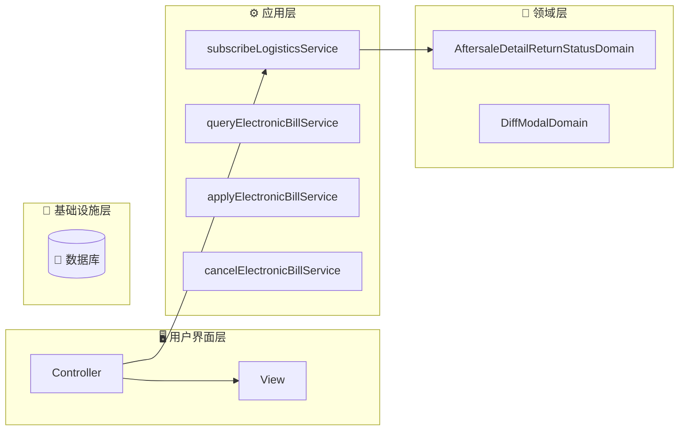
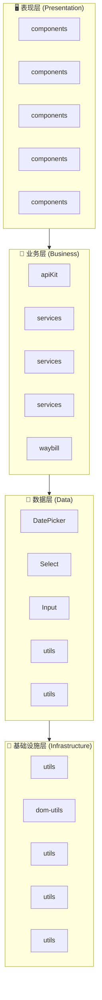
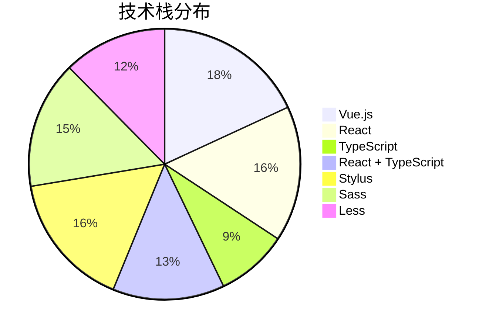

# fulfillment-aftersale-ark - Code Structure Analysis

## 📊 Project Overview
- **Project Name**: fulfillment-aftersale-ark
- **Project Type**: Vue应用
- **Technology Stack**: Vue.js, React, TypeScript, React + TypeScript, Stylus, Sass, Less
- **Architecture Pattern**: 模块化架构
- **Total Files**: 10487
- **Total Code Lines**: 202496
- **Total Entities**: 710


## 🗂️ Project Directory Structure
```
├── 📁 src/constants
│   ├── Files: 22 files
│   ├── Entities: 70 entities
│   └── Purpose: 项目目录
│
├── 📁 src/providers
│   ├── Files: 2 files
│   ├── Entities: 1 entities
│   └── Purpose: 项目目录
│
├── 📁 src/utils
│   ├── Files: 9 files
│   ├── Entities: 33 entities
│   └── Purpose: 工具函数目录
│
├── 📁 src/containers/AutoAftersale/AfterSaleDetail/constants
│   ├── Files: 2 files
│   ├── Entities: 3 entities
│   └── Purpose: React组件目录
│
├── 📁 src/containers/AutoAftersale/AfterSaleList/constants
│   ├── Files: 1 files
│   ├── Entities: 1 entities
│   └── Purpose: 项目目录
│
├── 📁 src/containers/AutoAftersale/AfterSaleDetail/providers
│   ├── Files: 5 files
│   ├── Entities: 6 entities
│   └── Purpose: 项目目录
│
├── 📁 src/containers/AutoAftersale/utils
│   ├── Files: 1 files
│   ├── Entities: 2 entities
│   └── Purpose: 工具函数目录
│
├── 📁 src/containers/AutoAftersale/hooks
│   ├── Files: 11 files
│   ├── Entities: 14 entities
│   └── Purpose: 项目目录
│
├── 📁 src/containers/AutoAftersale/AfterSaleDetail/hooks
│   ├── Files: 3 files
│   ├── Entities: 2 entities
│   └── Purpose: 项目目录
│
├── 📁 src/containers/AutoAftersale/AfterSaleList/hooks
│   ├── Files: 2 files
│   ├── Entities: 2 entities
│   └── Purpose: 项目目录
│
├── 📁 src/containers/OrderQuery/hooks
│   ├── Files: 1 files
│   ├── Entities: 1 entities
│   └── Purpose: 项目目录
│
├── 📁 src/containers/AutoAftersale/AfterSaleDetail/components
│   ├── Files: 27 files
│   ├── Entities: 27 entities
│   └── Purpose: 组件目录
│
├── 📁 src/containers/AutoAftersale/AfterSaleDetail/components/Negotiate
│   ├── Files: 15 files
│   ├── Entities: 14 entities
│   └── Purpose: Vue组件目录
│
├── 📁 src/containers/AutoAftersale/AfterSaleList/components
│   ├── Files: 14 files
│   ├── Entities: 14 entities
│   └── Purpose: 组件目录
│
├── 📁 src/containers/AutoAftersale/components/TabsLogisticsInfo
│   ├── Files: 9 files
│   ├── Entities: 9 entities
│   └── Purpose: Vue组件目录
│
├── 📁 src/containers/AutoAftersale/AfterSaleDetail/components/ActionModals
│   ├── Files: 8 files
│   ├── Entities: 8 entities
│   └── Purpose: Vue组件目录
│
├── 📁 src/containers/Assistance/components
│   ├── Files: 7 files
│   ├── Entities: 7 entities
│   └── Purpose: 组件目录
│
├── 📁 src/components/GuideLayout
│   ├── Files: 7 files
│   ├── Entities: 6 entities
│   └── Purpose: Vue组件目录
│
├── 📁 src/containers/Assistance/AssistanceMain/components
│   ├── Files: 6 files
│   ├── Entities: 6 entities
│   └── Purpose: 组件目录
│
└── 📁 src/containers/AutoAftersale/AfterSaleList/components/Metrics
    ├── Files: 6 files
    ├── Entities: 6 entities
    └── Purpose: Vue组件目录
```


---


---

## 🌐 Route Configuration Analysis

**Route Config Path**: `/Users/fangqiji/dev/aurora/packages/fulfillment/fulfillment-aftersale-ark/src/config/routes.config.ts`
**Total Routes**: 6
**Related Files**: 40
**Related Entities**: 345

### 📁 src/containers/Assistance/AssistanceMain/index.vue

#### 🎯 Route Purpose
- **Primary Role**: 页面路由入口文件
- **Route Path**: `/app-order/auto/aftersale`
- **Route Name**: `ArkAppOrderAutoAftersale`
- **Page Title**: 售后助手
- **Entities**: `Component:index_05d38588b333` (component)
- **Functional Description**: 售后助手入口组件，根据用户状态展示不同内容：首次使用时显示引导页介绍产品价值和功能，已使用过则展示策略模板和管理列表，帮助商家自动化处理售后。

#### 📦 关联文件夹

- **文件夹1: src/service**
  - `目录说明`: src/service 目录功能总结

该目录是一个API服务层，主要封装了与后端交互的HTTP请求接口，包括售后服务、物流管理、订单处理、商家权益（如假一赔四、正品保障、安心购）、文件上传等业务功能的数据获取和提交操作。目录中的文件按业务模块划分，通过httpBase基础请求工具提供统一的错误处理和接口调用方式，为前端应用提供标准化的数据服务接口。

  - `文件依赖`: 依赖 service (API接口4次)；依赖 service/Shipping (API接口4次)；依赖 service/abnormalOrder (API接口4次)；依赖 service/apiKit (API接口4次)；被 containers/AutoAftersale/AfterSaleList 引用 (API接口9次)

  - `关联实体`: Function:getAssistantList_6a14d3138f18, Function:getProvinceList, Function:validateCompensateFourStatus, Function:getDecryptFlow, Function:getAgreeMent, Variable:httpBaseV2, Function:getLogisticsQuoteList, Function:getAddressList_339169923964, Function:getPaidOrderListStock, Function:getPlatformMessage, Function:getRelievedShoppingStatus, Function:postPickupOrderList, Function:getSkuInfoList, Function:uploadFile


- **文件夹2: src/utils**
  - `目录说明`: src/utils 目录功能总结

该目录是一个工具类集合，提供了多种通用辅助函数，包括价格格式化、解密灰度判断、DOM元素操作、表单配置转换、NPS调查触发、API预加载、异步延时处理、性能埋点上报以及URL验证等功能，为应用提供基础支持服务，优化用户体验和开发效率。

  - `文件依赖`: 依赖 service (API接口1次)；依赖 service/Shipping (API接口1次)；依赖 service/abnormalOrder (API接口1次)；依赖 service/apiKit (API接口1次)；依赖 service/common (API接口1次)

  - `关联实体`: Function:toCnPrice_d5ba974e9e62, Function:isDecryptionGraySeller, Function:setElementListener_712dfa278cd2, Function:adapterConfigToDelightFormily, Function:npsTrigger, Function:preloadAfterSaleDetailApi, Function:sleep, Function:trackerCustomFmp, Function:isHttp


- **文件夹3: src/service/Shipping**
  - `目录说明`: Shipping 目录功能总结

该目录是一个API服务模块，主要负责处理订单物流配送相关的功能，包含订单拆分在线寄件和多订单合并发货的接口封装，为应用提供与物流配送系统交互的服务层能力。

  - `文件依赖`: 被 containers/AutoAftersale/AfterSaleList 引用 (API接口9次)；被 service 引用 (API接口4次)；被 containers/AutoAftersale/AfterSaleDetail/components/ActionModals 引用 (API接口3次)；被 containers/AutoAftersale/AfterSaleList/components 引用 (API接口2次)；被 containers/AutoAftersale/AfterSaleDetail 引用 (API接口2次)

  - `关联实体`: Function:splitOnlineDelivery, Function:postMergeDelivery


- **文件夹4: src/service/abnormalOrder**
  - `目录说明`: 目录功能总结

`src/service/abnormalOrder` 目录是一个API服务模块，负责处理异常订单相关的数据交互，包括获取异常订单列表、导出异常订单文件、查询物流异常监控数据和发货异常监控数据，为系统提供异常订单管理和监控的后端数据服务支持。

  - `文件依赖`: 被 containers/AutoAftersale/AfterSaleList 引用 (API接口9次)；被 service 引用 (API接口4次)；被 containers/AutoAftersale/AfterSaleDetail/components/ActionModals 引用 (API接口3次)；被 containers/AutoAftersale/AfterSaleList/components 引用 (API接口2次)；被 containers/AutoAftersale/AfterSaleDetail 引用 (API接口2次)

  - `关联实体`: Function:getAbnormalList, Function:startExport, Function:getLogisticsOverview, Function:getPackageOverview


- **文件夹5: src/service/apiKit**
  - `目录说明`: 该目录是一个API服务层，包含与Edith系统交互的API接口封装，主要提供售后服务管理、物流履约、仓储管理、运费险、区域报备、货品库存、物流拦截、协商退款等功能的HTTP请求接口，通过GET、POST、PUT和DELETE等方法与后端服务通信，为商家提供完整的订单履约、售后处理和物流服务管理能力。

  - `文件依赖`: 被 containers/AutoAftersale/AfterSaleList 引用 (API接口9次)；被 service 引用 (API接口4次)；被 containers/AutoAftersale/AfterSaleDetail/components/ActionModals 引用 (API接口3次)；被 containers/AutoAftersale/AfterSaleList/components 引用 (API接口2次)；被 containers/AutoAftersale/AfterSaleDetail 引用 (API接口2次)

  - `关联实体`: Function:deleteCarriageTemplate, Function:getActivityData, Function:getAfterSalesReimbursement, Function:getAfterSalesRejectReasons, Function:getAssistantRecommend, Function:getByPoNo, Function:getCargoCalculate, Function:getCarraigeInsurance, Function:getCarraigeInsuranceList_1abd4698e8e7, Function:getCarriageInsuranceForAfterSaleDetail, Function:getAssistantTemplate, Function:getCarriageInsuranceForAfterSaleList, Function:getCpList_ea0bc3c393e0, Function:getCrossBroderRepush, Function:getDeclarelistV2, Function:getDeclaredOrderPage, Function:getCargoList, Function:getDownloadCargoInventory, Function:getDownloadCargoInventorySummary, Function:getDownloadFee, Function:getExecuteRecord, Function:getExecuteSummary, Function:getFulfillmentDataPremium, Function:getPageQuery, Function:getHomePopup, Function:getListByZone, Function:getListCancelReason, Function:getListQuery, Function:getMerchantDataAbnormalStandard, Function:getMerchantDataDiagnosis, Function:getOrderCargoList, Function:getOrderDetail, Function:getLogisticStatusLogs, Function:getOrderList, Function:getCargoList_c7b78a17948e, Function:getOverDueReportReasons, Function:getProofPhotosV1, Function:getItemsQuery, Function:getQueryAssistantStrategy, Function:getQicSubscribe, Function:getQueryNegotiateSceneTemplate, Function:getQueryDecryptQuota, Function:getReturnsId, Function:getReachSellerNotify, Function:getReturnsIdList, Function:getReturnsV3, Function:getSearchCargoInventory, Function:getSearchCargoInventoryBatch, Function:getSearchCargoInventoryRecord, Function:getSearchCargoInventoryRecordSummary, Function:getSellerAddressRecords, Function:getReturnsIdV2, Function:getSellerCarriageInsuranceV2, Function:getSellerWarehouseList, Function:getStrategyId, Function:getServiceOrderSearch, Function:getSupplyProofConfig, Function:getSubscribedCpList_e8bcd62a34d2, Function:getTallyCargoList, Function:getUsedItem, Function:getWarehousePriorityList, Function:getZoneDeclarelist, Function:getZoneDeclareChangeV2, Function:postAddV2, Function:postAddV2_833089c95ccc, Function:postAgreeAutoRejectAudit, Function:postAssistantChange, Function:postAssistantCreate, Function:postArkReturnReasons, Function:postAssistantUpdate, Function:postAgreeAutoRefundAfterLogisticsBack, Function:postBatchReception, Function:postAvailableReturnsStatusList, Function:postBatchgetV2, Function:postCancelSubscribe_4e42e3af23ae, Function:postCargoCreate, Function:postCancelV2, Function:postCargoList, Function:postCargoDetail, Function:getDownloadCargoInventoryBatch, Function:postCargoUpdate, Function:postClickReception, Function:postCombineFeeList, Function:postCombineOrderList, Function:postCombineQuote, Function:postCombineRecordList, Function:postCombineSubscribe, Function:postCreateNegotiate, Function:postCreateStrategy, Function:postDelayHandle, Function:postDetailV2, Function:postDirectRefund, Function:postFreightInsuranceSwitch, Function:postGetBySceneKeys, Function:postRuleQuery, Function:postRuleUpdate, Function:postProductSubscribe, Function:postGrayMerchantQuery_519c5071927f, Function:postGiftAftersaleInfo, Function:postCargoPrecheck, Function:postLadingCreate, Function:postInboundCreate, Function:postLogisticBackRefund, Function:postLogisticInterceptCreate, Function:postLogisticInterceptValidate, Function:postSubscribeDelete, Function:postManageConfirm, Function:postMultiSubscribe_b901d1907c5d, Function:postOrderDeliveringApi, Function:postOrderDetail, Function:postOrderDetails, Function:postOrderList_a619687ad1fc, Function:postCargoPrecheck_b5950e1c3cd3, Function:postOrderPage, Function:postOutboundCreate, Function:postParseAddress, Function:postPageV2, Function:postPreCheckBeforeDelivery, Function:postQicPage, Function:postQueryVas, Function:postReceptionDelay_09ceeb3a8c44, Function:postReceptionReject, Function:postRejectWarningCheck, Function:postRejectWithDialog, Function:postReturnSellerRejectGuidanceList, Function:postReturnsId, Function:postSellerAddressRecords, Function:postSellerBehaviorSuggestion, Function:postSellerWarehouseCreate, Function:postSellerWarehouseUpdate, Function:postAddV2_7bbdaf3ad3d4, Function:postStartAsync, Function:postStartExport, Function:postSupplyProof, Function:postTallyConfirm, Function:postUpdateAddress, Function:postUpdateCombine, Function:postUpdateNegotiate, Function:postUpdateV2, Function:postUpdateStrategy, Function:postUpdateV2_06aa155cc3a5, Function:postWarehouseCoverageUpdate, Function:postWarehousePriorityCreate, Function:postWarehousePriorityDelete, Function:postWarehousePriorityUpdate, Function:postWatchAsync, Function:postWatchExport, Function:putSellerAddressRecords


- **文件夹6: src/service/common**
  - `目录说明`: 该目录是一个API服务模块，主要负责文件导出相关的后端交互功能，通过fileExport.ts中的startExport函数提供发起文件导出请求的能力，支持应用中的数据导出功能。

  - `文件依赖`: 被 containers/AutoAftersale/AfterSaleList 引用 (API接口9次)；被 service 引用 (API接口4次)；被 containers/AutoAftersale/AfterSaleDetail/components/ActionModals 引用 (API接口3次)；被 containers/AutoAftersale/AfterSaleList/components 引用 (API接口2次)；被 containers/AutoAftersale/AfterSaleDetail 引用 (API接口2次)

  - `关联实体`: Function:startExport_7404a324e471


- **文件夹7: src/service/multiAddressReturn**
  - `目录说明`: 该目录提供多地址退货管理的API服务，包含查询退货地址策略列表、获取策略详情、查询策略关联商品列表以及删除策略等功能，支持商家配置和管理不同商品的退货地址策略。

  - `文件依赖`: 被 containers/AutoAftersale/AfterSaleList 引用 (API接口9次)；被 service 引用 (API接口4次)；被 containers/AutoAftersale/AfterSaleDetail/components/ActionModals 引用 (API接口3次)；被 containers/AutoAftersale/AfterSaleList/components 引用 (API接口2次)；被 containers/AutoAftersale/AfterSaleDetail 引用 (API接口2次)

  - `关联实体`: Function:getMultiAddressReturnList, Function:getMultiAddressReturnSkuList, Function:getStrategyItem, Function:postStrategyDelete


- **文件夹8: src/service/overseaDirectMail**
  - `目录说明`: 该目录提供海外直邮装载单管理的API服务，包含查询装载单列表及明细、上传装载单文件、发货处理和删除装载单等功能，支持商家通过各种参数进行装载单的全生命周期管理操作。

  - `文件依赖`: 被 containers/AutoAftersale/AfterSaleList 引用 (API接口9次)；被 service 引用 (API接口4次)；被 containers/AutoAftersale/AfterSaleDetail/components/ActionModals 引用 (API接口3次)；被 containers/AutoAftersale/AfterSaleList/components 引用 (API接口2次)；被 containers/AutoAftersale/AfterSaleDetail 引用 (API接口2次)

  - `关联实体`: Function:getLoadingDetail, Function:getLoadingPage, Function:removeLoading, Function:shipLoading, Function:uploadLoading


- **文件夹9: src/service/reportManagement**
  - `目录说明`: 该目录提供报备管理相关的API服务接口，主要负责订单列表数据获取、报表导出任务的创建和进度监控功能，支持订单数据的多条件筛选查询及文件导出操作，是系统报表管理模块的后端数据交互层。

  - `文件依赖`: 被 containers/AutoAftersale/AfterSaleList 引用 (API接口9次)；被 service 引用 (API接口4次)；被 containers/AutoAftersale/AfterSaleDetail/components/ActionModals 引用 (API接口3次)；被 containers/AutoAftersale/AfterSaleList/components 引用 (API接口2次)；被 containers/AutoAftersale/AfterSaleDetail 引用 (API接口2次)

  - `关联实体`: Function:postReportAddOrderList, Function:postReportWatchExport, Function:postReportStartExport


- **文件夹10: src/service/waybill**
  - `目录说明`: 目录功能总结：src/service/waybill

该目录是电子面单服务的API接口集合，提供了完整的电子面单业务流程支持，包括面单模板的创建、查询、更新和删除，快递公司及网点信息查询，合作伙伴订阅与取消，账户信息和余额查询，以及电子面单使用记录查询等功能，为商家提供从申请、配置到使用电子面单的全流程API服务支持。

  - `文件依赖`: 被 containers/AutoAftersale/AfterSaleList 引用 (API接口9次)；被 service 引用 (API接口4次)；被 containers/AutoAftersale/AfterSaleDetail/components/ActionModals 引用 (API接口3次)；被 containers/AutoAftersale/AfterSaleList/components 引用 (API接口2次)；被 containers/AutoAftersale/AfterSaleDetail 引用 (API接口2次)

  - `关联实体`: Function:queryCustomerCodeValid, Function:createTemplate, Function:deleteTemplate, Function:cancelPartnerSubscribe, Function:deliveryBranch, Function:queryElectronicBillService, Function:electronicBillList, Function:postPartnerSubscribe, Function:queryAccountInfo, Function:getAccountBalanceList, Function:queryAppliedPartnerList, Function:queryTemplateConfig, Function:queryTemplateList, Function:queryDeliveryCompany, Function:queryTemplateListGroup, Function:updateTemplate


- **文件夹11: src/service/waybillDispatch**
  - `目录说明`: 目录功能总结：src/service/waybillDispatch

该目录是一个API服务模块，专门处理电子面单和物流发货相关的网络请求，提供运单的创建、打印、查询、取消和管理功能，包括普通打印、合并打印、分离打印、重新打印、运单查询、手动添加运单等操作，支持多种筛选条件和账户类型，为电子面单系统提供完整的后端交互服务。

  - `文件依赖`: 被 containers/AutoAftersale/AfterSaleList 引用 (API接口9次)；被 service 引用 (API接口4次)；被 containers/AutoAftersale/AfterSaleDetail/components/ActionModals 引用 (API接口3次)；被 containers/AutoAftersale/AfterSaleList/components 引用 (API接口2次)；被 containers/AutoAftersale/AfterSaleDetail 引用 (API接口2次)

  - `关联实体`: Function:cancelWaybill, Function:postAddManualOrder, Function:printMerge, Function:printOrder, Function:printSeparate, Function:queryPlainUserInfo, Function:queryWaybillList, Function:queryWaybillMergeableList, Function:queryWaybillWorkIds, Function:reprintWaybill, Function:workOrderSend


- **文件夹12: src/containers/AutoAftersale/utils**
  - `目录说明`: 该目录是一个工具类集合，主要提供自动售后系统中的NPS(客户满意度调查)触发工具，负责根据不同售后类型和用户行为条件自动发送满意度调查问卷。

  - `文件依赖`: 暂无明确依赖关系

  - `关联实体`: Function:triggerAftersaleNps


- **文件夹13: src/containers/Assistance/AssistanceMain/components**
  - `目录说明`: 目录功能总结

该目录包含售后助手系统的UI组件集合，主要负责售后策略管理界面的展示，包括策略列表管理、模板展示与选择、策略详情查看、执行情况统计与监控等功能模块。这些组件共同构成了售后助手的核心用户界面，支持商家高效管理售后策略、查看处理指标、基于模板创建策略，以及监控策略执行情况，形成完整的售后自动化管理流程。

  - `文件依赖`: 依赖 service (API接口1次)；依赖 service/Shipping (API接口1次)；依赖 service/abnormalOrder (API接口1次)；依赖 service/apiKit (API接口1次)；依赖 service/common (API接口1次)

  - `关联实体`: Component:AssistanceStrategyListPane, Component:AssistanceTemplateCard, Component:AssistanceTemplatesPane, Component:Metrics, Component:StrategyDetailDrawer, Component:StrategyExecuteInfoDrawer


- **文件夹14: src/containers/Assistance**
  - `目录说明`: 售后助手策略配置模块，提供售后策略的创建和编辑功能，包含策略表单配置界面和产品价值展示配置，支持用户设置售后类型、订单状态和执行操作等参数，并展示售后助手的核心价值点。

  - `文件依赖`: 暂无明确依赖关系

  - `关联实体`: Component:CreateAssistance, Variable:productValuesConfig


- **文件夹15: src/containers/Assistance/components**
  - `目录说明`: 目录功能总结**：该目录包含辅助服务系统中的表单相关UI组件集合，主要提供各类专用输入控件（时间、数字、金额输入）、选择器（原因选择、工作时间段、物流状态）和展示组件（文本显示），这些组件基于Formily框架开发，支持表单验证、数据转换和事件触发，专门用于辅助服务业务场景中的表单交互需求。

  - `文件依赖`: 暂无明确依赖关系

  - `关联实体`: Component:ApplyTime, Component:FormText, Component:InputNumber, Component:InputNumberFen, Component:ReasonSelect, Component:WorkTimePeriod, Component:ReturnLogisticStatus


- **文件夹16: src/containers/AutoAftersale/AfterSaleList/components**
  - `目录说明`: 该目录包含售后服务管理系统的UI组件集合，主要负责售后列表页面的各个功能区块展示，包括售后状态展示、订单信息展示、商品审核、物流信息管理、价格展示、操作按钮等界面元素，以及相关的模态框组件，共同构成了商家处理售后申请的完整交互界面，支持售后流程中的审核、退款、物流跟踪等核心业务操作。

  - `文件依赖`: 依赖 service (API接口2次)；依赖 service/Shipping (API接口2次)；依赖 service/abnormalOrder (API接口2次)；依赖 service/apiKit (API接口2次)；依赖 service/common (API接口2次)

  - `关联实体`: Component:AfterSaleListBanner, Component:AftersaleStatus, Component:AuditGoods, Component:AuditModal, Component:EditExpressOrderModal, Component:ExcelOperaCell, Component:Logistics_64e2529721b4, Component:OrderInfoCell, Component:OtherTimeCell_b21e90ff37eb, Component:PriceCell, Component:ReceiveModal, Component:SelectArea, Component:TabUpBanner, Component:PackageInfo


- **文件夹17: src/containers/AutoAftersale/AfterSaleList/components/Metrics**
  - `目录说明`: Metrics 目录功能总结

该目录提供售后服务数据指标展示相关组件和工具，包含售后指标数据可视化展示、数据诊断警报、售后指南弹窗等UI组件，以及指标颜色计算和新手引导等辅助功能，旨在帮助商家全面了解自身售后服务表现、同行对比数据和改进建议，提升售后服务质量。

  - `文件依赖`: 依赖 service (API接口1次)；依赖 service/Shipping (API接口1次)；依赖 service/abnormalOrder (API接口1次)；依赖 service/apiKit (API接口1次)；依赖 service/common (API接口1次)

  - `关联实体`: Component:AfterSaleGuide, Component:DiagnosisAlert, Component:MetricsSimple, Component:index_8ca4db163aed, Component:useGuide, Function:useMetricColor


- **文件夹18: src/containers/AutoAftersale/AfterSaleList/components/Metrics/PeerCompare**
  - `目录说明`: PeerCompare 目录功能总结

该目录提供售后服务同行数据对比的UI组件，通过进度条可视化展示用户指标与行业均值的对比情况，支持不同数值格式化类型和自定义样式，帮助用户直观了解其售后服务表现在同行业中的相对位置和竞争力。

  - `文件依赖`: 暂无明确依赖关系

  - `关联实体`: Component:index_17e3ccd8e698, Component:Progress


- **文件夹19: src/containers/AutoAftersale/AfterSaleDetail/components**
  - `目录说明`: 该目录包含售后详情页面的UI组件集合，主要负责展示和操作售后服务的各个方面，包括售后基本信息、协商记录、物流信息、订单信息、纠纷处理、地址选择、状态操作等功能模块，支持退款、换货、退货等多种售后场景，并提供相应的交互操作界面，是售后服务管理系统中详情页的完整组件库，同时包含部分V2版本的升级组件。

  - `文件依赖`: 依赖 service (API接口1次)；依赖 service/Shipping (API接口1次)；依赖 service/abnormalOrder (API接口1次)；依赖 service/apiKit (API接口1次)；依赖 service/common (API接口1次)

  - `关联实体`: Component:AddressSelector, Component:AfterSaleInfoV2, Component:AfterSaleNegotiateInfo, Component:AfterSaleInfo, Component:AfterSaleNegotiateInfoV2, Component:ArbitratePanel, Component:ArbitrateProofDrawer, Component:ArbitrateRecordsDrawer, Component:BasicPanel, Component:ExchangeInfo, Component:ExchangeInfoV2, Component:ExtraInfo, Component:ArbitratePanelV2, Component:LogisticsInfo, Component:LogisticsInfoV2, Component:NegotiateRecordV2, Component:NegotiateRecord, Component:OrderInfoV2, Component:OrderInfo, Component:PakckageWidthLogisticsV2, Component:PakckageWidthLogistics, Component:PanelHeader, Component:PickupOrderInfo, Component:StatusOperateV2, Component:SellerMessagePanel, Component:Step, Component:StatusOperate


- **文件夹20: src/containers/AutoAftersale/AfterSaleDetail/components/ActionModals**
  - `目录说明`: ActionModals 目录功能总结

该目录包含售后管理系统中各类操作弹窗和抽屉组件，负责处理售后流程中的关键交互界面，包括预检查提示、操作确认、退款处理、物流信息编辑、拒绝理由选择、留言沟通等功能模块。这些UI组件支持不同售后场景下的商家决策和信息输入，提供表单验证、状态管理和操作反馈，构成了售后处理流程中的核心交互层。

  - `文件依赖`: 依赖 service (API接口3次)；依赖 service/Shipping (API接口3次)；依赖 service/abnormalOrder (API接口3次)；依赖 service/apiKit (API接口3次)；依赖 service/common (API接口3次)

  - `关联实体`: Component:CommonPreCheckModal, Component:ConfirmModal, Component:EditExpressModal, Component:MessageDrawer, Component:RefundModal, Component:RefuseDrawer, Component:RefuseModal, Component:ReturnExchangeModal


- **文件夹21: src/containers/AutoAftersale/AfterSaleDetail/components/Banners**
  - `目录说明`: Banners 目录功能总结

该目录包含售后详情页面中使用的横幅提示UI组件，主要负责在售后处理流程中展示各类操作建议、警告和提示信息。组件支持动态文本解析功能，可根据不同场景（如处理建议、拒绝理由等）呈现不同样式的提示内容，为用户提供售后处理过程中的视觉指导和操作建议。

  - `文件依赖`: 暂无明确依赖关系

  - `关联实体`: Component:HandlingSuggestionsBanner, Component:HandlingSuggestionsBannerV2, Component:RefuseModalDamageBanner


- **文件夹22: src/containers/AutoAftersale/AfterSaleDetail/components/BlockSelector**
  - `目录说明`: BlockSelector 目录功能总结

该目录提供了一个售后详情页面中的块选择器UI组件，实现平铺式选项卡的单选功能，用于售后场景中的选项选择，通过事件机制与父组件进行数据交互。

  - `文件依赖`: 暂无明确依赖关系

  - `关联实体`: Component:index_0f42e96162f3


- **文件夹23: src/containers/AutoAftersale/AfterSaleDetail/components/CopywritingAdapter**
  - `目录说明`: CopywritingAdapter 目录功能总结

该目录提供了一个富文本适配器UI组件，负责智能识别并渲染不同类型的内容（纯文本或富文本对象），能够根据富文本对象的类型展示文本、链接或换行等元素，为售后详情页面提供灵活的文本展示能力。

  - `文件依赖`: 暂无明确依赖关系

  - `关联实体`: Component:index_4a6f4b9a4dc7


- **文件夹24: src/containers/AutoAftersale/AfterSaleDetail/components/FreightCompensation**
  - `目录说明`: 目录功能总结**：

该目录包含售后系统中运费补偿相关的UI组件集合，主要负责展示和管理售后单的运费报销信息、运费宝服务状态及相关费用数据，同时提供运费宝服务的推广和开通入口，帮助商家降低运费成本，是售后详情页面中处理运费补偿业务的功能模块。

  - `文件依赖`: 依赖 service (API接口1次)；依赖 service/Shipping (API接口1次)；依赖 service/abnormalOrder (API接口1次)；依赖 service/apiKit (API接口1次)；依赖 service/common (API接口1次)

  - `关联实体`: Component:CompensationCost, Component:FreightInfo, Component:index_1133c9aa5f3c


- **文件夹25: src/containers/AutoAftersale/AfterSaleDetail/components/FreightCompensationV2**
  - `目录说明`: 目录功能总结**：

该目录包含售后详情中运费补偿相关的UI组件集合，主要负责展示运费宝服务信息、运费报销扣款情况及相关凭证，同时为未开通运费宝服务的商家提供开通引导和推荐，帮助商家了解和管理售后过程中的运费补偿业务。

  - `文件依赖`: 依赖 service (API接口1次)；依赖 service/Shipping (API接口1次)；依赖 service/abnormalOrder (API接口1次)；依赖 service/apiKit (API接口1次)；依赖 service/common (API接口1次)

  - `关联实体`: Component:index_8e65b8619cf5, Component:CompensationCost_bd916664f41e, Component:FreightInfo_60a2f188bb0a


- **文件夹26: src/containers/AutoAftersale/AfterSaleDetail/components/GiveawaysModal**
  - `目录说明`: 售后赠品关联展示组件，负责在售后详情页中以模态框形式展示主品与赠品售后单的关联信息，包括商品信息、价格数量统计及查看详情等操作功能。

  - `文件依赖`: 暂无明确依赖关系

  - `关联实体`: Component:index_fbe52b1cb6bc


- **文件夹27: src/containers/AutoAftersale/AfterSaleDetail/components/Negotiate**
  - `目录说明`: Negotiate 目录功能总结

该目录包含售后协商流程的UI组件集合，主要负责售后协商方案的创建、编辑和预览功能。组件涵盖了协商场景选择、售后类型、原因、状态展示、退款金额输入、延期处理、地址选择、协商描述等功能模块，并提供规则说明和消费者预览效果展示。这些组件共同构成了完整的售后协商交互界面，支持表单验证、数据埋点和用户交互跟踪，为商家提供灵活配置售后协商方案的能力。

  - `文件依赖`: 暂无明确依赖关系

  - `关联实体`: Component:AftersaleAddress, Component:AftersaleReason, Component:AftersaleStatus_0d6708d07ff2, Component:AftersaleType, Component:DynamicFormItem, Component:DelayInput, Component:NegotiateForm, Component:NegotiateDesc, Component:RichRadioGroup, Component:RefundInput, Component:index_4b3d81e93a50, Component:RuleBanner, Component:TiledSelector, Component:SwiperPreview


- **文件夹28: src/containers/AutoAftersale/AfterSaleDetail/components/ActionModals/ProofDrawer**
  - `目录说明`: ProofDrawer 目录功能总结

该目录包含售后系统中与举证相关的抽屉组件集合，主要负责商家和用户在售后流程中提交申诉凭证、补充举证材料和留言沟通的UI交互功能。组件支持文本输入、图片和文件上传，并提供表单验证和数据提交到服务端的能力，是售后服务流程中证据收集和沟通的关键界面组件。

  - `文件依赖`: 依赖 service (API接口1次)；依赖 service/Shipping (API接口1次)；依赖 service/abnormalOrder (API接口1次)；依赖 service/apiKit (API接口1次)；依赖 service/common (API接口1次)

  - `关联实体`: Component:MessageDrawer_1fb2aa375755, Component:ProofInfo, Component:index_725f8711dd42


- **文件夹29: src/containers/MicroRemittance/components**
  - `目录说明`: 该目录包含小额打款管理相关的UI组件，主要提供打款记录的查询、展示和操作功能，支持多条件筛选、打款发起和状态追踪，作为微型汇款(MicroRemittance)模块的组件层，负责呈现打款管理的用户界面和交互逻辑。

  - `文件依赖`: 暂无明确依赖关系

  - `关联实体`: Component:Remittance


- **文件夹30: src/containers/MicroRemittance/components/Search**
  - `目录说明`: 该目录提供微汇款系统的搜索功能组件，包含可配置的表单元数据组件和搜索组件，支持动态渲染不同类型的表单控件、自适应布局、展开/收起功能，以及查询和重置操作，是系统中负责数据筛选和查询的UI组件集合。

  - `文件依赖`: 暂无明确依赖关系

  - `关联实体`: Component:form-meta, Component:search


---

### 📁 src/containers/Assistance/CreateAssistance.vue

#### 🎯 Route Purpose
- **Primary Role**: 页面路由入口文件
- **Route Path**: `/app-order/auto/aftersale/add`
- **Route Name**: `ArkAppOrderAutoAftersaleAdd`
- **Page Title**: 售后助手 - 新建策略
- **Entities**: `Component:CreateAssistance` (component)
- **Functional Description**: 售后助手策略创建/编辑组件，用于配置售后类型、订单状态、执行操作等参数，支持表单验证和数据提交，提供策略模板选择和参数配置功能。

#### 📦 关联文件夹

- **文件夹1: src/containers/Assistance/AssistanceMain**
  - `目录说明`: 目录功能总结

该目录实现了售后助手的路由组件，通过入口组件(index.vue)根据用户使用状态智能切换显示：首次使用时展示引导页(AssistanceGuide.vue)介绍产品价值，已使用过则显示主界面(Main.vue)，提供数据指标、策略模板选择和策略管理功能，整体构成一个帮助商家自动化处理售后工作、提升效率的完整UI功能模块。

  - `文件依赖`: 暂无明确依赖关系

  - `关联实体`: Component:index_05d38588b333, Component:AssistanceGuide, Component:Main


- **文件夹2: src/service**
  - `目录说明`: src/service 目录功能总结

该目录是一个API服务层，主要封装了与后端交互的HTTP请求接口，包括售后服务、物流管理、订单处理、商家权益（如假一赔四、正品保障、安心购）、文件上传等业务功能的数据获取和提交操作。目录中的文件按业务模块划分，通过httpBase基础请求工具提供统一的错误处理和接口调用方式，为前端应用提供标准化的数据服务接口。

  - `文件依赖`: 依赖 service (API接口4次)；依赖 service/Shipping (API接口4次)；依赖 service/abnormalOrder (API接口4次)；依赖 service/apiKit (API接口4次)；被 containers/AutoAftersale/AfterSaleList 引用 (API接口9次)

  - `关联实体`: Function:getAssistantList_6a14d3138f18, Function:getProvinceList, Function:validateCompensateFourStatus, Function:getDecryptFlow, Function:getAgreeMent, Variable:httpBaseV2, Function:getLogisticsQuoteList, Function:getAddressList_339169923964, Function:getPaidOrderListStock, Function:getPlatformMessage, Function:getRelievedShoppingStatus, Function:postPickupOrderList, Function:getSkuInfoList, Function:uploadFile


- **文件夹3: src/utils**
  - `目录说明`: src/utils 目录功能总结

该目录是一个工具类集合，提供了多种通用辅助函数，包括价格格式化、解密灰度判断、DOM元素操作、表单配置转换、NPS调查触发、API预加载、异步延时处理、性能埋点上报以及URL验证等功能，为应用提供基础支持服务，优化用户体验和开发效率。

  - `文件依赖`: 依赖 service (API接口1次)；依赖 service/Shipping (API接口1次)；依赖 service/abnormalOrder (API接口1次)；依赖 service/apiKit (API接口1次)；依赖 service/common (API接口1次)

  - `关联实体`: Function:toCnPrice_d5ba974e9e62, Function:isDecryptionGraySeller, Function:setElementListener_712dfa278cd2, Function:adapterConfigToDelightFormily, Function:npsTrigger, Function:preloadAfterSaleDetailApi, Function:sleep, Function:trackerCustomFmp, Function:isHttp


- **文件夹4: src/service/Shipping**
  - `目录说明`: Shipping 目录功能总结

该目录是一个API服务模块，主要负责处理订单物流配送相关的功能，包含订单拆分在线寄件和多订单合并发货的接口封装，为应用提供与物流配送系统交互的服务层能力。

  - `文件依赖`: 被 containers/AutoAftersale/AfterSaleList 引用 (API接口9次)；被 service 引用 (API接口4次)；被 containers/AutoAftersale/AfterSaleDetail/components/ActionModals 引用 (API接口3次)；被 containers/AutoAftersale/AfterSaleList/components 引用 (API接口2次)；被 containers/AutoAftersale/AfterSaleDetail 引用 (API接口2次)

  - `关联实体`: Function:splitOnlineDelivery, Function:postMergeDelivery


- **文件夹5: src/service/abnormalOrder**
  - `目录说明`: 目录功能总结

`src/service/abnormalOrder` 目录是一个API服务模块，负责处理异常订单相关的数据交互，包括获取异常订单列表、导出异常订单文件、查询物流异常监控数据和发货异常监控数据，为系统提供异常订单管理和监控的后端数据服务支持。

  - `文件依赖`: 被 containers/AutoAftersale/AfterSaleList 引用 (API接口9次)；被 service 引用 (API接口4次)；被 containers/AutoAftersale/AfterSaleDetail/components/ActionModals 引用 (API接口3次)；被 containers/AutoAftersale/AfterSaleList/components 引用 (API接口2次)；被 containers/AutoAftersale/AfterSaleDetail 引用 (API接口2次)

  - `关联实体`: Function:getAbnormalList, Function:startExport, Function:getLogisticsOverview, Function:getPackageOverview


- **文件夹6: src/service/apiKit**
  - `目录说明`: 该目录是一个API服务层，包含与Edith系统交互的API接口封装，主要提供售后服务管理、物流履约、仓储管理、运费险、区域报备、货品库存、物流拦截、协商退款等功能的HTTP请求接口，通过GET、POST、PUT和DELETE等方法与后端服务通信，为商家提供完整的订单履约、售后处理和物流服务管理能力。

  - `文件依赖`: 被 containers/AutoAftersale/AfterSaleList 引用 (API接口9次)；被 service 引用 (API接口4次)；被 containers/AutoAftersale/AfterSaleDetail/components/ActionModals 引用 (API接口3次)；被 containers/AutoAftersale/AfterSaleList/components 引用 (API接口2次)；被 containers/AutoAftersale/AfterSaleDetail 引用 (API接口2次)

  - `关联实体`: Function:deleteCarriageTemplate, Function:getActivityData, Function:getAfterSalesReimbursement, Function:getAfterSalesRejectReasons, Function:getAssistantRecommend, Function:getByPoNo, Function:getCargoCalculate, Function:getCarraigeInsurance, Function:getCarraigeInsuranceList_1abd4698e8e7, Function:getCarriageInsuranceForAfterSaleDetail, Function:getAssistantTemplate, Function:getCarriageInsuranceForAfterSaleList, Function:getCpList_ea0bc3c393e0, Function:getCrossBroderRepush, Function:getDeclarelistV2, Function:getDeclaredOrderPage, Function:getCargoList, Function:getDownloadCargoInventory, Function:getDownloadCargoInventorySummary, Function:getDownloadFee, Function:getExecuteRecord, Function:getExecuteSummary, Function:getFulfillmentDataPremium, Function:getPageQuery, Function:getHomePopup, Function:getListByZone, Function:getListCancelReason, Function:getListQuery, Function:getMerchantDataAbnormalStandard, Function:getMerchantDataDiagnosis, Function:getOrderCargoList, Function:getOrderDetail, Function:getLogisticStatusLogs, Function:getOrderList, Function:getCargoList_c7b78a17948e, Function:getOverDueReportReasons, Function:getProofPhotosV1, Function:getItemsQuery, Function:getQueryAssistantStrategy, Function:getQicSubscribe, Function:getQueryNegotiateSceneTemplate, Function:getQueryDecryptQuota, Function:getReturnsId, Function:getReachSellerNotify, Function:getReturnsIdList, Function:getReturnsV3, Function:getSearchCargoInventory, Function:getSearchCargoInventoryBatch, Function:getSearchCargoInventoryRecord, Function:getSearchCargoInventoryRecordSummary, Function:getSellerAddressRecords, Function:getReturnsIdV2, Function:getSellerCarriageInsuranceV2, Function:getSellerWarehouseList, Function:getStrategyId, Function:getServiceOrderSearch, Function:getSupplyProofConfig, Function:getSubscribedCpList_e8bcd62a34d2, Function:getTallyCargoList, Function:getUsedItem, Function:getWarehousePriorityList, Function:getZoneDeclarelist, Function:getZoneDeclareChangeV2, Function:postAddV2, Function:postAddV2_833089c95ccc, Function:postAgreeAutoRejectAudit, Function:postAssistantChange, Function:postAssistantCreate, Function:postArkReturnReasons, Function:postAssistantUpdate, Function:postAgreeAutoRefundAfterLogisticsBack, Function:postBatchReception, Function:postAvailableReturnsStatusList, Function:postBatchgetV2, Function:postCancelSubscribe_4e42e3af23ae, Function:postCargoCreate, Function:postCancelV2, Function:postCargoList, Function:postCargoDetail, Function:getDownloadCargoInventoryBatch, Function:postCargoUpdate, Function:postClickReception, Function:postCombineFeeList, Function:postCombineOrderList, Function:postCombineQuote, Function:postCombineRecordList, Function:postCombineSubscribe, Function:postCreateNegotiate, Function:postCreateStrategy, Function:postDelayHandle, Function:postDetailV2, Function:postDirectRefund, Function:postFreightInsuranceSwitch, Function:postGetBySceneKeys, Function:postRuleQuery, Function:postRuleUpdate, Function:postProductSubscribe, Function:postGrayMerchantQuery_519c5071927f, Function:postGiftAftersaleInfo, Function:postCargoPrecheck, Function:postLadingCreate, Function:postInboundCreate, Function:postLogisticBackRefund, Function:postLogisticInterceptCreate, Function:postLogisticInterceptValidate, Function:postSubscribeDelete, Function:postManageConfirm, Function:postMultiSubscribe_b901d1907c5d, Function:postOrderDeliveringApi, Function:postOrderDetail, Function:postOrderDetails, Function:postOrderList_a619687ad1fc, Function:postCargoPrecheck_b5950e1c3cd3, Function:postOrderPage, Function:postOutboundCreate, Function:postParseAddress, Function:postPageV2, Function:postPreCheckBeforeDelivery, Function:postQicPage, Function:postQueryVas, Function:postReceptionDelay_09ceeb3a8c44, Function:postReceptionReject, Function:postRejectWarningCheck, Function:postRejectWithDialog, Function:postReturnSellerRejectGuidanceList, Function:postReturnsId, Function:postSellerAddressRecords, Function:postSellerBehaviorSuggestion, Function:postSellerWarehouseCreate, Function:postSellerWarehouseUpdate, Function:postAddV2_7bbdaf3ad3d4, Function:postStartAsync, Function:postStartExport, Function:postSupplyProof, Function:postTallyConfirm, Function:postUpdateAddress, Function:postUpdateCombine, Function:postUpdateNegotiate, Function:postUpdateV2, Function:postUpdateStrategy, Function:postUpdateV2_06aa155cc3a5, Function:postWarehouseCoverageUpdate, Function:postWarehousePriorityCreate, Function:postWarehousePriorityDelete, Function:postWarehousePriorityUpdate, Function:postWatchAsync, Function:postWatchExport, Function:putSellerAddressRecords


- **文件夹7: src/service/common**
  - `目录说明`: 该目录是一个API服务模块，主要负责文件导出相关的后端交互功能，通过fileExport.ts中的startExport函数提供发起文件导出请求的能力，支持应用中的数据导出功能。

  - `文件依赖`: 被 containers/AutoAftersale/AfterSaleList 引用 (API接口9次)；被 service 引用 (API接口4次)；被 containers/AutoAftersale/AfterSaleDetail/components/ActionModals 引用 (API接口3次)；被 containers/AutoAftersale/AfterSaleList/components 引用 (API接口2次)；被 containers/AutoAftersale/AfterSaleDetail 引用 (API接口2次)

  - `关联实体`: Function:startExport_7404a324e471


- **文件夹8: src/service/multiAddressReturn**
  - `目录说明`: 该目录提供多地址退货管理的API服务，包含查询退货地址策略列表、获取策略详情、查询策略关联商品列表以及删除策略等功能，支持商家配置和管理不同商品的退货地址策略。

  - `文件依赖`: 被 containers/AutoAftersale/AfterSaleList 引用 (API接口9次)；被 service 引用 (API接口4次)；被 containers/AutoAftersale/AfterSaleDetail/components/ActionModals 引用 (API接口3次)；被 containers/AutoAftersale/AfterSaleList/components 引用 (API接口2次)；被 containers/AutoAftersale/AfterSaleDetail 引用 (API接口2次)

  - `关联实体`: Function:getMultiAddressReturnList, Function:getMultiAddressReturnSkuList, Function:getStrategyItem, Function:postStrategyDelete


- **文件夹9: src/service/overseaDirectMail**
  - `目录说明`: 该目录提供海外直邮装载单管理的API服务，包含查询装载单列表及明细、上传装载单文件、发货处理和删除装载单等功能，支持商家通过各种参数进行装载单的全生命周期管理操作。

  - `文件依赖`: 被 containers/AutoAftersale/AfterSaleList 引用 (API接口9次)；被 service 引用 (API接口4次)；被 containers/AutoAftersale/AfterSaleDetail/components/ActionModals 引用 (API接口3次)；被 containers/AutoAftersale/AfterSaleList/components 引用 (API接口2次)；被 containers/AutoAftersale/AfterSaleDetail 引用 (API接口2次)

  - `关联实体`: Function:getLoadingDetail, Function:getLoadingPage, Function:removeLoading, Function:shipLoading, Function:uploadLoading


- **文件夹10: src/service/reportManagement**
  - `目录说明`: 该目录提供报备管理相关的API服务接口，主要负责订单列表数据获取、报表导出任务的创建和进度监控功能，支持订单数据的多条件筛选查询及文件导出操作，是系统报表管理模块的后端数据交互层。

  - `文件依赖`: 被 containers/AutoAftersale/AfterSaleList 引用 (API接口9次)；被 service 引用 (API接口4次)；被 containers/AutoAftersale/AfterSaleDetail/components/ActionModals 引用 (API接口3次)；被 containers/AutoAftersale/AfterSaleList/components 引用 (API接口2次)；被 containers/AutoAftersale/AfterSaleDetail 引用 (API接口2次)

  - `关联实体`: Function:postReportAddOrderList, Function:postReportWatchExport, Function:postReportStartExport


- **文件夹11: src/service/waybill**
  - `目录说明`: 目录功能总结：src/service/waybill

该目录是电子面单服务的API接口集合，提供了完整的电子面单业务流程支持，包括面单模板的创建、查询、更新和删除，快递公司及网点信息查询，合作伙伴订阅与取消，账户信息和余额查询，以及电子面单使用记录查询等功能，为商家提供从申请、配置到使用电子面单的全流程API服务支持。

  - `文件依赖`: 被 containers/AutoAftersale/AfterSaleList 引用 (API接口9次)；被 service 引用 (API接口4次)；被 containers/AutoAftersale/AfterSaleDetail/components/ActionModals 引用 (API接口3次)；被 containers/AutoAftersale/AfterSaleList/components 引用 (API接口2次)；被 containers/AutoAftersale/AfterSaleDetail 引用 (API接口2次)

  - `关联实体`: Function:queryCustomerCodeValid, Function:createTemplate, Function:deleteTemplate, Function:cancelPartnerSubscribe, Function:deliveryBranch, Function:queryElectronicBillService, Function:electronicBillList, Function:postPartnerSubscribe, Function:queryAccountInfo, Function:getAccountBalanceList, Function:queryAppliedPartnerList, Function:queryTemplateConfig, Function:queryTemplateList, Function:queryDeliveryCompany, Function:queryTemplateListGroup, Function:updateTemplate


- **文件夹12: src/service/waybillDispatch**
  - `目录说明`: 目录功能总结：src/service/waybillDispatch

该目录是一个API服务模块，专门处理电子面单和物流发货相关的网络请求，提供运单的创建、打印、查询、取消和管理功能，包括普通打印、合并打印、分离打印、重新打印、运单查询、手动添加运单等操作，支持多种筛选条件和账户类型，为电子面单系统提供完整的后端交互服务。

  - `文件依赖`: 被 containers/AutoAftersale/AfterSaleList 引用 (API接口9次)；被 service 引用 (API接口4次)；被 containers/AutoAftersale/AfterSaleDetail/components/ActionModals 引用 (API接口3次)；被 containers/AutoAftersale/AfterSaleList/components 引用 (API接口2次)；被 containers/AutoAftersale/AfterSaleDetail 引用 (API接口2次)

  - `关联实体`: Function:cancelWaybill, Function:postAddManualOrder, Function:printMerge, Function:printOrder, Function:printSeparate, Function:queryPlainUserInfo, Function:queryWaybillList, Function:queryWaybillMergeableList, Function:queryWaybillWorkIds, Function:reprintWaybill, Function:workOrderSend


- **文件夹13: src/containers/AutoAftersale/utils**
  - `目录说明`: 该目录是一个工具类集合，主要提供自动售后系统中的NPS(客户满意度调查)触发工具，负责根据不同售后类型和用户行为条件自动发送满意度调查问卷。

  - `文件依赖`: 暂无明确依赖关系

  - `关联实体`: Function:triggerAftersaleNps


- **文件夹14: src/containers/Assistance/AssistanceMain/components**
  - `目录说明`: 目录功能总结

该目录包含售后助手系统的UI组件集合，主要负责售后策略管理界面的展示，包括策略列表管理、模板展示与选择、策略详情查看、执行情况统计与监控等功能模块。这些组件共同构成了售后助手的核心用户界面，支持商家高效管理售后策略、查看处理指标、基于模板创建策略，以及监控策略执行情况，形成完整的售后自动化管理流程。

  - `文件依赖`: 依赖 service (API接口1次)；依赖 service/Shipping (API接口1次)；依赖 service/abnormalOrder (API接口1次)；依赖 service/apiKit (API接口1次)；依赖 service/common (API接口1次)

  - `关联实体`: Component:AssistanceStrategyListPane, Component:AssistanceTemplateCard, Component:AssistanceTemplatesPane, Component:Metrics, Component:StrategyDetailDrawer, Component:StrategyExecuteInfoDrawer


- **文件夹15: src/containers/Assistance/components**
  - `目录说明`: 目录功能总结**：该目录包含辅助服务系统中的表单相关UI组件集合，主要提供各类专用输入控件（时间、数字、金额输入）、选择器（原因选择、工作时间段、物流状态）和展示组件（文本显示），这些组件基于Formily框架开发，支持表单验证、数据转换和事件触发，专门用于辅助服务业务场景中的表单交互需求。

  - `文件依赖`: 暂无明确依赖关系

  - `关联实体`: Component:ApplyTime, Component:FormText, Component:InputNumber, Component:InputNumberFen, Component:ReasonSelect, Component:WorkTimePeriod, Component:ReturnLogisticStatus


- **文件夹16: src/containers/AutoAftersale/AfterSaleList/components**
  - `目录说明`: 该目录包含售后服务管理系统的UI组件集合，主要负责售后列表页面的各个功能区块展示，包括售后状态展示、订单信息展示、商品审核、物流信息管理、价格展示、操作按钮等界面元素，以及相关的模态框组件，共同构成了商家处理售后申请的完整交互界面，支持售后流程中的审核、退款、物流跟踪等核心业务操作。

  - `文件依赖`: 依赖 service (API接口2次)；依赖 service/Shipping (API接口2次)；依赖 service/abnormalOrder (API接口2次)；依赖 service/apiKit (API接口2次)；依赖 service/common (API接口2次)

  - `关联实体`: Component:AfterSaleListBanner, Component:AftersaleStatus, Component:AuditGoods, Component:AuditModal, Component:EditExpressOrderModal, Component:ExcelOperaCell, Component:Logistics_64e2529721b4, Component:OrderInfoCell, Component:OtherTimeCell_b21e90ff37eb, Component:PriceCell, Component:ReceiveModal, Component:SelectArea, Component:TabUpBanner, Component:PackageInfo


- **文件夹17: src/containers/AutoAftersale/AfterSaleList/components/Metrics**
  - `目录说明`: Metrics 目录功能总结

该目录提供售后服务数据指标展示相关组件和工具，包含售后指标数据可视化展示、数据诊断警报、售后指南弹窗等UI组件，以及指标颜色计算和新手引导等辅助功能，旨在帮助商家全面了解自身售后服务表现、同行对比数据和改进建议，提升售后服务质量。

  - `文件依赖`: 依赖 service (API接口1次)；依赖 service/Shipping (API接口1次)；依赖 service/abnormalOrder (API接口1次)；依赖 service/apiKit (API接口1次)；依赖 service/common (API接口1次)

  - `关联实体`: Component:AfterSaleGuide, Component:DiagnosisAlert, Component:MetricsSimple, Component:index_8ca4db163aed, Component:useGuide, Function:useMetricColor


- **文件夹18: src/containers/AutoAftersale/AfterSaleList/components/Metrics/PeerCompare**
  - `目录说明`: PeerCompare 目录功能总结

该目录提供售后服务同行数据对比的UI组件，通过进度条可视化展示用户指标与行业均值的对比情况，支持不同数值格式化类型和自定义样式，帮助用户直观了解其售后服务表现在同行业中的相对位置和竞争力。

  - `文件依赖`: 暂无明确依赖关系

  - `关联实体`: Component:index_17e3ccd8e698, Component:Progress


- **文件夹19: src/containers/AutoAftersale/AfterSaleDetail/components**
  - `目录说明`: 该目录包含售后详情页面的UI组件集合，主要负责展示和操作售后服务的各个方面，包括售后基本信息、协商记录、物流信息、订单信息、纠纷处理、地址选择、状态操作等功能模块，支持退款、换货、退货等多种售后场景，并提供相应的交互操作界面，是售后服务管理系统中详情页的完整组件库，同时包含部分V2版本的升级组件。

  - `文件依赖`: 依赖 service (API接口1次)；依赖 service/Shipping (API接口1次)；依赖 service/abnormalOrder (API接口1次)；依赖 service/apiKit (API接口1次)；依赖 service/common (API接口1次)

  - `关联实体`: Component:AddressSelector, Component:AfterSaleInfoV2, Component:AfterSaleNegotiateInfo, Component:AfterSaleInfo, Component:AfterSaleNegotiateInfoV2, Component:ArbitratePanel, Component:ArbitrateProofDrawer, Component:ArbitrateRecordsDrawer, Component:BasicPanel, Component:ExchangeInfo, Component:ExchangeInfoV2, Component:ExtraInfo, Component:ArbitratePanelV2, Component:LogisticsInfo, Component:LogisticsInfoV2, Component:NegotiateRecordV2, Component:NegotiateRecord, Component:OrderInfoV2, Component:OrderInfo, Component:PakckageWidthLogisticsV2, Component:PakckageWidthLogistics, Component:PanelHeader, Component:PickupOrderInfo, Component:StatusOperateV2, Component:SellerMessagePanel, Component:Step, Component:StatusOperate


- **文件夹20: src/containers/AutoAftersale/AfterSaleDetail/components/ActionModals**
  - `目录说明`: ActionModals 目录功能总结

该目录包含售后管理系统中各类操作弹窗和抽屉组件，负责处理售后流程中的关键交互界面，包括预检查提示、操作确认、退款处理、物流信息编辑、拒绝理由选择、留言沟通等功能模块。这些UI组件支持不同售后场景下的商家决策和信息输入，提供表单验证、状态管理和操作反馈，构成了售后处理流程中的核心交互层。

  - `文件依赖`: 依赖 service (API接口3次)；依赖 service/Shipping (API接口3次)；依赖 service/abnormalOrder (API接口3次)；依赖 service/apiKit (API接口3次)；依赖 service/common (API接口3次)

  - `关联实体`: Component:CommonPreCheckModal, Component:ConfirmModal, Component:EditExpressModal, Component:MessageDrawer, Component:RefundModal, Component:RefuseDrawer, Component:RefuseModal, Component:ReturnExchangeModal


- **文件夹21: src/containers/AutoAftersale/AfterSaleDetail/components/Banners**
  - `目录说明`: Banners 目录功能总结

该目录包含售后详情页面中使用的横幅提示UI组件，主要负责在售后处理流程中展示各类操作建议、警告和提示信息。组件支持动态文本解析功能，可根据不同场景（如处理建议、拒绝理由等）呈现不同样式的提示内容，为用户提供售后处理过程中的视觉指导和操作建议。

  - `文件依赖`: 暂无明确依赖关系

  - `关联实体`: Component:HandlingSuggestionsBanner, Component:HandlingSuggestionsBannerV2, Component:RefuseModalDamageBanner


- **文件夹22: src/containers/AutoAftersale/AfterSaleDetail/components/BlockSelector**
  - `目录说明`: BlockSelector 目录功能总结

该目录提供了一个售后详情页面中的块选择器UI组件，实现平铺式选项卡的单选功能，用于售后场景中的选项选择，通过事件机制与父组件进行数据交互。

  - `文件依赖`: 暂无明确依赖关系

  - `关联实体`: Component:index_0f42e96162f3


- **文件夹23: src/containers/AutoAftersale/AfterSaleDetail/components/CopywritingAdapter**
  - `目录说明`: CopywritingAdapter 目录功能总结

该目录提供了一个富文本适配器UI组件，负责智能识别并渲染不同类型的内容（纯文本或富文本对象），能够根据富文本对象的类型展示文本、链接或换行等元素，为售后详情页面提供灵活的文本展示能力。

  - `文件依赖`: 暂无明确依赖关系

  - `关联实体`: Component:index_4a6f4b9a4dc7


- **文件夹24: src/containers/AutoAftersale/AfterSaleDetail/components/FreightCompensation**
  - `目录说明`: 目录功能总结**：

该目录包含售后系统中运费补偿相关的UI组件集合，主要负责展示和管理售后单的运费报销信息、运费宝服务状态及相关费用数据，同时提供运费宝服务的推广和开通入口，帮助商家降低运费成本，是售后详情页面中处理运费补偿业务的功能模块。

  - `文件依赖`: 依赖 service (API接口1次)；依赖 service/Shipping (API接口1次)；依赖 service/abnormalOrder (API接口1次)；依赖 service/apiKit (API接口1次)；依赖 service/common (API接口1次)

  - `关联实体`: Component:CompensationCost, Component:FreightInfo, Component:index_1133c9aa5f3c


- **文件夹25: src/containers/AutoAftersale/AfterSaleDetail/components/FreightCompensationV2**
  - `目录说明`: 目录功能总结**：

该目录包含售后详情中运费补偿相关的UI组件集合，主要负责展示运费宝服务信息、运费报销扣款情况及相关凭证，同时为未开通运费宝服务的商家提供开通引导和推荐，帮助商家了解和管理售后过程中的运费补偿业务。

  - `文件依赖`: 依赖 service (API接口1次)；依赖 service/Shipping (API接口1次)；依赖 service/abnormalOrder (API接口1次)；依赖 service/apiKit (API接口1次)；依赖 service/common (API接口1次)

  - `关联实体`: Component:index_8e65b8619cf5, Component:CompensationCost_bd916664f41e, Component:FreightInfo_60a2f188bb0a


- **文件夹26: src/containers/AutoAftersale/AfterSaleDetail/components/GiveawaysModal**
  - `目录说明`: 售后赠品关联展示组件，负责在售后详情页中以模态框形式展示主品与赠品售后单的关联信息，包括商品信息、价格数量统计及查看详情等操作功能。

  - `文件依赖`: 暂无明确依赖关系

  - `关联实体`: Component:index_fbe52b1cb6bc


- **文件夹27: src/containers/AutoAftersale/AfterSaleDetail/components/Negotiate**
  - `目录说明`: Negotiate 目录功能总结

该目录包含售后协商流程的UI组件集合，主要负责售后协商方案的创建、编辑和预览功能。组件涵盖了协商场景选择、售后类型、原因、状态展示、退款金额输入、延期处理、地址选择、协商描述等功能模块，并提供规则说明和消费者预览效果展示。这些组件共同构成了完整的售后协商交互界面，支持表单验证、数据埋点和用户交互跟踪，为商家提供灵活配置售后协商方案的能力。

  - `文件依赖`: 暂无明确依赖关系

  - `关联实体`: Component:AftersaleAddress, Component:AftersaleReason, Component:AftersaleStatus_0d6708d07ff2, Component:AftersaleType, Component:DynamicFormItem, Component:DelayInput, Component:NegotiateForm, Component:NegotiateDesc, Component:RichRadioGroup, Component:RefundInput, Component:index_4b3d81e93a50, Component:RuleBanner, Component:TiledSelector, Component:SwiperPreview


- **文件夹28: src/containers/AutoAftersale/AfterSaleDetail/components/ActionModals/ProofDrawer**
  - `目录说明`: ProofDrawer 目录功能总结

该目录包含售后系统中与举证相关的抽屉组件集合，主要负责商家和用户在售后流程中提交申诉凭证、补充举证材料和留言沟通的UI交互功能。组件支持文本输入、图片和文件上传，并提供表单验证和数据提交到服务端的能力，是售后服务流程中证据收集和沟通的关键界面组件。

  - `文件依赖`: 依赖 service (API接口1次)；依赖 service/Shipping (API接口1次)；依赖 service/abnormalOrder (API接口1次)；依赖 service/apiKit (API接口1次)；依赖 service/common (API接口1次)

  - `关联实体`: Component:MessageDrawer_1fb2aa375755, Component:ProofInfo, Component:index_725f8711dd42


- **文件夹29: src/containers/MicroRemittance/components**
  - `目录说明`: 该目录包含小额打款管理相关的UI组件，主要提供打款记录的查询、展示和操作功能，支持多条件筛选、打款发起和状态追踪，作为微型汇款(MicroRemittance)模块的组件层，负责呈现打款管理的用户界面和交互逻辑。

  - `文件依赖`: 暂无明确依赖关系

  - `关联实体`: Component:Remittance


- **文件夹30: src/containers/MicroRemittance/components/Search**
  - `目录说明`: 该目录提供微汇款系统的搜索功能组件，包含可配置的表单元数据组件和搜索组件，支持动态渲染不同类型的表单控件、自适应布局、展开/收起功能，以及查询和重置操作，是系统中负责数据筛选和查询的UI组件集合。

  - `文件依赖`: 暂无明确依赖关系

  - `关联实体`: Component:form-meta, Component:search


---

### 📁 src/containers/AutoAftersale/AfterSaleList/index.vue

#### 🎯 Route Purpose
- **Primary Role**: 页面路由入口文件
- **Route Path**: `/app-order/aftersale/list`
- **Route Name**: `ArkAppOrderAftersaleList`
- **Page Title**: 售后管理
- **Entities**: `Component:index_a31431ef66c4` (component)
- **Functional Description**: 售后列表页面的入口组件，集成了TabUpBanner、BannerPlacement和AftersaleList组件，用于展示售后订单列表，并处理老路由tab参数兼容。

#### 📦 关联文件夹

- **文件夹1: src/service**
  - `目录说明`: src/service 目录功能总结

该目录是一个API服务层，主要封装了与后端交互的HTTP请求接口，包括售后服务、物流管理、订单处理、商家权益（如假一赔四、正品保障、安心购）、文件上传等业务功能的数据获取和提交操作。目录中的文件按业务模块划分，通过httpBase基础请求工具提供统一的错误处理和接口调用方式，为前端应用提供标准化的数据服务接口。

  - `文件依赖`: 依赖 service (API接口4次)；依赖 service/Shipping (API接口4次)；依赖 service/abnormalOrder (API接口4次)；依赖 service/apiKit (API接口4次)；被 containers/AutoAftersale/AfterSaleList 引用 (API接口9次)

  - `关联实体`: Function:getAssistantList_6a14d3138f18, Function:getProvinceList, Function:validateCompensateFourStatus, Function:getDecryptFlow, Function:getAgreeMent, Variable:httpBaseV2, Function:getLogisticsQuoteList, Function:getAddressList_339169923964, Function:getPaidOrderListStock, Function:getPlatformMessage, Function:getRelievedShoppingStatus, Function:postPickupOrderList, Function:getSkuInfoList, Function:uploadFile


- **文件夹2: src/utils**
  - `目录说明`: src/utils 目录功能总结

该目录是一个工具类集合，提供了多种通用辅助函数，包括价格格式化、解密灰度判断、DOM元素操作、表单配置转换、NPS调查触发、API预加载、异步延时处理、性能埋点上报以及URL验证等功能，为应用提供基础支持服务，优化用户体验和开发效率。

  - `文件依赖`: 依赖 service (API接口1次)；依赖 service/Shipping (API接口1次)；依赖 service/abnormalOrder (API接口1次)；依赖 service/apiKit (API接口1次)；依赖 service/common (API接口1次)

  - `关联实体`: Function:toCnPrice_d5ba974e9e62, Function:isDecryptionGraySeller, Function:setElementListener_712dfa278cd2, Function:adapterConfigToDelightFormily, Function:npsTrigger, Function:preloadAfterSaleDetailApi, Function:sleep, Function:trackerCustomFmp, Function:isHttp


- **文件夹3: src/service/Shipping**
  - `目录说明`: Shipping 目录功能总结

该目录是一个API服务模块，主要负责处理订单物流配送相关的功能，包含订单拆分在线寄件和多订单合并发货的接口封装，为应用提供与物流配送系统交互的服务层能力。

  - `文件依赖`: 被 containers/AutoAftersale/AfterSaleList 引用 (API接口9次)；被 service 引用 (API接口4次)；被 containers/AutoAftersale/AfterSaleDetail/components/ActionModals 引用 (API接口3次)；被 containers/AutoAftersale/AfterSaleList/components 引用 (API接口2次)；被 containers/AutoAftersale/AfterSaleDetail 引用 (API接口2次)

  - `关联实体`: Function:splitOnlineDelivery, Function:postMergeDelivery


- **文件夹4: src/service/abnormalOrder**
  - `目录说明`: 目录功能总结

`src/service/abnormalOrder` 目录是一个API服务模块，负责处理异常订单相关的数据交互，包括获取异常订单列表、导出异常订单文件、查询物流异常监控数据和发货异常监控数据，为系统提供异常订单管理和监控的后端数据服务支持。

  - `文件依赖`: 被 containers/AutoAftersale/AfterSaleList 引用 (API接口9次)；被 service 引用 (API接口4次)；被 containers/AutoAftersale/AfterSaleDetail/components/ActionModals 引用 (API接口3次)；被 containers/AutoAftersale/AfterSaleList/components 引用 (API接口2次)；被 containers/AutoAftersale/AfterSaleDetail 引用 (API接口2次)

  - `关联实体`: Function:getAbnormalList, Function:startExport, Function:getLogisticsOverview, Function:getPackageOverview


- **文件夹5: src/service/apiKit**
  - `目录说明`: 该目录是一个API服务层，包含与Edith系统交互的API接口封装，主要提供售后服务管理、物流履约、仓储管理、运费险、区域报备、货品库存、物流拦截、协商退款等功能的HTTP请求接口，通过GET、POST、PUT和DELETE等方法与后端服务通信，为商家提供完整的订单履约、售后处理和物流服务管理能力。

  - `文件依赖`: 被 containers/AutoAftersale/AfterSaleList 引用 (API接口9次)；被 service 引用 (API接口4次)；被 containers/AutoAftersale/AfterSaleDetail/components/ActionModals 引用 (API接口3次)；被 containers/AutoAftersale/AfterSaleList/components 引用 (API接口2次)；被 containers/AutoAftersale/AfterSaleDetail 引用 (API接口2次)

  - `关联实体`: Function:deleteCarriageTemplate, Function:getActivityData, Function:getAfterSalesReimbursement, Function:getAfterSalesRejectReasons, Function:getAssistantRecommend, Function:getByPoNo, Function:getCargoCalculate, Function:getCarraigeInsurance, Function:getCarraigeInsuranceList_1abd4698e8e7, Function:getCarriageInsuranceForAfterSaleDetail, Function:getAssistantTemplate, Function:getCarriageInsuranceForAfterSaleList, Function:getCpList_ea0bc3c393e0, Function:getCrossBroderRepush, Function:getDeclarelistV2, Function:getDeclaredOrderPage, Function:getCargoList, Function:getDownloadCargoInventory, Function:getDownloadCargoInventorySummary, Function:getDownloadFee, Function:getExecuteRecord, Function:getExecuteSummary, Function:getFulfillmentDataPremium, Function:getPageQuery, Function:getHomePopup, Function:getListByZone, Function:getListCancelReason, Function:getListQuery, Function:getMerchantDataAbnormalStandard, Function:getMerchantDataDiagnosis, Function:getOrderCargoList, Function:getOrderDetail, Function:getLogisticStatusLogs, Function:getOrderList, Function:getCargoList_c7b78a17948e, Function:getOverDueReportReasons, Function:getProofPhotosV1, Function:getItemsQuery, Function:getQueryAssistantStrategy, Function:getQicSubscribe, Function:getQueryNegotiateSceneTemplate, Function:getQueryDecryptQuota, Function:getReturnsId, Function:getReachSellerNotify, Function:getReturnsIdList, Function:getReturnsV3, Function:getSearchCargoInventory, Function:getSearchCargoInventoryBatch, Function:getSearchCargoInventoryRecord, Function:getSearchCargoInventoryRecordSummary, Function:getSellerAddressRecords, Function:getReturnsIdV2, Function:getSellerCarriageInsuranceV2, Function:getSellerWarehouseList, Function:getStrategyId, Function:getServiceOrderSearch, Function:getSupplyProofConfig, Function:getSubscribedCpList_e8bcd62a34d2, Function:getTallyCargoList, Function:getUsedItem, Function:getWarehousePriorityList, Function:getZoneDeclarelist, Function:getZoneDeclareChangeV2, Function:postAddV2, Function:postAddV2_833089c95ccc, Function:postAgreeAutoRejectAudit, Function:postAssistantChange, Function:postAssistantCreate, Function:postArkReturnReasons, Function:postAssistantUpdate, Function:postAgreeAutoRefundAfterLogisticsBack, Function:postBatchReception, Function:postAvailableReturnsStatusList, Function:postBatchgetV2, Function:postCancelSubscribe_4e42e3af23ae, Function:postCargoCreate, Function:postCancelV2, Function:postCargoList, Function:postCargoDetail, Function:getDownloadCargoInventoryBatch, Function:postCargoUpdate, Function:postClickReception, Function:postCombineFeeList, Function:postCombineOrderList, Function:postCombineQuote, Function:postCombineRecordList, Function:postCombineSubscribe, Function:postCreateNegotiate, Function:postCreateStrategy, Function:postDelayHandle, Function:postDetailV2, Function:postDirectRefund, Function:postFreightInsuranceSwitch, Function:postGetBySceneKeys, Function:postRuleQuery, Function:postRuleUpdate, Function:postProductSubscribe, Function:postGrayMerchantQuery_519c5071927f, Function:postGiftAftersaleInfo, Function:postCargoPrecheck, Function:postLadingCreate, Function:postInboundCreate, Function:postLogisticBackRefund, Function:postLogisticInterceptCreate, Function:postLogisticInterceptValidate, Function:postSubscribeDelete, Function:postManageConfirm, Function:postMultiSubscribe_b901d1907c5d, Function:postOrderDeliveringApi, Function:postOrderDetail, Function:postOrderDetails, Function:postOrderList_a619687ad1fc, Function:postCargoPrecheck_b5950e1c3cd3, Function:postOrderPage, Function:postOutboundCreate, Function:postParseAddress, Function:postPageV2, Function:postPreCheckBeforeDelivery, Function:postQicPage, Function:postQueryVas, Function:postReceptionDelay_09ceeb3a8c44, Function:postReceptionReject, Function:postRejectWarningCheck, Function:postRejectWithDialog, Function:postReturnSellerRejectGuidanceList, Function:postReturnsId, Function:postSellerAddressRecords, Function:postSellerBehaviorSuggestion, Function:postSellerWarehouseCreate, Function:postSellerWarehouseUpdate, Function:postAddV2_7bbdaf3ad3d4, Function:postStartAsync, Function:postStartExport, Function:postSupplyProof, Function:postTallyConfirm, Function:postUpdateAddress, Function:postUpdateCombine, Function:postUpdateNegotiate, Function:postUpdateV2, Function:postUpdateStrategy, Function:postUpdateV2_06aa155cc3a5, Function:postWarehouseCoverageUpdate, Function:postWarehousePriorityCreate, Function:postWarehousePriorityDelete, Function:postWarehousePriorityUpdate, Function:postWatchAsync, Function:postWatchExport, Function:putSellerAddressRecords


- **文件夹6: src/service/common**
  - `目录说明`: 该目录是一个API服务模块，主要负责文件导出相关的后端交互功能，通过fileExport.ts中的startExport函数提供发起文件导出请求的能力，支持应用中的数据导出功能。

  - `文件依赖`: 被 containers/AutoAftersale/AfterSaleList 引用 (API接口9次)；被 service 引用 (API接口4次)；被 containers/AutoAftersale/AfterSaleDetail/components/ActionModals 引用 (API接口3次)；被 containers/AutoAftersale/AfterSaleList/components 引用 (API接口2次)；被 containers/AutoAftersale/AfterSaleDetail 引用 (API接口2次)

  - `关联实体`: Function:startExport_7404a324e471


- **文件夹7: src/service/multiAddressReturn**
  - `目录说明`: 该目录提供多地址退货管理的API服务，包含查询退货地址策略列表、获取策略详情、查询策略关联商品列表以及删除策略等功能，支持商家配置和管理不同商品的退货地址策略。

  - `文件依赖`: 被 containers/AutoAftersale/AfterSaleList 引用 (API接口9次)；被 service 引用 (API接口4次)；被 containers/AutoAftersale/AfterSaleDetail/components/ActionModals 引用 (API接口3次)；被 containers/AutoAftersale/AfterSaleList/components 引用 (API接口2次)；被 containers/AutoAftersale/AfterSaleDetail 引用 (API接口2次)

  - `关联实体`: Function:getMultiAddressReturnList, Function:getMultiAddressReturnSkuList, Function:getStrategyItem, Function:postStrategyDelete


- **文件夹8: src/service/overseaDirectMail**
  - `目录说明`: 该目录提供海外直邮装载单管理的API服务，包含查询装载单列表及明细、上传装载单文件、发货处理和删除装载单等功能，支持商家通过各种参数进行装载单的全生命周期管理操作。

  - `文件依赖`: 被 containers/AutoAftersale/AfterSaleList 引用 (API接口9次)；被 service 引用 (API接口4次)；被 containers/AutoAftersale/AfterSaleDetail/components/ActionModals 引用 (API接口3次)；被 containers/AutoAftersale/AfterSaleList/components 引用 (API接口2次)；被 containers/AutoAftersale/AfterSaleDetail 引用 (API接口2次)

  - `关联实体`: Function:getLoadingDetail, Function:getLoadingPage, Function:removeLoading, Function:shipLoading, Function:uploadLoading


- **文件夹9: src/service/reportManagement**
  - `目录说明`: 该目录提供报备管理相关的API服务接口，主要负责订单列表数据获取、报表导出任务的创建和进度监控功能，支持订单数据的多条件筛选查询及文件导出操作，是系统报表管理模块的后端数据交互层。

  - `文件依赖`: 被 containers/AutoAftersale/AfterSaleList 引用 (API接口9次)；被 service 引用 (API接口4次)；被 containers/AutoAftersale/AfterSaleDetail/components/ActionModals 引用 (API接口3次)；被 containers/AutoAftersale/AfterSaleList/components 引用 (API接口2次)；被 containers/AutoAftersale/AfterSaleDetail 引用 (API接口2次)

  - `关联实体`: Function:postReportAddOrderList, Function:postReportWatchExport, Function:postReportStartExport


- **文件夹10: src/service/waybill**
  - `目录说明`: 目录功能总结：src/service/waybill

该目录是电子面单服务的API接口集合，提供了完整的电子面单业务流程支持，包括面单模板的创建、查询、更新和删除，快递公司及网点信息查询，合作伙伴订阅与取消，账户信息和余额查询，以及电子面单使用记录查询等功能，为商家提供从申请、配置到使用电子面单的全流程API服务支持。

  - `文件依赖`: 被 containers/AutoAftersale/AfterSaleList 引用 (API接口9次)；被 service 引用 (API接口4次)；被 containers/AutoAftersale/AfterSaleDetail/components/ActionModals 引用 (API接口3次)；被 containers/AutoAftersale/AfterSaleList/components 引用 (API接口2次)；被 containers/AutoAftersale/AfterSaleDetail 引用 (API接口2次)

  - `关联实体`: Function:queryCustomerCodeValid, Function:createTemplate, Function:deleteTemplate, Function:cancelPartnerSubscribe, Function:deliveryBranch, Function:queryElectronicBillService, Function:electronicBillList, Function:postPartnerSubscribe, Function:queryAccountInfo, Function:getAccountBalanceList, Function:queryAppliedPartnerList, Function:queryTemplateConfig, Function:queryTemplateList, Function:queryDeliveryCompany, Function:queryTemplateListGroup, Function:updateTemplate


- **文件夹11: src/service/waybillDispatch**
  - `目录说明`: 目录功能总结：src/service/waybillDispatch

该目录是一个API服务模块，专门处理电子面单和物流发货相关的网络请求，提供运单的创建、打印、查询、取消和管理功能，包括普通打印、合并打印、分离打印、重新打印、运单查询、手动添加运单等操作，支持多种筛选条件和账户类型，为电子面单系统提供完整的后端交互服务。

  - `文件依赖`: 被 containers/AutoAftersale/AfterSaleList 引用 (API接口9次)；被 service 引用 (API接口4次)；被 containers/AutoAftersale/AfterSaleDetail/components/ActionModals 引用 (API接口3次)；被 containers/AutoAftersale/AfterSaleList/components 引用 (API接口2次)；被 containers/AutoAftersale/AfterSaleDetail 引用 (API接口2次)

  - `关联实体`: Function:cancelWaybill, Function:postAddManualOrder, Function:printMerge, Function:printOrder, Function:printSeparate, Function:queryPlainUserInfo, Function:queryWaybillList, Function:queryWaybillMergeableList, Function:queryWaybillWorkIds, Function:reprintWaybill, Function:workOrderSend


- **文件夹12: src/containers/AutoAftersale/utils**
  - `目录说明`: 该目录是一个工具类集合，主要提供自动售后系统中的NPS(客户满意度调查)触发工具，负责根据不同售后类型和用户行为条件自动发送满意度调查问卷。

  - `文件依赖`: 暂无明确依赖关系

  - `关联实体`: Function:triggerAftersaleNps


- **文件夹13: src/containers/Assistance/AssistanceMain/components**
  - `目录说明`: 目录功能总结

该目录包含售后助手系统的UI组件集合，主要负责售后策略管理界面的展示，包括策略列表管理、模板展示与选择、策略详情查看、执行情况统计与监控等功能模块。这些组件共同构成了售后助手的核心用户界面，支持商家高效管理售后策略、查看处理指标、基于模板创建策略，以及监控策略执行情况，形成完整的售后自动化管理流程。

  - `文件依赖`: 依赖 service (API接口1次)；依赖 service/Shipping (API接口1次)；依赖 service/abnormalOrder (API接口1次)；依赖 service/apiKit (API接口1次)；依赖 service/common (API接口1次)

  - `关联实体`: Component:AssistanceStrategyListPane, Component:AssistanceTemplateCard, Component:AssistanceTemplatesPane, Component:Metrics, Component:StrategyDetailDrawer, Component:StrategyExecuteInfoDrawer


- **文件夹14: src/containers/Assistance/components**
  - `目录说明`: 目录功能总结**：该目录包含辅助服务系统中的表单相关UI组件集合，主要提供各类专用输入控件（时间、数字、金额输入）、选择器（原因选择、工作时间段、物流状态）和展示组件（文本显示），这些组件基于Formily框架开发，支持表单验证、数据转换和事件触发，专门用于辅助服务业务场景中的表单交互需求。

  - `文件依赖`: 暂无明确依赖关系

  - `关联实体`: Component:ApplyTime, Component:FormText, Component:InputNumber, Component:InputNumberFen, Component:ReasonSelect, Component:WorkTimePeriod, Component:ReturnLogisticStatus


- **文件夹15: src/containers/AutoAftersale/AfterSaleList/components**
  - `目录说明`: 该目录包含售后服务管理系统的UI组件集合，主要负责售后列表页面的各个功能区块展示，包括售后状态展示、订单信息展示、商品审核、物流信息管理、价格展示、操作按钮等界面元素，以及相关的模态框组件，共同构成了商家处理售后申请的完整交互界面，支持售后流程中的审核、退款、物流跟踪等核心业务操作。

  - `文件依赖`: 依赖 service (API接口2次)；依赖 service/Shipping (API接口2次)；依赖 service/abnormalOrder (API接口2次)；依赖 service/apiKit (API接口2次)；依赖 service/common (API接口2次)

  - `关联实体`: Component:AfterSaleListBanner, Component:AftersaleStatus, Component:AuditGoods, Component:AuditModal, Component:EditExpressOrderModal, Component:ExcelOperaCell, Component:Logistics_64e2529721b4, Component:OrderInfoCell, Component:OtherTimeCell_b21e90ff37eb, Component:PriceCell, Component:ReceiveModal, Component:SelectArea, Component:TabUpBanner, Component:PackageInfo


- **文件夹16: src/containers/AutoAftersale/AfterSaleList/config**
  - `目录说明`: 该目录主要负责售后列表页面的指标统计配置管理，包含售后数据统计所需的静态参数定义和过滤条件映射，为售后系统的数据分析和展示提供配置支持。

  - `文件依赖`: 暂无明确依赖关系

  - `关联实体`: Variable:METRICS_STATIC_PARAMS


- **文件夹17: src/containers/AutoAftersale/AfterSaleList/constants**
  - `目录说明`: 该目录作为售后管理系统的常量定义模块，存储与售后列表相关的配置常量，特别是用于控制售后服务指南显示状态的本地存储键名，支持系统记住用户界面偏好设置。

  - `文件依赖`: 暂无明确依赖关系

  - `关联实体`: Variable:AftersaleGuideVisibilityKey


- **文件夹18: src/containers/AutoAftersale/AfterSaleList/hooks**
  - `目录说明`: 目录功能总结

该目录包含售后列表页面的自定义钩子函数集合，主要提供用户行为追踪埋点和搜索筛选配置功能，支持售后管理系统的数据分析和高效筛选，属于业务逻辑层组件，为售后列表页面提供核心功能支持。

  - `文件依赖`: 依赖 service (API接口1次)；依赖 service/Shipping (API接口1次)；依赖 service/abnormalOrder (API接口1次)；依赖 service/apiKit (API接口1次)；依赖 service/common (API接口1次)

  - `关联实体`: Function:useTracker_74b5c34e7bd4, Function:useSearchConfig


- **文件夹19: src/containers/AutoAftersale/AfterSaleList/components/Metrics**
  - `目录说明`: Metrics 目录功能总结

该目录提供售后服务数据指标展示相关组件和工具，包含售后指标数据可视化展示、数据诊断警报、售后指南弹窗等UI组件，以及指标颜色计算和新手引导等辅助功能，旨在帮助商家全面了解自身售后服务表现、同行对比数据和改进建议，提升售后服务质量。

  - `文件依赖`: 依赖 service (API接口1次)；依赖 service/Shipping (API接口1次)；依赖 service/abnormalOrder (API接口1次)；依赖 service/apiKit (API接口1次)；依赖 service/common (API接口1次)

  - `关联实体`: Component:AfterSaleGuide, Component:DiagnosisAlert, Component:MetricsSimple, Component:index_8ca4db163aed, Component:useGuide, Function:useMetricColor


- **文件夹20: src/containers/AutoAftersale/AfterSaleList/components/Metrics/PeerCompare**
  - `目录说明`: PeerCompare 目录功能总结

该目录提供售后服务同行数据对比的UI组件，通过进度条可视化展示用户指标与行业均值的对比情况，支持不同数值格式化类型和自定义样式，帮助用户直观了解其售后服务表现在同行业中的相对位置和竞争力。

  - `文件依赖`: 暂无明确依赖关系

  - `关联实体`: Component:index_17e3ccd8e698, Component:Progress


- **文件夹21: src/containers/AutoAftersale/AfterSaleDetail**
  - `目录说明`: 目录功能总结：AfterSaleDetail

售后详情页面路由组件目录，负责展示和管理售后订单的详细信息，包含新旧两个版本的售后详情UI实现，通过灰度配置实现平滑切换，提供售后单信息展示、状态跟踪、协商方案查看、物流信息管理和售后操作等功能，是商家处理售后订单的核心界面模块。

  - `文件依赖`: 依赖 service (API接口2次)；依赖 service/Shipping (API接口2次)；依赖 service/abnormalOrder (API接口2次)；依赖 service/apiKit (API接口2次)；依赖 service/common (API接口2次)

  - `关联实体`: Component:basic, Component:index_7e72b6c2c128, Component:indexV2


- **文件夹22: src/containers/AutoAftersale/AfterSaleDetail/components**
  - `目录说明`: 该目录包含售后详情页面的UI组件集合，主要负责展示和操作售后服务的各个方面，包括售后基本信息、协商记录、物流信息、订单信息、纠纷处理、地址选择、状态操作等功能模块，支持退款、换货、退货等多种售后场景，并提供相应的交互操作界面，是售后服务管理系统中详情页的完整组件库，同时包含部分V2版本的升级组件。

  - `文件依赖`: 依赖 service (API接口1次)；依赖 service/Shipping (API接口1次)；依赖 service/abnormalOrder (API接口1次)；依赖 service/apiKit (API接口1次)；依赖 service/common (API接口1次)

  - `关联实体`: Component:AddressSelector, Component:AfterSaleInfoV2, Component:AfterSaleNegotiateInfo, Component:AfterSaleInfo, Component:AfterSaleNegotiateInfoV2, Component:ArbitratePanel, Component:ArbitrateProofDrawer, Component:ArbitrateRecordsDrawer, Component:BasicPanel, Component:ExchangeInfo, Component:ExchangeInfoV2, Component:ExtraInfo, Component:ArbitratePanelV2, Component:LogisticsInfo, Component:LogisticsInfoV2, Component:NegotiateRecordV2, Component:NegotiateRecord, Component:OrderInfoV2, Component:OrderInfo, Component:PakckageWidthLogisticsV2, Component:PakckageWidthLogistics, Component:PanelHeader, Component:PickupOrderInfo, Component:StatusOperateV2, Component:SellerMessagePanel, Component:Step, Component:StatusOperate


- **文件夹23: src/containers/AutoAftersale/AfterSaleDetail/constants**
  - `目录说明`: 该目录定义了售后详情页的常量配置，主要包含用户功能引导步骤的定义，用于展示售后流程中各项功能（如拦拒自动退、快递拦截、协商修改售后等）的操作指引，并根据用户历史记录智能过滤已展示过的引导项。

  - `文件依赖`: 暂无明确依赖关系

  - `关联实体`: Function:guideSteps


- **文件夹24: src/containers/AutoAftersale/AfterSaleDetail/hooks**
  - `目录说明`: 该目录包含售后详情页面的自定义钩子函数，主要负责用户引导提示和行为追踪，通过useDetailReachGuide提供条件触发的引导建议弹窗功能，以及通过useTracker提供完整的埋点追踪能力，支持售后流程中各类用户交互行为的监控分析。

  - `文件依赖`: 依赖 service (API接口1次)；依赖 service/Shipping (API接口1次)；依赖 service/abnormalOrder (API接口1次)；依赖 service/apiKit (API接口1次)；依赖 service/common (API接口1次)

  - `关联实体`: Function:useDetailReachGuide, Function:useTracker_b0455b3c44c1


- **文件夹25: src/containers/AutoAftersale/AfterSaleDetail/providers**
  - `目录说明`: 该目录是售后详情页的领域模型提供者集合，包含售后地址管理、状态处理、操作拒绝处理、差异对比弹窗等领域对象，通过依赖注入方式提供售后服务各环节的业务逻辑处理能力，实现了售后流程中地址选择、状态更新、退款处理、拒绝操作等核心功能的领域逻辑封装。

  - `文件依赖`: 依赖 service (API接口1次)；依赖 service/Shipping (API接口1次)；依赖 service/abnormalOrder (API接口1次)；依赖 service/apiKit (API接口1次)；依赖 service/common (API接口1次)

  - `关联实体`: Class:AftersaleAddressFieldDomain_fdc4d199af1a, Class:AftersaleDetailReturnStatusDomain_923fe68131fe, Class:AftersaleOperateRefuseDomain_5b37bdc0a6a0, Variable:injector, Class:DiffModalDomain


- **文件夹26: src/containers/AutoAftersale/AfterSaleDetail/components/ActionModals**
  - `目录说明`: ActionModals 目录功能总结

该目录包含售后管理系统中各类操作弹窗和抽屉组件，负责处理售后流程中的关键交互界面，包括预检查提示、操作确认、退款处理、物流信息编辑、拒绝理由选择、留言沟通等功能模块。这些UI组件支持不同售后场景下的商家决策和信息输入，提供表单验证、状态管理和操作反馈，构成了售后处理流程中的核心交互层。

  - `文件依赖`: 依赖 service (API接口3次)；依赖 service/Shipping (API接口3次)；依赖 service/abnormalOrder (API接口3次)；依赖 service/apiKit (API接口3次)；依赖 service/common (API接口3次)

  - `关联实体`: Component:CommonPreCheckModal, Component:ConfirmModal, Component:EditExpressModal, Component:MessageDrawer, Component:RefundModal, Component:RefuseDrawer, Component:RefuseModal, Component:ReturnExchangeModal


- **文件夹27: src/containers/AutoAftersale/AfterSaleDetail/components/Banners**
  - `目录说明`: Banners 目录功能总结

该目录包含售后详情页面中使用的横幅提示UI组件，主要负责在售后处理流程中展示各类操作建议、警告和提示信息。组件支持动态文本解析功能，可根据不同场景（如处理建议、拒绝理由等）呈现不同样式的提示内容，为用户提供售后处理过程中的视觉指导和操作建议。

  - `文件依赖`: 暂无明确依赖关系

  - `关联实体`: Component:HandlingSuggestionsBanner, Component:HandlingSuggestionsBannerV2, Component:RefuseModalDamageBanner


- **文件夹28: src/containers/AutoAftersale/AfterSaleDetail/components/BlockSelector**
  - `目录说明`: BlockSelector 目录功能总结

该目录提供了一个售后详情页面中的块选择器UI组件，实现平铺式选项卡的单选功能，用于售后场景中的选项选择，通过事件机制与父组件进行数据交互。

  - `文件依赖`: 暂无明确依赖关系

  - `关联实体`: Component:index_0f42e96162f3


- **文件夹29: src/containers/AutoAftersale/AfterSaleDetail/components/CopywritingAdapter**
  - `目录说明`: CopywritingAdapter 目录功能总结

该目录提供了一个富文本适配器UI组件，负责智能识别并渲染不同类型的内容（纯文本或富文本对象），能够根据富文本对象的类型展示文本、链接或换行等元素，为售后详情页面提供灵活的文本展示能力。

  - `文件依赖`: 暂无明确依赖关系

  - `关联实体`: Component:index_4a6f4b9a4dc7


- **文件夹30: src/containers/AutoAftersale/AfterSaleDetail/components/FreightCompensation**
  - `目录说明`: 目录功能总结**：

该目录包含售后系统中运费补偿相关的UI组件集合，主要负责展示和管理售后单的运费报销信息、运费宝服务状态及相关费用数据，同时提供运费宝服务的推广和开通入口，帮助商家降低运费成本，是售后详情页面中处理运费补偿业务的功能模块。

  - `文件依赖`: 依赖 service (API接口1次)；依赖 service/Shipping (API接口1次)；依赖 service/abnormalOrder (API接口1次)；依赖 service/apiKit (API接口1次)；依赖 service/common (API接口1次)

  - `关联实体`: Component:CompensationCost, Component:FreightInfo, Component:index_1133c9aa5f3c


- **文件夹31: src/containers/AutoAftersale/AfterSaleDetail/components/FreightCompensationV2**
  - `目录说明`: 目录功能总结**：

该目录包含售后详情中运费补偿相关的UI组件集合，主要负责展示运费宝服务信息、运费报销扣款情况及相关凭证，同时为未开通运费宝服务的商家提供开通引导和推荐，帮助商家了解和管理售后过程中的运费补偿业务。

  - `文件依赖`: 依赖 service (API接口1次)；依赖 service/Shipping (API接口1次)；依赖 service/abnormalOrder (API接口1次)；依赖 service/apiKit (API接口1次)；依赖 service/common (API接口1次)

  - `关联实体`: Component:index_8e65b8619cf5, Component:CompensationCost_bd916664f41e, Component:FreightInfo_60a2f188bb0a


- **文件夹32: src/containers/AutoAftersale/AfterSaleDetail/components/GiveawaysModal**
  - `目录说明`: 售后赠品关联展示组件，负责在售后详情页中以模态框形式展示主品与赠品售后单的关联信息，包括商品信息、价格数量统计及查看详情等操作功能。

  - `文件依赖`: 暂无明确依赖关系

  - `关联实体`: Component:index_fbe52b1cb6bc


- **文件夹33: src/containers/AutoAftersale/AfterSaleDetail/components/Negotiate**
  - `目录说明`: Negotiate 目录功能总结

该目录包含售后协商流程的UI组件集合，主要负责售后协商方案的创建、编辑和预览功能。组件涵盖了协商场景选择、售后类型、原因、状态展示、退款金额输入、延期处理、地址选择、协商描述等功能模块，并提供规则说明和消费者预览效果展示。这些组件共同构成了完整的售后协商交互界面，支持表单验证、数据埋点和用户交互跟踪，为商家提供灵活配置售后协商方案的能力。

  - `文件依赖`: 暂无明确依赖关系

  - `关联实体`: Component:AftersaleAddress, Component:AftersaleReason, Component:AftersaleStatus_0d6708d07ff2, Component:AftersaleType, Component:DynamicFormItem, Component:DelayInput, Component:NegotiateForm, Component:NegotiateDesc, Component:RichRadioGroup, Component:RefundInput, Component:index_4b3d81e93a50, Component:RuleBanner, Component:TiledSelector, Component:SwiperPreview


- **文件夹34: src/containers/AutoAftersale/AfterSaleDetail/components/ActionModals/ProofDrawer**
  - `目录说明`: ProofDrawer 目录功能总结

该目录包含售后系统中与举证相关的抽屉组件集合，主要负责商家和用户在售后流程中提交申诉凭证、补充举证材料和留言沟通的UI交互功能。组件支持文本输入、图片和文件上传，并提供表单验证和数据提交到服务端的能力，是售后服务流程中证据收集和沟通的关键界面组件。

  - `文件依赖`: 依赖 service (API接口1次)；依赖 service/Shipping (API接口1次)；依赖 service/abnormalOrder (API接口1次)；依赖 service/apiKit (API接口1次)；依赖 service/common (API接口1次)

  - `关联实体`: Component:MessageDrawer_1fb2aa375755, Component:ProofInfo, Component:index_725f8711dd42


- **文件夹35: src/containers/MicroRemittance/components**
  - `目录说明`: 该目录包含小额打款管理相关的UI组件，主要提供打款记录的查询、展示和操作功能，支持多条件筛选、打款发起和状态追踪，作为微型汇款(MicroRemittance)模块的组件层，负责呈现打款管理的用户界面和交互逻辑。

  - `文件依赖`: 暂无明确依赖关系

  - `关联实体`: Component:Remittance


- **文件夹36: src/containers/MicroRemittance/components/Search**
  - `目录说明`: 该目录提供微汇款系统的搜索功能组件，包含可配置的表单元数据组件和搜索组件，支持动态渲染不同类型的表单控件、自适应布局、展开/收起功能，以及查询和重置操作，是系统中负责数据筛选和查询的UI组件集合。

  - `文件依赖`: 暂无明确依赖关系

  - `关联实体`: Component:form-meta, Component:search


---

### 📁 src/containers/AutoAftersale/AfterSaleDetail/basic.vue

#### 🎯 Route Purpose
- **Primary Role**: 页面路由入口文件
- **Route Path**: `/app-order/aftersale/detail`
- **Route Name**: `ArkAppOrderAftersaleDetail`
- **Page Title**: 售后详情
- **Entities**: `Component:basic` (component)
- **Functional Description**: 售后详情页面的路由组件，根据灰度配置动态切换新旧两个版本的售后详情页面，实现了售后详情UI的平滑升级过渡。

#### 📦 关联文件夹

- **文件夹1: src/service**
  - `目录说明`: src/service 目录功能总结

该目录是一个API服务层，主要封装了与后端交互的HTTP请求接口，包括售后服务、物流管理、订单处理、商家权益（如假一赔四、正品保障、安心购）、文件上传等业务功能的数据获取和提交操作。目录中的文件按业务模块划分，通过httpBase基础请求工具提供统一的错误处理和接口调用方式，为前端应用提供标准化的数据服务接口。

  - `文件依赖`: 依赖 service (API接口4次)；依赖 service/Shipping (API接口4次)；依赖 service/abnormalOrder (API接口4次)；依赖 service/apiKit (API接口4次)；被 containers/AutoAftersale/AfterSaleList 引用 (API接口9次)

  - `关联实体`: Function:getAssistantList_6a14d3138f18, Function:getProvinceList, Function:validateCompensateFourStatus, Function:getDecryptFlow, Function:getAgreeMent, Variable:httpBaseV2, Function:getLogisticsQuoteList, Function:getAddressList_339169923964, Function:getPaidOrderListStock, Function:getPlatformMessage, Function:getRelievedShoppingStatus, Function:postPickupOrderList, Function:getSkuInfoList, Function:uploadFile


- **文件夹2: src/utils**
  - `目录说明`: src/utils 目录功能总结

该目录是一个工具类集合，提供了多种通用辅助函数，包括价格格式化、解密灰度判断、DOM元素操作、表单配置转换、NPS调查触发、API预加载、异步延时处理、性能埋点上报以及URL验证等功能，为应用提供基础支持服务，优化用户体验和开发效率。

  - `文件依赖`: 依赖 service (API接口1次)；依赖 service/Shipping (API接口1次)；依赖 service/abnormalOrder (API接口1次)；依赖 service/apiKit (API接口1次)；依赖 service/common (API接口1次)

  - `关联实体`: Function:toCnPrice_d5ba974e9e62, Function:isDecryptionGraySeller, Function:setElementListener_712dfa278cd2, Function:adapterConfigToDelightFormily, Function:npsTrigger, Function:preloadAfterSaleDetailApi, Function:sleep, Function:trackerCustomFmp, Function:isHttp


- **文件夹3: src/service/Shipping**
  - `目录说明`: Shipping 目录功能总结

该目录是一个API服务模块，主要负责处理订单物流配送相关的功能，包含订单拆分在线寄件和多订单合并发货的接口封装，为应用提供与物流配送系统交互的服务层能力。

  - `文件依赖`: 被 containers/AutoAftersale/AfterSaleList 引用 (API接口9次)；被 service 引用 (API接口4次)；被 containers/AutoAftersale/AfterSaleDetail/components/ActionModals 引用 (API接口3次)；被 containers/AutoAftersale/AfterSaleList/components 引用 (API接口2次)；被 containers/AutoAftersale/AfterSaleDetail 引用 (API接口2次)

  - `关联实体`: Function:splitOnlineDelivery, Function:postMergeDelivery


- **文件夹4: src/service/abnormalOrder**
  - `目录说明`: 目录功能总结

`src/service/abnormalOrder` 目录是一个API服务模块，负责处理异常订单相关的数据交互，包括获取异常订单列表、导出异常订单文件、查询物流异常监控数据和发货异常监控数据，为系统提供异常订单管理和监控的后端数据服务支持。

  - `文件依赖`: 被 containers/AutoAftersale/AfterSaleList 引用 (API接口9次)；被 service 引用 (API接口4次)；被 containers/AutoAftersale/AfterSaleDetail/components/ActionModals 引用 (API接口3次)；被 containers/AutoAftersale/AfterSaleList/components 引用 (API接口2次)；被 containers/AutoAftersale/AfterSaleDetail 引用 (API接口2次)

  - `关联实体`: Function:getAbnormalList, Function:startExport, Function:getLogisticsOverview, Function:getPackageOverview


- **文件夹5: src/service/apiKit**
  - `目录说明`: 该目录是一个API服务层，包含与Edith系统交互的API接口封装，主要提供售后服务管理、物流履约、仓储管理、运费险、区域报备、货品库存、物流拦截、协商退款等功能的HTTP请求接口，通过GET、POST、PUT和DELETE等方法与后端服务通信，为商家提供完整的订单履约、售后处理和物流服务管理能力。

  - `文件依赖`: 被 containers/AutoAftersale/AfterSaleList 引用 (API接口9次)；被 service 引用 (API接口4次)；被 containers/AutoAftersale/AfterSaleDetail/components/ActionModals 引用 (API接口3次)；被 containers/AutoAftersale/AfterSaleList/components 引用 (API接口2次)；被 containers/AutoAftersale/AfterSaleDetail 引用 (API接口2次)

  - `关联实体`: Function:deleteCarriageTemplate, Function:getActivityData, Function:getAfterSalesReimbursement, Function:getAfterSalesRejectReasons, Function:getAssistantRecommend, Function:getByPoNo, Function:getCargoCalculate, Function:getCarraigeInsurance, Function:getCarraigeInsuranceList_1abd4698e8e7, Function:getCarriageInsuranceForAfterSaleDetail, Function:getAssistantTemplate, Function:getCarriageInsuranceForAfterSaleList, Function:getCpList_ea0bc3c393e0, Function:getCrossBroderRepush, Function:getDeclarelistV2, Function:getDeclaredOrderPage, Function:getCargoList, Function:getDownloadCargoInventory, Function:getDownloadCargoInventorySummary, Function:getDownloadFee, Function:getExecuteRecord, Function:getExecuteSummary, Function:getFulfillmentDataPremium, Function:getPageQuery, Function:getHomePopup, Function:getListByZone, Function:getListCancelReason, Function:getListQuery, Function:getMerchantDataAbnormalStandard, Function:getMerchantDataDiagnosis, Function:getOrderCargoList, Function:getOrderDetail, Function:getLogisticStatusLogs, Function:getOrderList, Function:getCargoList_c7b78a17948e, Function:getOverDueReportReasons, Function:getProofPhotosV1, Function:getItemsQuery, Function:getQueryAssistantStrategy, Function:getQicSubscribe, Function:getQueryNegotiateSceneTemplate, Function:getQueryDecryptQuota, Function:getReturnsId, Function:getReachSellerNotify, Function:getReturnsIdList, Function:getReturnsV3, Function:getSearchCargoInventory, Function:getSearchCargoInventoryBatch, Function:getSearchCargoInventoryRecord, Function:getSearchCargoInventoryRecordSummary, Function:getSellerAddressRecords, Function:getReturnsIdV2, Function:getSellerCarriageInsuranceV2, Function:getSellerWarehouseList, Function:getStrategyId, Function:getServiceOrderSearch, Function:getSupplyProofConfig, Function:getSubscribedCpList_e8bcd62a34d2, Function:getTallyCargoList, Function:getUsedItem, Function:getWarehousePriorityList, Function:getZoneDeclarelist, Function:getZoneDeclareChangeV2, Function:postAddV2, Function:postAddV2_833089c95ccc, Function:postAgreeAutoRejectAudit, Function:postAssistantChange, Function:postAssistantCreate, Function:postArkReturnReasons, Function:postAssistantUpdate, Function:postAgreeAutoRefundAfterLogisticsBack, Function:postBatchReception, Function:postAvailableReturnsStatusList, Function:postBatchgetV2, Function:postCancelSubscribe_4e42e3af23ae, Function:postCargoCreate, Function:postCancelV2, Function:postCargoList, Function:postCargoDetail, Function:getDownloadCargoInventoryBatch, Function:postCargoUpdate, Function:postClickReception, Function:postCombineFeeList, Function:postCombineOrderList, Function:postCombineQuote, Function:postCombineRecordList, Function:postCombineSubscribe, Function:postCreateNegotiate, Function:postCreateStrategy, Function:postDelayHandle, Function:postDetailV2, Function:postDirectRefund, Function:postFreightInsuranceSwitch, Function:postGetBySceneKeys, Function:postRuleQuery, Function:postRuleUpdate, Function:postProductSubscribe, Function:postGrayMerchantQuery_519c5071927f, Function:postGiftAftersaleInfo, Function:postCargoPrecheck, Function:postLadingCreate, Function:postInboundCreate, Function:postLogisticBackRefund, Function:postLogisticInterceptCreate, Function:postLogisticInterceptValidate, Function:postSubscribeDelete, Function:postManageConfirm, Function:postMultiSubscribe_b901d1907c5d, Function:postOrderDeliveringApi, Function:postOrderDetail, Function:postOrderDetails, Function:postOrderList_a619687ad1fc, Function:postCargoPrecheck_b5950e1c3cd3, Function:postOrderPage, Function:postOutboundCreate, Function:postParseAddress, Function:postPageV2, Function:postPreCheckBeforeDelivery, Function:postQicPage, Function:postQueryVas, Function:postReceptionDelay_09ceeb3a8c44, Function:postReceptionReject, Function:postRejectWarningCheck, Function:postRejectWithDialog, Function:postReturnSellerRejectGuidanceList, Function:postReturnsId, Function:postSellerAddressRecords, Function:postSellerBehaviorSuggestion, Function:postSellerWarehouseCreate, Function:postSellerWarehouseUpdate, Function:postAddV2_7bbdaf3ad3d4, Function:postStartAsync, Function:postStartExport, Function:postSupplyProof, Function:postTallyConfirm, Function:postUpdateAddress, Function:postUpdateCombine, Function:postUpdateNegotiate, Function:postUpdateV2, Function:postUpdateStrategy, Function:postUpdateV2_06aa155cc3a5, Function:postWarehouseCoverageUpdate, Function:postWarehousePriorityCreate, Function:postWarehousePriorityDelete, Function:postWarehousePriorityUpdate, Function:postWatchAsync, Function:postWatchExport, Function:putSellerAddressRecords


- **文件夹6: src/service/common**
  - `目录说明`: 该目录是一个API服务模块，主要负责文件导出相关的后端交互功能，通过fileExport.ts中的startExport函数提供发起文件导出请求的能力，支持应用中的数据导出功能。

  - `文件依赖`: 被 containers/AutoAftersale/AfterSaleList 引用 (API接口9次)；被 service 引用 (API接口4次)；被 containers/AutoAftersale/AfterSaleDetail/components/ActionModals 引用 (API接口3次)；被 containers/AutoAftersale/AfterSaleList/components 引用 (API接口2次)；被 containers/AutoAftersale/AfterSaleDetail 引用 (API接口2次)

  - `关联实体`: Function:startExport_7404a324e471


- **文件夹7: src/service/multiAddressReturn**
  - `目录说明`: 该目录提供多地址退货管理的API服务，包含查询退货地址策略列表、获取策略详情、查询策略关联商品列表以及删除策略等功能，支持商家配置和管理不同商品的退货地址策略。

  - `文件依赖`: 被 containers/AutoAftersale/AfterSaleList 引用 (API接口9次)；被 service 引用 (API接口4次)；被 containers/AutoAftersale/AfterSaleDetail/components/ActionModals 引用 (API接口3次)；被 containers/AutoAftersale/AfterSaleList/components 引用 (API接口2次)；被 containers/AutoAftersale/AfterSaleDetail 引用 (API接口2次)

  - `关联实体`: Function:getMultiAddressReturnList, Function:getMultiAddressReturnSkuList, Function:getStrategyItem, Function:postStrategyDelete


- **文件夹8: src/service/overseaDirectMail**
  - `目录说明`: 该目录提供海外直邮装载单管理的API服务，包含查询装载单列表及明细、上传装载单文件、发货处理和删除装载单等功能，支持商家通过各种参数进行装载单的全生命周期管理操作。

  - `文件依赖`: 被 containers/AutoAftersale/AfterSaleList 引用 (API接口9次)；被 service 引用 (API接口4次)；被 containers/AutoAftersale/AfterSaleDetail/components/ActionModals 引用 (API接口3次)；被 containers/AutoAftersale/AfterSaleList/components 引用 (API接口2次)；被 containers/AutoAftersale/AfterSaleDetail 引用 (API接口2次)

  - `关联实体`: Function:getLoadingDetail, Function:getLoadingPage, Function:removeLoading, Function:shipLoading, Function:uploadLoading


- **文件夹9: src/service/reportManagement**
  - `目录说明`: 该目录提供报备管理相关的API服务接口，主要负责订单列表数据获取、报表导出任务的创建和进度监控功能，支持订单数据的多条件筛选查询及文件导出操作，是系统报表管理模块的后端数据交互层。

  - `文件依赖`: 被 containers/AutoAftersale/AfterSaleList 引用 (API接口9次)；被 service 引用 (API接口4次)；被 containers/AutoAftersale/AfterSaleDetail/components/ActionModals 引用 (API接口3次)；被 containers/AutoAftersale/AfterSaleList/components 引用 (API接口2次)；被 containers/AutoAftersale/AfterSaleDetail 引用 (API接口2次)

  - `关联实体`: Function:postReportAddOrderList, Function:postReportWatchExport, Function:postReportStartExport


- **文件夹10: src/service/waybill**
  - `目录说明`: 目录功能总结：src/service/waybill

该目录是电子面单服务的API接口集合，提供了完整的电子面单业务流程支持，包括面单模板的创建、查询、更新和删除，快递公司及网点信息查询，合作伙伴订阅与取消，账户信息和余额查询，以及电子面单使用记录查询等功能，为商家提供从申请、配置到使用电子面单的全流程API服务支持。

  - `文件依赖`: 被 containers/AutoAftersale/AfterSaleList 引用 (API接口9次)；被 service 引用 (API接口4次)；被 containers/AutoAftersale/AfterSaleDetail/components/ActionModals 引用 (API接口3次)；被 containers/AutoAftersale/AfterSaleList/components 引用 (API接口2次)；被 containers/AutoAftersale/AfterSaleDetail 引用 (API接口2次)

  - `关联实体`: Function:queryCustomerCodeValid, Function:createTemplate, Function:deleteTemplate, Function:cancelPartnerSubscribe, Function:deliveryBranch, Function:queryElectronicBillService, Function:electronicBillList, Function:postPartnerSubscribe, Function:queryAccountInfo, Function:getAccountBalanceList, Function:queryAppliedPartnerList, Function:queryTemplateConfig, Function:queryTemplateList, Function:queryDeliveryCompany, Function:queryTemplateListGroup, Function:updateTemplate


- **文件夹11: src/service/waybillDispatch**
  - `目录说明`: 目录功能总结：src/service/waybillDispatch

该目录是一个API服务模块，专门处理电子面单和物流发货相关的网络请求，提供运单的创建、打印、查询、取消和管理功能，包括普通打印、合并打印、分离打印、重新打印、运单查询、手动添加运单等操作，支持多种筛选条件和账户类型，为电子面单系统提供完整的后端交互服务。

  - `文件依赖`: 被 containers/AutoAftersale/AfterSaleList 引用 (API接口9次)；被 service 引用 (API接口4次)；被 containers/AutoAftersale/AfterSaleDetail/components/ActionModals 引用 (API接口3次)；被 containers/AutoAftersale/AfterSaleList/components 引用 (API接口2次)；被 containers/AutoAftersale/AfterSaleDetail 引用 (API接口2次)

  - `关联实体`: Function:cancelWaybill, Function:postAddManualOrder, Function:printMerge, Function:printOrder, Function:printSeparate, Function:queryPlainUserInfo, Function:queryWaybillList, Function:queryWaybillMergeableList, Function:queryWaybillWorkIds, Function:reprintWaybill, Function:workOrderSend


- **文件夹12: src/containers/AutoAftersale/utils**
  - `目录说明`: 该目录是一个工具类集合，主要提供自动售后系统中的NPS(客户满意度调查)触发工具，负责根据不同售后类型和用户行为条件自动发送满意度调查问卷。

  - `文件依赖`: 暂无明确依赖关系

  - `关联实体`: Function:triggerAftersaleNps


- **文件夹13: src/containers/Assistance/AssistanceMain/components**
  - `目录说明`: 目录功能总结

该目录包含售后助手系统的UI组件集合，主要负责售后策略管理界面的展示，包括策略列表管理、模板展示与选择、策略详情查看、执行情况统计与监控等功能模块。这些组件共同构成了售后助手的核心用户界面，支持商家高效管理售后策略、查看处理指标、基于模板创建策略，以及监控策略执行情况，形成完整的售后自动化管理流程。

  - `文件依赖`: 依赖 service (API接口1次)；依赖 service/Shipping (API接口1次)；依赖 service/abnormalOrder (API接口1次)；依赖 service/apiKit (API接口1次)；依赖 service/common (API接口1次)

  - `关联实体`: Component:AssistanceStrategyListPane, Component:AssistanceTemplateCard, Component:AssistanceTemplatesPane, Component:Metrics, Component:StrategyDetailDrawer, Component:StrategyExecuteInfoDrawer


- **文件夹14: src/containers/Assistance/components**
  - `目录说明`: 目录功能总结**：该目录包含辅助服务系统中的表单相关UI组件集合，主要提供各类专用输入控件（时间、数字、金额输入）、选择器（原因选择、工作时间段、物流状态）和展示组件（文本显示），这些组件基于Formily框架开发，支持表单验证、数据转换和事件触发，专门用于辅助服务业务场景中的表单交互需求。

  - `文件依赖`: 暂无明确依赖关系

  - `关联实体`: Component:ApplyTime, Component:FormText, Component:InputNumber, Component:InputNumberFen, Component:ReasonSelect, Component:WorkTimePeriod, Component:ReturnLogisticStatus


- **文件夹15: src/containers/AutoAftersale/AfterSaleList**
  - `目录说明`: 售后订单列表管理模块**：作为路由组件，提供售后订单的综合管理界面，包含售后单查询、筛选、批量操作和状态跟踪功能，支持多种售后类型和处理流程，通过入口组件整合各功能模块并处理路由参数兼容，同时提供无数据时的默认展示状态。

  - `文件依赖`: 依赖 service (API接口9次)；依赖 service/Shipping (API接口9次)；依赖 service/abnormalOrder (API接口9次)；依赖 service/apiKit (API接口9次)；依赖 service/common (API接口9次)

  - `关联实体`: Component:index_a31431ef66c4, Component:App, Variable:DefaultEmptyResult


- **文件夹16: src/containers/AutoAftersale/AfterSaleList/components**
  - `目录说明`: 该目录包含售后服务管理系统的UI组件集合，主要负责售后列表页面的各个功能区块展示，包括售后状态展示、订单信息展示、商品审核、物流信息管理、价格展示、操作按钮等界面元素，以及相关的模态框组件，共同构成了商家处理售后申请的完整交互界面，支持售后流程中的审核、退款、物流跟踪等核心业务操作。

  - `文件依赖`: 依赖 service (API接口2次)；依赖 service/Shipping (API接口2次)；依赖 service/abnormalOrder (API接口2次)；依赖 service/apiKit (API接口2次)；依赖 service/common (API接口2次)

  - `关联实体`: Component:AfterSaleListBanner, Component:AftersaleStatus, Component:AuditGoods, Component:AuditModal, Component:EditExpressOrderModal, Component:ExcelOperaCell, Component:Logistics_64e2529721b4, Component:OrderInfoCell, Component:OtherTimeCell_b21e90ff37eb, Component:PriceCell, Component:ReceiveModal, Component:SelectArea, Component:TabUpBanner, Component:PackageInfo


- **文件夹17: src/containers/AutoAftersale/AfterSaleList/config**
  - `目录说明`: 该目录主要负责售后列表页面的指标统计配置管理，包含售后数据统计所需的静态参数定义和过滤条件映射，为售后系统的数据分析和展示提供配置支持。

  - `文件依赖`: 暂无明确依赖关系

  - `关联实体`: Variable:METRICS_STATIC_PARAMS


- **文件夹18: src/containers/AutoAftersale/AfterSaleList/constants**
  - `目录说明`: 该目录作为售后管理系统的常量定义模块，存储与售后列表相关的配置常量，特别是用于控制售后服务指南显示状态的本地存储键名，支持系统记住用户界面偏好设置。

  - `文件依赖`: 暂无明确依赖关系

  - `关联实体`: Variable:AftersaleGuideVisibilityKey


- **文件夹19: src/containers/AutoAftersale/AfterSaleList/hooks**
  - `目录说明`: 目录功能总结

该目录包含售后列表页面的自定义钩子函数集合，主要提供用户行为追踪埋点和搜索筛选配置功能，支持售后管理系统的数据分析和高效筛选，属于业务逻辑层组件，为售后列表页面提供核心功能支持。

  - `文件依赖`: 依赖 service (API接口1次)；依赖 service/Shipping (API接口1次)；依赖 service/abnormalOrder (API接口1次)；依赖 service/apiKit (API接口1次)；依赖 service/common (API接口1次)

  - `关联实体`: Function:useTracker_74b5c34e7bd4, Function:useSearchConfig


- **文件夹20: src/containers/AutoAftersale/AfterSaleList/components/Metrics**
  - `目录说明`: Metrics 目录功能总结

该目录提供售后服务数据指标展示相关组件和工具，包含售后指标数据可视化展示、数据诊断警报、售后指南弹窗等UI组件，以及指标颜色计算和新手引导等辅助功能，旨在帮助商家全面了解自身售后服务表现、同行对比数据和改进建议，提升售后服务质量。

  - `文件依赖`: 依赖 service (API接口1次)；依赖 service/Shipping (API接口1次)；依赖 service/abnormalOrder (API接口1次)；依赖 service/apiKit (API接口1次)；依赖 service/common (API接口1次)

  - `关联实体`: Component:AfterSaleGuide, Component:DiagnosisAlert, Component:MetricsSimple, Component:index_8ca4db163aed, Component:useGuide, Function:useMetricColor


- **文件夹21: src/containers/AutoAftersale/AfterSaleList/components/Metrics/PeerCompare**
  - `目录说明`: PeerCompare 目录功能总结

该目录提供售后服务同行数据对比的UI组件，通过进度条可视化展示用户指标与行业均值的对比情况，支持不同数值格式化类型和自定义样式，帮助用户直观了解其售后服务表现在同行业中的相对位置和竞争力。

  - `文件依赖`: 暂无明确依赖关系

  - `关联实体`: Component:index_17e3ccd8e698, Component:Progress


- **文件夹22: src/containers/AutoAftersale/AfterSaleDetail/components**
  - `目录说明`: 该目录包含售后详情页面的UI组件集合，主要负责展示和操作售后服务的各个方面，包括售后基本信息、协商记录、物流信息、订单信息、纠纷处理、地址选择、状态操作等功能模块，支持退款、换货、退货等多种售后场景，并提供相应的交互操作界面，是售后服务管理系统中详情页的完整组件库，同时包含部分V2版本的升级组件。

  - `文件依赖`: 依赖 service (API接口1次)；依赖 service/Shipping (API接口1次)；依赖 service/abnormalOrder (API接口1次)；依赖 service/apiKit (API接口1次)；依赖 service/common (API接口1次)

  - `关联实体`: Component:AddressSelector, Component:AfterSaleInfoV2, Component:AfterSaleNegotiateInfo, Component:AfterSaleInfo, Component:AfterSaleNegotiateInfoV2, Component:ArbitratePanel, Component:ArbitrateProofDrawer, Component:ArbitrateRecordsDrawer, Component:BasicPanel, Component:ExchangeInfo, Component:ExchangeInfoV2, Component:ExtraInfo, Component:ArbitratePanelV2, Component:LogisticsInfo, Component:LogisticsInfoV2, Component:NegotiateRecordV2, Component:NegotiateRecord, Component:OrderInfoV2, Component:OrderInfo, Component:PakckageWidthLogisticsV2, Component:PakckageWidthLogistics, Component:PanelHeader, Component:PickupOrderInfo, Component:StatusOperateV2, Component:SellerMessagePanel, Component:Step, Component:StatusOperate


- **文件夹23: src/containers/AutoAftersale/AfterSaleDetail/constants**
  - `目录说明`: 该目录定义了售后详情页的常量配置，主要包含用户功能引导步骤的定义，用于展示售后流程中各项功能（如拦拒自动退、快递拦截、协商修改售后等）的操作指引，并根据用户历史记录智能过滤已展示过的引导项。

  - `文件依赖`: 暂无明确依赖关系

  - `关联实体`: Function:guideSteps


- **文件夹24: src/containers/AutoAftersale/AfterSaleDetail/hooks**
  - `目录说明`: 该目录包含售后详情页面的自定义钩子函数，主要负责用户引导提示和行为追踪，通过useDetailReachGuide提供条件触发的引导建议弹窗功能，以及通过useTracker提供完整的埋点追踪能力，支持售后流程中各类用户交互行为的监控分析。

  - `文件依赖`: 依赖 service (API接口1次)；依赖 service/Shipping (API接口1次)；依赖 service/abnormalOrder (API接口1次)；依赖 service/apiKit (API接口1次)；依赖 service/common (API接口1次)

  - `关联实体`: Function:useDetailReachGuide, Function:useTracker_b0455b3c44c1


- **文件夹25: src/containers/AutoAftersale/AfterSaleDetail/providers**
  - `目录说明`: 该目录是售后详情页的领域模型提供者集合，包含售后地址管理、状态处理、操作拒绝处理、差异对比弹窗等领域对象，通过依赖注入方式提供售后服务各环节的业务逻辑处理能力，实现了售后流程中地址选择、状态更新、退款处理、拒绝操作等核心功能的领域逻辑封装。

  - `文件依赖`: 依赖 service (API接口1次)；依赖 service/Shipping (API接口1次)；依赖 service/abnormalOrder (API接口1次)；依赖 service/apiKit (API接口1次)；依赖 service/common (API接口1次)

  - `关联实体`: Class:AftersaleAddressFieldDomain_fdc4d199af1a, Class:AftersaleDetailReturnStatusDomain_923fe68131fe, Class:AftersaleOperateRefuseDomain_5b37bdc0a6a0, Variable:injector, Class:DiffModalDomain


- **文件夹26: src/containers/AutoAftersale/AfterSaleDetail/components/ActionModals**
  - `目录说明`: ActionModals 目录功能总结

该目录包含售后管理系统中各类操作弹窗和抽屉组件，负责处理售后流程中的关键交互界面，包括预检查提示、操作确认、退款处理、物流信息编辑、拒绝理由选择、留言沟通等功能模块。这些UI组件支持不同售后场景下的商家决策和信息输入，提供表单验证、状态管理和操作反馈，构成了售后处理流程中的核心交互层。

  - `文件依赖`: 依赖 service (API接口3次)；依赖 service/Shipping (API接口3次)；依赖 service/abnormalOrder (API接口3次)；依赖 service/apiKit (API接口3次)；依赖 service/common (API接口3次)

  - `关联实体`: Component:CommonPreCheckModal, Component:ConfirmModal, Component:EditExpressModal, Component:MessageDrawer, Component:RefundModal, Component:RefuseDrawer, Component:RefuseModal, Component:ReturnExchangeModal


- **文件夹27: src/containers/AutoAftersale/AfterSaleDetail/components/Banners**
  - `目录说明`: Banners 目录功能总结

该目录包含售后详情页面中使用的横幅提示UI组件，主要负责在售后处理流程中展示各类操作建议、警告和提示信息。组件支持动态文本解析功能，可根据不同场景（如处理建议、拒绝理由等）呈现不同样式的提示内容，为用户提供售后处理过程中的视觉指导和操作建议。

  - `文件依赖`: 暂无明确依赖关系

  - `关联实体`: Component:HandlingSuggestionsBanner, Component:HandlingSuggestionsBannerV2, Component:RefuseModalDamageBanner


- **文件夹28: src/containers/AutoAftersale/AfterSaleDetail/components/BlockSelector**
  - `目录说明`: BlockSelector 目录功能总结

该目录提供了一个售后详情页面中的块选择器UI组件，实现平铺式选项卡的单选功能，用于售后场景中的选项选择，通过事件机制与父组件进行数据交互。

  - `文件依赖`: 暂无明确依赖关系

  - `关联实体`: Component:index_0f42e96162f3


- **文件夹29: src/containers/AutoAftersale/AfterSaleDetail/components/CopywritingAdapter**
  - `目录说明`: CopywritingAdapter 目录功能总结

该目录提供了一个富文本适配器UI组件，负责智能识别并渲染不同类型的内容（纯文本或富文本对象），能够根据富文本对象的类型展示文本、链接或换行等元素，为售后详情页面提供灵活的文本展示能力。

  - `文件依赖`: 暂无明确依赖关系

  - `关联实体`: Component:index_4a6f4b9a4dc7


- **文件夹30: src/containers/AutoAftersale/AfterSaleDetail/components/FreightCompensation**
  - `目录说明`: 目录功能总结**：

该目录包含售后系统中运费补偿相关的UI组件集合，主要负责展示和管理售后单的运费报销信息、运费宝服务状态及相关费用数据，同时提供运费宝服务的推广和开通入口，帮助商家降低运费成本，是售后详情页面中处理运费补偿业务的功能模块。

  - `文件依赖`: 依赖 service (API接口1次)；依赖 service/Shipping (API接口1次)；依赖 service/abnormalOrder (API接口1次)；依赖 service/apiKit (API接口1次)；依赖 service/common (API接口1次)

  - `关联实体`: Component:CompensationCost, Component:FreightInfo, Component:index_1133c9aa5f3c


- **文件夹31: src/containers/AutoAftersale/AfterSaleDetail/components/FreightCompensationV2**
  - `目录说明`: 目录功能总结**：

该目录包含售后详情中运费补偿相关的UI组件集合，主要负责展示运费宝服务信息、运费报销扣款情况及相关凭证，同时为未开通运费宝服务的商家提供开通引导和推荐，帮助商家了解和管理售后过程中的运费补偿业务。

  - `文件依赖`: 依赖 service (API接口1次)；依赖 service/Shipping (API接口1次)；依赖 service/abnormalOrder (API接口1次)；依赖 service/apiKit (API接口1次)；依赖 service/common (API接口1次)

  - `关联实体`: Component:index_8e65b8619cf5, Component:CompensationCost_bd916664f41e, Component:FreightInfo_60a2f188bb0a


- **文件夹32: src/containers/AutoAftersale/AfterSaleDetail/components/GiveawaysModal**
  - `目录说明`: 售后赠品关联展示组件，负责在售后详情页中以模态框形式展示主品与赠品售后单的关联信息，包括商品信息、价格数量统计及查看详情等操作功能。

  - `文件依赖`: 暂无明确依赖关系

  - `关联实体`: Component:index_fbe52b1cb6bc


- **文件夹33: src/containers/AutoAftersale/AfterSaleDetail/components/Negotiate**
  - `目录说明`: Negotiate 目录功能总结

该目录包含售后协商流程的UI组件集合，主要负责售后协商方案的创建、编辑和预览功能。组件涵盖了协商场景选择、售后类型、原因、状态展示、退款金额输入、延期处理、地址选择、协商描述等功能模块，并提供规则说明和消费者预览效果展示。这些组件共同构成了完整的售后协商交互界面，支持表单验证、数据埋点和用户交互跟踪，为商家提供灵活配置售后协商方案的能力。

  - `文件依赖`: 暂无明确依赖关系

  - `关联实体`: Component:AftersaleAddress, Component:AftersaleReason, Component:AftersaleStatus_0d6708d07ff2, Component:AftersaleType, Component:DynamicFormItem, Component:DelayInput, Component:NegotiateForm, Component:NegotiateDesc, Component:RichRadioGroup, Component:RefundInput, Component:index_4b3d81e93a50, Component:RuleBanner, Component:TiledSelector, Component:SwiperPreview


- **文件夹34: src/containers/AutoAftersale/AfterSaleDetail/components/ActionModals/ProofDrawer**
  - `目录说明`: ProofDrawer 目录功能总结

该目录包含售后系统中与举证相关的抽屉组件集合，主要负责商家和用户在售后流程中提交申诉凭证、补充举证材料和留言沟通的UI交互功能。组件支持文本输入、图片和文件上传，并提供表单验证和数据提交到服务端的能力，是售后服务流程中证据收集和沟通的关键界面组件。

  - `文件依赖`: 依赖 service (API接口1次)；依赖 service/Shipping (API接口1次)；依赖 service/abnormalOrder (API接口1次)；依赖 service/apiKit (API接口1次)；依赖 service/common (API接口1次)

  - `关联实体`: Component:MessageDrawer_1fb2aa375755, Component:ProofInfo, Component:index_725f8711dd42


- **文件夹35: src/containers/MicroRemittance/components**
  - `目录说明`: 该目录包含小额打款管理相关的UI组件，主要提供打款记录的查询、展示和操作功能，支持多条件筛选、打款发起和状态追踪，作为微型汇款(MicroRemittance)模块的组件层，负责呈现打款管理的用户界面和交互逻辑。

  - `文件依赖`: 暂无明确依赖关系

  - `关联实体`: Component:Remittance


- **文件夹36: src/containers/MicroRemittance/components/Search**
  - `目录说明`: 该目录提供微汇款系统的搜索功能组件，包含可配置的表单元数据组件和搜索组件，支持动态渲染不同类型的表单控件、自适应布局、展开/收起功能，以及查询和重置操作，是系统中负责数据筛选和查询的UI组件集合。

  - `文件依赖`: 暂无明确依赖关系

  - `关联实体`: Component:form-meta, Component:search


---

### 📁 src/containers/AutoAftersale/AfterSaleDetail/index.vue

#### 🎯 Route Purpose
- **Primary Role**: 页面路由入口文件
- **Route Path**: `/app-order/eva/aftersale/detail`
- **Route Name**: `ArkAppOrderAftersaleDetailFromEva`
- **Page Title**: 售后详情
- **Entities**: `Component:index_7e72b6c2c128` (component)
- **Functional Description**: 售后详情页面组件，展示售后单信息、状态、协商方案、物流信息等内容，支持售后操作、协商记录查看和运费补偿等功能，是商家处理售后订单的核心界面。

#### 📦 关联文件夹

- **文件夹1: src/service**
  - `目录说明`: src/service 目录功能总结

该目录是一个API服务层，主要封装了与后端交互的HTTP请求接口，包括售后服务、物流管理、订单处理、商家权益（如假一赔四、正品保障、安心购）、文件上传等业务功能的数据获取和提交操作。目录中的文件按业务模块划分，通过httpBase基础请求工具提供统一的错误处理和接口调用方式，为前端应用提供标准化的数据服务接口。

  - `文件依赖`: 依赖 service (API接口4次)；依赖 service/Shipping (API接口4次)；依赖 service/abnormalOrder (API接口4次)；依赖 service/apiKit (API接口4次)；被 containers/AutoAftersale/AfterSaleList 引用 (API接口9次)

  - `关联实体`: Function:getAssistantList_6a14d3138f18, Function:getProvinceList, Function:validateCompensateFourStatus, Function:getDecryptFlow, Function:getAgreeMent, Variable:httpBaseV2, Function:getLogisticsQuoteList, Function:getAddressList_339169923964, Function:getPaidOrderListStock, Function:getPlatformMessage, Function:getRelievedShoppingStatus, Function:postPickupOrderList, Function:getSkuInfoList, Function:uploadFile


- **文件夹2: src/utils**
  - `目录说明`: src/utils 目录功能总结

该目录是一个工具类集合，提供了多种通用辅助函数，包括价格格式化、解密灰度判断、DOM元素操作、表单配置转换、NPS调查触发、API预加载、异步延时处理、性能埋点上报以及URL验证等功能，为应用提供基础支持服务，优化用户体验和开发效率。

  - `文件依赖`: 依赖 service (API接口1次)；依赖 service/Shipping (API接口1次)；依赖 service/abnormalOrder (API接口1次)；依赖 service/apiKit (API接口1次)；依赖 service/common (API接口1次)

  - `关联实体`: Function:toCnPrice_d5ba974e9e62, Function:isDecryptionGraySeller, Function:setElementListener_712dfa278cd2, Function:adapterConfigToDelightFormily, Function:npsTrigger, Function:preloadAfterSaleDetailApi, Function:sleep, Function:trackerCustomFmp, Function:isHttp


- **文件夹3: src/service/Shipping**
  - `目录说明`: Shipping 目录功能总结

该目录是一个API服务模块，主要负责处理订单物流配送相关的功能，包含订单拆分在线寄件和多订单合并发货的接口封装，为应用提供与物流配送系统交互的服务层能力。

  - `文件依赖`: 被 containers/AutoAftersale/AfterSaleList 引用 (API接口9次)；被 service 引用 (API接口4次)；被 containers/AutoAftersale/AfterSaleDetail/components/ActionModals 引用 (API接口3次)；被 containers/AutoAftersale/AfterSaleList/components 引用 (API接口2次)；被 containers/AutoAftersale/AfterSaleDetail 引用 (API接口2次)

  - `关联实体`: Function:splitOnlineDelivery, Function:postMergeDelivery


- **文件夹4: src/service/abnormalOrder**
  - `目录说明`: 目录功能总结

`src/service/abnormalOrder` 目录是一个API服务模块，负责处理异常订单相关的数据交互，包括获取异常订单列表、导出异常订单文件、查询物流异常监控数据和发货异常监控数据，为系统提供异常订单管理和监控的后端数据服务支持。

  - `文件依赖`: 被 containers/AutoAftersale/AfterSaleList 引用 (API接口9次)；被 service 引用 (API接口4次)；被 containers/AutoAftersale/AfterSaleDetail/components/ActionModals 引用 (API接口3次)；被 containers/AutoAftersale/AfterSaleList/components 引用 (API接口2次)；被 containers/AutoAftersale/AfterSaleDetail 引用 (API接口2次)

  - `关联实体`: Function:getAbnormalList, Function:startExport, Function:getLogisticsOverview, Function:getPackageOverview


- **文件夹5: src/service/apiKit**
  - `目录说明`: 该目录是一个API服务层，包含与Edith系统交互的API接口封装，主要提供售后服务管理、物流履约、仓储管理、运费险、区域报备、货品库存、物流拦截、协商退款等功能的HTTP请求接口，通过GET、POST、PUT和DELETE等方法与后端服务通信，为商家提供完整的订单履约、售后处理和物流服务管理能力。

  - `文件依赖`: 被 containers/AutoAftersale/AfterSaleList 引用 (API接口9次)；被 service 引用 (API接口4次)；被 containers/AutoAftersale/AfterSaleDetail/components/ActionModals 引用 (API接口3次)；被 containers/AutoAftersale/AfterSaleList/components 引用 (API接口2次)；被 containers/AutoAftersale/AfterSaleDetail 引用 (API接口2次)

  - `关联实体`: Function:deleteCarriageTemplate, Function:getActivityData, Function:getAfterSalesReimbursement, Function:getAfterSalesRejectReasons, Function:getAssistantRecommend, Function:getByPoNo, Function:getCargoCalculate, Function:getCarraigeInsurance, Function:getCarraigeInsuranceList_1abd4698e8e7, Function:getCarriageInsuranceForAfterSaleDetail, Function:getAssistantTemplate, Function:getCarriageInsuranceForAfterSaleList, Function:getCpList_ea0bc3c393e0, Function:getCrossBroderRepush, Function:getDeclarelistV2, Function:getDeclaredOrderPage, Function:getCargoList, Function:getDownloadCargoInventory, Function:getDownloadCargoInventorySummary, Function:getDownloadFee, Function:getExecuteRecord, Function:getExecuteSummary, Function:getFulfillmentDataPremium, Function:getPageQuery, Function:getHomePopup, Function:getListByZone, Function:getListCancelReason, Function:getListQuery, Function:getMerchantDataAbnormalStandard, Function:getMerchantDataDiagnosis, Function:getOrderCargoList, Function:getOrderDetail, Function:getLogisticStatusLogs, Function:getOrderList, Function:getCargoList_c7b78a17948e, Function:getOverDueReportReasons, Function:getProofPhotosV1, Function:getItemsQuery, Function:getQueryAssistantStrategy, Function:getQicSubscribe, Function:getQueryNegotiateSceneTemplate, Function:getQueryDecryptQuota, Function:getReturnsId, Function:getReachSellerNotify, Function:getReturnsIdList, Function:getReturnsV3, Function:getSearchCargoInventory, Function:getSearchCargoInventoryBatch, Function:getSearchCargoInventoryRecord, Function:getSearchCargoInventoryRecordSummary, Function:getSellerAddressRecords, Function:getReturnsIdV2, Function:getSellerCarriageInsuranceV2, Function:getSellerWarehouseList, Function:getStrategyId, Function:getServiceOrderSearch, Function:getSupplyProofConfig, Function:getSubscribedCpList_e8bcd62a34d2, Function:getTallyCargoList, Function:getUsedItem, Function:getWarehousePriorityList, Function:getZoneDeclarelist, Function:getZoneDeclareChangeV2, Function:postAddV2, Function:postAddV2_833089c95ccc, Function:postAgreeAutoRejectAudit, Function:postAssistantChange, Function:postAssistantCreate, Function:postArkReturnReasons, Function:postAssistantUpdate, Function:postAgreeAutoRefundAfterLogisticsBack, Function:postBatchReception, Function:postAvailableReturnsStatusList, Function:postBatchgetV2, Function:postCancelSubscribe_4e42e3af23ae, Function:postCargoCreate, Function:postCancelV2, Function:postCargoList, Function:postCargoDetail, Function:getDownloadCargoInventoryBatch, Function:postCargoUpdate, Function:postClickReception, Function:postCombineFeeList, Function:postCombineOrderList, Function:postCombineQuote, Function:postCombineRecordList, Function:postCombineSubscribe, Function:postCreateNegotiate, Function:postCreateStrategy, Function:postDelayHandle, Function:postDetailV2, Function:postDirectRefund, Function:postFreightInsuranceSwitch, Function:postGetBySceneKeys, Function:postRuleQuery, Function:postRuleUpdate, Function:postProductSubscribe, Function:postGrayMerchantQuery_519c5071927f, Function:postGiftAftersaleInfo, Function:postCargoPrecheck, Function:postLadingCreate, Function:postInboundCreate, Function:postLogisticBackRefund, Function:postLogisticInterceptCreate, Function:postLogisticInterceptValidate, Function:postSubscribeDelete, Function:postManageConfirm, Function:postMultiSubscribe_b901d1907c5d, Function:postOrderDeliveringApi, Function:postOrderDetail, Function:postOrderDetails, Function:postOrderList_a619687ad1fc, Function:postCargoPrecheck_b5950e1c3cd3, Function:postOrderPage, Function:postOutboundCreate, Function:postParseAddress, Function:postPageV2, Function:postPreCheckBeforeDelivery, Function:postQicPage, Function:postQueryVas, Function:postReceptionDelay_09ceeb3a8c44, Function:postReceptionReject, Function:postRejectWarningCheck, Function:postRejectWithDialog, Function:postReturnSellerRejectGuidanceList, Function:postReturnsId, Function:postSellerAddressRecords, Function:postSellerBehaviorSuggestion, Function:postSellerWarehouseCreate, Function:postSellerWarehouseUpdate, Function:postAddV2_7bbdaf3ad3d4, Function:postStartAsync, Function:postStartExport, Function:postSupplyProof, Function:postTallyConfirm, Function:postUpdateAddress, Function:postUpdateCombine, Function:postUpdateNegotiate, Function:postUpdateV2, Function:postUpdateStrategy, Function:postUpdateV2_06aa155cc3a5, Function:postWarehouseCoverageUpdate, Function:postWarehousePriorityCreate, Function:postWarehousePriorityDelete, Function:postWarehousePriorityUpdate, Function:postWatchAsync, Function:postWatchExport, Function:putSellerAddressRecords


- **文件夹6: src/service/common**
  - `目录说明`: 该目录是一个API服务模块，主要负责文件导出相关的后端交互功能，通过fileExport.ts中的startExport函数提供发起文件导出请求的能力，支持应用中的数据导出功能。

  - `文件依赖`: 被 containers/AutoAftersale/AfterSaleList 引用 (API接口9次)；被 service 引用 (API接口4次)；被 containers/AutoAftersale/AfterSaleDetail/components/ActionModals 引用 (API接口3次)；被 containers/AutoAftersale/AfterSaleList/components 引用 (API接口2次)；被 containers/AutoAftersale/AfterSaleDetail 引用 (API接口2次)

  - `关联实体`: Function:startExport_7404a324e471


- **文件夹7: src/service/multiAddressReturn**
  - `目录说明`: 该目录提供多地址退货管理的API服务，包含查询退货地址策略列表、获取策略详情、查询策略关联商品列表以及删除策略等功能，支持商家配置和管理不同商品的退货地址策略。

  - `文件依赖`: 被 containers/AutoAftersale/AfterSaleList 引用 (API接口9次)；被 service 引用 (API接口4次)；被 containers/AutoAftersale/AfterSaleDetail/components/ActionModals 引用 (API接口3次)；被 containers/AutoAftersale/AfterSaleList/components 引用 (API接口2次)；被 containers/AutoAftersale/AfterSaleDetail 引用 (API接口2次)

  - `关联实体`: Function:getMultiAddressReturnList, Function:getMultiAddressReturnSkuList, Function:getStrategyItem, Function:postStrategyDelete


- **文件夹8: src/service/overseaDirectMail**
  - `目录说明`: 该目录提供海外直邮装载单管理的API服务，包含查询装载单列表及明细、上传装载单文件、发货处理和删除装载单等功能，支持商家通过各种参数进行装载单的全生命周期管理操作。

  - `文件依赖`: 被 containers/AutoAftersale/AfterSaleList 引用 (API接口9次)；被 service 引用 (API接口4次)；被 containers/AutoAftersale/AfterSaleDetail/components/ActionModals 引用 (API接口3次)；被 containers/AutoAftersale/AfterSaleList/components 引用 (API接口2次)；被 containers/AutoAftersale/AfterSaleDetail 引用 (API接口2次)

  - `关联实体`: Function:getLoadingDetail, Function:getLoadingPage, Function:removeLoading, Function:shipLoading, Function:uploadLoading


- **文件夹9: src/service/reportManagement**
  - `目录说明`: 该目录提供报备管理相关的API服务接口，主要负责订单列表数据获取、报表导出任务的创建和进度监控功能，支持订单数据的多条件筛选查询及文件导出操作，是系统报表管理模块的后端数据交互层。

  - `文件依赖`: 被 containers/AutoAftersale/AfterSaleList 引用 (API接口9次)；被 service 引用 (API接口4次)；被 containers/AutoAftersale/AfterSaleDetail/components/ActionModals 引用 (API接口3次)；被 containers/AutoAftersale/AfterSaleList/components 引用 (API接口2次)；被 containers/AutoAftersale/AfterSaleDetail 引用 (API接口2次)

  - `关联实体`: Function:postReportAddOrderList, Function:postReportWatchExport, Function:postReportStartExport


- **文件夹10: src/service/waybill**
  - `目录说明`: 目录功能总结：src/service/waybill

该目录是电子面单服务的API接口集合，提供了完整的电子面单业务流程支持，包括面单模板的创建、查询、更新和删除，快递公司及网点信息查询，合作伙伴订阅与取消，账户信息和余额查询，以及电子面单使用记录查询等功能，为商家提供从申请、配置到使用电子面单的全流程API服务支持。

  - `文件依赖`: 被 containers/AutoAftersale/AfterSaleList 引用 (API接口9次)；被 service 引用 (API接口4次)；被 containers/AutoAftersale/AfterSaleDetail/components/ActionModals 引用 (API接口3次)；被 containers/AutoAftersale/AfterSaleList/components 引用 (API接口2次)；被 containers/AutoAftersale/AfterSaleDetail 引用 (API接口2次)

  - `关联实体`: Function:queryCustomerCodeValid, Function:createTemplate, Function:deleteTemplate, Function:cancelPartnerSubscribe, Function:deliveryBranch, Function:queryElectronicBillService, Function:electronicBillList, Function:postPartnerSubscribe, Function:queryAccountInfo, Function:getAccountBalanceList, Function:queryAppliedPartnerList, Function:queryTemplateConfig, Function:queryTemplateList, Function:queryDeliveryCompany, Function:queryTemplateListGroup, Function:updateTemplate


- **文件夹11: src/service/waybillDispatch**
  - `目录说明`: 目录功能总结：src/service/waybillDispatch

该目录是一个API服务模块，专门处理电子面单和物流发货相关的网络请求，提供运单的创建、打印、查询、取消和管理功能，包括普通打印、合并打印、分离打印、重新打印、运单查询、手动添加运单等操作，支持多种筛选条件和账户类型，为电子面单系统提供完整的后端交互服务。

  - `文件依赖`: 被 containers/AutoAftersale/AfterSaleList 引用 (API接口9次)；被 service 引用 (API接口4次)；被 containers/AutoAftersale/AfterSaleDetail/components/ActionModals 引用 (API接口3次)；被 containers/AutoAftersale/AfterSaleList/components 引用 (API接口2次)；被 containers/AutoAftersale/AfterSaleDetail 引用 (API接口2次)

  - `关联实体`: Function:cancelWaybill, Function:postAddManualOrder, Function:printMerge, Function:printOrder, Function:printSeparate, Function:queryPlainUserInfo, Function:queryWaybillList, Function:queryWaybillMergeableList, Function:queryWaybillWorkIds, Function:reprintWaybill, Function:workOrderSend


- **文件夹12: src/containers/AutoAftersale/utils**
  - `目录说明`: 该目录是一个工具类集合，主要提供自动售后系统中的NPS(客户满意度调查)触发工具，负责根据不同售后类型和用户行为条件自动发送满意度调查问卷。

  - `文件依赖`: 暂无明确依赖关系

  - `关联实体`: Function:triggerAftersaleNps


- **文件夹13: src/containers/Assistance/AssistanceMain/components**
  - `目录说明`: 目录功能总结

该目录包含售后助手系统的UI组件集合，主要负责售后策略管理界面的展示，包括策略列表管理、模板展示与选择、策略详情查看、执行情况统计与监控等功能模块。这些组件共同构成了售后助手的核心用户界面，支持商家高效管理售后策略、查看处理指标、基于模板创建策略，以及监控策略执行情况，形成完整的售后自动化管理流程。

  - `文件依赖`: 依赖 service (API接口1次)；依赖 service/Shipping (API接口1次)；依赖 service/abnormalOrder (API接口1次)；依赖 service/apiKit (API接口1次)；依赖 service/common (API接口1次)

  - `关联实体`: Component:AssistanceStrategyListPane, Component:AssistanceTemplateCard, Component:AssistanceTemplatesPane, Component:Metrics, Component:StrategyDetailDrawer, Component:StrategyExecuteInfoDrawer


- **文件夹14: src/containers/Assistance/components**
  - `目录说明`: 目录功能总结**：该目录包含辅助服务系统中的表单相关UI组件集合，主要提供各类专用输入控件（时间、数字、金额输入）、选择器（原因选择、工作时间段、物流状态）和展示组件（文本显示），这些组件基于Formily框架开发，支持表单验证、数据转换和事件触发，专门用于辅助服务业务场景中的表单交互需求。

  - `文件依赖`: 暂无明确依赖关系

  - `关联实体`: Component:ApplyTime, Component:FormText, Component:InputNumber, Component:InputNumberFen, Component:ReasonSelect, Component:WorkTimePeriod, Component:ReturnLogisticStatus


- **文件夹15: src/containers/AutoAftersale/AfterSaleList**
  - `目录说明`: 售后订单列表管理模块**：作为路由组件，提供售后订单的综合管理界面，包含售后单查询、筛选、批量操作和状态跟踪功能，支持多种售后类型和处理流程，通过入口组件整合各功能模块并处理路由参数兼容，同时提供无数据时的默认展示状态。

  - `文件依赖`: 依赖 service (API接口9次)；依赖 service/Shipping (API接口9次)；依赖 service/abnormalOrder (API接口9次)；依赖 service/apiKit (API接口9次)；依赖 service/common (API接口9次)

  - `关联实体`: Component:index_a31431ef66c4, Component:App, Variable:DefaultEmptyResult


- **文件夹16: src/containers/AutoAftersale/AfterSaleList/components**
  - `目录说明`: 该目录包含售后服务管理系统的UI组件集合，主要负责售后列表页面的各个功能区块展示，包括售后状态展示、订单信息展示、商品审核、物流信息管理、价格展示、操作按钮等界面元素，以及相关的模态框组件，共同构成了商家处理售后申请的完整交互界面，支持售后流程中的审核、退款、物流跟踪等核心业务操作。

  - `文件依赖`: 依赖 service (API接口2次)；依赖 service/Shipping (API接口2次)；依赖 service/abnormalOrder (API接口2次)；依赖 service/apiKit (API接口2次)；依赖 service/common (API接口2次)

  - `关联实体`: Component:AfterSaleListBanner, Component:AftersaleStatus, Component:AuditGoods, Component:AuditModal, Component:EditExpressOrderModal, Component:ExcelOperaCell, Component:Logistics_64e2529721b4, Component:OrderInfoCell, Component:OtherTimeCell_b21e90ff37eb, Component:PriceCell, Component:ReceiveModal, Component:SelectArea, Component:TabUpBanner, Component:PackageInfo


- **文件夹17: src/containers/AutoAftersale/AfterSaleList/config**
  - `目录说明`: 该目录主要负责售后列表页面的指标统计配置管理，包含售后数据统计所需的静态参数定义和过滤条件映射，为售后系统的数据分析和展示提供配置支持。

  - `文件依赖`: 暂无明确依赖关系

  - `关联实体`: Variable:METRICS_STATIC_PARAMS


- **文件夹18: src/containers/AutoAftersale/AfterSaleList/constants**
  - `目录说明`: 该目录作为售后管理系统的常量定义模块，存储与售后列表相关的配置常量，特别是用于控制售后服务指南显示状态的本地存储键名，支持系统记住用户界面偏好设置。

  - `文件依赖`: 暂无明确依赖关系

  - `关联实体`: Variable:AftersaleGuideVisibilityKey


- **文件夹19: src/containers/AutoAftersale/AfterSaleList/hooks**
  - `目录说明`: 目录功能总结

该目录包含售后列表页面的自定义钩子函数集合，主要提供用户行为追踪埋点和搜索筛选配置功能，支持售后管理系统的数据分析和高效筛选，属于业务逻辑层组件，为售后列表页面提供核心功能支持。

  - `文件依赖`: 依赖 service (API接口1次)；依赖 service/Shipping (API接口1次)；依赖 service/abnormalOrder (API接口1次)；依赖 service/apiKit (API接口1次)；依赖 service/common (API接口1次)

  - `关联实体`: Function:useTracker_74b5c34e7bd4, Function:useSearchConfig


- **文件夹20: src/containers/AutoAftersale/AfterSaleList/components/Metrics**
  - `目录说明`: Metrics 目录功能总结

该目录提供售后服务数据指标展示相关组件和工具，包含售后指标数据可视化展示、数据诊断警报、售后指南弹窗等UI组件，以及指标颜色计算和新手引导等辅助功能，旨在帮助商家全面了解自身售后服务表现、同行对比数据和改进建议，提升售后服务质量。

  - `文件依赖`: 依赖 service (API接口1次)；依赖 service/Shipping (API接口1次)；依赖 service/abnormalOrder (API接口1次)；依赖 service/apiKit (API接口1次)；依赖 service/common (API接口1次)

  - `关联实体`: Component:AfterSaleGuide, Component:DiagnosisAlert, Component:MetricsSimple, Component:index_8ca4db163aed, Component:useGuide, Function:useMetricColor


- **文件夹21: src/containers/AutoAftersale/AfterSaleList/components/Metrics/PeerCompare**
  - `目录说明`: PeerCompare 目录功能总结

该目录提供售后服务同行数据对比的UI组件，通过进度条可视化展示用户指标与行业均值的对比情况，支持不同数值格式化类型和自定义样式，帮助用户直观了解其售后服务表现在同行业中的相对位置和竞争力。

  - `文件依赖`: 暂无明确依赖关系

  - `关联实体`: Component:index_17e3ccd8e698, Component:Progress


- **文件夹22: src/containers/AutoAftersale/AfterSaleDetail/components**
  - `目录说明`: 该目录包含售后详情页面的UI组件集合，主要负责展示和操作售后服务的各个方面，包括售后基本信息、协商记录、物流信息、订单信息、纠纷处理、地址选择、状态操作等功能模块，支持退款、换货、退货等多种售后场景，并提供相应的交互操作界面，是售后服务管理系统中详情页的完整组件库，同时包含部分V2版本的升级组件。

  - `文件依赖`: 依赖 service (API接口1次)；依赖 service/Shipping (API接口1次)；依赖 service/abnormalOrder (API接口1次)；依赖 service/apiKit (API接口1次)；依赖 service/common (API接口1次)

  - `关联实体`: Component:AddressSelector, Component:AfterSaleInfoV2, Component:AfterSaleNegotiateInfo, Component:AfterSaleInfo, Component:AfterSaleNegotiateInfoV2, Component:ArbitratePanel, Component:ArbitrateProofDrawer, Component:ArbitrateRecordsDrawer, Component:BasicPanel, Component:ExchangeInfo, Component:ExchangeInfoV2, Component:ExtraInfo, Component:ArbitratePanelV2, Component:LogisticsInfo, Component:LogisticsInfoV2, Component:NegotiateRecordV2, Component:NegotiateRecord, Component:OrderInfoV2, Component:OrderInfo, Component:PakckageWidthLogisticsV2, Component:PakckageWidthLogistics, Component:PanelHeader, Component:PickupOrderInfo, Component:StatusOperateV2, Component:SellerMessagePanel, Component:Step, Component:StatusOperate


- **文件夹23: src/containers/AutoAftersale/AfterSaleDetail/constants**
  - `目录说明`: 该目录定义了售后详情页的常量配置，主要包含用户功能引导步骤的定义，用于展示售后流程中各项功能（如拦拒自动退、快递拦截、协商修改售后等）的操作指引，并根据用户历史记录智能过滤已展示过的引导项。

  - `文件依赖`: 暂无明确依赖关系

  - `关联实体`: Function:guideSteps


- **文件夹24: src/containers/AutoAftersale/AfterSaleDetail/hooks**
  - `目录说明`: 该目录包含售后详情页面的自定义钩子函数，主要负责用户引导提示和行为追踪，通过useDetailReachGuide提供条件触发的引导建议弹窗功能，以及通过useTracker提供完整的埋点追踪能力，支持售后流程中各类用户交互行为的监控分析。

  - `文件依赖`: 依赖 service (API接口1次)；依赖 service/Shipping (API接口1次)；依赖 service/abnormalOrder (API接口1次)；依赖 service/apiKit (API接口1次)；依赖 service/common (API接口1次)

  - `关联实体`: Function:useDetailReachGuide, Function:useTracker_b0455b3c44c1


- **文件夹25: src/containers/AutoAftersale/AfterSaleDetail/providers**
  - `目录说明`: 该目录是售后详情页的领域模型提供者集合，包含售后地址管理、状态处理、操作拒绝处理、差异对比弹窗等领域对象，通过依赖注入方式提供售后服务各环节的业务逻辑处理能力，实现了售后流程中地址选择、状态更新、退款处理、拒绝操作等核心功能的领域逻辑封装。

  - `文件依赖`: 依赖 service (API接口1次)；依赖 service/Shipping (API接口1次)；依赖 service/abnormalOrder (API接口1次)；依赖 service/apiKit (API接口1次)；依赖 service/common (API接口1次)

  - `关联实体`: Class:AftersaleAddressFieldDomain_fdc4d199af1a, Class:AftersaleDetailReturnStatusDomain_923fe68131fe, Class:AftersaleOperateRefuseDomain_5b37bdc0a6a0, Variable:injector, Class:DiffModalDomain


- **文件夹26: src/containers/AutoAftersale/AfterSaleDetail/components/ActionModals**
  - `目录说明`: ActionModals 目录功能总结

该目录包含售后管理系统中各类操作弹窗和抽屉组件，负责处理售后流程中的关键交互界面，包括预检查提示、操作确认、退款处理、物流信息编辑、拒绝理由选择、留言沟通等功能模块。这些UI组件支持不同售后场景下的商家决策和信息输入，提供表单验证、状态管理和操作反馈，构成了售后处理流程中的核心交互层。

  - `文件依赖`: 依赖 service (API接口3次)；依赖 service/Shipping (API接口3次)；依赖 service/abnormalOrder (API接口3次)；依赖 service/apiKit (API接口3次)；依赖 service/common (API接口3次)

  - `关联实体`: Component:CommonPreCheckModal, Component:ConfirmModal, Component:EditExpressModal, Component:MessageDrawer, Component:RefundModal, Component:RefuseDrawer, Component:RefuseModal, Component:ReturnExchangeModal


- **文件夹27: src/containers/AutoAftersale/AfterSaleDetail/components/Banners**
  - `目录说明`: Banners 目录功能总结

该目录包含售后详情页面中使用的横幅提示UI组件，主要负责在售后处理流程中展示各类操作建议、警告和提示信息。组件支持动态文本解析功能，可根据不同场景（如处理建议、拒绝理由等）呈现不同样式的提示内容，为用户提供售后处理过程中的视觉指导和操作建议。

  - `文件依赖`: 暂无明确依赖关系

  - `关联实体`: Component:HandlingSuggestionsBanner, Component:HandlingSuggestionsBannerV2, Component:RefuseModalDamageBanner


- **文件夹28: src/containers/AutoAftersale/AfterSaleDetail/components/BlockSelector**
  - `目录说明`: BlockSelector 目录功能总结

该目录提供了一个售后详情页面中的块选择器UI组件，实现平铺式选项卡的单选功能，用于售后场景中的选项选择，通过事件机制与父组件进行数据交互。

  - `文件依赖`: 暂无明确依赖关系

  - `关联实体`: Component:index_0f42e96162f3


- **文件夹29: src/containers/AutoAftersale/AfterSaleDetail/components/CopywritingAdapter**
  - `目录说明`: CopywritingAdapter 目录功能总结

该目录提供了一个富文本适配器UI组件，负责智能识别并渲染不同类型的内容（纯文本或富文本对象），能够根据富文本对象的类型展示文本、链接或换行等元素，为售后详情页面提供灵活的文本展示能力。

  - `文件依赖`: 暂无明确依赖关系

  - `关联实体`: Component:index_4a6f4b9a4dc7


- **文件夹30: src/containers/AutoAftersale/AfterSaleDetail/components/FreightCompensation**
  - `目录说明`: 目录功能总结**：

该目录包含售后系统中运费补偿相关的UI组件集合，主要负责展示和管理售后单的运费报销信息、运费宝服务状态及相关费用数据，同时提供运费宝服务的推广和开通入口，帮助商家降低运费成本，是售后详情页面中处理运费补偿业务的功能模块。

  - `文件依赖`: 依赖 service (API接口1次)；依赖 service/Shipping (API接口1次)；依赖 service/abnormalOrder (API接口1次)；依赖 service/apiKit (API接口1次)；依赖 service/common (API接口1次)

  - `关联实体`: Component:CompensationCost, Component:FreightInfo, Component:index_1133c9aa5f3c


- **文件夹31: src/containers/AutoAftersale/AfterSaleDetail/components/FreightCompensationV2**
  - `目录说明`: 目录功能总结**：

该目录包含售后详情中运费补偿相关的UI组件集合，主要负责展示运费宝服务信息、运费报销扣款情况及相关凭证，同时为未开通运费宝服务的商家提供开通引导和推荐，帮助商家了解和管理售后过程中的运费补偿业务。

  - `文件依赖`: 依赖 service (API接口1次)；依赖 service/Shipping (API接口1次)；依赖 service/abnormalOrder (API接口1次)；依赖 service/apiKit (API接口1次)；依赖 service/common (API接口1次)

  - `关联实体`: Component:index_8e65b8619cf5, Component:CompensationCost_bd916664f41e, Component:FreightInfo_60a2f188bb0a


- **文件夹32: src/containers/AutoAftersale/AfterSaleDetail/components/GiveawaysModal**
  - `目录说明`: 售后赠品关联展示组件，负责在售后详情页中以模态框形式展示主品与赠品售后单的关联信息，包括商品信息、价格数量统计及查看详情等操作功能。

  - `文件依赖`: 暂无明确依赖关系

  - `关联实体`: Component:index_fbe52b1cb6bc


- **文件夹33: src/containers/AutoAftersale/AfterSaleDetail/components/Negotiate**
  - `目录说明`: Negotiate 目录功能总结

该目录包含售后协商流程的UI组件集合，主要负责售后协商方案的创建、编辑和预览功能。组件涵盖了协商场景选择、售后类型、原因、状态展示、退款金额输入、延期处理、地址选择、协商描述等功能模块，并提供规则说明和消费者预览效果展示。这些组件共同构成了完整的售后协商交互界面，支持表单验证、数据埋点和用户交互跟踪，为商家提供灵活配置售后协商方案的能力。

  - `文件依赖`: 暂无明确依赖关系

  - `关联实体`: Component:AftersaleAddress, Component:AftersaleReason, Component:AftersaleStatus_0d6708d07ff2, Component:AftersaleType, Component:DynamicFormItem, Component:DelayInput, Component:NegotiateForm, Component:NegotiateDesc, Component:RichRadioGroup, Component:RefundInput, Component:index_4b3d81e93a50, Component:RuleBanner, Component:TiledSelector, Component:SwiperPreview


- **文件夹34: src/containers/AutoAftersale/AfterSaleDetail/components/ActionModals/ProofDrawer**
  - `目录说明`: ProofDrawer 目录功能总结

该目录包含售后系统中与举证相关的抽屉组件集合，主要负责商家和用户在售后流程中提交申诉凭证、补充举证材料和留言沟通的UI交互功能。组件支持文本输入、图片和文件上传，并提供表单验证和数据提交到服务端的能力，是售后服务流程中证据收集和沟通的关键界面组件。

  - `文件依赖`: 依赖 service (API接口1次)；依赖 service/Shipping (API接口1次)；依赖 service/abnormalOrder (API接口1次)；依赖 service/apiKit (API接口1次)；依赖 service/common (API接口1次)

  - `关联实体`: Component:MessageDrawer_1fb2aa375755, Component:ProofInfo, Component:index_725f8711dd42


- **文件夹35: src/containers/MicroRemittance/components**
  - `目录说明`: 该目录包含小额打款管理相关的UI组件，主要提供打款记录的查询、展示和操作功能，支持多条件筛选、打款发起和状态追踪，作为微型汇款(MicroRemittance)模块的组件层，负责呈现打款管理的用户界面和交互逻辑。

  - `文件依赖`: 暂无明确依赖关系

  - `关联实体`: Component:Remittance


- **文件夹36: src/containers/MicroRemittance/components/Search**
  - `目录说明`: 该目录提供微汇款系统的搜索功能组件，包含可配置的表单元数据组件和搜索组件，支持动态渲染不同类型的表单控件、自适应布局、展开/收起功能，以及查询和重置操作，是系统中负责数据筛选和查询的UI组件集合。

  - `文件依赖`: 暂无明确依赖关系

  - `关联实体`: Component:form-meta, Component:search


---

### 📁 src/containers/MicroRemittance/index.vue

#### 🎯 Route Purpose
- **Primary Role**: 页面路由入口文件
- **Route Path**: `/app-order/microRemittance`
- **Route Name**: `ArkAppOrderMicroRemittance`
- **Page Title**: 小额打款
- **Entities**: `Component:index_dd05eeb8dbb8` (component)
- **Functional Description**: 小额打款功能的容器组件，负责管理打款功能的开通状态，提供打款功能的开通入口，并在功能开通后展示打款操作界面，包含错误处理和加载状态展示。

#### 📦 关联文件夹

- **文件夹1: src/service**
  - `目录说明`: src/service 目录功能总结

该目录是一个API服务层，主要封装了与后端交互的HTTP请求接口，包括售后服务、物流管理、订单处理、商家权益（如假一赔四、正品保障、安心购）、文件上传等业务功能的数据获取和提交操作。目录中的文件按业务模块划分，通过httpBase基础请求工具提供统一的错误处理和接口调用方式，为前端应用提供标准化的数据服务接口。

  - `文件依赖`: 依赖 service (API接口4次)；依赖 service/Shipping (API接口4次)；依赖 service/abnormalOrder (API接口4次)；依赖 service/apiKit (API接口4次)；被 containers/AutoAftersale/AfterSaleList 引用 (API接口9次)

  - `关联实体`: Function:getAssistantList_6a14d3138f18, Function:getProvinceList, Function:validateCompensateFourStatus, Function:getDecryptFlow, Function:getAgreeMent, Variable:httpBaseV2, Function:getLogisticsQuoteList, Function:getAddressList_339169923964, Function:getPaidOrderListStock, Function:getPlatformMessage, Function:getRelievedShoppingStatus, Function:postPickupOrderList, Function:getSkuInfoList, Function:uploadFile


- **文件夹2: src/utils**
  - `目录说明`: src/utils 目录功能总结

该目录是一个工具类集合，提供了多种通用辅助函数，包括价格格式化、解密灰度判断、DOM元素操作、表单配置转换、NPS调查触发、API预加载、异步延时处理、性能埋点上报以及URL验证等功能，为应用提供基础支持服务，优化用户体验和开发效率。

  - `文件依赖`: 依赖 service (API接口1次)；依赖 service/Shipping (API接口1次)；依赖 service/abnormalOrder (API接口1次)；依赖 service/apiKit (API接口1次)；依赖 service/common (API接口1次)

  - `关联实体`: Function:toCnPrice_d5ba974e9e62, Function:isDecryptionGraySeller, Function:setElementListener_712dfa278cd2, Function:adapterConfigToDelightFormily, Function:npsTrigger, Function:preloadAfterSaleDetailApi, Function:sleep, Function:trackerCustomFmp, Function:isHttp


- **文件夹3: src/service/Shipping**
  - `目录说明`: Shipping 目录功能总结

该目录是一个API服务模块，主要负责处理订单物流配送相关的功能，包含订单拆分在线寄件和多订单合并发货的接口封装，为应用提供与物流配送系统交互的服务层能力。

  - `文件依赖`: 被 containers/AutoAftersale/AfterSaleList 引用 (API接口9次)；被 service 引用 (API接口4次)；被 containers/AutoAftersale/AfterSaleDetail/components/ActionModals 引用 (API接口3次)；被 containers/AutoAftersale/AfterSaleList/components 引用 (API接口2次)；被 containers/AutoAftersale/AfterSaleDetail 引用 (API接口2次)

  - `关联实体`: Function:splitOnlineDelivery, Function:postMergeDelivery


- **文件夹4: src/service/abnormalOrder**
  - `目录说明`: 目录功能总结

`src/service/abnormalOrder` 目录是一个API服务模块，负责处理异常订单相关的数据交互，包括获取异常订单列表、导出异常订单文件、查询物流异常监控数据和发货异常监控数据，为系统提供异常订单管理和监控的后端数据服务支持。

  - `文件依赖`: 被 containers/AutoAftersale/AfterSaleList 引用 (API接口9次)；被 service 引用 (API接口4次)；被 containers/AutoAftersale/AfterSaleDetail/components/ActionModals 引用 (API接口3次)；被 containers/AutoAftersale/AfterSaleList/components 引用 (API接口2次)；被 containers/AutoAftersale/AfterSaleDetail 引用 (API接口2次)

  - `关联实体`: Function:getAbnormalList, Function:startExport, Function:getLogisticsOverview, Function:getPackageOverview


- **文件夹5: src/service/apiKit**
  - `目录说明`: 该目录是一个API服务层，包含与Edith系统交互的API接口封装，主要提供售后服务管理、物流履约、仓储管理、运费险、区域报备、货品库存、物流拦截、协商退款等功能的HTTP请求接口，通过GET、POST、PUT和DELETE等方法与后端服务通信，为商家提供完整的订单履约、售后处理和物流服务管理能力。

  - `文件依赖`: 被 containers/AutoAftersale/AfterSaleList 引用 (API接口9次)；被 service 引用 (API接口4次)；被 containers/AutoAftersale/AfterSaleDetail/components/ActionModals 引用 (API接口3次)；被 containers/AutoAftersale/AfterSaleList/components 引用 (API接口2次)；被 containers/AutoAftersale/AfterSaleDetail 引用 (API接口2次)

  - `关联实体`: Function:deleteCarriageTemplate, Function:getActivityData, Function:getAfterSalesReimbursement, Function:getAfterSalesRejectReasons, Function:getAssistantRecommend, Function:getByPoNo, Function:getCargoCalculate, Function:getCarraigeInsurance, Function:getCarraigeInsuranceList_1abd4698e8e7, Function:getCarriageInsuranceForAfterSaleDetail, Function:getAssistantTemplate, Function:getCarriageInsuranceForAfterSaleList, Function:getCpList_ea0bc3c393e0, Function:getCrossBroderRepush, Function:getDeclarelistV2, Function:getDeclaredOrderPage, Function:getCargoList, Function:getDownloadCargoInventory, Function:getDownloadCargoInventorySummary, Function:getDownloadFee, Function:getExecuteRecord, Function:getExecuteSummary, Function:getFulfillmentDataPremium, Function:getPageQuery, Function:getHomePopup, Function:getListByZone, Function:getListCancelReason, Function:getListQuery, Function:getMerchantDataAbnormalStandard, Function:getMerchantDataDiagnosis, Function:getOrderCargoList, Function:getOrderDetail, Function:getLogisticStatusLogs, Function:getOrderList, Function:getCargoList_c7b78a17948e, Function:getOverDueReportReasons, Function:getProofPhotosV1, Function:getItemsQuery, Function:getQueryAssistantStrategy, Function:getQicSubscribe, Function:getQueryNegotiateSceneTemplate, Function:getQueryDecryptQuota, Function:getReturnsId, Function:getReachSellerNotify, Function:getReturnsIdList, Function:getReturnsV3, Function:getSearchCargoInventory, Function:getSearchCargoInventoryBatch, Function:getSearchCargoInventoryRecord, Function:getSearchCargoInventoryRecordSummary, Function:getSellerAddressRecords, Function:getReturnsIdV2, Function:getSellerCarriageInsuranceV2, Function:getSellerWarehouseList, Function:getStrategyId, Function:getServiceOrderSearch, Function:getSupplyProofConfig, Function:getSubscribedCpList_e8bcd62a34d2, Function:getTallyCargoList, Function:getUsedItem, Function:getWarehousePriorityList, Function:getZoneDeclarelist, Function:getZoneDeclareChangeV2, Function:postAddV2, Function:postAddV2_833089c95ccc, Function:postAgreeAutoRejectAudit, Function:postAssistantChange, Function:postAssistantCreate, Function:postArkReturnReasons, Function:postAssistantUpdate, Function:postAgreeAutoRefundAfterLogisticsBack, Function:postBatchReception, Function:postAvailableReturnsStatusList, Function:postBatchgetV2, Function:postCancelSubscribe_4e42e3af23ae, Function:postCargoCreate, Function:postCancelV2, Function:postCargoList, Function:postCargoDetail, Function:getDownloadCargoInventoryBatch, Function:postCargoUpdate, Function:postClickReception, Function:postCombineFeeList, Function:postCombineOrderList, Function:postCombineQuote, Function:postCombineRecordList, Function:postCombineSubscribe, Function:postCreateNegotiate, Function:postCreateStrategy, Function:postDelayHandle, Function:postDetailV2, Function:postDirectRefund, Function:postFreightInsuranceSwitch, Function:postGetBySceneKeys, Function:postRuleQuery, Function:postRuleUpdate, Function:postProductSubscribe, Function:postGrayMerchantQuery_519c5071927f, Function:postGiftAftersaleInfo, Function:postCargoPrecheck, Function:postLadingCreate, Function:postInboundCreate, Function:postLogisticBackRefund, Function:postLogisticInterceptCreate, Function:postLogisticInterceptValidate, Function:postSubscribeDelete, Function:postManageConfirm, Function:postMultiSubscribe_b901d1907c5d, Function:postOrderDeliveringApi, Function:postOrderDetail, Function:postOrderDetails, Function:postOrderList_a619687ad1fc, Function:postCargoPrecheck_b5950e1c3cd3, Function:postOrderPage, Function:postOutboundCreate, Function:postParseAddress, Function:postPageV2, Function:postPreCheckBeforeDelivery, Function:postQicPage, Function:postQueryVas, Function:postReceptionDelay_09ceeb3a8c44, Function:postReceptionReject, Function:postRejectWarningCheck, Function:postRejectWithDialog, Function:postReturnSellerRejectGuidanceList, Function:postReturnsId, Function:postSellerAddressRecords, Function:postSellerBehaviorSuggestion, Function:postSellerWarehouseCreate, Function:postSellerWarehouseUpdate, Function:postAddV2_7bbdaf3ad3d4, Function:postStartAsync, Function:postStartExport, Function:postSupplyProof, Function:postTallyConfirm, Function:postUpdateAddress, Function:postUpdateCombine, Function:postUpdateNegotiate, Function:postUpdateV2, Function:postUpdateStrategy, Function:postUpdateV2_06aa155cc3a5, Function:postWarehouseCoverageUpdate, Function:postWarehousePriorityCreate, Function:postWarehousePriorityDelete, Function:postWarehousePriorityUpdate, Function:postWatchAsync, Function:postWatchExport, Function:putSellerAddressRecords


- **文件夹6: src/service/common**
  - `目录说明`: 该目录是一个API服务模块，主要负责文件导出相关的后端交互功能，通过fileExport.ts中的startExport函数提供发起文件导出请求的能力，支持应用中的数据导出功能。

  - `文件依赖`: 被 containers/AutoAftersale/AfterSaleList 引用 (API接口9次)；被 service 引用 (API接口4次)；被 containers/AutoAftersale/AfterSaleDetail/components/ActionModals 引用 (API接口3次)；被 containers/AutoAftersale/AfterSaleList/components 引用 (API接口2次)；被 containers/AutoAftersale/AfterSaleDetail 引用 (API接口2次)

  - `关联实体`: Function:startExport_7404a324e471


- **文件夹7: src/service/multiAddressReturn**
  - `目录说明`: 该目录提供多地址退货管理的API服务，包含查询退货地址策略列表、获取策略详情、查询策略关联商品列表以及删除策略等功能，支持商家配置和管理不同商品的退货地址策略。

  - `文件依赖`: 被 containers/AutoAftersale/AfterSaleList 引用 (API接口9次)；被 service 引用 (API接口4次)；被 containers/AutoAftersale/AfterSaleDetail/components/ActionModals 引用 (API接口3次)；被 containers/AutoAftersale/AfterSaleList/components 引用 (API接口2次)；被 containers/AutoAftersale/AfterSaleDetail 引用 (API接口2次)

  - `关联实体`: Function:getMultiAddressReturnList, Function:getMultiAddressReturnSkuList, Function:getStrategyItem, Function:postStrategyDelete


- **文件夹8: src/service/overseaDirectMail**
  - `目录说明`: 该目录提供海外直邮装载单管理的API服务，包含查询装载单列表及明细、上传装载单文件、发货处理和删除装载单等功能，支持商家通过各种参数进行装载单的全生命周期管理操作。

  - `文件依赖`: 被 containers/AutoAftersale/AfterSaleList 引用 (API接口9次)；被 service 引用 (API接口4次)；被 containers/AutoAftersale/AfterSaleDetail/components/ActionModals 引用 (API接口3次)；被 containers/AutoAftersale/AfterSaleList/components 引用 (API接口2次)；被 containers/AutoAftersale/AfterSaleDetail 引用 (API接口2次)

  - `关联实体`: Function:getLoadingDetail, Function:getLoadingPage, Function:removeLoading, Function:shipLoading, Function:uploadLoading


- **文件夹9: src/service/reportManagement**
  - `目录说明`: 该目录提供报备管理相关的API服务接口，主要负责订单列表数据获取、报表导出任务的创建和进度监控功能，支持订单数据的多条件筛选查询及文件导出操作，是系统报表管理模块的后端数据交互层。

  - `文件依赖`: 被 containers/AutoAftersale/AfterSaleList 引用 (API接口9次)；被 service 引用 (API接口4次)；被 containers/AutoAftersale/AfterSaleDetail/components/ActionModals 引用 (API接口3次)；被 containers/AutoAftersale/AfterSaleList/components 引用 (API接口2次)；被 containers/AutoAftersale/AfterSaleDetail 引用 (API接口2次)

  - `关联实体`: Function:postReportAddOrderList, Function:postReportWatchExport, Function:postReportStartExport


- **文件夹10: src/service/waybill**
  - `目录说明`: 目录功能总结：src/service/waybill

该目录是电子面单服务的API接口集合，提供了完整的电子面单业务流程支持，包括面单模板的创建、查询、更新和删除，快递公司及网点信息查询，合作伙伴订阅与取消，账户信息和余额查询，以及电子面单使用记录查询等功能，为商家提供从申请、配置到使用电子面单的全流程API服务支持。

  - `文件依赖`: 被 containers/AutoAftersale/AfterSaleList 引用 (API接口9次)；被 service 引用 (API接口4次)；被 containers/AutoAftersale/AfterSaleDetail/components/ActionModals 引用 (API接口3次)；被 containers/AutoAftersale/AfterSaleList/components 引用 (API接口2次)；被 containers/AutoAftersale/AfterSaleDetail 引用 (API接口2次)

  - `关联实体`: Function:queryCustomerCodeValid, Function:createTemplate, Function:deleteTemplate, Function:cancelPartnerSubscribe, Function:deliveryBranch, Function:queryElectronicBillService, Function:electronicBillList, Function:postPartnerSubscribe, Function:queryAccountInfo, Function:getAccountBalanceList, Function:queryAppliedPartnerList, Function:queryTemplateConfig, Function:queryTemplateList, Function:queryDeliveryCompany, Function:queryTemplateListGroup, Function:updateTemplate


- **文件夹11: src/service/waybillDispatch**
  - `目录说明`: 目录功能总结：src/service/waybillDispatch

该目录是一个API服务模块，专门处理电子面单和物流发货相关的网络请求，提供运单的创建、打印、查询、取消和管理功能，包括普通打印、合并打印、分离打印、重新打印、运单查询、手动添加运单等操作，支持多种筛选条件和账户类型，为电子面单系统提供完整的后端交互服务。

  - `文件依赖`: 被 containers/AutoAftersale/AfterSaleList 引用 (API接口9次)；被 service 引用 (API接口4次)；被 containers/AutoAftersale/AfterSaleDetail/components/ActionModals 引用 (API接口3次)；被 containers/AutoAftersale/AfterSaleList/components 引用 (API接口2次)；被 containers/AutoAftersale/AfterSaleDetail 引用 (API接口2次)

  - `关联实体`: Function:cancelWaybill, Function:postAddManualOrder, Function:printMerge, Function:printOrder, Function:printSeparate, Function:queryPlainUserInfo, Function:queryWaybillList, Function:queryWaybillMergeableList, Function:queryWaybillWorkIds, Function:reprintWaybill, Function:workOrderSend


- **文件夹12: src/containers/AutoAftersale/utils**
  - `目录说明`: 该目录是一个工具类集合，主要提供自动售后系统中的NPS(客户满意度调查)触发工具，负责根据不同售后类型和用户行为条件自动发送满意度调查问卷。

  - `文件依赖`: 暂无明确依赖关系

  - `关联实体`: Function:triggerAftersaleNps


- **文件夹13: src/containers/Assistance/AssistanceMain/components**
  - `目录说明`: 目录功能总结

该目录包含售后助手系统的UI组件集合，主要负责售后策略管理界面的展示，包括策略列表管理、模板展示与选择、策略详情查看、执行情况统计与监控等功能模块。这些组件共同构成了售后助手的核心用户界面，支持商家高效管理售后策略、查看处理指标、基于模板创建策略，以及监控策略执行情况，形成完整的售后自动化管理流程。

  - `文件依赖`: 依赖 service (API接口1次)；依赖 service/Shipping (API接口1次)；依赖 service/abnormalOrder (API接口1次)；依赖 service/apiKit (API接口1次)；依赖 service/common (API接口1次)

  - `关联实体`: Component:AssistanceStrategyListPane, Component:AssistanceTemplateCard, Component:AssistanceTemplatesPane, Component:Metrics, Component:StrategyDetailDrawer, Component:StrategyExecuteInfoDrawer


- **文件夹14: src/containers/Assistance/components**
  - `目录说明`: 目录功能总结**：该目录包含辅助服务系统中的表单相关UI组件集合，主要提供各类专用输入控件（时间、数字、金额输入）、选择器（原因选择、工作时间段、物流状态）和展示组件（文本显示），这些组件基于Formily框架开发，支持表单验证、数据转换和事件触发，专门用于辅助服务业务场景中的表单交互需求。

  - `文件依赖`: 暂无明确依赖关系

  - `关联实体`: Component:ApplyTime, Component:FormText, Component:InputNumber, Component:InputNumberFen, Component:ReasonSelect, Component:WorkTimePeriod, Component:ReturnLogisticStatus


- **文件夹15: src/containers/AutoAftersale/AfterSaleList/components**
  - `目录说明`: 该目录包含售后服务管理系统的UI组件集合，主要负责售后列表页面的各个功能区块展示，包括售后状态展示、订单信息展示、商品审核、物流信息管理、价格展示、操作按钮等界面元素，以及相关的模态框组件，共同构成了商家处理售后申请的完整交互界面，支持售后流程中的审核、退款、物流跟踪等核心业务操作。

  - `文件依赖`: 依赖 service (API接口2次)；依赖 service/Shipping (API接口2次)；依赖 service/abnormalOrder (API接口2次)；依赖 service/apiKit (API接口2次)；依赖 service/common (API接口2次)

  - `关联实体`: Component:AfterSaleListBanner, Component:AftersaleStatus, Component:AuditGoods, Component:AuditModal, Component:EditExpressOrderModal, Component:ExcelOperaCell, Component:Logistics_64e2529721b4, Component:OrderInfoCell, Component:OtherTimeCell_b21e90ff37eb, Component:PriceCell, Component:ReceiveModal, Component:SelectArea, Component:TabUpBanner, Component:PackageInfo


- **文件夹16: src/containers/AutoAftersale/AfterSaleList/components/Metrics**
  - `目录说明`: Metrics 目录功能总结

该目录提供售后服务数据指标展示相关组件和工具，包含售后指标数据可视化展示、数据诊断警报、售后指南弹窗等UI组件，以及指标颜色计算和新手引导等辅助功能，旨在帮助商家全面了解自身售后服务表现、同行对比数据和改进建议，提升售后服务质量。

  - `文件依赖`: 依赖 service (API接口1次)；依赖 service/Shipping (API接口1次)；依赖 service/abnormalOrder (API接口1次)；依赖 service/apiKit (API接口1次)；依赖 service/common (API接口1次)

  - `关联实体`: Component:AfterSaleGuide, Component:DiagnosisAlert, Component:MetricsSimple, Component:index_8ca4db163aed, Component:useGuide, Function:useMetricColor


- **文件夹17: src/containers/AutoAftersale/AfterSaleList/components/Metrics/PeerCompare**
  - `目录说明`: PeerCompare 目录功能总结

该目录提供售后服务同行数据对比的UI组件，通过进度条可视化展示用户指标与行业均值的对比情况，支持不同数值格式化类型和自定义样式，帮助用户直观了解其售后服务表现在同行业中的相对位置和竞争力。

  - `文件依赖`: 暂无明确依赖关系

  - `关联实体`: Component:index_17e3ccd8e698, Component:Progress


- **文件夹18: src/containers/AutoAftersale/AfterSaleDetail/components**
  - `目录说明`: 该目录包含售后详情页面的UI组件集合，主要负责展示和操作售后服务的各个方面，包括售后基本信息、协商记录、物流信息、订单信息、纠纷处理、地址选择、状态操作等功能模块，支持退款、换货、退货等多种售后场景，并提供相应的交互操作界面，是售后服务管理系统中详情页的完整组件库，同时包含部分V2版本的升级组件。

  - `文件依赖`: 依赖 service (API接口1次)；依赖 service/Shipping (API接口1次)；依赖 service/abnormalOrder (API接口1次)；依赖 service/apiKit (API接口1次)；依赖 service/common (API接口1次)

  - `关联实体`: Component:AddressSelector, Component:AfterSaleInfoV2, Component:AfterSaleNegotiateInfo, Component:AfterSaleInfo, Component:AfterSaleNegotiateInfoV2, Component:ArbitratePanel, Component:ArbitrateProofDrawer, Component:ArbitrateRecordsDrawer, Component:BasicPanel, Component:ExchangeInfo, Component:ExchangeInfoV2, Component:ExtraInfo, Component:ArbitratePanelV2, Component:LogisticsInfo, Component:LogisticsInfoV2, Component:NegotiateRecordV2, Component:NegotiateRecord, Component:OrderInfoV2, Component:OrderInfo, Component:PakckageWidthLogisticsV2, Component:PakckageWidthLogistics, Component:PanelHeader, Component:PickupOrderInfo, Component:StatusOperateV2, Component:SellerMessagePanel, Component:Step, Component:StatusOperate


- **文件夹19: src/containers/AutoAftersale/AfterSaleDetail/components/ActionModals**
  - `目录说明`: ActionModals 目录功能总结

该目录包含售后管理系统中各类操作弹窗和抽屉组件，负责处理售后流程中的关键交互界面，包括预检查提示、操作确认、退款处理、物流信息编辑、拒绝理由选择、留言沟通等功能模块。这些UI组件支持不同售后场景下的商家决策和信息输入，提供表单验证、状态管理和操作反馈，构成了售后处理流程中的核心交互层。

  - `文件依赖`: 依赖 service (API接口3次)；依赖 service/Shipping (API接口3次)；依赖 service/abnormalOrder (API接口3次)；依赖 service/apiKit (API接口3次)；依赖 service/common (API接口3次)

  - `关联实体`: Component:CommonPreCheckModal, Component:ConfirmModal, Component:EditExpressModal, Component:MessageDrawer, Component:RefundModal, Component:RefuseDrawer, Component:RefuseModal, Component:ReturnExchangeModal


- **文件夹20: src/containers/AutoAftersale/AfterSaleDetail/components/Banners**
  - `目录说明`: Banners 目录功能总结

该目录包含售后详情页面中使用的横幅提示UI组件，主要负责在售后处理流程中展示各类操作建议、警告和提示信息。组件支持动态文本解析功能，可根据不同场景（如处理建议、拒绝理由等）呈现不同样式的提示内容，为用户提供售后处理过程中的视觉指导和操作建议。

  - `文件依赖`: 暂无明确依赖关系

  - `关联实体`: Component:HandlingSuggestionsBanner, Component:HandlingSuggestionsBannerV2, Component:RefuseModalDamageBanner


- **文件夹21: src/containers/AutoAftersale/AfterSaleDetail/components/BlockSelector**
  - `目录说明`: BlockSelector 目录功能总结

该目录提供了一个售后详情页面中的块选择器UI组件，实现平铺式选项卡的单选功能，用于售后场景中的选项选择，通过事件机制与父组件进行数据交互。

  - `文件依赖`: 暂无明确依赖关系

  - `关联实体`: Component:index_0f42e96162f3


- **文件夹22: src/containers/AutoAftersale/AfterSaleDetail/components/CopywritingAdapter**
  - `目录说明`: CopywritingAdapter 目录功能总结

该目录提供了一个富文本适配器UI组件，负责智能识别并渲染不同类型的内容（纯文本或富文本对象），能够根据富文本对象的类型展示文本、链接或换行等元素，为售后详情页面提供灵活的文本展示能力。

  - `文件依赖`: 暂无明确依赖关系

  - `关联实体`: Component:index_4a6f4b9a4dc7


- **文件夹23: src/containers/AutoAftersale/AfterSaleDetail/components/FreightCompensation**
  - `目录说明`: 目录功能总结**：

该目录包含售后系统中运费补偿相关的UI组件集合，主要负责展示和管理售后单的运费报销信息、运费宝服务状态及相关费用数据，同时提供运费宝服务的推广和开通入口，帮助商家降低运费成本，是售后详情页面中处理运费补偿业务的功能模块。

  - `文件依赖`: 依赖 service (API接口1次)；依赖 service/Shipping (API接口1次)；依赖 service/abnormalOrder (API接口1次)；依赖 service/apiKit (API接口1次)；依赖 service/common (API接口1次)

  - `关联实体`: Component:CompensationCost, Component:FreightInfo, Component:index_1133c9aa5f3c


- **文件夹24: src/containers/AutoAftersale/AfterSaleDetail/components/FreightCompensationV2**
  - `目录说明`: 目录功能总结**：

该目录包含售后详情中运费补偿相关的UI组件集合，主要负责展示运费宝服务信息、运费报销扣款情况及相关凭证，同时为未开通运费宝服务的商家提供开通引导和推荐，帮助商家了解和管理售后过程中的运费补偿业务。

  - `文件依赖`: 依赖 service (API接口1次)；依赖 service/Shipping (API接口1次)；依赖 service/abnormalOrder (API接口1次)；依赖 service/apiKit (API接口1次)；依赖 service/common (API接口1次)

  - `关联实体`: Component:index_8e65b8619cf5, Component:CompensationCost_bd916664f41e, Component:FreightInfo_60a2f188bb0a


- **文件夹25: src/containers/AutoAftersale/AfterSaleDetail/components/GiveawaysModal**
  - `目录说明`: 售后赠品关联展示组件，负责在售后详情页中以模态框形式展示主品与赠品售后单的关联信息，包括商品信息、价格数量统计及查看详情等操作功能。

  - `文件依赖`: 暂无明确依赖关系

  - `关联实体`: Component:index_fbe52b1cb6bc


- **文件夹26: src/containers/AutoAftersale/AfterSaleDetail/components/Negotiate**
  - `目录说明`: Negotiate 目录功能总结

该目录包含售后协商流程的UI组件集合，主要负责售后协商方案的创建、编辑和预览功能。组件涵盖了协商场景选择、售后类型、原因、状态展示、退款金额输入、延期处理、地址选择、协商描述等功能模块，并提供规则说明和消费者预览效果展示。这些组件共同构成了完整的售后协商交互界面，支持表单验证、数据埋点和用户交互跟踪，为商家提供灵活配置售后协商方案的能力。

  - `文件依赖`: 暂无明确依赖关系

  - `关联实体`: Component:AftersaleAddress, Component:AftersaleReason, Component:AftersaleStatus_0d6708d07ff2, Component:AftersaleType, Component:DynamicFormItem, Component:DelayInput, Component:NegotiateForm, Component:NegotiateDesc, Component:RichRadioGroup, Component:RefundInput, Component:index_4b3d81e93a50, Component:RuleBanner, Component:TiledSelector, Component:SwiperPreview


- **文件夹27: src/containers/AutoAftersale/AfterSaleDetail/components/ActionModals/ProofDrawer**
  - `目录说明`: ProofDrawer 目录功能总结

该目录包含售后系统中与举证相关的抽屉组件集合，主要负责商家和用户在售后流程中提交申诉凭证、补充举证材料和留言沟通的UI交互功能。组件支持文本输入、图片和文件上传，并提供表单验证和数据提交到服务端的能力，是售后服务流程中证据收集和沟通的关键界面组件。

  - `文件依赖`: 依赖 service (API接口1次)；依赖 service/Shipping (API接口1次)；依赖 service/abnormalOrder (API接口1次)；依赖 service/apiKit (API接口1次)；依赖 service/common (API接口1次)

  - `关联实体`: Component:MessageDrawer_1fb2aa375755, Component:ProofInfo, Component:index_725f8711dd42


- **文件夹28: src/containers/MicroRemittance/components**
  - `目录说明`: 该目录包含小额打款管理相关的UI组件，主要提供打款记录的查询、展示和操作功能，支持多条件筛选、打款发起和状态追踪，作为微型汇款(MicroRemittance)模块的组件层，负责呈现打款管理的用户界面和交互逻辑。

  - `文件依赖`: 暂无明确依赖关系

  - `关联实体`: Component:Remittance


- **文件夹29: src/containers/MicroRemittance/components/Search**
  - `目录说明`: 该目录提供微汇款系统的搜索功能组件，包含可配置的表单元数据组件和搜索组件，支持动态渲染不同类型的表单控件、自适应布局、展开/收起功能，以及查询和重置操作，是系统中负责数据筛选和查询的UI组件集合。

  - `文件依赖`: 暂无明确依赖关系

  - `关联实体`: Component:form-meta, Component:search


---


---

# fulfillment-aftersale-ark 项目架构分析报告

## 🏗️ 项目架构概述

fulfillment-aftersale-ark 是一个基于 Vue.js 和 TypeScript 构建的售后服务管理系统，采用了分层架构模式，并融合了领域驱动设计(DDD)的部分概念。该项目是一个微前端应用，主要用于处理电商平台的售后服务流程，包括退款、换货、物流跟踪等功能。

### 技术栈概览

- **前端框架**：Vue.js 作为主要框架，部分组件使用 React
- **语言**：TypeScript 作为主要开发语言
- **样式处理**：使用 Stylus、Sass 和 Less 预处理器
- **状态管理**：使用 Vuex
- **路由模式**：基于文件的路由系统
- **项目规模**：包含 10,487 个文件和 710 个实体

## 🏛️ 领域驱动设计(DDD)分析

该项目采用了部分 DDD 的概念和实践，但并非严格遵循完整的 DDD 架构。

### 领域概念与边界

项目中主要识别出的领域是 `containers`，这表明项目按功能模块进行了组织。主要的领域边界包括：

1. **售后服务管理**：处理退款、换货等售后流程
2. **物流管理**：处理物流跟踪、快递单管理等
3. **订单查询**：提供订单信息查询功能
4. **辅助服务**：如自动售后、报表管理等

### DDD 元素分析

#### 实体 (Entities)

项目中定义了两个主要实体：

- `AftersaleDetailReturnStatusDomain`：管理售后退货状态的领域实体
- `DiffModalDomain`：处理差异对比弹窗的领域实体

这些实体封装了业务逻辑和状态，具有唯一标识，并且在整个生命周期中保持一致性。

#### 服务 (Services)

项目中定义了多个领域服务，主要包括：

- `subscribeLogisticsService`：物流订阅服务
- `queryElectronicBillService`：电子面单查询服务
- `applyElectronicBillService`：电子面单申请服务
- `cancelElectronicBillService`：电子面单取消服务

这些服务封装了跨实体的业务逻辑，提供特定的功能操作。

#### 数据流分析

数据流主要集中在以下几个方面：

1. **启动流程**：从 `src/index.ts` 到各个功能模块的初始化流程
2. **API 调用**：从 `src/providers/Api.ts` 到各个服务函数的调用
3. **售后服务流程**：从 `src/service/autoAftersale.ts` 到各个具体功能的实现
4. **物流服务**：从物流相关服务到具体的物流操作实现

数据流显示了一个清晰的分层结构，从用户界面到业务逻辑再到数据访问层。

## 🧩 前端架构分析

### 微前端架构

项目采用了微前端架构，这使得不同的功能模块可以独立开发、部署和维护。主要特点包括：

1. **模块化设计**：各功能模块高度独立，如售后详情、售后列表等
2. **共享组件库**：使用共享的 UI 组件库，确保界面一致性
3. **状态管理**：使用 Vuex 进行状态管理，确保数据流的可预测性

### 组件结构

项目组件结构分为三类：

1. **业务组件**：共 125 个，处理特定业务逻辑，如 `AfterSaleDetail`、`OrderInfoCell` 等
2. **UI 组件**：共 3 个，提供纯展示功能，如 `GuideLayout`、`InputRange` 等
3. **工具组件**：未明确识别，但项目中包含多个工具函数和辅助组件

### 表单架构

项目使用原生表单管理方式，包含多个表单组件，如：

- 日期格式化组件
- 金额转换组件
- 表格性能优化组件
- 时间格式化组件

## 📊 分层结构分析

项目采用了清晰的分层架构，主要包括：

### 表现层 (Presentation Layer)

包含所有 UI 组件和视图，主要位于：
- `src/containers/AutoAftersale/AfterSaleDetail/components`
- `src/containers/AutoAftersale/AfterSaleList/components`
- `src/components`

表现层负责用户界面的渲染和用户交互的处理。

### 业务层 (Business Layer)

包含业务逻辑和服务，主要位于：
- `src/service`
- `src/service/waybill`
- `src/service/waybillDispatch`

业务层处理核心业务规则和流程，如售后审核、物流跟踪等。

### 数据层 (Data Layer)

负责数据访问和处理，主要位于：
- `node_modules/@xhs/ark-datacenter/material`
- `node_modules/@xhs/yam-beer/cmp/dataEntry`
- `data`

数据层处理与后端 API 的交互，以及数据的格式化和转换。

### 基础设施层 (Infrastructure Layer)

提供跨层次的通用功能，主要位于：
- `src/utils`
- `node_modules/@xhs/shared-ark/utils`
- `node_modules/@xhs/delight/utils`

基础设施层提供工具函数、配置管理、日志记录等支持功能。

## 💡 架构优势与改进建议

### 架构优势

1. **模块化设计**：项目按功能模块组织，便于维护和扩展
2. **领域驱动思想**：部分采用 DDD 概念，使业务逻辑更清晰
3. **分层架构**：清晰的分层结构，职责分明
4. **微前端架构**：支持独立开发和部署，提高团队协作效率

### 改进建议

1. **完善 DDD 实践**：
   - 增加值对象 (Value Objects) 的使用
   - 定义更清晰的聚合 (Aggregates) 和聚合根
   - 增加仓储 (Repositories) 的抽象

2. **优化组件结构**：
   - 减少大型组件，拆分为更小的可复用组件
   - 增加工具组件的比例，提高代码复用率

3. **状态管理优化**：
   - 考虑引入 Pinia 替代 Vuex，获得更好的 TypeScript 支持
   - 优化状态管理的模块划分，减少全局状态的使用

4. **代码组织改进**：
   - 按特性组织代码的同时，增强按类型组织的维度
   - 提高模块化评分，目前为 25 分，有较大提升空间

5. **测试覆盖**：
   - 增加单元测试和集成测试的覆盖率
   - 引入端到端测试，确保关键业务流程的稳定性

## 📝 总结

fulfillment-aftersale-ark 项目是一个结构良好的微前端应用，采用了分层架构和部分 DDD 概念。项目组织清晰，功能模块化，但在 DDD 实践、组件结构和状态管理方面还有优化空间。通过完善 DDD 实践、优化组件结构和改进状态管理，可以进一步提高项目的可维护性和扩展性。

该项目展示了一个典型的企业级前端应用架构，适合处理复杂的业务场景，特别是在电商售后服务这样的领域。随着业务的发展，建议进一步强化领域模型，使架构更加符合业务实际需求。

# 📂 Detailed Directory Analysis
## 📁 详细文件夹 - src/constants

### 🎯 Directory Purpose
- **Primary Role**: 项目常量定义目录
- **Entity Count**: 10 entities
- **Functional Description**: 该目录作为项目的常量定义中心，存储了各个业务模块所需的枚举值、状态码、映射关系和配置项。这些常量为整个应用提供了统一的数据字典和状态管理，确保了代码的一致性和可维护性。主要涵盖了电商系统中的售后服务、仓储物流、假一赔四服务以及仲裁系统等核心业务领域的常量定义。

### 📋 File Structure & Entities

#### 📄 afterSale.ts
- **Path**: `src/constants/afterSale.ts`
- **Entities**: `Variable:afterSaleTypes_e78302b9df73` (variable), `Variable:statusTypeProcessList_bb8204718c0f` (variable), `Variable:afterSaleStatus_13fc29c650d0` (variable), `Variable:returnStatus_fa67486d991c` (variable), `Variable:returnExpressStatus` (variable), `Variable:shipExpressStatus` (variable), `Variable:merchantHandleTagsOptions` (variable), `Variable:AfterSaleShortNameTracker` (variable), `Variable:AfterSaleShortName_a33d723e39a9` (variable), `Variable:REFUND_METHOD_MAP_a9db618544bf` (variable)
- **Purpose**: 定义电商平台售后服务相关的常量，包括售后类型（退款、退货退款、换货）、售后状态流程、物流状态等，为售后系统提供标准化的状态管理和流程控制。

#### 📄 bonded.ts
- **Path**: `src/constants/bonded.ts`
- **Entities**: `Variable:PURCHASE_INBOUND_STATUS_MAP` (variable), `Variable:PURCHASE_INBOUND_STATUS_OPTIONS` (variable), `Variable:TRANSFER_INBOUND_STATUS_MAP` (variable), `Variable:TRANSFER_INBOUND_STATUS_OPTIONS` (variable), `Variable:TRANSFER_OUTBOUND_STATUS_MAP` (variable), `Variable:TRANSFER_OUTBOUND_STATUS_OPTIONS` (variable), `Variable:TRANSPORT_MODE_MAP` (variable), `Variable:TRANSPORT_MODE_OPTIONS` (variable), `Variable:CONTAINER_TYPE_MAP` (variable), `Variable:CONTAINER_TYPE_OPTIONS` (variable), `Variable:CONTAINER_SPEC_OPTIONS` (variable), `Variable:LADING_UNIT_MAP` (variable), `Variable:LADING_UNIT_OPTIONS` (variable), `Variable:INVENTORY_TYPE_MAP` (variable), `Variable:INVENTORY_UPDATE_STATUS_MAP` (variable), `Variable:INVENTORY_UPDATE_STATUS_OPTIONS` (variable)
- **Purpose**: 提供仓储物流系统中的各种状态映射和选项配置，包括采购入库、调拨入库/出库状态、运输方式、集装箱类型和规格等，支持仓储管理和物流操作的标准化流程。

#### 📄 compensateFour.ts
- **Path**: `src/constants/compensateFour.ts`
- **Entities**: `Variable:ErrorCode_b35ca93ef25a` (variable), `Variable:StatusCode` (variable), `Variable:ValidateErrorMsg` (variable), `Variable:SwitchErrorMsg` (variable)
- **Purpose**: 定义"假一赔四"服务相关的状态码、错误码和错误提示信息，用于商家开通和管理假一赔四服务时的状态控制和错误处理，提升用户体验和系统可靠性。

#### 📄 arbitrate.ts
- **Path**: `src/constants/arbitrate.ts`
- **Entities**: `Variable:ArbitrateTicketStatusColorMap` (variable)
- **Purpose**: 提供仲裁工单系统的状态颜色映射，根据不同的仲裁工单状态（如等待处理、已取消、已关闭等）分配对应的UI显示颜色，提升用户界面的直观性和可读性。

### 📦 Dependencies & Relationships
- **Imported Modules**: 这些常量文件通常不依赖外部模块，它们作为基础定义被其他业务模块引用。
- **Function Calls**: 常量文件中主要是变量定义，不包含函数调用逻辑。
- **Component Relations**: 这些常量被广泛应用于项目中的各个组件，特别是在表单处理、状态管理、UI渲染和业务逻辑判断中。例如，售后状态常量用于售后流程组件的状态展示，仓储状态常量用于仓库管理界面的状态筛选和展示，假一赔四的错误码用于相关服务开通流程中的错误处理。

---

## 📁 详细文件夹 - src/providers

### 🎯 Directory Purpose
- **Primary Role**: 项目目录，提供API服务封装
- **Entity Count**: 1 entities
- **Functional Description**: 该目录作为项目的服务提供层，主要负责封装和组织与后端通信的API接口。它集中管理了售后服务相关的各种API调用，为应用的其他部分提供统一的数据访问接口，使业务逻辑层能够方便地与后端服务进行交互，而无需关心具体的HTTP请求实现细节。

### 📋 File Structure & Entities

#### 📄 Api.ts
- **Path**: `src/providers/Api.ts`
- **Entities**: `Class:Api` (class)
- **Purpose**: 封装售后服务相关的API调用，实现IApi接口，提供统一的后端通信方法

#### 📄 未指定的第二个文件
- **Path**: `src/providers/[未提供文件名]`
- **Entities**: 未提供详细信息
- **Purpose**: 根据提供的信息，目录中存在第二个文件，但未提供其详细信息

### 📦 Dependencies & Relationships
- **Imported Modules**:
  - `IApi`: 被Api类实现的接口，定义了API服务应提供的方法契约
  - `getReturnsId`: 用于获取退货/退款ID的函数
  - `postPreCheckBeforeDelivery`: 发货前预检查的函数

- **Function Calls**:
  - `postReturnsId`: 提交退货/退款ID的函数
  - `postRejectWithDialog`: 处理拒绝操作并显示对话框的函数
  - `postRejectWarningCheck`: 执行拒绝操作前的警告检查函数

- **Component Relations**:
  - `Api`类作为服务提供者，可能被项目中的多个组件或服务消费
  - 该类实现了`IApi`接口，确保提供了接口定义的所有必要方法
  - 从功能描述看，该API类主要处理售后服务流程，包括退款、协商、地址解析、拒绝原因查询等功能

---

### 💡 Analysis Insights
- **架构模式**: 采用了提供者(Provider)模式，将API调用逻辑与业务逻辑分离
- **接口实现**: 通过实现IApi接口确保API类提供了所有必要的方法
- **功能聚焦**: 该目录专注于售后服务相关的API封装，职责明确
- **可扩展性**: 通过接口定义和类实现的分离，为未来API的扩展提供了良好的基础

## 📁 详细文件夹 - src/utils

### 🎯 Directory Purpose
- **Primary Role**: 工具函数目录
- **Entity Count**: 6 entities
- **Functional Description**: 该目录包含项目中使用的各种工具函数和辅助方法，为整个应用提供通用功能支持。这些工具函数涵盖了格式化、DOM操作、表单处理和特殊业务逻辑等多个方面，旨在提高代码复用性、减少重复代码，并确保整个项目中的一致性处理方式。作为项目的基础设施层，utils目录中的函数被其他多个模块引用，是项目技术架构的重要组成部分。

### 📋 File Structure & Entities

#### 📄 common.ts
- **Path**: `src/utils/common.ts`
- **Entities**: 多个工具函数，包括价格转换、时间格式化、数组处理等
- **Purpose**: 提供通用工具函数集合，包含价格转换（分/元）、时间格式化、性能测量、数组处理、URL构建等多种常用功能，是项目中最基础的工具函数文件。该文件中的函数被广泛应用于整个项目的各个模块，提供了统一的数据处理方式。

#### 📄 decryption.ts
- **Path**: `src/utils/decryption.ts`
- **Entities**: `Function:isDecryptionGraySeller` (function)
- **Purpose**: 处理商家解密限额灰度相关的功能，主要用于判断商家是否命中解密限额灰度。该文件实现了结果缓存机制，避免重复请求同一商家的灰度状态，提高应用性能。这是一个业务特定的工具函数，专门服务于商家解密功能模块。

#### 📄 element.ts
- **Path**: `src/utils/element.ts`
- **Entities**: `Function:setElementListener_712dfa278cd2` (function)
- **Purpose**: 提供DOM元素操作的辅助函数，特别是事件监听器的添加功能。该文件简化了DOM元素事件绑定的过程，通过选择器查找元素并绑定事件，使DOM操作更加便捷和统一，主要用于需要直接操作DOM的场景。

#### 📄 formily.ts
- **Path**: `src/utils/formily.ts`
- **Entities**: `Function:adapterConfigToDelightFormily` (function)
- **Purpose**: 为Formily表单框架提供配置适配功能，将普通配置对象转换为Delight Formily所需的格式。该文件主要服务于项目中的表单处理模块，通过统一的配置转换，确保表单组件的一致性展示，包括左对齐标签和固定标签宽度等布局优化。

### 📦 Dependencies & Relationships
- **Imported Modules**: 从分析中可以看出，`decryption.ts`文件依赖于一个名为`decryptionGraySeller`的服务函数，这表明该工具目录与项目的服务层有交互。其他文件相对独立，主要提供纯函数工具，减少了外部依赖。
  
- **Function Calls**: `isDecryptionGraySeller`函数调用了`decryptionGraySeller`服务函数，实现了商家灰度状态的查询。其他工具函数大多是独立的纯函数，不依赖外部调用，这符合工具函数的设计原则。

- **Component Relations**: 工具函数目录主要提供功能性支持，与UI组件的直接关联较少。但`formily.ts`中的适配器函数专门为Formily表单组件提供配置转换，表明该工具目录也支持UI层的需求。`element.ts`中的DOM操作函数则可能被用于组件的特殊交互需求。

---

## 📁 详细文件夹 - src/containers/AutoAftersale/AfterSaleDetail/constants

### 🎯 Directory Purpose
- **Primary Role**: React组件目录
- **Entity Count**: 3 entities
- **Functional Description**: 该目录包含售后详情页面所需的常量定义和配置信息。它主要提供了用户引导步骤配置、UI展示类型枚举以及功能模态框的标识符，为售后详情页面提供统一的常量管理，确保页面功能的一致性和可维护性。这些常量被售后详情页面的各个组件引用，支持售后流程中的用户交互和业务逻辑实现。

### 📋 File Structure & Entities

#### 📄 index.tsx
- **Path**: `src/containers/AutoAftersale/AfterSaleDetail/constants/index.tsx`
- **Entities**: `Function:guideSteps` (function), `Variable:AFTERSALE_DETAIL_FREIGHT_RECOMMEND_MODAL` (variable), `Variable:BannerTypeEnum_b1886456b03f` (variable)
- **Purpose**: 该文件定义了售后详情页面所需的核心常量和配置函数。它包含用户功能引导步骤的配置逻辑、运费推荐模态框的标识符以及页面横幅提示类型的枚举值，为售后详情页面的交互和展示提供基础支持。

### 📦 Dependencies & Relationships
- **Imported Modules**: 文件主要导入了`IGuideConfig`类，这是一个用于定义用户引导配置的接口或类型，用于规范引导步骤的数据结构。
- **Function Calls**: 从实体分析中未发现明显的外部函数调用，`guideSteps`函数可能是作为配置提供者被其他组件调用。
- **Component Relations**: 该常量目录为`AfterSaleDetail`组件提供配置支持，特别是：
  1. `guideSteps`函数为新用户提供功能引导，包括拦拒自动退、快递拦截和协商修改售后等功能的说明
  2. `AFTERSALE_DETAIL_FREIGHT_RECOMMEND_MODAL`常量用于标识运费推荐相关的模态框
  3. `BannerTypeEnum_b1886456b03f`枚举定义了页面中横幅提示的四种视觉类型（信息、成功、警告、危险）

这些常量和配置被售后详情页面的组件引用，确保了UI展示和用户交互的一致性，同时通过集中管理常量提高了代码的可维护性。

## 📁 详细文件夹 - src/containers/AutoAftersale/AfterSaleList/constants

### 🎯 Directory Purpose
- **Primary Role**: 项目目录，存储售后服务列表相关的常量定义
- **Entity Count**: 1 entities
- **Functional Description**: 该目录作为售后服务模块中的常量存储区域，主要用于集中管理售后服务列表页面中使用的各种常量值。目前包含了用户界面偏好设置相关的键名定义，特别是售后指南显示状态的本地存储键。这种集中式常量管理有助于保持代码的一致性，并使常量值在整个售后服务模块中易于维护和引用。

### 📋 File Structure & Entities

#### 📄 index.ts
- **Path**: `src/containers/AutoAftersale/AfterSaleList/constants/index.ts`
- **Entities**: `Variable:AftersaleGuideVisibilityKey` (variable)
- **Purpose**: 定义售后服务列表页面中使用的常量，特别是用于本地存储的键名。该文件目前包含售后指南可见性的本地存储键名，用于在用户会话之间保持售后指南的显示偏好。

### 📦 Dependencies & Relationships
- **Imported Modules**: 该文件没有导入任何外部模块，它是一个纯常量定义文件。
- **Function Calls**: 文件中没有检测到函数调用，主要是常量定义。
- **Component Relations**: 该常量文件与售后服务列表组件（AfterSaleList）有直接关系，常量值`AftersaleGuideVisibilityKey`可能被用于控制售后指南组件的显示逻辑，通过本地存储（localStorage）记住用户的显示偏好设置。这种设计模式使得用户可以选择隐藏售后指南，并在后续访问中保持该偏好。

---

## 📁 详细文件夹 - src/containers/AutoAftersale/AfterSaleDetail/providers

### 🎯 Directory Purpose
- **Primary Role**: 项目目录
- **Entity Count**: 5 entities
- **Functional Description**: 该目录是售后服务详情页面的核心提供者（providers）集合，采用依赖注入模式管理售后业务逻辑。它包含了售后地址管理、售后状态处理、售后拒绝操作等领域模型，通过依赖注入器统一管理和注册这些服务，为售后详情页面提供数据处理、状态管理和业务操作能力，实现了业务逻辑与UI展示的分离。

### 📋 File Structure & Entities

#### 📄 AftersaleAddressFieldDomain.ts
- **Path**: `src/containers/AutoAftersale/AfterSaleDetail/providers/AftersaleAddressFieldDomain.ts`
- **Entities**: `Class:AftersaleAddressFieldDomain_fdc4d199af1a` (class)
- **Purpose**: 实现售后地址字段的域模型，负责获取和管理售后地址列表数据，提供地址选项格式化、分页加载和默认地址选择功能，支持最多加载20页地址数据。

#### 📄 AftersaleDetailReturnStatusDomain.ts
- **Path**: `src/containers/AutoAftersale/AfterSaleDetail/providers/AftersaleDetailReturnStatusDomain.ts`
- **Entities**: `Class:AftersaleDetailReturnStatusDomain_923fe68131fe` (class)
- **Purpose**: 管理售后详情页状态逻辑，处理售后单各种操作事件和状态更新，集成了前置弹窗配置处理，提供退款、拒绝、延期、快递拦截等多种售后操作功能。

#### 📄 AftersaleOperateRefuseDomain.ts
- **Path**: `src/containers/AutoAftersale/AfterSaleDetail/providers/AftersaleOperateRefuseDomain.ts`
- **Entities**: `Class:AftersaleOperateRefuseDomain_5b37bdc0a6a0` (class)
- **Purpose**: 处理售后拒绝相关的业务逻辑，包括拒绝售后申请、延长处理时间、联系买家、协商修改、同意退回后退款和自动拒绝等功能，并集成操作追踪。

#### 📄 index.ts
- **Path**: `src/containers/AutoAftersale/AfterSaleDetail/providers/index.ts`
- **Entities**: `Variable:injector` (variable), `Variable:index_dc8c19d8fc3e` (variable)
- **Purpose**: 作为模块入口，配置和导出售后服务依赖注入器，注册各种服务提供者，包括售后服务提供者、售后协商提供者，并重写了售后地址字段域类，实现组件间的依赖管理。

### 📦 Dependencies & Relationships
- **Imported Modules**:
  - `AfterSaleProviders`、`AftersaleNegotiateProviders`：售后服务和售后协商的提供者集合
  - `AfterSaleTokens`：售后服务的依赖注入令牌
  - `AfterSaleDetailData`：售后详情数据模型
  - 各种API函数如`getAddressList`、`postAgreeAutoRejectAudit`等

- **Function Calls**:
  - `getAddressList`：获取地址列表数据
  - `useGrayConfigByScene`：使用灰度配置
  - `useTracker_b0455b3c44c1`：追踪用户操作
  - `postAgreeAutoRejectAudit`：提交自动拒绝审核

- **Component Relations**:
  - 各域模型类通过依赖注入器(`injector`)进行注册和管理
  - `AftersaleAddressFieldDomain`负责地址数据管理
  - `AftersaleDetailReturnStatusDomain`处理售后状态和操作
  - `AftersaleOperateRefuseDomain`专注于拒绝相关操作
  - 这些域模型共同为售后详情页面提供完整的业务逻辑支持

## 📁 详细文件夹 - src/containers/AutoAftersale/utils

### 🎯 Directory Purpose
- **Primary Role**: 工具函数目录
- **Entity Count**: 2 entities
- **Functional Description**: 该目录包含与售后服务相关的工具函数，主要负责处理NPS(Net Promoter Score)满意度调查的触发逻辑。这些工具函数在售后服务流程中扮演重要角色，确保在适当的时机触发用户满意度调查，从而收集用户反馈以改进售后服务质量。

### 📋 File Structure & Entities

#### 📄 nps.ts
- **Path**: `src/containers/AutoAftersale/utils/nps.ts`
- **Entities**: `Function:triggerAftersaleNps` (function), `Function:triggerAftersaleNpsInDetail` (function)
- **Purpose**: 提供售后服务NPS满意度调查触发的工具函数，根据不同的售后类型和用户行为触发相应的NPS调查问卷。

### 📦 Dependencies & Relationships
- **Imported Modules**:
  - `AfterSaleEnum`: 售后服务相关的枚举类型，用于区分不同的售后服务类型
  - `Aftersale2NpsEventName`: 售后服务类型到NPS事件名称的映射变量
  - `performancePageDurationGreaterSecond_5ebac9593cf3`: 用于检测页面停留时间是否超过指定秒数的函数

- **Function Calls**:
  - `performancePageDurationGreaterSecond_5ebac9593cf3`: 两个函数都调用此方法检测用户在页面的停留时间
  - `npsTrigger`: 用于实际触发NPS调查问卷的函数，由两个主要函数调用

- **Component Relations**:
  - `triggerAftersaleNps`: 主要的NPS触发函数，根据售后类型触发相应的NPS调查，当页面停留时间超过10秒时触发
  - `triggerAftersaleNpsInDetail`: 似乎是在售后详情页面触发NPS调查的特定函数，与主函数逻辑相似但可能针对不同的页面场景

### 🔍 功能分析
- 这两个函数都采用了相似的逻辑：检查页面停留时间是否超过阈值（10秒），然后根据售后类型触发对应的NPS调查
- 函数设计遵循了单一职责原则，每个函数专注于特定场景下的NPS触发
- 通过使用枚举和映射关系，代码实现了对不同售后类型的灵活支持

### 🔄 工作流程
1. 检测用户在售后相关页面的停留时间
2. 当停留时间超过阈值（10秒）时，根据当前的售后服务类型
3. 查找对应的NPS事件名称
4. 通过npsTrigger函数触发相应的NPS调查问卷

## 📁 详细文件夹 - src/containers/AutoAftersale/hooks

### 🎯 Directory Purpose
- **Primary Role**: 项目目录
- **Entity Count**: 5 entities
- **Functional Description**: 该目录包含了自动售后系统的核心钩子函数集合，为售后流程提供各种功能支持。这些钩子函数负责处理售后操作权限控制、售后类型判断、按钮状态管理以及售后辅助功能等关键业务逻辑，是整个售后系统的功能基础层，为上层组件提供统一的数据处理和业务逻辑能力。

### 📋 File Structure & Entities

#### 📄 useAction.ts
- **Path**: `src/containers/AutoAftersale/hooks/useAction.ts`
- **Entities**: `Function:useRemoteAction` (function), `Function:useLocalAction` (function)
- **Purpose**: 提供售后操作按钮的状态管理和行为控制，分别针对详情页和列表页场景，处理如拒绝收货、物流签收和延期收货等操作的权限和状态。

#### 📄 useAfterSale.ts
- **Path**: `src/containers/AutoAftersale/hooks/useAfterSale.ts`
- **Entities**: `Function:useAfterSale` (function)
- **Purpose**: 提供售后类型判断的核心逻辑，根据售后单信息计算并返回不同售后类型（换货、退货、退款等）的状态，为其他组件提供类型判断依据。

#### 📄 useAfterSaleAssistant.ts
- **Path**: `src/containers/AutoAftersale/hooks/useAfterSaleAssistant.ts`
- **Entities**: `Function:useAfterSaleAssistant` (function)
- **Purpose**: 实现售后小助手功能，管理各类售后提醒弹窗（如运费宝推荐、快递拦截等），控制弹窗展示频率，并记录用户交互行为数据。

#### 📄 useButtonAuth.ts
- **Path**: `src/containers/AutoAftersale/hooks/useButtonAuth.ts`
- **Entities**: `Function:useButtonAuth` (function)
- **Purpose**: 管理售后流程中各种按钮的权限控制，根据售后类型和状态动态计算不同操作按钮的显示权限，支持多种售后场景和跨境订单特殊处理。

### 📦 Dependencies & Relationships
- **Imported Modules**: 
  - 核心依赖于多个枚举类型（`EActionCode`、`AfterSaleEnum`、`AfterSaleStatusEnum`）来定义售后状态和操作码
  - 各钩子函数之间存在相互依赖，形成层次化的调用结构
  - 使用`useTracker`进行用户行为追踪，支持数据分析

- **Function Calls**: 
  - `useButtonAuth`调用`useArbitrate`和`useAfterSale`获取仲裁状态和售后类型信息
  - `useRemoteAction`和`useLocalAction`都依赖于`useAfterSale`和`useButtonAuth`
  - `useAfterSaleAssistant`调用`getHomePopup`获取弹窗配置和`useTracker`记录用户行为

- **Component Relations**: 
  - 钩子函数设计遵循关注点分离原则，每个钩子负责特定功能领域
  - 形成了清晰的依赖层次：`useAfterSale`作为基础层，`useButtonAuth`作为权限控制层，`useAction`系列作为行为控制层
  - `useAfterSaleAssistant`相对独立，主要与UI组件`FreightReminderDialog`交互，处理弹窗展示逻辑

## 📁 详细文件夹 - src/containers/AutoAftersale/AfterSaleDetail/hooks

### 🎯 Directory Purpose
- **Primary Role**: 项目目录
- **Entity Count**: 2 entities
- **Functional Description**: 该目录包含售后详情页面相关的自定义React钩子函数，主要负责处理售后详情页面的用户引导提示和用户行为追踪。这些钩子函数为售后详情页面提供了关键的业务逻辑支持，包括向商家展示行为建议以及记录用户在售后流程中的各种交互行为，是售后服务功能中用户体验和数据分析的重要组成部分。

### 📋 File Structure & Entities

#### 📄 useDetailReachGuide.ts
- **Path**: `src/containers/AutoAftersale/AfterSaleDetail/hooks/useDetailReachGuide.ts`
- **Entities**: `Function:useDetailReachGuide` (function)
- **Purpose**: 实现售后详情页的引导提示功能，监听售后信息变化，在满足特定条件时向后端请求行为建议，并以弹窗形式向商家用户展示这些建议，帮助商家更好地处理售后问题。

#### 📄 useTracker.ts
- **Path**: `src/containers/AutoAftersale/AfterSaleDetail/hooks/useTracker.ts`
- **Entities**: `Function:useTracker_b0455b3c44c1` (function)
- **Purpose**: 提供售后详情页面的埋点追踪功能，包含多种埋点方法，用于记录和分析用户在售后流程中的各种操作和页面曝光，如按钮点击、弹窗操作和协商方案等交互行为，为产品优化提供数据支持。

### 📦 Dependencies & Relationships
- **Imported Modules**: 
  - `useDetailReachGuide`钩子依赖`postSellerBehaviorSuggestion`函数，该函数可能是一个API调用，用于获取商家行为建议
  - `useTracker`钩子似乎是相对独立的，没有明显的外部依赖导入

- **Function Calls**: 
  - `useDetailReachGuide`内部调用了`postSellerBehaviorSuggestion`函数来获取后端的行为建议数据
  - `useTracker`提供了多个埋点方法，这些方法可能被售后详情页面的各个组件调用

- **Component Relations**: 
  - 这两个钩子函数主要为售后详情页面(`AfterSaleDetail`)提供功能支持
  - `useDetailReachGuide`可能与弹窗组件交互，用于展示行为建议
  - `useTracker`可能与页面中的各种交互元素关联，用于捕获用户行为

## 📁 详细文件夹 - src/containers/AutoAftersale/AfterSaleList/hooks

### 🎯 Directory Purpose
- **Primary Role**: 项目目录
- **Entity Count**: 2 entities
- **Functional Description**: 该目录包含售后列表页面所需的自定义React钩子函数，主要提供埋点追踪和搜索配置功能。这些钩子函数为售后管理系统提供了用户行为数据收集和高级搜索筛选能力，是售后列表页面交互功能的核心支持模块，通过抽象和封装特定逻辑，使主组件代码更加清晰和可维护。

### 📋 File Structure & Entities

#### 📄 useTracker.ts
- **Path**: `src/containers/AutoAftersale/AfterSaleList/hooks/useTracker.ts`
- **Entities**: `Function:useTracker_74b5c34e7bd4` (function)
- **Purpose**: 提供售后列表页面的埋点追踪功能，封装了多种用户交互事件的数据收集方法，包括按钮点击、筛选条件选择、列表曝光等，用于分析用户在售后管理系统中的行为模式和使用习惯。

#### 📄 useSearchConfig.ts
- **Path**: `src/containers/AutoAftersale/AfterSaleList/hooks/useSearchConfig.ts`
- **Entities**: `Function:useSearchConfig` (function)
- **Purpose**: 构建售后列表的搜索配置，提供包括售后状态、类型、物流、时间等多维度的筛选条件，支持灰度配置，为售后管理系统提供灵活且强大的数据筛选能力。

### 📦 Dependencies & Relationships
- **Imported Modules**:
  - `useSearchConfig` 依赖 `OtherTimeCell` 组件用于时间选择UI展示
  - `afterSaleStatus` 和 `merchantHandleTagsOptions` 变量用于提供状态和标签选项
  - 两个钩子函数都采用了模块化设计，将特定功能封装为独立的钩子

- **Function Calls**:
  - `useSearchConfig` 调用 `getReturnReasons` 获取退货原因列表
  - `useSearchConfig` 调用 `useGrayConfigByScene` 实现灰度功能控制
  - `useTracker` 可能内部调用了埋点相关的API（虽未在导入列表中显示）

- **Component Relations**:
  - 这两个钩子函数主要被 AfterSaleList 组件使用
  - `useTracker` 提供的埋点功能与用户界面交互紧密相关
  - `useSearchConfig` 生成的配置直接影响搜索表单的渲染和行为

---

## 📁 详细文件夹 - src/containers/OrderQuery/hooks

### 🎯 Directory Purpose
- **Primary Role**: 项目目录，存放订单查询相关的自定义钩子函数
- **Entity Count**: 1 entity
- **Functional Description**: 该目录专门用于存放与订单查询功能相关的自定义React钩子(hooks)。它提供了可复用的状态逻辑，特别是处理订单数据行选择的功能，使组件代码更加简洁和可维护。这些钩子函数封装了复杂的状态管理逻辑，使开发者能够在订单查询界面中轻松实现数据行的选择、取消选择和状态检查等功能。

### 📋 File Structure & Entities

#### 📄 useCheckRow.ts
- **Path**: `src/containers/OrderQuery/hooks/useCheckRow.ts`
- **Entities**: `Function:useCheckRow` (function)
- **Purpose**: 提供订单查询界面中行选择的状态管理功能，包括添加、删除选中项以及检查选中状态，确保选中项的唯一性并处理Vue响应式对象。

### 📦 Dependencies & Relationships
- **Imported Modules**: 根据提供的信息，该文件没有明确的外部导入依赖。然而，从功能描述来看，它可能使用了Vue的响应式API或类似的状态管理工具。
- **Function Calls**: 没有明确的外部函数调用关系。该钩子函数主要是被订单查询相关组件调用使用。
- **Component Relations**: 该钩子函数设计为与OrderQuery容器组件配合使用，为其提供行选择的状态管理功能。它可能被多个订单查询相关的组件共享使用，以保持选中状态的一致性。

### 🔍 Technical Analysis
`useCheckRow`钩子函数实现了一个专用的状态管理解决方案，专注于处理订单查询中的行选择逻辑。它通过自定义函数确保选中项的唯一性，这表明它可能使用了某种键值或ID来标识每一行数据。该钩子函数还特别处理了Vue响应式对象，这意味着它可能在一个使用Vue框架的React项目中，或者是在一个混合使用Vue和React的环境中工作。

### 💡 Best Practices & Recommendations
- 考虑添加更多的钩子函数到这个目录中，以处理订单查询的其他方面，如排序、筛选或分页
- 为了提高代码的可测试性，可以考虑为`useCheckRow`添加单元测试
- 如果该钩子函数处理大量数据，可以考虑优化其性能，例如使用记忆化技术
- 明确文档说明该钩子函数如何与Vue响应式系统交互，以便其他开发者正确使用

## 📁 详细文件夹 - src/containers/AutoAftersale/AfterSaleDetail/components

### 🎯 Directory Purpose
- **Primary Role**: 组件目录
- **Entity Count**: 4 entities
- **Functional Description**: 该目录包含售后详情页面的核心组件，负责展示和处理售后服务的各个方面。这些组件共同构成了售后详情页面的用户界面，提供售后信息展示、地址选择、协商方案展示等功能，支持商家高效处理售后请求，查看售后详情，并进行相应操作。

### 📋 File Structure & Entities

#### 📄 AddressSelector.vue
- **Path**: `src/containers/AutoAftersale/AfterSaleDetail/components/AddressSelector.vue`
- **Entities**: `Component:AddressSelector` (component)
- **Purpose**: 提供售后地址选择功能的下拉选择器组件，支持地址过滤、加载状态和禁用功能，可显示地址标签和类型标识，便于用户在售后流程中选择合适的地址。

#### 📄 AfterSaleInfoV2.vue
- **Path**: `src/containers/AutoAftersale/AfterSaleDetail/components/AfterSaleInfoV2.vue`
- **Entities**: `Component:AfterSaleInfoV2` (component)
- **Purpose**: 售后信息展示组件的升级版本，用于展示售后详情中的基本信息，包括售后编号、申请时间、退款金额、售后原因等，并支持联系买家、查看凭证图片和赠品信息等交互功能。

#### 📄 AfterSaleNegotiateInfo.vue
- **Path**: `src/containers/AutoAftersale/AfterSaleDetail/components/AfterSaleNegotiateInfo.vue`
- **Entities**: `Component:AfterSaleNegotiateInfo` (component)
- **Purpose**: 展示售后协商方案的组件，显示售后类型、状态、申请件数、退款金额和协商场景等信息，支持修改协商方案功能，帮助商家了解和处理售后协商过程。

#### 📄 AfterSaleInfo.vue
- **Path**: `src/containers/AutoAftersale/AfterSaleDetail/components/AfterSaleInfo.vue`
- **Entities**: `Component:AfterSaleInfo` (component)
- **Purpose**: 售后信息展示的基础组件，显示售后单详情，包括售后编号、申请时间、类型、原因、金额、凭证等信息，并根据售后类型展示退货地址、备注和赠品信息。

### 📦 Dependencies & Relationships
- **Imported Modules**:
  - 基础UI组件: 这些组件依赖于多个基础UI组件，如`BasicPanel`、`DescriptionsV3`、`Select`、`Space`、`BeerSkeleton`等，用于构建界面。
  - 业务模块: 引入了`AfterSaleTokens`、`AftersaleDetailNegotiateDomain`等业务相关模块，处理售后业务逻辑。
  - 工具函数: 使用了`useTimeFormat`、`parseReturnTypeCode2String`等工具函数处理数据格式化和转换。

- **Function Calls**:
  - 追踪函数: 多个组件使用`useTracker_b0455b3c44c1`进行用户行为追踪。
  - 时间格式化: `useTimeFormat`用于格式化售后申请时间等时间数据。
  - 售后数据处理: `useAfterSale`、`getProofPhotos`等函数用于获取和处理售后相关数据。
  - 客户服务: `useEvaCustomer`用于处理客户服务相关功能。

- **Component Relations**:
  - `AfterSaleInfoV2`是`AfterSaleInfo`的升级版本，提供更丰富的功能和更现代的UI。
  - `AfterSaleNegotiateInfo`专注于协商方案展示，与其他售后信息组件配合使用。
  - `AddressSelector`作为通用地址选择器，可被售后流程中需要地址选择的场景复用。
  - 这些组件共同构成售后详情页面的核心UI部分，相互配合展示完整的售后信息和提供操作功能。

## 📁 详细文件夹 - src/containers/AutoAftersale/AfterSaleDetail/components/Negotiate

### 🎯 Directory Purpose
- **Primary Role**: Vue组件目录
- **Entity Count**: 4 entities
- **Functional Description**: 该目录包含售后协商流程中的核心组件，负责处理售后服务的各个方面，如地址选择、原因选择、状态展示和类型选择。这些组件共同构成了售后协商流程的用户界面，使用户能够完成售后申请和跟踪售后进度。所有组件都与AftersaleDetailNegotiateDomain域模型集成，确保数据一致性和业务逻辑的正确实现。

### 📋 File Structure & Entities

#### 📄 AftersaleAddress.vue
- **Path**: `src/containers/AutoAftersale/AfterSaleDetail/components/Negotiate/AftersaleAddress.vue`
- **Entities**: `Component:AftersaleAddress` (component)
- **Purpose**: 提供售后地址选择和展示功能，允许用户在售后协商过程中选择或更新售后地址，包含地址验证和错误提示功能，并通过useTracker进行用户交互数据追踪。

#### 📄 AftersaleReason.vue
- **Path**: `src/containers/AutoAftersale/AfterSaleDetail/components/Negotiate/AftersaleReason.vue`
- **Entities**: `Component:AftersaleReason` (component)
- **Purpose**: 实现售后原因的下拉选择功能，允许用户选择申请售后的具体原因，包含表单验证和错误提示，并在用户交互时进行数据埋点跟踪。

#### 📄 AftersaleStatus.vue
- **Path**: `src/containers/AutoAftersale/AfterSaleDetail/components/Negotiate/AftersaleStatus.vue`
- **Entities**: `Component:AftersaleStatus_0d6708d07ff2` (component)
- **Purpose**: 展示售后状态信息，通过AftersaleDetailNegotiateDomain获取当前售后流程的状态数据，并以文本形式呈现给用户，帮助用户了解售后进度。

#### 📄 AftersaleType.vue
- **Path**: `src/containers/AutoAftersale/AfterSaleDetail/components/Negotiate/AftersaleType.vue`
- **Entities**: `Component:AftersaleType` (component)
- **Purpose**: 提供售后类型选择功能，使用RichRadioGroup组件以单选形式展示可选的售后类型，支持表单验证，并能在只读模式下显示已选值。

### 📦 Dependencies & Relationships
- **Imported Modules**:
  - 所有组件都依赖于`AfterSaleTokens`变量，用于依赖注入和组件间通信
  - 每个组件都引入了`AftersaleDetailNegotiateDomain`类，作为主要的业务逻辑处理层
  - 各组件还引入了特定的领域模型类，如`AftersaleAddressFieldDomain_fdc4d199af1a`、`AftersaleReasonFieldDomain`、`AftersaleStatusFieldDomain`和`AftersaleTypeFieldDomain`，用于处理各自的数据验证和业务逻辑

- **Function Calls**:
  - `AftersaleAddress`和`AftersaleReason`组件调用了`useTracker_b0455b3c44c1`函数，用于用户行为追踪和数据埋点
  - 所有组件都通过各自的领域模型类调用表单验证和数据处理方法

- **Component Relations**:
  - 这些组件在模板中使用了多个UI组件，如`AddressSelector`、`Select`、`Space`、`Text`和`RichRadioGroup`
  - 所有组件都是售后协商流程的一部分，共同构成了完整的售后服务用户界面
  - 组件间通过`AfterSaleTokens`和共享的`AftersaleDetailNegotiateDomain`实例进行数据共享和状态同步
  - 这些组件可能在父组件中被组合使用，形成完整的售后协商表单或详情页面

# Code Analysis Report

## 📁 详细文件夹 - src/containers/AutoAftersale/AfterSaleList/components

### 🎯 Directory Purpose
- **Primary Role**: 组件目录
- **Entity Count**: 4 entities
- **Functional Description**: 该目录包含售后服务列表页面的核心组件，负责展示和处理商家售后服务流程中的各个环节。这些组件共同构成了售后管理系统的用户界面，包括售后状态展示、商品审核、通知横幅等功能模块，为商家提供完整的售后服务管理体验。

### 📋 File Structure & Entities

#### 📄 AfterSaleListBanner.vue
- **Path**: `src/containers/AutoAftersale/AfterSaleList/components/AfterSaleListBanner.vue`
- **Entities**: `Component:AfterSaleListBanner` (component)
- **Purpose**: 售后列表页面顶部的横幅通知组件，用于展示售后规则更新通知，提供商家消极售后规则、操作指南、售后服务管理规则和技巧分享等重要链接，帮助商家提升售后服务水平。

#### 📄 AftersaleStatus.vue
- **Path**: `src/containers/AutoAftersale/AfterSaleList/components/AftersaleStatus.vue`
- **Entities**: `Component:AftersaleStatus` (component)
- **Purpose**: 售后状态显示组件，负责展示售后单的当前状态、剩余处理时间和超时提示，根据不同售后状态动态显示相应的倒计时和提示信息，支持即将超时和已超时的视觉区分，帮助商家及时处理售后申请。

#### 📄 AuditGoods.vue
- **Path**: `src/containers/AutoAftersale/AfterSaleList/components/AuditGoods.vue`
- **Entities**: `Component:AuditGoods` (component)
- **Purpose**: 售后商品审核组件，用于展示退货、换货、退款等售后申请的商品详细信息，包括商品基本信息、价格、数量、原因说明及图片证明，支持多商品切换查看，帮助商家快速了解售后申请内容。

#### 📄 AuditModal.vue
- **Path**: `src/containers/AutoAftersale/AfterSaleList/components/AuditModal.vue`
- **Entities**: `Component:AuditModal` (component)
- **Purpose**: 已废弃的售后审核模态框组件，原用于处理商家对售后申请的审核流程，包括同意/拒绝申请、设置退货地址、确认收货选项等功能，现已不再使用但保留在代码库中。

### 📦 Dependencies & Relationships
- **Imported Modules**:
  - 枚举类型依赖：多个组件依赖`AfterSaleStatusEnum`和`AfterSaleEnum`枚举类，用于标准化售后状态和类型
  - 工具函数：`useTimeDuration`函数用于处理时间计算和倒计时显示
  - UI组件：依赖`Banner`、`Text`、`FormItem`、`SelectArea`等基础UI组件构建界面

- **Function Calls**:
  - `useTimeDuration`: 在AftersaleStatus组件中用于计算和显示售后处理的剩余时间
  - `getDefaultAddress`: 在AuditModal中用于获取默认退货地址
  - `getAfterSaleReturnsDetailV3`: 获取售后退货详情数据
  - `auditSubmit`: 提交售后审核结果

- **Component Relations**:
  - `AfterSaleListBanner`作为顶部通知展示，与整个售后列表页面关联
  - `AftersaleStatus`组件嵌入在售后列表的每个售后项中，显示状态信息
  - `AuditGoods`组件用于售后详情页面，展示申请售后的商品信息
  - `AuditModal`虽已废弃，但其功能可能已被其他组件或页面接管

这些组件共同构成了完整的售后服务管理界面，为商家提供了直观、高效的售后处理工具。

## 📁 详细文件夹 - src/containers/AutoAftersale/components/TabsLogisticsInfo

### 🎯 Directory Purpose
- **Primary Role**: Vue组件目录
- **Entity Count**: 4 entities
- **Functional Description**: 该目录包含售后系统中物流信息相关的Vue组件，主要负责展示物流基本信息、快递拦截状态和物流轨迹记录。这些组件共同构成了售后系统中物流信息标签页的核心功能，支持不同场景下的物流信息展示需求，包括标准物流展示、快递拦截状态展示以及无物流场景的处理。

### 📋 File Structure & Entities

#### 📄 ExpressIntercept.vue
- **Path**: `src/containers/AutoAftersale/components/TabsLogisticsInfo/ExpressIntercept.vue`
- **Entities**: `Component:ExpressIntercept` (component)
- **Purpose**: 快递拦截组件，用于展示售后物流信息中的快递拦截状态。该组件支持水平和垂直两种布局方式，通过API获取物流拦截状态日志数据，并以时间轴形式展示拦截进度。

#### 📄 ExpressInterceptV2.vue
- **Path**: `src/containers/AutoAftersale/components/TabsLogisticsInfo/ExpressInterceptV2.vue`
- **Entities**: `Component:ExpressInterceptV2` (component)
- **Purpose**: 快递拦截组件的升级版本，在原有功能基础上进行了UI和交互优化，使用LogisticsBasicV2组件展示物流基本信息，并通过时间轴展示拦截状态变更记录，提供更完善的物流拦截信息展示体验。

#### 📄 Logistics.vue
- **Path**: `src/containers/AutoAftersale/components/TabsLogisticsInfo/Logistics.vue`
- **Entities**: `Component:Logistics_27572484aa02` (component)
- **Purpose**: 标准物流信息展示组件，用于展示退货物流信息，包括快递公司、单号、发货时间等基本信息及物流轨迹记录。该组件还支持无物流场景的处理，确保在各种情况下都能提供合适的信息展示。

#### 📄 LogisticsBasic.vue
- **Path**: `src/containers/AutoAftersale/components/TabsLogisticsInfo/LogisticsBasic.vue`
- **Entities**: `Component:LogisticsBasic` (component)
- **Purpose**: 物流基本信息展示组件，作为其他物流相关组件的基础模块，负责展示发货内容、快递公司、快递单号、发货时间和商品信息。支持复制快递单号功能，并提供修改运单的入口，是物流信息展示的核心组件。

### 📦 Dependencies & Relationships
- **Imported Modules**:
  - `getLogisticStatusLogs`: 在ExpressIntercept和ExpressInterceptV2组件中使用，用于获取物流拦截状态日志
  - `returnPackageTracking`: 在Logistics组件中使用，用于获取退货包裹的物流轨迹信息
  - `TimelineRecord`: 被多个组件引用，用于时间轴形式展示物流状态变更记录
  - `Skeleton`: 在数据加载过程中显示骨架屏，提升用户体验

- **Function Calls**:
  - `getLogisticStatusLogs()`: 获取物流拦截状态日志，由ExpressIntercept和ExpressInterceptV2调用
  - `returnPackageTracking()`: 获取退货包裹的物流轨迹，由Logistics组件调用
  - `useNoLogistics()`: 处理无物流场景，由Logistics组件调用

- **Component Relations**:
  - `LogisticsBasic`: 作为基础组件被ExpressIntercept和Logistics组件引用，提供物流基本信息展示
  - `LogisticsBasicV2`: 被ExpressInterceptV2组件使用，是LogisticsBasic的升级版本
  - `TimelineRecord`: 被多个组件引用，用于统一的时间轴展示
  - 组件间形成了清晰的层次结构，基础信息展示和时间轴记录被抽象为可复用组件，高层组件负责业务逻辑和数据获取

## 📁 详细文件夹 - src/containers/AutoAftersale/AfterSaleDetail/components/ActionModals

### 🎯 Directory Purpose
- **Primary Role**: Vue组件目录
- **Entity Count**: 4 entities
- **Functional Description**: 该目录包含售后服务详情页面中使用的各种交互模态框组件。这些组件负责处理售后流程中的关键操作，如预检查提示、操作确认、物流信息编辑和留言功能。这些模态框组件为售后服务流程提供了统一的用户交互界面，确保用户在执行关键操作前得到适当的提示和确认，提升了整体用户体验和操作安全性。

### 📋 File Structure & Entities

#### 📄 CommonPreCheckModal.vue
- **Path**: `src/containers/AutoAftersale/AfterSaleDetail/components/ActionModals/CommonPreCheckModal.vue`
- **Entities**: `Component:CommonPreCheckModal` (component)
- **Purpose**: 提供售后操作前的预检查提示模态框，显示警告信息和操作指引，支持自定义内容和按钮，帮助用户了解操作可能带来的影响，提高操作的准确性和安全性。

#### 📄 ConfirmModal.vue
- **Path**: `src/containers/AutoAftersale/AfterSaleDetail/components/ActionModals/ConfirmModal.vue`
- **Entities**: `Component:ConfirmModal` (component)
- **Purpose**: 通用确认操作模态框，用于各种需要用户二次确认的售后操作场景，提供自定义标题、内容和按钮文本的能力，并处理确认操作的加载状态和结果反馈。

#### 📄 EditExpressModal.vue
- **Path**: `src/containers/AutoAftersale/AfterSaleDetail/components/ActionModals/EditExpressModal.vue`
- **Entities**: `Component:EditExpressModal` (component)
- **Purpose**: 物流信息编辑模态框，用于填写或修改退货/换货的物流单号和快递公司信息，集成了物流公司数据获取和表单验证功能，简化了售后物流信息的录入流程。

#### 📄 MessageDrawer.vue
- **Path**: `src/containers/AutoAftersale/AfterSaleDetail/components/ActionModals/MessageDrawer.vue`
- **Entities**: `Component:MessageDrawer` (component)
- **Purpose**: 售后留言抽屉组件，提供文本输入区域供用户在售后流程中添加备注或留言，使用侧边抽屉形式展示，优化了用户的留言体验。

### 📦 Dependencies & Relationships
- **Imported Modules**:
  - UI组件库：这些模态框组件主要依赖Modal、Drawer、Banner、TextArea等UI基础组件
  - 工具函数：使用了setElementListener用于DOM事件处理，useAsyncState用于异步状态管理
  - API服务：EditExpressModal引入了getExpressCompanies和getLogisticsCompanies用于获取物流公司数据
  - 配置服务：使用getGrayConfig获取灰度配置信息，用于功能控制

- **Function Calls**:
  - setElementListener：用于设置DOM元素的事件监听，主要在ConfirmModal中使用
  - useAsyncState：用于管理异步数据加载状态，在EditExpressModal中用于物流公司数据加载
  - getLogisticsCompanies：获取物流公司列表数据，为EditExpressModal提供选项数据

- **Component Relations**:
  - 这些模态框组件都是独立的，通过事件发送(emit)与父组件通信
  - CommonPreCheckModal和ConfirmModal作为通用确认组件，可能被多个售后操作场景复用
  - EditExpressModal专注于物流信息处理，与售后退换货流程紧密相关
  - MessageDrawer作为辅助组件，为售后流程提供留言功能支持
  - 所有组件都遵循相似的设计模式：接收props配置，通过事件向父组件传递操作结果

这些模态框组件共同构成了售后服务系统中的交互层，为用户提供了清晰、一致的操作体验，同时也为开发团队提供了可复用的UI交互模块。

## 📁 详细文件夹 - src/containers/Assistance/components

### 🎯 Directory Purpose
- **Primary Role**: 组件目录
- **Entity Count**: 4 entities
- **Functional Description**: 该目录包含了辅助功能模块中使用的表单相关组件集合。这些组件主要用于表单数据的输入、展示和处理，包括时间输入、文本展示、数字输入和金额输入等功能组件。它们被设计为可复用的UI组件，支持表单验证、数据格式化和单位转换等功能，为整个辅助功能模块提供了统一的表单交互体验。

### 📋 File Structure & Entities

#### 📄 ApplyTime.tsx
- **Path**: `src/containers/Assistance/components/ApplyTime.tsx`
- **Entities**: `Component:ApplyTime` (component)
- **Purpose**: 提供表单时间输入功能，支持时间单位转换（默认为秒），允许用户输入时间值并自动处理单位转换。组件支持自定义前后缀展示，并集成了表单验证事件触发功能，确保输入的时间值符合要求。

#### 📄 FormText.tsx
- **Path**: `src/containers/Assistance/components/FormText.tsx`
- **Entities**: `Component:FormText` (component)
- **Purpose**: 用于在表单中展示只读文本内容，支持普通文本和数组类型数据的展示。对于数组类型，组件会将指定字段值以逗号连接展示，提供了一种简洁的方式来显示表单中的复杂数据结构。

#### 📄 InputNumber.tsx
- **Path**: `src/containers/Assistance/components/InputNumber.tsx`
- **Entities**: `Component:InputNumber` (component)
- **Purpose**: 基于Formily框架的数字输入组件，支持表单字段绑定，提供数值限制、事件处理等功能。组件能够响应式更新并触发相应的表单验证事件，确保用户输入的是有效的数字值。

#### 📄 InputNumberFen.tsx
- **Path**: `src/containers/Assistance/components/InputNumberFen.tsx`
- **Entities**: `Component:InputNumberFen` (component)
- **Purpose**: 专门用于金额输入的组件，界面上以"元"为单位展示，但内部处理时输入输出值为"分"（1元=100分）。组件支持表单校验，确保输入金额大于0，最大支持999999元，精度为2位小数，适用于需要精确金额处理的场景。

### 📦 Dependencies & Relationships
- **Imported Modules**: 这些组件主要依赖于React和Formily框架，用于构建响应式表单组件。其中Formily提供了表单状态管理和验证功能，使这些组件能够无缝集成到表单系统中。
- **Function Calls**: 组件内部主要使用React hooks（如useState、useEffect）管理状态和副作用，同时使用Formily提供的API处理表单字段绑定和验证。
- **Component Relations**: 这些组件设计为独立的功能单元，可以在Assistance模块的各个表单中单独使用。它们共同构成了一个小型的表单组件库，为上层业务组件提供基础的表单交互能力。虽然组件之间没有直接的依赖关系，但它们遵循相似的设计模式和接口约定，确保了整体表单体验的一致性。

## 📁 详细文件夹 - src/components/GuideLayout

### 🎯 Directory Purpose
- **Primary Role**: Vue组件目录
- **Entity Count**: 4 entities
- **Functional Description**: 这个目录包含了一系列用于指南布局的Vue组件，主要用于构建用户指南、教程或帮助文档的界面元素。这些组件提供了多种展示方式，包括盒子列表、手机设备预览、问答列表和数据指标展示，使指南内容更加直观、结构化和易于理解。这些组件可以单独使用或组合使用，为应用程序的指南和文档部分提供一致的视觉体验。

### 📋 File Structure & Entities

#### 📄 BoxList.vue
- **Path**: `src/components/GuideLayout/BoxList.vue`
- **Entities**: `Component:BoxList` (component)
- **Purpose**: 提供一个灵活的盒子列表展示组件，用于在指南中展示特性、功能或步骤。每个盒子项可以包含图片、标题和描述，支持函数式描述内容，适合用于创建视觉吸引力强的功能概览或特性列表。

#### 📄 PhoneGroup.vue
- **Path**: `src/components/GuideLayout/PhoneGroup.vue`
- **Entities**: `Component:PhoneGroup` (component)
- **Purpose**: 专门用于展示多个手机设备预览的组件，以水平排列方式呈现，每个设备带有标题和边框。这个组件特别适用于移动应用指南，可以直观地展示应用在不同设备上的界面或功能，帮助用户理解移动端体验。

#### 📄 QuestionsList.vue
- **Path**: `src/components/GuideLayout/QuestionsList.vue`
- **Entities**: `Component:QuestionsList_883979531ec8` (component)
- **Purpose**: 创建结构化的问答列表，用于FAQ或指南页面中的常见问题展示。支持HTML内容渲染、序号显示和外部链接，使复杂的问答内容更加清晰易读，帮助用户快速找到所需信息。

#### 📄 UpIcon.vue
- **Path**: `src/components/GuideLayout/UpIcon.vue`
- **Entities**: `Component:UpIcon` (component)
- **Purpose**: 一个简洁的数据可视化小组件，用于展示上升趋势的数据指标。包含红色背景的上升箭头图标和文本，可以在指南或教程中突出显示积极的数据变化或进步指标，增强内容的说服力。

### 📦 Dependencies & Relationships
- **Imported Modules**: 这些组件都是独立的，没有导入外部模块或组件，这使它们具有高度的可复用性和独立性。
- **Function Calls**: 组件内部没有复杂的函数调用关系，主要依靠props传递数据和配置选项。
- **Component Relations**: 这四个组件之间没有直接的依赖关系，它们可以独立使用，也可以在更高级别的布局组件中组合使用。它们共同构成了指南布局系统的基础UI元素，为创建结构化的指南内容提供了灵活的构建块。

## 📁 详细文件夹 - src/containers/Assistance/AssistanceMain/components

### 🎯 Directory Purpose
- **Primary Role**: 组件目录
- **Entity Count**: 4 entities
- **Functional Description**: 该目录包含售后助手主界面的核心组件，负责展示售后策略列表、模板卡片、模板分类面板和数据指标。这些组件共同构成了售后助手系统的用户界面，使商家能够管理售后策略、查看处理数据、基于模板创建新策略，从而提高售后服务效率和质量。

### 📋 File Structure & Entities

#### 📄 AssistanceStrategyListPane.vue
- **Path**: `src/containers/Assistance/AssistanceMain/components/AssistanceStrategyListPane.vue`
- **Entities**: `Component:AssistanceStrategyListPane` (component)
- **Purpose**: 售后策略列表面板组件，展示所有售后策略并提供管理功能，包括查看策略详情、执行情况、编辑、删除和启用/禁用策略，是售后助手系统的核心管理界面。

#### 📄 AssistanceTemplateCard.vue
- **Path**: `src/containers/Assistance/AssistanceMain/components/AssistanceTemplateCard.vue`
- **Entities**: `Component:AssistanceTemplateCard` (component)
- **Purpose**: 售后模板卡片组件，用于展示单个售后模板的详细信息，包括名称、标签、描述、使用数据和节约信息，支持点击创建策略功能。

#### 📄 AssistanceTemplatesPane.vue
- **Path**: `src/containers/Assistance/AssistanceMain/components/AssistanceTemplatesPane.vue`
- **Entities**: `Component:AssistanceTemplatesPane` (component)
- **Purpose**: 售后模板展示面板，按不同类型（退货退款、仅退款、换货等）分类展示售后模板，提供使用流程指引，帮助商家选择适合的售后策略模板。

#### 📄 Metrics.vue
- **Path**: `src/containers/Assistance/AssistanceMain/components/Metrics.vue`
- **Entities**: `Component:Metrics` (component)
- **Purpose**: 售后指标展示组件，显示过去24小时内已处理的售后单数量和金额，以及未覆盖的待处理和即将逾期的售后单数据，帮助商家了解售后处理情况。

### 📦 Dependencies & Relationships
- **Imported Modules**:
  - `AssistanceStrategyListPane` 导入了 `StrategyDetailDrawer` 和 `StrategyExecuteInfoDrawer` 组件，用于展示策略详情和执行情况
  - `AssistanceTemplateCard` 导入了 `getSubscribedCpList_e8bcd62a34d2` 函数，用于获取订阅的CP列表
  - `AssistanceTemplatesPane` 导入了 `AfterSaleTokens` 变量和 `AftersaleAssistanceDomain` 类，用于售后模板的分类和管理
  - 多个组件使用了 Ant Design 组件库中的 `Table`、`Switch`、`Space`、`Text` 和 `Tag` 等UI组件

- **Function Calls**:
  - `AssistanceStrategyListPane` 调用了 `useTracker_fc0a96fa87d4` 函数，可能用于跟踪用户行为或页面事件
  - `AssistanceTemplateCard` 调用了 `getSubscribedCpList_e8bcd62a34d2` 函数，获取订阅的CP列表信息

- **Component Relations**:
  - `AssistanceTemplatesPane` 引用并使用了 `AssistanceTemplateCard` 组件，形成父子组件关系
  - `AssistanceStrategyListPane` 可能与 `StrategyDetailDrawer` 和 `StrategyExecuteInfoDrawer` 组件形成交互关系
  - 这些组件共同构成了售后助手的主界面，提供了完整的售后策略管理功能

## 📁 详细文件夹 - src/containers/AutoAftersale/AfterSaleList/components/Metrics

### 🎯 Directory Purpose
- **Primary Role**: Vue组件目录
- **Entity Count**: 4 entities
- **Functional Description**: 该目录包含售后服务数据指标相关的Vue组件，主要负责展示商家售后服务的各项关键指标、数据诊断结果和售后指南。这些组件共同构成了售后管理系统的数据分析和指导部分，帮助商家了解自身售后服务表现，提供改进建议和操作指南，是售后管理系统中数据可视化和决策支持的核心模块。

### 📋 File Structure & Entities

#### 📄 AfterSaleGuide.vue
- **Path**: `src/containers/AutoAftersale/AfterSaleList/components/Metrics/AfterSaleGuide.vue`
- **Entities**: `Component:AfterSaleGuide` (component)
- **Purpose**: 提供售后指南弹出组件，集中展示售后规则、操作指南和技巧链接，帮助商家了解售后流程和最佳实践。包含消极售后规则、操作问题解答、服务规则说明、售后技巧和换货协商工具等资源入口，通过Popover组件实现交互式展示。

#### 📄 DiagnosisAlert.vue
- **Path**: `src/containers/AutoAftersale/AfterSaleList/components/Metrics/DiagnosisAlert.vue`
- **Entities**: `Component:DiagnosisAlert` (component)
- **Purpose**: 数据诊断警报组件，负责获取并展示商家数据诊断信息，支持多条诊断建议的轮播展示。组件调用`getMerchantDataDiagnosis`函数获取诊断数据，并通过Text和DynamicParseInfoStr组件渲染诊断内容，包括标题、详情和相关链接，同时提供分页导航功能。

#### 📄 MetricsSimple.vue
- **Path**: `src/containers/AutoAftersale/AfterSaleList/components/Metrics/MetricsSimple.vue`
- **Entities**: `Component:MetricsSimple` (component)
- **Purpose**: 售后指标简易展示组件，用于以简洁方式展示售后相关数据指标。组件支持展示指标名称、数值和同比数据，可以处理多个指标项的列表展示，并提供指标点击交互功能。使用MetricCompare子组件来渲染各个指标项，并引用DATE_TYPE_COMMON常量处理日期相关逻辑。

#### 📄 index.vue
- **Path**: `src/containers/AutoAftersale/AfterSaleList/components/Metrics/index.vue`
- **Entities**: `Component:index_8ca4db163aed` (component)
- **Purpose**: 售后服务数据主展示组件，作为指标模块的入口，整合展示拒绝次数、纠纷次数、逾期率等关键售后指标。支持时间筛选、同行对比、指标解释和新手引导功能，使用ModuleBlockFirst组件作为容器，并在数据加载过程中显示Spinner组件。该组件是售后指标分析的核心界面。

### 📦 Dependencies & Relationships
- **Imported Modules**:
  - `METRICS_CONFIG_NEW_V2`: 指标配置常量，定义了各项售后指标的展示规则和计算方式
  - `DATE_TYPE_COMMON`: 日期类型常量，用于时间筛选和数据对比
  - `getMerchantDataDiagnosis`: 获取商家数据诊断信息的API函数
  - `useTracker_74b5c34e7bd4`: 用于数据埋点和用户行为跟踪的钩子函数

- **Function Calls**:
  - `useTracker_74b5c34e7bd4`: 在主指标组件中用于跟踪用户交互行为
  - `useMetricColor`: 用于根据指标值动态设置颜色，提高数据可视化效果
  - `useGuide`: 提供新手引导功能，帮助用户了解界面功能
  - `getMerchantDataDiagnosis`: 在DiagnosisAlert组件中调用，获取诊断数据

- **Component Relations**:
  - `index.vue` 作为主入口组件，可能会引用其他三个组件
  - 所有组件共同依赖基础UI组件如Text、Popover等
  - MetricsSimple组件使用MetricCompare子组件来渲染具体指标
  - 组件间通过props和events进行数据传递和交互
  - DiagnosisAlert组件负责数据诊断展示，而AfterSaleGuide提供操作指导，共同支持商家决策


## 📊 Project Architecture Diagrams

### DDD架构数据流图

展示领域驱动设计(DDD)架构中各层之间的数据流转关系



### 分层架构图

展示项目的分层架构结构和各层之间的依赖关系



### 技术栈分布图

展示项目中各种技术栈的使用比例分布




## 🎯 Project Highlights

### ✨ Technical Highlights
- Modern technology stack ensuring project foresight and maintainability
- Well-designed modular architecture with clear responsibilities and easy scalability
- Comprehensive type system improving development efficiency and code quality

### 🔧 Architecture Advantages
- Clear layered architecture following software engineering best practices
- Reasonable file organization facilitating team collaboration
- Good coding standards improving project readability and maintainability

### 📚 Maintenance Guide
- Regularly update dependencies to keep the tech stack fresh
- Continuously optimize code structure to eliminate technical debt
- Improve documentation system to enhance project transferability

---

*This document is automatically generated by AI, focusing on in-depth analysis of project architecture and code structure. Generated at：8/7/2025, 5:40:40 PM*
